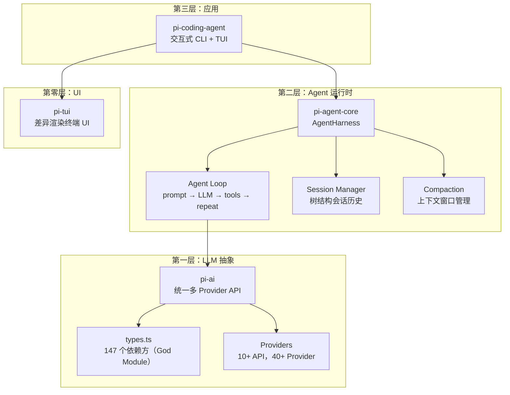
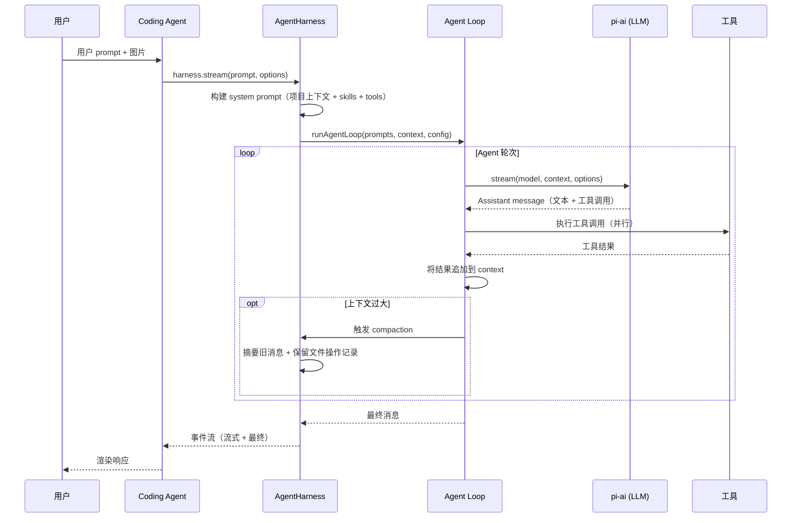

# Pi Agent Harness — 工程研究报告

> **仓库**: [pi-monorepo](https://github.com/earendil-works/pi-mono) (v0.0.3)
> **分析日期**: 2026-07-24
> **分析师**: AI Agent（research-repo skill）
> **置信度**: 高（5080 commits，287 contributors，940 源文件，337 测试文件）

---

## 1. 执行摘要

Pi 是一个开源**AI 编码代理平台**——Claude Code 和 Cursor 的直接替代品。与大多数编码助手不同，Pi 被设计为一个 **harness**（运行时 + 框架）而非单一应用：它以 4 包 monorepo 形式发布，编码代理只是可复用 agent 运行时和多 Provider LLM API 的一个消费者。

**最有趣的架构决策**：Pi 将 agent 视为**自扩展 harness**。Extension 是 TypeScript 模块，可在运行时注册工具、命令、快捷键、UI 组件甚至自动补全 provider——全部无需重新编译。这使得 Pi 更像"Agent 操作系统"，编码只是其中一项技能。

**谁应该研究此项目**：构建多 Provider LLM 应用的工程师、Agent 运行时设计者、以及对上下文工程感兴趣的人（Pi 的 compaction 系统是开源 Agent 中最复杂的之一）。

---

## 2. 架构概览

### 2.1 三层 Monorepo



### 2.2 包依赖方向

依赖方向严格**自顶向下**：`coding-agent → agent → ai → (外部)`。稳定层中不存在向上导入。检测到的 20 个 import 循环（简报 §2）全部流经 `compat.ts`——一个显式标记为临时的向后兼容层，在代码库迁移到新 `createModels()` 模式期间重新导出旧 API 接口。

**为什么这样设计**（高置信度）：将 agent 运行时与 LLM API 和应用层分离，允许各层独立演进。`agent` 包可复用于编码之外的任何工具调用 Agent；`ai` 包可复用于 Agent 之外的任何多 Provider LLM 客户端。

### 2.3 God Module 问题

`packages/ai/src/types.ts` 的**入度 147**、**PageRank 0.0982**——整个代码库中被依赖最多的模块（简报 §2）。它定义了核心类型代数：`Api`、`Provider`、`Model`、`Context`、`AssistantMessage`、`StreamOptions` 等。

这是一个 **God Module**——147 个模块导入它，使其成为架构瓶颈。对 `types.ts` 的任何改动都会触发代码库 15% 的级联类型检查。`compat.ts`（入度 120）雪上加霜，重新导出 `types.ts` 的全部内容加上 10 个 lazy API wrapper，产生如下循环：

```
compat → anthropic-messages.lazy → types → anthropic-messages → coding-agent.sdk → compat
```

**原因**（中置信度）：`compat.ts` 头部明确声明它"将随 coding-agent ModelManager 迁移一起删除"。团队正在从静态目录 API（`getModel`/`getModels`）迁移到动态 `createModels()` 工厂模式，兼容层是过渡桥梁。

### 2.4 执行流程



---

## 3. AI/Agent 设计

### 3.1 Agent Harness——核心抽象

`AgentHarness` 类（`packages/agent/src/harness/agent-harness.ts`）是 Pi 的心脏。它封装了 agent loop，提供：

- **会话管理** — 树结构会话历史（非线性的），支持分支、compaction 和分支摘要
- **工具注册表** — 工具以 `AgentTool` 注册，使用 TypeBox schema 进行参数校验
- **Prompt 模板** — 可复用的 prompt 模板，支持变量插值
- **Skills** — 可加载的 skill 模块，扩展 agent 能力
- **Compaction** — 当对话超出 token 限制时自动管理上下文窗口

**设计原型**（简报 §3）：**Prompt 重度设计**（检测到 66 prompts vs 3 tools）。但这个指标有误导性——Pi 的工具以 TypeScript 函数 + TypeBox schema 定义，而非装饰器。检测到的"3 tools"只是 `index.ts` 的 barrel exports。实际工具数量远高于此：`bash`、`edit`、`read`、`write`、`grep`、`find`、`ls` 都是 `packages/coding-agent/src/core/tools/` 中的一等工具。

### 3.2 上下文工程——Compaction 系统

Pi 最精妙的 AI 设计模式是**上下文 compaction 系统**（`packages/agent/src/harness/compaction/`）。当上下文窗口填满时：

1. **序列化**对话为文本
2. **提取文件操作**（读取的文件、修改的文件）——这些在 compaction 后保留
3. **使用专用 LLM 调用生成结构化摘要**，使用 `SUMMARIZATION_SYSTEM_PROMPT` 和 `SUMMARIZATION_PROMPT`
4. **在会话树中创建 compaction entry**，存储摘要 + 文件操作详情
5. **用 compaction 摘要替换旧消息**

此外，**分支摘要**（`branch-summarization.ts`）为会话分支生成摘要，允许 agent 之后返回该分支时保留上下文。

**为何重要**（高置信度）：这是开源 Agent 中最先进的上下文工程模式之一。大多数 Agent 要么截断，要么使用简单的滑动窗口。Pi 的方式：
- 保留文件操作历史（agent 知道它已读/改过哪些文件）
- 使用结构化摘要（不仅是文本截断）
- 支持分支（agent 可以探索替代路径而不丢失上下文）

### 3.3 多 Provider 抽象

`packages/ai` 层支持 **10 种 API 协议**和 **40+ Provider**（简报 §2，`types.ts`）：

- API: OpenAI Completions、OpenAI Responses、Anthropic Messages、Google Generative AI、Bedrock、Mistral、Azure OpenAI、Google Vertex、OpenAI Codex、Pi Messages
- Provider 包括中国生态：`zai-coding-cn`、`moonshotai-cn`、`qwen-token-plan-cn`、`xiaomi-token-plan-cn`

**Lazy Loading 模式**是关键：每个 API 有 `.lazy.ts` wrapper（如 `anthropic-messages.lazy.ts`），延迟模块加载到首次使用。这保持 bundle 小巧——只使用 Anthropic 的编码 agent 不会加载 Google/Bedrock/Mistral 代码。

### 3.4 自扩展——Extension 系统

Extension（`packages/coding-agent/src/core/extensions/types.ts`）是 TypeScript 模块，可以：

- 订阅 **agent 生命周期事件**（工具执行、消息流、compaction）
- 注册 **LLM 可调用工具**（extension 可以添加 agent 能调用的工具）
- 注册 **命令、快捷键和 CLI 标志**
- 通过 **UI 原语**与用户交互（对话框、widget、overlay、自动补全、状态栏）
- 提供 **自定义 compaction hook** 和 **model provider**

`packages/coding-agent/examples/extensions/` 中的示例展示了：
- `custom-provider-anthropic` — 添加新 LLM provider
- `custom-provider-gitlab-duo` — 添加 GitLab Duo 作为 provider
- `doom-overlay` — Doom 风格 UI overlay
- `plan-mode` — 规划模式 extension
- `subagent` — 子 Agent 编排
- `dynamic-tools` — 动态注册工具
- `gondolin` — 容器化工具执行

### 3.5 System Prompt 动态组装

System prompt（`packages/coding-agent/src/core/system-prompt.ts`）从多个来源动态组装：
- **默认或自定义 prompt** — 基础 system prompt，含工具描述
- **项目上下文文件** — 从工作目录加载（如 AGENTS.md）
- **Skills** — 加载的 skill 模块，格式化到 prompt 中
- **Tool snippet** — 可用工具的单行描述
- **Prompt guideline** — 额外的行为规则

这是**动态 prompt 组装**模式——system prompt 不是静态的，而是在运行时从多个来源构建，适应项目上下文和可用工具。

---

## 4. 工程权衡

### 4.1 Monorepo 锁步版本

**选择**：4 个包共享单一版本号，每次发布一起升级。
**替代方案**：每包独立版本（标准 npm workspace 实践）。
**为何如此选择**（中置信度）：包间耦合紧密——`coding-agent` 导入 `agent`，`agent` 导入 `ai`。独立版本会产生兼容矩阵复杂度。锁步将发布流程简化为单条 `npm run release:patch` 命令。
**代价**：无法只发布 `pi-ai` 的 bugfix 而不升级 `pi-coding-agent` 和 `pi-tui`。

### 4.2 兼容层 (compat.ts)

**选择**：维护临时 `compat.ts`，在迁移到新模式期间重新导出旧 API 接口。
**替代方案**：一次性迁移所有消费者。
**为何如此选择**（高置信度，来自 `compat.ts` 头部）：从静态目录（`getModel`/`getModels`）到动态工厂（`createModels()`）的迁移涉及整个代码库。兼容层允许增量迁移——消费者将 import 从 `@earendil-works/pi-ai` 改为 `@earendil-works/pi-ai/compat` 即可。
**代价**：20 个 import 循环流经 `compat.ts`，产生架构债务。头部明确声明它"将随 coding-agent ModelManager 迁移一起删除"。

### 4.3 无内置权限系统

**选择**：Pi 不限制文件系统、进程、网络或凭证访问，以用户权限运行。
**替代方案**：内置沙箱/权限提示（如 Claude Code 的工具审批）。
**为何如此选择**（高置信度，来自 README）：团队将沙箱委托给外部工具——Docker、Gondolin（micro-VM）、OpenShell。这保持核心 agent 简单，避免"权限疲劳"问题。
**代价**：用户必须理解安全影响。README 明确警告并提供三种容器化方案。

### 4.4 TypeScript 仅可擦除语法

**选择**：不允许 parameter property、`enum`、`namespace`、`import =`、`export =`。
**替代方案**：完整 TypeScript 带编译输出。
**为何如此选择**（高置信度，来自 AGENTS.md）：Node.js "strip-only mode"——TypeScript 类型被擦除而非转换。这实现更快启动（无编译步骤）和更简单工具链。
**代价**：某些 TypeScript 模式不可用。构造函数必须使用显式字段声明加赋值。

### 4.5 供应链加固

**选择**：直接依赖固定到精确版本；`min-release-age=2` 防止同日依赖发布；coding-agent 包使用 npm-shrinkwrap。
**替代方案**：标准 semver 范围。
**为何如此选择**（高置信度，来自 README 和 package.json）：npm 供应链攻击是真实威胁。固定精确版本 + 最小发布年龄给团队审查依赖变更的时间。
**代价**：依赖更新更多手动工作。pre-commit hook 阻止 lockfile 提交，除非设置 `PI_ALLOW_LOCKFILE_CHANGE=1`。

---

## 5. 可复用模式

### 5.1 值得借鉴

1. **Lazy API Loading**（`packages/ai/src/api/*.lazy.ts`）：每个 LLM API 实现包装在 lazy 模块中，延迟加载到首次使用。当只使用一个 Provider 时保持 bundle 小巧。适用于任何多 Provider 系统。

2. **带文件操作保留的上下文 Compaction**（`packages/agent/src/harness/compaction/compaction.ts`）：compaction 时提取并保留文件读/改操作。确保 agent 不会重新读取已看过的文件。`CompactionDetails` 接口在 compaction 边界存储 `readFiles[]` 和 `modifiedFiles[]`。

3. **Session 即树**（`packages/agent/src/harness/session/session.ts`）：会话是树结构而非线性。每个 entry 是 `SessionTreeEntry`（message、compaction、branch summary 或自定义）。`defaultContextEntryTransform` 函数将树投影为线性消息列表供 LLM 消费。支持分支探索而不丢失上下文。

4. **Extension 事件总线**（`packages/coding-agent/src/core/event-bus.ts`）：Extension 通过类型化事件总线订阅生命周期事件。将 extension 与核心 agent loop 解耦。

5. **Faux Provider 测试**（来自 AGENTS.md）：测试使用 "faux provider" 模拟 LLM 响应，无需 API 调用或付费 token。`packages/coding-agent/test/suite/` 使用 `test/suite/harness.ts` + faux provider。实现确定性、免费的 Agent 行为测试。

6. **动态 System Prompt 组装**（`packages/coding-agent/src/core/system-prompt.ts`）：System prompt 从多个来源组装（基础 prompt、项目上下文文件、skills、tool snippet、guideline）。每个组件独立可配置。

### 5.2 应避免的模式

1. **God Module**（`packages/ai/src/types.ts`）：147 个依赖方太多。类型代数应按关注点拆分——API 类型、Provider 类型、消息类型、流式类型——为独立模块。降低类型变更的爆炸半径。

2. **兼容层 Re-export 循环**（`packages/ai/src/compat.ts`）：`export * from` 模式产生传递循环。迁移完成后应完全删除此模块。在此之前，循环使依赖分析不可靠。

3. **高耦合密度**（简报 §5）：edge/node ratio 2.65 偏高。20 个 import 循环表明模块边界与依赖方向不一致。coding-agent 包尤其需要更好的边界约束。

---

## 6. 测试与评估

### 6.1 测试策略

**覆盖率**：337 测试文件，4359 测试函数（简报 §4）。test/source ratio 0.36 充足——高于典型 0.15 阈值。

**检测到的测试模式**（简报 §4）：e2e、replay、corpus、regression。表明成熟的测试策略：
- **e2e**：端到端 Agent 行为测试
- **replay**：重放录制对话进行确定性测试
- **corpus**：基于语料库的多输入测试
- **regression**：Issue 驱动的回归测试（AGENTS.md 指定 `packages/coding-agent/test/suite/regressions/`）

**关键测试洞察**（来自 AGENTS.md）：完整测试套件包含 e2e 测试，"当 endpoint/auth 环境变量存在时激活"。团队使用 `./test.sh` 运行非 e2e 测试。防止开发期间意外 API 调用。

### 6.2 测试分布

Top 5 测试模块（简报 §4）：
1. `editor`（200 tests）— TUI 编辑器组件
2. `stream`（183 tests）— LLM 流式
3. `package-manager`（138 tests）— 包管理
4. `tools`（112 tests）— Agent 工具
5. `prompt-templates`（106 tests）— Prompt 模板系统

对 `stream` 和 `tools` 的测试强调是恰当的——这些是最高风险组件（网络 I/O 和副作用操作）。

### 6.3 评估基础设施

**评估**：已检测到（简报 §4）。1 个 eval 文件：`scripts/profile-coding-agent-node.mjs`。指标：metric、score、f1。模式：evaluation、metric、benchmark、eval、score、dataset。

**评估**（中置信度）：对于这种规模的项目，评估基础设施显得不足。`profile-coding-agent-node.mjs` 脚本更像性能分析工具而非基准测试。f1 指标暗示有分类评估，但规模有限。这是一个缺口——如此成熟度的编码 Agent 应有自动化质量基准。

### 6.4 缺口

1. **未检测到变异测试** — 考虑到 compaction 系统的复杂性，变异测试可捕获微妙逻辑错误。
2. **评估有限** — 940 源文件仅 1 个 eval 文件。项目会受益于自动化编码任务基准。
3. **TUI 无视觉回归测试** — `editor` 模块有 200 个测试，但 TUI 渲染在没有视觉回归的情况下极难测试。

---

## 7. 学习清单

### Top 10 值得学习的概念

| # | 概念 | 位置 | 原因 |
|---|------|------|------|
| 1 | **带文件操作保留的上下文 Compaction** | `packages/agent/src/harness/compaction/compaction.ts` | 高级上下文工程——agent 在 compaction 边界记住操作过的文件 |
| 2 | **Session 即树（非线性）** | `packages/agent/src/harness/session/session.ts` | 分支会话支持探索而不丢失上下文 |
| 3 | **Lazy API Loading 模式** | `packages/ai/src/api/*.lazy.ts` | 保持多 Provider bundle 小巧 |
| 4 | **Extension 系统架构** | `packages/coding-agent/src/core/extensions/types.ts` | 自扩展 Agent 设计——extension 注册工具、命令、UI |
| 5 | **动态 System Prompt 组装** | `packages/coding-agent/src/core/system-prompt.ts` | 从项目上下文 + skills + tools 组装 system prompt |
| 6 | **Agent Loop + EventStream** | `packages/agent/src/agent-loop.ts` | 清晰分离 loop 逻辑与 LLM 调用 |
| 7 | **Faux Provider 测试** | `packages/coding-agent/test/suite/harness.ts` | 无 API 成本的确定性 Agent 测试 |
| 8 | **分支摘要** | `packages/agent/src/harness/compaction/branch-summarization.ts` | 为会话分支生成摘要供后续返回 |
| 9 | **供应链加固** | `package.json` + `scripts/check-pinned-deps.mjs` | 生产级 npm 安全实践 |
| 10 | **锁步版本管理** | `scripts/release.mjs` | 简化的 Monorepo 发布流程 |

### Top 10 值得阅读的文件

| # | 文件 | 洞察密度 |
|---|------|----------|
| 1 | `packages/agent/src/harness/agent-harness.ts` | 核心 agent 生命周期、工具管理、compaction 触发 |
| 2 | `packages/agent/src/harness/compaction/compaction.ts` | 带文件操作保留的上下文 compaction |
| 3 | `packages/agent/src/agent-loop.ts` | Agent loop：prompt → LLM → tools → repeat |
| 4 | `packages/ai/src/types.ts` | 核心类型代数（147 个依赖方——理解原因） |
| 5 | `packages/coding-agent/src/core/extensions/types.ts` | Extension 系统契约 |
| 6 | `packages/coding-agent/src/core/system-prompt.ts` | 动态 system prompt 组装 |
| 7 | `packages/agent/src/harness/session/session.ts` | 树结构会话管理 |
| 8 | `packages/ai/src/compat.ts` | 兼容层模式（及其循环代价） |
| 9 | `packages/coding-agent/src/core/tools/edit-diff.ts` | 代码编辑的模糊匹配 + diff 生成 |
| 10 | `packages/agent/src/harness/compaction/branch-summarization.ts` | 分支摘要生成 |

### Top 5 值得研究的测试

| # | 测试领域 | 位置 | 原因 |
|---|---------|------|------|
| 1 | Stream 测试 | 简报 §4：183 tests | LLM 流式边缘情况 |
| 2 | 工具测试 | 简报 §4：112 tests | 工具执行模式 |
| 3 | Prompt 模板测试 | 简报 §4：106 tests | Prompt 组装验证 |
| 4 | 回归测试 | `packages/coding-agent/test/suite/regressions/` | Issue 驱动测试模式 |
| 5 | E2E 测试 | `packages/coding-agent/test/suite/`（faux provider） | 无 API 成本的 Agent 行为测试 |

---

## 8. 待解决问题

| # | 问题 | 置信度 | 证据缺口 |
|---|------|--------|---------|
| 1 | Extension loader 如何在运行时发现和加载 extension？ | 低 | Extension loader 代码未深入分析 |
| 2 | Compaction 的 token 预算策略是什么（何时触发，保留多少）？ | 中 | `DEFAULT_COMPACTION_SETTINGS` 的触发条件未完全分析 |
| 3 | `pi-messages` API 与其他 Provider API 有何不同？ | 低 | 未分析 |
| 4 | 从 `compat.ts` 到新 `createModels()` 模式的迁移计划是什么？ | 低 | 仅分析了头部注释 |
| 5 | Extension 是否有沙箱（如果有）？ | 中 | 未检测到沙箱；extension 在进程内运行 |

---

## 附录：证据引用

- **简报 §1**：Executive Brief — 仓库元数据、项目阶段、生态
- **简报 §2**：Architecture Insights — 模块、边、循环、中心性
- **简报 §3**：AI/Agent Design — prompts、tools、设计原型
- **简报 §4**：Testing & Evaluation — 测试文件、模式、eval 文件
- **简报 §5**：Engineering Metrics — 推导指标、耦合密度
- **简报 §6**：Reading Priority — 按结构重要性排序的 Top 20 文件
- **简报 §7**：Research Plan — 假设和开放问题
- **源码**：README.md、package.json、AGENTS.md、`packages/` 下的源文件

### 增量分析说明

本报告基于增量分析生成：
- 首次全量分析：`all` 命令，940 源文件，commit `24bace27`
- 增量更新：`update` 命令，52 文件变更（从 `24900814` 到 `24bace27`），仅重新分析变更文件并合并
- `_meta.incremental: true`，`changedFilesCount: 52`
