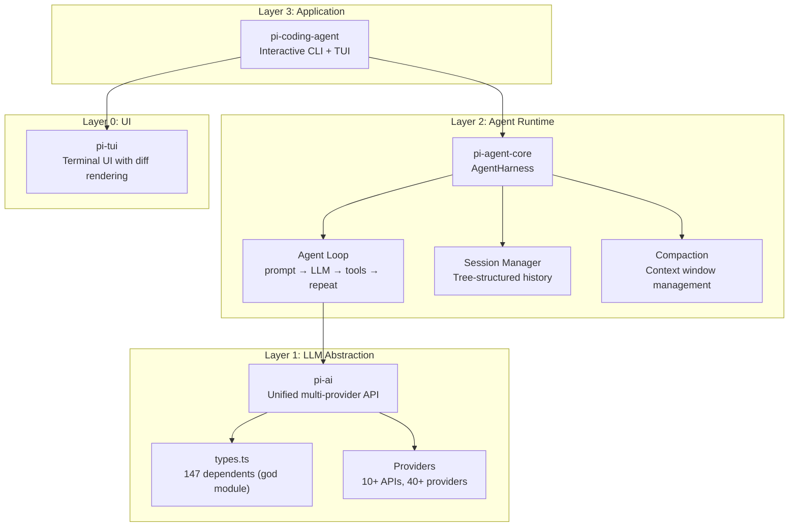
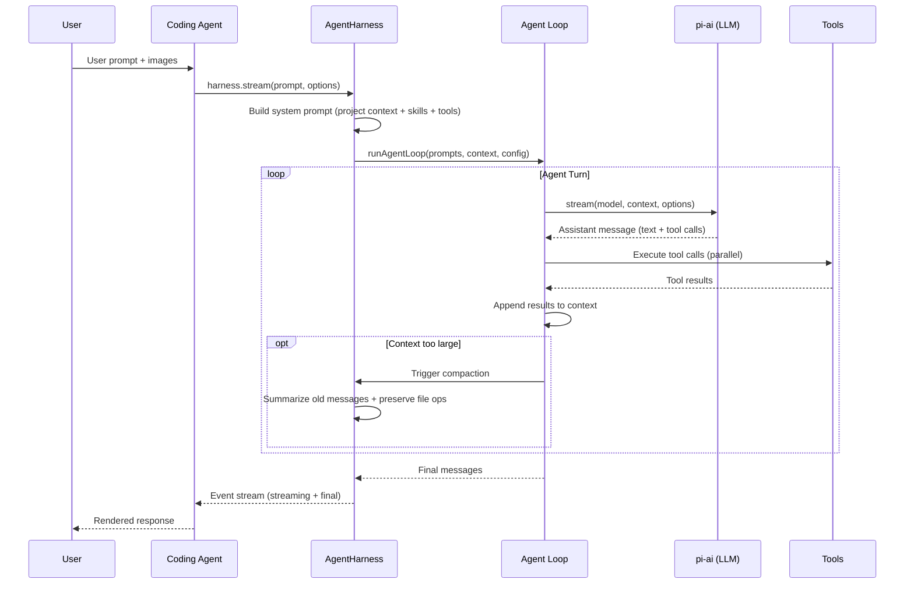

# Pi Agent Harness — Engineering Research Report

> **Repository**: [pi-monorepo](https://github.com/earendil-works/pi-mono) (v0.0.3)
> **Analysis date**: 2026-07-24
> **Analyst**: AI Agent (research-repo skill)
> **Confidence**: High (5080 commits, 287 contributors, 940 source files, 337 test files)

---

## 1. Executive Summary

Pi is an open-source **AI coding agent platform** — a direct alternative to Claude Code and Cursor. Unlike most coding assistants, Pi is designed as a **harness** (runtime + framework) rather than a single application: it ships as a 4-package monorepo where the coding agent is merely one consumer of a reusable agent runtime and multi-provider LLM API.

**The most interesting architectural decision**: Pi treats its agent as a **self-extensible harness**. Extensions are TypeScript modules that can register tools, commands, keybindings, UI overlays, and even autocomplete providers — all at runtime, without recompilation. This makes Pi less of a "coding assistant" and more of an "agent operating system" where coding is one skill among many.

**Who should study this**: Engineers building multi-provider LLM applications, agent runtime designers, and anyone interested in context engineering (Pi's compaction system is among the most sophisticated in open-source agents).

---

## 2. Architecture Overview

### 2.1 Three-Layer Monorepo



### 2.2 Package Dependency Direction

The dependency direction is strictly **top-down**: `coding-agent → agent → ai → (external)`. No upward imports exist in the stable layer. The 20 import cycles detected (Brief §2) all flow through `compat.ts` — an explicitly temporary backward-compatibility layer that re-exports the old API surface while the codebase migrates to the new `createModels()` pattern.

**Why this design** (High confidence): Separating the agent runtime from the LLM API and the application layer allows each to evolve independently. The `agent` package is reusable beyond coding — it could power any tool-calling agent. The `ai` package is reusable beyond agents — it's a general multi-provider LLM client.

### 2.3 The God Module Problem

`packages/ai/src/types.ts` has **in-degree 147** and **PageRank 0.0982** — the single most depended-upon module in the entire codebase (Brief §2). It defines the core type algebra: `Api`, `Provider`, `Model`, `Context`, `AssistantMessage`, `StreamOptions`, etc.

This is a **god module** — 147 modules import it, making it an architectural bottleneck. Any change to `types.ts` triggers cascading type-checking across 15% of the codebase. The `compat.ts` module (in-degree 120) compounds this by re-exporting everything from `types.ts` plus 10 lazy API wrappers, creating cycles like:

```
compat → anthropic-messages.lazy → types → anthropic-messages → coding-agent.sdk → compat
```

**Why this happened** (Medium confidence): The `compat.ts` header explicitly states it is "deleted with the coding-agent ModelManager migration." The team is mid-migration from a static catalog API (`getModel`/`getModels`) to a dynamic `createModels()` factory pattern, and the compatibility layer is bridging the transition.

### 2.4 Execution Flow



---

## 3. AI/Agent Design

### 3.1 Agent Harness — The Core Abstraction

The `AgentHarness` class (`packages/agent/src/harness/agent-harness.ts`) is the heart of Pi. It wraps the agent loop with:

- **Session management** — Tree-structured conversation history (not linear), supporting branching, compaction, and branch summaries
- **Tool registry** — Tools registered as `AgentTool` with TypeBox schemas for argument validation
- **Prompt templates** — Reusable prompt templates with variable interpolation
- **Skills** — Loadable skill modules that extend agent capabilities
- **Compaction** — Automatic context window management when the conversation exceeds token limits

**Design archetype** (Brief §3): **Prompt-heavy design** (66 prompts vs 3 tools detected). However, this metric is misleading — Pi's tools are defined as TypeScript functions with TypeBox schemas, not via decorators. The "3 tools" detected are just `index.ts` barrel exports. The actual tool count is much higher: `bash`, `edit`, `read`, `write`, `grep`, `find`, `ls` are all first-class tools in `packages/coding-agent/src/core/tools/`.

### 3.2 Context Engineering — The Compaction System

Pi's most sophisticated AI design pattern is its **context compaction system** (`packages/agent/src/harness/compaction/`). When the context window fills:

1. **Serialize** the conversation to text
2. **Extract file operations** (read files, modified files) from message history — these are preserved across compaction
3. **Generate a structured summary** using a dedicated LLM call with `SUMMARIZATION_SYSTEM_PROMPT` and `SUMMARIZATION_PROMPT`
4. **Create a compaction entry** in the session tree, storing the summary + file operation details
5. **Replace old messages** with the compaction summary in the active context

Additionally, **branch summarization** (`branch-summarization.ts`) generates summaries for conversation branches, allowing the agent to return to a branch later with context preserved.

**Why this matters** (High confidence): This is one of the most advanced context engineering patterns in open-source agents. Most agents either truncate or use naive sliding windows. Pi's approach:
- Preserves file operation history (the agent knows which files it has read/modified)
- Uses structured summaries (not just text truncation)
- Supports branching (the agent can explore alternative paths without losing context)

### 3.3 Multi-Provider Abstraction

The `packages/ai` layer supports **10 API protocols** and **40+ providers** (Brief §2, `types.ts`):

- APIs: OpenAI Completions, OpenAI Responses, Anthropic Messages, Google Generative AI, Bedrock, Mistral, Azure OpenAI, Google Vertex, OpenAI Codex, Pi Messages
- Providers include Chinese ecosystem: `zai-coding-cn`, `moonshotai-cn`, `qwen-token-plan-cn`, `xiaomi-token-plan-cn`

The **lazy loading pattern** is key: each API has a `.lazy.ts` wrapper (e.g., `anthropic-messages.lazy.ts`) that defers module loading until first use. This keeps the bundle small — a coding agent using only Anthropic doesn't load the Google/Bedrock/Mistral code.

### 3.4 Self-Extensibility — The Extension System

Extensions (`packages/coding-agent/src/core/extensions/types.ts`) are TypeScript modules that can:

- Subscribe to **agent lifecycle events** (tool execution, message streaming, compaction)
- Register **LLM-callable tools** (extensions can add new tools the agent can call)
- Register **commands, keyboard shortcuts, and CLI flags**
- Interact with the user via **UI primitives** (dialogs, widgets, overlays, autocomplete, status bar)
- Provide **custom compaction hooks** and **model providers**

This makes Pi a **self-extensible agent platform** — not just a coding assistant. The extension examples in `packages/coding-agent/examples/extensions/` demonstrate:
- `custom-provider-anthropic` — Adding a new LLM provider
- `custom-provider-gitlab-duo` — Adding GitLab Duo as a provider
- `doom-overlay` — A Doom-style UI overlay
- `plan-mode` — A planning mode extension
- `subagent` — Sub-agent orchestration
- `dynamic-tools` — Dynamically registering tools
- `gondolin` — Containerized tool execution

### 3.5 System Prompt Construction

The system prompt (`packages/coding-agent/src/core/system-prompt.ts`) is dynamically assembled from:
- **Default or custom prompt** — The base system prompt with tool descriptions
- **Project context files** — Loaded from the working directory (e.g., AGENTS.md)
- **Skills** — Loaded skill modules, formatted into the prompt
- **Tool snippets** — One-line descriptions of available tools
- **Prompt guidelines** — Additional behavioral rules

This is a **dynamic prompt assembly** pattern — the system prompt is not static but constructed from multiple sources at runtime, adapting to the project context and available tools.

---

## 4. Engineering Tradeoffs

### 4.1 Monorepo with Lockstep Versioning

**Choice**: All 4 packages share a single version number. Every release bumps all packages together.
**Alternative**: Independent versioning per package (standard npm workspace practice).
**Why this choice** (Medium confidence): The packages are tightly coupled — `coding-agent` imports from `agent` which imports from `ai`. Independent versioning would create compatibility matrix complexity. Lockstep simplifies the release process to a single `npm run release:patch` command.
**Cost**: Cannot release a bugfix in `pi-ai` without bumping `pi-coding-agent` and `pi-tui`, even if they're unchanged.

### 4.2 Compatibility Layer (compat.ts)

**Choice**: Maintain a temporary `compat.ts` that re-exports the old API surface while migrating to the new pattern.
**Alternative**: Big-bang migration of all consumers.
**Why this choice** (High confidence, from `compat.ts` header): The migration from static catalog (`getModel`/`getModels`) to dynamic factory (`createModels()`) touches the entire codebase. The compat layer allows incremental migration — consumers switch imports from `@earendil-works/pi-ai` to `@earendil-works/pi-ai/compat` unchanged.
**Cost**: 20 import cycles flow through `compat.ts`, creating architectural debt. The header explicitly states it will be "deleted with the coding-agent ModelManager migration."

### 4.3 No Built-In Permission System

**Choice**: Pi does not restrict filesystem, process, network, or credential access. It runs with the user's permissions.
**Alternative**: Built-in sandboxing/permission prompts (like Claude Code's tool approval).
**Why this choice** (High confidence, from README): The team delegates sandboxing to external tools — Docker, Gondolin (micro-VM), OpenShell. This keeps the core agent simple and avoids the "permission fatigue" problem.
**Cost**: Users must understand the security implications. The README explicitly warns about this and provides three containerization patterns.

### 4.4 TypeScript Erasable Syntax Only

**Choice**: No parameter properties, `enum`, `namespace`, `import =`, `export =` in code checked by the root config.
**Alternative**: Full TypeScript with emit.
**Why this choice** (High confidence, from AGENTS.md): Node.js "strip-only mode" — TypeScript types are erased without transformation. This enables faster startup (no compilation step) and simpler tooling.
**Cost**: Some TypeScript patterns are unavailable. Constructors must use explicit field declarations with assignments.

### 4.5 Supply-Chain Hardening

**Choice**: Direct dependencies pinned to exact versions; `min-release-age=2` prevents same-day dependency releases; npm-shrinkwrap for the coding-agent package.
**Alternative**: Standard semver ranges.
**Why this choice** (High confidence, from README and package.json): Supply-chain attacks via npm are a real threat. Pinning exact versions + minimum release age gives the team time to review dependency changes.
**Cost**: More manual work for dependency updates. The pre-commit hook blocks lockfile commits unless `PI_ALLOW_LOCKFILE_CHANGE=1` is set.

---

## 5. Reusable Patterns

### 5.1 Worth Copying

1. **Lazy API Loading** (`packages/ai/src/api/*.lazy.ts`): Each LLM API implementation is wrapped in a lazy module that defers loading until first use. This keeps the bundle small when only one provider is used. Applicable to any multi-provider system.

2. **Context Compaction with File Operation Preservation** (`packages/agent/src/harness/compaction/compaction.ts`): When compacting context, the system extracts and preserves file read/modified operations. This ensures the agent doesn't re-read files it has already seen. The `CompactionDetails` interface stores `readFiles[]` and `modifiedFiles[]` across compaction boundaries.

3. **Session as Tree** (`packages/agent/src/harness/session/session.ts`): Conversations are tree-structured, not linear. Each entry is a `SessionTreeEntry` (message, compaction, branch summary, or custom). The `defaultContextEntryTransform` function projects the tree into a linear message list for LLM consumption. This enables branching exploration without losing context.

4. **Extension Event Bus** (`packages/coding-agent/src/core/event-bus.ts`): Extensions subscribe to lifecycle events via a typed event bus. This decouples extensions from the core agent loop.

5. **Faux Provider for Testing** (from AGENTS.md): Tests use a "faux provider" that mimics LLM responses without API calls or paid tokens. The test suite in `packages/coding-agent/test/suite/` uses `test/suite/harness.ts` + faux provider. This enables deterministic, free testing of agent behavior.

6. **Dynamic System Prompt Assembly** (`packages/coding-agent/src/core/system-prompt.ts`): The system prompt is assembled from multiple sources (base prompt, project context files, skills, tool snippets, guidelines). Each component is independently configurable.

### 5.2 Patterns to Avoid

1. **God Module** (`packages/ai/src/types.ts`): 147 dependents is too many. The type algebra should be split by concern — API types, provider types, message types, streaming types — into separate modules. This would reduce the blast radius of type changes.

2. **Compatibility Re-export Cycles** (`packages/ai/src/compat.ts`): The `export * from` pattern creates transitive cycles. When the migration is complete, this module should be deleted entirely. Until then, the cycles make dependency analysis unreliable.

3. **High Coupling Density** (Brief §5): Edge/node ratio of 2.65 is high. The 20 import cycles suggest that module boundaries are not aligned with dependency directions. The coding-agent package especially needs better boundary enforcement.

---

## 6. Testing & Evaluation

### 6.1 Test Strategy

**Coverage**: 337 test files, 4359 test functions (Brief §4). Test/source ratio of 0.36 is adequate — above the typical 0.15 threshold.

**Test patterns detected** (Brief §4): e2e, replay, corpus, regression. This indicates a mature testing strategy:
- **e2e**: End-to-end agent behavior tests
- **replay**: Replay recorded conversations for deterministic testing
- **corpus**: Corpus-based testing with multiple inputs
- **regression**: Issue-specific regression tests (AGENTS.md specifies `packages/coding-agent/test/suite/regressions/`)

**Key test insight** (from AGENTS.md): The full test suite includes e2e tests that "activate when endpoint/auth env vars are present." The team uses `./test.sh` for non-e2e tests and specific test files for targeted testing. This prevents accidental API calls during development.

### 6.2 Test Distribution

Top 5 tested modules (Brief §4):
1. `editor` (200 tests) — TUI editor component
2. `stream` (183 tests) — LLM streaming
3. `package-manager` (138 tests) — Package management
4. `tools` (112 tests) — Agent tools
5. `prompt-templates` (106 tests) — Prompt template system

The testing emphasis on `stream` and `tools` is appropriate — these are the highest-risk components (network I/O and side-effectful operations).

### 6.3 Evaluation Infrastructure

**Evaluation**: Detected (Brief §4). One eval file: `scripts/profile-coding-agent-node.mjs`. Metrics: metric, score, f1. Patterns: evaluation, metric, benchmark, eval, score, dataset.

**Assessment** (Medium confidence): The evaluation infrastructure appears minimal for a project of this scale. The `profile-coding-agent-node.mjs` script is more of a profiling tool than a benchmark. The f1 metric suggests some classification evaluation, but the scale is limited. This is a gap — a coding agent of this maturity should have automated quality benchmarks.

### 6.4 Gaps

1. **No mutation testing** detected — given the complexity of the compaction system, mutation testing would catch subtle logic errors.
2. **Limited evaluation** — only 1 eval file for 940 source files. The project would benefit from automated coding task benchmarks.
3. **No visual regression testing** for the TUI — the `editor` module has 200 tests, but TUI rendering is notoriously hard to test without visual regression.

---

## 7. Learning Checklist

### Top 10 Concepts Worth Learning

| # | Concept | Where | Why |
|---|---------|-------|-----|
| 1 | **Context compaction with file op preservation** | `packages/agent/src/harness/compaction/compaction.ts` | Advanced context engineering — the agent remembers which files it has operated on across compaction boundaries |
| 2 | **Session as tree (not linear)** | `packages/agent/src/harness/session/session.ts` | Branching conversations enable exploration without context loss |
| 3 | **Lazy API loading pattern** | `packages/ai/src/api/*.lazy.ts` | Keep multi-provider bundles small |
| 4 | **Extension system architecture** | `packages/coding-agent/src/core/extensions/types.ts` | Self-extensible agent design — extensions register tools, commands, UI |
| 5 | **Dynamic system prompt assembly** | `packages/coding-agent/src/core/system-prompt.ts` | Compose system prompt from project context + skills + tools |
| 6 | **Agent loop with EventStream** | `packages/agent/src/agent-loop.ts` | Clean separation of loop logic from LLM calls |
| 7 | **Faux provider testing** | `packages/coding-agent/test/suite/harness.ts` | Deterministic agent testing without API costs |
| 8 | **Branch summarization** | `packages/agent/src/harness/compaction/branch-summarization.ts` | Summarize conversation branches for later return |
| 9 | **Supply-chain hardening** | `package.json` + `scripts/check-pinned-deps.mjs` | Production-grade npm security practices |
| 10 | **Lockstep versioning** | `scripts/release.mjs` | Simplified monorepo release process |

### Top 10 Files to Read

| # | File | Insight Density |
|---|------|-----------------|
| 1 | `packages/agent/src/harness/agent-harness.ts` | Core agent lifecycle, tool management, compaction triggers |
| 2 | `packages/agent/src/harness/compaction/compaction.ts` | Context compaction with file op preservation |
| 3 | `packages/agent/src/agent-loop.ts` | Agent loop: prompt → LLM → tools → repeat |
| 4 | `packages/ai/src/types.ts` | Core type algebra (147 dependents — understand why) |
| 5 | `packages/coding-agent/src/core/extensions/types.ts` | Extension system contract |
| 6 | `packages/coding-agent/src/core/system-prompt.ts` | Dynamic system prompt assembly |
| 7 | `packages/agent/src/harness/session/session.ts` | Tree-structured session management |
| 8 | `packages/ai/src/compat.ts` | Compatibility layer pattern (and its cycle cost) |
| 9 | `packages/coding-agent/src/core/tools/edit-diff.ts` | Fuzzy matching + diff generation for code editing |
| 10 | `packages/agent/src/harness/compaction/branch-summarization.ts` | Branch summary generation |

### Top Tests to Study

| # | Test Area | Location | Why |
|---|-----------|----------|-----|
| 1 | Stream tests | (Brief §4: 183 tests) | LLM streaming edge cases |
| 2 | Tool tests | (Brief §4: 112 tests) | Tool execution patterns |
| 3 | Prompt template tests | (Brief §4: 106 tests) | Prompt assembly validation |
| 4 | Regression tests | `packages/coding-agent/test/suite/regressions/` | Issue-driven test patterns |
| 5 | E2E tests | `packages/coding-agent/test/suite/` (with faux provider) | Agent behavior testing without API costs |

---

## 8. Open Questions

| # | Question | Confidence | Evidence Gap |
|---|----------|-----------|--------------|
| 1 | How does the extension loader discover and load extensions at runtime? | Low | Extension loader code not deeply analyzed |
| 2 | What is the token budget strategy for compaction (when to trigger, how much to preserve)? | Medium | Compaction trigger conditions in `DEFAULT_COMPACTION_SETTINGS` not fully analyzed |
| 3 | How does the `pi-messages` API differ from other provider APIs? | Low | Not analyzed |
| 4 | What is the migration plan from `compat.ts` to the new `createModels()` pattern? | Low | Only the header comment was analyzed |
| 5 | How are extensions sandboxed (if at all)? | Medium | No sandboxing detected; extensions run in-process |

---

## Appendix: Evidence References

- **Brief §1**: Executive Brief — repository metadata, project stage, ecosystem
- **Brief §2**: Architecture Insights — modules, edges, cycles, centrality
- **Brief §3**: AI/Agent Design — prompts, tools, design archetype
- **Brief §4**: Testing & Evaluation — test files, patterns, eval files
- **Brief §5**: Engineering Metrics — derived indicators, coupling density
- **Brief §6**: Reading Priority — top 20 files ranked by structural importance
- **Brief §7**: Research Plan — hypotheses and open questions
- **Source**: README.md, package.json, AGENTS.md, source files in `packages/`
