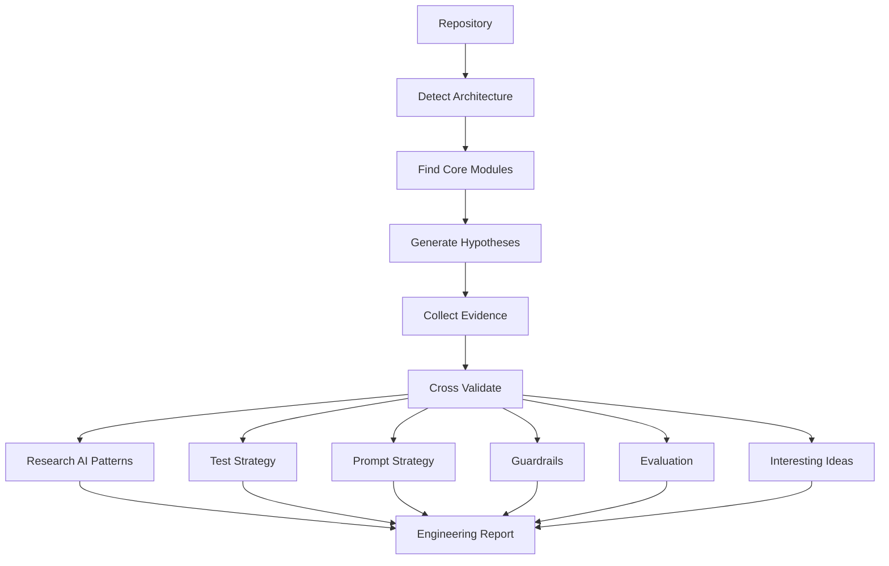

 **Repository Research Skill**（Repository Intelligence / Architecture Research）。

目标不是回答：

> 这段代码有没有 bug？

而是回答：

> **这个项目为什么这样设计？有哪些值得学习？哪些地方是 AI Agent 特有的？有哪些模式可以迁移？**

对于 AI Agent repo（OpenAI Agents、Claude Code、Codex、LangGraph、Cursor、OpenHands、Lindy、Continue、Cline、PydanticAI、Aider……），真正值得研究的是：

* Architecture
* Design Pattern
* Prompt Engineering
* Agent Harness
* Evaluation
* Guardrails
* Tool Design
* Test Strategy
* Human-in-the-loop
* Failure Recovery
* Memory
* Context Engineering

而不是函数实现。

---

# Skill

# Repository Research

> Research an open-source repository and extract the architecture, design ideas, engineering tradeoffs, and reusable patterns rather than merely explaining code.

---

# Purpose

This skill performs an engineering-oriented repository study.

The objective is **not** to summarize the code.

The objective is to answer:

* Why is the repository designed this way?
* What engineering problems is it solving?
* What patterns are reusable?
* What ideas can be applied elsewhere?
* What can AI/Agent engineers learn from it?

The output should resemble an architecture review or engineering design document rather than code documentation.

---

# Suitable repositories

Especially useful for

* AI Agent Frameworks
* AI Coding Agents
* MCP Servers
* Research Systems
* RAG Frameworks
* Evaluation Frameworks
* Compiler Projects
* Databases
* Distributed Systems
* Browsers
* Developer Tools

Examples

* OpenAI Agents SDK
* Claude Code
* Codex CLI
* OpenHands
* Continue
* Cline
* LangGraph
* PydanticAI
* CrewAI
* AutoGen
* Goose
* SurfSense
* MCP servers
* uv
* Ruff
* Bun
* Vite

---

# Input

Repository already cloned locally.

Optional

Repository URL

Branch

Interesting directories

Questions to answer

Example

```
repo_path:
~/code/openai-agents

focus:

- Agent Harness
- Prompt
- Evaluation
- Architecture
```

---

# Research Mindset

Do NOT read files sequentially.

Instead, continuously build hypotheses.

For example

Hypothesis

The framework probably separates planning from execution.

Evidence

Planner

Runner

ToolExecutor

Context

Conclusion

Planning and execution are intentionally decoupled.

---

Never produce

```
File A does this.

File B does that.

File C does this.
```

Always produce

```
Problem

↓

Design

↓

Evidence

↓

Tradeoff

↓

Takeaway
```

---

# Research Workflow



---

# Things to Research

## 1 Architecture

Overall architecture

Layering

Responsibilities

Module boundaries

Dependency direction

Initialization flow

Lifecycle

Execution pipeline

Event flow

Data flow

Extension points

Plugin system

Configuration

---

## 2 Design Philosophy

Try to infer

What problem is the author trying to solve?

Why this abstraction?

Why not another architecture?

What tradeoffs were chosen?

---

## 3 AI Agent Harness

Very important.

Study

Agent lifecycle

Planning

Execution

Reflection

Retry

Parallelism

Delegation

Cancellation

Checkpoint

Streaming

Context propagation

Human approval

Multi-agent orchestration

Loop prevention

State management

Failure recovery

---

## 4 Prompt Engineering

Research

System prompts

Planning prompts

Reflection prompts

Repair prompts

Tool prompts

Compression prompts

Summarization prompts

Hidden prompts

Prompt templates

Few-shot examples

Prompt composition

Dynamic prompt generation

Prompt injection defenses

---

## 5 Context Engineering

Research

Conversation memory

Working memory

Scratchpad

Compression

Sliding window

Retrieval

Context selection

Context prioritization

Context pruning

Conversation replay

---

## 6 Tool Framework

Research

Tool registration

Schemas

Validation

Permission model

Timeout

Retry

Streaming

Error handling

Approval

Sandbox

Security

---

## 7 Guardrails

Research

Hallucination prevention

Prompt injection

Loop detection

Budget limits

Max iterations

Tool whitelist

Permission control

Dangerous operations

Human confirmation

Rate limiting

Resource protection

---

## 8 Evaluation

Very important.

Research

How does the repository verify an Agent works?

Look for

Evaluation

Benchmarks

Regression tests

Golden tests

Snapshots

Reference outputs

Judge LLM

Human evaluation

Rubrics

Metrics

Pass rate

Failure rate

Coverage

---

## 9 Testing Strategy

Research

Unit tests

Integration tests

E2E

Simulation

Fake LLM

Mock Tool

Golden datasets

Replay

Deterministic execution

Recorded conversations

Regression suite

---

## 10 Verification

How do developers know changes don't break the Agent?

Research

CI

Regression

Golden outputs

Benchmarks

Evaluation pipelines

Replay tests

Deterministic mode

---

## 11 Interesting Engineering Ideas

Collect

Interesting abstractions

Elegant APIs

Reusable patterns

Small but clever implementations

Novel architecture

Unexpected simplifications

Performance optimizations

Engineering tricks

Developer experience improvements

---

## 12 Things Worth Learning

Answer

If I only have one hour,

what are the top ideas worth learning?

---

# Evidence Collection

Every conclusion should contain evidence.

Example

Conclusion

The framework intentionally separates planning from execution.

Evidence

```
planner.ts

Runner.ts

ExecutionContext.ts

Tests:
planner.test.ts
```

Confidence

High

Reason

Multiple modules consistently implement the separation.

---

Never make unsupported claims.

Always indicate

High

Medium

Low

confidence.

---

# Cross Validation

Whenever possible

Verify a conclusion using

Architecture

Tests

Comments

Documentation

Prompts

Configuration

Examples

CI

Benchmarks

instead of relying on a single source.

---

# Report Structure

## Executive Summary

Repository purpose

Main architecture

Most interesting ideas

Overall quality

Who should study it

---

## Architecture

Architecture explanation

Execution pipeline

Module relationships

Design patterns

---

## AI-specific Design

Agent Harness

Prompt Design

Context Engineering

Tool Framework

Guardrails

Evaluation

Testing

Verification

---

## Engineering Tradeoffs

Decision

Advantages

Disadvantages

Alternative designs

Why this repository chose it

---

## Reusable Ideas

Patterns worth copying

Patterns to avoid

Interesting abstractions

Engineering tricks

---

## Learning Checklist

Top 10 concepts

Top 10 files

Top 10 tests

Top prompts

Top extension points

---

## Confidence Assessment

For every major conclusion

High

Medium

Low

Evidence

Reason

---

# Output Style

Focus on

Architecture

Engineering thinking

Tradeoffs

Patterns

Reasoning

Avoid

Long file summaries

Line-by-line explanations

Function walkthroughs

Large code dumps

---

# Success Criteria

A successful report enables an experienced engineer to understand:

* Why the repository exists.
* Which engineering problems it solves.
* Which architectural decisions matter.
* How the AI Agent is designed and constrained.
* How prompts are organized and evolved.
* How evaluation and testing ensure reliability.
* Which implementation patterns are reusable.
* Which ideas are unique or especially elegant.
* Which files and tests are the highest-value entry points for deeper study.

---

## 可以再增加的一个亮点（我强烈推荐）

建议再增加一个章节，叫 **Comparative Analysis（横向对比）**。

不是只分析当前仓库，而是自动与同类项目进行对照，例如：

| 对比维度                | 当前 Repo         | 同类项目          | 差异    | 借鉴价值  |
| ------------------- | --------------- | ------------- | ----- | ----- |
| Agent Harness       | Loop + Planner  | OpenAI Agents | 当前更轻量 | ★★★★★ |
| Prompt 组织           | Prompt Builder  | Claude Code   | 更模块化  | ★★★★☆ |
| Evaluation          | Golden Tests    | LangGraph     | 覆盖较弱  | ★★★☆☆ |
| Guardrails          | Tool Permission | Codex CLI     | 更保守   | ★★★★★ |
| Context Engineering | Sliding Window  | Continue      | 更简单   | ★★★☆☆ |

这是很多优秀研究报告与普通源码分析最大的区别：不仅解释代码，还能定位该项目在同类生态中的设计位置，并提炼可迁移的设计思想。


--------

整体质量已经很高，我会给 **9.5/10**。

它已经不像一个普通 prompt，而更像一个 **Research Methodology**。最大的优点不是列出了很多检查项，而是已经有了：

* Research Mindset（假设驱动）
* Evidence-based（证据驱动）
* Cross Validation（交叉验证）
* Comparative Analysis（横向对比）
* Confidence（置信度）

这几个部分把整个 Skill 从「总结代码」提升到了「做研究」。

不过，从一个长期会反复使用的 Skill 来说，我觉得还有几个可以明显提升的地方，而且不会增加多少复杂度。

---

# 1. 缺少 Repository Discovery（最重要）

目前一开始就是

> Detect Architecture

实际上，对于大型 repo（Claude Code、OpenHands、LangGraph）来说，**Detect Architecture 根本不是第一步。**

第一步应该是：

```
Repository Discovery
```

例如：

* README
* docs/
* package.json
* pyproject.toml
* Cargo.toml
* Makefile
* scripts/
* examples/
* tests/
* benchmark/
* eval/

先回答：

> 这个 repo 的入口在哪里？

> 哪些目录最重要？

> 哪些目录可以忽略？

否则 AI 很容易陷入：

```
src/
  aaa
  bbb
  ccc
```

一路往下读。

建议增加：

```text
## Repository Discovery

Before reading implementation:

Research

- repository layout
- entry points
- important directories
- generated code
- examples
- documentation
- benchmarks
- tests
- build system

Identify

- where the architecture lives
- where prompts live
- where evaluation lives
- where tests live

Ignore

- vendor
- generated code
- snapshots
- lock files
```

我认为这是最应该增加的一节。

---

# 2. 缺少 Reading Strategy

现在写的是

> Don't read sequentially

但是没有告诉 AI：

应该按什么顺序。

建议增加：

```
Architecture

↓

Public API

↓

Tests

↓

Examples

↓

Core modules

↓

Implementation
```

因为优秀 repo 的设计思想，大量都藏在：

```
examples/

tests/

docs/

```

不是 src。

---

# 3. Prompt Engineering 建议扩展一点

目前写的是 Prompt。

但是 AI Agent 真正值得研究的是：

Prompt 生命周期。

建议增加：

```
Prompt evolution

Prompt versioning

Prompt assembly

Template engine

Variable injection

Tool description generation

Automatic prompt compression
```

这些比单纯 Prompt 更有价值。

---

# 4. Evaluation 可以升级成 AI Engineering

现在写：

Evaluation

Testing

Verification

其实可以增加：

```
Reliability Engineering
```

包括：

```
Determinism

Replayability

Reproducibility

Cost evaluation

Latency evaluation

Failure analysis

Coverage
```

因为 Agent 最大的问题：

不是 Accuracy。

而是：

> 今天过，明天不过。

---

# 5. Comparative Analysis 建议增加一个原则

不要什么都比较。

例如：

```
If a comparable project exists,
compare only the relevant subsystem.

Examples

Prompt

Tool framework

Evaluation

Memory

Context

Planner

Avoid superficial feature matrix comparisons.
```

否则 AI 很容易生成：

```
Claude 有 XX

LangGraph 有 XX

CrewAI 有 XX
```

没有意义。

---

# 6. 缺少 "Interesting Questions"

这一项我很喜欢放到 Research Skill。

例如：

```
Questions worth answering

Why is this abstraction necessary?

What would break if removed?

What is the smallest useful architecture?

Which modules are accidental complexity?

Where is the real innovation?

Which decisions appear over-engineered?

Which ideas survived across multiple releases?
```

它会让报告更有洞察力。

---

# 7. 增加 Evolution（★★★★★ 推荐）

很多优秀 repo：

最大的价值不是今天。

而是：

Git History。

建议增加：

```
Architecture Evolution

Research

Major refactors

Breaking changes

Deprecated ideas

Lessons learned

Evolution of prompts

Evolution of evaluation

Evolution of APIs
```

对于 Agent 项目尤其重要。

很多设计：

都是失败以后改出来的。

---

# 8. 增加 "Don't speculate"

建议加一句。

```
Never infer architecture without evidence.

If evidence is insufficient,

state

Unknown

instead of guessing.
```

这会降低幻觉。

---

# 9. Success Criteria 还能提升

建议最后一句改成：

```
A reader should finish the report
knowing where to spend the next
two hours reading source code.
```

我特别喜欢这个标准。

因为：

真正好的研究报告，

不是替代源码，

而是告诉你：

> **哪些地方值得亲自去读。**

---

## 我唯一建议新增的章节

如果只能增加一个，我会选下面这个，而不是继续扩充 AI Agent 的内容。

```markdown
## Reading Strategy

Study the repository in this order:

1. README and documentation
2. Examples
3. Tests
4. Public APIs
5. Core architecture
6. Internal implementation
7. Benchmarks
8. Evaluation
9. CI and release workflow

Avoid reading source files sequentially.

Continuously refine hypotheses as new evidence emerges.
```

这是整个 Skill 目前最缺失的一块，因为它直接决定了 Agent 的研究效率。

---

**综合评价：9.8/10。** 它已经远超一般的“代码分析 Prompt”，具备了研究方法论的雏形。再补上 **Repository Discovery**、**Reading Strategy**、**Architecture Evolution** 这三块，就会更加完整，而且不会显得过度设计。
