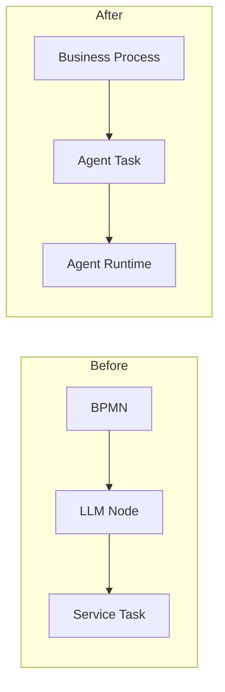
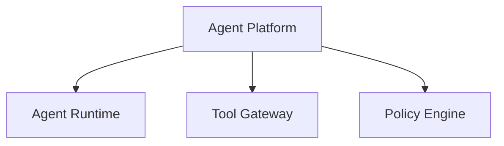
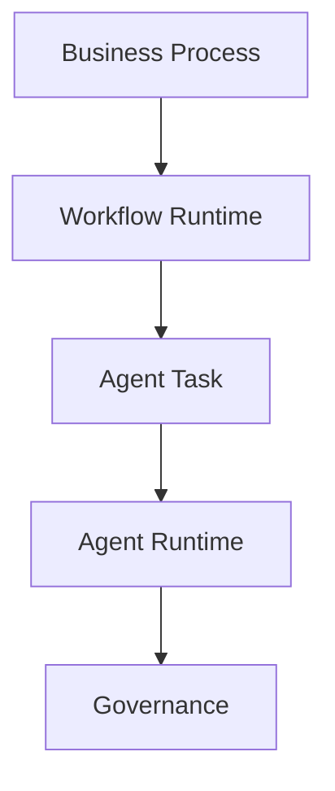
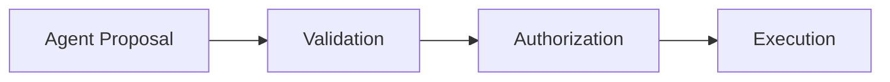
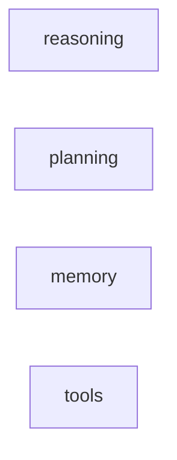
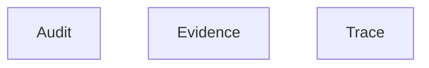
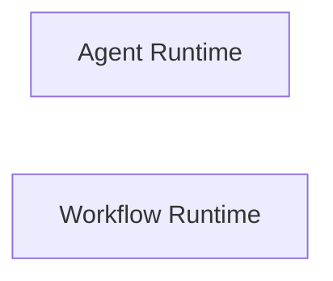
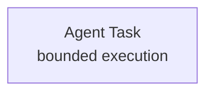
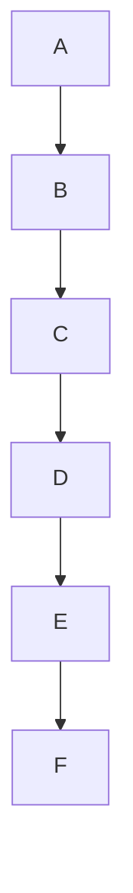
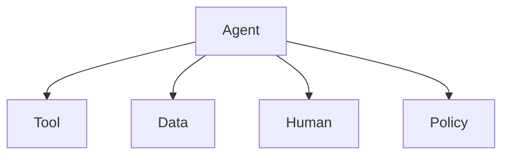

# Text / ASCII → Diagram Optimization

## Goal

优化 Markdown 文章中的流程图、架构图、ASCII 伪图和已有 Mermaid 图。

核心原则：

> **先判断“这段信息是否值得画图”，再决定“用什么形式表达”。**

输出形式只有四种：

1. Mermaid flowchart：用于真正的结构、流程、边界和系统关系。
2. Markdown table：用于比较、分类、维度、属性映射。
3. Markdown list / inline text：用于简单罗列、定义、说明。
4. 保留原文：当现有表达已经足够清楚时，不做无意义转换。

### 重要原则

> **不要追求 Mermaid 数量。追求信息增量。**

一个图必须比相同内容的正文、列表或表格更容易理解。

---

# 1. 核心决策流程

处理任何 ASCII / text 伪图或已有 Mermaid 时，严格按以下顺序：

```text
发现图
  ↓
判断语义类型
  ↓
是否有真实结构关系？
  ↓
 ┌──────────────┬───────────────┐
 否             是
 ↓              ↓
删除 / 表格     判断结构复杂度
/ 列表 / 正文       ↓
                Mermaid
```

### 判断标准

问：

> **去掉视觉形式以后，这段内容是否仍然表达了“谁与谁存在什么关系”？**

如果只是：

* 一组概念
* 一组能力
* 一组属性
* 一组版本号
* 一组字段
* 一组定义
* 一组并列分类

那么通常**不是图**。

如果表达：

* A 导致 B
* A 调用 B
* A 包含 B
* A 限制 B
* A 经过 B 后才能进入 C
* 两套系统如何连接
* 一个系统边界内有哪些组件
* Before / After 的结构变化

才适合 Mermaid。

---

# 2. Mermaid 只承担三类信息

Mermaid 只允许承担以下三种主要职责。

## 2.1 控制关系

例如：

```text
Agent
  ↓
Proposal
  ↓
Validation
  ↓
Authorization
  ↓
Execution
```

这是 Mermaid。

---

## 2.2 边界 / 分层 / 包含关系

例如：

```text
Business Process
 ├─ BPMN
 ├─ DMN
 └─ Human Task

Agent Runtime
 ├─ Planning
 ├─ Tools
 └─ Context
```

这是 Mermaid。

---

## 2.3 多系统 / 多组件组合关系

例如：

```text
Workflow Runtime
       ↓
Agent Task
       ↓
Agent Runtime
       ↓
Tool Gateway
       ↓
Enterprise APIs
```

这是 Mermaid。

---

# 3. 明确禁止“为了画图而画图”

以下情况默认**不使用 Mermaid**。

## 3.1 单节点

```text
Enterprise Ontology
```

处理：

> 删除 Mermaid，直接写正文。

---

## 3.2 无关系的并列节点

例如：

```text
Objects
Properties
Links
Actions
Logic
Security
```

处理：

> Markdown list 或 table。

不要：

```mermaid
A ~~~ B
B ~~~ C
```

### 铁律

> **禁止使用 `~~~` 把没有语义关系的节点强行连接起来。**

`~~~` 不得用于“排版造型”。

---

## 3.3 概念集合

例如：

```text
Deterministic
Bounded Agentic
Dynamic Agentic
```

处理：

Markdown table：

| Execution Model | 含义             |
| --------------- | -------------- |
| Deterministic   | 路径预先定义         |
| Bounded Agentic | Agent 在明确边界内执行 |
| Dynamic Agentic | Agent 动态决定执行路径 |

---

## 3.4 属性集合

例如：

```text
state
ordering
waiting
retry
timeout
resume
```

处理：

列表或表格。

---

## 3.5 版本集合

例如：

```text
workflowVersion = v17
policyVersion = v8
modelVersion = ...
promptVersion = v12
```

处理：

代码块或表格。

---

## 3.6 简单定义

例如：

```text
Audit = 谁 / 何时 / 做了什么
Evidence = 依据了什么
Trace = Agent 怎么做
```

处理：

Markdown table。

---

## 3.7 只有一个简单箭头的短句

例如：

```text
Agent → Workflow
```

默认直接写：

> Agent → Workflow

除非这是文章核心观点或后面需要继续扩展。

### 特殊例外

如果该箭头是整篇文章的重要架构边界，可以保留 Mermaid。

例如：

```text
Business Process
       ↓
Agent Task
       ↓
Agent Runtime
```

---

# 4. 以下 ASCII 结构优先转换为表格

## 4.1 对比矩阵

例如：

```text
Traditional     Agentic
BPMN            Dynamic Plan
Gateway         Policy
Service Task    Tool
Human Task      HITL
```

必须转 Markdown table。

---

## 4.2 多维分类

例如：

```text
Execution Model
Task Mode
Control
```

转为：

| Dimension | Values                                            |
| --------- | ------------------------------------------------- |
| Execution | Deterministic / Bounded Agentic / Dynamic Agentic |
| Task      | Human / System / Agent / Hybrid                   |
| Control   | Rule / Policy / Human Approval                    |

---

## 4.3 Before / After 属性对照

如果只是属性变化，不需要 Mermaid：

| Before                  | After                    |
| ----------------------- | ------------------------ |
| Human-designed workflow | Agent-assisted execution |
| Static path             | Dynamic task plan        |
| Process-centric         | Task/runtime-centric     |

只有当 Before / After 本身是**流程关系变化**时才用 Mermaid。

---

# 5. Before / After 图

当两个方案存在真实结构差异时，可以使用一个 Mermaid 图，两个 subgraph。

例如：



不要分别画：

```text
Before 图
After 图
```

除非两张图结构非常复杂。

---

# 6. ASCII 树

缩进树可以转 Mermaid，但首先判断树是否表达真实的父子关系。

## 可以转换

```text
Agent Platform
├─ Agent Runtime
├─ Tool Gateway
└─ Policy Engine
```

因为这是：

> Platform contains these components。

可以画：



---

## 不应该转换

如果只是：

```text
Agent:
- reasoning
- memory
- planning
- tools
```

这只是属性集合，不是结构树。

改成列表。

---

# 7. 复杂架构图的判断标准

以下任意一条成立，才值得使用 Mermaid：

* 至少有 3 个节点，并且节点之间存在真实关系。
* 存在控制流或数据流。
* 存在系统边界。
* 存在调用关系。
* 存在状态转移。
* 存在明确的输入 → 处理 → 输出链。
* 存在权限 / 验证 / 执行的先后关系。
* 存在多个系统之间的组合关系。

如果只有：

```text
A
B
C
D
```

不能画图。

---

# 8. Mermaid 数量控制

一篇普通技术文章：

* 推荐 3～8 张核心图。
* 超过 10 张必须重新检查是否存在重复。
* 同一逻辑只允许一张主图。
* 后文优先引用主图，而不是重新画局部版本。

## 重复图规则

如果文章已经有：

```text
Business Process
    ↓
Agent Task
    ↓
Agent Runtime
```

后面不要再次画：

```text
BPMN
    ↓
Agent
```

除非新增了不同维度的信息。

---

# 9. 主架构图规则

如果文章存在一张完整主架构图：

> 后续 Mermaid 只能解释主架构图中某个局部的新关系。

例如主架构：



后面可以画：



因为它增加了一个新维度：

> Agent 如何产生业务副作用。

---

# 10. 推荐的核心图类型

对于架构文章，优先使用这五种：

## A. Flow

```text
A → B → C
```

表示控制或数据流。

---

## B. Layer

```text
Layer 1
Layer 2
Layer 3
```

表示架构分层。

---

## C. Boundary

```text
subgraph
```

表示职责 / 系统边界。

---

## D. Interaction

```text
A → B
B → C
A → C
```

表示组件之间的交互。

---

## E. State Transition

```text
State A
   ↓
State B
   ↓
State C
```

只有真正发生状态变化时才使用。

---

# 11. 禁止使用 Mermaid 模拟列表

以下写法禁止：



也禁止：



如果没有关系：

> 用表格 / 列表。

---

# 12. Mermaid 语法规则

使用 Mermaid v11 `flowchart`。

## 12.1 方向

只使用：

```text
flowchart TD
flowchart LR
```

不要使用：

* mindmap
* sequenceDiagram
* classDiagram

---

## 12.2 节点标签

所有节点标签使用双引号：



---

## 12.3 节点 ID

使用简单 ASCII ID：

```text
A
B
C
AR
WR
AT
```

同一图内唯一。

---

## 12.4 标签安全

标签中不要出现：

* `-->`
* `< >`
* `→`
* `↓`
* `←`

应转换成自然文字。

例如：

```text
<model>@<version>
```

改为：

```text
model@version
```

---

## 12.5 边标签

允许：

```mermaid
A -->|approved| B
```

但是只有真正需要解释边语义时才加。

不要给每一条边都加文字。

---

## 12.6 条件节点

使用：

```mermaid
D{"Approval required?"}
```

---

## 12.7 换行

可以：

```text
<br/>
```

例如：



---

# 13. 小屏规则

不要为了小屏而制造语义不存在的 `~~~`。

### 原则

> **布局问题优先通过调整 flowchart 方向解决，不允许新增虚假关系。**

例如长链：

```text
A → B → C → D → E → F
```

如果 LR 太长：



可以改 TD。

但是：

> 不得为了排版增加 `~~~`。

---

# 14. 多分支布局

真实的扇出：

```text
Agent
├─ Tool
├─ Data
├─ Human
└─ Policy
```

可以自然使用：



不要再用：

```text
T ~~~ D
D ~~~ H
H ~~~ P
```

来人为控制排列。

---

# 15. 数据 / YAML / JSON 不属于图

以下必须原样保留：

* yaml
* json
* jsonc
* xml
* sql
* code

例如：

```yaml
agentTask:
  input:
    schema: InvestmentCase.v3
```

不要转换成 Mermaid。

---

# 16. 重要：ASCII 图不是必须转换

Skill 名称虽然包含 `text-to-mermaid`，但实际规则应当是：

> **Text-to-best-visual-form**

即：

```text
ASCII
  ↓
判断语义
  ├─ Flow → Mermaid
  ├─ Architecture → Mermaid
  ├─ Comparison → Table
  ├─ Enumeration → List
  ├─ Definition → Paragraph
  └─ Already clear → Keep
```

---

# 17. 已有 Mermaid 也必须 review

不要假设：

> Mermaid = 正确图。

处理已有 Mermaid 时必须检查：

1. 是否表达真实关系。
2. 是否存在重复信息。
3. 是否只是把列表伪装成图。
4. 是否存在无语义 `~~~`。
5. 是否应该改成表格。
6. 是否应该与相邻 Mermaid 合并。
7. 是否与文章主架构重复。
8. 是否有节点过多导致阅读困难。

如果已有 Mermaid 没有信息增量：

> **删除它，而不是保留它。**

---

# 18. 图的“信息增量”检查

每张 Mermaid 必须回答：

> **这张图比一句话 / 一张表多表达了什么？**

处理前后检查：

### 如果删除图后正文仍然完全清楚

→ 删除图。

### 如果改成表格更清楚

→ 转表格。

### 如果图能让读者一眼看出结构、顺序、边界或依赖

→ 保留 Mermaid。

---

# 19. 核心架构文章推荐的图数量

对于 3000～5000 字的架构文章：

推荐：

```text
1 × Problem contrast
1 × Industry architecture
1 × Main architecture
1 × Agent Task Contract
1 × Governed Action Pipeline
1 × Audit / Evidence / Trace
1 × Business case
```

通常：

> **5～7 张图已经足够。**

不要以“所有 ASCII 都必须变成 Mermaid”为目标。

---

# 20. Copy-code 与 Mermaid DOM 检查

页面上的 copy-code 脚本不得向：

```text
pre.mermaid
```

内部注入按钮文本。

否则 Mermaid 解析器可能把：

```text
Copy
```

当成节点内容。

copy 按钮选择器必须排除 Mermaid：

```css
pre:not(.mermaid)
```

如果项目已有：

```text
src/layouts/PostDetails.astro
```

中的：

```text
attachCopyButtons()
```

应确保它不会修改：

```text
pre.mermaid
```

---

# 21. 大文件处理

如果文章超过约 1500 行：

1. 按完整 fenced code block 边界分块。
2. 不得从 Mermaid / YAML / JSON / code fence 中间切割。
3. 每块独立做语义判断。
4. 最后做一次全文章级别的：

   * 重复图检查
   * 主架构图检查
   * Mermaid 数量检查
   * Markdown 结构检查。

不要只做局部转换后直接拼接。

---

# 22. 写回后的校验

## 22.1 内容完整性

必须保持：

* 标题
* 正文
* 表格
* 引用
* URL
* YAML frontmatter

除非用户明确要求修改。

---

## 22.2 语义完整性

必须保证：

* 不删除原有业务概念。
* 不改变节点关系语义。
* 不新增原文不存在的业务实体。
* 不把“属性”误变成“关系”。
* 不把“建议”误变成“状态转移”。
* 不把“并列”误变成“顺序”。

---

## 22.3 图数量检查

报告：

```text
原 Mermaid 数量
删除数量
新增数量
最终 Mermaid 数量
表格替换数量
列表替换数量
```

并重点检查：

> 是否存在 2 张或以上表达同一逻辑的图。

---

## 22.4 Mermaid 渲染检查

在项目浏览器环境中：

1. 启动 dev server。
2. 打开目标文章。
3. 等待客户端 Mermaid 完成渲染。
4. 检查：

```text
pre.mermaid 数量
svg 数量
parse error 数量
```

要求：

```text
svg count == rendered mermaid count
parse errors == 0
```

---

## 22.5 Build

执行：

```bash
npm run build
```

必须通过。

---

# 23. 最终输出要求

完成后不要只说：

> “已转换完成。”

必须报告：

```text
Mermaid:
  kept: N
  removed: N
  added: N

Converted to table:
  N

Converted to list / text:
  N

Main architecture diagrams:
  N

Duplicate diagrams removed:
  N

Validation:
  Mermaid parse errors: 0
  Astro build: passed
```

如果发现某个 ASCII 图不值得转换，应明确说明原因。

---

# 24. 最重要的总原则

> **不要把“图”当成排版。**
>
> **图应该表达关系。**
>
> **表格应该表达比较。**
>
> **列表应该表达集合。**
>
> **正文应该表达定义和解释。**

最终目标不是：

> **“让 Markdown 里没有 ` ```text `。”**

而是：

> **“让每一种信息使用最适合它的表达形式。”**
