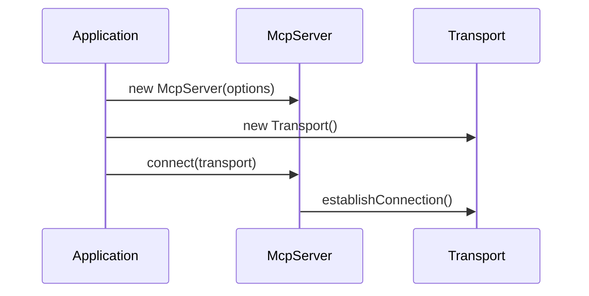

MCP SDK TypeScript的源代码在这里 https://github.com/modelcontextprotocol/typescript-sdk

# 如何实现的Server端？

```mermaid
sequenceDiagram
    participant Application
    participant McpServer
    participant Transport

    Application->>McpServer: new McpServer(options)
    Application->>Transport: new Transport()
    Application->>McpServer: connect(transport)
    McpServer->>Transport: establishConnection()
```

# 如何实现的Client端？

TODO

# 其它值得关注的点
