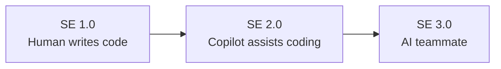
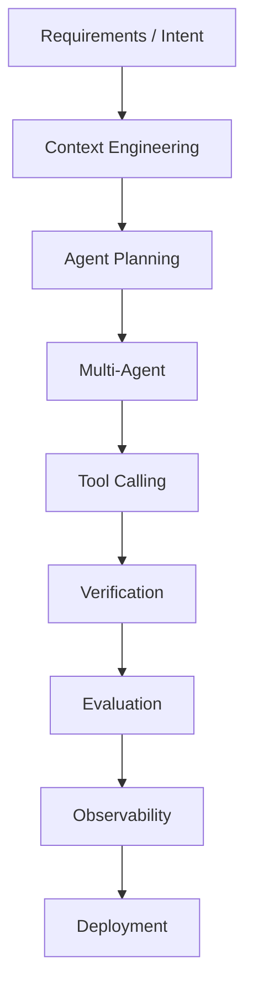

AI 快速迭代，大学课程也在持续更新。以下罗列著名大学公开的 AI/ML 相关课程，所有链接均为课程官网，可免费访问课件、视频或作业。

---

最近半年，我发现一个很有意思的现象：

**大学课程更新的速度，已经开始跟不上软件工程本身的变化。**

真正值得关注的，不再是「哪些大学开了 AI 软件工程课程」，而是**整个软件工程学术界正在重新定义 Software Engineering**。2026 年已经出现了几篇我认为未来会成为里程碑的论文。

## 1. SE 3.0：Towards AI-Native Software Engineering（目前最重要）

这是我认为目前影响力最大的愿景论文。

> **Towards AI-Native Software Engineering (SE 3.0): A Vision and a Challenge Roadmap** ([DOI][1])

作者提出了一个很清晰的演进路线：



他们认为：

SE 2.0（Copilot）的问题是：

- AI 只是 Autocomplete++
- 人仍然管理所有复杂性
- Cognitive Load（认知负担）反而增加

因此提出 **SE 3.0**：

- Intent-centric Development
- Conversation-oriented Development
- AI Teammate
- Compiler.next
- IDE.next
- Runtime.next

这已经不是 Coding Assistant。

而是：

> **Developer 与 AI Teammate 共同开发系统。** ([DOI][1])

---

## 2. ASE-26：第一份完整的 Agentic Software Engineering 教材

第二篇让我很惊讶。

> **ASE-26: a curriculum for agentic software engineering as a discipline** ([arXiv][2])

它不是论文介绍一个想法。

而是真的设计了一整套本科课程。

论文提出：

> 软件工程师未来工作的主要内容已经逐渐从写代码转变为**指导 Agent 工作**。([arXiv][2])

它设计了 **21 个 Module**。

其中大量内容已经不是传统软件工程：

- Intent
- Agent Collaboration
- Evaluation
- Verification
- Multi-agent
- Evolutionary Spiral
- Human Supervision

而 Coding 已经只是其中很小一部分。

如果以后真有一本《AI Native Software Engineering》，我猜它会大量参考这套课程。

---

## 3. AI-Native Software Engineering（系统综述）

另一篇值得读的是：

> **The Rise of AI-Native Software Engineering: Implications for Practice, Education, and the Future Workforce** ([arXiv][3])

作者分析了 **2016–2026** 的 48 篇论文。

最后提出：

未来的软件工程能力可以概括成九类：

```text
Intent

↓

Specification

↓

Agent Orchestration

↓

Verification

↓

Critical Evaluation

↓

Collaboration

↓

Metacognition

↓

Continuous Learning

↓

Ethics
```

最重要的一句话是：

> 教育重点应该从 **Code Production** 转向 **Judgment、Verification、Orchestration**。 ([arXiv][3])

这和 Aalto 的课程思想几乎一致。

---

## 4. ICSE 2026 已经开始讨论课程如何改

ICSE 2026 的 SEET（Software Engineering Education and Training）专门出现了一篇：

> **AI-Driven Software Development: A New Course Concept and Assessment Model** ([Conf.researchr][4])

重点不是课程内容。

而是：

> **考试怎么办？**

以前：

```
学生

↓

写代码

↓

老师评分
```

以后：

```
学生

↓

AI

↓

共同开发

↓

老师评估：

为什么这样做？

Prompt 如何设计？

为什么相信 AI？

如何验证？
```

这说明教育界已经开始把**验证能力（Verification）**作为核心考核对象。([Conf.researchr][4])

---

## 5. 软件工程教育本身正在重写

还有一篇偏教育学：

> **A Systemic View of a Software Engineering Education Curriculum** ([Sage Journals][5])

它认为未来的软件工程课程需要加入：

- Systems Thinking
- Ethics
- AI
- Enterprise Architecture
- Human Collaboration
- Lifelong Learning

而不是：

- 更多语言
- 更多 Framework

---

# 一个共同趋势

把这些论文放在一起，会发现它们其实在描述同一个未来。



这里几乎已经没有「写代码」这个独立阶段了。

代码变成整个流程中的一个产物，而不是中心。

---

# 如果我是大学教授，我会这样设计教材

结合这些研究，我觉得未来一本真正经典的教材，大概率会采用下面这样的结构：

| Part   | 内容                                                   |
| ------ | ------------------------------------------------------ |
| Part 1 | Intent Engineering（需求表达、问题建模）               |
| Part 2 | Context Engineering（上下文构建）                      |
| Part 3 | AI Collaboration（人与 Agent 协作）                    |
| Part 4 | Agentic Software Engineering（单 Agent、多 Agent）     |
| Part 5 | Verification（测试、评审、形式化验证、AI 审核）        |
| Part 6 | Evaluation（离线评估、在线评估、A/B、Evals）           |
| Part 7 | AI Architecture（RAG、Memory、Tool、Workflow）         |
| Part 8 | AI DevOps（Observability、Guardrails、Cost、Security） |
| Part 9 | Human Governance（责任、伦理、团队协作）               |

你会发现，它与经典教材如《Software Engineering》（Sommerville）最大的区别，不是增加了一个“AI 章节”，而是**整个软件生命周期都围绕 AI 重构**。

**结合你的背景，我还有一个建议。** 我认为完全可以自己整理一套 **《AI Native Software Engineering Reading List》**，不局限于课程，而是按主题（Intent Engineering、Context Engineering、Verification、Evaluation、Agent Architecture、Observability、AI DevOps）持续跟踪 ICSE、FSE、TOSEM、SEET、Anthropic、OpenAI、Google DeepMind 等来源。相比等待大学教材出版，这样更有机会走在这一领域的前沿。

[1]: https://doi.org/10.1145/3807901?utm_source=chatgpt.com "Towards AI-Native Software Engineering (SE 3.0): A Vision and a Challenge Roadmap | ACM Transactions on Software Engineering and Methodology"
[2]: https://arxiv.org/abs/2606.01152?utm_source=chatgpt.com "ASE-26: a curriculum for agentic software engineering as a discipline"
[3]: https://arxiv.org/abs/2606.12986?utm_source=chatgpt.com "The Rise of AI-Native Software Engineering: Implications for Practice, Education, and the Future Workforce"
[4]: https://conf.researchr.org/details/icse-2026/icse-2026-software-engineering-education-and-training--seet-/18/AI-Driven-Software-Development-A-New-Course-Concept-and-Assessment-Model-for-the-Era?utm_source=chatgpt.com "AI-Driven Software Development: A New Course Concept and Assessment Model for the Era of Large Language Models (ICSE 2026 - Software Engineering Education and Training (SEET)) - ICSE 2026"
[5]: https://journals.sagepub.com/doi/10.1177/10920617251405471?utm_source=chatgpt.com "A Systemic View of a Software Engineering Education Curriculum: Requirements and Guidelines in the Era of Generative AI - Thomas J Marlowe, Cyril S Ku, Joseph R Laracy, Vassilka D Kirova, Katherine G Herbert, 2026"

---

### Coursera

[Best of Machine Learning & AI](https://www.coursera.org/collections/best-machine-learning-ai)

[]()

### deeplearning.ai

[Machine Learning Specialization](https://www.deeplearning.ai/specializations/machine-learning)

[Deep Learning Specialization](https://www.deeplearning.ai/specializations/deep-learning)

[]()

### Stanford

[CS229: Machine Learning](https://cs229.stanford.edu/) Andrew Ng 的经典入门课，覆盖监督学习、无监督学习、强化学习。

[CS231N: Deep Learning for Computer Vision](https://cs231n.stanford.edu/) Fei-Fei Li 等开设，从图像分类到目标检测、生成模型、Embodied AI。

[CS224N: Natural Language Processing with Deep Learning](https://web.stanford.edu/class/cs224n/) Christopher Manning 等开设，从 word vectors 到 transformers、LLM agents、red-teaming。

[CS25: Transformers United](https://web.stanford.edu/class/cs25/) 聚焦 Transformer 架构的前沿研究，邀请领域研究者做讲座。

[CS336: Language Modeling from Scratch](https://cs336.stanford.edu/) 从零实现语言模型，覆盖数据、架构、训练、对齐全流程。

[CS146S: The Modern Software Developer](https://themodernsoftware.dev/) 面向现代软件开发的实践课程。

[CS 329S: Machine Learning Systems Design](https://stanford-cs329s.github.io/) Stanford, Winter 2022

[]()

### MIT

[6.S191: Introduction to Deep Learning](https://introtodeeplearning.com/) MIT 官方深度学习入门，覆盖 CNN、RNN、生成模型、强化学习、LLM，配有 TensorFlow/PyTorch labs。

[]()

### Berkeley

[CS294/194-280: Advanced Large Language Model Agents](https://rdi.berkeley.edu/adv-llm-agents/sp25) Spring 2025，聚焦 LLM Agent 的高级课题。

[]()

### Carnegie Mellon University

[11-768: AI Agents](https://www.cmu-agents.com/) Fall 2026，CMU 的 AI Agents 课程。

[]()

### 复旦大学

[人工智能的软件基础](https://github.com/aisoft-course/aisoft-course.github.io) 2026 年春季学期，从工程实践角度讲 AI 应用的软件基础。

### 李宏毅

[Machine Learning 2026 Spring](https://speech.ee.ntu.edu.tw/~hylee/ml/2026-spring.php)

[Introduction to GenAI and ML 2025 Fall](https://speech.ee.ntu.edu.tw/~hylee/GenAI-ML/2025-fall.php)

###

[Software Engineering with Large Language Models](https://opencs.aalto.fi/en/courses/software-engineering-with-large-language-models-v1)

[]()

###

[國立清華大學 - 10702 深度學習](https://ocw.nthu.edu.tw/ocw/index.php?page=course&cid=242)

[台大開放式課程 - 魏晉南北朝史](https://ocw.aca.ntu.edu.tw/courses/112S202/1)

[]()

[AI人工智慧與應用 - 學校](https://www.tocec.org.tw/web/school_results.jsp?s_field_id=1)

[中国大学MOOC](https://www.icourse163.org/)

[网易公开课](https://open.163.com/)

[]()

[]()

[]()

[]()

---

Coding 已经不是课程核心。真正重要的是：

Context Engineering
Evaluation
Verification
Agent Design
Cost
Safety
Observability

这些才是 AI 软件工程的新基础设施。
