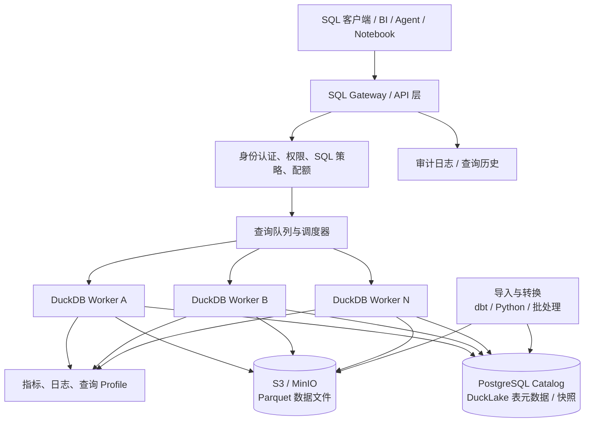
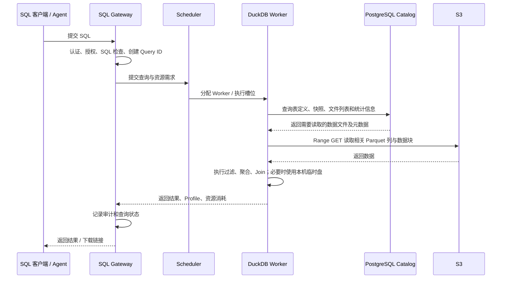
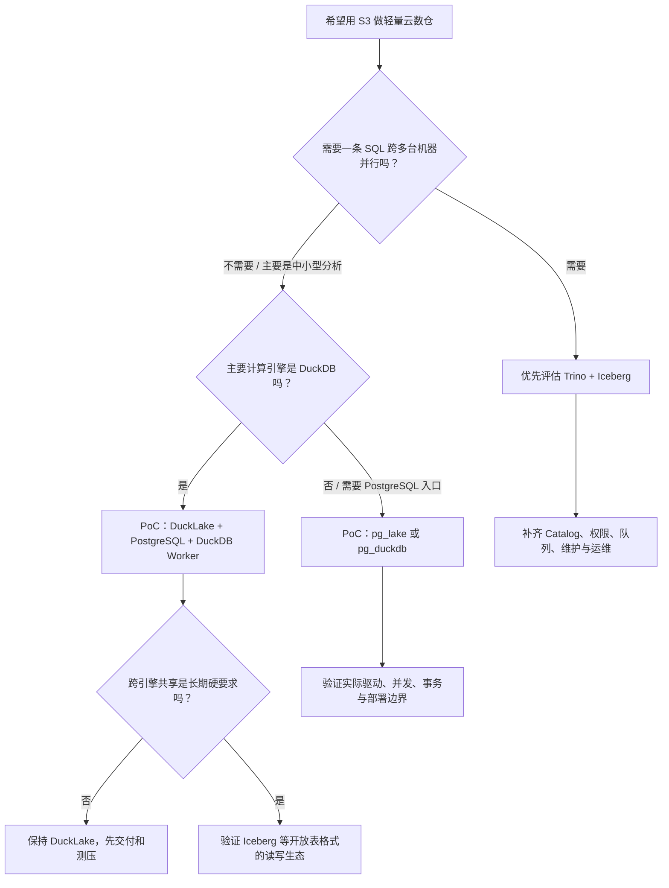

架构、开源项目与落地路线

> **结论先说：能做出“轻量云数仓”，但不是把 DuckDB 指向 S3 就等于 Snowflake。** 真正需要补齐的是表元数据和事务、统一 SQL 服务入口、权限治理、查询调度与隔离、缓存/文件整理、监控和运维。若主要是中小规模分析、批处理和 Agent/BI 查询，这条路线很有价值；若要求大查询跨多台机器并行、极高并发、开箱即用的企业治理和 SLA，就得考虑 Trino 等分布式引擎，或直接用托管数仓。

---

## 1. 先把问题说清楚：什么叫“轻量版 Snowflake”

Snowflake 不是一个单独的 SQL 引擎，而是一整套托管数据平台。官方把它分成三层：**数据存储层、计算层、云服务层**。云服务层还负责登录与权限、目录、元数据、查询解析和优化、基础设施管理等；计算层的 Virtual Warehouse 则是相互隔离的计算集群。[Snowflake 官方架构说明](https://docs.snowflake.com/en/user-guide/intro-key-concepts)

所以，“DuckDB + S3”只解决了其中一部分：

- **DuckDB**：负责执行 SQL、扫描列式数据、过滤、聚合和 Join。它的设计重点是高效的单机分析引擎。
- **S3 / S3 兼容对象存储**：负责低成本、耐久地保存 Parquet 等数据文件。
- **仍然缺的部分**：表的权威元数据、并发读写和提交协议、SQL 入口、身份与权限、查询排队和资源上限、结果缓存、审计、清理和恢复流程。

更准确的目标应该是：

> **做一个以 S3 为持久数据层、以 DuckDB 为 SQL 执行引擎、由独立元数据目录和服务层管理的轻量分析仓库。**

它可以实现存储与计算分离，但要对“分离”的程度有正确预期：文件和表的持久状态放在远端，计算 Worker 可以按需启动和销毁；但每条 SQL 通常仍由某一台机器上的 DuckDB 执行。增加 Worker 可以提高**多条 SQL 的并发吞吐**，并不自动让一条超大型 SQL 横跨几十台机器计算。

## 2. 建议架构：不要只做“DuckDB 直接读 S3”

### 2.1 推荐的初版架构

第一版推荐以 **DuckLake + PostgreSQL Catalog + S3 + DuckDB Worker + SQL/API Gateway** 为主。DuckLake 1.0 于 2026 年 4 月发布；它把表和快照等元数据放在支持事务的 SQL 数据库中，把数据本身保存在 Parquet 文件里，目标正是让对象存储和计算节点分开。[DuckLake 规范](https://ducklake.select/docs/stable/specification/introduction) · [DuckDB 官方 DuckLake 文档](https://duckdb.org/docs/current/core_extensions/ducklake)

**各组件分别解决什么问题：**

| 组件                 | 负责什么                                                          | 不应该让它承担什么                                                                 |
| -------------------- | ----------------------------------------------------------------- | ---------------------------------------------------------------------------------- |
| S3 / MinIO           | 保存 Parquet 数据文件、持久化结果、归档                           | 不负责 SQL 表目录、用户权限或查询调度                                              |
| DuckDB Worker        | 执行 SQL、过滤/聚合/Join、读取远端文件、使用本机内存与临时盘      | 不直接作为面向所有用户的权限边界；不要让所有请求共用一份可随意改写的本地数据库文件 |
| PostgreSQL Catalog   | 保存 DuckLake 的表定义、快照、文件清单和相关元数据；提供事务能力  | 不用来保存大量分析明细数据，除非这些数据本来就适合 PostgreSQL                      |
| SQL Gateway          | 验证身份、检查 SQL、分配 Query ID、限流、排队、返回结果、记录审计 | 不应把用户输入原样拼接成任意 SQL，也不应把 S3 管理密钥交给客户端                   |
| 调度器 / Worker 池   | 控制并发数、每个查询的内存/线程/时间限制，按负载增加或减少 Worker | 不应仅靠 Kubernetes 自动扩缩容就认为查询资源管理已经完成                           |
| 元数据与文件维护任务 | 统计信息、文件合并、清理孤儿文件、过期快照、备份和恢复演练        | 不要把这些维护工作寄希望于“以后自然会好”                                           |

### 2.2 一次查询实际怎么跑

这里最容易被低估的是：**查询很可能并不是 CPU 算不过来，而是远端文件太多、读取次数太多、数据布局不利于过滤、或者并发查询把内存和网络打满。** 因此，表格式、文件尺寸、分区、缓存和查询调度都属于产品架构，不是上线前再调几个参数就能解决的小问题。

### 2.3 “存算分离”不等于“没有本地状态”

持久事实应在 S3 和 Catalog；Worker 本机仍然需要临时目录、溢写空间、热数据缓存和可能的查询结果缓存。Worker 挂掉后，不能丢失已提交的数据；但未提交的中间结果可以作废并重跑。部署时应明确区分：

- **持久状态**：S3 中已提交的数据文件、Catalog 的表状态和快照、权限与审计记录。
- **可丢弃状态**：Worker 临时文件、缓存、在途查询的中间结果。
- **需要恢复的状态**：正在执行的查询可取消或重试；写入中的临时文件要由清理流程识别，不能误删仍被有效快照引用的文件。

---

## 3. 关键技术选型：DuckLake 还是 Iceberg？

这基本是第一项架构决策。不要把 Parquet、Iceberg、DuckLake 当成同一种东西：**Parquet 是数据文件格式；Iceberg 和 DuckLake 是管理表、快照和文件集合的表格式。**

### 3.1 方案 A：DuckLake + PostgreSQL Catalog

DuckLake 用 SQL 表保存元数据，用 Parquet 保存表数据；规范要求 Catalog 支持事务和主键约束。它支持快照、时间旅行、分区、Schema 演进等湖仓能力。DuckDB 扩展可以连接到本地 Catalog，也可以使用 PostgreSQL 等外部 SQL 数据库作为中心 Catalog。[DuckLake 规范](https://ducklake.select/docs/stable/specification/introduction) · [DuckLake 事务说明](https://ducklake.select/docs/stable/duckdb/advanced_features/transactions.html)

**优点**

- 组成简单，和 DuckDB 配合直接，适合用少量组件做小型分析仓库。
- 不需要把所有数据复制进一个常驻数据库文件；表数据留在对象存储的 Parquet 文件中。
- 官方文档说明 DuckLake 有 ACID 事务和快照隔离，并带有部分并发写冲突的自动重试逻辑。
- Catalog 使用常见 SQL 数据库，监控、备份和运维方式相对熟悉。

**需要注意**

- DuckLake 1.0 很新（2026 年 4 月发布）。新版本并不代表不好，但如果作为企业核心数据底座，要把跨引擎兼容性、工具支持、升级/回滚、故障恢复和实际并发压力测试列为上线前门槛。
- 若未来要让 Spark、Trino、Flink、其他数据平台广泛共同读写，先验证各引擎对 DuckLake 的读写支持和版本兼容，再决定是否用它做统一跨引擎格式。
- Catalog 数据库是关键基础设施。它的连接池、事务冲突、备份恢复和可用性都会影响整个仓库。

**适合：** 团队主力计算引擎就是 DuckDB；数据主要用于内部分析、Agent 和轻量 BI；希望少组件、低运维复杂度地先做出可用版本。

### 3.2 方案 B：Apache Iceberg + S3 + DuckDB / Trino

Iceberg 是较广泛用于湖仓的开放表格式。它用元数据文件、Manifest 和快照来记录表包含哪些数据文件，以及文件的分区与统计信息。查询引擎可先依据这些元数据排除不可能命中的文件，减少 S3 读取。[Iceberg 性能文档](https://iceberg.apache.org/docs/latest/performance/) · [Iceberg 可靠性文档](https://iceberg.apache.org/docs/latest/reliability/)

**优点**

- 跨引擎生态更成熟，适合未来让 Trino、Spark 等共享同一批数据。
- 可以让对象存储成为多个计算引擎的共同数据层，而不是将数据绑定到一个引擎的专有格式。
- Trino 的 Iceberg Connector 支持多种 Catalog，包括 Hive Metastore、AWS Glue、JDBC、REST、Nessie 等，也支持 S3 上的 Parquet 文件。[Trino Iceberg Connector](https://trino.io/docs/current/connector/iceberg.html)

**需要注意**

- 组件和配置更多；Catalog 选型、权限联动、引擎版本兼容、写入冲突处理和表维护都需要设计。
- Iceberg 能提供表格式层面的原子提交和快照能力，但它不会自动替你提供租户权限、SQL Gateway、查询队列或完整的数据治理平台。
- 小文件、Manifest 膨胀、快照不清理等问题仍需维护作业。Iceberg 官方明确建议对小文件做压缩合并，并管理过期快照。[Iceberg Maintenance](https://iceberg.apache.org/docs/latest/maintenance/)

**适合：** 从第一天就希望数据可以被多个计算引擎读写，或者预期会发展成较大的共享数据湖仓。

### 3.3 如何选

| 判断条件                                                      | 优先考虑                              | 原因                                                              |
| ------------------------------------------------------------- | ------------------------------------- | ----------------------------------------------------------------- |
| 先做轻量版本，组件越少越好，主要用 DuckDB                     | **DuckLake + PostgreSQL**             | 与 DuckDB 的组合自然，路径短，适合快速验证                        |
| 将来要让 Trino、Spark 等多个引擎共同访问                      | **Iceberg + S3 + 合适的 Catalog**     | 跨引擎互操作是主要目标                                            |
| 一条 SQL 本身就需要跨多台机器并行                             | **Trino + Iceberg**，或其他分布式引擎 | DuckDB Worker 横向增加主要扩展并发，不会自动把一条 SQL 分散到集群 |
| 目前数据主要放在 PostgreSQL，同时想做更快的分析和读取 S3 文件 | **先评估 pg_duckdb / pg_lake**        | 可以保留 PostgreSQL 的连接和使用习惯，减少另建 SQL 服务的工作     |
| 不想自己维护认证、计算编排、存储和服务层                      | **评估 MotherDuck 等托管方案**        | 买的是工程与运维能力，不只是 DuckDB 引擎                          |

---

## 4. 值得看的现成开源项目

下面把“底层组件”和“接近产品的方案”分开评估。它们并不是同一类产品，不要只按 GitHub Star 数排序。

### 4.1 项目对比表

| 项目                                                                                                                  | 定位 / 主要作用                                                                         | 与轻量 Snowflake 的关系                        | 优点                                                                                                 | 主要缺口或风险                                                                            | 建议                                                     |
| --------------------------------------------------------------------------------------------------------------------- | --------------------------------------------------------------------------------------- | ---------------------------------------------- | ---------------------------------------------------------------------------------------------------- | ----------------------------------------------------------------------------------------- | -------------------------------------------------------- |
| [DuckDB](https://github.com/duckdb/duckdb)                                                                            | 嵌入式分析 SQL 引擎，能读取 Parquet 和 S3                                               | 计算引擎核心                                   | 单机分析能力强；部署轻；能直接对远端 Parquet 做列裁剪和过滤下推                                      | 本身不是完整的多租户数仓服务；认证、权限、调度、共享表元数据等需另补                      | 必选候选，但不要把它单独当完整产品                       |
| [DuckLake](https://github.com/duckdb/ducklake)                                                                        | 基于 SQL Catalog + Parquet 的开放湖仓表格式，DuckDB 有对应扩展                          | **推荐的表/事务元数据层**                      | ACID、快照、Schema 演进；对象存储保存数据，SQL 数据库保存元数据                                      | 1.0 较新；需验证多引擎生态和生产恢复流程                                                  | 纯 DuckDB 技术栈的优先原型                               |
| [pg_lake](https://github.com/Snowflake-Labs/pg_lake)                                                                  | Snowflake Labs 开源的 PostgreSQL 湖仓扩展，Iceberg / 外部文件访问部分执行由 DuckDB 支撑 | 最接近“拿现成项目拼一个轻量数据仓库”的候选之一 | PostgreSQL 接口；可创建和修改 Iceberg 表；可查询/导入/导出 S3 上的 Parquet、CSV、JSON 等；Apache-2.0 | 需要 PostgreSQL 扩展与独立 `pgduck_server` 等组件；要认真验证平台支持、升级路径和真实负载 | **强烈建议 PoC**，尤其是团队习惯 PostgreSQL 协议和工具时 |
| [pg_duckdb](https://github.com/duckdb/pg_duckdb)                                                                      | 将 DuckDB 分析引擎集成到 PostgreSQL，支持读取湖仓/外部数据                              | PostgreSQL 应用与分析融合方案                  | 不必另做完整 SQL 客户端体验；可直接处理 S3、Parquet、Iceberg、Delta 等                               | 它不是一个完整的托管仓库平台；部署、版本和执行路径需验证                                  | 现有 PostgreSQL 是主要入口时值得评估                     |
| [Trino](https://github.com/trinodb/trino) + [Iceberg Connector](https://trino.io/docs/current/connector/iceberg.html) | 分布式 SQL 查询引擎                                                                     | 更适合需要集群内分布式执行的数仓/湖仓          | Query 可由多个 Worker 分担；支持 Iceberg、S3 和多个 Catalog                                          | 部署和调优复杂得多；Catalog、权限、队列、缓存、运维仍要配置                               | 若单机 DuckDB 到了瓶颈，优先做对照测试                   |
| [MotherDuck](https://motherduck.com/docs/concepts/architecture-and-capabilities/)                                     | 基于 DuckDB 的托管云数仓                                                                | 在产品层面很接近理想目标                       | 提供云端计算、目录、认证与分享、可读写的托管存储和专用计算实例等                                     | 这是商业托管服务，不是可以完整自托管的开源 Snowflake 替代品                               | 作为“自己造服务层值不值”的成本基准                       |

### 4.2 为什么特别推荐测试 pg_lake

`pg_lake` 由 Snowflake Labs 维护，仓库采用 Apache 2.0 许可证。项目说明中列出的能力包括：创建和修改 Iceberg 表、直接查询对象存储中的数据文件、导入导出 Parquet/CSV/JSON，以及通过独立的 `pgduck_server` 将部分分析执行交给 DuckDB。它可以用 Docker 启动测试环境。[pg_lake 仓库与 README](https://github.com/Snowflake-Labs/pg_lake)

它的价值不是“它已经等同 Snowflake”，而是**用现成代码覆盖了一些你本来得自己集成的部分**。建议把它纳入首轮 PoC，而不要只因为仓库名里有 Snowflake 就直接用于生产。

PoC 至少验证以下事项：

1. 用真实 S3 / MinIO 数据建表、读写 Iceberg 表，并从第二个进程或引擎读取结果。
2. 同时跑分析查询、批量写入和 DDL，验证冲突、失败重试与恢复行为。
3. 用目标 BI 工具、驱动和 ORM 做连接测试，不能只看 `psql` 能连接。
4. 验证 Docker 镜像、操作系统/CPU 架构、PostgreSQL 与 DuckDB 版本组合；固定版本并复现部署。
5. 验证对象存储凭证、TLS、私有网络、备份恢复、缓存占用和生产日志输出。
6. 测出实际查询吞吐、尾延迟和资源消耗，再判断它是否优于自己组合 DuckLake + DuckDB Worker。

### 4.3 为什么 MotherDuck 也值得研究，但不能当开源方案

MotherDuck 官方架构把服务层、专用 DuckDB 计算实例（Ducklings）、目录、托管存储、身份/分享/管理以及读扩展能力都组合在一起，还支持在本地 DuckDB 与云端之间路由查询。[MotherDuck 架构说明](https://motherduck.com/docs/concepts/architecture-and-capabilities/)

这给自研项目一个很实际的参照：**DuckDB 引擎本身通常不是最大工作量，生产级“云数仓产品化”才是。** MotherDuck 的核心服务是商业托管的，不能简单理解为一个可以下载后完整自托管的开源项目。研究它是为了理解需要补哪些产品层能力，而不是把它作为纯开源部署包。

---

## 5. 具体该怎么做：分阶段实现

不要一上来就复刻完整 Snowflake。先明确用户场景，做出一条端到端的可观测查询链路，再逐步加并发、治理和运维能力。

### 阶段 0：明确第一版边界

第一版建议只承诺：

- 数据以批量文件、Parquet 和 SQL 转换为主；
- S3 是持久数据层；DuckLake / Iceberg 管理表状态；
- 一条 SQL 使用一个 DuckDB Worker（可以使用该 Worker 的多线程）；
- 横向扩展以提高**并发查询数**为主；
- 不承诺跨 Worker 的单 SQL 分布式执行；
- 不把它作为交易型 OLTP 数据库；
- 不宣称已经具备 Snowflake 等级的治理、可用性或合规认证。

这几条边界可以挡掉大量不必要的复杂度，也避免因为“轻量版 Snowflake”这个名字把团队带去造一个没有明确终点的平台。

### 阶段 1：选表格式并建数据底座

如果先用 DuckLake：

1. 创建 S3 Bucket 和按环境隔离的 Prefix，例如 `dev/`、`test/`、`prod/`，并开启服务端加密、版本控制（按恢复需求决定保留策略）和访问日志。
2. 建独立 PostgreSQL 数据库作为 DuckLake Catalog；不要和业务交易数据库混用资源，也不要允许终端用户直接拥有 Catalog 管理权限。
3. 配置 DuckDB Worker 使用短期身份凭证或工作负载身份访问 S3。尽量用 IAM Role / Workload Identity，不把长期 Access Key 写在 SQL、源码或用户配置里。
4. 固定 DuckDB、DuckLake 扩展和 Catalog 版本。将扩展安装包纳入镜像或内部制品管理，避免 Worker 启动时随意从公网下载依赖。
5. 做第一组表：原始落地、清洗后、面向分析的业务表。通过 SQL Views 或 dbt 模型提供稳定的业务口径。

如果从一开始需要多引擎共享，就先把同样的对象存储和数据组织原则保留，将表层替换成 Iceberg，并选定一个受支持的 Catalog。不要先用任意 Parquet 文件路径冒充“已治理的表”。

### 阶段 2：开发最小可用的 SQL Gateway

Gateway 可以用团队熟悉的 FastAPI 或 Node.js 实现，职责保持清楚：

- 建立认证：接企业 OIDC / SSO，服务账号和人的访问身份分开。
- 每次请求生成 Query ID；记录提交人、租户/团队、SQL 指纹、开始/结束时间、数据集标识、状态、错误、读取字节数、耗时和资源使用。
- 做 SQL 解析与策略检查。至少限制危险语句、任意 `ATTACH`、任意文件路径访问、任意外部网络访问、扩展安装、写入未授权 S3 Prefix 和资源配置修改。
- 统一设置 `memory_limit`、`threads`、超时、结果行数、并发槽位和临时目录上限。
- 支持取消查询、查询历史、结果分页或生成受控下载文件。
- 对长查询排队，避免所有 API 请求同时创建大规模 DuckDB 任务。

**不能只靠字符串黑名单来实现 SQL 安全。** 应使用 SQL Parser/AST 检查，执行时再通过进程/容器边界限制文件、网络和身份权限。模型或 Agent 即使能生成 SQL，也不能拥有超出当前用户权限的 S3 / Catalog 权限。

建议把控制面数据表与 DuckLake Catalog 逻辑隔离：用户、角色、项目、策略、审计和作业状态属于平台控制面；DuckLake 自己的内部元数据属于表格式实现。两者可以使用不同数据库，至少也要分开 Schema、账号和权限，避免业务逻辑意外改写格式内部表。

### 阶段 3：实现 Worker 池和资源隔离

每个 Worker 是可替换的计算实例。第一版可以是固定数量的容器，先不要急于做复杂 Serverless：

- 对每个查询分配独立执行槽位，设定每个 Worker 可同时执行的查询数。
- 控制 DuckDB 单查询线程数，防止“每个查询都开满 CPU 线程”造成过度订阅。
- 为溢写设置独立临时盘，并监控剩余空间；容器重启后清理可丢弃的临时文件。
- 让 Worker 通过 Catalog 访问已提交的表，而不是把本地 `.duckdb` 文件当成跨 Pod 共享的主库。
- 给交互查询、定时 ETL 和大批量导入分配不同队列/资源池，防止一个大任务拖慢所有人的小查询。
- 在负载稳定后，再按队列深度、等待时间、CPU、内存和 S3 吞吐做自动扩缩容。

DuckDB 官方文档解释了原生数据库格式的并发边界：同一进程内支持读写并发；多个进程可同时只读，但不能把普通本地 DuckDB 文件当成任意多进程同时写的数据库。官方文档同时建议稳定的多进程共享数据场景考虑使用 PostgreSQL Catalog 的 DuckLake。[DuckDB 并发文档](https://duckdb.org/docs/current/connect/concurrency)

### 阶段 4：做好数据布局与表维护

只把数据放到 S3，不等于查询就会快。至少要设计：

- **Parquet 文件大小**：避免每个文件只有几 KB 或几 MB。太多小文件会增加请求和元数据开销；过大的文件又会降低并行度和局部读取效率。目标大小应通过实际文件系统、查询并发和数据分布压测确定，不要照搬单一数字。
- **分区策略**：按常用过滤条件和数据规模来定，避免按高基数 ID 建出海量小分区。分区字段应服务真实查询，不是越多越好。
- **排序 / 聚簇**：经常按时间、账户或业务维度过滤的数据，考虑在写入时按常用谓词排序，以增加跳过无关文件的机会。
- **统计信息**：确保表和文件统计被收集或更新，让优化器有机会挑选更合理的执行计划。
- **Compaction（文件合并）**：定期把持续追加产生的小文件合并为更大的文件；对频繁更新、删除的表关注删除文件和数据重写开销。
- **快照清理**：设置快照保留期和孤儿文件清理流程；先确认没有有效快照引用相关文件再删，不能用简单的 S3 生命周期策略误删仍在使用的表数据。
- **结果缓存**：可在 Gateway 层缓存确定性查询结果，但缓存键要包含用户/权限上下文、数据版本或快照、SQL 参数和影响结果的会话选项。权限改变后不能继续复用旧缓存。

Iceberg 官方文档指出，Manifest 里的分区和列统计可以帮助排除无需读取的数据文件；同时，小文件和不断累积的快照需要维护。[Iceberg 性能](https://iceberg.apache.org/docs/latest/performance/) · [Iceberg 维护](https://iceberg.apache.org/docs/latest/maintenance/)。DuckDB 对直接读取 Parquet 的查询也支持列裁剪和过滤下推，但实际收益取决于文件布局与统计信息。[DuckDB Parquet 文档](https://duckdb.org/docs/current/guides/file_formats/query_parquet)

### 阶段 5：补上企业使用需要的治理能力

下面这些不应该等到“平台做大之后”才开始考虑，尤其当数据涉及金融、客户或员工信息时：

| 能力         | 最低可用做法                                                  | 后续增强方向                                               |
| ------------ | ------------------------------------------------------------- | ---------------------------------------------------------- |
| 身份认证     | OIDC / SSO；人和服务账号分开                                  | SCIM、短期凭证、强认证和生命周期管理                       |
| 数据权限     | 默认拒绝；按数据集/Schema/租户做授权；Worker 使用最小权限身份 | 行列级策略、动态数据脱敏、属性型访问控制                   |
| 对象存储隔离 | 按环境/租户划分 Bucket 或 Prefix，并用 IAM 做强制限制         | 高敏租户独立账户、独立密钥、独立 Catalog/Worker            |
| SQL 安全     | AST 检查、危险函数/语句控制、路径限制、资源配额               | 基于语义层的字段授权、策略决策点（PDP）和策略执行点（PEP） |
| 审计         | 不可随用户修改的提交、授权、执行和结果元数据日志              | 与企业 SIEM、数据访问审计平台联动，配置留存和防篡改        |
| 可观测性     | Query ID、耗时、状态、错误、扫描字节、CPU/内存、队列等待时间  | Profile 分析、慢查询诊断、数据集级成本归因                 |
| 可靠性       | Catalog 备份、S3 保护策略、Worker 无状态化、故障注入演练      | 多 AZ、恢复时间/恢复点目标、自动重试与灾备演练             |
| 业务语义     | 用有版本的 Views / dbt 模型定义指标和业务口径                 | 语义层、数据契约、数据血缘与质量检查                       |

一个重要原则：**SQL 语句被记录下来，不等于审计已经完成。** 还要能回答是谁以什么身份执行、当时通过了什么策略、引用了哪些数据集、实际读取了什么范围、修改了哪些表、使用哪个表快照、输出交给了谁。如果 Gateway 只能记录 SQL 文本，它仍然不具备成熟企业数仓的完整审计能力。

### 阶段 6：用真实工作负载验证，不要用宣传数字决策

至少准备一组代表真实使用的查询：大表过滤、聚合、宽表 Join、时间范围查询、维表 Join、增量写入后立即查询、多个用户并发查询、长查询和取消查询。每个查询分别测冷缓存和热缓存。

建议测试矩阵：

| 维度     | 建议测试档位                                                                                        |
| -------- | --------------------------------------------------------------------------------------------------- |
| 数据规模 | 1 GB、10 GB、100 GB，之后按实际业务扩大                                                             |
| 同时查询 | 1、5、10、20 个并发请求，按预期使用量增减                                                           |
| 缓存状态 | 冷缓存、热缓存、Worker 重启后首次执行                                                               |
| 查询类型 | 点过滤、扫描聚合、大 Join、排序、窗口函数、导入/追加、并发写                                        |
| 故障场景 | Worker 中断、Catalog 短暂不可用、S3 请求失败、查询取消、提交时冲突                                  |
| 指标     | p50/p95 延迟、每秒完成查询数、队列等待、扫描字节、CPU/内存、临时盘、S3 请求量、失败率和单位查询成本 |

把同一组 SQL 跑在 DuckDB + DuckLake 和 Trino + Iceberg 上。若业务查询可轻松在一台大内存机器上完成，而且用户并发中等，DuckDB 方案可能更简单、更便宜；若瓶颈是单查询 CPU/内存，或者需要多 Worker 对一条查询做分布式执行，就应该认真比较 Trino 等方案。

---

## 6. 与真正 Snowflake 最大的差别是什么

不要把差异简化成“Snowflake 贵、DuckDB 免费”。最大的差别是 Snowflake 把很多难题作为一个完整托管服务交付了，而自建方案需要自己负责集成、运行和兜底。

| 维度                | 轻量版（DuckDB + S3 + DuckLake / Iceberg + 自建服务）                               | Snowflake                                                                           |
| ------------------- | ----------------------------------------------------------------------------------- | ----------------------------------------------------------------------------------- |
| 存储格式            | 通常为开放的 Parquet + DuckLake 或 Iceberg 元数据；数据布局需要自行维护             | Snowflake 原生表有内部优化的列式存储和 Micro-partition；也支持外部 Iceberg 表       |
| 查询执行            | DuckDB 主要是单机多线程；多个 Worker 可增加独立查询的并发吞吐                       | Virtual Warehouse 是计算集群，支持集群内 MPP 执行；Warehouse 之间计算资源相互隔离   |
| 单条 SQL 的横向扩展 | DuckDB Worker 变多，不会自动让单条 SQL 跨 Worker 分布式执行                         | 原生 Warehouse 的 MPP 架构可将查询计算分摊到多个节点                                |
| 表元数据            | DuckLake 依赖 SQL Catalog；Iceberg 依赖自身元数据和 Catalog；需要做运维和兼容性管理 | 集成式元数据、目录、优化器和管理服务                                                |
| 文件与物理布局      | 需自行设计写入、分区、排序、Compaction、快照过期与孤儿文件清理                      | 原生 Snowflake 表的内部文件组织、压缩和 Micro-partition 由平台管理                  |
| 权限和治理          | Gateway、身份、行列权限、凭证隔离、审计和策略需自行做并验证                         | 平台内建身份/访问控制、Horizon Catalog 等服务和企业功能（具体能力取决于功能与配置） |
| 并发隔离            | 需要自行做队列、Worker 池、资源上限和租户隔离                                       | 可使用独立 Virtual Warehouse 隔离计算资源，并配置自动挂起/恢复和扩展策略            |
| 高可用与恢复        | 由团队负责 Catalog 备份、对象存储策略、升级、故障演练、监控告警                     | 由 Snowflake 托管大量基础设施、软件升级和平台运维                                   |
| 成本控制            | 组件较简单，但需要自己算 Worker、S3 请求/流量、Catalog、缓存、运维人力和故障成本    | 按 Snowflake 的计算、存储与相关服务计费，换取托管能力和服务体系                     |
| SQL / 生态兼容      | DuckDB 方言和函数覆盖需按客户端与工作负载实测；不同开放表格式的功能也有差别         | 提供 Snowflake 自己的 SQL 引擎和围绕它构建的工具/服务生态                           |
| 服务等级与合规      | 没有自动继承 Snowflake 的 SLA、审计材料或认证；要自己建立控制与证据                 | 可购买/使用其提供的服务等级、合规计划与企业功能，具体依合同和配置而定               |

Snowflake 对自己的架构说明得很清楚：数据存储、计算和云服务是三个主要层；它负责存储组织与 Micro-partition，Virtual Warehouse 是独立计算集群，云服务层处理认证、权限、目录、元数据和查询优化等。[Snowflake 官方架构文档](https://docs.snowflake.com/en/user-guide/intro-key-concepts)

从工程角度看，最难复制的部分不只是一个更快的查询引擎，而是：**跨节点执行与容错、表/文件自动管理、稳定的并发隔离、权限和治理、持续运维以及服务质量承诺。** 这就是为什么可以用开源组件做出一个可用的轻量数仓，却不应宣称它与 Snowflake 等价。

---

## 7. 性能和成本：省了什么，新增了什么

### 7.1 可能省下来的部分

- 不需要把全部数据复制进一个专有的托管仓库；若原始数据已经在 S3，可直接查询符合格式的数据。
- DuckDB 是一个轻量的分析引擎，许多查询可以在单台机器内执行，避免一开始就维护分布式查询集群。
- 数据采用开放文件/表格式，数据可被其他支持相应格式的引擎继续利用，减少绑定。
- Worker 可以根据需求扩缩，不必让同一台大计算机一直开着，但自动扩缩仍需要开发和调试。

### 7.2 常被低估的成本

- **对象存储读取**：大量小文件、重复扫描、S3 请求频繁或跨区域访问都可能增加延迟和成本。
- **缓存**：本地 SSD 缓存能加速重复查询，但会产生容量、淘汰、权限和一致性管理成本。
- **Catalog 数据库**：查询规划和写入提交会访问 Catalog；必须考虑连接池、事务冲突、备份、故障切换和版本升级。
- **Worker 的闲置与冷启动**：如果每条查询都启动新容器，启动时间可能高于查询本身；常驻 Worker 则有空闲资源成本。
- **平台工程人力**：Gateway、授权、审计、运维、升级、文件维护、故障恢复和 BI 兼容的成本可能远高于最初的引擎部署成本。
- **没有开箱即用的跨节点执行**：如果一条 SQL 超过单机内存/CPU能力，继续增加 DuckDB Worker 可能不会解决根本瓶颈，需要换分布式引擎或改变查询/数据模型。

### 7.3 粗略成本模型

不要只比较 S3 存储价格和 Snowflake 账单。最少应按月统计：

`总成本 = Worker 计算 + S3 存储 + S3 请求/数据传输 + PostgreSQL Catalog + 本地缓存/临时盘 + 监控日志 + 工程维护人力`

再用业务能够理解的指标比较：

- 每 1,000 条成功查询的成本；
- 每 GB 被扫描数据的成本；
- p95 查询延迟；
- 高峰期等待时间与失败率；
- 每个业务团队或数据产品消耗的成本。

若主要是小而频繁的 Agent 查询，应特别测冷启动与并发；如果主要是每天几次的大批量作业，则更应关注总扫描字节、单机资源上限和任务调度。

---

## 8. 常见坑：提前避开这些设计

1. **把 S3 当数据库。** S3 只是对象存储。任意 Parquet 文件路径无法自然解决表的原子更新、快照、并发修改、Schema 演进和跨引擎一致性；应使用 DuckLake 或 Iceberg 等表格式管理正式表。
2. **多个进程同时写同一个本地 DuckDB 文件。** 普通 DuckDB 原生数据库文件不应被当作共享的多进程写入数据库。要用受支持的客户端/服务模式，或采用带中心 Catalog 的湖仓表格式。参考[DuckDB 并发说明](https://duckdb.org/docs/current/connect/concurrency)。
3. **直接把 S3 凭证放进 Agent 提示词或 SQL。** 凭证应由服务端凭证管理与工作负载身份提供；用户身份与 Worker 的实际访问权限要能对应起来。
4. **把“SQL 可以运行”误认为“SQL 安全”。** DuckDB 能读文件和调用扩展；必须限制路径、外网、扩展、任意 Attach、资源和写入范围。Agent 的自然语言意图不是访问授权。
5. **忽略小文件和快照维护。** 数据越写越碎，查询计划和 S3 请求会越来越慢；没有过期快照和孤儿文件清理流程，存储也可能持续上涨。
6. **只测单用户、热缓存。** 生产问题往往发生在冷缓存、多个查询同时做大 Join、临时盘满、Catalog 短暂不可用等场景。
7. **把查询日志当成完整审计。** 需要把身份、策略判定、数据集/快照、执行资源、变更范围和结果去向串起来。
8. **过早做“Serverless”。** 先把固定 Worker 池、队列和配额做正确，再判断动态扩缩容是否真的节省成本。
9. **低估 SQL 方言和客户端兼容。** 用目标驱动、BI 工具、ORM、数据建模工具真实验证，不能因为都支持 SQL 就假设兼容。
10. **把新开源项目直接视作成熟生产平台。** 重点检查版本兼容、开放问题、升级路径、故障恢复和维护者响应；在自己数据上做 PoC。

---

## 9. 最终建议：按你的目标选一条主线

### 路线一：最轻、最快跑起来

**DuckDB + DuckLake + PostgreSQL Catalog + S3 + 一个简单 Gateway + 固定 Worker 池。**

适合先做内部数据分析、Agent 查询、数据建模和业务语义层验证。初期不必做复杂的分布式执行，但权限边界、审计、资源上限和数据维护要有基本实现。

### 路线二：优先使用现成整合代码

**优先 PoC `pg_lake`，并同时测 `pg_duckdb`。**

如果希望保留 PostgreSQL 接口、直接接现有工具，并由 Postgres 承担不少目录/事务职责，这条路线能减少自研集成工作。要用真实查询验证它能否覆盖目标 workload，不要只根据项目描述判断。

### 路线三：面向多引擎和更大规模

**S3 + Iceberg + Trino + 明确选定的 Catalog；Gateway 和治理单独设计。**

这条路更重，但当问题从“很多独立查询”变为“一条查询本身要多机并行”时，分布式引擎更合理。也更适合让 Spark、Trino 等多种工具共同访问数据。

### 路线四：先买服务，再决定自研值不值

**用 MotherDuck 做成本与产品能力的参照。**

如果自研的主要理由只是想免维护地使用云端 DuckDB，先算一算托管服务和自建平台的总成本。自建很可能在存储和引擎授权方面便宜，但要自行承担服务层、治理、升级和故障处理。

### 决策树

**我的推荐顺序是：**

1. 先用 1–2 周的原型验证真实 SQL 与数据布局，比较 DuckLake + DuckDB 和 `pg_lake`；如果已明确需要分布式查询，同时加入 Trino + Iceberg 对照组。
2. 不以单次跑分做选择，使用同一组业务查询测数据量、并发、冷/热缓存、故障与成本。
3. 若 DuckDB 单机足以满足查询时间和并发目标，就优先保留简单架构；只有当测量结果显示单条查询需要多机算力时，再引入分布式执行。
4. 把企业级访问控制、SQL 策略、审计、数据快照和恢复能力视为第一版的基本门槛，而不是“未来再补”的附加功能。

---

---

## 10. 数据库小白先看：把整套东西拆开理解

这类技术文章最容易让人困惑的地方，是把十几个不同层次的东西都叫作“数据库”。建议先记住一句话：

> **文件格式负责“数据怎么写进文件”；表格式负责“哪些文件合起来才算一张表”；Catalog 负责“表叫什么、当前版本是哪一份”；查询引擎负责“SQL 怎么算”；服务层负责“谁可以查、查多少、出了问题怎么办”。**

它们可以由不同项目完成，不需要全部由同一家厂商提供。

### 10.1 一个最容易记住的类比

把数据系统想成一个图书馆：

| 数据系统概念 | 图书馆类比 | 实际负责什么 |
|---|---|---|
| S3 / 对象存储 | 放书的仓库 | 保存文件，提供耐久存储；不负责理解 SQL 或业务表 |
| Parquet | 每本书的排版和内部目录格式 | 组织单个文件中的列式数据，便于只读取需要的列和数据块 |
| Iceberg / Delta Lake / Hudi / DuckLake | 一套图书编目和版本规则 | 确定哪些数据文件组成一张表、表有哪些列、当前版本是什么，如何提交变更 |
| Catalog（元数据目录） | 图书馆总目录 | 把业务表名映射到表格式的当前元数据位置，并协调部分并发操作 |
| DuckDB / Trino / Spark | 阅读和处理书籍的人 | 真正执行 SQL、过滤、聚合、Join、转换和计算 |
| PostgreSQL | 可以做目录、业务数据库，也可以提供 SQL 入口 | 具体作用取决于架构：它可能是 OLTP 数据库、DuckLake 的 Catalog，或者外部 SQL 客户端连接入口 |
| SQL Gateway / API | 图书馆服务台 | 验证身份、检查权限、排队、分配计算资源、记录查询历史 |
| 调度器 / 编排工具 | 值班和任务安排系统 | 管理任务启动、重试、依赖、定时运行和资源限制 |
| 数据治理和审计 | 借阅权限、登记和追责记录 | 回答谁访问了什么、依据什么规则获准，以及访问结果去了哪里 |

这个类比也解释了为什么“把 DuckDB 连接到 S3”离完整数仓还差一截：你已经有仓库和阅读工具，但没有自动得到一套可靠的图书目录、版本控制、多人协作和权限体系。

### 10.2 这几个词不要混为一谈

**S3 是存储服务，不是数据仓库。** S3 保存对象，通常通过对象 Key 定位文件。它不知道某个目录里的几十个 Parquet 文件在业务上是一张叫作 trades 的表，也不会自动为它们提供 SQL、行列权限或事务。

**Parquet 是文件格式，不是数据库。** Parquet 把数据按列组织。比如你只查交易日期和金额，查询引擎有机会跳过客户姓名等无关列，减少读取量。但如果同一张逻辑表散落在几百万个文件里，Parquet 本身不会替你管理这些文件。

**Iceberg、Delta Lake、Hudi 和 DuckLake 是表格式或表管理方案，不是 SQL 引擎。** 它们给散落在对象存储里的数据文件增加表级元数据和提交规则。SQL 仍然要由 DuckDB、Trino、Spark 或其他引擎来执行。

**Catalog 不是表格式本身。** Catalog 通常负责把命名空间、表名和表的当前元数据位置关联起来，并提供发现、授权或提交所需的服务。Iceberg 的元数据文件描述表状态；Catalog 则帮助客户端找到正确的表状态。DuckLake 的一个重要不同之处是：它把表目录和文件元数据主要放在支持事务的 SQL Catalog 数据库中。

**PostgreSQL 也不等于 DuckLake。** PostgreSQL 可以保存 DuckLake 的元数据，也可以通过扩展暴露 DuckLake 表，还可以继续保存应用自己的行式业务数据。这几种用途可以组合，但并不是同一回事。

### 10.3 事务到底解决什么问题？

假设某张订单表原来由 100 个 Parquet 文件组成。一次更新需要写入新文件，并让逻辑表从旧文件集合切换为新文件集合。如果程序写到一半就崩溃，其他用户不能看到一个“半旧半新”的表，更不能因为一个文件先写成功就把未提交的数据当成正式结果。

数据库事务就是为了管理这一类边界。湖仓表格式通常以快照或事务日志记录“哪一组文件是一个已提交版本”。查询先确定自己使用的版本，再读取该版本引用的文件。

时间旅行（Time Travel）则是保留历史版本，使你能查询过去的表状态。它不是无限期免费保存全部历史：快照过期、文件清理和保留期限仍然需要管理。

ACID 通常指：
- **原子性**：一次提交要么整体成功，要么整体不生效。
- **一致性**：提交后仍符合系统定义的数据和约束规则。
- **隔离性**：并发事务不会随意看到彼此尚未完成的中间状态。
- **持久性**：提交成功后，系统应能在约定的故障范围内保留结果。

但请注意：**“某个表格式支持 ACID”不代表整个平台所有操作都自动拥有端到端 ACID。** 单表提交、跨多表业务事务、多个引擎同时写入、把数据发布给下游、外部 API 调用，是不同问题，必须分别核实。

### 10.4 “存算分离”和“分布式计算”是两件事

这是整篇研究最重要的区别之一。

- **存算分离**：数据长期保存在独立的存储系统，计算实例可以启动、停止或换机器，而不用把整个数据集搬来搬去。
- **多查询并发扩展**：可以启动多个独立 Worker，让查询 A、B、C 分别运行，减少它们相互排队。
- **单条 SQL 的分布式执行**：把同一条复杂查询拆为多个阶段，由不同计算节点同时处理，并在节点之间传递中间数据。这需要分布式查询计划、任务调度、网络交换、失败重试和协调机制。

DuckDB 很适合作为轻量的分析引擎，但增加十个 DuckDB Worker 不会自动把一条单机执行的 Join 拆成十份。Trino、Spark SQL 等系统在分布式执行方面采用另一套架构，代价是需要处理更多协调和运维问题。

---

## 11. Data Lake、Lakehouse 和传统数仓：为什么行业走向开放表格式

### 11.1 三种架构的实际区别

| 维度 | 传统云数仓（以 Snowflake 原生表为例） | 传统 Data Lake（文件为主） | Lakehouse（湖仓） |
|---|---|---|---|
| 数据主要放在哪里 | 云对象存储，但物理组织和元数据由平台管理 | 对象存储中的 CSV、JSON、Parquet 等文件 | 对象存储中的开放数据文件，加上表格式元数据 |
| 能否直接定位“当前表版本” | 平台内部目录和元数据负责 | 可能依靠路径、目录和外部 Metastore，规则容易分散 | 由 Iceberg、Delta Lake、Hudi、DuckLake 等表格式管理 |
| 更新和删除 | 原生数据库负责实现其语义 | 直接改文件很麻烦，容易留下不完整状态 | 表格式记录提交、快照和文件变更；具体更新能力取决于格式、版本和引擎 |
| 多个引擎共享数据 | 可以通过平台功能和开放表支持实现 | 文件容易共享，但表语义和一致性较弱 | 多个支持同一开放表格式的引擎可按相应兼容范围访问 |
| 维护工作 | 平台承担大部分底层维护 | 使用者承担文件、分区、元数据和一致性维护 | 平台比纯文件湖强，但仍要处理小文件、快照、统计和兼容性 |
| 主要取舍 | 一体化、体验和托管能力强，平台依赖也更强 | 灵活且便宜，但把文件变成可靠表的工作很多 | 希望兼顾开放存储、表级可靠性、多引擎共享和分析性能 |

Data Lake 和 Lakehouse 不是一个严格的二选一术语，更接近架构演进。文件湖可以先解决低成本保存原始数据的问题；当要支持稳定的 SQL 分析、历史版本、增删改、多引擎访问和可恢复的写入时，就需要加上表管理和数据治理能力。

“Lakehouse”这个说法来自业界对开放数据湖加上数据仓库式管理能力的总结。Databricks 团队在 2021 年 CIDR 论文《Lakehouse: A New Generation of Open Platforms that Unify Data Warehousing and Advanced Analytics》中系统描述了这种路线。论文反映了重要的架构方向，但它属于这一方向的倡议性论文，不应单独拿来证明某一种产品在所有工作负载下都更快。

### 11.2 为什么“直接读 S3 的 Parquet”会遇到瓶颈

刚开始做实验时，通常只需要：

~~~sql
SELECT *
FROM read_parquet('s3://my-bucket/sales/*.parquet');
~~~

这种方式很方便。DuckDB 的 S3 支持可以进行部分读取，并利用 Parquet 的列裁剪和过滤能力。但当这个实验变成多人、多个任务长期共享的仓库时，会暴露几类问题。

**第一，文件发现成本。** 查询引擎首先得知道有哪些文件。通过通配符列出海量对象，可能使查询还没开始算数，就已经花了时间在对象列举和元数据请求上。文件越碎、目录越深，问题越明显。

**第二，缺少权威的表状态。** 如果任务同时往某个前缀写文件，另一个任务又在读取，系统必须知道哪些文件属于已提交的表版本。仅凭当前目录下有哪些文件，无法可靠表达一组文件作为一个整体的提交边界。

**第三，Schema 和分区容易不一致。** 不同批次产生的文件可能有列名、类型或分区方式差异。仅靠文件路径约定，很容易让业务团队各自解释一张表。

**第四，更新与删除更难。** Parquet 文件适合分析读取，不适合像普通行式数据库那样随时就地改几个字节。湖仓系统通常通过写新文件、记录删除信息或重写文件来表达变更，因此维护成本也随之出现。

**第五，多个引擎容易各自理解。** Spark、Trino、DuckDB 如果只约定“去这个目录读文件”，它们可能对分区、Schema 和提交边界采用不完全一致的规则。开放表格式的目标就是把这些规则从各引擎的隐式约定中拿出来，形成可共享的规范。

### 11.3 表格式的原理：把“文件堆”变成“可管理的表”

以 Iceberg 为例，一张表有当前元数据文件，元数据再引用快照；快照通过 Manifest List 和 Manifest 记录组成表的数据文件及相关统计。查询引擎可以先依据分区信息和列统计筛掉不可能命中的文件，再读取真正需要的 Parquet 数据。

这意味着查询计划不必简单地把某个目录下的所有对象都扫一遍。Iceberg 的官方性能文档详细解释了 Manifest、分区值和列统计如何帮助裁剪文件：[Apache Iceberg Performance](https://iceberg.apache.org/docs/latest/performance/)。

不同格式用不同方法管理表状态：
- Iceberg 通过元数据文件、快照、Manifest 等组织表状态。
- Delta Lake 通过事务日志描述每次表状态变化，并使用检查点降低读取历史日志的开销。
- Hudi 有自己的提交时间线和面向增量处理的设计，适合需要频繁更新和增量消费的场景。
- Paimon 在 Flink 生态和流式更新场景中有自己的设计重点。
- DuckLake 把表元数据主要放进 SQL 数据库，由数据库事务协调表状态，把表数据存为 Parquet。

这些方案不是“一个绝对先进、其他已经过时”的关系。它们对元数据管理、更新方式、流式写入、多引擎兼容和维护工作的取舍不同。

### 11.4 五个经常被混淆的层次

~~~mermaid
flowchart TB
    A[业务逻辑表：例如每日成交、客户、组合持仓] --> B[Catalog：命名、授权、定位当前表元数据]
    B --> C[开放表格式：Iceberg / Delta / Hudi / DuckLake]
    C --> D[文件集合及快照：当前版本引用哪些数据文件]
    D --> E[文件格式：通常是 Parquet]
    E --> F[对象存储：S3 / MinIO / 其他兼容存储]
    G[查询引擎：DuckDB / Trino / Spark] --> B
    G --> C
    G --> E
~~~

图中的箭头是概念关系，不意味着每次查询都要以同样的顺序访问所有组件。不同表格式和 Catalog 的实现路径不一样。最重要的是，**表格式定义表状态和文件组织；计算引擎解释 SQL 并执行查询；Catalog 帮客户端找到并管理表。** 三者需要匹配，但不是同一个东西。

---

## 12. PostgreSQL + DuckDB 为什么突然变成一条值得认真评估的路线

2025—2026 年这条技术路线有明显变化：讨论不再局限于“DuckDB 很快，能否接 S3”，而是出现了一批项目，分别解决 PostgreSQL 入口、外部分析执行、湖仓表管理、实时同步以及客户端/服务端连接等问题。它们名字相似，解决的问题却不同。

### 12.1 先理解 PostgreSQL 和 DuckDB 的强项

PostgreSQL 是通用关系数据库，擅长事务型应用、行级读写、约束、索引、并发客户端和成熟的数据库服务接口。它既可以保存业务数据，也可以扩展成元数据目录或 SQL 兼容入口。

DuckDB 是面向分析的列式、向量化执行引擎。它适合对大量数据做扫描、过滤、聚合和 Join，也可以直接读取 Parquet 等文件。它的核心强项是让单机分析做得高效，而不是自动提供一个完整的多租户云数仓平台。

因此，把二者组合起来，常见动机是：

1. 继续使用 PostgreSQL 的 SQL、驱动、权限或事务工作流；
2. 用 DuckDB 加速分析查询，而不要求所有分析数据都装进 PostgreSQL 的行式表；
3. 把大批量的分析数据放进 S3 的 Parquet / Lakehouse 表；
4. 让 OLTP 表与分析表并存，按查询性质选执行路径；
5. 逐步引入可共享的表格式，让外部 DuckDB、Trino、Spark 等工具访问数据。

但要记住：**PostgreSQL + DuckDB 不是一个统一标准产品，而是一组架构模式。** 你必须知道选中的项目究竟是“把 DuckDB 执行器集成进 PostgreSQL”“把 DuckLake 暴露成 PostgreSQL 表”，还是“让 PostgreSQL 协议连到 DuckDB 服务”。

### 12.2 六种模式不要混为一谈

#### 模式 A：PostgreSQL 保留为业务数据库，DuckDB 帮忙做分析

这是对已有系统改动较小的路线。普通 PostgreSQL 表仍然由 PostgreSQL 管理；当查询适合分析执行时，扩展或应用层把它交给 DuckDB。对于 S3 上的数据，也可以让分析引擎直接查询 Parquet 或受支持的湖仓表。

优点是能保留业务应用和 PostgreSQL 客户端习惯。难点是执行器到底能接管哪些 SQL、数据如何在两个执行引擎之间转换、哪些函数和类型兼容、查询结果是否符合预期，都必须测清楚。不要假定所有 SQL 会自动被加速。

#### 模式 B：PostgreSQL 管理 Lakehouse 表，DuckDB 负责列式分析

这是更值得关注的新方向。PostgreSQL 负责表的 SQL 入口和部分事务/目录工作，真正的大量分析数据落到对象存储中的开放表格式，再由 DuckDB 执行扫描和聚合。

此模式可以避免把几百 GB 或几 TB 的分析数据全部存成 PostgreSQL 的普通行式表。但它也会把新的责任放到系统里：PostgreSQL 扩展版本、表格式兼容性、后台文件维护、元数据事务、Catalog 数据库可用性，以及 PostgreSQL 写入与外部 DuckDB 查询之间的一致性。

#### 模式 C：PostgreSQL 作为 OLTP 主表，自动同步到分析型 Iceberg 表

有些应用不能为了分析而放弃 PostgreSQL 的事务型表，但也不希望每次仪表盘查询都扫描主业务库。这时可以保留 PostgreSQL 行式主表，增量同步一份列式分析表。同步可以基于逻辑复制、WAL / CDC 或项目提供的复制机制。

好处是业务写入和大规模分析可以采用不同的物理布局。代价是出现双份状态：要明确复制延迟、失败重放、删除传播、主键更新、初始全量同步和数据对账规则。所谓“实时”通常是有延迟目标的持续同步，不应理解为没有任何延迟的一致视图。

#### 模式 D：DuckLake 使用 PostgreSQL 作为元数据 Catalog

在 DuckLake 架构中，PostgreSQL 可以只负责保存 Catalog 元数据和事务记录，Parquet 明细文件放在 S3。多个有权限的 DuckDB 客户端可以通过相同 Catalog 访问一份共享表。

这种模式的重点是共享表状态，而不是让 PostgreSQL 负责执行每一条分析查询。它通常是搭建 DuckDB 中心化分析仓库时最容易理解的存算分离模式。

#### 模式 E：通过 PostgreSQL Wire Protocol 对外提供 DuckDB 服务

PostgreSQL Wire Protocol 是客户端与数据库通信的一种协议。许多 BI 工具和语言驱动已经支持它。因此，一个实现该协议、内部却由 DuckDB 执行查询的服务，可以让客户端不必了解 DuckDB 的内部 API。

但“使用 PostgreSQL 协议”不等于“完整兼容 PostgreSQL”。系统目录、事务隔离、SQL 方言、权限模型、扩展生态和客户端行为可能都有差别。必须拿真正使用的 psql、DBeaver、BI 工具、ORM 和连接池测试。

#### 模式 F：把 PostgreSQL、Catalog、Gateway、Worker 做成一个可托管平台

这已经从扩展或引擎集成上升到产品架构。系统还需要租户注册、身份校验、凭证下发、资源限额、任务队列、查询取消、运行指标、数据维护、备份恢复和升级流程。开源组件可以帮助实现这些能力，但不会因为组合在一起就自动产生一个成熟的云数仓服务。

### 12.3 PostgreSQL + DuckDB 项目逐个拆解

| 项目 | 核心模式 | 实际价值 | 不能从项目介绍直接推导出的结论 |
|---|---|---|---|
| [pg_duckdb](https://github.com/duckdb/pg_duckdb) | 把 DuckDB 分析执行能力集成到 PostgreSQL，同时能访问外部文件和湖仓数据 | 适合希望维持 PostgreSQL 使用体验、又想增强分析能力的团队 | 不能假设任意 PostgreSQL SQL、函数、扩展和事务都能无差别交给 DuckDB；应按查询类型验证 |
| [pg_lake](https://github.com/Snowflake-Labs/pg_lake) | 用 PostgreSQL 扩展整合 Iceberg 和外部数据文件，部分执行交由独立的 pgduck_server / DuckDB | 现成地组合了 PostgreSQL、开放表和分析执行，值得做 PoC | 它仍然不是 Snowflake 的完整托管服务；需要验证自己的驱动、权限、故障恢复和运营要求 |
| [pg_ducklake](https://github.com/relytcloud/pg_ducklake) | 把 DuckLake 表作为 PostgreSQL 中可管理的列式湖仓表；数据仍可存于外部对象存储 | 将 DuckLake 工作流带进 PostgreSQL SQL，支持快照、事务、Schema 演进和自动维护等能力 | 1.0 的“production-ready”是项目方对自身版本的声明；仍需检查特性覆盖表、边界条件和业务负载 |
| [pg_mooncake](https://github.com/Mooncake-Labs/pg_mooncake) | 将 PostgreSQL 行式表镜像到 Iceberg 列式表，结合增量同步和 DuckDB 分析 | 适合对已有 PostgreSQL 数据进行持续分析，不想完全改变 OLTP 工作流的场景 | 镜像会带来延迟与同步维护；应检查当前发布节奏、依赖和实际支持的表操作 |
| [Quack](https://duckdb.org/docs/current/quack/overview) | 让 DuckDB 客户端通过 HTTP 连接 DuckDB 服务端 | 给 DuckDB 原生数据库增加客户端/服务端访问方式，适合研究多进程共享和服务部署 | 目前官方文档标为 Beta、仍在积极开发；它本身不是一个分布式 SQL 集群 |
| [MotherDuck](https://motherduck.com/docs/concepts/architecture-and-capabilities/) | 托管 DuckDB 云数仓，提供控制面、隔离计算实例、目录、管理和分享 | 展示如何把 DuckDB 包装成真正能供团队使用的云服务 | 核心托管服务不是可完整自托管的开源替代品 |
| [Duckgres](https://github.com/PostHog/duckgres) | PostgreSQL 协议兼容的 DuckDB 服务，曾集成 DuckLake 和用户隔离等能力 | 其公开代码可用于研究连接协议、服务和 Worker 管理 | **项目已于 2026-10-08 宣布停止开发并归档**，不应当作为新生产系统的首选依赖；可把它当作设计参考 |
| [pg_analytics](https://github.com/xingjianwei/pg_analytics) | PostgreSQL 外部数据包装器将查询推给 DuckDB，支持对象存储和多种文件/表格式 | 适合研究 PostgreSQL FDW 与分析引擎的结合方式 | 使用前需确认项目的现行维护主体、版本兼容和生产支持状况，不要只看历史性能描述 |

**这些项目最关键的区别是“谁是主表的权威来源”。** pg_mooncake 类型的同步镜像要处理源表到分析表的增量传播；pg_ducklake 把 DuckLake 表作为 PostgreSQL 里的可管理对象；pg_duckdb 更强调集成分析执行器；pg_lake 重点覆盖 Iceberg 和数据湖访问；Quack 则解决 DuckDB 进程间如何连接的问题。它们并不是同一赛道上的完全等价替代品。

### 12.4 一个特别值得验证的新项目：pg_ducklake

pg_ducklake 在 2026 年 6 月发布 1.0。项目发布说明称，该版本已覆盖大部分 DuckLake 工作流，包括常见 DML、Schema 演进、时间旅行、分区、排序表、变更数据读取、ACID 事务和自动维护，并保持表可由 DuckDB 客户端读取。[pg_ducklake v1.0 发布说明](https://pgducklake.select/blog/releasing-v1/)。

更值得研究的是它如何处理小批量写入：部分小写入先以内嵌形式存放在 PostgreSQL Catalog 内，再由后台任务合并刷新到 Parquet，减少每次小写入都产生一个独立文件的情况。项目方发布了自己的基准结果，但在没有使用相同数据、硬件、事务批次和一致性要求复测之前，这些数字只能作为线索，不能当成跨方案的公平结论。

它很适合作为“希望通过 PostgreSQL SQL 来管理一份共享 DuckLake 表”的首轮候选。不过，做生产 PoC 时仍需检查：
- DuckLake 规范和 pg_ducklake 实际功能覆盖是否一致；
- 后台维护任务关闭或失败后如何恢复；
- PostgreSQL 写入、外部 DuckDB 读取、多个并发写入者共同工作的事务边界；
- 备份恢复、Catalog 升级和对象存储文件清理是否有可操作的 runbook；
- 连接池、BI 工具、行列权限以及连接身份到对象存储权限的映射；
- 与其他引擎共享表时，是否使用受支持的同一版本和功能子集。

### 12.5 Quack 有什么不同？它并不会把一条 SQL 自动变成分布式查询

DuckDB 官方在 2026 年 5 月发布 Quack 远程协议，后续文档说明 Beta 版本随 DuckDB 1.5.3 提供。Quack 让 DuckDB 实例通过 HTTP 与远端 DuckDB 服务通信，目标是为 DuckDB 数据库增加客户端/服务端能力和多客户端写入场景。官方也明确提示，协议、函数名和默认设置仍可能变化：[Quack 官方概览](https://duckdb.org/docs/current/quack/overview)。

要把 Quack 理解为“一个 DuckDB 实例被其他 DuckDB 实例远程使用”的连接方式，而不是 Trino 那样的分布式查询执行器。它可以让共享数据库的访问模型更像客户端/服务端数据库；但不意味着引擎会自动将一个大 Join 拆到多个节点上执行。部署时还必须遵循它的安全文档：默认本地绑定和认证设置不能随意绕过；对外服务应通过受控网络、TLS 反向代理和明确的认证/授权配置暴露。[Quack Security](https://duckdb.org/docs/current/quack/security)。

### 12.6 这条技术趋势真正解决的是什么？

它主要降低了把 PostgreSQL 的应用接口与开放湖仓的分析存储结合起来的难度。换句话说，团队可以继续用熟悉的 SQL 客户端和驱动，同时让分析数据逐步从 PostgreSQL 行式表迁移或同步到开放列式存储。

但它没有消灭以下难题：
- 大查询是否需要多节点并行；
- 什么时候 PostgreSQL 变成瓶颈（连接数、Catalog 事务、写入 WAL、锁等待）；
- PostgreSQL 的行式数据与对象存储列式数据如何保持一致；
- 如何跨多个 Worker 管理查询的 CPU、内存、临时盘和取消行为；
- 用户 SQL 是否能越权访问其他目录、对象存储前缀或扩展；
- 不同引擎之间是否真的共享同一个表格式语义；
- 故障发生后，哪些数据已经提交，哪些文件只是未提交的残留。

如果目标是轻量数仓，建议先用现成项目减少集成工作，再把时间花在这些真正决定生产可用性的边界上。

---

## 13. Catalog 为什么是开放湖仓的关键，Iceberg REST 又意味着什么

很多团队一开始只比较 DuckDB、Trino 和 Spark，却把 Catalog 当作安装时随手配置的一个服务。到了需要多个团队、多个引擎和多个环境共享数据时，Catalog 选型会直接影响权限、迁移成本和跨引擎互操作。

### 13.1 Catalog 解决的问题

一个 Catalog 至少需要帮助客户端回答：
- 这个 Catalog 中有哪些 Namespace、Schema 和表？
- 某个表的当前元数据在哪里？
- 当前请求是否可以读取或修改该表？
- 采用哪一套凭证访问底层数据文件？
- 多个写入者同时更新时，如何避免错误覆盖彼此提交？
- 表被改名、删除或重建后，其他引擎如何找到正确状态？

对于 Iceberg，Catalog 与表格式配合，负责定位表元数据，并参与表的创建、更新和提交。Iceberg 的表状态和数据文件清单不等于 Catalog 自身。对 DuckLake 而言，SQL 数据库承担了更多 Catalog 和表元数据职责。

### 13.2 Iceberg REST Catalog 的价值

Iceberg REST Catalog 提供一套标准 API，让不同计算引擎使用约定的协议与 Catalog 沟通。采用它的好处是减少每种引擎都要适配一种私有目录协议的情况。

常见项目包括：

| Catalog 项目 | 主要定位 | 值得研究的原因 |
|---|---|---|
| [Apache Polaris](https://github.com/apache/polaris) | 面向 Iceberg 的开放 Catalog，提供 Iceberg REST API | 适合希望多个引擎共享 Iceberg 表、并减少专有 Catalog 协议依赖的团队 |
| [Project Nessie](https://github.com/projectnessie/nessie) | 数据湖 Catalog，并提供类似版本控制/分支的表管理能力 | 适合开发、测试、数据实验和基于数据版本的工作流 |
| [Lakekeeper](https://github.com/lakekeeper/lakekeeper) | 开源 Iceberg REST Catalog 服务 | 可作为自托管、基于 REST 协议的 Iceberg Catalog 候选 |
| [Apache Gravitino](https://github.com/apache/gravitino) | 跨多类数据源和 Catalog 的统一元数据/治理服务 | 当组织需要统一查看不同 Catalog、数据源和资产时值得评估 |
| [AWS Glue Data Catalog](https://docs.aws.amazon.com/glue/latest/dg/catalog-and-crawler.html) | AWS 管理的元数据目录 | 与 AWS 生态集成方便，但属于托管服务，不是自托管开源服务的同类替代 |

项目名称或协议兼容并不能保证功能完全一致。上线前要逐项检查所需的 API 是否支持，包括创建/改名/删除表、事务提交、OAuth 或其他认证方式、访问控制、凭证下发、跨引擎读写和版本兼容。

### 13.3 什么是 Credential Vending，为什么它比表面上更重要

在湖仓里，查询引擎最终需要读取 S3 上的数据文件。最简单但风险很大的做法，是把一个拥有整个 Bucket 权限的长期密钥放进所有 Worker。这样只要一个 Worker 或查询边界被攻破，就可能泄露超出当前表权限范围的数据。

更好的方式是让经过授权的 Catalog 或服务层为特定表、路径和时限发放范围受限的短期凭证。这类能力通常称为 Credential Vending。它能减少长期密钥分发，但并不会自动完成所有权限治理：仍需验证临时凭证的范围、有效期、刷新、撤销，以及 Worker 是否可能直接访问未授权的其他路径。

### 13.4 开放 Catalog 的实际迁移成本

把 Iceberg 数据文件留在 S3，通常比从一个专有数仓搬迁整套内部数据更灵活。但切换 Catalog 并非零成本：权限、表注册信息、网络端点、认证、凭证发放和引擎配置都必须迁移和回归测试。

一个实用原则是：**开放表格式可以降低数据文件的迁移锁定，但不能保证 Catalog、权限策略、SQL 方言、物理布局、性能和运维经验都无成本迁移。**

若目标是多个引擎的开放共享，可以优先测试 Iceberg REST 兼容路线；若团队只使用 DuckDB，DuckLake 的 SQL Catalog 架构可能更简单。别在没有明确多引擎需求时，先部署四种 Catalog 给自己增加运营工作。

---

## 14. 除 DuckDB 外，还有哪些真正值得看的开源方案

“用 S3 存数据”并不是 DuckDB 的专利。如果需求逐步变成高并发、较大的单条查询、多租户或服务等级保证，也要拿原生支持存算分离的分布式分析引擎做对照。

### 14.1 表格式项目

| 项目 | 主要设计重点 | 更适合什么场景 | 评估时注意 |
|---|---|---|---|
| [Apache Iceberg](https://github.com/apache/iceberg) | 以快照、Manifest 和开放规范管理大型分析表，重视跨引擎互操作 | 多引擎共享分析数据、开放湖仓、长期保留迁移选项 | 维护 Catalog、快照、Manifest、小文件和兼容版本 |
| [Delta Lake](https://github.com/delta-io/delta) | 通过事务日志管理表状态，和 Spark / Databricks 生态结合紧密 | Spark 主导、需要批处理与增量数据管道结合的场景 | 不同引擎对 Delta 版本、功能和写入语义的支持并不完全相同 |
| [Apache Hudi](https://github.com/apache/hudi) | 变更数据、upsert、增量处理和记录级更新 | CDC、频繁更新、增量消费和数据新鲜度要求高的管道 | 根据 Copy-on-Write / Merge-on-Read 等模式评估读写负载与维护成本 |
| [Apache Paimon](https://github.com/apache/paimon) | 与 Flink 流式处理结合紧密，面向持续写入和变更数据 | 实时数据管道、流式更新、需要低延迟消费变化的场景 | 检查目标 SQL 引擎的读写支持以及团队对 Flink 的掌握程度 |
| [DuckLake](https://github.com/duckdb/ducklake) | 用 SQL Catalog 管理元数据、用 Parquet 保存数据 | 以 DuckDB 为中心，想快速搭建轻量湖仓且希望支持事务和快照 | 跨引擎生态仍需按实际版本核实，不要默认所有 Iceberg 工具都能同等使用 DuckLake |

这不是单纯的性能排名。选择表格式时，先问“谁写入、谁读取、更新有多频繁、是否跨引擎、能接受多大新鲜度延迟”，再看基准测试更有价值。

### 14.2 查询引擎和数仓引擎

| 项目 | 架构特点 | 与 DuckDB 路线的关键区别 | 适合的情况 |
|---|---|---|---|
| [DuckDB](https://github.com/duckdb/duckdb) | 嵌入式、向量化、单机多线程分析引擎 | 简单轻巧，但不是默认的分布式查询集群 | 单机可以满足的分析、ETL、Agent/Notebook 查询 |
| [Trino](https://github.com/trinodb/trino) | 分布式 SQL 引擎，Coordinator 规划查询，多个 Worker 执行任务 | 可以把一条 SQL 的工作拆到多台机器，部署和调优成本也更高 | 大型 Join、多个数据源、海量并行 SQL 和多引擎 Lakehouse |
| [Apache DataFusion](https://github.com/apache/datafusion) | Rust 实现的可嵌入查询引擎和构建数据库的组件 | 更像用于构建分析系统的引擎框架；开发者可以扩展数据源、计划器和执行算子 | 想自建查询服务、定制湖仓服务或研究嵌入式/分布式执行设计 |
| [StarRocks](https://github.com/StarRocks/starrocks) | 分布式分析数据库，支持存算分离的 Shared-data 部署及湖仓查询 | 更接近一个分布式 OLAP 数仓产品，不只是一个被应用嵌入的引擎 | 高并发分析、BI 仪表盘、稳定的多节点计算 |
| [Apache Doris](https://github.com/apache/doris) | 分布式分析数据库，提供存算一体与存算分离部署模式 | 更完整的分布式数据库架构，组件和生产运营复杂度高于 DuckDB | 高并发 OLAP、湖仓分析以及需要较完整数据库服务的场景 |
| [ClickHouse](https://github.com/ClickHouse/ClickHouse) | 高性能列式分析数据库，并不断完善对象存储和湖仓集成 | 传统高性能 OLAP 数据库路线与湖仓查询路线兼具，但数据布局和操作方式与 DuckDB 不同 | 事件分析、日志、指标、低延迟聚合和大规模分析 |

StarRocks 官方文档把 Shared-data 作为一种存算分离部署：计算节点可扩缩，热数据通过本地缓存加速，持久数据在对象存储中。[StarRocks Shared-data](https://docs.starrocks.io/docs/quick_start/shared-data/)。Apache Doris 也提供计算存储解耦部署说明：[Doris 存算分离部署](https://doris.apache.org/docs/dev/install/deploy-on-kubernetes/separating-storage-compute/install-doris-cluster/)。

这类引擎比“DuckDB + 目录 + 简单 Worker 池”更接近完整的分布式数仓，但也不是无成本替换。它们有自己的元数据、高可用、数据写入、缓存、扩缩容和升级架构。对一份几十 GB 的内部数据集，先部署完整的分布式数据库集群可能过重；对多个业务团队共享、单条查询需要多机执行的场景，它们反而可能比从头拼一个产品更省事。

### 14.3 新一代 Iceberg 查询服务：SQE 值得观察，但要区分项目声明和验证结果

[Sovereign Query Engine（SQE）](https://github.com/schubergphilis/sqe) 是一个基于 Rust、Apache DataFusion 和 iceberg-rust 的 Iceberg-first SQL 引擎项目。项目文档描述了从嵌入式 CLI 到 Coordinator + 无状态 Worker 集群的部署思路，并提供多种 Catalog 连接方式。它可以作为研究“同一 SQL 服务从单机走向集群”的新候选。

但新项目的文档声明不等于长期生产成熟度。SQE 文档也指出目前 Coordinator 以单副本运行、存在单点故障，HA 在路线图上。使用前应核对当前版本、测试矩阵、提交活跃度、故障恢复能力和实际查询兼容性。它值得进入技术雷达，但不能只凭“生产就绪”标签跳过验证。

### 14.4 应该如何缩小候选范围

可以用以下思路快速筛选：

- **数据量中小、SQL 以扫描聚合为主、希望尽量少组件：** DuckDB + DuckLake。
- **既有 PostgreSQL 应用，希望按现有 SQL 接口访问开放湖仓：** 对比 pg_duckdb、pg_lake、pg_ducklake。
- **PostgreSQL 是交易主库，希望分析不拖慢主库：** 比较 pg_mooncake 这类同步列式镜像，或自建 CDC 到 Iceberg 的管道。
- **多个引擎要共同读写，且开放互操作是长期目标：** Iceberg + 合适的 REST Catalog，再选择 Trino、Spark 或其他兼容引擎。
- **单条查询要在多台机器并行、共享高并发 BI 服务：** 优先评估 Trino、StarRocks、Doris、ClickHouse 等成熟度更高的分布式执行路线。
- **主要是想用 DuckDB，但不想运营整个平台：** 用 MotherDuck 等托管产品估算“自己造控制面”是否划算。

---

## 15. 真实落地案例：成熟系统最先遇到的往往不是 SQL 算得慢

下面优先选第一方工程团队公开的实践资料。案例适合帮助识别常见问题，但不能把某家公司在特定规模、云环境和内部平台上的数据直接当作另一套系统的性能保证。

### 15.1 Grab：从 Hive + Parquet 目录，转向以表为中心的 Iceberg

Grab 在 2026 年 7 月公开其 Iceberg 采用之旅。文章描述其数据湖达到 PB 级、涉及数十亿个 S3 对象的管理需求。旧系统主要是 Hive Metastore 管理的 Hive Parquet 表；随着规模增加，Catalog 查询延迟、海量小文件、人工分区维护、没有原生 ACID 更新以及 Catalog 和对象存储状态不一致的问题逐渐突出。

Grab 选择 Iceberg 的考虑包括开放社区治理、多引擎兼容和长期灵活性；同时，它没有要求所有表一次性迁移，而是先选择价值最高的表，并推动内部 Catalog/数据处理平台适配。[Grab：Scaling Our Data Lake](https://engineering.grab.com/our-journey-to-apache-iceberg-adoption)。

**对轻量 Snowflake 项目的启发：**
- S3 容量大不代表元数据管理一定能跟上规模。
- 小文件既增加存储访问开销，也影响查询规划和维护工作。
- 应把表格式、Catalog 与数据处理管道一起规划，不要只改一条 SQL。
- 迁移要分批进行，以实际工作负载和下游兼容性决定顺序。

Grab 的规模远大于大多数轻量数仓，因此不能据此推导小团队必须部署同样复杂的平台。它的价值在于展示了“文件存储本身并不足够”的原因。

### 15.2 Airbnb：从 HDFS 迁移到 S3 后，仍需要解决元数据与 Schema 问题

Airbnb 在 2022 年公开了将数仓基础设施升级到 Spark 3 和 Iceberg 的经验。文章说明，迁移到 S3 改善了稳定性和扩展性，但 Hive Metastore 随分区增长成为瓶颈；Hive 与 S3 的旧式文件操作假设也带来额外工作；多个执行引擎对 Schema 变更的处理差异，则使数据质量维护更加困难。[Airbnb Engineering：Upgrading Data Warehouse Infrastructure](https://medium.com/airbnb-engineering/upgrading-data-warehouse-infrastructure-at-airbnb-a4e18f09b6d5)。

**启发：** 把文件移到对象存储，只是解决了存储层的一部分问题。开放表格式帮助建立统一的表状态和 Schema 变更语义，但如果同时使用多个引擎，仍要制定明确的格式版本、功能覆盖和发布流程。

### 15.3 Netflix：开放表格式还要与数据工作流配合

Netflix 工程团队公开介绍了基于 Maestro 和 Apache Iceberg 的增量处理方案。其重点不是单纯把 SQL 跑得更快，而是让工作流追踪数据集的状态和处理进度，以更好地兼顾数据新鲜度、准确性和回补（backfill）需求。[Netflix：Incremental Processing using Maestro and Apache Iceberg](https://netflixtechblog.com/incremental-processing-using-netflix-maestro-and-apache-iceberg-b8ba072ddeeb)。

这揭示了一个很实用的事实：湖仓表格式能提供快照与变更信息，但一个完整数据平台还需要理解“上游什么时候完成、哪些分区或数据变化了、哪些下游任务应重跑、历史回补怎样避免重复或遗漏”。这部分通常由工作流编排和数据管道共同完成，而不只是 Catalog 的责任。

### 15.4 用案例时应重点寻找什么证据

阅读厂商或公司工程博客时，建议按下面五个问题拆解，而不是只摘下“提升了多少倍”的数字：

1. 原来的真实瓶颈是什么：文件数量、Catalog、Join、写入冲突还是运维成本？
2. 改动涉及哪一层：文件格式、表格式、Catalog、引擎、调度器，还是全套平台？
3. 结果是针对什么工作负载和规模测得的？
4. 除了性能，还有没有提到失败恢复、权限、数据删除、Schema 演进、文件维护和多引擎兼容？
5. 文章是否披露了新引入的组件和运维责任？

一个可迁移的架构经验，往往比一个脱离上下文的性能倍数更有价值。

---

## 16. 论文和前沿研究：哪些值得读，能帮助你做什么决策

这里把论文分成“奠定基本认知”“理解各表格式权衡”“理解 DuckDB 云端架构”“值得跟踪的前沿”四组。研究论文通常解释设计、实验和限制；它们不能替代对具体项目的版本、生产运行和支持矩阵的检查。

### 16.1 奠定基本认知

| 论文 | 类型 / 年份 | 推荐关注点 |
|---|---|---|
| [Lakehouse: A New Generation of Open Platforms that Unify Data Warehousing and Advanced Analytics](https://www.cidrdb.org/cidr2021/papers/cidr2021%5Fpaper17.pdf) | CIDR 2021 | 为什么行业希望在开放文件格式之上增加事务、版本管理和数据仓库式功能；适合建立整体概念 |
| [Delta Lake: High-Performance ACID Table Storage over Cloud Object Stores](https://vldb.org/pvldb/vol13/p3411-armbrust.pdf) | PVLDB 2020 | 对象存储的列举、提交、事务和性能问题，以及用事务日志构建可靠表状态的思路 |
| [DuckDB: an Embeddable Analytical Database](https://www.cidrdb.org/cidr2019/papers/p29-raasveldt-cidr19.pdf) | CIDR 2019 | 理解 DuckDB 为什么采用嵌入式、列式、向量化分析路线，以及它的设计目标与传统客户端/服务端数据库有何不同 |
| [MotherDuck: DuckDB in the cloud and in the client](https://www.vldb.org/cidrdb/papers/2024/p46-atwal.pdf) | CIDR 2024 | 了解如何在客户端 DuckDB 之上增加云端计算、对象存储、控制面和按用户隔离的计算实例 |

建议阅读顺序是先读 Lakehouse，再读 Delta Lake 的事务设计，之后看 DuckDB 的嵌入式架构，最后读 MotherDuck 论文。这样会更清楚地区分“分析引擎”“开放表格式”和“云端数仓服务”。

### 16.2 比较 Iceberg、Delta Lake 和 Hudi 的设计取舍

**[Analyzing and Comparing Lakehouse Storage Systems](https://www.vldb.org/cidrdb/papers/2023/p92-jain.pdf)，CIDR 2023** 对 Delta Lake、Hudi 和 Iceberg 的设计与性能做了系统比较，并发布了 [LHBench 基准框架](https://github.com/lhbench/lhbench)。论文很适合学习湖仓设计中几个经常被忽略的部分：元数据布局、事务协调、更新/删除如何表达，以及每种设计对读写性能造成的影响。

它不应该被读成一张永远不变的排行榜。不同格式和引擎一直在发展，论文测试的版本、数据集、工作负载和运行环境都会影响结果。可以复用它的比较维度和基准思路，但在自己的系统上应重新测量。

**[Petabyte-Scale Row-Level Operations in Data Lakehouses](https://dl.acm.org/doi/10.14778/3685800.3685834)，PVLDB 2024** 研究大型湖仓中的行级操作。它的价值在于提醒读者：扫描型分析很适合 Parquet，但更新、删除、稀疏修改和高密度修改并不能用同一种简单方法处理。行级变更最终可能触发文件重写、删除记录或其他额外维护，因此必须把写入模式和维护成本列入选型。

**[LST-Bench: Benchmarking Log-Structured Tables in the Cloud](https://dl.acm.org/doi/10.1145/3639314)，ACM 2024** 关注云端日志结构表的基准测试。它适合帮助设计测试矩阵，尤其是频繁修改、表状态演进和并发读写，而不只是比较一次 SELECT 的速度。

### 16.3 DuckDB 云端化：真正的工程工作在引擎之外

**[MotherDuck: DuckDB in the cloud and in the client](https://www.vldb.org/cidrdb/papers/2024/p46-atwal.pdf)** 讨论了本地 DuckDB 与云端 DuckDB 如何协作、计算和存储如何解耦，以及服务层需要哪些控制能力。读这篇时特别留意身份管理、目录、快照、负载均衡、计算容器和本地/云端查询协作。它说明“把 DuckDB 装到云服务器上”与“构建可供很多用户使用的云数仓”是两个差距很大的工程目标。

**[The Deconstructed Warehouse: An Ephemeral Query Engine Design for Apache Iceberg](https://www.vldb.org/2025/Workshops/VLDB-Workshops-2025/CDMS/CDMS25_12.pdf)** 是 2025 年 VLDB Workshop 论文，探讨如何把开放格式、Catalog、查询规划、缓存和临时计算组合成轻量仓库。它尤其贴近本文的架构问题：能否通过短生命周期计算和分层组件，获得接近仓库的体验，而不一直运行庞大的固定集群。

应注意它是 Workshop 论文和一种设计探索，不是“已经普遍验证、可直接安装的标准产品”。阅读时应关注它如何拆分职责，以及作者如何处理扫描计划、缓存和数据目录，而不是把论文中的设计图直接当成完整生产方案。

### 16.4 前沿问题：开放表格式的多表事务

**[Interoperable ACID Transactions for Open Table Formats](https://dl.acm.org/doi/10.14778/3836663.3836684)，PVLDB 2026** 研究开放表格式之间的可互操作 ACID 事务。论文指出，现有开放表格式主要提供单表事务；当一个业务任务同时修改多个表时，如果希望整组变更作为一个整体提交，往往需要额外协调服务，这可能削弱跨引擎的部署独立性。

论文提出 LakeVilla 原型，研究如何只利用对象存储原语实现多表原子性、一致性和隔离性，并通过形式化验证、基准和 Trino 互操作案例评估设计。这是一条重要研究方向，但 **LakeVilla 论文原型不是 DuckLake、Iceberg 或 Snowflake 已经自动具备的功能**。如果你的业务需要一次性发布一组互相依赖的表，就要专门验证所选平台是否能保证“下游不会只看到其中一半已完成的变化”。

### 16.5 基于论文可以形成哪些具体决策

| 研究发现 / 问题 | 对实现的直接影响 |
|---|---|
| 对象存储上的元数据操作会影响计划与提交延迟 | 不仅测数据读取时间，也测文件发现、Catalog 调用、提交冲突和查询计划时间 |
| 不同表格式对变更、删除、增量消费的设计不同 | 用真实 INSERT / UPDATE / DELETE / MERGE 和 CDC 工作负载测试，而不只测 SELECT |
| 小文件和历史元数据会影响查询与维护 | 把文件大小分布、快照数量、Manifest 数量、过期策略和压缩任务纳入监控 |
| 轻量分析引擎的云端服务层是一项独立工程 | 把认证、隔离、限流、缓存、Worker 生命周期、审计和计费拆成明确模块 |
| 单表事务不等于多表原子发布 | 对需要同步更新多张表的管道，定义发布协议、回滚策略和消费者可见边界 |
| 开放协议不代表所有实现功能完全相同 | 建立各引擎/格式/Catalog 的兼容性矩阵，并在版本升级时自动回归测试 |

---

## 17. 把研究落到可执行计划：建议做一个能暴露架构边界的 PoC

不要先建设一个完整的“迷你 Snowflake”，再期待真实负载告诉你方向。更高效的办法是并行做两个或三个很小的原型，让数据、SQL、并发和故障实际跑起来，再决定该不该增加组件。

### 17.1 第一轮：用最小数据集验证数据与表格式

建议准备：
- 一张按日期增长的事实表，例如交易、订单或事件；
- 一张客户或证券等维度表；
- 一份包含更新和删除的变更批次；
- 一组典型查询，包括时间过滤、分组聚合、事实表和维度表 Join、窗口函数；
- 一份会由第二个独立进程或引擎读取的结果。

至少比较下面两种存储方法：
1. S3 上直接放 Parquet 文件，通过 DuckDB 读文件；
2. 同样的数据使用 DuckLake + PostgreSQL Catalog，再由 DuckDB 查询。

你要测的不是只有查询结果是否正确，还包括：表是否有明确当前版本、第二个客户端能否发现已提交数据、并发写入冲突如何处理、失败后是否留下可见的半成品，以及小批次写入会产生多少文件。

### 17.2 第二轮：比较现成的 PostgreSQL + DuckDB 方案

可以选两个不同架构的候选：
- **pg_ducklake**：验证 PostgreSQL SQL 下的 DuckLake 表管理和外部 DuckDB 访问；
- **pg_lake**：验证 PostgreSQL 与 Iceberg、外部文件和 DuckDB 执行的组合。

若核心问题是让现有 PostgreSQL 表支持高频分析，再加入 pg_duckdb 或 pg_mooncake 对照。不要一次把所有扩展装进同一个数据库再测试，否则难以知道性能、依赖或冲突来自哪里。

每一个 PoC 都要固定版本、容器镜像、初始化配置、数据集和测试 SQL，保存成功与失败日志。不要只记下最好的一次运行。

### 17.3 第三轮：测试并发和故障

对每条查询分别测冷缓存和热缓存，并逐步增加并发，例如 1、5、10、20 个同时运行的请求。至少注入以下问题：
- Worker 在查询中途退出；
- Catalog 暂时不可用或出现连接池耗尽；
- 查询过程中 S3 请求超时；
- 两个客户端同时修改一张表；
- 查询主动取消或超时；
- 小文件清理与持续写入重叠；
- 权限被撤销后，已有会话和临时凭证如何表现。

你要能回答：请求失败时用户看到什么？未提交文件如何处理？重复执行任务会不会写入重复数据？超时的查询是否真的停止消耗 CPU 和 S3 流量？恢复后系统能否继续服务？

### 17.4 第四轮：对照分布式执行引擎

当 DuckDB 单机出现瓶颈时，不要立刻假设只要更多 DuckDB Worker 就够了。把同一数据集和同一组 SQL 放到 Trino + Iceberg 上对照，记录：
- 单条查询的耗时和扫描字节；
- 多条查询并发时的总吞吐和 p95 延迟；
- 查询规划、网络交换、Worker 间中间结果传输的成本；
- 集群空闲成本与任务启动时间；
- 运维组件数量、升级和故障恢复的复杂程度。

这样才能判断你需要的是更多独立查询槽位，还是必须把单条查询拆到多台机器执行。

### 17.5 一套可用的验收清单

| 验收项 | 最低要求 |
|---|---|
| 数据正确性 | 与基准结果集逐项比对；覆盖 NULL、时区、精度、重复、更新和删除 |
| 表版本与提交 | 能查看当前快照；失败写入不会被当作已提交数据；知道如何恢复 |
| 并发访问 | 多进程/多客户端并发读写按所选方案的文档保证工作 |
| 查询资源限制 | 每个查询可以限制运行时间、并发、内存或临时盘使用；可以取消 |
| 安全 | 不把长期 S3 密钥交给客户端或 Agent；每个 Worker 的读写范围明确 |
| 多引擎兼容 | 对目标版本的 DuckDB、Trino、Spark 或 BI 驱动建立可回归的读写测试 |
| 文件维护 | 有合并小文件、过期快照、清理孤儿文件和检查结果的作业 |
| 恢复能力 | 至少演练一次 Catalog 备份恢复和 Worker 中断；明确未提交文件的处理 |
| 审计和可观测性 | 每次查询都有 Query ID、身份、策略结果、数据表/快照、耗时、扫描量和错误信息 |
| 成本 | 以实际用量计算 Worker、对象存储、请求、流量、Catalog、缓存和运维成本 |

### 17.6 最终的技术决策不要追求“最先进”，而应追求“问题刚好被解决”

如果第一版是给少数分析人员和 Agent 使用，中小规模数据、查询主要是聚合与 Join，那么 DuckDB + DuckLake + PostgreSQL Catalog 加一个控制简单的 Gateway，可能就够了。

如果核心需求是让 PostgreSQL 业务表能更方便地提供分析查询，优先测 pg_duckdb 或 pg_ducklake 这类整合方式，而不是先搭建一整套新的数据平台。

如果有多引擎共同读写、复杂批流管道和跨团队共享要求，Iceberg + REST Catalog 的可互操作性更值得优先验证。

如果单条查询确实需要多机并行，或必须提供稳定的大规模并发 BI 服务，就应把 Trino、StarRocks、Doris 等分布式引擎加入对照，而不是无限给单机 Worker 加内存。

最后，一定把“功能是否实现”和“是否适合生产”分开。开源代码可见，降低了审查和定制门槛；它不自动保证持续维护、企业 SLA、灾备、合规证据或现成的安全控制。**合理做法是用开源项目缩小需要自己写的部分，而不是把集成工作误认为已经消失。**

---

## 18. 在 AWS 上如何落地：RDS for PostgreSQL + DuckDB + S3（不用 Aurora）

本章给出一套以 AWS 原生服务为主、但**数据库只使用标准 Amazon RDS for PostgreSQL，不使用 Aurora** 的实现方案。目标不是把所有计算塞进 RDS，而是让 RDS 专心管理表元数据和事务，让独立的 DuckDB 计算进程读取 S3 上的 Parquet 数据。

先说推荐结论：

> **第一版推荐：RDS for PostgreSQL（DuckLake Catalog）+ S3 + ECS Fargate 上的 DuckDB Worker + SQS 查询队列 + ECS 上的 HTTPS API + CloudWatch / IAM / KMS。批处理和文件维护可逐步加入 AWS Batch 与 Step Functions。**

这条路线主要依赖 DuckDB 的 DuckLake、Postgres 和 AWS 扩展，不需要在 RDS 里安装 DuckDB。DuckLake 官方把 PostgreSQL 作为多用户/远程客户端场景的 Catalog 候选；DuckDB 进程通过 postgres 扩展访问 Catalog，通过 AWS / S3 能力访问对象存储。[DuckLake：选择 Catalog 数据库](https://ducklake.select/docs/stable/duckdb/usage/choosing_a_catalog_database)

### 18.1 先选清楚：RDS 在这套架构里究竟做什么

这里的 RDS 是普通 PostgreSQL 托管数据库，主要存放：

- DuckLake 的表元数据、快照、Schema、数据文件清单和其他事务管理信息；
- 必要的服务管理数据，例如查询任务状态、幂等键和任务租约。建议放在独立数据库或独立 Schema，并使用单独的数据库角色；
- 少量治理配置，例如数据集注册、表的业务说明和授权映射（如果不使用单独的治理服务）。

**RDS 不负责读取每条查询需要的全部 Parquet 文件，也不负责运行 DuckDB 分析引擎。** 数据文件在 S3，DuckDB Worker 在 ECS 容器中执行 SQL。查询计划需要表状态时，Worker 访问 RDS；需要真正的数据列时，Worker 直接从 S3 读取。

这种职责划分很关键，因为它避免把高吞吐的分析扫描压到 PostgreSQL 上，也避免把 DuckDB 当成一个必须放进 RDS 主机内部的扩展。

#### 为什么不能简单地在 RDS 里“装上 DuckDB”？

Amazon RDS 是托管服务，不提供数据库主机的直接操作系统访问，并且 PostgreSQL 扩展必须在 AWS 对相应 RDS PostgreSQL 版本支持的范围内。[RDS for PostgreSQL 文档](https://docs.aws.amazon.com/AmazonRDS/latest/UserGuide/CHAP_PostgreSQL.html) · [RDS 支持的扩展](https://docs.aws.amazon.com/AmazonRDS/latest/UserGuide/PostgreSQL.Concepts.General.FeatureSupport.Extensions.html)

像 pg_ducklake、pg_lake 这类方案会涉及服务器端 PostgreSQL 扩展、原生代码或 shared_preload_libraries 等安装条件。**不要假定它们能直接安装在任意标准 RDS PostgreSQL 实例上**；上线前必须逐项核对目标 PostgreSQL 版本的 AWS 扩展支持清单，以及项目对后台进程和参数的要求。

如果明确要使用这些 PostgreSQL 服务器端扩展，但 AWS RDS 不支持对应组件，就不是“调几个参数”能解决的问题。那可能需要换成项目明确支持的托管数据库，或者自己管理 PostgreSQL 主机——但后一种就不符合本章“只用 RDS”的约束。

本章的主路线绕过了这个限制：**RDS 只提供标准 PostgreSQL Catalog；DuckLake、DuckDB、S3 访问扩展全部安装在你控制的 DuckDB Worker 容器中。** 这并不代表所有功能都自动兼容，仍然要固定版本并测试 DuckDB 扩展到 RDS 的连接、事务、TLS 与故障恢复。

### 18.2 推荐的 AWS 架构图

下面按“内部团队、BI、Agent 或数据应用通过 HTTPS 提交查询”的方式画第一版。为避免把长期查询绑在一次 HTTP 请求上，API 负责提交任务和查看状态；真正的查询由异步 Worker 执行。

~~~mermaid
flowchart TB
    C[内部用户 / BI / Agent / Notebook] --> IDP[公司 IdP / OIDC]
    C --> ALB[Internal ALB / HTTPS]
    ALB --> API[ECS Fargate Query API / Gateway]
    API --> AUTH[身份校验、SQL 策略、数据集权限、配额]
    AUTH --> Q[SQS Query Queue 任务状态与重试]
    AUTH --> CTRL[(RDS PostgreSQL 服务控制表 / 查询状态)]
    
    Q --> W1[ECS Fargate DuckDB Worker A]
    Q --> W2[ECS Fargate DuckDB Worker B]
    Q --> WN[ECS Worker Pool 按队列扩缩容]
    
    W1 --> CAT[(RDS PostgreSQL DuckLake Catalog)]
    W2 --> CAT
    WN --> CAT
    
    W1 --> S3[(Amazon S3 Parquet / DuckLake 数据)]
    W2 --> S3
    WN --> S3
    
    W1 --> TMP[容器临时盘 DuckDB Spill / Cache]
    W2 --> TMP
    API --> RESULT[S3 查询结果区]
    W1 --> RESULT
    W2 --> RESULT
    WN --> RESULT
    API --> URL[短时有效的下载 URL / 分页结果]
    RESULT --> URL
    
    S3 --- VPCE[S3 Gateway VPC Endpoint]
    W1 --- VPCE
    W2 --- VPCE
    WN --- VPCE
    
    MAINT[EventBridge Schedule / Step Functions] --> BATCH[AWS Batch 导入、Compaction、快照与文件维护]
    BATCH --> CAT
    BATCH --> S3
    
    API --> OBS[CloudWatch Logs / Metrics / Alarms]
    W1 --> OBS
    W2 --> OBS
    WN --> OBS
    API --> SEC[Secrets Manager / KMS / CloudTrail]
    W1 --> SEC
    W2 --> SEC
    WN --> SEC
~~~

这张图有几个重要约束：

1. **RDS 和 ECS Worker 都放在私有子网。** 不要把数据库公开到互联网。RDS 安全组只允许指定的 API/Worker 安全组访问 PostgreSQL 端口。
2. **DuckDB Worker 自己通过 IAM 身份读写 S3。** 不需要将 S3 长期密钥存放在 RDS Catalog 中，也不要将密钥传给用户或 Agent。
3. **SQS 只负责任务排队，不是事务数据库。** 每条查询仍需有稳定的 Query ID、幂等处理、执行租约、状态变更和失败后的重试规则。
4. **结果文件放在独立的 S3 前缀或 Bucket。** 结果下载需检查用户是否仍有权限，再生成有过期时间的预签名 URL；不能把内部数据的永久公开链接返回给客户端。
5. **控制面与湖仓元数据逻辑分开。** 初期可在同一 RDS 实例使用不同数据库/Schema 和数据库角色，但这只是逻辑隔离；它们仍共享同一实例的 CPU、内存、连接额度和故障域。

### 18.3 AWS 服务应该如何选

| 层次 | 第一版建议 | 为什么选它 | 什么时候考虑替代 |
|---|---|---|---|
| PostgreSQL Catalog | **Amazon RDS for PostgreSQL，生产建议 Multi-AZ DB instance** | AWS 管理备份、软件维护和故障切换；DuckLake 能使用 PostgreSQL 作为 Catalog | 当 Catalog CPU、内存、I/O 或事务吞吐成为瓶颈时，先扩实例或优化元数据访问；需要读扩展时再评估 Read Replica，但不能把异步副本盲目用于需要最新状态的 Catalog 操作 |
| 数据文件 | **Amazon S3** | 持久、弹性对象存储，适合 Parquet 等数据文件和查询结果 | 如果需本地开发，可用 MinIO；生产与开发端点、凭证、桶策略要分别配置 |
| API / Gateway | **ECS Fargate 上的 FastAPI/Node.js 服务 + Internal ALB** | 容易部署 HTTP 查询 API、身份校验、队列、结果轮询和审计 | 若已有标准 API 平台，可以使用 API Gateway；但长查询不要依赖单个请求一直等到完成 |
| DuckDB 计算 | **ECS Fargate Worker 池** | 无需管理 EC2 主机，适合中小规模、资源边界清楚的独立查询 | 大查询 Spill 很多、需更大临时盘或专用 CPU/本地盘时，转向 ECS on EC2；如果公司已经标准化 Kubernetes，再使用 EKS |
| 排队 | **Amazon SQS** | 把突发请求和实际计算容量解耦，支持重试、死信队列和队列长度监控 | 不要一开始就自建复杂调度平台；如果必须复杂依赖、优先级或严格公平调度，再考虑扩展控制面 |
| 批处理与维护 | **AWS Batch + EventBridge；复杂依赖可用 Step Functions** | 适合批量导入、重算、Compaction、过期快照、定期质量检查 | 若已经有 Airflow、Dagster 等工具，避免重复部署两套编排系统 |
| 凭证 | **ECS Task Role + IAM；RDS 凭证可评估 IAM DB Authentication；必要时 Secrets Manager** | 以临时凭证和最小权限替代硬编码密钥 | 如果连接池或扩展不能正确处理 IAM token 刷新，先修好身份/连接流程，再使用受控的 Secrets Manager 密码作为过渡 |
| 加密 | **S3 SSE-KMS、RDS 加密、TLS** | 数据文件、元数据和传输链路都需要保护 | 按组织的密钥管理与审计要求决定是否使用独立 KMS Key、跨账户策略和密钥轮换 |
| 网络 | **VPC 私有子网 + Security Group + S3 Gateway Endpoint** | Worker 访问 S3 不必绕公网或 NAT；安全组可以限制 RDS 入口 | 从其他 VPC/本地网络访问 S3 的场景，可能需要 Interface Endpoint 或其他网络设计 |
| 可观测性 | **CloudWatch Logs、Metrics、Alarms；必要时接 OpenTelemetry** | 统一查看队列、查询、资源、错误、数据库和 Worker 日志 | 不要只看容器 CPU；必须一起观察 S3 读取、Catalog 延迟、队列等待和临时盘 |
| 镜像与部署 | **ECR + IaC（Terraform / CDK / CloudFormation）** | 固定镜像和配置，重复创建环境，支持回滚 | 不要把只在开发机验证过的容器直接当成生产部署工件 |

关于 RDS 的高可用要有准确预期：**Multi-AZ DB instance 的备用实例用于故障切换，不是可供你平时分担只读查询的副本。** 如果要读扩展，需要另行评估 Read Replica；而 DuckLake Catalog 读取表状态的路径还必须考虑一致性，因此不要把 Catalog 查询随意路由到可能存在复制延迟的只读副本。[AWS：RDS Multi-AZ DB instance](https://docs.aws.amazon.com/AmazonRDS/latest/UserGuide/Concepts.MultiAZSingleStandby.html)

### 18.4 网络与安全组：建议在第一天就做对

可以用以下规则作为初始安全基线：

| 资源 | 网络位置 | 允许的入站 | 不应该允许的事情 |
|---|---|---|---|
| Internal ALB | 私有子网或按企业入口方案部署 | 来自 VPN、企业网络、受控应用入口 | 无需公开给整个互联网 |
| Query API | 私有子网 ECS Service | 仅来自 ALB 的应用流量 | 不开放任意管理端口 |
| DuckDB Worker | 私有子网 ECS Service/Task | 通常不接收用户直接入站连接；从 SQS 拉取任务 | 不向外部客户端暴露随意执行 SQL 的端口 |
| RDS PostgreSQL | 私有数据库子网 | 仅允许指定 API/Worker 安全组到 5432 | 不设置 0.0.0.0/0；不要给所有 VPC 内工作负载无限制访问 |
| S3 | S3 Gateway Endpoint + Bucket Policy | Worker 的 IAM Task Role 在授权路径内读写 | 不让所有 Worker 都拥有整个账户所有 Bucket 的访问权 |
| Secrets Manager / ECR / CloudWatch | 私有网络中的 AWS 服务端点或按需 NAT | 仅允许所需服务调用 | 不为省事而向 Worker 放开任意出站访问 |

AWS 官方建议用安全组引用控制应用服务器到 RDS 的访问；RDS 私有实例只能通过配置好的 VPC 网络路径访问。[AWS：VPC 中访问 RDS 的场景](https://docs.aws.amazon.com/AmazonRDS/latest/UserGuide/USER_VPC.Scenarios.html)

同区域的 S3 Gateway VPC Endpoint 可以让 VPC 中的流量经路由表访问 S3，而不需要 Internet Gateway 或 NAT Device，并且 Gateway Endpoint 本身没有额外费用。但它是区域性的，也不能覆盖所有跨区域、跨 VPC 或本地网络访问场景。[AWS：S3 Gateway Endpoint](https://docs.aws.amazon.com/vpc/latest/privatelink/vpc-endpoints-s3.html)

还要注意，私有子网并不代表容器不需要访问任何 AWS 服务。Worker 可能需要从 ECR 拉镜像、向 CloudWatch 写日志、从 Secrets Manager 取凭证、访问 STS 等。应按实际依赖选择 Interface Endpoint 或受控 NAT，不要在测试成功后才发现生产环境因无法访问扩展仓库或 AWS API 而启动失败。

### 18.5 DuckDB Worker 怎么访问 S3 和 RDS

Worker 容器中需要锁定 DuckDB 版本和所需扩展版本。基本运行时一般包括：

- **ducklake**：管理 DuckLake 表及事务元数据；
- **postgres**：访问 RDS PostgreSQL Catalog；
- **aws** 与相关 S3 能力（例如 **httpfs**）：通过 AWS 凭证链访问 S3；
- 需要的观测、查询 Profile 和业务 SQL 组件。

DuckDB 的 AWS credential_chain 机制可通过 AWS SDK 支持的身份来源获取凭证，包括环境凭证、实例身份、假定角色和 Web Identity 等；AWS ECS Task Role 会为容器提供任务对应的临时凭证。**推荐让 DuckDB 从 Task Role 获取 S3 权限，不要在镜像、SQL 文件、环境配置或提示词中固化 AWS_ACCESS_KEY_ID / AWS_SECRET_ACCESS_KEY。** 部署后应通过真实 ECS Task Role 做一次 S3 读、写、拒绝未授权路径的集成测试。[DuckDB AWS 扩展](https://duckdb.org/docs/current/core_extensions/aws) · [AWS ECS Task IAM Role](https://docs.aws.amazon.com/AmazonECS/latest/developerguide/task-iam-roles.html)

一个用于说明组件关系的 SQL 配置示意如下。实际环境要把占位符替换成正式的 RDS Endpoint、数据库名和 S3 Prefix，并按固定版本验证语法与认证流程：

~~~sql
INSTALL ducklake;
INSTALL postgres;
INSTALL aws;
LOAD ducklake;
LOAD postgres;
LOAD aws;

-- 让 S3 凭证来自运行时 AWS 身份，不在 SQL 里放长期密钥。
CREATE OR REPLACE SECRET lake_s3 (
    TYPE s3,
    PROVIDER credential_chain,
    REGION 'ap-northeast-1'
);

-- 示例用数据库密码说明 Catalog 连接。生产环境需从受控秘密管理中注入，
-- 不应将真实密码提交到代码仓库或镜像。
CREATE OR REPLACE SECRET lake_catalog_pg (
    TYPE postgres,
    HOST 'my-rds.xxxxxx.ap-northeast-1.rds.amazonaws.com',
    PORT 5432,
    DATABASE 'ducklake_catalog',
    USER 'ducklake_worker',
    PASSWORD '<由 Secrets Manager 安全注入>',
    SSLMODE require
);

CREATE OR REPLACE SECRET lake_catalog (
    TYPE ducklake,
    METADATA_PATH '',
    DATA_PATH 's3://company-analytics-prod/warehouse/',
    METADATA_PARAMETERS MAP {
        'TYPE': 'postgres',
        'SECRET': 'lake_catalog_pg'
    }
);

ATTACH 'ducklake:lake_catalog' AS warehouse;
USE warehouse;

-- 此后可用 DuckDB SQL 创建/查询受授权的湖仓表。
-- CREATE TABLE ... / SELECT ...;
~~~

这里的 CREATE SECRET 只是展示连接结构，**不能把占位符直接复制到生产环境，也不要把静态密码当作唯一认证选项**。DuckDB 官方还记录了通过 aws 与 postgres 扩展使用 RDS IAM Authentication 的方式：由 AWS 凭证链生成短期 IAM 登录 Token，并通过 PostgreSQL Secret 使用和刷新。[DuckDB：RDS IAM Authentication](https://duckdb.org/docs/current/guides/database_integration/rds_iam)

生产上可以优先评估 RDS IAM 数据库认证。如果所使用的 DuckLake Catalog 连接方式、连接池或扩展版本不能可靠刷新 Token，需先解决这个集成问题，再采用 Secrets Manager 维护的数据库密码方案。无论哪种方式，均应建立独立的最小权限数据库角色；不要让所有查询都以数据库管理员身份执行。

另外，S3 的 IAM 权限和 Catalog 的 SQL 权限是两层不同的控制。PostgreSQL 角色限制谁可以读写 Catalog；S3 Task Role 决定 Worker 事实上能对哪些对象执行读写。若所有 Worker 都持有整个 Bucket 的读写权限，即使 Catalog 中设置了表级读取角色，Worker 代码出错仍可能绕过预期边界。需要严格租户隔离时，应采用按环境/租户隔离的 Bucket 或 Prefix、受限 Task Role/短期凭证、独立 Worker 任务，必要时再配合应用层行列权限。

### 18.6 RDS Catalog 的设计和容量边界

不要因为 Catalog 里没有大规模业务明细，就认为它可以随便选一个最小 RDS 实例。Catalog 承担表定义、快照变化、写入提交和部分查询规划信息；并发写入、频繁 Schema 变更或大量小批次写入，都会增加元数据事务压力。

建议做到以下几点：

1. **设置独立的数据库角色。** 至少区分 Catalog 初始化/迁移角色、正常写入角色、只读角色和平台运维角色。不要在每个 Worker 中使用 master user。
2. **用独立数据库或 Schema 分开控制面与 Catalog。** 查询队列状态、历史日志和 API 审计记录可能增长得很快；不要让它们和湖仓元数据共用一个没有容量规划的业务表空间。相同 RDS 实例可先做到逻辑分离，规模扩大后再评估拆成两台 RDS。
3. **控制连接数。** DuckDB Worker 数量乘以每个进程创建的 PostgreSQL 连接，可能快速耗尽 RDS 的可用连接。要复用连接、限制连接池，估算高峰连接数，并测试连接重建和故障切换；不要让每个短查询无控制地新建很多 Catalog 连接。
4. **谨慎使用 RDS Proxy。** 它可以帮助某些连接池场景，但不能替代连接总量和事务行为的设计。事务、会话状态和连接固定行为会影响复用效率，是否加入应基于真实 DuckLake 查询和提交模式测试，而不是默认“接上 Proxy 就解决”。
5. **不要把异步只读副本随意用作 Catalog 真相来源。** 对刚提交的快照，若读取路径出现复制延迟，可能影响数据可见性或客户端观察到的状态。先保持权威 Catalog 访问指向主实例；只有确认具体操作、隔离语义和复制延迟可以接受后，才考虑特殊只读路径。
6. **做容量监控。** 至少跟踪数据库连接数、CPU、内存压力、存储延迟、连接等待、锁/事务冲突和故障切换。RDS 规格应以并发元数据操作和真实查询规划行为决定，而不只看数据文件大小。
7. **把主版本/扩展版本升级当作受控变更。** 固定 DuckDB 与 DuckLake 版本；先在独立 Catalog 和测试数据上升级、读写和恢复验证，再推广到生产。

如果主要查询是复杂分析，而 RDS CPU 却长期很高，第一步应检查是否误把明细数据加载进 PostgreSQL、是否有大量重复的元数据查询、是否创建了过多细碎文件、是否存在过多并发写入；不要只靠不断升级 RDS 实例掩盖架构问题。

### 18.7 ECS Fargate、ECS on EC2 和 EKS 怎么选

DuckDB 的分析执行会占用内存，也可能把中间数据溢写到本地临时盘（spill）。因此容器选型不能只看每个 vCPU 多少钱。

| 选择 | 适合情况 | 优势 | 主要限制与工程注意点 |
|---|---|---|---|
| **ECS Fargate** | 第一版、团队不想管理主机、中小型查询、可明确限制单任务资源 | 不必自行管理 EC2 主机；每个 Task 有独立的任务角色和资源配置 | Linux Fargate Task 默认有 20 GiB 临时存储，可配置到 200 GiB；镜像本身也占用空间。大查询的 Spill 可能用完临时盘，需监控和设置限制 |
| **ECS on EC2** | 查询需要大量临时盘、特定 CPU/内存/本地盘规格、较稳定的持续负载 | 可选实例类型、EBS 或适合的本地临时盘；长期利用率高时可以更好地控制成本 | 要负责容量、补丁、IMDS 和同机容器隔离；不能只给每个任务更大 IAM 权限就认为安全隔离已解决 |
| **EKS** | 企业已有 Kubernetes 平台和相应运维能力，需要统一编排复杂服务 | 可复用集群策略、Pod 资源、网络和发布机制 | 仅为几个 DuckDB Worker 新建 Kubernetes 平台通常不划算；需要维护节点、存储、调度和升级 |
| **AWS Batch** | 大量离线 ETL、补数、批量计算、Compaction 和定期维护任务 | 有 Job Queue、计算环境和按需容量；适合可以独立运行、完成后退出的任务 | 不应无脑用来承担所有交互式短查询；作业启动时间、排队、失败重试和重复执行仍需设计 |

Fargate 的临时存储在 Linux 平台版本 1.4.0 及以后默认至少 20 GiB、最高可配置到 200 GiB；容器镜像会占用这部分空间。[AWS：Fargate 临时存储](https://docs.aws.amazon.com/AmazonECS/latest/developerguide/fargate-task-storage.html)。AWS Batch 官方也区分了 Fargate 的基础设施抽象和 ECS/EC2 在实例类型、较大规模工作负载上的灵活性。[AWS Batch：何时使用 Fargate](https://docs.aws.amazon.com/batch/latest/userguide/when-to-use-fargate.html)

**我的建议是从 ECS Fargate 开始，但不要假设它适合任意大小的查询。** 给每个 Worker 设置 DuckDB memory_limit、threads、temp_directory 和最大临时目录占用；这些限额必须与 Fargate/容器实际分配的内存、临时存储和并发数匹配。若现实工作负载需要 200 GiB 以上的临时空间，或希望长期缓存大量热数据，应进行 ECS on EC2 对照测试。

不要让多个容器共享同一个本地 DuckDB 原生数据库文件作为集群数据目录。Worker 本地磁盘应只放缓存和中间结果；已提交的共享表数据及权威 Catalog 状态仍在 S3 + PostgreSQL。

### 18.8 查询 API、排队和执行：不要让 HTTP 请求一直等到 SQL 完成

建议把对外接口设计为异步任务：

1. 客户端调用 POST /queries，提交 SQL、业务目的、期望数据集和必要参数。
2. Gateway 验证登录身份、表权限、SQL 结构、查询配额和输出限制，为请求分配 query_id。
3. Gateway 把任务状态写入控制表，并把任务消息投递到 SQS。
4. Worker 获取任务后登记租约，把 SQL 送到 DuckDB，执行并收集查询 Profile、扫描字节和资源使用。
5. 小结果按页返回；大结果写入 S3 的结果前缀，客户端通过查询状态 API 获取下载方式。
6. 任务成功、失败、取消、超时和重试都要写入可查询的状态，不能只依赖容器日志。
7. 用户再次提交相同任务时，应通过幂等键避免意外重复执行或重复写入。

建议的 API 轮廓：

~~~text
POST /queries
  -> { "query_id": "...", "status": "QUEUED" }

GET /queries/{query_id}
  -> { "status": "RUNNING", "submitted_at": "...", "elapsed_ms": 1200 }

GET /queries/{query_id}/result
  -> 小结果：分页数据
  -> 大结果：带过期时间的下载 URL 或结果文件信息

POST /queries/{query_id}/cancel
  -> 申请取消任务
~~~

SQS 通常意味着消息至少一次投递，而不是你的查询逻辑只执行一次。要处理重复消息、Worker 退出、可见性超时、重试、死信队列（DLQ）、任务租约过期和任务取消。对于会写入数据的任务，必须把幂等设计落实到写入协议中，不能只依赖 Query ID。

不要允许 Agent 直接提交任意文件路径或完全不受限制的 SQL。应将业务允许访问的表名/视图注册在服务端；解析 SQL 并检查访问对象、危险语句、外部路径、扩展安装、ATTACH、文件写入范围、最大运行时长、输出行数和资源配额。**SQL Gateway 是执行边界，不是简单转发器。** 表格式支持事务也不能代替服务层的权限和租户隔离。

如果必须使用现成 BI 工具通过 PostgreSQL Wire Protocol 连接，还需要额外验证 SQL 方言、系统目录元数据、预编译语句、取消查询、事务和认证兼容。PostgreSQL 协议兼容不等于完整 PostgreSQL 语义。第一版使用 HTTPS 查询 API 往往更容易限制权限和审计；确需 pgwire 时，再独立设计协议入口和身份映射，不要直接把 RDS 暴露给所有分析客户端。

### 18.9 写入、文件布局、Compaction 与 S3 生命周期

S3 上保存文件并不意味着可以完全忽略文件整理。DuckDB 查询成本不仅取决于数据量，还会受到对象数量、文件大小、列布局、分区策略、重复扫描、缓存命中率和远端请求时延的影响。

建议初期落实以下规则：

- **采用 DuckLake 管理正式表。** 不要将生产表仅定义为某个 S3 前缀下的通配符 Parquet 文件。
- **按查询条件确定分区与排序。** 日期、业务实体等字段是否适合作为分区键，要根据过滤模式、写入模式和基数验证；分区过细也会制造大量小文件。
- **把小文件合并作为日常维护。** 可以先将约 128–512 MiB 作为压缩后数据文件的实验起始区间，再用自己的数据和并发模式测试，而不是写死为所有表的标准。
- **为历史快照设置业务保留策略。** 历史版本保留期应覆盖回滚、调查与重跑的需要，同时考虑存储开销。
- **将 S3 生命周期策略和表格式文件清理分开设计。** 不要对正式表数据前缀盲目设置“超过 30 天全部删除”一类规则；对象仍可能被当前或保留快照引用。
- **清理流程必须可观测。** 记录合并了哪些文件、删除了哪些文件、执行前后数据量和结果；清理任务失败后应可安全重跑。
- **区分业务原始数据和可重建的中间结果。** 原始层可以采用更严格的保留和不可变策略；临时结果区则应有明确的过期与清理策略。

### 18.10 备份、故障切换与恢复：RDS 备份不是整套湖仓备份

RDS 自动备份和时间点恢复保护的是 PostgreSQL 实例里的数据。Lakehouse 的数据文件在另一个系统——S3。因此，**只备份 RDS 但不保护 S3 文件，不能保证湖仓可恢复；只保留 S3 文件而没有可恢复的 Catalog，也可能无法准确重建已提交的表状态。**

RDS 支持自动备份、数据库快照和配置的保留期内时间点恢复。[AWS：RDS 自动备份](https://docs.aws.amazon.com/AmazonRDS/latest/UserGuide/USER_WorkingWithAutomatedBackups.html)。但还需要为 S3 设计单独的保护方案。

建议定义至少三类恢复场景：

| 故障场景 | 必须有的应对方案 |
|---|---|
| DuckDB Worker 被终止 | Worker 本地临时文件可丢弃；记录查询状态，按幂等规则重试或标记失败 |
| RDS 故障切换或 Catalog 误操作 | 应用重新连接 RDS Endpoint；确认连接重试、事务失败后的处理；必要时执行 Catalog 时间点恢复并验证表状态 |
| S3 文件意外删除、损坏或清理错误 | 使用适合风险要求的 S3 版本控制、复制、备份或保护策略；按表快照/文件引用关系验证恢复结果 |

还要处理一个容易遗漏的交叉故障：如果将 RDS Catalog 恢复到过去的时间点，而 S3 已经按生命周期删除了该时间点需要的文件，就可能恢复出一个引用缺失对象的表。因此，Catalog 恢复策略和 S3 数据保留必须协调制定；不要让对象清理策略短于需要支持的历史恢复窗口。

上线前至少做一次真实演练：恢复 RDS 到备用环境、恢复/验证对应 S3 文件、使用 DuckDB 打开表、比较关键行数和校验结果、执行典型查询。只看控制台显示“备份成功”不等于业务数据已经恢复成功。

### 18.11 监控、审计和故障诊断

应建立统一 query_id，贯穿 Gateway、SQS、Worker、RDS 访问和结果文件。最小日志字段可包括：

- 请求主体/服务账号、租户和授权策略结果；
- 逻辑数据集、表名与查询使用的快照标识；
- SQL 哈希或按合规要求保护的 SQL 文本；
- 排队时间、开始/结束时间、执行状态、取消原因和错误分类；
- DuckDB Profile、扫描行/字节、输出行数、CPU、峰值内存和临时盘占用；
- S3 读写结果前缀、请求失败、重试和耗时；
- RDS 连接失败、等待/超时、事务提交冲突与故障切换；
- 执行镜像版本、DuckDB/DuckLake 版本以及策略版本。

CloudWatch 监控至少覆盖 SQS 队列深度和最老消息时间、Worker CPU/内存/临时盘、执行时长分布、查询失败率、S3 访问失败和 RDS 连接/CPU/存储指标。对高敏数据，可按合规要求启用与留存适当的 CloudTrail S3 数据事件，并限制谁可以修改或删除审计记录。

**不能把“SQL 已经写进日志”当作完整审计。** 对金融业务还应能解释：谁提交查询、为什么获准、查询时访问了哪些表/快照、实际执行了什么、是否写入数据、结果保存在哪里、谁获取了结果，以及怎样取消或阻断后续执行。

### 18.12 成本与性能：哪些地方最容易意外花钱

AWS 方案的成本至少来自：RDS 实例和存储、Multi-AZ、S3 数据与请求、数据传输、Worker 计算、临时盘或 EBS、日志与指标、SQS、Secrets Manager/KMS、接口端点以及工程运维。

几个有实际影响的选择：

- **Fargate 按需执行与长驻 Worker 池。** 对低频任务，按需容易省掉闲置机器，但启动延迟占比可能很高；对高频短查询，保持一定数量的 Worker 更稳定。需要用负载曲线比较，而不是直接设定“每个请求启动一个 Worker”。
- **ECS on EC2 的实例利用率。** 持续高负载和需要大量本地临时盘时，EC2 可能更划算；但要计入空闲容量、补丁和节点故障运维。
- **RDS 规格由元数据事务决定，不是由 S3 数据总量直接决定。** 100 TB 的 Parquet 不代表 Catalog 必须是超大实例；但频繁提交和大量并发 Worker 也可能让小 RDS 成为瓶颈。
- **S3 请求和扫描字节要一起看。** 读取很多很小的文件、重复做全表扫描或跨区域读取，可能拖慢查询并增加成本。
- **临时盘与内存限制会影响尾延迟。** 当 DuckDB 大量 Spill 时，Worker 的临时存储和网络读取会成为瓶颈；不能只提高 SQL 并发。
- **日志不要无限留存。** 明确哪些审计信息必须留存、哪些 Debug/Profile 日志可短期保留，避免将大量逐行日志当成治理方案。
- **人力是真实成本。** 如果为了省一部分计算费用，最后要维护身份、SQL Gateway、调度器、数据恢复、文件维护和升级，必须把这部分纳入方案比较。

应当用每 1,000 条成功查询的总成本、p95 查询延迟、排队时间、查询失败率、扫描字节和每个业务团队成本进行比较。

### 18.13 实际实施顺序：从最小可用到生产

建议按以下次序交付，避免一次引入太多组件：

**第一步：先跑通 DuckLake + RDS Catalog + S3。** 在一个隔离的测试环境创建 RDS PostgreSQL、S3 测试 Bucket 和 DuckDB Worker。验证 Worker 能通过私有网络连接 RDS、利用 Task Role 读写 S3，并创建/查询一张 DuckLake 表。

**第二步：加入 API 和查询状态。** 使用 ECS 部署 API 服务，先支持身份校验、受限查询和同步短查询；为 Query ID、取消、资源上限和结果大小建立基本规范。

**第三步：再加入 SQS 与 Worker 池。** 把较长查询改为异步执行，完善可见性超时、幂等、失败重试、DLQ、查询取消以及 worker 扩缩容策略。

**第四步：实施文件与数据维护。** 建立导入、Schema 校验、Compaction、快照过期和安全清理流程；用 EventBridge、AWS Batch 或现有的编排工具运行这些作业。

**第五步：补齐生产安全与恢复。** 配置私有子网和 Endpoint、最小权限、TLS、KMS、日志留存、告警、RDS 备份、S3 数据保护和恢复演练。

**第六步：根据实际瓶颈扩展。** 若主要问题是独立查询太多，优化 Worker 池和资源配额；若单条 SQL 需要跨机器执行，再将同一组 SQL 对照测试到 Trino + Iceberg 或 StarRocks/Doris，而不是无限增加 DuckDB Worker。

### 18.14 上线验收清单

| 类别 | 必须验证的事项 |
|---|---|
| RDS | 使用标准 RDS PostgreSQL；没有依赖未获支持的原生扩展；有私有网络、TLS、Multi-AZ 或明确的可用性方案 |
| Catalog | 表和快照元数据能够被多个 Worker 正确读取；提交冲突和失败重试经过验证 |
| S3 | Worker 使用 Task Role；桶策略和 Prefix 范围最小化；结果区与正式表区隔离；错误删除有恢复办法 |
| 查询执行 | 内存、线程、临时盘、最大运行时间、输出行数、取消和排队都有上限 |
| 并发与幂等 | 重复 SQS 消息、Worker 被杀、超时和重试不会导致意外重复提交 |
| 安全 | Agent 无法通过任意路径或 SQL 越权访问其他数据；数据库角色不使用管理员权限；短期凭证可续期 |
| 兼容性 | 锁定 DuckDB、DuckLake、PostgreSQL 驱动和容器版本；扩展不依赖运行时临时联网下载 |
| 运维 | CloudWatch 指标、告警、任务 DLQ、慢查询诊断和版本回滚流程完整 |
| 恢复 | 演练 RDS 恢复与 S3 文件恢复组合；检查快照、行数和关键业务查询 |
| 成本 | 分开统计 RDS、Worker、S3 请求/存储/流量、临时盘、日志和运维成本 |

### 18.15 什么时候该换路线？

- **少量用户、低到中等数据量、以聚合和 Join 为主：** RDS Catalog + DuckLake + DuckDB Worker 是一个合理起点。
- **需要更短的交互延迟和稳定并发：** 先调整长驻 Worker、队列和热数据策略，再评估是否需要更强的查询引擎。
- **大量小批次写入、CDC 或频繁更新：** 深入测试 pg_ducklake 这类写入路径，但确认能否在你的 RDS 约束内部署；若必须安装 RDS 不支持的服务器端扩展，则这条部署路线不成立。
- **多引擎读写成为硬需求：** 评估 Iceberg + 支持的 Catalog（比如 REST Catalog 服务或 AWS Glue），不要默认 PostgreSQL 数据库本身就提供了 Iceberg Catalog API。
- **单条复杂 SQL 需要多机并行：** DuckDB Worker 池不是分布式查询引擎；应评估 Trino + Iceberg、StarRocks 或 Doris。
- **不希望构建查询服务层：** 应把托管 DuckDB 服务的成本和自建 Gateway、排队、授权、审计及恢复的维护成本一起比较。

**总结：不用 Aurora 并不妨碍搭建一套实用的 AWS 轻量湖仓。** 把标准 RDS PostgreSQL 用作 DuckLake Catalog，把 Parquet 放在 S3，把 DuckDB 放在 ECS 上执行，再用 SQS 与服务层管理查询，完全可以形成清楚的存储、元数据与计算边界。真正决定它能否生产运行的，是私有网络、最小权限、Catalog 连接与事务、Worker 资源限制、S3 文件维护、故障恢复和可观测性，而不是单纯把几个 AWS 服务连起来。

### 18.16 DuckDB 读大量 S3 数据很慢：先找出慢在哪里，再决定加什么 AWS 服务

这里先纠正一个常见误解：**把 DuckDB 从 ECS 移到 EKS，不会自动让同一条 SQL 查询更快；给 EKS 增加 Pod，也不会让一条普通 DuckDB 查询自动分布式执行。** EKS 擅长管理一批隔离的计算任务，让多条查询并行运行、根据队列扩缩容，并为不同任务选择不同的 CPU、内存和本地盘。它不是查询优化器，也不是分布式 SQL 引擎。

对“DuckDB 从 S3 读大量数据”的耗时，通常要先区分五种情况：

| 现象 | 可能的真正瓶颈 | 优先措施 |
|---|---|---|
| 查询一开始停很久，数据还没大量传输 | S3 文件列举、很多小文件、表元数据或 Catalog 访问 | 使用 DuckLake / Iceberg 管理表，减少文件数和分区数，观察 Catalog 与元数据访问耗时 |
| 从 S3 读了很多 GB/TB，网络传输占主要时间 | 扫描了不需要的数据，或者有效吞吐不足 | 列裁剪、过滤下推、分区裁剪、文件排序；确认同 Region、S3 Endpoint、请求并发和重试 |
| 传输量不大，但 CPU 很高 | Parquet 解压、类型转换、聚合、Join 或排序占主导 | 优化 SQL 和 Join 顺序；为 Worker 配合适的 CPU 与线程；减少中间结果 |
| 内存上涨、临时目录持续增长，p95 特别差 | Join / Sort / 聚合产生大中间结果，DuckDB Spill 到磁盘 | 增加可用内存或临时盘，优化 Join/聚合和数据分组，减少单 Pod 同时跑的查询 |
| 单条查询还好，多个用户同时查询就很慢 | Worker 并发过高、共享节点竞争、RDS Catalog 连接拥塞、S3 重试 | 限流、排队、隔离交互与批处理任务，按队列等待和资源使用量扩容 |

优化有一个很重要的优先级：

> **先少读数据，再提高读取效率；先让一条查询在单个 Worker 内合理执行，再扩展多条查询的并发；只有单条 SQL 确实需要跨机器执行时，才引入分布式查询引擎。**

如果一条 SQL 本来就要扫描 2 TB 数据，光是把 Worker 数量从 5 个增加到 50 个，最多能让更多不同查询同时工作，不会自动把这条 SQL 的 2 TB 扫描分给 50 个 DuckDB 实例。

### 18.17 第一优先级：减少真正需要从 S3 读取的数据量

这是通常收益最大、也最不依赖复杂基础设施的优化。不要先忙着买更快的磁盘或者部署更大的 EKS 集群。

#### 18.17.1 查询必须只拿需要的列

Parquet 是列式格式。假设一张表有 100 列，而报表只使用 4 列，如果 SQL 执行计划能只读取那 4 列，就不需要为另外 96 列付出同样的读取成本。

不要习惯性写：

~~~sql
SELECT *
FROM read_parquet('s3://company-data/trades/**/*.parquet')
WHERE trade_date >= DATE '2026-01-01';
~~~

如果业务只需要日期、证券代码和成交金额，就明确写出：

~~~sql
SELECT trade_date, security_id, notional
FROM read_parquet('s3://company-data/trades/**/*.parquet')
WHERE trade_date >= DATE '2026-01-01';
~~~

DuckDB 能对 Parquet 做列裁剪和过滤下推；但过滤要能被引擎推送到扫描阶段，才能真正减少读取。复杂表达式、隐式类型转换或在 SQL 中先把大量数据转成其他形式，可能削弱优化空间。实际应该用 EXPLAIN ANALYZE 检查结果，而不是只看 SQL 表面写法。[DuckDB：Querying Parquet Files](https://duckdb.org/docs/current/guides/file_formats/query_parquet)

#### 18.17.2 用正确的分区键，但不要把分区切得太碎

对于经常按交易日、业务日期或数据租户过滤的表，可以考虑按日期或其他高价值过滤列分区。这样查询 2026 年某一天的数据时，有机会直接排除其他日期的文件。

但分区不是越细越好。如果每个日期、每个证券、每个地区组合都生成一个分区，结果可能变成几十万甚至更多个小文件。查询必须遍历更多元数据，文件数量也会增加，最终反而更慢。

建议：
- 先从真实查询中统计最常见的过滤条件；
- 只按能显著缩小扫描范围的字段分区；
- 高基数列通常不适合直接拿来无限细分文件目录；
- 对经常过滤但不适合分区的列，可以尝试排序后写 Parquet，让 Row Group 的 min/max 统计更容易排除无关数据；
- 每一次更改都对比分区数量、文件数、实际扫描字节和总耗时。

#### 18.17.3 文件大小与 Row Group 要一起设计

一个常见坏例子是 ETL 每分钟写出一个很小的 Parquet 文件，几天后同一张表便散落在数十万文件中。查询即使只读取少量业务数据，也可能花很多时间处理文件清单、读取 Footer 和发出大量远端请求。

反过来，单个超大文件如果 Row Group 数量少，可能无法充分利用 DuckDB 的线程并行，也会降低基于统计信息裁剪读取范围的机会。

可以将压缩后的 Parquet 文件约 128–512 MiB 作为初始实验区间，而不是强制所有表都采用同一大小。还应调整 Row Group，使其数量和大小适合常见线程数、过滤选择性、压缩率和内存预算。DuckDB 官方建议评估每个文件中的 Row Group 数量与查询线程数的关系，同时指出 Row Group 太多也会增加元数据开销。[DuckDB：Parquet Tips](https://duckdb.org/docs/current/data/parquet/tips)

最重要的是：**写入端的文件布局决定了以后所有查询的读取成本。** 不要只优化 SELECT，而不管数据如何落盘。

#### 18.17.4 尽量把 CSV / JSON 转为 Parquet 再做重复分析

直接读取 CSV/JSON 很适合一次性检查数据，但不一定适合长期重复执行的大型分析。尤其是 CSV，通常难以像 Parquet 那样高效地利用列式读取、数据块统计和远端 Range 请求。

如果数据会被多次分析，建议将原始数据保留在 Raw 区，把清洗和类型校验后的数据整理成 Parquet / DuckLake / Iceberg 的 Curated 区。只有一次性调查或数据量很小的任务，才考虑跳过转换步骤。

#### 18.17.5 开放表格式帮助管理文件，但不会自动替你压缩小文件

DuckLake 或 Iceberg 可以避免将“目录里碰巧存在的所有文件”直接当成当前表状态，减少依赖递归列举的情况，并提供表快照和提交语义。但它们不会让小文件的物理开销自动消失。

应为正式表建立固定维护流程：统计文件尺寸分布、合并小文件、按访问模式重排数据、清理可安全删除的孤儿文件并过期不再需要的快照。必须先确认文件不再被有效快照引用，再清理；不能对活跃表的 S3 Prefix 随意执行生命周期删除。

### 18.18 第二优先级：让 DuckDB 从 S3 读数据时减少等待

#### 18.18.1 让计算和 S3 位于同一个 AWS Region

尽量让 EKS 节点、S3 Bucket 和 RDS Catalog 在同一个 Region。这样可以避免不必要的跨 Region 网络延迟和数据传输成本。若使用 S3 Gateway VPC Endpoint，就让相关 Pod 所在子网的路由表正确指向它；Endpoint 本身不收费，但 Bucket Policy、Endpoint Policy、Security Group 与 DNS 配置必须匹配实际访问路径。[AWS：S3 Performance Guidelines](https://docs.aws.amazon.com/AmazonS3/latest/userguide/optimizing-performance-guidelines.html)

还应确认 DuckDB 使用了正确的 S3 Region 和 Endpoint，尤其是跨账户 Bucket、私有网络和自定义代理环境。遇到 HEAD、GET 或授权错误时，不要用不断增加重试次数来掩盖错误的 Endpoint 或权限配置。

#### 18.18.2 善用 Range 请求和并发连接，不要整文件搬回本地

DuckDB 的 httpfs 支持通过 S3 API 读取 Parquet，并利用 Range 请求只读所需的数据块。AWS 也建议在高吞吐场景中使用并发请求、Byte-Range Fetch、适当重试，并从同 Region 的计算资源访问 S3。[DuckDB：S3 API Support](https://duckdb.org/docs/current/core_extensions/httpfs/s3api) · [AWS：S3 Performance Guidelines](https://docs.aws.amazon.com/AmazonS3/latest/userguide/optimizing-performance-guidelines.html)

这也是为何不能简单把所有 S3 数据先下载到 Worker，再开始查询：如果 SQL 最终只需要几个列或少数 Row Group，整文件复制反而增加读写开销和启动时间。

但不要误以为 Range 请求能减少所有成本。查询仍然需要读取足够的数据才能计算结果；如果 SQL 本来就需要所有列和所有行，重点应转为持续吞吐、合适并发、文件尺寸、CPU 解码和临时盘能力。

#### 18.18.3 调整 DuckDB 线程数要结合网络与 CPU，不要只按 vCPU 数设置

DuckDB 官方工作负载调优文档指出，读取远端文件时使用同步 I/O，每个 DuckDB 线程一次至多处理一个 HTTP 请求；对于许多细小远端请求的工作负载，把 threads 调到 CPU 核心数以上（文档举例约为 CPU 核心数的 2–5 倍）有时能提升并行度。[DuckDB：Tuning Workloads](https://duckdb.org/docs/current/guides/performance/how_to_tune_workloads)

这不是所有查询的默认最佳值：
- 当瓶颈是等待远端小请求时，更多线程可能提高有效并发；
- 当瓶颈是 Parquet 解压或聚合 CPU 时，线程超过 CPU 能承受的范围可能只会增加竞争；
- 当同时有多个 DuckDB 查询 Pod 时，每个 Pod 都开很高的 threads，可能造成节点 CPU 过度订阅；
- 线程开得更多也可能让内存峰值和中间结果变大。

建议在相同数据、相同 SQL 下测试 1 倍、2 倍，并在需要时测试更高的线程数。每次只更改一个变量，对比耗时、实际请求数、数据传输量、CPU、峰值内存、临时盘和失败率。

#### 18.18.4 先测 DuckDB 自带缓存，再决定是否引入共享缓存

对于重复查询相同远端文件的工作负载，可测试以下 DuckDB 设置：

~~~sql
-- 外部文件缓存：缓存外部文件的内容；需确认版本和内存预算。
SET enable_external_file_cache = true;

-- Parquet 元数据缓存：适合反复读取相同文件的场景。
SET parquet_metadata_cache = true;

-- HTTP 元数据缓存：可减少重复的远端 HTTP 元数据请求。
SET enable_http_metadata_cache = true;
~~~

这些选项的命中效果受 DuckDB 版本、文件读取路径、查询复用方式和进程生命周期影响；它们不是一个跨 Worker、跨 Pod 永久共享的磁盘缓存。短命 Query Pod 可能在下一条查询运行前已经销毁，缓存收益自然有限。[DuckDB：Configuration](https://duckdb.org/docs/current/configuration/overview)

如果每条查询都扫描不同数据、数据只读一次，缓存未必值得投入；如果每分钟重复跑相同报表、反复访问最新几天的数据，那么热文件、元数据和 Row Group 的重复读取更值得优化。

在 EKS 中尤其应区分三种缓存：
- **DuckDB 进程内缓存**：设置最简单，但 Pod 退出通常就消失；
- **节点本地缓存 / NVMe**：跨 Pod 重启可能保留到节点生命周期结束，但节点缩容或故障会丢失；
- **共享高性能文件系统缓存**：多个 Pod 可读取同一批已准备的数据，适合重复读取的热点工作集，但有额外费用、容量规划与数据一致性管理。

不要把历史上某个 object cache 开关当成万能的永久缓存。应以当前 DuckDB 版本的正式文档和实际 Profile 为准。

### 18.19 如果使用 EKS，建议采用“共享数据 + 查询 Pod + 本地高速临时盘”的架构

EKS 能带来的最大价值，是把不同的查询任务放到相互隔离、资源可控的容器中，再针对不同数据访问模式分配合适的节点和缓存。它并不直接改变 DuckDB 执行单条 SQL 的方式。

推荐架构如下：

~~~mermaid
flowchart TB
    C[BI / Agent / 内部用户] --> GW[Query API / Gateway]
    GW --> Q[SQS / 任务队列]
    Q --> SCHED[查询调度与配额]
    
    SCHED --> P1[EKS DuckDB Pod A]
    SCHED --> P2[EKS DuckDB Pod B]
    SCHED --> P3[EKS 批处理 Pod]
    
    P1 --> CAT[(RDS PostgreSQL DuckLake Catalog)]
    P2 --> CAT
    P3 --> CAT
    
    P1 --> S3[(S3 原始/湖仓数据)]
    P2 --> S3
    P3 --> S3
    
    S3 --> FSX[FSx for Lustre 可选热点数据层]
    FSX --> P1
    FSX --> P2
    
    P1 --> NVME[节点本地 NVMe Spill / 临时文件]
    P2 --> NVME
    P3 --> NVME
    
    K[ Karpenter / Node Pools ] --> P1
    K --> P2
    K --> P3
    
    GW --> OBS[CloudWatch / Prometheus 查询 Profile 与资源指标]
    P1 --> OBS
    P2 --> OBS
    P3 --> OBS
~~~

架构中的三层存储各有不同用途：

- **S3 是持久数据层**：保留正式数据与已提交表数据，不应依赖 Worker 本地磁盘保存唯一数据副本。
- **FSx for Lustre 是可选的共享高速文件层**：用于被多个任务重复读取、值得预热的热点工作集；它不是所有查询都必须经过的一层。
- **节点本地 NVMe / 临时盘用于 Spill**：处理 DuckDB 在聚合、Join、排序时需要写出的临时数据，以及短期缓存。该盘可以丢失，不能作为业务事实的唯一存储。

#### 18.19.1 先把交互式查询与大批量分析分开

建议至少把 Worker 分成两个资源池：

| 资源池 | 主要工作 | 策略 |
|---|---|---|
| 交互式查询池 | Agent 提问、仪表盘、用户临时分析 | 保留一部分预热 Pod，限制单查询运行时间和并发；优先控制 p95 延迟，不让超大批处理占满资源 |
| 批处理池 | 全表扫描、数据回补、重算、Compaction、离线 ETL | 可排队、可重试、可使用 Spot；根据 CPU、内存和本地盘需求使用不同节点类型 |

不要只用一个通用 HPA 根据 CPU 触发所有扩缩容。远端 I/O 密集型查询可能 CPU 不高，却积压大量请求；CPU 很高也可能意味着单条 SQL 不适合继续并行增加同样类型的 Pod。

建议综合观察 SQS 队列长度、最老消息等待时间、运行中查询数量、每个 Pod CPU/内存/临时盘、查询延迟和失败率，决定是否扩容。新节点的启动和镜像拉取也需要时间，所以对于极短查询，完全依赖即时扩容可能反而增加总延迟。预热小规模交互式 Worker 池、批处理池按需扩展，通常更值得先测。

#### 18.19.2 用 Karpenter 配置不同的节点类型

可以创建不同的 NodePool / NodeClass，按工作负载选择：
- 普通 CPU 型节点：轻量过滤、聚合和中等规模查询；
- 内存型节点：大型 Hash Join、聚合或需要更多工作内存的查询；
- 带本地 NVMe 的节点：有大量 Spill、临时排序或大中间结果的查询；
- 可抢占 Spot 的批处理节点：可重试、可以中断的离线工作。

Karpenter 能根据 Pod 的资源需求和调度约束创建匹配节点；EKS 官方也介绍了用本地 NVMe 提升节点本身以及 kubelet/containerd 等目录的 I/O 性能。[EKS：扩展数据平面](https://docs.aws.amazon.com/eks/latest/best-practices/scale-data-plane.html) · [EKS：存储成本与优化](https://docs.aws.amazon.com/eks/latest/best-practices/cost-opt-storage.html)

工程上要使用明确的 requests、limits、taints/tolerations、node affinity 和容量上限，避免 Karpenter 为大量突发查询无限启动昂贵的节点。Spot 适合能够安全重试的批处理，交互式查询池应按延迟目标评估中断风险。

#### 18.19.3 DuckDB 内存、线程与临时盘必须作为一组配置

对每个 DuckDB Pod，都需要限制数据库内部的资源预算。以下只是配置示意，数值要按 Pod 的资源配置和真实数据量调整：

~~~sql
-- 示例：如果容器有 32 GiB 内存，并为运行时、结果转换和其他组件预留空间，
-- DuckDB 自身的 memory_limit 不应设置成容器的全部内存。
SET memory_limit = '22GB';

-- 线程数需要结合分配给容器的 vCPU 和 S3 读取特征压测。
SET threads = 8;

-- 将临时数据写到预先挂载并验证容量的本地临时盘。
SET temp_directory = '/scratch/duckdb';

-- 设定 Spill 上限，避免单条查询将节点临时盘吃满。
SET max_temp_directory_size = '100GB';
~~~

不要把这组示例数字直接照抄进生产。容器内还有 Python、Arrow、查询结果转换、扩展和运行时开销；数据库的 memory_limit 应低于容器内存上限。临时盘上限也必须小于 Pod 和节点真正可用的空间，并考虑多个 Pod 共用节点盘的情况。

建议为 Pod 配置适当的 CPU / memory requests 和 limits、ephemeral-storage requests 和 limits，并监控 Kubernetes 的 OOMKilled、Evicted、CPU throttling、磁盘压力事件。如果进程因内存不足被系统杀掉，或者因临时盘被驱逐，简单增大查询重试次数只会重复失败。

#### 18.19.4 Spill 很重时优先关注节点本地 NVMe

DuckDB 在某些 Join、Sort、聚合中可能需要把中间数据写到临时目录。如果这个目录落在容量很小或性能不足的容器根盘上，读 S3 的优化就可能被临时盘拖累。

对使用 EC2 节点的 EKS，可以考虑：
- 在支持的实例上使用本地 NVMe Instance Store；
- 通过节点配置正确格式化、挂载和管理临时磁盘；
- 将 DuckDB 的 temp_directory 指向相应挂载路径；
- 为使用该磁盘的 Pod 添加节点选择规则和临时盘资源请求；
- 让容器镜像、系统日志和临时 Spill 不至于把同一块盘挤爆；
- 接受节点终止时临时数据丢失，并确保查询可以失败后重跑。

本地 Instance Store 是临时盘，实例销毁后内容会丢失。它适合可重建的 Spill 和缓存，不适合放 Catalog、唯一数据副本或必须保留的查询结果。[EKS：存储成本与优化](https://docs.aws.amazon.com/eks/latest/best-practices/cost-opt-storage.html)

EBS gp3 可以作为一种较容易管理的块存储方案，但不要在未经测试的情况下假设它与本地 NVMe 具有相同的吞吐或时延。对持续大量 Spill 的负载，要在相同查询、相同并发下测出写入吞吐、读取吞吐、延迟和每小时成本。

#### 18.19.5 什么时候值得加入 FSx for Lustre？

当很多查询反复读取相同的数据集、同一组 Parquet 文件或同一个可复用的工作集时，可以测试 Amazon FSx for Lustre 作为高速文件层。FSx for Lustre 可与 S3 数据仓库关联；应用第一次访问某些尚未加载到文件系统中的文件时，FSx 可从关联的 S3 数据仓库加载文件，后续读取则由文件系统提供。EKS 可以通过 FSx for Lustre CSI Driver 挂载它。[AWS：从关联数据仓库导入文件](https://docs.aws.amazon.com/fsx/latest/LustreGuide/importing-files-dra.html) · [EKS：FSx for Lustre CSI](https://docs.aws.amazon.com/eks/latest/userguide/fsx-csi.html)

它适合这些情形：
- 很多用户反复分析最近几天、最近几周或固定的热门数据集；
- 同一批批处理任务要重复扫描同一份数据；
- S3 远端读取和请求延迟明显影响查询 p95；
- 预热数据的成本可以通过节省的执行时间和重复读取费用抵消。

但它不是免费缓存，也不应该默认缓存全湖。FSx 有文件系统容量、吞吐和生命周期成本；初次读取未缓存文件仍需从 S3 导入；S3 与文件系统之间的元数据和文件内容同步也需要设计。**第一版优先用 FSx 处理只读或不可变的热点 Parquet 工作集。** 如果要让 DuckLake 活跃表直接以 FSx 路径作为数据位置，并同时同步回 S3，必须对快照提交、并发读写、导出时机和故障恢复做完整测试，不能简单地把 FSx 挂载到容器就认为它是完全透明的缓存。

避免把 FSx、NVMe 和 S3 混成一个模糊的“缓存层”：FSx 更偏向共享数据访问与热点文件复用；本地 NVMe 更适合每个查询自己的临时 Spill；S3 仍是持久数据层。

#### 18.19.6 S3 Express One Zone 是特定场景的选项，不是第一步

对特别看重低时延、工作集集中且可以控制可用区的场景，还可以评估 S3 Express One Zone。它使用 Directory Bucket，可提供较低访问延迟和较高请求能力；AWS 建议在可能时让计算位于与该 Bucket 相同的 Availability Zone。[AWS：S3 Express One Zone 性能优化](https://docs.aws.amazon.com/AmazonS3/latest/userguide/s3-express-optimizing-performance-design-patterns.html)

DuckDB 当前文档介绍了通过 httpfs 访问 S3 Express One Zone，并提示需要使用对应的可用区 Endpoint。[DuckDB：S3 Express One](https://duckdb.org/docs/current/guides/network_cloud_storage/s3_express_one)

但是要把它当作针对热点工作集的性能选项，而不是通用替代：
- 先确认 DuckDB 当前版本、目录 Bucket Endpoint、Task Role / 认证方式和应用所需 S3 API 都能配合；
- 让 Pod 调度、节点和 Bucket 的 AZ 布局保持一致，避免跨 AZ 访问削弱收益；
- 把单 AZ 的可用性和耐久性取舍、复制/恢复方案和实际成本列入评估；
- 与标准 S3、FSx for Lustre、节点本地缓存比较 p95 查询延迟和单位查询成本。

如果真正瓶颈是读取多余的数据或 SQL 需要大量 CPU，换用 S3 Express 不会消除这些问题。

### 18.20 一次查询的耗时应该如何测量：不要只记录总秒数

每条测试 SQL 至少记录以下指标：

| 指标 | 要回答的问题 | 可用的观测方式 |
|---|---|---|
| 查询规划 / 元数据耗时 | 慢在 Catalog、文件发现还是 SQL 计划？ | DuckDB Query Profile；Catalog 连接与查询日志；RDS 指标 |
| 远端请求数 | 是否因为文件碎、Footer 多而发出大量请求？ | DuckDB EXPLAIN ANALYZE / Profile，S3 请求指标 |
| 远端传输字节 | 100 GB 表是否只扫描需要的几 GB，还是不必要地扫了大部分？ | DuckDB 远程文件 Profile；必要时配合 S3 请求与访问日志 |
| CPU 利用率与节流 | Worker 是否在计算，还是在等待？是否因 CPU limit 被 throttling？ | Pod / Node 指标、CloudWatch Container Insights、Prometheus |
| 峰值内存、临时盘与 Spill | 是不是因为内存或临时磁盘导致尾延迟？ | DuckDB Profile、容器指标、节点 DiskPressure / Evicted 事件 |
| S3 503 / 5xx 与重试 | 高并发是否遇到慢请求或服务端节流？ | S3 CloudWatch Request Metrics、S3 Storage Lens 或 Server Access Logging |
| 队列等待和启动时间 | 延迟花在排队、启动 Pod 还是 SQL 执行？ | SQS 队列指标、Worker 生命周期和 Query ID 时间线 |
| p50 / p95 / p99 与单位成本 | 优化是否真的改善用户体验和总体成本？ | 统一 Query ID，关联 API、Worker、S3、RDS 的指标 |

DuckDB 官方指出，EXPLAIN ANALYZE 可以帮助查看远端文件查询的请求数与传输量；AWS 则建议观察 S3 5xx/503 指标和访问日志，判断是否有慢请求或请求限流。[DuckDB：Tuning Workloads](https://duckdb.org/docs/current/guides/performance/how_to_tune_workloads) · [AWS：S3 Performance Guidelines](https://docs.aws.amazon.com/AmazonS3/latest/userguide/optimizing-performance-guidelines.html)

诊断时应对每条查询分别跑冷缓存和热缓存，并且把文件系统缓存、DuckDB 内存缓存和操作系统 Page Cache 区分开来。一次查询突然快了，不一定说明 SQL 变好了，也可能只是刚好命中热缓存。

### 18.21 推荐的实际调优顺序

建议严格按以下顺序来。每一步都使用同一批 SQL、同一份数据、同样的并发，并记录基线。

1. **先拿基线。** 用 DuckDB Profile / EXPLAIN ANALYZE 记录耗时、请求数、读取字节、CPU、内存、Spill 和结果正确性。先判断当前主要是 I/O、CPU、元数据、并发还是排队问题。
2. **修数据布局。** 把重复分析的 CSV / JSON 转 Parquet；选择合适分区；只读必要列；过滤下推；对常用过滤列排序；将小文件合并；检查 Row Group 和文件数量。
3. **减少不必要的远程请求。** 让 RDS、EKS 和 S3 同 Region；正确配置 S3 Gateway Endpoint；确认没有递归扫描无关 Prefix；检查并发 HTTP 请求、超时和重试。
4. **调 DuckDB 的 threads 和内存。** 不要以 vCPU 数为唯一依据；分别测试网络等待型和 CPU 计算型查询，给 memory_limit、temp_directory 和最大 Spill 量设上限。
5. **增加 Pod 前先限制并发。** 为每个 Pod 设置 CPU / memory / ephemeral-storage requests 和 limits；通过队列和配额防止一批大 SQL 抢光节点资源。
6. **再测缓存。** 打开适用的 DuckDB 文件/元数据缓存；如果 Pod 重启后缓存消失而重复扫描成本很高，再比较 NVMe、持久化块存储或 FSx for Lustre。
7. **用 Karpenter 调整节点类型与弹性。** CPU 密集查询、内存密集查询和 Spill 密集查询不一定应该调度到同一种实例上。设置 NodePool 上限，并将可以安全重试的离线任务与交互式任务分开。
8. **只在有证据时增加昂贵层。** 高复用热点数据才测 FSx for Lustre；有明确低时延需求才测 S3 Express One Zone；不要为“看起来更云原生”而增加一层存储。
9. **重新评估单条查询的分布式执行需求。** 如果一条 SQL 在足够资源的单个 DuckDB Pod 内仍然受单节点 CPU、内存或计算能力限制，就把同一 SQL 对照测试到 Trino + Iceberg、StarRocks 或 Doris。EKS 可以运行这些组件，但 Kubernetes 本身不会把 DuckDB 查询自动拆成集群任务。

### 18.22 一个公平的优化实验矩阵

以相同的数据版本、SQL 和结果校验做对照测试：

| 组别 | 数据与存储路径 | 目的 |
|---|---|---|
| A | DuckDB 直接读标准 S3，默认合理配置 | 作为远程读取基线 |
| B | 标准 S3 + 列裁剪 / 过滤下推 / 分区与排序优化 | 判断可否通过少读数据解决问题 |
| C | B + DuckDB threads / 内存 / Row Group 调整 | 判断是否受请求并发、CPU 或内存影响 |
| D | EKS 固定容量、无缓存优化 | 测 Pod 隔离和资源限制的基础成本 |
| E | EKS + 节点 NVMe 用于 Spill | 判断临时磁盘是否是热点 |
| F | EKS + DuckDB 缓存设置或节点热点缓存 | 判断重复查询能否受益 |
| G | EKS + FSx for Lustre 读取同一热点工作集 | 判断共享高速文件层是否值得成本 |
| H | 对低时延、高复用工作集评估 S3 Express One Zone | 判断专门的低时延对象存储是否有经济价值 |
| I | 同数据和 SQL 的 Trino + Iceberg / 其他分布式引擎 | 确认瓶颈是否已经超出单节点查询架构的合理范围 |

每组至少做冷缓存、热缓存和多个并发级别测试。对比 p50 / p95，扫描字节，S3 请求数，节点 CPU 和内存，临时盘峰值，队列等待，失败率及每 1,000 次成功查询的全成本。如果一个优化让单次查询快 20%，却让共享存储或计算成本增加数倍，就不能只根据耗时做结论。

### 18.23 AWS 上的实际参考案例：Liquid Analytics 使用 EKS + DuckDB + FSx for Lustre

AWS 发布的 Liquid Analytics 案例介绍了以 EKS、DuckDB 和 FSx for Lustre 运行大型分析工作负载的实践。案例称，该团队通过 EKS 与 FSx for Lustre 的组合，能快速启动大量 Pod，并让重复访问的数据通过高性能文件系统提供给计算任务，从而减少复制数据文件的开销。[AWS：Liquid Analytics Case Study](https://aws.amazon.com/solutions/case-studies/liquid-analytics-case-study/)

这个案例最值得借鉴的不是单个性能数字，而是两条架构原则：

1. **把计算任务容器化且尽量隔离。** 任务可以按需启动新的计算环境，在可接受的重试模型下扩展独立工作负载，而不是让所有任务争抢同一个长期运行的分析进程。
2. **把持久湖仓与可复用的高速工作集分开。** 当相同数据反复被查询时，让任务直接读高性能共享文件层，可以减少重复复制和冷读开销。

但需要说明边界：该 AWS 案例的事务和元数据部分使用了 Aurora PostgreSQL，因此它**不能直接证明本章的 RDS-only 架构已得到同样的生产验证**。本章可以借鉴的是 EKS + DuckDB + FSx for Lustre 的计算和数据访问模式；Catalog 使用标准 RDS PostgreSQL 时，还应独立测量连接、事务和元数据负载。

### 18.24 最终建议：先优化数据路径，再决定要不要上 EKS 与 FSx

如果你的查询慢在扫描太多数据、文件太碎或没有分区/排序，那么最划算的优化通常在数据组织和 SQL 层，未必需要额外 AWS 服务。

如果查询本身不大，但多个用户一起访问会排队，可以通过 EKS Worker 池、SQS、配额与 Karpenter 改善并发和隔离。

如果相同的大型 Parquet 工作集反复被大量任务读取，且测量显示 S3 冷读明显影响 p95，可以测试 FSx for Lustre 作为共享热点文件层。

如果 DuckDB 频繁 Spill 到磁盘，优先为 EKS 节点配置合适的本地 NVMe、Pod 临时盘和资源限额，而不是盲目提高 S3 吞吐。

如果单条 SQL 需要跨多台机器同时计算，EKS 只是运行环境，仍要引入具备分布式执行能力的 Trino 等引擎，或考虑专门的分布式分析数据库。

**推荐落地次序：先测 Profile 和数据读取量 → 优化 Parquet 文件与查询 → 调 DuckDB 并发和资源 → 用 EKS 控制多查询并发 → 对热点工作集评估 NVMe / FSx → 最后才考虑 S3 Express 或分布式 SQL 引擎。**

## 19. 参考资料（官方文档和项目主页优先）

### DuckDB / DuckLake

1. [DuckDB：S3 API Support](https://duckdb.org/docs/current/core_extensions/httpfs/s3api) — S3 对象读取、写入、列举与凭证设置。
2. [DuckDB：S3 Parquet Import](https://duckdb.org/docs/current/guides/network_cloud_storage/s3_import) — 直接从 S3 查询 Parquet 的配置方式。
3. [DuckDB：Querying Parquet Files](https://duckdb.org/docs/current/guides/file_formats/query_parquet) — 列裁剪、过滤下推和 Parquet 查询。
4. [DuckDB：Concurrency](https://duckdb.org/docs/current/connect/concurrency) — 原生文件的多进程并发边界，以及 DuckLake 等共享方案的说明。
5. [DuckLake 规范 Introduction](https://ducklake.select/docs/stable/specification/introduction) — Catalog 与 Parquet 数据存储的构成要求。
6. [DuckLake 事务](https://ducklake.select/docs/stable/duckdb/advanced_features/transactions.html) — ACID、快照隔离和事务语义。
7. [DuckLake GitHub](https://github.com/duckdb/ducklake) — 代码、许可证、版本和开发状态。

### 开源整合方案 / 托管产品

8. [Snowflake Labs：pg_lake](https://github.com/Snowflake-Labs/pg_lake) — PostgreSQL、DuckDB 与 Iceberg / 对象存储的整合实现，包含启动方式和示例。
9. [DuckDB：pg_duckdb](https://github.com/duckdb/pg_duckdb) — PostgreSQL 与 DuckDB 分析执行集成。
10. [MotherDuck Architecture and Capabilities](https://motherduck.com/docs/concepts/architecture-and-capabilities/) — 观察托管 DuckDB 数仓怎样补足目录、身份、分享、计算隔离与管理服务。

### Iceberg / Trino / Snowflake

11. [Apache Iceberg：Performance](https://iceberg.apache.org/docs/latest/performance/) — Manifest、统计信息和文件裁剪。
12. [Apache Iceberg：Reliability](https://iceberg.apache.org/docs/latest/reliability/) — 快照和原子提交的可靠性设计。
13. [Apache Iceberg：Maintenance](https://iceberg.apache.org/docs/latest/maintenance/) — 快照过期、小文件合并和 Manifest 维护。
14. [Trino：Iceberg Connector](https://trino.io/docs/current/connector/iceberg.html) — 对象存储、Catalog 选择、表格式和分布式查询支持。
15. [Snowflake：Key Concepts and Architecture](https://docs.snowflake.com/en/user-guide/intro-key-concepts) — 存储、计算和云服务三层架构、Micro-partition、Virtual Warehouse 与云服务职责。

---

### 新增：PostgreSQL + DuckDB 项目与连接协议

16. [pg_duckdb](https://github.com/duckdb/pg_duckdb) — 官方 PostgreSQL 扩展，将 DuckDB 分析引擎与 PostgreSQL、外部文件和湖仓表连接起来。
17. [pg_lake](https://github.com/Snowflake-Labs/pg_lake) — Snowflake Labs 开源的 PostgreSQL 湖仓扩展，包含 Iceberg、对象存储和 pgduck_server。
18. [pg_ducklake](https://github.com/relytcloud/pg_ducklake) — PostgreSQL 中管理 DuckLake 表的扩展；[v1.0 发布说明](https://pgducklake.select/blog/releasing-v1/) 描述其事务、时间旅行和自动维护能力。
19. [pg_mooncake](https://github.com/Mooncake-Labs/pg_mooncake) — 把 PostgreSQL 表同步为 Iceberg 列式镜像，结合 DuckDB 分析执行。
20. [DuckDB Quack protocol](https://duckdb.org/docs/current/quack/overview) — DuckDB 客户端/服务端访问协议概览；[Security 文档](https://duckdb.org/docs/current/quack/security) 说明认证、网络暴露与代理要求。
21. [PostHog Duckgres](https://github.com/PostHog/duckgres) — PostgreSQL 协议兼容 DuckDB 服务的参考实现；仓库已公告于 2026-10-08 停止开发。
22. [pg_analytics](https://github.com/xingjianwei/pg_analytics) — PostgreSQL FDW 与 DuckDB 外部数据分析集成的项目参考。

### 新增：Catalog、数据格式和分布式引擎

23. [Apache Polaris](https://github.com/apache/polaris) — 开放 Iceberg Catalog 与 REST API。
24. [Project Nessie](https://github.com/projectnessie/nessie) — 具备版本控制思路的数据湖 Catalog。
25. [Lakekeeper](https://github.com/lakekeeper/lakekeeper) — 开源 Iceberg REST Catalog。
26. [Apache Gravitino](https://github.com/apache/gravitino) — 跨数据源的元数据与治理服务。
27. [Apache Iceberg](https://github.com/apache/iceberg) — 开放表格式的规范和实现。
28. [Delta Lake](https://github.com/delta-io/delta) — 基于事务日志的湖仓表格式。
29. [Apache Hudi](https://github.com/apache/hudi) — 支持增量处理与记录级变更的湖仓表格式。
30. [Apache Paimon](https://github.com/apache/paimon) — 面向流式数据湖仓的表格式。
31. [Apache DataFusion](https://github.com/apache/datafusion) — 可嵌入、可扩展的 Rust 分析查询引擎。
32. [Trino](https://github.com/trinodb/trino) — 分布式 SQL 查询引擎。
33. [StarRocks Shared-data 文档](https://docs.starrocks.io/docs/quick_start/shared-data/) — 原生分布式 OLAP 引擎的存算分离部署。
34. [Apache Doris 存算分离部署](https://doris.apache.org/docs/dev/install/deploy-on-kubernetes/separating-storage-compute/install-doris-cluster/) — 原生分布式分析数据库的共享存储模式。
35. [Sovereign Query Engine (SQE)](https://github.com/schubergphilis/sqe) — DataFusion + Iceberg 的嵌入式/分布式查询引擎候选，须核对 Coordinator 高可用等成熟度边界。

### 新增：生产案例

36. [Grab：Scaling Grab’s Data Lake — Apache Iceberg Adoption](https://engineering.grab.com/our-journey-to-apache-iceberg-adoption) — 2026 年的第一方案例，讨论 PB 级对象存储下的目录瓶颈、小文件、Schema 和表格式迁移。
37. [Airbnb Engineering：Upgrading Data Warehouse Infrastructure](https://medium.com/airbnb-engineering/upgrading-data-warehouse-infrastructure-at-airbnb-a4e18f09b6d5) — 从 Hive/S3 迁移到 Spark 3 与 Iceberg 的经验。
38. [Netflix：Incremental Processing using Maestro and Apache Iceberg](https://netflixtechblog.com/incremental-processing-using-netflix-maestro-and-apache-iceberg-b8ba072ddeeb) — 数据集增量处理、数据新鲜度与工作流编排案例。

### 新增：论文和研究资料

39. [Lakehouse: A New Generation of Open Platforms that Unify Data Warehousing and Advanced Analytics](https://www.cidrdb.org/cidr2021/papers/cidr2021%5Fpaper17.pdf), CIDR 2021 — Lakehouse 架构的代表性概念论文。
40. [Delta Lake: High-Performance ACID Table Storage over Cloud Object Stores](https://vldb.org/pvldb/vol13/p3411-armbrust.pdf), PVLDB 2020 — 对象存储上的事务表设计。
41. [DuckDB: an Embeddable Analytical Database](https://www.cidrdb.org/cidr2019/papers/p29-raasveldt-cidr19.pdf), CIDR 2019 — DuckDB 的嵌入式分析引擎设计。
42. [Analyzing and Comparing Lakehouse Storage Systems](https://www.vldb.org/cidrdb/papers/2023/p92-jain.pdf), CIDR 2023 — 比较 Iceberg、Delta Lake、Hudi 的设计与性能；[LHBench](https://github.com/lhbench/lhbench) 可作基准研究起点。
43. [MotherDuck: DuckDB in the cloud and in the client](https://www.vldb.org/cidrdb/papers/2024/p46-atwal.pdf), CIDR 2024 — 本地 DuckDB 与云服务架构。
44. [Petabyte-Scale Row-Level Operations in Data Lakehouses](https://dl.acm.org/doi/10.14778/3685800.3685834), PVLDB 2024 — 大规模湖仓行级更新操作。
45. [LST-Bench: Benchmarking Log-Structured Tables in the Cloud](https://dl.acm.org/doi/10.1145/3639314), ACM 2024 — 面向云上可变分析表的基准研究。
46. [The Deconstructed Warehouse: An Ephemeral Query Engine Design for Apache Iceberg](https://www.vldb.org/2025/Workshops/VLDB-Workshops-2025/CDMS/CDMS25_12.pdf), VLDB Workshop 2025 — 临时计算与开放表格式组成轻量数仓的设计探索。
47. [Interoperable ACID Transactions for Open Table Formats](https://dl.acm.org/doi/10.14778/3836663.3836684), PVLDB 2026 — LakeVilla 原型研究开放表格式中的多表事务与跨引擎原子发布。

### 新增：AWS RDS + DuckDB 部署参考

48. [Amazon RDS for PostgreSQL](https://docs.aws.amazon.com/AmazonRDS/latest/UserGuide/CHAP_PostgreSQL.html) — RDS PostgreSQL 的可用功能、托管边界、备份和连接方式。
49. [Supported PostgreSQL extensions on RDS](https://docs.aws.amazon.com/AmazonRDS/latest/UserGuide/PostgreSQL.Concepts.General.FeatureSupport.Extensions.html) — 核对目标 RDS 版本支持哪些 PostgreSQL 扩展，不要假设任意原生扩展都能安装。
50. [Choosing a Catalog Database — DuckLake](https://ducklake.select/docs/stable/duckdb/usage/choosing_a_catalog_database) — DuckLake 对单用户与多用户 Catalog 选型的建议，以及 PostgreSQL Catalog 示例。
51. [Access Control — DuckLake](https://ducklake.select/docs/stable/duckdb/guides/access_control) — PostgreSQL 角色与 S3 权限分层控制的示例。
52. [DuckDB AWS Extension](https://duckdb.org/docs/current/core_extensions/aws) — AWS 凭证链、AssumeRole、Web Identity 等配置。
53. [DuckDB: Amazon RDS IAM Authentication](https://duckdb.org/docs/current/guides/database_integration/rds_iam) — 用 DuckDB 的 AWS 与 PostgreSQL 扩展连接支持 IAM 认证的 RDS/Aurora 数据库。
54. [AWS ECS Task IAM Role](https://docs.aws.amazon.com/AmazonECS/latest/developerguide/task-iam-roles.html) — 为 ECS 容器提供独立任务角色；文档也说明 ECS on EC2 与 Fargate 的隔离差别。
55. [Fargate Task Ephemeral Storage](https://docs.aws.amazon.com/AmazonECS/latest/developerguide/fargate-task-storage.html) — Linux Fargate 默认临时盘与最大配置范围，对 DuckDB Spill 规划很重要。
56. [RDS Multi-AZ DB Instance Deployment](https://docs.aws.amazon.com/AmazonRDS/latest/UserGuide/Concepts.MultiAZSingleStandby.html) — Multi-AZ 单备用实例用于高可用故障切换，不负责日常只读扩容。
57. [RDS Automated Backups](https://docs.aws.amazon.com/AmazonRDS/latest/UserGuide/USER_WorkingWithAutomatedBackups.html) — RDS 自动备份、保留期和时间点恢复。
58. [S3 Gateway VPC Endpoints](https://docs.aws.amazon.com/vpc/latest/privatelink/vpc-endpoints-s3.html) — 私有网络访问同区域 S3 的 Endpoint 机制与限制。
59. [AWS Batch: When to Use Fargate](https://docs.aws.amazon.com/batch/latest/userguide/when-to-use-fargate.html) — Fargate 与 EC2 计算环境的作业类型和容量选择。
60. [VPC access scenarios for RDS](https://docs.aws.amazon.com/AmazonRDS/latest/UserGuide/USER_VPC.Scenarios.html) — 使用安全组限制应用服务访问私有 RDS 的基本模式。

61. [DuckDB：Tuning Workloads](https://duckdb.org/docs/current/guides/performance/how_to_tune_workloads) — 远端文件读取、线程并行、EXPLAIN ANALYZE 与性能诊断。
62. [DuckDB：Parquet Tips](https://duckdb.org/docs/current/data/parquet/tips) — Row Group、文件大小、统计裁剪和排序数据的建议。
63. [DuckDB：Querying Parquet Files](https://duckdb.org/docs/current/guides/file_formats/query_parquet) — 列裁剪、过滤下推和 Parquet 并行扫描。
64. [DuckDB：S3 API Support](https://duckdb.org/docs/current/core_extensions/httpfs/s3api) — HTTP Range 请求、对象存储读取方式和相关配置。
65. [AWS：S3 Performance Guidelines](https://docs.aws.amazon.com/AmazonS3/latest/userguide/optimizing-performance-guidelines.html) — Range Fetch、并发请求、同 Region 访问、重试与 503 监控。
66. [EKS：Storage Cost Optimization](https://docs.aws.amazon.com/eks/latest/best-practices/cost-opt-storage.html) — EKS 临时存储、本地 Instance Store 与缓存/临时盘边界。
67. [EKS：Scaling the Data Plane](https://docs.aws.amazon.com/eks/latest/best-practices/scale-data-plane.html) — Karpenter 与基于工作负载的节点弹性。
68. [EKS：FSx for Lustre CSI Driver](https://docs.aws.amazon.com/eks/latest/userguide/fsx-csi.html) — 在 EKS Pod 中挂载 FSx for Lustre。
69. [FSx for Lustre：Importing Files from a Data Repository](https://docs.aws.amazon.com/fsx/latest/LustreGuide/importing-files-dra.html) — 从 S3 关联数据仓库加载文件，以及首次访问与后续读取的行为。
70. [AWS：S3 Express One Zone Performance](https://docs.aws.amazon.com/AmazonS3/latest/userguide/s3-express-optimizing-performance-design-patterns.html) — Directory Bucket、低时延、并发请求与可用区布局。
71. [DuckDB：S3 Express One](https://duckdb.org/docs/current/guides/network_cloud_storage/s3_express_one) — DuckDB 对 S3 Express One Zone 的访问要求与 Endpoint 配置。
72. [Liquid Analytics on AWS](https://aws.amazon.com/solutions/case-studies/liquid-analytics-case-study/) — EKS + DuckDB + FSx for Lustre 的实际应用案例；案例中的事务/元数据使用 Aurora，应与 RDS-only 方案区分。

## 结论

**可以做，而且值得做；但做法不是“DuckDB 直接连 S3 就完工”。** 一个有实用价值的轻量版，应当是：开放的对象存储负责持久数据，DuckLake 或 Iceberg 管理表和快照，DuckDB 负责轻量分析计算，PostgreSQL 或合适的 Catalog 管理元数据，再用一层服务把身份、权限、资源、审计和生命周期管理起来。

如果主要追求低复杂度、单机分析性能和多条查询的并发扩展，先做 DuckLake + DuckDB Worker。如果更看重现成的 PostgreSQL 整合，务必把 `pg_lake` 放进 PoC。如果单条查询要用到多台机器，或者未来必须由多个引擎共同读写数据，就应认真评估 Trino + Iceberg。它们是不同的路线，不存在一个组件组合可以同时获得极简部署、任意规模分布式计算和完整托管企业治理而无需代价。
