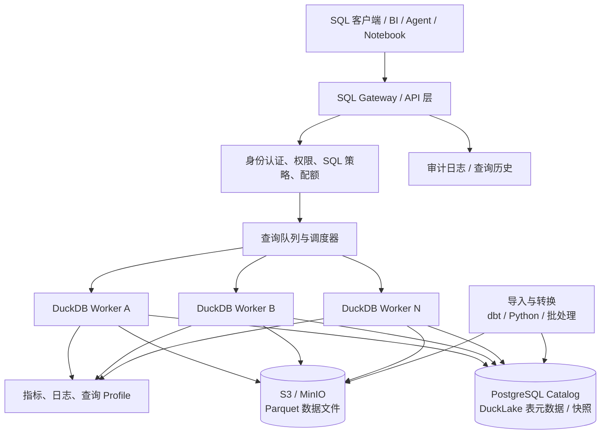
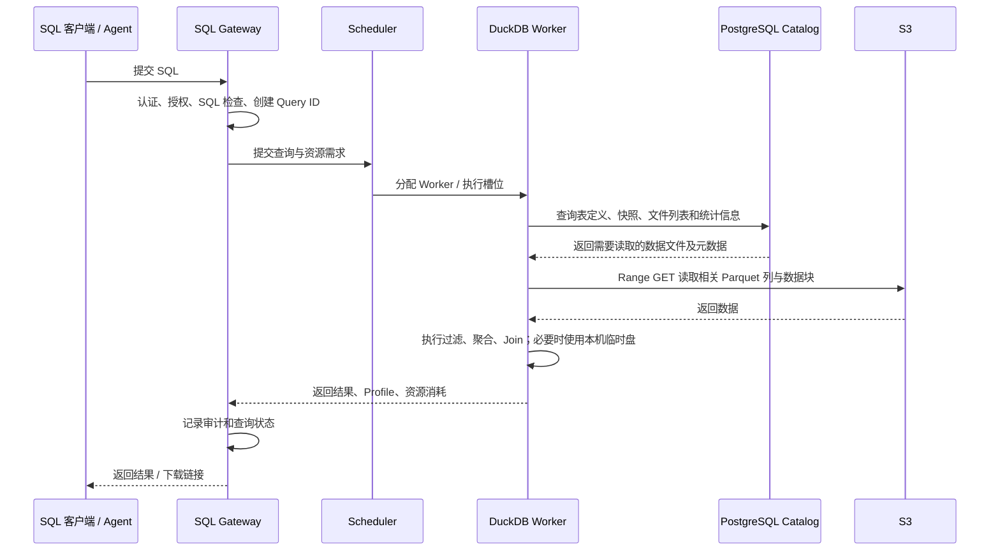
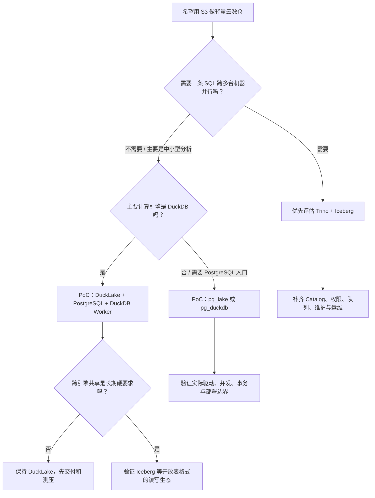

# 用 DuckDB + S3 搭一个轻量版 Snowflake：架构、开源项目与落地路线

> **研究日期：2026-10-09**  
> **结论先说：能做出“轻量云数仓”，但不是把 DuckDB 指向 S3 就等于 Snowflake。** 真正需要补齐的是表元数据和事务、统一 SQL 服务入口、权限治理、查询调度与隔离、缓存/文件整理、监控和运维。若主要是中小规模分析、批处理和 Agent/BI 查询，这条路线很有价值；若要求大查询跨多台机器并行、极高并发、开箱即用的企业治理和 SLA，就得考虑 Trino 等分布式引擎，或直接用托管数仓。

---

## 1. 先把问题说清楚：什么叫“轻量版 Snowflake”

Snowflake 不是一个单独的 SQL 引擎，而是一整套托管数据平台。官方把它分成三层：**数据存储层、计算层、云服务层**。云服务层还负责登录与权限、目录、元数据、查询解析和优化、基础设施管理等；计算层的 Virtual Warehouse 则是相互隔离的计算集群。[Snowflake 官方架构说明](https://docs.snowflake.com/en/user-guide/intro-key-concepts)

所以，“DuckDB + S3”只解决了其中一部分：

- **DuckDB**：负责执行 SQL、扫描列式数据、过滤、聚合和 Join。它的设计重点是高效的单机分析引擎。
- **S3 / S3 兼容对象存储**：负责低成本、耐久地保存 Parquet 等数据文件。
- **仍然缺的部分**：表的权威元数据、并发读写和提交协议、SQL 入口、身份与权限、查询排队和资源上限、结果缓存、审计、清理和恢复流程。

更准确的目标应该是：

> **做一个以 S3 为持久数据层、以 DuckDB 为 SQL 执行引擎、由独立元数据目录和服务层管理的轻量分析仓库。**

它可以实现存储与计算分离，但要对“分离”的程度有正确预期：文件和表的持久状态放在远端，计算 Worker 可以按需启动和销毁；但每条 SQL 通常仍由某一台机器上的 DuckDB 执行。增加 Worker 可以提高**多条 SQL 的并发吞吐**，并不自动让一条超大型 SQL 横跨几十台机器计算。

## 2. 建议架构：不要只做“DuckDB 直接读 S3”

### 2.1 推荐的初版架构

第一版推荐以 **DuckLake + PostgreSQL Catalog + S3 + DuckDB Worker + SQL/API Gateway** 为主。DuckLake 1.0 于 2026 年 4 月发布；它把表和快照等元数据放在支持事务的 SQL 数据库中，把数据本身保存在 Parquet 文件里，目标正是让对象存储和计算节点分开。[DuckLake 规范](https://ducklake.select/docs/stable/specification/introduction) · [DuckDB 官方 DuckLake 文档](https://duckdb.org/docs/current/core_extensions/ducklake)

**各组件分别解决什么问题：**

| 组件                 | 负责什么                                                          | 不应该让它承担什么                                                                 |
| -------------------- | ----------------------------------------------------------------- | ---------------------------------------------------------------------------------- |
| S3 / MinIO           | 保存 Parquet 数据文件、持久化结果、归档                           | 不负责 SQL 表目录、用户权限或查询调度                                              |
| DuckDB Worker        | 执行 SQL、过滤/聚合/Join、读取远端文件、使用本机内存与临时盘      | 不直接作为面向所有用户的权限边界；不要让所有请求共用一份可随意改写的本地数据库文件 |
| PostgreSQL Catalog   | 保存 DuckLake 的表定义、快照、文件清单和相关元数据；提供事务能力  | 不用来保存大量分析明细数据，除非这些数据本来就适合 PostgreSQL                      |
| SQL Gateway          | 验证身份、检查 SQL、分配 Query ID、限流、排队、返回结果、记录审计 | 不应把用户输入原样拼接成任意 SQL，也不应把 S3 管理密钥交给客户端                   |
| 调度器 / Worker 池   | 控制并发数、每个查询的内存/线程/时间限制，按负载增加或减少 Worker | 不应仅靠 Kubernetes 自动扩缩容就认为查询资源管理已经完成                           |
| 元数据与文件维护任务 | 统计信息、文件合并、清理孤儿文件、过期快照、备份和恢复演练        | 不要把这些维护工作寄希望于“以后自然会好”                                           |

### 2.2 一次查询实际怎么跑

这里最容易被低估的是：**查询很可能并不是 CPU 算不过来，而是远端文件太多、读取次数太多、数据布局不利于过滤、或者并发查询把内存和网络打满。** 因此，表格式、文件尺寸、分区、缓存和查询调度都属于产品架构，不是上线前再调几个参数就能解决的小问题。

### 2.3 “存算分离”不等于“没有本地状态”

持久事实应在 S3 和 Catalog；Worker 本机仍然需要临时目录、溢写空间、热数据缓存和可能的查询结果缓存。Worker 挂掉后，不能丢失已提交的数据；但未提交的中间结果可以作废并重跑。部署时应明确区分：

- **持久状态**：S3 中已提交的数据文件、Catalog 的表状态和快照、权限与审计记录。
- **可丢弃状态**：Worker 临时文件、缓存、在途查询的中间结果。
- **需要恢复的状态**：正在执行的查询可取消或重试；写入中的临时文件要由清理流程识别，不能误删仍被有效快照引用的文件。

---

## 3. 关键技术选型：DuckLake 还是 Iceberg？

这基本是第一项架构决策。不要把 Parquet、Iceberg、DuckLake 当成同一种东西：**Parquet 是数据文件格式；Iceberg 和 DuckLake 是管理表、快照和文件集合的表格式。**

### 3.1 方案 A：DuckLake + PostgreSQL Catalog

DuckLake 用 SQL 表保存元数据，用 Parquet 保存表数据；规范要求 Catalog 支持事务和主键约束。它支持快照、时间旅行、分区、Schema 演进等湖仓能力。DuckDB 扩展可以连接到本地 Catalog，也可以使用 PostgreSQL 等外部 SQL 数据库作为中心 Catalog。[DuckLake 规范](https://ducklake.select/docs/stable/specification/introduction) · [DuckLake 事务说明](https://ducklake.select/docs/stable/duckdb/advanced_features/transactions.html)

**优点**

- 组成简单，和 DuckDB 配合直接，适合用少量组件做小型分析仓库。
- 不需要把所有数据复制进一个常驻数据库文件；表数据留在对象存储的 Parquet 文件中。
- 官方文档说明 DuckLake 有 ACID 事务和快照隔离，并带有部分并发写冲突的自动重试逻辑。
- Catalog 使用常见 SQL 数据库，监控、备份和运维方式相对熟悉。

**需要注意**

- DuckLake 1.0 很新（2026 年 4 月发布）。新版本并不代表不好，但如果作为企业核心数据底座，要把跨引擎兼容性、工具支持、升级/回滚、故障恢复和实际并发压力测试列为上线前门槛。
- 若未来要让 Spark、Trino、Flink、其他数据平台广泛共同读写，先验证各引擎对 DuckLake 的读写支持和版本兼容，再决定是否用它做统一跨引擎格式。
- Catalog 数据库是关键基础设施。它的连接池、事务冲突、备份恢复和可用性都会影响整个仓库。

**适合：** 团队主力计算引擎就是 DuckDB；数据主要用于内部分析、Agent 和轻量 BI；希望少组件、低运维复杂度地先做出可用版本。

### 3.2 方案 B：Apache Iceberg + S3 + DuckDB / Trino

Iceberg 是较广泛用于湖仓的开放表格式。它用元数据文件、Manifest 和快照来记录表包含哪些数据文件，以及文件的分区与统计信息。查询引擎可先依据这些元数据排除不可能命中的文件，减少 S3 读取。[Iceberg 性能文档](https://iceberg.apache.org/docs/latest/performance/) · [Iceberg 可靠性文档](https://iceberg.apache.org/docs/latest/reliability/)

**优点**

- 跨引擎生态更成熟，适合未来让 Trino、Spark 等共享同一批数据。
- 可以让对象存储成为多个计算引擎的共同数据层，而不是将数据绑定到一个引擎的专有格式。
- Trino 的 Iceberg Connector 支持多种 Catalog，包括 Hive Metastore、AWS Glue、JDBC、REST、Nessie 等，也支持 S3 上的 Parquet 文件。[Trino Iceberg Connector](https://trino.io/docs/current/connector/iceberg.html)

**需要注意**

- 组件和配置更多；Catalog 选型、权限联动、引擎版本兼容、写入冲突处理和表维护都需要设计。
- Iceberg 能提供表格式层面的原子提交和快照能力，但它不会自动替你提供租户权限、SQL Gateway、查询队列或完整的数据治理平台。
- 小文件、Manifest 膨胀、快照不清理等问题仍需维护作业。Iceberg 官方明确建议对小文件做压缩合并，并管理过期快照。[Iceberg Maintenance](https://iceberg.apache.org/docs/latest/maintenance/)

**适合：** 从第一天就希望数据可以被多个计算引擎读写，或者预期会发展成较大的共享数据湖仓。

### 3.3 如何选

| 判断条件                                                      | 优先考虑                              | 原因                                                              |
| ------------------------------------------------------------- | ------------------------------------- | ----------------------------------------------------------------- |
| 先做轻量版本，组件越少越好，主要用 DuckDB                     | **DuckLake + PostgreSQL**             | 与 DuckDB 的组合自然，路径短，适合快速验证                        |
| 将来要让 Trino、Spark 等多个引擎共同访问                      | **Iceberg + S3 + 合适的 Catalog**     | 跨引擎互操作是主要目标                                            |
| 一条 SQL 本身就需要跨多台机器并行                             | **Trino + Iceberg**，或其他分布式引擎 | DuckDB Worker 横向增加主要扩展并发，不会自动把一条 SQL 分散到集群 |
| 目前数据主要放在 PostgreSQL，同时想做更快的分析和读取 S3 文件 | **先评估 pg_duckdb / pg_lake**        | 可以保留 PostgreSQL 的连接和使用习惯，减少另建 SQL 服务的工作     |
| 不想自己维护认证、计算编排、存储和服务层                      | **评估 MotherDuck 等托管方案**        | 买的是工程与运维能力，不只是 DuckDB 引擎                          |

---

## 4. 值得看的现成开源项目

下面把“底层组件”和“接近产品的方案”分开评估。它们并不是同一类产品，不要只按 GitHub Star 数排序。

### 4.1 项目对比表

| 项目                                                                                                                  | 定位 / 主要作用                                                                         | 与轻量 Snowflake 的关系                        | 优点                                                                                                 | 主要缺口或风险                                                                            | 建议                                                     |
| --------------------------------------------------------------------------------------------------------------------- | --------------------------------------------------------------------------------------- | ---------------------------------------------- | ---------------------------------------------------------------------------------------------------- | ----------------------------------------------------------------------------------------- | -------------------------------------------------------- |
| [DuckDB](https://github.com/duckdb/duckdb)                                                                            | 嵌入式分析 SQL 引擎，能读取 Parquet 和 S3                                               | 计算引擎核心                                   | 单机分析能力强；部署轻；能直接对远端 Parquet 做列裁剪和过滤下推                                      | 本身不是完整的多租户数仓服务；认证、权限、调度、共享表元数据等需另补                      | 必选候选，但不要把它单独当完整产品                       |
| [DuckLake](https://github.com/duckdb/ducklake)                                                                        | 基于 SQL Catalog + Parquet 的开放湖仓表格式，DuckDB 有对应扩展                          | **推荐的表/事务元数据层**                      | ACID、快照、Schema 演进；对象存储保存数据，SQL 数据库保存元数据                                      | 1.0 较新；需验证多引擎生态和生产恢复流程                                                  | 纯 DuckDB 技术栈的优先原型                               |
| [pg_lake](https://github.com/Snowflake-Labs/pg_lake)                                                                  | Snowflake Labs 开源的 PostgreSQL 湖仓扩展，Iceberg / 外部文件访问部分执行由 DuckDB 支撑 | 最接近“拿现成项目拼一个轻量数据仓库”的候选之一 | PostgreSQL 接口；可创建和修改 Iceberg 表；可查询/导入/导出 S3 上的 Parquet、CSV、JSON 等；Apache-2.0 | 需要 PostgreSQL 扩展与独立 `pgduck_server` 等组件；要认真验证平台支持、升级路径和真实负载 | **强烈建议 PoC**，尤其是团队习惯 PostgreSQL 协议和工具时 |
| [pg_duckdb](https://github.com/duckdb/pg_duckdb)                                                                      | 将 DuckDB 分析引擎集成到 PostgreSQL，支持读取湖仓/外部数据                              | PostgreSQL 应用与分析融合方案                  | 不必另做完整 SQL 客户端体验；可直接处理 S3、Parquet、Iceberg、Delta 等                               | 它不是一个完整的托管仓库平台；部署、版本和执行路径需验证                                  | 现有 PostgreSQL 是主要入口时值得评估                     |
| [Trino](https://github.com/trinodb/trino) + [Iceberg Connector](https://trino.io/docs/current/connector/iceberg.html) | 分布式 SQL 查询引擎                                                                     | 更适合需要集群内分布式执行的数仓/湖仓          | Query 可由多个 Worker 分担；支持 Iceberg、S3 和多个 Catalog                                          | 部署和调优复杂得多；Catalog、权限、队列、缓存、运维仍要配置                               | 若单机 DuckDB 到了瓶颈，优先做对照测试                   |
| [MotherDuck](https://motherduck.com/docs/concepts/architecture-and-capabilities/)                                     | 基于 DuckDB 的托管云数仓                                                                | 在产品层面很接近理想目标                       | 提供云端计算、目录、认证与分享、可读写的托管存储和专用计算实例等                                     | 这是商业托管服务，不是可以完整自托管的开源 Snowflake 替代品                               | 作为“自己造服务层值不值”的成本基准                       |

### 4.2 为什么特别推荐测试 pg_lake

`pg_lake` 由 Snowflake Labs 维护，仓库采用 Apache 2.0 许可证。项目说明中列出的能力包括：创建和修改 Iceberg 表、直接查询对象存储中的数据文件、导入导出 Parquet/CSV/JSON，以及通过独立的 `pgduck_server` 将部分分析执行交给 DuckDB。它可以用 Docker 启动测试环境。[pg_lake 仓库与 README](https://github.com/Snowflake-Labs/pg_lake)

它的价值不是“它已经等同 Snowflake”，而是**用现成代码覆盖了一些你本来得自己集成的部分**。建议把它纳入首轮 PoC，而不要只因为仓库名里有 Snowflake 就直接用于生产。

PoC 至少验证以下事项：

1. 用真实 S3 / MinIO 数据建表、读写 Iceberg 表，并从第二个进程或引擎读取结果。
2. 同时跑分析查询、批量写入和 DDL，验证冲突、失败重试与恢复行为。
3. 用目标 BI 工具、驱动和 ORM 做连接测试，不能只看 `psql` 能连接。
4. 验证 Docker 镜像、操作系统/CPU 架构、PostgreSQL 与 DuckDB 版本组合；固定版本并复现部署。
5. 验证对象存储凭证、TLS、私有网络、备份恢复、缓存占用和生产日志输出。
6. 测出实际查询吞吐、尾延迟和资源消耗，再判断它是否优于自己组合 DuckLake + DuckDB Worker。

### 4.3 为什么 MotherDuck 也值得研究，但不能当开源方案

MotherDuck 官方架构把服务层、专用 DuckDB 计算实例（Ducklings）、目录、托管存储、身份/分享/管理以及读扩展能力都组合在一起，还支持在本地 DuckDB 与云端之间路由查询。[MotherDuck 架构说明](https://motherduck.com/docs/concepts/architecture-and-capabilities/)

这给自研项目一个很实际的参照：**DuckDB 引擎本身通常不是最大工作量，生产级“云数仓产品化”才是。** MotherDuck 的核心服务是商业托管的，不能简单理解为一个可以下载后完整自托管的开源项目。研究它是为了理解需要补哪些产品层能力，而不是把它作为纯开源部署包。

---

## 5. 具体该怎么做：分阶段实现

不要一上来就复刻完整 Snowflake。先明确用户场景，做出一条端到端的可观测查询链路，再逐步加并发、治理和运维能力。

### 阶段 0：明确第一版边界

第一版建议只承诺：

- 数据以批量文件、Parquet 和 SQL 转换为主；
- S3 是持久数据层；DuckLake / Iceberg 管理表状态；
- 一条 SQL 使用一个 DuckDB Worker（可以使用该 Worker 的多线程）；
- 横向扩展以提高**并发查询数**为主；
- 不承诺跨 Worker 的单 SQL 分布式执行；
- 不把它作为交易型 OLTP 数据库；
- 不宣称已经具备 Snowflake 等级的治理、可用性或合规认证。

这几条边界可以挡掉大量不必要的复杂度，也避免因为“轻量版 Snowflake”这个名字把团队带去造一个没有明确终点的平台。

### 阶段 1：选表格式并建数据底座

如果先用 DuckLake：

1. 创建 S3 Bucket 和按环境隔离的 Prefix，例如 `dev/`、`test/`、`prod/`，并开启服务端加密、版本控制（按恢复需求决定保留策略）和访问日志。
2. 建独立 PostgreSQL 数据库作为 DuckLake Catalog；不要和业务交易数据库混用资源，也不要允许终端用户直接拥有 Catalog 管理权限。
3. 配置 DuckDB Worker 使用短期身份凭证或工作负载身份访问 S3。尽量用 IAM Role / Workload Identity，不把长期 Access Key 写在 SQL、源码或用户配置里。
4. 固定 DuckDB、DuckLake 扩展和 Catalog 版本。将扩展安装包纳入镜像或内部制品管理，避免 Worker 启动时随意从公网下载依赖。
5. 做第一组表：原始落地、清洗后、面向分析的业务表。通过 SQL Views 或 dbt 模型提供稳定的业务口径。

如果从一开始需要多引擎共享，就先把同样的对象存储和数据组织原则保留，将表层替换成 Iceberg，并选定一个受支持的 Catalog。不要先用任意 Parquet 文件路径冒充“已治理的表”。

### 阶段 2：开发最小可用的 SQL Gateway

Gateway 可以用团队熟悉的 FastAPI 或 Node.js 实现，职责保持清楚：

- 建立认证：接企业 OIDC / SSO，服务账号和人的访问身份分开。
- 每次请求生成 Query ID；记录提交人、租户/团队、SQL 指纹、开始/结束时间、数据集标识、状态、错误、读取字节数、耗时和资源使用。
- 做 SQL 解析与策略检查。至少限制危险语句、任意 `ATTACH`、任意文件路径访问、任意外部网络访问、扩展安装、写入未授权 S3 Prefix 和资源配置修改。
- 统一设置 `memory_limit`、`threads`、超时、结果行数、并发槽位和临时目录上限。
- 支持取消查询、查询历史、结果分页或生成受控下载文件。
- 对长查询排队，避免所有 API 请求同时创建大规模 DuckDB 任务。

**不能只靠字符串黑名单来实现 SQL 安全。** 应使用 SQL Parser/AST 检查，执行时再通过进程/容器边界限制文件、网络和身份权限。模型或 Agent 即使能生成 SQL，也不能拥有超出当前用户权限的 S3 / Catalog 权限。

建议把控制面数据表与 DuckLake Catalog 逻辑隔离：用户、角色、项目、策略、审计和作业状态属于平台控制面；DuckLake 自己的内部元数据属于表格式实现。两者可以使用不同数据库，至少也要分开 Schema、账号和权限，避免业务逻辑意外改写格式内部表。

### 阶段 3：实现 Worker 池和资源隔离

每个 Worker 是可替换的计算实例。第一版可以是固定数量的容器，先不要急于做复杂 Serverless：

- 对每个查询分配独立执行槽位，设定每个 Worker 可同时执行的查询数。
- 控制 DuckDB 单查询线程数，防止“每个查询都开满 CPU 线程”造成过度订阅。
- 为溢写设置独立临时盘，并监控剩余空间；容器重启后清理可丢弃的临时文件。
- 让 Worker 通过 Catalog 访问已提交的表，而不是把本地 `.duckdb` 文件当成跨 Pod 共享的主库。
- 给交互查询、定时 ETL 和大批量导入分配不同队列/资源池，防止一个大任务拖慢所有人的小查询。
- 在负载稳定后，再按队列深度、等待时间、CPU、内存和 S3 吞吐做自动扩缩容。

DuckDB 官方文档解释了原生数据库格式的并发边界：同一进程内支持读写并发；多个进程可同时只读，但不能把普通本地 DuckDB 文件当成任意多进程同时写的数据库。官方文档同时建议稳定的多进程共享数据场景考虑使用 PostgreSQL Catalog 的 DuckLake。[DuckDB 并发文档](https://duckdb.org/docs/current/connect/concurrency)

### 阶段 4：做好数据布局与表维护

只把数据放到 S3，不等于查询就会快。至少要设计：

- **Parquet 文件大小**：避免每个文件只有几 KB 或几 MB。太多小文件会增加请求和元数据开销；过大的文件又会降低并行度和局部读取效率。目标大小应通过实际文件系统、查询并发和数据分布压测确定，不要照搬单一数字。
- **分区策略**：按常用过滤条件和数据规模来定，避免按高基数 ID 建出海量小分区。分区字段应服务真实查询，不是越多越好。
- **排序 / 聚簇**：经常按时间、账户或业务维度过滤的数据，考虑在写入时按常用谓词排序，以增加跳过无关文件的机会。
- **统计信息**：确保表和文件统计被收集或更新，让优化器有机会挑选更合理的执行计划。
- **Compaction（文件合并）**：定期把持续追加产生的小文件合并为更大的文件；对频繁更新、删除的表关注删除文件和数据重写开销。
- **快照清理**：设置快照保留期和孤儿文件清理流程；先确认没有有效快照引用相关文件再删，不能用简单的 S3 生命周期策略误删仍在使用的表数据。
- **结果缓存**：可在 Gateway 层缓存确定性查询结果，但缓存键要包含用户/权限上下文、数据版本或快照、SQL 参数和影响结果的会话选项。权限改变后不能继续复用旧缓存。

Iceberg 官方文档指出，Manifest 里的分区和列统计可以帮助排除无需读取的数据文件；同时，小文件和不断累积的快照需要维护。[Iceberg 性能](https://iceberg.apache.org/docs/latest/performance/) · [Iceberg 维护](https://iceberg.apache.org/docs/latest/maintenance/)。DuckDB 对直接读取 Parquet 的查询也支持列裁剪和过滤下推，但实际收益取决于文件布局与统计信息。[DuckDB Parquet 文档](https://duckdb.org/docs/current/guides/file_formats/query_parquet)

### 阶段 5：补上企业使用需要的治理能力

下面这些不应该等到“平台做大之后”才开始考虑，尤其当数据涉及金融、客户或员工信息时：

| 能力         | 最低可用做法                                                  | 后续增强方向                                               |
| ------------ | ------------------------------------------------------------- | ---------------------------------------------------------- |
| 身份认证     | OIDC / SSO；人和服务账号分开                                  | SCIM、短期凭证、强认证和生命周期管理                       |
| 数据权限     | 默认拒绝；按数据集/Schema/租户做授权；Worker 使用最小权限身份 | 行列级策略、动态数据脱敏、属性型访问控制                   |
| 对象存储隔离 | 按环境/租户划分 Bucket 或 Prefix，并用 IAM 做强制限制         | 高敏租户独立账户、独立密钥、独立 Catalog/Worker            |
| SQL 安全     | AST 检查、危险函数/语句控制、路径限制、资源配额               | 基于语义层的字段授权、策略决策点（PDP）和策略执行点（PEP） |
| 审计         | 不可随用户修改的提交、授权、执行和结果元数据日志              | 与企业 SIEM、数据访问审计平台联动，配置留存和防篡改        |
| 可观测性     | Query ID、耗时、状态、错误、扫描字节、CPU/内存、队列等待时间  | Profile 分析、慢查询诊断、数据集级成本归因                 |
| 可靠性       | Catalog 备份、S3 保护策略、Worker 无状态化、故障注入演练      | 多 AZ、恢复时间/恢复点目标、自动重试与灾备演练             |
| 业务语义     | 用有版本的 Views / dbt 模型定义指标和业务口径                 | 语义层、数据契约、数据血缘与质量检查                       |

一个重要原则：**SQL 语句被记录下来，不等于审计已经完成。** 还要能回答是谁以什么身份执行、当时通过了什么策略、引用了哪些数据集、实际读取了什么范围、修改了哪些表、使用哪个表快照、输出交给了谁。如果 Gateway 只能记录 SQL 文本，它仍然不具备成熟企业数仓的完整审计能力。

### 阶段 6：用真实工作负载验证，不要用宣传数字决策

至少准备一组代表真实使用的查询：大表过滤、聚合、宽表 Join、时间范围查询、维表 Join、增量写入后立即查询、多个用户并发查询、长查询和取消查询。每个查询分别测冷缓存和热缓存。

建议测试矩阵：

| 维度     | 建议测试档位                                                                                        |
| -------- | --------------------------------------------------------------------------------------------------- |
| 数据规模 | 1 GB、10 GB、100 GB，之后按实际业务扩大                                                             |
| 同时查询 | 1、5、10、20 个并发请求，按预期使用量增减                                                           |
| 缓存状态 | 冷缓存、热缓存、Worker 重启后首次执行                                                               |
| 查询类型 | 点过滤、扫描聚合、大 Join、排序、窗口函数、导入/追加、并发写                                        |
| 故障场景 | Worker 中断、Catalog 短暂不可用、S3 请求失败、查询取消、提交时冲突                                  |
| 指标     | p50/p95 延迟、每秒完成查询数、队列等待、扫描字节、CPU/内存、临时盘、S3 请求量、失败率和单位查询成本 |

把同一组 SQL 跑在 DuckDB + DuckLake 和 Trino + Iceberg 上。若业务查询可轻松在一台大内存机器上完成，而且用户并发中等，DuckDB 方案可能更简单、更便宜；若瓶颈是单查询 CPU/内存，或者需要多 Worker 对一条查询做分布式执行，就应该认真比较 Trino 等方案。

---

## 6. 与真正 Snowflake 最大的差别是什么

不要把差异简化成“Snowflake 贵、DuckDB 免费”。最大的差别是 Snowflake 把很多难题作为一个完整托管服务交付了，而自建方案需要自己负责集成、运行和兜底。

| 维度                | 轻量版（DuckDB + S3 + DuckLake / Iceberg + 自建服务）                               | Snowflake                                                                           |
| ------------------- | ----------------------------------------------------------------------------------- | ----------------------------------------------------------------------------------- |
| 存储格式            | 通常为开放的 Parquet + DuckLake 或 Iceberg 元数据；数据布局需要自行维护             | Snowflake 原生表有内部优化的列式存储和 Micro-partition；也支持外部 Iceberg 表       |
| 查询执行            | DuckDB 主要是单机多线程；多个 Worker 可增加独立查询的并发吞吐                       | Virtual Warehouse 是计算集群，支持集群内 MPP 执行；Warehouse 之间计算资源相互隔离   |
| 单条 SQL 的横向扩展 | DuckDB Worker 变多，不会自动让单条 SQL 跨 Worker 分布式执行                         | 原生 Warehouse 的 MPP 架构可将查询计算分摊到多个节点                                |
| 表元数据            | DuckLake 依赖 SQL Catalog；Iceberg 依赖自身元数据和 Catalog；需要做运维和兼容性管理 | 集成式元数据、目录、优化器和管理服务                                                |
| 文件与物理布局      | 需自行设计写入、分区、排序、Compaction、快照过期与孤儿文件清理                      | 原生 Snowflake 表的内部文件组织、压缩和 Micro-partition 由平台管理                  |
| 权限和治理          | Gateway、身份、行列权限、凭证隔离、审计和策略需自行做并验证                         | 平台内建身份/访问控制、Horizon Catalog 等服务和企业功能（具体能力取决于功能与配置） |
| 并发隔离            | 需要自行做队列、Worker 池、资源上限和租户隔离                                       | 可使用独立 Virtual Warehouse 隔离计算资源，并配置自动挂起/恢复和扩展策略            |
| 高可用与恢复        | 由团队负责 Catalog 备份、对象存储策略、升级、故障演练、监控告警                     | 由 Snowflake 托管大量基础设施、软件升级和平台运维                                   |
| 成本控制            | 组件较简单，但需要自己算 Worker、S3 请求/流量、Catalog、缓存、运维人力和故障成本    | 按 Snowflake 的计算、存储与相关服务计费，换取托管能力和服务体系                     |
| SQL / 生态兼容      | DuckDB 方言和函数覆盖需按客户端与工作负载实测；不同开放表格式的功能也有差别         | 提供 Snowflake 自己的 SQL 引擎和围绕它构建的工具/服务生态                           |
| 服务等级与合规      | 没有自动继承 Snowflake 的 SLA、审计材料或认证；要自己建立控制与证据                 | 可购买/使用其提供的服务等级、合规计划与企业功能，具体依合同和配置而定               |

Snowflake 对自己的架构说明得很清楚：数据存储、计算和云服务是三个主要层；它负责存储组织与 Micro-partition，Virtual Warehouse 是独立计算集群，云服务层处理认证、权限、目录、元数据和查询优化等。[Snowflake 官方架构文档](https://docs.snowflake.com/en/user-guide/intro-key-concepts)

从工程角度看，最难复制的部分不只是一个更快的查询引擎，而是：**跨节点执行与容错、表/文件自动管理、稳定的并发隔离、权限和治理、持续运维以及服务质量承诺。** 这就是为什么可以用开源组件做出一个可用的轻量数仓，却不应宣称它与 Snowflake 等价。

---

## 7. 性能和成本：省了什么，新增了什么

### 7.1 可能省下来的部分

- 不需要把全部数据复制进一个专有的托管仓库；若原始数据已经在 S3，可直接查询符合格式的数据。
- DuckDB 是一个轻量的分析引擎，许多查询可以在单台机器内执行，避免一开始就维护分布式查询集群。
- 数据采用开放文件/表格式，数据可被其他支持相应格式的引擎继续利用，减少绑定。
- Worker 可以根据需求扩缩，不必让同一台大计算机一直开着，但自动扩缩仍需要开发和调试。

### 7.2 常被低估的成本

- **对象存储读取**：大量小文件、重复扫描、S3 请求频繁或跨区域访问都可能增加延迟和成本。
- **缓存**：本地 SSD 缓存能加速重复查询，但会产生容量、淘汰、权限和一致性管理成本。
- **Catalog 数据库**：查询规划和写入提交会访问 Catalog；必须考虑连接池、事务冲突、备份、故障切换和版本升级。
- **Worker 的闲置与冷启动**：如果每条查询都启动新容器，启动时间可能高于查询本身；常驻 Worker 则有空闲资源成本。
- **平台工程人力**：Gateway、授权、审计、运维、升级、文件维护、故障恢复和 BI 兼容的成本可能远高于最初的引擎部署成本。
- **没有开箱即用的跨节点执行**：如果一条 SQL 超过单机内存/CPU能力，继续增加 DuckDB Worker 可能不会解决根本瓶颈，需要换分布式引擎或改变查询/数据模型。

### 7.3 粗略成本模型

不要只比较 S3 存储价格和 Snowflake 账单。最少应按月统计：

`总成本 = Worker 计算 + S3 存储 + S3 请求/数据传输 + PostgreSQL Catalog + 本地缓存/临时盘 + 监控日志 + 工程维护人力`

再用业务能够理解的指标比较：

- 每 1,000 条成功查询的成本；
- 每 GB 被扫描数据的成本；
- p95 查询延迟；
- 高峰期等待时间与失败率；
- 每个业务团队或数据产品消耗的成本。

若主要是小而频繁的 Agent 查询，应特别测冷启动与并发；如果主要是每天几次的大批量作业，则更应关注总扫描字节、单机资源上限和任务调度。

---

## 8. 常见坑：提前避开这些设计

1. **把 S3 当数据库。** S3 只是对象存储。任意 Parquet 文件路径无法自然解决表的原子更新、快照、并发修改、Schema 演进和跨引擎一致性；应使用 DuckLake 或 Iceberg 等表格式管理正式表。
2. **多个进程同时写同一个本地 DuckDB 文件。** 普通 DuckDB 原生数据库文件不应被当作共享的多进程写入数据库。要用受支持的客户端/服务模式，或采用带中心 Catalog 的湖仓表格式。参考[DuckDB 并发说明](https://duckdb.org/docs/current/connect/concurrency)。
3. **直接把 S3 凭证放进 Agent 提示词或 SQL。** 凭证应由服务端凭证管理与工作负载身份提供；用户身份与 Worker 的实际访问权限要能对应起来。
4. **把“SQL 可以运行”误认为“SQL 安全”。** DuckDB 能读文件和调用扩展；必须限制路径、外网、扩展、任意 Attach、资源和写入范围。Agent 的自然语言意图不是访问授权。
5. **忽略小文件和快照维护。** 数据越写越碎，查询计划和 S3 请求会越来越慢；没有过期快照和孤儿文件清理流程，存储也可能持续上涨。
6. **只测单用户、热缓存。** 生产问题往往发生在冷缓存、多个查询同时做大 Join、临时盘满、Catalog 短暂不可用等场景。
7. **把查询日志当成完整审计。** 需要把身份、策略判定、数据集/快照、执行资源、变更范围和结果去向串起来。
8. **过早做“Serverless”。** 先把固定 Worker 池、队列和配额做正确，再判断动态扩缩容是否真的节省成本。
9. **低估 SQL 方言和客户端兼容。** 用目标驱动、BI 工具、ORM、数据建模工具真实验证，不能因为都支持 SQL 就假设兼容。
10. **把新开源项目直接视作成熟生产平台。** 重点检查版本兼容、开放问题、升级路径、故障恢复和维护者响应；在自己数据上做 PoC。

---

## 9. 最终建议：按你的目标选一条主线

### 路线一：最轻、最快跑起来

**DuckDB + DuckLake + PostgreSQL Catalog + S3 + 一个简单 Gateway + 固定 Worker 池。**

适合先做内部数据分析、Agent 查询、数据建模和业务语义层验证。初期不必做复杂的分布式执行，但权限边界、审计、资源上限和数据维护要有基本实现。

### 路线二：优先使用现成整合代码

**优先 PoC `pg_lake`，并同时测 `pg_duckdb`。**

如果希望保留 PostgreSQL 接口、直接接现有工具，并由 Postgres 承担不少目录/事务职责，这条路线能减少自研集成工作。要用真实查询验证它能否覆盖目标 workload，不要只根据项目描述判断。

### 路线三：面向多引擎和更大规模

**S3 + Iceberg + Trino + 明确选定的 Catalog；Gateway 和治理单独设计。**

这条路更重，但当问题从“很多独立查询”变为“一条查询本身要多机并行”时，分布式引擎更合理。也更适合让 Spark、Trino 等多种工具共同访问数据。

### 路线四：先买服务，再决定自研值不值

**用 MotherDuck 做成本与产品能力的参照。**

如果自研的主要理由只是想免维护地使用云端 DuckDB，先算一算托管服务和自建平台的总成本。自建很可能在存储和引擎授权方面便宜，但要自行承担服务层、治理、升级和故障处理。

### 决策树

**我的推荐顺序是：**

1. 先用 1–2 周的原型验证真实 SQL 与数据布局，比较 DuckLake + DuckDB 和 `pg_lake`；如果已明确需要分布式查询，同时加入 Trino + Iceberg 对照组。
2. 不以单次跑分做选择，使用同一组业务查询测数据量、并发、冷/热缓存、故障与成本。
3. 若 DuckDB 单机足以满足查询时间和并发目标，就优先保留简单架构；只有当测量结果显示单条查询需要多机算力时，再引入分布式执行。
4. 把企业级访问控制、SQL 策略、审计、数据快照和恢复能力视为第一版的基本门槛，而不是“未来再补”的附加功能。

---

## 10. 参考资料（官方文档和项目主页优先）

### DuckDB / DuckLake

1. [DuckDB：S3 API Support](https://duckdb.org/docs/current/core_extensions/httpfs/s3api) — S3 对象读取、写入、列举与凭证设置。
2. [DuckDB：S3 Parquet Import](https://duckdb.org/docs/current/guides/network_cloud_storage/s3_import) — 直接从 S3 查询 Parquet 的配置方式。
3. [DuckDB：Querying Parquet Files](https://duckdb.org/docs/current/guides/file_formats/query_parquet) — 列裁剪、过滤下推和 Parquet 查询。
4. [DuckDB：Concurrency](https://duckdb.org/docs/current/connect/concurrency) — 原生文件的多进程并发边界，以及 DuckLake 等共享方案的说明。
5. [DuckLake 规范 Introduction](https://ducklake.select/docs/stable/specification/introduction) — Catalog 与 Parquet 数据存储的构成要求。
6. [DuckLake 事务](https://ducklake.select/docs/stable/duckdb/advanced_features/transactions.html) — ACID、快照隔离和事务语义。
7. [DuckLake GitHub](https://github.com/duckdb/ducklake) — 代码、许可证、版本和开发状态。

### 开源整合方案 / 托管产品

8. [Snowflake Labs：pg_lake](https://github.com/Snowflake-Labs/pg_lake) — PostgreSQL、DuckDB 与 Iceberg / 对象存储的整合实现，包含启动方式和示例。
9. [DuckDB：pg_duckdb](https://github.com/duckdb/pg_duckdb) — PostgreSQL 与 DuckDB 分析执行集成。
10. [MotherDuck Architecture and Capabilities](https://motherduck.com/docs/concepts/architecture-and-capabilities/) — 观察托管 DuckDB 数仓怎样补足目录、身份、分享、计算隔离与管理服务。

### Iceberg / Trino / Snowflake

11. [Apache Iceberg：Performance](https://iceberg.apache.org/docs/latest/performance/) — Manifest、统计信息和文件裁剪。
12. [Apache Iceberg：Reliability](https://iceberg.apache.org/docs/latest/reliability/) — 快照和原子提交的可靠性设计。
13. [Apache Iceberg：Maintenance](https://iceberg.apache.org/docs/latest/maintenance/) — 快照过期、小文件合并和 Manifest 维护。
14. [Trino：Iceberg Connector](https://trino.io/docs/current/connector/iceberg.html) — 对象存储、Catalog 选择、表格式和分布式查询支持。
15. [Snowflake：Key Concepts and Architecture](https://docs.snowflake.com/en/user-guide/intro-key-concepts) — 存储、计算和云服务三层架构、Micro-partition、Virtual Warehouse 与云服务职责。

---

## 结论

**可以做，而且值得做；但做法不是“DuckDB 直接连 S3 就完工”。** 一个有实用价值的轻量版，应当是：开放的对象存储负责持久数据，DuckLake 或 Iceberg 管理表和快照，DuckDB 负责轻量分析计算，PostgreSQL 或合适的 Catalog 管理元数据，再用一层服务把身份、权限、资源、审计和生命周期管理起来。

如果主要追求低复杂度、单机分析性能和多条查询的并发扩展，先做 DuckLake + DuckDB Worker。如果更看重现成的 PostgreSQL 整合，务必把 `pg_lake` 放进 PoC。如果单条查询要用到多台机器，或者未来必须由多个引擎共同读写数据，就应认真评估 Trino + Iceberg。它们是不同的路线，不存在一个组件组合可以同时获得极简部署、任意规模分布式计算和完整托管企业治理而无需代价。
