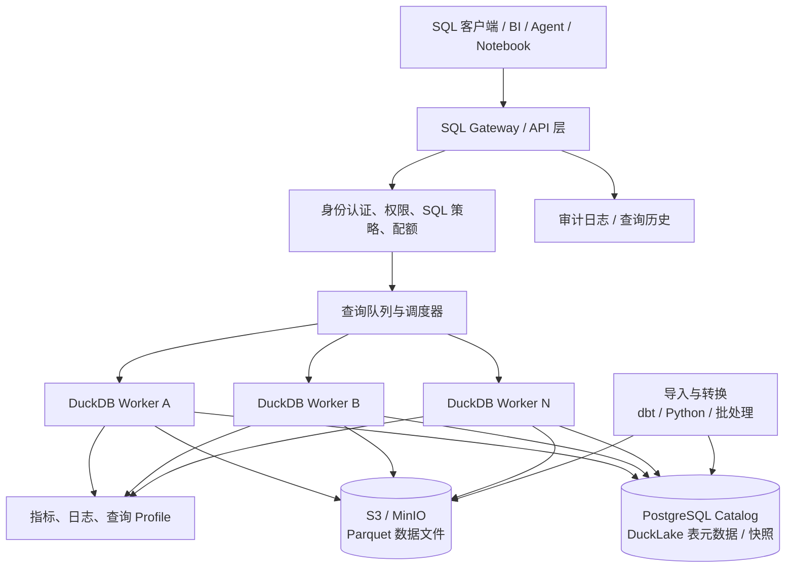
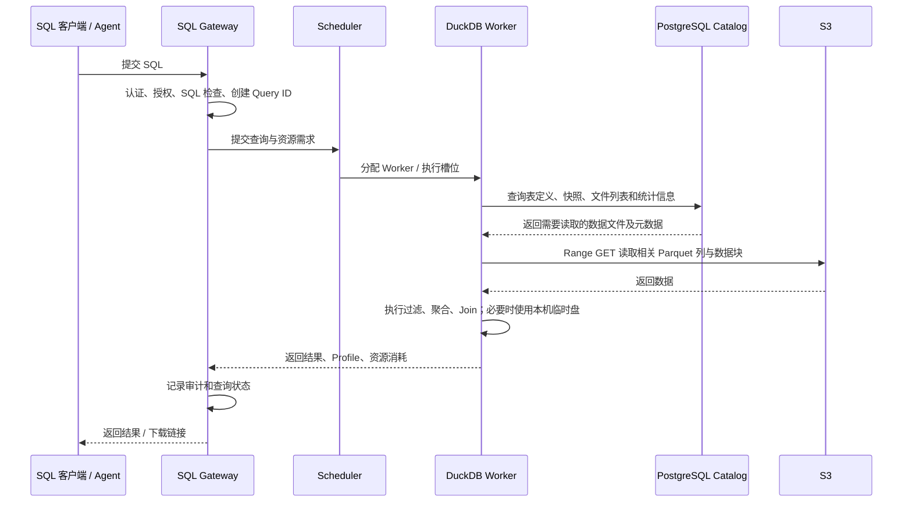
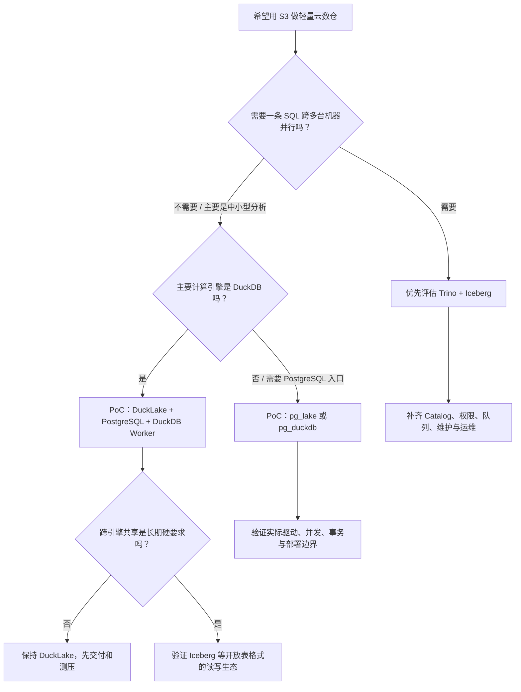

# 用 DuckDB + S3 搭一个轻量版 Snowflake：架构、开源项目与落地路线

> **研究日期：2026-10-09**  
> **结论先说：能做出“轻量云数仓”，但不是把 DuckDB 指向 S3 就等于 Snowflake。** 真正需要补齐的是表元数据和事务、统一 SQL 服务入口、权限治理、查询调度与隔离、缓存/文件整理、监控和运维。若主要是中小规模分析、批处理和 Agent/BI 查询，这条路线很有价值；若要求大查询跨多台机器并行、极高并发、开箱即用的企业治理和 SLA，就得考虑 Trino 等分布式引擎，或直接用托管数仓。

---

## 1. 先把问题说清楚：什么叫“轻量版 Snowflake”

Snowflake 不是一个单独的 SQL 引擎，而是一整套托管数据平台。官方把它分成三层：**数据存储层、计算层、云服务层**。云服务层还负责登录与权限、目录、元数据、查询解析和优化、基础设施管理等；计算层的 Virtual Warehouse 则是相互隔离的计算集群。[Snowflake 官方架构说明](https://docs.snowflake.com/en/user-guide/intro-key-concepts)

所以，“DuckDB + S3”只解决了其中一部分：

- **DuckDB**：负责执行 SQL、扫描列式数据、过滤、聚合和 Join。它的设计重点是高效的单机分析引擎。
- **S3 / S3 兼容对象存储**：负责低成本、耐久地保存 Parquet 等数据文件。
- **仍然缺的部分**：表的权威元数据、并发读写和提交协议、SQL 入口、身份与权限、查询排队和资源上限、结果缓存、审计、清理和恢复流程。

更准确的目标应该是：

> **做一个以 S3 为持久数据层、以 DuckDB 为 SQL 执行引擎、由独立元数据目录和服务层管理的轻量分析仓库。**

它可以实现存储与计算分离，但要对“分离”的程度有正确预期：文件和表的持久状态放在远端，计算 Worker 可以按需启动和销毁；但每条 SQL 通常仍由某一台机器上的 DuckDB 执行。增加 Worker 可以提高**多条 SQL 的并发吞吐**，并不自动让一条超大型 SQL 横跨几十台机器计算。

## 2. 建议架构：不要只做“DuckDB 直接读 S3”

### 2.1 推荐的初版架构

第一版推荐以 **DuckLake + PostgreSQL Catalog + S3 + DuckDB Worker + SQL/API Gateway** 为主。DuckLake 1.0 于 2026 年 4 月发布；它把表和快照等元数据放在支持事务的 SQL 数据库中，把数据本身保存在 Parquet 文件里，目标正是让对象存储和计算节点分开。[DuckLake 规范](https://ducklake.select/docs/stable/specification/introduction) · [DuckDB 官方 DuckLake 文档](https://duckdb.org/docs/current/core_extensions/ducklake)

**各组件分别解决什么问题：**

| 组件                 | 负责什么                                                          | 不应该让它承担什么                                                                 |
| -------------------- | ----------------------------------------------------------------- | ---------------------------------------------------------------------------------- |
| S3 / MinIO           | 保存 Parquet 数据文件、持久化结果、归档                           | 不负责 SQL 表目录、用户权限或查询调度                                              |
| DuckDB Worker        | 执行 SQL、过滤/聚合/Join、读取远端文件、使用本机内存与临时盘      | 不直接作为面向所有用户的权限边界；不要让所有请求共用一份可随意改写的本地数据库文件 |
| PostgreSQL Catalog   | 保存 DuckLake 的表定义、快照、文件清单和相关元数据；提供事务能力  | 不用来保存大量分析明细数据，除非这些数据本来就适合 PostgreSQL                      |
| SQL Gateway          | 验证身份、检查 SQL、分配 Query ID、限流、排队、返回结果、记录审计 | 不应把用户输入原样拼接成任意 SQL，也不应把 S3 管理密钥交给客户端                   |
| 调度器 / Worker 池   | 控制并发数、每个查询的内存/线程/时间限制，按负载增加或减少 Worker | 不应仅靠 Kubernetes 自动扩缩容就认为查询资源管理已经完成                           |
| 元数据与文件维护任务 | 统计信息、文件合并、清理孤儿文件、过期快照、备份和恢复演练        | 不要把这些维护工作寄希望于“以后自然会好”                                           |

### 2.2 一次查询实际怎么跑

这里最容易被低估的是：**查询很可能并不是 CPU 算不过来，而是远端文件太多、读取次数太多、数据布局不利于过滤、或者并发查询把内存和网络打满。** 因此，表格式、文件尺寸、分区、缓存和查询调度都属于产品架构，不是上线前再调几个参数就能解决的小问题。

### 2.3 “存算分离”不等于“没有本地状态”

持久事实应在 S3 和 Catalog；Worker 本机仍然需要临时目录、溢写空间、热数据缓存和可能的查询结果缓存。Worker 挂掉后，不能丢失已提交的数据；但未提交的中间结果可以作废并重跑。部署时应明确区分：

- **持久状态**：S3 中已提交的数据文件、Catalog 的表状态和快照、权限与审计记录。
- **可丢弃状态**：Worker 临时文件、缓存、在途查询的中间结果。
- **需要恢复的状态**：正在执行的查询可取消或重试；写入中的临时文件要由清理流程识别，不能误删仍被有效快照引用的文件。

---

## 3. 关键技术选型：DuckLake 还是 Iceberg？

这基本是第一项架构决策。不要把 Parquet、Iceberg、DuckLake 当成同一种东西：**Parquet 是数据文件格式；Iceberg 和 DuckLake 是管理表、快照和文件集合的表格式。**

### 3.1 方案 A：DuckLake + PostgreSQL Catalog

DuckLake 用 SQL 表保存元数据，用 Parquet 保存表数据；规范要求 Catalog 支持事务和主键约束。它支持快照、时间旅行、分区、Schema 演进等湖仓能力。DuckDB 扩展可以连接到本地 Catalog，也可以使用 PostgreSQL 等外部 SQL 数据库作为中心 Catalog。[DuckLake 规范](https://ducklake.select/docs/stable/specification/introduction) · [DuckLake 事务说明](https://ducklake.select/docs/stable/duckdb/advanced_features/transactions.html)

**优点**

- 组成简单，和 DuckDB 配合直接，适合用少量组件做小型分析仓库。
- 不需要把所有数据复制进一个常驻数据库文件；表数据留在对象存储的 Parquet 文件中。
- 官方文档说明 DuckLake 有 ACID 事务和快照隔离，并带有部分并发写冲突的自动重试逻辑。
- Catalog 使用常见 SQL 数据库，监控、备份和运维方式相对熟悉。

**需要注意**

- DuckLake 1.0 很新（2026 年 4 月发布）。新版本并不代表不好，但如果作为企业核心数据底座，要把跨引擎兼容性、工具支持、升级/回滚、故障恢复和实际并发压力测试列为上线前门槛。
- 若未来要让 Spark、Trino、Flink、其他数据平台广泛共同读写，先验证各引擎对 DuckLake 的读写支持和版本兼容，再决定是否用它做统一跨引擎格式。
- Catalog 数据库是关键基础设施。它的连接池、事务冲突、备份恢复和可用性都会影响整个仓库。

**适合：** 团队主力计算引擎就是 DuckDB；数据主要用于内部分析、Agent 和轻量 BI；希望少组件、低运维复杂度地先做出可用版本。

### 3.2 方案 B：Apache Iceberg + S3 + DuckDB / Trino

Iceberg 是较广泛用于湖仓的开放表格式。它用元数据文件、Manifest 和快照来记录表包含哪些数据文件，以及文件的分区与统计信息。查询引擎可先依据这些元数据排除不可能命中的文件，减少 S3 读取。[Iceberg 性能文档](https://iceberg.apache.org/docs/latest/performance/) · [Iceberg 可靠性文档](https://iceberg.apache.org/docs/latest/reliability/)

**优点**

- 跨引擎生态更成熟，适合未来让 Trino、Spark 等共享同一批数据。
- 可以让对象存储成为多个计算引擎的共同数据层，而不是将数据绑定到一个引擎的专有格式。
- Trino 的 Iceberg Connector 支持多种 Catalog，包括 Hive Metastore、AWS Glue、JDBC、REST、Nessie 等，也支持 S3 上的 Parquet 文件。[Trino Iceberg Connector](https://trino.io/docs/current/connector/iceberg.html)

**需要注意**

- 组件和配置更多；Catalog 选型、权限联动、引擎版本兼容、写入冲突处理和表维护都需要设计。
- Iceberg 能提供表格式层面的原子提交和快照能力，但它不会自动替你提供租户权限、SQL Gateway、查询队列或完整的数据治理平台。
- 小文件、Manifest 膨胀、快照不清理等问题仍需维护作业。Iceberg 官方明确建议对小文件做压缩合并，并管理过期快照。[Iceberg Maintenance](https://iceberg.apache.org/docs/latest/maintenance/)

**适合：** 从第一天就希望数据可以被多个计算引擎读写，或者预期会发展成较大的共享数据湖仓。

### 3.3 如何选

| 判断条件                                                      | 优先考虑                              | 原因                                                              |
| ------------------------------------------------------------- | ------------------------------------- | ----------------------------------------------------------------- |
| 先做轻量版本，组件越少越好，主要用 DuckDB                     | **DuckLake + PostgreSQL**             | 与 DuckDB 的组合自然，路径短，适合快速验证                        |
| 将来要让 Trino、Spark 等多个引擎共同访问                      | **Iceberg + S3 + 合适的 Catalog**     | 跨引擎互操作是主要目标                                            |
| 一条 SQL 本身就需要跨多台机器并行                             | **Trino + Iceberg**，或其他分布式引擎 | DuckDB Worker 横向增加主要扩展并发，不会自动把一条 SQL 分散到集群 |
| 目前数据主要放在 PostgreSQL，同时想做更快的分析和读取 S3 文件 | **先评估 pg_duckdb / pg_lake**        | 可以保留 PostgreSQL 的连接和使用习惯，减少另建 SQL 服务的工作     |
| 不想自己维护认证、计算编排、存储和服务层                      | **评估 MotherDuck 等托管方案**        | 买的是工程与运维能力，不只是 DuckDB 引擎                          |

---

## 4. 值得看的现成开源项目

下面把“底层组件”和“接近产品的方案”分开评估。它们并不是同一类产品，不要只按 GitHub Star 数排序。

### 4.1 项目对比表

| 项目                                                                                                                  | 定位 / 主要作用                                                                         | 与轻量 Snowflake 的关系                        | 优点                                                                                                 | 主要缺口或风险                                                                            | 建议                                                     |
| --------------------------------------------------------------------------------------------------------------------- | --------------------------------------------------------------------------------------- | ---------------------------------------------- | ---------------------------------------------------------------------------------------------------- | ----------------------------------------------------------------------------------------- | -------------------------------------------------------- |
| [DuckDB](https://github.com/duckdb/duckdb)                                                                            | 嵌入式分析 SQL 引擎，能读取 Parquet 和 S3                                               | 计算引擎核心                                   | 单机分析能力强；部署轻；能直接对远端 Parquet 做列裁剪和过滤下推                                      | 本身不是完整的多租户数仓服务；认证、权限、调度、共享表元数据等需另补                      | 必选候选，但不要把它单独当完整产品                       |
| [DuckLake](https://github.com/duckdb/ducklake)                                                                        | 基于 SQL Catalog + Parquet 的开放湖仓表格式，DuckDB 有对应扩展                          | **推荐的表/事务元数据层**                      | ACID、快照、Schema 演进；对象存储保存数据，SQL 数据库保存元数据                                      | 1.0 较新；需验证多引擎生态和生产恢复流程                                                  | 纯 DuckDB 技术栈的优先原型                               |
| [pg_lake](https://github.com/Snowflake-Labs/pg_lake)                                                                  | Snowflake Labs 开源的 PostgreSQL 湖仓扩展，Iceberg / 外部文件访问部分执行由 DuckDB 支撑 | 最接近“拿现成项目拼一个轻量数据仓库”的候选之一 | PostgreSQL 接口；可创建和修改 Iceberg 表；可查询/导入/导出 S3 上的 Parquet、CSV、JSON 等；Apache-2.0 | 需要 PostgreSQL 扩展与独立 `pgduck_server` 等组件；要认真验证平台支持、升级路径和真实负载 | **强烈建议 PoC**，尤其是团队习惯 PostgreSQL 协议和工具时 |
| [pg_duckdb](https://github.com/duckdb/pg_duckdb)                                                                      | 将 DuckDB 分析引擎集成到 PostgreSQL，支持读取湖仓/外部数据                              | PostgreSQL 应用与分析融合方案                  | 不必另做完整 SQL 客户端体验；可直接处理 S3、Parquet、Iceberg、Delta 等                               | 它不是一个完整的托管仓库平台；部署、版本和执行路径需验证                                  | 现有 PostgreSQL 是主要入口时值得评估                     |
| [Trino](https://github.com/trinodb/trino) + [Iceberg Connector](https://trino.io/docs/current/connector/iceberg.html) | 分布式 SQL 查询引擎                                                                     | 更适合需要集群内分布式执行的数仓/湖仓          | Query 可由多个 Worker 分担；支持 Iceberg、S3 和多个 Catalog                                          | 部署和调优复杂得多；Catalog、权限、队列、缓存、运维仍要配置                               | 若单机 DuckDB 到了瓶颈，优先做对照测试                   |
| [MotherDuck](https://motherduck.com/docs/concepts/architecture-and-capabilities/)                                     | 基于 DuckDB 的托管云数仓                                                                | 在产品层面很接近理想目标                       | 提供云端计算、目录、认证与分享、可读写的托管存储和专用计算实例等                                     | 这是商业托管服务，不是可以完整自托管的开源 Snowflake 替代品                               | 作为“自己造服务层值不值”的成本基准                       |

### 4.2 为什么特别推荐测试 pg_lake

`pg_lake` 由 Snowflake Labs 维护，仓库采用 Apache 2.0 许可证。项目说明中列出的能力包括：创建和修改 Iceberg 表、直接查询对象存储中的数据文件、导入导出 Parquet/CSV/JSON，以及通过独立的 `pgduck_server` 将部分分析执行交给 DuckDB。它可以用 Docker 启动测试环境。[pg_lake 仓库与 README](https://github.com/Snowflake-Labs/pg_lake)

它的价值不是“它已经等同 Snowflake”，而是**用现成代码覆盖了一些你本来得自己集成的部分**。建议把它纳入首轮 PoC，而不要只因为仓库名里有 Snowflake 就直接用于生产。

PoC 至少验证以下事项：

1. 用真实 S3 / MinIO 数据建表、读写 Iceberg 表，并从第二个进程或引擎读取结果。
2. 同时跑分析查询、批量写入和 DDL，验证冲突、失败重试与恢复行为。
3. 用目标 BI 工具、驱动和 ORM 做连接测试，不能只看 `psql` 能连接。
4. 验证 Docker 镜像、操作系统/CPU 架构、PostgreSQL 与 DuckDB 版本组合；固定版本并复现部署。
5. 验证对象存储凭证、TLS、私有网络、备份恢复、缓存占用和生产日志输出。
6. 测出实际查询吞吐、尾延迟和资源消耗，再判断它是否优于自己组合 DuckLake + DuckDB Worker。

### 4.3 为什么 MotherDuck 也值得研究，但不能当开源方案

MotherDuck 官方架构把服务层、专用 DuckDB 计算实例（Ducklings）、目录、托管存储、身份/分享/管理以及读扩展能力都组合在一起，还支持在本地 DuckDB 与云端之间路由查询。[MotherDuck 架构说明](https://motherduck.com/docs/concepts/architecture-and-capabilities/)

这给自研项目一个很实际的参照：**DuckDB 引擎本身通常不是最大工作量，生产级“云数仓产品化”才是。** MotherDuck 的核心服务是商业托管的，不能简单理解为一个可以下载后完整自托管的开源项目。研究它是为了理解需要补哪些产品层能力，而不是把它作为纯开源部署包。

---

## 5. 具体该怎么做：分阶段实现

不要一上来就复刻完整 Snowflake。先明确用户场景，做出一条端到端的可观测查询链路，再逐步加并发、治理和运维能力。

### 阶段 0：明确第一版边界

第一版建议只承诺：

- 数据以批量文件、Parquet 和 SQL 转换为主；
- S3 是持久数据层；DuckLake / Iceberg 管理表状态；
- 一条 SQL 使用一个 DuckDB Worker（可以使用该 Worker 的多线程）；
- 横向扩展以提高**并发查询数**为主；
- 不承诺跨 Worker 的单 SQL 分布式执行；
- 不把它作为交易型 OLTP 数据库；
- 不宣称已经具备 Snowflake 等级的治理、可用性或合规认证。

这几条边界可以挡掉大量不必要的复杂度，也避免因为“轻量版 Snowflake”这个名字把团队带去造一个没有明确终点的平台。

### 阶段 1：选表格式并建数据底座

如果先用 DuckLake：

1. 创建 S3 Bucket 和按环境隔离的 Prefix，例如 `dev/`、`test/`、`prod/`，并开启服务端加密、版本控制（按恢复需求决定保留策略）和访问日志。
2. 建独立 PostgreSQL 数据库作为 DuckLake Catalog；不要和业务交易数据库混用资源，也不要允许终端用户直接拥有 Catalog 管理权限。
3. 配置 DuckDB Worker 使用短期身份凭证或工作负载身份访问 S3。尽量用 IAM Role / Workload Identity，不把长期 Access Key 写在 SQL、源码或用户配置里。
4. 固定 DuckDB、DuckLake 扩展和 Catalog 版本。将扩展安装包纳入镜像或内部制品管理，避免 Worker 启动时随意从公网下载依赖。
5. 做第一组表：原始落地、清洗后、面向分析的业务表。通过 SQL Views 或 dbt 模型提供稳定的业务口径。

如果从一开始需要多引擎共享，就先把同样的对象存储和数据组织原则保留，将表层替换成 Iceberg，并选定一个受支持的 Catalog。不要先用任意 Parquet 文件路径冒充“已治理的表”。

### 阶段 2：开发最小可用的 SQL Gateway

Gateway 可以用团队熟悉的 FastAPI 或 Node.js 实现，职责保持清楚：

- 建立认证：接企业 OIDC / SSO，服务账号和人的访问身份分开。
- 每次请求生成 Query ID；记录提交人、租户/团队、SQL 指纹、开始/结束时间、数据集标识、状态、错误、读取字节数、耗时和资源使用。
- 做 SQL 解析与策略检查。至少限制危险语句、任意 `ATTACH`、任意文件路径访问、任意外部网络访问、扩展安装、写入未授权 S3 Prefix 和资源配置修改。
- 统一设置 `memory_limit`、`threads`、超时、结果行数、并发槽位和临时目录上限。
- 支持取消查询、查询历史、结果分页或生成受控下载文件。
- 对长查询排队，避免所有 API 请求同时创建大规模 DuckDB 任务。

**不能只靠字符串黑名单来实现 SQL 安全。** 应使用 SQL Parser/AST 检查，执行时再通过进程/容器边界限制文件、网络和身份权限。模型或 Agent 即使能生成 SQL，也不能拥有超出当前用户权限的 S3 / Catalog 权限。

建议把控制面数据表与 DuckLake Catalog 逻辑隔离：用户、角色、项目、策略、审计和作业状态属于平台控制面；DuckLake 自己的内部元数据属于表格式实现。两者可以使用不同数据库，至少也要分开 Schema、账号和权限，避免业务逻辑意外改写格式内部表。

### 阶段 3：实现 Worker 池和资源隔离

每个 Worker 是可替换的计算实例。第一版可以是固定数量的容器，先不要急于做复杂 Serverless：

- 对每个查询分配独立执行槽位，设定每个 Worker 可同时执行的查询数。
- 控制 DuckDB 单查询线程数，防止“每个查询都开满 CPU 线程”造成过度订阅。
- 为溢写设置独立临时盘，并监控剩余空间；容器重启后清理可丢弃的临时文件。
- 让 Worker 通过 Catalog 访问已提交的表，而不是把本地 `.duckdb` 文件当成跨 Pod 共享的主库。
- 给交互查询、定时 ETL 和大批量导入分配不同队列/资源池，防止一个大任务拖慢所有人的小查询。
- 在负载稳定后，再按队列深度、等待时间、CPU、内存和 S3 吞吐做自动扩缩容。

DuckDB 官方文档解释了原生数据库格式的并发边界：同一进程内支持读写并发；多个进程可同时只读，但不能把普通本地 DuckDB 文件当成任意多进程同时写的数据库。官方文档同时建议稳定的多进程共享数据场景考虑使用 PostgreSQL Catalog 的 DuckLake。[DuckDB 并发文档](https://duckdb.org/docs/current/connect/concurrency)

### 阶段 4：做好数据布局与表维护

只把数据放到 S3，不等于查询就会快。至少要设计：

- **Parquet 文件大小**：避免每个文件只有几 KB 或几 MB。太多小文件会增加请求和元数据开销；过大的文件又会降低并行度和局部读取效率。目标大小应通过实际文件系统、查询并发和数据分布压测确定，不要照搬单一数字。
- **分区策略**：按常用过滤条件和数据规模来定，避免按高基数 ID 建出海量小分区。分区字段应服务真实查询，不是越多越好。
- **排序 / 聚簇**：经常按时间、账户或业务维度过滤的数据，考虑在写入时按常用谓词排序，以增加跳过无关文件的机会。
- **统计信息**：确保表和文件统计被收集或更新，让优化器有机会挑选更合理的执行计划。
- **Compaction（文件合并）**：定期把持续追加产生的小文件合并为更大的文件；对频繁更新、删除的表关注删除文件和数据重写开销。
- **快照清理**：设置快照保留期和孤儿文件清理流程；先确认没有有效快照引用相关文件再删，不能用简单的 S3 生命周期策略误删仍在使用的表数据。
- **结果缓存**：可在 Gateway 层缓存确定性查询结果，但缓存键要包含用户/权限上下文、数据版本或快照、SQL 参数和影响结果的会话选项。权限改变后不能继续复用旧缓存。

Iceberg 官方文档指出，Manifest 里的分区和列统计可以帮助排除无需读取的数据文件；同时，小文件和不断累积的快照需要维护。[Iceberg 性能](https://iceberg.apache.org/docs/latest/performance/) · [Iceberg 维护](https://iceberg.apache.org/docs/latest/maintenance/)。DuckDB 对直接读取 Parquet 的查询也支持列裁剪和过滤下推，但实际收益取决于文件布局与统计信息。[DuckDB Parquet 文档](https://duckdb.org/docs/current/guides/file_formats/query_parquet)

### 阶段 5：补上企业使用需要的治理能力

下面这些不应该等到“平台做大之后”才开始考虑，尤其当数据涉及金融、客户或员工信息时：

| 能力         | 最低可用做法                                                  | 后续增强方向                                               |
| ------------ | ------------------------------------------------------------- | ---------------------------------------------------------- |
| 身份认证     | OIDC / SSO；人和服务账号分开                                  | SCIM、短期凭证、强认证和生命周期管理                       |
| 数据权限     | 默认拒绝；按数据集/Schema/租户做授权；Worker 使用最小权限身份 | 行列级策略、动态数据脱敏、属性型访问控制                   |
| 对象存储隔离 | 按环境/租户划分 Bucket 或 Prefix，并用 IAM 做强制限制         | 高敏租户独立账户、独立密钥、独立 Catalog/Worker            |
| SQL 安全     | AST 检查、危险函数/语句控制、路径限制、资源配额               | 基于语义层的字段授权、策略决策点（PDP）和策略执行点（PEP） |
| 审计         | 不可随用户修改的提交、授权、执行和结果元数据日志              | 与企业 SIEM、数据访问审计平台联动，配置留存和防篡改        |
| 可观测性     | Query ID、耗时、状态、错误、扫描字节、CPU/内存、队列等待时间  | Profile 分析、慢查询诊断、数据集级成本归因                 |
| 可靠性       | Catalog 备份、S3 保护策略、Worker 无状态化、故障注入演练      | 多 AZ、恢复时间/恢复点目标、自动重试与灾备演练             |
| 业务语义     | 用有版本的 Views / dbt 模型定义指标和业务口径                 | 语义层、数据契约、数据血缘与质量检查                       |

一个重要原则：**SQL 语句被记录下来，不等于审计已经完成。** 还要能回答是谁以什么身份执行、当时通过了什么策略、引用了哪些数据集、实际读取了什么范围、修改了哪些表、使用哪个表快照、输出交给了谁。如果 Gateway 只能记录 SQL 文本，它仍然不具备成熟企业数仓的完整审计能力。

### 阶段 6：用真实工作负载验证，不要用宣传数字决策

至少准备一组代表真实使用的查询：大表过滤、聚合、宽表 Join、时间范围查询、维表 Join、增量写入后立即查询、多个用户并发查询、长查询和取消查询。每个查询分别测冷缓存和热缓存。

建议测试矩阵：

| 维度     | 建议测试档位                                                                                        |
| -------- | --------------------------------------------------------------------------------------------------- |
| 数据规模 | 1 GB、10 GB、100 GB，之后按实际业务扩大                                                             |
| 同时查询 | 1、5、10、20 个并发请求，按预期使用量增减                                                           |
| 缓存状态 | 冷缓存、热缓存、Worker 重启后首次执行                                                               |
| 查询类型 | 点过滤、扫描聚合、大 Join、排序、窗口函数、导入/追加、并发写                                        |
| 故障场景 | Worker 中断、Catalog 短暂不可用、S3 请求失败、查询取消、提交时冲突                                  |
| 指标     | p50/p95 延迟、每秒完成查询数、队列等待、扫描字节、CPU/内存、临时盘、S3 请求量、失败率和单位查询成本 |

把同一组 SQL 跑在 DuckDB + DuckLake 和 Trino + Iceberg 上。若业务查询可轻松在一台大内存机器上完成，而且用户并发中等，DuckDB 方案可能更简单、更便宜；若瓶颈是单查询 CPU/内存，或者需要多 Worker 对一条查询做分布式执行，就应该认真比较 Trino 等方案。

---

## 6. 与真正 Snowflake 最大的差别是什么

不要把差异简化成“Snowflake 贵、DuckDB 免费”。最大的差别是 Snowflake 把很多难题作为一个完整托管服务交付了，而自建方案需要自己负责集成、运行和兜底。

| 维度                | 轻量版（DuckDB + S3 + DuckLake / Iceberg + 自建服务）                               | Snowflake                                                                           |
| ------------------- | ----------------------------------------------------------------------------------- | ----------------------------------------------------------------------------------- |
| 存储格式            | 通常为开放的 Parquet + DuckLake 或 Iceberg 元数据；数据布局需要自行维护             | Snowflake 原生表有内部优化的列式存储和 Micro-partition；也支持外部 Iceberg 表       |
| 查询执行            | DuckDB 主要是单机多线程；多个 Worker 可增加独立查询的并发吞吐                       | Virtual Warehouse 是计算集群，支持集群内 MPP 执行；Warehouse 之间计算资源相互隔离   |
| 单条 SQL 的横向扩展 | DuckDB Worker 变多，不会自动让单条 SQL 跨 Worker 分布式执行                         | 原生 Warehouse 的 MPP 架构可将查询计算分摊到多个节点                                |
| 表元数据            | DuckLake 依赖 SQL Catalog；Iceberg 依赖自身元数据和 Catalog；需要做运维和兼容性管理 | 集成式元数据、目录、优化器和管理服务                                                |
| 文件与物理布局      | 需自行设计写入、分区、排序、Compaction、快照过期与孤儿文件清理                      | 原生 Snowflake 表的内部文件组织、压缩和 Micro-partition 由平台管理                  |
| 权限和治理          | Gateway、身份、行列权限、凭证隔离、审计和策略需自行做并验证                         | 平台内建身份/访问控制、Horizon Catalog 等服务和企业功能（具体能力取决于功能与配置） |
| 并发隔离            | 需要自行做队列、Worker 池、资源上限和租户隔离                                       | 可使用独立 Virtual Warehouse 隔离计算资源，并配置自动挂起/恢复和扩展策略            |
| 高可用与恢复        | 由团队负责 Catalog 备份、对象存储策略、升级、故障演练、监控告警                     | 由 Snowflake 托管大量基础设施、软件升级和平台运维                                   |
| 成本控制            | 组件较简单，但需要自己算 Worker、S3 请求/流量、Catalog、缓存、运维人力和故障成本    | 按 Snowflake 的计算、存储与相关服务计费，换取托管能力和服务体系                     |
| SQL / 生态兼容      | DuckDB 方言和函数覆盖需按客户端与工作负载实测；不同开放表格式的功能也有差别         | 提供 Snowflake 自己的 SQL 引擎和围绕它构建的工具/服务生态                           |
| 服务等级与合规      | 没有自动继承 Snowflake 的 SLA、审计材料或认证；要自己建立控制与证据                 | 可购买/使用其提供的服务等级、合规计划与企业功能，具体依合同和配置而定               |

Snowflake 对自己的架构说明得很清楚：数据存储、计算和云服务是三个主要层；它负责存储组织与 Micro-partition，Virtual Warehouse 是独立计算集群，云服务层处理认证、权限、目录、元数据和查询优化等。[Snowflake 官方架构文档](https://docs.snowflake.com/en/user-guide/intro-key-concepts)

从工程角度看，最难复制的部分不只是一个更快的查询引擎，而是：**跨节点执行与容错、表/文件自动管理、稳定的并发隔离、权限和治理、持续运维以及服务质量承诺。** 这就是为什么可以用开源组件做出一个可用的轻量数仓，却不应宣称它与 Snowflake 等价。

---

## 7. 性能和成本：省了什么，新增了什么

### 7.1 可能省下来的部分

- 不需要把全部数据复制进一个专有的托管仓库；若原始数据已经在 S3，可直接查询符合格式的数据。
- DuckDB 是一个轻量的分析引擎，许多查询可以在单台机器内执行，避免一开始就维护分布式查询集群。
- 数据采用开放文件/表格式，数据可被其他支持相应格式的引擎继续利用，减少绑定。
- Worker 可以根据需求扩缩，不必让同一台大计算机一直开着，但自动扩缩仍需要开发和调试。

### 7.2 常被低估的成本

- **对象存储读取**：大量小文件、重复扫描、S3 请求频繁或跨区域访问都可能增加延迟和成本。
- **缓存**：本地 SSD 缓存能加速重复查询，但会产生容量、淘汰、权限和一致性管理成本。
- **Catalog 数据库**：查询规划和写入提交会访问 Catalog；必须考虑连接池、事务冲突、备份、故障切换和版本升级。
- **Worker 的闲置与冷启动**：如果每条查询都启动新容器，启动时间可能高于查询本身；常驻 Worker 则有空闲资源成本。
- **平台工程人力**：Gateway、授权、审计、运维、升级、文件维护、故障恢复和 BI 兼容的成本可能远高于最初的引擎部署成本。
- **没有开箱即用的跨节点执行**：如果一条 SQL 超过单机内存/CPU能力，继续增加 DuckDB Worker 可能不会解决根本瓶颈，需要换分布式引擎或改变查询/数据模型。

### 7.3 粗略成本模型

不要只比较 S3 存储价格和 Snowflake 账单。最少应按月统计：

`总成本 = Worker 计算 + S3 存储 + S3 请求/数据传输 + PostgreSQL Catalog + 本地缓存/临时盘 + 监控日志 + 工程维护人力`

再用业务能够理解的指标比较：

- 每 1,000 条成功查询的成本；
- 每 GB 被扫描数据的成本；
- p95 查询延迟；
- 高峰期等待时间与失败率；
- 每个业务团队或数据产品消耗的成本。

若主要是小而频繁的 Agent 查询，应特别测冷启动与并发；如果主要是每天几次的大批量作业，则更应关注总扫描字节、单机资源上限和任务调度。

---

## 8. 常见坑：提前避开这些设计

1. **把 S3 当数据库。** S3 只是对象存储。任意 Parquet 文件路径无法自然解决表的原子更新、快照、并发修改、Schema 演进和跨引擎一致性；应使用 DuckLake 或 Iceberg 等表格式管理正式表。
2. **多个进程同时写同一个本地 DuckDB 文件。** 普通 DuckDB 原生数据库文件不应被当作共享的多进程写入数据库。要用受支持的客户端/服务模式，或采用带中心 Catalog 的湖仓表格式。参考[DuckDB 并发说明](https://duckdb.org/docs/current/connect/concurrency)。
3. **直接把 S3 凭证放进 Agent 提示词或 SQL。** 凭证应由服务端凭证管理与工作负载身份提供；用户身份与 Worker 的实际访问权限要能对应起来。
4. **把“SQL 可以运行”误认为“SQL 安全”。** DuckDB 能读文件和调用扩展；必须限制路径、外网、扩展、任意 Attach、资源和写入范围。Agent 的自然语言意图不是访问授权。
5. **忽略小文件和快照维护。** 数据越写越碎，查询计划和 S3 请求会越来越慢；没有过期快照和孤儿文件清理流程，存储也可能持续上涨。
6. **只测单用户、热缓存。** 生产问题往往发生在冷缓存、多个查询同时做大 Join、临时盘满、Catalog 短暂不可用等场景。
7. **把查询日志当成完整审计。** 需要把身份、策略判定、数据集/快照、执行资源、变更范围和结果去向串起来。
8. **过早做“Serverless”。** 先把固定 Worker 池、队列和配额做正确，再判断动态扩缩容是否真的节省成本。
9. **低估 SQL 方言和客户端兼容。** 用目标驱动、BI 工具、ORM、数据建模工具真实验证，不能因为都支持 SQL 就假设兼容。
10. **把新开源项目直接视作成熟生产平台。** 重点检查版本兼容、开放问题、升级路径、故障恢复和维护者响应；在自己数据上做 PoC。

---

## 9. 最终建议：按你的目标选一条主线

### 路线一：最轻、最快跑起来

**DuckDB + DuckLake + PostgreSQL Catalog + S3 + 一个简单 Gateway + 固定 Worker 池。**

适合先做内部数据分析、Agent 查询、数据建模和业务语义层验证。初期不必做复杂的分布式执行，但权限边界、审计、资源上限和数据维护要有基本实现。

### 路线二：优先使用现成整合代码

**优先 PoC `pg_lake`，并同时测 `pg_duckdb`。**

如果希望保留 PostgreSQL 接口、直接接现有工具，并由 Postgres 承担不少目录/事务职责，这条路线能减少自研集成工作。要用真实查询验证它能否覆盖目标 workload，不要只根据项目描述判断。

### 路线三：面向多引擎和更大规模

**S3 + Iceberg + Trino + 明确选定的 Catalog；Gateway 和治理单独设计。**

这条路更重，但当问题从“很多独立查询”变为“一条查询本身要多机并行”时，分布式引擎更合理。也更适合让 Spark、Trino 等多种工具共同访问数据。

### 路线四：先买服务，再决定自研值不值

**用 MotherDuck 做成本与产品能力的参照。**

如果自研的主要理由只是想免维护地使用云端 DuckDB，先算一算托管服务和自建平台的总成本。自建很可能在存储和引擎授权方面便宜，但要自行承担服务层、治理、升级和故障处理。

### 决策树

**我的推荐顺序是：**

1. 先用 1–2 周的原型验证真实 SQL 与数据布局，比较 DuckLake + DuckDB 和 `pg_lake`；如果已明确需要分布式查询，同时加入 Trino + Iceberg 对照组。
2. 不以单次跑分做选择，使用同一组业务查询测数据量、并发、冷/热缓存、故障与成本。
3. 若 DuckDB 单机足以满足查询时间和并发目标，就优先保留简单架构；只有当测量结果显示单条查询需要多机算力时，再引入分布式执行。
4. 把企业级访问控制、SQL 策略、审计、数据快照和恢复能力视为第一版的基本门槛，而不是“未来再补”的附加功能。

---

---

## 10. 数据库小白先看：把整套东西拆开理解

这类技术文章最容易让人困惑的地方，是把十几个不同层次的东西都叫作“数据库”。建议先记住一句话：

> **文件格式负责“数据怎么写进文件”；表格式负责“哪些文件合起来才算一张表”；Catalog 负责“表叫什么、当前版本是哪一份”；查询引擎负责“SQL 怎么算”；服务层负责“谁可以查、查多少、出了问题怎么办”。**

它们可以由不同项目完成，不需要全部由同一家厂商提供。

### 10.1 一个最容易记住的类比

把数据系统想成一个图书馆：

| 数据系统概念 | 图书馆类比 | 实际负责什么 |
|---|---|---|
| S3 / 对象存储 | 放书的仓库 | 保存文件，提供耐久存储；不负责理解 SQL 或业务表 |
| Parquet | 每本书的排版和内部目录格式 | 组织单个文件中的列式数据，便于只读取需要的列和数据块 |
| Iceberg / Delta Lake / Hudi / DuckLake | 一套图书编目和版本规则 | 确定哪些数据文件组成一张表、表有哪些列、当前版本是什么，如何提交变更 |
| Catalog（元数据目录） | 图书馆总目录 | 把业务表名映射到表格式的当前元数据位置，并协调部分并发操作 |
| DuckDB / Trino / Spark | 阅读和处理书籍的人 | 真正执行 SQL、过滤、聚合、Join、转换和计算 |
| PostgreSQL | 可以做目录、业务数据库，也可以提供 SQL 入口 | 具体作用取决于架构：它可能是 OLTP 数据库、DuckLake 的 Catalog，或者外部 SQL 客户端连接入口 |
| SQL Gateway / API | 图书馆服务台 | 验证身份、检查权限、排队、分配计算资源、记录查询历史 |
| 调度器 / 编排工具 | 值班和任务安排系统 | 管理任务启动、重试、依赖、定时运行和资源限制 |
| 数据治理和审计 | 借阅权限、登记和追责记录 | 回答谁访问了什么、依据什么规则获准，以及访问结果去了哪里 |

这个类比也解释了为什么“把 DuckDB 连接到 S3”离完整数仓还差一截：你已经有仓库和阅读工具，但没有自动得到一套可靠的图书目录、版本控制、多人协作和权限体系。

### 10.2 这几个词不要混为一谈

**S3 是存储服务，不是数据仓库。** S3 保存对象，通常通过对象 Key 定位文件。它不知道某个目录里的几十个 Parquet 文件在业务上是一张叫作 trades 的表，也不会自动为它们提供 SQL、行列权限或事务。

**Parquet 是文件格式，不是数据库。** Parquet 把数据按列组织。比如你只查交易日期和金额，查询引擎有机会跳过客户姓名等无关列，减少读取量。但如果同一张逻辑表散落在几百万个文件里，Parquet 本身不会替你管理这些文件。

**Iceberg、Delta Lake、Hudi 和 DuckLake 是表格式或表管理方案，不是 SQL 引擎。** 它们给散落在对象存储里的数据文件增加表级元数据和提交规则。SQL 仍然要由 DuckDB、Trino、Spark 或其他引擎来执行。

**Catalog 不是表格式本身。** Catalog 通常负责把命名空间、表名和表的当前元数据位置关联起来，并提供发现、授权或提交所需的服务。Iceberg 的元数据文件描述表状态；Catalog 则帮助客户端找到正确的表状态。DuckLake 的一个重要不同之处是：它把表目录和文件元数据主要放在支持事务的 SQL Catalog 数据库中。

**PostgreSQL 也不等于 DuckLake。** PostgreSQL 可以保存 DuckLake 的元数据，也可以通过扩展暴露 DuckLake 表，还可以继续保存应用自己的行式业务数据。这几种用途可以组合，但并不是同一回事。

### 10.3 事务到底解决什么问题？

假设某张订单表原来由 100 个 Parquet 文件组成。一次更新需要写入新文件，并让逻辑表从旧文件集合切换为新文件集合。如果程序写到一半就崩溃，其他用户不能看到一个“半旧半新”的表，更不能因为一个文件先写成功就把未提交的数据当成正式结果。

数据库事务就是为了管理这一类边界。湖仓表格式通常以快照或事务日志记录“哪一组文件是一个已提交版本”。查询先确定自己使用的版本，再读取该版本引用的文件。

时间旅行（Time Travel）则是保留历史版本，使你能查询过去的表状态。它不是无限期免费保存全部历史：快照过期、文件清理和保留期限仍然需要管理。

ACID 通常指：
- **原子性**：一次提交要么整体成功，要么整体不生效。
- **一致性**：提交后仍符合系统定义的数据和约束规则。
- **隔离性**：并发事务不会随意看到彼此尚未完成的中间状态。
- **持久性**：提交成功后，系统应能在约定的故障范围内保留结果。

但请注意：**“某个表格式支持 ACID”不代表整个平台所有操作都自动拥有端到端 ACID。** 单表提交、跨多表业务事务、多个引擎同时写入、把数据发布给下游、外部 API 调用，是不同问题，必须分别核实。

### 10.4 “存算分离”和“分布式计算”是两件事

这是整篇研究最重要的区别之一。

- **存算分离**：数据长期保存在独立的存储系统，计算实例可以启动、停止或换机器，而不用把整个数据集搬来搬去。
- **多查询并发扩展**：可以启动多个独立 Worker，让查询 A、B、C 分别运行，减少它们相互排队。
- **单条 SQL 的分布式执行**：把同一条复杂查询拆为多个阶段，由不同计算节点同时处理，并在节点之间传递中间数据。这需要分布式查询计划、任务调度、网络交换、失败重试和协调机制。

DuckDB 很适合作为轻量的分析引擎，但增加十个 DuckDB Worker 不会自动把一条单机执行的 Join 拆成十份。Trino、Spark SQL 等系统在分布式执行方面采用另一套架构，代价是需要处理更多协调和运维问题。

---

## 11. Data Lake、Lakehouse 和传统数仓：为什么行业走向开放表格式

### 11.1 三种架构的实际区别

| 维度 | 传统云数仓（以 Snowflake 原生表为例） | 传统 Data Lake（文件为主） | Lakehouse（湖仓） |
|---|---|---|---|
| 数据主要放在哪里 | 云对象存储，但物理组织和元数据由平台管理 | 对象存储中的 CSV、JSON、Parquet 等文件 | 对象存储中的开放数据文件，加上表格式元数据 |
| 能否直接定位“当前表版本” | 平台内部目录和元数据负责 | 可能依靠路径、目录和外部 Metastore，规则容易分散 | 由 Iceberg、Delta Lake、Hudi、DuckLake 等表格式管理 |
| 更新和删除 | 原生数据库负责实现其语义 | 直接改文件很麻烦，容易留下不完整状态 | 表格式记录提交、快照和文件变更；具体更新能力取决于格式、版本和引擎 |
| 多个引擎共享数据 | 可以通过平台功能和开放表支持实现 | 文件容易共享，但表语义和一致性较弱 | 多个支持同一开放表格式的引擎可按相应兼容范围访问 |
| 维护工作 | 平台承担大部分底层维护 | 使用者承担文件、分区、元数据和一致性维护 | 平台比纯文件湖强，但仍要处理小文件、快照、统计和兼容性 |
| 主要取舍 | 一体化、体验和托管能力强，平台依赖也更强 | 灵活且便宜，但把文件变成可靠表的工作很多 | 希望兼顾开放存储、表级可靠性、多引擎共享和分析性能 |

Data Lake 和 Lakehouse 不是一个严格的二选一术语，更接近架构演进。文件湖可以先解决低成本保存原始数据的问题；当要支持稳定的 SQL 分析、历史版本、增删改、多引擎访问和可恢复的写入时，就需要加上表管理和数据治理能力。

“Lakehouse”这个说法来自业界对开放数据湖加上数据仓库式管理能力的总结。Databricks 团队在 2021 年 CIDR 论文《Lakehouse: A New Generation of Open Platforms that Unify Data Warehousing and Advanced Analytics》中系统描述了这种路线。论文反映了重要的架构方向，但它属于这一方向的倡议性论文，不应单独拿来证明某一种产品在所有工作负载下都更快。

### 11.2 为什么“直接读 S3 的 Parquet”会遇到瓶颈

刚开始做实验时，通常只需要：

~~~sql
SELECT *
FROM read_parquet('s3://my-bucket/sales/*.parquet');
~~~

这种方式很方便。DuckDB 的 S3 支持可以进行部分读取，并利用 Parquet 的列裁剪和过滤能力。但当这个实验变成多人、多个任务长期共享的仓库时，会暴露几类问题。

**第一，文件发现成本。** 查询引擎首先得知道有哪些文件。通过通配符列出海量对象，可能使查询还没开始算数，就已经花了时间在对象列举和元数据请求上。文件越碎、目录越深，问题越明显。

**第二，缺少权威的表状态。** 如果任务同时往某个前缀写文件，另一个任务又在读取，系统必须知道哪些文件属于已提交的表版本。仅凭当前目录下有哪些文件，无法可靠表达一组文件作为一个整体的提交边界。

**第三，Schema 和分区容易不一致。** 不同批次产生的文件可能有列名、类型或分区方式差异。仅靠文件路径约定，很容易让业务团队各自解释一张表。

**第四，更新与删除更难。** Parquet 文件适合分析读取，不适合像普通行式数据库那样随时就地改几个字节。湖仓系统通常通过写新文件、记录删除信息或重写文件来表达变更，因此维护成本也随之出现。

**第五，多个引擎容易各自理解。** Spark、Trino、DuckDB 如果只约定“去这个目录读文件”，它们可能对分区、Schema 和提交边界采用不完全一致的规则。开放表格式的目标就是把这些规则从各引擎的隐式约定中拿出来，形成可共享的规范。

### 11.3 表格式的原理：把“文件堆”变成“可管理的表”

以 Iceberg 为例，一张表有当前元数据文件，元数据再引用快照；快照通过 Manifest List 和 Manifest 记录组成表的数据文件及相关统计。查询引擎可以先依据分区信息和列统计筛掉不可能命中的文件，再读取真正需要的 Parquet 数据。

这意味着查询计划不必简单地把某个目录下的所有对象都扫一遍。Iceberg 的官方性能文档详细解释了 Manifest、分区值和列统计如何帮助裁剪文件：[Apache Iceberg Performance](https://iceberg.apache.org/docs/latest/performance/)。

不同格式用不同方法管理表状态：
- Iceberg 通过元数据文件、快照、Manifest 等组织表状态。
- Delta Lake 通过事务日志描述每次表状态变化，并使用检查点降低读取历史日志的开销。
- Hudi 有自己的提交时间线和面向增量处理的设计，适合需要频繁更新和增量消费的场景。
- Paimon 在 Flink 生态和流式更新场景中有自己的设计重点。
- DuckLake 把表元数据主要放进 SQL 数据库，由数据库事务协调表状态，把表数据存为 Parquet。

这些方案不是“一个绝对先进、其他已经过时”的关系。它们对元数据管理、更新方式、流式写入、多引擎兼容和维护工作的取舍不同。

### 11.4 五个经常被混淆的层次

~~~mermaid
flowchart TB
    A[业务逻辑表：例如每日成交、客户、组合持仓] --> B[Catalog：命名、授权、定位当前表元数据]
    B --> C[开放表格式：Iceberg / Delta / Hudi / DuckLake]
    C --> D[文件集合及快照：当前版本引用哪些数据文件]
    D --> E[文件格式：通常是 Parquet]
    E --> F[对象存储：S3 / MinIO / 其他兼容存储]
    G[查询引擎：DuckDB / Trino / Spark] --> B
    G --> C
    G --> E
~~~

图中的箭头是概念关系，不意味着每次查询都要以同样的顺序访问所有组件。不同表格式和 Catalog 的实现路径不一样。最重要的是，**表格式定义表状态和文件组织；计算引擎解释 SQL 并执行查询；Catalog 帮客户端找到并管理表。** 三者需要匹配，但不是同一个东西。

---

## 12. PostgreSQL + DuckDB 为什么突然变成一条值得认真评估的路线

2025—2026 年这条技术路线有明显变化：讨论不再局限于“DuckDB 很快，能否接 S3”，而是出现了一批项目，分别解决 PostgreSQL 入口、外部分析执行、湖仓表管理、实时同步以及客户端/服务端连接等问题。它们名字相似，解决的问题却不同。

### 12.1 先理解 PostgreSQL 和 DuckDB 的强项

PostgreSQL 是通用关系数据库，擅长事务型应用、行级读写、约束、索引、并发客户端和成熟的数据库服务接口。它既可以保存业务数据，也可以扩展成元数据目录或 SQL 兼容入口。

DuckDB 是面向分析的列式、向量化执行引擎。它适合对大量数据做扫描、过滤、聚合和 Join，也可以直接读取 Parquet 等文件。它的核心强项是让单机分析做得高效，而不是自动提供一个完整的多租户云数仓平台。

因此，把二者组合起来，常见动机是：

1. 继续使用 PostgreSQL 的 SQL、驱动、权限或事务工作流；
2. 用 DuckDB 加速分析查询，而不要求所有分析数据都装进 PostgreSQL 的行式表；
3. 把大批量的分析数据放进 S3 的 Parquet / Lakehouse 表；
4. 让 OLTP 表与分析表并存，按查询性质选执行路径；
5. 逐步引入可共享的表格式，让外部 DuckDB、Trino、Spark 等工具访问数据。

但要记住：**PostgreSQL + DuckDB 不是一个统一标准产品，而是一组架构模式。** 你必须知道选中的项目究竟是“把 DuckDB 执行器集成进 PostgreSQL”“把 DuckLake 暴露成 PostgreSQL 表”，还是“让 PostgreSQL 协议连到 DuckDB 服务”。

### 12.2 六种模式不要混为一谈

#### 模式 A：PostgreSQL 保留为业务数据库，DuckDB 帮忙做分析

这是对已有系统改动较小的路线。普通 PostgreSQL 表仍然由 PostgreSQL 管理；当查询适合分析执行时，扩展或应用层把它交给 DuckDB。对于 S3 上的数据，也可以让分析引擎直接查询 Parquet 或受支持的湖仓表。

优点是能保留业务应用和 PostgreSQL 客户端习惯。难点是执行器到底能接管哪些 SQL、数据如何在两个执行引擎之间转换、哪些函数和类型兼容、查询结果是否符合预期，都必须测清楚。不要假定所有 SQL 会自动被加速。

#### 模式 B：PostgreSQL 管理 Lakehouse 表，DuckDB 负责列式分析

这是更值得关注的新方向。PostgreSQL 负责表的 SQL 入口和部分事务/目录工作，真正的大量分析数据落到对象存储中的开放表格式，再由 DuckDB 执行扫描和聚合。

此模式可以避免把几百 GB 或几 TB 的分析数据全部存成 PostgreSQL 的普通行式表。但它也会把新的责任放到系统里：PostgreSQL 扩展版本、表格式兼容性、后台文件维护、元数据事务、Catalog 数据库可用性，以及 PostgreSQL 写入与外部 DuckDB 查询之间的一致性。

#### 模式 C：PostgreSQL 作为 OLTP 主表，自动同步到分析型 Iceberg 表

有些应用不能为了分析而放弃 PostgreSQL 的事务型表，但也不希望每次仪表盘查询都扫描主业务库。这时可以保留 PostgreSQL 行式主表，增量同步一份列式分析表。同步可以基于逻辑复制、WAL / CDC 或项目提供的复制机制。

好处是业务写入和大规模分析可以采用不同的物理布局。代价是出现双份状态：要明确复制延迟、失败重放、删除传播、主键更新、初始全量同步和数据对账规则。所谓“实时”通常是有延迟目标的持续同步，不应理解为没有任何延迟的一致视图。

#### 模式 D：DuckLake 使用 PostgreSQL 作为元数据 Catalog

在 DuckLake 架构中，PostgreSQL 可以只负责保存 Catalog 元数据和事务记录，Parquet 明细文件放在 S3。多个有权限的 DuckDB 客户端可以通过相同 Catalog 访问一份共享表。

这种模式的重点是共享表状态，而不是让 PostgreSQL 负责执行每一条分析查询。它通常是搭建 DuckDB 中心化分析仓库时最容易理解的存算分离模式。

#### 模式 E：通过 PostgreSQL Wire Protocol 对外提供 DuckDB 服务

PostgreSQL Wire Protocol 是客户端与数据库通信的一种协议。许多 BI 工具和语言驱动已经支持它。因此，一个实现该协议、内部却由 DuckDB 执行查询的服务，可以让客户端不必了解 DuckDB 的内部 API。

但“使用 PostgreSQL 协议”不等于“完整兼容 PostgreSQL”。系统目录、事务隔离、SQL 方言、权限模型、扩展生态和客户端行为可能都有差别。必须拿真正使用的 psql、DBeaver、BI 工具、ORM 和连接池测试。

#### 模式 F：把 PostgreSQL、Catalog、Gateway、Worker 做成一个可托管平台

这已经从扩展或引擎集成上升到产品架构。系统还需要租户注册、身份校验、凭证下发、资源限额、任务队列、查询取消、运行指标、数据维护、备份恢复和升级流程。开源组件可以帮助实现这些能力，但不会因为组合在一起就自动产生一个成熟的云数仓服务。

### 12.3 PostgreSQL + DuckDB 项目逐个拆解

| 项目 | 核心模式 | 实际价值 | 不能从项目介绍直接推导出的结论 |
|---|---|---|---|
| [pg_duckdb](https://github.com/duckdb/pg_duckdb) | 把 DuckDB 分析执行能力集成到 PostgreSQL，同时能访问外部文件和湖仓数据 | 适合希望维持 PostgreSQL 使用体验、又想增强分析能力的团队 | 不能假设任意 PostgreSQL SQL、函数、扩展和事务都能无差别交给 DuckDB；应按查询类型验证 |
| [pg_lake](https://github.com/Snowflake-Labs/pg_lake) | 用 PostgreSQL 扩展整合 Iceberg 和外部数据文件，部分执行交由独立的 pgduck_server / DuckDB | 现成地组合了 PostgreSQL、开放表和分析执行，值得做 PoC | 它仍然不是 Snowflake 的完整托管服务；需要验证自己的驱动、权限、故障恢复和运营要求 |
| [pg_ducklake](https://github.com/relytcloud/pg_ducklake) | 把 DuckLake 表作为 PostgreSQL 中可管理的列式湖仓表；数据仍可存于外部对象存储 | 将 DuckLake 工作流带进 PostgreSQL SQL，支持快照、事务、Schema 演进和自动维护等能力 | 1.0 的“production-ready”是项目方对自身版本的声明；仍需检查特性覆盖表、边界条件和业务负载 |
| [pg_mooncake](https://github.com/Mooncake-Labs/pg_mooncake) | 将 PostgreSQL 行式表镜像到 Iceberg 列式表，结合增量同步和 DuckDB 分析 | 适合对已有 PostgreSQL 数据进行持续分析，不想完全改变 OLTP 工作流的场景 | 镜像会带来延迟与同步维护；应检查当前发布节奏、依赖和实际支持的表操作 |
| [Quack](https://duckdb.org/docs/current/quack/overview) | 让 DuckDB 客户端通过 HTTP 连接 DuckDB 服务端 | 给 DuckDB 原生数据库增加客户端/服务端访问方式，适合研究多进程共享和服务部署 | 目前官方文档标为 Beta、仍在积极开发；它本身不是一个分布式 SQL 集群 |
| [MotherDuck](https://motherduck.com/docs/concepts/architecture-and-capabilities/) | 托管 DuckDB 云数仓，提供控制面、隔离计算实例、目录、管理和分享 | 展示如何把 DuckDB 包装成真正能供团队使用的云服务 | 核心托管服务不是可完整自托管的开源替代品 |
| [Duckgres](https://github.com/PostHog/duckgres) | PostgreSQL 协议兼容的 DuckDB 服务，曾集成 DuckLake 和用户隔离等能力 | 其公开代码可用于研究连接协议、服务和 Worker 管理 | **项目已于 2026-10-08 宣布停止开发并归档**，不应当作为新生产系统的首选依赖；可把它当作设计参考 |
| [pg_analytics](https://github.com/xingjianwei/pg_analytics) | PostgreSQL 外部数据包装器将查询推给 DuckDB，支持对象存储和多种文件/表格式 | 适合研究 PostgreSQL FDW 与分析引擎的结合方式 | 使用前需确认项目的现行维护主体、版本兼容和生产支持状况，不要只看历史性能描述 |

**这些项目最关键的区别是“谁是主表的权威来源”。** pg_mooncake 类型的同步镜像要处理源表到分析表的增量传播；pg_ducklake 把 DuckLake 表作为 PostgreSQL 里的可管理对象；pg_duckdb 更强调集成分析执行器；pg_lake 重点覆盖 Iceberg 和数据湖访问；Quack 则解决 DuckDB 进程间如何连接的问题。它们并不是同一赛道上的完全等价替代品。

### 12.4 一个特别值得验证的新项目：pg_ducklake

pg_ducklake 在 2026 年 6 月发布 1.0。项目发布说明称，该版本已覆盖大部分 DuckLake 工作流，包括常见 DML、Schema 演进、时间旅行、分区、排序表、变更数据读取、ACID 事务和自动维护，并保持表可由 DuckDB 客户端读取。[pg_ducklake v1.0 发布说明](https://pgducklake.select/blog/releasing-v1/)。

更值得研究的是它如何处理小批量写入：部分小写入先以内嵌形式存放在 PostgreSQL Catalog 内，再由后台任务合并刷新到 Parquet，减少每次小写入都产生一个独立文件的情况。项目方发布了自己的基准结果，但在没有使用相同数据、硬件、事务批次和一致性要求复测之前，这些数字只能作为线索，不能当成跨方案的公平结论。

它很适合作为“希望通过 PostgreSQL SQL 来管理一份共享 DuckLake 表”的首轮候选。不过，做生产 PoC 时仍需检查：
- DuckLake 规范和 pg_ducklake 实际功能覆盖是否一致；
- 后台维护任务关闭或失败后如何恢复；
- PostgreSQL 写入、外部 DuckDB 读取、多个并发写入者共同工作的事务边界；
- 备份恢复、Catalog 升级和对象存储文件清理是否有可操作的 runbook；
- 连接池、BI 工具、行列权限以及连接身份到对象存储权限的映射；
- 与其他引擎共享表时，是否使用受支持的同一版本和功能子集。

### 12.5 Quack 有什么不同？它并不会把一条 SQL 自动变成分布式查询

DuckDB 官方在 2026 年 5 月发布 Quack 远程协议，后续文档说明 Beta 版本随 DuckDB 1.5.3 提供。Quack 让 DuckDB 实例通过 HTTP 与远端 DuckDB 服务通信，目标是为 DuckDB 数据库增加客户端/服务端能力和多客户端写入场景。官方也明确提示，协议、函数名和默认设置仍可能变化：[Quack 官方概览](https://duckdb.org/docs/current/quack/overview)。

要把 Quack 理解为“一个 DuckDB 实例被其他 DuckDB 实例远程使用”的连接方式，而不是 Trino 那样的分布式查询执行器。它可以让共享数据库的访问模型更像客户端/服务端数据库；但不意味着引擎会自动将一个大 Join 拆到多个节点上执行。部署时还必须遵循它的安全文档：默认本地绑定和认证设置不能随意绕过；对外服务应通过受控网络、TLS 反向代理和明确的认证/授权配置暴露。[Quack Security](https://duckdb.org/docs/current/quack/security)。

### 12.6 这条技术趋势真正解决的是什么？

它主要降低了把 PostgreSQL 的应用接口与开放湖仓的分析存储结合起来的难度。换句话说，团队可以继续用熟悉的 SQL 客户端和驱动，同时让分析数据逐步从 PostgreSQL 行式表迁移或同步到开放列式存储。

但它没有消灭以下难题：
- 大查询是否需要多节点并行；
- 什么时候 PostgreSQL 变成瓶颈（连接数、Catalog 事务、写入 WAL、锁等待）；
- PostgreSQL 的行式数据与对象存储列式数据如何保持一致；
- 如何跨多个 Worker 管理查询的 CPU、内存、临时盘和取消行为；
- 用户 SQL 是否能越权访问其他目录、对象存储前缀或扩展；
- 不同引擎之间是否真的共享同一个表格式语义；
- 故障发生后，哪些数据已经提交，哪些文件只是未提交的残留。

如果目标是轻量数仓，建议先用现成项目减少集成工作，再把时间花在这些真正决定生产可用性的边界上。

---

## 13. Catalog 为什么是开放湖仓的关键，Iceberg REST 又意味着什么

很多团队一开始只比较 DuckDB、Trino 和 Spark，却把 Catalog 当作安装时随手配置的一个服务。到了需要多个团队、多个引擎和多个环境共享数据时，Catalog 选型会直接影响权限、迁移成本和跨引擎互操作。

### 13.1 Catalog 解决的问题

一个 Catalog 至少需要帮助客户端回答：
- 这个 Catalog 中有哪些 Namespace、Schema 和表？
- 某个表的当前元数据在哪里？
- 当前请求是否可以读取或修改该表？
- 采用哪一套凭证访问底层数据文件？
- 多个写入者同时更新时，如何避免错误覆盖彼此提交？
- 表被改名、删除或重建后，其他引擎如何找到正确状态？

对于 Iceberg，Catalog 与表格式配合，负责定位表元数据，并参与表的创建、更新和提交。Iceberg 的表状态和数据文件清单不等于 Catalog 自身。对 DuckLake 而言，SQL 数据库承担了更多 Catalog 和表元数据职责。

### 13.2 Iceberg REST Catalog 的价值

Iceberg REST Catalog 提供一套标准 API，让不同计算引擎使用约定的协议与 Catalog 沟通。采用它的好处是减少每种引擎都要适配一种私有目录协议的情况。

常见项目包括：

| Catalog 项目 | 主要定位 | 值得研究的原因 |
|---|---|---|
| [Apache Polaris](https://github.com/apache/polaris) | 面向 Iceberg 的开放 Catalog，提供 Iceberg REST API | 适合希望多个引擎共享 Iceberg 表、并减少专有 Catalog 协议依赖的团队 |
| [Project Nessie](https://github.com/projectnessie/nessie) | 数据湖 Catalog，并提供类似版本控制/分支的表管理能力 | 适合开发、测试、数据实验和基于数据版本的工作流 |
| [Lakekeeper](https://github.com/lakekeeper/lakekeeper) | 开源 Iceberg REST Catalog 服务 | 可作为自托管、基于 REST 协议的 Iceberg Catalog 候选 |
| [Apache Gravitino](https://github.com/apache/gravitino) | 跨多类数据源和 Catalog 的统一元数据/治理服务 | 当组织需要统一查看不同 Catalog、数据源和资产时值得评估 |
| [AWS Glue Data Catalog](https://docs.aws.amazon.com/glue/latest/dg/catalog-and-crawler.html) | AWS 管理的元数据目录 | 与 AWS 生态集成方便，但属于托管服务，不是自托管开源服务的同类替代 |

项目名称或协议兼容并不能保证功能完全一致。上线前要逐项检查所需的 API 是否支持，包括创建/改名/删除表、事务提交、OAuth 或其他认证方式、访问控制、凭证下发、跨引擎读写和版本兼容。

### 13.3 什么是 Credential Vending，为什么它比表面上更重要

在湖仓里，查询引擎最终需要读取 S3 上的数据文件。最简单但风险很大的做法，是把一个拥有整个 Bucket 权限的长期密钥放进所有 Worker。这样只要一个 Worker 或查询边界被攻破，就可能泄露超出当前表权限范围的数据。

更好的方式是让经过授权的 Catalog 或服务层为特定表、路径和时限发放范围受限的短期凭证。这类能力通常称为 Credential Vending。它能减少长期密钥分发，但并不会自动完成所有权限治理：仍需验证临时凭证的范围、有效期、刷新、撤销，以及 Worker 是否可能直接访问未授权的其他路径。

### 13.4 开放 Catalog 的实际迁移成本

把 Iceberg 数据文件留在 S3，通常比从一个专有数仓搬迁整套内部数据更灵活。但切换 Catalog 并非零成本：权限、表注册信息、网络端点、认证、凭证发放和引擎配置都必须迁移和回归测试。

一个实用原则是：**开放表格式可以降低数据文件的迁移锁定，但不能保证 Catalog、权限策略、SQL 方言、物理布局、性能和运维经验都无成本迁移。**

若目标是多个引擎的开放共享，可以优先测试 Iceberg REST 兼容路线；若团队只使用 DuckDB，DuckLake 的 SQL Catalog 架构可能更简单。别在没有明确多引擎需求时，先部署四种 Catalog 给自己增加运营工作。

---

## 14. 除 DuckDB 外，还有哪些真正值得看的开源方案

“用 S3 存数据”并不是 DuckDB 的专利。如果需求逐步变成高并发、较大的单条查询、多租户或服务等级保证，也要拿原生支持存算分离的分布式分析引擎做对照。

### 14.1 表格式项目

| 项目 | 主要设计重点 | 更适合什么场景 | 评估时注意 |
|---|---|---|---|
| [Apache Iceberg](https://github.com/apache/iceberg) | 以快照、Manifest 和开放规范管理大型分析表，重视跨引擎互操作 | 多引擎共享分析数据、开放湖仓、长期保留迁移选项 | 维护 Catalog、快照、Manifest、小文件和兼容版本 |
| [Delta Lake](https://github.com/delta-io/delta) | 通过事务日志管理表状态，和 Spark / Databricks 生态结合紧密 | Spark 主导、需要批处理与增量数据管道结合的场景 | 不同引擎对 Delta 版本、功能和写入语义的支持并不完全相同 |
| [Apache Hudi](https://github.com/apache/hudi) | 变更数据、upsert、增量处理和记录级更新 | CDC、频繁更新、增量消费和数据新鲜度要求高的管道 | 根据 Copy-on-Write / Merge-on-Read 等模式评估读写负载与维护成本 |
| [Apache Paimon](https://github.com/apache/paimon) | 与 Flink 流式处理结合紧密，面向持续写入和变更数据 | 实时数据管道、流式更新、需要低延迟消费变化的场景 | 检查目标 SQL 引擎的读写支持以及团队对 Flink 的掌握程度 |
| [DuckLake](https://github.com/duckdb/ducklake) | 用 SQL Catalog 管理元数据、用 Parquet 保存数据 | 以 DuckDB 为中心，想快速搭建轻量湖仓且希望支持事务和快照 | 跨引擎生态仍需按实际版本核实，不要默认所有 Iceberg 工具都能同等使用 DuckLake |

这不是单纯的性能排名。选择表格式时，先问“谁写入、谁读取、更新有多频繁、是否跨引擎、能接受多大新鲜度延迟”，再看基准测试更有价值。

### 14.2 查询引擎和数仓引擎

| 项目 | 架构特点 | 与 DuckDB 路线的关键区别 | 适合的情况 |
|---|---|---|---|
| [DuckDB](https://github.com/duckdb/duckdb) | 嵌入式、向量化、单机多线程分析引擎 | 简单轻巧，但不是默认的分布式查询集群 | 单机可以满足的分析、ETL、Agent/Notebook 查询 |
| [Trino](https://github.com/trinodb/trino) | 分布式 SQL 引擎，Coordinator 规划查询，多个 Worker 执行任务 | 可以把一条 SQL 的工作拆到多台机器，部署和调优成本也更高 | 大型 Join、多个数据源、海量并行 SQL 和多引擎 Lakehouse |
| [Apache DataFusion](https://github.com/apache/datafusion) | Rust 实现的可嵌入查询引擎和构建数据库的组件 | 更像用于构建分析系统的引擎框架；开发者可以扩展数据源、计划器和执行算子 | 想自建查询服务、定制湖仓服务或研究嵌入式/分布式执行设计 |
| [StarRocks](https://github.com/StarRocks/starrocks) | 分布式分析数据库，支持存算分离的 Shared-data 部署及湖仓查询 | 更接近一个分布式 OLAP 数仓产品，不只是一个被应用嵌入的引擎 | 高并发分析、BI 仪表盘、稳定的多节点计算 |
| [Apache Doris](https://github.com/apache/doris) | 分布式分析数据库，提供存算一体与存算分离部署模式 | 更完整的分布式数据库架构，组件和生产运营复杂度高于 DuckDB | 高并发 OLAP、湖仓分析以及需要较完整数据库服务的场景 |
| [ClickHouse](https://github.com/ClickHouse/ClickHouse) | 高性能列式分析数据库，并不断完善对象存储和湖仓集成 | 传统高性能 OLAP 数据库路线与湖仓查询路线兼具，但数据布局和操作方式与 DuckDB 不同 | 事件分析、日志、指标、低延迟聚合和大规模分析 |

StarRocks 官方文档把 Shared-data 作为一种存算分离部署：计算节点可扩缩，热数据通过本地缓存加速，持久数据在对象存储中。[StarRocks Shared-data](https://docs.starrocks.io/docs/quick_start/shared-data/)。Apache Doris 也提供计算存储解耦部署说明：[Doris 存算分离部署](https://doris.apache.org/docs/dev/install/deploy-on-kubernetes/separating-storage-compute/install-doris-cluster/)。

这类引擎比“DuckDB + 目录 + 简单 Worker 池”更接近完整的分布式数仓，但也不是无成本替换。它们有自己的元数据、高可用、数据写入、缓存、扩缩容和升级架构。对一份几十 GB 的内部数据集，先部署完整的分布式数据库集群可能过重；对多个业务团队共享、单条查询需要多机执行的场景，它们反而可能比从头拼一个产品更省事。

### 14.3 新一代 Iceberg 查询服务：SQE 值得观察，但要区分项目声明和验证结果

[Sovereign Query Engine（SQE）](https://github.com/schubergphilis/sqe) 是一个基于 Rust、Apache DataFusion 和 iceberg-rust 的 Iceberg-first SQL 引擎项目。项目文档描述了从嵌入式 CLI 到 Coordinator + 无状态 Worker 集群的部署思路，并提供多种 Catalog 连接方式。它可以作为研究“同一 SQL 服务从单机走向集群”的新候选。

但新项目的文档声明不等于长期生产成熟度。SQE 文档也指出目前 Coordinator 以单副本运行、存在单点故障，HA 在路线图上。使用前应核对当前版本、测试矩阵、提交活跃度、故障恢复能力和实际查询兼容性。它值得进入技术雷达，但不能只凭“生产就绪”标签跳过验证。

### 14.4 应该如何缩小候选范围

可以用以下思路快速筛选：

- **数据量中小、SQL 以扫描聚合为主、希望尽量少组件：** DuckDB + DuckLake。
- **既有 PostgreSQL 应用，希望按现有 SQL 接口访问开放湖仓：** 对比 pg_duckdb、pg_lake、pg_ducklake。
- **PostgreSQL 是交易主库，希望分析不拖慢主库：** 比较 pg_mooncake 这类同步列式镜像，或自建 CDC 到 Iceberg 的管道。
- **多个引擎要共同读写，且开放互操作是长期目标：** Iceberg + 合适的 REST Catalog，再选择 Trino、Spark 或其他兼容引擎。
- **单条查询要在多台机器并行、共享高并发 BI 服务：** 优先评估 Trino、StarRocks、Doris、ClickHouse 等成熟度更高的分布式执行路线。
- **主要是想用 DuckDB，但不想运营整个平台：** 用 MotherDuck 等托管产品估算“自己造控制面”是否划算。

---

## 15. 真实落地案例：成熟系统最先遇到的往往不是 SQL 算得慢

下面优先选第一方工程团队公开的实践资料。案例适合帮助识别常见问题，但不能把某家公司在特定规模、云环境和内部平台上的数据直接当作另一套系统的性能保证。

### 15.1 Grab：从 Hive + Parquet 目录，转向以表为中心的 Iceberg

Grab 在 2026 年 7 月公开其 Iceberg 采用之旅。文章描述其数据湖达到 PB 级、涉及数十亿个 S3 对象的管理需求。旧系统主要是 Hive Metastore 管理的 Hive Parquet 表；随着规模增加，Catalog 查询延迟、海量小文件、人工分区维护、没有原生 ACID 更新以及 Catalog 和对象存储状态不一致的问题逐渐突出。

Grab 选择 Iceberg 的考虑包括开放社区治理、多引擎兼容和长期灵活性；同时，它没有要求所有表一次性迁移，而是先选择价值最高的表，并推动内部 Catalog/数据处理平台适配。[Grab：Scaling Our Data Lake](https://engineering.grab.com/our-journey-to-apache-iceberg-adoption)。

**对轻量 Snowflake 项目的启发：**
- S3 容量大不代表元数据管理一定能跟上规模。
- 小文件既增加存储访问开销，也影响查询规划和维护工作。
- 应把表格式、Catalog 与数据处理管道一起规划，不要只改一条 SQL。
- 迁移要分批进行，以实际工作负载和下游兼容性决定顺序。

Grab 的规模远大于大多数轻量数仓，因此不能据此推导小团队必须部署同样复杂的平台。它的价值在于展示了“文件存储本身并不足够”的原因。

### 15.2 Airbnb：从 HDFS 迁移到 S3 后，仍需要解决元数据与 Schema 问题

Airbnb 在 2022 年公开了将数仓基础设施升级到 Spark 3 和 Iceberg 的经验。文章说明，迁移到 S3 改善了稳定性和扩展性，但 Hive Metastore 随分区增长成为瓶颈；Hive 与 S3 的旧式文件操作假设也带来额外工作；多个执行引擎对 Schema 变更的处理差异，则使数据质量维护更加困难。[Airbnb Engineering：Upgrading Data Warehouse Infrastructure](https://medium.com/airbnb-engineering/upgrading-data-warehouse-infrastructure-at-airbnb-a4e18f09b6d5)。

**启发：** 把文件移到对象存储，只是解决了存储层的一部分问题。开放表格式帮助建立统一的表状态和 Schema 变更语义，但如果同时使用多个引擎，仍要制定明确的格式版本、功能覆盖和发布流程。

### 15.3 Netflix：开放表格式还要与数据工作流配合

Netflix 工程团队公开介绍了基于 Maestro 和 Apache Iceberg 的增量处理方案。其重点不是单纯把 SQL 跑得更快，而是让工作流追踪数据集的状态和处理进度，以更好地兼顾数据新鲜度、准确性和回补（backfill）需求。[Netflix：Incremental Processing using Maestro and Apache Iceberg](https://netflixtechblog.com/incremental-processing-using-netflix-maestro-and-apache-iceberg-b8ba072ddeeb)。

这揭示了一个很实用的事实：湖仓表格式能提供快照与变更信息，但一个完整数据平台还需要理解“上游什么时候完成、哪些分区或数据变化了、哪些下游任务应重跑、历史回补怎样避免重复或遗漏”。这部分通常由工作流编排和数据管道共同完成，而不只是 Catalog 的责任。

### 15.4 用案例时应重点寻找什么证据

阅读厂商或公司工程博客时，建议按下面五个问题拆解，而不是只摘下“提升了多少倍”的数字：

1. 原来的真实瓶颈是什么：文件数量、Catalog、Join、写入冲突还是运维成本？
2. 改动涉及哪一层：文件格式、表格式、Catalog、引擎、调度器，还是全套平台？
3. 结果是针对什么工作负载和规模测得的？
4. 除了性能，还有没有提到失败恢复、权限、数据删除、Schema 演进、文件维护和多引擎兼容？
5. 文章是否披露了新引入的组件和运维责任？

一个可迁移的架构经验，往往比一个脱离上下文的性能倍数更有价值。

---

## 16. 论文和前沿研究：哪些值得读，能帮助你做什么决策

这里把论文分成“奠定基本认知”“理解各表格式权衡”“理解 DuckDB 云端架构”“值得跟踪的前沿”四组。研究论文通常解释设计、实验和限制；它们不能替代对具体项目的版本、生产运行和支持矩阵的检查。

### 16.1 奠定基本认知

| 论文 | 类型 / 年份 | 推荐关注点 |
|---|---|---|
| [Lakehouse: A New Generation of Open Platforms that Unify Data Warehousing and Advanced Analytics](https://www.cidrdb.org/cidr2021/papers/cidr2021%5Fpaper17.pdf) | CIDR 2021 | 为什么行业希望在开放文件格式之上增加事务、版本管理和数据仓库式功能；适合建立整体概念 |
| [Delta Lake: High-Performance ACID Table Storage over Cloud Object Stores](https://vldb.org/pvldb/vol13/p3411-armbrust.pdf) | PVLDB 2020 | 对象存储的列举、提交、事务和性能问题，以及用事务日志构建可靠表状态的思路 |
| [DuckDB: an Embeddable Analytical Database](https://www.cidrdb.org/cidr2019/papers/p29-raasveldt-cidr19.pdf) | CIDR 2019 | 理解 DuckDB 为什么采用嵌入式、列式、向量化分析路线，以及它的设计目标与传统客户端/服务端数据库有何不同 |
| [MotherDuck: DuckDB in the cloud and in the client](https://www.vldb.org/cidrdb/papers/2024/p46-atwal.pdf) | CIDR 2024 | 了解如何在客户端 DuckDB 之上增加云端计算、对象存储、控制面和按用户隔离的计算实例 |

建议阅读顺序是先读 Lakehouse，再读 Delta Lake 的事务设计，之后看 DuckDB 的嵌入式架构，最后读 MotherDuck 论文。这样会更清楚地区分“分析引擎”“开放表格式”和“云端数仓服务”。

### 16.2 比较 Iceberg、Delta Lake 和 Hudi 的设计取舍

**[Analyzing and Comparing Lakehouse Storage Systems](https://www.vldb.org/cidrdb/papers/2023/p92-jain.pdf)，CIDR 2023** 对 Delta Lake、Hudi 和 Iceberg 的设计与性能做了系统比较，并发布了 [LHBench 基准框架](https://github.com/lhbench/lhbench)。论文很适合学习湖仓设计中几个经常被忽略的部分：元数据布局、事务协调、更新/删除如何表达，以及每种设计对读写性能造成的影响。

它不应该被读成一张永远不变的排行榜。不同格式和引擎一直在发展，论文测试的版本、数据集、工作负载和运行环境都会影响结果。可以复用它的比较维度和基准思路，但在自己的系统上应重新测量。

**[Petabyte-Scale Row-Level Operations in Data Lakehouses](https://dl.acm.org/doi/10.14778/3685800.3685834)，PVLDB 2024** 研究大型湖仓中的行级操作。它的价值在于提醒读者：扫描型分析很适合 Parquet，但更新、删除、稀疏修改和高密度修改并不能用同一种简单方法处理。行级变更最终可能触发文件重写、删除记录或其他额外维护，因此必须把写入模式和维护成本列入选型。

**[LST-Bench: Benchmarking Log-Structured Tables in the Cloud](https://dl.acm.org/doi/10.1145/3639314)，ACM 2024** 关注云端日志结构表的基准测试。它适合帮助设计测试矩阵，尤其是频繁修改、表状态演进和并发读写，而不只是比较一次 SELECT 的速度。

### 16.3 DuckDB 云端化：真正的工程工作在引擎之外

**[MotherDuck: DuckDB in the cloud and in the client](https://www.vldb.org/cidrdb/papers/2024/p46-atwal.pdf)** 讨论了本地 DuckDB 与云端 DuckDB 如何协作、计算和存储如何解耦，以及服务层需要哪些控制能力。读这篇时特别留意身份管理、目录、快照、负载均衡、计算容器和本地/云端查询协作。它说明“把 DuckDB 装到云服务器上”与“构建可供很多用户使用的云数仓”是两个差距很大的工程目标。

**[The Deconstructed Warehouse: An Ephemeral Query Engine Design for Apache Iceberg](https://www.vldb.org/2025/Workshops/VLDB-Workshops-2025/CDMS/CDMS25_12.pdf)** 是 2025 年 VLDB Workshop 论文，探讨如何把开放格式、Catalog、查询规划、缓存和临时计算组合成轻量仓库。它尤其贴近本文的架构问题：能否通过短生命周期计算和分层组件，获得接近仓库的体验，而不一直运行庞大的固定集群。

应注意它是 Workshop 论文和一种设计探索，不是“已经普遍验证、可直接安装的标准产品”。阅读时应关注它如何拆分职责，以及作者如何处理扫描计划、缓存和数据目录，而不是把论文中的设计图直接当成完整生产方案。

### 16.4 前沿问题：开放表格式的多表事务

**[Interoperable ACID Transactions for Open Table Formats](https://dl.acm.org/doi/10.14778/3836663.3836684)，PVLDB 2026** 研究开放表格式之间的可互操作 ACID 事务。论文指出，现有开放表格式主要提供单表事务；当一个业务任务同时修改多个表时，如果希望整组变更作为一个整体提交，往往需要额外协调服务，这可能削弱跨引擎的部署独立性。

论文提出 LakeVilla 原型，研究如何只利用对象存储原语实现多表原子性、一致性和隔离性，并通过形式化验证、基准和 Trino 互操作案例评估设计。这是一条重要研究方向，但 **LakeVilla 论文原型不是 DuckLake、Iceberg 或 Snowflake 已经自动具备的功能**。如果你的业务需要一次性发布一组互相依赖的表，就要专门验证所选平台是否能保证“下游不会只看到其中一半已完成的变化”。

### 16.5 基于论文可以形成哪些具体决策

| 研究发现 / 问题 | 对实现的直接影响 |
|---|---|
| 对象存储上的元数据操作会影响计划与提交延迟 | 不仅测数据读取时间，也测文件发现、Catalog 调用、提交冲突和查询计划时间 |
| 不同表格式对变更、删除、增量消费的设计不同 | 用真实 INSERT / UPDATE / DELETE / MERGE 和 CDC 工作负载测试，而不只测 SELECT |
| 小文件和历史元数据会影响查询与维护 | 把文件大小分布、快照数量、Manifest 数量、过期策略和压缩任务纳入监控 |
| 轻量分析引擎的云端服务层是一项独立工程 | 把认证、隔离、限流、缓存、Worker 生命周期、审计和计费拆成明确模块 |
| 单表事务不等于多表原子发布 | 对需要同步更新多张表的管道，定义发布协议、回滚策略和消费者可见边界 |
| 开放协议不代表所有实现功能完全相同 | 建立各引擎/格式/Catalog 的兼容性矩阵，并在版本升级时自动回归测试 |

---

## 17. 把研究落到可执行计划：建议做一个能暴露架构边界的 PoC

不要先建设一个完整的“迷你 Snowflake”，再期待真实负载告诉你方向。更高效的办法是并行做两个或三个很小的原型，让数据、SQL、并发和故障实际跑起来，再决定该不该增加组件。

### 17.1 第一轮：用最小数据集验证数据与表格式

建议准备：
- 一张按日期增长的事实表，例如交易、订单或事件；
- 一张客户或证券等维度表；
- 一份包含更新和删除的变更批次；
- 一组典型查询，包括时间过滤、分组聚合、事实表和维度表 Join、窗口函数；
- 一份会由第二个独立进程或引擎读取的结果。

至少比较下面两种存储方法：
1. S3 上直接放 Parquet 文件，通过 DuckDB 读文件；
2. 同样的数据使用 DuckLake + PostgreSQL Catalog，再由 DuckDB 查询。

你要测的不是只有查询结果是否正确，还包括：表是否有明确当前版本、第二个客户端能否发现已提交数据、并发写入冲突如何处理、失败后是否留下可见的半成品，以及小批次写入会产生多少文件。

### 17.2 第二轮：比较现成的 PostgreSQL + DuckDB 方案

可以选两个不同架构的候选：
- **pg_ducklake**：验证 PostgreSQL SQL 下的 DuckLake 表管理和外部 DuckDB 访问；
- **pg_lake**：验证 PostgreSQL 与 Iceberg、外部文件和 DuckDB 执行的组合。

若核心问题是让现有 PostgreSQL 表支持高频分析，再加入 pg_duckdb 或 pg_mooncake 对照。不要一次把所有扩展装进同一个数据库再测试，否则难以知道性能、依赖或冲突来自哪里。

每一个 PoC 都要固定版本、容器镜像、初始化配置、数据集和测试 SQL，保存成功与失败日志。不要只记下最好的一次运行。

### 17.3 第三轮：测试并发和故障

对每条查询分别测冷缓存和热缓存，并逐步增加并发，例如 1、5、10、20 个同时运行的请求。至少注入以下问题：
- Worker 在查询中途退出；
- Catalog 暂时不可用或出现连接池耗尽；
- 查询过程中 S3 请求超时；
- 两个客户端同时修改一张表；
- 查询主动取消或超时；
- 小文件清理与持续写入重叠；
- 权限被撤销后，已有会话和临时凭证如何表现。

你要能回答：请求失败时用户看到什么？未提交文件如何处理？重复执行任务会不会写入重复数据？超时的查询是否真的停止消耗 CPU 和 S3 流量？恢复后系统能否继续服务？

### 17.4 第四轮：对照分布式执行引擎

当 DuckDB 单机出现瓶颈时，不要立刻假设只要更多 DuckDB Worker 就够了。把同一数据集和同一组 SQL 放到 Trino + Iceberg 上对照，记录：
- 单条查询的耗时和扫描字节；
- 多条查询并发时的总吞吐和 p95 延迟；
- 查询规划、网络交换、Worker 间中间结果传输的成本；
- 集群空闲成本与任务启动时间；
- 运维组件数量、升级和故障恢复的复杂程度。

这样才能判断你需要的是更多独立查询槽位，还是必须把单条查询拆到多台机器执行。

### 17.5 一套可用的验收清单

| 验收项 | 最低要求 |
|---|---|
| 数据正确性 | 与基准结果集逐项比对；覆盖 NULL、时区、精度、重复、更新和删除 |
| 表版本与提交 | 能查看当前快照；失败写入不会被当作已提交数据；知道如何恢复 |
| 并发访问 | 多进程/多客户端并发读写按所选方案的文档保证工作 |
| 查询资源限制 | 每个查询可以限制运行时间、并发、内存或临时盘使用；可以取消 |
| 安全 | 不把长期 S3 密钥交给客户端或 Agent；每个 Worker 的读写范围明确 |
| 多引擎兼容 | 对目标版本的 DuckDB、Trino、Spark 或 BI 驱动建立可回归的读写测试 |
| 文件维护 | 有合并小文件、过期快照、清理孤儿文件和检查结果的作业 |
| 恢复能力 | 至少演练一次 Catalog 备份恢复和 Worker 中断；明确未提交文件的处理 |
| 审计和可观测性 | 每次查询都有 Query ID、身份、策略结果、数据表/快照、耗时、扫描量和错误信息 |
| 成本 | 以实际用量计算 Worker、对象存储、请求、流量、Catalog、缓存和运维成本 |

### 17.6 最终的技术决策不要追求“最先进”，而应追求“问题刚好被解决”

如果第一版是给少数分析人员和 Agent 使用，中小规模数据、查询主要是聚合与 Join，那么 DuckDB + DuckLake + PostgreSQL Catalog 加一个控制简单的 Gateway，可能就够了。

如果核心需求是让 PostgreSQL 业务表能更方便地提供分析查询，优先测 pg_duckdb 或 pg_ducklake 这类整合方式，而不是先搭建一整套新的数据平台。

如果有多引擎共同读写、复杂批流管道和跨团队共享要求，Iceberg + REST Catalog 的可互操作性更值得优先验证。

如果单条查询确实需要多机并行，或必须提供稳定的大规模并发 BI 服务，就应把 Trino、StarRocks、Doris 等分布式引擎加入对照，而不是无限给单机 Worker 加内存。

最后，一定把“功能是否实现”和“是否适合生产”分开。开源代码可见，降低了审查和定制门槛；它不自动保证持续维护、企业 SLA、灾备、合规证据或现成的安全控制。**合理做法是用开源项目缩小需要自己写的部分，而不是把集成工作误认为已经消失。**

## 18. 参考资料（官方文档和项目主页优先）

### DuckDB / DuckLake

1. [DuckDB：S3 API Support](https://duckdb.org/docs/current/core_extensions/httpfs/s3api) — S3 对象读取、写入、列举与凭证设置。
2. [DuckDB：S3 Parquet Import](https://duckdb.org/docs/current/guides/network_cloud_storage/s3_import) — 直接从 S3 查询 Parquet 的配置方式。
3. [DuckDB：Querying Parquet Files](https://duckdb.org/docs/current/guides/file_formats/query_parquet) — 列裁剪、过滤下推和 Parquet 查询。
4. [DuckDB：Concurrency](https://duckdb.org/docs/current/connect/concurrency) — 原生文件的多进程并发边界，以及 DuckLake 等共享方案的说明。
5. [DuckLake 规范 Introduction](https://ducklake.select/docs/stable/specification/introduction) — Catalog 与 Parquet 数据存储的构成要求。
6. [DuckLake 事务](https://ducklake.select/docs/stable/duckdb/advanced_features/transactions.html) — ACID、快照隔离和事务语义。
7. [DuckLake GitHub](https://github.com/duckdb/ducklake) — 代码、许可证、版本和开发状态。

### 开源整合方案 / 托管产品

8. [Snowflake Labs：pg_lake](https://github.com/Snowflake-Labs/pg_lake) — PostgreSQL、DuckDB 与 Iceberg / 对象存储的整合实现，包含启动方式和示例。
9. [DuckDB：pg_duckdb](https://github.com/duckdb/pg_duckdb) — PostgreSQL 与 DuckDB 分析执行集成。
10. [MotherDuck Architecture and Capabilities](https://motherduck.com/docs/concepts/architecture-and-capabilities/) — 观察托管 DuckDB 数仓怎样补足目录、身份、分享、计算隔离与管理服务。

### Iceberg / Trino / Snowflake

11. [Apache Iceberg：Performance](https://iceberg.apache.org/docs/latest/performance/) — Manifest、统计信息和文件裁剪。
12. [Apache Iceberg：Reliability](https://iceberg.apache.org/docs/latest/reliability/) — 快照和原子提交的可靠性设计。
13. [Apache Iceberg：Maintenance](https://iceberg.apache.org/docs/latest/maintenance/) — 快照过期、小文件合并和 Manifest 维护。
14. [Trino：Iceberg Connector](https://trino.io/docs/current/connector/iceberg.html) — 对象存储、Catalog 选择、表格式和分布式查询支持。
15. [Snowflake：Key Concepts and Architecture](https://docs.snowflake.com/en/user-guide/intro-key-concepts) — 存储、计算和云服务三层架构、Micro-partition、Virtual Warehouse 与云服务职责。

---

### 新增：PostgreSQL + DuckDB 项目与连接协议

16. [pg_duckdb](https://github.com/duckdb/pg_duckdb) — 官方 PostgreSQL 扩展，将 DuckDB 分析引擎与 PostgreSQL、外部文件和湖仓表连接起来。
17. [pg_lake](https://github.com/Snowflake-Labs/pg_lake) — Snowflake Labs 开源的 PostgreSQL 湖仓扩展，包含 Iceberg、对象存储和 pgduck_server。
18. [pg_ducklake](https://github.com/relytcloud/pg_ducklake) — PostgreSQL 中管理 DuckLake 表的扩展；[v1.0 发布说明](https://pgducklake.select/blog/releasing-v1/) 描述其事务、时间旅行和自动维护能力。
19. [pg_mooncake](https://github.com/Mooncake-Labs/pg_mooncake) — 把 PostgreSQL 表同步为 Iceberg 列式镜像，结合 DuckDB 分析执行。
20. [DuckDB Quack protocol](https://duckdb.org/docs/current/quack/overview) — DuckDB 客户端/服务端访问协议概览；[Security 文档](https://duckdb.org/docs/current/quack/security) 说明认证、网络暴露与代理要求。
21. [PostHog Duckgres](https://github.com/PostHog/duckgres) — PostgreSQL 协议兼容 DuckDB 服务的参考实现；仓库已公告于 2026-10-08 停止开发。
22. [pg_analytics](https://github.com/xingjianwei/pg_analytics) — PostgreSQL FDW 与 DuckDB 外部数据分析集成的项目参考。

### 新增：Catalog、数据格式和分布式引擎

23. [Apache Polaris](https://github.com/apache/polaris) — 开放 Iceberg Catalog 与 REST API。
24. [Project Nessie](https://github.com/projectnessie/nessie) — 具备版本控制思路的数据湖 Catalog。
25. [Lakekeeper](https://github.com/lakekeeper/lakekeeper) — 开源 Iceberg REST Catalog。
26. [Apache Gravitino](https://github.com/apache/gravitino) — 跨数据源的元数据与治理服务。
27. [Apache Iceberg](https://github.com/apache/iceberg) — 开放表格式的规范和实现。
28. [Delta Lake](https://github.com/delta-io/delta) — 基于事务日志的湖仓表格式。
29. [Apache Hudi](https://github.com/apache/hudi) — 支持增量处理与记录级变更的湖仓表格式。
30. [Apache Paimon](https://github.com/apache/paimon) — 面向流式数据湖仓的表格式。
31. [Apache DataFusion](https://github.com/apache/datafusion) — 可嵌入、可扩展的 Rust 分析查询引擎。
32. [Trino](https://github.com/trinodb/trino) — 分布式 SQL 查询引擎。
33. [StarRocks Shared-data 文档](https://docs.starrocks.io/docs/quick_start/shared-data/) — 原生分布式 OLAP 引擎的存算分离部署。
34. [Apache Doris 存算分离部署](https://doris.apache.org/docs/dev/install/deploy-on-kubernetes/separating-storage-compute/install-doris-cluster/) — 原生分布式分析数据库的共享存储模式。
35. [Sovereign Query Engine (SQE)](https://github.com/schubergphilis/sqe) — DataFusion + Iceberg 的嵌入式/分布式查询引擎候选，须核对 Coordinator 高可用等成熟度边界。

### 新增：生产案例

36. [Grab：Scaling Grab’s Data Lake — Apache Iceberg Adoption](https://engineering.grab.com/our-journey-to-apache-iceberg-adoption) — 2026 年的第一方案例，讨论 PB 级对象存储下的目录瓶颈、小文件、Schema 和表格式迁移。
37. [Airbnb Engineering：Upgrading Data Warehouse Infrastructure](https://medium.com/airbnb-engineering/upgrading-data-warehouse-infrastructure-at-airbnb-a4e18f09b6d5) — 从 Hive/S3 迁移到 Spark 3 与 Iceberg 的经验。
38. [Netflix：Incremental Processing using Maestro and Apache Iceberg](https://netflixtechblog.com/incremental-processing-using-netflix-maestro-and-apache-iceberg-b8ba072ddeeb) — 数据集增量处理、数据新鲜度与工作流编排案例。

### 新增：论文和研究资料

39. [Lakehouse: A New Generation of Open Platforms that Unify Data Warehousing and Advanced Analytics](https://www.cidrdb.org/cidr2021/papers/cidr2021%5Fpaper17.pdf), CIDR 2021 — Lakehouse 架构的代表性概念论文。
40. [Delta Lake: High-Performance ACID Table Storage over Cloud Object Stores](https://vldb.org/pvldb/vol13/p3411-armbrust.pdf), PVLDB 2020 — 对象存储上的事务表设计。
41. [DuckDB: an Embeddable Analytical Database](https://www.cidrdb.org/cidr2019/papers/p29-raasveldt-cidr19.pdf), CIDR 2019 — DuckDB 的嵌入式分析引擎设计。
42. [Analyzing and Comparing Lakehouse Storage Systems](https://www.vldb.org/cidrdb/papers/2023/p92-jain.pdf), CIDR 2023 — 比较 Iceberg、Delta Lake、Hudi 的设计与性能；[LHBench](https://github.com/lhbench/lhbench) 可作基准研究起点。
43. [MotherDuck: DuckDB in the cloud and in the client](https://www.vldb.org/cidrdb/papers/2024/p46-atwal.pdf), CIDR 2024 — 本地 DuckDB 与云服务架构。
44. [Petabyte-Scale Row-Level Operations in Data Lakehouses](https://dl.acm.org/doi/10.14778/3685800.3685834), PVLDB 2024 — 大规模湖仓行级更新操作。
45. [LST-Bench: Benchmarking Log-Structured Tables in the Cloud](https://dl.acm.org/doi/10.1145/3639314), ACM 2024 — 面向云上可变分析表的基准研究。
46. [The Deconstructed Warehouse: An Ephemeral Query Engine Design for Apache Iceberg](https://www.vldb.org/2025/Workshops/VLDB-Workshops-2025/CDMS/CDMS25_12.pdf), VLDB Workshop 2025 — 临时计算与开放表格式组成轻量数仓的设计探索。
47. [Interoperable ACID Transactions for Open Table Formats](https://dl.acm.org/doi/10.14778/3836663.3836684), PVLDB 2026 — LakeVilla 原型研究开放表格式中的多表事务与跨引擎原子发布。

## 结论

**可以做，而且值得做；但做法不是“DuckDB 直接连 S3 就完工”。** 一个有实用价值的轻量版，应当是：开放的对象存储负责持久数据，DuckLake 或 Iceberg 管理表和快照，DuckDB 负责轻量分析计算，PostgreSQL 或合适的 Catalog 管理元数据，再用一层服务把身份、权限、资源、审计和生命周期管理起来。

如果主要追求低复杂度、单机分析性能和多条查询的并发扩展，先做 DuckLake + DuckDB Worker。如果更看重现成的 PostgreSQL 整合，务必把 `pg_lake` 放进 PoC。如果单条查询要用到多台机器，或者未来必须由多个引擎共同读写数据，就应认真评估 Trino + Iceberg。它们是不同的路线，不存在一个组件组合可以同时获得极简部署、任意规模分布式计算和完整托管企业治理而无需代价。
