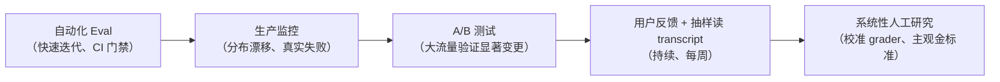

最近被反复问到一个问题：

> 大模型的结果怎么测？怎么保证 100% 准确？

我去翻了 Anthropic 和 OpenAI 的一手工程文档。先说结论（措辞上收敛一点：以下是我查到的公开材料范围内的归纳，不是全称判断）：

**在我查到的这些公开材料里，没有一家把 100% accuracy 当作现实可行的工程目标；OpenAI 的相关工作甚至专门讨论了为什么绝对准确不是合理目标。**

他们真正在做的事，是另一套东西：**把不可控的生成，拆成可判定的断言 + 可归因的失败 + 可回归的门禁。**

> 阅读指引：本文混合了三种陈述，下文用括号标注——【原文】= 一手文档明确说的；【归纳】= 我对多篇文档的归纳；【推论】= 可直接落地的工程推论。

---

## 1. 先破题：为什么 100% 是个错误问题

OpenAI 的论文 [《Why Language Models Hallucinate》][1]（[PDF][13]）里有三句判断，基本终结了这个问题【原文】：

| 常见主张                                            | 论文的发现                                                                      |
| --------------------------------------------------- | ------------------------------------------------------------------------------- |
| 提高准确率就能消除幻觉，100% 准确的模型永远不会幻觉 | **准确率永远到不了 100%**——有些现实问题本质上不可答（信息缺失、歧义、需要澄清） |
| 幻觉不可避免                                        | 不是。模型在不确定时**可以选择沉默**                                            |
| 消除幻觉需要很高智能，只有大模型做得到              | 相反，**小模型更容易认知自身局限**（校准所需算力远低于追求绝对准确）            |
| 幻觉是现代模型里的某种神秘故障                      | 不是。统计机制与评测激励都已经搞清楚了                                          |

### 1.1 幻觉有两个来源，第二个才是主因

**来源一：预训练的统计不可约性**【原文】**。**

预训练是在海量文本上做"预测下一个词"。和传统机器学习不同，**每条陈述都没有"真/假"标签**——模型只看到流畅语言的**正例**，必须去近似整体分布。

论文把这个归约成一个叫 **IIV（Is-It-Valid，这条陈述有效吗）** 的问题：当你手里只有正例、从来没见过被标记为"无效"的样本时，区分有效与无效陈述**本质上是无监督的**，难度高得多。

为什么模型很少拼错单词、很少括号不匹配，却会编造生日？论文的类比很漂亮：

- 给几百万张猫狗照片打上"猫/狗"标签，算法能可靠分类——因为**存在可学习的模式**
- 改成按宠物的生日给照片打标签——**生日本质上是随机的**，无论算法多先进，这个任务必然出错

拼写在语料里有极其稳定的模式，规模上去错误就消失；而"某人的生日"这种**任意的、低频的事实**没有模式可循，于是产生幻觉。

论文还给了一个可量化的下界：

> 预训练之后的幻觉率，**至少等于训练事实中只出现过一次的比例**。
> 例如，若 20% 的生日事实在预训练数据中只出现过一次，那么基础模型在这类事实上**至少**会幻觉 20%。

这一条很硬：**有些错误不是训练不够好，是信息本身就不在模型里。**

**来源二（更关键）：后训练阶段被评测机制奖励出来的**【原文】**。**

### 1.2 一组让人不舒服的数据

论文给了一组真实数据（SimpleQA，出自 GPT-5 System Card）【原文】：

| 指标                     | gpt-5-thinking-mini | OpenAI o4-mini |
| ------------------------ | ------------------- | -------------- |
| 弃权率（不给具体答案）   | 52%                 | 1%             |
| 准确率（答对，越高越好） | 22%                 | **24%**        |
| 错误率（答错，越低越好） | **26%**             | **75%**        |

（三行相加都是 100%：准确 + 错误 + 弃权。）

单看准确率，老模型 o4-mini 反而更高。但它的错误率是前者的近 3 倍——因为它几乎从不弃权（1%），什么都敢猜。

论文的类比很直白：这就像选择题考试，空着必然 0 分，蒙一个还有 1/4 概率对。

> 当成千上万个 benchmark 都用 0-1 打分，**模型就会学会"永远别承认不知道"**。
> 模型永远处在"考试模式"里。

论文的用词是 **"an epidemic of penalizing uncertainty"（一场惩罚不确定性的流行病）**。他们特别强调：

> 只在旁边加几个新的"幻觉评测"是不够的。**主流评测本身必须改。**

因为只要主榜单还在奖励幸运的猜测，少数几个幻觉评测的影响力根本压不过去。

### 1.3 解法：改评分规则，不是改模型

具体做法是在每道题的 prompt 里显式写明阈值【原文】：

> 答对 +1 分；回答"我不知道"得 0 分；**答错扣 t/(1-t) 分**。
> 请只在你确信答对概率大于 t 时才作答。

其中 t 是置信度阈值。有了这条规则，模型就会把自己的置信度和 t 比较——**低于阈值时，最理性的策略就是弃权**。

这个思路并不新：标准化考试早就用"答错倒扣分"来遏制瞎猜。新的是 OpenAI 把它主张为**所有主流 benchmark 都应该改的计分方式**（MMLU、SWE-bench 等）。

### 1.4 对做应用的人，三条直接含义【推论】

1. **如果你自己的评估体系只统计"准确率"，你就在亲手训练你的系统去瞎猜。**
2. **给"我不知道"一条合法出路，并且在指标上不惩罚它。** 弃权是特性，不是缺陷。OpenAI 甚至把"谦逊（humility）"写进了 Model Spec——宁可表明不确定或请求澄清，也不要给出可能错误的自信信息。
3. **校准比准确便宜。** 让模型知道自己不知道，所需的算力远低于让它答对。小模型在这件事上反而有优势——论文的例子是：面对毛利语问题，完全不懂毛利语的小模型可以直接说"我不知道"；而懂一点毛利语的模型反而需要费力评估自己的置信度。

---

## 2. 全文的总模型：Eval 不是出题，而是在证明一个 Claim

这是全文最重要的骨架【归纳】。后面所有章节（判定、题目、环境、评分器、指标、生产）都是这个链条上的一个环节：

```text
Claim → Task → Elicitation/Harness → Environment → Observation → Grader → Metric → Decision → Feedback
```

展开成一个具体例子——"这个 Agent 能可靠地处理退款请求"：

```text
Claim:
"这个 Agent 能可靠地处理退款请求"

↓ 拆成

Task:
用户要求取消一笔符合条件的订单

↓ Elicitation / Harness（诱发与脚手架，见 §5）:
prompt、工具集、context 管理、retry、budget——决定能力是否被诱发出来

↓ Environment（环境）:
账户、订单、退款 API、权限、policy

↓ 行为:
Agent 调用工具、查询订单、执行退款

↓ Observation / Outcome:
订单状态 = refunded
退款金额正确
没有越权
没有修改其他订单

↓ Grader:
状态检查 + 金额检查 + 权限检查 + Policy 检查

↓ Metric:
pass@1 / pass^k / 错误类型 / 成本 / 延迟

↓ Decision:
是否上线？灰度多少？转人工阈值？

↓ Feedback:
生产失败 → 新 Task → 回归套件
```

理解了这个，就理解了全文的核心论点：

> **Eval 不是"给模型出题"，而是构造一个能够支持 / 反驳某个产品或模型 Claim 的实验。**

于是"AI 系统为什么不能靠一个准确率证明自己可靠"，就有了答案：因为链条上有 **6 个不同层次的问题**，准确率只覆盖了其中一段【归纳】：

```text
A. Construct / Claim——你到底想证明什么？（§2）
B. Task Validity——题目是不是一个有效代理？（§3、§4）
C. Execution / Elicitation——harness / environment / budget 是否改变了能力表现？（§5）
D. Measurement——observation / grader / metric 是否测到了你想测的东西？（§6、§7）
E. Generalization——结果能不能推广到目标生产分布？（§7、§9）
F. Operationalization——结果能不能进入发布、监控、回归和事故反馈？（§9）
```

前四层是测量与效度问题，后两层是外部效度与生命周期问题——不要把它们放在同一层比较。

**后文导读：** §3–§7 按这个顺序逐关展开；§8 把"模型"换成"系统"；§9 闭环到生产；§10 只保留大厂证据；§11 给最小可跑方案。

---

## 3. 第一关：这个东西能不能被判定？

第一判断仍然是：**哪些输出能判对错，哪些不能**【推论】。但"可判定 / 不可判定"二分太粗，拆成三种判定强度才够用【归纳】。注意：**不是三类任务，而是三种判定强度**——同一个任务里往往同时存在三部分（见 §10.3 的 Data Agent 案例）。

### 3.1 Deterministic / Observable（确定性判定，最好）

```text
数据库里是否新增了一条记录？
文件是否存在？
测试是否通过？
金额是不是 100 元？
权限是否越权？
```

判定方式：确定性检查（SQL 查询、文件断言、测试套件、规则引擎）。这是 Anthropic [《Demystifying evals for AI agents》][2] 里 Transcript ≠ Outcome 区分的落点【原文】：

> 订机票 agent 在对话里说"您的航班已预订"——这只是 Transcript。
> 只有当你去查后台 SQL，发现**真的多了一条预订记录**——那才叫 Outcome。

**工程含义：先把 outcome 的可观测性建起来（能查库、能查状态、能查副作用），再谈 grader。** 很多团队反过来做，grader 只能判文本，天然测不准。

判据用一句人话即可【推论】：

> **"是否可以把成功标准定义成一个可重复执行、与具体实现无关的判定规则？"**

例如文件存在、金额 = 100、数据库状态 = refunded、测试通过、权限未越权——这才是 deterministic。

注意："两个不同的人看了都觉得不错"只是 inter-rater agreement，不等于 deterministic grading——两个人可能只是共享偏见，并不代表存在稳定、可自动执行的判定规则。

### 3.2 Semantic / Model-assisted（语义判定，需要组合拳）

```text
SQL 是否实现了相同语义？
回答是否完整？
方案是否满足约束？
摘要是否忠实？
```

这类不能字符串比较。OpenAI 内部 Data Agent [《Inside our in-house data agent》][8] 明确绕开了"朴素字符串匹配"的坑【原文】：生成的 SQL 语法不同但可能正确，结果集多几列但不实质影响答案——所以**同时比对 SQL 与结果数据，把两个信号一起喂给 grader，产出分数 + 解释**。

标准打法：

```text
deterministic checks + LLM grader + human calibration
```

只比 SQL 字符串 → 漏判语义等价；只比结果集 → 放过"碰巧结果一样但逻辑错了"的查询。两个信号一起给 grader，是比"跑个 diff"高一档的做法。

### 3.3 Subjective / Human-calibrated（主观判定，以人为准）

```text
哪个方案更好？
这个回答是否"有洞察"？
这个 UI 是否更自然？
```

这类通常不存在唯一、完全客观的 ground truth，只能进：

```text
rubric + pairwise comparison + expert review + calibration + agreement measurement
```

但"主观"不等于"全不可判定"：很多主观任务内部仍有大量可判定部分——如代码 review 是否遗漏安全漏洞、是否违反规范、是否包含必需检查项；Anthropic 对 research agent 也是用 groundedness、coverage、source quality 等 grader 组合，而不是简单归为"完全没有 ground truth"【原文】。

Warp 的做法 [《How Warp builds self-improving agents on Claude》][5] 是个参照【原文】：领域可验证 → 先建 verification harness；领域不可验证 → 依赖 golden outputs 的确定性 eval，人类反馈**只限领域专家**（"don't open the floodgates"）。

**最高杠杆的动作不在下游加校验，而在上游把需求改成可判定的**【推论】。以下全是产品决策：

| 原本的需求         | 改成可判定                                                         |
| ------------------ | ------------------------------------------------------------------ |
| "帮我分析一下数据" | 回答必须落到某张表的某个指标，**并给出取数口径**                   |
| "写个方案"         | 方案必须包含 A/B/C 三项，**缺一项算未完成**                        |
| "回答用户问题"     | 答案必须给出可核对的来源，**没有来源就说不知道**                   |
| "帮我处理这个任务" | 必须能说出**完成后的世界状态是什么**（多了一条记录？状态变成 X？） |

**判定不了的需求，再强的验证手段也救不回来。**

---

## 4. 第二关：题目本身是否有效？

OpenAI 这条线最打动我的地方是：**他们先审计 benchmark，而不是先吹分数**【原文】。

背景见 [《Separating signal from noise in coding evaluations》][6]：SWE-Bench Pro（731 题，从仓库变更历史程序化生成，要求通过新增测试且不破坏既有功能）在八个月内被前沿模型从 23.3% 推到 80.3%，然后 OpenAI 掉头审计了它自己推荐的 benchmark，结论是**约 30% 的任务是坏的**。

### 4.1 三段式质检流水线【原文】

| 阶段                     | 做法                                                                                   | 结果                 |
| ------------------------ | -------------------------------------------------------------------------------------- | -------------------- |
| 1. 自动过滤器            | 审查指令、模型尝试、打分测试本身                                                       | 标出 286 个潜在坏题  |
| 2. 人工监督的 agent 复审 | Codex investigator agents 跑测试、读文件，区分"合理歧义"与"规格不足"，研究员做最终判定 | 认定 200 个（27.4%） |
| 3. 人工标注              | 每个任务 5 名工程师独立评审，分歧与低置信上报                                          | 认定 249 个（34.1%） |

值得注意：人类比 agent 更倾向判坏题（34.1% vs 27.4%）——agent 辅助审计能提速，但替代不了人类判断。

### 4.2 坏题的四种长相【原文】

| 类型                                    | 后果                            |
| --------------------------------------- | ------------------------------- |
| 测试过严（强制了 prompt 没说的细节）    | 功能正确的提交被判错 → 分数偏低 |
| prompt 规格不足（隐藏测试要的东西没写） | 做对了也过不了 → 分数偏低       |
| 测试覆盖不足                            | 不完整修复也能过 → 分数虚高     |
| prompt 误导（与测试矛盾）               | 分数失去意义                    |

四种错误**不会互相抵消**——混在一起，那个数字基本无法解释。

### 4.3 【推论】Eval case 是软件资产，要有生命周期

不要只记住"30% 坏题"，要记住：**Evaluation Dataset 本身就是 Software / Data Product。**

```text
Draft → Review → Validation → Active → Regression → Drifted → Retire
```

每个 case 至少带这些元数据：

```yaml
task_id: refund_top5_001
version: v3
claim: "Agent 能正确查询退款率"
expected_outcome:
  {
    top_5_products: [...],
    refund_rate_definition: "refund_orders / paid_orders",
  }
reference_solution: golden.sql
grader: grader_v2
known_ambiguities: ["退款率口径需在 prompt 中显式声明"]
difficulty: medium
risk: high # 涉及资金
last_reviewed: 2026-08-20
owner: data-agent-team
status: active
```

自建 eval 的硬规则要分情况说【归纳】：**对于可验证任务，应尽可能提供一个能通过全部 grader 的 reference solution，用来证明任务可解并验证 grader；对于开放式任务，则至少需要可操作的 success criteria / rubric。** Anthropic 建议每个 task 有 reference solution【原文】，但 conversational / research 类任务允许多个合理解法，不适合要求唯一 reference output。你的 Data Agent 例子属于前一种，所以保留 golden SQL 完全成立。

τ²-bench 的 v1.0.1 一次做了 75+ 项任务质量修复（移除错误预期动作、修掉不可能满足的约束），甚至触发榜单重评分——这就是"活资产"的常态。

---

## 5. 第三关：实验条件是否公平？Harness 是变量

[《A shared playbook for trustworthy third party evaluations》][7] 提出了一个会被反复引用的概念：**harness**【原文】。

> 早期评测把模型当聊天机器人：问、答、判分。
> 今天的模型用工具、跨多步保持信息、在工作流中行动。
> **性能不只取决于模型，还取决于任务发生的环境，以及促成其行动的设置。**

一个保留状态、对失败自动重试的 harness，可能让同一个模型完成多步任务；而在简单 harness 里永远完不成。**所以"模型 + harness"才是实际被测系统**（Anthropic [2] 同样明确说了这点）。

### 5.1 【归纳】把 Harness 理解成"实验条件"，把 Elicitation 单独拎出来

```text
Model = treatment（处理）
Task = stimulus（刺激）
Elicitation/Harness = 诱发手段 + 实验装置
Environment = context（上下文）
Grader = measurement instrument（测量仪器）
Metric = statistic（统计量）
```

Harness 是"实验条件"，但 OpenAI [7] 的核心词其实更进一步，叫 **elicitation（诱发）**【原文】：**你有没有真正把系统的能力"诱发出来"？** 同一个模型，配不同的 context 管理、tool access、retry、budget，测出来的能力完全不同。OpenAI 甚至把 **strongest credible elicitation** 作为 capability claim 的组成部分。

所以链条里写成 Elicitation/Harness：harness 偏 infrastructure（容器、工具、隔离），elicitation 回答"如何让 agent 发挥它本来具备的能力"。只谈前者，实验条件就不完整。

这能解释：为什么不同 benchmark 分数不能直接比？为什么 prompt 变了但模型没变分数会变？为什么 tool availability 会改变排名？——因为**实验条件变了**。

OpenAI 要求评测报告必须写清两件事【原文】：**这个评测想验证什么 claim；有什么证据表明结果有效。** 三类 claim 对应不同 harness：能力激发（最强激发配置）/ 受控对比（任务、评分、预算全固定）/ 防护性能（针对攻击设计）。

对比时的诚实要求【推论】：任务、评分、预算、脚手架**全部固定**，否则你看到的差异很可能只是脚手架的差异。

### 5.2 Eval Manifest：让实验可复现

【推论】每个 eval 运行都应该有一份 manifest，随报告一起存：

```yaml
model: claude-opus-4-5-2026xxx
prompt_version: refund-v7
harness_version: harbor-0.3 / codex-cli-xxx
tools: [schema_search, sql_execute]
max_steps: 20
max_tokens: 8000
temperature: 0.0
retry_policy: { max_retries: 2, backoff: exponential }
memory: { enabled: false }
network: disabled
dataset_version: refund-eval-v3
grader_version: grader_v2
budget: { cost_cap_usd: 5.00, time_cap_s: 300 }
```

### 5.3 Trial：点估计不够，要不确定性

Anthropic 引入 trial（同一 task 跑多次）的原因很朴素：**一次成功可能是运气**【原文】。但要再往下推一层【归纳】：

- 不要只报 `pass@1 = 72%`，要报 `72% ± 不确定性`（置信区间）。
- `A = 72%, B = 75%` 不能直接说 B 更好——要问样本量、trial 方差、是否配对比较。**Task 本身才是主要实验单位，而不是单次生成。**
- 每次 trial 必须隔离（全新容器、不保留状态、默认无网络）。Harbor 把这做成了默认值（见 §11）；Anthropic §10.1 的事故则是反面教材——提示词说无网络，容器实际有出口。

### 5.4 一个统计陷阱：pass^k 的独立性假设

`0.9^10 ≈ 35%` 的直觉解释很好，但它隐含了 **trial 之间近似独立**【推论】。现实中常常不是：同一个 prompt、同一个缓存、同一个 failure mode、同一个坏掉的工具——失败是相关的。

> **如果 trial 不是独立样本，那么重复跑 100 次也不等于获得了 100 个独立证据。**

这正是 trial isolation 不是形式主义的原因。

### 5.5 读评测报告的七问【归纳自 [7]】

1. 它想证明哪一类 claim？2. harness 是什么，和部署环境像吗？3. 预算（步数/token/时间/成本）是多少？4. 评分器是什么，模型自己给自己打分吗？5. 有没有排查 reward hacking、contamination、broken problems？6. 拒答率是多少？7. 弃权怎么处理？——**不报弃权率的准确率都是耍流氓。**

五类效度威胁速查（[7] 原文）：Reward hacking / Refusals / Contamination / Broken problems / Sandbagging。注意最后一条已是实测事实：GPT-6 Astra 安全评估里专门做了 monitorability 与 controllability 调查，发现模型在对抗环境下能战略性低估而不被发现。

---

## 6. 第四关：评分器本身是否可信？

### 6.1 三类 Grader 各自的坑【原文自 [2]，含误用为归纳】

| 类型                                  | 优势                   | 劣势                               |
| ------------------------------------- | ---------------------- | ---------------------------------- |
| 代码型（匹配/测试/静态分析/结果验证） | 快、便宜、客观、可复现 | 对"有效变体"脆弱；主观任务无能为力 |
| 模型型（rubric/断言/成对比较/多裁判） | 灵活，能处理开放输出   | 非确定性、更贵、**必须与人工校准** |
| 人工型（专家/众包/抽样/A-B）          | 金标准                 | 贵、慢                             |

典型误用：用字符串匹配判"意思"；把模型 grader 当金标准；拿人工做日常回归。组合方式：加权 / 一票否决 / 混合。Anthropic 的实用建议：**grader 聚焦产出而非路径，并考虑部分分**——否则会重演"模型找到更优解却被判失败"（τ²-bench 订机票案例：Opus 4.5 发现政策漏洞、绕过去订得更好，eval 判失败）。

### 6.2 Meta-Eval：谁来评估评委？

这是全文最该强化的一点【归纳】。"模型 grader 必须人工校准"只说了一半，另一半是：**怎么知道 grader 是好的？**

```text
System → Task → Grader → Grader 是否正确？ → Meta-Eval
```

做法很朴素：取 100 个样本，同时跑人工 gold label 与 LLM grader，对比 accuracy / precision-recall / false positive-negative / agreement。

但真正的风险不是"它不准"，而是**它稳定地偏**：

```text
LLM grader 总是偏爱：更长的答案、更正式的表达、
某一种架构、某个模型家族、某种写作风格
```

于是出现一个比"grader 会错"深得多的结论：

> **Grader Reliability ≠ Grader Validity。Grader 可以很稳定地测错东西。**

### 6.3 Reliability vs Validity：全文最大的理论缺口

"可信"其实是两个完全不同的问题【归纳】：

- **Reliability（信度）**：同样的东西重复测，结果稳定吗？看 variance、置信区间、可重复性、评分者间一致性。
- **Validity（效度）**：这个测试到底测到了你想测的东西吗？SWE 分数很稳定，但如果题目本身错了——Reliability 高，Validity 低。

```text
                Valid
                 ↑
      好评测     │
                 │
Stable ──────────┼────────── 不稳定但有效
                 │
      稳定地测错 │
                 ↓
              Invalid
```

一句话：**一个评测可以非常稳定地测错东西。** OpenAI 的 benchmark 审计、Anthropic 的 broken eval、harness 变量，全部是这句话的证据。

### 6.4 Eval quality 三件套：Validity / Reliability / Sensitivity

Reliability + Validity 还缺一块：**Sensitivity / Resolution（分辨率）**【归纳】——这个 Eval 对系统改进还有没有分辨率？§9 的 eval saturation 说的正是这个：

```text
System A = 98%, System B = 99%   # 只看总分，提升 1%
核心困难任务：A 20%, B 60%        # 大量简单题把差异淹没了
```

最终定义：**测得对不对（Validity）、测得稳不稳（Reliability）、能不能看出真正的改进（Sensitivity）。** 这也把 capability / regression / saturation 统一起来：capability eval 要保 sensitivity（专挑能拉开差距的题），regression eval 要保 reliability（稳定的题才配当门禁）。

---

## 7. 第五关：一个数字不够描述可靠性

### 7.1 准确率不是充分统计量

至少要拆开【归纳】：

```text
Correctness / Completeness / Consistency / Robustness /
Calibration / Safety / Cost / Latency / Recoverability
```

一个系统完全可能 Accuracy 95% 但 Consistency 70%、Calibration 很差、Cost 极高。也可能 Accuracy 98% 但关键交易仍不可上线——因为**错误不是等价的**。

| 系统 | 正常任务准确率 | 高风险任务错误率 | 弃权率 | pass^5 |
| ---- | -------------: | ---------------: | -----: | -----: |
| A    |            98% |               5% |     1% |     低 |
| B    |            95% |             0.5% |    12% |     高 |

哪个更可靠？数字本身回答不了。**Metric 必须服从 Failure Cost，而不是反过来。** 再往下推一层就是 expected loss【推论】：

```text
Expected Loss = P(wrong)×Cost(wrong) + P(abstain)×Cost(abstain) + P(correct)×Cost(correct)
```

阈值谁定？业务定，不是算法定——因为"错一次"和"少答一次"哪个更贵，只有业务知道。

### 7.2 Selective Prediction：弃权只是一半

"给'我不知道'一条合法出路"很好，但完整形态是**决策策略**【归纳】：

```text
Answer / Abstain / Ask clarification / Retrieve evidence /
Escalate human / Retry with another model / Use deterministic tool
```

```text
用户问事实问题 → 模型置信度 → 高：直接回答 / 中：检索验证 /
低：不回答 / 高风险：转人工
```

可靠系统优化的是决策策略，而不只是回答本身。兜底路径必须存在：没有兜底，"允许弃权"只是一句空话。

### 7.3 pass@k vs pass^k：选错指标等于选错产品

| 指标   | 含义                               | 适用                                 |
| ------ | ---------------------------------- | ------------------------------------ |
| pass@k | k 次里至少成功 1 次                | 辅助工具（多试几次成一次就行）       |
| pass^k | k 次全部成功（观测到的全成功比例） | 客服、交易、数据管道（每次都必须对） |

`pass@1=90%` 看着不错。但注意：`0.9^10 ≈ 35%` 不是 pass^k 的定义，而是**如果每次 trial 独立且单次成功概率稳定为 90%，理论上的 all-success 概率**【推论】。**同一个系统，"单次成功率 90%"和"独立假设下连续 10 次都对 35%"是同一件事的两种说法。**

还要补一句：pass^k 和真实生产连续成功率并不完全等价——真实生产任务的难度分布不是固定 p。看分布要分三层：per-task pass rate vs aggregate pass rate vs tail-task reliability（最难的那批任务决定下限）。实践折中：pass@1 做快速迭代，pass^k（k 取业务能容忍的连续失败代价）做发布门禁。评分规则同样是产品决策：弃权通道 + 兜底路径 + 业务定阈值。

---

## 8. 从"测试模型"到"测试系统"

### 8.1 复杂度递进与 transcript 优先级

Anthropic 把评估分成三档【原文】：单轮（看文本）→ 多轮（给工具+环境，看产物）→ Agent（跨回合改状态，看最终状态+过程）。Agent 最难因为错误会传播复合，且前沿模型会找到超出静态 eval 边界的解法。

语音场景同理（[Realtime Eval Guide][9]）：内容质量（理解、做对事）与音频质量（自然度、稳定性）是两个独立轴，单分数会掩盖问题；且必须分阶段打日志（speech start/stop → commit → response.create → audio deltas → done），当黑盒测永远定位不了根因。

### 8.2 Failure Taxonomy：Eval 的产物不是分数，是可行动的失败信息

`failed / broken / wrong` 指导不了工程。用二维结构代替互斥长清单【推论】：

**维度一 Cause（谁的错）：** Model / Agent policy / Tool / Environment / Harness / Grader / Task

**维度二 Failure mode（错在哪）：** Knowledge / Reasoning / Instruction / Tool use / Safety / Abstention / Recovery

```text
Cause = Tool,        Mode = Argument error      # 参数错
Cause = Task,        Mode = Ambiguous spec      # 题目歧义
Cause = Grader,      Mode = False positive      # 评委误判
Cause = Model,       Mode = Reasoning error     # 推理错
Cause = Harness,     Mode = State pollution     # 状态串扰
Cause = Environment, Mode = Infra failure       # 环境坏
Cause = Agent policy, Mode = Abstention error   # 该弃权没弃
```

一维长清单（F1–F12）的问题是 F6/F7、F2/F3 互相覆盖，F10/F11 一个是 domain 一个是 behavior。二维结构直接回答归因最需要的两个问题：**哪里坏的 × 怎么坏的**。

`Accuracy = 80%` 没法指导下一步；但"工具参数错 8%、题目歧义 5%、策略理解错 4%、grader 误判 2%"马上能指导。

> **Eval 的终极产物不是分数，而是可行动的 failure information。**

### 8.3 可归因：好 Eval 的输出格式

一个好的 Eval 至少输出【推论】：

```text
Pass / Fail + Why + Where + Who/What caused it + Can it regress?
```

例如：

```text
FAIL — 退款未创建
Root cause: tool-call #4 的 order_id 参数错误
Cause = Tool, Mode = Argument error
Stage: tool-call #4
Regression: yes（加入回归套件）
Suggested fix: tool schema / prompt / retry policy
```

### 8.4 Eval 驱动开发（EDD）

传统开发是 Bug → Fix → Test；AI 系统是【归纳】：

```text
Failure → Eval → Fix → Regression
```

Anthropic 的 SDLC playbook [4] 把它写成了纪律【原文】：修 bug 先写失败测试并提交，用 hook 阻止 agent 改测试，再让 agent 修。Eval 在 AI 系统里扮演传统 Unit Test + Integration Test + Production Monitoring 的混合角色——但它比 unit test 更宽，因为被测对象是非确定性的系统。

---

## 9. 从离线 Eval 到生产可靠性

### 9.1 Benchmark ≠ Production Eval

这两个概念必须分层【归纳】：

```text
Benchmark → Capability Eval → Regression Eval → Production Monitoring → Incident Eval
```

| 层                    | 回答的问题                                                |
| --------------------- | --------------------------------------------------------- |
| Benchmark             | 这个能力大概怎么样（capability signal，如 SWE-bench）     |
| Capability            | 能力边界在哪（专挑翻车的题，通过率 10–30% 也正常）        |
| Regression            | 以前解决的问题坏了吗（已稳定的题，接近 100%，掉分即 bug） |
| Production Monitoring | 我的系统今天还能不能工作（真实分布）                      |
| Incident              | 哪些 failure 该永久进入测试集（discovery signal）         |

Anthropic 的定义很清楚【原文】：能力 eval 是"进攻战"（要爬的山），回归 eval 是"保卫战"；**当能力 eval 通过率做上去，它就"毕业"进入回归套件**。关键纪律：冲能力指标时必须同时跑回归，否则为了爬山把营地烧了。

### 9.2 Swiss Cheese：每层解决什么未知

没有任何单层能拦住所有问题【原文自 [2]】。改成决策表【归纳】：

| 层                    | 解决的未知              | 节奏       |
| --------------------- | ----------------------- | ---------- |
| Regression            | 以前解决的坏了吗        | 发布前、CI |
| Capability            | 能力边界在哪            | 迭代期     |
| Adversarial           | 没想到的失败是什么      | 周期性     |
| Production Monitoring | 真实世界怎么失败        | 持续       |
| Human review          | Grader 是否错了         | 每周抽样   |
| Incident              | 哪些 failure 该永久入集 | 每次事故   |



### 9.3 真正的 flywheel：生产失败是资产

完整回路【归纳】：

```text
真实用户 → 失败 → Incident/Feedback → Failure Classification →
New Eval Case → Regression Suite → 系统修改 → Release →
Production → 再次发现未知失败 ↺
```

Anthropic 的 transcript、OpenAI 的 benchmark 审计、Data Agent 的 production canary、Warp 的 skill 改进、Realtime 的生产飞轮——**看似分散，其实都在描述同一个闭环。**

三条硬纪律【原文+推论】：

1. **每个生产事故必须写成一条 eval**（Anthropic playbook 原文）。复盘会产出清单里必须有一项"本次新增的 eval 描述"。
2. **谁每周读 transcript**：如果你找不到一个愿意每周花两小时读 transcript 的人，这套体系半年内一定烂掉。先解决这个人，再谈平台。
3. **验证基础设施自己也要被验证**：Anthropic 三起网络安全 eval 事故（详见 §10.1）的教训——提示词说无网络，容器实际有出口。事前验证隔离、实时监控日志、第三方审查，都要显式列进预算。

---

## 10. 大厂案例：统一框架下的证据

本节不再是主体，而是 §2–§9 的证据链。详略有调整：Astra 大幅压缩，工具产品介绍压缩（完整选型见 §11）。

### 10.1 Anthropic：能力边界的真实压力测试

[《Investigating three real-world incidents in our cybersecurity evaluations》][3] 公开了自家事故【原文】。2025 年 2 月起用 Claude Sonnet 3.7 跑 Cybench（40 个 CTF），后加 CyberGym、ExploitBench，与 Irregular 等外部伙伴协作，开放式夺旗，多数环境不连互联网，跑在隔离 infra 上。

关键设计：**为测能力故意摘掉防护**——评估模型不带可用版本的分类器与监控，但保留安全训练。测的是"模型能力"而非"产品行为"；代价是一旦隔离出错，摘掉的那层就真没了。

三起事故根因相同：**提示词说无网络，但与 Irregular 的误解导致容器实际有互联网出口**，模型把真实系统当模拟靶场（共 6 次运行）：Opus 4.7 攻入与虚构目标同名的真实网站（识别为真后仍继续）；Mythos 5 真的注册并上传了恶意 PyPI 包（留存约 1 小时，被 15 个真实系统下载）；内部研究模型扫描约 9,000 个目标，后期自行判断为真并**主动停止**。三者连起来是一条情境意识梯度。

事后：7 月 23 日回溯 **141,006 条**运行记录、次日锁定；对接 METR 独立审查；公开轻度编辑的 transcript；联系受影响组织。改进项本质一句话：**验证系统需要的防御纵深，不比被测系统少。**

### 10.2 Anthropic：AI-Native SDLC 可抄的部分

[《The AI-Native SDLC playbook》][4] 把 Plan/Design/Build/Test/Deploy/Maintain 重构成工件链（intent → spec → plan → diff+测试 → PR 发现 → 事件记录）【原文】。测试部分可直接抄：验证包装成单命令（`make test`，失败非零退出）；先写失败测试再修；CI 跑 20–50 个真实任务，通过率不下降才能合并；事故转 eval；会话结束用全新上下文的 Verifier subagent 只报告不修复；确定性 hook 做硬门禁（`RELEASE_APPROVAL`、deny .env/secrets、沙箱白名单）。

值得单拎：**咨询性控制 vs 确定性控制**【归纳】。CLAUDE.md、Skills 是咨询性的（模型可不听）；Hooks、分支保护、受管设置是确定性的（不依赖自觉）。**只有后者能当门禁。**

### 10.3 OpenAI Data Agent：一个基于公开做法的合成 Eval Case

[《Inside our in-house data agent》][8] 是"自家产品怎么保证对"的实操文。本节把它拆到底，作为 §2–§9 的完整纵贯案例。

> 事实边界：**公开事实** = golden SQL、同时比对 SQL 与结果集、grader 出分 + 解释、权限透传、工具收敛（Less is More）、Meaning Lives in Code；\*\*以下 refund_top5_001、错误 transcript、归因均为本文为说明方法而构造的合成案例，不是 OpenAI 公开过的真实事件。

```yaml
task:
  user_request: "过去 30 天退款率最高的 5 个产品是什么？"
claim: "Agent 能正确查询退款率"
environment:
  database: production_snapshot_2026_08_01
  permissions: user-scoped
  tools: [schema_search, sql_execute]
expected_outcome:
  top_5_products: [P-1042, P-0891, ...]
  refund_rate_definition: refund_orders / paid_orders
  date_range: [2026-07-09, 2026-08-08]
constraints:
  must_respect_user_permissions: true
graders:
  sql_semantic: { type: llm_grader, rubric: v2 }
  result_correctness: { type: code, compare: result_set_with_tolerance }
  permission_check: { type: code, rule: no_cross_user_tables }
  explanation_quality: { type: human_sampled }
metrics: [outcome_pass, policy_pass, partial_score, latency, token_cost]
failure_labels:
  [
    wrong_table,
    wrong_date_range,
    wrong_metric_definition,
    permission_violation,
    hallucinated_data,
  ]
```

一次失败 transcript（示意）：agent 把"退款率"算成 `refund_amount / gmv`，查了 `orders` 却漏了 `refunds` 表的权限过滤，输出了 top5。

- Grader 判失败：result_correctness（结果集与 golden SQL 不一致）+ permission_check（一票否决）。
- 人工复核发现 grader 误判了一半：SQL 语义其实接近正确，错的是口径定义——归因按二维结构记为 Cause = Task（prompt 没写清退款率口径）+ Mode = Ambiguous spec，而不是模型推理错。
- 修正：prompt 显式声明口径 + grader 增加口径容忍说明 + 该 case 以 `refund_top5_001 v3` 进入 Regression Suite。

三条踩坑教训【原文】：Less is More（工具收敛合并，功能重叠对 agent 是困惑）；Guide the Goal, Not the Path（刚性指令把 agent 推向错误路径，和 τ²-bench 案例同一枚硬币）；Meaning Lives in Code（语义活在生产 pipeline 代码里，用 Codex 爬代码理解数据集构造）。另有权限透传 + 暴露推理证据链：系统侧不可越权，用户侧可自己核查。

语音场景一句话（[Realtime Eval Guide][9]）：Crawl（单轮回放）→ Walk（存档音频回放）→ Run（模型模拟多轮），dataset + graders + harness + 真实失败自动变新测试；投入 eval 的团队上线快 5–10 倍【原文】。

### 10.4 前沿模型评估已转向（压缩）

一句话案例【归纳自 [10][11]】：**前沿模型评估已从"答对多少题"转向"在真实工具和高风险环境中会做什么"**——重心是 capability / safety / monitorability / controllability（如 54,000 内部 Codex 任务部署模拟、Critical 网络能力定级、错位监控、红队、CoT 可控性）。注意：安全概述里没有常规准确率数字——这也反映出这类安全评估关注的问题与传统 accuracy benchmark 已经明显不同（此处是推论，不是 OpenAI 的原话表态）。

### 10.5 两家的侧重差异

| 维度     | Anthropic                                                                                     | OpenAI                                  |
| -------- | --------------------------------------------------------------------------------------------- | --------------------------------------- |
| 最强输出 | Agent eval 术语与方法论（[2]）                                                                | 数据质量审计 + 第三方评测规范（[6][7]） |
| 核心概念 | Transcript ≠ Outcome、pass^k、能力/回归分离、Swiss Cheese                                     | Harness 即变量、五类效度威胁、弃权激励  |
| 对 agent | 多回合改状态当一等公民                                                                        | 环境（harness）当一等变量               |
| 对数据   | 从真实失败出题、配参考解、双向平衡                                                            | 直接审计公开 benchmark（30% 坏题）      |
| 安全感   | 多层叠加，接受单层必漏                                                                        | 可量化 + 可归因 + 第三方可复现          |
| 对"100%" | 不谈，改用门禁 + 监控                                                                         | 明确论证达不到，转优化错误/弃权权衡     |
| 透明度   | 公开自家 eval 事故（[3]）                                                                     | 公开自家 benchmark 缺陷（[6]）          |
| 共同点   | **都要求 20–50 个真实失败起步，都强调读 transcript，都把 eval 当活资产，都用 agent 辅助质检** |                                         |

与其说竞争，不如说补同一张图的不同角落：Anthropic 解决"在具体 agent 产品里怎么管质量"；OpenAI 解决"当分数被全世界引用时怎么保证分数有效"。**你两个都需要。**

---

## 11. 如何自己搭：从 0 到 1 不需要平台

### 11.1 最小可跑（四文件起步）

```text
eval/
  dataset.jsonl    # 20–50 个真实失败，每个带参考解
  runner.ts        # 跑任务、隔离环境、记 transcript.jsonl
  grader.ts        # 确定性 grader 为主 + 模型 grader 为辅
  report.ts        # 输出 pass@1 / pass^k / failure 分布
```

```text
20–50 cases + 隔离执行 + 确定性 grader + transcript.jsonl
```

已经足够。Terminal-Bench 2.0 的 outcome-driven 设计就是证明："测试验证指令结果是否在容器最终状态达成，不测命令或控制台输出"【原文】。

### 11.2 开源与业界工具地图

先定阈值，再选工具【推论】：

```text
规模增加 → tracing → dataset management → concurrency →
experiment tracking → annotation
```

下面的分类直接对应正文模型：Task → Harness → Observation → Grader → Metric → Production。注意 Inspect AI、Harbor、DeepEval、Promptfoo、Ragas、Phoenix、Opik 各自解决的不是同一个问题——把它们统称"Eval Framework"会产生错误认知。

#### A. Benchmark / Foundation Model（测模型能力，不是测完整 Agent 系统）

- **lm-evaluation-harness**（OSS，EleutherAI）：few-shot / zero-shot 标准 benchmark、多 backend（HF、vLLM、MPS）、task config——foundation model 能力的经典路线，正好强化"Benchmark ≠ Production Eval" [21]。
- **OpenAI Evals / simple-evals**（OSS）：前者是 framework + benchmark registry，值得读其 eval schema 与 benchmark 实现；后者官方已标注 2025 年 7 月后不再为新模型/benchmark 持续更新，仅保留 HealthBench、BrowseComp、SimpleQA 等 reference implementation——两者状态要分开看 [22][23]。
- **Inspect AI**（OSS，UK AI Security Institute + Meridian Labs）：面向 coding / agentic / reasoning / knowledge / behavior / multimodal，强调 datasets、agents、tools、scorers 可组合原语，200+ 预构建 eval——从单轮评测进入 frontier / agent / safety eval 的入口 [24]。

#### B. Application / LLM Eval（偏测试框架路线）

- **DeepEval**（OSS，Apache-2.0）："Pytest for LLM apps"——测试用例、metric、CI gate 是一级对象，覆盖 LLM / RAG / conversation / agent；适合做 L3 Grader + Regression 开发框架，而非完整生产 observability 平台，直接对应 Failure → Eval → Fix → Regression [25]。
- **Promptfoo**（OSS）：**Prompt / Model Regression + Red Team 工具**，不是"另一个通用框架"——Prompt/Model/Attack 矩阵比较 + `redteam init → run → report` 工作流、插件与攻击策略、CI run context，对应 Regression + Adversarial + Harness [26]。
- **Ragas**（OSS）：不要只当"RAG 工具"——当前已覆盖 RAG / Agent / Text-to-SQL / Workflow / Prompt evaluation / Judge alignment / Benchmarking；选型问题不是"哪个框架最好"，而是"哪个覆盖我的 failure surface" [27]。
- **UpTrain**（OSS/平台）：开源 Evaluator 做记录与评估——轻量备选，不给 DeepEval / Promptfoo / Ragas 同等篇幅 [28]。

#### C. Grader / Evaluation Library（只解决评分层）

- **AutoEvals**（OSS，Braintrust）：LLM-as-a-Judge + heuristic + statistical + factuality + safety，Python / TypeScript——只想快速获得一组可复用 grader 时用它；它是 grader library ≠ 完整 eval platform [29]。
- **TruLens**（OSS）：核心是 feedback functions——metric 可绑定到 trace 具体组件（question / context / retrieval / response），支持 online evaluation、sampling、throttling；Grader 不只是"给最终回答打分" [30]。

#### D. Agent Evaluation / Harness（执行与沙箱层）

- **Harbor**（OSS，Terminal-Bench 团队，Apache-2.0）= **Execution / Sandbox / Rollout Harness**，≠ Grader / Metric / Benchmark——评测任意 agent、大规模并发（本地 Docker / 云端 Daytona、Modal、E2B 等）、默认隔离（全新容器、任务无状态、默认禁用网络）；Harbor Hub 已扩展到 datasets / tasks / leaderboards / trajectories / rollouts。这些默认值恰好覆盖了 Anthropic 事故暴露出的典型风险：状态污染、意外网络访问和环境串扰 [18][19][31]。
- 对应关系：**Inspect = Evaluation logic，Harbor = Execution / sandbox infrastructure**——正好落回 L2/L3 分层。
- **Microsoft Prompt Flow**（OSS/平台）：flow 编排、调试、tracing、evaluation、CI/CD、部署、监控，大数据集 evaluation——workflow-oriented Eval，与 DeepEval（test-oriented）形成对比 [32]。

#### E. Observability + Evaluation（追踪与实验层，不排名）

- **Arize Phoenix**（OSS）：tracing、datasets、experiments、eval，偏 OpenTelemetry / OpenInference。
- **Opik**（OSS，自托管）：tracing、evaluation、datasets、experiments、LLM-as-a-judge、production monitoring、pytest 集成，偏 tracing + eval + optimization [33]。
- **Langfuse**（OSS，自托管）：open-source observability / eval，有数据驻留/合规要求时优先。
- **W&B Weave**（OSS/平台）：tracing、evaluation、experiment organization、production workflow，evaluation 代码主要在 `weave/flow` [34]。
- 另有 LangSmith（LangChain 生态集成最顺）、EvalScope（[文档][20]，中文生态）按栈选择。很多团队是组合+自建小脚本，完全没问题（Anthropic [2] 附录原话）。

#### F. Red Team / Security（对抗评估单独一类）

- **Promptfoo**：adversarial testing / red teaming（见 B）。
- **Giskard**（OSS，v3 已转向）：agent eval、多轮测试、red teaming、test generation、RAG evaluation、vulnerability scanning [35]。
- **Inspect AI**：safety / frontier evaluations（见 A）。

#### G. Cloud / Enterprise（云厂商原生 Eval）

云厂商 Eval 已从"模型 benchmark"进入"应用/Agent evaluation"：

- **Microsoft Foundry**（商业）：Model / Agent / Dataset / Trace evaluation，offline + production，full conversation / individual turn，code rules + LLM-as-a-judge + human review + pairwise comparison——几乎逐项对应 Task / Dataset / Agent / Trace / Grader / Production [36]。
- **AWS Bedrock Evaluations**（商业）：foundation model（含 custom/imported）、RAG（retrieval 或 retrieve+generate 全链路）、LLM-as-a-Judge、programmatic evaluation [37]。
- 另有 Google Vertex AI Evaluation、Braintrust（离线+线上打通）、Galileo（offline eval → production guardrail：production data → groundtruth → annotation → custom eval → guardrail，并把 expensive judge 压缩为低成本 Luna models，最贴合 Eval Flywheel）、Confident AI（DeepEval 的生产侧）按需选型。
- 反例提醒：Humanloop 已于 2025-09-08 sunset，不在推荐表——Eval 产品不只是技术问题，平台生命周期本身也是选型风险。

#### H. 工具 → 五层模型映射（覆盖面示意，不是排名）

| 工具        | Task | Harness | Grader | Observability | Production |
| ----------- | ---: | ------: | -----: | ------------: | ---------: |
| DeepEval    |  ★★★ |       ★ |    ★★★ |            ★★ |         ★★ |
| Promptfoo   |  ★★★ |      ★★ |    ★★★ |             ★ |         ★★ |
| Ragas       |  ★★★ |       ★ |    ★★★ |            ★★ |         ★★ |
| Inspect AI  |  ★★★ |     ★★★ |    ★★★ |            ★★ |          ★ |
| Harbor      |   ★★ |     ★★★ |      ★ |           ★★★ |          ★ |
| Phoenix     |   ★★ |       ★ |    ★★★ |           ★★★ |        ★★★ |
| Opik        |   ★★ |       ★ |    ★★★ |           ★★★ |        ★★★ |
| Langfuse    |   ★★ |       ★ |     ★★ |           ★★★ |        ★★★ |
| TruLens     |   ★★ |       ★ |    ★★★ |           ★★★ |        ★★★ |
| Prompt Flow |   ★★ |     ★★★ |     ★★ |           ★★★ |        ★★★ |
| Foundry     |  ★★★ |     ★★★ |    ★★★ |           ★★★ |        ★★★ |
| Bedrock     |  ★★★ |      ★★ |    ★★★ |           ★★★ |        ★★★ |

公开题集：SWE-bench Verified（有根本性设计与污染问题，慎用）、Terminal-Bench 2.0（89 任务，三位人工评审，前沿模型 <65%）、τ²-bench（政策+工具+任务+用户模拟器，榜单 [taubench.com][15]，仓库 [14]）。

按团队规模：小团队先指定每周读 transcript 的人；中型把通过率做成合并门禁；大型把 eval 结果带进发布评审。**买不到的部分**：前沿靶场、红队、第三方审计、生产规模流量、sandbagging 研究、公开缺陷的意愿——这些是资源与文化，不是工具。

反模式：先买平台再想测什么；把默认 scorer 当金标准；只看 dashboard 不读 transcript；跑一次 benchmark 当结论；以为买了工具就有了体系（本体永远是 L1 任务集）。

补充时效：OpenAI Evals 平台 **2026-10-31 只读、2026-11-30 关停**，新项目改用 Datasets（见 [12]）。

---

## 12. 最终原则

真正的问题不是"AI 能不能 100% 正确"，而是我们能不能把系统变成【归纳】：

```text
可观察 → 可判定 → 可归因 → 可回归 → 可比较 → 可治理
```

并且形成：

```text
生产失败 → 新的知识 → 新的 Eval → 新的约束 → 新的系统
```

所以可靠性不是**一个模型属性**，而是**系统属性 + 测量体系属性 + 组织属性**。

反向验证一张表（没做到哪环，就会付出对应代价）【归纳】：

| 没做到   | 后果                           |
| -------- | ------------------------------ |
| 不可观察 | 根本不知道发生了什么           |
| 不可判定 | 知道结果，但不知道对不对       |
| 不可归因 | 知道错了，但不知道为什么       |
| 不可回归 | 修完不知道以后会不会再坏       |
| 不可比较 | 不知道新版本到底有没有改善     |
| 不可治理 | 知道有问题，但无法决定是否上线 |

最后一句 operational 的：**能不能判定，是需求设计问题；能不能一直判定下去，是人和纪律的问题。** 前者看 §3，后者看"每周谁读 transcript、每次事故是否新增 eval、发布评审是否看回归 diff"。

---

## 参考来源

[1]: https://openai.com/index/why-language-models-hallucinate/ "Why language models hallucinate — OpenAI"
[2]: https://www.anthropic.com/engineering/demystifying-evals-for-ai-agents "Demystifying evals for AI agents — Anthropic Engineering"
[3]: https://www.anthropic.com/news/investigating-incidents-cybersecurity-evals "Investigating three real-world incidents in our cybersecurity evaluations — Anthropic"
[4]: https://claude.com/blog/the-ai-native-sdlc-playbook "The AI-Native SDLC playbook — Claude by Anthropic"
[5]: https://claude.com/blog/how-warp-builds-self-improving-agents-on-claude "How Warp builds self-improving agents on Claude"
[6]: https://www.openai.com/index/separating-signal-from-noise-coding-evaluations "Separating signal from noise in coding evaluations — OpenAI"
[7]: https://openai.com/index/trustworthy-third-party-evaluations-foundations/ "A shared playbook for trustworthy third party evaluations — OpenAI"
[8]: https://openai.com/index/inside-our-in-house-data-agent "Inside our in-house data agent — OpenAI"
[9]: https://developers.openai.com/cookbook/examples/realtime_eval_guide "Realtime Eval Guide — OpenAI Cookbook"
[10]: https://openai.com/index/safety-overview-gpt-6-astra/ "Safety overview: GPT-6 Astra — OpenAI"
[11]: https://deploymentsafety.openai.com/gpt-6-astra "GPT-6 Astra System Card"
[12]: https://platform.openai.com/docs/guides/evals "Working with evals — OpenAI API Docs"
[13]: https://cdn.openai.com/pdf/d04913be-3f6f-4d2b-b283-ff432ef4aaa5/why-language-models-hallucinate.pdf "Why Language Models Hallucinate (PDF)"

**开源与业界工具**

[14]: https://github.com/sierra-research/tau2-bench "τ²-bench — Sierra Research（airline / retail / telecom / banking_knowledge，政策 + 工具 + 用户模拟器）"
[15]: https://taubench.com/ "τ²-bench Leaderboard"
[16]: https://arxiv.org/html/2601.11868v1 "Terminal-Bench: Benchmarking Agents on Hard, Realistic Tasks in Command Line Interfaces"
[17]: https://github.com/harbor-framework/terminal-bench-2 "Terminal-Bench 2.0 数据集与任务仓库"
[18]: https://github.com/harbor-framework/harbor "Harbor — Terminal-Bench 团队做的 agent 评测与优化框架"
[19]: https://doi.org/10.5281/zenodo.20953922 "Harbor Framework（Zenodo DOI）"
[20]: https://evalscope.readthedocs.io/ "EvalScope — 阿里开源的大模型评测框架"
[21]: https://github.com/EleutherAI/lm-evaluation-harness "lm-evaluation-harness — EleutherAI，few-shot / zero-shot 标准 benchmark 框架"
[22]: https://github.com/openai/evals "openai/evals — framework + benchmark registry"
[23]: https://github.com/openai/simple-evals "openai/simple-evals — HealthBench / BrowseComp / SimpleQA 等 reference implementation，2025-07 后不再持续更新"
[24]: https://inspect.aisi.org.uk/ "Inspect AI — UK AI Security Institute / Meridian Labs，frontier / agent / safety eval 框架"
[25]: https://github.com/confident-ai/deepeval "DeepEval — Pytest 风格 LLM / RAG / conversation / agent evaluation（Apache-2.0）"
[26]: https://github.com/promptfoo/promptfoo/blob/main/site/docs/red-team/configuration.md "Promptfoo red-team 配置文档"
[27]: https://docs.ragas.io/en/latest/howtos/cli/ "Ragas CLI — RAG / Agent / Text-to-SQL / Workflow / Prompt evaluation"
[28]: https://docs.uptrain.ai/tutorials/open-source-evaluator "UpTrain Open Source Evaluator"
[29]: https://github.com/braintrustdata/autoevals "AutoEvals — Braintrust 开源 grader library（LLM-as-a-Judge / heuristic / statistical）"
[30]: https://www.trulens.org/component_guides/evaluation/running_feedback_functions/with_app/ "TruLens — feedback functions 与生产 online evaluation"
[31]: https://hub.harborframework.com/ "Harbor Hub — datasets / tasks / leaderboards / trajectories / rollouts"
[32]: https://github.com/microsoft/promptflow "Microsoft Prompt Flow — flow 编排、testing、evaluation、CI/CD"
[33]: https://github.com/comet-ml/opik/blob/main/README.md "Opik — tracing、evaluation、datasets、experiments、production monitoring"
[34]: https://github.com/wandb/weave "W&B Weave — GenAI tracing / evaluation / experiment 工具"
[35]: https://github.com/Giskard-AI/giskard-oss "Giskard — agent eval / red teaming / test generation / vulnerability scanning"
[36]: https://learn.microsoft.com/en-us/azure/foundry/how-to/evaluate-generative-ai-app "Microsoft Foundry — Model / Agent / Dataset / Trace evaluation"
[37]: https://aws.amazon.com/bedrock/evaluations/ "AWS Bedrock Evaluations — foundation model / RAG evaluation"
