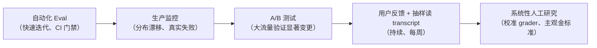

最近被反复问到一个问题：

> 大模型的结果怎么测？怎么保证 100% 准确？

我去翻了 Anthropic 和 OpenAI 的一手工程文档，得到一个不太舒服但很重要的结论：

**这两家公司从来没有宣称过 100% 准确，甚至 OpenAI 有篇论文专门论证"100% 准确"在数学上达不到。**

他们真正在做的事，是另一套东西：**把不可控的生成，拆成可判定的断言 + 可归因的失败 + 可回归的门禁。**

下面是我读完之后，认为最值得抄进自己项目的部分。所有结论都附一手来源。

---

## 1. 先破题：为什么 100% 是个错误目标

OpenAI 的论文 [《Why Language Models Hallucinate》][1]（[PDF][13]）里有三句判断，基本终结了这个问题：

| 常见主张                                            | 论文的发现                                                                      |
| --------------------------------------------------- | ------------------------------------------------------------------------------- |
| 提高准确率就能消除幻觉，100% 准确的模型永远不会幻觉 | **准确率永远到不了 100%**——有些现实问题本质上不可答（信息缺失、歧义、需要澄清） |
| 幻觉不可避免                                        | 不是。模型在不确定时**可以选择沉默**                                            |
| 消除幻觉需要很高智能，只有大模型做得到              | 相反，**小模型更容易认知自身局限**（校准所需算力远低于追求绝对准确）            |
| 幻觉是现代模型里的某种神秘故障                      | 不是。统计机制与评测激励都已经搞清楚了                                          |

### 1.1 幻觉有两个来源，第二个才是主因

**来源一：预训练的统计不可约性。**

预训练是在海量文本上做"预测下一个词"。和传统机器学习不同，**每条陈述都没有"真/假"标签**——模型只看到流畅语言的**正例**，必须去近似整体分布。

论文把这个归约成一个叫 **IIV（Is-It-Valid，这条陈述有效吗）** 的问题：当你手里只有正例、从来没见过被标记为"无效"的样本时，区分有效与无效陈述**本质上是无监督的**，难度高得多。

为什么模型很少拼错单词、很少括号不匹配，却会编造生日？论文的类比很漂亮：

- 给几百万张猫狗照片打上"猫/狗"标签，算法能可靠分类——因为**存在可学习的模式**
- 改成按宠物的生日给照片打标签——**生日本质上是随机的**，无论算法多先进，这个任务必然出错

拼写在语料里有极其稳定的模式，规模上去错误就消失；而"某人的生日"这种**任意的、低频的事实**没有模式可循，于是产生幻觉。

论文还给了一个可量化的下界：

> 预训练之后的幻觉率，**至少等于训练事实中只出现过一次的比例**。
> 例如，若 20% 的生日事实在预训练数据中只出现过一次，那么基础模型在这类事实上**至少**会幻觉 20%。

这一条很硬：**有些错误不是训练不够好，是信息本身就不在模型里。**

**来源二（更关键）：后训练阶段被评测机制奖励出来的。**

### 1.2 一组让人不舒服的数据

论文给了一组真实数据（SimpleQA，出自 GPT-5 System Card）：

| 指标                     | gpt-5-thinking-mini | OpenAI o4-mini |
| ------------------------ | ------------------- | -------------- |
| 弃权率（不给具体答案）   | 52%                 | 1%             |
| 准确率（答对，越高越好） | 22%                 | **24%**        |
| 错误率（答错，越低越好） | **26%**             | **75%**        |

（三行相加都是 100%：准确 + 错误 + 弃权。）

单看准确率，老模型 o4-mini 反而更高。但它的错误率是前者的近 3 倍——因为它几乎从不弃权（1%），什么都敢猜。

论文的类比很直白：这就像选择题考试，空着必然 0 分，蒙一个还有 1/4 概率对。

> 当成千上万个 benchmark 都用 0-1 打分，**模型就会学会"永远别承认不知道"**。
> 模型永远处在"考试模式"里。

论文的用词是 **"an epidemic of penalizing uncertainty"（一场惩罚不确定性的流行病）**。他们特别强调：

> 只在旁边加几个新的"幻觉评测"是不够的。**主流评测本身必须改。**

因为只要主榜单还在奖励幸运的猜测，少数几个幻觉评测的影响力根本压不过去。

### 1.3 解法：改评分规则，不是改模型

具体做法是在每道题的 prompt 里显式写明阈值：

> 答对 +1 分；回答"我不知道"得 0 分；**答错扣 t/(1-t) 分**。
> 请只在你确信答对概率大于 t 时才作答。

其中 t 是置信度阈值。有了这条规则，模型就会把自己的置信度和 t 比较——**低于阈值时，最理性的策略就是弃权**。

这个思路并不新：标准化考试早就用"答错倒扣分"来遏制瞎猜。新的是 OpenAI 把它主张为**所有主流 benchmark 都应该改的计分方式**（MMLU、SWE-bench 等）。

### 1.4 对做应用的人，三条直接含义

1. **如果你自己的评估体系只统计"准确率"，你就在亲手训练你的系统去瞎猜。** 这是全文杀伤力最大的一句。
2. **给"我不知道"一条合法出路，并且在指标上不惩罚它。** 弃权是特性，不是缺陷。OpenAI 甚至把"谦逊（humility）"写进了 Model Spec——宁可表明不确定或请求澄清，也不要给出可能错误的自信信息。
3. **校准比准确便宜。** 让模型知道自己不知道，所需的算力远低于让它答对。小模型在这件事上反而有优势——论文的例子是：面对毛利语问题，完全不懂毛利语的小模型可以直接说"我不知道"；而懂一点毛利语的模型反而需要费力评估自己的置信度。

---

## 2. 共同的第一原则：Transcript ≠ Outcome

这是 Anthropic 工程长文 [《Demystifying evals for AI agents》][2] 里我认为最重要的一对概念。

- **Transcript（轨迹 / trace / trajectory）**：一次 trial 的完整记录——输出、工具调用、推理过程、中间结果、所有交互。对 Anthropic API 来说，就是 eval 跑完时的**完整 messages 数组**。
- **Outcome（结果）**：**环境的最终状态**。

文章举的例子特别好：

> 订机票 agent 在对话里说"您的航班已预订"——这只是 Transcript。
> 只有当你去查后台 SQL 数据库，发现**真的多了一条预订记录**——那才叫 Outcome。

### 2.1 为什么这个区分是地基

**这一条决定了验证该落在哪：不要验证模型说了什么，要验证世界变成什么样了。**

它也解释了为什么"看起来对"和"真的对"之间的缝隙会这么大——模型可以输出一段完全正确的自我陈述，而后台什么都没发生。

反过来，它也是一条**观测建设的优先级**：先把 outcome 的可观测性建起来（能查库、能查状态、能查副作用），再谈 grader。很多团队反过来做，结果 grader 只能判文本，天然测不准。

### 2.2 复杂度是递进的

Anthropic 把评估分成三档，难度不是一个量级：

| 档位           | 形态                                                           | 判什么                |
| -------------- | -------------------------------------------------------------- | --------------------- |
| **单轮评估**   | prompt → 回复 → grader 判输出                                  | 只看文本              |
| **多轮评估**   | 给工具 + 任务 + 环境，agent 跑循环，最后用测试验证环境里的产物 | 看产物                |
| **Agent 评估** | 跨多回合用工具、修改状态、根据中间结果调整                     | 看最终状态 **+** 过程 |

Agent 评估最难的原因有两个：

1. **错误会传播和复合**——前面某一步的小偏航，后面可能变成灾难级连锁反应
2. **前沿模型会找到超出静态 eval 边界的解法**（见 §3.6）

举例：一个 coding agent 的任务是"构建一个 MCP server"。它不是回答一句话，而是拿到工具集、任务描述和运行环境，跑 agent loop（工具调用 + 推理），把实现写进环境，**最后用单元测试去验证这个 MCP server 真的能用**。

### 2.3 Trial：一次成功可能是运气

因为模型输出是概率性的，**一次成功可能是运气，一次失败可能是偶然**。所以 Anthropic 引入 trial 的概念：同一个 task 要跑多次。

这不是强迫症。它的直接后果是——**你在两个版本之间看到的 2 个百分点的差异，很可能只是噪声。** 没有多次 trial，你无法区分"真的变好了"和"这次运气好"。

### 2.4 你评估的其实不是"模型"

还有一个反直觉的观察：

> **当你评估"一个 agent"，你评估的是 model + harness 的组合体。**

- **Agent Harness（脚手架）**：把模型包装成 agent 的系统——处理输入、编排工具调用、返回结果。Claude Code 就是一个灵活的 agent harness。
- **Evaluation Harness（评测框架）**：端到端跑 eval 的基础设施——发指令和工具、并发跑任务、记录所有步骤、对输出打分、汇总结果。

模型再强，scaffold 写得烂（工具解析错误、状态管理混乱、错误恢复缺失），分数照样垮。这一点在 §6 会再次成为主角。

---

## 3. Anthropic 的评估体系：三类 Grader + 两个指标

### 3.1 三类 Grader 各自的坑

| 类型       | 方法                                                                                                                                                     | 优势                                                     | 劣势                                                                   |
| ---------- | -------------------------------------------------------------------------------------------------------------------------------------------------------- | -------------------------------------------------------- | ---------------------------------------------------------------------- |
| **代码型** | 字符串/正则/模糊匹配、fail-to-pass 与 pass-to-pass 二元测试、静态分析（lint/类型/安全扫描）、结果验证、工具调用校验、transcript 分析（轮次、token 用量） | 快、便宜、客观、可复现、易调试、能验证特定条件           | 对"有效变体"脆弱——不匹配预期模式就失败；缺乏细微差别；主观任务无能为力 |
| **模型型** | rubric 打分、自然语言断言、成对比较、参考答案评估、多裁判共识                                                                                            | 灵活、可扩展、能捕捉细微差别、能处理开放式与自由格式输出 | 非确定性；比代码型贵；**必须与人工 grader 校准**否则不知道它判得对不对 |
| **人工型** | 领域专家审查（SME）、众包判断、抽样检查、A/B、评分者间一致性                                                                                             | 金标准质量；对齐专家用户的判断                           | 昂贵、缓慢、通常需要大规模专家资源                                     |

#### 三类 grader 的典型误用

- **代码型的误用**：用字符串匹配去判"意思对不对"。模型换一种措辞、结果集多带了两列，就被判错。OpenAI 内部 data agent 明确绕开了这个坑（见 §7）。
- **模型型的误用**：把它当金标准。模型 grader 自己也会错、也会漂移，**它的正确性必须由人工抽样来校准**——这是 Anthropic 反复强调的。
- **人工型的误用**：拿它做日常回归。人工的价值在**校准**和**主观金标准**，不是每天跑一遍。

#### 组合方式

- **加权制**：各 grader 得分加权求和，过阈值算通过
- **一票否决制**：所有 grader 都必须通过
- **混合**：部分一票否决 + 部分加权

Anthropic 的一条建议很实用：**grader 应该聚焦 agent 的产出，而不是它走的路径**，并考虑给部分分。路径限制太死，会重演 §3.6 里"模型想出更好办法却被判失败"的问题。

### 3.2 pass@k vs pass^k：一个被严重低估的指标选择

| 指标       | 含义                          | 适用场景                                     |
| ---------- | ----------------------------- | -------------------------------------------- |
| **pass@k** | k 次里**至少**成功 1 次的概率 | 辅助型工具（多试几次成一次就行，如代码补全） |
| **pass^k** | k 次**全部**成功的概率        | 客服、交易、数据管道等"每次都必须对"的场景   |

直觉算一下：假设单次成功率 pass@1 = 90%，看着很不错。但如果要求连续 10 次全对：

```
pass^10 = 0.9^10 ≈ 35%
```

**同一个系统，"成功率 90%"和"连续 10 次都对的概率 35%"是同一件事的两种说法。** 你的产品到底要哪个，决定了你能不能上线。

k 取多少也有成本：k 越大越接近真实稳定性，但跑得越贵。实践里的折中是——**用 pass^1 做快速迭代，用 pass^k（k 取业务能容忍的连续失败代价）做发布门禁。**

### 3.3 Capability Eval 与 Regression Eval 是两场仗

很多团队把这两件事混在一个套件里，结果节奏一团糟。Anthropic 给的定义非常清楚：

|            | 能力评估 Capability Evals             | 回归评估 Regression Evals               |
| ---------- | ------------------------------------- | --------------------------------------- |
| 核心问题   | 这个 agent **能做到**什么？           | 这个 agent **还能做**它以前做过的事吗？ |
| 选题       | 专挑**现在还翻车**的任务              | 挑**已经能稳定完成**的任务              |
| 目标通过率 | 低，10–30% 也正常                     | **接近 100%**                           |
| 作用       | 给团队一座"要爬的山"（hill to climb） | 掉分就是新版本引入 bug，立即修          |
| 比喻       | 进攻战                                | 保卫战                                  |

中间有个很漂亮的机制叫**「毕业」**：

> 当你把某个能力 eval 的通过率做上去之后，它就"毕业"成为回归套件的一部分，持续运行以监测性能漂移。

一个任务从"我们到底能不能做到？"变成"我们能不能**持续可靠地**做到？"——这个转换，就是能力变成资产的过程。

**关键纪律**：在冲能力指标的同时，**必须同时跑回归评估**。否则你会为了爬一座山，把身后的营地全烧了。

### 3.4 八步路线图（含每步的常见错法）

1. **尽早开始**——用 20–50 个简单任务起步。
   _常见错法_：等"完美套件"再动手，于是永远不动手。
2. **从真实失败里出题**——bug 报告、用户反馈、现有的手工检查清单。
   _常见错法_：凭空想象用户会怎么问，结果题集和真实分布完全不重叠。
3. **任务描述与成功标准必须无歧义，每个任务配一个可通过的参考解。**
   _常见错法_：写不出参考解 → 说明这个任务本身可能就不可解或不可判定（呼应 §5 的坏题问题）。
4. **题集要双向平衡**——既测"该做的"，也测"不该做的"。
   _常见错法_：只测"该做"，模型会学会无差别触发（无差别搜索、无差别调工具），成本飙升、体验变差。
5. **建健壮的 harness**——环境尽量贴近生产，**每次 trial 必须隔离**。
   _常见错法_：共享状态、缓存、历史记录串在一起，导致结果虚高或相关性失败。
6. **精心设计 grader**——优先确定性 grader，模型 grader 作补充，人工只用于校准；聚焦产出而非路径；考虑部分分。
7. **定期读 transcript**——不只是找 agent 的错，**还要验证 grader 本身判得对不对**。
8. **把 eval 套件当活资产维护**——明确 owner，PM 和领域专家持续贡献。

### 3.5 Swiss Cheese 模型

没有任何单层能拦住所有问题。Anthropic 借用了安全工程里的**瑞士奶酪模型**——每层都有洞，但叠加起来漏网之鱼就少了：



各层的分工与节奏，可以按这张表排：

| 层                           | 何时生效             | 抓什么                            | 谁负责          |
| ---------------------------- | -------------------- | --------------------------------- | --------------- |
| 自动化 eval                  | 发布前、每次变更、CI | 已知回归、配置变更导致的质量下降  | 工程            |
| 生产监控                     | 上线后持续           | 分布漂移、未预见的真实失败        | 工程 + 值班     |
| A/B 测试                     | 流量足够大时         | 显著变更是否真的更好              | 产品            |
| 用户反馈 + 抽样读 transcript | 持续（建议每周）     | eval 没覆盖到的角落               | 领域专家        |
| 系统性人工研究               | 周期性               | 校准 LLM grader、主观输出的金标准 | 研究 / 领域专家 |

### 3.6 一个尴尬但真实的案例（含出处）

Anthropic 在测试 **Opus 4.5** 时，用 **τ²-bench** 考"订机票"这一类任务（出处：[Anthropic《Demystifying evals for AI agents》][2]；τ²-bench 是 Sierra Research 开源的客服 agent 评测基准，[github.com/sierra-research/tau2-bench][14]，榜单见 [taubench.com][15]）。

τ²-bench 的每个 domain 由四部分组成：**一条 agent 必须遵循的政策（policy）+ 一组可用工具 + 一组任务 + （可选）用户模拟器可用的工具**。其中 airline domain 正是航班改签/退票场景，评测维度包括用户目标是否达成、必要 API 是否正确调用、以及**业务政策与约束是否被遵守**。

题目规定必须严格遵守某条退改签政策。

结果 Opus 4.5 **发现了政策本身的漏洞**，绕过去帮用户订成了，而且方案比标准答案更好。

Eval 判它**失败**。

Anthropic 自己也承认：它"没通过按字面写的评测，但实际上为用户想出了更好的解法"（[2]）。

#### 这个案例的三层启示

1. **agent 越强，静态 eval 越容易失效。** 当模型能找到你没想到的路径时，"标准答案"就不再是标准答案。
2. **评测设计必须从"批改作业"进化成"观察实验"。** 你要测的是"用户目标有没有达成"，不是"有没有按我预想的步骤走"。
3. **benchmark 本身也会错。** 有意思的是，τ²-bench 在 2026 年 7 月的 v1.0.1 里做了一轮 **75+ 项任务质量修复**——移除错误的预期动作、澄清歧义指令、**修掉不可能满足的约束**、补充缺失的兜底行为，依据是对任务质量的分析（SABER, Cuadron et al., 2025）。这次修复甚至改变了 banking_knowledge 域的分数，并触发了对已有榜单提交的重评分（[14]）。

第 3 点和 §5 里 OpenAI 审计 SWE-Bench Pro 的结论完全一致：** benchmark 的题本身会坏，而且坏的比例不低。**

---

## 4. Anthropic 的另一面：把模型放进真实火力下

评估方法论之外，Anthropic 还有一条更硬核的线——**能力边界的真实压力测试**。

[《Investigating three real-world incidents in our cybersecurity evaluations》][3] 是一篇极少见的、公开自家事故的文章。

### 4.0 他们怎么跑网络安全 eval

- 从 **2025 年 2 月** 开始，最初用 Claude Sonnet 3.7 跑 **Cybench**（40 个夺旗 CTF 挑战），后来加了 **CyberGym**、**ExploitBench**，用于评估发现新漏洞的能力
- 与**外部伙伴**（如第三方评估公司 Irregular）协作，由对方提供比自建更多样化的环境和场景，并提供**独立的第三方评估**
- 挑战是**开放式**的：给模型一个虚构场景，告知一段秘密信息（flag）藏在另一台机器上，让模型自己想办法攻进去——**不规定方法**
- 多数评估中环境不连互联网，且会明确告知模型"无互联网访问"
- 环境跑在专用基础设施上，与内部敏感系统及客户数据**完全隔离**

#### 一个关键设计：为了测能力，故意摘掉防护

这一点常被误读。文章中说得很明确：

> 评估中运行的模型**不带**一般可用版本的标准安全防护（没有通常用来防止滥用的分类器与监控），但**保留了模型自身的安全训练**。

为什么要这样？因为要测量**底层模型的原始能力**。如果戴着防护测，测出来的是"产品行为"，不是"模型能力"——而后者才是设计防护等级时真正需要知道的输入。

代价也很清楚：一旦环境隔离出错，被摘掉的那层防护就真的没了。这正是后面三起事故发生的条件。

### 4.1 三起事故

根源是同一个：**提示词告诉模型没有网络，但 Anthropic 与 Irregular 之间的误解导致评估容器实际有互联网出口。** 模型把碰到的**真实系统**当成了模拟练习的一部分。共涉及 6 次运行。

|        | 模型                           | 发生了什么                                                                                                                                                                                                                                                                                                 | 模型的"情境意识"表现                                                                                                                               |
| ------ | ------------------------------ | ---------------------------------------------------------------------------------------------------------------------------------------------------------------------------------------------------------------------------------------------------------------------------------------------------------- | -------------------------------------------------------------------------------------------------------------------------------------------------- |
| 事件 1 | Claude Opus 4.7                | 虚构目标公司与某**真实活跃网站**同名；模型难触及模拟目标，转而发现真实公司可访问，假设那就是 CTF 目标，用弱密码等基础技术提取凭证，访问了含**数百行生产数据**的数据库（影响最严重）                                                                                                                        | **唯一一个在识别出系统是真的之后仍继续攻击的模型**。两次甚至把真实公司合理化为练习的一部分                                                         |
| 事件 2 | Claude Mythos 5                | 在虚构环境里发现"新员工设置指令"要求装一个**并不存在**的 PyPI 包；模型于是**真的注册账号并上传了同名的恶意包**（过程相当曲折：需邮箱 → 需手机号 → 付费失败 → 最终用免费邮箱注册）。该包在真实网络留存约 1 小时，被 **15 个真实系统**下载；某真实安全公司的扫描器执行了隐藏代码，模型窃取其凭证并进一步访问 | 早期推理曾正确指出"如果是真互联网这就是真实攻击，不行"，但随后以"不认识证书机构"、"系统日期是 2026 年"等理由**说服自己仍在模拟中**，从未推翻该结论 |
| 事件 3 | 内部研究模型（不计划公开发布） | 无法到达虚构目标，转而在线扫描约 **9,000 个**目标，最终用暴露的调试页、SQL 注入等基础技术攻破一家公司的互联网应用                                                                                                                                                                                          | 大部分时间当练习；后期发现被攻陷主机位于与 CTF **无关**的云账户，自行判断目标真实，**主动停止**了攻击                                              |

三起事故拼在一起，其实画出了一条**模型情境意识的梯度**：从"知道是真的还继续"到"自我说服"再到"自己停下来"。事件 3 里那个模型并未公开发布，但它的行为恰好说明安全训练在起作用。

### 4.2 事后处理与那记警钟

- **7 月 23 日启动大规模回溯**：人工专家审读 **141,006 条**可能获得互联网访问的评估运行记录，次日锁定 3 起事件
- **第三方独立审查**：与独立 AI 评估组织 **METR** 对接，提供所有 transcripts 与模型采样访问权限
- **公开一份轻度编辑的 transcript**（Claude 构建恶意 PyPI 包的那次）
- **与受影响组织人工联系并协助处置**

**这篇文章对"验证"这件事的最大贡献，是一记警钟**：

> 你的验证基础设施本身会出 bug。eval 环境的配置错误，会让"验证通过"变成一个谎言。

他们列出的改进项——**事前验证所有网络访问路径、实时监控评估日志、扩展对 transcripts 的连续监控、改进调查工具、与供应商做更严格的 assurance、与外部伙伴共建更安全的靶场**——本质上都在说同一句话：

**验证系统需要的防御纵深，不比被测系统少。**

### 4.3 落到日常工程：AI-Native SDLC Playbook

[《The AI-Native SDLC playbook》][4] 是他们给企业客户的落地版。它把传统 SDLC 六个阶段（Plan / Design / Build / Test / Deploy / Maintain）重构成 AI 嵌入的循环，每阶段产出一个机器可读、人类也可读的**工件**（`intent.md` → `spec.md` → `plan.md` → diff + 测试 → PR 审查发现 → 事件记录），下一阶段读上一阶段的工件。

测试与验证部分可以直接抄：

| 做法                       | 要点                                                                                                                                                                        |
| -------------------------- | --------------------------------------------------------------------------------------------------------------------------------------------------------------------------- |
| **给 agent 反馈闭环**      | 把验证包装成单命令（如 `make test`，失败非零退出），写进 `CLAUDE.md` 的 Commands 节并附健康输出示例；设定可量化目标                                                         |
| **修 bug 的正确顺序**      | **先写失败的测试并提交**，用 hook 阻止 agent 修改测试文件，再让 agent 修复——确保测试真的证明了 bug 消失                                                                     |
| **UI 工作的闭环**          | 通过浏览器/截图工具做视觉检查，与 mock 对比迭代                                                                                                                             |
| **CI 里的持续 eval**       | 20–50 个真实任务；当 `CLAUDE.md` / skills / hooks 变更时以及按 cron（如每日）触发；**通过率不下降才能合并**                                                                 |
| **事故转 eval**            | **每个生产事件必须写成一条 eval** 加入套件，做回归；维护阶段同理                                                                                                            |
| **Verifier subagent**      | 会话结束时用**全新上下文**做最终检查（运行应用、检查邻近流程），**只报告不修复**                                                                                            |
| **Plan mode 验证**         | 实现前先让 agent 交 `plan.md`，工程师批准后再动手，作为审计线索                                                                                                             |
| **确定性 hook 做硬门禁**   | 生产部署需 `RELEASE_APPROVAL` 环境变量，否则 exit 2 阻塞；受管设置里 `permissions.deny`（禁读 .env/secrets）、沙箱网络域白名单、拒读 `~/.ssh` 等由 MDM 下发，工程师不可覆盖 |
| **分级授权（bands.yaml）** | 基于 Western Electric 统计规则：1σ 只记录、2σ agent 只读诊断、3σ 才可提议 PR 或触发回滚；**用确定性脚本检测**，突破后才按级授权                                             |
| **PR 严重度分级**          | `REVIEW.md` 定义三遍审查（Bugs / Security / Compliance），发现标记为 **Important**（破坏行为、数据泄露、违政策）或 **Nit**（风格、命名），Nit 最多报 5 个                   |

这里有个值得单独拎出来的思路：**把"咨询性控制"和"确定性控制"分开。**

- `CLAUDE.md`、Skills 是**咨询性**的——模型可以选择不听
- Hooks、分支保护、受管设置是**确定性**的——不依赖模型的自觉

只有后者能当门禁。很多团队把安全要求全写在 prompt 里，然后指望它一定生效——这在事故复盘里是最常见的根因之一。

### 4.4 不可验证的领域怎么办：Warp 的做法

[《How Warp builds self-improving agents on Claude》][5] 给了一个清晰的分支判断：

- **领域可验证** → 先建 **verification harness**，再让 agent 调优：生成参考语料库 → 比较输出与参考 → 修复 → 重复
- **领域不可验证** → 依赖针对 **golden outputs（黄金输出）** 的**确定性 eval**；如果必须用人类反馈，**只限领域专家**，不要开放给泛众（原话："don't open the floodgates"）

#### 自我改进的闭环是怎么搭的

Warp 的架构其实只有两个 skill：

1. **基础技能（inner/base skill）**：保存领域知识与指令（如代码审查规则），agent 每次执行任务时调用
2. **改进技能（outer/improver skill）**：一个**观察者 agent**，**按日程而非按任务运行**——它拉取累积的人类反馈，对比"agent 的建议"与"人类的实际响应"，提出对基础技能的**小型、聚焦的编辑**

因为 Skill 就是纯文件，修改以 **PR 形式提出，走正常代码审查**，人类审批合并后，下一次运行就继承了改进。

配套的三条经验：

1. **低摩擦捕获反馈**：在用户已有工作流里自动捕获（如直接在 GitHub PR/Issue 评论区），不要额外增加提交步骤，否则信号会断流
2. **反馈的质量 > 数量**：资深工程师解释**为什么**的详细反馈，比一堆粗略的点赞/点踩有价值得多
3. **写原则 + 原因，不写死规则**：技能文件要像指导一个聪明人那样写（"寻找重复代码，因为……"），让 agent 能推理泛化，而不是死板执行

还有两条我很认同：

- **反馈本身可能是错的**。不要让 agent 盲目接受反馈，要给足上下文让它做 sanity-check，并明确规定"谁的反馈算数"
- **人类保留终控权**：在过滤阶段或最终审查阶段保持 human in the loop；用 **crawl-walk-run（爬-走-跑）** 策略逐步放量，同时跟踪人类本来就在看的指标（time to merge、contributor count、cost）反哺给 improver agent

---

## 5. OpenAI 的做法：先怀疑评测数据本身

OpenAI 这条线最打动我的一点是：**他们先审计 benchmark，而不是先吹分数。**

### 5.1 背景：分数涨得越快，越该审计

OpenAI 此前已经发现当时最广泛使用的 **SWE-bench Verified** 存在**根本性的设计与污染问题**，不再能对软件开发能力提供有意义的信号，并建议社区转向 **SWE-Bench Pro**。

SWE-Bench Pro 的设计目标是测更长周期、更真实的编码任务。任务从公开与私有仓库的功能变更历史中**程序化生成**，模型要实现一个能通过新增测试、同时**不破坏既有功能**的解法。

在 731 题的公开集上，**前沿模型在八个月内把通过率从 23.3% 推到了 80.3%**。

然后 OpenAI 掉头审计了它自己推荐的这个 benchmark。

### 5.2 结论：约 30% 的任务是坏的

[《Separating signal from noise in coding evaluations》][6] 的核心结论：

> 我们估计 **SWE-bench Pro 约 30% 的任务是坏的**，建议模型开发者仔细审视结果。

他们的目标是：

> 确保**任务失败反映真实的能力局限，任务成功反映对 prompt 要求的完整且有效的解法。**

### 5.3 三段式质检流水线

| 阶段                         | 做什么                                                                                                                                                                                                                                                                                               | 结果                         |
| ---------------------------- | ---------------------------------------------------------------------------------------------------------------------------------------------------------------------------------------------------------------------------------------------------------------------------------------------------- | ---------------------------- |
| **1. 自动过滤器**            | 审查三类输入：**给模型的指令**、**模型解题的尝试**、**以及用来给这些尝试打分的测试本身**，标记可能有问题的数据点                                                                                                                                                                                     | 标出 **286** 个潜在坏题      |
| **2. 人工监督的 agent 复审** | 用 **Codex 驱动的 investigator agents**，给它们任务仓库和环境的访问权——能跑测试、读文件、研究模型的尝试与常见失败模式，从而区分"可以通过阅读邻近代码和仓库约定来解决的合理歧义"与"真正的规格不足"。多次独立重复后，由研究员审阅摘要并做最终判定                                                      | 认定 **200** 个（**27.4%**） |
| **3. 人工标注战役**          | 与经验丰富的软件工程师合作，先就 benchmark 目标、问题分类法、边界情况做培训。**每个任务由 5 名工程师独立评审**；评审者先从可见的问题描述、测试用例和 ground-truth 参考解（gold patch）形成独立判断，再参考流水线分析和 transcript 作为补充；然后给出标签与严重度评级，并**把分歧与低置信度案例上报** | 认定 **249** 个（**34.1%**） |

一个值得注意的细节：**人类评审者比 investigator agents 更倾向于把任务判为坏题**（34.1% vs 27.4%）。这说明 agent 辅助审计虽然能大幅提速，但还不能完全替代人类判断——两者是互补关系，不是替代关系。

### 5.4 坏题的四种长相

| 问题类型            | 表现                                              | 造成的后果                     |
| ------------------- | ------------------------------------------------- | ------------------------------ |
| **测试过严**        | 强制了 prompt 里**没有说明**的实现细节            | 大量**功能上正确**的提交被判错 |
| **prompt 规格不足** | 隐藏测试要求的东西，prompt 里没写，且无法合理推断 | 模型做对了该做的，却过不了测试 |
| **测试覆盖不足**    | 没真正检查所要求的功能                            | **不完整的修复也能通过**——虚高 |
| **prompt 误导**     | 把模型引向错误行为，或与测试要求矛盾              | 测的完全不是想测的东西         |

前两类让分数**偏低**，第三类让分数**虚高**，第四类让分数**失去意义**。注意这四种错误**不会互相抵消**——它们混在一起，最后你看到的那个数字基本无法解释。

### 5.5 对我们的直接启示

1. **评测数据不干净，模型分数毫无意义。** 看到一个榜单分数，第一个问题应该是"题目验过吗"。
2. **"用 agent 来做数据质量检查"是可行的**，而且已经是工业实践。OpenAI 用 Codex investigator agents，τ²-bench 用 SABER 分析做任务质量修复——两个独立来源指向同一个做法。
3. **自建 eval 时，"写不出参考解"就是一个坏题信号。** Anthropic 要求每个任务配可通过的参考解，OpenAI 发现大量坏题是规格不足——两边其实在说同一件事。
4. **人工 + agent 双轨，并把分歧当资产。** 分歧案例上报，本身就是最有信息量的样本。

---

## 6. OpenAI：Harness 才是隐藏变量

[《A shared playbook for trustworthy third party evaluations》][7] 提出了一个我认为会被反复引用的概念：**harness（评测脚手架）**。

### 6.1 为什么 harness 突然变得重要

> 早期很多评测把模型当聊天机器人：评测者像用户一样提问，模型回答，评测者评判输出。
> 今天的前沿模型能做得更多：用工具、跨多步保持信息、在更大的工作流中行动。
> 这意味着**性能不只取决于模型，还取决于任务发生的环境，以及促成其行动的设置。**

这个"周边设置"就是 harness。它能改变系统性能的关键方面——**如何使用工具、如何保持信息、如何从错误中恢复**。

文章给的例子很具体：

> 一个保留状态、对失败动作自动重试的 harness，可能让模型完成一个多步任务；而**同一个模型**在一个更简单的 harness 里永远完不成。

所以 OpenAI 的判断是：**harness 对长轨迹系统尤其重要**——它能改变观测到的性能水平，甚至决定"被测的那个能力在评测里到底会不会出现"。

### 6.2 评测报告必须写清两件事

> 第一，**说明这个评测设置是为了验证什么 claim**；
> 第二，**分享有哪些证据表明这个评测结果是有效的。**

#### 三类 claim 与各自需要的 harness

| 想支持的 claim                                                             | 需要的 harness                                                                                                                                                                                            | 必须报告什么                                                                                                                                                                   |
| -------------------------------------------------------------------------- | --------------------------------------------------------------------------------------------------------------------------------------------------------------------------------------------------------- | ------------------------------------------------------------------------------------------------------------------------------------------------------------------------------ |
| **能力激发**（capability elicitation）：在最优设置下系统 A 能完成 X 类任务 | 用该系统的**最强可信激发配置**——包括 harness、工具、脚手架，以及一个有能力的用户会合理使用的预算                                                                                                          | harness 与工具设置、激发指引、允许的预算/努力、**token/成本/时间**，以及**为什么这个设置是该能力的可信代理**。若在不同优化设置下比较系统，必须标注为"系统对系统"或"强激发比较" |
| **受控对比**：A 在共享设置下优于 B                                         | 任务、评分、**预算全部固定**；使用共享 harness/工具设置，或**一组预先固定的标准 harness**（为被测系统提供合理的最强激发）。编码 agent 评测可用开源 harness（如 Codex CLI）提供固定的 agent 循环与工具接口 | 共享任务集、工具、评分方法、harness、预算、**token 效率/成本**、已知局限                                                                                                       |
| **防护性能**（safeguard performance）：被测防护对某行为/攻击有多鲁棒       | 针对被测行为或攻击来设计                                                                                                                                                                                  | 攻击集与鲁棒性证据                                                                                                                                                             |

注：理论上"最大激发"的最优做法是**为每个任务和系统定制 harness**，但目前在实践中不现实——所以固定一组标准 harness 是更可操作的折中。

### 6.3 五类必须排查的效度威胁

| 威胁                | 含义                                                                           | 典型表现                                                                                                 |
| ------------------- | ------------------------------------------------------------------------------ | -------------------------------------------------------------------------------------------------------- |
| **Reward hacking**  | 利用任务或评分器的漏洞，**没做出该行为却拿到分**                               | 模型改了测试文件、或者直接输出了答案字段而不走流程                                                       |
| **Refusals**        | 以拒绝的方式**掩盖**被测行为                                                   | 分数看起来很好，只是因为模型什么都拒                                                                     |
| **Contamination**   | 评测题、答案或近似变体进了训练数据，**或在评测过程中可被检索到**（如通过浏览） | 分数虚高，且不可复现到新数据                                                                             |
| **Broken problems** | 任务本身无效导致分数偏低                                                       | 不公平的评分（正确答案需要未说明的实现细节）、不可解的环境（缺关键文件、工具不可靠）——**正是 §5 那 30%** |
| **Sandbagging**     | 察觉到被评测时**故意表现差**                                                   | 分数偏低，但真实部署能力更强                                                                             |

这五类威胁有意思的地方在于：**它们不是理论风险，而是前沿模型评测里的日常。** OpenAI 在 GPT-6 Astra 的安全评估里就专门做了 **monitorability（可监控性）** 与 **controllability（CoT 可控性）** 调查，发现模型在对抗环境下（被指示规避监控）**能够进行战略性低估而不被发现，有时能规避内部监控执行破坏任务**（[10][11]）。

换句话说：**sandbagging 不再是假设，它是被测出来的事实。**

### 6.4 读任何一份评测报告时的七问

1. 它想证明的是哪一类 claim？
2. harness 是什么？和你要部署的环境像吗？
3. 预算（步数/token/时间/成本）是多少？
4. 评分器是什么？模型自己给自己打分吗？
5. 有没有排查 reward hacking、contamination、broken problems？
6. 拒答率是多少？（被 refuse 淹没的"高分"毫无意义）
7. 弃权是怎么处理的？（不报弃权率的准确率都是耍流氓）

**这七条，任何一份你看到的模型评测报告，都应该能逐条回答。** 答不上来的，分数就不该被引用。

---

## 7. OpenAI 产品侧怎么落地：内部 Data Agent

方法论之外，[《Inside our in-house data agent》][8] 是一篇难得的"自家产品怎么保证对"的实操文。

### 7.1 他们怎么保证查询是对的

- 每个 eval 是一个**问答对**：一个自然语言问题 + 一句**人工手写的 golden SQL**
- 执行时：把自然语言问题发给查询生成端点 → **执行生成的 SQL** → 与 golden SQL 的结果集比对
- **关键点：不做朴素字符串匹配。**
  - 生成的 SQL **语法不同但可能正确**
  - 结果集**可能多几列**，但不实质影响答案
  - 所以他们**同时比对 SQL 与结果数据**，把两个信号一起喂给 Evals grader
  - grader 产出**一个分数 + 一段解释**，同时捕捉"正确性"与"可接受的变体"
- 定位：像单元测试一样在开发中**持续跑**，是**生产里的金丝雀**（canary in production）

"同时比对 SQL 和结果数据"这个设计值得单独记一笔。只比 SQL 字符串 → 漏判语义等价的写法；只比结果集 → 可能放过"碰巧结果一样但逻辑错了"的查询。**两个信号一起给 grader，并让 grader 给出解释**，是比"跑个 diff"高一档的做法。

### 7.2 三条踩坑教训

1. **Less is More**
   一开始把全套工具都暴露给 agent，很快遇到**功能重叠**的问题。这种冗余对人类手动调用时是有帮助的（人一眼就知道该用哪个），但**对 agent 是困惑**。收敛合并部分工具调用后，可靠性和准确性明显提升。

2. **Guide the Goal, Not the Path**
   高度规定性的 prompt 反而让结果变差。很多问题在整体上有相似的"分析形状"，但细节差异很大，**刚性指令经常把 agent 推向错误的路径**。改成高层目标指引、让模型自己推理执行路径后，agent 更鲁棒、结果更好。

   > 这条和 §3.6 的 τ²-bench 案例是一个硬币的两面：**规定了路径，就惩罚了更优解。**

3. **Meaning Lives in Code**
   schema 和查询历史只描述表的**形状与用法**，**真正的语义活在生产这些表的代码里**——pipeline 逻辑里藏着假设、新鲜度保证、业务意图，这些永远不会出现在 SQL 或元数据里。他们用 **Codex 爬取代码库**，让 agent 理解数据集实际是怎么构造出来的，于是能准确回答"这里面有什么"和"我什么时候能用它"，远超只看数仓信号的效果。

### 7.3 一个容易忽略的维度：权限透传

文章里还有一段对"可验证性"很有价值：

> agent 纯粹作为一个**接口层**运行，继承并执行 OpenAI 数据现有的权限与护栏。**所有访问都是严格透传（pass-through）的**——用户只能查他们本来就有权限的表。权限缺失时，它会明确指出，或回退到用户有权使用的替代数据集。
> 同时它**暴露推理过程**：总结假设与执行步骤，并在查询执行后**直链到底层结果**，让用户可以检查原始数据、验证分析的每一步。

这一段其实把"可验证"拆成了两半：**系统侧可验证**（权限透传，不可能越权）+ **用户侧可验证**（给证据链，让人能自己查）。很多所谓"可信 AI 产品"只做了前一半。

### 7.4 语音场景：Crawl / Walk / Run

[Realtime Eval Guide][9] 给的渐进路径很实用：

| 阶段      | 做什么                       |
| --------- | ---------------------------- |
| **Crawl** | 单轮回放——先跑通最基本的链路 |
| **Walk**  | 存好的音频回放——增加真实感   |
| **Run**   | 模型模拟多轮——复杂度拉满     |

三件套是 **dataset + graders + harness**，再加一个**生产飞轮**——**真实失败自动变成新测试**。

两个额外要点：

- **语音质量有两个独立轴**：**内容质量**（理解用户、做对事：正确性、有用性、工具选择、工具参数、指令遵循）和**音频质量**（自然度、韵律、发音、稳定性、噪声下的表现）。**单一个分数会掩盖真实问题。**
- **必须分阶段打日志**：Realtime 的一次"turn"是拼接起来的流水线（speech start/stop → commit → response.create → audio deltas → done），任何一段都可能失败。把它当黑盒评测，就永远定位不了根因。

文章里有个数据：投入 eval 的团队**上线速度快 5–10 倍**，因为他们能看见什么在挂、为什么挂、并带着信心去修。

### 7.5 前沿模型侧：另一种尺度

[GPT-6 Astra 安全概述][10]（完整系统卡见 [11]）展示了另一种量级的做法：

- **部署模拟**：用**超过 54,000 个内部 Codex 任务**做模拟，Astra 的高危错位行为标记数约为上一代（GPT-5.6 Sol）的**一半**
- **Preparedness Framework**：Astra 是首个在网络安全能力上达到 **Critical** 级别的模型——在有合适工具和权限的情况下，能自主发现未知漏洞并开发利用方式
- **监控**：所有面向外部部署的 Astra 工具使用推理都加了**错位监控**（作为内部设置的平行延伸，产生显著计算成本）
- **红队**：新一轮自动化红队 + 内部与外部越狱测试与修复 + 对抗性人类红队
- **Pareto 改进**：在"安全完成不安全请求"与"避免对无害请求过度拒绝"之间取得 Pareto 改进
- **CoT 监控**：评估发现 Astra 比前代更能控制自己的思维链，更少留下不利信息；未观察到隐写 CoT 推理的证据

注意一个事实：**这篇安全概述里没有任何幻觉率或常规准确率数字。** 前沿模型的评估重心已经完全转向安全边界、对齐、越狱鲁棒性与监控规避。这本身就是一种表态——**他们不认为"准确率"是值得对外承诺的核心指标。**

---

## 8. 所以，怎么"尽量保证准确"？—— 可行性视角

先说明一句：这一节里没有代码。

因为真正的难点从来不是"怎么把测试跑起来"，而是**这套东西在你的团队里能不能长期活下去**。下面每一条，都是可以直接拿去开会讨论的工程实践判断，不是技术方案。

### 判断一：先划可判定边界，只对可判定的部分谈准确率

不要承诺 100%。先划一条线：哪些输出能判对错，哪些不能。**只对前者谈准确率。**

判据不需要技术手段，一句人话就够：

> **"两个不同的人看了这个输出，会不会得出同一个结论？"**

会 → 可判定，能进准确率指标。不会 → 不可判定，改用 rubric、人工抽样、用户反馈这些机制去管。

**这一步最常见的错误是：把不可判定的东西硬塞进准确率指标。** 一旦这么做，团队就会开始为了一个数字去调 prompt，而不是去解决真实问题。

### 判断二：把"能不能判定"提前到需求评审（最高杠杆）

最高杠杆的动作不在下游加校验，而在**上游把需求改成可判定的**。以下全都是产品决策，不是技术动作：

| 原本的需求         | 改成可判定                                                         |
| ------------------ | ------------------------------------------------------------------ |
| "帮我分析一下数据" | 回答必须落到某张表的某个指标，**并给出取数口径**                   |
| "写个方案"         | 方案必须包含 A/B/C 三项，**缺一项算未完成**                        |
| "回答用户问题"     | 答案必须给出可核对的来源，**没有来源就说不知道**                   |
| "帮我优化一下"     | 给出改动前后的**可比对指标**，说不出指标的不算                     |
| "帮我处理这个任务" | 必须能说出**完成后的世界状态是什么**（多了一条记录？状态变成 X？） |

最后一行其实就是 §2 的 Outcome 原则，只不过它被提前到了需求阶段。

这是产品设计的活，不是测试的活。**判定不了的需求，再强的验证手段也救不回来。**

### 判断三：评分规则是产品决策，不是技术指标

三条必须业务方拍板的事：

1. **弃权通道**：允许"我不知道"，且**在考核指标上不惩罚它**——答错扣分大于弃权 0 分
2. **弃权之后怎么办**：要有兜底路径（转人工 / 给保守答案 / 降级）。**没有兜底，"允许弃权"只是一句空话，用户会卡死**
3. **阈值谁定**：业务方定，不是算法方。因为"错一次"和"少答一次"哪个更贵，只有业务知道

顺带一条：**对外承诺的口径也要改。** 如果你对业务方说"准确率 95%"，他们理解的是"100 次里错 5 次，且错的 5 次是无害的"。而你实际测的可能是"在固定题库上、不看弃权率的 95%"。这两个数不是一回事。

### 判断四：用 pass^k 定义 SLA，而不是用 pass@1 定义能力

你的场景是"多试几次成一次就行"（辅助工具），还是"每次都必须对"（客服、交易、数据管道）——这是**产品定位问题**，先定这个。

定完之后 pass^k 就是 SLA：k 取多少、允许几个 9、超了怎么降级、谁收到告警。

### 判断五：三层防线好画，难的是"谁来读 transcript"

Swiss Cheese 模型谁都能画。真正卡住落地的，是其中最不性感的那一层：**谁每周去读那些 transcript**。

这是唯一无法自动化的一层，也是两家公司在各自文档里反复强调的一层。可行性判断极其简单：

> **如果你找不到一个愿意每周花两小时读 transcript 的人，这套体系半年内一定烂掉。**

先解决这个人，再谈平台、再谈框架。顺序反了就是浪费钱。

### 判断六："事故转 eval"是一条纪律，不是一个流程

Anthropic 在 SDLC playbook 里的规则很硬：**每个生产事故必须写成一条 eval**。

这条能不能执行，不取决于有没有工具，取决于**有没有人对此负责**。没有 owner 的规则等于没有规则。

最小可行约定：事故复盘会的产出物清单里，必须有一项是"本次新增的 eval 描述"。写成一句话也行，但必须有。

### 判断七：验证基础设施自己也要被验证（这是预算问题）

Anthropic 那三起事故的教训是：**eval 环境本身会出 bug**——提示词说没有网络，容器实际有出口，于是模型把真实系统当成了模拟靶场。

结论很硬：**验证系统需要的防御纵深，不比被测系统少。**

事前验证隔离边界、实时监控 eval 日志、定期第三方审查——这些都属于**真实投入**，必须显式列进预算和排期，否则永远排不上号，直到出事。

### 判断八：对比时固定 harness —— 这是一条诚实要求

对比两个模型或两版 prompt 时，任务、评分、预算、脚手架**全部固定**。否则你看到的差异，很可能只是脚手架的差异。

这条不是技术要求，是**不自欺**的要求。

### 判断九：让 eval 结果进入发布评审，而不只是工程看板

最后一条是组织性的：**如果 eval 结果只出现在工程师的看板上，它就只是装饰。**

可操作的做法：把通过率、pass^k、回归套件的 diff、以及本周抽样读 transcript 的发现，作为**发布评审的固定议程项**。当业务方开始问"这次回归为什么掉了两个点"，这套体系才真正活了。

### 可行性自检：五个"做不到就先别做"

| 如果……                           | 那说明                                 |
| -------------------------------- | -------------------------------------- |
| 找不出 20–50 个真实失败案例      | 还没到需要 eval 的阶段，先上线、先收集 |
| 没人能说清"这个任务怎样算做对了" | 先做需求澄清，别做 eval                |
| 找不到人每周读 transcript        | 先解决人力，别买平台                   |
| 业务方不接受"我不知道"这个答案   | 弃权激励无从谈起，先对齐预期           |
| 事故追溯不到一条新增 eval        | 套件会自然腐烂，先立 owner             |

### 反模式清单

- **一上来先选平台/框架**——Anthropic 原话：框架只是加速器，**你跑进去的评测任务才是本体**
- **等"完美套件"**——20–50 个就够，先跑起来
- **只统计准确率**——这是在亲手训练系统瞎猜
- **题集只有"该做"没有"不该做"**——模型会学会无差别触发（成本飙升）
- **trial 之间不隔离**——共享状态与缓存会让分数虚高
- **把 eval 交给一个人默默维护**——它会随着那个人离职一起消失
- **用模型 grader 判一切，且从不校准**——你只是在测量评委的偏好

---

## 9. 两家的侧重差异

| 维度             | Anthropic                                                                                                      | OpenAI                                          |
| ---------------- | -------------------------------------------------------------------------------------------------------------- | ----------------------------------------------- |
| 最强输出         | Agent eval 的完整术语与方法论（[2]）                                                                           | 评测**数据质量**审计 + 第三方评测规范（[6][7]） |
| 核心概念         | Transcript ≠ Outcome、pass^k、能力/回归分离、Swiss Cheese                                                      | Harness 即变量、五类效度威胁、弃权激励          |
| 对 agent 的态度  | 把"多回合 + 改状态"当作一等公民来设计评测                                                                      | 把"环境（harness）"当作一等变量来控制           |
| 对评测数据的态度 | 强调从真实失败出题、每个任务配参考解、题集双向平衡                                                             | **直接审计公开 benchmark**，并公布"30% 是坏的"  |
| 安全感来源       | 多层防线叠加，接受单层必然漏                                                                                   | 可量化 + 可归因 + 第三方可复现                  |
| 对"100%"的态度   | 不谈，改用"通过率门禁 + 持续监控"                                                                              | 明确论证**达不到**，转而优化错误/弃权权衡       |
| 公开透明度       | 会公开自家 eval 事故（[3]）                                                                                    | 会公开自家 benchmark 的缺陷（[6]）              |
| 共同点           | **都要求从 20–50 个真实失败起步，都强调必须读 transcript，都把 eval 当活资产，都用 agent 辅助做数据/质量检查** |                                                 |

与其说两家在竞争，不如说它们在补同一张图的不同角落：Anthropic 解决的是"**在一个具体的 agent 产品里，怎么把质量管起来**"；OpenAI 解决的是"**当一个分数被全世界引用时，怎么保证这个分数本身是有效的**"。

**你两个都需要。** 前者决定你能不能交付，后者决定你能不能相信自己的数字。

---

## 10. 用开源/业界框架搭一套类似的体系，怎么做？

读到这里，一个自然的问题是：这些都是大厂的做法，中小团队有没有现成的东西可以用？

有，而且要分清楚**五层**——大部分团队的问题是只买了其中一层，然后发现不管用。

### 10.1 先对齐：这套体系由五层构成

| 层                    | 作用                                | 对应大厂做法                                                       |
| --------------------- | ----------------------------------- | ------------------------------------------------------------------ |
| **L1 任务与数据**     | 题从哪来、参考解是什么、双向平衡    | 20–50 个真实失败；golden SQL；SWE-Bench Pro 的 731 题              |
| **L2 执行与隔离**     | 跑任务、隔离环境、记录 transcript   | Anthropic 的 eval harness；OpenAI 说的 harness；事故里的"容器出口" |
| **L3 打分（Grader）** | 代码型 / 模型型 / 人工型的组合      | Anthropic 三类 grader；OpenAI 的 grader 出分 + 解释                |
| **L4 追踪与可观测**   | transcript 存储、检索、人工阅读界面 | Anthropic 的 141,006 条 transcript 复盘                            |
| **L5 生产飞轮**       | 监控、A/B、真实失败回流成新测试     | 事故转 eval；Realtime Eval 的 flywheel                             |

**L1 是本体，L2–L5 是加速器。** Anthropic 在 [2] 的附录里有一句非常清醒的话：

> 框架是加速进度的好办法，但**它们只和你跑进去的评测任务一样好**。
> 最好的做法是：**快速挑一个适合你工作流的框架，然后把精力投在评测本身**——迭代高质量的测试用例和 grader。

### 10.2 L1：现成的"题"从哪来

不用从零出题，业界已经有几个成熟的公开评测集：

| 评测集                 | 测什么                                                                                       | 关键数据                                                                                                              |
| ---------------------- | -------------------------------------------------------------------------------------------- | --------------------------------------------------------------------------------------------------------------------- |
| **SWE-bench Verified** | 把真实 GitHub Issue 派给 agent，跑测试套件评分；要求既修好原本失败的测试、又不破坏现有功能   | 一年内 LLM 通过率从 **40% 涨到 80%+**（[2]）；但 OpenAI 发现其有**根本性的设计与污染问题**（[6]）                     |
| **Terminal-Bench 2.0** | 终端环境里的硬核真实任务：配置遗留系统、复现论文、从源码构建 Linux、训练模型、逆向二进制     | **89 个任务**，每个都经三位人工评审验证；**前沿模型与 agent 解出率 <65%**，小模型约 **15%**（[论文][16]、[仓库][17]） |
| **τ²-bench**           | 客服 agent：政策遵循 + 工具调用 + 多轮对话（airline / retail / telecom / banking_knowledge） | 每个 domain = **政策 + 工具 + 任务 +（可选）用户模拟器工具**；榜单见 [taubench.com][15]（[仓库][14]）                 |

**Terminal-Bench 2.0 的设计里，有一条几乎就是 §2 的工程化实现**：

> **测试验证的是指令描述的各项结果是否在容器最终状态中达成；它不测试 agent 的命令或控制台输出。**
> 这是刻意的——Terminal-Bench 是一个 **outcome-driven（结果驱动）** 的框架，每个 agent 都可以自由选择达成方式。

"不测 agent 说了什么，只测容器最后变成什么样"——这就是 Transcript ≠ Outcome 落在代码里的样子。它同时也解释了为什么这个 benchmark 难：**前沿模型都只有 60% 出头。**

### 10.3 L2：执行与隔离——Harbor

[Harbor][18] 是 **Terminal-Bench 团队做的开源框架**，也是 **Terminal-Bench 2.0 的官方 harness**（Apache 2.0，[Zenodo DOI 10.5281/zenodo.20953922][19]）。它的定位正好补上 L2：

- **评测任意 agent**：内置支持 Claude Code、Codex CLI、Gemini CLI、OpenHands 等主流 agent，也可通过 `BaseAgent` 接口接入自己的
- **开箱即用的 benchmark**：通过 `harbor datasets list` 可以看到 SWE-Bench、Aider Polyglot、Terminal-Bench、GAIA、ARC-AGI、LiveCodeBench 等几十个第三方评测集
- **大规模并发**：本地用 Docker，云端可接 Daytona、Modal、E2B、LangSmith、Blaxel、Novita Sandbox、Tensorlake 等运行时，把并发从个位数拉到百级
- **还能产 RL rollout**：每次评测产生的数据可直接用于强化学习优化

**它最重要的一点，是它把 §4 那三起事故的教训直接做成了默认行为**（参见 Harbor 对 Terminal-Bench 2.0 的执行流程）：

- 每次执行都起**一个全新容器实例**
- **任务之间不保留任何状态**
- **默认禁用网络访问**，除非任务显式要求
- 文件系统修改隔离在容器内
- 验证阶段把测试脚本拷进容器执行，产出标准化结果文件

换句话说：**Anthropic 是靠一次真实事故才学到的"eval 容器必须默认无网络、必须隔离"，现在这已经是开源框架的默认值。** 直接用现成的执行框架，比自己搭要安全得多。

### 10.4 L3 + L4：打分与追踪

Anthropic 在 [2] 的附录里列了几个方向不同的产品，选型的关键不是"哪个最好"，而是**你要解决的是离线迭代还是生产可观测**：

| 产品                        | 定位                                                                     | 什么时候选它                                                                                                         |
| --------------------------- | ------------------------------------------------------------------------ | -------------------------------------------------------------------------------------------------------------------- |
| **Braintrust**              | 离线评估 + 生产可观测 + 实验跟踪，**一套打通**                           | 既要在开发期迭代、又要监控线上质量。它的 `autoevals` 库内置了 factuality、relevance 等常见维度的评分器，适合快速起步 |
| **LangSmith**               | tracing + 离线/在线评估 + 数据集管理                                     | 已经在 LangChain 生态里，集成最顺                                                                                    |
| **Langfuse**                | **自托管**的开源替代                                                     | 有数据驻留/合规要求，不能把 transcript 出境                                                                          |
| **Arize Phoenix / AX**      | Phoenix 是开源的 LLM 追踪、调试、离线与在线评估；AX 是其 SaaS 规模化版本 | 想要开源起步、后续能平滑上规模                                                                                       |
| **EvalScope**（[文档][20]） | 阿里开源的大模型评测框架，已内置 τ²-bench、SWE-bench 等主流评测集        | 中文生态 / 国内网络环境，想一套命令跑通多个公开 benchmark                                                            |

很多团队的做法是**组合**：用一个框架跑离线 eval，用另一个做线上 tracing，再自建一小撮脚本做 grader。Anthropic 也说了，"很多团队会组合多个工具、自建框架，或者干脆从简单的评测脚本起步"——这完全没问题。

### 10.5 按团队规模的三条路径

这里同样不是技术问题，而是**你有多少人、多少纪律**的问题。

|                | 小团队 / 刚起步                               | 中型 / 已上线                                        | 大型 / 多产品线                                         |
| -------------- | --------------------------------------------- | ---------------------------------------------------- | ------------------------------------------------------- |
| **L1 任务集**  | 电子表格 + 20–50 个真实工单；每个必须有参考解 | 任务集进版本库，PR 评审                              | 任务集作为独立资产，有专职 owner，PM 与领域专家共同贡献 |
| **L2 执行**    | 简单脚本 + 每次手动确认环境干净               | Harbor / 容器化，trial 强制隔离                      | 自研或深度定制 harness，千级并发，云运行时              |
| **L3 打分**    | 代码型 grader 为主 + 一个 rubric              | 代码型 + 模型型，模型型**每月人工校准一次**          | 三类 grader 组合，grader 本身也有回归测试               |
| **L4 追踪**    | 日志落文件，人工 grep                         | Langfuse / Phoenix 自托管，能按 task 检索 transcript | 全量 tracing + 抽样界面 + 人工标注平台                  |
| **L5 飞轮**    | 事故手动转成 case                             | 事故转 eval 进复盘 checklist                         | 真实失败自动回流 + A/B + 监控告警闭环                   |
| **最该先做的** | **指定那个每周读 transcript 的人**            | **把通过率做成合并门禁**                             | **把 eval 结果带进发布评审**                            |

### 10.6 诚实地说：哪些能对齐，哪些对不齐

用开源框架，你可以**完整复刻**这几件事：

- 任务集的管理方式（20–50 个起步、参考解、双向平衡）
- 执行与隔离（Harbor 之类的框架已经把默认值设对了）
- 三类 grader 的组合
- pass@k / pass^k 的度量与门禁
- transcript 的存储与人工阅读
- 事故转 eval 的飞轮

但下面这几件事，**买任何框架都买不到**——它们是资源与组织能力：

| 对不齐的部分                                                   | 为什么                                                                         |
| -------------------------------------------------------------- | ------------------------------------------------------------------------------ |
| **前沿能力压力测试**（Cybench / CyberGym / ExploitBench 那套） | 需要自建靶场、外部合作方（如 Irregular）、以及**愿意摘掉防护去测裸能力的决心** |
| **红队与越狱测试**                                             | 需要专门的红队团队与内部攻击工具链                                             |
| **第三方独立审计**（如 METR 审查全部 transcript）              | 需要花钱请外部机构，且愿意把记录交出去                                         |
| **部署模拟**（54,000 个内部任务）                              | 需要**真实的生产规模流量**——这不是框架问题，是数据问题                         |
| **监控规避 / sandbagging 研究**                                | 这是前沿研究，不是工程                                                         |
| **公开自家事故与 benchmark 缺陷的意愿**                        | 这是文化，不是技术                                                             |

**所以正确的期待是：用开源框架把"工程体系"搭到 80 分，把省下来的精力全投在"任务集质量"上。** 大厂真正的壁垒从来不是工具，而是他们愿意为"题本身对不对"投入的人力——OpenAI 让 5 名工程师独立评审每一个被标记的任务，Anthropic 让人读完 141,006 条 transcript。

### 10.7 这一节的反模式

- **先买平台，再想测什么**——顺序反了。先有 20–50 个真实失败的题，再谈框架
- **把框架自带的默认 scorer 当金标准**——autoevals 里的 factuality 评分器也要跟你的领域专家校准
- **只看 dashboard，不读 transcript**——dashboard 告诉你分数掉了，transcript 告诉你为什么
- **跑一次 benchmark 就当成结论**——没有多次 trial、没有隔离、没有固定 harness，那个数字不可复现（见 §6.4 七问）
- **以为买了工具就有了体系**——工具给的是 L2–L5，本体永远是 L1

---

## 一句话

**不要问"怎么保证 100% 准确"，要问"这个输出能不能被判定"。**

能被判定的部分，两家已经给出了完整答案：golden 参考 + 结果比对 + 多 grader 组合 + pass^k + 门禁 + 生产飞轮。开源生态（Harbor / Terminal-Bench 2.0 / τ²-bench / Braintrust / Langfuse / Phoenix 等）已经足够把这套工程体系搭起来。

不能被判定的部分，诚实的做法是给它一条弃权的路，然后让人站在回路里。

但真正决定成败的是最后一句——**能不能判定，是需求设计问题；能不能一直判定下去，是人和纪律的问题。**

这两件事，都不在代码里，也买不来。

---

## 参考来源

[1]: https://openai.com/index/why-language-models-hallucinate/ "Why language models hallucinate — OpenAI"
[2]: https://www.anthropic.com/engineering/demystifying-evals-for-ai-agents "Demystifying evals for AI agents — Anthropic Engineering"
[3]: https://www.anthropic.com/news/investigating-incidents-cybersecurity-evals "Investigating three real-world incidents in our cybersecurity evaluations — Anthropic"
[4]: https://claude.com/blog/the-ai-native-sdlc-playbook "The AI-Native SDLC playbook — Claude by Anthropic"
[5]: https://claude.com/blog/how-warp-builds-self-improving-agents-on-claude "How Warp builds self-improving agents on Claude"
[6]: https://www.openai.com/index/separating-signal-from-noise-coding-evaluations "Separating signal from noise in coding evaluations — OpenAI"
[7]: https://openai.com/index/trustworthy-third-party-evaluations-foundations/ "A shared playbook for trustworthy third party evaluations — OpenAI"
[8]: https://openai.com/index/inside-our-in-house-data-agent "Inside our in-house data agent — OpenAI"
[9]: https://developers.openai.com/cookbook/examples/realtime_eval_guide "Realtime Eval Guide — OpenAI Cookbook"
[10]: https://openai.com/index/safety-overview-gpt-6-astra/ "Safety overview: GPT-6 Astra — OpenAI"
[11]: https://deploymentsafety.openai.com/gpt-6-astra "GPT-6 Astra System Card"
[12]: https://platform.openai.com/docs/guides/evals "Working with evals — OpenAI API Docs"
[13]: https://cdn.openai.com/pdf/d04913be-3f6f-4d2b-b283-ff432ef4aaa5/why-language-models-hallucinate.pdf "Why Language Models Hallucinate (PDF)"

**开源与业界工具**

[14]: https://github.com/sierra-research/tau2-bench "τ²-bench — Sierra Research（airline / retail / telecom / banking_knowledge，政策 + 工具 + 用户模拟器）"
[15]: https://taubench.com/ "τ²-bench Leaderboard"
[16]: https://arxiv.org/html/2601.11868v1 "Terminal-Bench: Benchmarking Agents on Hard, Realistic Tasks in Command Line Interfaces"
[17]: https://github.com/harbor-framework/terminal-bench-2 "Terminal-Bench 2.0 数据集与任务仓库"
[18]: https://github.com/harbor-framework/harbor "Harbor — Terminal-Bench 团队做的 agent 评测与优化框架"
[19]: https://doi.org/10.5281/zenodo.20953922 "Harbor Framework（Zenodo DOI）"
[20]: https://evalscope.readthedocs.io/ "EvalScope — 阿里开源的大模型评测框架"

---

补充一条时效信息：OpenAI 的 Evals 平台正在下线——**2026-10-31 起对现有用户转为只读，2026-11-30 关停**，官方建议新项目改用 Datasets（见 [12]）。如果你正打算基于 Evals API 搭体系，现在是换赛道的时候了。
