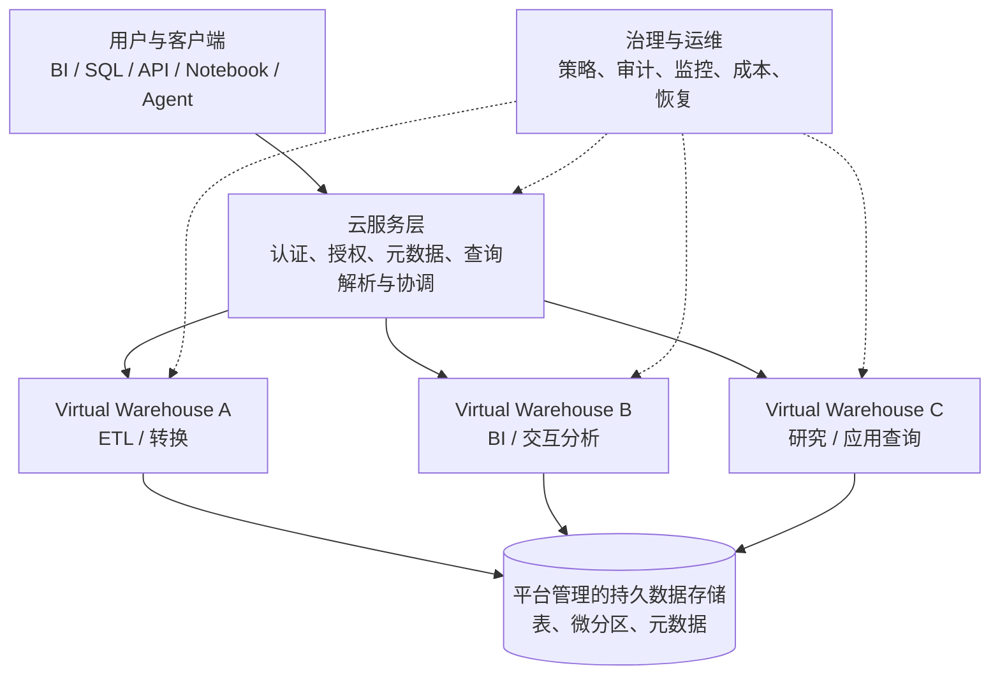
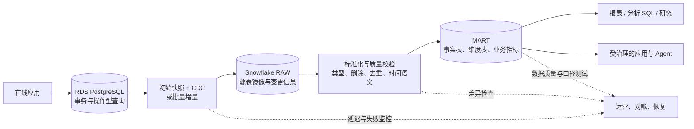
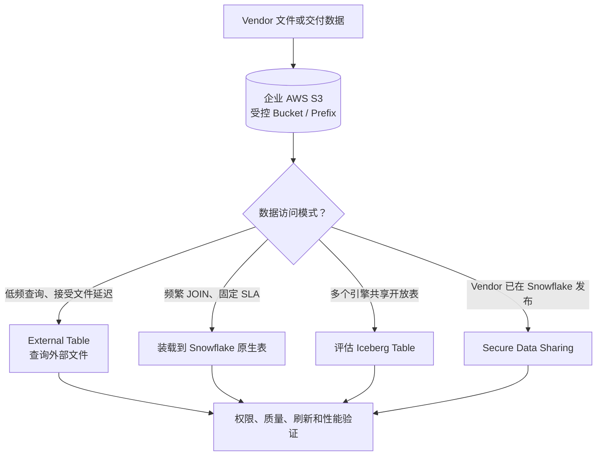
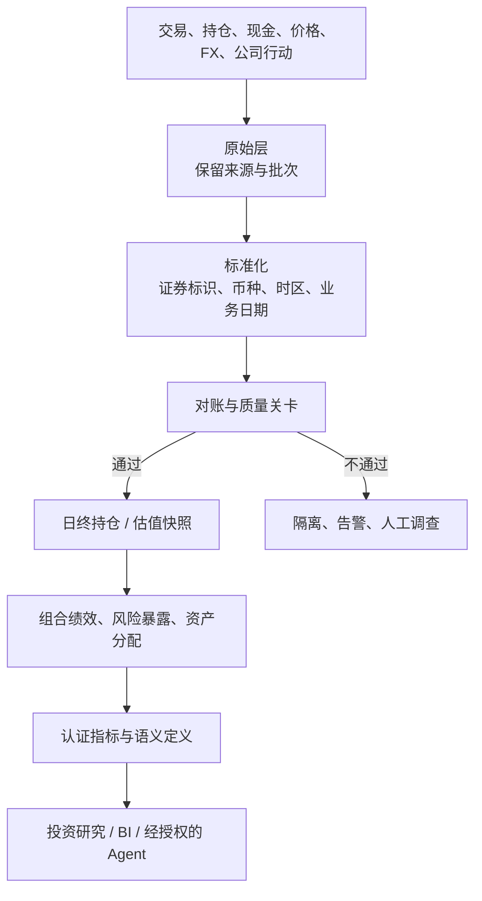

# Snowflake快速学习2026：解决方案架构师的实战指南

> **这不是 Snowflake 全功能目录，而是一份架构决策指南。** 目标读者是熟悉 SQL、关系数据库和云服务，但还没有系统使用 Snowflake 的 Solution Architect、Data Architect、工程负责人和金融服务技术人员。你不需要先记住所有命令；更重要的是知道 Snowflake 适合解决什么问题、它为什么这样设计，以及具体项目里哪些决定会影响安全、成本、性能和数据可信度。

**资料核对日期：2026 年 10 月 10 日。** Snowflake 的产品能力、区域支持、版本许可和预览状态会变化。本文涉及具体功能时，优先链接官方文档；正式选型前应再次核对目标云、区域、版本、账号配置和合同条款。

## 先读结论：架构师应该记住的十件事

1. **Snowflake 首先是分析数据平台，而不是把 PostgreSQL、Oracle 或 SQL Server 原样搬到云上的托管实例。** 它擅长跨系统整合、历史分析、大规模扫描与聚合、数据产品、BI、自助分析和受治理的数据共享。交易主路径、复杂事务、低延迟单行更新仍要按实际工作负载评估，不能因为 SQL 看起来相似就直接替换 OLTP。
2. **理解存储、计算和云服务分离，是理解 Snowflake 的关键。** 数据保存在平台管理的存储层，虚拟仓库（Virtual Warehouse）执行查询与转换，云服务层承担元数据、认证、权限和查询协调等平台职责。不同用户和工作负载可以使用不同计算资源，而不必为每种分析负载复制一份完整数据。
3. **虚拟仓库是计算资源，不是数据库。** 仓库大小影响单条查询的计算能力；多集群仓库主要帮助并发；自动挂起和自动恢复用于控制空闲成本。扩大仓库并不会自动修复糟糕的数据模型或低效 SQL。
4. **微分区裁剪往往比盲目加大仓库更重要。** 过滤条件是否能缩小扫描范围、是否反复扫描宽表、表的数据排列是否与查询模式匹配，会直接影响延迟和费用。聚类、Search Optimization 和 Query Acceleration 是针对特定问题的工具，不是默认要打开的开关。
5. **数据摄取和数据转换是两件事。** COPY INTO、Snowpipe、Snowpipe Streaming、Openflow/连接器解决不同的接入模式；Dynamic Tables、Streams/Tasks、Snowpark 和外部编排分别适用于不同的转换需求。选工具之前，先定义数据新鲜度、删除语义、可重放能力和失败恢复方式。
6. **外部表、Snowflake 原生表和 Iceberg 表不是一回事。** 如果 Vendor 文件已经放在企业 AWS S3，Snowflake 可以通过受控的云身份访问，但“可以查询 S3 文件”不等于文件自动具备数据库表的完整能力、性能或治理语义。选择取决于数据是否需要复制、更新频率、查询频率和是否要被其他引擎共同访问。
7. **数据质量与历史语义必须由工程设计明确。** CDC 事件不是已经重建好的当前表；当前余额不是历史时点余额；业务生效时间不等于数据到达时间。金融服务系统尤其要设计对账、时点查询、修订、更正和可重复计算。
8. **安全要在数据库内部执行，不能只依赖 BI 过滤或应用代码。** 通过 RBAC、受管理的 Schema、行访问策略、动态数据掩码、标签、Secure Views 和审计记录建立分层控制。AI Agent、Notebook 或 BI 用户也必须经过同一授权边界，不能凭自然语言提示绕过 Data Entitlement。
9. **Snowflake 的弹性不等于自动具备灾备能力。** Time Travel、Fail-safe、跨账号复制和 Failover Group 解决的问题不同。需要将 RPO、RTO、跨区域约束、复制延迟、密钥、网络、用户和权限对象纳入灾备演练。
10. **成本治理必须成为平台设计的一部分。** 给不同团队与任务划分仓库、自动挂起、配置预算和资源监控、跟踪扫描量与查询历史，并建立成本归属。数据存储便宜并不代表重复刷新、过度扫描、长期空转的计算也便宜。

如果时间有限，优先读第 1–4 章建立心智模型，第 5–8 章理解具体的工程组件，再读第 9–12 章进行金融服务架构设计与上线检查。

## 1. Snowflake 解决什么问题？先别从 SQL 语法学起

### 1.1 用一个熟悉的场景理解它

假设一家金融机构有这些系统：

- 核心业务数据库记录客户、账户和交易；
- 投资组合系统记录持仓、现金、交易和估值；
- CRM 记录客户关系与服务活动；
- 风险平台提供市场行情、评级或模型结果；
- 外部 Vendor 每天交付证券主数据、参考数据或研究数据；
- 报表、数据分析人员和 AI 应用需要跨系统回答问题。

如果所有分析都直接对生产数据库运行，复杂 JOIN 和大范围聚合可能影响交易系统；如果每个部门各自复制数据，又容易产生多个“客户数”“净资产”“当日收益”等版本。传统数据仓库早已解决了其中一些问题，Snowflake 的价值在于用托管平台、弹性计算和平台治理，让多个工作负载更容易共享同一套经过管理的数据资产。

因此，通常不是“把所有数据库替换成 Snowflake”，而是建立职责分工：

- 在线数据库继续处理交易写入和操作型查询；
- Snowflake 集中存放用于分析的数据、历史状态、业务模型和面向消费的数据集；
- 数据集通过受控接入、转换、对账和发布流程形成；
- BI、分析人员、下游应用和获授权的 Agent 通过不同的接口访问这些数据；
- 平台团队统一管理权限、计算资源、审计、成本和恢复。

### 1.2 先判断你遇到的是什么类型的问题

| 工作负载 | 常见需求 | 初步判断 |
| --- | --- | --- |
| 在线交易（OLTP） | 根据账户 ID 读取一行；同步更新交易状态；多行事务；低延迟写入 | 通常由 PostgreSQL、Oracle、SQL Server 或专用交易平台承担 |
| 分析与数仓（OLAP） | 按客户、证券、日期汇总数十亿条记录；复杂 JOIN；跨年趋势与组合分析 | Snowflake 的典型适用场景 |
| 数据湖与文件分析 | 数据留在 S3；需要直接查询 Parquet、CSV、JSON，或者让多个计算引擎共用数据 | 比较 External Tables、原生表和 Iceberg |
| 数据工程 | 持续摄取、清洗、去重、关联、增量计算与数据质量测试 | 组合使用摄取工具、SQL 转换、Dynamic Tables 或 Streams/Tasks |
| 数据产品与共享 | 给不同业务域、子公司或合作机构提供有限且可追踪的数据视图 | 评估 Secure Views、Secure Data Sharing 和相应的访问控制 |
| 低延迟键值或小规模事务应用 | 高频点查、短事务更新、强约束 | 不要默认用普通 Snowflake 表；可评估现有事务数据库，或在合适区域和限制内测试 Hybrid Tables |

Snowflake 现在也提供 Hybrid Tables 等面向事务型工作负载的能力，所以“Snowflake 完全不能处理事务”并不准确；但这也不意味着它与通用 OLTP 数据库等价。Hybrid Tables 在存储容量、吞吐、功能组合、事务范围、复制和部分数据工程能力方面有明确限制。若应用核心路径依赖毫秒级响应、强约束和复杂事务，必须用真实负载做 PoC，而不是只看功能名称。

参考：[Snowflake 核心概念与架构](https://docs.snowflake.com/en/user-guide/intro-key-concepts) · [Hybrid Tables 限制](https://docs.snowflake.com/en/user-guide/tables-hybrid-limitations)

## 2. Snowflake 与传统数据库的关键区别

“传统数据库”不是单一架构。下面主要对比两种常见对象：以 PostgreSQL/Oracle 为代表的事务数据库，以及需要自建和运维计算集群的传统数仓。具体产品之间仍然存在差异。

| 维度 | 事务数据库，例如 PostgreSQL / Oracle | Snowflake 的典型模式 |
| --- | --- | --- |
| 主要目标 | 可靠处理业务状态变化与操作型查询 | 大规模分析、跨系统数据整合和共享 |
| 计算与存储 | 资源通常与数据库实例或集群配置紧密关联 | 持久数据存储与虚拟仓库计算分离 |
| 查询特点 | 索引点查、短事务、频繁 INSERT/UPDATE/DELETE | 列式分析、过滤、聚合、窗口函数和大型 JOIN |
| 并发隔离 | 通过实例、连接池、读副本、资源限制等管理 | 可为 ETL、BI、数据科学和其他工作负载分配独立仓库 |
| 数据物理组织 | 索引、表空间、分区、统计信息和数据库维护 | 自动微分区、元数据裁剪，以及按需要进行的聚类与搜索优化 |
| 容量扩展 | 可能需要扩容实例、分片、改造存储或引入读写分离 | 计算可按仓库独立调整；平台管理底层存储 |
| 数据接入 | 应用事务写入或外部工具同步 | COPY、Snowpipe、Snowpipe Streaming、连接器、共享和文件访问等多种入口 |
| 历史数据 | 通常靠业务历史表、日志、备份和归档机制设计 | 可结合 Time Travel、克隆、历史表、快照和对象存储；业务历史仍需建模 |
| 物理调优 | 索引设计、执行计划、锁、连接数、Vacuum/统计信息等 | 先关注裁剪、查询模式、仓库资源、并发、缓存和刷新成本 |
| 运营方式 | 自建数据库时要管理主机、补丁、故障转移和容量 | 更多底层基础设施由服务托管，但账户、访问策略、管道、成本和数据语义仍需负责 |

### 2.1 存储与计算分离，实际改变了什么？

传统数据库扩容时，经常需要考虑整台实例或集群的 CPU、内存、磁盘、连接数与高可用；而 Snowflake 可以让分析仓库和数据持久存储相对独立。

例如，数据平台可能有：

- INGEST_WH：小型、间歇运行，负责装载；
- TRANSFORM_WH：专门执行数据清洗与模型刷新；
- BI_WH：面向仪表板和交互查询；
- DATA_SCIENCE_WH：给研究人员跑探索性 SQL；
- APP_QUERY_WH：给经过控制的应用查询使用。

它们可以访问同一套授权数据，但计算资源能够分别调整、暂停和监控。研究人员运行一条很重的查询，不一定非要和早晨的运营仪表盘抢同一份计算资源。

这不意味着每种工作负载都必须独立建仓库。仓库太多也会增加管理开销。设计时应基于隔离需求、并发特征、SLA、预算和故障影响范围来分组。

### 2.2 平台做了很多运维工作，但没有替你做业务设计

Snowflake 负责管理存储格式、微分区、底层基础设施和不少查询执行细节；但它不会自动知道：

- 客户在 CRM 与交易系统中如何匹配；
- 证券代码变更后怎样保留历史关联；
- 某笔交易应该按成交日、结算日还是入账日统计；
- 日终持仓如何对账，迟到的数据应该重算哪一天；
- “净资产”“已实现收益”“有效客户”应该如何定义；
- 哪些角色可以查看客户明细，哪些人只可以查看聚合结果。

这些才是架构项目中更容易出错的部分。托管平台降低的是基础设施管理负担，不是业务语义、数据质量与治理的责任。

## 3. 核心架构：三层模型与一次查询的旅程

Snowflake 官方将平台架构概括为数据存储层、计算层和云服务层。用这三层理解新功能，比记住产品名更有效。

### 3.1 数据存储层：不必自己维护普通表的底层文件

Snowflake 的标准表将数据存储在平台管理的列式格式和微分区中。用户通常不需要自己创建文件目录、分区文件、压缩块，也不用按传统数据库的方式管理底层磁盘布局。

**微分区（Micro-partition）** 可以简单理解为 Snowflake 自动组织的一组数据块，并附带可帮助排除无关数据的元数据。查询只需要少量日期、账户或证券时，平台有机会跳过大量不可能匹配的微分区。

例如，研究人员经常查询最近 90 天的交易，如果表按时间自然组织，过滤交易日期可能只读取一部分数据；但如果查询没有任何有效过滤，或者经常按一个低相关度的字段做筛选，Snowflake 仍可能需要扫描很多数据。

重点不是记住微分区的内部实现，而是理解：**数据量并不等于每次查询都必须读取的量；有效裁剪是性能和成本的共同基础。**

参考：[Micro-partitions 与 Data Clustering](https://docs.snowflake.com/en/user-guide/tables-clustering-micropartitions)

### 3.2 计算层：Virtual Warehouse 是查询执行资源

虚拟仓库负责运行 SQL、装载或转换等需要计算的工作。创建仓库时，会选择规模、自动挂起/恢复和并发相关设置。仓库运行会消耗 credits；暂停后不再为该仓库持续计算计费，但存储费用仍然存在，云服务层也可能有其他费用。

常见的两个调整方向：

- **Scale up（扩大仓库）：** 给当前仓库更多计算资源，适用于一条查询计算量较大、延迟不达标的情况。
- **Scale out（多集群/更多可承载并发的资源）：** 适用于很多用户同时查询、排队时间变长的情况。

两者解决的问题不同。假设月末风险报表只有一条特别慢的查询，优先调查 SQL、扫描量和仓库大小；假设所有用户在开市后涌入导致大量查询排队，那么多集群或工作负载拆分才可能更有帮助。

对于间歇性任务，开启自动挂起通常能省钱；对几乎连续有请求、缓存很重要的交互式 BI，过短的自动挂起又可能让仓库频繁启动、反复冷启动并丢失仓库缓存。需要测量真实请求间隔，不要把所有仓库套用同一个值。

参考：[Virtual Warehouse 的考虑事项](https://docs.snowflake.com/en/user-guide/warehouses-considerations) · [Warehouse 成本控制](https://docs.snowflake.com/en/user-guide/cost-controlling-controls)

### 3.3 云服务层：它不仅是一台 SQL 计算机

云服务层协调认证、授权、元数据、查询解析和优化等工作。架构师需要注意的是，它和计算仓库并不是同一件资源。暂停某个仓库不等于禁用了账号、对象权限、治理规则或所有其他平台服务。

### 3.4 一次查询大致会发生什么？

当用户提交查询时，平台会检查身份和对象权限，解析 SQL，利用表元数据与优化器规划执行，再由选定仓库执行扫描、过滤、JOIN 和聚合等操作，最后返回结果。实际体验不仅取决于仓库大小，也取决于扫描量、JOIN 方式、数据倾斜、并发排队、缓存是否命中、下游刷新和网络调用等。

所以性能调查最好顺序如下：

1. 查清楚慢的是 SQL 执行，还是前面的排队/编译/连接阶段；
2. 看读取了多少数据、多少微分区被裁剪、返回了多少行；
3. 看 JOIN 的基数和中间结果是否异常膨胀；
4. 确认仓库是否被其他查询挤占，是否发生排队；
5. 最后再试仓库扩容或专用加速服务，并比较增加的费用。

## 4. 最值得认识的 Snowflake 特性

本章按“解决什么问题”组织，而不是按控制台菜单罗列。

### 4.1 自动微分区与裁剪：大查询为什么不一定慢

普通分析往往会选取时间区间、资产类别、客户分群、地区、账户或证券等过滤条件。微分区元数据可以帮助查询跳过不相关的数据。

有三个常见设计习惯：

- 为常用访问路径保留清晰、可测试的过滤条件；
- 在模型中避免不必要地转换过滤列，以免影响裁剪机会；
- 使用 Query Profile 与查询历史验证裁剪和扫描效果，不要仅凭 SQL 外观判断。

**什么时候考虑聚类（Clustering）？** 当一张大表持续出现可预测的访问模式，但自动组织的微分区裁剪效果不理想，并且查询收益有可能抵消重组与维护成本时，再评估聚类。聚类不是等同于关系数据库的普通索引，也不是每张表都必须设置。

对于少量行的高选择性点查，例如反复用客户 ID 或业务事件 ID 查一小段记录，可以评估 **Search Optimization Service**。如果查询执行计划中有可被服务加速的部分，也可以评估 **Query Acceleration Service**。这两个服务涉及额外成本和版本要求，应对真实查询先做基线测试，不要为了“优化”而全部打开。

参考：[Search Optimization 的点查场景](https://docs.snowflake.com/en/user-guide/search-optimization/point-lookup-queries) · [Query Acceleration Service](https://docs.snowflake.com/en/user-guide/query-acceleration-service)

### 4.2 缓存：快是因为计算变快，还是结果直接复用？

Snowflake 有不同层面的缓存行为。实用上至少区分两类：

- **持久化查询结果缓存：** 在条件满足时，重复查询可以复用之前的结果。
- **仓库本地数据缓存：** 仓库保留近期读取的数据，可以减少后续查询再次读取远端存储的需要。

不要假设所有查询都能命中缓存。查询结果、底层数据、权限、函数和参数等变化都可能影响复用；暂停仓库会影响该仓库的数据缓存。因此，某条 SQL 第二次执行只用了很短时间，不一定说明新增计算资源能达到相同提升。

对月末批处理，应更关注持续扫描量、刷新频率和总运行时间；对长期开放的 BI，缓存热度与交互响应也值得纳入仓库策略。参考：[Optimizing the Warehouse Cache](https://docs.snowflake.com/en/user-guide/performance-query-warehouse-cache)

### 4.3 半结构化数据：JSON 不一定要先全部拆平

金融服务的数据经常来自 REST API、事件总线、监管文件和 Vendor 数据。JSON 字段可能随版本变化，部分字段很少被用到。

Snowflake 支持如 VARIANT 这样的半结构化数据类型，适合先保留原始结构，再按业务需要投影出稳定字段。它能减少早期接入时因结构变化而频繁改表的负担，但不代表最终模型应该永远只存一个巨大的 JSON 列。

比较稳妥的做法：

1. 原始层保留来源、获取时间、批次 ID、原始 payload 以及校验信息；
2. 标准化层抽取常用字段并明确类型、时区、币种与空值含义；
3. 面向分析的模型对主键、业务时间、历史版本和关联规则做显式建模；
4. 对未识别字段的新增与格式变化建立监控，避免静默丢失数据。

### 4.4 Time Travel、零拷贝克隆与 Fail-safe：不是同一个恢复按钮

- **Time Travel：** 在保留期内查询历史数据、创建历史克隆，或恢复被误删的对象。标准版通常默认保留 1 天；Enterprise 及以上版本的永久对象可根据配置使用更长保留期，具体仍应核对当前版本与账户策略。
- **Zero-copy cloning：** 创建表、Schema 或数据库的逻辑克隆，适合开发测试、模型验证和数据变更前的隔离测试。初始时不要求完整复制所有物理数据，但后续改动会带来实际存储和计算成本。
- **Fail-safe：** 在适用的永久数据对象超出 Time Travel 保留期后，由 Snowflake 用于灾难恢复的额外保护阶段。它不是用户可随时查询的长期历史库，也不是业务连续性方案的替代品。

例如，数据工程师误执行了覆盖式转换，可以利用历史状态或克隆进行调查与恢复；但如果合规要求保留七年日终账本，不能只说“我们有 Time Travel”，因为它并不是用来代替业务历史数据模型、归档政策或法定保留策略的。

参考：[Time Travel 使用方法与限制](https://docs.snowflake.com/en/user-guide/data-time-travel)

## 5. 数据怎么进入 Snowflake？先从新鲜度要求倒推

不要先问“应该用 Snowpipe 还是 Kafka”，先明确：数据多久必须可用、数据源是什么、是否需要保留源文件、重复投递如何处理、源端更新和删除如何传递、失败后能否重放。

### 5.1 几种常见的数据入口

| 方式 | 适合的情况 | 需要特别设计的地方 |
| --- | --- | --- |
| COPY INTO | 批量 CSV/Parquet/JSON 文件；每日、每小时或按批次装载 | 批次完整性、文件清单、重复加载、失败记录与重跑 |
| Snowpipe | 文件到达后希望自动以微批方式装载，数据在几分钟级可用 | 云事件通知、文件到达顺序、管道延迟与错误处理 |
| Snowpipe Streaming | 应用持续发送行级事件，不想先生成文件再加载 | SDK/API 接入、吞吐、幂等键、事件顺序与消费者语义 |
| 数据库 CDC / Openflow / 外部连接器 | 从 PostgreSQL 等源系统持续捕获变化，或接入 SaaS 数据 | 初始快照与增量如何衔接、DELETE、Schema 演进和源端负载 |
| External Table | 数据仍放在自有 S3 等对象存储，Snowflake 需要查询其文件 | 外部元数据刷新、文件组织、权限、查询性能与可重复性 |
| Iceberg Table | 希望开放表格式，或需要 Snowflake 与其他引擎共享表元数据及数据文件 | Catalog、写入权威、快照和文件维护、兼容性与并发访问规则 |
| Secure Data Sharing | 数据来自另一个 Snowflake 提供方，双方希望按受控方式共享 | 共享对象范围、消费者权限、敏感字段和跨区域/账户限制 |

这些方式不是同一层面的互斥选项。例如，CDC 连接器可以把 PostgreSQL 变化写入 Snowflake 表，Dynamic Tables 再构建分析模型；Vendor 则可能每天把 Parquet 放进 S3，再由 COPY INTO 装载；另一家 Snowflake 账户提供的数据可能根本不需要再复制一份。

官方入口：[数据加载概览](https://docs.snowflake.com/en/user-guide/data-load-overview) · [Snowpipe](https://docs.snowflake.com/en/user-guide/data-load-snowpipe-intro) · [Snowpipe Streaming](https://docs.snowflake.com/en/user-guide/snowpipe-streaming/overview)

### 5.2 场景 A：保留 PostgreSQL 作为在线业务库，Snowflake 承担分析

假设账户或订单系统运行在 Amazon RDS for PostgreSQL，运营报表却需要跨多年数据做客户、产品和渠道分析。一个常见目标架构如下：

架构师应该回答的不只是“CDC 能不能跑”，而是下面这些问题。

**初次快照与增量怎样衔接？** 如果全量快照读取到一半，源库仍在持续写入，系统必须有明确方式确定快照边界并持续应用后续变化，否则会漏掉或重复数据。

**UPDATE 和 DELETE 怎样处理？** 如果源端删除被转换成删除事件或软删除标记，模型需要明确当前状态表是否删除该行、历史表是否保留旧版本、报表是否应重算。

**事件顺序和重复如何处理？** 网络重试可能导致重复到达；多来源数据可能乱序。应有来源主键、变更时间/序列信息、批次记录和幂等的转换逻辑。

**数据对账怎么做？** 至少对核心业务建立按日期、账户、状态或其他可解释维度的行数、金额、主键完整性与汇总差异校验。CDC 延迟为零并不意味着数据就正确。

**历史口径怎样定义？** 如果客户当前等级更新了，上一季度的分群报告是想使用当前等级重算，还是使用当时有效的等级？这应体现在数据模型和报表定义中。

### 5.3 场景 B：Vendor 文件落到企业 S3，是否一定要复制进 Snowflake？

不一定。这是一个常见的设计错误：因为所有分析最终发生在 Snowflake，就把所有来源数据无差别地复制、转换和长期存储。更好的做法是按使用方式做选择。

**External Table：** 数据文件留在 S3，Snowflake 读取外部文件并通过元数据了解表的文件与列信息。适合不常访问、数据较大且希望避免不必要复制的参考数据。要验证查询性能、文件格式、分区路径、刷新机制及跨区域流量成本；它也不等同于普通 Snowflake 原生表的全部能力。

**Snowflake 原生表：** 通过 COPY 等方式把需要的数据加载进 Snowflake 管理的表。适合经常与内部数据 JOIN、反复被仪表板查询、需要更稳定性能或需要在平台内建立增量模型的数据。代价是需要管理加载与更新流程、数据生命周期以及存储成本。

**Iceberg Table：** 当数据需要遵循开放表格式、被多个引擎读取，或者企业希望在自有对象存储与统一 Catalog 策略下管理数据时，值得评估。Iceberg 会引入 Catalog、快照、元数据文件和数据文件维护等设计事项；不要因为数据就在 S3，就把任意 Parquet 文件自动称为 Iceberg 表。

**Secure Data Sharing：** 如果数据已经由另一个 Snowflake 提供方管理，且合同和治理政策允许，直接共享授权数据对象可能比定期复制更合适。

在金融服务领域，还需要核对 Vendor 合同：是否允许复制、持久化、缓存、衍生数据、跨区域访问和内部再分发？原始文件能保留多久？撤回或修订数据后，企业是否必须删除或重新计算？技术可行不等于合同许可。

参考：[External Tables](https://docs.snowflake.com/en/user-guide/tables-external-intro) · [Iceberg 表存储选项](https://docs.snowflake.com/en/user-guide/tables-iceberg-storage) · [通过 S3 配置 Iceberg 外部存储](https://docs.snowflake.com/en/user-guide/tables-iceberg-managing-external-volumes)

### 5.4 文件接入要当作一个可运营的产品，而不只是一个 Bucket

建议把 Vendor 文件链路分成几个明确的区域，例如 landing、validated、ready 和 archive。Landing 接收原文件；validated 经过签名或校验和、格式、行数与文件清单验证；ready 中的文件才允许下游读取；archive 按合同和保留规则保留原始交付物。

至少定义：

- 每个业务批次的 ID、预期文件数、行数或校验和；
- 文件重复投递、迟到、撤回、重新发布的处理方式；
- S3 IAM 权限、Bucket Policy、KMS Key 和访问审计；
- 读取身份只拥有需要的 Bucket/Prefix 权限；
- 数据文件路径、外部表元数据刷新和批次完成标记；
- 谁能看到原始文件，谁只能访问清洗后的数据产品；
- 文件生命周期策略是否会破坏回放、调查或审计需要。

这套设计即使第一版只接一份日更 CSV，也值得做。否则，等同一 Vendor 的数据进入数十个模型后，再补充批次追踪和重放能力会更困难。

## 6. 数据转换：Dynamic Tables、Streams/Tasks 与 Snowpark 怎么选？

数据到达 Snowflake 后，还要决定如何把源数据转成可消费的业务数据。不要把所有转换需求都塞进同一种工具。

### 6.1 Dynamic Tables：描述想要的结果，让平台管理刷新

Dynamic Tables 允许用一个查询表达目标数据集，再通过 TARGET_LAG 等设置表达目标新鲜度。Snowflake 协调刷新依赖，并在受支持的情况下进行增量刷新。

适合：RAW 到标准化层、事实表或维度表的 SQL 转换，且团队希望减少手工编写的增量调度和 MERGE 流程。

**关键限制：TARGET_LAG 是目标数据陈旧度，不是保证的刷新周期或硬实时 SLA。** 例如，设置 10 分钟并不表示平台每 10 分钟准时刷新，也不保证任何负载下数据绝不超过 10 分钟。如果刷新耗时、仓库容量或管道深度有瓶颈，实际延迟可能超出目标，必须监控实际 lag。

生产环境应明确选择刷新模式并监控实际状态。对于增量刷新，不是所有 SQL 形态和转换都同样合适；先验证实际查询是否支持增量、刷新成本多少，再决定是否使用。

参考：[Dynamic Tables 概览](https://docs.snowflake.com/en/user-guide/dynamic-tables/about) · [TARGET_LAG 的真实含义](https://docs.snowflake.com/en/user-guide/dynamic-tables/target-lag) · [Dynamic Tables 生产最佳实践](https://docs.snowflake.com/en/user-guide/dynamic-tables/best-practices)

### 6.2 Streams + Tasks：需要明确控制变化消费和执行顺序时使用

- **Stream** 记录表或视图的变化偏移，用于消费新增、更新和删除等变更信息。
- **Task** 负责定时或按依赖关系执行 SQL、存储过程等任务。
- 多个 Task 可以组成有依赖顺序的任务图，让数据处理有明确的运行链路。

它适合需要明确控制的 CDC 消费、特殊增量逻辑、过程式步骤、异常分支和自定义恢复流程。它并不自动保证业务级幂等，也不替代任务监控。

需要特别关注 Stream 的保鲜问题：如果源对象持续变化，但消费流程长时间未推进，Stream 可能变得 stale；源表被删除并重新创建，也可能使原来关联的 Stream 失效。应监控消费滞后、任务失败、未消费数据与恢复边界。

参考：[Streams 概览](https://docs.snowflake.com/en/user-guide/streams-intro) · [Tasks 概览](https://docs.snowflake.com/en/user-guide/tasks-intro)

### 6.3 Snowpark：何时才需要把 Python 或其他代码带进数据平台

大多数数据转换先用 SQL 就足够。如果工作需要更复杂的 Python、Java 或 Scala 逻辑，或者要在 Snowflake 的执行环境中处理数据，可以评估 Snowpark。

但不要为了“统一技术栈”就把本来清晰的 SQL 改写成程序代码。复杂逻辑会影响测试、可读性、部署和性能分析。可优先遵循：

- 数据关系、过滤、JOIN、聚合和指标计算用 SQL 或声明式模型；
- 复杂算法、特定库依赖或适合程序化表达的逻辑再使用 Snowpark；
- 大规模转换的输入输出、依赖版本、资源与失败重试必须可观察；
- 尽量把业务规则作为版本化工件测试，而不是只留在 Notebook 里。

参考：[Snowpark 开发指南](https://docs.snowflake.com/en/developer-guide/snowpark/index)

### 6.4 推荐用 Raw / Standardized / Curated 的分层思路

层名可以是 RAW / STAGING / MART，也可以是 Bronze / Silver / Gold；名字并不重要，职责要清晰。

| 层次 | 责任 | 不要在这一层做的事 |
| --- | --- | --- |
| RAW / Landing | 尽可能忠实保留来源数据、载入时间、批次、源主键与可追溯信息 | 不要让报表直接依赖没有质量保证的原始字段 |
| Standardized / STAGING | 标准化字段类型、时区、币种、状态、主键，处理去重和删除语义 | 不要在这里悄悄决定跨业务域的最终指标口径 |
| CURATED / MART | 明确事实表、维度表、历史模型与认证指标，建立数据质量测试 | 不要把来源差异与业务口径埋进不可追踪的临时 SQL |
| Semantic / Consumption | 面向业务提供受治理的定义、视图、API 或共享对象 | 不要让每个消费者重复实现核心指标和授权规则 |

层次不必机械地增加到五六层。每增加一层，都应回答它解决什么问题，例如数据可重放、质量隔离、性能复用或权限边界。如果只是为了符合某个架构图而复制数据，就是额外的存储与运营成本。

## 7. 面向业务的语义层：为什么一张正确的表仍然可能产生错误的报表？

一个数据平台可能有完全正确的数据，但两个团队仍然会得出不同答案。例如：

- “客户数”是注册客户、活跃客户，还是有资产的客户？
- “本月收益”按交易日、结算日、估值日，还是会计入账日？
- “管理资产规模”是否包括现金、应计利息、待结算交易或外部托管资产？
- “违约客户”使用哪个模型版本与观察窗口？
- 绩效是否扣除费用、采用哪种基准、按何种币种折算？

这不是简单的 SQL 技巧问题，而是业务定义与数据模型的治理问题。

### 7.1 先建立可认证的数据产品

一套可消费的数据产品应该至少说明：

- 业务名称与定义；
- 数据所有者和技术维护人；
- 来源系统和字段血缘；
- 粒度、主键、时间语义和更新频率；
- 指标公式、过滤规则、币种和单位；
- 数据质量检查、已知限制与异常处理；
- 可访问的角色、敏感级别及允许用途；
- 版本变化与下游消费者影响。

BI 仪表板、下游 SQL 和 Agent 应优先使用认证的数据产品，而不是各自从 RAW 表开始写 JOIN。

### 7.2 Snowflake Semantic Views 值得关注，但不是自动正确的业务专家

Snowflake Semantic Views 可以把业务实体、关系、维度与指标定义为数据库内的语义对象，帮助 BI 和 Cortex Agents 等使用一致的业务概念。它是把“数据长什么样”和“业务应该怎样理解数据”衔接起来的一种方式。

实际落地建议：

1. 从最常争议的 5–10 个指标开始，不要试图一口气描述整个企业；
2. 为每个指标维护明确的公式、时间语义、过滤器和示例查询；
3. 对金额、收益率、日期边界和聚合粒度构建验证用例；
4. 由业务负责人签署定义，由数据团队维护模型；
5. 将语义定义纳入版本控制和变更审查；
6. 对 AI 生成的 SQL 仍然执行权限检查、结果验证和查询审计。

Semantic View 能减少重复定义，但不能代替数据质量、业务审批、权限治理或测试。AI 即使基于正确的语义模型，也可能生成错误的查询组合，因此必须验证生成 SQL 与结果。

参考：[Snowflake Semantic Views 概览](https://docs.snowflake.com/en/user-guide/views-semantic/overview) · [Semantic Views 创建方式](https://docs.snowflake.com/en/user-guide/views-semantic/creating)

## 8. 金融服务的典型落地模式

以下是基于金融服务常见需求整理的参考模式，用于帮助设计方案；它们不是对某家特定机构内部实现细节的声称。正式设计仍需要结合本地监管、业务流程、风险偏好和数据分类标准。

### 8.1 投资组合与日终持仓分析

**业务问题：** 投资经理希望按客户、组合、资产类别和日期查看持仓、现金、估值、收益与风险；同时需要回看任意过去时点，并能解释某天的数据为什么和后续修订后的结果不同。

**推荐设计：**

- 将成交、结算、持仓、现金、价格、汇率、公司行动和基准数据分别建模，明确每张表的粒度和主键；
- 保留来源时间、事件时间、载入时间、估值日期、业务有效期和模型版本；
- 对每日持仓或估值快照定义截止时点、晚到数据和重算规则；
- 区分“当时发布的报表”和“使用修订数据重新计算的报表”；
- 每个日终批次做账户数量、持仓数量、现金、总市值或关键财务控制总额对账；
- 使用专门的转换仓库完成批处理，用独立的研究/BI 仓库承载交互式查询；
- 报表只暴露认证的组合、收益和风险模型，不让用户自行拼接未经验证的原始表。

一个示意数据流：

**为什么 Snowflake 适合：** 大范围时间序列分析、组合聚合、跨来源数据整合和多个分析团队共享模型，属于数仓的典型工作。但如果交易执行或核心账务必须在一个强一致的事务中完成，仍应由相应交易系统承担。

### 8.2 监管报表、风险与审计调查

风险和监管场景的关键往往不是单纯的查询速度，而是结果的可解释性与可重现性。

设计时至少确定：

- 报表使用的原始数据快照、业务截止日期和时间区；
- 迟到数据、纠正数据和重述报表的处理规则；
- 转换代码、参数、参考数据和模型版本；
- 哪个角色批准了规则变更，哪些数据被访问；
- 对账失败时阻止发布还是允许带标记发布；
- 如何恢复某次错误加载，如何重跑同一批次；
- 如何证明某次报表使用的是当时可获得的数据，而不是后来更正后的最新数据。

Time Travel 对查错、临时恢复和短期回看有用，但不能单独证明报表的业务正确性。对关键报表，需要保存输入批次、模型版本、对账结果、运行状态与发布审批等证据。访问日志也只是证据链的一部分，还必须能关联到身份、作业、版本和业务审批记录。

### 8.3 客户与账户数据的最小授权

不同业务角色可能看同一业务域，但不应看到完全相同的内容。客服可能查看所服务客户的明细；研究人员只需要去标识化数据；管理层只需要聚合；模型开发人员未必需要直接访问客户姓名和标识符。

可组合的控制包括：

- **RBAC：** 通过角色授予数据库、Schema、表、视图和仓库权限；
- **Row Access Policy：** 根据角色、地区、业务单元或 entitlement 规则限制可见行；
- **Masking Policy：** 根据角色和条件对账户号、邮箱或其他敏感字段脱敏；
- **标签与标签策略：** 把敏感分类和保护策略尽可能标准化，减少新建列或表时遗漏保护的风险；
- **Secure Views：** 向消费者暴露经过过滤、投影和业务规则处理的数据；
- **访问历史：** 通过访问历史与查询历史调查谁在何时访问了哪些对象（需要了解相应视图的记录范围和延迟）。

以一个简单的角色设计为例：

| 角色 | 允许的数据范围 | 应避免的权限 |
| --- | --- | --- |
| Data Engineer | 负责管道的 RAW 与标准化数据，按工作需要写入模型 | 不应默认拥有修改所有业务权限策略的能力 |
| Portfolio Analyst | 获授权组合的持仓、绩效与风险模型 | 不应自动看到其他团队或客户的全部明细 |
| Customer Service | 负责客户的操作所需字段 | 不应访问完整投资研究、风险模型或批量导出接口 |
| Executive BI | 聚合指标、趋势和管理报表 | 不应因为职位较高就默认拥有全量原始数据访问 |
| AI Agent Runtime Role | 指定任务所需的数据产品与有限查询能力 | 不应使用 ACCOUNTADMIN 或可跨越 Data Entitlement 的通用高权限角色 |
| Security / Audit | 按职责查看授权、策略、查询和对象访问证据 | 只读调查角色不应被无必要地授予业务数据修改权 |

**最重要的原则：权限应在数据平台和应用服务端强制执行，而不只是写进 Prompt。** 如果 Agent 只被要求“不要查看别的客户”，但所用账号实际拥有全库读取权限，那么 Prompt 不是安全边界。应让 Agent 以最小权限身份执行查询，并在数据库层落实行列策略和审计。

参考：[访问控制概览](https://docs.snowflake.com/en/user-guide/security-access-control-overview) · [Row Access Policies](https://docs.snowflake.com/en/user-guide/security-row-intro) · [Tag-based Masking Policies](https://docs.snowflake.com/en/user-guide/tag-based-masking-policies) · [Access History](https://docs.snowflake.com/en/user-guide/access-history)

### 8.4 多子公司、内部团队或合作伙伴之间共享数据

如果多个团队分别建立自己的数据副本，常见问题包括重复存储、更新延迟、权限漂移和不同版本的指标。Snowflake Secure Data Sharing 允许数据提供方将受授权的数据库对象分享给消费者，而不是先把所有数据复制到每个消费方的账户里。

但共享不意味着无条件开放底表。常见模式是通过 Secure Views 控制字段、行和业务逻辑，再共享经过批准的对象。对于敏感数据，需检查提供方与消费方的账户类型、区域、合同、法律依据、数据分类、撤销流程与访问日志。

**架构建议：** 把每个共享数据集定义成一个数据产品，有明确 owner、消费者、用途、字段清单、刷新语义、SLA、撤销方式和支持流程。对外共享与内部跨团队共享也应使用不同的风险评估门槛。

参考：[配置和管理 Data Shares](https://docs.snowflake.com/en/user-guide/data-sharing-provider)

### 8.5 Vendor 或市场数据：按授权范围和消费频率选路径

如果外部供应商交付证券静态数据、市场数据、基准成分或评级信息，可根据合同和实际查询模式选择：

- 直接使用受控的共享数据集；
- 将原文件保留在企业私有 S3，用 External Table 做低频查询；
- 把经常 JOIN 的必要字段加载到 Snowflake 原生表；
- 当确有多个引擎共用开放表格式需求时评估 Iceberg；
- 对被修订、撤回或回补的数据保留批次和版本信息，定义哪些历史报告需要重算。

切记“供应商发布的最新值”与“上次报告计算时使用的值”可能不一样。对于依赖历史价格、成分或评级的分析，需要明确是使用当日可知值，还是最新回补后的值；否则回测、历史绩效和合规解释可能出现前视偏差。

## 9. 金融服务架构要重点审视的安全与治理

本章不是合规认证清单，而是设计审查时必须明确回答的问题。

### 9.1 身份、角色和职责分离

建议围绕工作职责定义角色，而不是按个人逐个授予对象权限。例如数据工程角色负责管道、数据所有者负责业务模型、消费角色负责读取经过认证的数据产品、平台角色负责仓库与资源、治理角色负责策略、审计角色负责调查。

生产架构中，常见的风险是把方便操作当成权限设计：所有 ETL 用一个高权限账号、所有 Agent 共用一个数据库角色、每个开发者都能改敏感表和授权策略。这样一旦凭证泄露或代码出现错误，很难限制影响范围。

需要在设计中明确：

- 人类用户、服务用户和运行时身份是否区分；
- 用户、角色、仓库和 Schema 的授权关系；
- 谁可授予权限、谁可变更掩码与行访问策略；
- 新建表/视图是否会通过 Future Grants 获得合适的默认权限；
- 服务凭证的轮换、撤销和泄露应急方式；
- 开发、测试和生产账户/数据是否隔离。

Managed Access Schema 可以将对象授权集中到 Schema 所有者或有相应授权管理权限的角色，减少对象创建者自行授予访问权限的情况。Future Grants 则帮助新对象按预先定义的规则获得权限；两者都需要结合角色结构认真设计，而不是简单使用一个全局管理员角色。

### 9.2 网络、私有连接与加密

对金融机构来说，要确认：

- 客户端、数据管道、BI、Agent、云存储与 Snowflake 之间的网络路径；
- 是否要求 PrivateLink/私有访问、固定出口或网络策略；
- TLS、静态加密和企业密钥控制是否满足安全基线；
- 从 Snowflake 访问 AWS S3 时采用什么 IAM 角色和 Storage Integration；
- KMS Key Policy、轮换和撤销会不会影响正常读取或灾备；
- 日志与查询结果是否可能包含敏感内容；
- 供应商和下游消费者的数据共享是否符合合同与数据驻留要求。

不要将“数据是加密的”直接等同于访问已经得到控制。密钥管理、身份、授权、日志和网络边界需要一起审视。

### 9.3 数据分类、动态掩码与行过滤

掩码策略能依据授权上下文控制字段显示，行访问策略能控制可见记录；标签可帮助把敏感分类与保护措施关联起来，避免每次新增对象都从零判断。

一个可执行的落地顺序是：

1. 识别客户标识符、账户号、个人信息、交易明细与高敏感业务字段；
2. 定义哪些角色可以原样查看，哪些角色需要脱敏，哪些角色根本不应查询；
3. 将策略优先放到可信的数据消费边界上，而不是依赖每张报表手动过滤；
4. 对新 Schema、新列、新表和新共享对象设计默认保护；
5. 用不同角色和模拟上下文进行测试，验证真实查询结果；
6. 监控策略变更、授权变更和敏感对象访问，并定期做负向测试。

注意：Snowflake 文档中一些标签驱动的扩展策略可能仍处于预览状态或受版本限制。生产方案只应依赖目标环境中已正式支持、经安全与合规团队认可的能力。

## 10. 灾备、历史恢复和数据可重现

架构评审时，建议明确把下面几个目标分开。

| 能力 | 主要解决的问题 | 不应把它当成什么 |
| --- | --- | --- |
| Time Travel | 在保留期内查看旧数据、恢复误操作、克隆历史状态 | 不等于多年业务历史或异地灾备 |
| Fail-safe | 适用对象在 Time Travel 之后的额外恢复保护 | 不等于用户可查询的归档库或自助恢复功能 |
| 逻辑克隆 | 开发、测试、变更验证与隔离实验 | 不等于完全独立且永不增加存储的副本 |
| 跨账号复制 | 在不同账户间复制支持的对象与数据 | 不等于已验证的应用级灾备切换 |
| Failover Group | 在可用的版本与配置中支持指定对象集合的灾备切换 | 不等于无延迟、无损失的同步副本 |
| 外部 S3 备份/归档 | 保留原始文件、长期留存或重建来源数据 | 不等于 Snowflake 的所有表、权限与业务模型都自动备份了 |

### 10.1 把 RPO / RTO 转成设计与演练

- **RPO（Recovery Point Objective）：** 可以接受丢失多少时间的数据变化？
- **RTO（Recovery Time Objective）：** 从故障发生到恢复可用，允许耗时多久？

例如，“分析报表四小时内恢复”与“核心交易数据一分钟内无数据丢失”是完全不同的目标。先按业务服务定义恢复目标，再决定复制频率、目标账户、区域、对象范围、权限和网络配置。

灾备演练不应只确认“复制状态是成功”。还要验证目标账户能否被提升、角色与授权是否有效、网络和外部集成是否可用、加密密钥是否可访问、下游作业能否启动、应用连接是否切换，以及恢复点是否满足业务要求。

参考：[Snowflake 跨账户复制与故障转移](https://docs.snowflake.com/en/user-guide/account-replication-intro)

### 10.2 让关键数据集可重建

对金融数据产品，恢复不应只依赖“最后一份表快照”。建议保留足够的元信息，以便回答：

- 本次产出读了哪些源批次、源表版本或变更区间？
- 执行的是哪个 SQL、模型包或转换代码版本？
- 使用什么日期范围、时区、币种和过滤参数？
- 数据质量与业务对账结果是什么？
- 何时发布、由谁批准、哪些消费者使用了它？
- 更正数据后，如何识别并重跑受影响的下游产品？

这类信息可以分布在任务编排日志、数据目录、模型仓库、作业元数据和审计系统里，但必须能通过稳定的 Run ID、Batch ID、Query ID 或数据产品版本关联起来。

## 11. 性能与成本：用证据优化，不靠猜

Snowflake 降低了很多底层运维工作，但如果没有成本运营机制，灵活的计算也容易造成费用失控。

### 11.1 先理解计算费用来自哪里

主要要观察：

- 仓库规模、运行时长和启动频率；
- 空闲时间以及自动挂起设置；
- 同一模型的刷新频率和实际必要新鲜度；
- 重复扫描、无效 JOIN 和宽表读取；
- 并发导致的扩容或多集群消耗；
- 对特定查询开启的聚类、搜索优化或加速服务；
- Serverless 工作负载、云服务及不同部署选项涉及的费用；
- 失败重试、全量重建和无人维护的开发仓库。

不要只以 credits 总额判断某个团队“贵不贵”。还需要按数据产品、作业、仓库、环境和业务价值进行归因。

### 11.2 一套实用的优化次序

**第一步：建立基线。** 统计常见查询的执行时间、排队时间、扫描字节、返回行数、仓库与缓存指标，标出高频 SQL 与高费用任务。

**第二步：优化查询与数据模型。** 减少不必要的列扫描、提前过滤、检查 JOIN 关系和数据粒度，避免因多对多关系导致中间结果成倍增长。

**第三步：降低重复工作。** 对昂贵转换评估增量刷新、合理的模型复用和目标新鲜度。不要为“看起来实时”而每分钟全量重建大表。

**第四步：调整仓库。** 通过真实压测选大小与并发策略。把 ETL、BI 和探索性查询分离到有明确业务理由的资源组。

**第五步：只在证明有收益时启用专门服务。** 聚类、Search Optimization、Query Acceleration 等都需要基于查询特征判断，并通过成本与性能对比验证。

**第六步：建立持续控制。** 开启合适的 Auto-suspend/Auto-resume，设置资源监控、预算与异常告警，定期找出没有自动挂起或长期不使用的仓库。

Snowflake 的仓库自动挂起按秒级使用计费，但仓库每次恢复时通常存在最低计费时长，因此不应机械地把自动挂起设置为 1 秒。短间隔高频请求可能导致频繁启停和缓存损失；批处理任务则一般更适合在完成后快速挂起。应依据真实负载测量最合适的设置。

参考：[Warehouse 成本控制](https://docs.snowflake.com/en/user-guide/cost-controlling-controls) · [成本优化指南](https://www.snowflake.com/en/developers/guides/cost-optimization/) · [仓库缓存优化](https://docs.snowflake.com/en/user-guide/performance-query-warehouse-cache)

### 11.3 建议持续跟踪的指标

| 指标 | 为什么重要 | 异常后先查什么 |
| --- | --- | --- |
| 查询 P50 / P95 延迟 | 看普通与尾部体验 | 查询计划、排队、扫描量和仓库竞争 |
| 排队时间与并发 | 判断是否是资源争抢而非 SQL 本身慢 | 工作负载隔离、仓库规模、多集群和高峰时段 |
| Bytes scanned / 分区裁剪 | 发现不必要扫描 | 过滤条件、数据模型、聚类与查询模式 |
| 仓库使用与空闲时间 | 看资源是否浪费 | 自动挂起、任务时刻表和资源隔离 |
| 数据新鲜度与目标 lag | 衡量数据是否及时可用 | 摄取延迟、刷新任务、上游失败和仓库容量 |
| 数据质量与对账差异 | 衡量结果是否可信 | CDC 丢失/重复、源端变更、转换错误与业务口径 |
| 作业失败与重试次数 | 识别脆弱管道与隐性费用 | 失败类型、重试策略、幂等与外部依赖 |
| 每个认证数据产品的成本 | 把费用连接到业务价值 | 低效模型、无消费者的数据、重复计算及刷新策略 |

## 12. 设计中常见的错误

### 错误一：把 Snowflake 当成“云端的大 PostgreSQL”

这会导致按 OLTP 思路移植索引、事务和应用查询，并忽略其最适合的分析访问模式。正确做法是根据工作负载决定哪些系统仍负责交易，哪些数据进入 Snowflake。

### 错误二：先复制所有数据，过后再考虑用途

每复制一份数据，就要付出存储、权限、质量检查、保留、更新和删改同步的成本。优先回答消费者、用途、新鲜度、合同约束和历史需求，再决定直连共享、外部表还是落地原生表。

### 错误三：把 CDC 事件直接当作干净的当前状态表

增删改事件包含的是变化，不天然具备最终业务表的去重、顺序、删除和历史语义。必须定义主键、顺序字段、幂等规则、快照边界和对账。

### 错误四：把实时刷新设得越短越好

更短的目标 lag 可能带来更频繁的刷新和更高成本，而业务价值并没有提高。应按 SLA 定义不同层的时效目标，并监控实际延迟。

### 错误五：用更大的仓库修复所有性能问题

如果查询在做不必要的大范围扫描或多对多 JOIN，扩大仓库可能只是更快地花更多钱。先看 Query Profile、扫描量和数据粒度，再做资源调优。

### 错误六：把 RBAC、行列策略和应用过滤混为一谈

BI 仪表板隐藏字段，不代表底层数据就不可访问；Prompt 要求 Agent 不要越权，也不是授权控制。应在 Snowflake 对象与应用身份上实施最小权限，并通过负向测试验证。

### 错误七：把 Time Travel 当作审计档案

Time Travel 有明确的保留期限，Fail-safe 也不是面向用户的长期历史分析工具。长期监管、日终估值、交易重放和可重现报表需要独立的业务历史与保留策略。

### 错误八：没有成本归属

如果所有团队共用一个仓库，又不为任务打标签、不记录工作流运行 ID，就很难知道费用对应什么业务。适度隔离计算资源并建立使用报表，通常比年末才分析账单更有效。

### 错误九：认为数据平台会自动统一业务口径

表结构和字段相同，不代表业务定义相同。必须给关键指标明确所有者、公式、粒度、时间语义、版本与验收用例。

### 错误十：把灾备配置成功视为灾备测试通过

恢复能力必须用真实演练验证，包括对象、权限、密钥、网络、作业和应用入口，而不是只看复制状态。

## 13. 推荐的 30 天学习和落地路线

如果你需要尽快具备设计评审和 PoC 能力，不建议从所有 SQL 函数开始学。可以围绕一个真实业务域分四周推进。

### 第 1 周：建立心智模型，完成一个小数据集

- 熟悉账户、Database、Schema、Warehouse、Role 和 Stage 等核心对象；
- 用一个 CSV 或 Parquet 文件完成加载、查询和基本数据校验；
- 对同一查询比较不同过滤条件、仓库规模和自动挂起行为；
- 阅读 Query Profile，弄明白扫描、过滤、JOIN 与排队信息；
- 写清楚该数据集的来源、粒度、主键和业务用途。

**验收结果：** 能解释一次查询使用什么计算资源、为什么会消耗费用，以及如何确认结果数据可信。

### 第 2 周：做一条可重放的数据管道

- 选一个可控的 PostgreSQL 表或可获得的测试数据；
- 确定是批量增量还是 CDC，不为了“实时”默认选复杂方案；
- 建立 RAW、标准化层和一个简单的分析模型；
- 测试重复投递、更新、删除、失败重跑和源端 Schema 变化；
- 为关键字段和总量建立质量验证。

**验收结果：** 不仅能成功加载，也能解释重复、删除、迟到和失败是如何处理的。

### 第 3 周：加入业务语义和安全边界

- 定义 3–5 个业务指标及其粒度、日期和单位；
- 创建面向消费者的认证视图或数据产品；
- 设置不同角色的对象权限与至少一项行/列保护策略；
- 用实际测试身份验证允许和拒绝访问的结果；
- 为数据产品补全 Owner、来源、质量、更新频率与限制。

**验收结果：** 不同用户通过授权的接口获得正确范围的数据，不依赖报表或 Prompt 隐藏敏感字段。

### 第 4 周：做成本、故障恢复与架构评审

- 统计主要查询和模型刷新的延迟、扫描量及成本；
- 根据工作负载决定仓库是否需要分离；
- 配置适当的自动挂起和预算告警；
- 演练错误覆盖、上游缺数、刷新失败和权限误配；
- 为业务定义 RPO/RTO，并检查目标区域、账户、网络和外部集成；
- 写一页 ADR（Architecture Decision Record），记录选型、替代方案、假设和未解决风险。

**验收结果：** 你可以向评审者说明为什么选择当前架构、成本在哪里、发生故障如何恢复，以及哪些条件变化会要求重新设计。

## 14. 架构评审清单：上线前必须拿到答案

### 业务与数据

- [ ] 这套平台承载的是 OLTP、OLAP，还是两者的组合？边界明确吗？
- [ ] 每个数据产品有明确的业务用途、所有者和消费者吗？
- [ ] 主键、粒度、币种、时区、业务日期和状态定义清楚吗？
- [ ] 是保留当前状态、变更历史、业务有效历史，还是日终快照？有没有混淆？
- [ ] 关键数据是否有行数、金额、主键、覆盖率和业务规则对账？
- [ ] 发生迟到、重复、删除、修订或更正时，如何处理和重算？

### 接入与工程

- [ ] 全量快照与增量变化怎样衔接？
- [ ] 接入失败后能从明确的批次或偏移重放吗？
- [ ] CDC 顺序、重复事件、删除语义与 Schema 演进都被测试了吗？
- [ ] Dynamic Tables 的实际刷新模式与 lag 有监控吗？
- [ ] Streams 不会因长期未消费而变 stale 吗？
- [ ] 外部 S3 文件有清单、校验、生命周期和撤回/重发流程吗？
- [ ] 开发、测试与生产模型是否版本化并可追溯？

### 安全与监管

- [ ] 人类、服务身份、Agent、BI 和数据工程有清晰的角色边界吗？
- [ ] 敏感字段的掩码、行过滤和共享视图有负向测试吗？
- [ ] 新建表、视图与 Schema 是否有默认授权策略？
- [ ] Vendor 合同是否允许复制、缓存、衍生、共享和所需保留期限？
- [ ] 查询、数据访问、角色变更和策略修改的审计能串起事件吗？
- [ ] 私有连接、S3 IAM、KMS 与跨区域数据路径符合安全要求吗？

### 性能、成本与恢复

- [ ] 主要查询有延迟、排队、扫描量和成本基线吗？
- [ ] 仓库按需隔离，自动挂起和预算告警是否生效？
- [ ] 聚类、Search Optimization 或 Query Acceleration 是否通过真实测试证明有收益？
- [ ] 业务已经定义 RPO/RTO，而不是只说“需要高可用”吗？
- [ ] 已演练数据恢复、账户切换、权限、密钥、网络与下游应用恢复吗？
- [ ] 日终、监管或关键报表是否可以用明确版本的输入和转换逻辑重现？

## 15. 最后怎样快速判断一个 Snowflake 方案是否合理？

在方案评审中，可以用下面五个问题快速发现大多数设计缺口：

**一，为什么必须进入 Snowflake？** 是为了分析规模、跨系统整合、受治理共享、降低源数据库分析负载，还是有其他明确原因？如果只是把单行业务查询从一个数据库搬到另一个数据库，首先应验证是否真的值得。

**二，为什么用这个接入和转换方式？** 数据新鲜度、更新删除语义、历史要求、合同约束和失败恢复是否支持当前选择？有没有更简单的批量或共享方式？

**三，结果如何证明可信？** 不只是 SQL 执行成功，而是能说明来源、粒度、口径、版本、时间语义和对账结果。

**四，谁可以访问，以及如何证明没有越权？** 需要从身份、角色、对象策略和测试结果回答，而不是仅靠设计文档、报表过滤或 Prompt 声明。

**五，成本和故障如何控制？** 能说明主要计算费用来自哪里、最重要的 SLA 是什么、哪些任务可以降级，以及出故障后如何恢复到业务可接受状态吗？

对于金融服务 Solution Architect，Snowflake 的真正学习目标不是背诵一百个功能，而是能把这五个问题落到架构、数据模型、权限、运行指标和恢复演练上。

## 官方文档与进一步阅读

以下链接优先选择 Snowflake 官方资料。功能可用性、许可与预览状态应以目标账号对应版本和区域的最新文档为准。

### 架构与性能

1. [Snowflake 核心概念与架构](https://docs.snowflake.com/en/user-guide/intro-key-concepts) — 存储、计算、云服务和基础对象。
2. [微分区与数据聚类](https://docs.snowflake.com/en/user-guide/tables-clustering-micropartitions) — 裁剪和聚类思路。
3. [Virtual Warehouse 使用考虑事项](https://docs.snowflake.com/en/user-guide/warehouses-considerations) — 仓库资源、自动挂起与并发。
4. [Warehouse 成本控制](https://docs.snowflake.com/en/user-guide/cost-controlling-controls) — 自动挂起、资源监控和费用保护。
5. [Search Optimization 点查场景](https://docs.snowflake.com/en/user-guide/search-optimization/point-lookup-queries) — 何时评估点查优化。
6. [Query Acceleration Service](https://docs.snowflake.com/en/user-guide/query-acceleration-service) — 评估查询加速与额外成本。
7. [Warehouse Cache 优化](https://docs.snowflake.com/en/user-guide/performance-query-warehouse-cache) — 缓存与自动挂起的关系。

### 数据摄取与转换

8. [数据加载概览](https://docs.snowflake.com/en/user-guide/data-load-overview) — 批量加载的入口。
9. [Snowpipe](https://docs.snowflake.com/en/user-guide/data-load-snowpipe-intro) — 文件到达后的微批加载。
10. [Snowpipe Streaming](https://docs.snowflake.com/en/user-guide/snowpipe-streaming/overview) — 行级流式摄取。
11. [Dynamic Tables](https://docs.snowflake.com/en/user-guide/dynamic-tables/about) — 声明式数据转换。
12. [Dynamic Tables 的 TARGET_LAG](https://docs.snowflake.com/en/user-guide/dynamic-tables/target-lag) — 新鲜度目标与实际延迟。
13. [Streams](https://docs.snowflake.com/en/user-guide/streams-intro) 和 [Tasks](https://docs.snowflake.com/en/user-guide/tasks-intro) — 变化消费和任务编排。
14. [Snowpark](https://docs.snowflake.com/en/developer-guide/snowpark/index) — 需要程序化逻辑时的开发选项。

### 文件、开放表格式与共享

15. [External Tables](https://docs.snowflake.com/en/user-guide/tables-external-intro) — 查询外部对象存储中的文件。
16. [Iceberg 表的存储选择](https://docs.snowflake.com/en/user-guide/tables-iceberg-storage) — Snowflake 管理存储与外部卷。
17. [External Volumes for Iceberg](https://docs.snowflake.com/en/user-guide/tables-iceberg-managing-external-volumes) — 使用自有云存储时的配置。
18. [Data Sharing 提供方指南](https://docs.snowflake.com/en/user-guide/data-sharing-provider) — 用受保护的对象共享数据。

### 治理、安全与恢复

19. [访问控制概览](https://docs.snowflake.com/en/user-guide/security-access-control-overview) — 角色和权限。
20. [Row Access Policies](https://docs.snowflake.com/en/user-guide/security-row-intro) — 行级访问控制。
21. [Tag-based Masking Policies](https://docs.snowflake.com/en/user-guide/tag-based-masking-policies) — 标签驱动的字段保护。
22. [Access History](https://docs.snowflake.com/en/user-guide/access-history) — 访问调查与数据治理。
23. [Time Travel](https://docs.snowflake.com/en/user-guide/data-time-travel) — 历史查询、克隆和恢复边界。
24. [账号复制与故障转移](https://docs.snowflake.com/en/user-guide/account-replication-intro) — 跨账号灾备的主要概念。
25. [Hybrid Tables 限制](https://docs.snowflake.com/en/user-guide/tables-hybrid-limitations) — 在评估事务型负载时必须阅读。
26. [Semantic Views](https://docs.snowflake.com/en/user-guide/views-semantic/overview) — 将指标、实体与关系作为可治理的语义对象。

### 本仓库相关工程实践

如果需要从学习地图进一步进入工程实施，可继续阅读本仓库中的：

- [PostgreSQL + Snowflake 企业落地实践报告](https://github.com/devweekly/devweekly.github.io/blob/main/src/content/blog/snowflake_postgres_enterprise_practice_guide_zh.md) — 以在线数据库和分析平台分工为主线，讨论 CDC、数据建模、S3/Vendor 文件、质量控制和落地步骤。
- [用 DuckDB + S3 搭一个轻量版 Snowflake](https://github.com/devweekly/devweekly.github.io/blob/main/src/content/blog/duckdb-s3-lite-snowflake-report.md) — 从开放数据文件、计算引擎、元数据、查询服务与运营治理角度，理解托管数仓做了哪些事，以及自建方案需要补齐什么。

---

**最终建议：** 选一个有清晰业务问题的数据集，做一条小而真实、可以重放、可对账、能控制权限和费用的端到端链路。能可靠回答“数据从哪里来、何时有效、口径是什么、谁可以访问、结果怎么验证、失败后怎么恢复、成本由谁承担”，才算真正掌握了 Snowflake 的架构设计。
