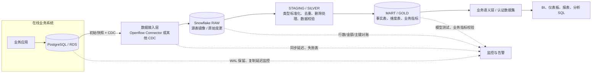
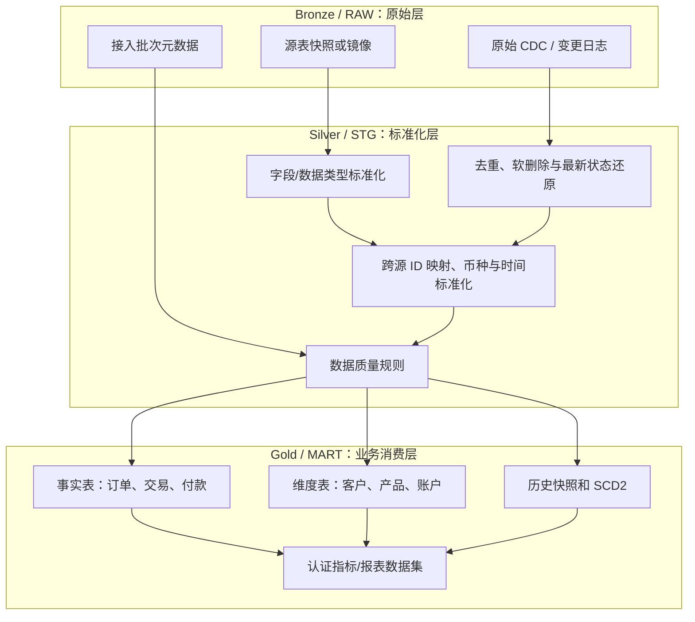

**主题：** 企业保留 PostgreSQL 作为在线业务数据库，将历史数据、分析计算和报表逐步迁移到 Snowflake  
**面向读者：** 有 SQL、关系数据库经验，但刚开始接触 Snowflake 的工程师、架构师、数据分析人员  
**资料检索日期：** 2026-10-09  
**阅读建议：** 先读第 1–6 章确定架构，再按第 7–12 章动手；文末列出了官方文档和企业工程案例。

## 一、先给结论：应该如何搭建

针对大多数已经使用 PostgreSQL 的企业，建议采用以下分工：

- **PostgreSQL：** 继续服务在线交易（OLTP），负责订单、客户、操作记录等业务写入，以及要求低延迟、事务一致性的在线查询。
- **Snowflake：** 负责历史数据、跨系统整合、大范围扫描、复杂聚合、数据集市和 BI 报表（OLAP）。报表不再为了读数据而给生产 PostgreSQL 增加大量负担。
- **数据同步：** 先把历史存量装载到 Snowflake，再用 CDC（Change Data Capture，变更数据捕获）持续同步 INSERT、UPDATE、DELETE。若业务允许小时级或日级延迟，也可以先用批量增量同步，不必一开始就上实时链路。
- **数据建模：** 先落原始层，再清洗标准化，最后建立面向业务的事实表、维度表和报表数据集。BI 不应直接依赖随意复制过来的每张源表。
- **可信度：** 数据同步成功不等于业务口径正确。必须有数据新鲜度、行数/金额对账、主键重复、删除处理、历史口径和权限校验。
- **成本：** Snowflake 的存储与计算分离，查询计算由 Virtual Warehouse（虚拟仓库）承担。开发、数据装载、转换、交互式 BI 应按需隔离资源并设置自动挂起、预算告警。

### 推荐的第一版架构

如果你们已有 PostgreSQL（例如 Amazon RDS for PostgreSQL 或 Aurora PostgreSQL），先评估 Snowflake 原生的 **Openflow Connector for PostgreSQL**。官方文档当前将该 Connector 标记为 Generally Available（GA），支持 PostgreSQL 11 及以上版本，也列出了 AWS RDS 和 Aurora PostgreSQL。它能做初始快照和后续增量复制。



**关键认识：** 不是把 PostgreSQL 全库原样复制一次就结束。正确的目标是建立一条可观察、可重试、可对账、能处理源端变化的分析数据链路。

---

## 二、先理解 PostgreSQL 与 Snowflake 的区别

### 2.1 两者主要解决不同的问题

| 维度         | PostgreSQL（在线数据库）                         | Snowflake（分析数据平台）                                            |
| ------------ | ------------------------------------------------ | -------------------------------------------------------------------- |
| 常见工作     | 创建/更新一笔订单、读取一个客户、事务处理        | 扫描数亿行、按月汇总、跨系统关联、历史趋势分析                       |
| 常见访问模式 | 根据主键/索引读少量行，频繁小事务                | 扫描很多行和列，进行聚合、分组、窗口计算                             |
| 数据写入     | 应用持续写入，重视事务和并发更新                 | 批量装载、持续摄取、分析模型转换                                     |
| 计算资源     | 通常与数据库实例绑定，需小心分析查询影响在线业务 | 存储和计算分离，按工作负载配置虚拟仓库                               |
| 物理优化     | 索引、执行计划、表膨胀、VACUUM、连接数等         | 微分区裁剪、仓库大小、并发队列、缓存、聚类等                         |
| 数据模型     | 适合规范化的业务事务模型                         | 常用事实表、维度表、宽表和面向消费的模型                             |
| 历史数据     | 由应用表、审计表、事件表或归档表决定             | 可以保留原始变更、历史快照、业务有效期和聚合快照，但必须自行定义口径 |

可以把 PostgreSQL 理解为“记录业务正在发生什么”的系统，把 Snowflake 理解为“分析业务发生过什么、为什么发生、趋势如何”的平台。

### 2.2 不要把 Snowflake 当作 PostgreSQL 的远程副本

原样复制有助于接入，但不能直接解决下列问题：

1. 一个客户可能在 CRM、交易系统和账单系统中分别有不同 ID，需要定义如何关联。
2. 源端金额的时区、币种、税额、状态含义不一定统一。
3. 如果某个源表中的记录更新了，报表究竟展示最新状态，还是当时的历史状态？两者都可能是正确需求，但模型不同。
4. BI 用户可能把“客户数”“活跃客户”“净收入”等词理解成不同口径。需要统一业务定义。
5. 同步工具可能将 DELETE 转成软删除标记，或单独发出删除事件。如果模型忽略删除，历史数据就可能错误。

因此，原始表主要服务于可追溯和重建；最终报表应依赖经过测试、有业务定义的数据模型。

### 2.3 Snowflake 的几个基础术语

- **Account：** Snowflake 的账户与管理边界。企业还可能按环境、区域或合规要求拆分账户。
- **Database / Schema / Table：** 逻辑命名层级，例如 `ANALYTICS_DB.MART.FCT_ORDERS`。
- **Virtual Warehouse：** 执行 SQL、装载和转换任务的计算资源。它不是存放数据的数据库实例。
- **Micro-partition（微分区）：** Snowflake 自动组织表数据的内部存储单元，查询通常会根据过滤条件跳过无关分区。
- **Stage：** 用于引用内部或外部文件存储的位置，例如 AWS S3。
- **COPY INTO：** 将文件批量装载到表中的常见 SQL 命令。
- **CDC：** 只传递数据发生的增删改，而不是每次重新扫描整张表。
- **Stream / Task：** Snowflake 的变更跟踪与定时执行能力，可用于构建某些增量流程；它们不是自动替你完成全部业务建模的按钮。
- **dbt：** 常用的数据转换与测试框架，以 SQL 模型和依赖图管理数据模型；不强制必须使用。

---

## 三、先把“历史数据”定义清楚

“把历史数据放入 Snowflake”实际可能指四种不同需求。它们要分别设计，不能只靠一份当前表快照解决。

| 历史类型         | 例子                                             | 应如何保存                                                                     |
| ---------------- | ------------------------------------------------ | ------------------------------------------------------------------------------ |
| **存量历史**     | 过去 5 年的订单、付款、客户记录                  | 第一次全量导入；根据表大小、历史分区和业务保留规则分批装载                     |
| **变更历史**     | 某订单从待付款改为已付款，之后被退款             | 保存 CDC 事件或 journal/change log，并保留操作类型、源端时间、源主键和顺序信息 |
| **业务状态历史** | “截至 2025 年 12 月 31 日，该客户属于哪个等级？” | 通过 SCD Type 2、有效起止日期、每日快照或业务事件来建模                        |
| **汇总快照历史** | 每日资产余额、每月收入、日终持仓                 | 按明确的业务时间和截止规则生成不可随意覆盖的快照，保留口径版本                 |

### 3.1 CDC 日志不是业务历史表

CDC 通常是一串事件：插入一行、更新一行、删除一行。分析表则需要表达某个时点的状态。要从前者还原后者，至少要知道：

- 哪个业务主键代表同一条记录；
- 事件的顺序如何确定；
- DELETE 事件究竟携带全部旧值，还是只有主键；
- 初次快照与后续增量如何衔接；
- 如果事件重复到达，怎样避免重复计数；
- 如果事件延迟或乱序，怎样识别最新状态；
- 如果源表改变了字段类型或主键，如何恢复模型。

Fresha 的工程文章专门讨论了这个问题：其团队从 100 多个 PostgreSQL 数据库捕获变更，进入 Snowflake 后再用 dbt 将 CDC 事件重建为当前表、历史表及用于一致性分析的视图。文章强调，CDC 流本身不是可以直接安全消费的“表”。

参考：[Fresha：Everything Everywhere As Of Once—Rebuilding Postgres Inside Snowflake（2026-06-10）](https://medium.com/fresha-data-engineering/a-cdc-stream-is-not-a-table-rebuilding-postgres-inside-snowflake-one-thousand-times-003767d48a17)

### 3.2 做业务历史时必须选择时间语义

常见的两种时间：

- **事件/生效时间（business valid time）：** 业务上这项状态何时生效。例如客户等级从 7 月 1 日开始变化。
- **系统记录时间（system/ingestion time）：** 数据平台何时收到或处理这次变化。

数据可能在 7 月 1 日生效，但 7 月 3 日才补录。要回答“7 月 2 日时业务实际上是什么状态”与“截至 7 月 2 日系统当时知道什么”，需要不同的查询规则。在财务、风控、监管报表中，不要把两者混为一谈。

例如，SCD Type 2 的客户维度可以有 `valid_from`、`valid_to` 和 `is_current`：

```sql
-- 示例：业务有效期模型，不是 CDC 工具自动生成的固定表结构
SELECT customer_id, customer_tier
FROM ANALYTICS_DB.MART.DIM_CUSTOMER_HISTORY
WHERE valid_from <= '2026-06-30'::DATE
  AND (valid_to > '2026-06-30'::DATE OR valid_to IS NULL);
```

Snowflake Time Travel 主要用于在保留窗口内查询/恢复较早的数据状态；它不应被当作完整的业务审计历史或无限期历史建模方案。需要长期历史时，应设计独立的历史表、事件表或快照表，并验证对应的留存政策。

---

## 四、如何把 PostgreSQL 数据同步到 Snowflake

先根据需要的新鲜度选择复杂度。不是所有报表都需要秒级同步。

### 4.1 方案选择表

| 方案                                            | 适合场景                                                              | 优点                                                             | 需要承担的工作/风险                                                                              | 建议                               |
| ----------------------------------------------- | --------------------------------------------------------------------- | ---------------------------------------------------------------- | ------------------------------------------------------------------------------------------------ | ---------------------------------- |
| **Snowflake Openflow Connector for PostgreSQL** | 需要持续增量复制，想减少自建 CDC 基础设施；已有 RDS/Aurora PostgreSQL | 官方 Connector，支持初次快照 + 增量复制，管理面与 Snowflake 集成 | 需配置逻辑复制、网络/凭证、复制键；需理解软删除、journal、类型和 DDL 限制；监控源端 WAL 与失败表 | **优先做概念验证的选项**           |
| **批量导出到 S3 + Snowflake COPY INTO**         | 每日/每小时更新即可；历史批量导入；需要透明、低复杂度管道             | 简单、可复用文件、易做重跑和审计，常适合大批量数据               | 自己设计增量水位、删除传播、幂等、文件清理和调度                                                 | **低频分析的良好起点**             |
| **Debezium + Kafka + S3 + Snowflake**           | 高数据量、多下游、希望保留开放格式事件湖、需要可控 CDC 管线           | 灵活，能保留原始变更事件，可供 Spark 等其他引擎复用              | 运维组件多；Schema Registry、Kafka、S3 文件整理、重复/顺序/重放、CDC 重建都需要工程能力          | 规模或平台复用有明确要求时使用     |
| **Fivetran、Airbyte 等托管/第三方 ELT**         | 希望快速接入多种数据源、团队不想维护 CDC 组件                         | 上手快、连接器生态较丰富、减少自建运维                           | 许可成本、连接器行为和限制、数据驻留/安全评估、故障排查透明度                                    | 需要按真实数据量/频率报价并做 PoC  |
| **Snowflake Postgres Data Mirroring**           | 具体源端和环境满足该功能当前要求                                      | 原生镜像模式可减少传统 CDC 中间件环节                            | 不要假定它兼容所有现有的 PostgreSQL/RDS；需核验源端扩展、权限、版本、区域和部署支持              | **先确认资格，不作为通用默认方案** |

**重要澄清：AWS DMS 不应简单地描述成“把 PostgreSQL 直接复制到 Snowflake”。** 当前 AWS DMS 的官方目标端列表没有将 Snowflake 列为普通直接目标端。AWS DMS 可以把数据送到 S3 等受支持的目标，再由 Snowflake 从 S3 装载；使用前要按具体 DMS 功能及目标端支持矩阵核实。

### 4.2 默认建议：先评估 Openflow，再按需求决定是否自建

Snowflake 官方 Openflow PostgreSQL Connector 文档说明，它可复制选定 PostgreSQL 表的全量快照和后续增量变化，使用逻辑复制读取 PostgreSQL 的 WAL。

一个概念流程是：

1. DBA 在 PostgreSQL 端配置逻辑复制参数，创建 publication，并为 connector 建立具备 `REPLICATION` 属性和所需 `SELECT` 权限的账号。
2. 为 connector 提供网络连通性、TLS/凭证和 Snowflake 目标数据库/仓库等设置。
3. connector 检查表结构与数据类型，执行初始快照，再持续消费增量变更。
4. 数据进入 Snowflake 复制目标表和 journal 表；分析团队在下游建立自己的 `RAW`、`STG`、`MART` 模型。
5. 监控复制延迟、失败表、错误行、源端 WAL 留存和 Snowflake 侧仓库用量。

官方资料：

- [Openflow PostgreSQL Connector 概览与限制](https://docs.snowflake.com/en/user-guide/data-integration/openflow/connectors/postgres/about)
- [Connector 配置步骤](https://docs.snowflake.com/en/user-guide/data-integration/openflow/connectors/postgres/setup)
- [PostgreSQL 到 Snowflake CDC 快速入门](https://www.snowflake.com/en/developers/guides/getting-started-with-openflow-postgresql-cdc/)

### 4.3 Openflow 方案的几个重要限制

不要只读成功路径，还要在 PoC 中特意测试：

- **主键/复制键：** 默认依赖主键或符合条件的唯一键；缺少可用 identity key 的表可能只能同步 INSERT，UPDATE 和 DELETE 无法可靠应用。
- **DELETE 语义：** 目标表中的删除默认通过 `_SNOWFLAKE_DELETED = TRUE` 软删除表示。查询当前状态时，必须过滤软删除记录；需要历史时再按治理政策保留或清理。
- **TRUNCATE：** 当前 Connector 文档说明，源端 `TRUNCATE` 不会转换为目标端删除，可能被忽略。如果业务会清空/重建源表，需专门设计处理方案。
- **新增字段：** 新字段可能会被加入目标表，但旧数据不会自动获得过去的字段值，既有行对应新列可能为 `NULL`。
- **字段类型变化：** 某些不兼容类型变化、精度/小数位变化、字符长度变化可能令复制停止，需要恢复流程。
- **大字段与类型映射：** PostgreSQL 的 `JSONB`、`BYTEA`、`NUMERIC`、时区时间戳等需要检查类型映射、大小限制和精度；不要只用小样本验证。
- **Journal 表：** 其保留可能带来存储增长；不要在复制运行中随意删除正在使用的 journal，清理需要明确生命周期和恢复规则。
- **没有初始快照就开增量：** 官方文档指出，某些既有行后续变化可能在 `VARCHAR`、`VARIANT`、`BINARY`、`ARRAY` 等列出现缺失值。除非你能证明已存在的目标数据完整且与源端匹配，否则不要把“不做快照的增量复制”当作普通重启方式。

这些限制并不是说 Connector 不好，而是提醒你：复制工具的正确性有前提。最容易出问题的往往不是第一次 `INSERT`，而是多年积累后的 schema change、DELETE、主键变更、历史回填和异常恢复。

### 4.4 如果使用 S3 文件作为边界

一种可控的批量方案如下：

1. 从 PostgreSQL 生成历史快照/增量文件，推荐选择 Parquet 等适合分析的列式格式；文件保存到与 Snowflake 区域和网络设计相匹配的 S3 路径。
2. 每个批次生成 manifest 或控制记录，包括批次 ID、表名、提取开始/结束时间、源端水位、文件数量、行数和校验摘要。
3. Snowflake 通过 external stage 和 `COPY INTO` 读取文件，原始批次保留在接入层。
4. 只有批次验证通过后才推进已处理水位；重跑相同批次不能产生重复业务记录。
5. 对更新/删除，不要只按 `updated_at > last_run_time` 简单查询，除非能证明这个字段不会漏更新/删除、没有并发水位问题且历史重跑可控。更可靠的方案是 CDC 或带重叠窗口 + 幂等合并 + 定期对账。

批量方案非常适合先迁移“几十张报表表、每日更新”的第一阶段；以后新鲜度需求提高，再对重点数据源改用 CDC。不要为了一个每天凌晨更新的报表，从第一天就运维 Kafka 集群。

---

## 五、Snowflake 内部如何组织数据

推荐先采用清晰、可理解的三层模型。Bronze/Silver/Gold 是一种常见的组织方式，不是 Snowflake 强制要求的产品功能。



### 5.1 每层负责什么

**RAW / Bronze：保留可追溯的源数据。** 尽量少做不可逆转换，明确源系统、表、装载批次/时间、CDC 元数据。不要让业务报表随意读取原始变更流。

**STG / Silver：解决技术复杂性。** 统一命名、类型、时区，解析 JSON，去重，剔除或标识软删除行，处理迟到事件和源端 schema 变化。此层的目标是稳定、可复用的标准化实体。

**MART / Gold：表达业务问题。** 用事实表、维度表、宽表或汇总表服务具体用例。明确粒度，例如“一行是一笔订单”“一行是一个客户的一次每日快照”。如果粒度不清，后续 join 很容易把金额重复计算。

**语义层/认证数据集：统一业务含义。** 对“净收入”“活跃客户”“有效交易”等指标定义公式、时间范围、过滤规则、所有者与版本。报表可以不同，但业务核心指标不能各自暗中定义。

### 5.2 一个简单的数据模型例子

假设业务库中有 `orders`、`order_items`、`customers`：

- `FCT_ORDER`：一行代表一笔订单，保存订单日期、客户键、状态、金额、币种等。
- `FCT_ORDER_ITEM`：一行代表一个订单明细。
- `DIM_CUSTOMER`：一行代表当前客户属性。
- `DIM_CUSTOMER_HISTORY`：一行代表客户某段业务有效期内的状态，用于历史还原。
- `FCT_DAILY_REVENUE`：一行代表某日期、产品/业务单元/币种组合的日汇总，按确认过的收入口径生成。

不要在没有明确粒度的情况下把订单头和订单明细直接关联后求和；一笔订单有多条明细时，订单头金额会被重复累加。这不是 Snowflake 特有的问题，但在大规模分析数据中会更隐蔽、影响更大。

### 5.3 dbt 是否必须

不是必须，但如果模型数量会增长，dbt 或同类 SQL 转换框架通常值得考虑。它把 SQL 转换、依赖图、测试、文档和 CI/CD 放在同一个工作流里。简单的 3 张表也可以从 SQL、Snowflake Tasks 和版本控制开始，不要为工具而工具。

建议为关键模型至少定义：

- 主键/业务键唯一性；
- 关键字段非空；
- 枚举状态在允许范围；
- 事实表与维度表关联有效；
- 金额、余额、数量满足业务约束；
- 源数据新鲜度；
- 关键行数和金额合计与源系统对账。

Snowflake 的 [dbt Projects 最佳实践](https://docs.snowflake.com/en/user-guide/data-engineering/dbt-projects-on-snowflake-best-practices) 特别建议：大型且频繁变化的表考虑 incremental model；小型低频表继续使用简单的全量模型；将测试纳入 CI/CD；生产执行使用独立、范围最小的服务账号和角色。

---

## 六、历史迁移如何安全落地

不要一次性把全部生产数据库、全部报表、全部历史规则同时切换。建议分为四阶段。

### 阶段 A：盘点并定范围

先整理一张表清单：

| 维度     | 需要回答的问题                                             |
| -------- | ---------------------------------------------------------- |
| 用途     | 此表支撑哪个报表、流程或监管要求？有没有实际使用？         |
| 规模     | 行数、总容量、年增长、日变化量、最大单行字段大小是多少？   |
| 更新方式 | 只追加、频繁 UPDATE、硬 DELETE、TRUNCATE，还是整表重建？   |
| 主键     | 是否有稳定主键？是单列还是复合键？主键会不会被更新？       |
| 历史要求 | 只需当前状态、需要每次变更、还是要复原某个业务日期的状态？ |
| 新鲜度   | 实时、几分钟、小时级，还是隔夜足够？                       |
| 敏感度   | 是否包含 PII、账户数据、财务数据、受限业务信息？           |
| 消费方式 | BI 仪表盘、数据导出、分析 SQL、机器学习、运营系统？        |

第一批建议选 **2–5 张有代表性但可控的表**：一张只追加事件表、一张高更新表、一张有 DELETE 的业务表，再配一张报表。这样才能暴露真正的复杂性，而不是只证明“能连上”。

### 阶段 B：全量存量装载

典型步骤：

1. 固定本次迁移的表范围和字段映射，先处理不兼容类型与缺少主键的问题。
2. 记录快照时间/LSN 或同步工具能提供的等价起点，明确快照与增量之间如何衔接。
3. 大表分片或分区导出，避免单条长查询无限期占用源库资源；观察生产库 CPU、IO、连接数和复制延迟。
4. 导入 Snowflake RAW 层，记录每张表的行数、最大时间戳、最小/最大主键、关键金额汇总等基线。
5. 检查数据类型精度、时区、NULL、JSON/大字段和编码问题。金额等精确数值不要随意转成浮点数。
6. 在 CDC 启动后验证快照起点和增量没有缺口、没有重复。

不要直接用 `COUNT(*)` 相同就判断迁移成功：相同的总行数仍可能包含一边漏掉一行、另一边重复一行的情况。要对关键主键集合、时间范围和业务汇总进行多层校验。

### 阶段 C：双跑与对账

在报表真正切换之前，让旧报表和 Snowflake 报表并行运行一段业务周期。对账项目至少包括：

- 当前数据延迟，例如源端最新提交到 Snowflake 可查询的时间差；
- 关键表行数和不同业务状态分布；
- 每日订单数、交易笔数、金额/净额等业务总计；
- 关键主键缺失、重复和孤儿外键；
- 对历史日期抽样回算，验证状态变化和 DELETE 逻辑；
- 边界情况：跨午夜、时区切换、迟到事件、重复消息、退款/冲正、源表 DDL。

对差异分类：同步延迟、数据缺失、重复、业务规则不一致、历史定义不同、旧报表 bug。不要为追求数字相等而直接把结果“调到相同”；必须先定义哪个系统和哪个规则才是正确的。

### 阶段 D：按报表逐个切换

- 对业务用户公布新旧口径及已知差异；
- 一个报表/业务域完成验收后再切换，保留回滚路径；
- 设置 Snowflake 角色为只读消费权限，避免 BI 用户直接修改原始层；
- 在稳定期继续观察数据延迟、任务成功率、报表 P95 延迟和成本；
- 只有经过业务确认后，才减少旧 PostgreSQL 上相关的分析查询和临时汇总表。

---

## 七、Snowflake 性能与成本：哪些设置真正重要

### 7.1 Virtual Warehouse：按工作负载隔离

建议第一版至少考虑以下职责分离，是否拆成多个仓库由实际负载与成本决定：

| Warehouse       | 用途                         | 主要关注点                                 |
| --------------- | ---------------------------- | ------------------------------------------ |
| `INGEST_WH`     | 文件装载、数据摄取相关 SQL   | 完成时间、持续运行时间、吞吐、是否长期空转 |
| `TRANSFORM_WH`  | dbt、清洗、MERGE、事实表构建 | 扫描量、转换时长、峰值资源、队列           |
| `BI_WH`         | 仪表盘和交互式分析           | 并发、排队、P95 查询时延、用户体验         |
| `DS_WH`（可选） | 临时探索/数据科学            | 隔离临时大查询，避免影响已承诺的报表 SLA   |

为什么隔离？如果一个很重的历史回填与月底 BI 报表抢同一个计算资源，二者可能互相拖累。分仓可以隔离负载，也让费用归属清楚；但仓库拆得太多，可能引入不必要的管理复杂性，因此要根据并发和 SLA 验证。

从 XS/S 等较小规格开始，使用实际数据测试，而不是一开始就选大仓库。Snowflake 的成本与性能优化实践强调：应把查询完成时间、排队、数据量、复杂度、并发与 SLA 一起考虑，并用 `QUERY_HISTORY`、`WAREHOUSE_METERING_HISTORY`、`WAREHOUSE_LOAD_HISTORY` 等数据验证调整效果。

### 7.2 自动挂起和自动恢复

为非持续工作负载启用自动挂起/恢复，减少空闲时的计算消耗。示例：

```sql
CREATE WAREHOUSE IF NOT EXISTS BI_WH
  WAREHOUSE_SIZE = 'XSMALL'
  AUTO_SUSPEND = 60
  AUTO_RESUME = TRUE
  INITIALLY_SUSPENDED = TRUE;
```

这只是起步值，并不代表所有业务都应该设为 60 秒。太短可能增加频繁唤醒和用户感知延迟；太长则增加空闲成本。实际需要结合报表频率、查询时延目标和缓存行为测量。

### 7.3 并发高与单条查询慢是两类问题

- **许多查询排队：** 看仓库负载与队列；考虑独立仓库、调整并发策略或 multi-cluster warehouse 横向扩展。
- **单条查询扫描太多：** 看 Query Profile、过滤条件、Join、扫描的微分区；先减少无关数据读取、简化模型和 SQL，再考虑仓库规格。
- **更新/MERGE 很慢：** 检查一次更新涉及的目标表范围、更新分布、目标数据规模以及是否需要每分钟做全表级合并。频繁更新一个超大表，可能比追加事件更昂贵。
- **低选择性过滤造成全表扫描：** 结合真实查询评估聚类键、Search Optimization 或物化视图。它们并非免费；会增加维护计算和/或存储成本，不应为了“看起来优化了”就默认全开。

官方存储优化文档特别指出，Automatic Clustering、Search Optimization 和 Materialized Views 存在额外维护/存储成本；对本来就能在约一秒完成的查询，这些优化通常没有显著收益。先定位查询问题，再做针对性优化。

### 7.4 用真实案例理解大表更新成本

RevenueCat 的工程文章是一条非常有用的经验：它描述了一个约 150 亿行的 `users` 表，每日处理约 3500 万次变更。频繁地合并变更，在其测试中可能一次需要数小时，摄取仓库长时间运行，账单难以接受。团队改为小型快速摄取层、日常合并物化表，并通过低延迟视图让查询看到最近未合并的变化。文章报告称，更新可见延迟由 2–3 小时降至潜在几分钟，相关费用降低约 75%。

这不是建议每家企业照搬“每天合并一次”。它说明：**数据新鲜度 SLA 要按消费者的真实需求设计**。如果报表每 1–4 小时才跑一次，频繁将超大表物化合并到秒级可能毫无业务价值；但如果业务确实要求低延迟，就应在设计之初测量事件读取、合并、查询三种成本，而非只盯着仓库变大后查询是否变快。

来源：[RevenueCat 生产工程实践](https://www.revenuecat.com/blog/engineering/data-ingestion-snowflake)

### 7.5 账单治理的最低配置

至少建立以下机制：

1. 为仓库设置合理的 `AUTO_SUSPEND` / `AUTO_RESUME`；
2. 按环境、团队或业务域使用清晰的 Warehouse 命名；
3. 设置 Resource Monitor 或等效的预算告警；
4. 每周/每月审查仓库耗时、计算用量、队列和异常查询；
5. 给重跑、回填和全量重算设定执行窗口与预估成本；
6. 不要把测试环境长期保持在生产同等计算规模；
7. 对高频变化的大表，评估 CDC 更新合并、聚类维护和物化视图的综合成本；
8. 为每个关键报表定义“性能预算”，而不只是问“还能不能更快”。

官方参考：[Snowflake 成本优化指南](https://www.snowflake.com/en/developers/guides/cost-optimization/)、[Warehouse considerations](https://docs.snowflake.cn/en/user-guide/warehouses-considerations)、[Storage optimization](https://docs.snowflake.com/en/user-guide/performance-query-storage)。

---

## 八、一个可以动手的 Snowflake 入门骨架

下面是概念性 SQL，用来理解对象关系。需要根据你们账户的角色授权、环境命名和实际 Connector 部署方式调整。生产环境不要直接把日常账号设成 `ACCOUNTADMIN`。

### 8.1 创建数据库、Schema、仓库和基础角色

```sql
-- 一般由平台管理员或受控的数据库部署流程执行
CREATE DATABASE IF NOT EXISTS ENTERPRISE_ANALYTICS;

CREATE SCHEMA IF NOT EXISTS ENTERPRISE_ANALYTICS.RAW;
CREATE SCHEMA IF NOT EXISTS ENTERPRISE_ANALYTICS.STG;
CREATE SCHEMA IF NOT EXISTS ENTERPRISE_ANALYTICS.MART;

CREATE WAREHOUSE IF NOT EXISTS TRANSFORM_WH
  WAREHOUSE_SIZE = 'XSMALL'
  AUTO_SUSPEND = 60
  AUTO_RESUME = TRUE
  INITIALLY_SUSPENDED = TRUE;

CREATE WAREHOUSE IF NOT EXISTS BI_WH
  WAREHOUSE_SIZE = 'XSMALL'
  AUTO_SUSPEND = 60
  AUTO_RESUME = TRUE
  INITIALLY_SUSPENDED = TRUE;
```

角色设计至少区分：

- 摄取服务角色：只写入其负责的 RAW 数据域；
- 转换服务角色：读 RAW/STG、写 STG/MART；
- BI 角色：只读认证数据集；
- 数据工程师角色：在开发环境建模与调试；
- 平台管理员角色：管理账户、集成和授权，人数尽可能少。

具体授权应遵循最小权限原则；Snowflake 的 `GRANT` 体系值得先单独练习，不要为方便给报表工具整个数据库的所有权限。

### 8.2 文件批量导入的概念示例

实际使用前需要先建立并授权 stage，配置存储集成，并保证文件结构/格式与目标表兼容。假设 `orders_2026_10_08.parquet` 已位于可访问的 S3 外部 stage：

```sql
-- 示意：对象名称和文件路径均需换成实际值
COPY INTO ENTERPRISE_ANALYTICS.RAW.ORDERS
FROM @MY_S3_STAGE/orders/2026/10/08/
FILE_FORMAT = (TYPE = PARQUET)
MATCH_BY_COLUMN_NAME = CASE_INSENSITIVE;
```

生产装载还应记录每次 COPY 的结果、失败行/文件、批次状态和源端水位。不要依赖人工从控制台看一眼“加载成功”作为唯一证据。

### 8.3 查询 Openflow 镜像表时注意软删除

对 Openflow PostgreSQL Connector 创建的目标表，当前记录查询通常需要过滤软删除标记：

```sql
SELECT order_id, customer_id, status, amount, updated_at
FROM ENTERPRISE_ANALYTICS.RAW.ORDERS
WHERE _SNOWFLAKE_DELETED = FALSE;
```

请在部署时先验证实际表结构及元数据列；如果数据源通过其他 CDC 工具进入，删除标记和列名未必相同。最终业务模型应把该规则封装起来，不要要求每个 BI 用户自己记住它。

### 8.4 CDC 流重建表的伪代码示例

以下 SQL 只是说明常见思路，字段名依赖具体 connector。假设原始 CDC 表有 `order_id`、`op`、`event_ts`、`source_offset`、`payload`：

```sql
-- 示意：先选择每个业务主键的最新事件
WITH ranked AS (
  SELECT
    order_id,
    op,
    event_ts,
    source_offset,
    payload,
    ROW_NUMBER() OVER (
      PARTITION BY order_id
      ORDER BY event_ts DESC, source_offset DESC
    ) AS rn
  FROM ENTERPRISE_ANALYTICS.RAW.ORDER_CDC
)
SELECT *
FROM ranked
WHERE rn = 1
  AND op <> 'DELETE';
```

这个例子并不完整：真实系统还需要保证 `event_ts` 和 offset 能组成稳定顺序；处理初始快照；明确 DELETE 是否保留 tombstone；考虑主键更改、事务边界和乱序事件。对于金额、监管和审计场景，应优先采用有测试的成熟重建模型，而不是直接复用这段示意 SQL。

---

## 九、企业治理、安全与业务语义

### 9.1 权限边界

推荐把数据访问拆成几个层面：

- **摄取权限：** connector 可以读取允许同步的源表，不应拥有不必要的业务写权限。
- **原始层权限：** 原始数据访问限于数据平台及获批的工程角色，尤其是包含客户个人信息的表。
- **模型写权限：** 只允许指定服务角色写入生产 STG/MART。
- **BI 读取权限：** 给 BI 工具和分析师只读访问认证的数据集；必要时通过 secure view、row access policy、masking policy 限制行和列。
- **开发与生产分离：** 开发人员在隔离的开发 schema/环境验证模型，不应直接修改生产表或清理 CDC journal。

密码与连接信息使用受控 Secret/集成管理；限定网络来源；记录对象授权、数据访问和关键任务执行。具体控制应与企业既有 Data Entitlement、合规分类与审计流程一致。

### 9.2 业务定义不要散落在各个报表里

为核心指标建立最小的“指标目录”：

| 字段     | 示例                                   |
| -------- | -------------------------------------- |
| 指标名称 | 净收入                                 |
| 业务定义 | 已确认收入扣除退款与冲正，排除测试交易 |
| 粒度     | 业务日期 × 币种 × 产品                 |
| 时间口径 | 按交易生效日还是入账日                 |
| 来源     | 哪些源表及字段                         |
| 计算逻辑 | 对应 SQL/dbt 模型的版本控制路径        |
| 刷新 SLA | 每小时、每日或其他                     |
| 责任人   | 可解释定义并批准变更的业务所有者       |
| 校验方法 | 对账报表、阈值、历史差异处理方式       |

“把 SQL 搬到 Snowflake”通常不是最难的事情，真正长期消耗时间的是不同部门对于相同术语的定义不同。把定义、粒度、时间语义和责任人纳入模型与发布流程，才能避免新旧报表各算各的。

---

## 十、生产运维：要监控什么，出问题怎么查

### 10.1 最小监控面板

| 区域            | 指标/检查                                                           | 为什么需要                                        |
| --------------- | ------------------------------------------------------------------- | ------------------------------------------------- |
| PostgreSQL 源端 | replication slot 状态、WAL 保留量/磁盘、长事务、数据库 CPU/IO       | CDC 消费不动时，旧 WAL 可能持续保留并消耗源端磁盘 |
| Connector       | 最后成功时间、复制延迟、失败表/失败行、重试次数、schema change 状态 | 整条管线“还运行着”不代表每张表都成功              |
| RAW 数据        | 每批行数、主键重复、最大源端事件时间、删除事件数、文件积压          | 提前发现漏数、重复、删除没有落地或数据变陈旧      |
| 模型任务        | 成功率、耗时、依赖失败、最近完整刷新时间、测试失败                  | 防止 RAW 正常但 MART 没有更新                     |
| BI/查询         | P50/P95 时延、失败率、排队、扫描量、最常见慢查询                    | 用真实用户体验指导计算资源优化                    |
| 成本            | 各 Warehouse 用量、长期运行、异常峰值、每个业务域/任务归属          | 识别意外回填、频繁合并和空闲仓库                  |

### 10.2 PostgreSQL replication slot/WAL 是不能忽视的源端风险

CDC 通常依赖 PostgreSQL WAL。复制槽未及时前进时，PostgreSQL 为保证下游还能读取变化，可能保留本可回收的 WAL 文件，导致磁盘持续增长。因此必须有源端磁盘阈值、复制槽进度与连接器健康的告警，也要有“暂停 CDC / 删除槽位 / 重建同步”的批准流程。不能在出现磁盘压力后简单删除复制槽而不评估数据缺口。

Snowflake 官方 Connector 配置文档明确要求给源端 WAL 预留足够磁盘，并指出 replication slot 会保留尚未被 connector 确认推进位置之前的 WAL。

### 10.3 建议先准备四种故障手册

**A. 数据延迟突然上升**

1. 确定是所有表还是单表；
2. 查看源端长事务、WAL/slot 进度和磁盘；
3. 查看网络、Connector runtime 与失败日志；
4. 判断是源端产生变更速度超过消费能力，还是 Snowflake 侧处理/合并堆积；
5. 恢复后做水位与关键业务汇总对账。

**B. Snowflake 数据比 PostgreSQL 少**

1. 对比数据范围与快照起点；
2. 查看失败表、失败行、主键和 schema change；
3. 检查是否发生源表 `TRUNCATE`、主键变更或软删除过滤错误；
4. 找出缺失主键集合，而不只比较总行数；
5. 按工具支持的方式重放、重新快照或修复目标模型。

**C. 报表金额和旧系统不一致**

1. 锁定同一业务截止时间、币种、状态过滤规则和时区；
2. 确认订单头与订单明细是否重复计数；
3. 检查迟到事件、退款/冲正、删除、精度和舍入；
4. 逐层比较 RAW、STG、MART，定位首次发生差异的层；
5. 由业务所有者确认正确口径，再修改模型并留版本记录。

**D. Snowflake 账单异常**

1. 按 Warehouse 和时间段核对使用量；
2. 找出持续运行、频繁唤醒、长期排队和全量重算；
3. 检查是否因为频繁 MERGE 大表或自动聚类维护导致计算持续；
4. 暂停可安全暂停的非关键回填，经评估后重调仓库/作业频率；
5. 在修复后复核数据新鲜度和报表 SLA 没有被悄悄破坏。

---

## 十一、企业实战案例：能学什么，不能照搬什么

### 案例 1：RevenueCat——CDC 不只要快，还要能经济地合并

**背景：** Aurora PostgreSQL 为生产库；Debezium 捕获 WAL 变更，经 Kafka、Avro 和 S3 文件进入 Snowflake，dbt 负责层间转换，Airflow 主要编排 dbt。

**遇到的问题：** 早期商业同步方案对 PostgreSQL TOAST 大字段处理、Schema Evolution 和不一致排查有困难。后来自建的管线也遇到另一类问题：几十亿行的大表如果高频 MERGE，更新耗时会很长且成本高。

**做法：** 通过 S3 保留变更文件；利用 Snowflake external table/stream 追踪新文件；小型摄取表快速吸收变更；大型物化表降低合并频率，再用低延迟视图叠加尚未合并的少量近期变化。团队为 100 多张表构建了配置和生成工具，以避免手工维护大量相似 SQL 和任务。

**文章报告的结果：** 对其特定工作负载，延迟从约 2–3 小时降低到潜在的几分钟，成本下降约 75%。

**可复用经验：**

- 大规模 CDC 的难点可能不是“把数据读出来”，而是“怎样在分析层经济地应用更新”。
- 保留原始变更数据有助于调查和重建。
- 不需要每分钟物化所有超大表；摄取频率、合并频率与查询新鲜度应分别设计。
- 100 张表以后，配置驱动和自动化能显著减少重复工程工作。

**不能直接照搬：** 其管线组件较多，适合规模与开放数据湖有明确价值的团队。中小规模第一阶段不一定需要 Kafka、Schema Registry、S3、external table、stream、task 全部自建。

来源：[RevenueCat 工程博客（2024-04-15，后于 2024-06 更新）](https://www.revenuecat.com/blog/engineering/data-ingestion-snowflake)

### 案例 2：Fresha——把 CDC 正确还原成当前表与一致的分析视图

**背景：** Fresha 的数据工程团队描述了从 100 多个 operational PostgreSQL 数据库读取 CDC，经 Debezium、Kafka、Snowpipe 进入 Snowflake，再使用 dbt 构建模型的流程。

**重点问题：** PostgreSQL 默认 `REPLICA IDENTITY` 下，DELETE 事件可能仅有主键，不能假设它总携带整行旧值。直接对所有事件做“按主键取最后一条”的逻辑，可能把删除后的空 tombstone 当成一行有效记录。另一个问题是分析任务需要源数据处于一致版本，不只是查询时拿到“最新的某一部分数据”。

**可复用经验：**

- 把原始事件、物化当前状态、删除标识与最终查询视图分开；
- 使用事件时间和可稳定排序的 Kafka offset/源端位置处理同一主键的事件顺序；
- 对 CDC 数据设置可复现的批次/时间边界，保证一次分析运行中的上游数据版本一致；
- 对不同 `REPLICA IDENTITY` 行为分别处理，不能假设所有表的 DELETE payload 一样。

**不能直接照搬：** 其文中很多细节服务于多租户大规模平台。一般企业可以先把同样的语义要求写进测试和模型，不一定需要复制整套三层删除结构。

来源：[Fresha Data Engineering（2026-06-10）](https://medium.com/fresha-data-engineering/a-cdc-stream-is-not-a-table-rebuilding-postgres-inside-snowflake-one-thousand-times-003767d48a17)

### 案例 3：AdTech 数据平台——把分析型 PostgreSQL 工作负载迁往 Snowflake

Klika 发布了一篇客户案例：一家多租户广告收入分析产品原先用 PostgreSQL 存储与处理报表数据，数据量超过 2 TB，每日从大量连接器接入数十 GB 数据。报告指出，复杂报表有时运行数小时；平台使用预计算 totals table、请求时 schema introspection 和 CSV 导出等补丁维持性能。团队把分析与报告层迁到 Snowflake，同时保留 PostgreSQL 管理账户、用户、作业等运营元数据。

案例描述的目标架构把交互/API 查询与每日摄取、报表高峰分到不同 warehouse；历史数据经分块导出到对象存储，再并行装载到 Snowflake；报表结果直接写入 Snowflake，并给用户编写的报表 SQL 使用只读角色。案例报告重型报表从小时级降到分钟级，某些几百 GB 的数据压缩到几 GB；这是案例提供方的客户结果，应将其视为特定工作负载实例，而非对任何企业的性能保证。

**可复用经验：**

- 只迁移分析型工作负载，保留 PostgreSQL 的事务型元数据和在线操作。
- 后台摄取和交互式报告分离，避免重任务影响用户响应。
- 搬迁时同时清理旧系统中积累的预聚合、重复导出、请求时 schema 查询等复杂度。
- 应用程序迁移也需要调整数据库方言、连接池、事务假设和 ORM 行为；不能认为换了 JDBC/连接字符串就必然完成迁移。

来源：[Klika 客户案例](https://www.klika.us/case-studies/from-a-row-store-bottleneck-to-an-elastic-consolidated-analytics-platform)。这是咨询/交付方发布的案例，公开信息未提供独立审计，具体数字需要谨慎看待。

### 从案例中总结出的共性

1. PostgreSQL 和 Snowflake 分工是有价值的，但不是“所有数据都复制过去、所有 SQL 原封不动执行”。
2. 数据新鲜度是产品需求与成本决策，不是越实时越好。
3. CDC 的删除、顺序、源端字段演进和数据版本一致性需要明确设计。
4. 大表频繁更新/MERGE 应在 PoC 中用真实规模与分布测试；不要只用 1 万行 demo 测速度。
5. 先做可观测性和对账，再扩大接入规模；能解释差异的系统才是生产系统。

---

## 十二、推荐的 30/60/90 天路线

### 第 1–30 天：验证最小闭环

- 盘点 PostgreSQL 表、报表和历史保留要求；
- 选一组 2–5 张代表表；
- 评估 Openflow Connector、批量 S3 或托管工具，做小规模 PoC；
- 建立 Snowflake 的 RAW/STG/MART Schema、角色和仓库；
- 完成首次快照、CDC 或批量增量；
- 验证插入、更新、删除、源表加列、类型变化、重复和重试；
- 做行数、主键集合、金额汇总对账；
- 给出每个测试报表允许的数据延迟与查询 SLA。

**第 30 天的交付物：** 可重复执行的数据管道、一份真实对账结果、一张成本/延迟基线表，以及未通过测试的问题清单。

### 第 31–60 天：建立可复用的业务模型

- 挑选一个业务域，比如订单/付款或客户/账户；
- 建立标准化 STG 模型与第一批 MART 事实表/维度表；
- 为核心模型增加数据质量测试；
- 定义关键指标、时间语义和业务所有人；
- 做新旧报表双跑与业务验收；
- 加上端到端延迟、失败表、对账差异、仓库成本告警；
- 通过代码评审/CI/CD 发布模型，区分开发和生产权限。

**第 60 天的交付物：** 一个业务域有可被 BI 消费、经过业务确认的数据集和报表；出现数据差异时可定位到源表、接入层或模型层。

### 第 61–90 天：扩规模、控成本、形成运维机制

- 按收益和风险逐步加入其他报表/表；
- 根据负载决定哪些采用 CDC，哪些保留批量；
- 对高更新的大表单独测算合并频率与成本；
- 评估交互式查询和后台转换是否需要独立仓库；
- 形成每周账单/性能巡检、每月数据质量复核和变更发布制度；
- 文档化故障恢复、重放、重快照和回滚流程；
- 删除或降载旧系统中已被正式迁移取代的重报表查询，但不要过早删除必要的审计/回滚数据。

**第 90 天的目标：** 让“历史数据迁入 Snowflake”成为有所有者、有成本归属、有质量标准、有恢复流程的长期平台，而不只是一个 ETL 脚本。

---

## 十三、落地检查清单

上线前逐项确认：

### 数据接入

- [ ] 已明确每张表的主键或复制键；
- [ ] 初始快照和 CDC 衔接方案经过验证；
- [ ] INSERT、UPDATE、DELETE 均有测试；
- [ ] 已测试 `TRUNCATE`、主键变更和 schema evolution；
- [ ] 已确认日期/时区/数值精度/JSON/大字段映射；
- [ ] PostgreSQL replication slot、WAL 和磁盘有监控与告警；
- [ ] 连接器的失败表、失败行和重试行为有 runbook；
- [ ] 每次装载都有可追溯的批次或水位信息。

### 数据建模与质量

- [ ] 已明确事实表粒度；
- [ ] 当前状态、CDC 变化历史、业务有效历史与日/月快照已经区分；
- [ ] 删除记录不会被错误地当成有效行；
- [ ] 关键主键唯一性、非空、关系、金额汇总和新鲜度有测试；
- [ ] 关键报表经过双跑和业务所有者验收；
- [ ] 指标定义、时间口径、数据源和责任人有文档。

### 性能、成本与安全

- [ ] 摄取、转换和 BI 的负载是否需要隔离已经评估；
- [ ] 非持续工作负载有自动挂起/恢复；
- [ ] 有查询时延、排队和仓库成本观察方式；
- [ ] Resource Monitor 或等价成本告警已经配置；
- [ ] 原始敏感数据有访问控制、masking/row access 等相应策略；
- [ ] 服务账号使用最小权限，生产发布可追踪；
- [ ] 已演练数据延迟、漏数、金额差异和账单异常的处理过程。

---

## 十四、下一步应读的官方文档

建议按以下顺序阅读，避免一开始就掉进高级性能调优细节。

1. **PostgreSQL Connector 概览：** [About Openflow Connector for PostgreSQL](https://docs.snowflake.com/en/user-guide/data-integration/openflow/connectors/postgres/about) — 重点看复制流程、支持版本、复制键、删除、journal 和 schema 变化。
2. **Connector 配置：** [Set up the Openflow Connector for PostgreSQL](https://docs.snowflake.com/en/user-guide/data-integration/openflow/connectors/postgres/setup) — 重点看 PostgreSQL 参数、publication、账号权限、WAL 磁盘空间和网络。
3. **类型转换：** [PostgreSQL Connector data mapping](https://docs.snowflake.com/en/user-guide/data-integration/openflow/connectors/postgres/data-mapping) — 重点检查金额、日期时间、JSON/JSONB、UUID 与大字段。
4. **仓库基础：** [Warehouse considerations](https://docs.snowflake.cn/en/user-guide/warehouses-considerations) — 用实际查询测试仓库规格、并发与负载。
5. **存储优化：** [Optimizing storage for performance](https://docs.snowflake.com/en/user-guide/performance-query-storage) — 理解微分区、自动聚类、Search Optimization 和物化视图的收益与成本。
6. **成本优化：** [Snowflake cost optimization guide](https://www.snowflake.com/en/developers/guides/cost-optimization/) — 学习 `QUERY_HISTORY`、`WAREHOUSE_METERING_HISTORY` 和自动挂起等运维方法。
7. **dbt 模型工程：** [Best practices for dbt Projects on Snowflake](https://docs.snowflake.com/en/user-guide/data-engineering/dbt-projects-on-snowflake-best-practices) — 学习增量模型、测试、CI/CD、仓库空闲成本和角色设计。
8. **CDC 实作流程：** [Getting Started with PostgreSQL CDC](https://www.snowflake.com/en/developers/guides/getting-started-with-openflow-postgresql-cdc/) — 可按步骤体验初次快照和增量更新。
9. **Snowflake Postgres 镜像功能：** [Data mirroring](https://docs.snowflake.com/en/user-guide/snowflake-postgres/postgres-data-mirroring) — 了解另一种原生镜像能力，但必须先核验现有源 PostgreSQL 是否满足该功能的源端要求，不能把它与通用 Openflow Connector 混为一谈。
10. **AWS DMS 支持矩阵：** [Targets for AWS DMS](https://docs.aws.amazon.com/dms/latest/userguide/CHAP_Introduction.Targets.html) 和 [Using PostgreSQL as an AWS DMS source](https://docs.aws.amazon.com/dms/latest/userguide/CHAP_Source.PostgreSQL.html) — 选择 AWS 方案时明确目标端支持范围；必要时评估 DMS → S3 → Snowflake，而不是假设 DMS 会直接写 Snowflake。

---

## 十五、PostgreSQL 不能做分析和 Reporting 吗？何时值得选择 Snowflake？

先纠正一个常见误解：**PostgreSQL 完全可以做分析和报表。** 它支持复杂 SQL、JOIN、窗口函数、CTE、聚合、索引、分区表、物化视图和查询计划分析。小型业务系统、内部工具、低并发报表，甚至相当一部分中型分析负载，都可以用 PostgreSQL 完成。PostgreSQL 官方提供 EXPLAIN / EXPLAIN ANALYZE，帮助分析查询计划和实际执行时间：[PostgreSQL：Using EXPLAIN](https://www.postgresql.org/docs/current/using-explain.html)。

因此，**分界点不是“PostgreSQL 行数达到多少就必须换 Snowflake”**。没有一个适用于所有企业的行数阈值。真正需要评估的是数据访问模式、并发、响应时间、对生产交易的影响，以及平台建设和治理成本。

### 15.1 决策表：保留 PostgreSQL，还是把分析移到 Snowflake？

| 判断维度 | PostgreSQL 通常足够 | 更值得评估 Snowflake |
| --- | --- | --- |
| 查询形态 | 按主键/索引读取少量行，简单筛选与聚合，固定报表 | 大范围扫描、复杂多表 JOIN、窗口计算、跨业务域整合、大量历史回算 |
| 数据范围 | 一个业务库内，表结构和业务语义由一个团队掌握 | 多个业务系统、外部数据、多个历史来源需要统一分析 |
| 生产隔离 | 读负载较小，可用索引、只读副本、限流控制风险 | 报表和分析已经影响在线事务的 P95/P99、连接数、IO 或维护窗口 |
| 并发模式 | 分析用户较少，峰谷稳定 | BI、自助 SQL、批量任务、API 和数据科学任务互相争抢资源 |
| 数据历史 | 只需当前状态，或少量审计/历史表 | 需要多年历史、统一历史快照、变更重建、跨源时间口径 |
| 计算资源 | 增加索引/只读副本后，成本和运维仍可接受 | 希望分析计算独立扩缩、隔离工作负载，并按业务或任务归属计算成本 |
| 数据治理 | 报表较少，口径仍容易管理 | 需要认证数据集、统一指标定义、权限、刷新 SLA 和质量门禁 |
| 运营复杂度 | 新增独立平台带来的复杂度高于收益 | 已经需要独立的数据工程、质量、BI 和历史数据治理流程 |

这是一套决策框架，不是硬性门槛。Snowflake 不是免费的自动加速器，它也需要数据工程、访问治理、SQL 调优、任务监控和成本管理。

### 15.2 在 PostgreSQL 上做 Reporting 的合理方案

迁移前至少比较以下选项，而不是把 PostgreSQL → Snowflake 设为唯一答案：

1. **普通索引查询和 SQL 优化。** 对按股票代码、客户 ID、订单 ID 等高选择性条件查询少量数据，合适的索引通常就能完成工作。先看真实执行计划。
2. **只读副本（read replica）。** 把分析读请求从主库移走，减少它们与在线写入竞争。不过副本仍受容量、复制延迟、连接和维护成本限制，不是无限的分析计算池。
3. **汇总表或物化视图。** 把重复且昂贵的计算提前算好，换取刷新和存储成本。需考虑刷新频率、增量更新能力与数据新鲜度。
4. **应用层缓存。** 对高频且变化不快的查询缓存结果，避免重复访问数据库；需要设计失效、权限与新鲜度规则。
5. **Snowflake 分析平台。** 当分析成为独立、持续增长的工作负载，或需要历史数据、跨系统整合及并发隔离时，再投入数据平台建设。

### 15.3 用测量结果做决策

在生产切换前，先选择代表性查询，记录至少一周、最好覆盖日常与高峰的表现：

- PostgreSQL：P50/P95/P99 延迟、CPU、IO、活动连接数、锁等待、复制延迟、慢查询，以及报表对交易的影响。
- Snowflake：端到端 API 延迟、仓库启动时间、查询执行时间、扫描分区/字节、排队时间、缓存命中、计算用量与费用。
- 两边都比较：相同业务口径、相同返回数据、相同过滤条件，以及应用层 JSON 序列化和网络往返时间。

EXPLAIN ANALYZE 会真实执行查询，且测量过程本身可能有开销；不要在生产环境对可能有副作用的 SQL 随意加 ANALYZE。应在受控环境复现，并结合线上指标和慢查询记录分析。

**建议：** 如果一个索引查询只需要 5–20 ms，而 Snowflake API 从唤醒仓库到返回结果需要几百毫秒或数秒，那么把这条请求迁去 Snowflake 未必会提升用户体验。Snowflake 的价值主要在更复杂、更广范围、更高并发或需要独立治理的分析工作负载，而不是保证每个点查都比 PostgreSQL 快。

---

## 十六、股票 ticker 搜索直接查询 Snowflake，是否合理？要不要 Redis？

需要区分两个“数据量”：整张表的总数据量，以及一个 ticker 请求最终返回多少行。即使单个 ticker 只返回几十行，Snowflake 仍需根据 SQL、微分区、缓存状态与仓库状态执行查询。反过来，即使表中有数十万行，只要查询按 ticker 定位且 PostgreSQL 有合适索引，也通常没有必要仅因总行数选择 Snowflake。

### 16.1 先确认股票数据的权威来源

| 当前架构 | 默认建议 |
| --- | --- |
| 股票基础信息仍在 PostgreSQL，ticker 查询是在线页面的核心功能 | 优先在 PostgreSQL 使用主键/唯一索引查询；需要读写隔离时评估只读副本 |
| 股票历史价格或分析数据只存在 Snowflake，业务接受其数据新鲜度与响应延迟 | 可以直接查询 Snowflake，先测端到端延迟与成本 |
| 数据在 Snowflake，但页面要求稳定低延迟且请求重复率高 | 评估 Python service 层 Redis，或者将常用查询预计算到 serving table |
| 每个请求都做复杂历史聚合，但数据每天收盘后才更新 | 可考虑定时批量预计算，再由页面查询已算好的结果 |
| 页面既需实时交易/业务状态，也需历史分析 | 按职责拆分实时数据源与历史分析源，并明确数据截止时间 |

如果 ticker 数据总共只有几万到十几万行，先做简单性能测试，不要预先堆 Redis、Dynamic Table 和 Task。几万行本身不是 Snowflake 的性能问题，也不自动构成选择 Snowflake 的理由。

### 16.2 Snowflake 已有缓存，但它不能完全替代 Redis

| 缓存类型 | 缓存什么 | 关键行为 | 适合解决的问题 |
| --- | --- | --- | --- |
| **Persisted Query Results（持久化查询结果缓存）** | 之前 SQL 的结果集 | 通常要求查询文本相同、依赖数据未变化、权限和相关设置符合条件；缓存 24 小时后过期，重复使用可延长保留期，但最长不超过首次执行后 31 天 | 重复执行相同 SQL，且源数据较稳定 |
| **Warehouse Data Cache（仓库数据缓存）** | 活动仓库读取过的表数据 | 同一运行中的 warehouse 可复用缓存；仓库挂起后该缓存会清除，恢复后逐渐重建 | 减少同一活动仓库后续查询的数据读取 |
| **应用层缓存，例如 Redis** | 服务端决定缓存的 API 响应或业务对象 | TTL、失效、缓存键、隔离与降级由应用控制；不要求请求再次访问 Snowflake | 高频 ticker 查询、可控服务延迟、保护下游、缓存拼装后的 API 响应 |

官方文档：[持久化查询结果](https://docs.snowflake.com/en/user-guide/querying-persisted-results)、[优化 Warehouse 缓存](https://docs.snowflake.com/en/user-guide/performance-query-warehouse-cache)。

**不要把 Snowflake result cache 当作可控的 API cache。** 它是查询优化机制，而不是业务 SLA。股票代码不同会导致结果不同；底层数据、SQL 文本、权限或相关设置变化、缓存过期，都可能令查询重新执行。SQL 文本中某些语法差异也可能阻止完全复用结果。即使命中结果缓存，应用仍需连接、鉴权、发起请求、读取结果并序列化响应；Redis 可以避免这次数据库交互。

默认情况下查询结果复用是开启的，但可通过账户、用户或会话级的 USE_CACHED_RESULT 参数覆盖。不要为了“每次都重新执行”而全局关闭它，也不要把它当成正确性或新鲜度控制机制。

### 16.3 Python service：先直查、测量，再决定是否缓存

第一步先不加 Redis，写好 SQL 并测量。使用 Snowflake Python Connector 绑定 ticker 参数；只取页面需要的列和行，不要在服务里取出整段历史再过滤。

~~~python
import snowflake.connector

def get_ticker_summary(conn, ticker: str) -> dict | None:
    # ticker 是值参数，不要拼接到 SQL 字符串中。
    sql = """
        SELECT ticker, company_name, exchange, last_trade_date, close_price
        FROM ANALYTICS_DB.MART.STOCK_SUMMARY
        WHERE ticker = %s
        LIMIT 1
    """
    with conn.cursor(snowflake.connector.DictCursor) as cur:
        cur.execute(sql, (ticker.strip().upper(),))
        return cur.fetchone()
~~~

此示例假设 ticker 唯一，并且已有合适的 serving table；表名需替换为实际对象。Snowflake 不按 PostgreSQL 普通 B-tree 索引的思路优化分析表扫描，必须结合 Query Profile 检查扫描量与微分区裁剪。

实际应用还应做到：

- 通过受控配置管理连接生命周期，不要每个请求都重复初始化凭据和连接配置。
- 配置连接超时、statement timeout、异常分类与重试；不要无限重试权限错误或无效 SQL。
- 设置 query tag 或可关联的请求标识，以便把 API 延迟与 Query History 对上。
- 监控连接建立、仓库启动、查询执行、结果传输和 JSON 序列化的分别耗时。
- 限定查询返回规模；历史时间序列要求明确日期范围，避免网页请求下载数十万行。
- 请求并发上升时，检查连接管理、仓库排队和限流；增加 Python worker 不会使 Snowflake 查询自动更快。

### 16.4 什么时候才加 Redis？

若测量表明有大量重复 ticker 请求、API P95 不达标，或者不希望页面搜索流量直接触发 Snowflake 查询，再增加 Redis 是合理的。不要为了“架构看起来完整”提前增加它。

~~~text
Web / API
   |
Python service
   |-- Redis 命中 --> 返回缓存响应
   |
   |-- Redis 未命中 --> 查询 Snowflake --> 写入 Redis --> 返回
   |
   +-- 记录命中率、回源耗时、数据版本和错误
~~~

缓存键要包含影响结果的全部维度，例如：

~~~text
stock-summary:v2:{normalized_ticker}:{market}:{currency}:{data_version}
~~~

如果响应还依赖用户权限、租户、订阅级别或个性化字段，这些条件也必须进入缓存隔离设计。只以 ticker 为 key 可能把不同权限下的数据互相返回。

TTL 应跟随数据更新规律，而不是使用一个固定的“最佳实践值”：

- **每日收盘后数据：** 可在收盘数据批处理完成后刷新数据版本；缓存按交易日或版本换代。
- **每分钟更新的数据：** 使用较短 TTL，或由更新事件主动失效；同时确认数据来源本身支持该刷新频率。
- **静态证券基础信息：** TTL 可以较长；公司名称、上市状态或代码变化时要主动失效或更新版本。
- **允许陈旧数据的查询：** Snowflake 短时不可用时可返回符合产品定义的旧结果，但需显示数据截止时间。
- **不允许陈旧的状态或权限结果：** 不要只靠 TTL，应采用更强的失效机制或从权威系统实时读取。

多实例 Python 服务通常需要共享缓存，所以 Redis 往往比进程内字典合适。但 Redis 也增加网络调用、运维、序列化、失效和缓存击穿等复杂度。先测 Snowflake 直查延迟和费用，再决定缓存是否有正收益。

### 16.5 用数据判断缓存有没有用

| 指标 | 作用 |
| --- | --- |
| API P50/P95/P99 | 是否满足真实页面响应目标 |
| Snowflake 查询执行时间 | SQL 或仓库本身是否慢 |
| 仓库 resume / 排队耗时 | 冷启动或并发问题是否主导延迟 |
| Result cache 使用情况 | Snowflake 内部结果缓存是否有效 |
| Redis hit ratio | 应用缓存是否真的减少回源 |
| 缓存陈旧时长 | 快速响应是否以牺牲新鲜度为代价 |
| 每千次请求费用与连接量 | 缓存是否产生实际经济收益 |
| 错误和回源超时 | 缓存失效后是否会压垮 Snowflake |

如果查询执行只有几十毫秒，但仓库启动和连接耗时占大多数，单纯优化 SQL 解决不了全部问题。如果每次查询都扫描大量数据，先修 SQL 或数据模型；应用缓存只能掩盖部分问题，不能替代根本优化。

---

## 十七、Snowflake 初始配置与 SQL 写法：常见避坑清单

### 17.1 初始配置先把边界立好

1. **环境隔离：** Dev/Test/Prod 的数据库、schema、任务和计算资源应清晰隔离，避免开发任务误用生产仓库。
2. **角色最小化：** 摄取、模型转换、API 查询、BI 读取和平台管理采用不同角色；日常应用不要使用 ACCOUNTADMIN。
3. **默认上下文明确：** 服务连接明确指定 role、warehouse、database、schema，避免依赖个人账号默认设置。
4. **专用查询仓库：** 根据实际负载评估是否将 API/BI 与后台转换分仓，避免历史回填拖慢在线查询。仓库负责执行 SQL，不存放表数据。
5. **自动挂起与恢复：** 对间歇负载启用 AUTO_SUSPEND / AUTO_RESUME，但要结合请求间隔测试。短时间反复唤醒可能增加最低计费周期的消耗，同时频繁丢失仓库数据缓存。如果服务有严格低延迟目标，应一起评估暖仓成本、Redis 和替代数据源。
6. **成本监控：** 按 warehouse、服务账号及业务域追踪计算用量、排队、异常耗时和长时间运行的任务，配置预算或 Resource Monitor 告警。
7. **连接与安全：** 使用组织支持的密钥对、OAuth 或受控身份集成，避免把密码写进代码库、镜像和日志；结合 Secret Manager、网络策略和轮换流程。
8. **时区与数值类型：** 明确源端和目标端时间语义与时区；金融数值用合适的 NUMBER 精度与小数位，不要无意转换成浮点数。
9. **请求可追踪：** 设置 query tag，包含服务名、功能名和环境等安全信息，不要把敏感用户输入直接写进 tag。
10. **超时与最大结果：** 为语句设定合理的 statement timeout，在 SQL 层限制结果集，避免无边界查询或意外下载大表。

仓库配置应由实际测量驱动。X-Small 不一定适合所有生产查询，但 X-Large 也不会让简单 ticker 点查按比例更快。官方建议用与真实负载相似的查询测试不同仓库规格，并观察排队、执行时间与扫描量。

参考：[Warehouse considerations](https://docs.snowflake.com/en/user-guide/warehouses-considerations)。

### 17.2 SQL 写法的常见陷阱

**只查询需要的列，不要默认 SELECT 星号。** 这能减少扫描、网络传输和 Python 端解析成本，也避免源表加列后 API 响应悄悄变化。

**让过滤条件尽量有利于微分区裁剪。** 时间范围通常可以用明确的半开区间：

~~~sql
SELECT ticker, trade_date, close_price
FROM ANALYTICS_DB.MART.FCT_STOCK_DAILY
WHERE ticker = %s
  AND trade_date >= %s
  AND trade_date < %s
ORDER BY trade_date DESC
LIMIT 250;
~~~

绑定参数顺序示意为 ticker、start_date、end_date。半开区间能避免相邻日期区间边界重复计算。是否真的减少扫描，仍要用 Query Profile 验证；Snowflake 的物理存储和优化方法与 PostgreSQL 索引不同。

**避免无意义的全表排序和大范围 OFFSET 分页。** 若页面只展示近期 100 条，应在 SQL 里筛选日期、明确 ORDER BY 并 LIMIT。深分页可考虑使用上次返回的日期/主键进行 keyset pagination。

**不要在过滤列上反复包转换函数。** 例如对日期列先 CAST/TO_DATE 再过滤，可能增加计算或降低过滤优化机会。尽量把参数转换为列的类型，而不是每行反复转换列。

**JOIN 前先确认表粒度。** 订单头关联订单明细后，订单头字段会按照明细条数重复。聚合前需要明确主键、一对多关系，以及是否应先聚合子表。

**统一数据类型。** ticker、日期、时间戳、金额精度应在模型层规范化，避免每条查询临时做大量 cast。注意 NULL、大小写、空白和交易市场代码。

**绑定参数，不拼接用户输入。** Python service 应使用 Connector 的参数绑定，而不是把 ticker、日期或过滤器插进 SQL 文本。动态表名和列名属于标识符，参数绑定不能代替白名单校验。

**不要把普通 View 当成缓存。** View 一般保存查询定义，而非持久化计算结果。若要预计算，应明确选择 Dynamic Table、Materialized View、目标表 + Task 或应用缓存，并测算维护成本。

**先看 Query Profile 再优化。** 关注扫描的微分区与字节、过滤后的行数、JOIN/聚合操作、spill、排队时间和执行耗时。不要一开始就创建聚类键、Search Optimization 或一堆物化视图；它们有适用场景，也产生维护或存储费用。

查询诊断参考：[Exploring execution times](https://docs.snowflake.com/en/user-guide/performance-query-exploring)。

### 17.3 用 Query History 找出值得优化的查询

以下是概念示例，用于查最近 7 天执行时间较长的查询。生产上应按账号权限和可见性调整。ACCOUNT_USAGE 数据有采集延迟；刚完成的查询可先在 Snowsight Query History 或 Information Schema 中检查。

~~~sql
SELECT
    query_id,
    start_time,
    warehouse_name,
    total_elapsed_time / 1000 AS elapsed_seconds,
    execution_time / 1000 AS execution_seconds,
    queued_overload_time / 1000 AS queued_overload_seconds,
    bytes_scanned,
    rows_produced,
    query_text
FROM SNOWFLAKE.ACCOUNT_USAGE.QUERY_HISTORY
WHERE start_time >= DATEADD(day, -7, CURRENT_TIMESTAMP())
  AND execution_status = 'SUCCESS'
  AND query_type = 'SELECT'
ORDER BY total_elapsed_time DESC
LIMIT 100;
~~~

不要只按总耗时排序，也要分析频繁运行的相似查询。一个每次 50 ms、每天执行 100 万次的查询，可能比偶尔运行数分钟的研究型查询更值得优先处理。使用 query tag 可按服务、功能和环境归集。

---

## 十八、Batch 运行 Query、预计算并缓存结果：如何实现？

“Batch query 然后 cache 结果”可能指三种不同的事情：

1. **批量提交很多 SQL。** 这是作业编排，不等于结果自动持久化供 API 查询。
2. **定时批量预计算。** 将昂贵查询提前写入表或 Dynamic Table，在线服务读取预计算结果。这往往是报表和高频读 API 的可靠选择。
3. **提前执行查询以预热 Result Cache。** 后续请求只有符合结果复用条件才可能受益。缓存可能因为数据、查询文本或保留期变化而失效，不能把“预热缓存”当成唯一 serving 架构。

### 18.1 如何选择 Task、Dynamic Table、Materialized View 还是 Redis？

| 需要的能力 | 首选评估对象 | 说明 |
| --- | --- | --- |
| 每天/每小时/每 15 分钟按计划执行 SQL | **Snowflake Task** | 定时执行 SQL，也可调用存储过程；适合编排、MERGE、清理和批处理 |
| 用 SELECT 定义多表 JOIN/聚合结果，希望 Snowflake 管理刷新依赖 | **Dynamic Table** | 声明式建模，通过 TARGET_LAG 控制目标新鲜度；最小目标延迟为 1 分钟，实际刷新时间不是硬实时 SLA |
| 加速单表上重复的查询模式，接受额外的自动维护成本 | **Materialized View** | 自动维护预计算结果，优化器可在合适情况下透明复用；需确认支持范围、Edition 与成本 |
| API 要求可控响应延迟、相同请求重复率高 | **Redis/应用层缓存** | TTL、失效和缓存键由应用控制，适合避免每个请求都访问 Snowflake |
| 重复提交完全相同、数据未变化的 SQL | **Snowflake Persisted Query Results** | 内建结果缓存，先观察实际命中，不要把它当成手动可控的永久缓存 |

官方决策指南：[Dynamic Tables、Streams & Tasks、Materialized Views 选择指南](https://docs.snowflake.com/en/user-guide/dynamic-tables/decision-guide)。简化理解：SELECT 表达的多步骤数据转换可评估 Dynamic Tables；需要过程控制、MERGE、重试或明确任务编排时考虑 Streams & Tasks；要加速某些单表重复查询时再评估 Materialized Views。

### 18.2 方案 A：用 Task 定时刷新 Serving Table

如果 ticker 搜索需要的是稳定、可快速查询的一小份结果，可以建立服务专用表，例如每个 ticker 一行的当前摘要。后台 Task 按固定频率或业务数据更新后刷新它。

以下是结构示例，需根据业务补全字段和最新行情规则。

~~~sql
CREATE TABLE IF NOT EXISTS ANALYTICS_DB.MART.STOCK_SUMMARY_SERVING (
    ticker          VARCHAR NOT NULL,
    company_name    VARCHAR,
    last_trade_date DATE,
    close_price     NUMBER(18, 6),
    refreshed_at    TIMESTAMP_LTZ
);
~~~

增量刷新可使用 Task 执行 MERGE。下面示例用于说明任务如何编排；并非可以不经修改直接上线的股票摘要 SQL。

~~~sql
CREATE TASK IF NOT EXISTS ANALYTICS_DB.MART.REFRESH_STOCK_SUMMARY_TASK
  WAREHOUSE = TRANSFORM_WH
  SCHEDULE = 'USING CRON 0,15,30,45 * * * * UTC'
AS
MERGE INTO ANALYTICS_DB.MART.STOCK_SUMMARY_SERVING AS target
USING (
    SELECT
        ticker,
        company_name,
        trade_date AS last_trade_date,
        close_price
    FROM ANALYTICS_DB.MART.FCT_STOCK_DAILY
    WHERE trade_date >= DATEADD(day, -7, CURRENT_DATE())
    QUALIFY ROW_NUMBER() OVER (
        PARTITION BY ticker
        ORDER BY trade_date DESC, source_updated_at DESC
    ) = 1
) AS source
ON target.ticker = source.ticker
WHEN MATCHED THEN UPDATE SET
    target.company_name = source.company_name,
    target.last_trade_date = source.last_trade_date,
    target.close_price = source.close_price,
    target.refreshed_at = CURRENT_TIMESTAMP()
WHEN NOT MATCHED THEN INSERT (
    ticker, company_name, last_trade_date, close_price, refreshed_at
) VALUES (
    source.ticker, source.company_name, source.last_trade_date,
    source.close_price, CURRENT_TIMESTAMP()
);
~~~

上例假设事实表包含 company_name、close_price 与 source_updated_at，并用 source_updated_at 在同一交易日有多条记录时作稳定的次级排序；如果你的源表字段不同，应调整排序与字段映射。还需处理停牌、缺失交易日、复权口径和数据供应商修正。最近 7 天的过滤窗口也只是演示，必须确保它能覆盖需要重算的 ticker，并为更久未更新或已退市证券设计补全逻辑。

创建 Task 后通常处于 suspended 状态，需要按部署流程显式启用：

~~~sql
ALTER TASK ANALYTICS_DB.MART.REFRESH_STOCK_SUMMARY_TASK RESUME;
~~~

运行前确认 Task owner role、仓库和表权限、时区、失败告警、运行历史、重跑与新鲜度 SLA。定时 CRON 说明的是计划触发时间，不保证作业一定在该时刻完成。多任务依赖可用 task graph 表达；要避免上次作业仍在运行时又产生无控制的并发重算。

如果目标只是从基础表声明一个持续刷新的 SELECT 结果，也可以考虑 Dynamic Table：

~~~sql
CREATE OR REPLACE DYNAMIC TABLE ANALYTICS_DB.MART.STOCK_SUMMARY_DYNAMIC
    TARGET_LAG = '15 minutes'
    WAREHOUSE = TRANSFORM_WH
AS
SELECT
    ticker,
    MAX(trade_date) AS latest_trade_date,
    COUNT(*) AS available_daily_rows
FROM ANALYTICS_DB.MART.FCT_STOCK_DAILY
GROUP BY ticker;
~~~

此处是演示其声明方式；实际 SQL 支持、刷新模式和源表变化行为需在目标账户和真实查询上验证。TARGET_LAG 是目标新鲜度，不是保证每次恰好 15 分钟完成。不要为了 ticker 查询默认建立很多 Dynamic Table；对于只有几十万行、查询本身很快的表，直接查询或普通 serving table 可能更简单、成本更低。

参考：[Introduction to Tasks](https://docs.snowflake.com/en/user-guide/tasks-intro)、[Dynamic Tables Overview](https://docs.snowflake.com/en/user-guide/dynamic-tables/overview)。

### 18.3 方案 B：Python Connector 提交批处理

Python 调度程序可以按计划触发 SQL，也可以由云端编排平台运行作业。若任务主要是操作 Snowflake 对象，Task 通常更容易由 Snowflake 内部观察；若还需要调用外部系统、校验文件、发通知或执行跨云步骤，可使用 Airflow、Dagster、云调度器或企业已有作业平台。

Python Connector 有三个经常被混淆的接口：

- **execute(sql, params)：** 执行一条 SQL。
- **executemany(sql, seq_of_params)：** 对同一条参数化 SQL 传入多组参数；不是把任意多个不同 SQL 打包成一次执行。
- **execute_async(sql)：** 提交一条异步查询，可取得 query ID，再查询状态并读取结果。它不会自动节省计算，也不等于缓存。

官方 API 明确说明，普通 execute 不支持把多条以分号隔开的 SQL 当成一次普通执行；execute_string 可执行多条语句，但如果用字符串拼接用户输入，会带来 SQL injection 风险。

参考：[Python Connector API](https://docs.snowflake.com/en/developer-guide/python-connector/python-connector-api)、[Python Connector examples](https://docs.snowflake.com/en/developer-guide/python-connector/python-connector-example)。

异步查询基本形式：

~~~python
import time
import snowflake.connector

def submit_and_wait(conn, sql: str, poll_seconds: float = 2.0):
    cur = conn.cursor()
    try:
        cur.execute_async(sql)
        query_id = cur.sfqid

        while True:
            status = conn.get_query_status(query_id)
            if conn.is_still_running(status):
                time.sleep(poll_seconds)
                continue
            if conn.is_an_error(status):
                raise RuntimeError(
                    f"Snowflake query failed: {query_id}, status={status}"
                )
            break

        # 异步结果可通过 query ID 重新取得；大结果集应分批读取。
        cur.get_results_from_sfqid(query_id)
        return query_id, cur.fetchall()
    finally:
        cur.close()
~~~

这是演示代码，省略了状态持久化、超时、取消、结果分页、日志和通知。真正的后台批处理不应仅靠一个 HTTP 请求线程等待；应将任务状态、query ID、开始/结束时间、批次、行数、错误与重试次数写入作业记录，才能在应用重启后观察和恢复。长时间异步查询应使用独立连接，并谨慎配置断开后的查询行为，避免客户端离开后查询仍继续计费。

### 18.4 多个 ticker 应该一条 SQL 批量查询，而不是 N 次回源

如果一个页面一次需要 AAPL、MSFT、NVDA 等多个 ticker，不要循环调用一次 SQL 查一个 ticker。尽量把 ticker 列表传入同一查询，或者由服务端查询 serving dataset 后筛选，具体方式取决于输入列表长度与权限要求。

~~~sql
SELECT ticker, company_name, last_trade_date, close_price
FROM ANALYTICS_DB.MART.STOCK_SUMMARY_SERVING
WHERE ticker IN ('AAPL', 'MSFT', 'NVDA');
~~~

此处为便于阅读用了字面量。生产服务必须使用参数绑定，或以安全方式构造固定数量的占位符；不可将未经验证的用户输入拼接为 SQL。ticker 列表很长时，可评估将输入整理成临时表/值表后 JOIN，而不是生成极长 SQL。只搜索一个 ticker 的页面，则没必要为了“batch”而每次读取全市场数据。

### 18.5 “批量运行后把结果放入 Snowflake 缓存”是不是最佳做法？

如果希望一次批处理服务多次 API 请求，**优先把结果物化到明确的数据对象，而不是依赖预热 Query Result Cache**：

- 需要直接向服务提供当前结果：Serving Table；
- 希望通过 SELECT 定义并由 Snowflake 管理刷新：Dynamic Table；
- 希望自动优化某些重复单表查询：评估 Materialized View；
- 希望服务层控制 TTL、失效、降级和命中：Redis；
- SQL 本身简单、完全相同的查询会重复执行且数据不变：先使用 Snowflake 内建结果缓存即可。

Materialized View 会自动维护结果，但增加存储和后台计算成本；Snowflake 官方建议对基础表的 DML 进行批量操作，以减少过多小批次更新引起的维护开销。不是任何 SELECT 都值得建立物化视图。

对股票 ticker 页面，可以采用混合方案：Task 定时将复杂历史行情聚合写入 serving table；Python API 用短 SQL 读取；Redis 缓存高频 ticker 响应；新批次校验通过后更新数据版本或清理对应缓存。这样刷新、数据库结果和 API 缓存的边界都可解释、可监控。

### 18.6 进一步阅读

- [Using Persisted Query Results](https://docs.snowflake.com/en/user-guide/querying-persisted-results)
- [Optimizing the Warehouse Cache](https://docs.snowflake.com/en/user-guide/performance-query-warehouse-cache)
- [Warehouse Considerations](https://docs.snowflake.com/en/user-guide/warehouses-considerations)
- [Dynamic Tables Decision Guide](https://docs.snowflake.com/en/user-guide/dynamic-tables/decision-guide)
- [Dynamic Tables Overview](https://docs.snowflake.com/en/user-guide/dynamic-tables/overview)
- [Working with Materialized Views](https://docs.snowflake.com/en/user-guide/views-materialized)
- [Python Connector API](https://docs.snowflake.com/en/developer-guide/python-connector/python-connector-api)
- [Using the Python Connector](https://docs.snowflake.com/en/developer-guide/python-connector/python-connector-example)
- [Exploring Query Execution Times](https://docs.snowflake.com/en/user-guide/performance-query-exploring)
- [PostgreSQL EXPLAIN](https://www.postgresql.org/docs/current/using-explain.html)

---

## 十九、补充阅读：更多真实工程实践及其适用边界

前文已讨论 RevenueCat 与 Fresha 的 CDC 实践。继续调查后，又找到几篇有价值的企业工程文章。它们并不都在证明“把数据全部放进 Snowflake 就是最佳答案”；更有价值的是比较它们为什么选择某种架构、遇到了什么问题，以及在什么规模下付出了哪些代价。

### 19.1 工程实践对照表

| 案例与来源 | 场景和做法 | 值得借鉴的结论 | 阅读时的边界 |
| --- | --- | --- | --- |
| **Branch：从 12 小时到 10 分钟的 CDC 重构**（2026） | AWS RDS PostgreSQL 有数百张表和数十 TB 数据；旧的定时增量提取引发源库 I/O 压力，并因时间戳水位、长事务和硬删除而漏数据。团队评估托管服务、AWS DMS、Snowflake Openflow 和自建管线，最终选择由托管 Kafka/Connect 承担部分运维的折中方案。 | 更新时间戳轮询不等于可靠 CDC；高频查询源表还可能伤害在线业务。CDC 的选择不仅要看延迟，还要看数据驻留、运维能力、成本及未来是否需要把事件给 Snowflake 以外的消费者。 | 这是 Branch 自己的工程复盘，比较具体；其对某些产品的评价与当时部署条件相关，不应自动外推到所有账户和版本。 |
| **Flock：让数据比技术栈更持久**（2026） | 从 Snowflake 为中心的架构转向 S3 + Apache Iceberg + Glue Catalog。用 dlt 和 ECS Fargate 接入 PostgreSQL、HubSpot API 与合作方文件，由 Airflow 编排 dbt、数据质量与其他计算任务。 | 如果多个计算引擎都要读同一份数据，开放存储格式能减少平台耦合；将新数据源接入流程配置化，可以减少每增加一个源就写一套管道的成本。 | 需要团队承担对象存储、Iceberg、数据目录、权限与计算集群的工程工作。小团队或来源很少时，直接使用 Snowflake 托管能力可能更划算。 |
| **New Relic：从 Snowflake 迁往 Iceberg**（2026） | 迁移 1,000 多个数据集，包括批处理与流数据，改用 S3、Iceberg、Glue、Kafka 和运行在 Kubernetes 上的 Spark；通过双跑、逐行一致性校验和分批切换迁移。 | 平台成本要关注长期成本曲线；开放格式、逐数据集对账和渐进切换可以降低长期锁定及一次性迁移风险。 | New Relic 在其工程文章中报告年数据平台支出降低约 35%–52%。这是该团队特定负载和基础设施下的自述结果，不是任何团队迁出 Snowflake 都会得到的节省比例。 |
| **Altisource：Oracle Exadata 数据仓库迁移**（由 Persistent 发布） | 将规模庞大的 Oracle Exadata 仓库迁入 Snowflake，案例涉及 25,000 多个客户租户、1,500 多张表、700 个存储过程和 800 个 UDF。迁移不仅搬数据，还建立新的分层和批量加载方式。 | 旧 SQL、PL/SQL、游标逐行处理、ETL 与命名规则都需要盘点；不能把“表导进 Snowflake”当成完成仓库迁移。 | 这是交付合作方发布的客户案例，没有公开独立审计。其规模说明复杂迁移需要架构重整，但不代表类似工具、数量或工期适合每个企业。 |
| **phData：Exadata/Qubole 到 Snowflake**（2023） | 将多个来源、Informatica 数据流及 Oracle 存储过程迁移到 Snowflake，采用高吞吐复制、转换工具和 dbt；案例称最后建立了 3,000 多个 dbt 模型。 | SQL 自动转换只是起点。模型转换后仍要人工审查、业务对账和自动化验证；先建立统一信息架构和模型分层，再批量迁移，才容易规模化。 | 这是实施合作伙伴发布的匿名客户案例。数字用于说明迁移复杂度，不是对项目规模的建议。 |
| **Parameta Solutions：金融数据的统一与安全分享** | 金融信息服务商将分散数据集中管理，并使用 Snowflake Secure Data Sharing 向客户提供直接数据访问。 | 如果数据厂商和消费者都使用 Snowflake，安全共享可能比每个客户重复构建文件/API/ETL 流程更简单；“数据如何交付”可以成为数据产品设计的一部分。 | 这是 Snowflake 客户案例。具体的授权、商业模式、跨区域交付和数据保留取决于合同及部署方式。 |
| **RavenPack：金融情报数据产品交付** | 将数据平台用于内部分析、金融情报产品与面向客户的数据分享，减少传统 FTP/ETL 交付的摩擦。 | 对卖数据的 vendor，治理后的数据共享接口本身就是产品能力；当客户有相同平台时，可以降低双方集成成本。 | 这是供应商发布的客户案例，宣传的成本/性能收益应作为该客户的报告结果理解。 |

原文链接：

- [Branch 工程博客：From 12 Hours to 10 Minutes: Rebuilding Data Platform with CDC](https://crafted.branch.co/2026/08/25/rebuilding-data-platform-with-cdc/)
- [Flock Engineering：Your data should outlast your stack](https://engineering.flockcover.com/blog/your-data-should-outlast-your-stack)
- [New Relic：Snowflake to Iceberg Migration](https://newrelic.com/blog/observability/snowflake-to-iceberg-migration)
- [Persistent：Accelerated migration of a highly complex legacy data warehouse](https://www.persistent.com/client-success/accelerated-migration-of-a-highly-complex-legacy-data-warehouse-environment-to-snowflake/)
- [phData：Exadata and Qubole migration case](https://www.phdata.io/case-studies/renowned-global-developer-of-automation-testing-measurement-systems-migrates-to-snowflake-from-exadata-and-qubole/)
- [Parameta Solutions 客户案例](https://www.snowflake.com/en/customers/all-customers/case-study/parameta-solutions/)
- [RavenPack 客户案例](https://www.snowflake.com/en/customers/all-customers/case-study/ravenpack/)

### 19.2 从这些案例归纳出来的工程原则

**第一，先判断问题是“分析引擎不合适”，还是“数据管道不可靠”。** Branch 的旧系统主要问题之一是轮询源库的方式导致数据库负载与漏数风险。仅仅把同一个低可靠性抽取脚本改为将数据写进 Snowflake，未必解决根因。

**第二，不能只比较连接器的许可证价格。** 真正的总成本应把源端负载、管道服务费、存储、Snowflake 摄取/合并计算、故障值班、历史回填、监控以及多个下游消费者的复用成本算进去。

**第三，CDC 不等于自动获得一张正确的当前状态表。** 要处理主键、事务边界、删除事件、重放、事件顺序、DDL 和历史回填。Branch 的文章也说明，应用层维护的 created_at/updated_at 时间戳不一定适合作为严格可靠的增量水位。

**第四，规模上升后，配置和数据契约很重要。** Flock 将不同源的摄取统一成可配置管道；RevenueCat 也为大量表生成、管理相似的 Snowflake 对象。表越多，人工手写相似 SQL 的维护风险越高。

**第五，Snowflake 不是所有工作负载的终点。** New Relic 和 Flock 的文章表明，开放表格式、多引擎访问和长期成本同样可能是合理目标。它们不是说 Snowflake 不好，而是提醒架构要匹配数据消费方式与组织成本模型。

**第六，迁移需要并行对账，而不只是切换连接字符串。** 对关键数据集做双跑、逐行或按业务键验证、监控新鲜度、分批迁移消费者并保留回滚路径，是这几类大型迁移的共同做法。

---

## 二十、Vendor 数据一定要存到 Snowflake 吗？不一定，但要区分“数据可访问”与“数据复制进来”

假设一个业务查询需要把内部客户/交易数据与外部 vendor 数据关联，例如：

- 内部投资组合 + vendor 的证券参考数据；
- 内部交易 + vendor 的行业分类、评级、公司关系或市场价格；
- 内部订单 + 供应商 API 返回的状态；
- 内部实体 + vendor 的公司主数据、地址校验、风险或制裁名单。

关键问题不只是“数据量多大”，而是：**查询要在哪里执行、vendor 允许怎样使用数据、数据必须有多新、查询是否要可重现，以及这份外部数据被多少次重复使用。**

### 20.1 先给结论

- **如果复杂 SQL 要在 Snowflake 内部 JOIN vendor 数据**，Snowflake 查询执行时必须能把这份数据作为它支持的关系对象访问到，例如共享数据库、外部表、Iceberg 表或已经加载的 Snowflake 表。并不代表必须把所有数据复制到 Snowflake 自己管理的存储中。
- **如果只是一个页面的单次查询**，例如一个 ticker 对应一个 vendor API 查询，可以由 Python service 调 vendor API，再在服务层组合结果。此时 vendor 数据不必进入 Snowflake，但这个 API 返回值也不能直接被 Snowflake 的普通 SQL 当作一张远程关系表来 JOIN。
- **如果 vendor 数据会被大量报表、研究查询和模型反复 JOIN**，应优先评估官方共享、增量同步或可查询的开放文件格式。逐请求调用 API 往往让延迟、费用、限流和结果可重现性变复杂。
- **如果合约不允许将数据持久化或向某些用户暴露**，不能因为技术上可缓存就存入 Snowflake 或 Redis。需要先确认持久化、缓存、衍生数据、用户范围、地区和历史保留等合同权利。

### 20.2 Vendor 数据接入方式比较

| 方式 | 数据是否复制到本账户的 Snowflake 原生存储 | 能否直接在 Snowflake SQL 中 JOIN | 适合场景 | 主要代价/限制 |
| --- | --- | --- | --- | --- |
| **Snowflake Secure Data Sharing / Marketplace** | 通常不需要复制到消费方存储 | 可以。共享对象以只读数据库对象的形式导入和查询 | Vendor 本身在 Snowflake 提供数据，且授权与区域条件符合 | Vendor 必须提供相应 share/listing；消费方查询仍需计算资源；需核对订阅费、使用权与区域限制 |
| **Vendor 提供 S3/云存储文件，采用 External Table** | 文件保留在外部云存储，Snowflake 管理必要元数据 | 可以，外部表可参与 SELECT、JOIN 与视图 | Vendor 按批次交付 CSV/Parquet 等文件；希望先不复制为 Snowflake 原生表 | 文件路径和权限需可访问；元数据刷新、分区、坏文件与文件生命周期需管理；查询通常可能比原生表慢 |
| **Vendor 提供 Iceberg 数据** | 数据文件可留在共享/外部对象存储，具体由表与目录的管理方式决定 | 可以，通过 Snowflake 支持的 Iceberg/catalog integration 访问 | 双方需要开放格式或多引擎访问，并希望减少重复拷贝 | Catalog、权限、凭证、快照/元数据刷新与文件兼容性是额外工作 |
| **加载到 Snowflake 原生表** | 是 | 可以，常用于高频分析与重复 JOIN | 数据经常使用、查询性能重要、需要统一建模或长期快照 | 要维护摄取、更新、删除、重放和存储；合同必须允许保存与使用 |
| **Python service 运行时调用 Vendor API** | 不一定，结果可仅在服务内短暂存在或按合同缓存 | 不能直接把普通 API 返回值当作 Snowflake 原生表 JOIN；可在应用层组合结果 | 少量 key-based lookups、低频请求、数据随请求实时变化 | API 延迟、限流、费用、超时、可用性和结果一致性；若每次报表要查大量行，会很脆弱 |
| **Snowflake External Function 调用远端服务** | 不要求完整数据集入库，但输入/结果会通过服务调用 | 可以从 SQL 调用函数，但不等于通用联邦查询 | 对少量行做外部计算或受控的按行/批次 enrichment | 网络时延、服务限流、超时、重试和潜在重复调用；查询优化器无法像本地表一样完整优化远端逻辑 |
| **数据虚拟化/联邦查询层** | 取决于产品与部署，可避免部分拷贝 | 由虚拟化引擎负责跨系统查询；不代表 Snowflake 原生 SQL 能直接访问任意数据库 | 多数据源需要保留在原处、存在成熟的数据虚拟化平台 | 增加中间查询引擎；网络、源库负载、下推能力和跨系统 JOIN 性能需要压测；治理与排障更复杂 |

**官方行为需要记住两点：**

1. Snowflake Secure Data Sharing 不复制或传输数据到消费者账户；共享对象对消费者是只读的，供应方可以更新或撤销访问。消费者主要承担查询所用仓库的计算费用，数据供应方继续承担其数据存储费用。跨区域/跨云场景应检查 Listing 和自动履约等配置，而不是假设普通 direct share 可以跨任意区域。
2. Snowflake External Table 指向外部 stage 中的文件，不是“连上 vendor 的任意数据库后直接执行 SQL”。外部表支持查询和 JOIN，但 Snowflake 官方指出，对外部表的查询可能比本地 Snowflake 表慢；需要高性能重复查询时，可考虑物化结果、Iceberg 或加载到原生表。

官方参考：

- [Snowflake Secure Data Sharing 概览](https://docs.snowflake.com/en/user-guide/data-sharing-intro)
- [Snowflake Marketplace：访问和安装 Listing](https://docs.snowflake.com/en/collaboration/consumer-listings-access)
- [Snowflake：消费共享数据并查询 imported database](https://docs.snowflake.com/en/user-guide/data-share-consumers)
- [Snowflake Marketplace 介绍](https://docs.snowflake.com/en/collaboration/consumer-listings-access)
- [Snowflake External Tables](https://docs.snowflake.com/en/user-guide/tables-external-intro)
- [Snowflake Iceberg Tables](https://docs.snowflake.com/en/user-guide/tables-iceberg)
- [External Functions 简介](https://docs.snowflake.com/en/sql-reference/external-functions-introduction)
- [External Functions 最佳实践](https://docs.snowflake.com/en/sql-reference/external-functions-best-practices)

### 20.3 不要混淆四种“没有复制”的说法

**Secure Data Sharing：** 数据是 Snowflake 中的共享对象，消费方可以在自己的 Snowflake 查询里像读取数据库表一样查询。这是最接近“vendor 不把数据复制给我，但我可以在 Snowflake SQL 中 JOIN”的情况。前提是 vendor 已提供 share/listing，并且许可、区域、账户和访问权限都满足要求。

**External Table / Iceberg：** 数据通常是开放格式文件存放在外部对象存储，Snowflake 通过元数据及文件读取来查询。它可以避免复制成 Snowflake 原生表，但仍然要消耗查询计算，且数据文件、元数据刷新、区域网络、权限和文件布局都有影响。

**API 实时调用：** Python service 访问 vendor API 与 Snowflake SQL 查询是两条不同的执行路径。你可以在服务端把两者结果组合，但 Snowflake 的 SQL 引擎并不会因为你有 API URL，就自动把它当成可以参与任意 JOIN 的表。

**External Function：** 它让 SQL 能调用远程服务，但它是函数调用集成，不是给 Snowflake 增加一个完整的 Oracle、REST 或 JDBC 联邦查询优化器。Snowflake 会按批次传递请求，批次数量和顺序不应被业务代码假定；发生网络问题时远端服务可能看到重复请求。不要用它对 vendor API 做大规模逐行查询，除非已验证对方 API 的批量能力、超时、重试、速率限制、幂等性和数据合同。

### 20.4 一个实用的判断流程

~~~mermaid
flowchart TD
  A[查询需要 Vendor 数据] --> B{Vendor 是否提供 Snowflake Share / Marketplace?}
  B -->|是| C[核对合同与区域后优先评估 Secure Data Sharing]
  B -->|否| D{Vendor 是否交付可访问的云存储文件或 Iceberg?}
  D -->|是| E{查询频率与性能要求?}
  E -->|低频/原型| F[External Table / 支持的 Iceberg 接入]
  E -->|高频/重要 SLA| G[评估原生表或可维护的预计算层]
  D -->|否| H{是否为少量按 key 的在线查询?}
  H -->|是| I[Python service 调 API，按合同决定是否缓存]
  H -->|否| J[评估批量导入/CDC/托管连接器或数据虚拟化]
~~~

### 20.5 什么时候应该把 Vendor 数据持久化到 Snowflake？

典型信号包括：

- 一个 vendor 表需要被多张业务事实表反复关联；
- 报表或研究查询需要对大批内部记录匹配外部参考数据；
- 需要按历史某个时点重现当时使用的评级、分类、证券主数据或供应商状态；
- Vendor API 限流或单位调用费用较高，在线调用会造成不稳定；
- 希望将 vendor 字段纳入受控的数据质量、业务语义和权限模型；
- 某些报表具有严格时限，不能把在线 API 的可用性变成报表的单点依赖。

这里的“持久化”不一定等于把全部 Vendor 数据复制过来。可以选择必要字段、必要业务范围、增量版本以及符合许可的保留窗口。例如只导入业务确实要用到的证券标识符、行业分类和有效日期，而非整个 vendor 产品目录。

### 20.6 金融数据特别需要检查的合同与历史语义

如果 Vendor 提供市场数据、证券参考数据、信用评级、实体关系或研究内容，技术可读不等于法律上可以任意使用。上线前应由数据采购、法务、业务和平台所有者共同确认：

- 是否允许复制到 Snowflake，是否允许存到 S3 或 Redis；
- 是否允许给不同员工、下游服务、关联公司或客户访问；
- 能否把 Vendor 数据用于衍生指标、模型训练、AI 摘要或向客户输出结果；
- 能否长期保留历史快照，以支持回测、审计和争议复现；
- 能否跨地区或跨云传输，是否有数据驻留限制；
- Vendor 更新或终止合同后，历史数据、缓存和衍生数据应怎样处理；
- 数据供应商的授权、来源和有效期怎样随模型传递，如何识别旧数据。

对投资研究和组合管理尤其要区分“最新参考值”和“当时已知值”。如果今天查询到的行业分类或评级被用来回算五年前的投资组合，可能会产生前视偏差。若业务需要严谨回测，应确认供应方确实提供 point-in-time 历史数据，或在合同允许时保存有版本和有效日期的快照。

---

## 二十一、Oracle 中的数据如何被 Snowflake Query 使用？必须先导入吗？

### 21.1 直接回答

**不必把 Oracle 整个数据库都导进 Snowflake，但如果想在 Snowflake 自己的普通 SQL 中，把 Oracle 数据和 Snowflake 表一起做 JOIN，Oracle 数据必须通过某种受支持的方式暴露给 Snowflake 查询引擎。**

常见方式是：

1. 把 Oracle 数据加载到 Snowflake 原生表；
2. 通过支持的 Oracle Connector/CDC 持续复制到 Snowflake 表；
3. 如果数据已在 Snowflake 支持访问的文件/开放表格式中，使用 External Table 或 Iceberg 等机制；
4. 使用受支持的数据共享机制；
5. 如果企业已有数据虚拟化平台，由那个查询层承担跨数据源的联邦查询。此时执行联邦查询的可能是虚拟化引擎，不一定是 Snowflake 本身。

Snowflake 的 Snowpark Python JDBC 能使用 JDBC 驱动从外部数据库读取数据，并通过 Snowflake 侧的 UDTF 将数据摄取到临时表再处理。这是一个值得评估的专项能力，但不要把它理解为任意 Snowflake SQL 都能透明地引用一个实时 Oracle 表、自动下推所有过滤与 JOIN 的通用联邦查询功能。

官方说明：[Using the Snowpark Python JDBC](https://docs.snowflake.com/en/developer-guide/snowpark/python/snowpark-jdbc)。

### 21.2 Oracle 数据接入路线如何选择？

| 业务需求 | 推荐优先评估的方式 | 为什么 |
| --- | --- | --- |
| 一次性搬历史数据，迁移窗口明确 | Oracle Data Pump、SQL*Plus/ETL 批量导出到 CSV/Parquet，再通过云存储 Stage 与 COPY INTO 批量装载 | 最易理解、易重跑，也便于保留迁移批次和对账证据 |
| 每天或每小时刷新就够了，表有可靠的更新时间与删除记录 | 定时增量提取到文件/Stage，再 MERGE 或重建目标分区 | 组件较少，足以满足低频分析；必须验证更新时间和删除逻辑不会漏数据 |
| 需要较低延迟，并且必须捕获 UPDATE/DELETE 和事务变更 | Log-based CDC，如 Snowflake Openflow Connector for Oracle、Oracle GoldenGate、支持 Oracle 的 CDC 产品或团队已有日志复制平台 | 不需要反复扫描整张表，能以日志顺序捕获数据变化；需要更严格的源端配置、许可和恢复管理 |
| 来源很多，包括 Oracle、PostgreSQL、SaaS 和多种 Vendor | 评估统一的托管 ELT 平台或标准化自建连接器平台 | 统一监控、配置、权限和数据质量；避免每个源独自实现一套不一致的同步脚本 |
| Oracle 中只有少量数据需要临时分析，而且有现成虚拟化层 | 评估现有联邦查询或 Snowpark JDBC 能力 | 可能避免新建长期复制管道，但必须验证数据量、查询计划、源端影响和网络时延 |

### 21.3 Snowflake 原生 Oracle Connector 的关键注意事项

截至本报告检索日期，Snowflake 的 Openflow Connector for Oracle 文档将该 Connector 标记为 **GA（Generally Available）**，可按近实时或计划周期复制选定 Oracle 表，并记录数据变更。它值得进入 PoC 候选名单，但不是没有代价的免费直连。

需要在做架构决定前核实以下事项：

- **Oracle XStream 许可：** 该 Connector 需要 Oracle XStream 服务的付费许可。Snowflake 文档提供由 Snowflake 提供的嵌入式许可选项以及 BYOL（自带许可）选项；其中部分选项有 12 个月或 36 个月的承诺期。当前文档还说明，嵌入式许可有 60 天试用，但进入承诺期的商业条款必须在启用前仔细确认，不要因为“先点一下试用”就忽视后续承诺和维护费用。
- **数据库版本与部署形态：** 当前 Overview 文档列出 Oracle 11g 及以上版本，但 2026 年 2 月发布 GA 时的发布说明列出 Oracle 12cR2 及以上。对旧版 Oracle、特定 RDS 形态或多租户 CDB/PDB 环境，应以当前连接器支持矩阵、部署版本和厂商确认为准，不要只凭一条通用说明采购。
- **平台限制：** 当前限制包括不支持 Oracle Autonomous Database（ATP/ADW）、Oracle Fusion Cloud Applications/NetSuite 等 Oracle SaaS，以及 AWS Standard Multi-tenant RDS for Oracle。具体 RDS、CDB/PDB 与备用库架构需要逐项核验。
- **复制键：** 每张表需有主键、符合条件的唯一约束/索引，或明确的逻辑键，作为行身份与 MERGE 的匹配基础。没有稳定键的表不能理所当然地做完整增量同步。
- **DELETE/TRUNCATE：** DELETE 在目标侧通常通过软删除标记表达；Connector 文档说明源端 TRUNCATE 不会自动转成目标端删除。数据还原和当前状态模型必须处理这些语义。
- **大字段与特殊写法：** 某些以 DBMS_LOB 部分写入方式修改的大型 LOB 值可能无法完整重建；DDL、主键改动及类型映射也需要在 PoC 测试。
- **源端开销与恢复：** 日志捕获涉及 Oracle redo/archive log 与相应权限、保留、资源和网络；需要监控日志滞后、归档空间和断线恢复能力。

权威资料：

- [Openflow Connector for Oracle：概览、许可及限制](https://docs.snowflake.com/en/user-guide/data-integration/openflow/connectors/oracle/about)
- [Openflow Connector for Oracle 于 2026-02-27 发布 GA](https://docs.snowflake.com/en/release-notes/2026/other/2026-02-27-openflow-oracle-ga)
- [Oracle Connector 安装与配置](https://docs.snowflake.com/en/user-guide/data-integration/openflow/connectors/oracle/setup-connector)
- [Oracle Connector 故障排查](https://docs.snowflake.com/en/user-guide/data-integration/openflow/connectors/oracle/troubleshoot)

如果现有 Oracle 授权不允许 XStream、源数据库形态不在支持范围内，或许可成本不合理，应评估 GoldenGate、已有企业 CDC 工具、托管连接器或批量文件同步，而不是把一个特定 Connector 当成 Oracle→Snowflake 的唯一方法。

### 21.4 Oracle 初始装载与增量同步建议怎么设计？

建议分成“存量快照”和“后续变化”两个阶段，并事先定义二者衔接的一致性边界。

**第一步：做源端盘点，不要先复制全库。**

先列出实际要供给 Snowflake 的表、字段、数据量、业务用途、主键、更新频率和敏感等级。检查 Oracle 上哪些报表/存储过程实际被调用、哪些表已过时或重复。迁移没有人使用的表，只会增加长期存储、数据质量和权限治理成本。

**第二步：对历史存量做批量导出。**

适合大批量数据的常见路径是：从 Oracle 使用 Data Pump、受控 SQL 导出或既有 ETL 工具导出为文件，文件落到获准的云对象存储，再用 Snowflake Stage 和 COPY INTO 并行装载。大表可按日期分区、主键范围或业务分片分块导出；每个批次记录行数、源端抽取时间/SCN、文件数与校验摘要。

不要从 Python 逐行读取后逐行 INSERT 上亿行数据。批量文件的吞吐、重跑能力和可观测性通常更好。文件格式、分片粒度与仓库大小应通过真实数据测试，而不是依赖单条命令的默认配置。

**第三步：决定是否需要 CDC。**

如果历史装载完成后数据每日才更新，且源端提供可靠的更新时间、删除记录或可比较的快照，也许定时增量已经够用；但需要验证是否可能漏掉硬删除、同一时间戳内的多次变更、回填以及长事务。

如果需要准确捕获所有更新和删除、延迟要求较低，或者数据用于风险、财务、审计和监管报表，则应更认真评估日志型 CDC。Oracle redo/SCN 机制可用于确定变化顺序；重点不仅是把数据搬过来，还要保证快照与变更日志之间没有缺口。

**第四步：把全量和 CDC 的起点衔接好。**

典型的可靠方式是记录一致的源端起点（例如 SCN/工具等价检查点），执行历史快照并保留所需归档日志，再从该起点捕获后续变更，通过主键和日志顺序处理快照期间发生的更新。具体实现依赖所选工具，但设计必须回答：

- 快照抽取过程中提交的新增/修改会不会漏掉？
- 同一事件被重试时，目标端是否幂等？
- DELETE 和 TRUNCATE 在目标端怎样表示？
- 中断数小时或数天后，源端是否仍保留足够的日志？
- 某张表失败后，可以单表恢复还是必须全量重载？
- 怎么证明 Oracle 和 Snowflake 在业务截止时间上等价？

**第五步：完成业务对账后再切换报表。**

按业务键比较样本和缺失集合，核对行数、日期范围、金额合计、状态分布、NULL 和数值精度。旧 Oracle 报表和 Snowflake 新报表应在同一业务截止时间和规则下双跑，并对差异进行解释，不要仅比较总行数。

### 21.5 Oracle SQL/PLSQL 的迁移不是数据装载的附属任务

Oracle 中的表数据可能比较容易导出，但 Oracle 上已有的逻辑未必能原样在 Snowflake 执行。尤其是原有数据仓库依赖大量 PL/SQL 包、存储过程、触发器、游标逐行处理或 Oracle 特有函数的情况，应将逻辑单独盘点：

- **SQL 方言：** 日期/字符串函数、NULL 和空字符串、序列、标识符大小写、外连接、特殊类型转换等需要验证。
- **日期类型：** Oracle 的 DATE 具有时间部分；不能假设它等价于只含年月日的 DATE。应明确时区、精度、业务日期与事件时间的定义。
- **数值精度：** Oracle NUMBER 与 Snowflake NUMBER 的精度/范围应逐字段评估。金融数值不能为了方便变成 DOUBLE/FLOAT 再计算。
- **大型/特殊类型：** CLOB、BLOB、XML、对象类型等可能需要转换、拆分或保留在原系统；不能仅以数据类型名称相似判断兼容。
- **过程逻辑：** Snowflake 不会因为把 Oracle 表导入就自动继承 Oracle 包、触发器、事务副作用与性能假设。批量处理往往需要重写成集合式 SQL、MERGE、dbt 模型、Snowflake Tasks 或外部编排任务。
- **命名与模型层：** 利用迁移机会清理不一致命名，清楚区分 RAW、标准化层、数据集市和报表数据集。

这一点也与 Altisource、phData 等 Oracle 仓库迁移案例一致：迁移工作量经常主要花在盘点旧逻辑、重写转换、批量化处理和验证结果，而不只是导表。

### 21.6 推荐的 Oracle → Snowflake 最小实施计划

1. **盘点：** 选出真正需要分析的 Oracle 数据域与表，记录 owner、主键、数据量、更新/删除方式、刷新 SLA、敏感级别及下游报表。
2. **PoC：** 选 3–5 张有代表性的表：一张大表、一张经常更新的表、一张有删除的表，再加一张含日期/高精度 NUMBER 或 LOB 的表。
3. **评估接入：** 比较 Openflow Connector for Oracle（包括 XStream 商业许可）、现有 GoldenGate/CDC/ELT 工具，以及批量文件导入；将源端影响和许可成本纳入同一张决策表。
4. **历史装载：** 用并行批量导出/装载，记录检查点与每批校验信息。
5. **衔接增量：** 如果采用 CDC，证明快照起点、日志保留、重复处理和删除语义正确；如果用批量水位，证明边界并发、迟到更新和硬删除不会漏数。
6. **业务建模：** 将 Oracle 原始数据放到 RAW 层，在 STG 统一字段、时间与精度，在 MART 形成业务数据集；不要让报表直接依赖未治理的复制表。
7. **双跑验收：** 对照 Oracle 与 Snowflake 的总量、业务金额、日期和状态口径，按报表逐个切换。
8. **运维化：** 建立 CDC/批次延迟、归档日志空间、失败表、行数差异、任务重试、Snowflake 计算费用和恢复流程的监控。

如果企业同时有 PostgreSQL、Oracle 和 Vendor 数据，建议统一制定“数据接入契约”：每个来源都必须声明权威来源、同步方式、刷新 SLA、主键/变更语义、历史保留、访问许可、质量规则、责任人与故障处理方式。底层连接器可以不同，但平台消费层不应对每个来源各自发明一套未文档化的规则。

### 21.7 Oracle 与 Vendor 资料清单

- [Snowflake：Openflow Connector for Oracle](https://docs.snowflake.com/en/user-guide/data-integration/openflow/connectors/oracle/about)
- [Snowflake：Oracle Connector GA 发布说明](https://docs.snowflake.com/en/release-notes/2026/other/2026-02-27-openflow-oracle-ga)
- [Snowflake：Snowpark Python JDBC](https://docs.snowflake.com/en/developer-guide/snowpark/python/snowpark-jdbc)
- [Snowflake：Oracle 到 Snowflake 迁移指南](https://docs.snowflake.com/en/migrations/guides/oracle)
- [Estuary：Oracle to Snowflake CDC - LogMiner, XStream, Setup, Fixes](https://estuary.dev/blog/oracle-to-snowflake/)（技术供应商文章，适合做方案比较；许可与产品能力需回到官方资料核验）
- [Flock Engineering：开放格式与合作方数据文件接入](https://engineering.flockcover.com/blog/your-data-should-outlast-your-stack)
- [Snowflake Secure Data Sharing](https://docs.snowflake.com/en/user-guide/data-sharing-intro)
- [Snowflake External Tables](https://docs.snowflake.com/en/user-guide/tables-external-intro)


---

## 二十二、Vendor 文件放在公司 AWS 账号的 S3，让 Snowflake 直接查询：架构、要求与限制

本章讨论一个很实用的方案：Vendor 通过文件交付数据，企业将文件安全接收到自己控制的 AWS 账号和 S3 Bucket，再让 Snowflake 通过 External Table 或 Iceberg 查询。这个方案可以减少数据复制，但前提是网络、权限、文件格式、元数据刷新与数据质量都设计正确。

### 22.1 先回答核心问题：是否可行？

**可行。S3 Bucket 可以属于公司自己的 AWS 账号，也可以与 Snowflake 所在的账号不同。Bucket 不需要设成公共可读。** Snowflake 可以通过 Storage Integration 获得经授权的 S3 访问能力，再创建 External Stage 和 External Table 查询文件；Iceberg 则需要额外具备 Iceberg 表格式与目录元数据。

这里有三个容易混淆的边界：

1. **S3 属于公司账号，不等于 Snowflake 在公司防火墙内运行。** Snowflake 是独立的托管服务。Snowflake 访问 S3 的网络路径需要单独设计，不能假设流量自动经过公司的本地防火墙或公司 VPC 中的某个 Endpoint。
2. **Private Bucket 不等于必须使用 PrivateLink。** 即使 Bucket 没有公共读权限，也可以通过 HTTPS、IAM 和 Storage Integration 安全访问 S3。PrivateLink 是进一步限制网络路径的选项，并有 Snowflake Edition、区域和额外费用要求。
3. **External Table 不等于数据已加载进 Snowflake 原生表。** External Table 让 SQL 可以查询 S3 中的文件，但不把文件内容复制到 Snowflake 原生存储；查询性能与可用的查询优化能力可能不同于原生表。

官方参考：[配置 Snowflake 安全访问私有 S3](https://docs.snowflake.com/en/user-guide/data-load-s3-config)、[S3 External Tables](https://docs.snowflake.com/en/user-guide/tables-external-intro)、[Iceberg 外部存储](https://docs.snowflake.com/en/user-guide/tables-iceberg-managing-external-volumes)。

### 22.2 推荐架构：从 Vendor 到 S3，再到 Snowflake

~~~mermaid
flowchart LR
    V[Vendor 文件源] -->|SFTP / FTPS，或受控拉取| L[接入端点 / 文件接收任务]
    L --> I[S3 landing prefix]
    I --> Q[完整性校验、恶意文件检查、格式/schema/批次校验]
    Q -->|通过后发布| R[S3 ready prefix]
    Q -->|失败| E[隔离区 / quarantine]
    R --> ST[Snowflake Storage Integration]
    ST --> IAM[AWS IAM 权限与信任关系]
    IAM --> S3[(公司账号的私有 S3)]
    S3 --> ET[External Stage + External Table]
    S3 --> IC[Iceberg Table + Catalog / External Volume]
    ET --> SQL[Snowflake SQL / JOIN / 报表]
    IC --> SQL
    SQL --> G[业务模型、质量校验、Serving Dataset]
~~~

建议把 S3 的 landing 与 ready 分开。文件刚开始上传时先写入落地区；通过完整性校验后，再发布到查询目录。这样可以减少 Snowflake 刚好查询到半个文件、错误文件或未完成批次的风险。

如果供应商主动把文件推送到公司，可以评估 **AWS Transfer Family + S3**。Transfer Family 支持 SFTP、FTPS 和 FTP，并可将接收的数据写入 S3。如果公司需要主动去 Vendor 的 FTP/SFTP 服务器拉取，则用受控的定时传输任务或现有托管传输工具执行拉取，再写入 S3；这与建立一个供供应商上传的 Transfer Family Endpoint 是不同的部署方向。

**不建议使用未加密的普通 FTP 传输敏感 Vendor 数据。** 应优先使用 SFTP 或 FTPS，核对服务器身份，使用密钥或强认证，并控制可访问路径。AWS 文档说明，中断的 Transfer Family 上传可能留下部分对象，所以接收端不能仅凭“文件名出现了”就认定批次完整。

参考：[AWS Transfer Family：SFTP、FTPS、FTP 端点](https://docs.aws.amazon.com/transfer/latest/userguide/sftp-for-transfer-family.html)、[Transfer Family 文件传输行为](https://docs.aws.amazon.com/transfer/latest/userguide/transfer-file.html)。

### 22.3 Snowflake 怎样访问公司账号里的私有 S3？

主流做法是 **Storage Integration + AWS IAM 权限**，而不是把长期 AWS Access Key / Secret Key 写进 SQL、连接串或应用配置。官方推荐 Storage Integration，可以避免由每个使用者维护云访问密钥。

概念流程如下：

1. **在 AWS 里为 Snowflake 建立范围受限的访问身份与策略。** 通常为 Snowflake 使用的 S3 访问创建 IAM Role，并仅授予它读取特定 Bucket / Prefix 的权限。
2. **在 Snowflake 创建 Storage Integration。** 配置关联的 IAM Role ARN，以及允许访问的 S3 路径范围。
3. **获取 Snowflake 生成的身份信息。** 查看 Integration 的描述信息，取得 Snowflake 的 IAM User ARN 与 External ID 等信息。
4. **配置 AWS Role 的 Trust Relationship。** 允许指定 Snowflake 身份在指定 External ID 条件下 assume role；避免宽泛地允许任意外部主体或整个 Snowflake 账户访问。
5. **在 Snowflake 创建 External Stage。** Stage 指向 S3 Bucket 路径，并引用 Storage Integration 与明确的文件格式。
6. **创建 External Table 并验证。** 先通过 Snowflake 的验证函数/对象描述与小文件查询检查访问权限，然后进行数据行数、字段类型、日期、金额及文件错误测试。

读取 S3 常见的最小权限包括 s3:GetBucketLocation、s3:ListBucket、s3:GetObject 和 s3:GetObjectVersion。只读查询不应该因为图方便就授权 PutObject 或 DeleteObject。如果使用 SSE-KMS 客户管理密钥，还要为相应访问身份配置 KMS 解密权限和 Key Policy。

建议按数据域隔离前缀，例如：

- s3://company-vendor-data/vendor_a/reference/
- s3://company-vendor-data/vendor_a/ratings/
- s3://company-vendor-data/vendor_b/prices/

再通过 STORAGE_ALLOWED_LOCATIONS、AWS IAM Policy、Bucket Policy 和 Snowflake 的对象权限将范围缩小到真正需要的路径。最好使用专门的只读访问身份，避免给读取评级数据的 Snowflake Role 同时授予读取整个企业数据湖的权限。

官方参考：[Snowflake Storage Integration 配置步骤](https://docs.snowflake.com/en/user-guide/data-load-s3-config-storage-integration)、[创建 S3 External Stage](https://docs.snowflake.com/en/user-guide/data-load-s3-create-stage)、[S3 外部存储与 SSE-KMS 权限](https://docs.snowflake.com/en/user-guide/tables-iceberg-configure-external-volume-s3)。

### 22.4 公司要求“数据传输不能经过公网”怎么办？

需要把“Bucket 私有”和“网络路径走私网”分开讨论。

| 安全要求 | 可评估的路径 | 关键说明 |
| --- | --- | --- |
| Bucket 不能匿名公开，但允许通过 AWS S3 的 HTTPS 服务端点进行身份验证 | **私有 S3 + Storage Integration** | 可继续启用 S3 Block Public Access，利用 IAM 和 Bucket Policy 控制访问。流量并不因此自动经过企业自建 VPC Endpoint |
| 安全标准要求 Snowflake 到 S3 的连接也不走公共网络路径 | **Snowflake outbound PrivateLink to S3** | Snowflake 为访问外部 Stage 建立私有连接。当前官方文档注明此能力需要 Business Critical 或更高版本；AWS S3 的跨区域 PrivateLink 不受支持，需要核对 Snowflake 账户与 S3 的区域 |
| Vendor 文件先进入企业本地网络/DMZ，之后才允许进入云环境 | **受控文件接入与跨边界流程** | 先由获批的文件传输/安全扫描流程把文件写入指定 S3，再由 Snowflake 访问已授权的 S3。Snowflake 不会自动穿过本地防火墙读取本地目录 |

需要强调：**你在自己 VPC 内建立一个普通 S3 VPC Endpoint，不代表 Snowflake 托管服务会自动经由那个 Endpoint 访问 Bucket。** 如需 PrivateLink，需要按 Snowflake 的 outbound private connectivity 指南为 External Stage 进行专门配置，并与 AWS 网络/安全团队一起审核 Bucket Policy。PrivateLink 还会产生 Endpoint 和数据处理相关费用。

Iceberg 使用 External Volume 时也有对应的 S3 私网访问配置；同样要验证账户版本、区域和 Endpoint 状态。

官方参考：

- [Snowflake：AWS External Stage 的 PrivateLink](https://docs.snowflake.com/en/user-guide/data-load-aws-private)
- [Snowflake：AWS S3 External Volume 的 PrivateLink](https://docs.snowflake.com/en/user-guide/tables-iceberg-configure-external-volume-s3-private)
- [Snowflake：Private Endpoint 的区域限制](https://docs.snowflake.com/en/user-guide/private-manage-endpoints-aws)

### 22.5 External Table、Iceberg 和 COPY INTO：该选哪个？

| 方式 | 文件是否复制到 Snowflake 原生存储 | 可以与 Snowflake 表 JOIN 吗？ | 最适合的用途 | 重要限制 |
| --- | --- | --- | --- | --- |
| **External Table** | 不需要 | 可以 | Vendor 交付普通 CSV、JSON、Parquet 等文件，希望先低成本试用、查询数据 | 只读；查询可能扫描外部文件，性能可能比原生表差；要管理文件元数据刷新和数据质量 |
| **Externally managed Iceberg Table** | 不要求复制到 Snowflake 原生存储 | 可以 | 数据已符合 Iceberg 格式，且有可访问的 Iceberg Catalog / REST Catalog | 必须能读取当前 Iceberg Metadata、Manifest 与数据文件；Snowflake 对外部管理的 Iceberg 表提供的写入/平台能力受限，通常应视作读取外部表 |
| **Snowflake-managed Iceberg Table + External Volume** | 数据/元数据保存在企业自己的云存储中，但表的 Catalog 与生命周期由 Snowflake 管理 | 可以 | 企业希望数据留在自己的 S3，同时用 Snowflake 管理 Iceberg 表 | 仍需创建真正的 Iceberg 表并让 Snowflake 管理其表元数据；不是任意文件丢进 S3 就自动成为 Iceberg |
| **COPY INTO Snowflake 原生表** | 是 | 可以 | 高频报表、复杂 JOIN、严格性能要求、需要稳定的治理和数据质量流程 | 需要导入与更新流程；数据在目标侧形成另一份持久化副本，增加计算与存储成本 |

**最重要的差异：Iceberg 不是“另一种 Parquet 文件格式”。** Iceberg 是有表元数据、Manifest、Snapshot 和 Catalog 约定的开放表格式。供应商只给你几个 CSV 或 Parquet 文件，并不足以直接创建一张可查询的 Iceberg 表。要走 Iceberg 路线，供应商必须已提供符合规范的 Iceberg 表和可访问的 Catalog，或者企业用 Spark/Glue/其他支持 Iceberg 的写入引擎，或 Snowflake-managed Iceberg 的写入流程，把数据发布成真正的 Iceberg 表。

如果 Vendor 文件是普通 CSV/Parquet，建议先比较 External Table 与 COPY INTO 原生表，不要为了使用 Iceberg 而把简单的文件交付改造成复杂的 Lakehouse 管道。

官方参考：[External Tables 概览](https://docs.snowflake.com/en/user-guide/tables-external-intro)、[Iceberg 存储选项](https://docs.snowflake.com/en/user-guide/tables-iceberg-storage)、[Iceberg Tables](https://docs.snowflake.com/en/user-guide/tables-iceberg)。

### 22.6 External Table 的刷新与一致性：文件到了，不代表表马上就完整可用

External Table 需要让 Snowflake 知道外部文件的元数据。S3 的新文件通常可以通过 Event Notification + SQS（也可结合已有 SNS 事件分发）触发自动刷新；也可以按批次由作业手动执行 ALTER EXTERNAL TABLE ... REFRESH。这是**外部表文件引用/元数据的刷新**，不是把全部文件装载为 Snowflake 原生表。

建议将刷新和 Vendor 文件的“完整批次发布”关联起来：

1. Vendor 文件上传到 landing 前缀。
2. 传输完成后生成 manifest 或 _SUCCESS / .done 标记；记录文件名、字节数、行数、校验和、业务日期和 schema 版本。
3. 校验任务确认文件完整、字段格式符合约定、批次行数和关键汇总合理。
4. 只有完整批次才发布到 ready 前缀，之后通知或刷新 External Table。
5. 查询和报表显式使用业务日期/批次版本。不能因为文件较新就直接假设其与同一业务批次的其他文件完全一致。
6. 为坏文件、重复批次、迟到文件和重发文件设计隔离及重跑流程；保留可用于追溯的 manifest 和原始文件版本。

External Table 直接扫描文件时也要特别小心数据质量：Snowflake 文档指出，如果扫描外部文件遇到错误，某些情形下会跳过文件或返回部分扫描得到的数据；非法 UTF-8 字符也可能造成记录没有被返回。对于金融、监管或需要严格完整性的报表，不要把“SQL 成功返回”当作整批数据完整的证明，必须有文件完整性检查与业务对账。

对于 Parquet 文件，合理的文件大小、row group、按日期等分区的目录组织，以及在过滤中使用分区列，都影响外部表查询效率。不要为每条记录生成一个独立小文件；文件过多会增加元数据管理与调度负担。若某份 Vendor 数据被频繁查询，且外部表的查询性能无法满足 SLA，就把需要的字段/范围复制或预计算进 Snowflake 原生数据集，或者考虑真正符合条件的 Iceberg 表。

参考：[S3 External Table 自动刷新](https://docs.snowflake.com/en/user-guide/tables-external-s3)、[自动刷新概览](https://docs.snowflake.com/en/user-guide/tables-external-auto)、[External Table 的查询行为与文件限制](https://docs.snowflake.com/en/user-guide/tables-external-intro)。

### 22.7 文件接入常见安全与运维检查

上线前至少检查以下内容：

- **传输：** 使用 SFTP/FTPS 或受控安全通道；避免把 FTP 密码放在脚本、命令行日志或文件名中。
- **落地区隔离：** Vendor 写入区与 Snowflake 可查询的 Ready 区分开；不要让未校验的半成品文件直接进入报表查询路径。
- **文件真实性与完整性：** 校验供应方、批次标识、文件大小、校验和、行数、格式、schema 版本和业务时间范围。
- **S3 权限：** 开启 Block Public Access；Snowflake 只读身份限制到所需 Bucket/Prefix；保留 CloudTrail / S3 数据访问审计，并审核 Bucket Policy。
- **静态加密：** 采用企业要求的 SSE-S3 或 SSE-KMS。使用客户管理的 KMS Key 时，确认 Snowflake 所用 IAM 身份有正确的解密权限，且 Key Policy 允许该访问。
- **区域与费用：** 优先评估让 S3 与 Snowflake 账户处于同一 AWS 区域，特别是需要 PrivateLink 时；跨区域可能带来云服务数据传输费用与额外时延。
- **文件生命周期：** 约定原始文件、Ready 数据、历史快照和失败文件的保留策略；不要在审计或回放需要之前自动删除文件。
- **授权合同：** 确认 Vendor 合同允许将文件放入企业 S3，允许 Snowflake 访问、缓存/持久化、历史保留，以及允许哪些内部用户与服务消费。
- **质量与恢复：** 可重复处理同一批次；重复投递不产生重复计数；文件被撤回、重发、迟到或格式升级时有明确处理方式。

### 22.8 推荐分阶段实施

**阶段一：External Table 小规模 PoC**

选一个数据量适中、非最高敏感、可获得明确数据字典的 Vendor 数据集。使用私有 S3 前缀、只读 Storage Integration 和 External Stage，定义 External Table。验证 Snowflake 能读取文件、能与内部表 JOIN、文件追加和刷新是否生效，并与 Vendor 提供的行数和汇总做对账。

**阶段二：引入完整批次发布与权限流程**

加上 landing/ready 隔离、manifest、校验和、文件质量测试、事件刷新和故障告警。对外部表只授予需要的消费角色，敏感原始路径不直接授予报表用户。

**阶段三：按真实查询性能决定是否物化**

用真实 SQL 测量扫描量、查询时间、并发和费用。如果低频查询已满足 SLA，保留 External Table；若大量报表频繁 JOIN 同一份 Vendor 数据，考虑仅将常用字段/范围通过 COPY INTO 加载至 Snowflake 原生表，或在有多引擎数据共享需求时引入 Iceberg。不要单凭“数据不大”或“文件格式是 Parquet”就决定用哪一个。

**阶段四：需要跨引擎共享时再上 Iceberg**

只有在明确存在 Athena、Spark、DuckDB 等多个计算引擎要访问同一份可治理数据，或 Vendor 本身已经提供 Iceberg 数据集时，才为 Iceberg 增加 Catalog、快照管理、文件维护与兼容性验证。对于单一 Snowflake 消费者、定时交付的普通 Parquet 文件，External Table 或原生表往往更容易运营。

---

## 总结

对有 PostgreSQL 和 SQL 基础的团队，推荐的学习和落地顺序不是先研究全部 Snowflake 功能，而是：

1. **选一个有明确报表需求的业务域；**
2. **通过 Openflow CDC 或可控的 S3 批量装载，把一小组真实数据接入；**
3. **在 Snowflake 中建 RAW、STG、MART，显式处理删除、主键、时间与历史口径；**
4. **对关键报表做双跑、对账和用户验收；**
5. **再依据真实负载分仓、调整仓库大小、增量模型和合并频率；**
6. **形成权限、数据质量、成本和故障恢复机制后扩展到更多表。**
7. **Vendor 数据先选共享、外部文件、按需 API 或持久化同步的方式，不默认复制全部数据；先核对合同和历史可重现要求。**
8. **Oracle 数据按表和 SLA 规划全量与增量，不必整库搬迁；重点验证快照/CDC 衔接、XStream 许可、DELETE/TRUNCATE 和 SQL/PLSQL 逻辑重写。**
9. **Vendor 文件落在公司私有 S3 后可以由 Snowflake 直接查询，但需配置 Storage Integration、IAM 最小权限、External Table 元数据刷新和批次完整性校验；普通 Parquet/CSV 不会自动成为 Iceberg。**

最值得避免的三种错误是：把 CDC 事件当成已经还原好的业务表；为了追求“实时”而接受没有业务价值的成本；以及在没有业务对账、历史语义和恢复流程的情况下，直接让 BI 切换到新库。

Snowflake 的价值不是简单地替 PostgreSQL 扛住更多 SQL，而是把历史数据、分析模型、计算资源、业务指标和报表治理组织成一个可扩展、可观察、成本可控的数据平台。
