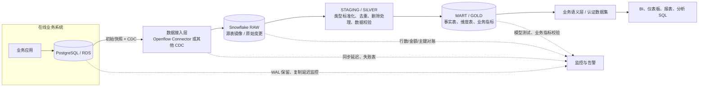
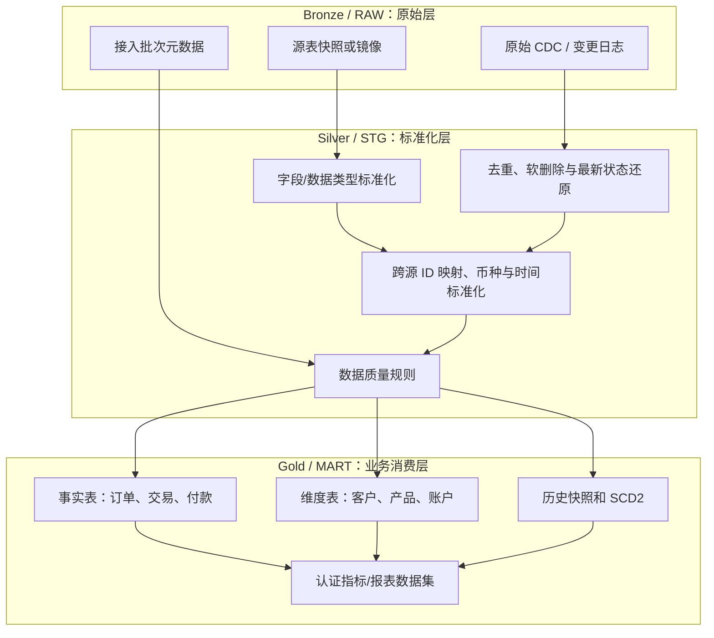

**主题：** 企业保留 PostgreSQL 作为在线业务数据库，将历史数据、分析计算和报表逐步迁移到 Snowflake  
**面向读者：** 有 SQL、关系数据库经验，但刚开始接触 Snowflake 的工程师、架构师、数据分析人员  
**资料检索日期：** 2026-10-09  
**阅读建议：** 先读第 1–6 章确定架构，再按第 7–12 章动手；文末列出了官方文档和企业工程案例。

## 一、先给结论：应该如何搭建

针对大多数已经使用 PostgreSQL 的企业，建议采用以下分工：

- **PostgreSQL：** 继续服务在线交易（OLTP），负责订单、客户、操作记录等业务写入，以及要求低延迟、事务一致性的在线查询。
- **Snowflake：** 负责历史数据、跨系统整合、大范围扫描、复杂聚合、数据集市和 BI 报表（OLAP）。报表不再为了读数据而给生产 PostgreSQL 增加大量负担。
- **数据同步：** 先把历史存量装载到 Snowflake，再用 CDC（Change Data Capture，变更数据捕获）持续同步 INSERT、UPDATE、DELETE。若业务允许小时级或日级延迟，也可以先用批量增量同步，不必一开始就上实时链路。
- **数据建模：** 先落原始层，再清洗标准化，最后建立面向业务的事实表、维度表和报表数据集。BI 不应直接依赖随意复制过来的每张源表。
- **可信度：** 数据同步成功不等于业务口径正确。必须有数据新鲜度、行数/金额对账、主键重复、删除处理、历史口径和权限校验。
- **成本：** Snowflake 的存储与计算分离，查询计算由 Virtual Warehouse（虚拟仓库）承担。开发、数据装载、转换、交互式 BI 应按需隔离资源并设置自动挂起、预算告警。

### 推荐的第一版架构

如果你们已有 PostgreSQL（例如 Amazon RDS for PostgreSQL 或 Aurora PostgreSQL），先评估 Snowflake 原生的 **Openflow Connector for PostgreSQL**。官方文档当前将该 Connector 标记为 Generally Available（GA），支持 PostgreSQL 11 及以上版本，也列出了 AWS RDS 和 Aurora PostgreSQL。它能做初始快照和后续增量复制。



**关键认识：** 不是把 PostgreSQL 全库原样复制一次就结束。正确的目标是建立一条可观察、可重试、可对账、能处理源端变化的分析数据链路。

---

## 二、先理解 PostgreSQL 与 Snowflake 的区别

### 2.1 两者主要解决不同的问题

| 维度         | PostgreSQL（在线数据库）                         | Snowflake（分析数据平台）                                            |
| ------------ | ------------------------------------------------ | -------------------------------------------------------------------- |
| 常见工作     | 创建/更新一笔订单、读取一个客户、事务处理        | 扫描数亿行、按月汇总、跨系统关联、历史趋势分析                       |
| 常见访问模式 | 根据主键/索引读少量行，频繁小事务                | 扫描很多行和列，进行聚合、分组、窗口计算                             |
| 数据写入     | 应用持续写入，重视事务和并发更新                 | 批量装载、持续摄取、分析模型转换                                     |
| 计算资源     | 通常与数据库实例绑定，需小心分析查询影响在线业务 | 存储和计算分离，按工作负载配置虚拟仓库                               |
| 物理优化     | 索引、执行计划、表膨胀、VACUUM、连接数等         | 微分区裁剪、仓库大小、并发队列、缓存、聚类等                         |
| 数据模型     | 适合规范化的业务事务模型                         | 常用事实表、维度表、宽表和面向消费的模型                             |
| 历史数据     | 由应用表、审计表、事件表或归档表决定             | 可以保留原始变更、历史快照、业务有效期和聚合快照，但必须自行定义口径 |

可以把 PostgreSQL 理解为“记录业务正在发生什么”的系统，把 Snowflake 理解为“分析业务发生过什么、为什么发生、趋势如何”的平台。

### 2.2 不要把 Snowflake 当作 PostgreSQL 的远程副本

原样复制有助于接入，但不能直接解决下列问题：

1. 一个客户可能在 CRM、交易系统和账单系统中分别有不同 ID，需要定义如何关联。
2. 源端金额的时区、币种、税额、状态含义不一定统一。
3. 如果某个源表中的记录更新了，报表究竟展示最新状态，还是当时的历史状态？两者都可能是正确需求，但模型不同。
4. BI 用户可能把“客户数”“活跃客户”“净收入”等词理解成不同口径。需要统一业务定义。
5. 同步工具可能将 DELETE 转成软删除标记，或单独发出删除事件。如果模型忽略删除，历史数据就可能错误。

因此，原始表主要服务于可追溯和重建；最终报表应依赖经过测试、有业务定义的数据模型。

### 2.3 Snowflake 的几个基础术语

- **Account：** Snowflake 的账户与管理边界。企业还可能按环境、区域或合规要求拆分账户。
- **Database / Schema / Table：** 逻辑命名层级，例如 `ANALYTICS_DB.MART.FCT_ORDERS`。
- **Virtual Warehouse：** 执行 SQL、装载和转换任务的计算资源。它不是存放数据的数据库实例。
- **Micro-partition（微分区）：** Snowflake 自动组织表数据的内部存储单元，查询通常会根据过滤条件跳过无关分区。
- **Stage：** 用于引用内部或外部文件存储的位置，例如 AWS S3。
- **COPY INTO：** 将文件批量装载到表中的常见 SQL 命令。
- **CDC：** 只传递数据发生的增删改，而不是每次重新扫描整张表。
- **Stream / Task：** Snowflake 的变更跟踪与定时执行能力，可用于构建某些增量流程；它们不是自动替你完成全部业务建模的按钮。
- **dbt：** 常用的数据转换与测试框架，以 SQL 模型和依赖图管理数据模型；不强制必须使用。

---

## 三、先把“历史数据”定义清楚

“把历史数据放入 Snowflake”实际可能指四种不同需求。它们要分别设计，不能只靠一份当前表快照解决。

| 历史类型         | 例子                                             | 应如何保存                                                                     |
| ---------------- | ------------------------------------------------ | ------------------------------------------------------------------------------ |
| **存量历史**     | 过去 5 年的订单、付款、客户记录                  | 第一次全量导入；根据表大小、历史分区和业务保留规则分批装载                     |
| **变更历史**     | 某订单从待付款改为已付款，之后被退款             | 保存 CDC 事件或 journal/change log，并保留操作类型、源端时间、源主键和顺序信息 |
| **业务状态历史** | “截至 2025 年 12 月 31 日，该客户属于哪个等级？” | 通过 SCD Type 2、有效起止日期、每日快照或业务事件来建模                        |
| **汇总快照历史** | 每日资产余额、每月收入、日终持仓                 | 按明确的业务时间和截止规则生成不可随意覆盖的快照，保留口径版本                 |

### 3.1 CDC 日志不是业务历史表

CDC 通常是一串事件：插入一行、更新一行、删除一行。分析表则需要表达某个时点的状态。要从前者还原后者，至少要知道：

- 哪个业务主键代表同一条记录；
- 事件的顺序如何确定；
- DELETE 事件究竟携带全部旧值，还是只有主键；
- 初次快照与后续增量如何衔接；
- 如果事件重复到达，怎样避免重复计数；
- 如果事件延迟或乱序，怎样识别最新状态；
- 如果源表改变了字段类型或主键，如何恢复模型。

Fresha 的工程文章专门讨论了这个问题：其团队从 100 多个 PostgreSQL 数据库捕获变更，进入 Snowflake 后再用 dbt 将 CDC 事件重建为当前表、历史表及用于一致性分析的视图。文章强调，CDC 流本身不是可以直接安全消费的“表”。

参考：[Fresha：Everything Everywhere As Of Once—Rebuilding Postgres Inside Snowflake（2026-06-10）](https://medium.com/fresha-data-engineering/a-cdc-stream-is-not-a-table-rebuilding-postgres-inside-snowflake-one-thousand-times-003767d48a17)

### 3.2 做业务历史时必须选择时间语义

常见的两种时间：

- **事件/生效时间（business valid time）：** 业务上这项状态何时生效。例如客户等级从 7 月 1 日开始变化。
- **系统记录时间（system/ingestion time）：** 数据平台何时收到或处理这次变化。

数据可能在 7 月 1 日生效，但 7 月 3 日才补录。要回答“7 月 2 日时业务实际上是什么状态”与“截至 7 月 2 日系统当时知道什么”，需要不同的查询规则。在财务、风控、监管报表中，不要把两者混为一谈。

例如，SCD Type 2 的客户维度可以有 `valid_from`、`valid_to` 和 `is_current`：

```sql
-- 示例：业务有效期模型，不是 CDC 工具自动生成的固定表结构
SELECT customer_id, customer_tier
FROM ANALYTICS_DB.MART.DIM_CUSTOMER_HISTORY
WHERE valid_from <= '2026-06-30'::DATE
  AND (valid_to > '2026-06-30'::DATE OR valid_to IS NULL);
```

Snowflake Time Travel 主要用于在保留窗口内查询/恢复较早的数据状态；它不应被当作完整的业务审计历史或无限期历史建模方案。需要长期历史时，应设计独立的历史表、事件表或快照表，并验证对应的留存政策。

---

## 四、如何把 PostgreSQL 数据同步到 Snowflake

先根据需要的新鲜度选择复杂度。不是所有报表都需要秒级同步。

### 4.1 方案选择表

| 方案                                            | 适合场景                                                              | 优点                                                             | 需要承担的工作/风险                                                                              | 建议                               |
| ----------------------------------------------- | --------------------------------------------------------------------- | ---------------------------------------------------------------- | ------------------------------------------------------------------------------------------------ | ---------------------------------- |
| **Snowflake Openflow Connector for PostgreSQL** | 需要持续增量复制，想减少自建 CDC 基础设施；已有 RDS/Aurora PostgreSQL | 官方 Connector，支持初次快照 + 增量复制，管理面与 Snowflake 集成 | 需配置逻辑复制、网络/凭证、复制键；需理解软删除、journal、类型和 DDL 限制；监控源端 WAL 与失败表 | **优先做概念验证的选项**           |
| **批量导出到 S3 + Snowflake COPY INTO**         | 每日/每小时更新即可；历史批量导入；需要透明、低复杂度管道             | 简单、可复用文件、易做重跑和审计，常适合大批量数据               | 自己设计增量水位、删除传播、幂等、文件清理和调度                                                 | **低频分析的良好起点**             |
| **Debezium + Kafka + S3 + Snowflake**           | 高数据量、多下游、希望保留开放格式事件湖、需要可控 CDC 管线           | 灵活，能保留原始变更事件，可供 Spark 等其他引擎复用              | 运维组件多；Schema Registry、Kafka、S3 文件整理、重复/顺序/重放、CDC 重建都需要工程能力          | 规模或平台复用有明确要求时使用     |
| **Fivetran、Airbyte 等托管/第三方 ELT**         | 希望快速接入多种数据源、团队不想维护 CDC 组件                         | 上手快、连接器生态较丰富、减少自建运维                           | 许可成本、连接器行为和限制、数据驻留/安全评估、故障排查透明度                                    | 需要按真实数据量/频率报价并做 PoC  |
| **Snowflake Postgres Data Mirroring**           | 具体源端和环境满足该功能当前要求                                      | 原生镜像模式可减少传统 CDC 中间件环节                            | 不要假定它兼容所有现有的 PostgreSQL/RDS；需核验源端扩展、权限、版本、区域和部署支持              | **先确认资格，不作为通用默认方案** |

**重要澄清：AWS DMS 不应简单地描述成“把 PostgreSQL 直接复制到 Snowflake”。** 当前 AWS DMS 的官方目标端列表没有将 Snowflake 列为普通直接目标端。AWS DMS 可以把数据送到 S3 等受支持的目标，再由 Snowflake 从 S3 装载；使用前要按具体 DMS 功能及目标端支持矩阵核实。

### 4.2 默认建议：先评估 Openflow，再按需求决定是否自建

Snowflake 官方 Openflow PostgreSQL Connector 文档说明，它可复制选定 PostgreSQL 表的全量快照和后续增量变化，使用逻辑复制读取 PostgreSQL 的 WAL。

一个概念流程是：

1. DBA 在 PostgreSQL 端配置逻辑复制参数，创建 publication，并为 connector 建立具备 `REPLICATION` 属性和所需 `SELECT` 权限的账号。
2. 为 connector 提供网络连通性、TLS/凭证和 Snowflake 目标数据库/仓库等设置。
3. connector 检查表结构与数据类型，执行初始快照，再持续消费增量变更。
4. 数据进入 Snowflake 复制目标表和 journal 表；分析团队在下游建立自己的 `RAW`、`STG`、`MART` 模型。
5. 监控复制延迟、失败表、错误行、源端 WAL 留存和 Snowflake 侧仓库用量。

官方资料：

- [Openflow PostgreSQL Connector 概览与限制](https://docs.snowflake.com/en/user-guide/data-integration/openflow/connectors/postgres/about)
- [Connector 配置步骤](https://docs.snowflake.com/en/user-guide/data-integration/openflow/connectors/postgres/setup)
- [PostgreSQL 到 Snowflake CDC 快速入门](https://www.snowflake.com/en/developers/guides/getting-started-with-openflow-postgresql-cdc/)

### 4.3 Openflow 方案的几个重要限制

不要只读成功路径，还要在 PoC 中特意测试：

- **主键/复制键：** 默认依赖主键或符合条件的唯一键；缺少可用 identity key 的表可能只能同步 INSERT，UPDATE 和 DELETE 无法可靠应用。
- **DELETE 语义：** 目标表中的删除默认通过 `_SNOWFLAKE_DELETED = TRUE` 软删除表示。查询当前状态时，必须过滤软删除记录；需要历史时再按治理政策保留或清理。
- **TRUNCATE：** 当前 Connector 文档说明，源端 `TRUNCATE` 不会转换为目标端删除，可能被忽略。如果业务会清空/重建源表，需专门设计处理方案。
- **新增字段：** 新字段可能会被加入目标表，但旧数据不会自动获得过去的字段值，既有行对应新列可能为 `NULL`。
- **字段类型变化：** 某些不兼容类型变化、精度/小数位变化、字符长度变化可能令复制停止，需要恢复流程。
- **大字段与类型映射：** PostgreSQL 的 `JSONB`、`BYTEA`、`NUMERIC`、时区时间戳等需要检查类型映射、大小限制和精度；不要只用小样本验证。
- **Journal 表：** 其保留可能带来存储增长；不要在复制运行中随意删除正在使用的 journal，清理需要明确生命周期和恢复规则。
- **没有初始快照就开增量：** 官方文档指出，某些既有行后续变化可能在 `VARCHAR`、`VARIANT`、`BINARY`、`ARRAY` 等列出现缺失值。除非你能证明已存在的目标数据完整且与源端匹配，否则不要把“不做快照的增量复制”当作普通重启方式。

这些限制并不是说 Connector 不好，而是提醒你：复制工具的正确性有前提。最容易出问题的往往不是第一次 `INSERT`，而是多年积累后的 schema change、DELETE、主键变更、历史回填和异常恢复。

### 4.4 如果使用 S3 文件作为边界

一种可控的批量方案如下：

1. 从 PostgreSQL 生成历史快照/增量文件，推荐选择 Parquet 等适合分析的列式格式；文件保存到与 Snowflake 区域和网络设计相匹配的 S3 路径。
2. 每个批次生成 manifest 或控制记录，包括批次 ID、表名、提取开始/结束时间、源端水位、文件数量、行数和校验摘要。
3. Snowflake 通过 external stage 和 `COPY INTO` 读取文件，原始批次保留在接入层。
4. 只有批次验证通过后才推进已处理水位；重跑相同批次不能产生重复业务记录。
5. 对更新/删除，不要只按 `updated_at > last_run_time` 简单查询，除非能证明这个字段不会漏更新/删除、没有并发水位问题且历史重跑可控。更可靠的方案是 CDC 或带重叠窗口 + 幂等合并 + 定期对账。

批量方案非常适合先迁移“几十张报表表、每日更新”的第一阶段；以后新鲜度需求提高，再对重点数据源改用 CDC。不要为了一个每天凌晨更新的报表，从第一天就运维 Kafka 集群。

---

## 五、Snowflake 内部如何组织数据

推荐先采用清晰、可理解的三层模型。Bronze/Silver/Gold 是一种常见的组织方式，不是 Snowflake 强制要求的产品功能。



### 5.1 每层负责什么

**RAW / Bronze：保留可追溯的源数据。** 尽量少做不可逆转换，明确源系统、表、装载批次/时间、CDC 元数据。不要让业务报表随意读取原始变更流。

**STG / Silver：解决技术复杂性。** 统一命名、类型、时区，解析 JSON，去重，剔除或标识软删除行，处理迟到事件和源端 schema 变化。此层的目标是稳定、可复用的标准化实体。

**MART / Gold：表达业务问题。** 用事实表、维度表、宽表或汇总表服务具体用例。明确粒度，例如“一行是一笔订单”“一行是一个客户的一次每日快照”。如果粒度不清，后续 join 很容易把金额重复计算。

**语义层/认证数据集：统一业务含义。** 对“净收入”“活跃客户”“有效交易”等指标定义公式、时间范围、过滤规则、所有者与版本。报表可以不同，但业务核心指标不能各自暗中定义。

### 5.2 一个简单的数据模型例子

假设业务库中有 `orders`、`order_items`、`customers`：

- `FCT_ORDER`：一行代表一笔订单，保存订单日期、客户键、状态、金额、币种等。
- `FCT_ORDER_ITEM`：一行代表一个订单明细。
- `DIM_CUSTOMER`：一行代表当前客户属性。
- `DIM_CUSTOMER_HISTORY`：一行代表客户某段业务有效期内的状态，用于历史还原。
- `FCT_DAILY_REVENUE`：一行代表某日期、产品/业务单元/币种组合的日汇总，按确认过的收入口径生成。

不要在没有明确粒度的情况下把订单头和订单明细直接关联后求和；一笔订单有多条明细时，订单头金额会被重复累加。这不是 Snowflake 特有的问题，但在大规模分析数据中会更隐蔽、影响更大。

### 5.3 dbt 是否必须

不是必须，但如果模型数量会增长，dbt 或同类 SQL 转换框架通常值得考虑。它把 SQL 转换、依赖图、测试、文档和 CI/CD 放在同一个工作流里。简单的 3 张表也可以从 SQL、Snowflake Tasks 和版本控制开始，不要为工具而工具。

建议为关键模型至少定义：

- 主键/业务键唯一性；
- 关键字段非空；
- 枚举状态在允许范围；
- 事实表与维度表关联有效；
- 金额、余额、数量满足业务约束；
- 源数据新鲜度；
- 关键行数和金额合计与源系统对账。

Snowflake 的 [dbt Projects 最佳实践](https://docs.snowflake.com/en/user-guide/data-engineering/dbt-projects-on-snowflake-best-practices) 特别建议：大型且频繁变化的表考虑 incremental model；小型低频表继续使用简单的全量模型；将测试纳入 CI/CD；生产执行使用独立、范围最小的服务账号和角色。

---

## 六、历史迁移如何安全落地

不要一次性把全部生产数据库、全部报表、全部历史规则同时切换。建议分为四阶段。

### 阶段 A：盘点并定范围

先整理一张表清单：

| 维度     | 需要回答的问题                                             |
| -------- | ---------------------------------------------------------- |
| 用途     | 此表支撑哪个报表、流程或监管要求？有没有实际使用？         |
| 规模     | 行数、总容量、年增长、日变化量、最大单行字段大小是多少？   |
| 更新方式 | 只追加、频繁 UPDATE、硬 DELETE、TRUNCATE，还是整表重建？   |
| 主键     | 是否有稳定主键？是单列还是复合键？主键会不会被更新？       |
| 历史要求 | 只需当前状态、需要每次变更、还是要复原某个业务日期的状态？ |
| 新鲜度   | 实时、几分钟、小时级，还是隔夜足够？                       |
| 敏感度   | 是否包含 PII、账户数据、财务数据、受限业务信息？           |
| 消费方式 | BI 仪表盘、数据导出、分析 SQL、机器学习、运营系统？        |

第一批建议选 **2–5 张有代表性但可控的表**：一张只追加事件表、一张高更新表、一张有 DELETE 的业务表，再配一张报表。这样才能暴露真正的复杂性，而不是只证明“能连上”。

### 阶段 B：全量存量装载

典型步骤：

1. 固定本次迁移的表范围和字段映射，先处理不兼容类型与缺少主键的问题。
2. 记录快照时间/LSN 或同步工具能提供的等价起点，明确快照与增量之间如何衔接。
3. 大表分片或分区导出，避免单条长查询无限期占用源库资源；观察生产库 CPU、IO、连接数和复制延迟。
4. 导入 Snowflake RAW 层，记录每张表的行数、最大时间戳、最小/最大主键、关键金额汇总等基线。
5. 检查数据类型精度、时区、NULL、JSON/大字段和编码问题。金额等精确数值不要随意转成浮点数。
6. 在 CDC 启动后验证快照起点和增量没有缺口、没有重复。

不要直接用 `COUNT(*)` 相同就判断迁移成功：相同的总行数仍可能包含一边漏掉一行、另一边重复一行的情况。要对关键主键集合、时间范围和业务汇总进行多层校验。

### 阶段 C：双跑与对账

在报表真正切换之前，让旧报表和 Snowflake 报表并行运行一段业务周期。对账项目至少包括：

- 当前数据延迟，例如源端最新提交到 Snowflake 可查询的时间差；
- 关键表行数和不同业务状态分布；
- 每日订单数、交易笔数、金额/净额等业务总计；
- 关键主键缺失、重复和孤儿外键；
- 对历史日期抽样回算，验证状态变化和 DELETE 逻辑；
- 边界情况：跨午夜、时区切换、迟到事件、重复消息、退款/冲正、源表 DDL。

对差异分类：同步延迟、数据缺失、重复、业务规则不一致、历史定义不同、旧报表 bug。不要为追求数字相等而直接把结果“调到相同”；必须先定义哪个系统和哪个规则才是正确的。

### 阶段 D：按报表逐个切换

- 对业务用户公布新旧口径及已知差异；
- 一个报表/业务域完成验收后再切换，保留回滚路径；
- 设置 Snowflake 角色为只读消费权限，避免 BI 用户直接修改原始层；
- 在稳定期继续观察数据延迟、任务成功率、报表 P95 延迟和成本；
- 只有经过业务确认后，才减少旧 PostgreSQL 上相关的分析查询和临时汇总表。

---

## 七、Snowflake 性能与成本：哪些设置真正重要

### 7.1 Virtual Warehouse：按工作负载隔离

建议第一版至少考虑以下职责分离，是否拆成多个仓库由实际负载与成本决定：

| Warehouse       | 用途                         | 主要关注点                                 |
| --------------- | ---------------------------- | ------------------------------------------ |
| `INGEST_WH`     | 文件装载、数据摄取相关 SQL   | 完成时间、持续运行时间、吞吐、是否长期空转 |
| `TRANSFORM_WH`  | dbt、清洗、MERGE、事实表构建 | 扫描量、转换时长、峰值资源、队列           |
| `BI_WH`         | 仪表盘和交互式分析           | 并发、排队、P95 查询时延、用户体验         |
| `DS_WH`（可选） | 临时探索/数据科学            | 隔离临时大查询，避免影响已承诺的报表 SLA   |

为什么隔离？如果一个很重的历史回填与月底 BI 报表抢同一个计算资源，二者可能互相拖累。分仓可以隔离负载，也让费用归属清楚；但仓库拆得太多，可能引入不必要的管理复杂性，因此要根据并发和 SLA 验证。

从 XS/S 等较小规格开始，使用实际数据测试，而不是一开始就选大仓库。Snowflake 的成本与性能优化实践强调：应把查询完成时间、排队、数据量、复杂度、并发与 SLA 一起考虑，并用 `QUERY_HISTORY`、`WAREHOUSE_METERING_HISTORY`、`WAREHOUSE_LOAD_HISTORY` 等数据验证调整效果。

### 7.2 自动挂起和自动恢复

为非持续工作负载启用自动挂起/恢复，减少空闲时的计算消耗。示例：

```sql
CREATE WAREHOUSE IF NOT EXISTS BI_WH
  WAREHOUSE_SIZE = 'XSMALL'
  AUTO_SUSPEND = 60
  AUTO_RESUME = TRUE
  INITIALLY_SUSPENDED = TRUE;
```

这只是起步值，并不代表所有业务都应该设为 60 秒。太短可能增加频繁唤醒和用户感知延迟；太长则增加空闲成本。实际需要结合报表频率、查询时延目标和缓存行为测量。

### 7.3 并发高与单条查询慢是两类问题

- **许多查询排队：** 看仓库负载与队列；考虑独立仓库、调整并发策略或 multi-cluster warehouse 横向扩展。
- **单条查询扫描太多：** 看 Query Profile、过滤条件、Join、扫描的微分区；先减少无关数据读取、简化模型和 SQL，再考虑仓库规格。
- **更新/MERGE 很慢：** 检查一次更新涉及的目标表范围、更新分布、目标数据规模以及是否需要每分钟做全表级合并。频繁更新一个超大表，可能比追加事件更昂贵。
- **低选择性过滤造成全表扫描：** 结合真实查询评估聚类键、Search Optimization 或物化视图。它们并非免费；会增加维护计算和/或存储成本，不应为了“看起来优化了”就默认全开。

官方存储优化文档特别指出，Automatic Clustering、Search Optimization 和 Materialized Views 存在额外维护/存储成本；对本来就能在约一秒完成的查询，这些优化通常没有显著收益。先定位查询问题，再做针对性优化。

### 7.4 用真实案例理解大表更新成本

RevenueCat 的工程文章是一条非常有用的经验：它描述了一个约 150 亿行的 `users` 表，每日处理约 3500 万次变更。频繁地合并变更，在其测试中可能一次需要数小时，摄取仓库长时间运行，账单难以接受。团队改为小型快速摄取层、日常合并物化表，并通过低延迟视图让查询看到最近未合并的变化。文章报告称，更新可见延迟由 2–3 小时降至潜在几分钟，相关费用降低约 75%。

这不是建议每家企业照搬“每天合并一次”。它说明：**数据新鲜度 SLA 要按消费者的真实需求设计**。如果报表每 1–4 小时才跑一次，频繁将超大表物化合并到秒级可能毫无业务价值；但如果业务确实要求低延迟，就应在设计之初测量事件读取、合并、查询三种成本，而非只盯着仓库变大后查询是否变快。

来源：[RevenueCat 生产工程实践](https://www.revenuecat.com/blog/engineering/data-ingestion-snowflake)

### 7.5 账单治理的最低配置

至少建立以下机制：

1. 为仓库设置合理的 `AUTO_SUSPEND` / `AUTO_RESUME`；
2. 按环境、团队或业务域使用清晰的 Warehouse 命名；
3. 设置 Resource Monitor 或等效的预算告警；
4. 每周/每月审查仓库耗时、计算用量、队列和异常查询；
5. 给重跑、回填和全量重算设定执行窗口与预估成本；
6. 不要把测试环境长期保持在生产同等计算规模；
7. 对高频变化的大表，评估 CDC 更新合并、聚类维护和物化视图的综合成本；
8. 为每个关键报表定义“性能预算”，而不只是问“还能不能更快”。

官方参考：[Snowflake 成本优化指南](https://www.snowflake.com/en/developers/guides/cost-optimization/)、[Warehouse considerations](https://docs.snowflake.cn/en/user-guide/warehouses-considerations)、[Storage optimization](https://docs.snowflake.com/en/user-guide/performance-query-storage)。

---

## 八、一个可以动手的 Snowflake 入门骨架

下面是概念性 SQL，用来理解对象关系。需要根据你们账户的角色授权、环境命名和实际 Connector 部署方式调整。生产环境不要直接把日常账号设成 `ACCOUNTADMIN`。

### 8.1 创建数据库、Schema、仓库和基础角色

```sql
-- 一般由平台管理员或受控的数据库部署流程执行
CREATE DATABASE IF NOT EXISTS ENTERPRISE_ANALYTICS;

CREATE SCHEMA IF NOT EXISTS ENTERPRISE_ANALYTICS.RAW;
CREATE SCHEMA IF NOT EXISTS ENTERPRISE_ANALYTICS.STG;
CREATE SCHEMA IF NOT EXISTS ENTERPRISE_ANALYTICS.MART;

CREATE WAREHOUSE IF NOT EXISTS TRANSFORM_WH
  WAREHOUSE_SIZE = 'XSMALL'
  AUTO_SUSPEND = 60
  AUTO_RESUME = TRUE
  INITIALLY_SUSPENDED = TRUE;

CREATE WAREHOUSE IF NOT EXISTS BI_WH
  WAREHOUSE_SIZE = 'XSMALL'
  AUTO_SUSPEND = 60
  AUTO_RESUME = TRUE
  INITIALLY_SUSPENDED = TRUE;
```

角色设计至少区分：

- 摄取服务角色：只写入其负责的 RAW 数据域；
- 转换服务角色：读 RAW/STG、写 STG/MART；
- BI 角色：只读认证数据集；
- 数据工程师角色：在开发环境建模与调试；
- 平台管理员角色：管理账户、集成和授权，人数尽可能少。

具体授权应遵循最小权限原则；Snowflake 的 `GRANT` 体系值得先单独练习，不要为方便给报表工具整个数据库的所有权限。

### 8.2 文件批量导入的概念示例

实际使用前需要先建立并授权 stage，配置存储集成，并保证文件结构/格式与目标表兼容。假设 `orders_2026_10_08.parquet` 已位于可访问的 S3 外部 stage：

```sql
-- 示意：对象名称和文件路径均需换成实际值
COPY INTO ENTERPRISE_ANALYTICS.RAW.ORDERS
FROM @MY_S3_STAGE/orders/2026/10/08/
FILE_FORMAT = (TYPE = PARQUET)
MATCH_BY_COLUMN_NAME = CASE_INSENSITIVE;
```

生产装载还应记录每次 COPY 的结果、失败行/文件、批次状态和源端水位。不要依赖人工从控制台看一眼“加载成功”作为唯一证据。

### 8.3 查询 Openflow 镜像表时注意软删除

对 Openflow PostgreSQL Connector 创建的目标表，当前记录查询通常需要过滤软删除标记：

```sql
SELECT order_id, customer_id, status, amount, updated_at
FROM ENTERPRISE_ANALYTICS.RAW.ORDERS
WHERE _SNOWFLAKE_DELETED = FALSE;
```

请在部署时先验证实际表结构及元数据列；如果数据源通过其他 CDC 工具进入，删除标记和列名未必相同。最终业务模型应把该规则封装起来，不要要求每个 BI 用户自己记住它。

### 8.4 CDC 流重建表的伪代码示例

以下 SQL 只是说明常见思路，字段名依赖具体 connector。假设原始 CDC 表有 `order_id`、`op`、`event_ts`、`source_offset`、`payload`：

```sql
-- 示意：先选择每个业务主键的最新事件
WITH ranked AS (
  SELECT
    order_id,
    op,
    event_ts,
    source_offset,
    payload,
    ROW_NUMBER() OVER (
      PARTITION BY order_id
      ORDER BY event_ts DESC, source_offset DESC
    ) AS rn
  FROM ENTERPRISE_ANALYTICS.RAW.ORDER_CDC
)
SELECT *
FROM ranked
WHERE rn = 1
  AND op <> 'DELETE';
```

这个例子并不完整：真实系统还需要保证 `event_ts` 和 offset 能组成稳定顺序；处理初始快照；明确 DELETE 是否保留 tombstone；考虑主键更改、事务边界和乱序事件。对于金额、监管和审计场景，应优先采用有测试的成熟重建模型，而不是直接复用这段示意 SQL。

---

## 九、企业治理、安全与业务语义

### 9.1 权限边界

推荐把数据访问拆成几个层面：

- **摄取权限：** connector 可以读取允许同步的源表，不应拥有不必要的业务写权限。
- **原始层权限：** 原始数据访问限于数据平台及获批的工程角色，尤其是包含客户个人信息的表。
- **模型写权限：** 只允许指定服务角色写入生产 STG/MART。
- **BI 读取权限：** 给 BI 工具和分析师只读访问认证的数据集；必要时通过 secure view、row access policy、masking policy 限制行和列。
- **开发与生产分离：** 开发人员在隔离的开发 schema/环境验证模型，不应直接修改生产表或清理 CDC journal。

密码与连接信息使用受控 Secret/集成管理；限定网络来源；记录对象授权、数据访问和关键任务执行。具体控制应与企业既有 Data Entitlement、合规分类与审计流程一致。

### 9.2 业务定义不要散落在各个报表里

为核心指标建立最小的“指标目录”：

| 字段     | 示例                                   |
| -------- | -------------------------------------- |
| 指标名称 | 净收入                                 |
| 业务定义 | 已确认收入扣除退款与冲正，排除测试交易 |
| 粒度     | 业务日期 × 币种 × 产品                 |
| 时间口径 | 按交易生效日还是入账日                 |
| 来源     | 哪些源表及字段                         |
| 计算逻辑 | 对应 SQL/dbt 模型的版本控制路径        |
| 刷新 SLA | 每小时、每日或其他                     |
| 责任人   | 可解释定义并批准变更的业务所有者       |
| 校验方法 | 对账报表、阈值、历史差异处理方式       |

“把 SQL 搬到 Snowflake”通常不是最难的事情，真正长期消耗时间的是不同部门对于相同术语的定义不同。把定义、粒度、时间语义和责任人纳入模型与发布流程，才能避免新旧报表各算各的。

---

## 十、生产运维：要监控什么，出问题怎么查

### 10.1 最小监控面板

| 区域            | 指标/检查                                                           | 为什么需要                                        |
| --------------- | ------------------------------------------------------------------- | ------------------------------------------------- |
| PostgreSQL 源端 | replication slot 状态、WAL 保留量/磁盘、长事务、数据库 CPU/IO       | CDC 消费不动时，旧 WAL 可能持续保留并消耗源端磁盘 |
| Connector       | 最后成功时间、复制延迟、失败表/失败行、重试次数、schema change 状态 | 整条管线“还运行着”不代表每张表都成功              |
| RAW 数据        | 每批行数、主键重复、最大源端事件时间、删除事件数、文件积压          | 提前发现漏数、重复、删除没有落地或数据变陈旧      |
| 模型任务        | 成功率、耗时、依赖失败、最近完整刷新时间、测试失败                  | 防止 RAW 正常但 MART 没有更新                     |
| BI/查询         | P50/P95 时延、失败率、排队、扫描量、最常见慢查询                    | 用真实用户体验指导计算资源优化                    |
| 成本            | 各 Warehouse 用量、长期运行、异常峰值、每个业务域/任务归属          | 识别意外回填、频繁合并和空闲仓库                  |

### 10.2 PostgreSQL replication slot/WAL 是不能忽视的源端风险

CDC 通常依赖 PostgreSQL WAL。复制槽未及时前进时，PostgreSQL 为保证下游还能读取变化，可能保留本可回收的 WAL 文件，导致磁盘持续增长。因此必须有源端磁盘阈值、复制槽进度与连接器健康的告警，也要有“暂停 CDC / 删除槽位 / 重建同步”的批准流程。不能在出现磁盘压力后简单删除复制槽而不评估数据缺口。

Snowflake 官方 Connector 配置文档明确要求给源端 WAL 预留足够磁盘，并指出 replication slot 会保留尚未被 connector 确认推进位置之前的 WAL。

### 10.3 建议先准备四种故障手册

**A. 数据延迟突然上升**

1. 确定是所有表还是单表；
2. 查看源端长事务、WAL/slot 进度和磁盘；
3. 查看网络、Connector runtime 与失败日志；
4. 判断是源端产生变更速度超过消费能力，还是 Snowflake 侧处理/合并堆积；
5. 恢复后做水位与关键业务汇总对账。

**B. Snowflake 数据比 PostgreSQL 少**

1. 对比数据范围与快照起点；
2. 查看失败表、失败行、主键和 schema change；
3. 检查是否发生源表 `TRUNCATE`、主键变更或软删除过滤错误；
4. 找出缺失主键集合，而不只比较总行数；
5. 按工具支持的方式重放、重新快照或修复目标模型。

**C. 报表金额和旧系统不一致**

1. 锁定同一业务截止时间、币种、状态过滤规则和时区；
2. 确认订单头与订单明细是否重复计数；
3. 检查迟到事件、退款/冲正、删除、精度和舍入；
4. 逐层比较 RAW、STG、MART，定位首次发生差异的层；
5. 由业务所有者确认正确口径，再修改模型并留版本记录。

**D. Snowflake 账单异常**

1. 按 Warehouse 和时间段核对使用量；
2. 找出持续运行、频繁唤醒、长期排队和全量重算；
3. 检查是否因为频繁 MERGE 大表或自动聚类维护导致计算持续；
4. 暂停可安全暂停的非关键回填，经评估后重调仓库/作业频率；
5. 在修复后复核数据新鲜度和报表 SLA 没有被悄悄破坏。

---

## 十一、企业实战案例：能学什么，不能照搬什么

### 案例 1：RevenueCat——CDC 不只要快，还要能经济地合并

**背景：** Aurora PostgreSQL 为生产库；Debezium 捕获 WAL 变更，经 Kafka、Avro 和 S3 文件进入 Snowflake，dbt 负责层间转换，Airflow 主要编排 dbt。

**遇到的问题：** 早期商业同步方案对 PostgreSQL TOAST 大字段处理、Schema Evolution 和不一致排查有困难。后来自建的管线也遇到另一类问题：几十亿行的大表如果高频 MERGE，更新耗时会很长且成本高。

**做法：** 通过 S3 保留变更文件；利用 Snowflake external table/stream 追踪新文件；小型摄取表快速吸收变更；大型物化表降低合并频率，再用低延迟视图叠加尚未合并的少量近期变化。团队为 100 多张表构建了配置和生成工具，以避免手工维护大量相似 SQL 和任务。

**文章报告的结果：** 对其特定工作负载，延迟从约 2–3 小时降低到潜在的几分钟，成本下降约 75%。

**可复用经验：**

- 大规模 CDC 的难点可能不是“把数据读出来”，而是“怎样在分析层经济地应用更新”。
- 保留原始变更数据有助于调查和重建。
- 不需要每分钟物化所有超大表；摄取频率、合并频率与查询新鲜度应分别设计。
- 100 张表以后，配置驱动和自动化能显著减少重复工程工作。

**不能直接照搬：** 其管线组件较多，适合规模与开放数据湖有明确价值的团队。中小规模第一阶段不一定需要 Kafka、Schema Registry、S3、external table、stream、task 全部自建。

来源：[RevenueCat 工程博客（2024-04-15，后于 2024-06 更新）](https://www.revenuecat.com/blog/engineering/data-ingestion-snowflake)

### 案例 2：Fresha——把 CDC 正确还原成当前表与一致的分析视图

**背景：** Fresha 的数据工程团队描述了从 100 多个 operational PostgreSQL 数据库读取 CDC，经 Debezium、Kafka、Snowpipe 进入 Snowflake，再使用 dbt 构建模型的流程。

**重点问题：** PostgreSQL 默认 `REPLICA IDENTITY` 下，DELETE 事件可能仅有主键，不能假设它总携带整行旧值。直接对所有事件做“按主键取最后一条”的逻辑，可能把删除后的空 tombstone 当成一行有效记录。另一个问题是分析任务需要源数据处于一致版本，不只是查询时拿到“最新的某一部分数据”。

**可复用经验：**

- 把原始事件、物化当前状态、删除标识与最终查询视图分开；
- 使用事件时间和可稳定排序的 Kafka offset/源端位置处理同一主键的事件顺序；
- 对 CDC 数据设置可复现的批次/时间边界，保证一次分析运行中的上游数据版本一致；
- 对不同 `REPLICA IDENTITY` 行为分别处理，不能假设所有表的 DELETE payload 一样。

**不能直接照搬：** 其文中很多细节服务于多租户大规模平台。一般企业可以先把同样的语义要求写进测试和模型，不一定需要复制整套三层删除结构。

来源：[Fresha Data Engineering（2026-06-10）](https://medium.com/fresha-data-engineering/a-cdc-stream-is-not-a-table-rebuilding-postgres-inside-snowflake-one-thousand-times-003767d48a17)

### 案例 3：AdTech 数据平台——把分析型 PostgreSQL 工作负载迁往 Snowflake

Klika 发布了一篇客户案例：一家多租户广告收入分析产品原先用 PostgreSQL 存储与处理报表数据，数据量超过 2 TB，每日从大量连接器接入数十 GB 数据。报告指出，复杂报表有时运行数小时；平台使用预计算 totals table、请求时 schema introspection 和 CSV 导出等补丁维持性能。团队把分析与报告层迁到 Snowflake，同时保留 PostgreSQL 管理账户、用户、作业等运营元数据。

案例描述的目标架构把交互/API 查询与每日摄取、报表高峰分到不同 warehouse；历史数据经分块导出到对象存储，再并行装载到 Snowflake；报表结果直接写入 Snowflake，并给用户编写的报表 SQL 使用只读角色。案例报告重型报表从小时级降到分钟级，某些几百 GB 的数据压缩到几 GB；这是案例提供方的客户结果，应将其视为特定工作负载实例，而非对任何企业的性能保证。

**可复用经验：**

- 只迁移分析型工作负载，保留 PostgreSQL 的事务型元数据和在线操作。
- 后台摄取和交互式报告分离，避免重任务影响用户响应。
- 搬迁时同时清理旧系统中积累的预聚合、重复导出、请求时 schema 查询等复杂度。
- 应用程序迁移也需要调整数据库方言、连接池、事务假设和 ORM 行为；不能认为换了 JDBC/连接字符串就必然完成迁移。

来源：[Klika 客户案例](https://www.klika.us/case-studies/from-a-row-store-bottleneck-to-an-elastic-consolidated-analytics-platform)。这是咨询/交付方发布的案例，公开信息未提供独立审计，具体数字需要谨慎看待。

### 从案例中总结出的共性

1. PostgreSQL 和 Snowflake 分工是有价值的，但不是“所有数据都复制过去、所有 SQL 原封不动执行”。
2. 数据新鲜度是产品需求与成本决策，不是越实时越好。
3. CDC 的删除、顺序、源端字段演进和数据版本一致性需要明确设计。
4. 大表频繁更新/MERGE 应在 PoC 中用真实规模与分布测试；不要只用 1 万行 demo 测速度。
5. 先做可观测性和对账，再扩大接入规模；能解释差异的系统才是生产系统。

---

## 十二、推荐的 30/60/90 天路线

### 第 1–30 天：验证最小闭环

- 盘点 PostgreSQL 表、报表和历史保留要求；
- 选一组 2–5 张代表表；
- 评估 Openflow Connector、批量 S3 或托管工具，做小规模 PoC；
- 建立 Snowflake 的 RAW/STG/MART Schema、角色和仓库；
- 完成首次快照、CDC 或批量增量；
- 验证插入、更新、删除、源表加列、类型变化、重复和重试；
- 做行数、主键集合、金额汇总对账；
- 给出每个测试报表允许的数据延迟与查询 SLA。

**第 30 天的交付物：** 可重复执行的数据管道、一份真实对账结果、一张成本/延迟基线表，以及未通过测试的问题清单。

### 第 31–60 天：建立可复用的业务模型

- 挑选一个业务域，比如订单/付款或客户/账户；
- 建立标准化 STG 模型与第一批 MART 事实表/维度表；
- 为核心模型增加数据质量测试；
- 定义关键指标、时间语义和业务所有人；
- 做新旧报表双跑与业务验收；
- 加上端到端延迟、失败表、对账差异、仓库成本告警；
- 通过代码评审/CI/CD 发布模型，区分开发和生产权限。

**第 60 天的交付物：** 一个业务域有可被 BI 消费、经过业务确认的数据集和报表；出现数据差异时可定位到源表、接入层或模型层。

### 第 61–90 天：扩规模、控成本、形成运维机制

- 按收益和风险逐步加入其他报表/表；
- 根据负载决定哪些采用 CDC，哪些保留批量；
- 对高更新的大表单独测算合并频率与成本；
- 评估交互式查询和后台转换是否需要独立仓库；
- 形成每周账单/性能巡检、每月数据质量复核和变更发布制度；
- 文档化故障恢复、重放、重快照和回滚流程；
- 删除或降载旧系统中已被正式迁移取代的重报表查询，但不要过早删除必要的审计/回滚数据。

**第 90 天的目标：** 让“历史数据迁入 Snowflake”成为有所有者、有成本归属、有质量标准、有恢复流程的长期平台，而不只是一个 ETL 脚本。

---

## 十三、落地检查清单

上线前逐项确认：

### 数据接入

- [ ] 已明确每张表的主键或复制键；
- [ ] 初始快照和 CDC 衔接方案经过验证；
- [ ] INSERT、UPDATE、DELETE 均有测试；
- [ ] 已测试 `TRUNCATE`、主键变更和 schema evolution；
- [ ] 已确认日期/时区/数值精度/JSON/大字段映射；
- [ ] PostgreSQL replication slot、WAL 和磁盘有监控与告警；
- [ ] 连接器的失败表、失败行和重试行为有 runbook；
- [ ] 每次装载都有可追溯的批次或水位信息。

### 数据建模与质量

- [ ] 已明确事实表粒度；
- [ ] 当前状态、CDC 变化历史、业务有效历史与日/月快照已经区分；
- [ ] 删除记录不会被错误地当成有效行；
- [ ] 关键主键唯一性、非空、关系、金额汇总和新鲜度有测试；
- [ ] 关键报表经过双跑和业务所有者验收；
- [ ] 指标定义、时间口径、数据源和责任人有文档。

### 性能、成本与安全

- [ ] 摄取、转换和 BI 的负载是否需要隔离已经评估；
- [ ] 非持续工作负载有自动挂起/恢复；
- [ ] 有查询时延、排队和仓库成本观察方式；
- [ ] Resource Monitor 或等价成本告警已经配置；
- [ ] 原始敏感数据有访问控制、masking/row access 等相应策略；
- [ ] 服务账号使用最小权限，生产发布可追踪；
- [ ] 已演练数据延迟、漏数、金额差异和账单异常的处理过程。

---

## 十四、下一步应读的官方文档

建议按以下顺序阅读，避免一开始就掉进高级性能调优细节。

1. **PostgreSQL Connector 概览：** [About Openflow Connector for PostgreSQL](https://docs.snowflake.com/en/user-guide/data-integration/openflow/connectors/postgres/about) — 重点看复制流程、支持版本、复制键、删除、journal 和 schema 变化。
2. **Connector 配置：** [Set up the Openflow Connector for PostgreSQL](https://docs.snowflake.com/en/user-guide/data-integration/openflow/connectors/postgres/setup) — 重点看 PostgreSQL 参数、publication、账号权限、WAL 磁盘空间和网络。
3. **类型转换：** [PostgreSQL Connector data mapping](https://docs.snowflake.com/en/user-guide/data-integration/openflow/connectors/postgres/data-mapping) — 重点检查金额、日期时间、JSON/JSONB、UUID 与大字段。
4. **仓库基础：** [Warehouse considerations](https://docs.snowflake.cn/en/user-guide/warehouses-considerations) — 用实际查询测试仓库规格、并发与负载。
5. **存储优化：** [Optimizing storage for performance](https://docs.snowflake.com/en/user-guide/performance-query-storage) — 理解微分区、自动聚类、Search Optimization 和物化视图的收益与成本。
6. **成本优化：** [Snowflake cost optimization guide](https://www.snowflake.com/en/developers/guides/cost-optimization/) — 学习 `QUERY_HISTORY`、`WAREHOUSE_METERING_HISTORY` 和自动挂起等运维方法。
7. **dbt 模型工程：** [Best practices for dbt Projects on Snowflake](https://docs.snowflake.com/en/user-guide/data-engineering/dbt-projects-on-snowflake-best-practices) — 学习增量模型、测试、CI/CD、仓库空闲成本和角色设计。
8. **CDC 实作流程：** [Getting Started with PostgreSQL CDC](https://www.snowflake.com/en/developers/guides/getting-started-with-openflow-postgresql-cdc/) — 可按步骤体验初次快照和增量更新。
9. **Snowflake Postgres 镜像功能：** [Data mirroring](https://docs.snowflake.com/en/user-guide/snowflake-postgres/postgres-data-mirroring) — 了解另一种原生镜像能力，但必须先核验现有源 PostgreSQL 是否满足该功能的源端要求，不能把它与通用 Openflow Connector 混为一谈。
10. **AWS DMS 支持矩阵：** [Targets for AWS DMS](https://docs.aws.amazon.com/dms/latest/userguide/CHAP_Introduction.Targets.html) 和 [Using PostgreSQL as an AWS DMS source](https://docs.aws.amazon.com/dms/latest/userguide/CHAP_Source.PostgreSQL.html) — 选择 AWS 方案时明确目标端支持范围；必要时评估 DMS → S3 → Snowflake，而不是假设 DMS 会直接写 Snowflake。

---

## 总结

对有 PostgreSQL 和 SQL 基础的团队，推荐的学习和落地顺序不是先研究全部 Snowflake 功能，而是：

1. **选一个有明确报表需求的业务域；**
2. **通过 Openflow CDC 或可控的 S3 批量装载，把一小组真实数据接入；**
3. **在 Snowflake 中建 RAW、STG、MART，显式处理删除、主键、时间与历史口径；**
4. **对关键报表做双跑、对账和用户验收；**
5. **再依据真实负载分仓、调整仓库大小、增量模型和合并频率；**
6. **形成权限、数据质量、成本和故障恢复机制后扩展到更多表。**

最值得避免的三种错误是：把 CDC 事件当成已经还原好的业务表；为了追求“实时”而接受没有业务价值的成本；以及在没有业务对账、历史语义和恢复流程的情况下，直接让 BI 切换到新库。

Snowflake 的价值不是简单地替 PostgreSQL 扛住更多 SQL，而是把历史数据、分析模型、计算资源、业务指标和报表治理组织成一个可扩展、可观察、成本可控的数据平台。
