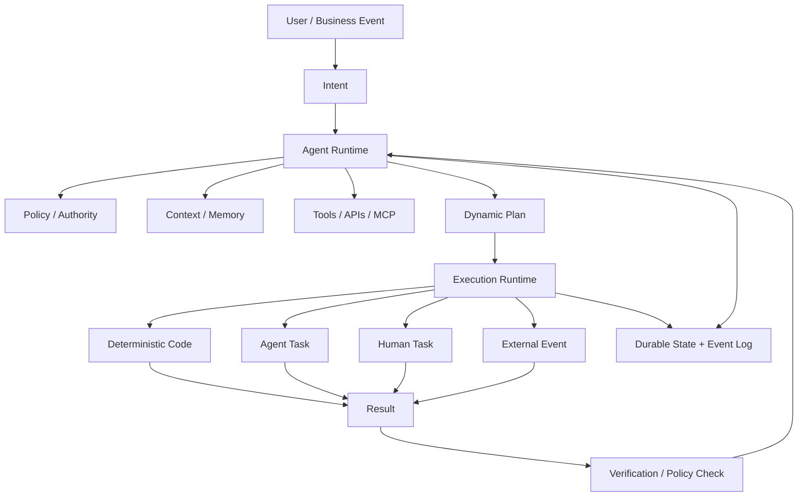
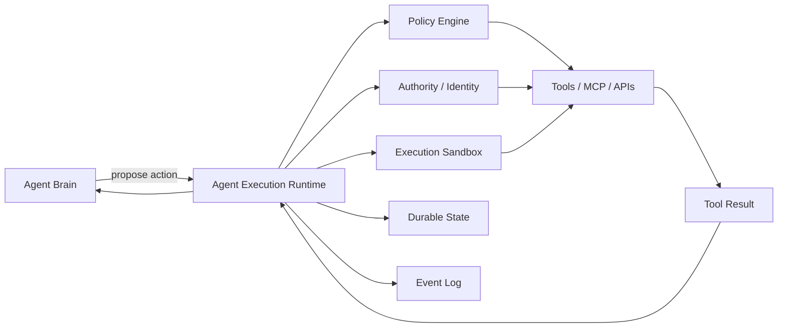
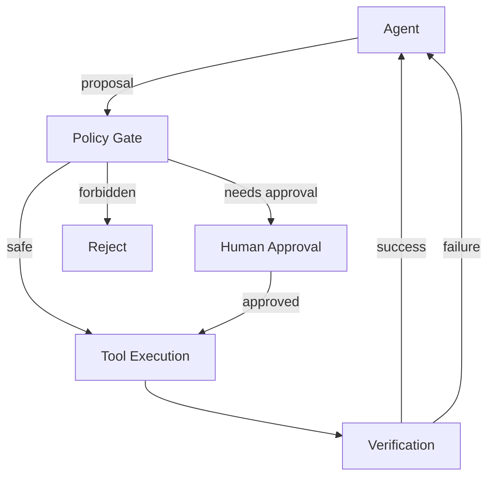
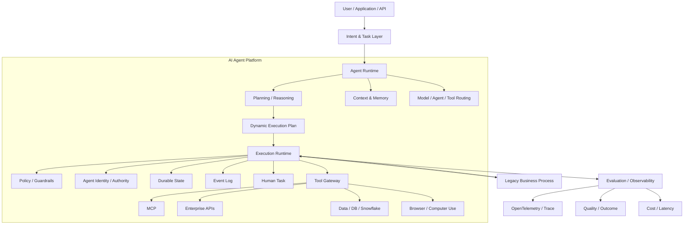
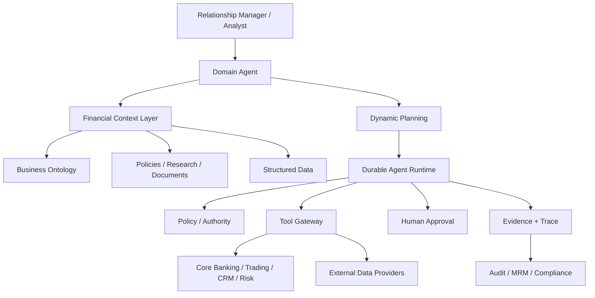
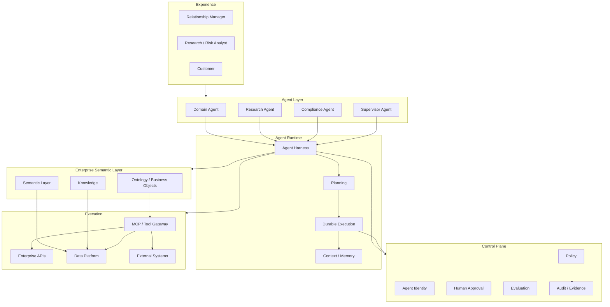

你的判断基本是对的，但我会把结论再往前推一步：

> **AI Agent 时代不是“不要 Workflow”，而是不要把 Workflow 理解成传统 BPMN 那种“预先把业务路径画死”。**
>
> 真正变化的是：**Workflow 从“控制流程”变成“控制 Agent 的行动边界、状态、权限、耐久性和结果责任”。**

我查了 2026 年目前几条主要技术路线，包括 Camunda/Fluxnova、Temporal、LangGraph、Microsoft Agent Framework、Google ADK 2.0、AWS Bedrock Agents，以及最近的 agentic workflow 研究。非常明显的趋势是：**行业没有抛弃 orchestration，而是在从 BPMN/Low-code orchestration 转向 code-first、runtime-first、agent-aware orchestration。** ([Microsoft Learn][1])

## 1. 先说结论：未来不是“Workflow vs Agent”

比较合理的模型其实是：



这里最重要的是：

**Agent 决定“下一步做什么”。
Runtime 决定“这个下一步能不能做、怎么执行、出了问题怎么办”。**

这是和过去 Workflow 最大的区别。

## 2. 传统 Workflow 的核心假设，已经不适合 Agent

传统 Camunda / Fluxnova / Flowable / ServiceNow Workflow 的核心模型大概是：

```text
Process Definition
        ↓
    Step A
        ↓
    Step B
        ↓
   Decision
    /      \
 Step C   Step D
    \      /
      Step E
```

流程在设计期基本确定。

例如：

```text
收到贷款申请
→ 身份验证
→ 信用检查
→ 风险评分
→ 人工审批
→ 放款
```

这是非常优秀的模型，因为：

- 路径比较确定
- 状态比较确定
- 责任边界明确
- 审计要求明确
- SLA 明确

所以 BPMN 仍然有价值。但 Agent 的任务变成：

```text
“调查这个投资机会，并给我一份结论。”
```

你根本不知道 Agent 会：

```text
search web
→ search Bloomberg
→ query internal database
→ read 17 documents
→ ask another agent
→ calculate valuation
→ discover missing information
→ search again
→ challenge its own conclusion
→ ask human
→ continue
→ produce report
```

你不可能提前把这个流程全部画出来。

所以：

> **传统 Workflow 是 Design-Time Control Flow。**
>
> **Agent Workflow 是 Runtime Decision + Execution Boundary。**

这是根本区别。

## 3. Google / Microsoft / LangGraph，其实都已经在往这个方向走

这一点非常值得注意。

### Google ADK 2.0

Google 在 2026 年把 ADK 从原来的 hierarchical agent executor 明确转向 **Workflow Runtime + Graph-based execution**。

它现在把 Agent、Tool、Function 全部作为 workflow graph 的节点。

同时支持：

- branching
- parallelism
- loops
- human-in-the-loop
- state preservation
- resume

并明确说原来的 `SequentialAgent / LoopAgent` 正逐步被 graph workflow 取代。 ([GitHub][2])

这非常重要。Google 并不是：

> “Agent 出现了，所以 Workflow 消失。”

而是：

> “Workflow 的实现方式必须适应 Agent。”

## 4. Microsoft Agent Framework 也是同样方向

Microsoft Agent Framework 现在把 Workflow 定义成：

```text
Executors
+
Edges
+
State
+
Events
+
Runtime
```

而 Executor 可以是：

- 普通代码
- Agent
- Tool
- sub-workflow

并且 runtime 负责：

- execution
- events
- checkpointing
- HITL
- concurrency
- state management

也就是说：

> **Workflow 不再等价于 Business Process Diagram**，而是**一个可执行的 runtime topology**。

([Microsoft Learn][1])

## 5. LangGraph 其实也是这个思想

LangGraph 自己把定位说得非常清楚：

> low-level orchestration framework for stateful agents

核心价值不是“画流程”，而是：

```text
State
↓
Node
↓
Decision
↓
Tool
↓
Checkpoint
↓
Resume
```

它特别强调：

- durable execution
- stateful agents
- long-running execution
- failure recovery

也就是说，Graph 在这里不是给业务人员看的流程图，而是：

> **Agent 的执行 runtime。**

([GitHub][3])

## 6. Temporal 更能说明这个变化

Temporal 的思路甚至更激进：

```text
Workflow
    |
    +---- Activity → LLM
    |
    +---- Activity → Tool
    |
    +---- Activity → Database
    |
    +---- Activity → API
```

Workflow 本身负责：

```text
state
ordering
waiting
retry
timeout
resume
```

所有 nondeterministic I/O 都放在 Activity。

Temporal 最近专门发布了 AI Agent Reference Architecture，把 Agent 的 loop 放进 durable Workflow 中。 ([Temporal][4])

所以它实际上把 **Agent = intelligence** 和 **Workflow = durable execution** 彻底分开了。这个分离非常合理。

## 7. 所以我反而不建议你把“Agent Workflow”做成 BPMN 2.0

这正是你对 Camunda / Fluxnova 产生抵触的根本原因。

Fluxnova 本质上仍然是 BPMN 引擎：

```text
BPMN
+
DMN
+
Human Task
+
Process State
+
Audit
```

它现在已经开始加入：

- ad-hoc subprocess
- agentic subprocess
- MCP
- AI integration
- dynamic routing

但它仍然是：

> **BPMN-centered orchestration**，而不是 **Agent-centered execution runtime**。

Fluxnova 3.0 本身仍以 BPMN Process Engine 为核心，只是增加了 Ad Hoc Subprocess 等动态能力；其 roadmap 甚至把 AI integration 放到了后续能力路线。 ([GitHub][5])

Camunda 的方向也非常清楚：

> **把 Agent 塞进 BPMN**，而不是**重新定义 Workflow**。

Camunda 自己目前强调的也是 deterministic + dynamic orchestration 混合，并且让 BPMN 负责 guardrails、human approval、compliance。 ([Camunda 8 Docs][6])

这对于金融、保险、银行非常合理。但如果你要做的是一个 **AI-native Agent Platform**，我不会把 BPMN 当成核心抽象。

## 8. 我认为下一代 Workflow 应该变成“五件东西”

不要再想：

```text
Workflow = DAG / BPMN
```

而应该定义：

```text
Agentic Workflow
=
Intent
+
Policy
+
Execution State
+
Dynamic Plan
+
Durable Runtime
```

### ① Intent

不是：

```text
Start → A → B → C
```

而是：

```text
Goal:
完成投资机会尽调并生成投资建议
```

Agent 负责寻找完成 Goal 的路径。

### ② Policy

这个才是企业 Workflow 最应该固定下来的东西。

例如：

```yaml
policy:
  can_read:
    - market_data
    - research_db

  can_write:
    - draft_report

  approval_required:
    - execute_trade
    - send_external_email

  max_budget:
    tokens: 100000
    tool_calls: 50

  forbidden:
    - customer_pii_export
```

也就是说：

> **固定的不是流程，而是权限和边界。**

这比 BPMN Gateway 重要得多。

### ③ Dynamic Plan

Agent 根据目标动态产生：

```text
Plan 1

1. Search company
2. Retrieve financial data
3. Analyze competitors
4. Identify missing information
5. Search again
6. Build valuation
7. Review assumptions
8. Produce report
```

但这个 Plan **必须持久化**，不是简单存在 LLM context 里面。

例如：

```json
{
  "runId": "invest-20260912-001",
  "goal": "Evaluate XYZ",
  "plan": [
    {
      "id": "t1",
      "type": "research",
      "status": "completed"
    },
    {
      "id": "t2",
      "type": "valuation",
      "status": "running"
    }
  ]
}
```

这时候 Workflow 实际上已经变成：

> **Agent-generated execution plan**，而不是 **Human-authored process definition**。

### ④ Execution State

这是传统 Workflow Engine 最值得保留的东西。

比如：

```text
RUNNING
WAITING_TOOL
WAITING_HUMAN
WAITING_EVENT
FAILED
RETRYING
COMPLETED
CANCELLED
```

这比 BPMN 图本身重要得多。

因为真实 Agent 经常：

```text
运行 25 分钟
↓
等待人工
↓
6 小时以后
↓
继续
```

所以你需要：

```text
durability
checkpoint
resume
timeout
retry
compensation
idempotency
```

而不是漂亮的流程图。

### ⑤ Execution Runtime

真正的核心应该变成：



**Agent 不应该直接碰生产系统。**

Agent 只负责：

```text
propose
reason
choose
delegate
```

Runtime 负责：

```text
authorize
validate
execute
retry
pause
resume
audit
```

这其实就是未来 Agent Platform 最核心的一层。

## 9. 这也解释了为什么“Low-code Agent Workflow”容易走偏

传统 Low-code：

```text
拖一个 HTTP Node
↓
拖一个 Condition
↓
拖一个 LLM Node
↓
拖一个 Approval Node
```

看起来非常容易。

但真正复杂之后：

```text
LLM 为什么选择这个？
为什么重新搜索？
为什么调用这个 tool？
为什么跳过那个 task？
为什么 context 变了？
为什么 agent 重新规划？
```

你最终会发现：

> **最大的复杂度不是“连节点”，而是运行时行为。**

于是最后会出现一个非常荒谬的东西：

```text
Low-code workflow
+
Agent Node
+
Prompt
+
Memory Node
+
Agent Router
+
Tool Node
+
Agent Router
+
Condition
+
Agent Router
```

实际上只是：

> **用 BPMN GUI 给 Agent 套了一层壳。**

我不认为这是长久方向。

## 10. 但千万不要走另一个极端：让 Agent 控制一切

这同样危险。

最差的 AI Workflow：

```text
Agent
  ↓
Agent
  ↓
Agent
  ↓
Agent
  ↓
Agent
```

然后：

> “让模型自己决定整个业务流程。”

金融领域尤其不能这么做。

例如：

```text
Agent → approve loan
Agent → move money
Agent → submit trade
Agent → change risk limit
```

这里不应该是 Agent 自由决定。

更合理：



**Agent 有 autonomy，但没有 unrestricted authority。**

这其实比 Workflow 这个词本身重要得多。

## 11. 所以我认为未来企业 AI Platform 会出现“两层 Workflow”

这个非常关键。

### Layer 1：Business Process

这个可以继续使用：

```text
BPMN
Camunda
Fluxnova
SAP workflow
ServiceNow
```

解决：

```text
合规
审批
SLA
责任
审计
跨部门流程
```

例如：

```text
开户
→ KYC
→ Risk
→ Approval
→ Account Creation
```

### Layer 2：Agentic Workflow

这完全不同。

例如：

```text
Research Agent

Goal:
Determine whether this company is investable.

Agent:
  ├─ Search
  ├─ Read
  ├─ Compare
  ├─ Calculate
  ├─ Ask specialist
  ├─ Re-plan
  └─ Verify
```

这应该由：

```text
Agent Framework
+
Execution Runtime
+
Policy
+
Memory
+
Tool Runtime
+
Durable State
```

来实现。

## 12. 于是整个企业架构变成

我更推荐你们内部 AI Platform 往这个方向设计：



注意这里：

**BPMN / Camunda / Fluxnova 是一个“外部能力”，不是整个 Agent Platform 的核心。**

这和今天很多企业的架构思路会完全不同。

## 13. 如果是你前面提到的“DeepAgents + AgentCore + LangSmith”平台

我实际上会把架构重新分层。

不要：

```text
Angular
 ↓
Experience API
 ↓
LangChain / DeepAgents
 ↓
Camunda
 ↓
Agent
```

而是：

```text
                Applications
                     │
                     ▼
              Agent Gateway
                     │
             ┌───────┴────────┐
             ▼                ▼
       Agent Runtime      Business API
             │
      ┌──────┼──────┐
      ▼      ▼      ▼
   Context  Policy  Planner
      │      │      │
      └──────┼──────┘
             ▼
      Execution Runtime
             │
      ┌──────┼─────────────┐
      ▼      ▼             ▼
    Tools   Agents       Human
      │
      ▼
 Enterprise Systems
```

而：

```text
Temporal / AgentCore / custom durable runtime
```

负责 execution。

```text
DeepAgents / LangGraph / Microsoft Agent Framework
```

负责 agent orchestration。

```text
OpenTelemetry / LangSmith / Foundry
```

负责 observability + evaluation。

```text
Camunda / Fluxnova
```

负责那些真正需要 BPMN 的企业 business processes。

## 14. 一个非常重要的变化：Workflow 定义本身也会 AI 化

以前：

```text
Developer
   ↓
设计 Workflow
   ↓
部署
```

以后可能是：

```text
Business Intent
      ↓
Agent / Compiler
      ↓
Execution Policy
      ↓
Generated Plan
      ↓
Runtime
```

也就是说：

> **Workflow 从“静态 artifact”变成“动态 execution artifact”。**

最近研究也开始直接研究 Agentic Workflow Generation，也就是从功能描述自动生成可执行 workflow，而研究结果同时指出：单纯让 LLM 生成流程很容易产生缺失/幻觉数据，因此真正可靠的方向是生成 + 约束 + runtime validation，而不是“让 LLM 随便画流程”。 ([Springer Nature Link][7])

## 15. 甚至“Workflow”这个词都可能逐渐被弱化

我觉得未来更准确的词可能是：

```text
Agent Runtime
Agent Execution
Task Orchestration
Agent Operating System
```

而不是：

```text
Workflow Engine
```

一个 2026 年比较有代表性的研究方向已经直接提出 **Agent Operating System (AOS)** 的架构，把系统分成：

```text
Control & Governance Plane
+
Runtime & Coordination Plane
```

前者负责：

```text
intent
policy
authority
trust
audit
human oversight
```

后者负责：

```text
agent lifecycle
workflow coordination
model/tool routing
memory
scheduling
runtime assurance
```

([arXiv][8])

这个方向和我上面的架构其实高度一致。

## 16. 所以我给你的最终判断

| 传统方式          | Agent 时代对应物               |
| ----------------- | ------------------------------ |
| BPMN Process      | Execution Policy / Task Model  |
| Gateway           | Policy / Agent Decision        |
| Service Task      | Tool                           |
| Sub-process       | Agent / Sub-agent              |
| Human Task        | Human-in-the-loop              |
| Process Variable  | Durable State                  |
| Process Instance  | Agent Run                      |
| BPMN Engine       | Agent Execution Runtime        |
| DMN               | Policy / Rules Engine          |
| Process Monitor   | Agent Observability            |
| Process History   | Event / Trace                  |
| Workflow Designer | Code / DSL / AI-generated Plan |
| Static Flow       | Dynamic Execution Plan         |

所以你说：

> **“我不觉得还应该用老的那套 Camunda / Fluxnova，甚至所谓 Low-code 产品。”**

我的判断是：

### 对 **Agent Platform 本身**，基本正确。

不要把：

```text
Camunda / Fluxnova / BPMN
```

当成核心抽象。

### 对 **Enterprise Business Process**，则不正确。

BPMN 这些东西仍然非常有价值，因为：

```text
法律责任
合规
审批
SLA
审计
跨系统 transaction
human accountability
```

这些东西并不会因为 LLM 出现就消失。

所以真正先进的架构不是：

> **BPMN → Agent**

也不是：

> **Agent → Everything**

而是：

> **Business Process Layer + Agent Execution Layer**

两者之间通过：

```text
typed task
events
policy
authority
durable state
```

连接。

## 17. 如果让我现在从零设计一个 2026 年的企业 Agent Workflow Platform

我不会先建 Workflow Designer。

我会先建这 7 个东西：

```text
1. Agent Runtime
2. Durable Execution Runtime
3. Tool / MCP Gateway
4. Policy & Authority Engine
5. Context / Memory Runtime
6. Human Task Runtime
7. Trace / Evaluation / Audit
```

然后再决定：

```text
哪些地方需要 BPMN
哪些地方需要 Graph
哪些地方完全由 Agent 动态决定
```

**而不是反过来先选 Camunda，然后想办法把 Agent 塞进去。**

这才是我认为真正的 **AI-native workflow architecture**。

另外值得注意的是，Google、Microsoft、LangGraph、Temporal 当前都在把 workflow 做成 **code/runtime-first 的 graph + state + durable execution**，而不是继续强化传统“业务人员拖节点”的范式；这已经不是单个厂商的偶然选择。([GitHub][2])

如果把这个结论进一步落到你前面提到的 **“内部 LangChain DeepAgents + AWS AgentCore + LangSmith 的 AI 能力平台”**，我认为下一步最值得做的是直接设计一套 **Agent Runtime / Execution Runtime / Business Process 三层架构**，并把 **Temporal、AgentCore、LangGraph、Microsoft Agent Framework、Camunda/Fluxnova** 放进去逐项对比。这样就能比较清楚地判断你们平台到底应该自己做什么、买什么、哪些东西根本不该引入。

[1]: https://learn.microsoft.com/en-us/agent-framework/workflows/workflows?utm_source=chatgpt.com "Microsoft Agent Framework Workflows - Workflow Builder & Execution | Microsoft Learn"
[2]: https://github.com/google/adk-docs/blob/main/docs/2.0/index.md?utm_source=chatgpt.com "adk-docs/docs/2.0/index.md at main · google/adk-docs · GitHub"
[3]: https://github.com/langchain-ai/langgraph?utm_source=chatgpt.com "GitHub - langchain-ai/langgraph: Build resilient agents. · GitHub"
[4]: https://go.temporal.io/platform-hub/ai-engineering/ai-reference-architecture?utm_source=chatgpt.com "AI Agent Reference Architecture | Temporal Platform Hub"
[5]: https://github.com/finos/fluxnova-bpm-platform/releases?utm_source=chatgpt.com "Releases · finos/fluxnova-bpm-platform · GitHub"
[6]: https://docs.camunda.io/docs/components/agentic-orchestration/ao-design/?utm_source=chatgpt.com "Design and architecture | Camunda 8 Docs"
[7]: https://link.springer.com/article/10.1365/s40702-026-01299-4?utm_source=chatgpt.com "Agentic Workflow Generation: Mit Agentic AI von der funktionalen Beschreibung zur ausführbaren Prozesslogik | HMD Praxis der Wirtschaftsinformatik | Springer Nature Link"
[8]: https://arxiv.org/abs/2608.03214?utm_source=chatgpt.com "The Agent Operating System (AOS): A Reference Operating Architecture for Distributed Agentic Systems"

---

这轮我会把范围扩大到四类证据：**学术研究、模型厂商实践、企业 AI 平台、金融机构/监管机构实践**。先给结论：

> **2026 年真正成熟的方向，不是“把 BPMN 换成 Agent”，而是把 Workflow 拆成“Agentic Decisioning + Durable Execution + Policy/Authority + Enterprise Ontology/Data + Evaluation”。**
>
> 传统 Workflow 仍然存在，但它越来越像**受约束的外围控制面**，而不是 Agent 平台的核心抽象。

下面是我认为最值得研究的一套地图。

---

# 一、先看学术界：Workflow 已经成为 Agent 系统的一等研究对象

目前已经有一批论文不再把 Agent 看成“一个 LLM + tool calling”，而是研究 **Agent Workflow 本身**。

### 1. 《A Survey on Agent Workflow — Status and Future》

这是目前比较值得当作入口的 survey。

论文把 Agent Workflow 按两个维度分类：

- 功能：planning、多 Agent、API、tool、memory
- 架构：agent role、orchestration flow、workflow specification

它明确指出，随着 Agent 系统变复杂，**workflow/orchestration 已经成为 scalable / controllable / secure agent behavior 的核心基础设施**，同时指出标准化、安全和多模态 integration 仍是开放问题。([arXiv][1])

这意味着一个很重要的判断：

> **Workflow 不会消失，只是在从“业务流程建模”变成“智能执行系统建模”。**

---

# 二、2026 最新研究已经开始研究 Agent Workflow 的“计算机体系结构”

这点很容易被企业架构师忽视。

### 2. 《Architectural Implications of Agentic AI Workflows》

2026 年 8 月的研究直接分析 Agentic Workflow 对底层基础设施的影响。

核心发现非常有意思：

```text
Agent Request
   ↓
LLM inference
   ↓
Tool call
   ↓
CPU execution
   ↓
LLM inference
   ↓
Tool call
   ↓
...
```

Agent 不是传统 ML 那种：

```text
input → GPU → output
```

而是：

```text
CPU
GPU
network
external systems
orchestration
CPU
GPU
...
```

不断交替。

结果就是：

- CPU/GPU 利用率不均衡
- execution bursty
- tool invocation 造成 CPU critical path
- multi-agent 增加调度复杂度
- heterogeneous workloads 使传统 server provisioning 变得低效

论文甚至做了专门的 Agentic Server 原型 Agora。([arXiv][2])

这其实说明：

> **Agent Runtime 最终可能会成为一种全新的计算运行时，而不只是 Python framework。**

---

# 三、Microsoft 的路线非常值得认真看

微软现在实际上同时押了两个方向：

```text
Agent
+
Workflow
+
Durable Runtime
```

而不是二选一。

Microsoft Agent Framework 当前的 Workflow 模型是：

```text
Executor
   ↓
Edges
   ↓
Events
   ↓
State
   ↓
Runtime
```

而不是 BPMN。([Microsoft Learn][3])

更关键的是，它已经加入：

- checkpoint
- human-in-the-loop
- fan-out / fan-in
- sub-workflow
- typed routing
- graph execution
- durable execution

微软还直接提供 Durable Extension，把 Agent Framework Workflow 跑在 Durable Task 基础设施上：

```text
Agent Framework
       ↓
Graph Workflow
       ↓
Durable Task
       ↓
Checkpoint
       ↓
Resume
       ↓
Distributed Workers
```

并支持 agent 可以运行数天甚至数周。([Microsoft Learn][4])

我认为微软这里实际上已经非常接近：

> **Agent = intelligence
> Workflow = execution topology
> Durable Task = runtime**

这个模型。

---

# 四、Anthropic 的实践更值得研究，因为它反而“不迷信 Workflow”

Anthropic 的路线和微软略有不同。

它最经典的生产案例是 Claude Research。

架构大体是：

```text
                Main Research Agent
                       │
             create research plan
                       │
        ┌──────────────┼──────────────┐
        ▼              ▼              ▼
   Research Agent  Research Agent  Research Agent
        │              │              │
      search         search         search
        │              │              │
        └──────────────┼──────────────┘
                       ▼
                 synthesis
```

Anthropic 明确指出，他们使用一个主 Agent 制定研究计划，然后启动多个并行 Agent 搜索。与此同时，系统设计最大的难点变成：

- coordination
- evaluation
- reliability
- tool design

而不是传统 workflow 的节点设计。([Anthropic][5])

这与传统 BPMN 的思路差别很大。

---

# 五、Anthropic 还有一个更重要的方向：Harness

Anthropic 现在对 Agent 的工程实践越来越集中到：

> **Harness**

而不是：

> Workflow Designer

他们 2026 年的工程文章列表里已经把这些问题分开研究：

- long-running agents
- managed agents
- context engineering
- skills
- tool use
- security
- agent containment
- evals
- multi-agent research

([Anthropic][6])

也就是说：

```text
Model
+
Harness
+
Tools
+
Environment
+
Permissions
+
Context
+
Evaluation
```

正在成为一个比传统 workflow 更核心的抽象。

---

# 六、OpenAI 的变化尤其明显

OpenAI 2025 年最初的路线是：

```text
Responses API
+
Agents SDK
+
Tools
+
Handoffs
+
Guardrails
+
Tracing
```

([OpenAI][7])

已经明显不是传统 workflow。

2026 年更进一步。

新的 Agents SDK 强调：

> **model-native harness + sandbox + long-horizon task**

也就是说：

```text
Agent
  ↓
Harness
  ↓
Sandbox
  ↓
Tools / Files / Commands
  ↓
Long-running execution
```

并且把 harness 与 compute 分离，强调：

- security
- durability
- scale

([OpenAI][8])

我认为这里隐藏着一个非常重要的方向：

> **Agent Workflow 最终可能不是 DAG，而是一个“可持续运行的 Agent Process”。**

---

# 七、OpenAI 自己做内部应用，也已经不是传统 Workflow 思维

OpenAI 2026 年公开描述内部 Codex 使用情况：

过去：

```text
ChatGPT
→ occasional AI assistance
```

现在：

```text
employee
→ delegate long-horizon task
→ Codex
→ tools
→ files
→ code
→ iterate
→ final result
```

他们把工作单位定义成：

> **delegated long-horizon task**

而不是 single interaction。

([OpenAI][9])

这个变化非常重要。

---

# 八、OpenAI 甚至公开展示了更接近企业 Agent Operating Model 的产品

2026 年推出的 Presence 思路尤其值得注意。

它不是：

```text
Workflow Designer
```

而是：

```text
specific job
       ↓
knowledge
       ↓
system access
       ↓
permissions
       ↓
policies
       ↓
agent
       ↓
escalation
       ↓
human
```

例如：

- billing
- insurance claims
- IT service request

每个 Agent 都有明确的：

- 权限
- 工作范围
- approval
- escalation

([OpenAI][10])

这其实已经非常接近金融机构需要的模型。

---

# 九、Google 的路线：Agent Platform + Enterprise Governance

Google 2026 年提出的 Agentic Enterprise blueprint 也是：

```text
Agent
+
Agent Platform
+
Orchestration
+
Governance
+
Enterprise Data
```

而不是：

```text
BPMN
+
LLM Node
```

Google 明确把 Gemini Enterprise 定义成：

> agent development + orchestration + governance

的一体化平台。([Google Cloud][11])

尤其值得注意的是，他们开始支持：

- long-running agents
- agent collaboration spaces
- advanced governance
- agent marketplace

([Google Cloud][12])

这说明大型企业平台厂商的竞争重点正在从：

> “谁有最好的 Agent Builder”

转向：

> **谁能提供企业级 Agent Operating Environment。**

---

# 十、Snowflake 的方向非常值得你关注

尤其结合你之前问过的 Snowflake AI Platform。

Snowflake 当前的 Cortex Agents 架构已经非常清楚：

```text
                     Cortex Agent
                          │
             ┌────────────┼────────────┐
             ▼            ▼            ▼
       Cortex Analyst  Cortex Search  Code
             │            │            │
       Structured      Unstructured   Compute
         Data             Data
             │            │            │
             └────────────┼────────────┘
                          ▼
                      Reasoning
                          │
                          ▼
                       Action
```

Snowflake 官方明确说 Cortex Agents：

- 自己 reasoning
- plan work
- call tools
- execute code
- maintain threads
- orchestration across multiple steps

而且无需你自己建设 orchestration loop / runtime / sandbox。([Snowflake Documentation][13])

更重要的是：

**2026-08-28，Snowflake 已经明确建议从 Cortex Analyst 迁移到 Cortex Agents。**

原因就是 Cortex Agents 把：

```text
structured data
+
unstructured data
+
tool calling
+
thread context
+
multi-step orchestration
```

放到一个 Agent runtime 中。([Snowflake Documentation][14])

---

# 十一、Snowflake 做金融服务的观点非常接近“Data-native Agent”

Snowflake 2026 年针对 Financial Services 的 architecture，核心思想其实不是：

> “做一个金融 Agent。”

而是：

```text
First-party data
+
Third-party data
+
Semantic layer
+
Search
+
Agent
+
Action
```

他们直接说金融 workflow 的核心是把 first-party + third-party data 组合起来，并强调：

- Cortex Analyst
- Cortex Search
- Shared Semantic Views
- Knowledge Extensions
- Cortex Agents

最终让 Agent 在数据所在的位置执行 workflow。([Snowflake][15])

这对于银行、资产管理、保险特别重要。

---

# 十二、Snowflake 还有一个特别值得关注的变化：RAG 正在变成“分析型检索”

2026 年 Snowflake 推出了 Analytical Search。

传统 RAG：

```text
question
 ↓
top-k documents
 ↓
LLM
```

对于：

> “10000 份财报中，有多少家公司……”

其实不行。

Snowflake 的新方向是：

```text
Agent
 ↓
multiple Search queries
 ↓
metadata filters
 ↓
AISQL
 ↓
AI_FILTER
 ↓
AI_AGG
 ↓
aggregate entire corpus
```

也就是说：

> **Agent 不只是“找资料”，而是能够调度一套数据处理 workflow。**

([Snowflake Documentation][16])

这个对金融 research、compliance、credit、ESG 极其重要。

---

# 十三、Palantir 是我认为你最应该深入研究的案例

因为 Palantir 其实回答了一个非常关键的问题：

> **Agent 到底应该连接什么？**

Palantir 的答案不是：

```text
Agent
 ↓
1000 API
```

而是：

```text
Enterprise Ontology
```

Ontology 把企业世界建模成：

```text
Objects
Properties
Links
Actions
Logic
Security
```

官方把它概括成：

> **Data + Logic + Action + Security**

([Palantir][17])

更形象一点：

```text
            Ontology

       Company
       /      \
   Investor   Security
       \       /
        Transaction

             │
             ▼
          Actions
```

所以 Agent 看到的不是：

```text
table
table
API
API
PDF
database
```

而是：

```text
Company
Portfolio
Position
Transaction
Risk
Counterparty
ResearchReport
```

并且这些对象自带：

```text
actions
logic
permissions
relationships
```

---

# 十四、Palantir 的“Action”其实是关键

Palantir 有一个非常值得重视的思想：

> 数据只是“nouns”，Action 才是“verbs”。

也就是说：

```text
Company
Position
Loan
Customer
Transaction
```

这些是：

> nouns

而：

```text
Approve
Reject
Rebalance
Create
Assign
Escalate
Freeze
Review
```

这些才是：

> verbs

([Palantir][18])

这恰好解决 Agent 最大的问题：

> **Agent 不是只需要知道“这个东西是什么”，还需要知道“它允许我做什么”。**

---

# 十五、这也是为什么 Palantir 的 Ontology 比简单 RAG 强得多

传统：

```text
RAG
 ↓
document
 ↓
answer
```

Ontology：

```mermaid id="c88g6v"
                    Ontology
                       │
       ┌───────────────┼────────────────┐
       ▼               ▼                ▼
      Data            Logic           Action
       │               │                │
       └───────────────┼────────────────┘
                       ▼
                    Security
                       │
                       ▼
                     Agent
                       │
                       ▼
                  Real Action
```

因此它本质上是：

> **Agent 的 enterprise world model + action model**

而不是 Vector DB。

---

# 十六、Palantir 最近又进一步把 Ontology 直接变成 MCP

这一步尤其重要。

2026-06 Palantir 已经正式 GA Ontology MCP。

意味着：

```text
Claude
OpenAI
Gemini
Microsoft Agent Framework
Google ADK
```

都可以通过 MCP：

```text
read Ontology
+
write Ontology
+
execute Ontology actions
```

而且调用继续使用 Foundry 权限模型。([Palantir][19])

换句话说：

> **Ontology 不需要成为 Agent Framework。**

它变成：

> **Agent 的 enterprise semantic/action substrate。**

我认为这是比“Palantir 自己做 Agent Framework”更加重要的战略。

---

# 十七、AIP Logic 也说明 Palantir 并没有完全抛弃 Workflow

AIP Logic 仍然是 no-code。

它可以：

```text
Ontology Object
 ↓
LLM
 ↓
Condition
 ↓
Loop
 ↓
Function
 ↓
Action
```

并且支持：

- testing
- evaluation
- monitoring
- automation
- human review

([Palantir][20])

所以 Palantir 的实际答案不是：

> “No-code 已死。”

而是：

> **No-code 不能再是整个系统的抽象。**

它只是：

> **Ontology / Logic / Action 上面的一个 builder。**

这个区别非常重要。

---

# 十八、金融服务领域的学术研究已经开始出现真正“Agentic Finance”

2026 年有一篇比较完整的 survey：

### Agentic Artificial Intelligence in Finance: A Comprehensive Survey

涵盖：

- financial operations
- financial markets
- architecture
- regulation
- systemic risk
- multi-agent coordination

([arXiv][21])

另外一篇论文直接提出：

### AI Agents in Financial Markets

它把金融 Agent 拆成：

```text
Data Perception
        ↓
Reasoning
        ↓
Strategy Generation
        ↓
Execution + Control
```

并且提出一个非常现实的结论：

> **短期最可能的形态不是 fully autonomous finance，而是 bounded autonomy。**

即：

```text
AI
+
human supervision
+
constrained execution
```

([arXiv][22])

我认为这对企业架构的影响非常大。

---

# 十九、金融 MRM 的 Agentic Workflow 也已经出现研究

另一项研究直接做了：

```text
Modeling Crew
+
Model Risk Management Crew
```

例如：

```text
Manager Agent
    │
    ├── EDA Agent
    ├── Feature Agent
    ├── Model Selection Agent
    ├── Training Agent
    └── Documentation Agent
```

另一组：

```text
MRM Manager
    │
    ├── Compliance Agent
    ├── Replication Agent
    ├── Conceptual Soundness Agent
    └── Outcome Analysis Agent
```

并在：

- fraud detection
- credit approval
- credit risk

中做了实验。([arXiv][23])

这其实比“客服 Agent”更接近企业真正的问题。

---

# 二十、金融行业现在真正担心的已经不是“LLM hallucination”

而是：

> **Agent 到底代表谁行动？**

这个问题在金融业特别严重。

最新一篇关于 Agentic AI governance in FinTech 的研究甚至提出：

> **Verifiability Gap**

也就是说：

```text
Agent Authority
      ↓
实际执行
      ↓
能否证明：
为什么当时允许它这么做？
```

研究特别强调：

- orchestration 本身是 policy layer
- 不同 orchestration 结构会改变最终决策
- historical replay 可能无法重现
- model/version变化会改变结果
- deterministic replay 并不等于 historical decision replay

([arXiv][24])

这是非常关键的。

传统 Workflow：

```text
same input
→ same BPMN
→ same path
```

Agent：

```text
same input
→ different reasoning
→ different tools
→ different context
→ different outcome
```

所以：

> **Agent Workflow 的审计对象不能只是“流程图”，而必须是 Execution Trace + Context + Authority + Evidence。**

---

# 二十一、监管机构实际上也已经在朝这个方向看

## Bank of England

2026 年 Financial Stability Report 已经专门讨论 Agentic AI。

其中一个特别值得注意的观察是：

目前金融机构主要使用 Agent：

- research
- coding
- surveillance
- lower-risk operations

而不是：

> autonomous trading

因为核心风险是：

- output 不可预测
- validation 困难
- autonomy boundary 难定义
- correlated behavior

([Bank of England][25])

---

# 二十二、FSB 2026 的方向更系统

Financial Stability Board 2026 年 AI governance consultation 提出了 12 类 sound practices。

特别强调：

- AI governance
- lifecycle management
- risk identification
- operational resilience
- third-party dependence
- GenAI / agentic AI risks

([Financial Stability Board][26])

这说明金融监管未来看 Agent，不会只看：

> model risk

而会看：

```text
Model
+
Agent
+
Tool
+
Data
+
Permission
+
Runtime
+
Vendor
+
Human Oversight
```

---

# 二十三、Stripe 是一个非常值得研究的真实金融生产案例

AWS 与 Stripe 2026 年公开的案例特别有价值。

场景是：

```text
金融合规 review
```

Stripe 面临：

```text
thousands of transactions / day
```

它搭建 production agent system：

```text
Agent
 ↓
AWS Bedrock
 ↓
enterprise data
 ↓
compliance reasoning
 ↓
human review
```

公开结果：

- review handling time ↓ 26%
- helpfulness >96%
- final decision 仍由 human 控制

([Amazon Web Services, Inc.][27])

注意这里：

**Stripe 并没有让 Agent 直接取代 Compliance Officer。**

它真正做的是：

```text
Agent = investigation / preparation
Human = decision authority
```

这很可能就是金融服务未来几年的主流架构。

---

# 二十四、AWS 对金融 Agent 的建议也非常明确

AWS 2026 年的 Financial Services AgentCore 架构：

```text
                     Agent
                       │
               ┌───────┼────────┐
               ▼       ▼        ▼
           Market     Risk    Research
             Agent    Agent    Agent
               \       |       /
                \      |      /
                   Orchestrator
                         │
              AgentCore Runtime
                         │
          ┌──────────────┼─────────────┐
          ▼              ▼             ▼
      Identity        Tracing       Sandbox
          │
        Policy
```

例如 portfolio advisory：

- portfolio valuation
- risk stress test
- market research
- advisor synthesis

由多个 specialist agents 协同完成。([Amazon Web Services, Inc.][28])

而信用分析案例则是：

```text
Policy PDF
+
Snowflake account history
+
transaction patterns
+
Agent reasoning
+
recommendation
```

([Amazon Web Services, Inc.][29])

这非常接近企业真正的 Agent Workflow。

---

# 二十五、所以金融领域最值得借鉴的架构不是“Agent Workflow Engine”

而应该是：



---

# 二十六、这里已经可以看出“Workflow”的未来形态

我会把 Workflow 拆成四种。

### A. Deterministic Workflow

```text
if A
then B
else C
```

继续用传统 workflow / code。

例如：

```text
Settlement
Payment
KYC
Regulatory reporting
```

---

### B. Agentic Workflow

```text
Goal
 ↓
Agent
 ↓
dynamic plan
 ↓
tools
 ↓
replan
 ↓
verify
```

例如：

```text
“调查这家公司是否值得投资”
```

---

### C. Policy Workflow

这是金融最重要的一类：

```text
Agent wants to act
        ↓
Authorization
        ↓
Risk classification
        ↓
Approval?
        ↓
Execute / Reject
```

这实际上是：

> **Agent governance workflow**

---

### D. Human Workflow

```text
Agent
 ↓
Prepare decision package
 ↓
Human review
 ↓
Approve / Reject / Modify
 ↓
Agent continues
```

---

# 二十七、所以“Workflow Engine”本身正在裂解

过去：

```text
Workflow Engine
```

一个系统全部负责。

未来更像：

```text
             Agent Platform
                  │
       ┌──────────┼───────────┐
       ▼          ▼           ▼
   Agent Loop   Durable    Policy
                Runtime    Engine
       │          │           │
       └──────────┼───────────┘
                  │
              Tool Layer
                  │
       ┌──────────┼──────────┐
       ▼          ▼          ▼
      API        MCP       Human
```

而传统 BPM：

```text
Camunda
Fluxnova
Temporal
ServiceNow
```

分别负责其中一部分 deterministic / durable / business-process 问题。

---

# 二十八、一个特别值得研究的方向：Meta-tools

微软研究院最近的一个研究让我觉得非常有意思：

### Optimizing Agentic Workflows using Meta-tools

它发现很多 Agent Workflow 会反复：

```text
LLM
→ tool
→ LLM
→ tool
→ LLM
→ tool
```

但是这些 tool-call pattern 实际上是稳定重复的。

于是：

```text
Agent Trace
   ↓
发现高频 tool sequence
   ↓
自动封装成 Meta-tool
   ↓
Agent 一次调用
```

这样：

- LLM calls ↓
- latency ↓
- failure ↓
- success rate ↑

实验中 LLM calls 最多减少 11.9%，task success 提升最多 4.2 percentage points。([Microsoft][30])

这个其实揭示了未来 Workflow 一个很重要的方向：

> **Workflow 不一定由人设计，也可能从 Agent execution traces 中“编译”出来。**

---

# 二十九、这个方向比 Low-code 更值得关注

过去：

```text
Human designs workflow
```

未来可能是：

```text
Agent runs
     ↓
Execution traces
     ↓
Pattern mining
     ↓
Stable subgraph
     ↓
Compile into deterministic tool/workflow
```

于是：

```text
Agent
      ↓
exploration
      ↓
discovery
      ↓
stable pattern
      ↓
deterministic execution
```

最终系统变成：

> **Agent负责探索，Workflow负责固化。**

这可能是未来最漂亮的二者关系。

---

# 三十、金融服务领域尤其适合这个模型

例如：

### 投资研究

第一次：

```text
Agent
→ search
→ SEC
→ research
→ valuation
→ competitor
→ analyst review
```

Agent 很自由。

跑了 5000 次以后发现：

```text
Company Financials
→ Peer Analysis
→ DCF
→ Risk Check
→ Report
```

已经高度稳定。

那么这部分就可以：

```text
compile
↓
deterministic research workflow
```

而异常情况：

```text
new company
unusual accounting
missing data
conflicting filings
```

仍交给 Agent。

这就形成：

```text
80% deterministic workflow
20% agentic exploration
```

而不是：

```text
100% BPMN
```

也不是：

```text
100% autonomous agent
```

我认为这是企业金融 AI 最现实的长期架构。

---

# 三十一、综合这么多厂商和研究，我会把业界路线归纳成 5 派

| 路线                  | 代表                       | 核心思想                               |
| --------------------- | -------------------------- | -------------------------------------- |
| Agent Harness         | Anthropic / OpenAI         | Agent + tools + environment            |
| Agent Graph           | LangGraph / Microsoft      | state + graph + execution              |
| Durable Agent Runtime | Temporal / Microsoft / AWS | long-running + checkpoint              |
| Enterprise Ontology   | Palantir                   | data + logic + action + security       |
| Data-native Agent     | Snowflake / Google         | governed data + semantic layer + agent |

其中真正有前景的企业平台，大概率会把它们组合：

```text
        Enterprise Agent Platform

             Agent Harness
                   │
           Agent Orchestration
                   │
           Durable Runtime
                   │
        ┌──────────┼──────────┐
        ▼          ▼          ▼
    Ontology     Data       Tools
        │          │          │
        └──────────┼──────────┘
                   ▼
            Policy / Identity
                   │
                   ▼
             Human Control
                   │
                   ▼
          Audit / Evaluation
```

---

# 三十二、如果专门为金融服务设计，我会把这套架构再加一层

最终我更推荐：



这里最重要的是：

### **Ontology / Semantic Layer 和 Agent Runtime 是两个不同东西。**

Palantir 最强的是前者。

AWS / Microsoft / OpenAI / Anthropic 最强的是后者。

Snowflake 正在试图把：

```text
Data + Semantic + Agent Runtime
```

放在一起。

---

# 三十三、最后给你一个非常明确的判断

你最开始说：

> “我不觉得还应该使用老的 Camunda / Fluxnova，甚至所谓 Low-code。”

经过这轮把论文、Anthropic、OpenAI、Microsoft、Google、Palantir、Snowflake、AWS、Stripe、监管机构都串起来看，我会把原来的说法修正得更精确：

### 错误方向

```text
BPMN
  ↓
LLM Node
  ↓
Agent
```

这确实不是我认为最有前景的 Agent Platform 架构。

### 同样错误

```text
User
 ↓
Autonomous Agent
 ↓
无限 Tool
 ↓
Enterprise
```

金融领域尤其不可接受。

### 更合理的 2026+ 模型

```text
                    Goal / Intent
                          │
                          ▼
                     Agent Harness
                          │
                    Dynamic Planning
                          │
                          ▼
                Durable Agent Runtime
                          │
          ┌───────────────┼───────────────┐
          ▼               ▼               ▼
       Ontology         Data            Tools
          │                               │
          └───────────────┬───────────────┘
                          ▼
                   Policy / Authority
                          │
                 ┌────────┴────────┐
                 ▼                 ▼
             Human                 Auto
             Approval            Execution
                 │                 │
                 └────────┬────────┘
                          ▼
                  Evidence / Trace
                          │
                          ▼
                  Evaluation / Audit
```

一句话概括：

> **未来的 Workflow 不是“下一步去哪”，而是“Agent 为了完成 Goal，可以在什么边界内，以什么权限，持续做什么，并且如何被暂停、恢复、验证和追责”。**

而 **Palantir Ontology** 解决的是“**世界是什么、能对世界做什么**”；
**Anthropic/OpenAI Harness** 解决的是“**Agent 如何工作**”；
**Microsoft/Temporal/AWS** 解决的是“**Agent 如何可靠地长期运行**”；
**Snowflake/Google** 解决的是“**Agent 如何在企业数据与语义边界内工作**”；
**Policy/Governance** 则解决“**Agent 到底有没有资格做这件事**”。

这五块拼起来，才比较接近我认为的 **AI-native enterprise workflow**。

而金融服务真正应该研究的核心不是“哪个 Workflow Engine 最好”，而是：

> **Agentic Decision + Enterprise Ontology + Durable Execution + Authority + Evidence**

这比单纯讨论 Camunda、Temporal、LangGraph 谁替代谁，层次高一个级别。

### 最值得继续深挖的资料

**学术 / Architecture**

- Agent Workflow Survey ([arXiv][1])
- Architectural Implications of Agentic AI Workflows ([arXiv][2])
- Production-grade Agentic AI Workflows ([arXiv][31])
- Microsoft Agent Workflow Optimization / Meta-tools ([Microsoft][30])
- Agentic AI in Finance Survey ([arXiv][21])
- AI Agents in Financial Markets ([arXiv][22])
- Governing Agentic AI in FinTech ([arXiv][24])

**厂商架构**

- Anthropic Multi-Agent Research ([Anthropic][5])
- OpenAI Agents SDK / Responses API ([OpenAI][7])
- OpenAI Agents SDK 2026 Harness/Sandbox ([OpenAI][8])
- Microsoft Agent Framework Workflows ([Microsoft Learn][3])
- Microsoft Durable Agents ([Microsoft Learn][4])
- Google Agentic Enterprise ([Google Cloud][11])
- Snowflake Cortex Agents ([Snowflake Documentation][13])
- Palantir Ontology Architecture ([Palantir][17])
- Palantir Ontology MCP ([Palantir][19])

**金融服务**

- Stripe production compliance agents ([Amazon Web Services, Inc.][27])
- AWS Financial Services AgentCore ([Amazon Web Services, Inc.][29])
- Snowflake Agentic AI in Financial Services ([Snowflake][15])
- Bank of England 2026 Financial Stability Report ([Bank of England][25])
- FSB AI governance practices ([Financial Stability Board][26])
- FINMA AI survey ([finma.ch][32])

其中 **FSB 的 2026 AI governance consultation、BoE 的 Financial Stability Report、Palantir Ontology、Snowflake Cortex Agents、Microsoft Durable Agent Framework、Anthropic Harness** 这几条线放在一起看，基本就能构成一套比较完整的 **2026 金融 Agent 平台参考架构**。

[1]: https://arxiv.org/abs/2508.01186?utm_source=chatgpt.com "A Survey on Agent Workflow -- Status and Future"
[2]: https://arxiv.org/abs/2608.04458?utm_source=chatgpt.com "Architectural Implications of Agentic AI Workflows"
[3]: https://learn.microsoft.com/en-us/agent-framework/concepts/workflows/?utm_source=chatgpt.com "Workflow concepts | Microsoft Learn"
[4]: https://learn.microsoft.com/en-us/agent-framework/integrations/durable-extension?utm_source=chatgpt.com "Durable Extension | Microsoft Learn"
[5]: https://www.anthropic.com/engineering/multi-agent-research-system?_bhlid=914222fed163373a429f996049f6cf62e3c68b70&utm_source=chatgpt.com "How we built our multi-agent research system \\ Anthropic"
[6]: https://www.anthropic.com/engineering?utm_source=chatgpt.com "Engineering \\ Anthropic"
[7]: https://openai.com/index/new-tools-for-building-agents/?utm_source=chatgpt.com "New tools for building agents | OpenAI"
[8]: https://openai.com/index/the-next-evolution-of-the-agents-sdk/?utm_source=chatgpt.com "The next evolution of the Agents SDK | OpenAI"
[9]: https://openai.com/index/how-agents-are-transforming-work/?utm_source=chatgpt.com "How agents are transforming work | OpenAI"
[10]: https://openai.com/index/introducing-openai-presence/?utm_source=chatgpt.com "Introducing OpenAI Presence | OpenAI"
[11]: https://cloud.google.com/blog/products/ai-machine-learning/the-new-gemini-enterprise-one-platform-for-agent-development?utm_source=chatgpt.com "The new Gemini Enterprise: one platform for agent development | Google Cloud Blog"
[12]: https://cloud.google.com/blog/products/ai-machine-learning/whats-new-in-gemini-enterprise?utm_source=chatgpt.com "What’s new in Gemini Enterprise | Google Cloud Blog"
[13]: https://docs.snowflake.com/en/user-guide/snowflake-cortex/cortex-agents?utm_source=chatgpt.com "Cortex Agents | Snowflake Documentation"
[14]: https://docs.snowflake.com/en/release-notes/2026/other/2026-08-28-cortex-analyst-transition-cortex-agents?utm_source=chatgpt.com "Aug 28, 2026: Snowflake recommends transitioning from Cortex Analyst to Cortex Agents | Snowflake Documentation"
[15]: https://www.snowflake.com/en/blog/agentic-orchestration-financial-services/?utm_source=chatgpt.com "Agentic AI in Financial Services: The Ecosystem Agent Framework"
[16]: https://docs.snowflake.com/en/release-notes/2026/other/2026-06-30-analytical-search-public-preview?utm_source=chatgpt.com "Jun 30, 2026: Analytical search (*Public Preview*) | Snowflake Documentation"
[17]: https://www.palantir.com/docs/foundry/architecture-center/ontology-system?utm_source=chatgpt.com "The Ontology system • Palantir"
[18]: https://www.palantir.com/docs/foundry/ontology/why-ontology?utm_source=chatgpt.com "Why create an Ontology? • Palantir"
[19]: https://www.palantir.com/docs/foundry/announcements/2026-06?utm_source=chatgpt.com "June 2026 • Announcements • Palantir"
[20]: https://www.palantir.com/docs/foundry/logic?utm_source=chatgpt.com "AIP Logic • Overview • Palantir"
[21]: https://arxiv.org/abs/2604.21672?utm_source=chatgpt.com "Agentic Artificial Intelligence in Finance: A Comprehensive Survey"
[22]: https://arxiv.org/abs/2603.13942?utm_source=chatgpt.com "AI Agents in Financial Markets: Architecture, Applications, and Systemic Implications"
[23]: https://arxiv.org/abs/2502.05439?utm_source=chatgpt.com "Agentic AI Systems Applied to tasks in Financial Services: Modeling and model risk management crews"
[24]: https://arxiv.org/abs/2608.11344?utm_source=chatgpt.com "Governing Agentic AI in FinTech"
[25]: https://www.bankofengland.co.uk/financial-stability-report/2026/july-2026?utm_source=chatgpt.com "Financial Stability Report - July 2026 | Bank of England – the UK's central bank"
[26]: https://www.fsb.org/2026/06/sound-practices-for-responsible-adoption-of-artificial-intelligence-ai-consultation-report/?utm_source=chatgpt.com "Sound Practices for Responsible Adoption of Artificial Intelligence (AI): Consultation report - Financial Stability Board"
[27]: https://aws.amazon.com/blogs/machine-learning/production-grade-ai-agents-for-financial-compliance-lessons-from-stripe/?utm_source=chatgpt.com "Production-grade AI agents for financial compliance: Lessons from Stripe | Artificial Intelligence"
[28]: https://aws.amazon.com/blogs/industries/multi-agent-systems-for-financial-services-on-amazon-eks-and-agentcore/?utm_source=chatgpt.com "Multi-Agent Systems for Financial Services on Amazon EKS and AgentCore | AWS for Industries"
[29]: https://aws.amazon.com/blogs/industries/ai-credit-analytics-across-amazon-s3-and-snowflake-with-amazon-bedrock-agentcore/?utm_source=chatgpt.com "AI Credit Analytics Across Amazon S3 and Snowflake with Amazon Bedrock AgentCore | AWS for Industries"
[30]: https://www.microsoft.com/en-us/research/publication/optimizing-agentic-workflows-using-meta-tools/?utm_source=chatgpt.com "Optimizing Agentic Workflows using Meta-tools - Microsoft Research"
[31]: https://arxiv.org/abs/2512.08769?utm_source=chatgpt.com "A Practical Guide for Designing, Developing, and Deploying Production-Grade Agentic AI Workflows"
[32]: https://www.finma.ch/en/news/2025/04/20250424-mm-umfrage-ki/?utm_source=chatgpt.com "FINMA survey: artificial intelligence gaining traction at Swiss financial institutions | FINMA"
