2026 年关于“业务流程该用 BPMN 还是 Agent”的讨论，很容易滑向两个极端：一种认为 Workflow 已经过时，另一种把 Agent 当成一个新的节点类型塞进旧流程。把厂商文档、开源实现、学术研究和金融机构的实践放在一起看，会得到一个比两边都更精确的答案。

关于“AI Agent 时代还要不要 Workflow”，结论可以再往前推一步：

> **AI Agent 时代不是“不要 Workflow”，而是不要把 Workflow 理解成传统 BPMN 那种“预先把业务路径画死”。**
>
> 真正变化的是：**Workflow 从“控制流程”变成“控制 Agent 的行动边界、状态、权限、耐久性和结果责任”。**

把 2026 年的几条主要技术路线放在一起看——Camunda/Fluxnova、Temporal、LangGraph、Microsoft Agent Framework、Google ADK 2.0、AWS Bedrock Agents，以及最近的 agentic workflow 研究——趋势相当一致：**行业没有抛弃 orchestration，而是在从 BPMN/Low-code orchestration 转向 code-first、runtime-first、agent-aware orchestration。**([Microsoft Learn][1])

## 1. 未来不是“Workflow vs Agent”

比较合理的模型其实是：

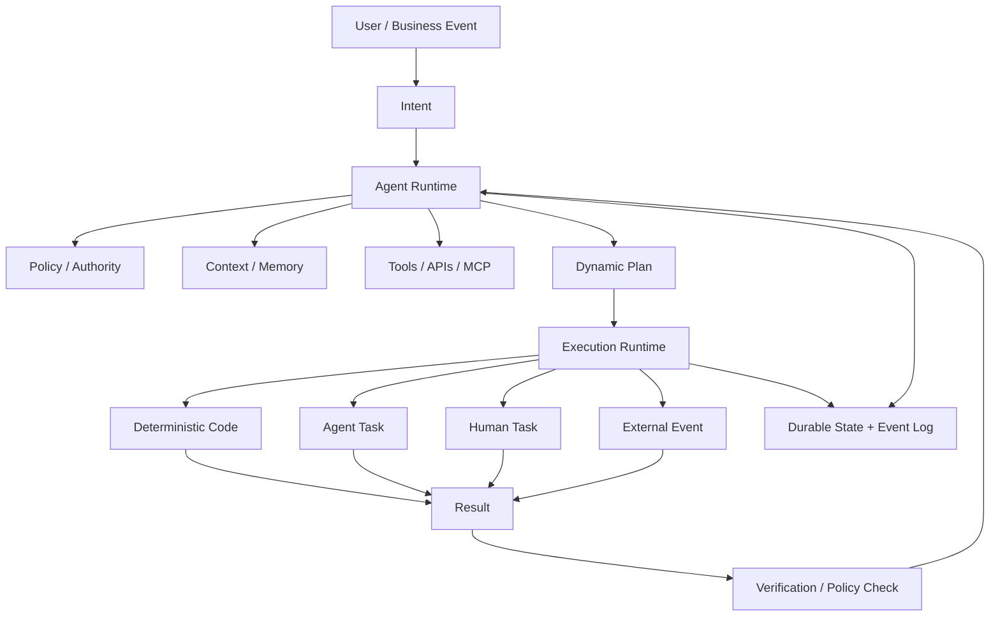
```mermaid
flowchart TD
    U[User / Business Event] --> I[Intent]

    I --> A[Agent Runtime]

    A --> P[Policy / Authority]
    A --> C[Context / Memory]
    A --> T[Tools / APIs / MCP]
    A --> S[Dynamic Plan]

    S --> E[Execution Runtime]

    E --> W1[Deterministic Code]
    E --> W2[Agent Task]
    E --> W3[Human Task]
    E --> W4[External Event]

    W1 --> R[Result]
    W2 --> R
    W3 --> R
    W4 --> R

    R --> V[Verification / Policy Check]
    V --> A

    E --> O[Durable State + Event Log]
    A --> O
```

这里最重要的是：

**Agent 决定“下一步做什么”。
Runtime 决定“这个下一步能不能做、怎么执行、出了问题怎么办”。**

这是和过去 Workflow 最大的区别。

## 2. 传统 Workflow 的核心假设，已经不适合 Agent

传统 Camunda / Fluxnova / Flowable / ServiceNow Workflow 的核心模型大概是：

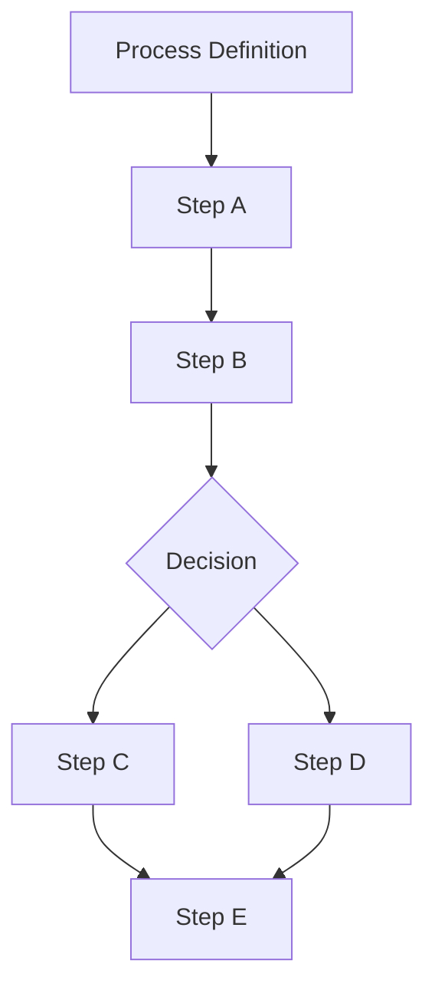
```mermaid
flowchart TD
    P[Process Definition] --> A[Step A]
    A --> B[Step B]
    B --> D{Decision}
    D --> C[Step C]
    D --> DD[Step D]
    C --> E[Step E]
    DD --> E
```

流程在设计期基本确定。

例如：

```text
收到贷款申请
→ 身份验证
→ 信用检查
→ 风险评分
→ 人工审批
→ 放款
```

这是非常优秀的模型，因为：

- 路径比较确定
- 状态比较确定
- 责任边界明确
- 审计要求明确
- SLA 明确

所以 BPMN 仍然有价值。但换成 Agent，任务描述会变成：

```text
“调查这个投资机会，并给出一份结论。”
```

而没人能预先确定 Agent 会走哪条路：

```text
search web
→ search Bloomberg
→ query internal database
→ read 17 documents
→ ask another agent
→ calculate valuation
→ discover missing information
→ search again
→ challenge its own conclusion
→ ask human
→ continue
→ produce report
```

这条路径不可能被提前画出来。

所以：

> **传统 Workflow 是 Design-Time Control Flow。**
>
> **Agent Workflow 是 Runtime Decision + Execution Boundary。**

这是根本区别。

## 3. Google、Microsoft、LangGraph 都在往这个方向走

### Google ADK 2.0

Google 在 2026 年把 ADK 从原来的 hierarchical agent executor 明确转向 **Workflow Runtime + Graph-based execution**。

它现在把 Agent、Tool、Function 全部作为 workflow graph 的节点。

同时支持：

- branching
- parallelism
- loops
- human-in-the-loop
- state preservation
- resume

并明确说原来的 `SequentialAgent / LoopAgent` 正逐步被 graph workflow 取代。([GitHub][2])

关键不在于 Google 说了什么，而在于它的立场：

> 不是“Agent 出现了，所以 Workflow 消失”。
>
> 而是“Workflow 的实现方式必须适应 Agent”。

## 4. Microsoft Agent Framework 也是同样方向

Microsoft Agent Framework 现在把 Workflow 定义成：

```text
Executors
+
Edges
+
State
+
Events
+
Runtime
```

而 Executor 可以是：

- 普通代码
- Agent
- Tool
- sub-workflow

并且 runtime 负责：

- execution
- events
- checkpointing
- HITL
- concurrency
- state management

也就是说：

> **Workflow 不再等价于 Business Process Diagram**，而是**一个可执行的 runtime topology**。([Microsoft Learn][1])

## 5. LangGraph 也是同一个思路

LangGraph 自己把定位说得非常清楚：

> low-level orchestration framework for stateful agents

核心价值不是“画流程”，而是：

```text
State
↓
Node
↓
Decision
↓
Tool
↓
Checkpoint
↓
Resume
```

它特别强调：

- durable execution
- stateful agents
- long-running execution
- failure recovery

也就是说，Graph 在这里不是给业务人员看的流程图，而是：

> **Agent 的执行 runtime。**([GitHub][3])

## 6. Temporal 更能说明这个变化

Temporal 的思路甚至更激进：

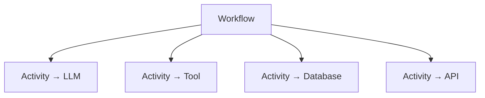
```mermaid
flowchart TD
    W[Workflow] --> A1[Activity → LLM]
    W --> A2[Activity → Tool]
    W --> A3[Activity → Database]
    W --> A4[Activity → API]
```

Workflow 本身负责：

```text
state
ordering
waiting
retry
timeout
resume
```

所有 nondeterministic I/O 都放在 Activity。

Temporal 最近专门发布了 AI Agent Reference Architecture，把 Agent 的 loop 放进 durable Workflow 中。([Temporal][4])

所以它实际上把 **Agent = intelligence** 和 **Workflow = durable execution** 彻底分开了。这个分离非常合理。

## 7. 为什么“Agent Workflow”不该做成 BPMN 2.0

这也解释了为什么用 BPMN 引擎承载 Agent Workflow 会让人本能地抵触。

Fluxnova 本质上仍然是 BPMN 引擎：

```text
BPMN
+
DMN
+
Human Task
+
Process State
+
Audit
```

它现在已经开始加入：

- ad-hoc subprocess
- agentic subprocess
- MCP
- AI integration
- dynamic routing

但它仍然是：

> **BPMN-centered orchestration**，而不是 **Agent-centered execution runtime**。

Fluxnova 3.0 本身仍以 BPMN Process Engine 为核心，只是增加了 Ad Hoc Subprocess 等动态能力；其 roadmap 甚至把 AI integration 放到了后续能力路线。([GitHub][5])

Camunda 的方向也非常清楚：

> **把 Agent 塞进 BPMN**，而不是**重新定义 Workflow**。

Camunda 自己目前强调的也是 deterministic + dynamic orchestration 混合，并且让 BPMN 负责 guardrails、human approval、compliance。([Camunda 8 Docs][6])

这对金融、保险、银行非常合理。但如果目标是一个 **AI-native Agent Platform**，BPMN 不适合作为核心抽象。

## 8. 下一代 Workflow 的五个组成部分

不要再想：

```text
Workflow = DAG / BPMN
```

而应该定义：

```text
Agentic Workflow
=
Intent
+
Policy
+
Execution State
+
Dynamic Plan
+
Durable Runtime
```

### ① Intent

不是：

```text
Start → A → B → C
```

而是：

```text
Goal:
完成投资机会尽调并生成投资建议
```

Agent 负责寻找完成 Goal 的路径。

### ② Policy

这个才是企业 Workflow 最应该固定下来的东西。

例如：

```yaml
policy:
  can_read:
    - market_data
    - research_db

  can_write:
    - draft_report

  approval_required:
    - execute_trade
    - send_external_email

  max_budget:
    tokens: 100000
    tool_calls: 50

  forbidden:
    - customer_pii_export
```

也就是说：

> **固定的不是流程，而是权限和边界。**

这比 BPMN Gateway 重要得多。

### ③ Dynamic Plan

Agent 根据目标动态产生：

```text
Plan 1

1. Search company
2. Retrieve financial data
3. Analyze competitors
4. Identify missing information
5. Search again
6. Build valuation
7. Review assumptions
8. Produce report
```

但这个 Plan **必须持久化**，不是简单存在 LLM context 里面。

例如：

```json
{
  "runId": "invest-20260912-001",
  "goal": "Evaluate XYZ",
  "plan": [
    {
      "id": "t1",
      "type": "research",
      "status": "completed"
    },
    {
      "id": "t2",
      "type": "valuation",
      "status": "running"
    }
  ]
}
```

这时候 Workflow 实际上已经变成：

> **Agent-generated execution plan**，而不是 **Human-authored process definition**。

### ④ Execution State

这是传统 Workflow Engine 最值得保留的东西。

比如：

```text
RUNNING
WAITING_TOOL
WAITING_HUMAN
WAITING_EVENT
FAILED
RETRYING
COMPLETED
CANCELLED
```

这比 BPMN 图本身重要得多。

因为真实 Agent 经常：

```text
运行 25 分钟
↓
等待人工
↓
6 小时以后
↓
继续
```

需要的是这些，而不是漂亮的流程图：

```text
durability
checkpoint
resume
timeout
retry
compensation
idempotency
```

### ⑤ Execution Runtime

真正的核心应该变成：

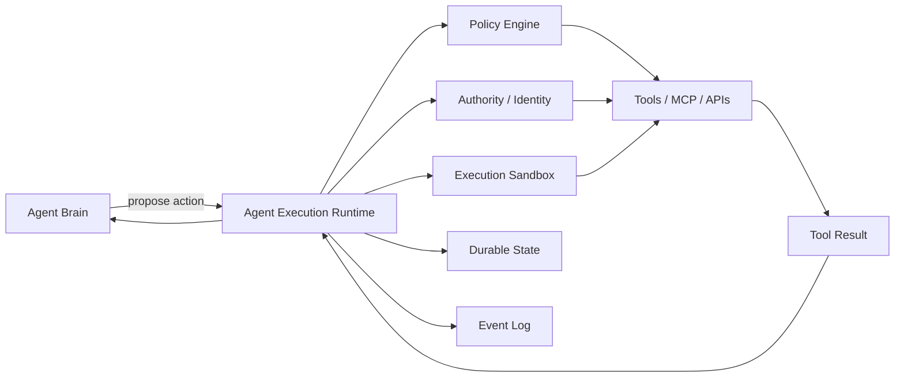
```mermaid
flowchart LR
    Agent[Agent Brain]
    Runtime[Agent Execution Runtime]

    Agent -->|propose action| Runtime

    Runtime --> Policy[Policy Engine]
    Runtime --> Auth[Authority / Identity]
    Runtime --> Sandbox[Execution Sandbox]
    Runtime --> Durable[Durable State]
    Runtime --> Events[Event Log]

    Policy --> Tools[Tools / MCP / APIs]
    Auth --> Tools
    Sandbox --> Tools

    Tools --> Result[Tool Result]
    Result --> Runtime
    Runtime --> Agent
```

**Agent 不应该直接碰生产系统。**

Agent 只负责：

```text
propose
reason
choose
delegate
```

Runtime 负责：

```text
authorize
validate
execute
retry
pause
resume
audit
```

这其实就是未来 Agent Platform 最核心的一层。

## 9. 这也解释了为什么“Low-code Agent Workflow”容易走偏

传统 Low-code：

```text
拖一个 HTTP Node
↓
拖一个 Condition
↓
拖一个 LLM Node
↓
拖一个 Approval Node
```

看起来非常容易。

但真正复杂之后：

```text
LLM 为什么选择这个？
为什么重新搜索？
为什么调用这个 tool？
为什么跳过那个 task？
为什么 context 变了？
为什么 agent 重新规划？
```

最终暴露出来的问题是：

> **最大的复杂度不是“连节点”，而是运行时行为。**

于是最后会出现一个非常荒谬的东西：

```text
Low-code workflow
+
Agent Node
+
Prompt
+
Memory Node
+
Agent Router
+
Tool Node
+
Agent Router
+
Condition
+
Agent Router
```

实际上只是：

> **用 BPMN GUI 给 Agent 套了一层壳。**

这不是长久方向。

## 10. 另一个极端：让 Agent 控制一切

这同样危险。

最差的 AI Workflow：

```text
Agent
  ↓
Agent
  ↓
Agent
  ↓
Agent
  ↓
Agent
```

然后：

> “让模型自己决定整个业务流程。”

金融领域尤其不能这么做。

例如：

```text
Agent → approve loan
Agent → move money
Agent → submit trade
Agent → change risk limit
```

这里不应该是 Agent 自由决定。

更合理：

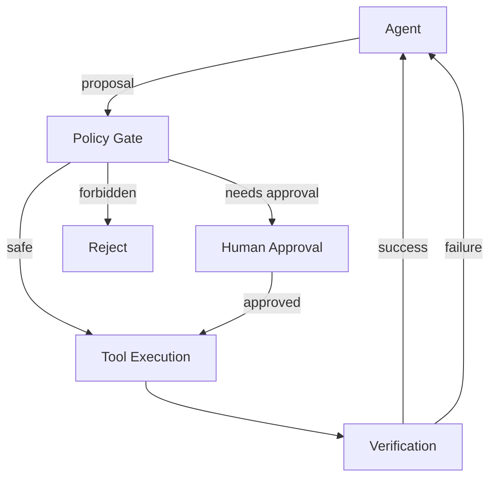
```mermaid
flowchart TD
    A[Agent]
    A -->|proposal| G[Policy Gate]

    G -->|safe| T[Tool Execution]
    G -->|needs approval| H[Human Approval]
    G -->|forbidden| X[Reject]

    H -->|approved| T

    T --> V[Verification]

    V -->|success| A
    V -->|failure| A
```

**Agent 有 autonomy，但没有 unrestricted authority。**

这其实比 Workflow 这个词本身重要得多。

## 11. 企业 AI Platform 的“两层 Workflow”

### Layer 1：Business Process

这个可以继续使用：

```text
BPMN
Camunda
Fluxnova
SAP workflow
ServiceNow
```

解决：

```text
合规
审批
SLA
责任
审计
跨部门流程
```

例如：

```text
开户
→ KYC
→ Risk
→ Approval
→ Account Creation
```

### Layer 2：Agentic Workflow

这完全不同。

例如：

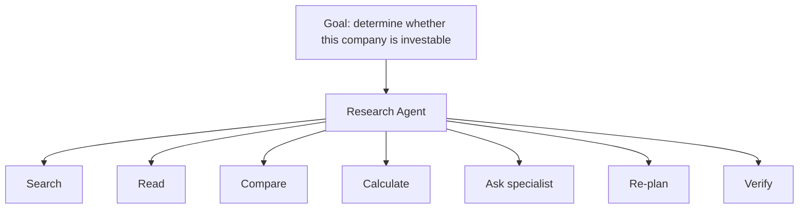
```mermaid
flowchart TD
    G["Goal: determine whether this company is investable"] --> A[Research Agent]
    A --> S1[Search]
    A --> S2[Read]
    A --> S3[Compare]
    A --> S4[Calculate]
    A --> S5[Ask specialist]
    A --> S6[Re-plan]
    A --> S7[Verify]
```

这套能力由下面几部分实现：

```text
Agent Framework
+
Execution Runtime
+
Policy
+
Memory
+
Tool Runtime
+
Durable State
```

## 12. 对应的企业整体架构

内部 AI Platform 更推荐按这个方向设计：

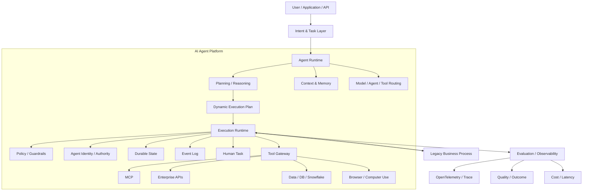
```mermaid
flowchart TB

    UX[User / Application / API]

    UX --> Intent[Intent & Task Layer]

    Intent --> AR[Agent Runtime]

    subgraph AgentPlatform[AI Agent Platform]

        AR --> Planner[Planning / Reasoning]
        AR --> Context[Context & Memory]
        AR --> Router[Model / Agent / Tool Routing]

        Planner --> Plan[Dynamic Execution Plan]

        Plan --> ER[Execution Runtime]

        ER --> Policy[Policy / Guardrails]
        ER --> Identity[Agent Identity / Authority]
        ER --> Durable[Durable State]
        ER --> Event[Event Log]
        ER --> HITL[Human Task]

        ER --> ToolGateway[Tool Gateway]

        ToolGateway --> MCP[MCP]
        ToolGateway --> API[Enterprise APIs]
        ToolGateway --> Data[Data / DB / Snowflake]
        ToolGateway --> Browser[Browser / Computer Use]

    end

    ER --> Eval[Evaluation / Observability]

    Eval --> Trace[OpenTelemetry / Trace]
    Eval --> Quality[Quality / Outcome]
    Eval --> Cost[Cost / Latency]

    BusinessProcess[Legacy Business Process] --> ER
    ER --> BusinessProcess
```

注意这里：

**BPMN / Camunda / Fluxnova 是一个“外部能力”，不是整个 Agent Platform 的核心。**

这和今天很多企业的架构思路会完全不同。

## 13. 落到“DeepAgents + AgentCore + LangSmith”这类平台

更合理的做法是把架构重新分层。

不要：

```text
Angular
 ↓
Experience API
 ↓
LangChain / DeepAgents
 ↓
Camunda
 ↓
Agent
```

而是：

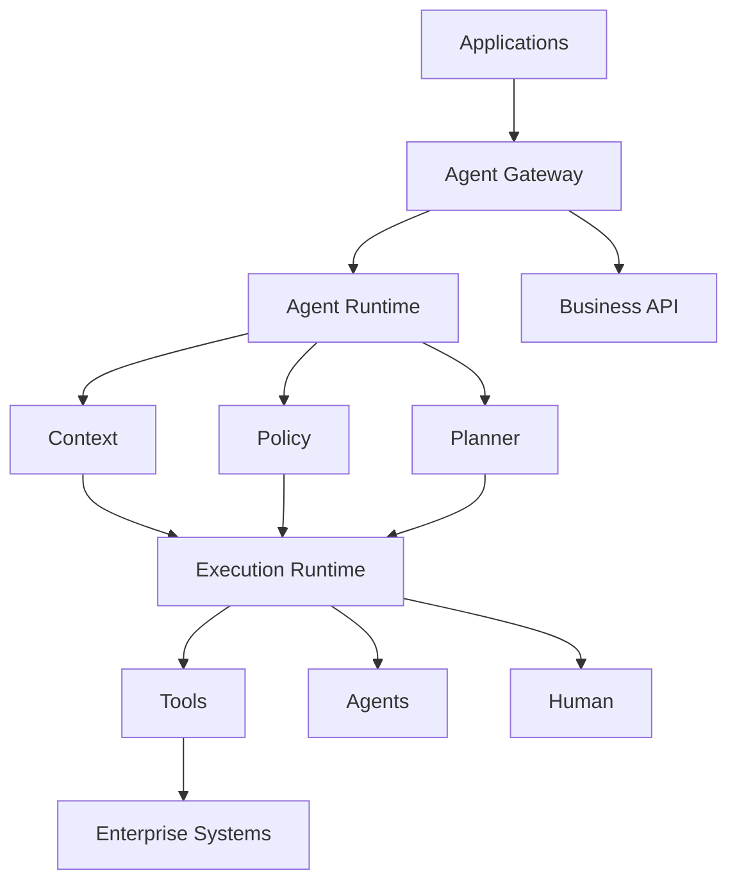
```mermaid
flowchart TD
    APP[Applications] --> GW[Agent Gateway]
    GW --> AR[Agent Runtime]
    GW --> BAPI[Business API]

    AR --> CTX[Context]
    AR --> POL[Policy]
    AR --> PLN[Planner]

    CTX --> ER[Execution Runtime]
    POL --> ER
    PLN --> ER

    ER --> T[Tools]
    ER --> AG[Agents]
    ER --> HU[Human]

    T --> ES[Enterprise Systems]
```

各部分的分工是：

- **Execution**：`Temporal / AgentCore / custom durable runtime`
- **Agent orchestration**：`DeepAgents / LangGraph / Microsoft Agent Framework`
- **Observability + evaluation**：`OpenTelemetry / LangSmith / Foundry`
- **Business process**：`Camunda / Fluxnova`，只用在真正需要 BPMN 的企业流程上

## 14. Workflow 定义本身也在 AI 化

以前：

```text
Developer
   ↓
设计 Workflow
   ↓
部署
```

以后可能是：

```text
Business Intent
      ↓
Agent / Compiler
      ↓
Execution Policy
      ↓
Generated Plan
      ↓
Runtime
```

也就是说：

> **Workflow 从“静态 artifact”变成“动态 execution artifact”。**

最近研究也开始直接研究 Agentic Workflow Generation，也就是从功能描述自动生成可执行 workflow，而研究结果同时指出：单纯让 LLM 生成流程很容易产生缺失/幻觉数据，因此真正可靠的方向是生成 + 约束 + runtime validation，而不是“让 LLM 随便画流程”。([Springer Nature Link][7])

## 15. 甚至“Workflow”这个词都可能逐渐被弱化

未来更准确的词可能是：

```text
Agent Runtime
Agent Execution
Task Orchestration
Agent Operating System
```

而不是：

```text
Workflow Engine
```

一个 2026 年比较有代表性的研究方向已经直接提出 **Agent Operating System (AOS)** 的架构，把系统分成：

```text
Control & Governance Plane
+
Runtime & Coordination Plane
```

前者负责：

```text
intent
policy
authority
trust
audit
human oversight
```

后者负责：

```text
agent lifecycle
workflow coordination
model/tool routing
memory
scheduling
runtime assurance
```

这个方向与前面的架构高度一致。([arXiv][8])

## 16. 最终判断

| 传统方式          | Agent 时代对应物               |
| ----------------- | ------------------------------ |
| BPMN Process      | Execution Policy / Task Model  |
| Gateway           | Policy / Agent Decision        |
| Service Task      | Tool                           |
| Sub-process       | Agent / Sub-agent              |
| Human Task        | Human-in-the-loop              |
| Process Variable  | Durable State                  |
| Process Instance  | Agent Run                      |
| BPMN Engine       | Agent Execution Runtime        |
| DMN               | Policy / Rules Engine          |
| Process Monitor   | Agent Observability            |
| Process History   | Event / Trace                  |
| Workflow Designer | Code / DSL / AI-generated Plan |
| Static Flow       | Dynamic Execution Plan         |

由此可以给一个更精确的说法。一种常见的表述是：

> **“老的那套 Camunda / Fluxnova，甚至所谓 Low-code 产品，都不该再用。”**

这个判断要分两种情况看：

### 对 **Agent Platform 本身**，基本正确。

不要把 `Camunda / Fluxnova / BPMN` 当成核心抽象。

### 对 **Enterprise Business Process**，则不正确。

BPMN 这些东西仍然非常有价值，因为：

```text
法律责任
合规
审批
SLA
审计
跨系统 transaction
human accountability
```

这些东西并不会因为 LLM 出现就消失。

所以真正先进的架构不是：

> **BPMN → Agent**

也不是：

> **Agent → Everything**

而是：

> **Business Process Layer + Agent Execution Layer**

两者之间通过 `typed task / events / policy / authority / durable state` 连接。

## 17. 从零设计一个 2026 年的企业 Agent Workflow Platform

第一步不该是建 Workflow Designer，而应该先建这 7 样东西：

```text
1. Agent Runtime
2. Durable Execution Runtime
3. Tool / MCP Gateway
4. Policy & Authority Engine
5. Context / Memory Runtime
6. Human Task Runtime
7. Trace / Evaluation / Audit
```

然后再决定：

```text
哪些地方需要 BPMN
哪些地方需要 Graph
哪些地方完全由 Agent 动态决定
```

**而不是反过来先选 Camunda，然后想办法把 Agent 塞进去。**

这才是真正的 **AI-native workflow architecture**。

另外值得注意的是，Google、Microsoft、LangGraph、Temporal 当前都在把 workflow 做成 **code/runtime-first 的 graph + state + durable execution**，而不是继续强化传统“业务人员拖节点”的范式；这已经不是单个厂商的偶然选择。([GitHub][2])

把这个结论落到 **“内部 LangChain DeepAgents + AWS AgentCore + LangSmith 的 AI 能力平台”** 上，下一步最值得做的是设计一套 **Agent Runtime / Execution Runtime / Business Process 三层架构**，并把 **Temporal、AgentCore、LangGraph、Microsoft Agent Framework、Camunda/Fluxnova** 放进去逐项对比。这样才能比较清楚地判断一家平台到底应该自己做什么、买什么、哪些东西根本不该引入。

把范围从厂商文档扩大到四类证据——**学术研究、模型厂商实践、企业 AI 平台、金融机构与监管机构的实践**——结论会更完整：

> **2026 年真正成熟的方向，不是“把 BPMN 换成 Agent”，而是把 Workflow 拆成“Agentic Decisioning + Durable Execution + Policy/Authority + Enterprise Ontology/Data + Evaluation”。**
>
> 传统 Workflow 仍然存在，但它越来越像**受约束的外围控制面**，而不是 Agent 平台的核心抽象。

下面这张地图，覆盖的是这五块各自最值得追的线索。

## 18. 学术界：Workflow 已成为 Agent 系统的一等研究对象

目前已经有一批论文不再把 Agent 看成“一个 LLM + tool calling”，而是研究 **Agent Workflow 本身**。

### 1. 《A Survey on Agent Workflow — Status and Future》

这是目前比较值得当作入口的 survey。

论文把 Agent Workflow 按两个维度分类：

- 功能：planning、多 Agent、API、tool、memory
- 架构：agent role、orchestration flow、workflow specification

它明确指出，随着 Agent 系统变复杂，**workflow/orchestration 已经成为 scalable / controllable / secure agent behavior 的核心基础设施**，同时指出标准化、安全和多模态 integration 仍是开放问题。([arXiv][9])

这意味着一个很重要的判断：

> **Workflow 不会消失，只是在从“业务流程建模”变成“智能执行系统建模”。**

## 19. Agent Workflow 的“计算机体系结构”

这点很容易被企业架构师忽视。

### 2. 《Architectural Implications of Agentic AI Workflows》

2026 年 8 月的研究直接分析 Agentic Workflow 对底层基础设施的影响。

核心发现非常有意思：

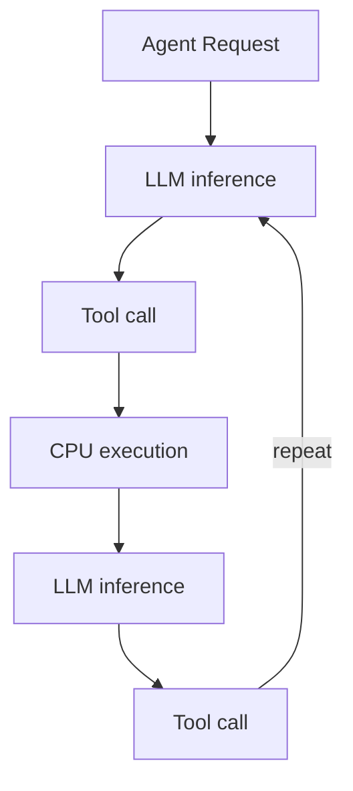
```mermaid
flowchart TD
    RQ[Agent Request] --> L1[LLM inference]
    L1 --> T1[Tool call]
    T1 --> CPU[CPU execution]
    CPU --> L2[LLM inference]
    L2 --> T2[Tool call]
    T2 -->|repeat| L1
```

Agent 不是传统 ML 那种：

```text
input → GPU → output
```

而是：

```text
CPU
GPU
network
external systems
orchestration
CPU
GPU
...
```

不断交替。

结果就是：

- CPU/GPU 利用率不均衡
- execution bursty
- tool invocation 造成 CPU critical path
- multi-agent 增加调度复杂度
- heterogeneous workloads 使传统 server provisioning 变得低效

论文甚至做了专门的 Agentic Server 原型 Agora。([arXiv][10])

这其实说明：

> **Agent Runtime 最终可能会成为一种全新的计算运行时，而不只是 Python framework。**

## 20. Microsoft：Agent + Workflow + Durable Runtime

微软现在实际上同时押了两个方向：

```text
Agent
+
Workflow
+
Durable Runtime
```

而不是二选一。

Microsoft Agent Framework 当前的 Workflow 模型是：

```text
Executor
   ↓
Edges
   ↓
Events
   ↓
State
   ↓
Runtime
```

而不是 BPMN。([Microsoft Learn][11])

更关键的是，它已经加入：

- checkpoint
- human-in-the-loop
- fan-out / fan-in
- sub-workflow
- typed routing
- graph execution
- durable execution

微软还直接提供 Durable Extension，把 Agent Framework Workflow 跑在 Durable Task 基础设施上：

```text
Agent Framework
       ↓
Graph Workflow
       ↓
Durable Task
       ↓
Checkpoint
       ↓
Resume
       ↓
Distributed Workers
```

并支持 agent 可以运行数天甚至数周。([Microsoft Learn][12])

这里已经非常接近这样的三段式模型：

> **Agent = intelligence
> Workflow = execution topology
> Durable Task = runtime**

## 21. Anthropic：不迷信 Workflow 的实践

Anthropic 的路线和微软略有不同。

它最经典的生产案例是 Claude Research。

架构大体是：

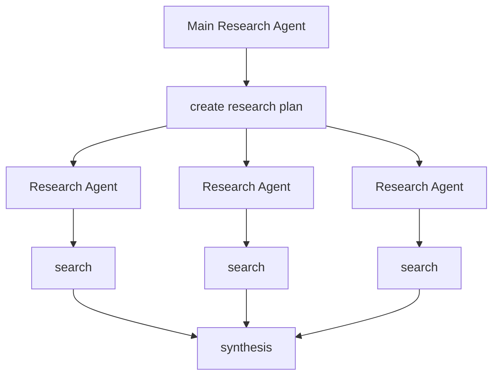
```mermaid
flowchart TD
    M[Main Research Agent] --> P[create research plan]
    P --> R1[Research Agent]
    P --> R2[Research Agent]
    P --> R3[Research Agent]
    R1 --> S1[search]
    R2 --> S2[search]
    R3 --> S3[search]
    S1 --> SY[synthesis]
    S2 --> SY
    S3 --> SY
```

Anthropic 明确指出，他们使用一个主 Agent 制定研究计划，然后启动多个并行 Agent 搜索。与此同时，系统设计最大的难点变成：

- coordination
- evaluation
- reliability
- tool design

而不是传统 workflow 的节点设计。([Anthropic][13])

这与传统 BPMN 的思路差别很大。

## 22. Anthropic 的第二条线：Harness

Anthropic 现在对 Agent 的工程实践越来越集中到：

> **Harness**

而不是：

> Workflow Designer

他们 2026 年的工程文章列表里已经把这些问题分开研究：

- long-running agents
- managed agents
- context engineering
- skills
- tool use
- security
- agent containment
- evals
- multi-agent research ([Anthropic][14])

也就是说：

```text
Model
+
Harness
+
Tools
+
Environment
+
Permissions
+
Context
+
Evaluation
```

正在成为一个比传统 workflow 更核心的抽象。

## 23. OpenAI：从 Agents SDK 到 harness + sandbox

OpenAI 2025 年最初的路线是：

```text
Responses API
+
Agents SDK
+
Tools
+
Handoffs
+
Guardrails
+
Tracing
```

已经明显不是传统 workflow。([OpenAI][15])

2026 年更进一步。

新的 Agents SDK 强调：

> **model-native harness + sandbox + long-horizon task**

也就是说：

```text
Agent
  ↓
Harness
  ↓
Sandbox
  ↓
Tools / Files / Commands
  ↓
Long-running execution
```

并且把 harness 与 compute 分离，强调：

- security
- durability
- scale ([OpenAI][16])

这里隐藏着一个更重要的方向：

> **Agent Workflow 最终可能不是 DAG，而是一个“可持续运行的 Agent Process”。**

## 24. OpenAI 内部应用：delegated long-horizon task

OpenAI 2026 年公开描述内部 Codex 使用情况：

过去：

```text
ChatGPT
→ occasional AI assistance
```

现在：

```text
employee
→ delegate long-horizon task
→ Codex
→ tools
→ files
→ code
→ iterate
→ final result
```

他们把工作单位定义成：

> **delegated long-horizon task**

而不是 single interaction。([OpenAI][17])

## 25. OpenAI Presence：企业 Agent Operating Model

2026 年推出的 Presence 思路尤其值得注意。

它不是：

```text
Workflow Designer
```

而是：

```text
specific job
       ↓
knowledge
       ↓
system access
       ↓
permissions
       ↓
policies
       ↓
agent
       ↓
escalation
       ↓
human
```

例如：

- billing
- insurance claims
- IT service request

每个 Agent 都有明确的：

- 权限
- 工作范围
- approval
- escalation ([OpenAI][18])

这其实已经非常接近金融机构需要的模型。

## 26. Google：Agent Platform + Enterprise Governance

Google 2026 年提出的 Agentic Enterprise blueprint 也是：

```text
Agent
+
Agent Platform
+
Orchestration
+
Governance
+
Enterprise Data
```

而不是：

```text
BPMN
+
LLM Node
```

Google 明确把 Gemini Enterprise 定义成：

> agent development + orchestration + governance

的一体化平台。([Google Cloud][19])

尤其值得注意的是，他们开始支持：

- long-running agents
- agent collaboration spaces
- advanced governance
- agent marketplace ([Google Cloud][20])

这说明大型企业平台厂商的竞争重点正在从：

> “谁有最好的 Agent Builder”

转向：

> **谁能提供企业级 Agent Operating Environment。**

## 27. Snowflake：Data-native 的 Agent 平台

尤其是与 Snowflake AI Platform 相关的部分。

Snowflake 当前的 Cortex Agents 架构已经非常清楚：

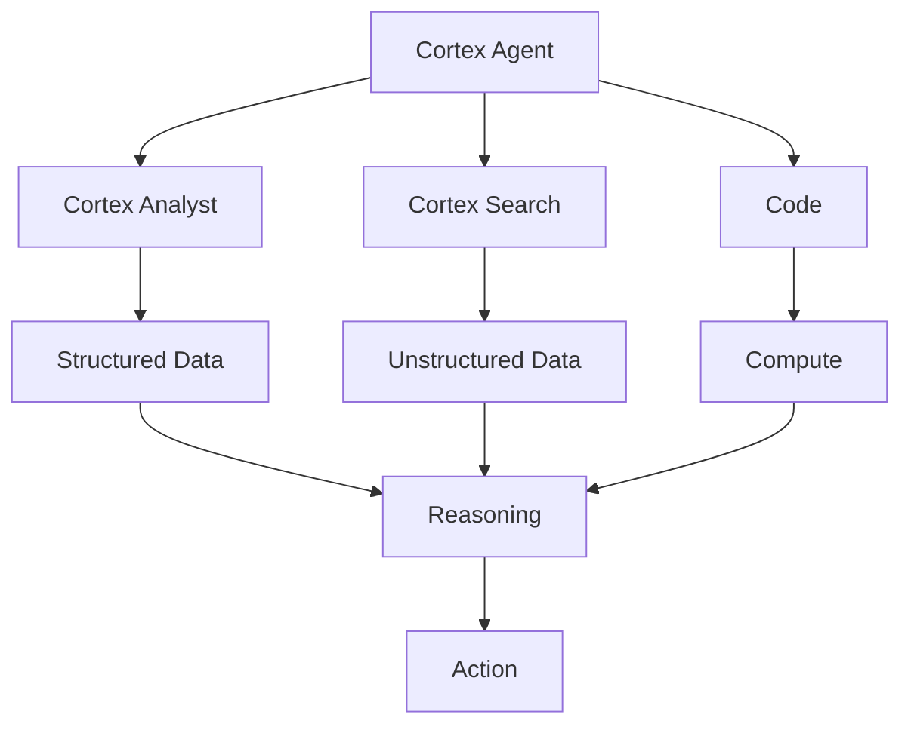
```mermaid
flowchart TD
    CA[Cortex Agent] --> AN[Cortex Analyst]
    CA --> CS[Cortex Search]
    CA --> CD[Code]
    AN --> SD[Structured Data]
    CS --> UD[Unstructured Data]
    CD --> CP[Compute]
    SD --> RS[Reasoning]
    UD --> RS
    CP --> RS
    RS --> AC[Action]
```

Snowflake 官方明确说 Cortex Agents：

- 自己 reasoning
- plan work
- call tools
- execute code
- maintain threads
- orchestration across multiple steps

而且不需要自己建设 orchestration loop / runtime / sandbox。([Snowflake Documentation][21])

更重要的是：

**2026-08-28，Snowflake 已经明确建议从 Cortex Analyst 迁移到 Cortex Agents。**

原因就是 Cortex Agents 把：

```text
structured data
+
unstructured data
+
tool calling
+
thread context
+
multi-step orchestration
```

放到一个 Agent runtime 中。([Snowflake Documentation][22])

## 28. Snowflake 的金融服务架构：Data-native Agent

Snowflake 2026 年针对 Financial Services 的 architecture，核心思想其实不是：

> “做一个金融 Agent。”

而是：

```text
First-party data
+
Third-party data
+
Semantic layer
+
Search
+
Agent
+
Action
```

他们直接说金融 workflow 的核心是把 first-party + third-party data 组合起来，并强调：

- Cortex Analyst
- Cortex Search
- Shared Semantic Views
- Knowledge Extensions
- Cortex Agents

最终让 Agent 在数据所在的位置执行 workflow。([Snowflake][23])

这对于银行、资产管理、保险特别重要。

## 29. Snowflake 的另一条变化：RAG 走向“分析型检索”

2026 年 Snowflake 推出了 Analytical Search。

传统 RAG：

```text
question
 ↓
top-k documents
 ↓
LLM
```

对于：

> “10000 份财报中，有多少家公司……”

其实不行。

Snowflake 的新方向是：

```text
Agent
 ↓
multiple Search queries
 ↓
metadata filters
 ↓
AISQL
 ↓
AI_FILTER
 ↓
AI_AGG
 ↓
aggregate entire corpus
```

也就是说：

> **Agent 不只是“找资料”，而是能够调度一套数据处理 workflow。**([Snowflake Documentation][24])

这个对金融 research、compliance、credit、ESG 极其重要。

## 30. Palantir：Agent 到底应该连接什么

因为 Palantir 其实回答了一个非常关键的问题：

> **Agent 到底应该连接什么？**

Palantir 的答案不是：

```text
Agent
 ↓
1000 API
```

而是：

```text
Enterprise Ontology
```

Ontology 把企业世界建模成：

```text
Objects
Properties
Links
Actions
Logic
Security
```

官方把它概括成：

> **Data + Logic + Action + Security**([Palantir][25])

更形象一点：

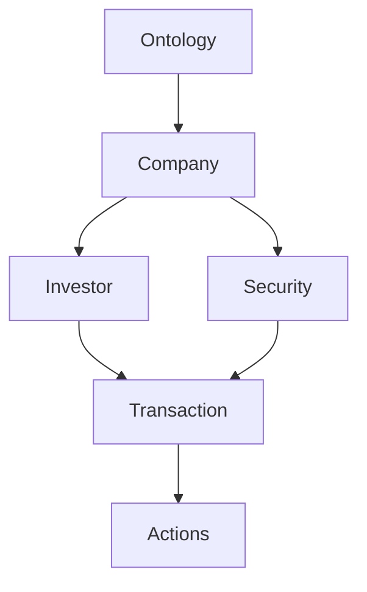
```mermaid
flowchart TD
    ON[Ontology] --> CO[Company]
    CO --> IN[Investor]
    CO --> SE[Security]
    IN --> TR[Transaction]
    SE --> TR
    TR --> AC[Actions]
```

所以 Agent 看到的不是：

```text
table
table
API
API
PDF
database
```

而是：

```text
Company
Portfolio
Position
Transaction
Risk
Counterparty
ResearchReport
```

并且这些对象自带：

```text
actions
logic
permissions
relationships
```

## 31. Palantir 的 Action 模型：nouns 与 verbs

Palantir 有一个非常值得重视的思想：

> 数据只是“nouns”，Action 才是“verbs”。

也就是说：

```text
Company
Position
Loan
Customer
Transaction
```

这些是：

> nouns

而：

```text
Approve
Reject
Rebalance
Create
Assign
Escalate
Freeze
Review
```

这些才是：

> verbs ([Palantir][26])

这恰好解决 Agent 最大的问题：

> **Agent 不只需要知道“这个东西是什么”，还需要知道“对它允许做什么”。**

## 32. Ontology 与 RAG 的差别：world model + action model

传统：

```text
RAG
 ↓
document
 ↓
answer
```

Ontology：

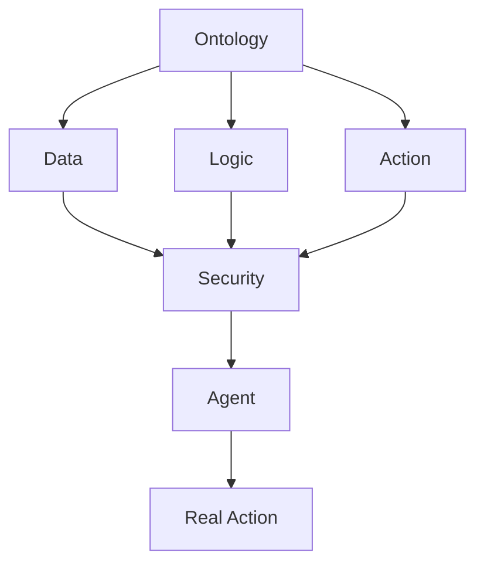
```mermaid
flowchart TD
    ON[Ontology] --> DA[Data]
    ON --> LO[Logic]
    ON --> AC[Action]
    DA --> SE[Security]
    LO --> SE
    AC --> SE
    SE --> AG[Agent]
    AG --> RA[Real Action]
```

因此它本质上是 **Agent 的 enterprise world model + action model**，而不是 Vector DB。

## 33. Ontology MCP：把语义层变成 Agent 的 substrate

这一步尤其重要。

2026-06 Palantir 已经正式 GA Ontology MCP。

意味着：

```text
Claude
OpenAI
Gemini
Microsoft Agent Framework
Google ADK
```

都可以通过 MCP：

```text
read Ontology
+
write Ontology
+
execute Ontology actions
```

而且调用继续使用 Foundry 权限模型。([Palantir][27])

换句话说：

> **Ontology 不需要成为 Agent Framework。**

它变成：

> **Agent 的 enterprise semantic/action substrate。**

这比“Palantir 自己做 Agent Framework”更重要。

## 34. AIP Logic：No-code 没有死，但不再是抽象核心

AIP Logic 仍然是 no-code。

它可以：

```text
Ontology Object
 ↓
LLM
 ↓
Condition
 ↓
Loop
 ↓
Function
 ↓
Action
```

并且支持：

- testing
- evaluation
- monitoring
- automation
- human review ([Palantir][28])

所以 Palantir 的实际答案不是：

> “No-code 已死。”

而是：

> **No-code 不能再是整个系统的抽象。**

它只是：

> **Ontology / Logic / Action 上面的一个 builder。**

这个区别非常重要。

## 35. 学术界的“Agentic Finance”

2026 年有一篇比较完整的 survey：

### Agentic Artificial Intelligence in Finance: A Comprehensive Survey

涵盖：

- financial operations
- financial markets
- architecture
- regulation
- systemic risk
- multi-agent coordination ([arXiv][29])

另外一篇论文直接提出：

### AI Agents in Financial Markets

它把金融 Agent 拆成：

```text
Data Perception
        ↓
Reasoning
        ↓
Strategy Generation
        ↓
Execution + Control
```

并且提出一个非常现实的结论：

> **短期最可能的形态不是 fully autonomous finance，而是 bounded autonomy。**

即：

```text
AI
+
human supervision
+
constrained execution
```

对企业架构而言，这一点影响很大。([arXiv][30])

## 36. 金融 MRM 的 Agentic Workflow 研究

另一项研究直接做了：

```text
Modeling Crew
+
Model Risk Management Crew
```

例如：

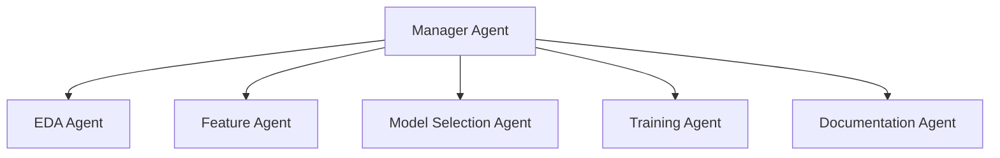
```mermaid
flowchart TD
    M[Manager Agent] --> E1[EDA Agent]
    M --> E2[Feature Agent]
    M --> E3[Model Selection Agent]
    M --> E4[Training Agent]
    M --> E5[Documentation Agent]
```

另一组：

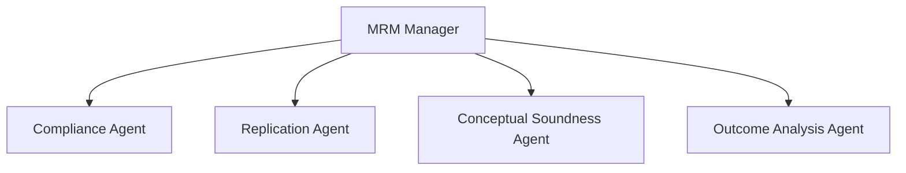
```mermaid
flowchart TD
    M[MRM Manager] --> A1[Compliance Agent]
    M --> A2[Replication Agent]
    M --> A3[Conceptual Soundness Agent]
    M --> A4[Outcome Analysis Agent]
```

并在：

- fraud detection
- credit approval
- credit risk

中做了实验。([arXiv][31])

这其实比“客服 Agent”更接近企业真正的问题。

## 37. 金融业真正担心的问题：Verifiability Gap

而是：

> **Agent 到底代表谁行动？**

这个问题在金融业特别严重。

最新一篇关于 Agentic AI governance in FinTech 的研究甚至提出：

> **Verifiability Gap**

也就是说：

```text
Agent Authority
      ↓
实际执行
      ↓
能否证明：
为什么当时允许它这么做？
```

研究特别强调：

- orchestration 本身是 policy layer
- 不同 orchestration 结构会改变最终决策
- historical replay 可能无法重现
- model/version变化会改变结果
- deterministic replay 并不等于 historical decision replay ([arXiv][32])

传统 Workflow：

```text
same input
→ same BPMN
→ same path
```

Agent：

```text
same input
→ different reasoning
→ different tools
→ different context
→ different outcome
```

所以：

> **Agent Workflow 的审计对象不能只是“流程图”，而必须是 Execution Trace + Context + Authority + Evidence。**

## 38. 监管机构的动向

### Bank of England

2026 年 Financial Stability Report 已经专门讨论 Agentic AI。

其中一个特别值得注意的观察是：

目前金融机构主要使用 Agent：

- research
- coding
- surveillance
- lower-risk operations

而不是：

> autonomous trading

因为核心风险是：

- output 不可预测
- validation 困难
- autonomy boundary 难定义
- correlated behavior ([Bank of England][33])

## 39. FSB 2026：12 类 sound practices

Financial Stability Board 2026 年 AI governance consultation 提出了 12 类 sound practices。

特别强调：

- AI governance
- lifecycle management
- risk identification
- operational resilience
- third-party dependence
- GenAI / agentic AI risks ([Financial Stability Board][34])

这说明金融监管未来看 Agent，不会只看：

> model risk

而会看：

```text
Model
+
Agent
+
Tool
+
Data
+
Permission
+
Runtime
+
Vendor
+
Human Oversight
```

## 40. Stripe：production 级合规 Agent

AWS 与 Stripe 2026 年公开的案例特别有价值。

场景是：

```text
金融合规 review
```

Stripe 面临：

```text
thousands of transactions / day
```

它搭建 production agent system：

```text
Agent
 ↓
AWS Bedrock
 ↓
enterprise data
 ↓
compliance reasoning
 ↓
human review
```

公开结果：

- review handling time ↓ 26%
- helpfulness >96%
- final decision 仍由 human 控制 ([Amazon Web Services, Inc.][35])

注意这里：

**Stripe 并没有让 Agent 直接取代 Compliance Officer。**

它真正做的是：

```text
Agent = investigation / preparation
Human = decision authority
```

这很可能就是金融服务未来几年的主流架构。

## 41. AWS 的金融 Agent 参考架构

AWS 2026 年的 Financial Services AgentCore 架构：

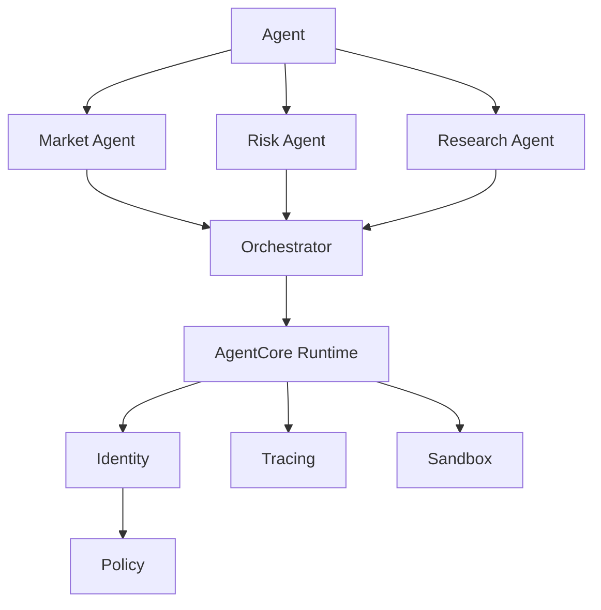
```mermaid
flowchart TD
    A[Agent] --> MA[Market Agent]
    A --> RA[Risk Agent]
    A --> RE[Research Agent]
    MA --> OR[Orchestrator]
    RA --> OR
    RE --> OR
    OR --> RT[AgentCore Runtime]
    RT --> ID[Identity]
    RT --> TR[Tracing]
    RT --> SB[Sandbox]
    ID --> PO[Policy]
```

例如 portfolio advisory：

- portfolio valuation
- risk stress test
- market research
- advisor synthesis

由多个 specialist agents 协同完成。([Amazon Web Services, Inc.][36])

而信用分析案例则是：

```text
Policy PDF
+
Snowflake account history
+
transaction patterns
+
Agent reasoning
+
recommendation
```

这非常接近企业真正的 Agent Workflow。([Amazon Web Services, Inc.][37])

## 42. 金融领域该借鉴的架构

而应该是：

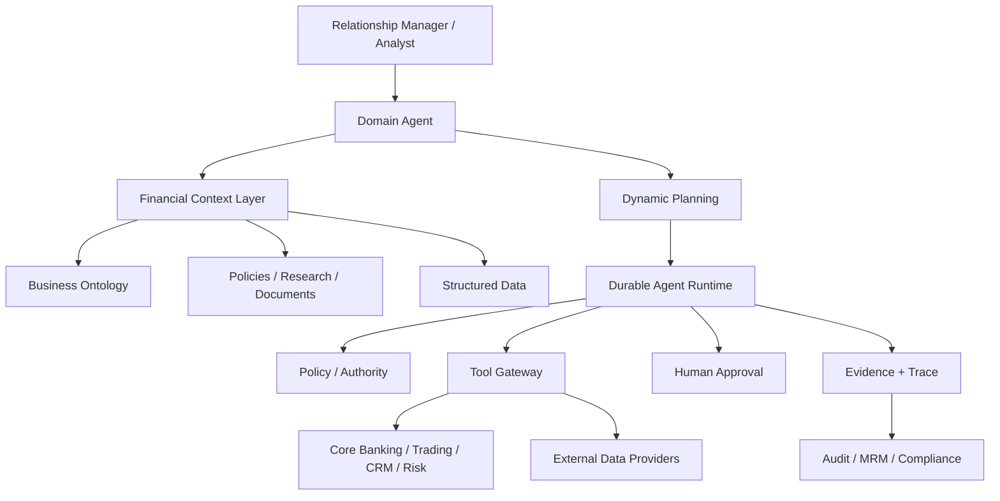
```mermaid
flowchart TB

    User[Relationship Manager / Analyst]

    User --> Agent[Domain Agent]

    Agent --> Context[Financial Context Layer]

    Context --> Ontology[Business Ontology]
    Context --> Docs[Policies / Research / Documents]
    Context --> Data[Structured Data]

    Agent --> Planner[Dynamic Planning]

    Planner --> Runtime[Durable Agent Runtime]

    Runtime --> Policy[Policy / Authority]
    Runtime --> Tool[Tool Gateway]
    Runtime --> Human[Human Approval]

    Tool --> Core[Core Banking / Trading / CRM / Risk]
    Tool --> External[External Data Providers]

    Runtime --> Evidence[Evidence + Trace]
    Evidence --> Audit[Audit / MRM / Compliance]
```

## 43. Workflow 的四种形态

Workflow 大致可以拆成四种。

### A. Deterministic Workflow

```text
if A
then B
else C
```

继续用传统 workflow / code。

例如：

```text
Settlement
Payment
KYC
Regulatory reporting
```

### B. Agentic Workflow

```text
Goal
 ↓
Agent
 ↓
dynamic plan
 ↓
tools
 ↓
replan
 ↓
verify
```

例如：

```text
“调查这家公司是否值得投资”
```

### C. Policy Workflow

这是金融最重要的一类：

```text
Agent wants to act
        ↓
Authorization
        ↓
Risk classification
        ↓
Approval?
        ↓
Execute / Reject
```

这实际上是：

> **Agent governance workflow**

### D. Human Workflow

```text
Agent
 ↓
Prepare decision package
 ↓
Human review
 ↓
Approve / Reject / Modify
 ↓
Agent continues
```

## 44. Workflow Engine 的裂解

过去，一个系统全部负责：

```text
Workflow Engine
```

未来更像：

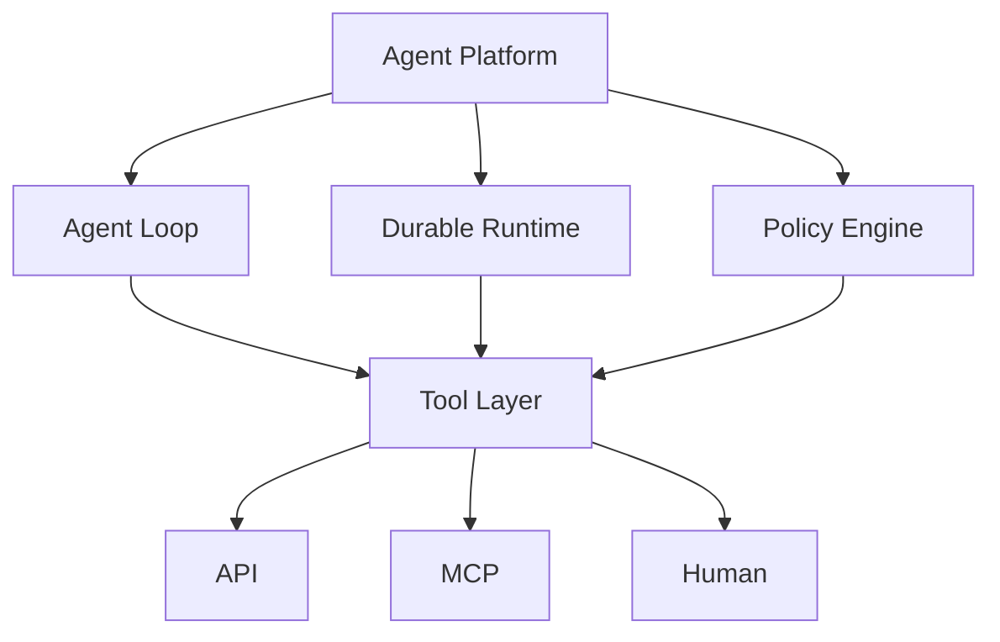
```mermaid
flowchart TD
    AP[Agent Platform] --> AL[Agent Loop]
    AP --> DR[Durable Runtime]
    AP --> PE[Policy Engine]
    AL --> TL[Tool Layer]
    DR --> TL
    PE --> TL
    TL --> AP1[API]
    TL --> MC[MCP]
    TL --> HM[Human]
```

而传统 BPM：

```text
Camunda
Fluxnova
Temporal
ServiceNow
```

分别负责其中一部分 deterministic / durable / business-process 问题。

## 45. Meta-tools：从执行轨迹里“编译”流程

微软研究院最近的一项研究很值得注意：

### Optimizing Agentic Workflows using Meta-tools

它发现很多 Agent Workflow 会反复：

```text
LLM
→ tool
→ LLM
→ tool
→ LLM
→ tool
```

但是这些 tool-call pattern 实际上是稳定重复的。

于是：

```text
Agent Trace
   ↓
发现高频 tool sequence
   ↓
自动封装成 Meta-tool
   ↓
Agent 一次调用
```

这样：

- LLM calls ↓
- latency ↓
- failure ↓
- success rate ↑

实验中 LLM calls 最多减少 11.9%，task success 提升最多 4.2 percentage points。([Microsoft][38])

这个其实揭示了未来 Workflow 一个很重要的方向：

> **Workflow 不一定由人设计，也可能从 Agent execution traces 中“编译”出来。**

## 46. Agent 负责探索，Workflow 负责固化

过去：

```text
Human designs workflow
```

未来可能是：

```text
Agent runs
     ↓
Execution traces
     ↓
Pattern mining
     ↓
Stable subgraph
     ↓
Compile into deterministic tool/workflow
```

于是：

```text
Agent
      ↓
exploration
      ↓
discovery
      ↓
stable pattern
      ↓
deterministic execution
```

最终系统变成：

> **Agent负责探索，Workflow负责固化。**

这可能是未来最漂亮的二者关系。

## 47. 金融服务为什么适合这个模型

例如：

### 投资研究

第一次：

```text
Agent
→ search
→ SEC
→ research
→ valuation
→ competitor
→ analyst review
```

Agent 很自由。

跑了 5000 次以后发现：

```text
Company Financials
→ Peer Analysis
→ DCF
→ Risk Check
→ Report
```

已经高度稳定。

那么这部分就可以：

```text
compile
↓
deterministic research workflow
```

而异常情况仍交给 Agent：

```text
new company
unusual accounting
missing data
conflicting filings
```

这就形成：

```text
80% deterministic workflow
20% agentic exploration
```

而不是：

```text
100% BPMN
```

也不是：

```text
100% autonomous agent
```

这可能是企业金融 AI 最现实的长期架构。

## 48. 业界路线归纳为 5 派

| 路线                  | 代表                       | 核心思想                               |
| --------------------- | -------------------------- | -------------------------------------- |
| Agent Harness         | Anthropic / OpenAI         | Agent + tools + environment            |
| Agent Graph           | LangGraph / Microsoft      | state + graph + execution              |
| Durable Agent Runtime | Temporal / Microsoft / AWS | long-running + checkpoint              |
| Enterprise Ontology   | Palantir                   | data + logic + action + security       |
| Data-native Agent     | Snowflake / Google         | governed data + semantic layer + agent |

其中真正有前景的企业平台，大概率会把它们组合：

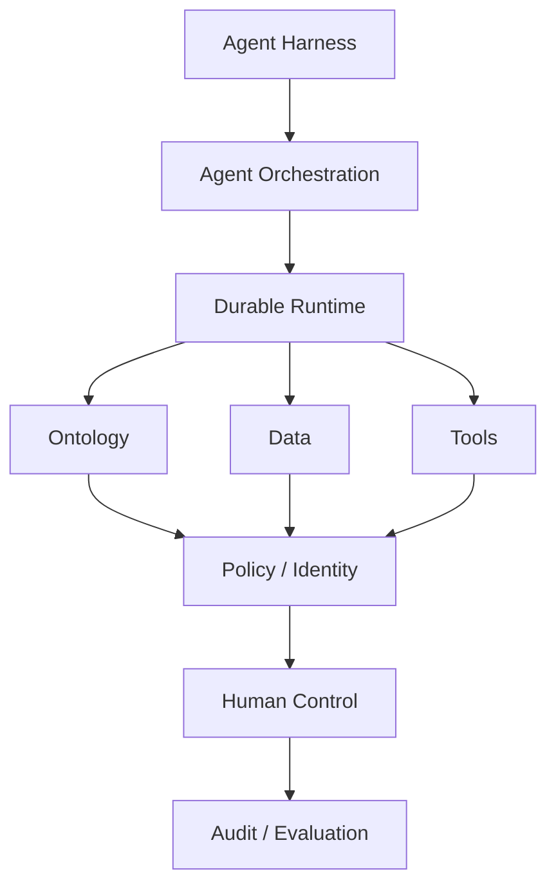
```mermaid
flowchart TD
    HA[Agent Harness] --> AO[Agent Orchestration]
    AO --> DR[Durable Runtime]
    DR --> ON[Ontology]
    DR --> DA[Data]
    DR --> TO[Tools]
    ON --> PI[Policy / Identity]
    DA --> PI
    TO --> PI
    PI --> HC[Human Control]
    HC --> AE[Audit / Evaluation]
```

## 49. 面向金融服务的架构再分层

更完整的一版是：

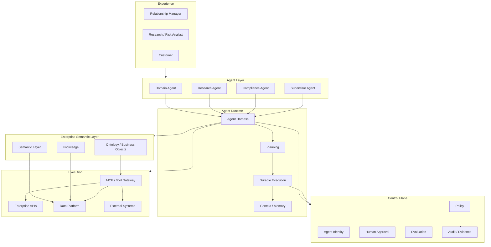
```mermaid
flowchart TB

    subgraph EXPERIENCE["Experience"]
        RM[Relationship Manager]
        Analyst[Research / Risk Analyst]
        Customer[Customer]
    end

    subgraph AGENT["Agent Layer"]
        DA[Domain Agent]
        RA[Research Agent]
        CA[Compliance Agent]
        SA[Supervisor Agent]
    end

    subgraph CONTROL["Control Plane"]
        Policy[Policy]
        Authority[Agent Identity]
        Approval[Human Approval]
        Eval[Evaluation]
        Audit[Audit / Evidence]
    end

    subgraph RUNTIME["Agent Runtime"]
        Harness[Agent Harness]
        Planner[Planning]
        Durable[Durable Execution]
        Memory[Context / Memory]
    end

    subgraph SEMANTIC["Enterprise Semantic Layer"]
        Ontology[Ontology / Business Objects]
        Semantic[Semantic Layer]
        Knowledge[Knowledge]
    end

    subgraph TOOLS["Execution"]
        MCP[MCP / Tool Gateway]
        APIs[Enterprise APIs]
        Data[Data Platform]
        Browser[External Systems]
    end

    EXPERIENCE --> AGENT

    DA --> Harness
    RA --> Harness
    CA --> Harness
    SA --> Harness

    Harness --> Planner
    Planner --> Durable
    Durable --> Memory

    Harness --> CONTROL
    Durable --> CONTROL

    Harness --> SEMANTIC
    Harness --> TOOLS

    Ontology --> MCP
    Semantic --> Data
    Knowledge --> Data

    MCP --> APIs
    MCP --> Data
    MCP --> Browser

    CONTROL --> Audit
```

这里最重要的是：

### **Ontology / Semantic Layer 和 Agent Runtime 是两个不同东西。**

Palantir 最强的是前者。

AWS / Microsoft / OpenAI / Anthropic 最强的是后者。

Snowflake 正在试图把 `Data + Semantic + Agent Runtime` 放在一起。

## 50. 结论

回到最开始那个判断：

> “老的 Camunda / Fluxnova，甚至所谓 Low-code，都不应该再用。”

把论文与各家厂商、监管机构的材料串起来看之后，这个说法值得修正得更精确：

### 错误方向

```text
BPMN
  ↓
LLM Node
  ↓
Agent
```

这确实不是最有前景的 Agent Platform 架构。

### 同样错误

```text
User
 ↓
Autonomous Agent
 ↓
无限 Tool
 ↓
Enterprise
```

金融领域尤其不可接受。

### 更合理的 2026+ 模型

```mermaid
flowchart TD
    GI[Goal / Intent] --> HA[Agent Harness]
    HA --> DP[Dynamic Planning]
    DP --> DR[Durable Agent Runtime]
    DR --> ON[Ontology]
    DR --> DA[Data]
    DR --> TO[Tools]
    ON --> PA[Policy / Authority]
    DA --> PA
    TO --> PA
    PA --> HAP[Human Approval]
    PA --> AU[Auto Execution]
    HAP --> EV[Evidence / Trace]
    AU --> EV
    EV --> EA[Evaluation / Audit]
```

一句话概括：

> **未来的 Workflow 不是“下一步去哪”，而是“Agent 为了完成 Goal，可以在什么边界内，以什么权限，持续做什么，并且如何被暂停、恢复、验证和追责”。**

而 **Palantir Ontology** 解决的是“**世界是什么、能对世界做什么**”；
**Anthropic/OpenAI Harness** 解决的是“**Agent 如何工作**”；
**Microsoft/Temporal/AWS** 解决的是“**Agent 如何可靠地长期运行**”；
**Snowflake/Google** 解决的是“**Agent 如何在企业数据与语义边界内工作**”；
**Policy/Governance** 则解决“**Agent 到底有没有资格做这件事**”。

这五块拼起来，才比较接近 **AI-native enterprise workflow**。

而金融服务真正应该研究的核心不是“哪个 Workflow Engine 最好”，而是：

> **Agentic Decision + Enterprise Ontology + Durable Execution + Authority + Evidence**

这比单纯讨论 Camunda、Temporal、LangGraph 谁替代谁，层次高一个级别。

### 延伸阅读

**学术 / Architecture**

- Agent Workflow Survey ([arXiv][9])
- Architectural Implications of Agentic AI Workflows ([arXiv][10])
- Production-grade Agentic AI Workflows ([arXiv][39])
- Microsoft Agent Workflow Optimization / Meta-tools ([Microsoft][38])
- Agentic AI in Finance Survey ([arXiv][29])
- AI Agents in Financial Markets ([arXiv][30])
- Governing Agentic AI in FinTech ([arXiv][32])

**厂商架构**

- Anthropic Multi-Agent Research ([Anthropic][13])
- OpenAI Agents SDK / Responses API ([OpenAI][15])
- OpenAI Agents SDK 2026 Harness/Sandbox ([OpenAI][16])
- Microsoft Agent Framework Workflows ([Microsoft Learn][11])
- Microsoft Durable Agents ([Microsoft Learn][12])
- Google Agentic Enterprise ([Google Cloud][19])
- Snowflake Cortex Agents ([Snowflake Documentation][21])
- Palantir Ontology Architecture ([Palantir][25])
- Palantir Ontology MCP ([Palantir][27])

**金融服务**

- Stripe production compliance agents ([Amazon Web Services, Inc.][35])
- AWS Financial Services AgentCore ([Amazon Web Services, Inc.][37])
- Snowflake Agentic AI in Financial Services ([Snowflake][23])
- Bank of England 2026 Financial Stability Report ([Bank of England][33])
- FSB AI governance practices ([Financial Stability Board][34])
- FINMA AI survey ([finma.ch][40])

其中 **FSB 的 2026 AI governance consultation、BoE 的 Financial Stability Report、Palantir Ontology、Snowflake Cortex Agents、Microsoft Durable Agent Framework、Anthropic Harness** 这几条线放在一起看，基本就能构成一套比较完整的 **2026 金融 Agent 平台参考架构**。

把“业务分析师能够把大部分流程梳理清楚”这个前提补上之后，前面的结论需要明显调整：

> **对于金融服务，BPMN 不应该被淘汰。**
>
> 如果业务分析架构师能够把大部分业务流程、状态、审批关系、异常路径、职责边界都分析清楚，那么 **BPMN/DMN 反而仍然是最合适的“业务控制平面”**。
>
> 真正应该被改变的，不是“有没有 Workflow”，而是：
>
> **不要让 BPMN 承担 Agent 的智能行为；也不要让 Agent 取代 BPMN 的确定性业务控制。**

于是新的架构可以定义为：

> **Deterministic Business Workflow + Bounded Agentic Execution**

也就是：

```text
业务流程确定性
        +
Agent 局部智能化
        +
统一 Policy / Authority
        +
统一 Audit / Evidence
```

这实际上比“纯 Agent Workflow”更适合银行、保险、资管、证券。

## 51. 先把核心原则重新定义

在这个场景下，整个系统可以拆成两个完全不同的问题：

### 问题 A：业务应该怎么走？

由：

```text
Business Architect
      ↓
BPMN / DMN
      ↓
Workflow Definition
```

确定。

包括：

- 状态
- 顺序
- 并行
- 条件
- 审批
- 角色
- SLA
- 回退
- 异常
- 补偿
- 业务事件

这些**尽量确定**。

### 问题 B：某一步里面具体怎么完成？

这里允许 Agent。

例如：

```text
Compliance Review
       ↓
Agent:
  - 找政策
  - 找历史案例
  - 找相关文件
  - 检查证据
  - 总结风险
  - 提出建议
       ↓
Human
       ↓
Approve / Reject
```

所以：

> **BPMN 决定“做什么、谁做、何时做、结果去哪”。**
>
> **Agent 决定“这一项任务怎么做得更好”。**

这是整个设计最重要的边界。

## 52. 完整架构

```mermaid
flowchart TB

    BA[Business Architect]

    BA --> BPMN[BPMN Process Definition]
    BA --> DMN[DMN / Business Rules]

    subgraph CONTROL["Business Control Plane"]
        BPMN
        DMN
        Roles[Roles / Responsibility]
        SLA[SLA / Escalation]
        Policy[Policy / Authority]
    end

    BPMN --> WR[Workflow Runtime]
    DMN --> WR
    Roles --> WR
    SLA --> WR
    Policy --> WR

    subgraph EXECUTION["Execution Plane"]

        WR --> HT[Human Task]
        WR --> ST[System Task]
        WR --> AT[Agent Task]
        WR --> WF[Sub Workflow]
        WR --> EVT[Wait / Event]

        AT --> AR[Agent Runtime]

        AR --> Context[Context / Knowledge]
        AR --> Tools[Tools / MCP / APIs]
        AR --> Reasoning[Reasoning / Planning]

        Reasoning --> Proposal[Structured Proposal]

        Proposal --> Gate[Policy / Validation Gate]
        Gate --> HT
        Gate --> ST
    end

    subgraph DATA["Enterprise Data"]
        DB[(Business Data)]
        DWH[(Snowflake / Data Platform)]
        DOC[Documents / Knowledge]
    end

    Context --> DB
    Context --> DWH
    Context --> DOC

    subgraph GOVERNANCE["Governance"]
        Audit[Audit Trail]
        Evidence[Evidence]
        Eval[Evaluation]
        Trace[Agent Trace]
    end

    WR --> Audit
    AR --> Trace
    AR --> Evidence
    Gate --> Audit
    AR --> Eval
```

这就是目前最推荐的整体形态。

## 53. 一个非常重要的改变

前面的界定是：

> Workflow 管 State + Action。

在这个前提下，它应该修正为：

> **Workflow 管 State Transition + Business Responsibility。**

也就是：

```text
BPMN
  ↓
State
  ↓
Task
  ↓
Business Rule
  ↓
Next State
```

而 Agent 是：

```text
Task
  ↓
Agent Execution
  ↓
Structured Result
```

Agent 不拥有 Workflow。

## 54. 一个实际金融流程

比如一个投资 Idea 流程：

```text
Draft
  ↓
Research
  ↓
Risk Review
  ↓
Compliance Review
  ↓
PM Review
  ↓
Approved
```

这个流程业务分析师完全可以用 BPMN 表达。

```mermaid
flowchart LR

    A[Draft] --> B[Research]
    B --> C[Risk Review]
    C --> D[Compliance Review]
    D --> E[PM Review]
    E --> F[Approved]

    C --> X1[Reject]
    D --> X1
    E --> X1

    C --> B
    D --> B
    E --> B
```

这里**不需要消灭 BPMN**。

因为这个东西本身就是业务知识资产。

它回答了：

- 谁负责？
- 谁批准？
- 哪一步必须发生？
- 什么情况退回？
- 什么情况结束？
- 哪几个环节并行？

这恰恰是金融业务最需要确定性的部分。

## 55. BPMN 不应该描述 Agent 的内部过程

例如：

```text
Compliance Review
```

不要继续画成：

```text
Compliance
 ↓
Search Policy
 ↓
Search Documents
 ↓
Search Historical Cases
 ↓
LLM Review
 ↓
LLM Critic
 ↓
Search Again
 ↓
Summarize
```

这就走偏了。

BPMN 只写：

```text
Compliance Review
      ↓
Agent-assisted Review
      ↓
Human Decision
```

Agent 内部：

```text
search
→ retrieve
→ reason
→ compare
→ identify gap
→ retrieve again
→ produce evidence
→ draft recommendation
```

属于 Agent Runtime。

这是 **Workflow 和 Agent 最重要的边界**。

## 56. 一个新的概念：Agent Activity

不是：

```text
Agent = Workflow
```

而是：

```text
BPMN Activity
      ↓
Agent Activity
```

例如：

```yaml
activity:
  id: compliance-review
  type: agent-task

  input:
    - investment_case
    - supporting_documents
    - compliance_policy

  output:
    - findings
    - evidence
    - recommendation
    - missing_information

  allowedTools:
    - policy.search
    - document.search
    - risk.lookup

  approval:
    required: true
```

这个 Activity 对 BPMN Runtime 来说仍然是：

> 一个普通 Task。

它只不过内部用了 Agent。

## 57. Agent 的输出必须结构化

这是金融领域必须坚持的一条。

不要：

```text
Agent → 一段自然语言
```

而是：

```json
{
  "decision": "REQUEST_CHANGES",
  "findings": [
    {
      "type": "MISSING_EVIDENCE",
      "description": "2025 cash flow forecast missing"
    }
  ],
  "evidence": [
    {
      "documentId": "doc-123",
      "page": 17
    }
  ],
  "confidence": 0.91
}
```

Workflow Runtime 只接受：

```text
validated structured output
```

然后 BPMN 决定：

```text
REQUEST_CHANGES
        ↓
Research
```

或者：

```text
APPROVE
        ↓
Next Step
```

因此：

> **Agent 提议状态变化，Workflow 决定是否真的发生状态变化。**

## 58. “二阶段提交”思想

在金融 Agent workflow 里，任何 Agent 行为都可以统一看成：

```text
Agent
 ↓
Proposal
 ↓
Validation
 ↓
Authorization
 ↓
Execution
```

例如：

```mermaid
flowchart LR
    A[Agent] --> P[Proposal]

    P --> V[Schema / Business Validation]

    V --> Q[Policy Check]

    Q --> H{Human Approval?}

    H -->|Yes| HA[Human]
    H -->|No| E[Execute]

    HA -->|Approve| E
    HA -->|Reject| R[Reject]

    E --> S[State Transition]
```

这比：

```text
Agent → API
```

安全和可审计得多。

## 59. “审批”的处理

例如 PM Approval：

```text
BPMN:
  PM Approval
```

内部可以：

```text
Agent prepares recommendation
      ↓
Agent highlights:
  - expected return
  - downside
  - risk
  - missing evidence
  - policy violations
      ↓
PM
      ↓
Approve / Reject / Request Changes
```

PM 的按钮仍然是：

```text
Approve
Reject
Request Changes
```

Agent 不能替 PM 点击。

这就是：

> **AI assistance ≠ AI authority**

## 60. “修改”也应该由 BPMN 明确控制

例如：

```mermaid
flowchart LR
    RR[Risk Review] -->|Approve| CP[Compliance]
    RR -->|Reject| EN[End]
    RR -->|Request Changes| RS[Research]
```

这在 BPMN 中完全合理。

然后：

```text
Research
   ↓
修改材料
   ↓
Submit
   ↓
Risk Review
```

这里 BPMN 就是非常漂亮的确定性状态机。

不需要 Agent 去决定：

> “我觉得应该回到 Research。”

## 61. 真正需要 Agent 决策的地方

这条边界应该画得非常严格。

例如：

### 适合 BPMN/DMN

```text
Investment amount > 100M
→ Senior PM approval

High-risk country
→ Compliance mandatory

Product type = Derivative
→ Risk review mandatory
```

这些全部确定性。

### 适合 Agent

```text
这个公司披露的信息有没有前后矛盾？

这份研究报告是否遗漏了重要风险？

这个交易是否存在异常模式？

这份申请材料是否足以支持该结论？

相关政策中是否存在需要特别注意的条款？
```

这些很难纯规则化。

所以：

```text
Deterministic
→ BPMN / DMN

Semantic / Investigative
→ Agent
```

这就是最实用的边界。

## 62. BPMN 反而会变得更简单

这一点很重要。

传统 BPMN 经常被迫表达大量业务逻辑。

Agent 出现以后，反而可以把：

```text
“需要智能判断”
```

封装成：

```text
Agent Task
```

比如：

```text
Before:

Compliance
 ↓
13个 Gateway
 ↓
37个条件
 ↓
8个子流程
```

现在：

```text
Compliance
 ↓
Agent Review
 ↓
Human Decision
```

但不能把所有东西扔给 Agent。

**DMN 继续负责明确业务规则。**

因此更合理：

```mermaid
flowchart LR
    subgraph B["BPMN"]
        B1[Flow]
        B2[Role]
        B3[State]
        B4[Approval]
        B5[Task]
    end
    subgraph D["DMN"]
        D1[Eligibility]
        D2[Threshold]
        D3[Risk classification]
        D4[Approval matrix]
    end
    subgraph AG["Agent"]
        A1[Investigation]
        A2[Interpretation]
        A3[Evidence discovery]
        A4[Recommendation]
    end
```

三者职责非常清楚。

## 63. 三层决策架构

```mermaid
flowchart TB

    L1["Layer 1<br/>Deterministic Business Flow"]
    L2["Layer 2<br/>Deterministic Business Rules"]
    L3["Layer 3<br/>Probabilistic Agent Reasoning"]

    L1 --> L2
    L2 --> L3

    L3 --> G["Validation / Policy Gate"]
    G --> L1
```

### Layer 1：BPMN

回答：

> **流程走哪里？**

### Layer 2：DMN / Policy

回答：

> **什么情况下允许？**

### Layer 3：Agent

回答：

> **如何分析这个复杂问题？**

再回到：

```text
Policy / BPMN
```

形成闭环。

## 64. Agent Runtime 是“嵌入式能力”，不是 Workflow Engine

架构上：

```mermaid
flowchart TD
    BE[BPMN Engine] --> HT[Human Task]
    BE --> ST[System Task]
    BE --> AT[Agent Task]
    AT --> AR[Agent Runtime]
    AR --> TO[Tools]
    AR --> CT[Context]
    AR --> ME[Memory]
```

这时候：

### BPMN Engine

负责：

- execution
- state
- task
- routing
- timers
- events
- retries
- SLA
- human workflow

### Agent Runtime

负责：

- reasoning
- tool use
- context
- memory
- planning
- evidence gathering

两者边界非常干净。

## 65. Camunda / Fluxnova 重新有了合理位置

这一点与前面的结论有明显不同。

如果企业的业务架构师已经大量使用 BPMN，并且企业已经具备：

- BPMN 技能
- 流程资产
- 流程治理
- 审计模型
- 人员职责
- 流程设计规范

那么**不应该建议抛弃 Camunda 一类的 BPMN Runtime**。

反而：

> **保留 BPMN 作为 Business Process Control Plane。**

然后把 Agent Runtime 接进来。

也就是说，不要：

```text
Camunda vs Agent
```

而是：

```text
Camunda
   +
Agent Runtime
```

## 66. 不要把 Agent 逻辑塞进 BPMN

例如不要：

```text
BPMN
 ├─ Agent Call
 ├─ Agent Decision
 ├─ Agent Decision
 ├─ Agent Loop
 ├─ Agent Retry
 ├─ Agent Memory
 ├─ Agent Tool
 ├─ Agent Tool
 └─ Agent Subprocess
```

最终 BPMN 又变成另一种 spaghetti。

正确方式：

```text
BPMN
   ↓
Agent Activity
   ↓
Agent Runtime
```

Agent Runtime 内部再拥有自己的执行模型。

## 67. 企业平台架构收敛为四层

推荐的最终版本：

```mermaid
flowchart TB

    subgraph L1["1. BUSINESS PROCESS PLANE"]
        BA[Business Architect]
        BPMN[BPMN]
        DMN[DMN / Rules]
        SLA[SLA / Escalation]
    end

    subgraph L2["2. WORKFLOW RUNTIME"]
        WR[Workflow Engine]
        State[State]
        Task[Human / System / Agent Tasks]
        Event[Event / Timer]
    end

    subgraph L3["3. AGENT EXECUTION PLANE"]
        AR[Agent Runtime]
        Reason[Reasoning]
        Context[Context Engineering]
        Tools[Tool / MCP]
        Memory[Memory]
        Eval[Agent Evaluation]
    end

    subgraph L4["4. ENTERPRISE CONTROL PLANE"]
        IAM[Identity / Authorization]
        Policy[Policy]
        Audit[Audit]
        Evidence[Evidence]
        Data[Enterprise Data]
    end

    BA --> BPMN
    BA --> DMN

    BPMN --> WR
    DMN --> WR
    SLA --> WR

    WR --> State
    WR --> Task
    WR --> Event

    Task --> AR

    AR --> Reason
    AR --> Context
    AR --> Tools
    AR --> Memory
    AR --> Eval

    AR --> Policy
    WR --> IAM
    AR --> IAM

    Tools --> Data

    WR --> Audit
    AR --> Evidence
    Policy --> Audit
```

## 68. 每一层解决的问题

| 层               | 解决的问题       | 最适合技术                           |
| ---------------- | ---------------- | ------------------------------------ |
| Business Process | 流程应该怎么走   | BPMN                                 |
| Business Rules   | 什么条件成立     | DMN / Rule Engine                    |
| Workflow Runtime | 如何可靠执行     | Camunda / Temporal / Durable Runtime |
| Agent Runtime    | 如何智能完成任务 | Agents SDK / LangGraph / DeepAgents  |
| Policy           | 谁可以做什么     | IAM / Policy Engine                  |
| Data             | 企业事实是什么   | Snowflake / DB / Ontology            |
| Audit            | 发生了什么       | Activity Log / Trace / Evidence      |

这样就不会出现：

> “是不是 Agent 出现以后，BPMN 就过时了？”

答案是：

**不是。**

是职责重新划分。

## 69. “Agent-in-Process”而非“Process-in-Agent”

这两个名字很形象。

### 不推荐

```text
Agent
  ↓
决定整个 Business Process
```

这是：

> **Process-in-Agent**

风险很大。

### 推荐

```text
Business Process
       ↓
   Agent Task
       ↓
    Agent
```

这是：

> **Agent-in-Process**

非常符合金融机构对于：

- predictable
- controllable
- explainable
- auditable

的要求。

## 70. 一个完整案例

例如：

### Investment Idea Review

```mermaid
flowchart TD

    A[Idea Created] --> B[Research]

    B --> C[Risk Review]

    C -->|Approve| D[Compliance Review]
    C -->|Request Changes| B
    C -->|Reject| Z[Rejected]

    D -->|Approve| E[PM Review]
    D -->|Request Changes| B
    D -->|Reject| Z

    E -->|Approve| F[Approved]
    E -->|Request Changes| B
    E -->|Reject| Z
```

### Research Task

Agent：

```text
Search market data
Search company filings
Search internal research
Generate summary
Identify missing evidence
Draft thesis
```

输出：

```text
Research Package
```

Human：

```text
Submit
Request Changes
```

### Risk Task

Agent：

```text
Analyze financials
Calculate risk metrics
Compare peers
Identify anomalies
```

输出：

```text
Risk Findings
Risk Recommendation
Evidence
```

Human：

```text
Approve
Reject
Request Changes
```

### Compliance Task

Agent：

```text
Retrieve policy
Retrieve similar cases
Check restrictions
Identify missing documentation
```

Human：

```text
Approve
Reject
Request Changes
```

### PM Task

Agent：

```text
Summarize entire case
Challenge thesis
Highlight risk
Compare alternatives
```

PM：

```text
Approve
Reject
Request Changes
```

这里 Agent 非常强。

但它从头到尾都没有：

```text
改变 BPMN
跳过审批
修改状态
自己批准
```

除非明确授权。

## 71. 当团队说“允许 Agent 自动审批”

不用改 Workflow。

只需要改变：

```text
Agent Authority Policy
```

比如：

```yaml
agentAuthority:
  riskReview:
    canRecommend: true
    canApprove: false

  documentClassification:
    canRecommend: true
    canApprove: true

  investmentApproval:
    canRecommend: true
    canApprove: false
```

这样：

> **Workflow 定义与 Agent autonomy 解耦。**

这是非常重要的架构稳定性。

## 72. 什么时候允许 Agent 自己完成 BPMN Task

可以建立一个很简单的三级模型：

### Level 0 — Human only

```text
Agent → assist
Human → decision
```

### Level 1 — Agent recommendation

```text
Agent → prepare recommendation
Human → approve
```

### Level 2 — Bounded automation

```text
Agent → execute
Policy → validates
System → commits
```

金融机构前期绝大多数应该是：

> **Level 1**

部分低风险、重复性的任务：

> **Level 2**

Level 0 则用于真正高风险决策。

## 73. 为什么它比“Agent Workflow”更容易治理

因为审计团队可以问：

### “这个业务流程是什么？”

→ BPMN

### “为什么这个 case 进入 Compliance？”

→ BPMN + DMN

### “为什么 Agent 推荐这个结论？”

→ Agent Trace + Evidence

### “Agent 为什么能调用这个 API？”

→ IAM + Policy

### “为什么最终允许这个动作？”

→ Workflow transition + Policy

### “谁最终批准？”

→ Human Task + Identity

整个责任链非常清楚。

## 74. 不会被模型迭代绑死

比如未来可能经历：

```text
Claude
→ GPT
→ Gemini
→ DeepSeek
→ Qwen
```

BPMN 完全不用变。

Agent Runtime 可以变化：

```text
Agent Runtime
   ↓
model abstraction
```

甚至：

```text
2026:
LangGraph

2027:
Microsoft Agent Framework

2028:
internal runtime
```

业务流程仍然是：

```text
BPMN v7
```

这对金融企业尤其重要。

## 75. Palantir Ontology 的定位调整

在业务流程确定的前提下，Ontology 不应该取代 BPMN。

它更适合做：

```text
Business Objects
+
Relationships
+
Actions
+
Semantic Context
```

例如：

```text
Investment
Portfolio
Security
Issuer
Risk
ComplianceRule
ResearchReport
```

然后 BPMN：

```text
什么时间做什么
```

Ontology：

```text
处理的业务对象是什么
```

Agent：

```text
如何理解和分析这些对象
```

所以三者形成：

```text
BPMN
  ↓
Process

Ontology
  ↓
Business World

Agent
  ↓
Intelligence
```

这是一个很漂亮的组合。

## 76. 这套架构的名字

**Deterministic Core, Agentic Edge**

或者更适合企业内部的：

**Deterministic Business Process + Bounded Agent Execution**

核心原则：

```mermaid
flowchart TD
    CORE["Deterministic Core<br/>BPMN · DMN · State · Roles<br/>Approval · SLA · Policy · Audit"]
    EDGE["Agentic Edge<br/>Reasoning · Search · Analysis<br/>Tool use · Planning<br/>Evidence discovery · Recommendation"]
    VAL["Deterministic Validation<br/>Schema · Rule · Policy<br/>Authority · Human Approval"]

    CORE -->|Agent Task| EDGE
    EDGE -->|Structured Result| VAL
```

这才是真正适合金融服务的“新时代 Workflow”。

## 77. 落地时不要重新造 Workflow Engine

如果企业已经有：

- Camunda
- Flowable
- Temporal
- ServiceNow Workflow
- 自研流程平台

**优先复用。**

真正缺的不是：

> “又一个 Workflow Engine”。

而真正缺的是：

```text
Agent Task Runtime
+
Agent Governance
+
Evidence
+
Tool Gateway
+
Agent Evaluation
```

比如现有 Camunda：

```mermaid
flowchart TD
    CA[Camunda] --> HT[Human Task]
    CA --> ST[System Task]
    CA --> GW[Gateway]
    CA --> TI[Timer]
    CA --> AT[Agent Task]
    AT --> AP[Agent Platform]
```

这就已经足够现代。

## 78. 面向金融企业的分阶段落地

### Phase 1：先把确定性 Workflow 做好

```text
BPMN
+
DMN
+
Human Task
+
State
+
Audit
```

先解决：

> **业务流程正确性。**

### Phase 2：Agent-in-Task

给：

```text
Research
Risk
Compliance
Operations
```

逐个增加 Agent Assistant。

重点：

```text
summarize
search
retrieve
analyze
draft
recommend
```

### Phase 3：Bounded Agent Automation

对低风险 Task：

```text
Agent
 ↓
Policy
 ↓
Auto Execute
```

例如：

- 文档分类
- 数据校验
- 信息补全
- 标准化检查

### Phase 4：动态 Agent Sub-process

只有真正发现：

> “业务分析师根本没法把这一段流程事先定义清楚”

才引入：

```text
Agent-driven sub-workflow
```

而且这个动态部分仍然被一个明确的 BPMN Activity 包起来：

```text
BPMN
  ↓
Dynamic Agent Subprocess
  ↓
Validated Result
  ↓
BPMN
```

这样既不会阻碍 AI，也不会破坏金融业务的确定性。

## 79. 最终定义

> **BPMN 是企业业务流程的确定性合同；DMN/Policy 是业务规则和权限合同；Agent 是完成复杂任务的智能执行者；Workflow Runtime 负责状态和生命周期；所有 Agent 输出必须经过结构化验证和必要的人工/策略批准，才能影响业务状态。**

于是：

```mermaid
flowchart TD
    BA[Business Architect] --> BD[BPMN / DMN]
    BD --> WR[Workflow Runtime]
    WR --> HT[Human Task]
    WR --> ST[System Task]
    WR --> AT[Agent Task]
    AT --> AR[Agent Runtime]
    AR --> CT[Context]
    AR --> TO[Tools]
    AR --> RE[Reasoning]
    CT --> SR[Structured Result]
    TO --> SR
    RE --> SR
    SR --> PV[Policy / Validation]
    PV --> HA[Human Approval]
    PV --> AE[Auto Execute]
    HA --> BS[BPMN State]
    AE --> BS
```

**这套架构比“彻底 Agent 化 Workflow”更适合金融，也比“给 BPMN 加一个 LLM Node”更实用。**

它的关键不是推翻传统 Workflow，而是把边界划得非常清楚：

**业务流程仍然确定；复杂任务开始智能化；业务状态仍然由确定性 Runtime 控制。**

这也是真正落地时应该坚持的主线。

[1]: https://learn.microsoft.com/en-us/agent-framework/workflows/workflows "Microsoft Agent Framework Workflows - Workflow Builder & Execution | Microsoft Learn"
[2]: https://github.com/google/adk-docs/blob/main/docs/2.0/index.md "adk-docs/docs/2.0/index.md at main · google/adk-docs · GitHub"
[3]: https://github.com/langchain-ai/langgraph "GitHub - langchain-ai/langgraph: Build resilient agents. · GitHub"
[4]: https://go.temporal.io/platform-hub/ai-engineering/ai-reference-architecture "AI Agent Reference Architecture | Temporal Platform Hub"
[5]: https://github.com/finos/fluxnova-bpm-platform/releases "Releases · finos/fluxnova-bpm-platform · GitHub"
[6]: https://docs.camunda.io/docs/components/agentic-orchestration/ao-design/ "Design and architecture | Camunda 8 Docs"
[7]: https://link.springer.com/article/10.1365/s40702-026-01299-4 "Agentic Workflow Generation: Mit Agentic AI von der funktionalen Beschreibung zur ausführbaren Prozesslogik | HMD Praxis der Wirtschaftsinformatik | Springer Nature Link"
[8]: https://arxiv.org/abs/2608.03214 "The Agent Operating System (AOS): A Reference Operating Architecture for Distributed Agentic Systems"
[9]: https://arxiv.org/abs/2508.01186 "A Survey on Agent Workflow -- Status and Future"
[10]: https://arxiv.org/abs/2608.04458 "Architectural Implications of Agentic AI Workflows"
[11]: https://learn.microsoft.com/en-us/agent-framework/concepts/workflows/ "Workflow concepts | Microsoft Learn"
[12]: https://learn.microsoft.com/en-us/agent-framework/integrations/durable-extension "Durable Extension | Microsoft Learn"
[13]: https://www.anthropic.com/engineering/multi-agent-research-system "How we built our multi-agent research system \\ Anthropic"
[14]: https://www.anthropic.com/engineering "Engineering \\ Anthropic"
[15]: https://openai.com/index/new-tools-for-building-agents/ "New tools for building agents | OpenAI"
[16]: https://openai.com/index/the-next-evolution-of-the-agents-sdk/ "The next evolution of the Agents SDK | OpenAI"
[17]: https://openai.com/index/how-agents-are-transforming-work/ "How agents are transforming work | OpenAI"
[18]: https://openai.com/index/introducing-openai-presence/ "Introducing OpenAI Presence | OpenAI"
[19]: https://cloud.google.com/blog/products/ai-machine-learning/the-new-gemini-enterprise-one-platform-for-agent-development "The new Gemini Enterprise: one platform for agent development | Google Cloud Blog"
[20]: https://cloud.google.com/blog/products/ai-machine-learning/whats-new-in-gemini-enterprise "What’s new in Gemini Enterprise | Google Cloud Blog"
[21]: https://docs.snowflake.com/en/user-guide/snowflake-cortex/cortex-agents "Cortex Agents | Snowflake Documentation"
[22]: https://docs.snowflake.com/en/release-notes/2026/other/2026-08-28-cortex-analyst-transition-cortex-agents "Aug 28, 2026: Snowflake recommends transitioning from Cortex Analyst to Cortex Agents | Snowflake Documentation"
[23]: https://www.snowflake.com/en/blog/agentic-orchestration-financial-services/ "Agentic AI in Financial Services: The Ecosystem Agent Framework"
[24]: https://docs.snowflake.com/en/release-notes/2026/other/2026-06-30-analytical-search-public-preview "Jun 30, 2026: Analytical search (*Public Preview*) | Snowflake Documentation"
[25]: https://www.palantir.com/docs/foundry/architecture-center/ontology-system "The Ontology system • Palantir"
[26]: https://www.palantir.com/docs/foundry/ontology/why-ontology "Why create an Ontology? • Palantir"
[27]: https://www.palantir.com/docs/foundry/announcements/2026-06 "June 2026 • Announcements • Palantir"
[28]: https://www.palantir.com/docs/foundry/logic "AIP Logic • Overview • Palantir"
[29]: https://arxiv.org/abs/2604.21672 "Agentic Artificial Intelligence in Finance: A Comprehensive Survey"
[30]: https://arxiv.org/abs/2603.13942 "AI Agents in Financial Markets: Architecture, Applications, and Systemic Implications"
[31]: https://arxiv.org/abs/2502.05439 "Agentic AI Systems Applied to tasks in Financial Services: Modeling and model risk management crews"
[32]: https://arxiv.org/abs/2608.11344 "Governing Agentic AI in FinTech"
[33]: https://www.bankofengland.co.uk/financial-stability-report/2026/july-2026 "Financial Stability Report - July 2026 | Bank of England – the UK's central bank"
[34]: https://www.fsb.org/2026/06/sound-practices-for-responsible-adoption-of-artificial-intelligence-ai-consultation-report/ "Sound Practices for Responsible Adoption of Artificial Intelligence (AI): Consultation report - Financial Stability Board"
[35]: https://aws.amazon.com/blogs/machine-learning/production-grade-ai-agents-for-financial-compliance-lessons-from-stripe/ "Production-grade AI agents for financial compliance: Lessons from Stripe | Artificial Intelligence"
[36]: https://aws.amazon.com/blogs/industries/multi-agent-systems-for-financial-services-on-amazon-eks-and-agentcore/ "Multi-Agent Systems for Financial Services on Amazon EKS and AgentCore | AWS for Industries"
[37]: https://aws.amazon.com/blogs/industries/ai-credit-analytics-across-amazon-s3-and-snowflake-with-amazon-bedrock-agentcore/ "AI Credit Analytics Across Amazon S3 and Snowflake with Amazon Bedrock AgentCore | AWS for Industries"
[38]: https://www.microsoft.com/en-us/research/publication/optimizing-agentic-workflows-using-meta-tools/ "Optimizing Agentic Workflows using Meta-tools - Microsoft Research"
[39]: https://arxiv.org/abs/2512.08769 "A Practical Guide for Designing, Developing, and Deploying Production-Grade Agentic AI Workflows"
[40]: https://www.finma.ch/en/news/2025/04/20250424-mm-umfrage-ki/ "FINMA survey: artificial intelligence gaining traction at Swiss financial institutions | FINMA"
