2026 年关于“业务流程该用 BPMN 还是 Agent”的讨论，很容易滑向两个极端：一种认为 Workflow 已经过时，另一种把 Agent 当成一个新的节点类型塞进旧流程。把厂商文档、开源实现、学术研究和金融机构的实践放在一起看，得到的答案不是二选一。

这篇文章要回答的问题只有一个：

> **在金融服务里，确定性的业务流程和概率性的智能能力，应该怎么被拼在一起？**

结论先放在这里：

> **金融服务不应该在 BPMN 和 Agent 之间二选一。BPMN/DMN 负责确定性的业务流程、业务规则和责任边界；Agent 负责流程内部那些难以规则化的认知任务；Workflow Runtime 负责业务状态和生命周期；Policy/IAM 负责 Agent 的权限；Agent 的输出必须以受约束的 Task Contract 返回，并经过确定性验证、以及按风险需要的人工批准，才能产生业务副作用。**

### 这篇文章的结构

需要先说明一件事：本文前半部分讨论的 Agent-first 模型（Agent Runtime + Dynamic Plan + Durable Runtime），是**通用 Agent 平台**这一路线的真实主张，也是 2026 年厂商投入最大的一条线。它是趋势的一部分，但不是本文对金融业务的结论。

所以全文按两条线组织：

| 部分         | 回答什么                       | 性质                            |
| ------------ | ------------------------------ | ------------------------------- |
| 第一部分     | 为什么两个极端都不成立         | 问题定义                        |
| 第二部分     | 行业四条路线各自在解决什么     | 趋势观察（含 Agent-first 路线） |
| 第三部分     | 金融为什么不能照搬             | 约束条件                        |
| 第四、五部分 | 主线架构与 Agent Task Contract | 本文结论                        |
| 第六至九部分 | 案例、选型、落地、长期演进     | 可执行部分                      |

只想看结论的读者，可以直接跳到第四部分和第五部分。

# 第一部分：问题定义

## 1. 两个极端

Agent 进入业务流程的早期，工程团队通常会落到两个极端之一。

**第一个极端是“BPMN → Agent”。**

在既有的流程引擎里加一个 Agent 节点，把原来需要智能判断的那一步换成一次 LLM 调用：

```text
Service Task
    ↓
LLM Node
    ↓
Service Task
```

流程图画得很完整，看起来很可控。

**第二个极端是“Agent → Everything”。**

把整个业务流程交给 Agent：

```text
User Intent
    ↓
Agent
    ↓
Tool / Tool / Tool
    ↓
Business Outcome
```

看起来很先进，演示效果通常也很好。

两个极端的问题不一样，但根子是同一个：

> **它们都把“业务流程”和“认知任务”当成了同一种东西。**

业务流程要回答的是“做什么、谁做、什么时候做、结果去哪、出问题谁负责”；认知任务要回答的是“这一步具体怎么想清楚”。前者需要确定性，后者本质上不确定。

把它们混成一层，无论混在 BPMN 里还是混在 Agent 里，都会出问题。接下来三节分别说明：传统 Workflow 的边界在哪里，以及两种混法各自错在哪，错得有多贵。

## 2. 传统 Workflow 的假设，以及它的真实边界

传统 Camunda / Fluxnova / Flowable / ServiceNow Workflow 的核心模型大概是：

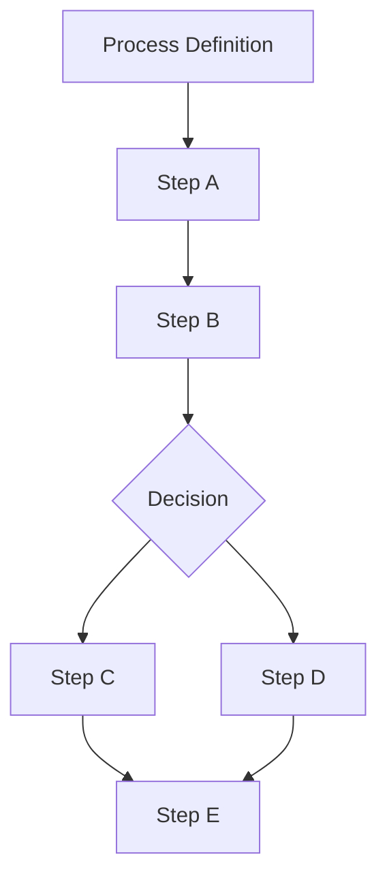

流程在设计期基本确定。

例如：

```text
收到贷款申请
→ 身份验证
→ 信用检查
→ 风险评分
→ 人工审批
→ 放款
```

这是非常优秀的模型，因为：

- 路径比较确定
- 状态比较确定
- 责任边界明确
- 审计要求明确
- SLA 明确

所以 BPMN 仍然有价值。但换成 Agent，任务描述会变成：

```text
“调查这个投资机会，并给出一份结论。”
```

而没人能预先确定 Agent 会走哪条路：

```text
search web
→ search Bloomberg
→ query internal database
→ read 17 documents
→ ask another agent
→ calculate valuation
→ discover missing information
→ search again
→ challenge its own conclusion
→ ask human
→ continue
→ produce report
```

这条路径不可能被提前画出来。

所以：

> **传统 Workflow 是 Design-Time Control Flow。**
>
> **Agent Workflow 是 Runtime Decision + Execution Boundary。**

这是根本区别。

### 一个容易被忽略的技术细节：BPMN 不是状态机

这里有一个在架构评审时经常被追问、但很多文档写错的点。

严格来说，BPMN 是**流程建模与编排的记法（process model / orchestration notation）**。运行时才产生 process instance，以及这个实例在流程图上的 token position 与执行状态。

所以更准确的表述是：

> **BPMN 提供确定性的流程模型和状态转移语义；具体某个 Process Instance 当前处于什么状态，由 Workflow Runtime 持有。**

把 BPMN 直接等同于“状态机”，作为通俗解释没问题，但写进架构文档会带来两个后果：一是把**模型**和**运行时状态**混为一谈；二是在讨论“状态到底应该存在哪里、出事故时以谁为准”时，失去判断依据。

真正需要持有状态的是 Runtime，而不是图。这一点在后面的分层里很关键——因为“Agent 能不能改流程状态”这个问题的答案，取决于状态的所有权在谁手上，而不取决于图是怎么画的。

## 3. 第一个极端：给 BPMN 加一个 LLM Node

传统 Low-code：

```text
拖一个 HTTP Node
↓
拖一个 Condition
↓
拖一个 LLM Node
↓
拖一个 Approval Node
```

看起来非常容易。

但真正复杂之后：

```text
LLM 为什么选择这个？
为什么重新搜索？
为什么调用这个 tool？
为什么跳过那个 task？
为什么 context 变了？
为什么 agent 重新规划？
```

最终暴露出来的问题是：

> **最大的复杂度不是“连节点”，而是运行时行为。**

于是最后会出现一个非常荒谬的东西：

```text
Low-code workflow
+
Agent Node
+
Prompt
+
Memory Node
+
Agent Router
+
Tool Node
+
Agent Router
+
Condition
+
Agent Router
```

实际上只是：

> **用 BPMN GUI 给 Agent 套了一层壳。**

这不是长久方向。

同样的道理，也不要把 Agent 的内部逻辑画进 BPMN。

例如不要：

```text
BPMN
 ├─ Agent Call
 ├─ Agent Decision
 ├─ Agent Decision
 ├─ Agent Loop
 ├─ Agent Retry
 ├─ Agent Memory
 ├─ Agent Tool
 ├─ Agent Tool
 └─ Agent Subprocess
```

最终 BPMN 又变成另一种 spaghetti。

正确方式：

```text
BPMN
   ↓
Agent Activity
   ↓
Agent Runtime
```

Agent Runtime 内部再拥有自己的执行模型。

## 4. 第二个极端：让 Agent 决定整个业务流程

这同样危险。

最差的 AI Workflow：

```text
Agent
  ↓
Agent
  ↓
Agent
  ↓
Agent
  ↓
Agent
```

然后：

> “让模型自己决定整个业务流程。”

金融领域尤其不能这么做。

例如：

```text
Agent → approve loan
Agent → move money
Agent → submit trade
Agent → change risk limit
```

这里不应该是 Agent 自由决定。

更合理：

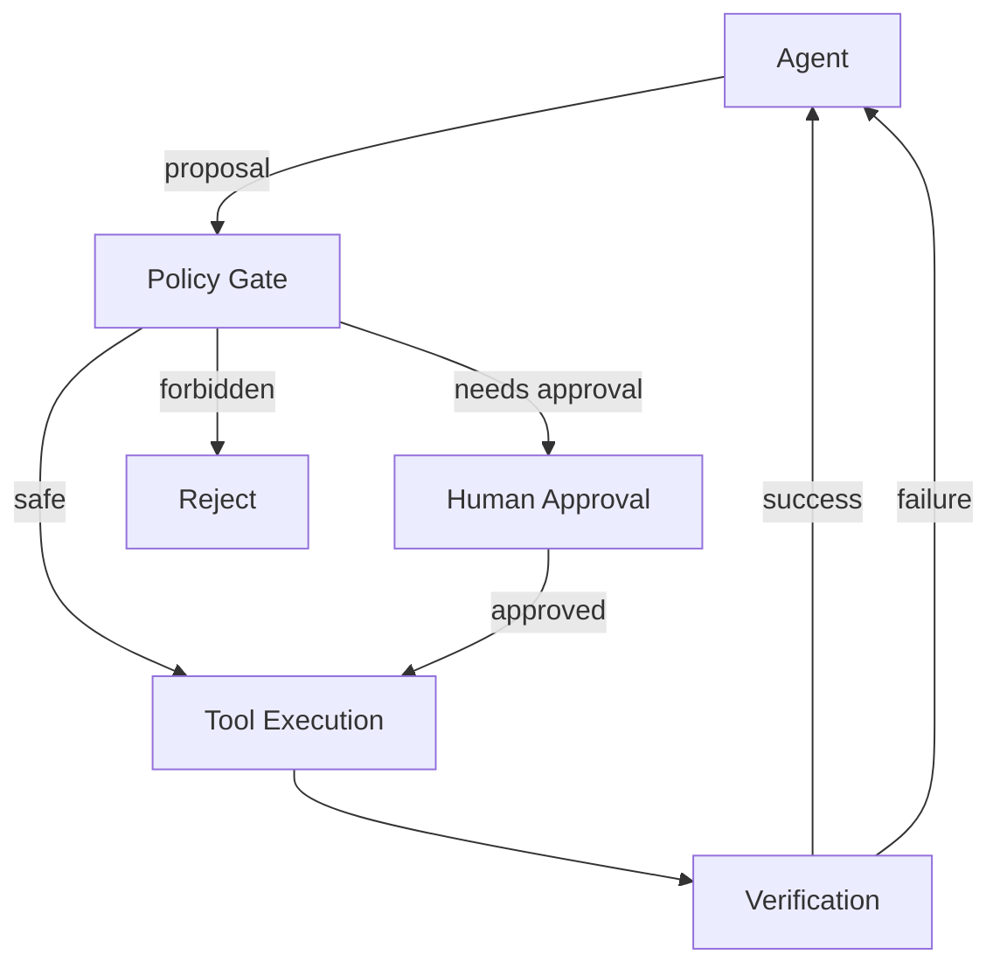

**Agent 有 autonomy，但没有 unrestricted authority。**

这其实比 Workflow 这个词本身重要得多。

# 第二部分：业界趋势

## 5. 四条路线总览

2026 年的行业实践，可以按“各自解决什么问题”归成四条路线。它们不是互相替代的关系，而是分别占住了架构的不同层。

| 路线                                | 解决的问题                  | 主要线索                                            |
| ----------------------------------- | --------------------------- | --------------------------------------------------- |
| 路线一 · 确定性业务编排             | 流程、责任、审批、SLA、审计 | Camunda / Fluxnova                                  |
| 路线二 · Agent Runtime 与 Harness   | Agent 如何工作              | OpenAI / Anthropic / LangGraph / Microsoft / Google |
| 路线三 · Durable Execution          | Agent 如何可靠地长期运行    | Temporal / Durable Task                             |
| 路线四 · Enterprise Semantic & Data | Agent 在什么世界里工作      | Palantir / Snowflake                                |

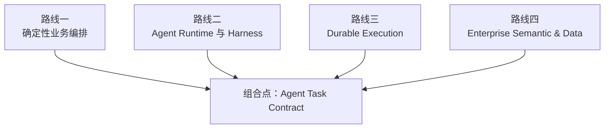

这个分组方式本身就是一个判断：**这四件事不在同一个维度上，所以不能用“谁替代谁”来讨论。**

把路线二三混成一句“Agent Workflow 取代了 BPMN”，是这一轮技术讨论里最普遍的一次偷换。后面的第 42 节会把这个问题拆到产品层面。

## 6. 路线一 · 确定性业务编排（Camunda / Fluxnova）

为什么用 BPMN 引擎承载 Agent Workflow 会让人本能地抵触？

Fluxnova 本质上仍然是 BPMN 引擎：

```text
BPMN
+
DMN
+
Human Task
+
Process State
+
Audit
```

它现在已经开始加入：

- ad-hoc subprocess
- agentic subprocess
- MCP
- AI integration
- dynamic routing

但它仍然是：

> **BPMN-centered orchestration**，而不是 **Agent-centered execution runtime**。

Fluxnova 3.0 本身仍以 BPMN Process Engine 为核心，只是增加了 Ad Hoc Subprocess 等动态能力；其 roadmap 甚至把 AI integration 放到了后续能力路线。([GitHub][5])

### 更准确的说法：deterministic + dynamic，而不是“把 Agent 塞进 BPMN”

前面那句“Camunda 的方向是把 Agent 塞进 BPMN”，只说对了一半。

Camunda 8.7 的官方文档已经把这件事定义得非常明确：agentic orchestration 是**把确定性编排和动态（AI 驱动）编排混合进同一个端到端流程**。原文的表述是，AI agent 负责执行流程中**非确定性**的部分，而 BPMN 提供可预测性、合规性和客户体验的底座。([Camunda 8 Docs][41])

分工是清楚的：

```text
LLM：
决定调用什么工具、以什么顺序、什么时候停止

Camunda：
执行 BPMN elements
保存 process state
retry / incident
human task
确定性逻辑
process boundary
```

所以更准确的表述是：

> **Camunda 正在把 BPMN 从“纯确定性流程”扩展成“确定性流程 + 受治理的 Agentic Subprocess”。**

具体的设计与架构建议，见 Camunda 的《Design and architecture》文档。([Camunda 8 Docs][6])

这个方向与本文后面的主线架构是一致的，而不是相反的。区别只在于落点：Camunda 把它落在 BPMN 边界内，本文要讨论的是这个边界应该由什么契约来定义。

这对金融、保险、银行非常合理。但如果目标是一个 **AI-native Agent Platform**，BPMN 不适合作为核心抽象。

## 7. 路线二（上）· 执行模型

这条路线的主张最激进，投入也最大。它并不否认 Workflow 的存在，而是主张 Workflow 的实现方式应该被重写。

在评价它之前，需要先把它的完整主张摆出来。下面是这条路线自己的模型。

比较合理的模型其实是：

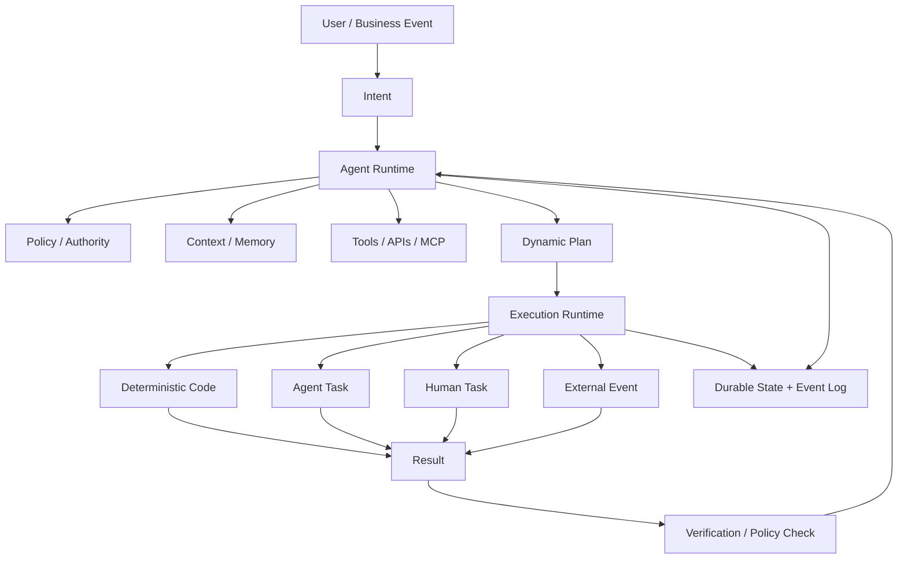

这里最重要的是：

**Agent 决定“下一步做什么”。
Runtime 决定“这个下一步能不能做、怎么执行、出了问题怎么办”。**

这是这条路线与过去 Workflow 最大的区别，也是它后来必须被限制的地方。

### Google ADK 2.0

Google 在 2026 年把 ADK 从原来的 hierarchical agent executor 明确转向 **Workflow Runtime + Graph-based execution**。

它现在把 Agent、Tool、Function 全部作为 workflow graph 的节点。

同时支持：

- branching
- parallelism
- loops
- human-in-the-loop
- state preservation
- resume

并明确说原来的 `SequentialAgent / LoopAgent` 正逐步被 graph workflow 取代。([GitHub][2])

关键不在于 Google 说了什么，而在于它的立场：

> 不是“Agent 出现了，所以 Workflow 消失”。
>
> 而是“Workflow 的实现方式必须适应 Agent”。

### Microsoft Agent Framework

Microsoft Agent Framework 现在把 Workflow 定义成：

```text
Executors
+
Edges
+
State
+
Events
+
Runtime
```

而 Executor 可以是：

- 普通代码
- Agent
- Tool
- sub-workflow

并且 runtime 负责：

- execution
- events
- checkpointing
- HITL
- concurrency
- state management

也就是说：

> **Workflow 不再等价于 Business Process Diagram**，而是**一个可执行的 runtime topology**。([Microsoft Learn][1])

### LangGraph

LangGraph 自己把定位说得非常清楚：

> low-level orchestration framework for stateful agents

核心价值不是“画流程”，而是：

```text
State
↓
Node
↓
Decision
↓
Tool
↓
Checkpoint
↓
Resume
```

它特别强调：

- durable execution
- stateful agents
- long-running execution
- failure recovery

也就是说，Graph 在这里不是给业务人员看的流程图，而是：

> **Agent 的执行 runtime。**([GitHub][3])

不要再想：

```text
Workflow = DAG / BPMN
```

而应该定义：

```text
Agentic Workflow
=
Intent
+
Policy
+
Execution State
+
Dynamic Plan
+
Durable Runtime
```

### ① Intent

不是：

```text
Start → A → B → C
```

而是：

```text
Goal:
完成投资机会尽调并生成投资建议
```

Agent 负责寻找完成 Goal 的路径。

### ② Policy

这个才是企业 Workflow 最应该固定下来的东西。

例如：

```yaml
policy:
  can_read:
    - market_data
    - research_db

  can_write:
    - draft_report

  approval_required:
    - execute_trade
    - send_external_email

  max_budget:
    tokens: 100000
    tool_calls: 50

  forbidden:
    - customer_pii_export
```

也就是说：

> **固定的不是流程，而是权限和边界。**

这比 BPMN Gateway 重要得多。

### ③ Dynamic Plan

Agent 根据目标动态产生：

```text
Plan 1

1. Search company
2. Retrieve financial data
3. Analyze competitors
4. Identify missing information
5. Search again
6. Build valuation
7. Review assumptions
8. Produce report
```

这个 Plan 对长跑 Agent 而言确实需要持久化，而不是只存在 LLM context 里。但要区分清楚：持久化的是 **Agent Task 的执行状态**，不是企业业务流程的状态——这一点在第 49 节展开。

例如：

```json
{
  "runId": "invest-20260912-001",
  "goal": "Evaluate XYZ",
  "plan": [
    {
      "id": "t1",
      "type": "research",
      "status": "completed"
    },
    {
      "id": "t2",
      "type": "valuation",
      "status": "running"
    }
  ]
}
```

在这条路线的语境里，“Workflow”实际上已经变成了：

> **Agent-generated execution plan**，而不是 **Human-authored process definition**。

需要提前说明：这是 **Agent Platform 视角**下的结论。一旦把目标切到企业业务流程，这个等式不成立——第 19 节会把两者分开。

### ④ Execution State

这是传统 Workflow Engine 最值得保留的东西。

比如：

```text
RUNNING
WAITING_TOOL
WAITING_HUMAN
WAITING_EVENT
FAILED
RETRYING
COMPLETED
CANCELLED
```

这比 BPMN 图本身重要得多。

因为真实 Agent 经常：

```text
运行 25 分钟
↓
等待人工
↓
6 小时以后
↓
继续
```

需要的是这些，而不是漂亮的流程图：

```text
durability
checkpoint
resume
timeout
retry
compensation
idempotency
```

### ⑤ Execution Runtime

真正的核心应该变成：

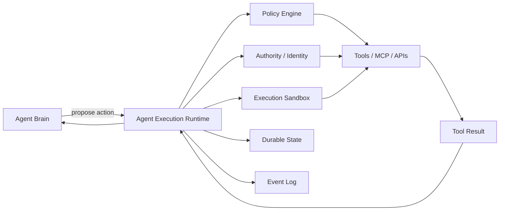

**Agent 不应该绕过统一的身份、权限、工具和审计边界，直接拿到未治理的生产系统权限。**

这句话不等于“Agent 不能访问生产系统”。它可以访问，但访问必须走完整链路：

```text
Agent
 ↓
Tool / Capability
 ↓
Identity
 ↓
Authorization
 ↓
Target System
```

而不是：

```text
Agent
 ↓
万能 production credential
```

Agent 只负责：

```text
propose
reason
choose
delegate
```

Runtime 负责：

```text
authorize
validate
execute
retry
pause
resume
audit
```

这其实就是未来 Agent Platform 最核心的一层。

内部 AI Platform 更推荐按这个方向设计：

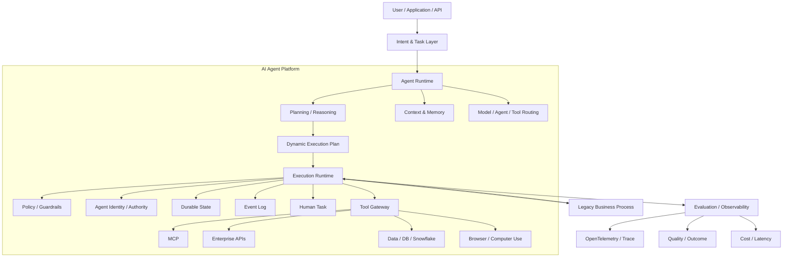

注意这里：

**BPMN / Camunda / Fluxnova 是一个“外部能力”，不是整个 Agent Platform 的核心。**

这和今天很多企业的架构思路会完全不同。

### Microsoft：Agent + Workflow + Durable Runtime

微软现在实际上同时押了两个方向：

```text
Agent
+
Workflow
+
Durable Runtime
```

而不是二选一。

Microsoft Agent Framework 当前的 Workflow 模型是：

```text
Executor
   ↓
Edges
   ↓
Events
   ↓
State
   ↓
Runtime
```

而不是 BPMN。([Microsoft Learn][11])

更关键的是，它已经加入：

- checkpoint
- human-in-the-loop
- fan-out / fan-in
- sub-workflow
- typed routing
- graph execution
- durable execution

微软还直接提供 Durable Extension，把 Agent Framework Workflow 跑在 Durable Task 基础设施上：

```text
Agent Framework
       ↓
Graph Workflow
       ↓
Durable Task
       ↓
Checkpoint
       ↓
Resume
       ↓
Distributed Workers
```

并支持 agent 可以运行数天甚至数周。([Microsoft Learn][12])

这里已经非常接近这样的三段式模型：

> **Agent = intelligence
> Workflow = execution topology
> Durable Task = runtime**

## 8. 路线二（下）· Harness 被产品化

上一节讲的是“Agent 的执行模型长什么样”，这一节讲的是“厂商正在把什么产品化”。

这里有一个值得单独拿出来看的趋势：**Agent Harness 本身正在成为独立的基础设施**，而不是某个框架的内部实现细节。一旦它可以被单独产品化、单独版本化、单独定价，它在架构上的地位就变了。

### Anthropic：Claude Research 的多 Agent 结构

Anthropic 的路线和微软略有不同。

它最经典的生产案例是 Claude Research。

架构大体是：

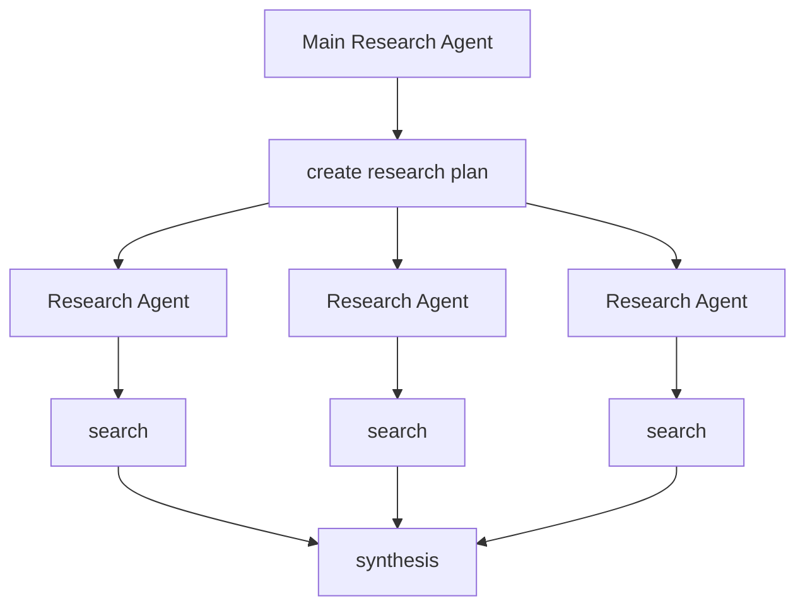

Anthropic 明确指出，他们使用一个主 Agent 制定研究计划，然后启动多个并行 Agent 搜索。与此同时，系统设计最大的难点变成：

- coordination
- evaluation
- reliability
- tool design

而不是传统 workflow 的节点设计。([Anthropic][13])

这与传统 BPMN 的思路差别很大。

### Anthropic 的第二条线：Harness

Anthropic 现在对 Agent 的工程实践越来越集中到：

> **Harness**

而不是：

> Workflow Designer

他们 2026 年的工程文章列表里已经把这些问题分开研究：

- long-running agents
- managed agents
- context engineering
- skills
- tool use
- security
- agent containment
- evals
- multi-agent research ([Anthropic][14])

也就是说：

```text
Model
+
Harness
+
Tools
+
Environment
+
Permissions
+
Context
+
Evaluation
```

正在成为一个比传统 workflow 更核心的抽象。

不过要说清楚：**Anthropic 的公开实践集中在 Harness、Tool Use、Context Engineering、Containment 与 Evaluation，并没有提出一套企业业务流程架构。**把它的工程文章读成“BPMN 的替代方案”，是过度解读。

### OpenAI：从 Agents SDK 到 harness + sandbox

OpenAI 2025 年最初的路线是：

```text
Responses API
+
Agents SDK
+
Tools
+
Handoffs
+
Guardrails
+
Tracing
```

已经明显不是传统 workflow。([OpenAI][15])

2026 年更进一步。

新的 Agents SDK 强调：

> **model-native harness + sandbox + long-horizon task**

也就是说：

```text
Agent
  ↓
Harness
  ↓
Sandbox
  ↓
Tools / Files / Commands
  ↓
Long-running execution
```

并且把 harness 与 compute 分离，强调：

- security
- durability
- scale ([OpenAI][16])

这里隐藏着一个更重要的方向：

> **Agent Workflow 最终可能不是 DAG，而是一个“可持续运行的 Agent Process”。**

### 2026-09-10：OpenAI 把 Harness 单独产品化

这条更新对本文的论证尤其重要，因为它是一个非常直接的证据。

OpenAI 在 2026-09-10 发布 Agents API，把驱动 Codex 的同一套 harness 与基础设施开放出来，并且明确由 OpenAI 托管和维护。([OpenAI][42])

它提供的能力清单很能说明问题：

```text
managed harness
long-running sessions（模型可以连续工作数小时）
context management（接近上下文上限时自动压缩早期上下文）
sandbox（OpenAI 托管沙箱，或自带基础设施 / 第三方沙箱）
subagents（把任务拆给并行子智能体）
```

而开发者只需要定义四样东西：

> **task、model、tools、environment**

其余运行时基础设施——会话、上下文压缩、沙箱、并发子智能体调度——由平台负责。([OpenAI][42])

这里有两层含义，方向是相反的，必须一起看。

**第一，它支持“Agent Runtime / Harness 正在成为独立基础设施”这个判断。** 当一个 harness 可以被单独产品化、单独版本化时，它就不再是框架的内部细节，而是一层需要被认领的架构。

**第二，它同时反证了 Agent Runtime 不等于 Business Workflow Runtime。**

Agents API 提供的“orchestration”指的是**单个 Agent 会话内部的任务编排**：决定先查什么、再调什么工具、什么时候停止。它不持有企业流程状态，不负责跨部门审批，也不会为一个投资 Idea 的合规责任签字。

这两件事都被称为“编排”，但归属完全不同。这是后面反复要用的一个区分。

### 内部应用：delegated long-horizon task

OpenAI 2026 年公开描述内部 Codex 使用情况：

过去：

```text
ChatGPT
→ occasional AI assistance
```

现在：

```text
employee
→ delegate long-horizon task
→ Codex
→ tools
→ files
→ code
→ iterate
→ final result
```

他们把工作单位定义成：

> **delegated long-horizon task**

而不是 single interaction。([OpenAI][17])

### OpenAI Presence：企业 Agent Operating Model

2026 年推出的 Presence 思路尤其值得注意。

它不是：

```text
Workflow Designer
```

而是：

```text
specific job
       ↓
knowledge
       ↓
system access
       ↓
permissions
       ↓
policies
       ↓
agent
       ↓
escalation
       ↓
human
```

例如：

- billing
- insurance claims
- IT service request

每个 Agent 都有明确的：

- 权限
- 工作范围
- approval
- escalation ([OpenAI][18])

这其实已经非常接近金融机构需要的模型。

### Google：Agent Platform + Enterprise Governance

Google 2026 年提出的 Agentic Enterprise blueprint 也是：

```text
Agent
+
Agent Platform
+
Orchestration
+
Governance
+
Enterprise Data
```

而不是：

```text
BPMN
+
LLM Node
```

Google 明确把 Gemini Enterprise 定义成：

> agent development + orchestration + governance

的一体化平台。([Google Cloud][19])

尤其值得注意的是，他们开始支持：

- long-running agents
- agent collaboration spaces
- advanced governance
- agent marketplace ([Google Cloud][20])

这说明大型企业平台厂商的竞争重点正在从：

> “谁有最好的 Agent Builder”

转向：

> **谁能提供企业级 Agent Operating Environment。**

### Snowflake：Data-native 的 Agent 平台

尤其是与 Snowflake AI Platform 相关的部分。

Snowflake 当前的 Cortex Agents 架构已经非常清楚：

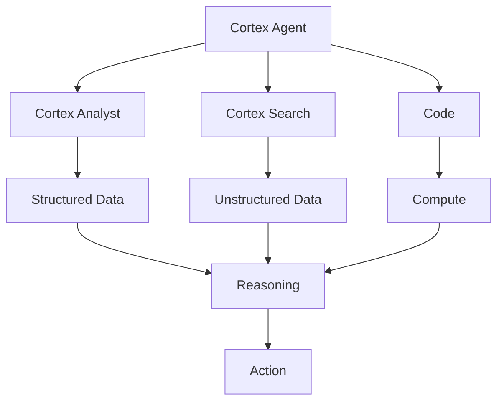

Snowflake 官方明确说 Cortex Agents：

- 自己 reasoning
- plan work
- call tools
- execute code
- maintain threads
- orchestration across multiple steps

而且不需要自己建设 orchestration loop / runtime / sandbox。([Snowflake Documentation][21])

更重要的是：

**2026-08-28，Snowflake 已经明确建议从 Cortex Analyst 迁移到 Cortex Agents。**

原因就是 Cortex Agents 把：

```text
structured data
+
unstructured data
+
tool calling
+
thread context
+
multi-step orchestration
```

放到一个 Agent runtime 中。([Snowflake Documentation][22])

### Snowflake 的金融服务架构：Data-native Agent

Snowflake 2026 年针对 Financial Services 的 architecture，核心思想其实不是：

> “做一个金融 Agent。”

而是：

```text
First-party data
+
Third-party data
+
Semantic layer
+
Search
+
Agent
+
Action
```

他们直接说金融 workflow 的核心是把 first-party + third-party data 组合起来，并强调：

- Cortex Analyst
- Cortex Search
- Shared Semantic Views
- Knowledge Extensions
- Cortex Agents

最终让 Agent 在数据所在的位置执行 workflow。([Snowflake][23])

这对于银行、资产管理、保险特别重要。

### 一个必须写清楚的区分

Snowflake 的 Cortex Agents 确实提供 reasoning、planning、tool calling、multi-step orchestration，并且官方在 2026-08-28 明确建议从 Cortex Analyst 迁移过来。([Snowflake Documentation][21])

但这里必须写清楚一句话，否则很容易被误读：

> **Cortex Agents 的“workflow / orchestration”是 Agent 内部的任务编排，不等同于金融企业的 BPMN Business Process orchestration。**

它不替代 Camunda 这类流程引擎，也不承担流程状态、跨部门审批与责任归属。两者是上下游关系：流程引擎决定“这一步该做合规审查”，Cortex Agents 负责“在这次合规审查里把数据查清楚”。

## 9. 路线三 · Durable Execution（Temporal / Durable Task）

Temporal 的思路甚至更激进：

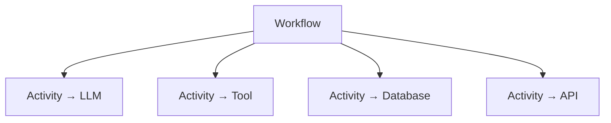

Workflow 本身负责：

```text
state
ordering
waiting
retry
timeout
resume
```

所有 nondeterministic I/O 都放在 Activity。

Temporal 最近专门发布了 AI Agent Reference Architecture，把 Agent 的 loop 放进 durable Workflow 中。([Temporal][4])

所以它实际上把 **Agent = intelligence** 和 **Workflow = durable execution** 彻底分开了。这个分离非常合理。

### 为什么这一层必须单独存在

Microsoft 的 Durable Extension 也属于这一层：Agent Framework 的 graph workflow 跑在 Durable Task 基础设施上，支持 checkpoint、resume，以及数天到数周的运行周期。([Microsoft Learn][12])

把 Durable Execution 与 Agent Workflow 分开的理由，是它们的失败模式不同：

```text
Agent Workflow 失败：Agent 选了错误的工具，或推理方向错了
Durable Execution 失败：进程崩了、网络断了，执行无法恢复到崩溃前的状态
```

前者是**决策质量**问题，后者是**执行可靠性**问题。用同一个组件同时解决两者，最后通常两边都做不好——因为一个需要灵活重规划，另一个需要严格可重放。

## 10. 路线四 · Enterprise Semantic & Data Layer

前三条路线都在回答“Agent 怎么工作”，这一条回答的是另一个问题：

> **Agent 面对的世界，是用什么语言描述的？**

### Agent 到底应该连接什么

因为 Palantir 其实回答了一个非常关键的问题：

> **Agent 到底应该连接什么？**

Palantir 的答案不是：

```text
Agent
 ↓
1000 API
```

而是：

```text
Enterprise Ontology
```

Ontology 把企业世界建模成：

```text
Objects
Properties
Links
Actions
Logic
Security
```

官方把它概括成：

> **Data + Logic + Action + Security**([Palantir][25])

更形象一点：

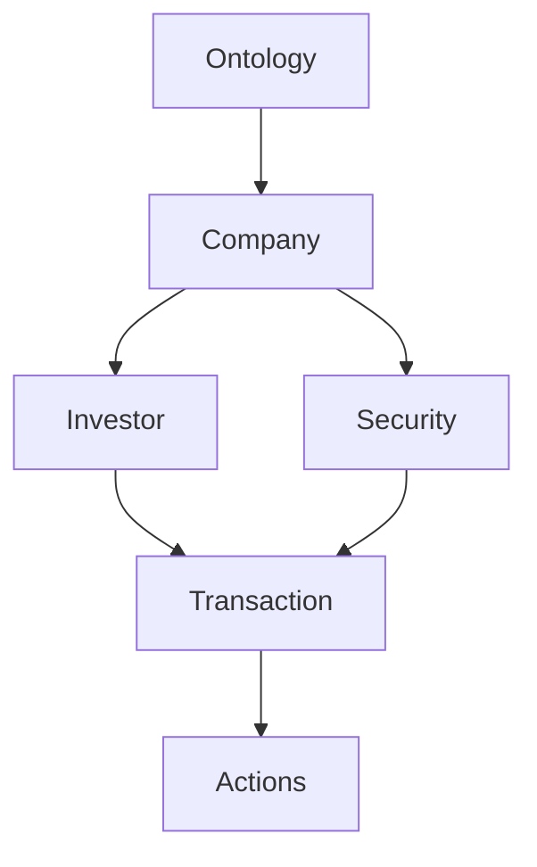

所以 Agent 看到的不是：

```text
table
table
API
API
PDF
database
```

而是：

```text
Company
Portfolio
Position
Transaction
Risk
Counterparty
ResearchReport
```

并且这些对象自带：

```text
actions
logic
permissions
relationships
```

### Action 模型：nouns 与 verbs

Palantir 有一个非常值得重视的思想：

> 数据只是“nouns”，Action 才是“verbs”。

也就是说：

```text
Company
Position
Loan
Customer
Transaction
```

这些是：

> nouns

而：

```text
Approve
Reject
Rebalance
Create
Assign
Escalate
Freeze
Review
```

这些才是：

> verbs ([Palantir][26])

这恰好解决 Agent 最大的问题：

> **Agent 不只需要知道“这个东西是什么”，还需要知道“对它允许做什么”。**

### Ontology 与 RAG 的差别：world model + action model

传统：

```text
RAG
 ↓
document
 ↓
answer
```

Ontology：

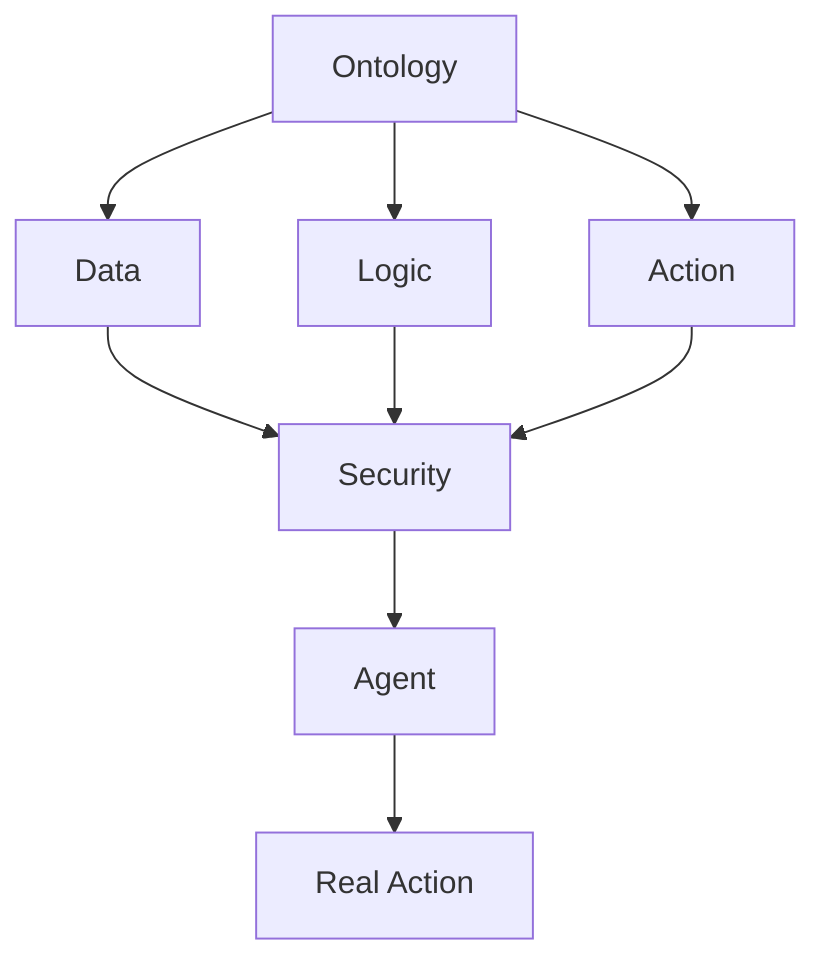

从架构角度看，它更接近 **Agent 的 enterprise world model + action model**，而不是一个 Vector DB。（这是本文的架构解读，不是 Palantir 的官方定义。）

### Ontology MCP：把语义层变成 Agent 的 substrate

这一步尤其重要。

2026-06 Palantir 已经正式 GA Ontology MCP。

意味着：

```text
Claude
OpenAI
Gemini
Microsoft Agent Framework
Google ADK
```

这些产品本身都支持 MCP，因此**任何兼容 MCP 的 Agent / Agent Framework** 都可以通过 MCP：

```text
read Ontology
+
write Ontology
+
execute Ontology actions
```

而且调用继续使用 Foundry 权限模型。([Palantir][27])

换句话说：

> **Ontology 不需要成为 Agent Framework。**

它变成：

> **Agent 的 enterprise semantic/action substrate。**

这比“Palantir 自己做 Agent Framework”更重要。

### AIP Logic：No-code 没有死，但不再是抽象核心

AIP Logic 仍然是 no-code。

它可以：

```text
Ontology Object
 ↓
LLM
 ↓
Condition
 ↓
Loop
 ↓
Function
 ↓
Action
```

并且支持：

- testing
- evaluation
- monitoring
- automation
- human review ([Palantir][28])

所以 Palantir 的实际答案不是：

> “No-code 已死。”

而是：

> **No-code 不能再是整个系统的抽象。**

它只是：

> **Ontology / Logic / Action 上面的一个 builder。**

这个区别非常重要。

### Snowflake 的另一条变化：RAG 走向“分析型检索”

2026 年 Snowflake 推出了 Analytical Search。

传统 RAG：

```text
question
 ↓
top-k documents
 ↓
LLM
```

对于：

> “10000 份财报中，有多少家公司……”

其实不行。

Snowflake 的新方向是：

```text
Agent
 ↓
multiple Search queries
 ↓
metadata filters
 ↓
AISQL
 ↓
AI_FILTER
 ↓
AI_AGG
 ↓
aggregate entire corpus
```

也就是说：

> **Agent 不只是“找资料”，而是能够调度一套数据处理 workflow。**([Snowflake Documentation][24])

这个对金融 research、compliance、credit、ESG 极其重要。

## 11. 学术界：Agent Workflow 已经成为一等研究对象

厂商文档之外，还有一个更值得看的信号：研究界已经不再把 Agent 看成“一个 LLM 加几个工具”，而是把 Agent Workflow 本身当成研究对象。

这条线上有几篇值得当作入口的论文。

### 1. 《A Survey on Agent Workflow — Status and Future》

这是目前比较值得当作入口的 survey。

论文把 Agent Workflow 按两个维度分类：

- 功能：planning、多 Agent、API、tool、memory
- 架构：agent role、orchestration flow、workflow specification

它明确指出，随着 Agent 系统变复杂，**workflow/orchestration 已经成为 scalable / controllable / secure agent behavior 的核心基础设施**，同时指出标准化、安全和多模态 integration 仍是开放问题。([arXiv][9])

这意味着一个很重要的判断：

> **Workflow 不会消失，只是在从“业务流程建模”变成“智能执行系统建模”。**

这点很容易被企业架构师忽视。

### 2. 《Architectural Implications of Agentic AI Workflows》

2026 年 8 月的研究直接分析 Agentic Workflow 对底层基础设施的影响。

核心发现非常有意思：

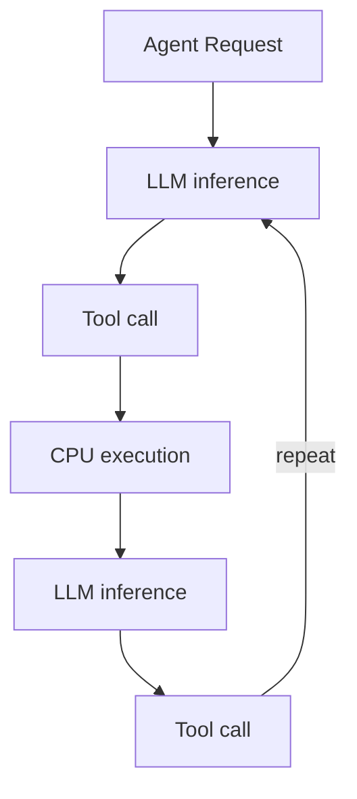

Agent 不是传统 ML 那种：

```text
input → GPU → output
```

而是：

```text
CPU
GPU
network
external systems
orchestration
CPU
GPU
...
```

不断交替。

结果就是：

- CPU/GPU 利用率不均衡
- execution bursty
- tool invocation 造成 CPU critical path
- multi-agent 增加调度复杂度
- heterogeneous workloads 使传统 server provisioning 变得低效

论文甚至做了专门的 Agentic Server 原型 Agora。([arXiv][10])

这其实说明：

> **Agent Runtime 最终可能会成为一种全新的计算运行时，而不只是 Python framework。**

### Workflow 定义本身也在 AI 化

以前：

```text
Developer
   ↓
设计 Workflow
   ↓
部署
```

以后可能是：

```text
Business Intent
      ↓
Agent / Compiler
      ↓
Execution Policy
      ↓
Generated Plan
      ↓
Runtime
```

也就是说：

> **Workflow 从“静态 artifact”变成“动态 execution artifact”。**

最近研究也开始直接研究 Agentic Workflow Generation，也就是从功能描述自动生成可执行 workflow，而研究结果同时指出：单纯让 LLM 生成流程很容易产生缺失/幻觉数据，因此真正可靠的方向是生成 + 约束 + runtime validation，而不是“让 LLM 随便画流程”。([Springer Nature Link][7])

### 甚至“Workflow”这个词都可能被弱化

未来更准确的词可能是：

```text
Agent Runtime
Agent Execution
Task Orchestration
Agent Operating System
```

而不是：

```text
Workflow Engine
```

一个 2026 年比较有代表性的研究方向已经直接提出 **Agent Operating System (AOS)** 的架构，把系统分成：

```text
Control & Governance Plane
+
Runtime & Coordination Plane
```

前者负责：

```text
intent
policy
authority
trust
audit
human oversight
```

后者负责：

```text
agent lifecycle
workflow coordination
model/tool routing
memory
scheduling
runtime assurance
```

这个方向与前面的架构高度一致。([arXiv][8])

## 12. 阶段结论：四条路线怎么组合

到这里可以看到一个比较清楚的分工：

```text
Palantir Ontology      解决：世界是什么、能对世界做什么
Anthropic / OpenAI     解决：Agent 如何工作（Harness）
Microsoft / Temporal   解决：Agent 如何可靠地长期运行
Snowflake / Google     解决：Agent 如何在企业数据与语义边界内工作
Policy / Governance    解决：Agent 到底有没有资格做这件事
```

这五块拼起来，才接近所谓的 **AI-native enterprise workflow**。

但这里必须停一下，因为上面的材料对不同的目标会给出相反的答案。它既能支持“BPMN 该退休”，也能支持“BPMN 是合同层”。问题不在材料，在于目标没有定清楚：**我们讨论的到底是 Agent Platform，还是企业业务流程？**

### Layer 1：Business Process

这个可以继续使用：

```text
BPMN
Camunda
Fluxnova
SAP workflow
ServiceNow
```

解决：

```text
合规
审批
SLA
责任
审计
跨部门流程
```

例如：

```text
开户
→ KYC
→ Risk
→ Approval
→ Account Creation
```

### Layer 2：Agentic Workflow

这完全不同。

例如：

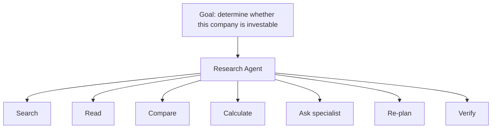

这套能力由下面几部分实现：

```text
Agent Framework
+
Execution Runtime
+
Policy
+
Memory
+
Tool Runtime
+
Durable State
```

### 分开看：对 Agent Platform，与对企业业务流程

| 传统方式          | Agent 时代对应物               |
| ----------------- | ------------------------------ |
| BPMN Process      | Execution Policy / Task Model  |
| Gateway           | Policy / Agent Decision        |
| Service Task      | Tool                           |
| Sub-process       | Agent / Sub-agent              |
| Human Task        | Human-in-the-loop              |
| Process Variable  | Durable State                  |
| Process Instance  | Agent Run                      |
| BPMN Engine       | Agent Execution Runtime        |
| DMN               | Policy / Rules Engine          |
| Process Monitor   | Agent Observability            |
| Process History   | Event / Trace                  |
| Workflow Designer | Code / DSL / AI-generated Plan |
| Static Flow       | Dynamic Execution Plan         |

由此可以给一个更精确的说法。一种常见的表述是：

> **“老的那套 Camunda / Fluxnova，甚至所谓 Low-code 产品，都不该再用。”**

这个判断要分两种情况看：

### 对 **Agent Platform 本身**，基本正确。

不要把 `Camunda / Fluxnova / BPMN` 当成核心抽象。

### 对 **Enterprise Business Process**，则不正确。

BPMN 这些东西仍然非常有价值，因为：

```text
法律责任
合规
审批
SLA
审计
跨系统 transaction
human accountability
```

这些东西并不会因为 LLM 出现就消失。

所以真正先进的架构不是：

> **BPMN → Agent**

也不是：

> **Agent → Everything**

而是：

> **Business Process Layer + Agent Execution Layer**

两者之间通过 `typed task / events / policy / authority / durable state` 连接。

### 从零设计一个 Agent Platform 时，应该先建什么

第一步不该是建 Workflow Designer，而应该先建这 7 样东西：

```text
1. Agent Runtime
2. Durable Execution Runtime
3. Tool / MCP Gateway
4. Policy & Authority Engine
5. Context / Memory Runtime
6. Human Task Runtime
7. Trace / Evaluation / Audit
```

然后再决定：

```text
哪些地方需要 BPMN
哪些地方需要 Graph
哪些地方完全由 Agent 动态决定
```

**而不是反过来先选 Camunda，然后想办法把 Agent 塞进去。**

这才是真正的 **AI-native workflow architecture**。

另外值得注意的是，Google、Microsoft、LangGraph、Temporal 当前都在把 workflow 做成 **code/runtime-first 的 graph + state + durable execution**，而不是继续强化传统“业务人员拖节点”的范式；这已经不是单个厂商的偶然选择。([GitHub][2])

把这个结论落到 **“内部 LangChain DeepAgents + AWS AgentCore + LangSmith 的 AI 能力平台”** 上，下一步最值得做的是设计一套 **Agent Runtime / Execution Runtime / Business Process 三层架构**，并把 **Temporal、AgentCore、LangGraph、Microsoft Agent Framework、Camunda/Fluxnova** 放进去逐项对比。这样才能比较清楚地判断一家平台到底应该自己做什么、买什么、哪些东西根本不该引入。

把范围从厂商文档扩大到四类证据——**学术研究、模型厂商实践、企业 AI 平台、金融机构与监管机构的实践**——结论会更完整：

> **2026 年真正成熟的方向，不是“把 BPMN 换成 Agent”，而是把 Workflow 拆成“Agentic Decisioning + Durable Execution + Policy/Authority + Enterprise Ontology/Data + Evaluation”。**
>
> 对通用 Agent 平台而言，传统 Workflow 仍然存在，但它越来越像**受约束的外围控制面**，而不是平台的核心抽象。

下面这张地图，覆盖的是这五块各自最值得追的线索。

其中真正有前景的企业平台，大概率会把它们组合：

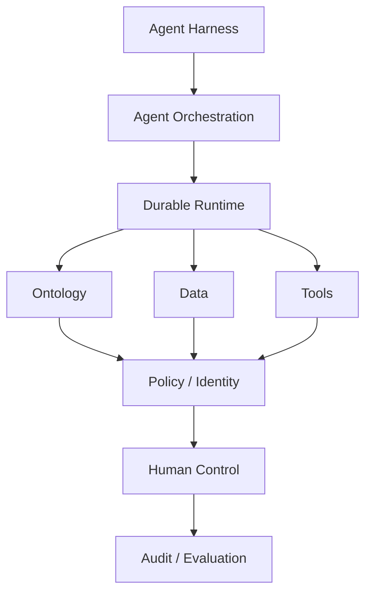

### 面向金融服务的分层（趋势阶段的版本）

更完整的一版是：

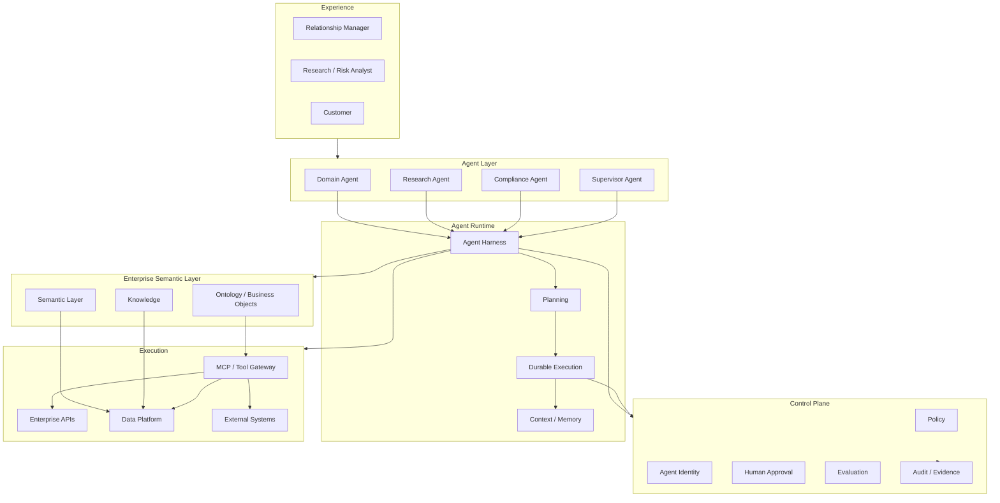

这里最重要的是：

### **Ontology / Semantic Layer 和 Agent Runtime 是两个不同东西。**

Palantir 最强的是前者。

AWS / Microsoft / OpenAI / Anthropic 最强的是后者。

Snowflake 正在试图把 `Data + Semantic + Agent Runtime` 放在一起。

### 趋势阶段的结论

回到最开始那个判断：

> “老的 Camunda / Fluxnova，甚至所谓 Low-code，都不应该再用。”

把论文与各家厂商、监管机构的材料串起来看之后，这个说法值得修正得更精确：

### 错误方向

```text
BPMN
  ↓
LLM Node
  ↓
Agent
```

这确实不是最有前景的 Agent Platform 架构。

### 同样错误

```text
User
 ↓
Autonomous Agent
 ↓
无限 Tool
 ↓
Enterprise
```

金融领域尤其不可接受。

### 更合理的 2026+ 模型

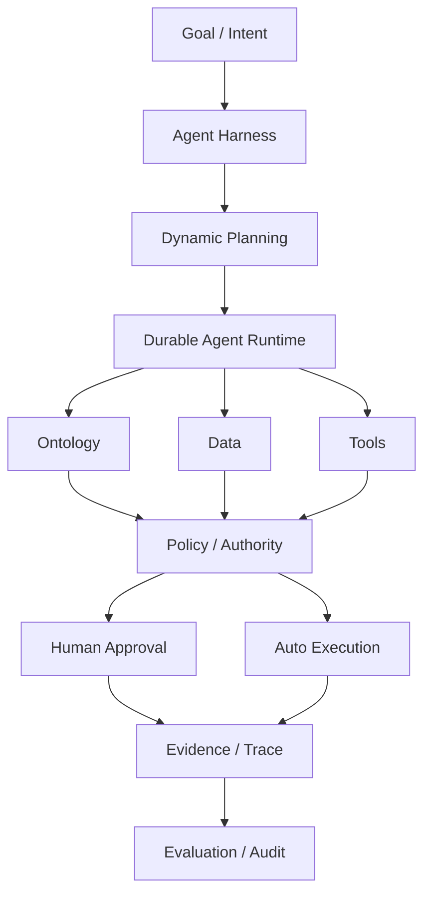

对通用 Agent 平台而言，一句话概括：

> **未来的 Workflow 不是“下一步去哪”，而是“Agent 为了完成 Goal，可以在什么边界内，以什么权限，持续做什么，并且如何被暂停、恢复、验证和追责”。**

而 **Palantir Ontology** 解决的是“**世界是什么、能对世界做什么**”；
**Anthropic/OpenAI Harness** 解决的是“**Agent 如何工作**”；
**Microsoft/Temporal/AWS** 解决的是“**Agent 如何可靠地长期运行**”；
**Snowflake/Google** 解决的是“**Agent 如何在企业数据与语义边界内工作**”；
**Policy/Governance** 则解决“**Agent 到底有没有资格做这件事**”。

这五块拼起来，才比较接近 **AI-native enterprise workflow**。

而金融服务真正应该研究的核心不是“哪个 Workflow Engine 最好”，而是：

> **Agentic Decision + Enterprise Ontology + Durable Execution + Authority + Evidence**

这比单纯讨论 Camunda、Temporal、LangGraph 谁替代谁，层次高一个级别。

# 第三部分：金融为什么不能照搬

第二部分介绍的四条路线，都是通用企业场景下的正确答案。金融场景多出来的主要不是技术难度，而是**举证责任**。

这一部分说明的是：金融到底额外要求了什么，以及这些要求如何反过来决定架构。

## 13. 金融真正担心的问题：Verifiability Gap

而是：

> **Agent 到底代表谁行动？**

这个问题在金融业特别严重。

最新一篇关于 Agentic AI governance in FinTech 的研究甚至提出：

> **Verifiability Gap**

也就是说：

```text
Agent Authority
      ↓
实际执行
      ↓
能否证明：
为什么当时允许它这么做？
```

研究特别强调：

- orchestration 本身是 policy layer
- 不同 orchestration 结构会改变最终决策
- historical replay 可能无法重现
- model/version变化会改变结果
- deterministic replay 并不等于 historical decision replay ([arXiv][32])

传统 Workflow：

```text
same input
→ same BPMN
→ same path
```

Agent：

```text
same input
→ different reasoning
→ different tools
→ different context
→ different outcome
```

所以：

> **Agent Workflow 的审计对象不能只是“流程图”，而必须是 Execution Trace + Context + Authority + Evidence。**

## 14. 监管机构在看什么

### Bank of England

2026 年 Financial Stability Report 已经专门讨论 Agentic AI。

其中一个特别值得注意的观察是：

目前金融机构主要使用 Agent：

- research
- coding
- surveillance
- lower-risk operations

而不是：

> autonomous trading

因为核心风险是：

- output 不可预测
- validation 困难
- autonomy boundary 难定义
- correlated behavior ([Bank of England][33])

### FSB 2026：12 类 sound practices

Financial Stability Board 2026 年 AI governance consultation 提出了 12 类 sound practices。

特别强调：

- AI governance
- lifecycle management
- risk identification
- operational resilience
- third-party dependence
- GenAI / agentic AI risks ([Financial Stability Board][34])

这说明金融监管未来看 Agent，不会只看：

> model risk

而会看：

```text
Model
+
Agent
+
Tool
+
Data
+
Permission
+
Runtime
+
Vendor
+
Human Oversight
```

## 15. 已经跑在生产上的样本：Stripe 与 AWS

### Stripe

AWS 与 Stripe 2026 年公开的案例特别有价值。

场景是：

```text
金融合规 review
```

Stripe 面临：

```text
thousands of transactions / day
```

它搭建 production agent system：

```text
Agent
 ↓
AWS Bedrock
 ↓
enterprise data
 ↓
compliance reasoning
 ↓
human review
```

公开结果：

- review handling time ↓ 26%
- helpfulness >96%
- final decision 仍由 human 控制 ([Amazon Web Services, Inc.][35])

注意这里：

**Stripe 并没有让 Agent 直接取代 Compliance Officer。**

它真正做的是：

```text
Agent = investigation / preparation
Human = decision authority
```

这是当前金融服务中较容易同时满足治理、审计与责任要求的一种落地模式。把它写成“未来几年的主流架构”属于过度推断——监管材料描述的是当前的风险与实践，不足以证明未来的主流形态。

### AWS 的金融 Agent 参考架构

AWS 2026 年的 Financial Services AgentCore 架构：

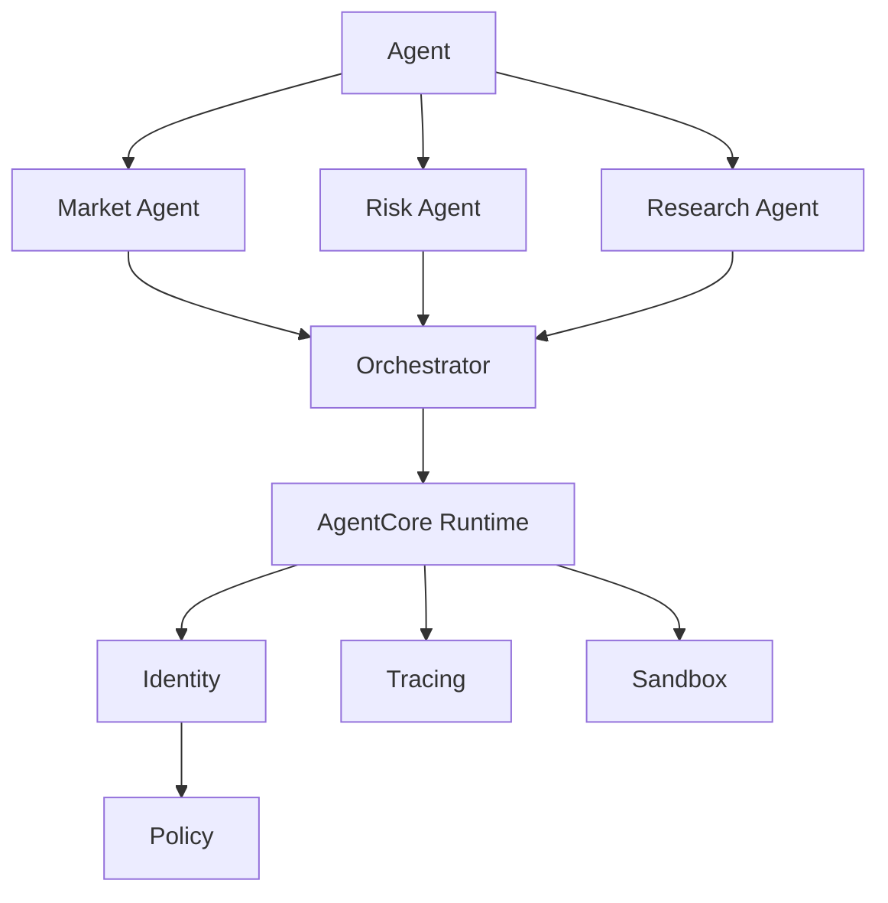

例如 portfolio advisory：

- portfolio valuation
- risk stress test
- market research
- advisor synthesis

由多个 specialist agents 协同完成。([Amazon Web Services, Inc.][36])

而信用分析案例则是：

```text
Policy PDF
+
Snowflake account history
+
transaction patterns
+
Agent reasoning
+
recommendation
```

这非常接近企业真正的 Agent Workflow。([Amazon Web Services, Inc.][37])

## 16. 金融 Model Risk Management 里的 Agentic Workflow

这一节看金融领域的实证研究。它们没有停在“客服 Agent”这类演示场景上，而是直接落在信贷、反欺诈和模型风险管理上——比通用的 Agent 案例更接近企业真正的问题。

2026 年有一篇比较完整的 survey：

### Agentic Artificial Intelligence in Finance: A Comprehensive Survey

涵盖：

- financial operations
- financial markets
- architecture
- regulation
- systemic risk
- multi-agent coordination ([arXiv][29])

另外一篇论文直接提出：

### AI Agents in Financial Markets

它把金融 Agent 拆成：

```text
Data Perception
        ↓
Reasoning
        ↓
Strategy Generation
        ↓
Execution + Control
```

并且提出一个非常现实的结论：

> **短期最可能的形态不是 fully autonomous finance，而是 bounded autonomy。**

即：

```text
AI
+
human supervision
+
constrained execution
```

对企业架构而言，这一点影响很大。([arXiv][30])

另一项研究直接做了：

```text
Modeling Crew
+
Model Risk Management Crew
```

例如：

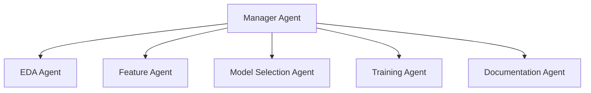

另一组：

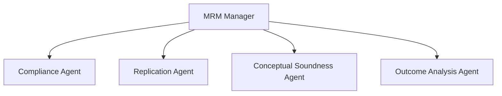

并在：

- fraud detection
- credit approval
- credit risk

中做了实验。([arXiv][31])

这其实比“客服 Agent”更接近企业真正的问题。

## 17. 金融服务真正需要确定下来的六件事

把前三部分的材料压成六条，就得到金融服务对架构的硬约束。它们不是设计偏好，而是监管、责任和事故成本直接推导出来的结果。

| #   | 约束   | 为什么                         | 在架构上的落点                |
| --- | ------ | ------------------------------ | ----------------------------- |
| 1   | 确定性 | 结论必须能从输入与规则推导出来 | Workflow Runtime 持有状态转移 |
| 2   | 责任   | 每个决策必须有人签字           | Human Task + Identity         |
| 3   | 审批   | 高风险动作不能自动生效         | BPMN + Policy                 |
| 4   | 审计   | 事后必须能回答“谁做了什么”     | Audit Trail                   |
| 5   | 授权   | “能做”和“被允许做”是两件事     | IAM + Agent Policy            |
| 6   | 可追溯 | 结论与证据要对得上             | Evidence + Agent Trace        |

这六条之外，还有一条从 Verifiability Gap 直接推出来、但容易被低估的要求：

> **可复现性（reproducibility）。**

传统的可复现假设是“同样输入 + 同一个流程版本 = 同样结果”。Agent 打破了这个假设：同样的输入，可能因为不同的检索结果、不同的上下文、不同的模型版本，得到不同的推理路径和结论。

所以在金融场景下必须退一步，先明确自己能承诺哪一种复现：

```text
Level A：完全可重放
        同输入 + 同模型 + 同工具 + 同上下文快照 → 同结果
        （成本高，通常只用于高风险决策）

Level B：可复核
        同业务事实快照 + 记录在案的规则版本 + 记录在案的 Agent 轨迹
        → 人可以独立得出同一结论

Level C：可解释
        能说明结论的理由与证据来源，但不承诺独立复核能得出同一结论
```

大多数业务应该按 **Level B** 设计，把 Level A 留给真正需要法律级举证的动作。

这个决定必须在架构设计阶段做，事后基本补不上——因为它决定的是要不要保留业务事实快照、规则版本和完整 Agent 轨迹。等审计来问的时候再补，通常已经晚了。

这六条约束加上可复现等级，就是后面架构设计的全部输入。

### 金融领域可以借鉴的形态

而应该是：

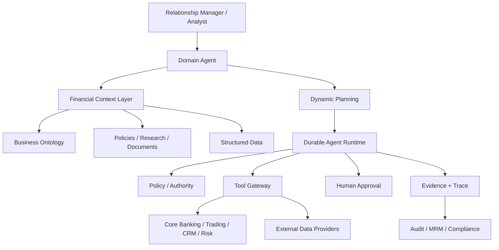

# 第四部分：主线架构

## 18. 全文原则

前面十二节都是趋势观察。趋势观察的结论会随着“目标是什么”而改变：目标是通用 Agent 平台，还是金融企业的业务流程，答案可以完全相反。

从这一节开始，目标被明确设定为后者：**金融服务中确定性业务流程的落地架构**。在这个前提下，前面那些材料会收敛出一条比两者都更窄、也更可执行的主线。

把“业务分析师能够把大部分流程梳理清楚”这个前提补上之后，前面的结论需要明显调整：

> **对于金融服务，BPMN 不应该被淘汰。**
>
> 如果业务分析架构师能够把大部分业务流程、状态、审批关系、异常路径、职责边界都分析清楚，那么 **BPMN/DMN 反而仍然是最合适的“业务控制平面”**。
>
> 真正应该被改变的，不是“有没有 Workflow”，而是：
>
> **不要让 BPMN 承担 Agent 的智能行为；也不要让 Agent 取代 BPMN 的确定性业务控制。**

于是新的架构可以定义为：

> **Deterministic Business Workflow + Bounded Agentic Execution**

也就是：

```text
业务流程确定性
        +
Agent 局部智能化
        +
统一 Policy / Authority
        +
统一 Audit / Evidence
```

这实际上比“纯 Agent Workflow”更适合银行、保险、资管、证券。

### 先定下一条原则

在展开这一部分之前，先把本文反复使用的那条原则定下来：

> **任何 Agent 驱动的业务动作，在产生业务状态变化或外部副作用之前，都必须经过确定性的 schema / business validation 与 authorization；是否需要 Human Approval，由 BPMN 与 Policy 按风险等级决定。**

这句话里有三个从句，各自解决一个问题。

**“必须经过确定性验证”** —— 保证进入流程的不是一段自然语言，而是一个可校验的结构。这是后面 Task Contract 里 output schema 存在的理由。

**“必须经过 authorization”** —— 保证“Agent 有能力做”和“Agent 被允许做”永远是两件事。前者是模型能力问题，后者是治理问题。

**“是否人工批准由风险等级决定”** —— 避免两个极端：既不要求所有输出都过人工（那等于退回 Level 0，自动化失去意义），也不允许高风险动作走自动通道。

后面第 34 节会说明，为什么这条原则必须同时覆盖“建议型输出”和“动作型输出”这两种 Task——只写一半，就会在评审时被抓出漏洞。

## 19. 两类问题：业务怎么走，和某一步怎么完成

在这个场景下，整个系统可以拆成两个完全不同的问题：

### 问题 A：业务应该怎么走？

由：

```text
Business Architect
      ↓
BPMN / DMN
      ↓
Workflow Definition
```

确定。

包括：

- 状态
- 顺序
- 并行
- 条件
- 审批
- 角色
- SLA
- 回退
- 异常
- 补偿
- 业务事件

这些**尽量确定**。

### 问题 B：某一步里面具体怎么完成？

这里允许 Agent。

例如：

```text
Compliance Review
       ↓
Agent:
  - 找政策
  - 找历史案例
  - 找相关文件
  - 检查证据
  - 总结风险
  - 提出建议
       ↓
Human
       ↓
Approve / Reject
```

所以：

> **BPMN 决定“做什么、谁做、何时做、结果去哪”。**
>
> **Agent 决定“这一项任务怎么做得更好”。**

这是整个设计最重要的边界。

### Workflow 管的是状态转移与业务责任

在前面那套分层里，有一个界定需要修正。

> Workflow 管 State + Action。

在这个前提下，它应该修正为：

> **Workflow 管 State Transition + Business Responsibility。**

也就是：

```text
BPMN
  ↓
State
  ↓
Task
  ↓
Business Rule
  ↓
Next State
```

而 Agent 是：

```text
Task
  ↓
Agent Execution
  ↓
Structured Result
```

Agent 不拥有 Workflow。

## 20. 五层架构

把前面的分层和这里的约束合起来，得到本文的主线架构：

```mermaid
flowchart TB

    BA[Business Architect]

    subgraph BP["1. BUSINESS PROCESS PLANE"]
        BPMN[BPMN Process]
        DMN[DMN / Business Rules]
        SLA[SLA / Escalation]
    end

    subgraph WR["2. WORKFLOW RUNTIME"]
        Runtime[Process Runtime]
        State[Process Instance State]
        Task[Human / System / Agent Task]
        Event[Timer / Message / Event]
    end

    subgraph AG["3. AGENT EXECUTION PLANE"]
        TaskContract[Agent Task Contract]
        Harness[Agent Harness]
        Planning[Agent Planning]
        Context[Context / Knowledge]
        Tools[Tools / MCP]
        AgentState[Agent Task State]
    end

    subgraph DATA["4. DATA & SEMANTIC PLANE"]
        BusinessData[Business Data]
        Semantic[Semantic Layer]
        Ontology[Business Ontology]
        Docs[Documents / Knowledge]
    end

    subgraph CTRL["5. CONTROL PLANE"]
        IAM[Identity / Authorization]
        Policy[Agent Policy / Guardrails]
        Audit[Audit Trail]
        Evidence[Evidence]
        Eval[Evaluation]
    end

    BA --> BPMN
    BA --> DMN

    BPMN --> Runtime
    DMN --> Runtime
    SLA --> Runtime

    Runtime --> State
    Runtime --> Task
    Runtime --> Event

    Task --> TaskContract
    TaskContract --> Harness

    Harness --> Planning
    Harness --> Context
    Harness --> Tools
    Harness --> AgentState

    Context --> BusinessData
    Context --> Semantic
    Context --> Ontology
    Context --> Docs

    Tools --> IAM
    Tools --> Policy

    Harness --> Evidence
    Harness --> Eval
    Runtime --> Audit

    TaskContract --> Policy
    Policy --> Runtime
```

这张图里最重要的一条关系是：

> **不是“Agent Runtime 接管 Workflow”，而是 Workflow Runtime 创建并控制 Agent Task，Agent Runtime 负责完成这个 Task。**

也就是第 29 节说的 Agent-in-Process。

### 五层各自回答什么

| 层                        | 回答的问题                     | 失败时的典型表现                     |
| ------------------------- | ------------------------------ | ------------------------------------ |
| 1. Business Process Plane | 流程应该怎么走                 | 流程只存在于文档和人的记忆里         |
| 2. Workflow Runtime       | 这个 case 现在在哪一步         | 状态散落在业务表里，没有人能统一回答 |
| 3. Agent Execution Plane  | 这一步怎么完成                 | 每个团队各造一套 harness             |
| 4. Data & Semantic Plane  | Agent 看到的是哪一个版本的事实 | 同一个指标三个数，结论无法复核       |
| 5. Control Plane          | 谁被允许做什么                 | “Agent 有权限”成了唯一的安全声明     |

### 为什么是五层，而不是四层

常见的一个版本把 `IAM / Policy / Audit / Evidence / Data` 全部放进同一个 Enterprise Control Plane。这会在两个地方出问题。

**第一，Data 不是控制。**

```text
Data / Semantic Plane 回答：世界是什么样
Control Plane 回答：        谁被允许做什么
```

两者放在一起，会导致“数据权限”和“数据语义”被混为一谈：访问控制做到位了，但 Agent 依然不知道 `Position` 和 `Portfolio` 是什么关系。前者是安全问题，后者是能不能正确工作的问题。

**第二，Evidence 也不是控制。**

Evidence 是**某一次具体执行产生的产物**，它天然属于执行侧，只是在最后被 Audit 引用。把 Evidence 放进 Control Plane，会让它看起来像一个统一存储，而不是每一次 Task 都必须产出的东西。

它应该在另一个三层关系里被定位：Audit 记录主体，Evidence 记录依据，Trace 记录过程——也就是第 27 节要展开的内容。

所以最终是五层：**Process / Runtime / Agent Execution / Data & Semantic / Control。**

## 21. 详图：数据与治理怎么接进来

```mermaid
flowchart TB

    BA[Business Architect]

    BA --> BPMN[BPMN Process Definition]
    BA --> DMN[DMN / Business Rules]

    subgraph CONTROL["Business Control Plane"]
        BPMN
        DMN
        Roles[Roles / Responsibility]
        SLA[SLA / Escalation]
        Policy[Policy / Authority]
    end

    BPMN --> WR[Workflow Runtime]
    DMN --> WR
    Roles --> WR
    SLA --> WR
    Policy --> WR

    subgraph EXECUTION["Execution Plane"]

        WR --> HT[Human Task]
        WR --> ST[System Task]
        WR --> AT[Agent Task]
        WR --> WF[Sub Workflow]
        WR --> EVT[Wait / Event]

        AT --> AR[Agent Runtime]

        AR --> Context[Context / Knowledge]
        AR --> Tools[Tools / MCP / APIs]
        AR --> Reasoning[Reasoning / Planning]

        Reasoning --> Proposal[Structured Proposal]

        Proposal --> Gate[Policy / Validation Gate]
        Gate --> HT
        Gate --> ST
    end

    subgraph DATA["Enterprise Data"]
        DB[(Business Data)]
        DWH[(Snowflake / Data Platform)]
        DOC[Documents / Knowledge]
    end

    Context --> DB
    Context --> DWH
    Context --> DOC

    subgraph GOVERNANCE["Governance"]
        Audit[Audit Trail]
        Evidence[Evidence]
        Eval[Evaluation]
        Trace[Agent Trace]
    end

    WR --> Audit
    AR --> Trace
    AR --> Evidence
    Gate --> Audit
    AR --> Eval
```

这就是目前最推荐的整体形态。

## 22. 每一层解决的问题与最适合的技术

| 层               | 解决的问题       | 最适合技术                           |
| ---------------- | ---------------- | ------------------------------------ |
| Business Process | 流程应该怎么走   | BPMN                                 |
| Business Rules   | 什么条件成立     | DMN / Rule Engine                    |
| Workflow Runtime | 如何可靠执行     | Camunda / Temporal / Durable Runtime |
| Agent Runtime    | 如何智能完成任务 | Agents SDK / LangGraph / DeepAgents  |
| Policy           | 谁可以做什么     | IAM / Policy Engine                  |
| Data             | 企业事实是什么   | Snowflake / DB / Ontology            |
| Audit            | 发生了什么       | Activity Log / Trace / Evidence      |

这样就不会出现：

> “是不是 Agent 出现以后，BPMN 就过时了？”

答案是：

**不是。**

是职责重新划分。

## 23. 责任矩阵

第 20 节回答了“分几层”，第 22 节回答了“每层适合什么技术”。这一节回答最后一个问题：**每一件事由谁负责。**

落到具体条目上，会得到一张可以直接进评审会的表：

| 问题               | 谁负责                   |
| ------------------ | ------------------------ |
| 流程走哪           | BPMN                     |
| 业务条件是什么     | DMN / Rules              |
| 当前业务状态是什么 | Workflow Runtime         |
| 谁负责这个 Task    | Workflow / IAM           |
| Agent 能看到什么   | Context / Data Policy    |
| Agent 能用什么     | Tool / Capability Policy |
| Agent 如何完成任务 | Agent Runtime            |
| Agent 得到了什么   | Structured Result        |
| 是否符合业务规则   | Validation / DMN         |
| Agent 能不能执行   | Authorization / Policy   |
| 是否必须人工批准   | BPMN + Policy            |
| 业务状态能否改变   | Workflow Runtime         |
| 为什么这么做       | Evidence                 |
| 谁什么时候做了什么 | Audit                    |
| Agent 如何做的     | Agent Trace              |
| 模型是否可靠       | Evaluation               |

这张表的价值在于：**它把“Agent 到底能不能自主”这类争论，拆成了十几个可以逐条达成一致的问句。**

例如讨论“要不要让 Agent 自动审批”，真正需要确认的只是其中第 4、10、11 行，而不是重新设计一遍流程。

## 24. 四件容易混在一起的事

“确定性”不等于“只有一张流程图”。在金融场景里，有四类判断，各自必须落在不同机制上。把它们合并成一句“业务规则和权限合同”，是架构评审里最常见的返工来源。

### BPMN：流程怎么走

```text
哪里需要审批
什么条件下回到上一步
哪一步可以并行
什么时候结束
```

它回答的是**状态转移**。

### DMN / Business Rules：业务条件怎么判断

```text
investmentAmount > 100M
→ seniorApprovalRequired
```

它回答的是**条件是否成立**，而且这个判断是可枚举、可回归测试的。

### Authorization / IAM：谁有权执行

```text
PM_ROLE
+
Investment_Approval
+
Portfolio_X
```

它回答的是**主体资格**。同一条流程，不同角色能按的按钮不一样，这是权限问题，不是规则问题。

### Agent Policy / Guardrails：Agent 可以调用什么

```text
canRead:   market_data, research_db
canWrite:  draft_report
forbidden: customer_pii_export
maxBudget: { tokens: 100000, toolCalls: 50 }
```

它回答的是**这个 Agent 的能力边界**，与“这个人有没有资格批准”是两件事。

四者关系：

```mermaid
flowchart LR
    BPMN["BPMN<br/>流程怎么走"] --> GATE["执行前的判定"]
    DMNL["DMN<br/>条件是否成立"] --> GATE
    AUTH["Authorization / IAM<br/>谁有权执行"] --> GATE
    APOL["Agent Policy<br/>Agent 能用什么"] --> GATE
    GATE --> EXEC["执行 / 拒绝 / 转人工"]
```

金融场景里这四条不能合并，理由很实际：**审计时它们的举证对象不同。**

- BPMN 举的是流程版本；
- DMN 举的是规则版本与输入；
- IAM 举的是主体与授权记录；
- Agent Policy 举的是能力声明与实际调用日志。

混在一起，事故复盘时就无法归因——你只能证明“当时有这个流程”，但不能证明“当时这个动作是被允许的”。

### 边界：哪些判断必须留给规则

这条边界应该画得非常严格。

例如：

### 适合 BPMN/DMN

```text
Investment amount > 100M
→ Senior PM approval

High-risk country
→ Compliance mandatory

Product type = Derivative
→ Risk review mandatory
```

这些全部确定性。

### 适合 Agent

```text
这个公司披露的信息有没有前后矛盾？

这份研究报告是否遗漏了重要风险？

这个交易是否存在异常模式？

这份申请材料是否足以支持该结论？

相关政策中是否存在需要特别注意的条款？
```

这些很难纯规则化。

所以：

```text
Deterministic
→ BPMN / DMN

Semantic / Investigative
→ Agent
```

这就是最实用的边界。

### 三层决策架构

```mermaid
flowchart TB

    L1["Layer 1<br/>Deterministic Business Flow"]
    L2["Layer 2<br/>Deterministic Business Rules"]
    L3["Layer 3<br/>Probabilistic Agent Reasoning"]

    L1 --> L2
    L2 --> L3

    L3 --> G["Validation / Policy Gate"]
    G --> L1
```

### Layer 1：BPMN

回答：

> **流程走哪里？**

### Layer 2：DMN / Policy

回答：

> **什么情况下允许？**

### Layer 3：Agent

回答：

> **如何分析这个复杂问题？**

再回到：

```text
Policy / BPMN
```

形成闭环。

### BPMN 反而会变得更简单

这一点很重要。

传统 BPMN 经常被迫表达大量业务逻辑。

Agent 出现以后，反而可以把：

```text
“需要智能判断”
```

封装成：

```text
Agent Task
```

比如：

```text
Before:

Compliance
 ↓
13个 Gateway
 ↓
37个条件
 ↓
8个子流程
```

现在：

```text
Compliance
 ↓
Agent Review
 ↓
Human Decision
```

但不能把所有东西扔给 Agent。

**DMN 继续负责明确业务规则。**

因此更合理：

```mermaid
flowchart LR
    subgraph B["BPMN"]
        B1[Flow]
        B2[Role]
        B3[State]
        B4[Approval]
        B5[Task]
    end
    subgraph D["DMN"]
        D1[Eligibility]
        D2[Threshold]
        D3[Risk classification]
        D4[Approval matrix]
    end
    subgraph AG["Agent"]
        A1[Investigation]
        A2[Interpretation]
        A3[Evidence discovery]
        A4[Recommendation]
    end
```

三者职责非常清楚。

## 25. Workflow 形态的正交分类

前面有一版分类把 Workflow 分成四种：Deterministic、Agentic、Policy、Human。这个分类不建议保留。

原因不是它错，而是这四项不在同一个分类维度上：

- `Deterministic / Agentic` 描述的是**执行方式**；
- `Policy` 描述的是**控制方式**；
- `Human` 描述的是**参与者**。

它们并不互斥。同一条流程里同时出现 Agent Task、Policy Gate 和 Human Approval 是常态：

```text
BPMN Workflow
   ↓
Agent Task
   ↓
Policy Gate
   ↓
Human Approval
```

于是同一条流程按旧分类会同时属于四类，分类就失去了判别力。更严谨的做法是拆成三个正交维度。

### 维度一：Workflow execution model

```text
Deterministic
Bounded Agentic
Dynamic Agentic
```

**Deterministic** —— 路径由模型明确给出：

```text
Settlement
Payment
KYC
Regulatory reporting
```

**Bounded Agentic** —— Agent 在明确的 Task Contract 内完成一段认知工作，边界由外部定义：

```text
Compliance Review
  ↓
Agent 在 allowedTools / dataAccess / budget 内完成调查
  ↓
输出结构化结论
```

**Dynamic Agentic** —— 连“下一步做什么”都由 Agent 决定：

```text
“调查这家公司是否值得投资”
  ↓
Agent 自己决定搜索、验证、追问、重写的顺序
```

### 维度二：Task execution mode

```text
Human
System
Agent
Hybrid
```

Hybrid 是金融场景最常见的一类：

```text
Agent
 ↓
Prepare decision package
 ↓
Human review
 ↓
Approve / Reject / Modify
 ↓
Agent continues
```

### 维度三：Control

```text
Rule
Policy
Human approval
```

对应的是这条链路：

```text
Agent wants to act
        ↓
Authorization
        ↓
Risk classification
        ↓
Approval?
        ↓
Execute / Reject
```

### 怎么用这三个维度描述一条流程

以本文后面那个投资 Idea 流程为例：

```text
execution model : Deterministic（主流程）+ Bounded Agentic（各 Review Task）
task mode       : Hybrid
control         : Rule + Policy + Human approval
```

这个描述可以直接进设计文档，而“四种形态”不能——因为它无法回答“这条流程属于哪一类”。

## 26. Business Data Contract：Agent 看到的是哪一个版本的业务事实

金融 Agent 落地时，最大的问题往往不是 Agent Runtime 的能力，而是：

> **Agent 到底看到的是哪一个版本的业务事实？**

考虑一个很普通的时间线：

```text
10:01  BPMN:   Risk = 0.82
10:05  Agent:  查 Snowflake，得到 Risk = 0.77
10:10  Human:  界面上看到的是 0.79
```

三个数字都“正确”，因为它们来自三个时间点的不同来源。但在审计场景里，这直接导致结论无法复现。

所以架构上不能只有：

```text
Agent → Snowflake
```

而要有：

```mermaid
flowchart TD
    PI[BPMN Process Instance] --> BC[Business Context]
    BC --> SNAP["Approved Data Snapshot<br/>Authoritative Source"]
    SNAP --> AT[Agent Task]
    AT --> RES[Structured Result]
    RES --> PI
```

具体要确定下来的是四件事：

**权威源（authoritative source）** —— 某个业务事实以哪个系统为准。Portfolio value 是来自交易系统、估值系统还是数仓，必须指定唯一答案。允许两个系统都“能查到”，就等于允许两个结论。

**快照语义（snapshot semantics）** —— Agent Task 开始时的业务上下文是否被冻结。如果冻结，整个 Task 内的所有查询都基于同一版本；如果不冻结，就必须显式记录每一次读取的时间戳，并接受结论建立在“混合版本”之上。

**版本标识（context version）** —— 这个 context 需要一个可写入 Evidence 的标识，让事后能回答“当时它看到的是哪一版”。这是第 17 节里 Level B 可复现的前置条件。

**跨系统一致性窗口** —— Position、Market price、Risk score、Compliance status 来自不同系统，同步延迟不同。要么给出一个显式的一致性窗口，要么承认“不保证一致”并把风险写进设计文档。最怕的是既没有窗口、也没有声明，等到争议出现时才发现无法解释。

这一层之所以关键，是因为它决定了另一件事：

> **Agent 的输出能否被复核。**

模型可以换，harness 可以换，Agent Runtime 的框架可以换，但只要 Data Contract 是清楚的，历史决策至少可以在“同样的业务事实 + 记录在案的规则版本 + 记录在案的 Agent 轨迹”这三个条件下被复核。反过来，如果 Data Contract 不清楚，任何 audit trail 都建立不牢——因为审计看到的是一堆记录，而不是一条能走通的证据链。

这也是为什么 Data / Semantic 层不应该被塞进 Control Plane：**它回答的是“世界是什么样”，Control Plane 回答的是“谁被允许做什么”。**

## 27. Audit、Evidence、Agent Trace 是三件不同的事

这三个词在讨论里经常被并列甚至混用，但它们回答的是三个不同的问题，取证方式和保留策略也不同。

### Audit：谁在什么时候做了什么

```text
user      = alice
action    = approve
task      = risk-review
timestamp = 2026-09-12T10:12:03Z
workflow  = investment-idea-review v17
```

特征是**主体是人和流程**，与模型无关，保留期由监管要求决定。

### Evidence：这项判断依据了什么

```text
document      = filing-2026Q2
page          = 17
dataSnapshot  = ctx-20260912-1001
policyVersion = compliance-policy v4.2
retrievalRef  = kbase:1234
```

特征是**主体是业务事实来源**。它决定的是结论能不能被复核，而不是能不能被信任。

### Agent Trace：Agent 是怎么完成这个 Task 的

```text
toolCall = policy.search("restricted securities")
model    = <model>@<version>
prompt   = compliance-review v3
steps    = [search, retrieve, compare, draft]
tokens   = 42,180
```

特征是**主体是执行过程**，用于评估、调试和成本归因。保留期通常比 Audit 短，但事故发生时它往往是唯一的排查依据。

三者的关系：

```mermaid
flowchart TD
    WR[Workflow Runtime] --> AU["Audit<br/>谁 · 何时 · 做了什么"]
    AT[Agent Task] --> EV["Evidence<br/>依据了什么"]
    AT --> TR["Agent Trace<br/>怎么做的"]
    AU --> Q1["合规 / 监管 / 责任"]
    EV --> Q2["结论可复核"]
    TR --> Q3["评估 / 调试 / 成本"]
```

一个实际后果：

> **如果只保留 Audit，复盘会变成“流程没错，但结论不对”；如果只保留 Trace，则无法回答“当时是谁批准的”。**

两者都要，并且必须通过同一个 Task ID 串起来。这也是 Task Contract 里 `audit.traceLevel` 这个字段存在的意义。

## 28. Agent Runtime 是嵌入式能力，不是 Workflow Engine

架构上：

```mermaid
flowchart TD
    BE[BPMN Engine] --> HT[Human Task]
    BE --> ST[System Task]
    BE --> AT[Agent Task]
    AT --> AR[Agent Runtime]
    AR --> TO[Tools]
    AR --> CT[Context]
    AR --> ME[Memory]
```

这时候：

### BPMN Engine

负责：

- execution
- state
- task
- routing
- timers
- events
- retries
- SLA
- human workflow

### Agent Runtime

负责：

- reasoning
- tool use
- context
- memory
- planning
- evidence gathering

两者边界非常干净。

## 29. “Agent-in-Process”而非“Process-in-Agent”

这两个名字很形象。

### 不推荐

```text
Agent
  ↓
决定整个 Business Process
```

这是：

> **Process-in-Agent**

风险很大。

### 推荐

```text
Business Process
       ↓
   Agent Task
       ↓
    Agent
```

这是：

> **Agent-in-Process**

非常符合金融机构对于：

- predictable
- controllable
- explainable
- auditable

的要求。

## 30. 这套架构的名字，以及它为什么更容易治理

**Deterministic Core, Agentic Edge**

或者更适合企业内部的：

**Deterministic Business Process + Bounded Agent Execution**

核心原则：

```mermaid
flowchart TD
    CORE["Deterministic Core<br/>BPMN · DMN · State · Roles<br/>Approval · SLA · Policy · Audit"]
    EDGE["Agentic Edge<br/>Reasoning · Search · Analysis<br/>Tool use · Planning<br/>Evidence discovery · Recommendation"]
    VAL["Deterministic Validation<br/>Schema · Rule · Policy<br/>Authority · Human Approval"]

    CORE -->|Agent Task| EDGE
    EDGE -->|Structured Result| VAL
```

这才是真正适合金融服务的“新时代 Workflow”。

### 为什么它比“Agent Workflow”更容易治理

因为审计团队可以问：

### “这个业务流程是什么？”

→ BPMN

### “为什么这个 case 进入 Compliance？”

→ BPMN + DMN

### “为什么 Agent 推荐这个结论？”

→ Agent Trace + Evidence

### “Agent 为什么能调用这个 API？”

→ IAM + Policy

### “为什么最终允许这个动作？”

→ Workflow transition + Policy

### “谁最终批准？”

→ Human Task + Identity

整个责任链非常清楚。

# 第五部分：Agent Task Contract

## 31. BPMN 不应该描述 Agent 的内部过程

例如：

```text
Compliance Review
```

不要继续画成：

```text
Compliance
 ↓
Search Policy
 ↓
Search Documents
 ↓
Search Historical Cases
 ↓
LLM Review
 ↓
LLM Critic
 ↓
Search Again
 ↓
Summarize
```

这就走偏了。

BPMN 只写：

```text
Compliance Review
      ↓
Agent-assisted Review
      ↓
Human Decision
```

Agent 内部：

```text
search
→ retrieve
→ reason
→ compare
→ identify gap
→ retrieve again
→ produce evidence
→ draft recommendation
```

属于 Agent Runtime。

这是 **Workflow 和 Agent 最重要的边界**。

## 32. Agent Task Contract

不是：

```text
Agent = Workflow
```

而是：

```text
BPMN Activity
      ↓
Agent Activity
```

例如：

```yaml
activity:
  id: compliance-review
  type: agent-task

  input:
    - investment_case
    - supporting_documents
    - compliance_policy

  output:
    - findings
    - evidence
    - recommendation
    - missing_information

  allowedTools:
    - policy.search
    - document.search
    - risk.lookup

  approval:
    required: true
```

这个 Activity 对 BPMN Runtime 来说仍然是：

> 一个普通 Task。

它只不过内部用了 Agent。

### 一份完整的 Agent Task Contract

把上一节那个 YAML 展开，一份可用的 Agent Task Contract 至少需要十一项：

```yaml
agentTask:
  id: compliance-review
  workflow: investment-idea-review

  input:
    schema: InvestmentCase.v3
  output:
    schema: ComplianceFinding.v2

  capabilities:
    - policy.search
    - document.search
    - risk.lookup

  dataAccess:
    - investment.case
    - approved.documents
    - snapshot: ctx-20260912-1001

  instruction: compliance-review-policy v4.2

  execution:
    maxDuration: 15m
    maxToolCalls: 30
    maxTokens: 120000

  retry:
    maxAttempts: 2
    onFailure: escalate

  control:
    autoExecute: false
    humanApproval: required

  evidence:
    required: true
    citationRequired: true

  escalation:
    onLowConfidence: human
    onInsufficientEvidence: request_changes

  evaluation:
    criteria: compliance-finding-accuracy
    minConfidence: 0.8

  audit:
    traceLevel: full
```

逐项说明，以及缺了会怎样：

| 字段                  | 作用                         | 缺了会怎样                     |
| --------------------- | ---------------------------- | ------------------------------ |
| input / output schema | 定义 Task 的输入输出类型     | 输出变成自由文本，无法进入流程 |
| capabilities          | 允许调用的工具集合           | Agent 可以调用未授权的能力     |
| dataAccess            | 允许读取的数据范围与快照     | Agent 看到不确定版本的事实     |
| instruction           | 该 Task 使用的策略版本       | 无法解释某次决策依据了哪版规则 |
| execution budget      | 时长、工具调用数、token 上限 | 成本与时长失控                 |
| retry / escalation    | 失败与低置信度时的去向       | 失败被静默吞掉，或无限重试     |
| control               | 是否需要人工批准             | 高风险动作被自动执行           |
| evidence              | 是否必须给出证据与引用       | 结论无法复核                   |
| evaluation            | 用哪套标准衡量质量           | 质量只能凭感觉                 |
| audit                 | 轨迹粒度                     | 出事故后无法复盘               |

### 这份契约真正的价值

它把两个以前混在一起的问题分开了：

```text
BPMN 侧看到的是：  一个 Task，有 ID、有输入、有输出、有 SLA、有审批
Agent 侧看到的是： 一份边界声明，允许它在这个范围内自由决定怎么做
```

于是两边可以独立演进：流程改了，只要契约不变，Agent 不用动；Agent 换了模型或框架，只要契约不变，流程不用动。

这就是“受约束的智能”的实际含义：**自由度留在合约内部，责任留在合约外部。**

## 33. Agent 的输出必须结构化

这是金融领域必须坚持的一条。

不要：

```text
Agent → 一段自然语言
```

而是：

```json
{
  "decision": "REQUEST_CHANGES",
  "findings": [
    {
      "type": "MISSING_EVIDENCE",
      "description": "2025 cash flow forecast missing"
    }
  ],
  "evidence": [
    {
      "documentId": "doc-123",
      "page": 17
    }
  ],
  "confidence": 0.91
}
```

Workflow Runtime 只接受：

```text
validated structured output
```

然后 BPMN 决定：

```text
REQUEST_CHANGES
        ↓
Research
```

或者：

```text
APPROVE
        ↓
Next Step
```

因此：

> **Agent 提议业务状态变化，Workflow Runtime 决定它是否真的发生。**
>
> 更精确的表述见第 34 节：Agent 输出的是业务建议或动作提议，共同决定它的是 Workflow Runtime、Business Rule、Authorization 和必要的 Human Task。

## 34. Analysis Task 与 Action Task

有一个容易含糊的地方需要区分清楚：Agent 的“输出”到底指什么。

在本文的模型里，Agent Task 分两类，它们的输出性质完全不同。

### Agent Analysis Task

Agent 产出的是**判断材料**，不是流程指令：

```json
{
  "recommendation": "REQUEST_CHANGES",
  "findings": [
    { "type": "MISSING_EVIDENCE", "description": "2025 现金流预测缺失" }
  ],
  "evidence": [{ "documentId": "doc-123", "page": 17 }],
  "confidence": 0.91
}
```

它**不应该输出 workflow transition**。

即使字段名叫 `recommendation`，它的语义也只是“建议把流程导向 Request Changes”。真正决定是否回到 Research 的，是 BPMN 的网关、DMN 的规则，或者一个 Human Task。

把这两件事分开有两个实际好处：

- Agent 的 prompt 里不再需要写“如果……就直接跳到第几步”，流程知识只存在一个地方；
- BPMN 不依赖模型输出的语义，模型升级不会悄悄改变流程走向。

### Agent Action Task

低风险场景下，Agent 可以提出一个**动作提议**：

```json
{
  "action": "CLASSIFY_DOCUMENT",
  "target": "doc-123",
  "value": "quarterly_report",
  "confidence": 0.96
}
```

这个动作经过 policy 判断后可以自动执行——但“可以自动执行”这个授权来自 Policy 配置，而不是来自 Agent 的判断。

### 更精确的表述

于是前面那句“Agent 提议状态变化，Workflow 决定是否真的发生状态变化”，应该修正为：

> **Agent 输出业务建议或动作提议；Workflow Runtime、Business Rule、Authorization 和必要的 Human Task，共同决定这个提议是否能够产生业务状态变化。**

这个表述多出来的部分（Business Rule、Authorization、Human Task），正是金融场景里最需要被明确归属的三个环节。少写一个，评审时就会被追问“那这里谁负责”。

## 35. Governed Action Pipeline（它不是二阶段提交）

在金融 Agent workflow 里，任何 Agent 行为都可以统一看成：

```text
Agent
 ↓
Proposal
 ↓
Validation
 ↓
Authorization
 ↓
Execution
```

例如：

```mermaid
flowchart LR
    A[Agent] --> P[Proposal]

    P --> V[Schema / Business Validation]

    V --> Q[Policy Check]

    Q --> H{Human Approval?}

    H -->|Yes| HA[Human]
    H -->|No| E[Execute]

    HA -->|Approve| E
    HA -->|Reject| R[Reject]

    E --> S[State Transition]
```

这比：

```text
Agent → API
```

安全和可审计得多。

### 命名上的一个纠正

前面有一版材料把这条链路称为“二阶段提交”。它不是 Two-Phase Commit。

传统 2PC 是分布式事务协议，有 coordinator、participants 和 commit / abort 语义：

```text
Prepare
 ↓
Prepare
 ↓
Commit
```

而这里描述的是：

```text
Agent Proposal
      ↓
Schema / Semantic Validation
      ↓
Business Rule
      ↓
Authorization
      ↓
Human Approval (when required)
      ↓
Execution
      ↓
Business State Transition
```

这是**动作治理与授权模型**，不是事务协议。它在语义上关心的是“这个动作有没有资格发生”，2PC 关心的是“多个参与者能否原子提交”。

把它叫 **Governed Action Pipeline**（受治理的动作管道）更准确，也能避免在技术评审里被追问“coordinator 在哪里、participants 是谁”。名字用错，评审就会跑偏到错误的方向上。

## 36. “审批”怎么处理

例如 PM Approval：

```text
BPMN:
  PM Approval
```

内部可以：

```text
Agent prepares recommendation
      ↓
Agent highlights:
  - expected return
  - downside
  - risk
  - missing evidence
  - policy violations
      ↓
PM
      ↓
Approve / Reject / Request Changes
```

PM 的按钮仍然是：

```text
Approve
Reject
Request Changes
```

Agent 不能替 PM 点击。

这就是：

> **AI assistance ≠ AI authority**

## 37. “修改”也由 BPMN 明确控制

例如：

```mermaid
flowchart LR
    RR[Risk Review] -->|Approve| CP[Compliance]
    RR -->|Reject| EN[End]
    RR -->|Request Changes| RS[Research]
```

这在 BPMN 中完全合理。

然后：

```text
Research
   ↓
修改材料
   ↓
Submit
   ↓
Risk Review
```

这里 BPMN 描述的是确定性的状态转移规则；至于某个具体的 process instance 此刻处于什么状态，由 Workflow Runtime 持有。

不需要 Agent 去决定：

> “我觉得应该回到 Research。”

## 38. 什么时候允许 Agent 自己完成一个 Task

不用改 Workflow。

只需要改变：

```text
Agent Authority Policy
```

比如：

```yaml
agentAuthority:
  riskReview:
    canRecommend: true
    canApprove: false

  documentClassification:
    canRecommend: true
    canApprove: true

  investmentApproval:
    canRecommend: true
    canApprove: false
```

这样：

> **Workflow 定义与 Agent autonomy 解耦。**

这是非常重要的架构稳定性。

### 一个简单的三级模型

可以建立一个很简单的三级模型：

### Level 0 — Human only

```text
Agent → assist
Human → decision
```

### Level 1 — Agent recommendation

```text
Agent → prepare recommendation
Human → approve
```

### Level 2 — Bounded automation

```text
Agent → execute
Policy → validates
System → commits
```

金融机构前期绝大多数应该是：

> **Level 1**

部分低风险、重复性的任务：

> **Level 2**

Level 0 则用于真正高风险决策。

# 第六部分：一个完整的金融案例

## 39. Investment Idea Review 全流程

比如一个投资 Idea 流程：

```text
Draft
  ↓
Research
  ↓
Risk Review
  ↓
Compliance Review
  ↓
PM Review
  ↓
Approved
```

这个流程业务分析师完全可以用 BPMN 表达。

```mermaid
flowchart LR

    A[Draft] --> B[Research]
    B --> C[Risk Review]
    C --> D[Compliance Review]
    D --> E[PM Review]
    E --> F[Approved]

    C --> X1[Reject]
    D --> X1
    E --> X1

    C --> B
    D --> B
    E --> B
```

这里**不需要消灭 BPMN**。

因为这个东西本身就是业务知识资产。

它回答了：

- 谁负责？
- 谁批准？
- 哪一步必须发生？
- 什么情况退回？
- 什么情况结束？
- 哪几个环节并行？

这恰恰是金融业务最需要确定性的部分。

把这条流程展开，看每一段 Task 里 Agent 具体做什么、Human 具体决定什么。

### Investment Idea Review

```mermaid
flowchart TD

    A[Idea Created] --> B[Research]

    B --> C[Risk Review]

    C -->|Approve| D[Compliance Review]
    C -->|Request Changes| B
    C -->|Reject| Z[Rejected]

    D -->|Approve| E[PM Review]
    D -->|Request Changes| B
    D -->|Reject| Z

    E -->|Approve| F[Approved]
    E -->|Request Changes| B
    E -->|Reject| Z
```

### Research Task

Agent：

```text
Search market data
Search company filings
Search internal research
Generate summary
Identify missing evidence
Draft thesis
```

输出：

```text
Research Package
```

Human：

```text
Submit
Request Changes
```

### Risk Task

Agent：

```text
Analyze financials
Calculate risk metrics
Compare peers
Identify anomalies
```

输出：

```text
Risk Findings
Risk Recommendation
Evidence
```

Human：

```text
Approve
Reject
Request Changes
```

### Compliance Task

Agent：

```text
Retrieve policy
Retrieve similar cases
Check restrictions
Identify missing documentation
```

Human：

```text
Approve
Reject
Request Changes
```

### PM Task

Agent：

```text
Summarize entire case
Challenge thesis
Highlight risk
Compare alternatives
```

PM：

```text
Approve
Reject
Request Changes
```

这里 Agent 非常强。

但它从头到尾都没有：

```text
改变 BPMN
跳过审批
修改状态
自己批准
```

除非明确授权。

## 40. 投资研究：哪一段应该固化，哪一段必须留给 Agent

例如：

### 投资研究

第一次：

```text
Agent
→ search
→ SEC
→ research
→ valuation
→ competitor
→ analyst review
```

Agent 很自由。

跑了 5000 次以后发现：

```text
Company Financials
→ Peer Analysis
→ DCF
→ Risk Check
→ Report
```

已经高度稳定。

那么这部分就可以：

```text
compile
↓
deterministic research workflow
```

而异常情况仍交给 Agent：

```text
new company
unusual accounting
missing data
conflicting filings
```

需要强调的是，这里的“固化”不是把 Agent 换成写死的代码，而是把一个**已经被反复验证过的子过程**提升为确定性步骤：

```text
Company Financials → Peer Analysis → DCF → Risk Check → Report
```

而异常情况仍然交给 Agent：

```text
new company
unusual accounting
missing data
conflicting filings
```

更准确的分工不是给出一个百分比，而是：

> **大部分可规则化的流程保持确定性；只有真正需要语义理解、调查、推理或动态工具选择的任务引入 Agent。**

判断某个子过程是否到了可以固化的程度，判据是它是否稳定到“两个不同的人按同样的步骤会得出同一结论”。达不到这个标准的，继续留在 Agent 侧。

# 第七部分：每一层放谁

## 41. Workflow Engine 的裂解

过去，一个系统全部负责：

```text
Workflow Engine
```

未来更像：

```mermaid
flowchart TD
    AP[Agent Platform] --> AL[Agent Loop]
    AP --> DR[Durable Runtime]
    AP --> PE[Policy Engine]
    AL --> TL[Tool Layer]
    DR --> TL
    PE --> TL
    TL --> AP1[API]
    TL --> MC[MCP]
    TL --> HM[Human]
```

而这些能力以前往往被归到同一个“BPM / Workflow”标签下：

```text
Camunda / Fluxnova / ServiceNow
    → business process orchestration

Temporal / Durable Task
    → durable execution
```

把它们归成同一类，是选型时最常见的起点错误。

## 42. 能力 → 代表产品

前一版材料把行业路线归纳为“5 派”，那个分法把不同层次的东西并列了。按能力维度重新列一遍，选型时更不容易搞错：

| 能力                           | 代表                                                        | 定位                                |
| ------------------------------ | ----------------------------------------------------------- | ----------------------------------- |
| Business Process Orchestration | Camunda / Fluxnova                                          | 确定性流程、责任、审批、SLA、审计   |
| Agent Workflow / Graph         | LangGraph / Microsoft Agent Framework / Google ADK          | Agent 侧的编排图、state、checkpoint |
| Durable Execution              | Temporal / Durable Task                                     | 长时间运行、失败恢复、可重放执行    |
| Managed Agent Runtime          | AWS AgentCore / OpenAI Agents API / Snowflake Cortex Agents | 托管 harness、sandbox、会话上下文   |
| Enterprise Data / Ontology     | Palantir / Snowflake                                        | 业务对象、语义层、动作模型          |

这张表要防的是三种常见误判。

**误判一：把 Agent Workflow 和 Durable Execution 当成一类。**

LangGraph 的 graph 与 Temporal 的 workflow 都在讲“编排”，但前者的产出是 Agent 的执行路径，后者的产出是可重放的执行历史。一个 Agent 图跑在 Temporal Activity 里是常见组合，但它们是两层，不是两个竞品。

**误判二：把 Managed Agent Runtime 当成 Workflow Engine。**

这是今年最容易出的错。托管运行时的“orchestration”指的是 **Agent 内部的任务编排**：决定先查什么、再调什么工具、什么时候停止。它不持有企业业务流程的状态，也不负责跨部门的审批与责任归属。

**误判三：认为选了其中一层就等于有了整个架构。**

这五层不是五个可选项，而是五个必须回答的问题。任何一层缺失，都会在落地时以事故的形式出现：

```text
缺 Workflow Runtime  → 审批与状态没有权威源
缺 Agent Runtime     → 无法接入模型能力
缺 Durable Execution → 长任务在失败后无法恢复
缺 Managed Runtime   → 每个团队自己造 harness 与沙箱
缺 Data / Semantic   → Agent 看到的事实无法确定版本
```

反过来看选型问题会简单很多：**不要问“谁替代谁”，要问“这一层谁来负责，以及层与层之间的契约是什么”。**

## 43. Camunda / Fluxnova 的合理位置

这一点与前面的结论有明显不同。

如果企业的业务架构师已经大量使用 BPMN，并且企业已经具备：

- BPMN 技能
- 流程资产
- 流程治理
- 审计模型
- 人员职责
- 流程设计规范

那么**不应该建议抛弃 Camunda 一类的 BPMN Runtime**。

反而：

> **保留 BPMN 作为 Business Process Control Plane。**

然后把 Agent Runtime 接进来。

也就是说，不要：

```text
Camunda vs Agent
```

而是：

```text
Camunda
   +
Agent Runtime
```

## 44. Palantir Ontology 的定位

在业务流程确定的前提下，Ontology 不应该取代 BPMN。

它更适合做：

```text
Business Objects
+
Relationships
+
Actions
+
Semantic Context
```

例如：

```text
Investment
Portfolio
Security
Issuer
Risk
ComplianceRule
ResearchReport
```

然后 BPMN：

```text
什么时间做什么
```

Ontology：

```text
处理的业务对象是什么
```

Agent：

```text
如何理解和分析这些对象
```

所以三者形成：

```text
BPMN
  ↓
Process

Ontology
  ↓
Business World

Agent
  ↓
Intelligence
```

这是一个很漂亮的组合。

## 45. 一个 AI 平台该怎么分层

更合理的做法是把架构重新分层。

不要：

```text
Angular
 ↓
Experience API
 ↓
LangChain / DeepAgents
 ↓
Camunda
 ↓
Agent
```

而是：

```mermaid
flowchart TD
    APP[Applications] --> GW[Agent Gateway]
    GW --> AR[Agent Runtime]
    GW --> BAPI[Business API]

    AR --> CTX[Context]
    AR --> POL[Policy]
    AR --> PLN[Planner]

    CTX --> ER[Execution Runtime]
    POL --> ER
    PLN --> ER

    ER --> T[Tools]
    ER --> AG[Agents]
    ER --> HU[Human]

    T --> ES[Enterprise Systems]
```

各部分的分工是：

- **Durable Execution**：`Temporal / Durable Task`
- **Managed Agent Runtime**：`AgentCore / OpenAI Agents API`
- **Agent orchestration**：`DeepAgents / LangGraph / Microsoft Agent Framework`
- **Observability + evaluation**：`OpenTelemetry / LangSmith / Foundry`
- **Business process**：`Camunda / Fluxnova`，只用在真正需要 BPMN 的企业流程上

# 第八部分：怎么落地

## 46. 不要重新造 Workflow Engine

如果企业已经有：

- Camunda
- Flowable
- Temporal
- ServiceNow Workflow
- 自研流程平台

**优先复用。**

真正缺的不是：

> “又一个 Workflow Engine”。

而真正缺的是：

```text
Agent Task Runtime
+
Agent Governance
+
Evidence
+
Tool Gateway
+
Agent Evaluation
```

比如现有 Camunda：

```mermaid
flowchart TD
    CA[Camunda] --> HT[Human Task]
    CA --> ST[System Task]
    CA --> GW[Gateway]
    CA --> TI[Timer]
    CA --> AT[Agent Task]
    AT --> AP[Agent Platform]
```

这就已经足够现代。

## 47. 分阶段落地

### Phase 1：先把确定性 Workflow 做好

```text
BPMN
+
DMN
+
Human Task
+
State
+
Audit
```

先解决：

> **业务流程正确性。**

### Phase 2：Agent-in-Task

给：

```text
Research
Risk
Compliance
Operations
```

逐个增加 Agent Assistant。

重点：

```text
summarize
search
retrieve
analyze
draft
recommend
```

### Phase 3：Bounded Agent Automation

对低风险 Task：

```text
Agent
 ↓
Policy
 ↓
Auto Execute
```

例如：

- 文档分类
- 数据校验
- 信息补全
- 标准化检查

### Phase 4：动态 Agent Sub-process

只有真正发现：

> “业务分析师根本没法把这一段流程事先定义清楚”

才引入：

```text
Agent-driven sub-workflow
```

而且这个动态部分仍然被一个明确的 BPMN Activity 包起来：

```text
BPMN
  ↓
Dynamic Agent Subprocess
  ↓
Validated Result
  ↓
BPMN
```

这样既不会阻碍 AI，也不会破坏金融业务的确定性。

# 第九部分：长期演进

## 48. Agent 负责探索，Workflow 负责固化

前面讨论的都是“当前应该怎么设计”。这一部分讨论的是长期演进，所以需要先把它的性质说清楚：

> **这一节的结论是架构推论，不是论文结论。**

区分这一点很重要，因为它决定了这部分内容应该放在“核心架构”还是“演进方向”。答案是后者。

微软研究院最近的一项研究很值得注意：

### Optimizing Agentic Workflows using Meta-tools

它发现很多 Agent Workflow 会反复：

```text
LLM
→ tool
→ LLM
→ tool
→ LLM
→ tool
```

但是这些 tool-call pattern 实际上是稳定重复的。

于是：

```text
Agent Trace
   ↓
发现高频 tool sequence
   ↓
自动封装成 Meta-tool
   ↓
Agent 一次调用
```

这样：

- LLM calls ↓
- latency ↓
- failure ↓
- success rate ↑

实验中 LLM calls 最多减少 11.9%，task success 提升最多 4.2 percentage points。([Microsoft][38])

这个其实揭示了未来 Workflow 一个很重要的方向：

> **Workflow 不一定由人设计，也可能从 Agent execution traces 中“编译”出来。**

### 从 trace 到确定性流程

过去：

```text
Human designs workflow
```

未来可能是：

```text
Agent runs
     ↓
Execution traces
     ↓
Pattern mining
     ↓
Stable subgraph
     ↓
Compile into deterministic tool/workflow
```

于是：

```text
Agent
      ↓
exploration
      ↓
discovery
      ↓
stable pattern
      ↓
deterministic execution
```

最终系统变成：

> **Agent负责探索，Workflow负责固化。**

这是一个值得关注的长期演进方向。需要说明的是：论文证明的是 **tool sequence 可以被打包成 meta-tool**，而不是“业务流程可以被自动固化”——后者是本文的架构推论，强度低于前者。

## 49. Agent 的 Working Plan 不等于业务流程的 source of truth

Agent-first 路线里有一条主张需要在这里澄清边界：

> Dynamic Plan 必须持久化。

这句话对**长时间运行的 Agent** 是合理的。一个跑几小时的 Research Task 需要一个可检查、可恢复的工作计划：

```json
{
  "runId": "invest-20260912-001",
  "goal": "Evaluate XYZ",
  "plan": [
    { "id": "t1", "type": "research", "status": "completed" },
    { "id": "t2", "type": "valuation", "status": "running" }
  ]
}
```

但必须把两个状态区分开，不能混成一个：

```text
Business Process State          Agent Task State
──────────────────────          ────────────────
BPMN:                           Agent:
Compliance Review = RUNNING     1. Search policy      = done
                                2. Search cases       = done
                                3. Analyze evidence   = running
                                4. Draft finding      = pending
```

左边是业务流程的执行状态，权威源是 Workflow Runtime；右边是 Agent 为了完成这个 Task 自己排的工作顺序。

两者的关键区别在于**谁能改它**：

- Business Process State 只能由 Workflow Runtime 依据 BPMN 转移，任何第三方都不能直接改写；
- Agent Working Plan 由 Agent Runtime 自己维护，可以在 Task 内自由调整，甚至可以推倒重来。

所以结论是：

> **不要把 Agent 的 Working Plan 提升为企业业务流程的 source of truth。**

它是否持久化、持久化到什么粒度、保留多久，由 Agent Runtime 决定；它不进流程引擎，也不参与审批与责任归属。

反过来，如果一个平台需要回答“整体业务卡在哪一步”，它应该去查 Workflow Runtime，而不是解析某个 Agent 的 plan。这两件事被混起来，是“Agent 接管流程”这类方案在落地时最常见的失控方式。

## 50. 不会被模型迭代绑死

比如未来可能经历：

```text
Claude
→ GPT
→ Gemini
→ DeepSeek
→ Qwen
```

BPMN 完全不用变。

Agent Runtime 可以变化：

```text
Agent Runtime
   ↓
model abstraction
```

甚至：

```text
2026:
LangGraph

2027:
Microsoft Agent Framework

2028:
internal runtime
```

业务流程仍然是：

```text
BPMN v7
```

这对金融企业尤其重要。

## 51. 最终定义

> **BPMN 是企业业务流程的确定性合同；DMN 是业务规则合同；Authorization / IAM 决定主体资格；Agent Policy 决定 Agent 的能力边界；Workflow Runtime 负责状态与生命周期；Agent 是完成复杂任务的智能执行者。**
>
> **任何 Agent 驱动的业务动作，在产生业务状态变化或外部副作用之前，都必须经过确定性的 schema / business validation 与 authorization；是否需要 Human Approval，由 BPMN 与 Policy 按风险等级决定。**

于是：

```mermaid
flowchart TD
    BA[Business Architect] --> BD[BPMN / DMN]
    BD --> WR[Workflow Runtime]
    WR --> HT[Human Task]
    WR --> ST[System Task]
    WR --> AT[Agent Task]
    AT --> AR[Agent Runtime]
    AR --> CT[Context]
    AR --> TO[Tools]
    AR --> RE[Reasoning]
    CT --> SR[Structured Result]
    TO --> SR
    RE --> SR
    SR --> PV[Policy / Validation]
    PV --> HA[Human Approval]
    PV --> AE[Auto Execute]
    HA --> BS[BPMN State]
    AE --> BS
```

**这套架构比“彻底 Agent 化 Workflow”更适合金融，也比“给 BPMN 加一个 LLM Node”更实用。**

它的关键不是推翻传统 Workflow，而是把边界划得非常清楚：

**业务流程仍然确定；复杂任务开始智能化；业务状态仍然由确定性 Runtime 控制。**

这也是真正落地时应该坚持的主线。

### 最后再说一次核心命题

如果这篇文章只能留下一句话：

> **金融服务不应该在 BPMN 和 Agent 之间二选一。**
>
> BPMN/DMN 负责确定性的业务流程、业务规则和责任边界；Agent 负责流程内部那些难以规则化的认知任务；Workflow Runtime 负责业务状态和生命周期；Policy/IAM 负责 Agent 的权限；Agent 的输出必须以受约束的 Task Contract 返回，并经过确定性验证、以及按风险需要的人工批准，才能产生业务副作用。

这个判断与当前几条最成熟的路线是吻合的，而不是相反的：

- Camunda 官方已经把 agentic orchestration 定义成 deterministic + dynamic 并存，AI agent 负责流程中非确定性的部分；
- Microsoft 的 Workflow 是 graph + executors + edges + state + runtime，同时提供 Durable Extension，而不是取消 workflow；
- Temporal 把 Agent Loop 放进 durable workflow，并把 nondeterministic I/O 全部收进 Activity；
- OpenAI 把 Agent Harness / Runtime 单独产品化，恰恰反证了 Agent Runtime 与 Business Workflow Runtime 必须分开；
- Palantir 把企业语义与动作层独立出来，Snowflake 把 data-native agent runtime 独立出来，指向的是同一件事。

它比“彻底 Agent 化 Workflow”更适合金融，也比“给 BPMN 加一个 LLM Node”更实用。

## 52. 延伸阅读

**学术 / Architecture**

- Agent Workflow Survey ([arXiv][9])
- Architectural Implications of Agentic AI Workflows ([arXiv][10])
- Production-grade Agentic AI Workflows ([arXiv][39])
- Microsoft Agent Workflow Optimization / Meta-tools ([Microsoft][38])
- Agentic AI in Finance Survey ([arXiv][29])
- AI Agents in Financial Markets ([arXiv][30])
- Governing Agentic AI in FinTech ([arXiv][32])

**厂商架构**

- Anthropic Multi-Agent Research ([Anthropic][13])
- OpenAI Agents SDK / Responses API ([OpenAI][15])
- OpenAI Agents SDK 2026 Harness/Sandbox ([OpenAI][16])
- Microsoft Agent Framework Workflows ([Microsoft Learn][11])
- Microsoft Durable Agents ([Microsoft Learn][12])
- Google Agentic Enterprise ([Google Cloud][19])
- Snowflake Cortex Agents ([Snowflake Documentation][21])
- Palantir Ontology Architecture ([Palantir][25])
- Palantir Ontology MCP ([Palantir][27])
- Camunda Agentic Orchestration ([Camunda 8 Docs][41])
- OpenAI Agents API ([OpenAI][42])

**金融服务**

- Stripe production compliance agents ([Amazon Web Services, Inc.][35])
- AWS Financial Services AgentCore ([Amazon Web Services, Inc.][37])
- Snowflake Agentic AI in Financial Services ([Snowflake][23])
- Bank of England 2026 Financial Stability Report ([Bank of England][33])
- FSB AI governance practices ([Financial Stability Board][34])
- FINMA AI survey ([finma.ch][40])

其中 **FSB 的 2026 AI governance consultation、BoE 的 Financial Stability Report、Palantir Ontology、Snowflake Cortex Agents、Microsoft Durable Agent Framework、Anthropic Harness** 这几条线放在一起看，基本就能构成一套比较完整的 **2026 金融 Agent 平台参考架构**。

[1]: https://learn.microsoft.com/en-us/agent-framework/workflows/workflows "Microsoft Agent Framework Workflows - Workflow Builder & Execution | Microsoft Learn"
[2]: https://github.com/google/adk-docs/blob/main/docs/2.0/index.md "adk-docs/docs/2.0/index.md at main · google/adk-docs · GitHub"
[3]: https://github.com/langchain-ai/langgraph "GitHub - langchain-ai/langgraph: Build resilient agents. · GitHub"
[4]: https://go.temporal.io/platform-hub/ai-engineering/ai-reference-architecture "AI Agent Reference Architecture | Temporal Platform Hub"
[5]: https://github.com/finos/fluxnova-bpm-platform/releases "Releases · finos/fluxnova-bpm-platform · GitHub"
[6]: https://docs.camunda.io/docs/components/agentic-orchestration/ao-design/ "Design and architecture | Camunda 8 Docs"
[7]: https://link.springer.com/article/10.1365/s40702-026-01299-4 "Agentic Workflow Generation: Mit Agentic AI von der funktionalen Beschreibung zur ausführbaren Prozesslogik | HMD Praxis der Wirtschaftsinformatik | Springer Nature Link"
[8]: https://arxiv.org/abs/2608.03214 "The Agent Operating System (AOS): A Reference Operating Architecture for Distributed Agentic Systems"
[9]: https://arxiv.org/abs/2508.01186 "A Survey on Agent Workflow -- Status and Future"
[10]: https://arxiv.org/abs/2608.04458 "Architectural Implications of Agentic AI Workflows"
[11]: https://learn.microsoft.com/en-us/agent-framework/concepts/workflows/ "Workflow concepts | Microsoft Learn"
[12]: https://learn.microsoft.com/en-us/agent-framework/integrations/durable-extension "Durable Extension | Microsoft Learn"
[13]: https://www.anthropic.com/engineering/multi-agent-research-system "How we built our multi-agent research system \\ Anthropic"
[14]: https://www.anthropic.com/engineering "Engineering \\ Anthropic"
[15]: https://openai.com/index/new-tools-for-building-agents/ "New tools for building agents | OpenAI"
[16]: https://openai.com/index/the-next-evolution-of-the-agents-sdk/ "The next evolution of the Agents SDK | OpenAI"
[17]: https://openai.com/index/how-agents-are-transforming-work/ "How agents are transforming work | OpenAI"
[18]: https://openai.com/index/introducing-openai-presence/ "Introducing OpenAI Presence | OpenAI"
[19]: https://cloud.google.com/blog/products/ai-machine-learning/the-new-gemini-enterprise-one-platform-for-agent-development "The new Gemini Enterprise: one platform for agent development | Google Cloud Blog"
[20]: https://cloud.google.com/blog/products/ai-machine-learning/whats-new-in-gemini-enterprise "What’s new in Gemini Enterprise | Google Cloud Blog"
[21]: https://docs.snowflake.com/en/user-guide/snowflake-cortex/cortex-agents "Cortex Agents | Snowflake Documentation"
[22]: https://docs.snowflake.com/en/release-notes/2026/other/2026-08-28-cortex-analyst-transition-cortex-agents "Aug 28, 2026: Snowflake recommends transitioning from Cortex Analyst to Cortex Agents | Snowflake Documentation"
[23]: https://www.snowflake.com/en/blog/agentic-orchestration-financial-services/ "Agentic AI in Financial Services: The Ecosystem Agent Framework"
[24]: https://docs.snowflake.com/en/release-notes/2026/other/2026-06-30-analytical-search-public-preview "Jun 30, 2026: Analytical search (*Public Preview*) | Snowflake Documentation"
[25]: https://www.palantir.com/docs/foundry/architecture-center/ontology-system "The Ontology system • Palantir"
[26]: https://www.palantir.com/docs/foundry/ontology/why-ontology "Why create an Ontology? • Palantir"
[27]: https://www.palantir.com/docs/foundry/announcements/2026-06 "June 2026 • Announcements • Palantir"
[28]: https://www.palantir.com/docs/foundry/logic "AIP Logic • Overview • Palantir"
[29]: https://arxiv.org/abs/2604.21672 "Agentic Artificial Intelligence in Finance: A Comprehensive Survey"
[30]: https://arxiv.org/abs/2603.13942 "AI Agents in Financial Markets: Architecture, Applications, and Systemic Implications"
[31]: https://arxiv.org/abs/2502.05439 "Agentic AI Systems Applied to tasks in Financial Services: Modeling and model risk management crews"
[32]: https://arxiv.org/abs/2608.11344 "Governing Agentic AI in FinTech"
[33]: https://www.bankofengland.co.uk/financial-stability-report/2026/july-2026 "Financial Stability Report - July 2026 | Bank of England – the UK's central bank"
[34]: https://www.fsb.org/2026/06/sound-practices-for-responsible-adoption-of-artificial-intelligence-ai-consultation-report/ "Sound Practices for Responsible Adoption of Artificial Intelligence (AI): Consultation report - Financial Stability Board"
[35]: https://aws.amazon.com/blogs/machine-learning/production-grade-ai-agents-for-financial-compliance-lessons-from-stripe/ "Production-grade AI agents for financial compliance: Lessons from Stripe | Artificial Intelligence"
[36]: https://aws.amazon.com/blogs/industries/multi-agent-systems-for-financial-services-on-amazon-eks-and-agentcore/ "Multi-Agent Systems for Financial Services on Amazon EKS and AgentCore | AWS for Industries"
[37]: https://aws.amazon.com/blogs/industries/ai-credit-analytics-across-amazon-s3-and-snowflake-with-amazon-bedrock-agentcore/ "AI Credit Analytics Across Amazon S3 and Snowflake with Amazon Bedrock AgentCore | AWS for Industries"
[38]: https://www.microsoft.com/en-us/research/publication/optimizing-agentic-workflows-using-meta-tools/ "Optimizing Agentic Workflows using Meta-tools - Microsoft Research"
[39]: https://arxiv.org/abs/2512.08769 "A Practical Guide for Designing, Developing, and Deploying Production-Grade Agentic AI Workflows"
[40]: https://www.finma.ch/en/news/2025/04/20250424-mm-umfrage-ki/ "FINMA survey: artificial intelligence gaining traction at Swiss financial institutions | FINMA"
[41]: https://docs.camunda.io/docs/8.7/components/agentic-orchestration/ "Agentic orchestration | Camunda 8 Docs"
[42]: https://openai.com/index/introducing-the-agents-api/ "Introducing the Agents API | OpenAI"
