2026 年关于“业务流程该用 BPMN 还是 Agent”的讨论，很容易滑向两个极端：一种认为 Workflow 已经过时，另一种把 Agent 当成一个新的节点类型塞进旧流程。把厂商文档、开源实现、学术研究和金融机构的实践放在一起看，得到的答案不是二选一。

这篇文章要回答的问题只有一个：在金融服务里，确定性的业务流程和概率性的智能能力，应该怎么被拼在一起？

结论先放在这里：

> 金融服务不应该在 BPMN 和 Agent 之间二选一。BPMN/DMN 负责确定性的业务流程、业务规则和责任边界；Agent 负责流程内部那些难以规则化的认知任务；Workflow Runtime 负责业务状态和生命周期；Policy/IAM 负责 Agent 的权限；Agent 的输出必须以受约束的 Task Contract 返回，并经过确定性验证、以及按风险需要的人工批准，才能产生业务副作用。

### 这篇文章的结构

需要先说明一件事：本文前半部分讨论的 Agent-first 模型（Agent Runtime + Dynamic Plan + Durable Runtime），是通用 Agent 平台这一领域的真实主张，也是 2026 年厂商投入最大的一条线。它是趋势的一部分，但不是本文对金融业务的结论。所以全文按两条线组织：

| 部分         | 回答什么                       | 性质                            |
| ------------ | ------------------------------ | ------------------------------- |
| 第一部分     | 为什么两个极端都不成立         | 问题定义                        |
| 第二部分     | 行业四个架构领域各自在解决什么 | 趋势观察（含 Agent-first 领域） |
| 第三部分     | 金融为什么不能照搬             | 约束条件                        |
| 第四、五部分 | 主线架构与 Agent Task Contract | 本文结论                        |
| 第六至九部分 | 案例、选型、落地、长期演进     | 可执行部分                      |

只想看结论的读者，可以直接跳到第四部分和第五部分。

# 第一部分：问题定义

## 1. 两个极端

Agent 进入业务流程的早期，工程团队通常会落到两个极端之一。第一个极端是“BPMN → Agent”：在既有的流程引擎里加一个 Agent 节点，把原来需要智能判断的那一步换成一次 LLM 调用；第二个极端是“Agent → Everything”：把整个业务流程交给 Agent：

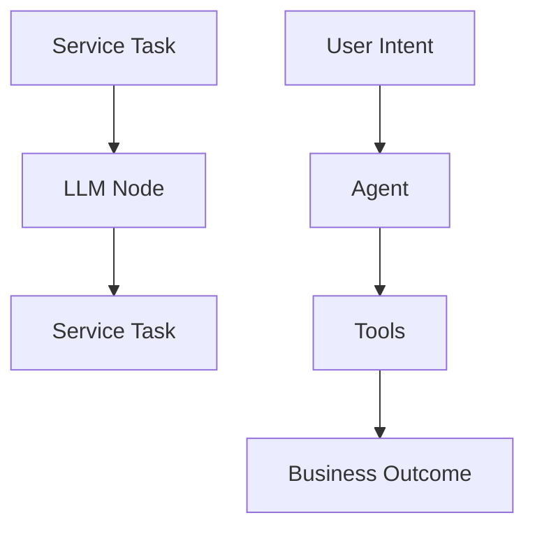

前者流程图画得很完整，看起来很可控；后者看起来很先进，演示效果通常也很好。

两个极端的问题不一样，但根子是同一个：它们都把“业务流程”和“认知任务”当成了同一种东西。注意 BPMN 和 LangGraph 都叫 Workflow 不是巧合——它们是两种不同的编排模型，第 5 节的四个问题是区分它们的标尺。业务流程要回答的是“做什么、谁做、什么时候做、结果去哪、出问题谁负责”；认知任务要回答的是“这一步具体怎么想清楚”。前者需要确定性，后者本身不确定。把它们混成一层，无论混在 BPMN 里还是混在 Agent 里，都会出问题。接下来三节分别说明：传统 Workflow 的边界在哪里，以及两种混法各自错在哪，错得有多贵。

## 2. Business Workflow 与 Agent Workflow 不是同一个东西

BPMN 和 LangGraph 都叫 Workflow，但它们解决的不是同一个问题。先把定义分开，后面所有选型都从这里推导。

**Business Workflow** 是由企业预先定义业务状态、责任、事件、审批和状态转移规则，并由 Runtime 持续执行的业务流程。例如：收到贷款申请 → 身份验证 → 信用检查 → 风险评分 → 人工审批 → 放款。核心不是“它是不是确定的”，而是：有 Business Process Definition，有 Process Instance，有业务状态，有角色与责任，有 SLA，有审批，有事件与定时器，有可治理的流程版本。

**Agent Workflow** 是以 Goal 为起点，由 Agent 或 Agent orchestration runtime 在运行过程中动态决定下一步执行内容的任务执行模型。例如：“调查这个投资机会，并给出一份结论” → search web → search Bloomberg → query internal database → read 17 documents → ask another agent → calculate valuation → discover missing information → search again → challenge its own conclusion → ask human → continue → produce report。重点不是“用了 LLM”，而是下一步执行什么在运行时才决定——这正是 LangGraph、Microsoft Agent Framework 这类系统与 BPMN 的核心差别。LangGraph 官方至今仍然区分 predetermined code paths 与 dynamic process / tool usage；Microsoft Agent Framework 则把 workflow 定义成 graph + executors + edges + events + state，并提供 sequential、concurrent、handoff、group chat、Magentic 等 agent orchestration 模式。([Microsoft Learn][48])([Microsoft Learn][49])

所以：传统 Workflow 的核心是 Business-defined Process Orchestration，Agent Workflow 的核心是 Runtime-driven Orchestration——区别不在 static vs dynamic，而在 orchestration authority 归谁。这是根本区别。

两种模型的对照：

|            | Business Workflow    | Agentic Execution               |
| ---------- | -------------------- | ------------------------------- |
| 起点       | Business Process     | Goal / Intent                   |
| 谁定义路径 | Business Architect   | Agent                           |
| 路径       | Mostly deterministic | Dynamic                         |
| 状态       | Process Instance     | Agent Task State                |
| 权限       | IAM / Roles          | Capability / Policy             |
| 责任       | Human / Organization | Agent executes within authority |
| 审计       | Process Audit        | Trace + Evidence + Audit        |
| 最终状态   | Workflow Runtime     | Workflow Runtime                |

### 一个容易被忽略的技术细节：BPMN 不是状态机

这里有一个在架构评审时经常被追问、但很多文档写错的点。严格来说，BPMN 是流程建模与编排的记法。运行时才产生 process instance，以及这个实例在流程图上的 token position 与执行状态。所以更准确的表述是：BPMN 提供确定性的流程模型和状态转移语义；具体某个 Process Instance 当前处于什么状态，由 Workflow Runtime 持有。把 BPMN 直接等同于“状态机”，作为通俗解释没问题，但写进架构文档会带来两个后果：一是把模型和运行时状态混为一谈；二是在讨论“状态到底应该存在哪里、出事故时以谁为准”时，失去判断依据。真正需要持有状态的是 Runtime，而不是图。这一点在后面的分层里很关键——因为“Agent 能不能改流程状态”这个问题的答案，取决于状态的所有权在谁手上，而不取决于图是怎么画的。

## 3. 第一个极端：给 BPMN 加一个 LLM Node

传统 Low-code 是拖一个 HTTP Node → 拖一个 Condition → 拖一个 LLM Node → 拖一个 Approval Node，看起来非常容易。但真正复杂之后，会冒出一串运行时问题：

- LLM 为什么选择这个？
- 为什么重新搜索？
- 为什么调用这个 tool？
- 为什么跳过那个 task？
- 为什么 context 变了？
- 为什么 agent 重新规划？

最终暴露出来的问题是连节点只是表面工作，运行时行为才构成主要复杂度。于是最后会出现一个非常荒谬的东西：

- Low-code workflow
- Agent Node
- Prompt
- Memory Node
- Agent Router
- Tool Node
- Agent Router
- Condition
- Agent Router

这实际上只是用 BPMN GUI 给 Agent 套了一层壳，不是长久方向。同样的道理，也不要把 Agent 的内部逻辑画进 BPMN。例如不要：

**BPMN**：

- Agent Call
- Agent Decision
- Agent Decision
- Agent Loop
- Agent Retry
- Agent Memory
- Agent Tool
- Agent Tool
- Agent Subprocess

最终 BPMN 又变成另一种 spaghetti。正确方式是 BPMN 之下只放 Agent Activity，Agent Runtime 内部再拥有自己的执行模型。

## 4. 第二个极端：让 Agent 决定整个业务流程

这同样危险。最差的 AI Workflow，就是让模型自己决定整个业务流程，金融领域尤其不能这么做。例如：

**Agent**：

- approve loan
- move money
- submit trade
- change risk limit

这里不应该是 Agent 自由决定，而应该经过 Policy Gate 与 Verification 再回到 Agent。Agent 有 autonomy，但没有 unrestricted authority。这一点比 Workflow 这个词本身更值得先弄清楚。两个极端各自错在哪，到这里可以说得很具体了。它们错的不是“用了 BPMN”或“用了 Agent”，而是把基本单元搞错了。本文主张的基本单元不是“LLM Node”，而是 Agent Task：

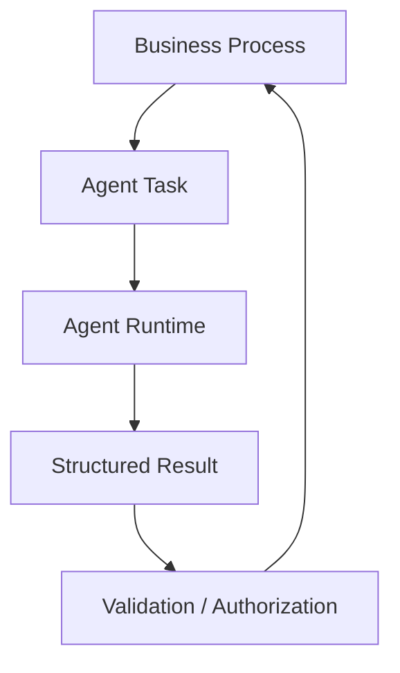

第一个极端把 Agent Task 降级成了一个 LLM Node，于是流程图画满了 Agent 的内部细节，却丢掉了智能本身；第二个极端把 Agent Task 升级成了整个业务流程，于是流程资产、责任边界与审批关系一起消失。第四、第五部分会把这条链路展开成完整架构与契约。

## 5. 选型四问：谁拥有 orchestration authority

BPMN 还是 Agent Workflow，真正要问的是四个问题。答案决定编排权归谁。

### Q1：谁决定下一步？

Business Process Definition 决定的 → Business Workflow；Runtime Agent Decision 决定的 → Agent Workflow。这是最重要的一问。

### Q2：谁拥有 Business State？

比如 KYC = APPROVED、RiskReview = WAITING、PMApproval = REJECTED，这是 Business State，应由 Business Workflow Runtime 拥有。而 search_done、peer_analysis_done、valuation_running 是 Agent Working State，可以由 LangGraph / Agent Framework 自己拥有。

### Q3：谁是 Process Definition 的 Source of Truth？

问业务分析师“这个业务流程现在到底是什么”：如果答案是 BPMN Process Definition，BPMN 就是 authoritative workflow model；如果答案是 Agent code / graph / orchestration logic，Agent Workflow 就可以成为 authoritative orchestration model；如果答案是 BPMN 定义外层、Agent Graph 定义内部任务，那就是 Nested。

### Q4：谁承担 Business Accountability？

为什么这个 loan 进入人工审批？为什么这个 case 被 reject？谁可以 override？SLA 到期之后走什么流程？这些问题如果要交给 Business Owner、Compliance、Operations、Auditor、Regulator 解释，那么这部分不能只存在 Agent working plan 里。

## 6. 什么时候应该只使用 Business Workflow

满足以下大部分条件，优先使用 BPMN / Workflow Engine：Business State 明确，State Transition 明确，Roles 明确，Approval 明确，SLA 明确，需要跨系统协调，需要长期运行，流程版本受治理，审计需要看到流程路径。例如 Account Opening、KYC、Trade Settlement、Payment、Loan Approval、Regulatory Reporting、Claims Processing——这些流程不应该为了 Agent 热潮改成 LangGraph。

## 7. 什么时候可以直接使用 Agent Workflow

反过来，满足以下条件时，纯 Agent Workflow 完全合理：Goal 明确但执行路径未知，需要探索、工具选择、动态规划、多 Agent 协作，没有正式业务状态机，没有监管流程定义要求。典型如 Investment Research、Market Intelligence、Internal Knowledge Investigation、Research Memo Generation、Complex Document Analysis、Incident Investigation。

比如“判断某家公司是否值得进入我们的投资候选池，并准备研究报告”——如果强行 BPMN 化（Search Company → Retrieve Filing → Peer Analysis → DCF → Missing Info? → Search Again → Ask Specialist → Critic → Recalculate），会非常难维护。这种情况下 LangGraph、Microsoft Agent Framework、DeepAgents 或自研 Agent Runtime 完全可以成为主要 orchestration 层。

## 8. 金融最常见的最终形态：Nested Orchestration

当前面两节同时成立——外层有正式业务流程、内层任务需要动态探索——答案就是 Nested：Business Workflow 定义外层，Agent Workflow 定义内部任务，BPMN 是 Business Process Source of Truth，Agent Graph 是 Agent Task Source of Truth。例如 Investment Idea Review 之下，Research、Risk Review、Compliance Review 各自内部跑一条 Agentic Workflow（搜索、估值、证据核查、重新规划），最后回到 BPMN 做 PM Approval。

Agent Task 从哪里读业务事实，是 Nested 落地时的第一个实际问题：答案是第 9 节的 Business Data Contract（authoritative source、snapshot、context version、consistency window）。完整的五层分层见第 25 节。

## 9. Business Data Contract：Agent 看到的是哪一个版本的业务事实

金融 Agent 落地时，最大的问题往往不是 Agent Runtime 的能力，而是 Agent 到底看到的是哪一个版本的业务事实。考虑一个很普通的时间线：

- 10:01 BPMN: Risk = 0.82
- 10:05 Agent: 查 Snowflake，得到 Risk = 0.77
- 10:10 Human: 界面上看到的是 0.79

三个数字都“正确”，因为它们来自三个时间点的不同来源，但在审计场景里，这直接导致结论无法复现。

所以架构上不能只有：Agent → Snowflake。
而要有 BPMN Process Instance → Business Context → Approved Data Snapshot（Authoritative Source）→ Agent Task → Structured Result → 回到 Process Instance 的闭环。

具体要确定的是四件事：

**权威源（authoritative source）** —— 某个业务事实以哪个系统为准。Portfolio value 是来自交易系统、估值系统还是数仓，必须指定唯一答案。允许两个系统都“能查到”，就等于允许两个结论。

**快照语义（snapshot semantics）** —— Agent Task 开始时的业务上下文是否被冻结。如果冻结，整个 Task 内的所有查询都基于同一版本；如果不冻结，就必须显式记录每一次读取的时间戳，并接受结论建立在“混合版本”之上。

**版本标识（context version）** —— 这个 context 需要一个可写入 Evidence 的标识，让事后能回答“当时它看到的是哪一版”。这是第 22 节里 Level B 可复现的前置条件。

**跨系统一致性窗口** —— Position、Market price、Risk score、Compliance status 来自不同系统，同步延迟不同。要么给出一个显式的一致性窗口，要么承认“不保证一致”并把风险写进设计文档。最怕的是既没有窗口、也没有声明，等到争议出现时才发现无法解释。

这一层决定了 Agent 的输出能否被复核。模型可以换，harness 可以换，Agent Runtime 的框架可以换，但只要 Data Contract 是清楚的，历史决策至少可以在“同样的业务事实 + 记录在案的规则版本 + 记录在案的 Agent 轨迹”这三个条件下被复核。反过来，如果 Data Contract 不清楚，任何 audit trail 都建立不牢——因为审计看到的是一堆记录，而不是一条能走通的证据链。

### 一个可复现的版本栈

把上面的四件事合起来，一个金融 Agent 的 Task 要在事后被完整解释，需要同时记住六个版本标识：

- workflowVersion = investment-idea-review v17
- policyVersion = compliance-policy v8
- dataSnapshot = ctx-20260912-1030
- modelVersion = model@version
- promptVersion = compliance-review v12
- evidenceRef = doc-123#p17

有了这六项，才能回答“为什么当时这个 Agent 会得到这个结论”。缺任何一项，复盘都会退化：只记 workflow 版本，说明不了 Agent 为什么这样判断；只记 model 版本，说明不了它当时看到的是哪一版业务事实。反过来也要说清边界：版本标识解决的是“可复现”，不是“可信任”。记录齐全只保证结论可以被重新推导，不保证结论正确。正确性由业务规则、验证与必要的人工审批负责。这两件事经常被混为一谈，结果是团队花大力气把日志做完整，却依然回答不了监管最关心的那个问题。这也是 Data / Semantic 层不应该被塞进 Control Plane 的原因：它回答的是“世界是什么样”，Control Plane 回答的是“谁被允许做什么”。

# 第二部分：业界趋势

下面不按厂商罗列，而是按第 5～8 节的决策框架，看三种模式在 2026 年产品里的真实样子：Camunda、Fluxnova 是 Business Workflow；LangGraph、Microsoft Agent Framework 是 Agentic Orchestration；Temporal、Durable Task 是正交的 Durable Execution。厂商名只是实现，决策维度才是选型的依据。

## 10. 四个架构领域总览

2026 年的行业实践，可以按“各自解决什么问题”归成四个架构领域。它们不是互相替代的关系，而是分别占住了架构的不同层。

| 领域                                | 解决的问题                  | 主要线索                                            |
| ----------------------------------- | --------------------------- | --------------------------------------------------- |
| 领域一 · 确定性业务编排             | 流程、责任、审批、SLA、审计 | Camunda / Fluxnova                                  |
| 领域二 · Agent Runtime 与 Harness   | Agent 如何工作              | OpenAI / Anthropic / LangGraph / Microsoft / Google |
| 领域三 · Durable Execution          | Agent 如何可靠地长期运行    | Temporal / Durable Task                             |
| 领域四 · Enterprise Semantic & Data | Agent 在什么世界里工作      | Palantir / Snowflake                                |

四个领域共同指向同一个组合点：Agent Task Contract。

这个分组方式本身就是一个判断：这四件事不在同一个维度上，不能用“谁替代谁”来讨论。其中有一处需要额外说明：领域三（Durable Execution）严格来说不与另外三者处在同一层，而是一层基础能力。它不解决“Agent 怎么决策”，也不解决“流程怎么定义”，它解决的是“执行到一半进程崩了怎么办”。把它当成一个可选方向去和 BPMN 比较，是选型时最常见的误判之一；把它当成所有长任务路径都必须具备的底座，才是它的真实位置。把领域二三混成一句“Agent Workflow 取代了 BPMN”，是这一轮技术讨论里最普遍的一次偷换。后面的第 46 节会把这个问题拆到产品层面。

## 11. 领域一 · 确定性业务编排（Camunda / Fluxnova）

为什么用 BPMN 引擎承载 Agent Workflow 会让人本能地抵触？Fluxnova 仍然是 BPMN 引擎：

- BPMN
- DMN
- Human Task
- Process State
- Audit

它现在已经开始加入：

- ad-hoc subprocess
- agentic subprocess
- MCP
- AI integration
- dynamic routing

但它仍然是 BPMN-centered orchestration，没有转到 Agent-centered execution runtime。Fluxnova 3.0 本身仍以 BPMN Process Engine 为核心，只是增加了 Ad Hoc Subprocess 等动态能力；其 roadmap 甚至把 AI integration 放到了后续能力路线。([GitHub][5])

### 更准确的说法：deterministic + dynamic，而不是“把 Agent 塞进 BPMN”

前面那句“Camunda 的方向是把 Agent 塞进 BPMN”，只说对了一半。Camunda 8.7 的官方文档已经把这件事定义得非常明确：agentic orchestration 是把确定性编排和动态（AI 驱动）编排混合进同一个端到端流程。原文的表述是，AI agent 负责执行流程中非确定性的部分，而 BPMN 提供可预测性、合规性和客户体验的底座。([Camunda 8 Docs][41])

分工是清楚的：

- LLM → 决定调用什么工具、以什么顺序、什么时候停止
- Camunda → 执行 BPMN elements
- Camunda → 保存 process state
- Camunda → retry / incident
- Camunda → human task
- Camunda → 确定性逻辑
- Camunda → process boundary

所以更准确的表述是：Camunda 选择的是在 Business Workflow 内原生支持 Agentic Orchestration——AI agents 执行 non-deterministic parts，BPMN 保持 end-to-end process 的可预测性和合规性。这不再是“Camunda 更先进”，而是 Camunda 选择了 Nested / Integrated 模式，并且把两种 orchestration 都收进一个平台。具体的设计与架构建议，见 Camunda 的《Design and architecture》文档。([Camunda 8 Docs][6])本文要讨论的是这个边界应该由什么契约来定义。这对金融、保险、银行很合理。但如果目标是一个 AI-native Agent Platform，BPMN 不适合作为核心抽象。

补一条 2026 年中的新进展：Camunda 8.10 把 Agent 建模成了一等执行对象，明确区分 Agent Definition 与 Agent Instance——定义描述部署的 Agent，实例代表某一次具体运行；BPMN 元素实例与 Agent 实例也不是同一个生命周期对象，同一个 Agent 实例可以在同一次流程实例里被多个元素实例复用（比如人工回复后流程回到 Agent 节点，对话记忆不断）。Operate 里可以直接看到 Agent 的执行状态、用量与完整推理链，LangGraph 这类外部框架经由 Agent Instance API 上报后同样可见。([Camunda 8 Docs][44])这正是“Agent 正在成为 Workflow Runtime 中的一等执行对象，但仍然不是 Business Process 本身”。

## 12. 领域二（上）· 执行模型

这个领域的主张最激进，投入也最大。它并不否认 Workflow 的存在，而是主张 Workflow 的实现方式应该被重写。在评价它之前，先把它自己的主张摆出来。而比较合理的模型其实是：User / Business Event → Intent → Agent Runtime（含 Policy / Authority、Context / Memory、Tools / APIs / MCP、Dynamic Plan）→ Execution Runtime（Deterministic Code / Agent Task / Human Task / External Event 分支汇总成 Result，再经 Verification / Policy Check 回流 Agent），另有一条 Durable State + Event Log 做底座。

这里先说两件事：在 Agent-first 架构中，Agent 可以动态决定下一步的任务或工具调用；但在金融业务流程中，这种自由度被限制在 BPMN 定义的 Agent Task 边界内。Runtime 决定“这个下一步能不能做、怎么执行、出了问题怎么办”。第一点是这个领域与过去 Workflow 最大的区别，也是它后来必须被限制的地方；第二点则不受领域之争影响——无论目标是什么，执行边界都必须存在。

### Google ADK 2.0

Google 在 2026 年把 ADK 从原来的 hierarchical agent executor 明确转向 Workflow Runtime + Graph-based execution：Agent、Tool、Function 全部作为 workflow graph 的节点，并支持 branching、parallelism、loops、human-in-the-loop、state preservation 与 resume；原来的 `SequentialAgent / LoopAgent` 正逐步被 graph workflow 取代。([GitHub][2])先看它的立场，而不是它说了什么：不是“Agent 出现了，所以 Workflow 消失”，而是“Workflow 的实现方式必须适应 Agent”。

### Microsoft Agent Framework

Microsoft Agent Framework 现在把 Workflow 定义成：

- Executors
- Edges
- State
- Events
- Runtime

而 Executor 可以是：

- 普通代码
- Agent
- Tool
- sub-workflow

并且 runtime 负责：

- execution
- events
- checkpointing
- HITL
- concurrency
- state management

也就是说，Workflow 不再等价于 Business Process Diagram，而是一个可执行的 runtime topology。([Microsoft Learn][1])

### LangGraph

LangGraph 把自己定位成 low-level orchestration framework for stateful agents。它的核心价值不是“画流程”，而是：State → Node → Decision → Tool → Checkpoint → Resume。
它特别强调 durable execution、stateful agents、long-running execution 与 failure recovery。也就是说，Graph 在这里不是给业务人员看的流程图，而是 Agent 的执行 runtime。([GitHub][3])换句话说：LangGraph 是 Agentic Orchestration Runtime，不是 Business Process Management 的直接替代品。但要加一句限定——如果企业的业务流程本身就是 Agentic Task，它当然可以成为整个业务流的 orchestration runtime。问题从来不是“LangGraph 能不能做业务流程”，而是“不要默认它就是 Business Process Engine”。所以不要再想 `Workflow = DAG / BPMN`，而应该定义：所以不要再想 `Workflow = DAG / BPMN`，而应该定义：

**Agentic Execution**：

- Intent
- Policy
- Execution State
- Dynamic Plan
- Durable Runtime

这里用 Execution 而不用 Workflow 是有意的：Intent 是输入，Policy 是控制，Dynamic Plan 是决策，Execution State 是状态，Durable Runtime 是基础设施——五件事不在同一层，“Agentic Workflow”这个名字会把它们压成一个词。

### ① Intent

起点不是 `Start → A → B → C`，而是一个目标，例如“完成投资机会尽调并生成投资建议”。Agent 负责寻找完成这个 Goal 的路径。

### ② Policy

这个才是企业 Workflow 最应该固定下来的东西。例如：

```yaml
policy:
  can_read: [market_data, research_db]
  can_write: [draft_report]
  approval_required: [execute_trade, send_external_email]
  forbidden: [customer_pii_export]
  max_budget: { tokens: 100000, tool_calls: 50 }
```

也就是说，流程可以变动，要固定下来的是权限和边界，这比 BPMN Gateway 更实在。

### ③ Dynamic Plan

Agent 根据目标动态产生工作计划：搜索公司、取财务数据、分析竞争对手、发现信息缺口、再搜索、建模估值、复核假设、产出报告——顺序与内容都由 Agent 自己决定，而不是预先画在流程图上。这个 Plan 对长跑 Agent 而言确实需要持久化，而不是只存在 LLM context 里。但要区分清楚：持久化的是 Agent Task 的执行状态，不是企业业务流程的状态——这一点在第 54 节展开。例如：

```json
{
  "runId": "invest-20260912-001",
  "goal": "Evaluate XYZ",
  "plan": [
    {
      "id": "t1",
      "type": "research",
      "status": "completed"
    },
    {
      "id": "t2",
      "type": "valuation",
      "status": "running"
    }
  ]
}
```

在这个领域的语境里，“Workflow”的含义已经发生位移：在 Agent-first 系统中，Agent Task 的内部执行计划可以由 Agent 动态生成；它不等于企业 Business Workflow Definition。这是 Agent Platform 视角下的结论。一旦把目标切到企业业务流程，这个区分就变成架构上的硬边界——第 24 节会把两种“计划”明确分开。

### ④ Execution State

这是传统 Workflow Engine 最值得保留的东西。真实的长任务经常是“跑 25 分钟 → 等待人工 → 6 小时后继续”，状态至少要能区分：

- RUNNING / WAITING_TOOL / WAITING_HUMAN / WAITING_EVENT
- FAILED / RETRYING / COMPLETED / CANCELLED

需要的是 durability、checkpoint、resume、timeout、retry、compensation 与 idempotency，而不是漂亮的流程图。这一点比 BPMN 图本身更实在。

### ⑤ Execution Runtime

真正的核心应该是 Agent Brain 与 Agent Execution Runtime 的分工：Agent 只负责提议，Runtime 负责授权、验证、执行与审计，中间经过 Policy Engine、Authority、Sandbox、Durable State 与 Event Log 这些统一边界。

Agent 不应该绕过统一的身份、权限、工具和审计边界，直接拿到未治理的生产系统权限。这句话不等于“Agent 不能访问生产系统”。它可以访问，但访问必须走完整链路：Agent → Task Context（业务上下文 + 流程实例 + 数据版本） → Tool / Capability → Identity / Authorization → Target System。
而不是：Agent → 万能 production credential。
这里有一个金融场景特有的细节：Authorization 判断的不只是 Agent 的身份。同一个 Agent，对 Investment A 与 Investment B 的权限可能相同，但业务上下文、交易上下文、数据版本与流程实例不同，允许的动作就可能不同。所以完整的授权输入应该是：

- Agent
- User
- Workflow Instance
- Business Object
- Action
- Context

只写“Agent Identity / Authority”，在评审时会被简化成“这个 Agent 有没有权限”，而金融机构真正要回答的是“在这个 case、这个版本的业务事实上，这一步动作是否被允许”。Agent 只负责 propose、reason、choose 与 delegate；Runtime 负责 authorize、validate、execute、retry、pause、resume 与 audit。这其实就是未来 Agent Platform 最核心的一层。内部 AI Platform 也可以按同一个方向设计：把 Planning、Context 与 Tool Gateway 收进 Agent Runtime，把 Durable State、Event Log 与 Human Task 放在执行侧，再把 Evaluation / Trace 接在末端。这与第 50 节那张平台分层图是同一个判断的两种画法，这里不再重复贴图。需要补一句：BPMN / Camunda / Fluxnova 是一个“外部能力”，不是整个 Agent Platform 的核心。这和今天很多企业的架构思路会完全不同。需要补充一句：这不是本文对金融场景的结论。在金融场景里，BPMN 恰恰是核心控制面，而不是外围能力。两句话并不矛盾，差别只在目标是通用 Agent 平台还是企业业务流程。

### Microsoft 的第二条线：Durable Runtime

微软实际上同时押了两个方向——`Agent + Workflow + Durable Runtime`，而不是二选一。除了上一小节那个 graph workflow 模型之外，它还提供了 checkpoint、human-in-the-loop、fan-out / fan-in、sub-workflow、typed routing、graph execution 与 durable execution。更重要的是，微软直接提供 Durable Extension，把 Agent Framework 的 graph workflow 跑在 Durable Task 基础设施上：Agent Framework → Graph Workflow → Durable Task → Checkpoint → Resume → Distributed Workers。
并支持 agent 运行数天甚至数周。([Microsoft Learn][12])这里已经非常接近这样的三段式模型：Agent 是 intelligence，Workflow 是 execution topology，Durable Task 是 runtime。这是一个很好的概念分层，但要补一句：概念分层不意味着产品分离——“同一套 workflow 定义，换个 host 就获得 durability”，一个产品同时承担其中两层甚至三层是常态。([Microsoft for Developers][46])Microsoft 的框架恰好是证明“Agent Workflow 和 Business Workflow 可以共享同一种 runtime abstraction，但不拥有相同业务语义”的边界案例：Workflow 由 executors + edges 组成 directed graph 并管理执行（[Microsoft Learn][48]），之上是 sequential、concurrent、handoff、group chat、Magentic 等 agent orchestration 模式（[Microsoft Learn][49]），Workflow 可以 as_agent 暴露、Agent 也可以作为 executor 进入 Workflow（[Microsoft Learn][50])——但语义归属不变，Business 语义仍由持有业务状态与责任的一方定义。

## 13. 领域二（下）· Harness 被产品化

上一节讲的是“Agent 的执行模型长什么样”，这一节讲的是“厂商正在把什么产品化”。这里有一个值得单独拿出来看的趋势：Agent Harness 本身正在成为独立的基础设施，而不是某个框架的内部实现细节。一旦它可以被单独产品化、单独版本化、单独定价，它在架构上的地位就变了——它从框架的内部细节，变成一层需要被认领的架构。

### Anthropic：Claude Research 的多 Agent 结构

Anthropic 的做法和微软略有不同。它最经典的生产案例是 Claude Research：一个主 Agent 制定研究计划，再启动多个并行 Agent 搜索，最后汇合。

Anthropic 明确指出，系统设计最大的难点已经变成 coordination、evaluation、reliability 与 tool design，而不是传统 workflow 的节点设计。([Anthropic][13]) 这与传统 BPMN 的思路差别很大。

### Anthropic 的第二条线：Harness

Anthropic 对 Agent 的工程实践越来越集中到 Harness，而不是 Workflow Designer。它 2026 年的工程文章把 long-running agents、managed agents、context engineering、skills、tool use、security、agent containment、evals 与 multi-agent research 分成几条独立的线推进。([Anthropic][14])也就是说，`Model + Harness + Tools + Environment + Permissions + Context + Evaluation` 正在成为一个比传统 workflow 更核心的抽象。不过要说清楚：Anthropic 的公开实践集中在 Harness、Tool Use、Context Engineering、Containment 与 Evaluation，并没有提出一套企业业务流程架构。把它的工程文章读成“BPMN 的替代方案”，是过度解读。

### OpenAI：从 Agents SDK 到 harness + sandbox

OpenAI 2025 年最初的方案是 `Responses API + Agents SDK + Tools + Handoffs + Guardrails + Tracing`，已经明显不是传统 workflow。2026 年更进一步，新的 Agents SDK 强调 model-native harness + sandbox + long-horizon task：Agent → Harness → Sandbox → Tools / Files / Commands → Long-running execution。
并且把 harness 与 compute 分离，强调 security、durability 与 scale。([OpenAI][15])（[OpenAI][16]）这里还有一层意思：Agent Workflow 最终可能不是 DAG，而是一个“可持续运行的 Agent Process”。

### 2026-09-10：OpenAI 把 Harness 单独产品化

这条更新对本文的论证尤其重要，因为它是一个非常直接的证据。OpenAI 在 2026-09-10 发布 Agents API，把驱动 Codex 的同一套 harness 与基础设施开放出来，并且明确由 OpenAI 托管和维护。([OpenAI][42])它提供的能力清单很能说明问题：

- managed harness
- long-running sessions（模型可以连续工作数小时）
- context management（接近上下文上限时自动压缩早期上下文）
- sandbox（OpenAI 托管沙箱，或自带基础设施 / 第三方沙箱）
- subagents（把任务拆给并行子智能体）

而开发者只需要定义四样东西：task、model、tools、environment。其余运行时基础设施——会话、上下文压缩、沙箱、并发子智能体调度——由平台负责。([OpenAI][42])这里有两层含义，方向相反，必须一起看。第一，它支持“Agent Runtime / Harness 正在成为独立基础设施”这个判断。当一个 harness 可以被单独产品化、单独版本化时，它就不再是框架的内部细节，而是一层需要被认领的架构。第二，它同时反证了 Agent Runtime 不等于 Business Workflow Runtime。Agents API 提供的“orchestration”指的是单个 Agent 会话内部的任务编排：决定先查什么、再调什么工具、什么时候停止。它不持有企业流程状态，不负责跨部门审批，也不会为一个投资 Idea 的合规责任签字。这两件事都被称为“编排”，但归属完全不同。这是后面反复要用的一个区分。

### 内部应用：delegated long-horizon task

OpenAI 在公开材料里把内部 Codex 的工作单位定义成 delegated long-horizon task，而不是 single interaction：员工把一件长周期任务整体交出去，Agent 自己使用工具、文件与代码反复迭代，直到交出结果。([OpenAI][17])

### OpenAI Presence：企业 Agent Operating Model

2026 年推出的 Presence 尤其值得注意，它的切入点不是 Workflow Designer，而是一个具体岗位：specific job → knowledge → system access → permissions → policies → agent → escalation → human。
每个 Agent 都有明确的权限、工作范围、approval 与 escalation，典型场景是 billing、insurance claims 与 IT service request。([OpenAI][18])这已经非常接近金融机构需要的模型。

### Google：Agent Platform + Enterprise Governance

Google 2026 年提出的 Agentic Enterprise blueprint 是 `Agent + Agent Platform + Orchestration + Governance + Enterprise Data`，而不是 `BPMN + LLM Node`。Gemini Enterprise 被明确定义成 agent development + orchestration + governance 的一体化平台，并开始支持 long-running agents、agent collaboration spaces、advanced governance 与 agent marketplace。([Google Cloud][19])（[Google Cloud][20]）2026 年 5 月 Google 又推出了 Agent Executor，一个分布式 Agent Runtime：durable execution、失败与 HITL 中断后可恢复、沙箱隔离、分布式部署，而且 harness-agnostic——自带 harness 与 LangGraph 这类第三方框架都能跑在上面。([Google Cloud][47])这正是“Agent Runtime + Durable Execution 合在一起交付”的又一个实例。这说明大型企业平台厂商的竞争重点，正在从“谁有最好的 Agent Builder”转向谁能提供企业级 Agent Operating Environment。

### Snowflake：Data-native 的 Agent 平台

Snowflake 的 Cortex Agents 架构已经非常清楚：

具体是 Cortex Agent 之下分 Cortex Analyst / Cortex Search / Code 三路，分别接结构化数据、非结构化数据与算力，再汇入 Reasoning 做 Action。

官方明确说 Cortex Agents 自己负责 reasoning、plan work、call tools、execute code、maintain threads 与 multi-step orchestration，客户不需要自建 orchestration loop / runtime / sandbox。([Snowflake Documentation][21]) 2026-08-28，Snowflake 进一步建议从 Cortex Analyst 迁移到 Cortex Agents，原因就是后者把 structured data、unstructured data、tool calling、thread context 与 multi-step orchestration 放进了同一个 Agent runtime。([Snowflake Documentation][22])针对 Financial Services，它的主张不是“做一个金融 Agent”，而是把 `first-party data + third-party data + semantic layer + search + agent + action` 组合起来，通过 Cortex Analyst、Cortex Search、Shared Semantic Views、Knowledge Extensions 与 Cortex Agents，让 Agent 在数据所在的位置执行 workflow。([Snowflake][23])这对银行、资产管理、保险特别重要。

### 一个必须写清楚的区分

Snowflake 的 Cortex Agents 确实提供 reasoning、planning、tool calling 与 multi-step orchestration。([Snowflake Documentation][21])但这里必须写清楚一句话，否则很容易被误读：Cortex Agents 的“workflow / orchestration”是 Agent 内部的任务编排，不等同于金融企业的 BPMN Business Process orchestration。它不替代 Camunda 这类流程引擎，也不承担流程状态、跨部门审批与责任归属。两者是上下游关系：流程引擎决定“这一步该做合规审查”，Cortex Agents 负责“在这次合规审查里把数据查清楚”。

## 14. 领域三 · Durable Execution（Temporal / Durable Task）

Temporal 的思路甚至更激进：Workflow 之下挂四个 Activity——Activity → LLM、Activity → Tool、Activity → Database、Activity → API。

Workflow 本身负责：

- state
- ordering
- waiting
- retry
- timeout
- resume

所有 nondeterministic I/O 都放在 Activity。Temporal 最近专门发布了 AI Agent Reference Architecture，把 Agent 的 loop 放进 durable Workflow 中。([Temporal][4])所以它实际上把两份责任分开了：Workflow 只做确定性编排，所有非确定性 I/O（LLM、Tool、API、DB）全部封装进 Activity。注意这里的“分开”指的是责任——Temporal 自己的做法恰恰是让 Agent Loop 运行在 durable Workflow 之内。不要比较 Camunda vs LangGraph vs Temporal，这个比较本身就不对：

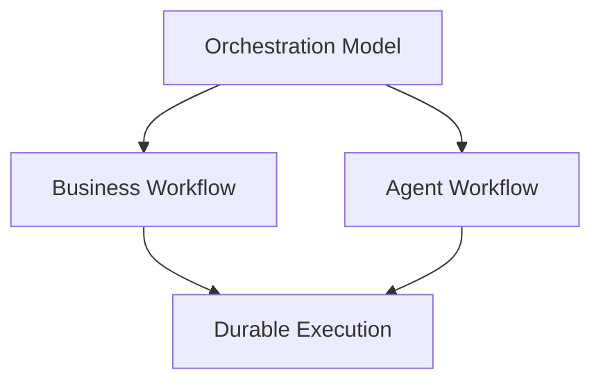

Temporal 是 Execution Model / Durable Runtime，而不是另一种 Business Process Definition。上面的案例正好说明：Agent Workflow 可以拥有 Durable Execution，而不等于它因此变成 Business BPM。

### 为什么这一层必须单独存在

Microsoft 的 Durable Extension 也属于这一层：Agent Framework 的 graph workflow 跑在 Durable Task 基础设施上，支持 checkpoint、resume，以及数天到数周的运行周期。([Microsoft Learn][12])把 Durable Execution 与 Agent Workflow 分开的理由，是它们的失败模式不同：

- Agent Workflow 失败：Agent 选了错误的工具，或推理方向错了
- Durable Execution 失败：进程崩了、网络断了，执行无法恢复到崩溃前的状态

前者是决策质量问题，后者是执行可靠性问题。但这是责任要分开的理由，不是产品要分开的理由：同一个 Runtime 完全可以同时承担两种责任。Microsoft 的实践就是直接证据——同一套 workflow 定义，跑 in-process runner 是本地执行，换 Durable Task host 就获得 checkpoint、恢复与分布式执行，executor 代码一行不用改，每个 executor 在 dashboard 里就是一个 durable activity。([Microsoft for Developers][46])

## 15. 领域四 · Enterprise Semantic & Data Layer

前三个领域都在回答“Agent 怎么工作”，这一个回答的是另一个问题：Agent 面对的世界，是用什么语言描述的？

### Agent 到底应该连接什么

因为 Palantir 其实回答了一个很关键的问题：Agent 到底应该连接什么？Palantir 的答案不是让 Agent 直连上千个 API / Table / PDF，而是先经过一层 Enterprise Ontology——官方把它概括成 Data + Logic + Action + Security。([Palantir][25])

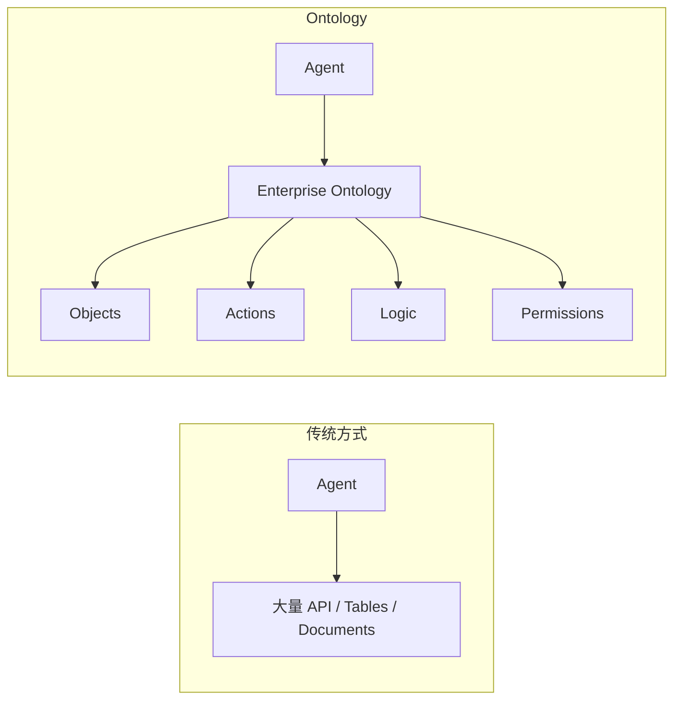

更形象一点：Ontology 之下是 Company → Investor / Security → Transaction → Actions 这样的业务对象网，而不是 table 和 database。所以 Agent 看到的不是 table / API / PDF / database，而是 Company / Portfolio / Position / Transaction / Risk / Counterparty / ResearchReport，并且这些对象自带 actions、logic、permissions 与 relationships。

### Action 模型：nouns 与 verbs

Palantir 有一个很值得重视的思想：数据只是“nouns”，Action 才是“verbs”。也就是说，Company、Position、Loan、Customer、Transaction 这些是 nouns，而 Approve、Reject、Rebalance、Create、Assign、Escalate、Freeze、Review 这些才是 verbs。([Palantir][26])这恰好解决 Agent 最大的问题：Agent 不只需要知道“这个东西是什么”，还需要知道“对它允许做什么”。

### Ontology 与 RAG 的差别：world model + action model

传统 RAG 是 question 到 top-k documents 再到 LLM；Ontology 则把 Data、Logic、Action 先收进 Security，再交给 Agent 做 Real Action——从架构角度看，它更接近 Agent 的 enterprise world model + action model，而不是一个 Vector DB。（这是本文的架构解读，不是 Palantir 的官方定义。）Ontology 在整个 Agent 架构里的位置是：

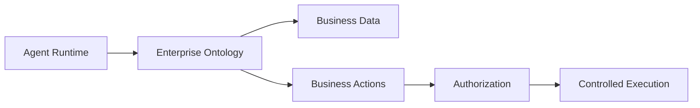

### Ontology MCP：把语义层变成 Agent 的 substrate

这一步尤其重要。2026-06 Palantir 已经正式 GA Ontology MCP。意味着：

- Claude
- OpenAI
- Gemini
- Microsoft Agent Framework
- Google ADK

这些产品本身都支持 MCP，因此任何兼容 MCP 的 Agent / Agent Framework 都可以通过 MCP 做 read Ontology、write Ontology 和 execute Ontology actions，而且调用继续使用 Foundry 权限模型。([Palantir][27])换句话说，Ontology 不需要成为 Agent Framework，它变成 Agent 的 enterprise semantic/action substrate，这比“Palantir 自己做 Agent Framework”更重要。

### AIP Logic：No-code 没有死，但不再是抽象核心

AIP Logic 仍然是 no-code。它可以做 Ontology Object 到 LLM 再到 Condition、Loop、Function 和 Action 的串联，并且支持 testing、evaluation、monitoring、automation 和 human review。([Palantir][28])所以 Palantir 的实际答案不是“No-code 已死”，而是 No-code 不能再是整个系统的抽象，它只是 Ontology / Logic / Action 上面的一个 builder，这个区别直接决定后面怎么搭。

### Snowflake 的另一条变化：RAG 走向“分析型检索”

2026 年 Snowflake 推出了 Analytical Search。传统 RAG 是 question 到 top-k documents 再到 LLM，对于“10000 份财报中，有多少家公司……”这类问题其实不行。Snowflake 的新方向是 Agent 调度 multiple Search queries、metadata filters、AISQL、AI_FILTER、AI_AGG，最后 aggregate entire corpus：Agent → multiple Search queries → metadata filters → AISQL → AI_FILTER → AI_AGG → aggregate entire corpus。
也就是说，Agent 不只是“找资料”，而是能够调度一套数据处理 workflow。([Snowflake Documentation][24])这个对金融 research、compliance、credit、ESG 很实用。

## 16. 学术界：Agent Workflow 已经成为一等研究对象

厂商文档之外，还有一个更值得看的信号：研究界已经不再把 Agent 看成“一个 LLM 加几个工具”，而是把 Agent Workflow 本身当成研究对象。这条线上有几篇值得当作入口的论文。

### 1. 《A Survey on Agent Workflow — Status and Future》

这是目前比较值得当作入口的 survey。论文把 Agent Workflow 按两个维度分类：功能上分 planning、多 Agent、API、tool、memory，架构上分 agent role、orchestration flow、workflow specification。它明确指出，随着 Agent 系统变复杂，workflow/orchestration 已经成为 scalable / controllable / secure agent behavior 的核心基础设施，同时指出标准化、安全和多模态 integration 仍是开放问题。([arXiv][9])这意味着一个很重要的判断：Workflow 不会消失，只是在从“业务流程建模”变成“智能执行系统建模”，这点很容易被企业架构师忽视。

### 2. 《Architectural Implications of Agentic AI Workflows》

2026 年 8 月的研究直接分析 Agentic Workflow 对底层基础设施的影响，核心发现是 Agent 的执行路径：Agent Request → LLM 推理 → Tool 调用 → CPU 执行 → LLM 推理 → Tool 调用 → 不断重复。

Agent 不是传统 ML 那种 input → GPU → output，而是 CPU、GPU、network、external systems、orchestration 不断交替：

- CPU
- GPU
- network
- external systems
- orchestration
- CPU
- GPU
- ...

不断交替。结果就是 CPU/GPU 利用率不均衡，execution bursty，tool invocation 造成 CPU critical path，multi-agent 增加调度复杂度，heterogeneous workloads 使传统 server provisioning 变得低效。论文甚至做了专门的 Agentic Server 原型 Agora。([arXiv][10])这其实说明 Agent Runtime 最终可能会成为一种全新的计算运行时，而不只是 Python framework。

### Workflow 定义本身也在 AI 化

以前是 Developer 设计 Workflow 再部署：Developer → 设计 Workflow → 部署。
以后可能是 Business Intent 经由 Agent / Compiler，结合 Execution Policy 生成 Generated Plan 再交由 Runtime 执行：Business Intent → Agent / Compiler → Execution Policy → Generated Plan → Runtime。
也就是说，Workflow 从“静态 artifact”变成“动态 execution artifact”。最近研究也开始直接研究 Agentic Workflow Generation，也就是从功能描述自动生成可执行 workflow，而研究结果同时指出：单纯让 LLM 生成流程很容易产生缺失/幻觉数据，因此真正可靠的方向是生成 + 约束 + runtime validation，而不是“让 LLM 随便画流程”。([Springer Nature Link][7])

### 甚至“Workflow”这个词都可能被弱化

未来更准确的词可能是 Agent Runtime、Agent Execution 或 Task Orchestration，而不是 Workflow Engine。在这个基础上，把 Agent 平台抽象成“Agent Operating System”是一个值得关注的研究方向——需要说明的是，它目前仍然只是研究提案，不是已经被行业标准化的架构。一个 2026 年的代表性工作提出 Agent Operating System (AOS)，把系统分成 Control & Governance Plane 与 Runtime & Coordination Plane：前者负责 intent、policy、authority、trust、audit 与 human oversight，后者负责 agent lifecycle、workflow coordination、model/tool routing、memory、scheduling 与 runtime assurance。([arXiv][8])值得关注的原因不是这个词，而是它把“控制面”与“运行面”分开的方式，与本文后面的分层判断一致。

## 17. 阶段结论：四个领域怎么组合

到这里可以看到一个比较清楚的分工：

| 主体                 | 解决的问题                                 |
| -------------------- | ------------------------------------------ |
| Palantir Ontology    | 解决：世界是什么、能对世界做什么           |
| Anthropic / OpenAI   | 解决：Agent 如何工作（Harness）            |
| Microsoft / Temporal | 解决：Agent 如何可靠地长期运行             |
| Snowflake / Google   | 解决：Agent 如何在企业数据与语义边界内工作 |
| Policy / Governance  | 解决：Agent 到底有没有资格做这件事         |

这五块拼起来，才接近所谓的 AI-native enterprise workflow。但这里必须停一下，因为上面的材料对不同的目标会给出相反的答案。它既能支持“BPMN 该退休”，也能支持“BPMN 是合同层”。问题不在材料，在于目标没有定清楚：我们讨论的到底是 Agent Platform，还是企业业务流程？

### Layer 1：Business Process

这个可以继续使用：

- BPMN
- Camunda
- Fluxnova
- SAP workflow
- ServiceNow

解决合规、审批、SLA、责任、审计和跨部门流程。例如：开户 → KYC → Risk → Approval → Account Creation。

### Layer 2：Agentic Workflow

这完全不同。例如：

具体是 Goal 先到 Research Agent，再扇出 Search / Read / Compare / Calculate / Ask specialist / Re-plan / Verify 七路。

这套能力由 Agent Framework、Execution Runtime、Policy、Memory、Tool Runtime 和 Durable State 实现：

- Agent Framework
- Execution Runtime
- Policy
- Memory
- Tool Runtime
- Durable State

### 分开看：对 Agent Platform，与对企业业务流程

| 传统方式          | Agent 时代对应物               |
| ----------------- | ------------------------------ |
| BPMN Process      | Execution Policy / Task Model  |
| Gateway           | Policy / Agent Decision        |
| Service Task      | Tool                           |
| Sub-process       | Agent / Sub-agent              |
| Human Task        | Human-in-the-loop              |
| Process Variable  | Durable State                  |
| Process Instance  | Agent Run                      |
| BPMN Engine       | Agent Execution Runtime        |
| DMN               | Policy / Rules Engine          |
| Process Monitor   | Agent Observability            |
| Process History   | Event / Trace                  |
| Workflow Designer | Code / DSL / AI-generated Plan |
| Static Flow       | Dynamic Execution Plan         |

由此可以给一个更精确的说法。一种常见的表述是“老的那套 Camunda / Fluxnova，甚至所谓 Low-code 产品，都不该再用”，这个判断要分两种情况看。

### 对 **Agent Platform 本身**，基本正确。

不要把 `Camunda / Fluxnova / BPMN` 当成核心抽象。

### 对 **Enterprise Business Process**，则不正确。

BPMN 这些东西仍然很有价值，因为法律责任、合规、审批、SLA、审计、跨系统 transaction 和 human accountability 并不会因为 LLM 出现就消失。所以真正可行的架构是下面这一层组合，前两种做法都不行：

> Business Process Layer + Agent Execution Layer

两者之间通过 `typed task / events / policy / authority / durable state` 连接。

### 从零设计一个 Agent Platform 时，应该先建什么

第一步不该是建 Workflow Designer，而应该先建这 7 样东西：

- 1. Agent Runtime
- 2. Durable Execution Runtime
- 3. Tool / MCP Gateway
- 4. Policy & Authority Engine
- 5. Context / Memory Runtime
- 6. Human Task Runtime
- 7. Trace / Evaluation / Audit

然后再决定哪些地方需要 BPMN，哪些地方需要 Graph，哪些地方完全由 Agent 动态决定。先选 Camunda 再想办法把 Agent 塞进去，顺序就反了，这才是真正的 AI-native workflow architecture。另外，Google、Microsoft、LangGraph、Temporal 当前都在把 workflow 做成 code/runtime-first 的 graph + state + durable execution，而不是继续强化传统“业务人员拖节点”的范式；这已经不是单个厂商的偶然选择。([GitHub][2])把这个结论落到 “内部 LangChain DeepAgents + AWS AgentCore + LangSmith 的 AI 能力平台” 上，下一步最值得做的是设计一套 Agent Runtime / Execution Runtime / Business Process 三层架构，并把 Temporal、AgentCore、LangGraph、Microsoft Agent Framework、Camunda/Fluxnova 放进去逐项对比。这样才能比较清楚地判断一家平台到底应该自己做什么、买什么、哪些东西根本不该引入。把范围从厂商文档扩大到四类证据——学术研究、模型厂商实践、企业 AI 平台、金融机构与监管机构的实践——结论会更完整：2026 年真正成熟的方向，不是“把 BPMN 换成 Agent”，而是把 Workflow 拆成“Agentic Decisioning + Durable Execution + Policy/Authority + Enterprise Ontology/Data + Evaluation”。对通用 Agent 平台而言，传统 Workflow 仍然存在，但它越来越像受约束的外围控制面，而不是平台的核心抽象。

这五块各自最值得追的线索，按调用顺序是：Agent Harness → Agent Orchestration → Durable Runtime → Ontology / Data / Tools → Policy / Identity → Human Control → Audit / Evaluation，有前景的企业平台大概率会把它们组合。

### 趋势阶段的金融分层

趋势阶段常见的一种画法，是把 Experience、Agent、Control、Runtime、Semantic、Tools 六块并列展开。那张图不能算错，但它还没有回答本文真正关心的问题——业务状态归谁、Agent Task 的边界由谁定义。本文最终的主线架构（第 25 节）会把这两件事补上，因此这里不再重复贴图。只需要先记住其中一个判断：Ontology / Semantic Layer 和 Agent Runtime 是两个不同东西。Palantir 最强的是前者，AWS / Microsoft / OpenAI / Anthropic 最强的是后者，而 Snowflake 正在试图把 `Data + Semantic + Agent Runtime` 放在一起。

### 趋势阶段的结论

回到最开始那个判断：“老的 Camunda / Fluxnova，甚至所谓 Low-code，都不应该再用。”把论文与各家厂商、监管机构的材料串起来看之后，这个说法要修正得更精确。

### 错误方向

错误方向是 BPMN → LLM Node → Agent 的串法。

这确实不是最有前景的 Agent Platform 架构。

### 同样错误

User 到 Autonomous Agent 再到无限 Tool 直达 Enterprise 的做法：User → Autonomous Agent → 无限 Tool → Enterprise。
金融领域尤其不可接受。

### 更合理的 2026+ 模型

对通用 Agent 平台而言，一句话概括：未来的 Workflow 不是“下一步去哪”，而是“Agent 为了完成 Goal，可以在什么边界内，以什么权限，持续做什么，并且如何被暂停、恢复、验证和追责”。而 Palantir Ontology 解决的是“世界是什么、能对世界做什么”；Anthropic/OpenAI Harness 解决的是“Agent 如何工作”；Microsoft/Temporal/AWS 解决的是“Agent 如何可靠地长期运行”；Snowflake/Google 解决的是“Agent 如何在企业数据与语义边界内工作”；Policy/Governance 则解决“Agent 到底有没有资格做这件事”。这五块拼起来，才比较接近 AI-native enterprise workflow。而金融服务真正应该研究的核心不是“哪个 Workflow Engine 最好”，而是：

> Agentic Decision + Enterprise Ontology + Durable Execution + Authority + Evidence

这比单纯讨论 Camunda、Temporal、LangGraph 谁替代谁，层次高一个级别。

### 2026：Workflow Engine 与 Agent Runtime 正在合流

上面列出的厂商如果并排看，会发现它们在做同一件事，只是起点不同：AWS 的 Step Functions 直接调用 AgentCore Harness（[Amazon Web Services, Inc.][43]）；Camunda 把 Agent 建模成流程里的一等执行对象（[Camunda 8 Docs][44]）；Microsoft 让同一套 workflow 定义换个 host 就获得 durability（[Microsoft for Developers][46]）；Google 把 Agent Runtime 与 Durable Execution 打包成 Agent Executor（[Google Cloud][47]）；Temporal 则让 Agent Loop 直接跑在 durable Workflow 里（[Temporal][4]）。

合流的是运行时能力，不是业务语义。准确的说法是 Workflow、Agent Runtime、Durable Execution 是三种不同的架构责任，而未来的产品会越来越把它们组合在一起：

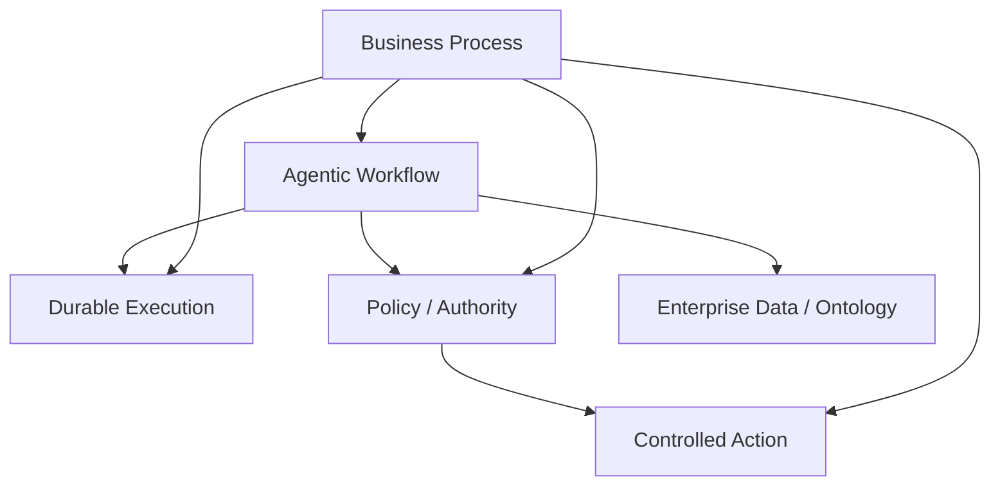

对金融企业而言，这意味着选型问题要换一种问法：不再问“买 BPMN 引擎还是买 Agent 平台”，而是问这三种责任在哪里合并、在哪里隔离——业务编排必须留在确定性的 Business Workflow 里，Agent 的执行可以交给合并后的 Runtime，但状态归属、审批与举证不能跟着一起合掉。后面的第四、五部分就是这道划分题的答案。

# 第三部分：金融为什么不能照搬

第二部分介绍的四个领域，都是通用企业场景下的正确答案。金融场景多出来的主要不是技术难度，而是**举证责任**。这一部分说明的是：金融到底额外要求了什么，以及这些要求如何反过来决定架构。

## 18. 金融真正担心的问题：Verifiability Gap

通用企业场景里，最常被讨论的问题是“Agent 够不够聪明”，金融业担心的则是 Agent 到底代表谁行动，这个问题在金融业特别严重。最新一篇关于 Agentic AI governance in FinTech 的研究提出了 **Verifiability Gap**，也就是说：Agent Authority → 实际执行 → 能否证明：为什么当时允许它这么做？
这项研究把 orchestration 本身看作 policy layer，并指出以下几点：

- orchestration 本身是 policy layer
- 不同 orchestration 结构会改变最终决策
- historical replay 可能无法重现
- model/version变化会改变结果
- deterministic replay 并不等于 historical decision replay ([arXiv][32])

传统 Workflow：same input → same BPMN → same path。
Agent：same input → different reasoning → different tools → different context → different outcome。
所以：

> Agent Workflow 的审计对象不能只是“流程图”，而必须是 Execution Trace + Context + Authority + Evidence。

## 19. 监管机构在看什么

### Bank of England

2026 年 Financial Stability Report 已经专门讨论 Agentic AI，其中提到目前金融机构主要使用 Agent 做 research、coding、surveillance 和 lower-risk operations，而不是 autonomous trading。核心风险在于 output 不可预测、validation 困难、autonomy boundary 难定义，以及 correlated behavior ([Bank of England][33])。

### FSB 2026：12 类 sound practices

Financial Stability Board 2026 年 AI governance consultation 提出了 12 类 sound practices，覆盖 AI governance、lifecycle management、risk identification、operational resilience、third-party dependence，以及 GenAI / agentic AI risks ([Financial Stability Board][34])。这说明金融监管未来看 Agent，除了 model risk，还要看：

- Model
- Agent
- Tool
- Data
- Permission
- Runtime
- Vendor
- Human Oversight

## 20. 已经跑在生产上的样本：Stripe 与 AWS

### Stripe

AWS 与 Stripe 2026 年公开的案例很有参考价值，场景如下：金融合规 review
Stripe 面临：thousands of transactions / day
它搭建 production agent system：Agent → AWS Bedrock → enterprise data → compliance reasoning → human review。
公开结果如下：

- review handling time ↓ 26%
- helpfulness >96%
- final decision 仍由 human 控制 ([Amazon Web Services, Inc.][35])

Stripe 并没有让 Agent 直接取代 Compliance Officer，它真正做的是：

- Agent = investigation / preparation
- Human = decision authority

这是当前金融服务中较容易同时满足治理、审计与责任要求的一种落地模式。把它写成“未来几年的主流架构”属于过度推断——监管材料描述的是当前的风险与实践，不足以证明未来的主流形态。

### AWS 的金融 Agent 参考架构

AWS 2026 年的 Financial Services AgentCore 架构如下：

具体是 Agent 扇出 Market / Risk / Research 三个 Specialist，经 Orchestrator 进 AgentCore Runtime（Identity / Tracing / Sandbox），Identity 之下再挂 Policy。

例如 portfolio advisory 包括 portfolio valuation、risk stress test、market research 和 advisor synthesis，由多个 specialist agents 协同完成。([Amazon Web Services, Inc.][36])

而信用分析案例则是：

- Policy PDF
- Snowflake account history
- transaction patterns
- Agent reasoning
- recommendation

这非常接近企业真正的 Agent Workflow。([Amazon Web Services, Inc.][37])

### AWS 的新方向：Step Functions 直接调用 AgentCore

2026 年 6 月 AWS 把上面这件事又往前推了一步：Step Functions 可以直接调用 Bedrock AgentCore Harness，把 Agent 当成 Workflow 中的一等步骤。Step Functions 管 workflow execution，AgentCore 管 agent loop；多个 Agent 可以并行或串行出现在同一个流程的不同决策点，关键动作前可插入 human approval；workflow execution history 里直接能看到每次调用的 agent input、output、token 用量与 duration，session ID 让 Agent context 可以跨 workflow execution 保留。([Amazon Web Services, Inc.][43])

这里已经不是“Workflow 和 Agent 二选一”，而是 Workflow Engine 调用 Agent Runtime——与本文第四、五部分的主线结论是同一件事。

## 21. 金融 Model Risk Management 里的 Agentic Workflow

这一节看金融领域的实证研究。它们没有停在“客服 Agent”这类演示场景上，而是直接落在信贷、反欺诈和模型风险管理上——比通用的 Agent 案例更接近企业真正的问题。2026 年有一篇比较完整的 survey 覆盖了以下方面：

### Agentic Artificial Intelligence in Finance: A Comprehensive Survey

涵盖 financial operations、financial markets、architecture、regulation、systemic risk 和 multi-agent coordination ([arXiv][29])。

另外一篇论文的内容如下：

### AI Agents in Financial Markets

它把金融 Agent 拆成以下结构：Data Perception → Reasoning → Strategy Generation → Execution + Control。
它的结论是短期最可能的形态不是 fully autonomous finance，而是 bounded autonomy，即：

- AI
- human supervision
- constrained execution

这对企业架构有直接影响。([arXiv][30])

另一项研究做了以下组合：

- Modeling Crew
- Model Risk Management Crew

例如：

**Manager Agent] --> E1[EDA Agent**：

- E1
- E2
- E3
- E4
- E5

另一组：

**MRM Manager] --> A1[Compliance Agent**：

- A1
- A2
- A3
- A4

该研究在 fraud detection、credit approval 和 credit risk 中做了实验 ([arXiv][31])，这比“客服 Agent”更接近企业真正的问题。

## 22. 金融服务真正需要确定下来的六件事

把前三部分的材料压成六条，就得到金融服务对架构的硬约束。它们不是设计偏好，而是监管、责任和事故成本直接推导出来的结果。

| #   | 约束   | 为什么                         | 在架构上的落点                |
| --- | ------ | ------------------------------ | ----------------------------- |
| 1   | 确定性 | 结论必须能从输入与规则推导出来 | Workflow Runtime 持有状态转移 |
| 2   | 责任   | 每个决策必须有人签字           | Human Task + Identity         |
| 3   | 审批   | 高风险动作不能自动生效         | BPMN + Policy                 |
| 4   | 审计   | 事后必须能回答“谁做了什么”     | Audit Trail                   |
| 5   | 授权   | “能做”和“被允许做”是两件事     | IAM + Agent Policy            |
| 6   | 可追溯 | 结论与证据要对得上             | Evidence + Agent Trace        |

这六条之外，还有一条从 Verifiability Gap 直接推出来、但容易被低估的要求：可复现性（reproducibility）。传统的可复现假设是“同样输入 + 同一个流程版本 = 同样结果”，Agent 打破了这个假设：同样的输入，可能因为不同的检索结果、不同的上下文、不同的模型版本，得到不同的推理路径和结论。所以在金融场景下必须退一步，先明确自己能承诺哪一种复现：

- Level A：完全可重放：同输入 + 同模型 + 同工具 + 同上下文快照 → 同结果
- Level B：可复核：同业务事实快照 + 记录在案的规则版本 + 记录在案的 Agent 轨迹 → 人可以独立得出同一结论

大多数业务应该按 **Level B** 设计，把 Level A 留给真正需要法律级举证的动作。这个决定必须在架构设计阶段做，事后基本补不上——因为它决定的是要不要保留业务事实快照、规则版本和完整 Agent 轨迹。等审计来问的时候再补，通常已经晚了。这六条约束加上可复现等级，就是后面架构设计的全部输入。但注意这些约束只决定 Business State 与 Process Authority 必须有人拥有，不意味着所有认知工作都必须 BPMN 化——第 7 节那种纯 Agent 任务同样要过这六条，只是由不同的 Runtime 来承担。

### 金融领域可以借鉴的形态

金融领域可以借鉴的形态，同样不是把 Agent 放在整个流程之上，而是：

即 Domain Agent 经 Financial Context Layer（Ontology / Policies 与 Research 文档 / Structured Data）与 Dynamic Planning，进 Durable Agent Runtime（Policy / Authority、Tool Gateway、Human Approval），Tool 接 Core Banking / Trading / CRM / Risk 与外部数据，产出 Evidence + Trace 进 Audit。

# 第四部分：架构决策——谁拥有 Orchestration Authority

## 23. 全文原则

前面十二节都是趋势观察。趋势观察的结论会随着“目标是什么”而改变：目标是通用 Agent 平台，还是金融企业的业务流程，答案可以完全相反。

从这一节开始，目标明确为后者：金融服务中确定性业务流程的落地架构。在这个前提下，前面那些材料会收敛出一条比两者都更窄、也更可执行的主线。

把“业务分析师能够把大部分流程梳理清楚”这个前提补上之后，前面的结论需要调整：对于金融服务，BPMN 不应该被淘汰。如果业务分析架构师能够把大部分业务流程、状态、审批关系、异常路径、职责边界都分析清楚，那么 BPMN/DMN 反而仍然是最合适的“业务控制平面”。真正要改的不是“有没有 Workflow”，而是分工：不要让 BPMN 承担 Agent 的智能行为，也不要让 Agent 取代 BPMN 的确定性业务控制。于是新的架构可以定义为：

> Deterministic Business Workflow + Bounded Agentic Execution

也就是：

- 业务流程确定性
- Agent 局部智能化
- 统一 Policy / Authority
- 统一 Audit / Evidence

这实际上比“纯 Agent Workflow”更适合银行、保险、资管、证券。

### 先定下一条原则

在展开这一部分之前，先把本文反复使用的那条原则定下来：

> 任何 Agent 驱动的业务动作，在产生业务状态变化或外部副作用之前，都必须经过确定性的 schema / business validation 与 authorization；是否需要 Human Approval，由 BPMN 与 Policy 按风险等级决定。

这句话里有三个从句，各自解决一个问题。“必须经过确定性验证”保证进入流程的不是一段自然语言，而是一个可校验的结构，这是后面 Task Contract 里 output schema 存在的理由。“必须经过 authorization”保证“Agent 有能力做”和“Agent 被允许做”永远是两件事，前者是模型能力问题，后者是治理问题。“是否人工批准由风险等级决定”避免两个极端：既不要求所有输出都过人工（那等于退回 Level 0，自动化失去意义），也不允许高风险动作走自动通道。后面第 38 节会说明，为什么这条原则必须同时覆盖“建议型输出”和“动作型输出”这两种 Task——只写一半，就会在评审时被抓出漏洞。

## 24. 两类问题：业务怎么走，和某一步怎么完成

在这个场景下，整个系统可以拆成两个完全不同的问题：

### 问题 A：业务应该怎么走？

由以下结构确定：Business Architect → BPMN / DMN → Workflow Definition。
包括状态、顺序、并行、条件、审批、角色、SLA、回退、异常、补偿和业务事件，这些尽量确定。

### 问题 B：某一步里面具体怎么完成？

这里允许 Agent，例如：Compliance Review → Agent：找政策 / 找历史案例 / 找相关文件 / 检查证据 / 总结风险 / 提出建议 → Human → Approve / Reject。
因此，BPMN 决定“做什么、谁做、何时做、结果去哪”，Agent 决定“这一项任务怎么做得更好”，这是整个设计的边界所在。

### Workflow 管的是状态转移与业务责任

在前面那套分层里，有一个界定需要修正。原来是 Workflow 管 State + Action，在这个前提下，应该修正为 Workflow 管 State Transition + Business Responsibility，也就是：BPMN → State → Task → Business Rule → Next State。
而 Agent 是：Task → Agent Execution → Structured Result。
Agent 不拥有 Workflow。

## 25. 五层架构

把前面的分层和这里的约束合起来，得到本文的主线架构，也是全文唯一一张完整架构图。后面所有图都是它的局部展开。

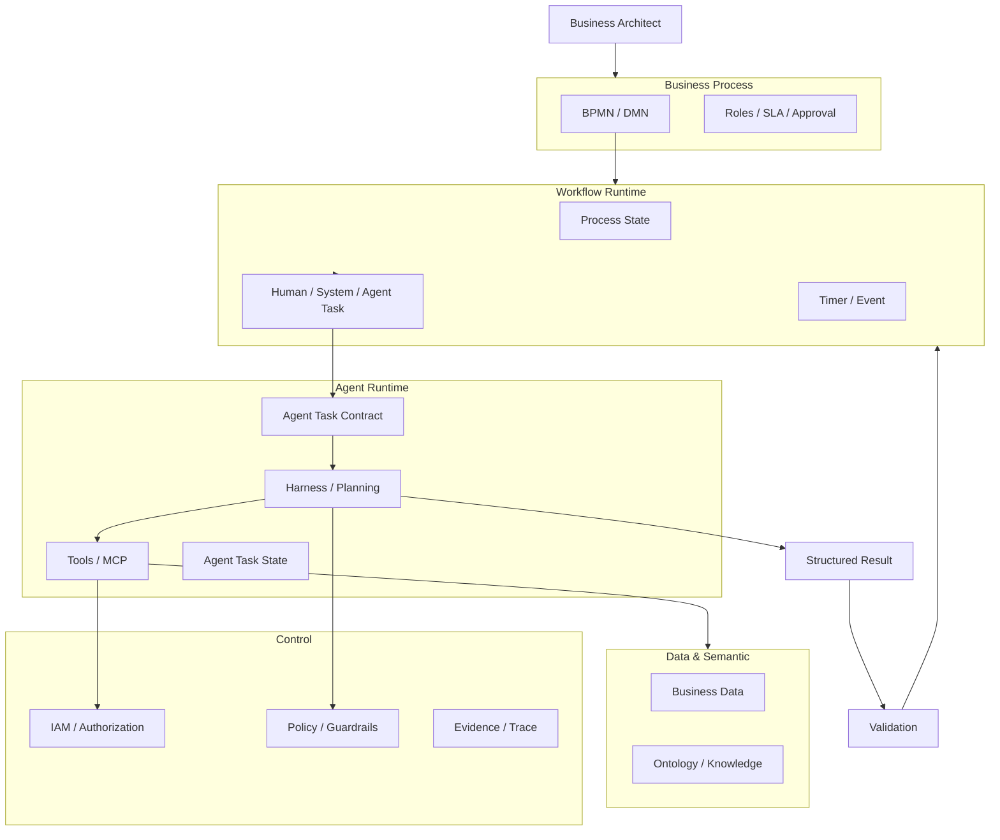

这张图里关键的关系是 Workflow Runtime 创建并控制 Agent Task，Agent Runtime 负责完成这个 Task，也就是第 33 节说的 Agent-in-Process。同样关键的是右下角那条回路：Agent 的输出必须先过 Validation 与 Authorization，再经过必要的人工批准，最后由 Workflow Runtime 落成状态转移。Agent 在这个回路里始终是提议方，不是决定方。

### 五层各自回答什么

| 层                        | 回答的问题                     | 失败时的典型表现                     |
| ------------------------- | ------------------------------ | ------------------------------------ |
| 1. Business Process Plane | 流程应该怎么走                 | 流程只存在于文档和人的记忆里         |
| 2. Workflow Runtime       | 这个 case 现在在哪一步         | 状态散落在业务表里，没有人能统一回答 |
| 3. Agent Execution Plane  | 这一步怎么完成                 | 每个团队各造一套 harness             |
| 4. Data & Semantic Plane  | Agent 看到的是哪一个版本的事实 | 同一个指标三个数，结论无法复核       |
| 5. Control Plane          | 谁被允许做什么                 | “Agent 有权限”成了唯一的安全声明     |

### 为什么是五层，而不是四层

常见的一个版本把 `IAM / Policy / Audit / Evidence / Data` 全部放进同一个 Enterprise Control Plane，这会在两个地方出问题。第一，Data 不是控制：

| 平面                  | 回答                 |
| --------------------- | -------------------- |
| Data / Semantic Plane | 回答：世界是什么样   |
| Control Plane         | 回答：谁被允许做什么 |

两者放在一起，会导致“数据权限”和“数据语义”被混为一谈：访问控制做到位了，但 Agent 依然不知道 `Position` 和 `Portfolio` 是什么关系，前者是安全问题，后者是能不能正确工作的问题。第二，Evidence 也不是控制。Evidence 是某一次具体执行产生的产物，它天然属于执行侧，只是在最后被 Audit 引用，把 Evidence 放进 Control Plane，会让它看起来像一个统一存储，而不是每一次 Task 都必须产出的东西。它应该在另一个三层关系里被定位：Audit 记录主体，Evidence 记录依据，Trace 记录过程——也就是第 31 节要展开的内容。所以最终是五层：Process / Runtime / Agent Execution / Data & Semantic / Control。

## 26. 展开图：数据与治理怎么接进来

这是第 25 节那张主线架构在数据与治理侧的展开。

## 27. 每一层解决的问题与最适合的技术

| 层               | 解决的问题       | 最适合技术                           |
| ---------------- | ---------------- | ------------------------------------ |
| Business Process | 流程应该怎么走   | BPMN                                 |
| Business Rules   | 什么条件成立     | DMN / Rule Engine                    |
| Workflow Runtime | 如何可靠执行     | Camunda / Temporal / Durable Runtime |
| Agent Runtime    | 如何智能完成任务 | Agents SDK / LangGraph / DeepAgents  |
| Policy           | 谁可以做什么     | IAM / Policy Engine                  |
| Human Approval   | 什么风险由人承担 | Human Task / Approval Matrix         |
| Data             | 企业事实是什么   | Snowflake / DB / Ontology            |
| Audit            | 发生了什么       | Activity Log / Trace / Evidence      |

这样也不会再问“是不是 Agent 出现以后，BPMN 就过时了”，BPMN 并没有过时，变化的是职责划分。

## 28. 责任矩阵

第 25 节回答了“分几层”，第 27 节回答了“每层适合什么技术”，这一节回答最后一个问题：每一件事由谁负责。落到具体条目上，会得到一张可以直接进评审会的表：

| 问题                   | 谁负责                   |
| ---------------------- | ------------------------ |
| 流程走哪               | BPMN                     |
| 业务条件是什么         | DMN / Rules              |
| 当前业务状态是什么     | Workflow Runtime         |
| 谁负责这个 Task        | Workflow / IAM           |
| Agent 能看到什么       | Context / Data Policy    |
| Agent 能用什么         | Tool / Capability Policy |
| Agent 如何完成任务     | Agent Runtime            |
| Agent 得到了什么       | Structured Result        |
| 是否符合业务规则       | Validation / DMN         |
| Agent 能不能执行       | Authorization / Policy   |
| 是否必须人工批准       | BPMN + Policy            |
| 业务状态能否改变       | Workflow Runtime         |
| 为什么这么做           | Evidence                 |
| 谁什么时候做了什么     | Audit                    |
| Agent 如何做的         | Agent Trace              |
| 模型是否可靠           | Evaluation               |
| 当时的业务事实是哪一版 | Business Data Contract   |

这张表把“Agent 到底能不能自主”这类争论，拆成了十几个可以逐条达成一致的问句，例如讨论“要不要让 Agent 自动审批”，真正需要确认的只是其中第 4、10、11 行，而不是重新设计一遍流程。

## 29. 五件容易混在一起的事

“确定性”不等于“只有一张流程图”。在金融场景里，有五类判断，各自必须落在不同机制上。把它们合并成一句“业务规则和权限合同”，是架构评审里最常见的返工来源。

这里有一个必须先纠正的说法：Business Rule 和 Authorization Policy 不是同一类 policy。“投资金额超过 1 亿就需要高级审批”是业务规则，“这个角色有没有投资审批权”是授权。前者判断“条件是否成立”，后者判断“主体有没有资格”。两者都常被写成 policy 配置文件，但变更流程、评审人与举证对象完全不同——业务规则由业务方改，授权由安全与内控改。把两者放进同一套配置里管理，是金融场景里最容易埋下隐患的一种简化。

### BPMN：流程怎么走

- 哪里需要审批
- 什么条件下回到上一步
- 哪一步可以并行
- 什么时候结束

它回答的是**状态转移**。

### DMN / Business Rules：业务条件怎么判断

investmentAmount大于100M → seniorApprovalRequired

它回答的是**条件是否成立**，而且这个判断是可枚举、可回归测试的。

### Authorization / IAM：谁有权执行

- PM_ROLE
- Investment_Approval
- Portfolio_X

它回答的是**主体资格**。同一条流程，不同角色能按的按钮不一样，这是权限问题，不是规则问题。

### Agent Policy / Guardrails：Agent 可以调用什么

- canRead: market_data, research_db
- canWrite: draft_report
- forbidden: customer_pii_export
- maxBudget: { tokens: 100000, toolCalls: 50 }

它回答的是**这个 Agent 的能力边界**，与“这个人有没有资格批准”是两件事。

### Human Approval：什么风险必须由人承担

- riskLevel GE HIGH → humanApprovalRequired
- agentConfidence LT threshold → humanApprovalRequired
- amount GT limit → humanApprovalRequired

它回答的是**责任归属**，前四类都是机制性的判断，只有这一类是把责任落到具体的人身上。金融机构做 Agent 立项时，真正需要业务方逐条签字确认的往往就是这张表，而不是流程图本身。

五者关系：

五条线汇入同一个执行前的判定（BPMN 讲流程怎么走、DMN 讲条件是否成立、Authorization 讲谁有权、Agent Policy 讲 Agent 能用什么、Human Approval 讲什么风险由人承担），再到执行 / 拒绝 / 转人工。

金融场景里这五条不能合并，原因是审计时它们的举证对象不同：

- BPMN 举的是流程版本；
- DMN 举的是规则版本与输入；
- IAM 举的是主体与授权记录；
- Agent Policy 举的是能力声明与实际调用日志；
- Human Approval 举的是审批人身份与审批当时的判断依据。

混在一起，事故复盘时就无法归因——你只能证明“当时有这个流程”，但不能证明“当时这个动作是被允许的”，更不能证明“当时是谁承担的”。

### 边界：哪些判断必须留给规则

这条边界应该画得很严，例如：

### 适合 BPMN/DMN

- Investment amount > 100M → Senior PM approval
- High-risk country → Compliance mandatory
- Product type = Derivative → Risk review mandatory

这些全部是确定性的。

### 适合 Agent

- 这个公司披露的信息有没有前后矛盾？
- 这份研究报告是否遗漏了重要风险？
- 这个交易是否存在异常模式？
- 这份申请材料是否足以支持该结论？
- 相关政策中是否存在需要特别注意的条款？

这些很难纯规则化。

因此可以这样划分：

- Deterministic → BPMN / DMN
- Semantic / Investigative → Agent

这是比较实用的边界。

### 三层决策架构

三层形成闭环：Layer 1（Deterministic Business Flow）→ Layer 2（Deterministic Business Rules）→ Layer 3（Probabilistic Agent Reasoning）→ Validation / Policy Gate → 回到 Layer 1。

### Layer 1：BPMN

回答流程走哪里。

### Layer 2：DMN / Policy

回答什么情况下允许。

### Layer 3：Agent

回答如何分析这个复杂问题。

再回到：Policy / BPMN
形成闭环。

### BPMN 反而会变得更简单

传统 BPMN 经常被迫表达大量业务逻辑。Agent 出现以后，反而可以把：“需要智能判断”
封装成：Agent Task
比如：Compliance → 13个 Gateway → 37个条件 → 8个子流程。
现在：Compliance → Agent Review → Human Decision。
但不能把所有东西扔给 Agent，DMN 继续负责明确业务规则。因此更合理的分工如下：

- **BPMN**：Flow、Role、State、Approval、Task
- **DMN**：Eligibility、Threshold、Risk classification、Approval matrix
- **Agent**：Investigation、Interpretation、Evidence discovery、Recommendation

三者职责很清楚。

## 30. Workflow 形态的正交分类

前面有一版分类把 Workflow 分成四种：Deterministic、Agentic、Policy、Human，这个分类不建议保留，原因不是它错，而是这四项不在同一个分类维度上：Deterministic / Agentic 描述的是执行方式，Policy 描述的是控制方式，Human 描述的是参与者。它们并不互斥，同一条流程里同时出现 Agent Task、Policy Gate 和 Human Approval 是常态：BPMN Workflow → Agent Task → Policy Gate → Human Approval。
于是同一条流程按旧分类会同时属于四类，分类就失去了判别力，更严谨的做法是拆成三个正交维度：

| Dimension | Values                                            |
| --------- | ------------------------------------------------- |
| Execution | Deterministic / Bounded Agentic / Dynamic Agentic |
| Task      | Human / System / Agent / Hybrid                   |
| Control   | Rule / Policy / Human Approval                    |

其中 Execution 指谁决定下一步（Deterministic 由 Process Definition 定，如 Settlement；Bounded Agentic 由 Agent 在预先定义的边界内定，如 Compliance Review；Dynamic Agentic 连下一步都由 Agent 定，如“调查这家公司是否值得投资”）；Task 指谁执行（金融场景最常见的是 Hybrid：Agent 准备决策包，Human 批准）；Control 指凭什么放行（Rule / Policy / Human Approval，对应 Agent wants to act → Authorization → Risk classification → Approval → Execute / Reject）。

以本文后面那个投资 Idea 流程为例：

```text
Investment Idea Review
= Deterministic（主流程）+ Bounded Agentic（各 Review Task）
+ Hybrid
+ Rule + Policy + Human approval
```

这个描述可以直接进设计文档，而“四种形态”不能——因为它无法回答“这条流程属于哪一类”。

## 31. Audit、Evidence、Agent Trace 是三件不同的事

这三个词在讨论里经常被并列甚至混用，但它们回答的是三个不同的问题，取证方式和保留策略也不同：

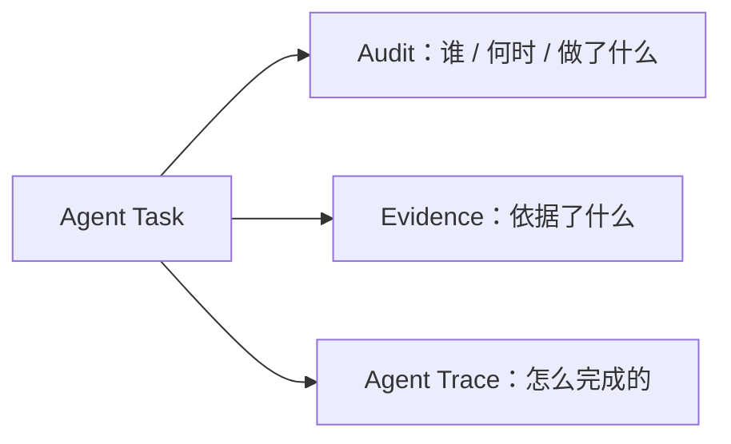

| 类型     | 回答什么问题       | 特征                                       |
| -------- | ------------------ | ------------------------------------------ |
| Audit    | 谁、何时、做了什么 | 主体是人和流程，与模型无关，保留期由监管定 |
| Evidence | 依据了什么         | 主体是业务事实来源，决定结论能否被复核     |
| Trace    | Agent 怎么完成     | 主体是执行过程，用于评估调试，保留期较短   |

一个实际后果是只保留 Audit，复盘会变成“流程没错，但结论不对”；只保留 Trace，则无法回答“当时是谁批准的”。两者都要，并且必须通过同一个 Task ID 串起来，这也是 Task Contract 里 `audit.traceLevel` 这个字段存在的意义。

## 32. Agent Runtime 与 Business Workflow Runtime 是不同的 Orchestration 层

“Agent Runtime 不是 Workflow Engine”这个说法需要修正：Microsoft Agent Framework 本身就具有 Workflow Runtime，LangGraph 也有 durable execution、checkpoint / resume 等能力。更准确的是：Agent Runtime 可以实现 Agent Workflow，但不等于 Business Workflow Runtime。架构是：BPMN Engine 之下挂 Human Task、System Task 与 Agent Task，Agent Task 之后进 Agent Runtime（Tools / Context / Memory）。

### BPMN Engine

负责 execution、state、task、routing、timers、events、retries、SLA 和 human workflow。

### Agent Runtime

负责 reasoning、tool use、context、memory、planning 和 evidence gathering。

两者边界很干净。

### 三种编排模式

- Model A（纯 Business Workflow）：BPMN → Workflow Runtime → Tasks。
- Model B（纯 Agent Workflow）：Agent Goal → Agent Workflow → Tools / Human / Subagents。
- Model C（Nested）：BPMN → Agent Task → Agent Workflow → Structured Result → BPMN。

金融不是默认选择 C，而是根据业务责任判断 A / B / C：金融主流程默认从 A 开始，复杂认知任务可以使用 B，当 A 和 B 同时存在时使用 C。

| 判断问题            | Business Workflow  | Agent Workflow       | Nested              |
| ------------------- | ------------------ | -------------------- | ------------------- |
| 谁定义下一步        | Process Definition | Agent                | 外层 + 内层分别定义 |
| Business State      | 核心               | 非核心               | 外层                |
| Agent Working State | 非核心             | 核心                 | 内层                |
| 业务角色 / SLA      | 核心               | 通常外置             | 外层                |
| 动态规划            | 弱                 | 核心                 | 内层                |
| Multi-Agent         | 辅助               | 核心                 | 内层                |
| 流程版本治理        | 核心               | Code / Graph version | 两层分别版本        |
| 合规责任            | 强                 | 需要额外构建         | 外层                |
| 业务人员可读性      | 强                 | 弱                   | 外层强              |
| 模型更换对流程影响  | 小                 | 大                   | 外层隔离            |
| 适合金融主流程      | 高                 | 通常不作为主流程     | **最高**            |
| 适合复杂认知任务    | 中                 | 高                   | **最高**            |

## 33. “Agent-in-Process”而非“Process-in-Agent”

这两个名字很形象。不推荐 Process-in-Agent，即让 Agent 决定整个 Business Process，风险很大。推荐 Agent-in-Process，即 Business Process 之下是 Agent Task，Agent Task 之后才是 Agent，符合金融机构对 predictable、controllable、explainable 和 auditable 的要求。

### 不推荐

Process-in-Agent，风险很大。

### 推荐

Agent-in-Process，符合金融机构对 predictable、controllable、explainable 和 auditable 的要求。

### 双向调用：Agent 也可以调用受治理的 Workflow

上面讲的是 Workflow 调用 Agent——这是金融主流程的方向。但 2026 年的产品已经出现了反方向：Agent 调用受治理的 Workflow。Camunda 8.10 的 Processes MCP Server 会把已部署的流程自动注册成 MCP tool，Agent 可以直接发现并调用（传参进去，新起一个 process instance，拿回 instance key），不需要在 Agent 框架与流程引擎之间另写集成层。([Camunda 8 Docs][45])

Business Workflow → Agent Task → Agent Runtime → 受治理的 Sub-workflow → Workflow Runtime

所以未来更准确的模型不是单向嵌套，而是双向调用：Workflow 把 Agent 当一等步骤（如 AWS Step Functions + AgentCore ([Amazon Web Services, Inc.][43])），Agent 把受治理的 Sub-workflow 当 Tool。但对金融主流程而言，方向仍以 Workflow 调用 Agent 为主——反方向只允许发生在有明确契约与审批的受治理子流程上。

## 34. 这套架构的名字，以及它为什么更容易治理

这套架构可以叫 Deterministic Core, Agentic Edge，在企业内部更贴切的说法是 Deterministic Business Process + Bounded Agent Execution。核心原则是 Deterministic Core 经 Agent Task 到 Agentic Edge，再经 Structured Result 到 Deterministic Validation。

这是比较适合金融服务的“新时代 Workflow”。

### 为什么它比“Agent Workflow”更容易治理

因为审计团队可以问：

### “这个业务流程是什么？”

→ BPMN

### “为什么这个 case 进入 Compliance？”

→ BPMN + DMN

### “为什么 Agent 推荐这个结论？”

→ Agent Trace + Evidence

### “Agent 为什么能调用这个 API？”

→ IAM + Policy

### “为什么最终允许这个动作？”

→ Workflow transition + Policy

### “谁最终批准？”

→ Human Task + Identity

整个责任链到这里是完整的。

# 第五部分：Agent Task Contract

## 35. BPMN 不应该描述 Agent 的内部过程

例如 Compliance Review，不要继续画成 Search Policy → Search Documents → Search Historical Cases → LLM Review → LLM Critic → Search Again → Summarize——这就走偏了。BPMN 只写 Compliance Review → Agent-assisted Review → Human Decision，Agent 内部 search → retrieve → reason → compare → identify gap → retrieve again → produce evidence → draft recommendation，这些属于 Agent Runtime，这是 **Workflow** 和 **Agent** 最重要的边界。

## 36. Agent Task Contract

**Agent Task Contract** 是本文的核心抽象。前面所有关于边界的讨论——流程归谁、状态归谁、权限归谁——最终都收敛到这个契约上。它很少直接给人看，主要作用是作为 BPMN 侧与 Agent 侧之间唯一需要对齐的接口。

两者的对应关系不是 Agent = Workflow，而是 BPMN Activity 落成 Agent Activity（完整链路见本节末 Validation Contract）。例如：

```yaml
activity:
  id: compliance-review
  type: agent-task

  input:
    - investment_case
    - supporting_documents
    - compliance_policy

  output:
    - findings
    - evidence
    - recommendation
    - missing_information

  allowedTools:
    - policy.search
    - document.search
    - risk.lookup

  approval:
    required: true
```

这个 Activity 对 BPMN Runtime 来说仍然是一个普通 Task，只不过内部用了 Agent。

### 一份完整的 Agent Task Contract

把上一节那个 YAML 展开，一份可用的 Agent Task Contract 至少需要十一项：

```yaml
agentTask:
  id: compliance-review
  workflow: investment-idea-review
  version: v3

  input:
    schema: InvestmentCase.v3
  output:
    schema: ComplianceFinding.v2

  capabilities:
    - policy.search
    - document.search
    - risk.lookup

  dataAccess:
    - investment.case
    - approved.documents
    - snapshot: ctx-20260912-1001

  instruction: compliance-review-policy v4.2

  execution:
    maxDuration: 15m
    maxToolCalls: 30
    maxTokens: 120000

  retry:
    maxAttempts: 2
    onFailure: escalate

  control:
    autoExecute: false
    humanApproval: required

  evidence:
    required: true
    citationRequired: true

  escalation:
    onLowConfidence: human
    onInsufficientEvidence: request_changes

  evaluation:
    criteria: compliance-finding-accuracy
    minConfidence: 0.8

  audit:
    traceLevel: full
```

逐项说明，以及缺了会怎样：

| 字段                  | 作用                         | 缺了会怎样                     |
| --------------------- | ---------------------------- | ------------------------------ |
| id / version          | Task 身份与契约版本          | 流程升级后无法对应审计链       |
| input / output schema | 定义 Task 的输入输出类型     | 输出变成自由文本，无法进入流程 |
| capabilities          | 允许调用的工具集合           | Agent 可以调用未授权的能力     |
| dataAccess            | 允许读取的数据范围与快照     | Agent 看到不确定版本的事实     |
| instruction           | 该 Task 使用的策略版本       | 无法解释某次决策依据了哪版规则 |
| execution budget      | 时长、工具调用数、token 上限 | 成本与时长失控                 |
| retry / escalation    | 失败与低置信度时的去向       | 失败被静默吞掉，或无限重试     |
| control               | 是否需要人工批准             | 高风险动作被自动执行           |
| evidence              | 是否必须给出证据与引用       | 结论无法复核                   |
| evaluation            | 用哪套标准衡量质量           | 质量只能凭感觉                 |
| audit                 | 轨迹粒度                     | 出事故后无法复盘               |

### 这份契约真正的价值

它把两个以前混在一起的问题分开了：

- BPMN 侧看到的是： 一个 Task，有 ID、有输入、有输出、有 SLA、有审批
- Agent 侧看到的是： 一份边界声明，允许它在这个范围内自由决定怎么做

于是两边可以独立演进：流程改了，只要契约不变，Agent 不用动；Agent 换了模型或框架，只要契约不变，流程不用动。这就是“受约束的智能”的实际含义：自由度留在合约内部，责任留在合约外部。未来 Workflow Engine 和 Agent Runtime 真正连接的不是 LLM API，而是这份 Task Contract。

### Validation Contract：提议如何变成状态变化

一份契约其实不够。Agent Task Contract 约束的是“怎么做”——输入输出、可用能力、数据范围、执行上限、审批模式、证据要求；而从提议到真正的业务状态变化，还需要第二份契约：Validation Contract。它只回答“能不能生效”：schema 校验、业务规则（DMN）、授权（IAM / Policy）、必要的人工批准。两份契约的分工，正好对应第 39 节那条管道的前后两半：

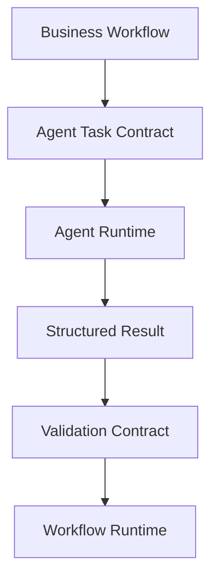

Task Contract 管住 Agent 的自由度，Validation Contract 管住状态变化的生效条件，Workflow Runtime 管住最终落子。三份责任分开，事故复盘时才能逐段归因：结论错了查 Task 与证据，规则错了查 DMN 版本，放行错了查审批记录。

## 37. Agent 的输出必须结构化

这是金融领域必须坚持的一条，具体做法如下。

输出不采用以下形式：Agent → 一段自然语言。
输出采用以下结构：

```json
{
  "decision": "REQUEST_CHANGES",
  "findings": [
    {
      "type": "MISSING_EVIDENCE",
      "description": "2025 cash flow forecast missing"
    }
  ],
  "evidence": [
    {
      "documentId": "doc-123",
      "page": 17
    }
  ],
  "confidence": 0.91
}
```

这里需要先说明一个细节：`confidence` 是模型自报的数值，不应被当作业务可信度或风险评分使用。一个自报 0.91 的结论可能建立在残缺的证据上，一个自报 0.60 的结论也可能恰好正确——两者之间没有校准关系。如果架构上确实需要“置信度”，它应当由独立的验证或评估机制产生（例如多次 trial 的一致性、证据充分性检查、历史准确率），或者至少明确标注为“模型自评”，不允许直接进入流程判断。

Workflow Runtime 只接受：validated structured output
然后 BPMN 决定：REQUEST_CHANGES → Research。
或者：APPROVE → Next Step。
因此，Agent 提议业务状态变化，Workflow Runtime 决定它是否真的发生。更精确的表述见第 38 节：Agent 输出的是业务建议或动作提议，共同决定它的是 Workflow Runtime、Business Rule、Authorization 和必要的 Human Task。

## 38. Analysis Task 与 Action Task

有一个容易含糊的地方需要区分清楚：Agent 的“输出”到底指什么。在本文的模型里，Agent Task 分两类，它们的输出性质完全不同。

### Agent Analysis Task

Agent 产出的是**判断材料**，其作用不含流程指令：

```json
{
  "recommendation": "REQUEST_CHANGES",
  "findings": [
    { "type": "MISSING_EVIDENCE", "description": "2025 现金流预测缺失" }
  ],
  "evidence": [{ "documentId": "doc-123", "page": 17 }],
  "confidence": 0.91
}
```

它不应该输出 **workflow transition**。

即使字段名叫 `recommendation`，它的语义也只是“建议把流程导向 Request Changes”。真正决定是否回到 Research 的，是 BPMN 的网关、DMN 的规则，或者一个 Human Task。

把这两件事分开有两个实际好处：

- Agent 的 prompt 里不再需要写“如果……就直接跳到第几步”，流程知识只存在一个地方；
- BPMN 不依赖模型输出的语义，模型升级不会悄悄改变流程走向。

### Agent Action Task

低风险场景下，Agent 可以提出一个**动作提议**：

```json
{
  "action": "CLASSIFY_DOCUMENT",
  "target": "doc-123",
  "value": "quarterly_report",
  "confidence": 0.96
}
```

这个动作经过 policy 判断后可以自动执行，“可以自动执行”这个授权由 Policy 配置给出。

### 更精确的表述

于是前面那句“Agent 提议状态变化，Workflow 决定是否真的发生状态变化”，应该修正为：

> Agent 输出业务建议或动作提议；Workflow Runtime、Business Rule、Authorization 和必要的 Human Task，共同决定这个提议是否能够产生业务状态变化。

这个表述多出来的部分（Business Rule、Authorization、Human Task），正是金融场景里最需要被明确归属的三个环节。少写一个，评审时就会被追问“那这里谁负责”。

## 39. Governed Action Pipeline

在金融 Agent workflow 里，任何 Agent 行为都可以统一看成一条 Controlled Action Pipeline——与 Agent 直调 API 的做法相比：

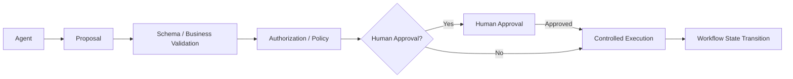

这种方式安全和可审计得多。换句话说，即使 Agent 返回了 `{"approved": true}`，业务状态也不会因此自动改变——它只是一个提议，能否生效取决于后面的 Validation、Authorization 与 Workflow Transition。

### 为什么叫“管道”，而不是“事务”

这条链路上面那张图就是完整形态。它的语义是**动作治理与授权**：关心的是“这个动作有没有资格发生”。它不是分布式事务协议，也不涉及多个参与者能否原子提交的问题——把它套进事务语义去讨论，会让评审直接跑偏到错误的抽象层次上，去追问一个并不存在的协调者。

还有一点要写清楚：这条管道只负责把一个提议送达到“执行或拒绝”这个结论，它本身不产生业务状态转移。最终的状态转移仍然由 Workflow Runtime 依据 BPMN 完成，这也是整套架构里职责划分最干净的一条边界。

## 40. “审批”怎么处理

例如 PM Approval：BPMN: → PM Approval。
内部可以：

- Agent prepares recommendation → Agent highlights:
- Agent highlights: → expected return
- Agent highlights: → downside
- Agent highlights: → risk
- Agent highlights: → missing evidence
- Agent highlights: → policy violations
- Agent highlights: → PM
- PM → Approve / Reject / Request Changes

PM 的按钮仍然是：

- Approve
- Reject
- Request Changes

Agent 不能替 PM 点击，这正是 AI assistance ≠ AI authority 所表达的意思。

## 41. “修改”也由 BPMN 明确控制

例如：

Risk Review 按 Approve 进 Compliance、Reject 结束、Request Changes 回 Research。

这在 BPMN 中完全合理。

然后：Research → 修改材料 → Submit → Risk Review。
这里 BPMN 描述的是确定性的状态转移规则；至于某个具体的 process instance 此刻处于什么状态，由 Workflow Runtime 持有。

不需要由 Agent 来决定“我觉得应该回到 Research”。

## 42. 什么时候允许 Agent 自己完成一个 Task

不用改 Workflow，只需要改变以下配置：Agent Authority Policy
比如：

```yaml
agentAuthority:
  riskReview:
    canRecommend: true
    canApprove: false

  documentClassification:
    canRecommend: true
    canApprove: true

  investmentApproval:
    canRecommend: true
    canApprove: false
```

这样一来，Workflow 定义与 Agent autonomy 解耦，这种解耦让架构更稳定。

### 一个简单的三级模型

可以建立一个很简单的三级模型：

### Level 0 — Human only

- Agent → assist
- Human → decision

### Level 1 — Agent recommendation

- Agent → prepare recommendation
- Human → approve

### Level 2 — Bounded automation

- Agent → execute
- Policy → validates
- System → commits

金融机构前期绝大多数应该是 Level 1，部分低风险、重复性的任务可以做到 Level 2，Level 0 则用于真正高风险决策。

# 第六部分：一个完整的金融案例

## 43. Investment Idea Review 全流程

比如一个投资 Idea 流程（Draft → Research → Risk Review → Compliance Review → PM Review → Approved），业务分析师完全可以用 BPMN 表达。各 Review 环节按 Approve 进入下一步、Reject 结束、Request Changes 打回 Research，细节见下节三段式。

这里不需要消灭 **BPMN**，因为这个东西本身就是业务知识资产。

它回答了：

- 谁负责？
- 谁批准？
- 哪一步必须发生？
- 什么情况退回？
- 什么情况结束？
- 哪几个环节并行？

这恰恰是金融业务最需要确定性的部分。把这条流程展开，看每一段 Task 里 Agent 具体做什么、Human 具体决定什么。

### Investment Idea Review

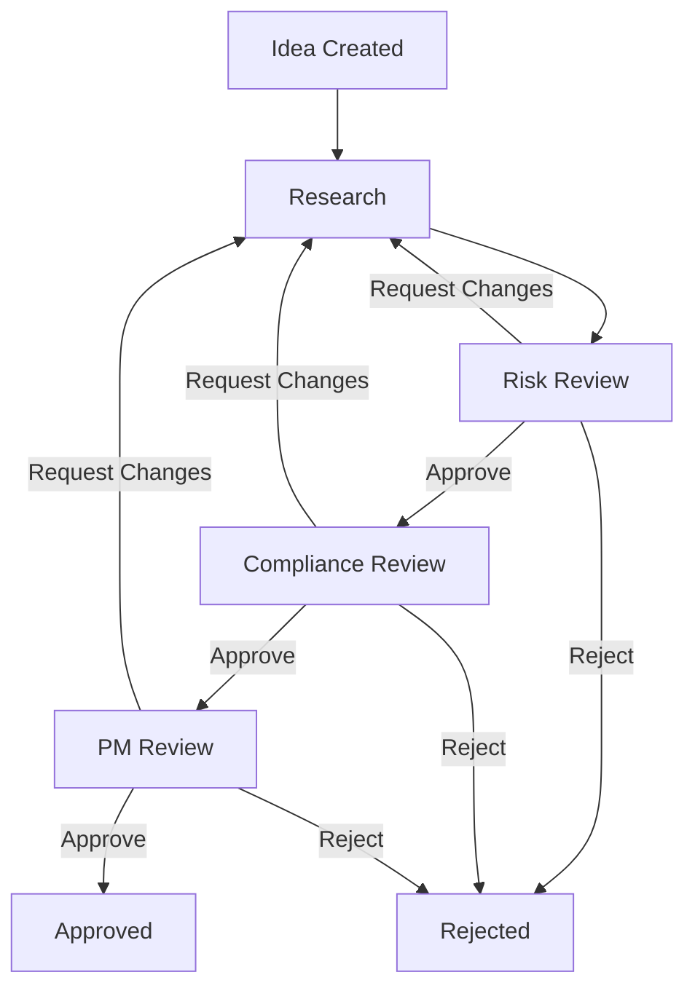

### Research Task

Agent：

- Search market data
- Search company filings
- Search internal research
- Generate summary
- Identify missing evidence
- Draft thesis

输出：Research Package
Human：

- Submit
- Request Changes

### Risk Task

Agent：

- Analyze financials
- Calculate risk metrics
- Compare peers
- Identify anomalies

输出：

- Risk Findings
- Risk Recommendation
- Evidence

Human：

- Approve
- Reject
- Request Changes

### Compliance Task

Agent：

- Retrieve policy
- Retrieve similar cases
- Check restrictions
- Identify missing documentation

Human：

- Approve
- Reject
- Request Changes

### PM Task

Agent：

- Summarize entire case
- Challenge thesis
- Highlight risk
- Compare alternatives

PM：

- Approve
- Reject
- Request Changes

这里 Agent 能力很强，但它从头到尾都没有以下行为：

- 改变 BPMN
- 跳过审批
- 修改状态
- 自己批准

除非明确授权。

## 44. 投资研究：哪一段应该固化，哪一段必须留给 Agent

例如：

### 投资研究

第一次：Agent → search → SEC → research → valuation → competitor → analyst review。
此时 Agent 很自由，跑了 5000 次以后发现：Company Financials → Peer Analysis → DCF → Risk Check → Report。
这套路径已经高度稳定，那么这部分就可以固化为以下流程：compile → deterministic research workflow。
而异常情况仍交给 Agent：

- new company
- unusual accounting
- missing data
- conflicting filings

需要强调的是，这里的“固化”并不意味着把 Agent 换成写死的代码，它的含义是把一个**已经被反复验证过的子过程**提升为确定性步骤：Company Financials → Peer Analysis → DCF → Risk Check → Report。
而异常情况仍然交给 Agent：

- new company
- unusual accounting
- missing data
- conflicting filings

这里的分工标准是任务性质：

> 大部分可规则化的流程保持确定性；只有真正需要语义理解、调查、推理或动态工具选择的任务引入 Agent。

判断某个子过程是否到了可以固化的程度，判据是它是否稳定到“两个不同的人按同样的步骤会得出同一结论”。达不到这个标准的，继续留在 Agent 侧。

# 第七部分：每一层放谁

## 45. Workflow Engine 的裂解

过去，一个系统全部负责：Workflow Engine
未来更像：

- **Agent Platform**：Agent Loop、Durable Runtime、Policy Engine
- 三者都进 Tool Layer，再到 API / MCP / Human。

而这些能力以前往往被归到同一个“BPM / Workflow”标签下：

- Camunda / Fluxnova / ServiceNow → business process orchestration
- Temporal / Durable Task → durable execution

把它们归成同一类，是选型时最常见的起点错误。

## 46. 能力 → 代表产品

前一版材料把行业归纳为“5 派”，那个分法把不同层次的东西并列了。按能力维度重新列一遍，选型时更不容易搞错：

| 能力                           | 代表                                                        | 定位                                |
| ------------------------------ | ----------------------------------------------------------- | ----------------------------------- |
| Business Process Orchestration | Camunda / Fluxnova                                          | 确定性流程、责任、审批、SLA、审计   |
| Agent Workflow / Graph         | LangGraph / Microsoft Agent Framework / Google ADK          | Agent 侧的编排图、state、checkpoint |
| Durable Execution              | Temporal / Durable Task                                     | 长时间运行、失败恢复、可重放执行    |
| Managed Agent Runtime          | AWS AgentCore / OpenAI Agents API / Snowflake Cortex Agents | 托管 harness、sandbox、会话上下文   |
| Enterprise Data / Ontology     | Palantir / Snowflake                                        | 业务对象、语义层、动作模型          |

这张表要防的是三种常见误判。

**误判一**：把 Agent Workflow 和 Durable Execution 当成一类。

LangGraph 的 graph 与 Temporal 的 workflow 都在讲“编排”，但前者的产出是 Agent 的执行路径，后者的产出是可重放的执行历史。一个 Agent 图跑在 Temporal Activity 里是常见组合，但它们是两层，不是两个竞品。

**误判二**：把 Managed Agent Runtime 当成 Workflow Engine。

这是今年最容易出的错。托管运行时的“orchestration”指的是 **Agent 内部的任务编排**：决定先查什么、再调什么工具、什么时候停止。它不持有企业业务流程的状态，也不负责跨部门的审批与责任归属。

**误判三**：认为选了其中一层就等于有了整个架构。

这五层不是五个可选项，而是五个必须回答的问题。任何一层缺失，都会在落地时以事故的形式出现：

- 缺 Workflow Runtime → 审批与状态没有权威源
- 缺 Agent Runtime → 无法接入模型能力
- 缺 Durable Execution → 长任务在失败后无法恢复
- 缺 Managed Runtime → 每个团队自己造 harness 与沙箱
- 缺 Data / Semantic → Agent 看到的事实无法确定版本

反过来看选型问题会简单很多：不要问“谁替代谁”，要问“这一层谁来负责，以及层与层之间的契约是什么”。

再补一句：这张表是概念分层，不是产品分离。一个产品可以同时承担其中两层甚至三层——Microsoft 的 graph workflow 跑在 Durable Task 上，Temporal 的 durable Workflow 直接承载 Agent Loop，AWS 的 Step Functions 直接调用 AgentCore Harness。选型时真正要问的不是“买哪个产品替代另一个”，而是“这几份责任分别由谁承担”。

## 47. 换个选型维度：Control / Execution / Orchestration / Authority

不要再用“BPMN vs Agent”作为技术选型的第一维度。2026 年的产品已经证明，同一个厂商内部都同时提供确定性与动态两套东西，拿产品名当选型维度只会越比越乱。更实在的是四个决策维度：

| 维度          | 问什么             | 选项                          |
| ------------- | ------------------ | ----------------------------- |
| Control Model | 流程由谁决定       | Deterministic / Goal-directed |
| Execution     | 跑多久、断了怎么办 | Durable / Ephemeral           |
| Orchestration | 下一步怎么定       | Static / Dynamic              |
| Authority     | 谁承担责任         | Human / Rule / Agent / Hybrid |

按这个框架，前面几节的厂商各归其位：Camunda 是 Deterministic + Durable + Static/Dynamic + Human/Rule/Agent；Temporal 是 Code-defined + Durable + Static/Dynamic + Application-defined Authority；Microsoft Agent Framework 是 Graph + Durable Task + Agentic orchestration；AWS 是 Deterministic outer workflow + Agentic inner execution + Durable outer execution；OpenAI Agents API 是 Goal-directed + Long-running + Dynamic + Harness-controlled authority。

注意这与第 30 节的三个维度不重复：第 30 节是描述一条流程的三个正交维度（执行模型 / 任务模式 / 控制），这里是选型时的四个决策维度。两个表加第 46 节的能力表一起用：先用四个维度定方向，再用能力表定每一层谁来负责。

## 48. Camunda / Fluxnova 的合理位置

这一点与前面的结论有明显不同。如果企业的业务架构师已经大量使用 BPMN，并且企业已经具备：

- BPMN 技能
- 流程资产
- 流程治理
- 审计模型
- 人员职责
- 流程设计规范

那么不应该建议抛弃 Camunda 一类的 BPMN Runtime，反而应保留以下定位：

> 保留 BPMN 作为 Business Process Control Plane。

然后把 Agent Runtime 接进来。

也就是说，选型不做二选一的对比：Camunda vs Agent
实际是两者相加：

- Camunda
- Agent Runtime

## 49. Palantir Ontology 的定位

在业务流程确定的前提下，Ontology 不应该取代 BPMN，它更适合做以下事情：

- Business Objects
- Relationships
- Actions
- Semantic Context

例如：

- Investment
- Portfolio
- Security
- Issuer
- Risk
- ComplianceRule
- ResearchReport

然后 BPMN：什么时间做什么
Ontology：处理的业务对象是什么
Agent：如何理解和分析这些对象
所以三者形成：

- BPMN → Process
- Ontology → Business World
- Agent → Intelligence

这是一个很漂亮的组合。

## 50. 一个 AI 平台该怎么分层

更合理的做法是把架构重新分层，具体如下。以下做法不采用：Angular → Experience API → LangChain / DeepAgents → Camunda → Agent。
采用以下分层：

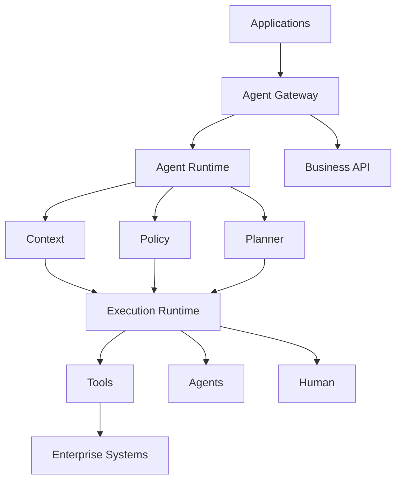

各部分的分工是：

- **Durable Execution**：`Temporal / Durable Task`
- **Managed Agent Runtime**：`AgentCore / OpenAI Agents API`
- **Agent orchestration**：`DeepAgents / LangGraph / Microsoft Agent Framework`
- **Observability + evaluation**：`OpenTelemetry / LangSmith / Foundry`
- **Business process**：`Camunda / Fluxnova`，只用在真正需要 BPMN 的企业流程上

# 第八部分：怎么落地

## 51. 不要重新造 Workflow Engine

如果企业已经有以下平台，优先复用：

- Camunda
- Flowable
- Temporal
- ServiceNow Workflow
- 自研流程平台

相比“又一个 Workflow Engine”，企业更缺的是以下几块：

- Agent Task Runtime
- Agent Governance
- Evidence
- Tool Gateway
- Agent Evaluation

比如现有 Camunda：

- **Camunda**：Human Task、System Task、Gateway、Timer、Agent Task；其中 Agent Task 进 Agent Platform。

这就已经足够现代。

## 52. 分阶段落地

### Phase 1：先把确定性 Workflow 做好

- BPMN
- DMN
- Human Task
- State
- Audit

先解决业务流程正确性问题。

### Phase 2：Agent-in-Task

先给以下领域逐个增加 Agent Assistant：

- Research
- Risk
- Compliance
- Operations

这类助手重点放在以下几类能力上：

- summarize
- search
- retrieve
- analyze
- draft
- recommend

### Phase 3：Bounded Agent Automation

对低风险 Task，走以下路径自动执行：Agent → Policy → Auto Execute。
例如以下几类：

- 文档分类
- 数据校验
- 信息补全
- 标准化检查

### Phase 4：动态 Agent Sub-process

只有在真正发现业务分析师根本没法把这一段流程事先定义清楚时，才引入以下形态：Agent-driven sub-workflow
而且这个动态部分仍然被一个明确的 BPMN Activity 包起来，执行路径如下：BPMN → Dynamic Agent Subprocess → Validated Result → BPMN。
这样既不会阻碍 AI，也不会破坏金融业务的确定性。

# 第九部分：长期演进

## 53. Agent 负责探索，Workflow 负责固化

前面讨论的都是当前应该怎么设计，这一部分讨论的是长期演进，需要先把它的性质说清楚：这一节的结论是架构推论，不是论文结论。区分这一点很必要，因为它决定了这部分内容应该放在核心架构还是演进方向，答案是后者。

微软研究院最近有一项研究：

### Optimizing Agentic Workflows using Meta-tools

它发现很多 Agent Workflow 会反复走以下路径：LLM → tool → LLM → tool → LLM → tool。
但这些 tool-call pattern 实际上稳定重复，因此可以做如下收敛：Agent Trace → 发现高频 tool sequence → 自动封装成 Meta-tool → Agent 一次调用。

这样 LLM calls 下降，latency 下降，failure 下降，success rate 上升：

- LLM calls ↓
- latency ↓
- failure ↓
- success rate ↑

实验中 LLM calls 最多减少 11.9%，task success 提升最多 4.2 percentage points。([Microsoft][38])

这指向未来 Workflow 的一个演进方向：Workflow 不一定由人设计，也可能从 Agent execution traces 中编译出来。

### 从 trace 到确定性流程

过去是：Human designs workflow
未来可能是：Agent runs → Execution traces → Pattern mining → Stable subgraph → Compile into deterministic tool/workflow。

收敛路径如下：Agent → exploration → discovery → stable pattern → deterministic execution。
最终系统变成：

> Agent负责探索，Workflow负责固化。

论文证明的是 **tool sequence** 可以被打包成 **meta-tool**，业务流程可以被自动固化则是本文的架构推论，强度低于前者。

## 54. 三种“状态”必须分开

Agent-first 领域里有一条主张需要在这里澄清边界：Dynamic Plan 必须持久化。这句话对长时间运行的 Agent 是成立的，一个跑几小时的 Research Task，确实需要一个可检查、可恢复的工作计划。但金融架构必须把三种完全不同的状态分开，它们的所有者、变更权限和生命周期都不一样，混成一个就会直接导致 Agent 接管流程。

| 状态                    | 含义                                               | 所有者                    | 能否被改写                           |
| ----------------------- | -------------------------------------------------- | ------------------------- | ------------------------------------ |
| Business Workflow State | 这个 case 在业务流程的哪一步                       | Workflow Runtime          | 只能按 BPMN 转移                     |
| Agent Task State        | 这个 Agent Task 在运行中、等工具、等人工还是已完成 | Agent Runtime（对外可见） | 受 Task Contract 与 Runtime 规则约束 |
| Agent Working Plan      | Agent 为了完成这个 Task 自己排的工作顺序           | Agent Runtime（内部）     | 可在 Task 内自由调整，甚至推倒重来   |

| Business Workflow State              | Agent Task State                  | Agent Working Plan                                                                                                         |
| ------------------------------------ | --------------------------------- | -------------------------------------------------------------------------------------------------------------------------- |
| BPMN:<br>Compliance Review = RUNNING | Agent:<br>RUNNING → WAITING_HUMAN | Agent:<br>1. Search policy = done<br>2. Search cases = done<br>3. Analyze evidence = running<br>4. Draft finding = pending |

三者是包含关系：一个 Business Workflow State 之下有一个 Agent Task State，一个 Agent Task State 之下有一个 Working Plan，层次不同，权威源也不同。

分清楚之后，两个经常被混淆的判断就很清楚了：

- **Business Workflow State** 只能由 Workflow Runtime 依据 BPMN 转移，任何第三方，包括 Agent，都不能直接改写；
- **Agent Working Plan** 由 Agent Runtime 自己维护，它是否持久化、持久化到什么粒度、保留多久，由 Agent Runtime 决定，它不进流程引擎，也不参与审批与责任归属。

因此，不要把 Agent 的 Working Plan 提升为企业业务流程的 source of truth。反过来，如果一个平台需要回答整体业务卡在哪一步，它应该去查 Workflow Runtime，而不是解析某个 Agent 的 plan。这两件事被混起来，是 Agent 接管流程这类方案在落地时最常见的失控方式。

## 55. 不会被模型迭代绑死

比如未来可能经历以下模型更替：Claude → GPT → Gemini → DeepSeek → Qwen。
BPMN 完全不用变。Agent Runtime 可以通过一层 model abstraction 来变化：Agent Runtime → model abstraction。
甚至 Runtime 选型本身也会换代：

- 2026: → LangGraph
- 2027: → Microsoft Agent Framework
- 2028: → internal runtime

业务流程仍然停留在：BPMN v7
金融企业在选型时通常会看重这一点。

## 56. 最终定义

> **BPMN 是企业业务流程的“可执行约束合同”——它约束流程怎么走，但不包含全部业务语义；DMN 是业务规则合同；Authorization / IAM 决定主体资格；Agent Policy 决定 Agent 的能力边界；Workflow Runtime 负责状态与生命周期；Agent 是完成复杂任务的智能执行者。**
>
> **任何 Agent 驱动的业务动作，在产生业务状态变化或外部副作用之前，都必须经过确定性的 schema / business validation 与 authorization；是否需要 Human Approval，由 BPMN 与 Policy 按风险等级决定。**

“可执行约束合同”这个限定不能丢。企业里用来描述业务的东西不止一件：Ontology 描述业务对象与关系，Business Data Model 描述数据的结构与版本，DMN 描述条件判断，Policy 描述许可，而 BPMN 只描述流程走向与责任。把 BPMN 当成包含全部业务逻辑的地方，是传统流程平台常见的过度承诺，它会把越来越多的判断塞进网关和条件分支，最后没有人敢改流程，也没有人说得清某条规则的来源。

换句话说，Workflow Engine 的长期价值不是流程图，而是对执行状态、等待、权限边界、事务副作用和恢复能力拥有执行权。流程图只是执行权的静态投影，Runtime 才是执行权本身。对金融而言，结论可以再收敛一句：金融不是拒绝 Dynamic Workflow，而是把 Dynamic Workflow 限制在 Deterministic Business Process 的边界之内。

执行路径形态即第 25 节主图的收束：Business Architect → BPMN / DMN → Workflow Runtime → Human / System / Agent Task → Agent Runtime → Structured Result → Policy / Validation → Human Approval / Auto Execute → BPMN State。

这套架构比彻底 Agent 化 Workflow 更适合金融，也比给 BPMN 加一个 LLM Node 更实用。它的处理方式不是推翻传统 Workflow，而是把边界划清楚：业务流程仍然确定，复杂任务开始智能化，业务状态仍然由确定性 Runtime 控制。这也是真正落地时应该坚持的主线。

### 最后再说一次核心命题

如果这篇文章只能留下一句话：

> **金融服务不应该在 BPMN 和 Agent 之间二选一。**
>
> BPMN/DMN 负责确定性的业务流程、业务规则和责任边界；Agent 负责流程内部那些难以规则化的认知任务；Workflow Runtime 负责业务状态和生命周期；Policy/IAM 负责 Agent 的权限；Agent 的输出必须以受约束的 Task Contract 返回，并经过确定性验证、以及按风险需要的人工批准，才能产生业务副作用。

这个判断与当前几个比较成熟的方向是一致的：

- Camunda 官方已经把 agentic orchestration 定义成 deterministic + dynamic 并存，AI agent 负责流程中非确定性的部分；
- AWS 的 Step Functions 可以直接调用 AgentCore Harness，把 Agent 当成 Workflow 中的一等步骤；([Amazon Web Services, Inc.][43])
- Camunda 8.10 把 Agent 建模为流程里的一等执行对象，并能把已部署流程经由 Processes MCP Server 暴露给 Agent 调用；([Camunda 8 Docs][44])([Camunda 8 Docs][45])
- Microsoft 的 Workflow 是 graph + executors + edges + state + runtime，同时提供 Durable Extension，而不是取消 workflow；
- Temporal 把 Agent Loop 放进 durable workflow，并把 nondeterministic I/O 全部收进 Activity；
- OpenAI 把 Agent Harness / Runtime 单独产品化，恰恰反证了 Agent Runtime 与 Business Workflow Runtime 必须分开；
- Palantir 把企业语义与动作层独立出来，Snowflake 把 data-native agent runtime 独立出来，指向的是同一件事。

它比“彻底 Agent 化 Workflow”更适合金融，也比“给 BPMN 加一个 LLM Node”更实用。

## 57. 延伸阅读

学术和架构方面，可以参考：

- Agent Workflow Survey ([arXiv][9])
- Architectural Implications of Agentic AI Workflows ([arXiv][10])
- Production-grade Agentic AI Workflows ([arXiv][39])
- Microsoft Agent Workflow Optimization / Meta-tools ([Microsoft][38])
- Agentic AI in Finance Survey ([arXiv][29])
- AI Agents in Financial Markets ([arXiv][30])
- Governing Agentic AI in FinTech ([arXiv][32])

厂商架构方面，可以参考：

- Anthropic Multi-Agent Research ([Anthropic][13])
- OpenAI Agents SDK / Responses API ([OpenAI][15])
- OpenAI Agents SDK 2026 Harness/Sandbox ([OpenAI][16])
- Microsoft Agent Framework Workflows ([Microsoft Learn][11])
- Microsoft Durable Agents ([Microsoft Learn][12])
- Google Agentic Enterprise ([Google Cloud][19])
- Snowflake Cortex Agents ([Snowflake Documentation][21])
- Palantir Ontology Architecture ([Palantir][25])
- Palantir Ontology MCP ([Palantir][27])
- Camunda Agentic Orchestration ([Camunda 8 Docs][41])
- OpenAI Agents API ([OpenAI][42])

金融服务方面，可以参考：

- Stripe production compliance agents ([Amazon Web Services, Inc.][35])
- AWS Financial Services AgentCore ([Amazon Web Services, Inc.][37])
- Snowflake Agentic AI in Financial Services ([Snowflake][23])
- Bank of England 2026 Financial Stability Report ([Bank of England][33])
- FSB AI governance practices ([Financial Stability Board][34])
- FINMA AI survey ([finma.ch][40])

其中 FSB 的 2026 AI governance consultation、BoE 的 Financial Stability Report、Palantir Ontology、Snowflake Cortex Agents、Microsoft Durable Agent Framework、Anthropic Harness 这几条线放在一起看，基本就能构成一套比较完整的 2026 金融 Agent 平台参考架构。

[1]: https://learn.microsoft.com/en-us/agent-framework/workflows/workflows "Microsoft Agent Framework Workflows - Workflow Builder & Execution | Microsoft Learn"
[2]: https://github.com/google/adk-docs/blob/main/docs/2.0/index.md "adk-docs/docs/2.0/index.md at main · google/adk-docs · GitHub"
[3]: https://github.com/langchain-ai/langgraph "GitHub - langchain-ai/langgraph: Build resilient agents. · GitHub"
[4]: https://go.temporal.io/platform-hub/ai-engineering/ai-reference-architecture "AI Agent Reference Architecture | Temporal Platform Hub"
[5]: https://github.com/finos/fluxnova-bpm-platform/releases "Releases · finos/fluxnova-bpm-platform · GitHub"
[6]: https://docs.camunda.io/docs/components/agentic-orchestration/ao-design/ "Design and architecture | Camunda 8 Docs"
[7]: https://link.springer.com/article/10.1365/s40702-026-01299-4 "Agentic Workflow Generation: Mit Agentic AI von der funktionalen Beschreibung zur ausführbaren Prozesslogik | HMD Praxis der Wirtschaftsinformatik | Springer Nature Link"
[8]: https://arxiv.org/abs/2608.03214 "The Agent Operating System (AOS): A Reference Operating Architecture for Distributed Agentic Systems"
[9]: https://arxiv.org/abs/2508.01186 "A Survey on Agent Workflow -- Status and Future"
[10]: https://arxiv.org/abs/2608.04458 "Architectural Implications of Agentic AI Workflows"
[11]: https://learn.microsoft.com/en-us/agent-framework/concepts/workflows/ "Workflow concepts | Microsoft Learn"
[12]: https://learn.microsoft.com/en-us/agent-framework/integrations/durable-extension "Durable Extension | Microsoft Learn"
[13]: https://www.anthropic.com/engineering/multi-agent-research-system "How we built our multi-agent research system \\ Anthropic"
[14]: https://www.anthropic.com/engineering "Engineering \\ Anthropic"
[15]: https://openai.com/index/new-tools-for-building-agents/ "New tools for building agents | OpenAI"
[16]: https://openai.com/index/the-next-evolution-of-the-agents-sdk/ "The next evolution of the Agents SDK | OpenAI"
[17]: https://openai.com/index/how-agents-are-transforming-work/ "How agents are transforming work | OpenAI"
[18]: https://openai.com/index/introducing-openai-presence/ "Introducing OpenAI Presence | OpenAI"
[19]: https://cloud.google.com/blog/products/ai-machine-learning/the-new-gemini-enterprise-one-platform-for-agent-development "The new Gemini Enterprise: one platform for agent development | Google Cloud Blog"
[20]: https://cloud.google.com/blog/products/ai-machine-learning/whats-new-in-gemini-enterprise "What’s new in Gemini Enterprise | Google Cloud Blog"
[21]: https://docs.snowflake.com/en/user-guide/snowflake-cortex/cortex-agents "Cortex Agents | Snowflake Documentation"
[22]: https://docs.snowflake.com/en/release-notes/2026/other/2026-08-28-cortex-analyst-transition-cortex-agents "Aug 28, 2026: Snowflake recommends transitioning from Cortex Analyst to Cortex Agents | Snowflake Documentation"
[23]: https://www.snowflake.com/en/blog/agentic-orchestration-financial-services/ "Agentic AI in Financial Services: The Ecosystem Agent Framework"
[24]: https://docs.snowflake.com/en/release-notes/2026/other/2026-06-30-analytical-search-public-preview "Jun 30, 2026: Analytical search (*Public Preview*) | Snowflake Documentation"
[25]: https://www.palantir.com/docs/foundry/architecture-center/ontology-system "The Ontology system • Palantir"
[26]: https://www.palantir.com/docs/foundry/ontology/why-ontology "Why create an Ontology? • Palantir"
[27]: https://www.palantir.com/docs/foundry/announcements/2026-06 "June 2026 • Announcements • Palantir"
[28]: https://www.palantir.com/docs/foundry/logic "AIP Logic • Overview • Palantir"
[29]: https://arxiv.org/abs/2604.21672 "Agentic Artificial Intelligence in Finance: A Comprehensive Survey"
[30]: https://arxiv.org/abs/2603.13942 "AI Agents in Financial Markets: Architecture, Applications, and Systemic Implications"
[31]: https://arxiv.org/abs/2502.05439 "Agentic AI Systems Applied to tasks in Financial Services: Modeling and model risk management crews"
[32]: https://arxiv.org/abs/2608.11344 "Governing Agentic AI in FinTech"
[33]: https://www.bankofengland.co.uk/financial-stability-report/2026/july-2026 "Financial Stability Report - July 2026 | Bank of England – the UK's central bank"
[34]: https://www.fsb.org/2026/06/sound-practices-for-responsible-adoption-of-artificial-intelligence-ai-consultation-report/ "Sound Practices for Responsible Adoption of Artificial Intelligence (AI): Consultation report - Financial Stability Board"
[35]: https://aws.amazon.com/blogs/machine-learning/production-grade-ai-agents-for-financial-compliance-lessons-from-stripe/ "Production-grade AI agents for financial compliance: Lessons from Stripe | Artificial Intelligence"
[36]: https://aws.amazon.com/blogs/industries/multi-agent-systems-for-financial-services-on-amazon-eks-and-agentcore/ "Multi-Agent Systems for Financial Services on Amazon EKS and AgentCore | AWS for Industries"
[37]: https://aws.amazon.com/blogs/industries/ai-credit-analytics-across-amazon-s3-and-snowflake-with-amazon-bedrock-agentcore/ "AI Credit Analytics Across Amazon S3 and Snowflake with Amazon Bedrock AgentCore | AWS for Industries"
[38]: https://www.microsoft.com/en-us/research/publication/optimizing-agentic-workflows-using-meta-tools/ "Optimizing Agentic Workflows using Meta-tools - Microsoft Research"
[39]: https://arxiv.org/abs/2512.08769 "A Practical Guide for Designing, Developing, and Deploying Production-Grade Agentic AI Workflows"
[40]: https://www.finma.ch/en/news/2025/04/20250424-mm-umfrage-ki/ "FINMA survey: artificial intelligence gaining traction at Swiss financial institutions | FINMA"
[41]: https://docs.camunda.io/docs/8.7/components/agentic-orchestration/ "Agentic orchestration | Camunda 8 Docs"
[42]: https://openai.com/index/introducing-the-agents-api/ "Introducing the Agents API | OpenAI"
[43]: https://aws.amazon.com/about-aws/whats-new/2026/06/aws-step-functions-agentcore/ "AWS Step Functions adds AgentCore-powered agentic reasoning step | AWS"
[44]: https://docs.camunda.io/docs/next/components/agentic-orchestration/agent-definitions-and-instances/ "Agent definitions and instances | Camunda 8 Docs"
[45]: https://docs.camunda.io/docs/next/components/agentic-orchestration/expose-process-as-mcp-tool "Expose a process as an MCP tool | Camunda 8 Docs"
[46]: https://devblogs.microsoft.com/dotnet/durable-workflows-in-microsoft-agent-framework/ "Durable Workflows in the Microsoft Agent Framework | Microsoft for Developers"
[47]: https://cloud.google.com/blog/products/ai-machine-learning/agent-executor-googles-distributed-agent-runtime "Agent Executor, Google's distributed Agent Runtime | Google Cloud Blog"
