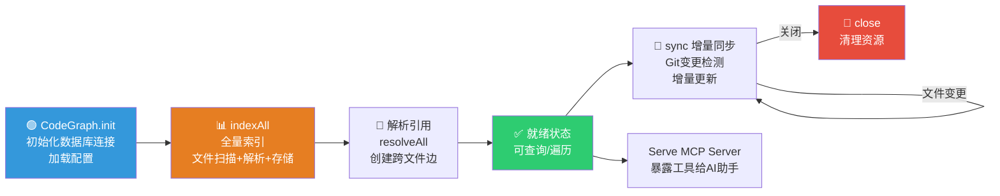
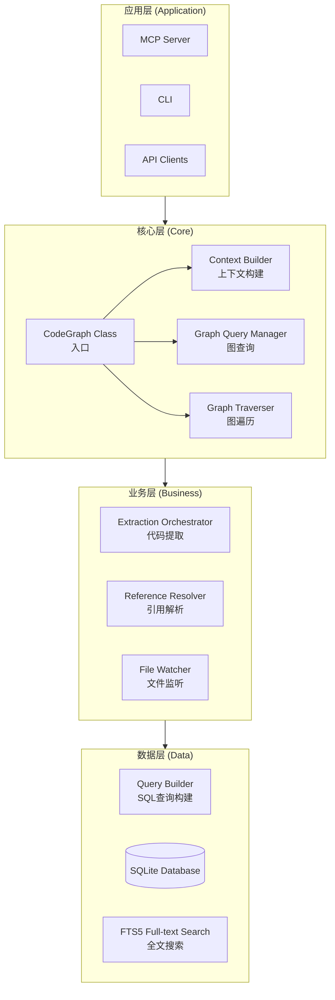
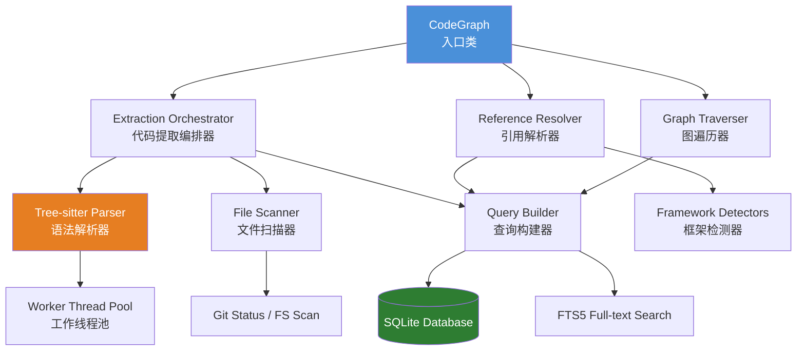
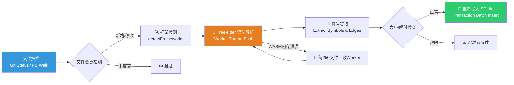
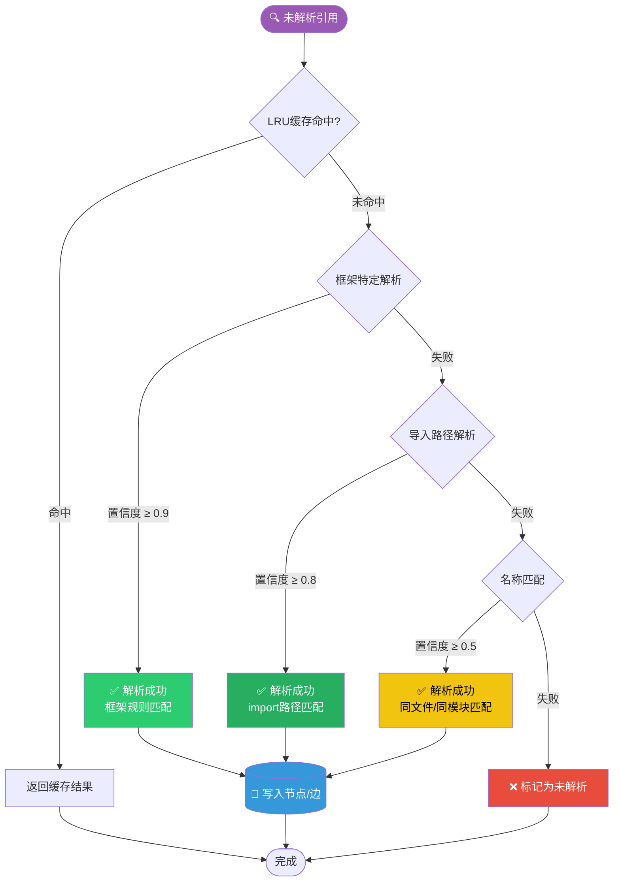
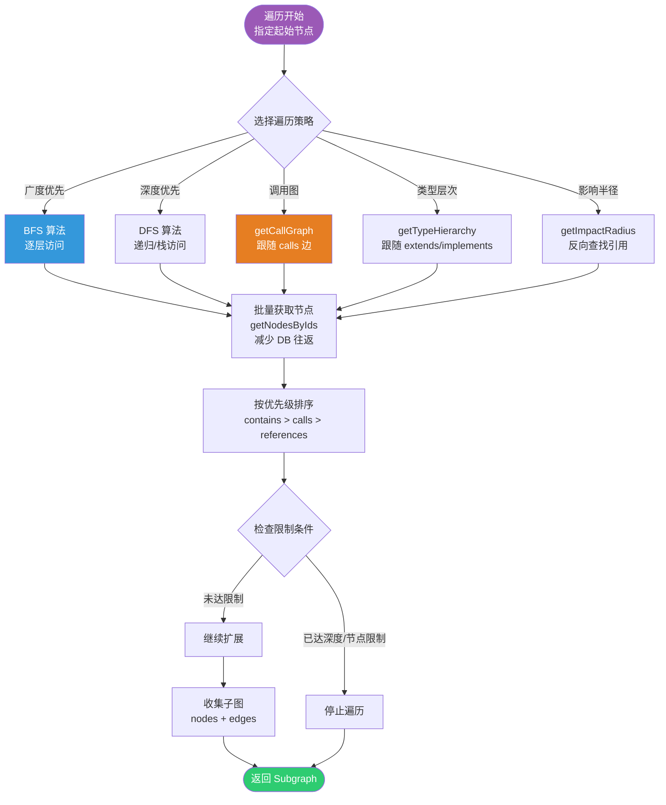
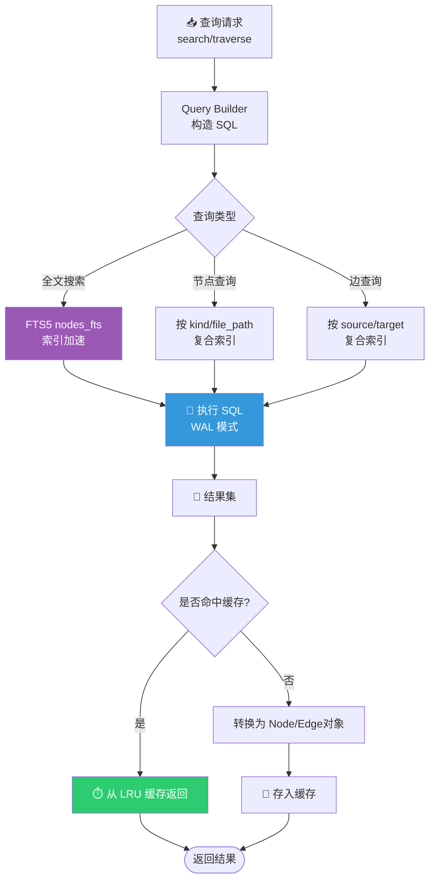
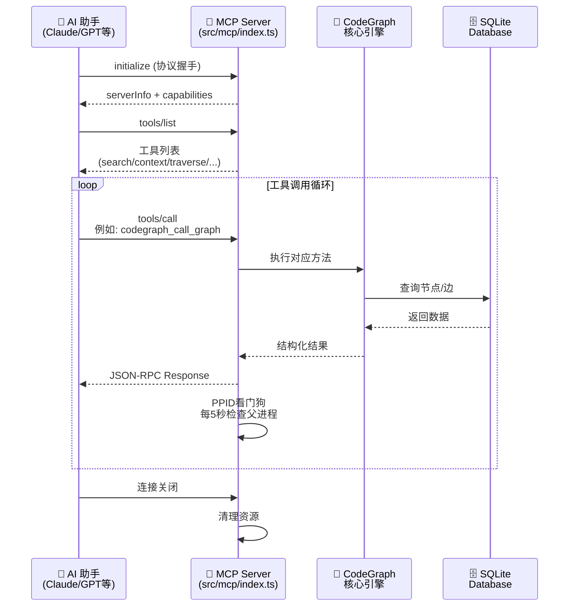
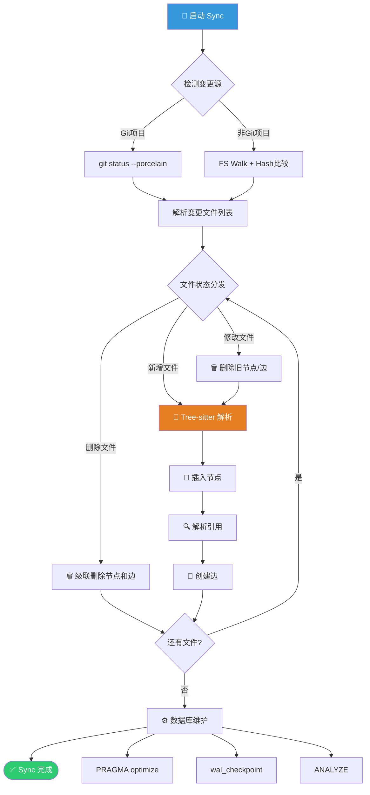
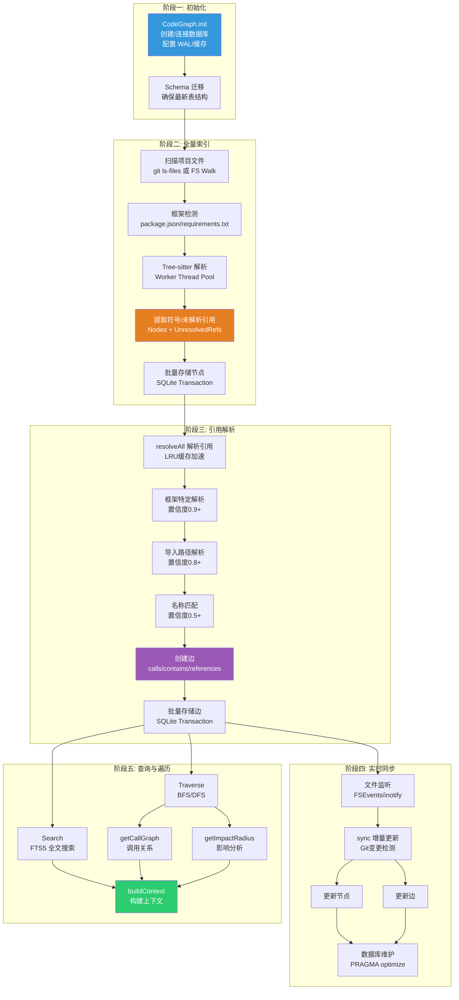

# CodeGraph 实现机制与架构研究文档

---

## 一、系统概述

**CodeGraph** 是一个本地优先的代码智能系统，通过构建语义知识图谱来理解代码库结构和依赖关系。

### 核心特性

| 特性 | 说明 |
|------|------|
| **跨语言支持** | 支持 25+ 种编程语言（TypeScript、Python、Go、Java、Rust等） |
| **本地运行** | 数据存储在本地 SQLite 数据库，保护代码隐私 |
| **增量更新** | 支持文件监听和增量同步，实时保持图谱最新 |
| **MCP集成** | 作为 MCP（Model Context Protocol）服务器为 AI 助手提供代码上下文 |

### 应用场景

- **AI 代码助手**：为 AI 提供代码理解能力
- **代码导航**：快速定位符号定义和引用
- **影响分析**：评估代码变更的影响范围
- **代码质量分析**：死代码检测、循环依赖检测

---

## 二、架构设计

### 2.1 系统生命周期



### 2.2 整体架构分层



### 2.3 核心组件关系



---

## 三、核心数据模型

### 3.1 节点类型（NodeKind）

| 类型 | 说明 | 示例 |
|------|------|------|
| `file` | 源文件 | `src/utils.ts` |
| `module` | 模块/包 | `@/api/users` |
| `class` | 类 | `UserService` |
| `interface` | 接口 | `IRepository` |
| `function` | 函数 | `calculateTotal()` |
| `method` | 方法 | `UserService.save()` |
| `property` | 属性 | `user.name` |
| `variable` | 变量 | `const config = {...}` |
| `component` | 组件 | `Button` |
| `route` | 路由 | `/api/users` |
| `enum` | 枚举 | `Status` |

### 3.2 边类型（EdgeKind）

| 类型 | 说明 | 方向 |
|------|------|------|
| `contains` | 包含关系 | file → class, class → method |
| `calls` | 调用关系 | function → function |
| `imports` | 导入关系 | file → file |
| `extends` | 继承关系 | class → class |
| `implements` | 实现关系 | class → interface |
| `references` | 引用关系 | variable → type |
| `type_of` | 类型关系 | variable → class |
| `instantiates` | 实例化 | function → class |

### 3.3 核心数据结构

```typescript
interface Node {
  id: string;                    // 唯一标识（文件路径+限定名的哈希）
  kind: NodeKind;                // 节点类型
  name: string;                  // 简单名称
  qualifiedName: string;         // 完全限定名
  filePath: string;              // 文件路径
  language: Language;            // 编程语言
  startLine/endLine: number;     // 位置信息
  docstring?: string;            // 文档字符串
  signature?: string;            // 函数签名
  visibility?: 'public' | 'private' | 'protected';
  isExported?: boolean;
  isAsync?: boolean;
  updatedAt: number;             // 更新时间戳
}

interface Edge {
  source: string;                // 源节点ID
  target: string;                // 目标节点ID
  kind: EdgeKind;                // 边类型
  line?: number;                 // 发生位置
  column?: number;
  metadata?: Record<string, unknown>;
}
```

---

## 四、核心模块详解

### 4.1 代码提取层（Extraction Layer）

**职责**：从源代码中提取符号（节点）和关系（边）

**核心流程**：



**关键技术点**：

| 技术 | 说明 |
|------|------|
| **Tree-sitter** | 多语言语法解析器，支持增量解析 |
| **Worker线程** | 解析在独立线程执行，避免阻塞主线程 |
| **WASM运行时** | 语法解析器编译为WASM，跨平台兼容 |
| **文件大小限制** | 最大1MB，避免WASM内存溢出 |
| **Worker回收** | 每解析250个文件回收一次，防止WASM内存泄漏 |

**核心代码位置**：`src/extraction/index.ts`

### 4.2 引用解析层（Resolution Layer）

**职责**：将未解析的引用与符号节点关联

**解析流程**：



**多策略解析**：

| 优先级 | 策略 | 置信度 | 适用场景 |
|--------|------|--------|----------|
| 1 | 框架特定 | 0.9+ | React Hooks、Express路由 |
| 2 | 导入路径 | 0.8+ | 显式import语句 |
| 3 | 名称匹配 | 0.5-0.8 | 局部变量、同文件引用 |

**LRU缓存机制**：

```typescript
const DEFAULT_CACHE_LIMIT = 5_000;

private nodeCache: LRUCache<string, Node[]>;        // 按文件缓存节点
private fileCache: LRUCache<string, string | null>; // 文件内容缓存
private importMappingCache: LRUCache<string, ImportMapping[]>;
private nameCache: LRUCache<string, Node[]>;        // 名称→节点缓存
```

**核心代码位置**：`src/resolution/index.ts`

### 4.3 图遍历引擎（Graph Traversal）

**核心算法流程**：



**核心算法**：

| 方法 | 功能 |
|------|------|
| `traverseBFS()` | 广度优先遍历 |
| `traverseDFS()` | 深度优先遍历 |
| `getCallGraph()` | 获取调用图 |
| `getTypeHierarchy()` | 获取类型层次 |
| `getImpactRadius()` | 计算影响半径 |
| `findPath()` | 查找最短路径 |

**优化策略**：

- **批量节点获取**：使用 `getNodesByIds()` 消除N+1查询
- **边优先级排序**：`contains` > `calls` > `references`
- **深度限制**：默认最大深度3
- **节点限制**：默认最多1000个节点

**核心代码位置**：`src/graph/traversal.ts`

### 4.4 数据库层（Database Layer）

**数据库查询流程**：



**SQLite Schema设计**：

```sql
CREATE TABLE nodes (
  id TEXT PRIMARY KEY,
  kind TEXT NOT NULL,
  name TEXT NOT NULL,
  qualified_name TEXT NOT NULL,
  file_path TEXT NOT NULL,
  language TEXT NOT NULL,
  start_line/end_line/start_column/end_column INTEGER,
  docstring TEXT,
  signature TEXT,
  ...
);

CREATE TABLE edges (
  id INTEGER PRIMARY KEY AUTOINCREMENT,
  source TEXT NOT NULL REFERENCES nodes(id),
  target TEXT NOT NULL REFERENCES nodes(id),
  kind TEXT NOT NULL,
  line INTEGER,
  col INTEGER,
);

CREATE TABLE files (
  path TEXT PRIMARY KEY,
  content_hash TEXT NOT NULL,
  language TEXT NOT NULL,
  size INTEGER,
  indexed_at INTEGER,
);
```

**FTS5全文搜索**：

```sql
CREATE VIRTUAL TABLE nodes_fts USING fts5(
  id, name, qualified_name, docstring, signature
);
```

**连接配置优化**：

```typescript
db.pragma('busy_timeout = 5000');  // 等待锁释放
db.pragma('journal_mode = WAL');   // WAL模式，读写并发
db.pragma('synchronous = NORMAL'); // 安全级别
db.pragma('cache_size = -64000');  // 64MB页面缓存
db.pragma('temp_store = MEMORY');  // 临时表在内存
db.pragma('mmap_size = 268435456'); // 256MB内存映射
```

**核心代码位置**：`src/db/index.ts`, `src/db/queries.ts`, `src/db/schema.sql`

### 4.5 MCP服务器（Model Context Protocol）

**职责**：将CodeGraph功能暴露为AI助手可调用的工具

**MCP通信流程**：



**支持的工具**：

| 工具 | 说明 |
|------|------|
| `codegraph_search` | 搜索符号 |
| `codegraph_context` | 获取节点上下文 |
| `codegraph_traverse` | 图遍历 |
| `codegraph_call_graph` | 调用图分析 |
| `codegraph_type_hierarchy` | 类型层次 |
| `codegraph_impact_radius` | 影响范围分析 |

**PPID看门狗机制**：

```typescript
// 轮询检测父进程是否存活
setInterval(() => {
  const current = process.ppid;
  if (current !== this.originalPpid) {
    this.stop();
  }
}, 5000);
```

**核心代码位置**：`src/mcp/index.ts`

---

## 五、增量同步机制

### 5.1 文件变更检测

**Git快速路径**：

```typescript
function getGitChangedFiles(rootDir): GitChanges | null {
  const output = execFileSync('git', ['status', '--porcelain', '--no-renames']);
  // 解析状态码：??(新增)、D(删除)、M/MM/AM(修改)
}
```

**回退路径**：文件系统扫描 + 哈希比较

### 5.2 同步流程



### 5.3 文件监听

使用原生OS文件事件：
- **macOS**: FSEvents
- **Linux**: inotify
- **Windows**: ReadDirectoryChangesW

**核心代码位置**：`src/sync/watcher.ts`

---

## 六、性能优化策略

### 6.1 内存管理

| 策略 | 实现 |
|------|------|
| **Worker线程回收** | 每250个文件重启Worker |
| **LRU缓存** | 节点缓存上限5000 |
| **批量处理** | 批量读取文件、批量插入数据库 |
| **流式处理** | 避免一次性加载所有数据 |

### 6.2 数据库优化

| 技术 | 说明 |
|------|------|
| **WAL模式** | 读写并发，读者不阻塞写者 |
| **内存映射** | 256MB mmap |
| **页面缓存** | 64MB缓存 |
| **批量插入** | 使用事务批量写入 |
| **索引优化** | 复合索引覆盖常见查询模式 |

### 6.3 解析优化

| 优化 | 实现 |
|------|------|
| **文件大小限制** | 跳过>1MB的文件 |
| **超时保护** | 单个文件解析超时10秒 |
| **重试机制** | WASM内存错误时重试 |
| **注释剥离** | 重试失败时剥离注释 |

---

## 七、框架特定支持

### 7.1 支持的框架

| 语言 | 框架 |
|------|------|
| JavaScript/TypeScript | React、Express、NestJS、Svelte、Vue |
| Python | Django、Flask |
| PHP | Laravel、Drupal |
| Go | 标准库 |
| Java | Spring、Play |
| Rust | Cargo Workspace |

### 7.2 框架检测机制

**框架检测流程**：

```mermaid
graph TD
    START([开始框架检测]) --> A{检查 package.json}
    A -->|存在| B[读取 dependencies]
    B --> C{依赖检查}
    C -->|react| React[✅ React 解析器]
    C -->|express| Express[✅ Express 解析器]
    C -->|@nestjs| Nest[✅ NestJS 解析器]
    C -->|vue| Vue[✅ Vue 解析器]
    C -->|svelte| Svelte[✅ Svelte 解析器]

    React --> D{检查 requirements.txt}
    Express --> D
    Nest --> D
    Vue --> D
    Svelte --> D
    A -->|不存在| D

    D -->|存在| Python[✅ Python 框架解析器]
    D -->|不存在| E{检查 composer.json}

    E -->|存在| PHP[✅ Laravel/Drupal 解析器]
    E -->|不存在| F{检查 go.mod}

    F -->|存在| Go[✅ Go 解析器]
    F -->|不存在| G{检查 Cargo.toml}
    G -->|存在| Rust[✅ Rust 解析器]
    G -->|不存在| End([返回检测到的框架列表])

    React --> End
    Express --> End
    Nest --> End
    Vue --> End
    Svelte --> End
    Python --> End
    PHP --> End
    Go --> End
    Rust --> End

    style START fill:#9B59B6,color:#fff
    style React fill:#61DAFB,color:#000
    style Python fill:#3776AB,color:#fff
    style Go fill:#00ADD8,color:#fff
    style End fill:#2ECC71,color:#fff
```

```typescript
function detectFrameworks(context): FrameworkResolver[] {
  const frameworks = [];
  
  if (context.fileExists('package.json')) {
    const pkg = JSON.parse(context.readFile('package.json'));
    if (pkg.dependencies?.react) frameworks.push(reactResolver);
    if (pkg.dependencies?.express) frameworks.push(expressResolver);
  }
  
  if (context.fileExists('requirements.txt')) {
    frameworks.push(pythonResolver);
  }
  
  return frameworks;
}
```

**核心代码位置**：`src/resolution/frameworks/`

---

## 八、目录结构

```
src/
├── bin/                    # CLI命令
│   └── codegraph.ts
├── context/                # 上下文构建
│   ├── formatter.ts
│   └── index.ts
├── db/                     # 数据库层
│   ├── index.ts
│   ├── migrations.ts
│   ├── queries.ts
│   └── schema.sql
├── extraction/             # 代码提取
│   ├── languages/          # 各语言解析器
│   ├── tree-sitter.ts
│   ├── parse-worker.ts
│   └── index.ts
├── graph/                  # 图操作
│   ├── traversal.ts
│   └── queries.ts
├── mcp/                    # MCP服务器
│   ├── index.ts
│   ├── tools.ts
│   └── transport.ts
├── resolution/             # 引用解析
│   ├── frameworks/         # 框架特定解析器
│   ├── import-resolver.ts
│   ├── name-matcher.ts
│   └── index.ts
├── sync/                   # 增量同步
│   ├── watcher.ts
│   ├── watch-policy.ts
│   └── git-hooks.ts
├── types.ts                # 类型定义
└── index.ts                # 主入口
```

---

## 九、完整知识图谱构建流程



---

## 十、总结

CodeGraph是一个设计精良的代码知识图谱系统，其核心优势包括：

1. **架构清晰**：分层设计，职责明确
2. **性能优化**：多层面优化策略（内存、数据库、解析）
3. **跨语言支持**：25+种语言，基于Tree-sitter
4. **增量更新**：智能变更检测和增量同步
5. **AI集成**：MCP协议无缝对接AI助手

系统采用SQLite作为持久化存储，通过精心设计的索引和查询优化，在保证数据完整性的同时提供高效的查询性能。LRU缓存和批量处理机制确保了在大型代码库上的内存稳定性。

---

## 十一、文档版本历史

| 版本 | 日期 | 变更说明 |
|------|------|----------|
| v1.1 | 2026-05-25 | 添加 8+ Mermaid 流程图 |
| v1.0 | 2026-05-25 | 初始文档，核心架构分析 |

**文档版本**：v1.1  
**最后更新**：2026-05-25  
**项目位置**：/Users/saga/code-repos/codegraph