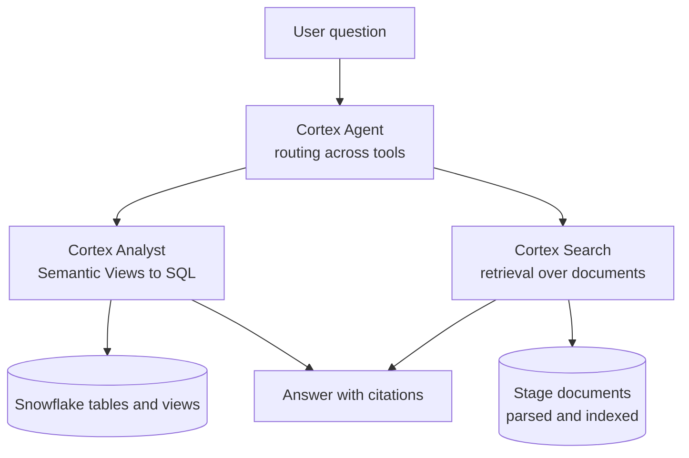
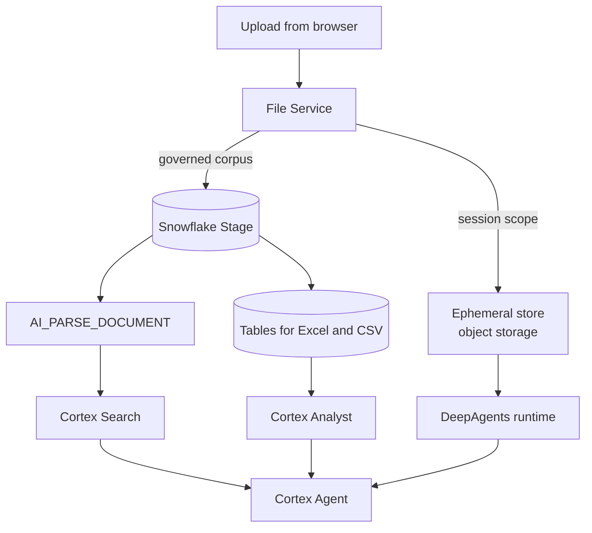
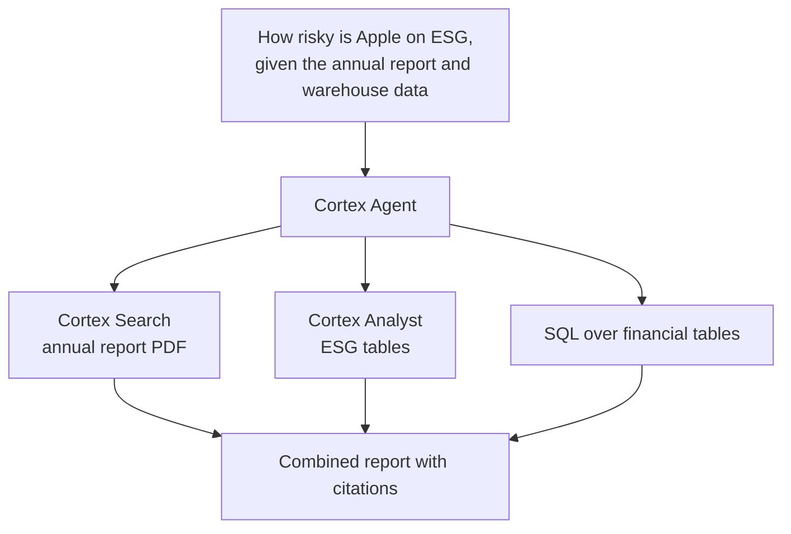
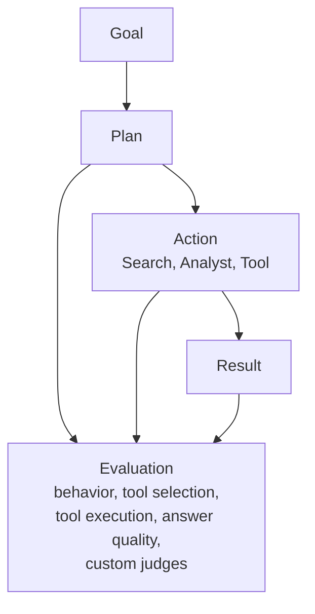
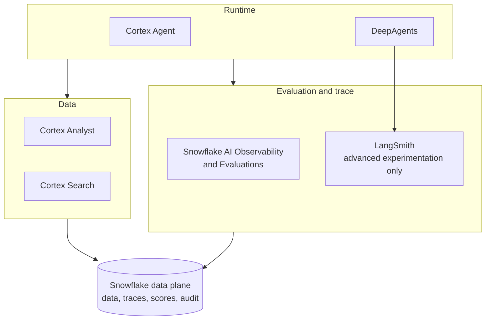

# Snowflake Agent 体系分析：Data-Native Runtime、文件双模式与 Evaluation 边界

本文讨论 Snowflake Cortex Agent 在企业 Agent Platform 里的位置。范围限定在三件事：structured 与 unstructured 数据如何统一进入 Agent、用户上传文件应该走哪条链路、Snowflake 的 Evaluation 与 LangSmith 如何分工。

分析对象是 Cortex Agent、Cortex Search、Cortex Analyst（含 Semantic Views）、Stage、`AI_PARSE_DOCUMENT`。企业平台侧的参照系来自《Enterprise Agent Platform Risk Architecture Review》（下称平台评审）：Control / Runtime / Data / Evidence 四个平面、Governance & Enforcement 横切、Platform-native 与 Data-native 两类 Runtime、Full-control 与 Managed Runtime 的治理边界。

核心判断只有一句：Cortex Agent 是数据平台内部的第二种 Agent Runtime，不是 LLM Provider，也不是数据源插件。这个定位一旦定下来，后面的文件链路、检索分工和 Evaluation 选型都会跟着确定。

## 一、定位：Cortex Agent 是第二 Runtime

Cortex Agent 是一个完整的 managed agent platform：调用 Cortex Search、经 Cortex Analyst 或 SQL 访问结构化数据、调用 tools、管理 threads，在 Snowflake 受治理环境内执行（平台评审 2.6、5.3 节）。Snowflake 也在把 Cortex Analyst 的能力往 Cortex Agent 收敛，structured 检索、unstructured 检索、tool calling 和 orchestration 放在同一个 Agent 里。

所以它不应该挂在 AI Platform 的模型网关下面。平台评审的画法是把它单列为 Potential Snowflake Agent Runtime，与 DeepAgents → LangGraph → AgentCore 这条自建链路并列。同理，把 Snowflake 放进 LiteLLM 的 provider 列表会在 Runtime、权限和 observability 三处同时出错（平台评审 6.1 节）。

两类 Agent 的分工按能力划分，不按品牌划分：

| 类型 | 链路 | 适合 |
| --- | --- | --- |
| Platform-native Agent | Agent Platform → DeepAgents → AgentCore → LiteLLM | 通用任务、外部 API、MCP、多步编排、code execution |
| Data-native Agent | Snowflake → Cortex Agent → Cortex Search / Semantic Views / SQL | 企业数据上的分析、投研、structured + unstructured 联合查询、依赖 Snowflake 原生治理的场景 |

这个并存成立的前提在平台评审 5.6 节：Cortex Agent 内部调用 Search、SQL 和 tool 时，平台侧的 Tool PEP、Retrieval PEP 和 Evidence Collector 未必看得见。因此平台级治理对自建链路是全链路判定，对 Cortex 这类 Managed Runtime只能做边界控制（admission、identity binding、approved configuration、input / output policy、outer trace），内部行为依赖 provider-native 控制。Capability Contract 需要逐项声明这个缺口，高风险缺口要么在平台侧补偿，要么限制该用例只路由到 Full-control Runtime。

## 二、Structured 与 Unstructured 如何统一进入 Agent

Cortex Agent 的官方设计就是在 structured 与 unstructured 之间做 orchestration：structured 经 Cortex Analyst 生成 SQL，unstructured 经 Cortex Search 检索，Agent 决定查库、查文档还是两者都查。



### Structured：关键是语义层，不是表多

不要把 200 张表直接暴露给 Agent。建议链路是 Raw tables → Curated views → Semantic Views → Cortex Analyst → Cortex Agent。Semantic View 定义业务实体、逻辑表和关系，本来就是为这个目的设计的。

例如投资场景里 `investment_ideas`、`portfolio`、`securities`、`companies`、`funds`、`esg_scores`、`financial_metrics` 先收敛成 Company、Financial、ESG 几个语义实体及其关系，用户问“过去三年日本金融行业 ESG score 下降最快的 20 家公司”，走的是 Cortex Agent → Cortex Analyst → Semantic View → SQL，而不是让通用 LLM 猜表结构。

### Unstructured：Stage + 解析 + 索引

链路固定为 Documents → Snowflake Stage → `AI_PARSE_DOCUMENT` → chunk → Cortex Search Service。Cortex Search 是 Snowflake 的 RAG / search layer，也是 Cortex Agent 的标准 unstructured retrieval 入口。

一个需要明确的边界：不是所有非结构化数据都要变成表。DB 表、视图和 Semantic Views 归 structured；JSON、XML、CSV、Parquet 这类半结构化数据可以进 Snowflake；PDF、DOCX、PPTX、HTML、TXT、图片保留在 Stage 或外部存储，原文件 + 解析表示 + 搜索索引三者并存，由 `AI_PARSE_DOCUMENT` 和 Cortex Search 消费。

### 两者合并：投研场景

“结合 Toyota 2025 年报和 Snowflake 中的 ESG 数据，判断是否存在需要关注的 transition risk”这类问题，Agent 同时调用 Cortex Search（年报 PDF）和 Cortex Analyst（ESG 表），在 Agent reasoning 里合并后再回答。Cortex Search 还支持 analytical search：先缩小文档候选集，再用 SQL、`AI_FILTER`、`AI_EXTRACT`、`AI_AGG` 对整个相关文档集合做分析。

如果自建这套能力，需要自己拼 Postgres、对象存储、OpenSearch 或向量库、RAG、SQL Agent 和语义层。Snowflake 的价值在于这部分已经收敛，平台评审的判断是这块自建不如直接用 Snowflake。

## 三、用户上传文件：两种归属

用户在对话里临时上传 PDF / Excel / 图片，与文件作为长期知识库，是两种归属。前者属于某一次 Agent Run，后者属于企业 Data Plane。这个区分决定了链路设计。

| 场景 | 自制 Agent Platform | Cortex Agent |
| --- | --- | --- |
| 临时上传 PDF | 灵活，文件作为请求输入 | 可做，但链路偏 Stage |
| 临时上传 Excel | 容易，直接进分析工具 | 落 Stage 后转表处理 |
| 上传图片 | 直接传给模型 | Cortex REST 支持 vision 图片输入（base64，单会话最多 20 张，请求上限 20 MiB） |
| 几十 MB 文件 | 自己控制对象存储即可 | Stage 模式更自然 |
| 长期知识库 | 需自建对象存储 + RAG | Stage + Cortex Search 更成熟 |
| 反复查询 | 自建检索 | Stage + Cortex Search |
| 文件内数据需要 SQL 分析 | 需自建 ingestion | 直接落表 + Cortex Analyst |
| 复杂 Agent 操作 | DeepAgents 更灵活 | Coding Agent / code execution 覆盖部分场景 |
| 权限治理 | 自行实现 | Snowflake 原生权限用品类更全 |

### 自制平台：文件是请求的一部分

推荐形态是浏览器先上传到对象存储，Agent API 只传递 fileId、文件名、mimeType 和 storageUri，Agent Runtime 按需读取。不要把 base64 塞进 prompt。

```json
{
  "userMessage": "分析这份年报中的 ESG 风险",
  "attachments": [
    {
      "id": "file-123",
      "name": "report.pdf",
      "mimeType": "application/pdf",
      "uri": "s3://agent-files/session-123/report.pdf"
    }
  ]
}
```

Agent 侧把文件做成一等公民，对外暴露 `file.read`、`file.extract`、`file.search`、`file.preview`、`file.download` 等工具。附件类型定义保持最小：

```typescript
type AgentAttachment = {
  id: string
  name: string
  mimeType: string
  size: number
  uri: string
  source: "upload" | "url" | "workspace"
}
```

这样 Agent 不需要知道文件存在 S3、Azure Blob、Snowflake Stage、SharePoint 还是 Google Drive，底层统一成 FileProvider 即可。PDF 走 document parser → markdown / tables → chunk → LLM，或直接进多模态模型；Excel 进 Python 工具用 pandas 打开成 DataFrame；图片进 vision 模型，必要时再串 OCR、Python 和 SQL。

### Snowflake：文件是数据的一部分

Snowflake 的推荐链路是 User File → Stage → `AI_PARSE_DOCUMENT` → Table / chunk → Cortex Search → Cortex Agent。官方 PDF chatbot 示例就是先上传到 Stage，解析后切 chunk 建 Cortex Search。

自制平台里 `POST /agents/investment/run` 带一个 PDF 属于单次运行；Snowflake 里 `PUT` 到 Stage 再解析建索引，文件进入企业知识库，后续所有 Agent 都可查。这是“file as request input”与“file as data”的差别。

临时文件在 Snowflake 里也能处理：上传到临时 Stage，用 `AI_PARSE_DOCUMENT` 解析进临时表再交给 Agent，对外可以包出 `POST /agent/session`、`/files`、`/run` 三个接口，内部维护 temporary stage + parsed content + agent thread。只是这不是 Cortex Agent 最自然的交互，外围需要一层 file / session 管理。

## 四、File Plane：ephemeral 与 knowledge 分开

建议平台直接支持两种 File Mode，不二选一。

ephemeral 服务当前会话：浏览器 → File Service → 对象存储 → DeepAgents / Cortex Agent，会话结束文件删除，适合临时 PDF、Excel、图片和一次性分析。knowledge 进入治理语料：Stage → `AI_PARSE_DOCUMENT` → chunk → Cortex Search → Agent Knowledge，带版本管理，可被多个 Agent 复用，适合投研报告、ESG 文档、制度和合同。



三类文件的默认路由可以写死：临时用户文件走 File Service → 对象存储 → DeepAgents；企业长期文件走 Stage → 解析 → Cortex Search → Cortex Agent（DeepAgents 经 MCP 调用亦可）；Excel / CSV 走 Stage → Table → SQL / Cortex Analyst；图片直传 vision 模型。这种设计不把平台锁死在 Snowflake，FileProvider 后面可以继续接新的存储。

设计原则只有一条：Agent 不直接拥有文件上传能力。前端调 File Service 拿到 File ID，Agent 经 tool 访问文件内容。权限、过期和审计收敛在 File Service 一处实现。

## 五、三种文件类型的差异

PDF 体现的是解析差异。自制平台按次解析即可；Snowflake 按语料解析建索引，适合反复查询和跨文档分析。

Excel 体现的是计算差异。自制平台走对象存储 → Python 工具 → pandas，这是 DeepAgents 擅长的模式。Snowflake 走 Stage → ingestion → Table → SQL → Cortex Agent，经 Cortex Analyst 生成 SQL，这是 Snowflake 的强项。用户问“过去一年收益率最低的 10 个标的并分析原因”，后者直接落在持仓表上。

图片体现的是输入差异。Cortex REST 对支持 vision 的模型接受 base64 图片，有 20 张和 20 MiB 的限制。自制平台可以更自由地串 OCR、vision、Python 和 SQL。

三者合并时 Snowflake 的结构优势明显：年报 PDF 经 Cortex Search，ESG 与财务数据经 Cortex Analyst 与 SQL，在 Cortex Agent 里合并推理输出报告。



## 六、Evaluation：Snowflake 到了什么程度

Cortex Agent Evaluations 已在 2026-03-13 GA。思路是 Goal-Plan-Action：Goal → Plan → Action（Search、Analyst、Tool 等）→ Result，每个阶段可评，evaluation trace 包含 planning、response generation 和每个 tool invocation 的 span。Custom metric 支持 ground-truth based 与 reference-free，例如“Agent 是否尊重投资数据 entitlement”可以定义成 0～1 打分加解释。

对平台架构更重要的是 External Agent Evaluation：evaluation data API 区分 `CORTEX AGENT` 与 `EXTERNAL AGENT`，DeepAgents、LangGraph、自研 Agent 也可以纳入 Snowflake 的 Evaluation 与 AI Observability。这让 Snowflake 有机会成为统一的 Evaluation 与 Observability Data Plane，而不只是评价自家 Agent。



### 与 LangSmith 的分工

LangSmith 的 Evaluation 按 offline（Dataset → Experiment → Evaluator → Compare）与 online（Production Trace → Online Evaluator → Feedback → Dataset → Regression Test）组织，code evaluator、LLM-as-judge、composite evaluator、pairwise evaluation、summary evaluation 齐全，Annotation Queue、pairwise 标注、prompt engineering、experiment 管理都很成熟。

Snowflake 与 LangSmith 的对照大致如下：

| 能力 | Snowflake | LangSmith |
| --- | --- | --- |
| Agent tracing | 强 | 强 |
| Agent-specific evaluation | 强 | 强 |
| LLM-as-judge / Ground truth / Reference-free | 强 | 强 |
| Custom evaluator | 有 | 强 |
| Tool-level evaluation | 强 | 强 |
| Dataset / Experiment / Version comparison | 有 | 成熟 |
| Pairwise evaluation | 相对弱 | 强 |
| Human annotation / Annotation queue | 弱 | 强 |
| Online evaluation / Production feedback 回流 | 有，可做 | 成熟 |
| Prompt engineering / Eval-driven development | 弱 / 中等 | 强 |
| SDK 与框架集成广度 | 有，扩张中 | 强 |
| 数据治理 / SQL 分析 / 数据本地性 | 强 | 中等 |

结论不是谁替代谁。只需要 Trace、LLM Judge、Dataset、回归和 Agent evaluation，Snowflake 已够用；需要完整的 prompt engineering、复杂实验、pairwise、人审队列和深度框架集成，LangSmith 仍然更成熟。Snowflake 独有的优势是 Evaluation 数据就在企业数据平台里：trace、评分、用户反馈、业务数据、ground truth、合规与审计数据可以直接 SQL 关联，例如按 agent 版本和 metric 聚合后再 join 业务 KPI。

截至目前的成熟度打分（10 分制，仅表达相对位置）：Agent Runtime 8.5 / 9，Structured Data Agent 9.5 / 7.5，Unstructured / RAG 9 / 9，数据治理 9.5 / 7，可观测性 8.5 / 9.5，Agent Evaluation 8.5 / 9.5，Dataset 8 / 9.5，Experiment 8 / 9.5，Human Evaluation 6 / 9.5，Pairwise 6.5 / 9，Online Evaluation 8 / 9.5，企业自定义 metric 9 / 9，业务数据关联 10 / 7，金融治理潜力 9.5 / 8，集中于企业数据平台 10 / 6（前者 Snowflake，后者 LangSmith）。

金融场景下 Evaluation 需要超出 correctness 和 groundedness：tool selection、tool execution、plan quality、data entitlement compliance、policy compliance、citation correctness、sensitive data exposure、hallucination、business outcome 都应进 metric。输入可带 ground truth、expected data、allowed data、expected tools 和 policy（例如“用户不能访问 Fund B”），输出同时评答案、工具调用和数据访问，最后汇总成合规结论。这已经是 Enterprise Agent Evaluation，不是单纯的输出打分。

平台评审的原则可以直接复用：LLM 可以建议与分类，不能产生最终 ALLOW / DENY；判定产物（subject、agent、agent_version、action、resource、purpose、data classification、decision、policy id 与版本）必须留证；Trace 不等于审计证据，工程 telemetry（LangSmith）与监管审计证据（企业审计存储）分开存放。

## 七、平台架构建议

此前常见的架构是 DeepAgents → LangSmith → Snowflake。按现在的 Snowflake 能力，建议改成以 Snowflake 为统一底座：Runtime（Cortex Agent + DeepAgents）、Data（Analyst + Search）、Evaluation 与 Trace 两列并立，底部都是 Snowflake；LangSmith 只在高级开发者实验、人审、pairwise、prompt engineering 出现实际缺口时补充，而不是平台核心依赖。



这样 structured / unstructured 数据、Agent trace、evaluation、业务数据和审计证据可以在同一个 data plane 里关联。对应平台评审的三处落地：Retrieval 抽象让 PostgreSQL + pgvector 与 Cortex Search 并存（平台评审 7.2 节）；权限过滤进检索查询而不是生成后过滤（7.3 节）；Tool PEP 在执行前判定高风险动作（8.3、8.4 节）。PostgreSQL 留给事务与运营状态，Snowflake 承担分析型数据仓库，LangSmith 承担 trace 与 evaluation 的工程侧能力，审计证据独立存放。

是否引入 LangSmith 的判断标准是能力缺口，不是习惯：出现了复杂实验管理、人审队列、pairwise、prompt 调优的真实需求再补。反之，为了“需要一个 run API 和 Job API”去重复建设 LangSmith Agent Server 已有的 Runs、Threads、Assistants、Cron Jobs 与 persistence，属于重复投入。

## 参考

- Snowflake Documentation, Tutorial 3: Build a PDF chatbot with Cortex Search [1]
- Snowflake Documentation, Use Cortex Search with Cortex Agents [2]
- Snowflake Documentation, Cortex REST API [3]
- Snowflake Documentation, Analytical search [4]
- Snowflake Documentation, 13 mars 2026 Évaluations Cortex Agent (Disponibilité générale) [5]
- Snowflake Documentation, Cortex Agent evaluations [6]
- Docs by LangChain, LangSmith Evaluation [7]
- Docs by LangChain, Use annotation queues [8]
- 平台评审上文：第 2.6、3.5、3.6、5.3–5.6、6.1、7.2–7.3、8.3–8.4、12.4–12.5、18–19 章

[1]: https://docs.snowflake.com/en/user-guide/snowflake-cortex/cortex-search/tutorials/cortex-search-tutorial-3-chat-advanced?utm_source=chatgpt.com "Tutorial 3: Build a PDF chatbot with Cortex Search | Snowflake Documentation"
[2]: https://docs.snowflake.com/en/user-guide/snowflake-cortex/cortex-search/cortex-search-agents?utm_source=chatgpt.com "Use Cortex Search with Cortex Agents | Snowflake Documentation"
[3]: https://docs.snowflake.com/en/user-guide/snowflake-cortex/cortex-rest-api?utm_source=chatgpt.com "Cortex REST API | Snowflake Documentation"
[4]: https://docs.snowflake.com/en/user-guide/snowflake-cortex/cortex-agents-analytical-search?utm_source=chatgpt.com "Analytical search | Snowflake Documentation"
[5]: https://docs.snowflake.com/fr/release-notes/2026/other/2026-03-13-cortex-agent-evaluations?utm_source=chatgpt.com "13 mars 2026 Évaluations Cortex Agent (Disponibilité générale)"
[6]: https://docs.snowflake.com/en/user-guide/snowflake-cortex/cortex-agents-evaluations?utm_source=chatgpt.com "Cortex Agent evaluations | Snowflake Documentation"
[7]: https://docs.langchain.com/langsmith/evaluation?utm_source=chatgpt.com "LangSmith Evaluation - Docs by LangChain"
[8]: https://docs.langchain.com/langsmith/annotation-queues?utm_source=chatgpt.com "Use annotation queues - Docs by LangChain"
