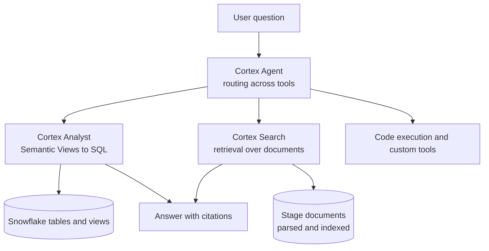
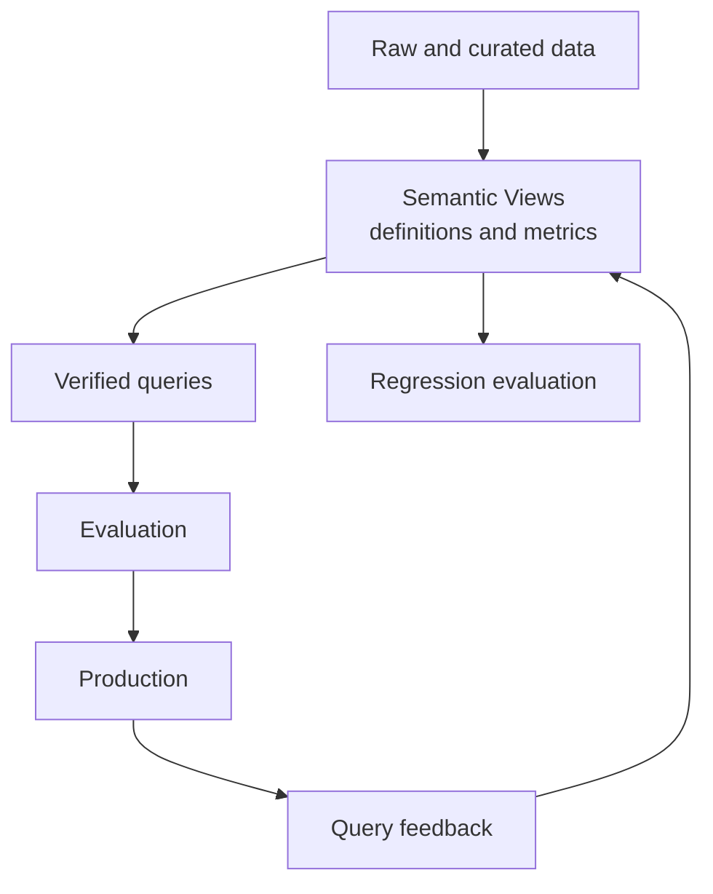
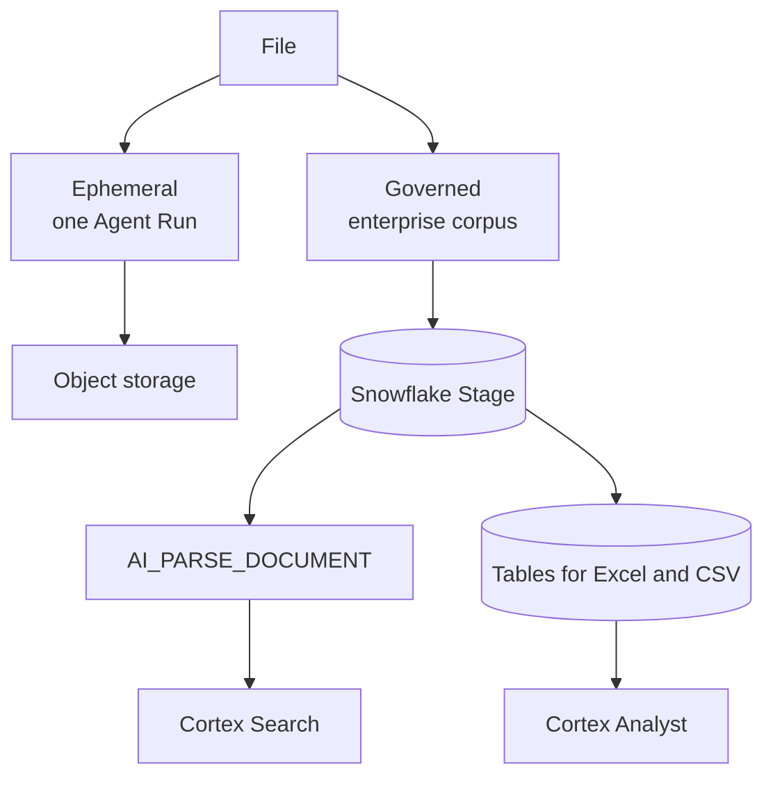
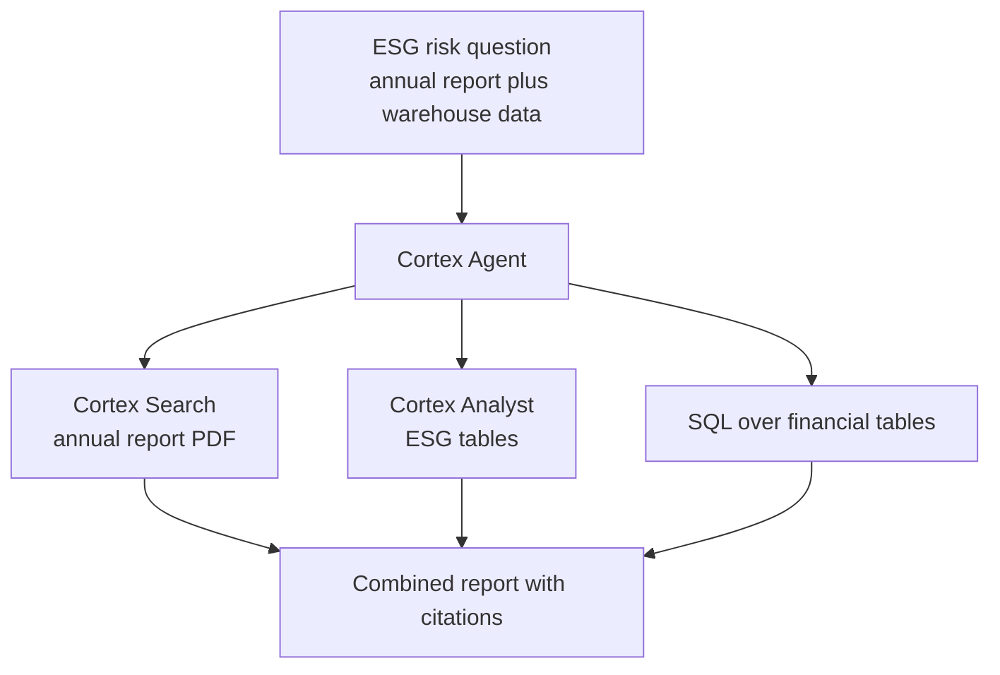
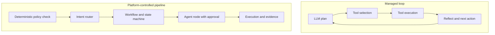
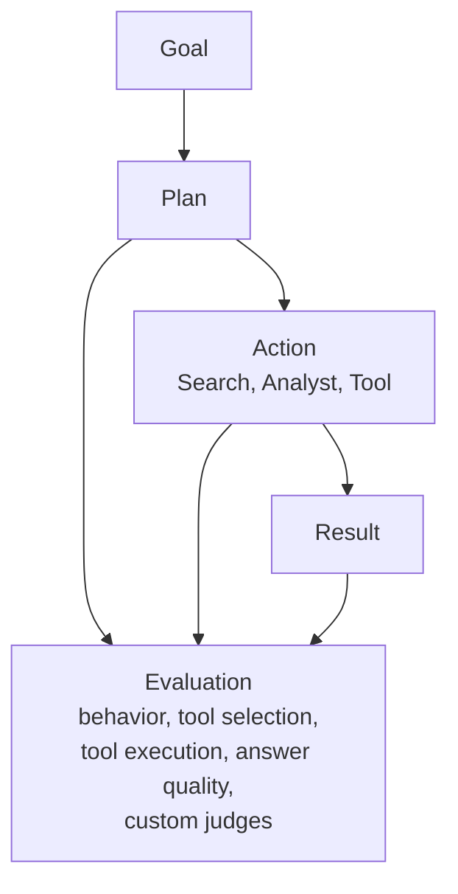
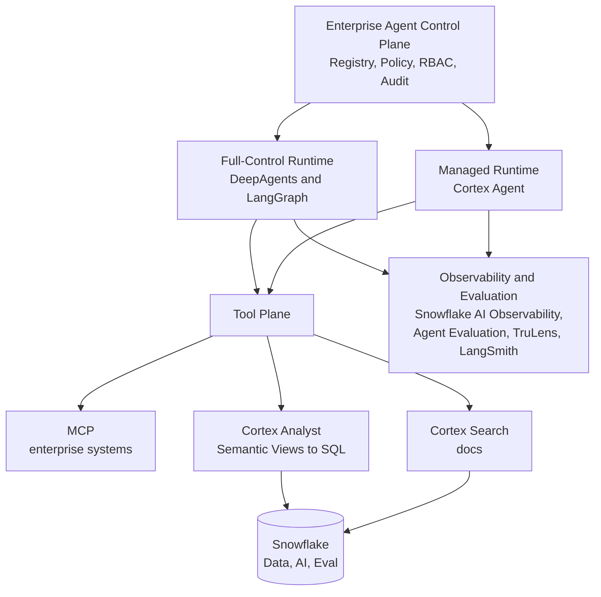

# Snowflake Agent 体系分析：Data-Native Managed Runtime 的能力、边界与生产现实

本文讨论 Snowflake Cortex Agent 在企业 Agent Platform 里的位置。范围限定在四件事：Cortex Agent 当前的真实能力边界、structured 与 unstructured 数据如何统一进入 Agent、用户上传文件应该走哪条链路、Snowflake 的 Evaluation 与 LangSmith 如何分工。

分析对象是 Cortex Agent、Cortex Search、Cortex Analyst（含 Semantic Views）、Stage、`AI_PARSE_DOCUMENT`、code execution、Snowflake-managed MCP Server。企业平台侧的参照系来自《Enterprise Agent Platform Risk Architecture Review》（下称平台评审）：Control / Runtime / Data / Evidence 四个平面、Governance & Enforcement 横切、Platform-native 与 Data-native 两类 Runtime、Full-control 与 Managed Runtime 的治理边界。

核心判断只有一句：Cortex Agent 是数据平台内部的 Data-Native Managed Agent Runtime，不是 LLM Provider，也不是数据源插件。这个定位一旦定下来，后面的文件链路、检索分工和 Evaluation 选型都会跟着确定。

需要先说明本文的口径。Snowflake 最大的优势是能力收敛，不是所有能力都已到达成熟平台的终局。下文凡是涉及生产成熟度、权限完备性和 Evaluation 覆盖度的结论，都按官方文档的已知限制和实际生产反馈校准，而不是按 Demo 表现书写。

## 一、Cortex Agent 已经发展到哪里

Cortex Agent 是一个完整的 managed agent platform：调用 Cortex Search、经 Cortex Analyst 或 SQL 访问结构化数据、调用 tools、管理 threads，在 Snowflake 受治理环境内执行（平台评审 2.6、5.3 节）。官方当前把 Cortex Analyst、Cortex Search、code execution、custom tools、MCP、skills、agent toolsets 纳入 Cortex Agent 的统一工具体系 [1]。

所以它不应该挂在 AI Platform 的模型网关下面。平台评审的画法是把它单列为 Snowflake Agent Runtime，与 DeepAgents → LangGraph → AgentCore 这条自建链路并列。同理，把 Snowflake 放进 LiteLLM 的 provider 列表会在 Runtime、权限和 observability 三处同时出错（平台评审 6.1 节）。

两类 Runtime 的分工按控制能力划分：

| 类型 | 代表 | 性质 |
| --- | --- | --- |
| Full-Control Runtime | DeepAgents / LangGraph | 编排、状态、工具执行完全由平台控制 |
| Managed Runtime | Cortex Agent | 强 Data Plane 的通用 Agent，内部行为依赖 provider-native 控制 |

这个并存成立的前提在平台评审 5.6 节：Cortex Agent 内部调用 Search、SQL 和 tool 时，平台侧的 Tool PEP、Retrieval PEP 和 Evidence Collector 未必看得见。因此平台级治理对自建链路是全链路判定，对 Cortex 只能做边界控制（admission、identity binding、approved configuration、input / output policy、outer trace）。Capability Contract 需要逐项声明这个缺口，高风险缺口要么在平台侧补偿，要么限制该用例只路由到 Full-control Runtime。

## 二、Structured 与 Unstructured：统一编排，而不是两个 RAG

Cortex Agent 的官方设计是在 structured 与 unstructured 之间做 orchestration：structured 经 Cortex Analyst 生成 SQL，unstructured 经 Cortex Search 检索，Agent 决定查库、查文档还是两者都查。这是 Snowflake 当前真正有竞争力的地方。



### Semantic Layer 是长期资产，不是辅助 prompt

不要把 200 张表直接暴露给 Agent。建议链路是 Raw tables → Curated views → Semantic Views → Cortex Analyst → Cortex Agent。生产瓶颈往往不在 SQL 生成本身，而在 semantic layer 的维护、定义漂移和成本可观测性 [2]。

实践反馈已经把 Semantic View 看成企业资产：metadata、业务定义、指标逻辑、同义词、verified queries、ownership、版本、CI/CD。Cortex Analyst 最终依赖的不是 LLM 的 Text-to-SQL 能力，而是这份 Semantic Contract。open-ended、边界模糊的问题质量明显低于结构明确的问题，原因也在 contract 覆盖度，不在模型。

建议的 Semantic Layer 生命周期：



例如投资场景里 `investment_ideas`、`portfolio`、`securities`、`companies`、`funds`、`esg_scores`、`financial_metrics` 先收敛成 Company、Financial、ESG 几个语义实体及其关系，用户问“过去三年日本金融行业 ESG score 下降最快的 20 家公司”，走的是 Cortex Agent → Cortex Analyst → Semantic View → SQL，而不是让通用 LLM 猜表结构。

### Cortex Search 的工程现实

链路固定为 Documents → Snowflake Stage → `AI_PARSE_DOCUMENT` → chunk → Cortex Search Service。Cortex Search 是 Snowflake 的 hybrid search 层，也是 Cortex Agent 的标准 unstructured retrieval 入口，不需要额外向量库，这是它相对自建最大的省事之处。

但大规模场景不是零运维。官方给出的边界包括：单 Search Service 默认 400M rows 上限；单服务超过 20 QPS、账户累计超过 140 QPS 需要联系 Snowflake；response size 有限制；search service 有持续 serving cost [10]。长文档解析需要 ingestion pipeline，ranking 质量依赖 indexing 与 metadata design，search service topology 需要按语料规模设计。

一个需要明确的边界：不是所有非结构化数据都要变成表。DB 表、视图和 Semantic Views 归 structured；JSON、XML、CSV、Parquet 这类半结构化数据可以进 Snowflake；PDF、DOCX、PPTX、HTML、TXT、图片保留在 Stage 或外部存储，原文件 + 解析表示 + 搜索索引三者并存，由 `AI_PARSE_DOCUMENT` 和 Cortex Search 消费。

### 两者合并：投研场景

“结合 Toyota 2025 年报和 Snowflake 中的 ESG 数据，判断是否存在需要关注的 transition risk”这类问题，Agent 同时调用 Cortex Search（年报 PDF）和 Cortex Analyst（ESG 表），在 Agent reasoning 里合并后再回答。Cortex Search 还支持 analytical search：先缩小文档候选集，再用 SQL、`AI_FILTER`、`AI_EXTRACT`、`AI_AGG` 对整个相关文档集合做分析。

复用建议按条件写，不写成绝对结论：如果企业已经以 Snowflake 为核心数据平台，这部分能力优先复用 Snowflake；如果企业需要跨数据平台、强定制 retrieval、复杂文件生命周期或完全控制 runtime，自建仍然有合理性。

## 三、文件架构：Ephemeral File 与 Governed Knowledge

用户在对话里临时上传 PDF / Excel / 图片，与文件作为长期知识库，是两种生命周期，不是两种厂商选型。前者属于某一次 Agent Run，后者属于企业语料。这个区分决定了链路设计，`Ephemeral File vs Governed Knowledge` 是比“自建 vs Snowflake”更准确的命名。

| 场景 | Ephemeral 路径 | Governed 路径 |
| --- | --- | --- |
| 临时上传 PDF | 对象存储，按次解析 | 落 Stage 建索引，适合反复查询 |
| 临时上传 Excel | 直接进 Python 工具计算 | 落 Stage 转表，用 SQL 分析 |
| 上传图片 | 直传 vision 模型 | 一般不进语料，按次处理 |
| 长期知识库 | 不适合 | Stage + Cortex Search |
| 文件内数据需要 SQL 分析 | 临时的 ingestion | 直接落表 + Cortex Analyst |
| 权限与生命周期 | session 级过期删除 | 版本管理，多 Agent 复用 |



自制平台侧，推荐形态是浏览器先上传到对象存储，Agent API 只传递 fileId、文件名、mimeType 和 storageUri，Agent Runtime 按需读取，不要把 base64 塞进 prompt：

```json
{
  "userMessage": "分析这份年报中的 ESG 风险",
  "attachments": [
    {
      "id": "file-123",
      "name": "report.pdf",
      "mimeType": "application/pdf",
      "uri": "s3://agent-files/session-123/report.pdf"
    }
  ]
}
```

附件类型定义保持最小：

```typescript
type AgentAttachment = {
  id: string
  name: string
  mimeType: string
  size: number
  uri: string
  source: "upload" | "url" | "workspace"
}
```

Agent 侧把文件做成一等公民，对外暴露 `file.read`、`file.extract`、`file.search`、`file.preview`、`file.download` 等工具，底层统一成 FileProvider，Agent 不需要知道文件在 S3、Azure Blob、Snowflake Stage 还是 SharePoint。

需要澄清的一点：Snowflake 可以构建临时文件链路（临时 Stage → `AI_PARSE_DOCUMENT` → 临时表 → Agent），但这通常需要外围 File / Session Service，它不是 Cortex Agent 最自然的原生 abstraction。Cortex Agent 的核心抽象仍然是 Agent + Tools + Thread + Run，code execution sandbox 自带 thread-scoped 的 workspace stage [12]。设计原则只有一条：Agent 不直接拥有文件上传能力，前端调 File Service 拿 File ID，Agent 经 tool 访问，权限、过期和审计收敛在一处。

三类文件的默认路由：临时用户文件走 File Service → 对象存储 → DeepAgents；企业长期文件走 Stage → 解析 → Cortex Search → Cortex Agent；Excel / CSV 走 Stage → Table → SQL / Cortex Analyst；图片直传 vision 模型（Cortex REST 对支持 vision 的模型接受 base64，单会话最多 20 张，请求上限 20 MiB [3]）。官方 PDF chatbot 示例就是先上传到 Stage，解析后切 chunk 建 Cortex Search [1]。

三者合并时 Snowflake 的结构优势明显：年报 PDF 经 Cortex Search，ESG 与财务数据经 Cortex Analyst 与 SQL，在 Cortex Agent 里合并推理输出报告。



## 四、Cortex Agent Runtime 的边界：已经是通用 Managed Runtime，但仍是 Managed

Cortex 当前已经支持 Python sandbox、bash、文件读写编辑、grep、glob、SQL、web search、skills、coding agent、agent toolsets 和 MCP，并逐渐收进统一 Agent tool model [12]。它已经从单一数据问答形态扩展为带强 Data Plane 的通用 Managed Runtime，不宜再写成“复杂 Agent 操作只能用 DeepAgents”。

区别应该改写为：Cortex Agent 是 Managed General-Purpose Agent with strong Data Plane；DeepAgents / LangGraph 是 Full-Control General-Purpose Agent Runtime。复杂跨系统、多工具、强状态、多步骤 workflow，不默认路由到 Managed Runtime。

### MCP 值得单列

Snowflake-managed MCP Server 已 GA，可以把 Cortex Search、Cortex Analyst、Cortex Agent、SQL、custom tools 作为 MCP tools 暴露出去 [13]。架构上出现两个方向：DeepAgents 经 MCP 调用 Snowflake（Search、Analyst、Agent、SQL），以及 Cortex Agent 经 MCP 调用企业系统。Agent 与 Snowflake 之间不再只是直连，而是 Agent ↔ MCP ↔ Snowflake。

Snowflake-managed MCP 也有明确限制：每 server 最大 50 tools，response 250 KB 上限，MCP 支持当前主要覆盖 tools，更复杂的 protocol constructs 并未完整覆盖 [14]。这正好落回平台评审的 Capability Contract 与 Tool Governance：每个 Runtime 有什么、缺什么、缺口如何补偿，都要显式声明。

### 权限：RBAC 不等于企业 Agent 授权

Snowflake 确实有强 RBAC，Cortex Agent 调用受 agent privilege、tool privilege、underlying object privilege、default role 等控制 [8]。但 Snowflake RBAC 不等于企业级 Agent Authorization：

```text
Can user query this table?
```

与：

```text
Is this Agent allowed to retrieve this data for this purpose,
on behalf of this user, under this workflow, at this risk level?
```

是两个问题。Snowflake 原生治理解决的是 Data Plane authorization，企业 Agent Platform 仍然需要 Control Plane / Policy Plane。这与平台评审的原则一致：Agent 可以自主推理，但不能自主突破授权；LLM 可以建议，不能产生最终 ALLOW / DENY。

一个金融企业必须注意的具体行为：Cortex Agent 权限判断依赖 querying user 的 default role，而不是 session 中激活的 role；default role 或 default warehouse 配置不正确，Agent call 可以直接失败 [9]。做 identity propagation 时必须显式处理 User Identity → Snowflake Authentication → Default Role → Agent Tool Authorization 这条链，不能假设平台侧授权一次即代表全部授权。

## 五、可插拔性与灵活性：差别在 control surface，不在功能数量

“Snowflake Agent 不如内部平台灵活”这个反馈合理，但准确说法不是功能少，而是它把控制权收敛到了 Managed Runtime 内部。Cortex Agent 是 Managed Runtime：企业不需要自建 orchestration loop、thread state、sandbox，Analyst、Search、Code Execution、Custom Tools、Skills、MCP Connectors、Agent Toolsets 已统一到一个 Runtime [1]。内部平台的优势则是 Runtime、Model、Tool、Memory、Policy、Workflow、Evaluation 全部可替换。因此“是否灵活”应该比较哪些层可替换、哪些层只能配置影响，而不是数工具数量。

Feature-rich 不等于 Pluggable。Cortex 的工具覆盖已远超早期“Search + LLM”，但核心 orchestration 仍由 Snowflake Managed Runtime 执行：LLM-driven plan → tool use → reflect 的 managed loop [9]。企业可通过 orchestration model、planning instructions、response instructions、工具配置与预算影响行为，不能像 LangGraph / DeepAgents 那样换掉整个 decision loop。内部平台是可替换 Runtime，Cortex 是可配置 Managed Runtime，两种架构哲学。



Snowflake 允许通过 planning instructions 指导 tool selection，例如规定某类问题必须用 Search 而不能用 Analyst [9]。内部平台则可以让有限状态机决定允许进入哪些阶段，LLM 只负责阶段内部推理。对金融、交易、审批、合规和高风险操作，这个差异直接决定方案是否可接受。

Model 上 multi-model 不等于 provider-agnostic。Cortex orchestration model 可从 Snowflake 目录选择（含 Anthropic、OpenAI、部分 Google 模型，支持 auto）[1]，覆盖多数场景；但不同于 LiteLLM / Model Gateway 的 OpenAI-compatible 任意 endpoint 抽象，Cortex REST API 虽支持更多目录模型，Agent orchestration 仍限定目录内模型 [3]。已有 Model Gateway 的企业需要注意这个差异。

Tool 上“只能访问 Snowflake 数据”已不准确 [1]，但仍受 Managed 约束：单 MCP server 最多 50 tools、response 250 KB 上限、过多 tools 降低 selection accuracy [13]；External MCP Connector 主要支持 tool capability，resources、prompts、roots、sampling 未完整支持 [19]。MCP Supported 不等于 Full MCP Runtime：discovery、routing、caching、authorization、retry、timeout、transaction、compensation、approval 的决定权仍在 Managed 侧。

Multi-Agent 存在抽象差异。Agent Toolsets 让一个 Agent 继承另一 Agent 的 tools [20]，本质是 tool composition / delegated capability composition，不同于 Supervisor 统管 research、analysis、risk、compliance、report 并决定状态传递、memory 归属、重试与停止条件。Skills 同理：Snowflake 把 instructions、scripts、supporting files 打包复用 [21]，但 SKILL.md 须在 root、脚本须在指定目录、Git tag 更新需显式 FETCH、生命周期挂 Agent object；内部平台可把 Skill 做成独立企业资产（Registry → Version → Compatibility Contract），跨 Runtime 复用。

生产侧有两个反馈值得记录。其一，数据访问越开放 Agent 灵活性越高但稳定性下降，有团队收敛到小而受控的 data package 后更稳定，代价是答不出范围外问题 [22]。灵活不是目标，可控的灵活性才是；区分 Capability Breadth 与 Operational Predictability。其二，生产试点常以 5 分钟时间上限、token / time budget 起步，防止长链路 reasoning 或循环 [23]；Snowflake 提供 orchestration budget、resource budget、per-user quota [1]，内部平台可进一步提升为平台级 deterministic policy（max steps / tools / cost / runtime、required approval、allowed domains）。另有用户报告同一 Agent 在 Notebook 与 Streamlit 返回不同（底层 SQL 相同）[24]：抽象越高，调试越受平台行为影响；Managed 省运维，Full-Control 强 debug。

对照如下：

| 维度 | Cortex Agent | Internal Agent Platform |
| --- | --- | --- |
| Runtime 控制 | 中 | 高 |
| Orchestration 控制 | 中 | 高 |
| Model Provider 可替换性 | 中 | 高 |
| Tool 扩展 | 强 | 强 |
| MCP | 强但受 Managed Runtime 约束 | 可完全控制 |
| Structured Data | 非常强 | 取决于实现 |
| Unstructured Data | 非常强 | 取决于实现 |
| Snowflake Governance | 非常强 | 需要集成 |
| Cross-system Workflow | 中 | 强 |
| Deterministic Workflow | 中 | 强 |
| High-risk Action Control | 需要外围 Control Plane | 可以原生设计 |
| Infrastructure Burden | 低 | 高 |
| Platform Lock-in | 较高 | 低 |
| Debug / Runtime Transparency | 中 | 高 |
| Time-to-Production | 快 | 慢 |
| Long-term Architectural Freedom | 中 | 高 |

因此企业不应该要求 Cortex 复制内部平台的全部灵活性，也不应该要求内部平台重实现数据原生能力。合理设计是通过统一 Control Plane + Tool / MCP Contract，让两种 Runtime 成为可替换执行后端：Cortex 负责 data-native reasoning 与 Snowflake-native 工具，内部 Runtime 负责复杂编排、确定性 workflow、自定义模型路由与高风险动作，Control Plane 负责 registry、version、policy、identity、audit、cost、evaluation 与 deployment（见第九章终版架构）。上层 Agent Contract、Tool Contract、Policy Contract、Evidence Contract、Evaluation Contract 定义清楚后，底层跑 Cortex、DeepAgents 还是 LangGraph，不应成为业务系统的硬编码依赖。

## 六、Evaluation：强数据型 Evaluation Plane，尚未等价 LangSmith 工作流

Cortex Agent Evaluations 已在 2026-03-13 GA [4]，思路是 Goal-Plan-Action：Goal → Plan → Action（Search、Analyst、Tool 等）→ Result，每个阶段可评，evaluation trace 包含 planning、response generation 和每个 tool invocation 的 span。能力覆盖 ground-truth evaluation、reference-free evaluation、answer correctness、logical consistency、custom metrics、trace-level evaluation、tool selection 与 execution evaluation [5]。



对平台架构重要的是 External Agent Evaluation：evaluation data API 区分 `CORTEX AGENT` 与 `EXTERNAL AGENT`，DeepAgents、LangGraph、自研 Agent 可以纳入 Snowflake 的 Evaluation 与 AI Observability，TruLens 方向也在把外部 Agent 与 custom AI application 纳入同一条 data plane [18]。因此 Snowflake 有机会成为统一的 Evaluation 与 Observability Data Plane，而不只是评价自家 Agent。但限定必须写清楚：它是强数据型 Evaluation Plane，还不是 LangSmith 那种成熟的 Evaluation Engineering Workbench。

### 官方已知限制（生产落地前必须读）

以下四条来自 Snowflake 官方文档，直接决定 Evaluation 能否进入金融生产闭环 [5]：

1. MCP Tool 不能真正参与 evaluation。Agent Evaluation 当前不支持 MCP servers as tools。如果生产 Agent 大量依赖 MCP 走企业系统，Evaluation 不能完整重放 MCP 行为，MCP-based tool execution 不在测试闭环内。
2. Row Access Policy / session attributes 有 evaluation gap。evaluation run 不传 session attributes，依赖 session attributes 或 row access policy 的 Agent，其 evaluation 结果可能与生产用户看到的不一致。对“User A 只能看 Fund A”这类需求，Evaluation Correctness 不等于 Production Authorization Correctness。
3. Code execution evaluation 无真实 side effect。evaluation 中 code execution 的文件不会真正写回用户 stage，`create output.xlsx` 这类路径在 evaluation 环境的结果不等同于生产执行。
4. Evaluation 本身有成本。Agent execution cost、LLM-as-judge cost、warehouse cost、storage cost 都会产生，trace 与 tool invocation 多的 workload 会变慢，需要 partition dataset。Evaluation 本身是生产资产，需要 Cost Governance。

### 与 LangSmith 的分工：Data Plane vs Engineering Workbench

LangSmith 更强的是完整工程工作流：Dataset → Experiment → Evaluator → Compare → Human Review → Production Feedback → Regression Dataset → Prompt / Model Iteration，offline + online evaluation、dataset、experiment、human review、code evaluator、LLM judge、pairwise、production feedback loop 串成一体 [6]。Human Evaluation 有 annotation queue、pairwise annotation queue、reviewer assignment、review progress、从生产 trace 建 dataset、A/B 实验直接 pairwise，这些不是 Snowflake 当前的强项 [7]。

对照按三档写，不打分：

| 领域 | Snowflake | LangSmith |
| --- | --- | --- |
| Data-native Agent | 优势明显 | 一般 |
| Structured analytics | 优势明显 | 一般 |
| Unstructured / RAG | 成熟 | 成熟 |
| Agent tracing | 成熟 | 成熟 |
| Agent-specific eval | 快速成熟 | 成熟 |
| Human eval | 基础 | 明显领先 |
| Pairwise | 基础，有限 | 明显领先 |
| Prompt / experiment workflow | 一般 | 明显领先 |
| Business data correlation | 明显领先 | 一般 |
| Cross-runtime evaluation | 可通过 TruLens 覆盖 | 更自然 |
| Governance / data locality | 明显领先 | 取决于部署模式 |

Snowflake 更像 Evaluation Data Plane：Evaluation → Trace → Business Data → SQL → Governance → Data Warehouse 全在同一数据平台内关联。LangSmith 更像 Evaluation Engineering Platform。金融场景的 metric 仍应超出 correctness：tool selection、tool execution、plan quality、data entitlement compliance、policy compliance、citation correctness、sensitive data exposure、hallucination、business outcome 都应进入 custom evaluator；判定产物必须留证；Trace 不等于审计证据，工程 telemetry 与监管审计证据分开存放（平台评审 3.6、12.4–12.5 节）。

## 七、真实生产反馈：三类共识

官方 Demo 之外，实际使用者反馈呈现三类稳定共识，值得在选型前读完。

第一类，Data-native 是明显优势。数据已经在 Snowflake 的团队里，Search、Analyst、SQL、Governance、Audit 组合自然，有用户反馈 Cortex Search 的 hybrid search 表现好，Snowflake RBAC 对 compliance team 有吸引力 [11]。小规模数据上 Cortex Search 很容易建起来，但对生产可信度仍有保留 [22]。

第二类，Semantic Layer 是长期难题。Text-to-SQL 已不是最难的部分，definition ownership、semantic drift、versioning、verified queries、CI/CD、evaluation、RBAC 才是生产麻烦所在 [2]。这与本文第二章的方向一致：Semantic Contract 是资产，需要 lifecycle 管理。

第三类，Cost 与 Trust 是现实问题。生产试点反馈集中在两点：Cortex Agent 成本偏高，需要限制使用人群；Demo 很好，但开放给普通业务用户后，broad、open-ended 问题很快暴露可靠性，问题质量与提问精确程度高度相关 [15]。Snowflake 官方也明确 Agent 成本是 additive 的 [16]，下文单列成本。

## 八、成本：additive 成本必须按 Agent Run 归因

Cortex Agent 的真实成本不是单项 token 账单，而是多项叠加：Agent orchestration tokens、Cortex Analyst、Cortex Search serving、search embedding、AI Parse、warehouse、code execution、custom tools、MCP、Evaluation [16]。能力整合的另一面是成本归因必须跟上，否则优化无从下手。

建议口径：Snowflake 的优势是能力整合，但能力整合意味着 Cost Attribution 必须按 Agent Run / Tool / User 维度做。Snowflake 恰好提供 per-user quota、Cortex Agent usage history 等能力 [17]，可以作为金融平台成本治理的起点。Evaluation 成本同样计入（见第六章），Search serving 的持续成本同样计入（见第二章）。

## 九、企业架构：Control Plane 不交给 Snowflake

Snowflake 横跨 Data Plane、Managed Runtime、Evaluation / Observability Plane，但 Control Plane 不应该交给 Snowflake。终版架构按评审意见调整为：



对应平台评审的三处落地：Retrieval 抽象让 PostgreSQL + pgvector 与 Cortex Search 并存（平台评审 7.2 节）；权限过滤进检索查询而不是生成后过滤（7.3 节）；Tool PEP 在执行前判定高风险动作（8.3、8.4 节）。PostgreSQL 留给事务与运营状态，Snowflake 承担分析型数据仓库与 Data-native Runtime，LangSmith 只在复杂实验、人审队列、pairwise、prompt 调优出现真实缺口时补充。是否引入 LangSmith 的判断标准是能力缺口，不是习惯。

## 十、最终判断：三个问题

不问“Snowflake 能不能替代 LangSmith”或“能不能替代 AgentCore”，按三件事分别回答。

其一，Snowflake 能不能替代 Data / RAG infrastructure。对于已经以 Snowflake 为核心数据平台的企业，相当程度可以，尤其 structured、unstructured、Semantic Layer、SQL、Search 这一组，这是 Snowflake 最强的地方。跨数据平台与强定制 retrieval 除外。

其二，Snowflake 能不能替代 Agent Runtime。简单到中等复杂 Data-native Agent 可以；复杂跨系统、多工具、强状态、多步骤 workflow 不默认替代 Full-Control Runtime。Cortex Agent 已是带强 Data Plane 的通用 Managed Runtime，但仍是 Managed，可替换与可配置的差异见第五章。

其三，Snowflake 能不能替代 LangSmith。可以替代一部分 Observability / Evaluation，但不能等价替代整个 Evaluation Engineering 工作流。Snowflake 是 Evaluation Data Plane，LangSmith 是 Evaluation Engineering Platform。MCP evaluation 缺口、session-aware authorization gap、code execution 无 side effect、human eval 与 pairwise 短板，在进入生产闭环前必须逐项确认。

## 参考

- Snowflake Documentation, Cortex Agents [1]
- Reddit, My thoughts about Cortex Analyst and where the bottleneck is [2]
- Reddit, Snowflake cortex agent MCP server [3]
- Snowflake Documentation, Mar 13 2026 Cortex Agent evaluations GA [4]
- Snowflake Documentation, Cortex Agent evaluations [5]
- Docs by LangChain, LangSmith Evaluation [6]
- Docs by LangChain, Use annotation queues [7]
- Snowflake Documentation, Access control and authentication [8]
- Snowflake Documentation, Create and manage agents [9]
- Snowflake Documentation, Cortex Search [10]
- Reddit, Cortex Search + COMPLETE for RAG [11]
- Snowflake Documentation, Cortex Agent code execution tool [12]
- Snowflake Documentation, Snowflake-managed MCP server [13]
- Snowflake Documentation, Snowflake-managed MCP server 限制 [14]
- Reddit, Anyone using Snowflake Cortex or LLMs in prod [15]
- Snowflake Documentation, Snowflake AI pricing [16]
- Snowflake Documentation, Per-user quotas [17]
- Snowflake Documentation, Evaluate applications with TruLens [18]
- Snowflake Documentation, MCP Connectors [19]
- Snowflake Documentation, Agent toolsets [20]
- Snowflake Documentation, Agent skills [21]
- Reddit, Snowflake cortex agent MCP server [22]
- Reddit, Best practice for Cortex Agent token and time budget [23]
- Reddit, Cortex Agent returns different results in Streamlit vs Notebook [24]
- 平台评审上文：第 2.6、3.5、3.6、5.3–5.6、6.1、7.2–7.3、8.3–8.4、12.4–12.5、18–19 章

[1]: https://docs.snowflake.com/en/user-guide/snowflake-cortex/cortex-agents?utm_source=chatgpt.com "Cortex Agents | Snowflake Documentation"
[2]: https://www.reddit.com/r/snowflake/comments/1s33yhg/my_thoughts_about_cortex_analyst_and_where_the/?utm_source=chatgpt.com "My thoughts about Cortex Analyst and where the bottleneck is- When the Demo Works and Prod Doesn’t"
[3]: https://www.reddit.com/r/dataengineering/comments/1p6u7ir/snowflake_cortex_agent_mcp_server/?utm_source=chatgpt.com "Snowflake cortex agent MCP server"
[4]: https://docs.snowflake.com/en/en/release-notes/2026/other/2026-03-13-cortex-agent-evaluations?utm_source=chatgpt.com "Mar 13, 2026: Cortex Agent evaluations (*General availability*) | Snowflake Documentation"
[5]: https://docs.snowflake.com/en/user-guide/snowflake-cortex/cortex-agents-evaluations?utm_source=chatgpt.com "Cortex Agent evaluations | Snowflake Documentation"
[6]: https://docs.langchain.com/langsmith/evaluation?utm_source=chatgpt.com "LangSmith Evaluation - Docs by LangChain"
[7]: https://docs.langchain.com/langsmith/annotation-queues?utm_source=chatgpt.com "Use annotation queues - Docs by LangChain"
[8]: https://docs.snowflake.com/en/user-guide/snowflake-cortex/cortex-agents-setup?utm_source=chatgpt.com "Access control and authentication | Snowflake Documentation"
[9]: https://docs.snowflake.com/en/user-guide/snowflake-cortex/cortex-agents-manage?utm_source=chatgpt.com "Create and manage agents | Snowflake Documentation"
[10]: https://docs.snowflake.com/en/user-guide/snowflake-cortex/cortex-search/cortex-search-overview?utm_source=chatgpt.com "Cortex Search | Snowflake Documentation"
[11]: https://www.reddit.com/r/snowflake/comments/1tbqnwm/cortex_search_complete_for_rag_surprisingly_simple/?utm_source=chatgpt.com "Cortex Search + COMPLETE for RAG - surprisingly simple"
[12]: https://docs.snowflake.com/en/user-guide/snowflake-cortex/cortex-agents-code-execution-tool?utm_source=chatgpt.com "Cortex Agent code execution tool | Snowflake Documentation"
[13]: https://docs.snowflake.com/en/user-guide/snowflake-cortex/cortex-agents-mcp?utm_source=chatgpt.com "Snowflake-managed MCP server | Snowflake Documentation"
[14]: https://docs.snowflake.cn/en/user-guide/snowflake-cortex/cortex-agents-mcp?utm_source=chatgpt.com "Snowflake-managed MCP server | Snowflake Documentation"
[15]: https://www.reddit.com/r/snowflake/comments/1q48bdb/anyone_using_snowflake_cortex_or_llms_in_prod_how/?utm_source=chatgpt.com "Anyone using Snowflake Cortex or LLMs in prod? How are you handling cost & Risk?"
[16]: https://docs.snowflake.com/en/user-guide/snowflake-cortex/pricing?utm_source=chatgpt.com "Snowflake AI pricing | Snowflake Documentation"
[17]: https://docs.snowflake.com/en/user-guide/budgets/per-user-quotas?utm_source=chatgpt.com "Per-user quotas | Snowflake Documentation"
[18]: https://docs.snowflake.com/en/user-guide/snowflake-cortex/ai-observability/evaluate-applications-trulens?utm_source=chatgpt.com "Evaluate applications with TruLens | Snowflake Documentation"
[19]: https://docs.snowflake.com/en/user-guide/snowflake-cortex/cortex-agents-mcp-connectors?utm_source=chatgpt.com "MCP Connectors | Snowflake Documentation"
[20]: https://docs.snowflake.com/en/user-guide/snowflake-cortex/cortex-agents-toolsets?utm_source=chatgpt.com "Agent toolsets | Snowflake Documentation"
[21]: https://docs.snowflake.com/en/user-guide/snowflake-cortex/cortex-agents-skills?utm_source=chatgpt.com "Agent skills | Snowflake Documentation"
[22]: https://www.reddit.com/r/dataengineering/comments/1p6u7ir/snowflake_cortex_agent_mcp_server/?utm_source=chatgpt.com "Snowflake cortex agent MCP server"
[23]: https://www.reddit.com/r/snowflake/comments/1v3hlyw/best_practice_for_cortex_agent_token_and_time/?utm_source=chatgpt.com "Best practice for Cortex Agent token and time budget?"
[24]: https://www.reddit.com/r/snowflake/comments/1qt7jva/snowflake_cortex_agent_returns_different_results/?utm_source=chatgpt.com "Snowflake Cortex Agent returns different results in Streamlit vs Notebook"
