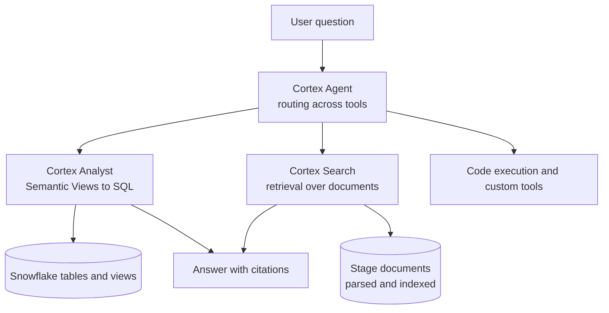
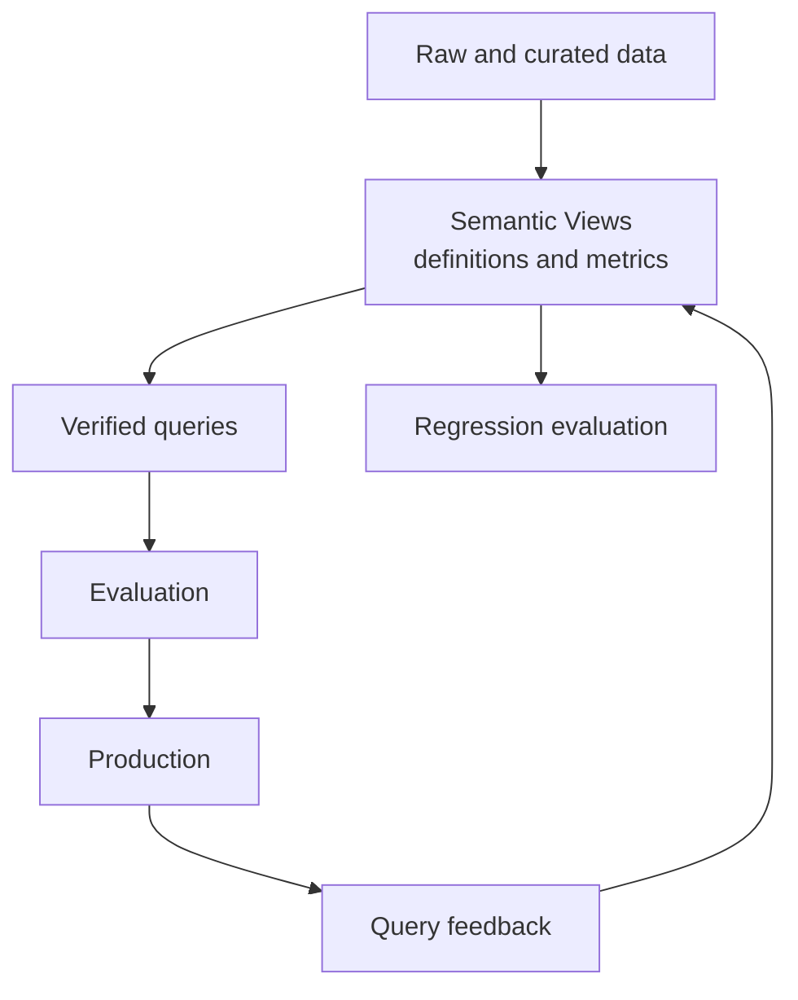
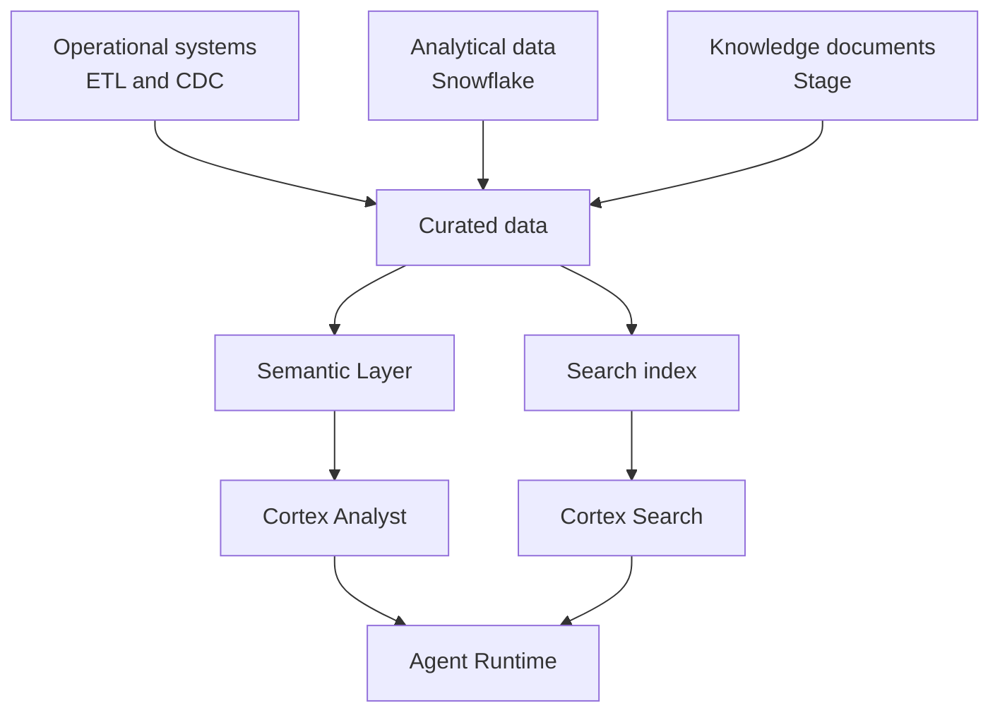
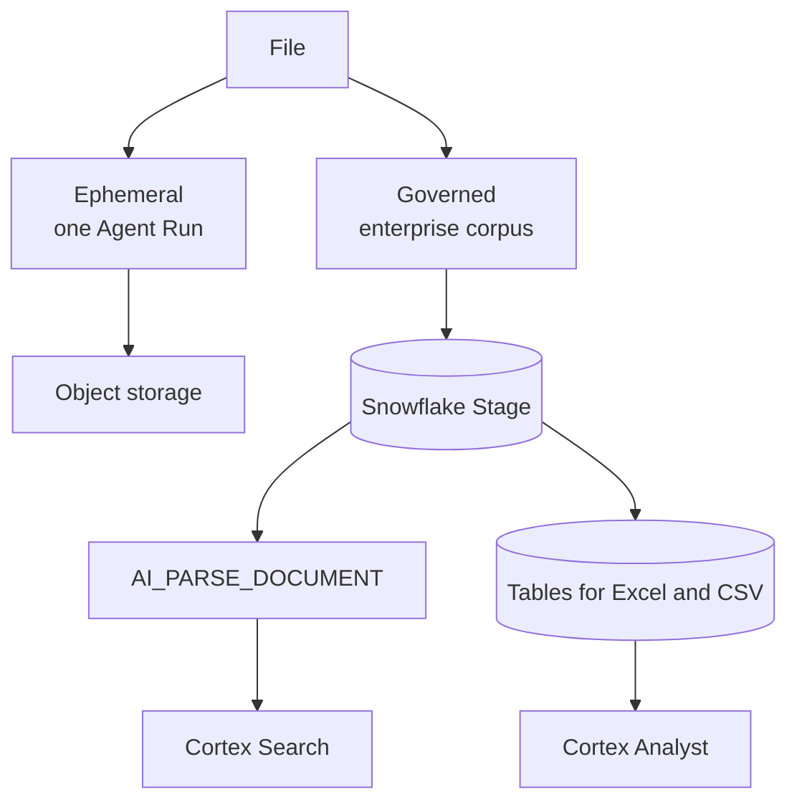
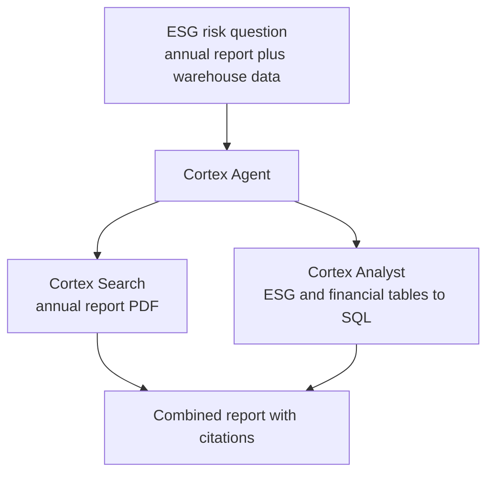
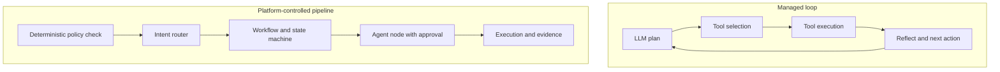
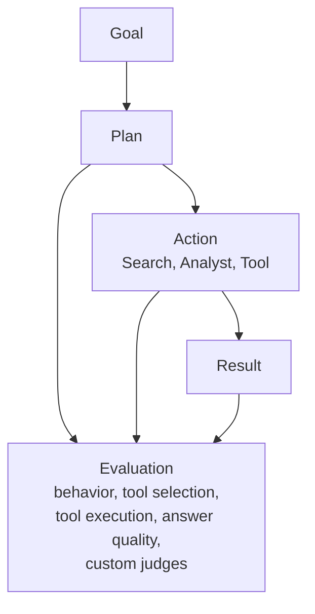
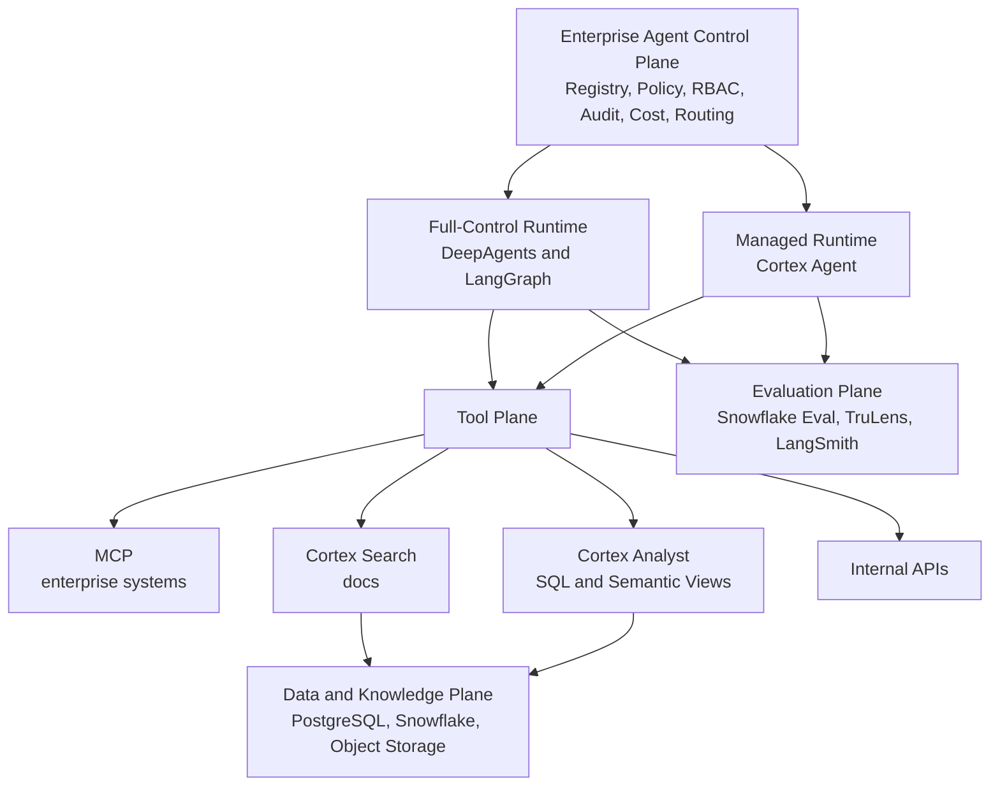
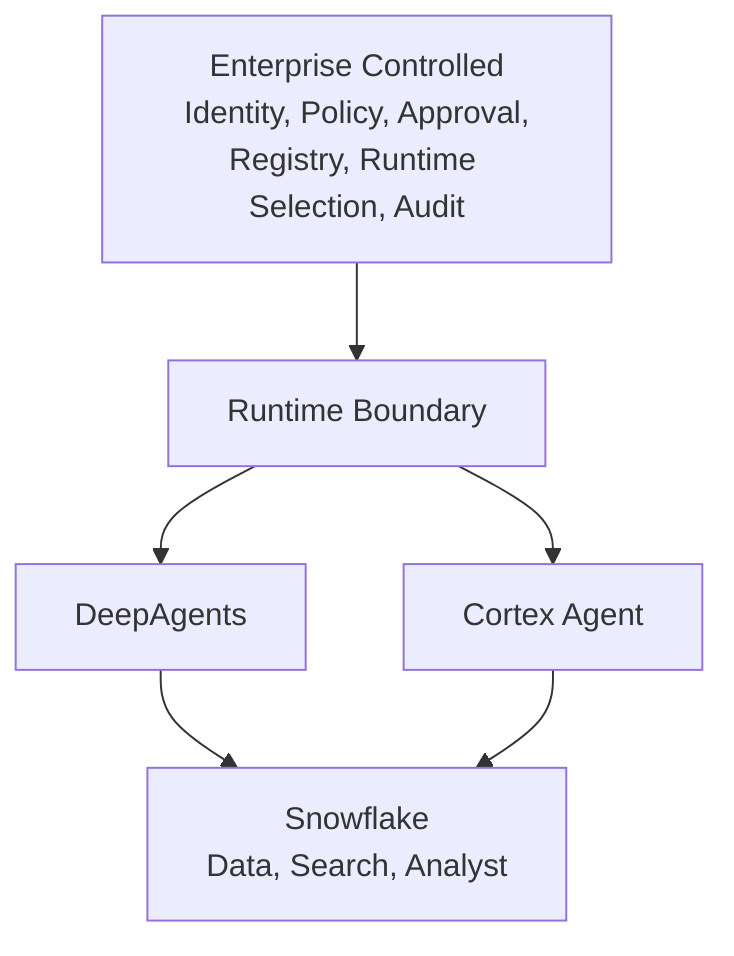
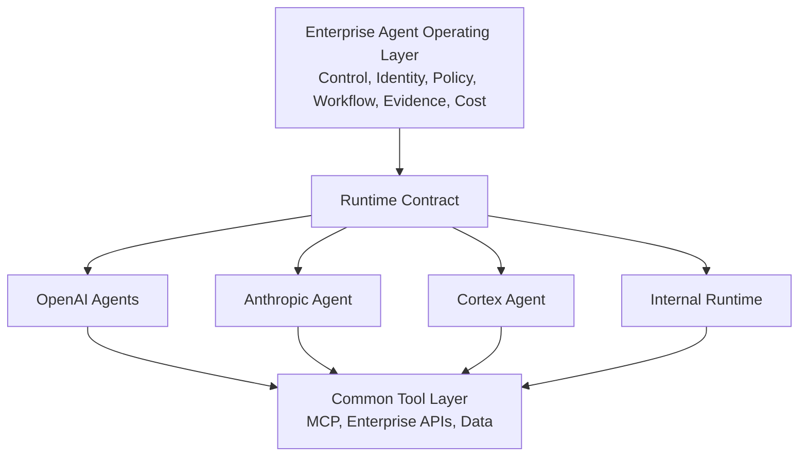

# Snowflake Agent 体系分析：Data-Native Managed General Agent Runtime 的能力、边界与生产现实

本文讨论 Snowflake Cortex Agent 在企业 Agent Platform 里的位置。范围限定在四件事：Cortex Agent 当前的真实能力边界、structured 与 unstructured 数据如何统一进入 Agent、用户上传文件应该走哪条链路、Snowflake 的 Evaluation 与 LangSmith 如何分工。第十三节把视角再抬一层：在 OpenAI 与 Anthropic 把 Runtime 商品化的背景下，企业平台的价值应上移到 Enterprise Agent Operating Layer。

分析对象是 Cortex Agent、Cortex Search、Cortex Analyst（含 Semantic Views）、Stage、`AI_PARSE_DOCUMENT`、code execution、Snowflake-managed MCP Server。企业平台侧的参照系来自《Enterprise Agent Platform Risk Architecture Review》（下称平台评审）：Control / Runtime / Data / Evidence 四个平面、Governance & Enforcement 横切、Platform-native 与 Data-native 两类 Runtime、Full-control 与 Managed Runtime 的治理边界。

核心判断只有一句：Cortex Agent 是数据平台内部的 Data-Native Managed General Agent Runtime，不是 LLM Provider，也不是数据源插件。这个定位一旦定下来，后面的文件链路、检索分工和 Evaluation 选型都会跟着确定。

需要先说明本文的口径。Snowflake 最大的优势是能力收敛，不是所有能力都已到达成熟平台的终局。下文凡是涉及生产成熟度、权限完备性和 Evaluation 覆盖度的结论，都按官方文档的已知限制和实际生产反馈校准，而不是按 Demo 表现书写。

## 一、Cortex Agent 已经发展到哪里

Cortex Agent 是一个完整的 managed agent platform：调用 Cortex Search、经 Cortex Analyst（生成 SQL）访问结构化数据、调用 tools、管理 threads，在 Snowflake 受治理环境内执行（平台评审 2.6、5.3 节）。官方当前把 Cortex Analyst、Cortex Search、code execution、custom tools、MCP、skills、agent toolsets 纳入 Cortex Agent 的统一工具体系 [1]。演进方向同样明确：截至 2026-08，Snowflake 已建议把 Cortex Analyst 逐步迁移到 Cortex Agents，因为后者已覆盖 Analyst 能力，并增加 unstructured retrieval、tool calling、threads 与多步 orchestration [25]。演进链大致是 Cortex Analyst + Cortex Search → Cortex Agent → Code Execution → Skills → MCP → Agent Toolsets → Coding / General Agent。战略上 Snowflake 不再做单一 Data Agent，而是在构建 Data-Native Managed General Agent Runtime（仍偏 data-centric，有明显通用化趋势）。这个判断反而让后文“为什么仍需要自建平台”更有力度：面对的不再是功能有限的 Snowflake Agent，而是持续扩张的 Managed Runtime，边界必须按控制权划分，不能按功能清单划分。

所以它不应该挂在 AI Platform 的模型网关下面。平台评审的画法是把它单列为 Snowflake Agent Runtime，与 DeepAgents → LangGraph → AgentCore 这条自建链路并列。同理，把 Snowflake 放进 LiteLLM 的 provider 列表会在 Runtime、权限和 observability 三处同时出错（平台评审 6.1 节）。

两类 Runtime 的分工按控制能力划分：

| 类型 | 代表 | 性质 |
| --- | --- | --- |
| Full-Control Runtime | DeepAgents / LangGraph | 编排、状态、工具执行完全由平台控制 |
| Managed Runtime | Cortex Agent | 强 Data Plane 的通用 Agent，内部行为依赖 provider-native 控制 |

这个并存成立的前提在平台评审 5.6 节：Cortex Agent 内部经 Analyst、analytical search、code toolset 触发 SQL 与 tool 时，平台侧的 Tool PEP、Retrieval PEP 和 Evidence Collector 未必看得见。因此平台级治理对自建链路是全链路判定，对 Cortex 只能做边界控制（admission、identity binding、approved configuration、input / output policy、outer trace）。Capability Contract 需要逐项声明这个缺口，高风险缺口要么在平台侧补偿，要么限制该用例只路由到 Full-control Runtime。

## 二、Structured 与 Unstructured：统一编排，而不是两个 RAG

Cortex Agent 的官方设计是在 structured 与 unstructured 之间做 orchestration：structured 经 Cortex Analyst 生成 SQL，unstructured 经 Cortex Search 检索，Agent 决定查库、查文档还是两者都查。这是 Snowflake 当前真正有竞争力的地方。



### Semantic Layer 是长期资产，不是辅助 prompt

不要把 200 张表直接暴露给 Agent。建议链路是 Raw tables → Curated views → Semantic Views → Cortex Analyst → Cortex Agent。生产瓶颈往往不在 SQL 生成本身，而在 semantic layer 的维护、定义漂移和成本可观测性 [2]。

实践反馈已经把 Semantic View 看成企业资产：metadata、业务定义、指标逻辑、同义词、verified queries、ownership、版本、CI/CD。Cortex Analyst 最终依赖的不是 LLM 的 Text-to-SQL 能力，而是这份 Semantic Contract。open-ended、边界模糊的问题质量明显低于结构明确的问题，原因也在 contract 覆盖度，不在模型。

建议的 Semantic Layer 生命周期：



例如投资场景里 `investment_ideas`、`portfolio`、`securities`、`companies`、`funds`、`esg_scores`、`financial_metrics` 先收敛成 Company、Financial、ESG 几个语义实体及其关系，用户问“过去三年日本金融行业 ESG score 下降最快的 20 家公司”，走的是 Cortex Agent → Cortex Analyst → Semantic View → SQL，而不是让通用 LLM 猜表结构。

Semantic Layer 的运营成本需要单独估算。真实团队已经在问：20 个 Semantic Views 怎么做 version control，verified queries 怎么管理，SQL instructions 堆到什么程度才该变成 skill [27]。它本身需要 Ownership、Version、Review、Testing、Regression、Release、Rollback，definition drift 与 usage / cost attribution 进日常运营 [2]。社区对 Semantic View Autopilot 的反馈也出现分歧：有人认为已可自动化 80–90%，也有人认为复杂 metric 与 edge case 仍需大量人工修正 [29]。结论是 Cortex Agent 并没有消灭企业知识建模，只是把建模位置从 Prompt 转移到了 Semantic Layer；选型时省掉的 prompt 工程，会以 semantic governance 的形式回来。

### Cortex Search 的工程现实

链路固定为 Documents → Snowflake Stage → `AI_PARSE_DOCUMENT` → chunk → Cortex Search Service。Cortex Search 是 Snowflake 的 hybrid search 层，也是 Cortex Agent 的标准 unstructured retrieval 入口，不需要额外向量库，这是它相对自建最大的省事之处。

但大规模场景不是零运维。官方给出的边界包括：单 Search Service 默认规模约束为 400M rows，更大规模需要与 Snowflake 协商扩容；单服务超过 20 QPS、账户累计超过 140 QPS 需要联系 Snowflake；response size 有限制；search service 有持续 serving cost [10]。长文档解析需要 ingestion pipeline，ranking 质量依赖 indexing 与 metadata design，search service topology 需要按语料规模设计。

一个需要明确的边界：不是所有非结构化数据都要变成表。DB 表、视图和 Semantic Views 归 structured；JSON、XML、CSV、Parquet 这类半结构化数据可以进 Snowflake；PDF、DOCX、PPTX、HTML、TXT、图片保留在 Stage 或外部存储，原文件 + 解析表示 + 搜索索引三者并存，由 `AI_PARSE_DOCUMENT` 和 Cortex Search 消费。

授权一致性需要单独设计。Structured 侧有 Role → Row Access Policy → Masking Policy，unstructured 侧有 Cortex Search filter 与同一套 role 体系，但两者是否形成同一个 Data Entitlement Contract，取决于建模时是否对齐。典型泄漏形态：Fund A 用户经 Analyst 只能看到 Fund A 财务数据，经 Search 却能搜出 Fund B 报告。Search authorization 与 SQL authorization 必须收敛到同一份 entitlement 定义，否则检索侧会绕过表侧的行级控制。这条归属见第十章 Trust Boundary。

### 两者合并：投研场景

“结合 Toyota 2025 年报和 Snowflake 中的 ESG 数据，判断是否存在需要关注的 transition risk”这类问题，Agent 同时调用 Cortex Search（年报 PDF）和 Cortex Analyst（ESG 表），在 Agent reasoning 里合并后再回答。Cortex Search 还支持 analytical search：先缩小文档候选集，再用 SQL、`AI_FILTER`、`AI_EXTRACT`、`AI_AGG` 对整个相关文档集合做分析。

复用建议按条件写，不写成绝对结论：如果企业已经以 Snowflake 为核心数据平台，这部分能力优先复用 Snowflake；如果企业需要跨数据平台、强定制 retrieval、复杂文件生命周期或完全控制 runtime，自建仍然有合理性。

往下一层，Agent 不是 Data Platform 的替代品，而是 Data Platform 之上的 reasoning layer：



联合查询还需面对新鲜度不一致。Snowflake 结构化数据可能是 T-1，年报 PDF 是最新已发布版，ESG feed 按周，市场数据近实时，Agent 合并输出一句“基于最新数据”并不严谨。建议 Data Freshness Contract：每个 Tool 返回 source、snapshot_time、effective_time、ingestion_time、data_version，Agent Answer 携带各源时间戳（例如 Portfolio 2026-09-14 18:00、ESG 2026-09-12、Annual Report 2026-03-31）。金融场景下这条比答案措辞更重要。

## 三、文件架构：Ephemeral File 与 Governed Knowledge

用户在对话里临时上传 PDF / Excel / 图片，与文件作为长期知识库，是两种生命周期，不是两种厂商选型。前者属于某一次 Agent Run，后者属于企业语料。这个区分决定了链路设计，`Ephemeral File vs Governed Knowledge` 是比“自建 vs Snowflake”更准确的命名。

| 场景 | Ephemeral 路径 | Governed 路径 |
| --- | --- | --- |
| 临时上传 PDF | 对象存储，按次解析 | 落 Stage 建索引，适合反复查询 |
| 临时上传 Excel | 直接进 Python 工具计算 | 落 Stage 转表，用 SQL 分析 |
| 上传图片 | 直传 vision 模型 | 一般不进语料，按次处理 |
| 长期知识库 | 不适合 | Stage + Cortex Search |
| 文件内数据需要 SQL 分析 | 临时的 ingestion | 直接落表 + Cortex Analyst |
| 权限与生命周期 | session 级过期删除 | 版本管理，多 Agent 复用 |



自制平台侧，推荐形态是浏览器先上传到对象存储，Agent API 只传递 fileId、文件名、mimeType 和 storageUri，Agent Runtime 按需读取，不要把 base64 塞进 prompt：

```json
{
  "userMessage": "分析这份年报中的 ESG 风险",
  "attachments": [
    {
      "id": "file-123",
      "name": "report.pdf",
      "mimeType": "application/pdf",
      "uri": "s3://agent-files/session-123/report.pdf"
    }
  ]
}
```

附件类型定义保持最小：

```typescript
type AgentAttachment = {
  id: string
  name: string
  mimeType: string
  size: number
  uri: string
  source: "upload" | "url" | "workspace"
}
```

Agent 侧把文件做成一等公民，对外暴露 `file.read`、`file.extract`、`file.search`、`file.preview`、`file.download` 等工具，底层统一成 FileProvider；Agent 不直接拥有上传能力，前端调 File Service 拿 File ID，Agent 经 tool 访问，权限、过期和审计收敛在一处。Snowflake 可建临时文件链路（临时 Stage → 解析 → 临时表 → Agent），但需外围 File / Session Service，不是 Cortex 最自然的原生 abstraction；其核心抽象仍是 Agent + Tools + Thread + Run，code execution sandbox 自带 thread-scoped workspace stage [12]。

默认路由：临时文件走 File Service → 对象存储 → DeepAgents；长期文件走 Stage → 解析 → Cortex Search → Cortex Agent；Excel / CSV 走 Stage → Table → SQL / Analyst；图片直传 vision 模型（base64，单会话 20 张、20 MiB 上限 [22]）。合并时年报 PDF 经 Search、ESG 与财务经 Analyst 与 SQL，在 Cortex Agent 里汇总成报告。



## 四、Cortex Agent Runtime 的边界：Data-Native Managed General Agent Runtime，但仍是 Managed

Cortex 当前已经支持 Python sandbox、bash、文件读写编辑、grep、glob、经 toolset 的 SQL execution、web search、skills、coding agent、agent toolsets 和 MCP，并逐渐收进统一 Agent tool model [12]。它已经从单一数据问答形态扩展为 Data-Native Managed General Agent Runtime（Coding Agent 于 2026-08-26 GA [40]），不宜再写成“复杂 Agent 操作只能用 DeepAgents”。

区别应该改写为：Cortex Agent 是 Managed General-Purpose Agent with strong Data Plane；DeepAgents / LangGraph 是 Full-Control General-Purpose Agent Runtime。复杂跨系统、多工具、强状态、多步骤 workflow，不默认路由到 Managed Runtime。

Sandbox 边界直接支撑这个区分。Cortex Code Execution 是 thread-scoped sandbox，workspace stage 做持久化，不能直接访问任意 Stage，sandbox 内不能直接跑 SQL（经 SQL tools 执行），owner's rights Agent 不支持 Code Execution [12]：

| 维度 | Cortex Agent | Internal Platform |
| --- | --- | --- |
| Sandbox | Managed | 自己定义 |
| Runtime image | 受控 | 可自定义 |
| Network | 受控 | 可定义 |
| Package | Snowflake controlled | 自由 |
| File system | workspace stage | 可完全自定义 |
| SQL | 经 Tool boundary | 可直接集成 |
| Side effect | 受限 | 完全可控 |

推理链是 Agent Reasoning → Code Execution → Sandbox Boundary → Data Access Boundary：每一层都没问题，组合起来才是可落地的执行语义。

### MCP 值得单列

Snowflake-managed MCP Server 已 GA，可以把 Cortex Search、Cortex Analyst、Cortex Agent、SQL execution（经 MCP 显式暴露的 SYSTEM_EXECUTE_SQL）、custom tools 作为 MCP tools 暴露出去 [13]。架构上出现两个方向：DeepAgents 经 MCP 调用 Snowflake（Search、Analyst、Agent、显式 SQL），以及 Cortex Agent 经 MCP 调用企业系统。Agent 与 Snowflake 之间不再只是直连，而是 Agent ↔ MCP ↔ Snowflake。

Snowflake-managed MCP 也有明确限制：每 server 最大 50 tools，response 250 KB 上限，MCP 支持当前主要覆盖 tools，更复杂的 protocol constructs 并未完整覆盖 [14]。这正好落回平台评审的 Capability Contract 与 Tool Governance：每个 Runtime 有什么、缺什么、缺口如何补偿，都要显式声明。

### 权限：RBAC 不等于企业 Agent 授权

Snowflake 确实有强 RBAC，Cortex Agent 调用受 agent privilege、tool privilege、underlying object privilege、default role 等控制 [8]。但 Snowflake RBAC 不等于企业级 Agent Authorization：

```text
Can user query this table?
```

与：

```text
Is this Agent allowed to retrieve this data for this purpose,
on behalf of this user, under this workflow, at this risk level?
```

是两个问题。Snowflake 原生治理解决的是 Data Plane authorization，企业 Agent Platform 仍然需要 Control Plane / Policy Plane。这与平台评审的原则一致：Agent 可以自主推理，但不能自主突破授权；LLM 可以建议，不能产生最终 ALLOW / DENY。

一个金融企业必须注意的具体行为：Cortex Agent 默认权限上下文依赖 querying user 的 default role，而不是 session 中激活的 role；default role 或 default warehouse 配置不正确，Agent call 可以直接失败 [9]。例外是 REST API 场景可经 `X-Snowflake-Role` 显式指定 role [22]，而 MCP 又有自己的 primary role / OAuth scope 行为 [13]。因此 identity propagation 必须显式处理 User Identity → Snowflake Authentication → Role（default 或显式指定）→ Agent Tool Authorization 这条链，不能假设平台侧授权一次即代表全部授权。架构原则是：Enterprise identity propagation 不等于透传用户身份 token，平台必须在每个边界定义确切的 Snowflake role semantics。

## 五、可插拔性与灵活性：差别在 control surface，不在功能数量

“Snowflake Agent 不如内部平台灵活”这个反馈合理，但准确说法不是功能少，而是它把控制权收敛到了 Managed Runtime 内部。Cortex Agent 是 Managed Runtime：企业不需要自建 orchestration loop、thread state、sandbox，Analyst、Search、Code Execution、Custom Tools、Skills、MCP Connectors、Agent Toolsets 已统一到一个 Runtime [1]。内部平台的优势则是 Runtime、Model、Tool、Memory、Policy、Workflow、Evaluation 全部可替换。因此“是否灵活”应该比较哪些层可替换、哪些层只能配置影响，而不是数工具数量。

Feature-rich 不等于 Pluggable。Cortex 的工具覆盖已远超早期“Search + LLM”，但核心 orchestration 仍由 Snowflake Managed Runtime 执行：LLM-driven plan → tool use → reflect 的 managed loop [9]。企业可通过 orchestration model、planning instructions、response instructions、工具配置与预算影响行为，不能像 LangGraph / DeepAgents 那样换掉整个 decision loop。内部平台是可替换 Runtime，Cortex 是可配置 Managed Runtime，两种架构哲学。



Snowflake 允许通过 planning instructions 指导 tool selection，例如规定某类问题必须用 Search 而不能用 Analyst [9]。内部平台则可以让有限状态机决定允许进入哪些阶段，LLM 只负责阶段内部推理。对金融、交易、审批、合规和高风险操作，这个差异直接决定方案是否可接受。

Model 上 multi-model 不等于 provider-agnostic。Cortex orchestration model 可从 Snowflake 目录选择（含 Anthropic、OpenAI、部分 Google 模型，支持 auto）[1]，覆盖多数场景；但不同于 LiteLLM / Model Gateway 的 OpenAI-compatible 任意 endpoint 抽象，Cortex REST API 虽支持更多目录模型，Agent orchestration 仍限定目录内模型 [22]。已有 Model Gateway 的企业需要注意这个差异。

Tool 上“只能访问 Snowflake 数据”已不准确 [1]，但仍受 Managed 约束：单 MCP server 最多 50 tools、response 250 KB 上限、过多 tools 降低 selection accuracy [13]；External MCP Connector 主要支持 tool capability，resources、prompts、roots、sampling 未完整支持 [19]。MCP Supported 不等于 Full MCP Runtime：discovery、routing、caching、authorization、retry、timeout、transaction、compensation、approval 的决定权仍在 Managed 侧。Snowflake 官方还专门提醒 tool poisoning / tool shadowing，以及 agent → Cortex Agent → MCP → Cortex Agent 的递归 loop 风险 [13]。MCP 标准化的是 Tool Protocol，不等于标准化了 Agent Runtime。

Multi-Agent 存在抽象差异。Agent Toolsets 让一个 Agent 继承另一 Agent 的 tools [20]，本质是 tool composition / delegated capability composition，不同于 Supervisor 统管 research、analysis、risk、compliance、report 并决定状态传递、memory 归属、重试与停止条件。Skills 同理：Snowflake 把 instructions、scripts、supporting files 打包复用 [21]，但 SKILL.md 须在 root、脚本须在指定目录、Git tag 更新需显式 FETCH、生命周期挂 Agent object；内部平台可把 Skill 做成独立企业资产（Registry → Version → Compatibility Contract），跨 Runtime 复用。

生产侧有两个反馈值得记录。其一，数据访问越开放 Agent 灵活性越高但稳定性下降，有团队收敛到小而受控的 data package 后更稳定，代价是答不出范围外问题 [3]。灵活不是目标，可控的灵活性才是；区分 Capability Breadth 与 Operational Predictability。其二，生产试点常以 5 分钟时间上限、token / time budget 起步，防止长链路 reasoning 或循环 [23]；Snowflake 提供 orchestration budget、resource budget、per-user quota [1]，内部平台可进一步提升为平台级 deterministic policy（max steps / tools / cost / runtime、required approval、allowed domains）。另有用户报告同一 Agent 在 Notebook 与 Streamlit 返回不同（底层 SQL 相同）[24]：抽象越高，调试越受平台行为影响；Managed 省运维，Full-Control 强 debug。

对照如下：

| 维度 | Cortex Agent | Internal Agent Platform |
| --- | --- | --- |
| Runtime 控制 | 中 | 高 |
| Orchestration 控制 | 中 | 高 |
| Model Provider 可替换性 | 中 | 高 |
| Tool 扩展 | 强 | 强 |
| MCP | 强但受 Managed Runtime 约束 | 可完全控制 |
| Structured Data | 非常强 | 取决于实现 |
| Unstructured Data | 非常强 | 取决于实现 |
| Snowflake Governance | 非常强 | 需要集成 |
| Cross-system Workflow | 中 | 强 |
| Deterministic Workflow | 中 | 强 |
| High-risk Action Control | 需要外围 Control Plane | 可以原生设计 |
| Infrastructure Burden | 低 | 高 |
| Platform Lock-in | 较高 | 低 |
| Debug / Runtime Transparency | 中 | 高 |
| Time-to-Production | 快 | 慢 |
| Long-term Architectural Freedom | 中 | 高 |

因此企业不应该要求 Cortex 复制内部平台的全部灵活性，也不应该要求内部平台重实现数据原生能力。合理设计是通过统一 Control Plane + Tool / MCP Contract，让两种 Runtime 成为可替换执行后端：Cortex 负责 data-native reasoning 与 Snowflake-native 工具，内部 Runtime 负责复杂编排、确定性 workflow、自定义模型路由与高风险动作，Control Plane 负责 registry、version、policy、identity、audit、cost、evaluation 与 deployment（见第九章终版架构）。上层 Agent Contract、Tool Contract、Policy Contract、Evidence Contract、Evaluation Contract 定义清楚后，底层跑 Cortex、DeepAgents 还是 LangGraph，不应成为业务系统的硬编码依赖。

能力边界矩阵（全文架构地图）：

| Capability | Internal Platform | Cortex Agent | Enterprise Owner |
| --- | --- | --- | --- |
| Agent lifecycle | 强 | 有 | Internal |
| Agent orchestration | 强 | 有 | Runtime |
| Model routing | 强 | 有限于支持模型 | Internal |
| Semantic SQL | 可接 | 强 | Snowflake |
| Search | 可接 | 强 | Snowflake |
| Code execution | 强 | 强 | Runtime |
| MCP | 强 | 有 | Platform |
| Workflow | 强 | 中 | Internal |
| Memory | 强 | 受限 | Internal |
| Policy | 强 | Data permissions | Internal |
| Authorization | Enterprise | Snowflake | 两层 |
| Evaluation | Unified | Native | Internal |
| Audit evidence | 强 | Runtime trace | Internal |
| Business workflow | 强 | 弱/中 | Internal |
| Cross-system transaction | 强 | 中 | Internal |
| Data locality | 可配置 | 强 | Snowflake |
| Vendor portability | 强 | 弱 | Internal |

## 六、Evaluation：强数据型 Evaluation Plane，尚未等价 LangSmith 工作流

Cortex Agent Evaluations 已在 2026-03-13 GA [4]，思路是 Goal-Plan-Action：Goal → Plan → Action（Search、Analyst、Tool 等）→ Result，每个阶段可评，evaluation trace 包含 planning、response generation 和每个 tool invocation 的 span。能力覆盖 ground-truth evaluation、reference-free evaluation、answer correctness、logical consistency、custom metrics、trace-level evaluation、tool selection 与 execution evaluation [5]。2026-08-21 起 evaluation 支持针对指定 Agent Version，可固定 evaluation metric / judge version，对 CI/CD 与可复现性是重要进步 [26]，Evaluation 正在从评估工具向可复现工程环节演进。



对平台架构重要的是 External Agent Evaluation：evaluation data API 区分 `CORTEX AGENT` 与 `EXTERNAL AGENT`，DeepAgents、LangGraph、自研 Agent 可以纳入 Snowflake 的 Evaluation 与 AI Observability，TruLens 方向也在把外部 Agent 与 custom AI application 纳入同一条 data plane [18]。因此 Snowflake 有机会成为统一的 Evaluation 与 Observability Data Plane，而不只是评价自家 Agent。但限定必须写清楚：它是强数据型 Evaluation Plane，还不是 LangSmith 那种成熟的 Evaluation Engineering Workbench。

### 官方已知限制（生产落地前必须读）

以下四条来自 Snowflake 官方文档，直接决定 Evaluation 能否进入金融生产闭环 [5]：

1. MCP Tool 不能真正参与 evaluation。Agent Evaluation 当前不支持 MCP servers as tools。如果生产 Agent 大量依赖 MCP 走企业系统，Evaluation 不能完整重放 MCP 行为，MCP-based tool execution 不在测试闭环内。
2. Evaluation 不能完整复现 production session authorization context。evaluation run 不传 session attributes，依赖 session attributes 或 row access policy 的 Agent，其 evaluation 结果可能与生产用户看到的不一致。对“User A 只能看 Fund A”这类需求，Evaluation Correctness 不等于 Production Authorization Correctness。注意这只是 evaluation 侧的限制：生产侧 Snowflake 已支持 Cortex Agent 的 immutable session attributes，可配合 Row Access Policy 做 multi-tenancy [37]。
3. Code execution evaluation 无真实 side effect。evaluation 中 code execution 的文件不会真正写回用户 stage，`create output.xlsx` 这类路径在 evaluation 环境的结果不等同于生产执行。
4. Evaluation 本身有成本。Agent execution cost、LLM-as-judge cost、warehouse cost、storage cost 都会产生，trace 与 tool invocation 多的 workload 会变慢，需要 partition dataset。Evaluation 本身是生产资产，需要 Cost Governance。

此外部分 tool-level metrics 只覆盖特定 tool 类型，evaluation dataset / trace 规模过大可能遇到 timeout / throughput 问题 [5]。通过以上限制可以形成 Assurance 阶梯：Evaluation ≠ Authorization Test ≠ Security Test ≠ Regulatory Evidence ≠ Business Outcome Test。企业级保证应该是 Functional Evaluation、Tool Evaluation、Retrieval Evaluation、Authorization Test、Policy Compliance Test、Security Test、Business Outcome、Regulatory Evidence 八项的组合，Snowflake Evaluation 覆盖其中一部分，不能直接等同整套 Assurance。

### 与 LangSmith 的分工：Data Plane vs Engineering Workbench

LangSmith 更强的是完整工程工作流：Dataset → Experiment → Evaluator → Compare → Human Review → Production Feedback → Regression Dataset → Prompt / Model Iteration，offline + online evaluation、dataset、experiment、human review、code evaluator、LLM judge、pairwise、production feedback loop 串成一体 [6]。Human Evaluation 有 annotation queue、pairwise annotation queue、reviewer assignment、review progress、从生产 trace 建 dataset、A/B 实验直接 pairwise，这些不是 Snowflake 当前的强项 [7]。

对照按三档写，不打分：

| 领域 | Snowflake | LangSmith |
| --- | --- | --- |
| Data-native Agent | 优势明显 | 一般 |
| Structured analytics | 优势明显 | 一般 |
| Unstructured / RAG | 成熟 | 成熟 |
| Agent tracing | 成熟 | 成熟 |
| Agent-specific eval | 快速成熟 | 成熟 |
| Human eval | 基础 | 明显领先 |
| Pairwise | 基础，有限 | 明显领先 |
| Prompt / experiment workflow | 一般 | 明显领先 |
| Business data correlation | 明显领先 | 一般 |
| Cross-runtime evaluation | 可通过 TruLens 覆盖 | 更自然 |
| Governance / data locality | 明显领先 | 取决于部署模式 |

Snowflake 更像 Evaluation Data Plane：Evaluation → Trace → Business Data → SQL → Governance → Data Warehouse 全在同一数据平台内关联。LangSmith 更像 Evaluation Engineering Platform。金融场景的 metric 仍应超出 correctness：tool selection、tool execution、plan quality、data entitlement compliance、policy compliance、citation correctness、sensitive data exposure、hallucination、business outcome 都应进入 custom evaluator；判定产物必须留证；Trace 不等于审计证据，工程 telemetry 与监管审计证据分开存放（平台评审 3.6、12.4–12.5 节）。

## 七、真实生产反馈：三类共识

官方 Demo 之外，实际使用者反馈呈现三类稳定共识，值得在选型前读完。

第一类，Data-native 是明显优势。数据已经在 Snowflake 的团队里，Search、Analyst、SQL、Governance、Audit 组合自然，有用户反馈 Cortex Search 的 hybrid search 表现好，Snowflake RBAC 对 compliance team 有吸引力 [11]。小规模数据上 Cortex Search 很容易建起来，但对生产可信度仍有保留 [3]。

第二类，Semantic Layer 是长期难题。Text-to-SQL 已不是最难的部分，definition ownership、semantic drift、versioning、verified queries、CI/CD、evaluation、RBAC 才是生产麻烦所在 [2]。这与本文第二章的方向一致：Semantic Contract 是资产，需要 lifecycle 管理。

第三类，Cost 与 Trust 是现实问题。生产试点反馈集中在两点：Cortex Agent 成本偏高，需要限制使用人群；Demo 很好，但开放给普通业务用户后，broad、open-ended 问题很快暴露可靠性，问题质量与提问精确程度高度相关 [15]。Snowflake 官方也明确 Agent 成本是 additive 的 [16]，下文单列成本。

补充三则新反馈。正向：mature data product + semantic view + testing 俱备时 Cortex 可正常生产使用 [28]。MCP 侧：很快搭起来，但对答案 100% trust 仍担忧 [3]。Autopilot 侧出现分歧：有人认为已可自动化 80–90%，也有人认为复杂 metric 与 edge case 仍需大量人工修正 [29]。整理成对照：

| 真实反馈 | 结论 |
| --- | --- |
| 上手很快 | POC 优势明显 |
| mature data product 时效果好 | Data quality 是前提 |
| semantic layer 难 | 长期运营重点 |
| trust 不足 | 需要 human / deterministic validation |
| cost 会失控 | 必须做 Agent FinOps |
| MCP 很方便 | 但不是完整 Runtime |
| Tool 越多不一定越好 | Capability curation 很重要 |

## 八、成本：Agent FinOps

Cortex Agent 的真实成本不是单项 token 账单，而是多项叠加：Agent orchestration tokens、Cortex Analyst、Cortex Search serving、search embedding、AI Parse、warehouse、code execution、custom tools、MCP、Evaluation [16]。官方明确 Agent orchestration 与 tool usage 分别计费，Evaluation 额外产生 Agent run、LLM judge、warehouse、storage 费用 [5]。社区已出现 orchestration budget / token / time budget 的现实讨论，有人以 5 分钟为初始预算防止异常 reasoning / looping [23]。

FinOps 至少回答七个维度的成本：Cost / Run、Cost / User、Cost / Agent、Cost / Tool、Cost / Dataset、Cost / Evaluation、Cost / Business Outcome。能力整合的另一面是成本归因必须跟上，否则优化无从下手。Snowflake 恰好提供 per-user quota、Cortex Agent usage history 等能力 [17]，可以作为金融平台成本治理的起点。平台必须能回答“这个 Agent 为什么这么贵”。Evaluation 成本同样计入（见第六章），Search serving 的持续成本同样计入（见第二章）。

## 九、推荐架构：以自建平台为主，Snowflake 为辅助 Runtime

前面的分析不意味着把 Agent Platform 迁移到 Snowflake。对已有企业级平台的组织，更合理的架构是自建平台作为统一 Control Plane + 主 Runtime，Cortex 作为可插拔的 Data-Native Managed Runtime 和能力提供方。这与“把 Snowflake 当数据源”不同：Cortex 有完整 runtime 能力（planning、tool selection、execution、code execution、response generation，以及 Analyst、Search、custom tools、skills、MCP connectors、toolsets、coding agent）。Snowflake 不是平台的上位架构，而是平台管理下的 Runtime / Capability Provider。

第一原则：Enterprise Control Plane 永远在内部平台。Runtime 可替换，企业级 Control Plane 不被某个 Runtime 接管；但这不否认 Runtime-local Control Plane 的存在——Snowflake 自有 agent object、version、privileges、tools、ownership、monitoring、evaluation、deployment lifecycle，DeepAgents 也有自己的 local controls。准确结构是 Enterprise Control Plane 之下挂各 Runtime 的 local controls，两者不是同一层，也互不替代。内部平台统一负责 Agent Registry、Version、Identity、RBAC、Policy、Deployment、Runtime Selection、Cost Control、Evaluation、Audit、Evidence、Lifecycle；Cortex、DeepAgents 都只是 Agent Execution Backend。Agent 定义声明 `runtime = deepagents | cortex-agent`，业务应用只调 `POST /agents/{agent}/runs`，不感知底层 Runtime。

第二原则：Runtime 经统一 Contract 接入，不把 Cortex API 直接暴露给业务：

```typescript
interface AgentRuntime {
  run(request: AgentRequest): Promise<AgentResponse>
  stream(request: AgentRequest): AsyncIterable<AgentEvent>
  getRun(runId: string): Promise<AgentRun>
  cancel(runId: string): Promise<void>
  capabilities(): RuntimeCapabilities
}
```

`DeepAgentsRuntime`、`CortexAgentRuntime`、`FutureRuntime` 分别实现，Business Application → Enterprise Agent API → Runtime Router → 具体 Runtime。Cortex 是 Managed Runtime，Snowflake 决定内部 orchestration、thread、tool execution 和 sandbox，不能假设各 Runtime 控制面对等。因此 Contract 同时声明 Supported / Unsupported Capabilities、Security Boundary、Data Access、Tool、Evaluation、Cancellation、Streaming、Cost、Evidence Model：统一的是 Contract，不是内部实现。

Runtime Selection 由平台决定。不能让 Agent 或 LLM 自己决定切换 Snowflake，那等于让 Agent 决定自己的 execution boundary。Control Plane 在 Run 开始前按 deterministic policy 路由：

| 场景 | Runtime |
| --- | --- |
| 企业数据库分析 | Cortex Agent |
| PDF + Snowflake 数据联合分析 | Cortex Agent |
| 复杂跨系统研究 | DeepAgents |
| Jira + ServiceNow + GitHub 多系统 workflow | DeepAgents |
| 高风险审批 | Full-Control Runtime |
| 需要 deterministic workflow | Full-Control Runtime |
| Snowflake-native Analyst / Search-heavy task | Cortex Agent |
| 自定义模型路由 | Internal Runtime |
| 企业 MCP orchestration | Internal Runtime |

Snowflake 是 routing target，不是默认上层 Agent。LLM 可参与 intent classification，最终选择由 policy + capability 决定。长流程判给 Internal 的理由不是 Cortex 跑不长——Cortex Run API 已支持同步默认 15 分钟、background 最长 6 小时、threads、reconnect / streaming [39]——而是企业级长流程的 workflow semantics、approval、compensation、checkpoint、business state ownership 仍适合由 Enterprise Runtime / Workflow Plane 管理。

层级上不要把 Snowflake Agent 当普通 Tool 挂在 DeepAgents 之下，那会把它降级成 `search()` / `sql()`。两者是并列 Runtime；确需内部平台调用 Cortex 时，经 Runtime Adapter 做跨 Runtime delegation，视为特殊模式而非常态。

更推荐的默认模式是 Snowflake as Tool Plane：内部 Agent 自己控制 planning / policy / workflow，经 Tool / MCP 直接调用 Cortex Search、Cortex Analyst 与显式 SQL。Managed MCP server 已把 Analyst、Search、Agents、custom tools、SQL execution 暴露为 MCP tools [13]。经 Cortex Agent 调用（方案 A）由 Snowflake 负责 orchestration、交付快，但内部失去 tool selection 控制、多一层 Agent Loop、trace 出现 runtime boundary，只用于 data-native 快速交付；直调 Tools（方案 B）由内部控制 orchestration、统一 Policy 与 Trace，作为默认。三种集成模式显式区分：Mode 1 Tool Plane（默认）、Mode 2 Runtime（data-native / Snowflake-native workflow）、Mode 3 Evaluation / Observability Plane（各 Runtime 把 trace 与业务数据沉淀到 Snowflake，见第六章）。Mode 1 和 Mode 2 不是同一层次的替代方案：Mode 1 把 Snowflake 当 Capability / Data Plane，Mode 2 把 Snowflake 当 Agent Runtime；前者保留内部 orchestration 主权，后者把 orchestration 委托给 Managed Runtime。

Policy 必须在 Runtime 之外。Snowflake 权限链止于 User → Default Role → Agent → Tool → Snowflake Object；企业还需要 User → Purpose → Agent → Version → Action → Resource → Data Classification → Policy Decision，ALLOW / DENY 不由 LLM 产生。高风险动作（提交 proxy vote、修改 portfolio、提交 trade、批准 vendor、修改 security policy、发送正式客户通知）走内部平台 Policy → Approval → Deterministic Workflow → Tool Execution；data-heavy reasoning 走 Cortex。对应平台评审的三处落地：Retrieval 抽象让 PostgreSQL + pgvector 与 Cortex Search 并存（7.2 节），权限过滤进检索查询（7.3 节），Tool PEP 执行前判定（8.3、8.4 节）。

Runtime Adapter 是一等公民：

```typescript
interface AgentRuntimeAdapter {
  readonly type: RuntimeType
  createRun(request: AgentRunRequest): Promise<AgentRun>
  streamRun(runId: string): AsyncIterable<AgentEvent>
  cancelRun(runId: string): Promise<void>
  getCapabilities(): RuntimeCapabilities
}
```

Capability 描述业务能力而非单个布尔开关：

```typescript
type RuntimeCapabilities = {
  structuredData: boolean
  unstructuredData: boolean
  codeExecution: boolean
  mcp: boolean
  customTools: boolean
  skills: boolean
  multiAgent: boolean
  deterministicWorkflow: boolean
  customModelProvider: boolean
  externalMemory: boolean
  toolApproval: boolean
  nativeEvaluation: boolean
}
```

统一 Contract 不牺牲特有能力，不降级到最小公分母：Common Contract + Runtime-specific Extensions，例如 `CortexRuntimeOptions { threadId?, agentVersion? }` 与 `DeepAgentsRuntimeOptions { modelProfile?, maxSteps?, checkpointId? }` 并存。统一平台，不统一内部实现。

Evaluation 与 Observability 同样跨 Runtime。指标统一（correctness、groundedness、citation、tool selection / execution、plan quality、policy compliance、entitlement、sensitive exposure、business outcome、latency、cost），后端可分（LangSmith / 内部 eval 与 Snowflake Evaluation），汇总成 Unified Metrics；Snowflake Evaluation 是 evaluator backend，不等同企业统一 Evaluation System（边界见第六章）。Trace 采用双层模型：平台统一收集外层（agent_id、version、run_id、user、purpose、runtime、起止时间、cost、policy decision、data domains、evidence ref），Runtime 内部 trace（planning、tool call、retrieval、SQL、model、code execution、MCP）保留在各自侧；Snowflake 内部 trace 是 Runtime Evidence，不等同 Enterprise Audit Evidence。这里要公平：Snowflake Observability 本身已可见 planning、tool execution、response generation、SQL、user feedback 等完整 trace [38]，层级是 Telemetry → Trace → Observability → Evaluation → Evidence → Regulatory Audit Record——Snowflake 提供丰富的 Runtime Evidence / Trace，不等价 Enterprise Regulatory Evidence，两者差的是判定语义，不是数据量。PostgreSQL 留给事务与运营状态，Snowflake 承担分析型数据仓库与 data-native runtime，LangSmith 按真实缺口补充。

终版架构：



六条架构原则：

1. 自建平台拥有 Control Plane，Runtime 不拥有平台。
2. DeepAgents 是默认 Full-Control Runtime，Cortex 是可选 Managed Runtime。
3. Snowflake 默认作为 Data / Tool Plane；只有 data-native workload 才直用 Cortex Runtime。
4. Runtime Selection 由 Policy + Capability 决定，不由 LLM 自主决定。
5. 所有 Runtime 遵守统一 Agent / Tool / Policy / Evidence / Evaluation Contract。
6. 任何 Runtime 可替换；业务、治理与 Control Plane 不感知具体实现。

核心价值是把 Snowflake 的优势限制在真正擅长的地方，同时保留 Runtime、Policy 与 Governance 主权；未来增删 Runtime 只需增减 Adapter。

## 十、Trust Boundary：Managed Runtime 真正的问题不是功能

Governance 散在各章，收敛成一张边界图：企业控制区（Identity、Policy、Approval、Registry、Runtime Selection、Audit Evidence）之下是 Runtime Boundary，DeepAgents 与 Cortex 都在边界之下，Snowflake Data / Search / Analyst 在更下一层：



Managed Runtime 的问题不在功能，而在这条边界：Cortex 内部的 planning、tool selection、execution、reflection 发生在企业 Policy Enforcement 点之下（第四节 role 行为、第六节 context 复现限制、第九节 Policy 外置都是它的切面）。Agent 不可信，边界由 Identity、Policy、PEP、Entitlement、隔离与 Evidence 建立。

## 十一、Failure Modes：生产以后哪里开始疼

正常路径之外，六种失败模式值得进架构评审：

1. Semantic Layer 错误 → SQL 错误 → 答案错误。根因在 contract 覆盖度，不在模型，回归见第二章 lifecycle。
2. Search 召回错误文档 → Agent 推理看似正确 → 答案仍错。retrieval 评估必须独立于答案评估。
3. Tool 选择错误 → 正确工具明明存在。工具越多选择越难，curation 是生产动作。
4. 权限不一致 → evaluation 显示 PASS，生产用户看到不同结果。evaluation 不能完整复现 session authorization context 已被官方限制证实 [5]。
5. 工具过多 → 选择准确性下降。Snowflake MCP 文档明确警告 tool 数量风险 [13]。
6. Agent → tool → MCP → Agent 循环 → 成本爆炸。官方直接提醒过递归 loop 风险 [13]，budget 与 timeout 是必备 guardrail [23]。

新鲜度不一致是第七种，归入第二章 Data Freshness Contract。这组分析是产品介绍与架构评估的分界线：前者只讲 happy path，后者先问哪里会坏。

## 十二、最终判断：三个问题

不问“Snowflake 能不能替代 LangSmith”或“能不能替代 AgentCore”，先给采用决策表，再按三件事分别回答：

| 场景 | 推荐 |
| --- | --- |
| Snowflake 内部数据问答 | Cortex Agent |
| Structured + PDF 联合分析 | Cortex Agent |
| 企业数据探索 | Cortex Agent |
| Snowflake-native Research Agent | Cortex Agent |
| Data-heavy 子 Agent | Cortex Agent |
| 多系统查询 | Internal Runtime |
| 长流程 Workflow | Internal Runtime |
| 强 deterministic 流程 | Internal Runtime |
| 高风险写操作 | Internal Runtime |
| 强制自定义 Model Gateway | Internal Runtime |
| 强定制 Memory | Internal Runtime |
| 需要完全控制 Agent Loop | Internal Runtime |
| Enterprise Supervisor | Internal Runtime |

这张表把全文从“Snowflake 很厉害”变成“Snowflake 应该放在哪里”。

其一，Snowflake 能不能替代 Data / RAG infrastructure。对于已经以 Snowflake 为核心数据平台的企业，相当程度可以，尤其 structured、unstructured、Semantic Layer、SQL、Search 这一组，这是 Snowflake 最强的地方。跨数据平台与强定制 retrieval 除外。

其二，Snowflake 能不能替代 Agent Runtime。简单到中等复杂 Data-native Agent 可以；复杂跨系统、多工具、强状态、多步骤 workflow 不默认替代 Full-Control Runtime。Cortex Agent 已是 Data-Native Managed General Agent Runtime，但仍是 Managed，可替换与可配置的差异见第五章。

其三，Snowflake 能不能替代 LangSmith。可以替代一部分 Observability / Evaluation，但不能等价替代整个 Evaluation Engineering 工作流。Snowflake 是 Evaluation Data Plane，LangSmith 是 Evaluation Engineering Platform。MCP evaluation 缺口、session-aware authorization gap、code execution 无 side effect、human eval 与 pairwise 短板，在进入生产闭环前必须逐项确认。

## 十三、未来 Vision：从 Agent Platform 到 Enterprise Agent Operating Layer

前十二节回答的是 Cortex Agent 如何进入企业平台。截至 2026-09，需要再往上一层：OpenAI 与 Anthropic 正在把 Agent Runtime 本身产品化，企业平台的价值必须同步上移，否则会把核心投入继续押在终将商品化的那一层。

OpenAI 2026-09-10 发布的 Agents API 把 Codex 背后的 harness、长会话、context compaction、工具使用、subagents、sandbox、recovery 做成 managed runtime，并允许选择 OpenAI sandbox、自有基础设施或合作方 sandbox [30]。更早的 Agents SDK 已把文件操作、命令执行、代码修改、long-horizon tasks、memory、sandbox-aware orchestration 做成标准能力；OpenAI 自己明确指出 model-agnostic framework、provider SDK、managed agent API 的差别不在“能不能做 Agent”，而在谁控制 harness、运行环境与模型原生能力之间的边界 [32]。Anthropic 方向类似：Claude Agent SDK 复用 Claude Code 的核心 tools、context management、permission framework，支持 subagents、hooks、checkpointing，“自己实现成熟 Agent Loop”越来越接近重复建设 [31]。

战略转折是 Frontier Agent Runtime 正在快速商品化。过去平台价值是自建 agent loop、state、retry、长执行、sandbox、文件处理、tool routing、context 管理、subagent 编排；未来 OpenAI、Anthropic、Google、AWS、Snowflake、Microsoft、开源 Runtime 并存，差异集中在 model-native capabilities、harness 质量、sandbox、context 管理、tool orchestration、subagents、长执行，而不是“有没有 Framework”。继续投入重写 Agent Loop 会走偏。

企业真正稀缺的不是 Runtime，而是 Enterprise Context。Frontier vendors 给得出 Model、Harness、Sandbox、Tool Calling、Subagents、长执行，给不出“谁属于哪个法人实体、能访问哪只基金、为了什么业务目的、在哪条政策下、经谁批准、用哪些数据、执行什么动作”。平台战略应该从 Agent Runtime Platform 转向 Enterprise Agent Operating Layer，长期拥有 Identity、Governance、Enterprise Context、Policy、Workflow、Evidence、Economics，把 Harness、Sandbox、Subagent Runtime、Context Compaction 尽量 Buy / Integrate。

Operating Layer 管八个 Plane：

| Plane | 内容 |
| --- | --- |
| Identity & Control | Identity / RBAC / Purpose / Tenant / Region |
| Agent Governance | Registry / Version / Ownership / Approval / Policy |
| Runtime Orchestration | OpenAI / Anthropic / DeepAgents / Cortex / 其他 |
| Tool & Capability | MCP / APIs / SQL / Skills / Enterprise Systems |
| Enterprise Context | Data / Knowledge / Memory / Entitlement / State |
| Workflow & Action | Approval / Workflow / Transactions / Human-in-loop |
| Assurance | Evaluation / Security / Policy / Evidence / Audit |
| Economics | Cost / Quota / Budget / Capacity / ROI |

Runtime 变成可替换的基础设施，不再是平台的身份：



平台拥有的是 Agent Definition、Policy、Identity、Data Entitlement、Tool / Evidence / Evaluation Contract；未来 DeepAgents 切 OpenAI Agents API、切 Claude Agent SDK，或 Cortex 切其他 Runtime，业务系统都不重写。

为什么金融企业尤其需要 Operating Layer？一般企业的链路是 Agent → Tool → Business system，证明“做对了”即可；金融企业是 Identity → Business purpose → Data entitlement → Agent → Tool → Policy → Approval → Action → Evidence → Retention，必须同时证明“为什么当时允许它这么做”。后者整条链恰好是 Frontier Runtime 给不出的部分，也是本文从第一章到第十二章反复论证的归属：Runtime 可外包，允许与举证不可外包。

市场变化对照：

| 层 | 以前 | 现在 |
| --- | --- | --- |
| Model | OpenAI / Anthropic | commodity-ish platform foundation |
| Tool calling | 自己实现 | Native |
| Agent loop | 自己实现 | Model-provider runtime |
| Sandbox | 自己做 | Managed / pluggable |
| Context management | 自己做 | Runtime capability |
| Subagents | 自己编排 | Native capability |
| Long-running tasks | 自己做 jobs | Native capability |
| Skills / plugins | 自己做 | Native ecosystem |
| MCP | 自己接 | 行业标准 |
| Evaluation | 自己做 | Model / vendor + platform |
| Enterprise authorization | 企业自己控制 | 仍然需要企业控制 |
| Data entitlement | 企业自己控制 | 仍然需要企业控制 |
| Business workflow | 企业自己控制 | 仍然需要企业控制 |
| Regulatory evidence | 企业自己控制 | 仍然需要企业控制 |
| Cross-enterprise governance | 企业自己控制 | 仍然需要企业控制 |

下半张表没有变化，正是下一阶段的战略边界。

Anthropic 尤其值得金融机构关注。它已不止提供 Claude API，而是形成 Code、Agent SDK、Cowork、Skills、MCP、Managed Agents、Financial Services Agents、企业连接器的组合，并面向金融发布十类现成模板（pitchbook、KYC 文件筛查、month-end close 等），直插 Excel、PowerPoint、Word、Outlook、MCP 工具链 [33]。未来企业内同时存在内部平台、Claude Code、C Cowork、OpenAI Agents、Cortex、Microsoft Agent 是常态，“只有我方平台能跑 Agent”的封闭策略不成立；任何 Frontier Runtime 都应可纳入 Enterprise Control Plane。

Agent 的演进方向也支持这个判断：从“回答问题”转向“持续执行工作”。Anthropic 研究显示 Claude Code 长运行 session 快速增长，最长 session 三个月内从不足 25 分钟增至超过 45 分钟 [34]；Economic Index 显示 Code / Cowork 承担的任务更长、autonomy 高于普通 chat [35]。设计目标从 Question → Answer 转向 Goal → Plan → Execute → Observe → Recover → Verify → Produce Artifact → Request Approval → Complete：平台最终不是 Chat Platform，而是 Work Execution Platform。

金融企业应把基本对象从 Agent 提升为 Work。以 Investment Review 为例，Collect Market Data、Retrieve Annual Report、Analyze Financials、Check ESG、Run Risk Policy、Generate Memo、Human Review、Archive Evidence 各节点跑在不同位置：

| Work 节点 | 运行位置 |
| --- | --- |
| Collect Data | MCP / API |
| Annual Report | Cortex Search |
| Financial Analysis | Cortex Analyst |
| Reasoning | OpenAI / Anthropic / DeepAgents |
| Risk Policy | Deterministic Policy Engine |
| Approval | Workflow Runtime |
| Evidence | Enterprise Audit Store |

平台不再是“一个 Agent 调十几个 Tools”，而是多个 Runtime、确定性服务、人工批准节点共同完成的 Work Graph。

随自主性上升，LLM 的最终决定权反而要收窄：LLM 负责理解、规划、推理、分类、建议、生成；Authorization、Policy、Calculation、Transaction、Approval、Accounting、Evidence 归 Deterministic System。Agent 决定“应该怎么做”，企业决定“是否允许这样做”，这与平台评审原则一致。

Security 重点随之从 API Security 转向 Agentic Security。Anthropic 已把 prompt injection、意图误读、非预期高成本操作列为核心治理问题 [36]，平台需建设 Agent / Tool / Data / Action 四种 Identity，以及 prompt injection（含间接注入）、tool poisoning、数据外渗防护、动作确认、Agent / Network / Sandbox 边界。MCP 成为基础设施后，Agent → MCP → Tool → External System 就是新的企业安全边界，MCP Registry、Tool Trust、Provenance、Permission、Lifecycle 应成为 Control Plane 一等能力。

长期看平台核心资产从 Code 转向 Contracts。Runtime 越来越可替换，企业必须拥有围绕它的 contracts。Frontier Runtime 快速商品化后，企业积累的应该是 Agent、Tool、Data、Policy、Identity、Evidence、Evaluation、Workflow Contract，而不是 Agent Loop Code：

```yaml
agent:
  id: investment-review
  version: 17
identity:
  allowed_roles:
    - investment-analyst
data:
  allowed_domains:
    - public-equity
    - esg
tools:
  allowed:
    - market-data
    - snowflake-search
    - snowflake-analyst
policy:
  approval_required:
    - trade
    - external-communication
evidence:
  required:
    - data-access
    - policy-decision
    - tool-execution
```

这份 Contract 属于企业平台，不属于任何厂商，才是真正的 Vendor Independence。

Snowflake 在未来架构中的位置随之提升为 Enterprise Agent Infrastructure Provider，同时承担 Data、Knowledge、Search、Semantic Analytics、Managed Runtime、Evaluation、Observability Plane；Control Plane、企业 Policy、跨系统授权、高风险 workflow、监管证据仍归内部平台。

路线分三段：2026–2027 做 Consolidation（Registry + Runtime Adapter + Policy + Tool / MCP Registry + Evaluation + Evidence，重点是统一 Contract 而非堆功能）；2027–2028 升级到 Work Execution Platform（Work 含 Tasks、Agents、Tools、Approvals、Data、Evidence，引入 workflow、人环、长任务、补偿、checkpoint、recovery，Agent 成为 Work Graph 节点）；2028+ 形成 Enterprise Agent Operating System，让任意可信 Agent 在统一身份、数据、权限、工作流、证据体系下执行企业工作。

> Let frontier runtimes execute; let the enterprise platform decide what they are allowed to execute, where they can execute, whose data they can use, what actions they can take, and what evidence must remain afterward.

## 参考

- Snowflake Documentation, Cortex Agents [1]
- Reddit, My thoughts about Cortex Analyst and where the bottleneck is [2]
- Reddit, Snowflake cortex agent MCP server [3]
- Snowflake Documentation, Mar 13 2026 Cortex Agent evaluations GA [4]
- Snowflake Documentation, Cortex Agent evaluations [5]
- Docs by LangChain, LangSmith Evaluation [6]
- Docs by LangChain, Use annotation queues [7]
- Snowflake Documentation, Access control and authentication [8]
- Snowflake Documentation, Create and manage agents [9]
- Snowflake Documentation, Cortex Search [10]
- Reddit, Cortex Search + COMPLETE for RAG [11]
- Snowflake Documentation, Cortex Agent code execution tool [12]
- Snowflake Documentation, Snowflake-managed MCP server [13]
- Snowflake Documentation, Snowflake-managed MCP server 限制 [14]
- Reddit, Anyone using Snowflake Cortex or LLMs in prod [15]
- Snowflake Documentation, Snowflake AI pricing [16]
- Snowflake Documentation, Per-user quotas [17]
- Snowflake Documentation, Evaluate applications with TruLens [18]
- Snowflake Documentation, MCP Connectors [19]
- Snowflake Documentation, Agent toolsets [20]
- Snowflake Documentation, Agent skills [21]
- Snowflake Documentation, Cortex REST API [22]
- Reddit, Best practice for Cortex Agent token and time budget [23]
- Reddit, Cortex Agent returns different results in Streamlit vs Notebook [24]
- Snowflake Documentation, Transitioning from Cortex Analyst to Cortex Agents [25]
- Snowflake Documentation, Version targeting for evaluations [26]
- Reddit, How are you deploying Cortex Agents [27]
- Reddit, How well is Cortex working in real use cases [28]
- Reddit, Snowflake Semantic View Autopilot [29]
- Snowflake Documentation, Multi-tenancy for Cortex Agents [37]
- Snowflake Documentation, Monitor Cortex Agent requests [38]
- Snowflake Documentation, Cortex Agents Run API [39]
- Snowflake Documentation, Server releases and feature updates earlier in 2026 [40]
- OpenAI, Introducing the Agents API [30]
- Anthropic, Enabling Claude Code to work more autonomously [31]
- OpenAI, The next evolution of the Agents SDK [32]
- Anthropic, Agents for financial services [33]
- Anthropic, Measuring AI agent autonomy in practice [34]
- Anthropic, Economic Index report Cadences [35]
- Anthropic, Trustworthy agents in practice [36]
- 平台评审上文：第 2.6、3.5、3.6、5.3–5.6、6.1、7.2–7.3、8.3–8.4、12.4–12.5、18–19 章

[1]: https://docs.snowflake.com/en/user-guide/snowflake-cortex/cortex-agents?utm_source=chatgpt.com "Cortex Agents | Snowflake Documentation"
[2]: https://www.reddit.com/r/snowflake/comments/1s33yhg/my_thoughts_about_cortex_analyst_and_where_the/?utm_source=chatgpt.com "My thoughts about Cortex Analyst and where the bottleneck is- When the Demo Works and Prod Doesn’t"
[3]: https://www.reddit.com/r/dataengineering/comments/1p6u7ir/snowflake_cortex_agent_mcp_server/?utm_source=chatgpt.com "Snowflake cortex agent MCP server"
[4]: https://docs.snowflake.com/en/en/release-notes/2026/other/2026-03-13-cortex-agent-evaluations?utm_source=chatgpt.com "Mar 13, 2026: Cortex Agent evaluations (*General availability*) | Snowflake Documentation"
[5]: https://docs.snowflake.com/en/user-guide/snowflake-cortex/cortex-agents-evaluations?utm_source=chatgpt.com "Cortex Agent evaluations | Snowflake Documentation"
[6]: https://docs.langchain.com/langsmith/evaluation?utm_source=chatgpt.com "LangSmith Evaluation - Docs by LangChain"
[7]: https://docs.langchain.com/langsmith/annotation-queues?utm_source=chatgpt.com "Use annotation queues - Docs by LangChain"
[8]: https://docs.snowflake.com/en/user-guide/snowflake-cortex/cortex-agents-setup?utm_source=chatgpt.com "Access control and authentication | Snowflake Documentation"
[9]: https://docs.snowflake.com/en/user-guide/snowflake-cortex/cortex-agents-manage?utm_source=chatgpt.com "Create and manage agents | Snowflake Documentation"
[10]: https://docs.snowflake.com/en/user-guide/snowflake-cortex/cortex-search/cortex-search-overview?utm_source=chatgpt.com "Cortex Search | Snowflake Documentation"
[11]: https://www.reddit.com/r/snowflake/comments/1tbqnwm/cortex_search_complete_for_rag_surprisingly_simple/?utm_source=chatgpt.com "Cortex Search + COMPLETE for RAG - surprisingly simple"
[12]: https://docs.snowflake.com/en/user-guide/snowflake-cortex/cortex-agents-code-execution-tool?utm_source=chatgpt.com "Cortex Agent code execution tool | Snowflake Documentation"
[13]: https://docs.snowflake.com/en/user-guide/snowflake-cortex/cortex-agents-mcp?utm_source=chatgpt.com "Snowflake-managed MCP server | Snowflake Documentation"
[14]: https://docs.snowflake.cn/en/user-guide/snowflake-cortex/cortex-agents-mcp?utm_source=chatgpt.com "Snowflake-managed MCP server | Snowflake Documentation"
[15]: https://www.reddit.com/r/snowflake/comments/1q48bdb/anyone_using_snowflake_cortex_or_llms_in_prod_how/?utm_source=chatgpt.com "Anyone using Snowflake Cortex or LLMs in prod? How are you handling cost & Risk?"
[16]: https://docs.snowflake.com/en/user-guide/snowflake-cortex/pricing?utm_source=chatgpt.com "Snowflake AI pricing | Snowflake Documentation"
[17]: https://docs.snowflake.com/en/user-guide/budgets/per-user-quotas?utm_source=chatgpt.com "Per-user quotas | Snowflake Documentation"
[18]: https://docs.snowflake.com/en/user-guide/snowflake-cortex/ai-observability/evaluate-applications-trulens?utm_source=chatgpt.com "Evaluate applications with TruLens | Snowflake Documentation"
[19]: https://docs.snowflake.com/en/user-guide/snowflake-cortex/cortex-agents-mcp-connectors?utm_source=chatgpt.com "MCP Connectors | Snowflake Documentation"
[20]: https://docs.snowflake.com/en/user-guide/snowflake-cortex/cortex-agents-toolsets?utm_source=chatgpt.com "Agent toolsets | Snowflake Documentation"
[21]: https://docs.snowflake.com/en/user-guide/snowflake-cortex/cortex-agents-skills?utm_source=chatgpt.com "Agent skills | Snowflake Documentation"
[22]: https://docs.snowflake.com/en/user-guide/snowflake-cortex/cortex-rest-api?utm_source=chatgpt.com "Cortex REST API | Snowflake Documentation"
[23]: https://www.reddit.com/r/snowflake/comments/1v3hlyw/best_practice_for_cortex_agent_token_and_time/?utm_source=chatgpt.com "Best practice for Cortex Agent token and time budget?"
[24]: https://www.reddit.com/r/snowflake/comments/1qt7jva/snowflake_cortex_agent_returns_different_results/?utm_source=chatgpt.com "Snowflake Cortex Agent returns different results in Streamlit vs Notebook"
[25]: https://docs.snowflake.com/en/release-notes/2026/other/2026-08-28-cortex-analyst-transition-cortex-agents?utm_source=chatgpt.com "Aug 28, 2026: Snowflake recommends transitioning from Cortex Analyst to Cortex Agents | Snowflake Documentation"
[26]: https://docs.snowflake.com/en/release-notes/2026/other/2026-08-21-cortex-agent-eval-version-targeting-ga?utm_source=chatgpt.com "Aug 21, 2026: Version targeting for Cortex Agent and Cortex Analyst evaluations (*General availability*) | Snowflake Documentation"
[27]: https://www.reddit.com/r/snowflake/comments/1u8d52y/how_are_you_deploying_cortex_agents/?utm_source=chatgpt.com "How are you deploying Cortex Agents?"
[28]: https://www.reddit.com/r/snowflake/comments/1sckg3v/how_well_is_cortex_working_in_real_use_cases/?utm_source=chatgpt.com "How well is Cortex working in real use cases"
[29]: https://www.reddit.com/r/snowflake/comments/1r7l8di/snowflake_semantic_view_autopilot/?utm_source=chatgpt.com "Snowflake Semantic View Autopilot"
[37]: https://docs.snowflake.com/en/user-guide/snowflake-cortex/cortex-agents-multi-tenancy?utm_source=chatgpt.com "Multi-tenancy for Cortex Agents | Snowflake Documentation"
[38]: https://docs.snowflake.com/en/user-guide/snowflake-cortex/cortex-agents-monitor?utm_source=chatgpt.com "Monitor Cortex Agent requests | Snowflake Documentation"
[39]: https://docs.snowflake.com/en/user-guide/snowflake-cortex/cortex-agents-run?utm_source=chatgpt.com "Cortex Agents Run API | Snowflake Documentation"
[40]: https://docs.snowflake.com/en/release-notes/new-features-2026?utm_source=chatgpt.com "Server releases and feature updates earlier in 2026 | Snowflake Documentation"
[30]: https://openai.com/index/introducing-the-agents-api/?utm_source=chatgpt.com "Introducing the Agents API | OpenAI"
[31]: https://www.anthropic.com/news/enabling-claude-code-to-work-more-autonomously?_bhlid=f8286af6f2d81d9e8f6b7940f12db529349c90c0&utm_source=chatgpt.com "Enabling Claude Code to work more autonomously | Anthropic"
[32]: https://openai.com/index/the-next-evolution-of-the-agents-sdk/?utm_source=chatgpt.com "The next evolution of the Agents SDK | OpenAI"
[33]: https://www.anthropic.com/news/finance-agents?utm_source=chatgpt.com "Agents for financial services | Anthropic"
[34]: https://www.anthropic.com/research/measuring-agent-autonomy?trk=lss-blog-leading-team-with-metrics&utm_source=chatgpt.com "Measuring AI agent autonomy in practice | Anthropic"
[35]: https://www.anthropic.com/research/economic-index-june-2026-report?utm_source=chatgpt.com "Anthropic Economic Index report: Cadences | Anthropic"
[36]: https://www.anthropic.com/research/trustworthy-agents?-what-the-heck-is-rust%2F=undefined&hubs_content-cta=-the-hustle&hubs_post-cta=homepage&utm_source=chatgpt.com "Trustworthy agents in practice | Anthropic"
