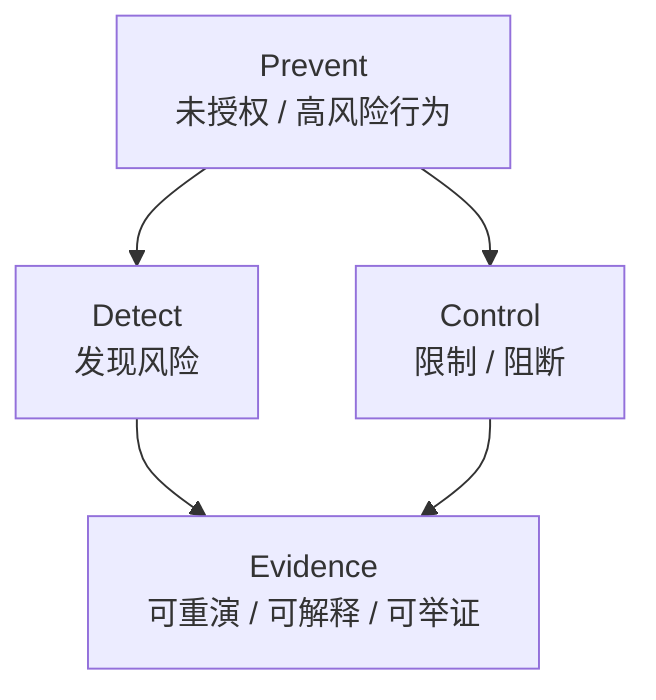
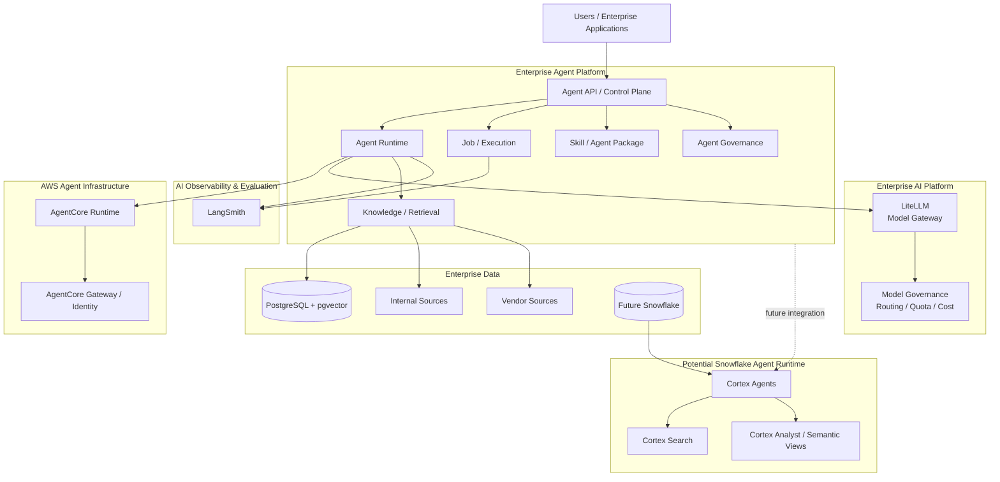
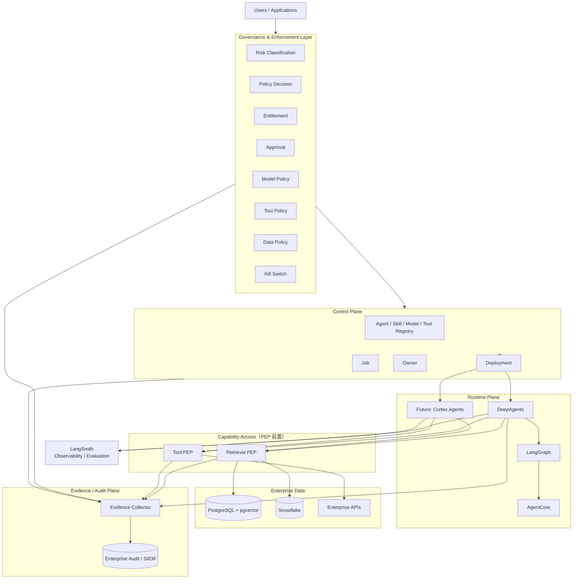
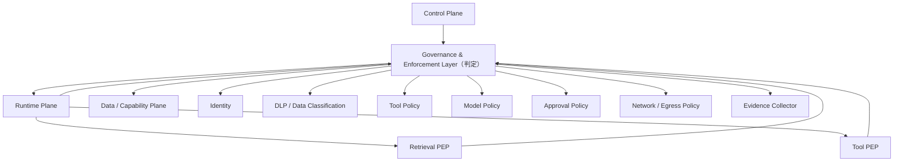
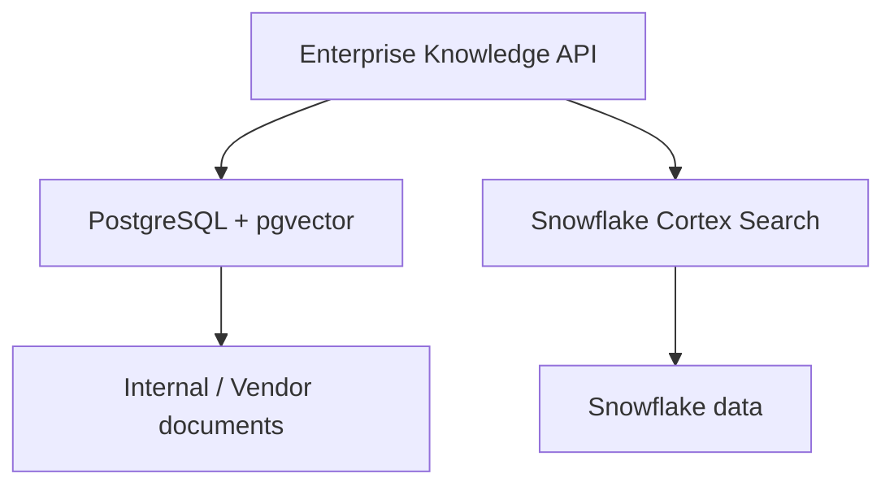
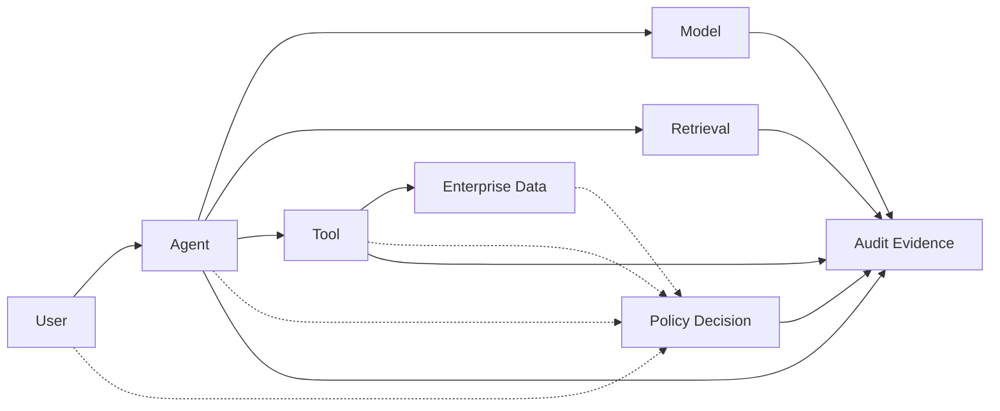
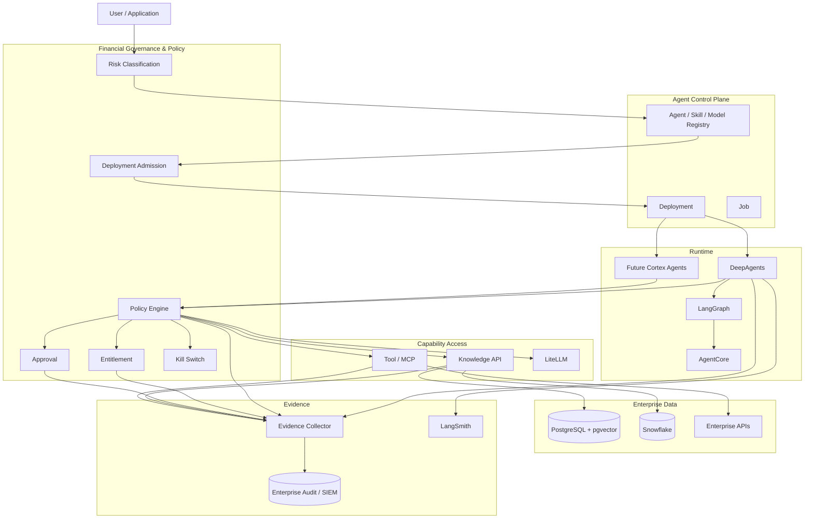
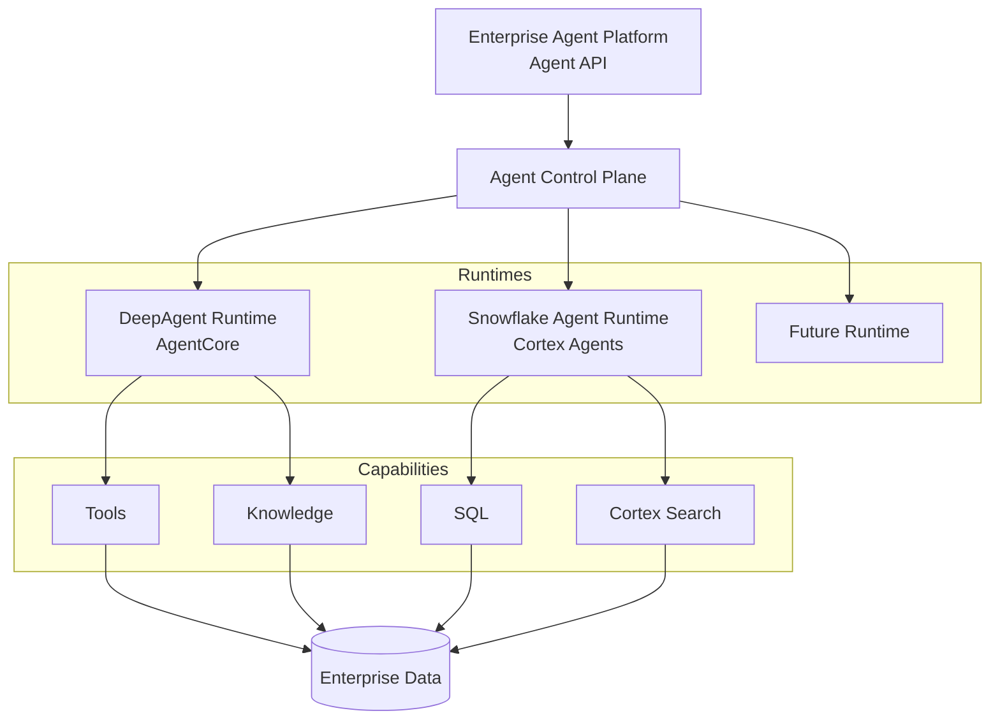

# Enterprise Agent Platform Risk Architecture Review

本文面向金融服务场景，基于当前实际技术栈（LiteLLM / FastAPI / LangChain Deep Agents / LangGraph / AWS Bedrock AgentCore / LangSmith / PostgreSQL + pgvector）做出判断，并针对未来接入 Snowflake Cortex Agents 的路径给出边界设计与风险控制设计。

与上一版相比，本版在三处收紧：把「Policy Plane」改名为 **Governance & Enforcement Layer** 并拆开判定归属；把平台定位从 Runtime-neutral 修正为 **Runtime-aware, Runtime-independent**；把 Architecture Invariants 从八条补到**十二条**，并新增 Memory Integrity 与 Fail-Closed 两个 P0。全文的最高层原则是一句话 —— **Agent 是不可信的决策参与者，而不是安全边界**。

## 1. Executive Summary

### Current maturity

上一版报告的结论是「技术底座已经基本完整，主要架构风险是多个平台之间的职责边界、运行模型与治理模型」。这个判断在技术层面成立，但对金融机构来说还不够。

补上金融风险与监管视角之后，结论需要再往前走一步。先明确一件容易被误解的事：

> **这一版不建议再增加一堆独立安全产品。真正需要补强的是「控制点」——把原则落实成几个确定性的 Enforcement Point，并让这些控制点产生可审计的证据。**

在此之上，核心判断是：

> **当前 Agent Platform 的技术底座已经基本完整。下一阶段架构风险的核心不是缺少某个 Agent Framework，而是如何把金融机构既有的模型风险管理、ICT 风险管理、数据治理、访问控制、第三方风险管理与审计要求，映射到 Agent 的完整生命周期。**

### 最高层 Architecture Principle

在进入具体控制点之前，先立一条比控制点更上层的原则。AWS Agentic AI Lens 对 trust boundary 的表述是：**Agent 本身不是 trust boundary**，所有输入都应被视为 untrusted，所有输出都应被视为 potentially harmful；identity、memory、tools、channels 必须按 trust boundary 分区，并在 intent → action 之间叠加确定性的 enforcement。([AWS Documentation][34])

因此本报告的最高层原则是：

> **Agent 是不可信的决策参与者，而不是安全边界。**
>
> **所有真正的安全边界必须由 Identity、Policy、PEP、Data Entitlement、Runtime Isolation 与 Evidence 建立。**

这句话修正了本报告早前的一个表述。之前写的是「Agent 可以自主推理，但不能自主突破权限」——方向正确，但容易被读成「Agent 是可信主体，只是被禁止越权」。更准确的说法是：Agent 是流程中能力最强、但**不能作为信任依据**的参与者，因此它每一次对外动作都需要外部控制点授权。

于是全文的安全论证可以压缩成一句：

> Agent 可以推理、可以规划、可以调用能力；但**它可以做什么，不由它自己决定**。

支撑这个结论的事实没有变，只是含义变了：

- LangSmith 已经集成 → Observability / Evaluation **不再是缺失能力**，但它的定位需要与 Audit Evidence 分开。
- PostgreSQL + pgvector 已经是当前 Hybrid Search 的基础设施 → 当前更准确的定位是 Agent Platform 内的 **Knowledge / Retrieval Capability**。
- MCP 主要通过流程与架构 Pattern 治理 → **不需要再造重型 MCP Gateway / Tool Registry Platform**。
- Snowflake / Cortex Agents 可能接入 → 需要设计 **「自建 Agent Runtime 与 Data-Native Agent Runtime 并存」**。
- AgentCore + LangSmith + PostgreSQL + LiteLLM 构成的技术底座已经比较成熟 → 审核重点从「缺什么组件」转向 **「边界、控制与举证是否闭环」**。

判断口径因此经历了三个阶段：

| 阶段 | 核心问题 | 报告定位 |
| --- | --- | --- |
| 技术选型 | 我们还缺哪些 Agent 能力？ | Agent Framework 选型 |
| 平台边界 | 这些能力分别由谁负责？ | 平台架构评审 |
| **风险与治理** | **发生风险时，机构能不能证明它知道自己在做什么、能限制它、能追溯它、能解释它、能及时停止它？** | **金融风险架构评审** |

因此平台的分层也需要相应升级：

```text
                    Enterprise Agent Platform

┌─────────────────────────────────────────────────────────┐
│              Governance & Enforcement Layer（横切）     │
│  Risk │ Policy │ Entitlement │ Approval │ Model │ Tool   │
│  Data Policy │ Kill Switch                               │
└──────────────────────────┬──────────────────────────────┘
                           │
┌──────────────────────────▼──────────────────────────────┐
│                    Control Plane                        │
│  Agent │ Skill │ Model │ Tool │ Deployment │ Job │ Owner │
└──────────────────────────┬──────────────────────────────┘
                           │
┌──────────────────────────▼──────────────────────────────┐
│                     Runtime Plane                       │
│  DeepAgents → LangGraph → AgentCore                     │
│              Future: Cortex Agents                      │
└───────────────┬─────────────────────┬───────────────────┘
                │                     │
        ┌───────▼───────┐     ┌───────▼────────┐
        │ Retrieval PEP │     │   Tool PEP     │
        └───────┬───────┘     └───────┬────────┘
                │                     │
          PG / pgvector           MCP / API
          Snowflake               Enterprise APIs
                │                     │
                └──────────┬──────────┘
                           │
                   Enterprise Data

             ┌───────────────────────┐
             │ Evidence / Audit Plane │
             │ immutable audit trail  │
             │ policy decisions       │
             │ execution evidence     │
             └───────────────────────┘

             LangSmith — observability / evaluation（独立）
```

其中两条变化最关键：

> **Governance & Enforcement Layer 横切 Control、Runtime 与 Data。**
>
> **Audit / Evidence Plane 独立于 LangSmith。**

### 金融 Agent Platform 的核心安全目标

整个安全与治理部分围绕四件事展开：



**Prevent / Detect / Control / Evidence** 是本报告安全部分的主轴。任何一项安全或治理设计，都要能回答它落在四件事中的哪一件上；回答不了的，通常只是「看起来像控制」，而不是控制。

### 按风险口径重新打分

在上一版成熟度表的基础上，补上金融风险维度：

| 能力 | 现状 | 判断 | 金融风险类别 | 风险 |
| --- | --- | --- | --- | --- |
| LiteLLM 作为统一 Model Gateway | 已有 | 定位正确 | Third-party | 低 |
| Deep Agents 作为 Agent Harness | 已有 | 定位正确 | — | 低 |
| AgentCore 作为 Agent Runtime | 已有 | 定位正确，不应自建 microVM / session | Cyber | 低 |
| FastAPI 作为 Platform API | 已有 | 定位正确，但**不应承载 Runtime** | Operational | 低 |
| **LangSmith 承担 Observability / Evaluation** | 已集成 | 能力已具备，**不再是缺口** | Model / AI | 低 |
| **PostgreSQL + pgvector 作为 Knowledge 基础设施** | 已建成 | 当前阶段合理，无需拆分 | Data | 低 |
| ZIP 上传 Skill | 已有 | 必须改变安全 / 版本模型 | Cyber（供应链） | **高** |
| Job 执行 | 已有 | 不能只是 FastAPI BackgroundTask | Operational Resilience | **高** |
| **Control Plane / Runtime Plane / Data Plane 边界** | 未定义 | **当前最大风险** | Operational | **高** |
| **Runtime abstraction** | 未定义 | 接入 Snowflake 之前必须定义 | Operational | **高** |
| Agent / Skill / Deployment immutable version | 部分 | 需要补齐 artifact 与 rollback | Audit / Regulatory | **高** |
| Identity / Authorization | 部分 | 需要「平台权限 + 数据平台原生权限」双层 | Data / Privacy | **高** |
| 与 LangSmith Deployment 的重复度 | 未评估 | 需要明确分工，避免重复造 | Operational | 中高 |
| PostgreSQL / LangSmith / Snowflake 数据职责 | 未定义 | 接入 Snowflake 前必须明确 | Data | 中高 |
| MCP 治理 | 走架构 Pattern | 模式合理，需补最小执行元数据 | Cyber / Operational | 中 |
| **AI Use Case Risk Classification** | 未定义 | **所有安全策略的第一道闸门** | Regulatory / AI | **高** |
| **Governance & Enforcement Layer（Policy Decision + PEP）** | 未定义 | 技术控制的核心落点 | Cyber / Conduct | **高** |
| **Deployment Admission Controller** | 未定义 | 未批准 Agent 不得进生产 | Operational | **高** |
| **Model Registry / Approved Model** | 部分（LiteLLM 只解决连通性） | 需要 Model Governance | Model Risk | **高** |
| **Audit / Evidence Architecture** | 未定义 | Trace ≠ Audit Evidence | Audit / Regulatory | **高** |
| **Kill Switch** | 未定义 | 必须是 deterministic 基础设施控制 | Operational | **高** |
| **Third-party AI Provider Governance** | 未定义 | OpenAI / Anthropic / AWS / Snowflake 全在供应链内 | Third-party | **高** |

### Main architectural risks

**风险一：平台职责边界没有先定义，正在同时被五个组件承担。**

```text
AgentCore 做一点
LangGraph 做一点
FastAPI 做一点
LangSmith 做一点
LiteLLM 做一点
```

如果 ownership 不先定下来，最终会出现 3 套 state、2 套权限、2 套 tracing、2 套 job system。

**风险二：接入 Snowflake Cortex Agents 之后，三处边界可能同时失效。**

- Runtime 边界：Cortex Agents 本身就是一个 managed agent platform，不是「Snowflake 里的 LLM API」。如果仍按单一 Runtime 建模，Agent API 会被迫暴露两套运行语义。
- 权限边界：Cortex Agents / Cortex Search 有自己的 Snowflake privilege 与 execution context 治理模型，「在 Agent Platform 授权一次就代表全部授权」不成立。
- 检索边界：PostgreSQL + pgvector 与 Cortex Search 必须能被同一层抽象调用，否则每个 Agent 会各自绑定一个检索提供方。

**风险三：可能正在重复建设 LangSmith Deployment 已经提供的那一层。**

LangSmith Agent Server 已经提供 Postgres、Task Queue、Runs、Threads、Assistants、Cron Jobs、Persistence，并采用 API server + queue worker + Redis + PostgreSQL 的运行模型。([Docs by LangChain][4]) 如果自建那一层的理由只是「需要一个 `/run-agent` API 和 Job API」，那部分是重复建设。

**风险四：MCP 若按重型技术 Registry 建设，会与既有的架构 Pattern 治理冲突。**

治理靠流程、模板和 Reference Architecture 已经成立时，再建一套 MCP Governance Platform 会形成两个权威源。

**风险五：Agent 的自主性没有被纳入模型风险与操作风险管理框架。**

传统 Model Risk Management 只覆盖「输入 → 模型 → 输出」。Agent 的执行链是「Agent → LLM → Tool → LLM → Retrieval → LLM → Tool → Action」，风险构成不再只是 Model Risk，而是 Model Risk + Tool Risk + Data Risk + Workflow Risk + Autonomy Risk（第 9.2 节）。如果治理框架仍按传统模型审批来写，Agent 的行为边界实际上是无人负责的。

**风险六：缺少「用例风险分级」这道闸门。**

平台目前没有统一的 Use Case 风险分级，导致所有安全策略只能在「按最高标准一刀切」和「按最低标准放行」之间摆动。这是金融服务场景下最先必须补上的一层（第 9.1 节）。在本版中它被收进部署准入链，作为 P0-5 Deployment Admission 的第一步判定输入（第 4.7 节）。

**风险七：原则停留在理念层，没有对应的 Enforcement Point。**

「Agent 可以自主推理，但不能自主突破权限」这类判断如果只写在架构文档里、运行时不执行，它就不是控制，而是价值观。要变成控制，必须落到三个具体位置：**判定的地方**（Governance & Enforcement Layer）、**拦截的地方**（Retrieval PEP / Tool PEP）、**留证的地方**（Evidence Collector）。三个位置缺任何一个，原则都无法被验证（第 3.5、7.3、8.4、12.4 节）。

### Key recommendations

按优先级收敛为**十个控制点**，与第 18 章的 P0 一一对应：

| # | 建议 | 章节 |
| --- | --- | --- |
| 1 | **Policy Enforcement** —— 把 Model / Data / Tool / Action 纳入 deterministic policy 执行，LLM 不能产生最终判定 | 第 3.1、3.5 节 |
| 2 | **Identity + Entitlement** —— 明确 User / Agent / Runtime / Tool 四层身份与 Entitlement Context | 第 10.1、7.3 节 |
| 3 | **Retrieval Authorization** —— 权限过滤进入 Retrieval Query，而不是生成后过滤 | 第 7.3 节 |
| 4 | **Tool Action Authorization** —— Tool PEP 在运行时判定高风险动作 | 第 8.3、8.4 节 |
| 5 | **Deployment Admission** —— 未批准 Agent 不得进生产 | 第 4.7 节 |
| 6 | **Audit Evidence** —— Policy Decision 本身也必须留证，Trace ≠ Evidence | 第 12.4、12.5 节 |
| 7 | **Kill Switch** —— 确定性停止能力，不依赖 LLM | 第 10.8 节 |
| 8 | **Skill Supply Chain** —— 防止 ZIP → arbitrary code execution | 第 10.6 节 |
| 9 | **Memory Isolation / Integrity** —— 长期 Memory 必须分区、可校验、可检测污染 | 第 10.9 节 |
| 10 | **Fail-Closed Semantics** —— 关键控制依赖不可用时，高风险动作必须拒绝 | 第 3.5、11.3 节 |

其中第 9、10 两项为本版新增：前者是最明显的一处 AWS Agentic AI Lens 漏项，后者回答「Policy 系统挂了怎么办」这个金融系统必须回答的问题。

同时保留上一版在工程侧的三条收敛判断：先定边界再谈能力（第 3 章）、定义 Runtime abstraction（第 5.4 节）、把 MCP 治理保持为架构治理（第 8 章）。

完整的 P0 / P1 / P2 见第 18 章；各域成熟度评分见第 18 章开头的对照表。

同时保留上一版在工程侧的三条收敛判断：先定边界再谈能力（第 3 章）、定义 Runtime abstraction（第 5.4 节）、把 MCP 治理保持为架构治理（第 8 章）。

完整的 P0 / P1 / P2 见第 18 章。

## 2. Current Platform Landscape

整个体系由两个企业平台组成：

```text
Enterprise AI Platform
        │
        │ Model Access / Model Governance
        ▼
     LiteLLM
        │
        ▼
Enterprise Agent Platform
        │
        ├── Agent Definition / Skill
        ├── Agent Runtime
        ├── Job / Execution
        ├── Knowledge / Retrieval
        ├── Governance
        └── Observability / Evaluation
        │
        ├──────── LangSmith
        ├──────── AgentCore
        ├──────── PostgreSQL / pgvector
        └──────── Future: Snowflake / Cortex Agents
```

当前体系不是一个单纯的 Agent Framework，而是由两个企业平台组成。右侧的四个组件就是它现在的落地方式：Observability / Evaluation 由 LangSmith 承担，Runtime 由 AgentCore 承担，Knowledge / Retrieval 建立在 PostgreSQL + pgvector 上，Snowflake / Cortex Agents 是未来需要提前纳入边界的第二组能力。

### 2.1 Enterprise AI Platform

定位：

> **Model & AI Gateway**

主要职责：

```text
Model Provider abstraction
Model routing
Credentials
Quota
Cost
Model policy
Provider governance
```

底层：

```text
LiteLLM
   │
   ├── OpenAI
   ├── Claude
   ├── Gemini
   └── Other LLM providers
```

这一层的判断没有变化：用 LiteLLM 统一收敛模型入口是正确的，模型路由、凭据、配额、成本与 provider 治理都应该留在这里，而不是下沉到每个 Agent。

### 2.2 Enterprise Agent Platform

定位：

> **Agent Runtime & Application Platform**

负责：

```text
Agent definition
Skill
Agent execution
Job execution
Knowledge / Retrieval
Tool / MCP integration
State
Observability
Evaluation
Agent lifecycle
```

核心技术：

```text
FastAPI
   │
Deep Agents / LangGraph
   │
AWS AgentCore
   │
LangSmith
   │
PostgreSQL + pgvector
```

这个定位比上一版报告的：

> Agent Control Plane + Runtime + Tool/Data + RAG/Search + Job

更准确。差别在三点：

- **LangSmith 已经是组成部分**，不是「需要补齐的外部能力」。它承担 trace、evaluation、dataset、feedback 与部署侧运行模型。
- **PostgreSQL / pgvector 已经是平台正式的数据与检索基础设施**，不是「未来待拆的实验模块」。它同时承载 agent metadata、state、job metadata 与 knowledge metadata。
- **Tool / MCP 这一层是「接入与执行」**，不是「另建一套治理体系」。治理走架构 Pattern，平台负责执行这些标准。

### 2.3 LangSmith

LangSmith 在当前体系里承担两类职责：

```text
Observability / Evaluation
├── tracing
├── offline evaluation
├── online evaluation
├── datasets
├── feedback
└── monitoring
```

以及部署侧已经具备的运行模型：

```text
Agent Server
├── Postgres
├── Task Queue
├── Runs
├── Threads
├── Assistants
└── Cron Jobs
```

因此本报告不再把 Observability / Evaluation 列为 P0/P1 缺口，改为在**第 12 章**审查「LangSmith 与 AgentCore、Enterprise Platform 如何分工」。

### 2.4 AgentCore

AgentCore 在当前体系里承担 Agent Runtime：

```text
Runtime
Identity
Gateway
Memory
Browser
Code Interpreter
Observability
```

AgentCore Runtime 是专门的 Agent 执行环境，支持 session isolation、identity、observability，并支持 LangGraph、CrewAI、Strands 等框架；Runtime 可以直接支持多种框架，模型也不要求绑定 Bedrock，可以接 OpenAI、Gemini、Claude 等。([AWS Documentation][1])

结论：

> **选 AgentCore 作为 Runtime 底座是合理的，不应该自建 microVM isolation / agent runtime / session infrastructure。**

需要重新判断的是 Gateway 部分：AgentCore Gateway 已经把 tools / agents / models 的访问入口、多 MCP target 聚合、policy-based authorization 与 observability 产品化。([AWS Documentation][21]) 所以问题不是「要不要建 Gateway」，而是「哪些 Gateway 能力直接用 AgentCore，哪些必须由 Enterprise Agent Platform 自己实现」。

### 2.5 PostgreSQL + pgvector

PostgreSQL + pgvector 现在是平台的正式组件，承担：

```text
PostgreSQL
    │
    ├── Agent metadata
    ├── Agent state
    ├── Job metadata
    ├── Knowledge metadata
    ├── Document metadata
    └── pgvector
          └── embeddings
```

但要注意一条边界：

> **不要把 PostgreSQL 变成「什么都存」。**

未来接入 Snowflake 之后的正确分工是：

```text
Transactional / operational state
        ↓
PostgreSQL

Enterprise analytical / data warehouse
        ↓
Snowflake

Agent trace / evaluation
        ↓
LangSmith
```

### 2.6 Future Snowflake / Cortex

Snowflake 的定位需要提前写清楚，因为它直接决定 Runtime、Agent API、权限与 observability 的设计：

> **Snowflake Cortex Agents 应该被视为「潜在的第二 Agent Runtime」，而不是简单的数据源或 LLM Provider。**

原因：Cortex Agents 目前是一个完整的 managed agent platform，可以调用 Cortex Search、使用 Cortex Analyst / semantic views、使用 SQL、调用 tools、管理 threads，并在 Snowflake governed environment 中执行。([Snowflake Documentation][17]) 而且 Snowflake 已明确建议从 Cortex Analyst 向 Cortex Agents 迁移，把 structured data 与 unstructured data retrieval、tool calling 与 orchestration 都放进 Cortex Agents。([Snowflake Documentation][18])

因此：

> **Snowflake Cortex Agents 不应该画在 AI Platform 下面。**

它应该画成 **Enterprise Data Platform 内的一种 Data-Native Agent Runtime / Agent Capability**。这是后续架构审核中非常重要的一点。

### 2.7 平台边界图

当前最推荐用这张图，而不是上一版报告里那张把 Retrieval、MCP Gateway、Observability 全部并列成独立平台服务的图：



这张图相对上一版有三处关键变化：

| 变化 | 上一版 | 本版 |
| --- | --- | --- |
| Observability / Evaluation | Agent Platform 内待建的一个模块 | 独立的 `AI Observability & Evaluation` 层，由 LangSmith 承担 |
| Retrieval | 独立的 `Retrieval Service` | Agent Platform 内的 `Knowledge / Retrieval` Capability，底层是 PostgreSQL + pgvector |
| Snowflake | 未出现，或被视为数据源 | `Potential Snowflake Agent Runtime`，与自建 Runtime 并列 |

## 3. Target Architecture

（平台分层：四个纵向平面 + 横切 Governance & Enforcement Layer + 独立 Evidence / Audit Plane）

这一章是本报告的主框架。这一版的平面模型在上一版基础上做了两处收紧：

```text
Governance & Enforcement Layer   横切（判定 + 执行）
        ↓
Control Plane
        ↓
Runtime Plane
        ↓
Retrieval PEP / Tool PEP / Egress PEP
        ↓
Enterprise Data

Evidence / Audit Plane           独立于 LangSmith
```

四个平面各自回答一个问题，且不能互相兼任：

```text
Control Plane                有什么、谁能跑
Runtime Plane                怎么跑
Data Plane                   能访问什么
Governance & Enforcement     这一次动作能不能做、在哪里被拦
Evidence Plane               事后能不能证明
```

**这一版收紧的两处**

1. **「Policy Plane」改名为「Governance & Enforcement Layer」。** 原因见第 3.1 节：Policy 是逻辑概念，一旦叫成「Plane」，就会被读成一个新的、拥有全部判定权的系统，从而与 AI Platform 的 Model Governance、IAM / Data Platform 的 Enterprise Entitlement 打架。
2. **执行点补齐第三个：Egress PEP。** 上一版只写了 Retrieval PEP 与 Tool PEP，但内容离开企业边界同样是一个必须判定的位置（第 10.4、10.7 节）。

平面的名字变了，但「判定 / 执行 / 举证」三件事的分工没有变：

```text
判定在哪   Governance & Enforcement Layer
拦截在哪   Retrieval PEP / Tool PEP / Egress PEP
留证在哪   Evidence Collector
```



### 3.1 Governance & Enforcement Layer

这一层是金融场景与通用 Agent 平台差别最大的地方。它回答：

```text
Is this action permitted, for this subject, under this purpose, right now?
```

但它**不是一个新系统，更不应该形成一个新的「万能 Policy Owner」**。上一版把 Model Policy 列在这一层，同时又在第 6 章写「Model policy 归 AI Platform」，两处读起来是冲突的。根因是三种不同性质的 policy 被混在了一个词里：

```text
Model approval policy        → 模型能不能用于这个用例
Agent authorization policy   → 这个 Agent / 这个用户可以做什么
Runtime action policy        → 这一次动作此刻允不允许
```

本版把它们彻底拆开，并明确四个归属：

| 判定 | 归属 | 内容 |
| --- | --- | --- |
| Model Governance | Enterprise AI Platform | approved model、provider、region、data policy、model quota |
| Agent / Action Governance | Enterprise Agent Platform | who can run、which data、which tools、which actions、approval |
| Enterprise Entitlement | IAM / Data Platform | subject × resource 的原生 entitlement source |
| Enforcement | Runtime / PEP | Tool PEP、Retrieval PEP、Egress PEP |

```text
Enterprise AI Platform
    └── Model Governance
          ├── approved model
          ├── provider
          ├── region
          ├── data policy
          └── model quota

Enterprise Agent Platform
    └── Agent / Action Governance
          ├── who can run
          ├── which data
          ├── which tools
          ├── which actions
          └── approval

IAM / Data Platform
    └── Enterprise Entitlement

Runtime
    └── Enforcement
          ├── Tool PEP
          ├── Retrieval PEP
          └── Egress PEP
```

需要写清楚的一句话是：

> **Policy 是逻辑概念，不是一个组织单元。**
>
> **AI Platform owns Model Governance；Agent Platform owns Agent / Action Governance；IAM 与 Data Platform owns Enterprise Entitlement；Runtime 与 PEP 负责 Enforcement。**

也就是说，Agent Platform 只**消费** Model Governance 的判定结果，不拥有它；Model Policy 出现在这一层的判定项里，是因为每一次动作判定都要引用它（第 6.1 节）。

这一层包含的判定项：

```text
Risk Classification      这个用例属于哪一档风险
Policy Decision          这次动作 ALLOW / DENY / REQUIRE_APPROVAL
Entitlement              subject × agent × purpose × resource × action
Approval                 高风险动作的人工作业节点
Model Policy             模型是否获批用于该用例（来自 AI Platform）
Tool Policy              工具是否获批、以什么行为模式调用
Data Policy              数据分级、用途限制、留存要求
Kill Switch              异常情况下的确定性停止
```

四个必须写清楚的边界：

**1. 判定不是建议。**

```text
LLM 可以：suggest / classify / reason
LLM 不能：产生最终的 ALLOW / DENY
```

如果把最终判定交给模型，等价于「让被监管对象自己写合规结论」。NIST AI RMF 把 Govern 作为贯穿生命周期的横向职能，而不是某个模型内部的功能，并要求持续 Govern / Map / Measure / Manage。([NIST AI RMF Core][27])

**2. 它是一组控制点，不是一套新服务。**

它横切三层，但早期不必拆成独立微服务。落地形态可以是：

```text
FastAPI middleware        ← Control Plane 的准入判定
Tool middleware           ← 工具调用前的动作判定
Retrieval middleware      ← 检索前的数据判定
Runtime Guard             ← Runtime 外围的持续判定（第 5.5 节）
```

**3. 判定的可用性也是设计的一部分。**

判定本身可能不可用（Policy Engine 超时、Approval 服务不可用）。这类情况如何处理必须在架构里写死，不能留给运行时随机决定 —— 见第 3.5 节的 Fail-Open / Fail-Closed 语义。

**4. 判定产物必须留证。**

每一次判定都要留下 subject / agent / agent_version / action / resource / purpose / data_classification / decision / policy_id / policy_version。只记录「工具被调用过」是不够的，要能回答「**凭什么允许**」。这部分进入 Evidence / Audit Plane（第 3.6 节、第 12.4 节）。

### 3.2 Control Plane

管理：

```text
What agent exists?
Which version?
Who owns it?
Who can deploy?
Who can run?
Which policy?
Which runtime?
```

Control Plane 是平台自己必须拥有的部分，也是当前最值得投入工程资源的部分。

本版在这一层新增一个判定环节：**Deployment Admission**（第 4.7 节）——生产部署不再是一次 API 调用，而是一次准入决定。

### 3.3 Runtime Plane

负责：

```text
How does the agent execute?
```

Runtime Plane 的成员是**可替换的 Runtime Provider**，而不是平台的私有机能：Deep Agents / LangGraph、AgentCore、以及未来的 Cortex Agents 都属于这一层。平台不应该把自己的编排能力写死在某一个 Runtime 上。

Runtime 外围还需要一层不做推理的 **Runtime Guard**（第 5.5 节）。

### 3.4 Data / Capability Plane

负责：

```text
What can the agent access?
```

这一层包含 Knowledge / Retrieval、MCP / Enterprise APIs、LiteLLM 与 Enterprise Data。它的输出是**受治理的访问能力**，不是数据副本。

注意这一层的出口已经由两个 PEP 前置（第 3.5 节）：Retrieval 之前、Tool 执行之前都必须经过判定。

### 3.5 Policy Enforcement Points（PEP）

Governance & Enforcement Layer 解决的是「判定从哪里来」，PEP 解决的是「判定在哪里被执行」。后者是这一版最需要落到工程上的部分。

**统一判定入口**

```text
                   Request
                     │
                     ▼
              Policy Enforcement
                     │
        ┌────────────┼────────────┐
        ▼            ▼            ▼
      Model         Data         Tool
      Policy       Policy        Policy
        │            │            │
        └────────────┼────────────┘
                     ▼
           ALLOW / DENY / APPROVE
```

每一次敏感操作都必须经过这个点。判定请求本身应该是一个结构化对象，而不是自由文本：

```json
{
  "subject": "user-123",
  "agent": "research-agent",
  "agent_version": "3.2.1",
  "action": "read",
  "resource": "client_portfolio",
  "purpose": "equity-research",
  "data_classification": "confidential",
  "decision": "deny",
  "policy": "data-policy-v17"
}
```

这比在系统提示词里写「不要访问客户数据」可靠得多：前者可拒绝、可留证、可回归测试；后者只是一句希望。

**三个前置 PEP**

```text
Retrieval PEP    → 数据进入 Agent context 之前（第 7.3 节）
Tool PEP         → 工具真正执行之前（第 8.4 节）
Egress PEP       → 内容离开企业边界之前（第 10.4、10.7 节）
```

三者位置不同，但共用同一套 policy 语义与同一条 evidence 格式。

**一次判定的完整链路**



金融环境不能依赖：

```text
Agent prompt：
"请不要做危险的事。"
```

而必须是：

```text
Agent wants action
       ↓
Policy enforcement
       ↓
ALLOW / DENY / APPROVE
```

> **Prompt 是行为指导，Policy 才是控制。**

这条区分是本报告后面所有安全章节的前提：凡是希望「Agent 不要做某件事」的要求，最终都要落成一个可执行、可拒绝、可审计的 policy 判断，而不是一句提示词。

**Policy availability semantics：依赖不可用时怎么办**

前面所有判定都建立在一个假设上：Policy 系统是活的。而金融系统必须回答的问题是：

> **Policy Engine 挂了，Agent 还能不能继续跑？**

上一版只写了 ALLOW / DENY / APPROVAL，没有回答这一条。本版明确按风险分档：

```text
Policy dependency unavailable
   │
   ├── LOW + READ        → fail open / degraded（可选，且必须留证）
   ├── MEDIUM            → restricted（只允许已缓存、已批准的窄路径）
   ├── HIGH              → fail closed（DENY）
   └── CRITICAL          → fail closed（DENY）
```

典型链路：

```text
Tool PEP
    ↓
Policy unavailable
    ↓
HIGH-risk action
    ↓
DENY
    ↓
Evidence（记录降级原因与判定主体）
```

不允许出现的是：

```text
Policy Engine timeout
     ↓
Agent continues
```

同样的语义适用于另外三个依赖：

| 依赖不可用 | 处置 |
| --- | --- |
| Policy Engine | 按上表分档，HIGH / CRITICAL fail closed |
| Approval 服务 | 高风险动作 fail closed（第 11.3 节） |
| Evidence Collector | 高风险动作 fail closed，且必须本地暂存后补写（写不进去 ≠ 可以放行） |
| Identity / Entitlement 源 | fail closed，不允许回落到缓存权限 |

这条语义必须成为 Architecture Invariant（第 19.6 节 Invariant 10）。否则「可拒绝」只是演示环境里的行为：演示时 Policy 永远在线，生产里第一次超时就会暴露真实语义。

### 3.6 Evidence / Audit Plane

这一层与 LangSmith 不是同一个东西，这是本版需要明确写死的一条边界：

```text
LangSmith
   │  engineering telemetry
   ▼
Observability / Evaluation

Runtime / Policy / IAM / Approval / Retrieval / Tool
              │
              ▼
       Evidence Collector
              │
              ▼
      Enterprise Audit Store
```

分工：

| | 归属 | 内容 |
| --- | --- | --- |
| 工程可观测性 | LangSmith | trace、evaluation、dataset、debug |
| 审计证据 | 企业审计系统 | identity、policy decision、approval、resource、action、outcome |

> **Engineering telemetry 不能自动等同于 regulatory audit evidence。**

需要说明的是，这一层**不需要现在就去建一个新的审计数据库或审计微服务**。合理的做法是：

```text
PostgreSQL          → 运营元数据
LangSmith           → Trace / Evaluation
企业审计系统 / SIEM  → Audit Evidence
```

重点是先把 **ownership、schema、retention、immutability、access control** 定义清楚，物理实现交给企业已有的 SIEM / Data Lake / WORM 存储决定。（详细设计见第 12.4、12.5 节。）

### 3.7 平面模型与既有认知的对应关系

| 平面 | 回答的问题 | 当前实现 | 需要新增的判断 | 归属 |
| --- | --- | --- | --- | --- |
| Governance & Enforcement Layer | 这次动作允不允许、在哪里被拦 | 未统一定义（分散在模型、工具、网络各侧） | Risk / Policy / Entitlement / Approval / Model / Tool / Data / Kill Switch 的统一判定、Fail-Closed 语义与留证 | 判定归属见第 3.1 节 |
| Control Plane | 有什么 Agent、谁能跑 | 自建 FastAPI | Agent / Skill / Deployment / Run / Job 生命周期与版本模型，以及 Deployment Admission | Agent Platform |
| Runtime Plane | Agent 怎么执行 | DeepAgents + LangGraph + AgentCore | Runtime abstraction（AgentExecutionContract + CapabilityContract）、Runtime Guard、治理边界（第 5.6 节） | Runtime Provider |
| Data / Capability Plane | Agent 能访问什么 | PostgreSQL + pgvector、MCP、LiteLLM | Retrieval abstraction、Entitlement Context、Retrieval / Tool / Egress PEP | 平台 + 数据平台 |
| Evidence / Audit Plane | 事后能不能证明 | 未定义（与 LangSmith 混在一起） | Evidence Collector 与独立 Audit schema（含 Policy Decision 原因码） | 企业审计 / 3rd Line |

## 4. Agent Lifecycle

### 4.1 Skill / Agent / Deployment 必须拆成三个概念

推荐的生命周期：

```text
Skill
  ↓
Agent Definition
  ↓
Agent Version
  ↓
Deployment
  ↓
Run
  ↓
Job
```

例如：

```text
Skill:
financial-research@1.4.2

Agent:
InvestmentResearchAgent

Agent Version:
v12

Deployment:
prod

Run:
run-78291

Job:
job-10291
```

区分它们是可回滚的前提：

```text
prod → v12
         ↓
         rollback
         ↓
       v11
```

### 4.2 Immutable Artifact 与版本模型

AgentCore 本身已经采用 immutable runtime version 的思路，用版本保存完整配置并支持 rollback。([AWS Documentation][3]) 平台侧应该保持同样的模型：

```text
Skill
├── metadata
├── instructions
├── tools
├── dependencies
├── permissions
├── runtime requirements
└── version
```

关键判断：

> **`prod` 指向的是一个 immutable 的 Agent Version，而不是一个可变的配置文件。**

### 4.3 Lifecycle 状态

```text
Draft
 ↓
Test
 ↓
Approved
 ↓
Published
 ↓
Deprecated
 ↓
Retired
```

### 4.4 State model 必须分开

```text
Agent definition
Agent memory
Conversation state
Run state
Job state
Artifacts
```

这几类 state 的所有者与生命周期不同。把它们混成一个「Agent 状态」，是在接入第二个 Runtime 之后最先出问题的地方。

### 4.5 Registry 概念模型

```text
Agent Registry
Skill Registry
Tool Registry
Model Registry
Knowledge Source Registry
Dataset Registry
Evaluation Registry
Policy Registry
Deployment Registry
```

一个 Agent 的完整引用关系：

```text
Agent
InvestmentResearchAgent
   │
   ├── Skill
   │     └── research@1.2.3
   │
   ├── Model
   │     └── claude-sonnet-x
   │
   ├── Tools
   │     ├── internal-search
   │     ├── market-data
   │     └── portfolio-api
   │
   ├── Knowledge
   │     ├── internal-research
   │     └── vendor-x
   │
   ├── Policy
   │     └── investment-policy-v4
   │
   └── Deployment
         └── prod-v17
```

这样平台才真正拥有一个 **Agent Supply Chain**。

注意：Registry 是 **Control Plane 的概念模型**，不需要每一个都做成独立服务。Tool Registry 尤其不应被做成重型平台（见第 8 章）。

### 4.6 Domain Model

前面所有能力最终都要求 Registry 里有一组明确的领域对象。建议至少新增：

```text
Agent
AgentVersion
SkillVersion
Deployment
Run
Policy
PolicyDecision
Approval
Resource
Action
Evidence
```

其中最重要的关系是：

```text
Agent
  │
  └── AgentVersion
          │
          ├── SkillVersion
          ├── ModelVersion
          ├── Policy
          └── Deployment
                  │
                  └── Run
                         │
                         ├── PolicyDecision
                         ├── Approval
                         ├── ToolInvocation
                         ├── Retrieval
                         └── Evidence
```

这个模型是前面所有控制能力的地基：PolicyDecision、Approval、Evidence 都挂在 Run 上，而不是散落在 trace 里。没有这层对象，「为什么允许」「谁批的」「当时跑的是哪个版本」都只能靠人工拼日志。

### 4.7 Deployment Admission Controller

现在 Agent 的部署路径大概是：

```text
Agent
 ↓
Deploy
```

金融场景下应该改成一条 admission 判定链：

```text
Agent
 ↓
Risk Classification
 ↓
Security Validation
 ↓
Evaluation
 ↓
Policy Validation
 ↓
Model Approval
 ↓
Data Access Approval
 ↓
Deployment Approval
 ↓
Deploy
```

也就是说：

> **Production deployment 必须是一个 admission decision，而不是一次 API 调用。**

判定结果本身应该是一个可以随 Agent 一起归档的对象：

```json
{
  "agent_version": "v12",
  "risk_level": "L2",
  "model_approved": true,
  "skills_approved": true,
  "tools_approved": true,
  "evaluation_passed": true,
  "security_scan_passed": true,
  "data_entitlements_configured": true,
  "memory_isolation_verified": true,
  "fail_closed_verified": true,
  "policy_version": "policy-v17",
  "deployment_decision": "APPROVED"
}
```

这样每个 Production Agent 天然带着一份 **Approval Package**：风险等级、模型批准、Skill 扫描、评估结果、数据授权、准入判定全部可回溯。这份对象也是第 12.5 节 Evidence Chain 的起点。

**Admission 尚未上线时的生产使用**

按第 18 章的口径，Admission 属于 P0；在它落地之前，生产使用不是排期问题，而是：

```text
Production Gate 未满足
      ↓
要么不上生产
要么走 exception process
      ↓
显式 risk acceptance（谁接受、什么风险、有效期多久、补偿控制是什么）
```

否则会出现最坏的一种状态：准入链写进了架构文档，生产里却已经有 Agent 在跑，而没有人对「它为什么被允许跑」负责。

## 5. Runtime Architecture

### 5.1 DeepAgents / LangGraph

Deep Agents 本身已经提供：

```text
planning
filesystem
subagents
memory
human-in-the-loop
skills
tools
```

而 Deep Agents 底层又是 LangGraph runtime。LangGraph 本身负责 state、checkpoint、streaming、interrupts 等。([Docs by LangChain][2])

因此平台**不需要**自建：

```text
custom agent loop
custom memory
custom checkpoint
custom runtime
custom sandbox
```

### 5.2 AgentCore

AgentCore 已经提供：

```text
runtime
session isolation
identity
gateway
observability
memory
browser
code execution
```

AWS 当前的 Runtime 已经把每个 session 放进隔离 microVM，并支持 workload identity。([AWS Documentation][1]) 所以 self-host 与 isolated runtime 这一层交给 AgentCore，平台不必重造。

### 5.3 Future Cortex Agents：Platform-native 与 Data-native 两类 Agent

Snowflake Cortex Agents 已经不是「Snowflake 里的 LLM API」。它目前是一个完整的 managed agent platform，可以调用 Cortex Search、使用 Cortex Analyst / semantic views、使用 SQL、调用 tools、管理 threads，并在 Snowflake governed environment 中执行。([Snowflake Documentation][17])

因此未来应该把 Agent 分成两类：

**Platform-native Agent**

```text
Agent Platform
  ↓
DeepAgents
  ↓
AgentCore
  ↓
LiteLLM
```

适合：

```text
general agent
external API
MCP
multi-step workflows
code execution
complex orchestration
```

**Data-native Agent**

```text
Snowflake
  ↓
Cortex Agents
  ↓
Cortex Search
  ↓
Semantic Views / SQL
```

适合：

```text
data analysis
research over enterprise data
SQL
structured + unstructured analytics
Snowflake-native governance
```

因此结论不是：

> 「未来 Snowflake Agent 是我们 Agent Platform 的替代品。」

而应该是：

> **Agent Platform 成为企业统一的 Agent Consumption / Governance Layer，同时允许不同 Runtime Provider 并存。**

但这句话有一个前提必须先说清楚：**治理能力能不能真正穿透 Runtime，是另一回事。** Cortex Agent 内部会自己调用 Cortex Search、SQL 与 tools，平台侧的 Tool PEP / Retrieval PEP / Evidence Collector 未必都能看到这些动作。这个问题在第 5.6 节单独处理，它决定「Runtime-neutral」这个说法到底是否成立。

### 5.4 Runtime abstraction

这是接入 Snowflake 之前必须完成的设计。建议结构：

```text
Agent
  │
  ▼
Agent Execution Contract
  │
  ├── DeepAgentRuntime
  │       └── AgentCore
  │
  ├── SnowflakeAgentRuntime
  │       └── Cortex Agents
  │
  └── FutureAgentRuntime
```

**接口不能只有「执行 CRUD」**

上一版给出的最小集合是：

```text
AgentRuntime（不够）
----------------------------
create_run()
get_run()
cancel_run()
resume_run()
stream_events()
get_result()
```

作为执行接口它是完整的，但作为 **Runtime abstraction** 不够 —— 因为 AgentCore 与 Cortex Agents 真正不一样的地方，恰恰不在 `create_run()`。至少还缺三类：

```text
状态与会话        get_session() / get_state() / checkpoint() / interrupt() / resume()
事件与运行信息    get_events() / get_metrics() / get_identity() / get_runtime_health()
能力声明          capabilities()
```

再加一组能力开关，用来表达「这个 Runtime 支持什么、不支持什么」：

```text
supports_human_approval()
supports_memory()
supports_tool_policy()
supports_streaming()
supports_long_running()
supports_async()
supports_cancel()
```

**更关键的一条：不要为了统一 API 而强行把 Runtime 的差异抹平。**

Runtime 之间真正的差异是**能力差异**，不是方法名差异。因此 abstraction 应该由两份契约组成：

```text
AgentExecutionContract      agent / version / input / identity / policy / run 生命周期
        +
CapabilityContract          runtime 到底支持哪些能力，以及不支持时的退化行为
```

例如：

```json
{
  "runtime": "snowflake-cortex",
  "capabilities": {
    "streaming": true,
    "human_approval": false,
    "long_running": true,
    "external_tools": true,
    "memory": "provider-managed"
  }
}
```

有了 Capability Contract，平台才能明确表达这类判断：

```text
这个 Runtime 不支持 human_approval
        ↓
要么在平台侧用 Approval Gate 补偿
要么该用例不得路由到它
```

否则将来一定会出现：

> 为了让 Cortex Agents「看起来像 AgentCore」，平台 API 开始堆大量特殊 case。

这会直接破坏平台的 Runtime-independent 定位，也是第 5.6 节要处理的问题。

这样平台 UI / API 不需要知道：

```text
这是 LangGraph？
这是 AgentCore？
这是 Cortex Agents？
```

平台只处理：

```text
Agent
Agent Version
Runtime
Capabilities
Run
Job
Policy
Trace
```

这个架构成熟度会比现在高一个层级，也是「Runtime-independent」这个定位能成立的技术前提。

### 5.5 Runtime Guard

Runtime 本体（DeepAgents → LangGraph → AgentCore）保持不变，但需要在它外围增加一层 Runtime Guard：

```text
                  Runtime Guard
                       │
       ┌───────────────┼───────────────┐
       ▼               ▼               ▼
    Model           Retrieval         Tool
    Policy           Policy           Policy
```

职责必须明确分离：

```text
Runtime Guard   →   Can this happen?     确定性判定
DeepAgents      →   What should I do?    推理与规划
```

Runtime Guard 不做 reasoning，只做判定与拦截。它不替 Agent 决定下一步做什么，只回答某一步是否被允许。这条分离是「LLM 不能产生最终 Allow / Deny」在运行时的具体形态。

### 5.6 Runtime Governance Boundary：Full-control 与 Managed Runtime

第 5.3 节说「允许不同 Runtime Provider 并存」，这句话在治理上是有条件的。

问题出在调用链深度。如果 Cortex Agent 内部自己调用 Cortex Search、SQL 与 tools：

```text
Platform
   ↓
Cortex Agent
   ↓
Cortex Search
   ↓
SQL
   ↓
Tool
```

那么平台侧的 Tool PEP、Retrieval PEP、Evidence Collector **未必看得到这些内部动作**。

因此必须补上一个明确的架构决策：

> **平台级治理是「全控制」还是「边界控制」？**

两类 Runtime 的结论不同。

**Full-control Runtime**（DeepAgents → LangGraph → AgentCore 这类平台可掌握的链路）

平台可以控制：

```text
identity
tool
retrieval
approval
policy
trace
```

**Managed Runtime**（Cortex Agents 这类 provider-managed agent platform）

平台只能控制：

```text
request admission
identity binding
approved configuration
input / output policy
deployment
outer trace
```

Runtime 内部行为依赖 provider-native control。

```text
                 Platform Governance
                          │
        ┌─────────────────┴──────────────────┐
        │                                    │
  Full-control Runtime                 Managed Runtime
  （平台全链路可判定）                  （平台只控制边界）
        │                                    │
  Tool PEP / Retrieval PEP            Admission / Identity binding
  Approval / Evidence                 I-O Policy / Deployment / Outer trace
```

这条边界直接产生一条 Invariant（第 19.6 节 Invariant 11）：

> **任何 Managed Runtime，如果其内部高风险动作既不能被平台外部强制、也不能由 provider-native 控制等价覆盖，就不能被视为「已受治理」。**

实际用法是两条：

1. 用 Capability Contract（第 5.4 节）逐项声明 Managed Runtime 的能力缺口。
2. 对缺口中有高风险的部分，要么在平台侧补偿（例如平台侧 Approval Gate），要么**限制该用例只能路由到 Full-control Runtime**。

AWS Agentic AI Lens 在 tool authorization、identity 与 goal alignment 上都强调分层的确定性控制，不能假设一个外部 managed agent runtime 会自动继承平台的 policy。([AWS Documentation][32])

不定义这条边界，「Runtime-neutral Governance Platform」就只是一个概念，而不是一个可验证的架构。

## 6. Model Platform & Model Risk

### 6.1 AI Platform 与 Agent Platform 的分工

模型相关能力全部留在 AI Platform：

```text
Model Provider abstraction
Model routing
Credentials
Quota
Cost
Model Governance（approved model / provider / region / data policy）
Provider governance
```

Agent Platform 只消费统一的模型入口，不直接持有 provider 凭据，也不自行实现路由与配额判断。

**一处需要修正的表述：Model Policy 的归属**

上一版在第 3.1 节把 Model Policy 列为 Policy Plane 的判定项，同时在第 6 章写「Model policy 归 AI Platform」，两处读起来是冲突的。准确的分工是：

```text
AI Platform              拥有 Model Governance（产出 Model Policy 判定）
Governance & Enforcement 只消费这个判定，不拥有它
Agent Platform           在部署与运行时校验「当前模型是否落在批准范围内」
```

也就是说，Model Policy 之所以出现在 Governance & Enforcement Layer 的判定项里，是因为**每一次动作判定都要引用它**，而不是因为这一层拥有它。三类 policy 的归属划分见第 3.1 节。

**Provider abstraction**

```text
Enterprise Agent Platform
        │
        ▼
     LiteLLM
        │
        ├── OpenAI
        ├── Claude
        ├── Gemini
        └── Other LLM providers
```

需要留意的边界：Cortex Agents **不是** LLM Provider，它是 Runtime。把 Snowflake 放进 LiteLLM 的 provider 列表，会在 Runtime、权限与 observability 三处同时出错。

**Provider abstraction**

```text
Enterprise Agent Platform
        │
        ▼
     LiteLLM
        │
        ├── OpenAI
        ├── Claude
        ├── Gemini
        └── Other LLM providers
```

需要留意的边界：Cortex Agents **不是** LLM Provider，它是 Runtime。把 Snowflake 放进 LiteLLM 的 provider 列表，会在 Runtime、权限与 observability 三处同时出错。

### 6.2 Model Registry

把模型当作一个可路由的 endpoint 是不够的。金融架构师会问的第一个问题是：

> **这个模型到底有没有被金融机构批准用于这个 Use Case？**

因此 AI Platform 需要一份 Model Registry，至少包含：

```text
Model Registry
     │
     ├── Provider
     ├── Model
     ├── Version
     ├── Region
     ├── Data Policy
     ├── Approved Use Cases
     ├── Risk Classification
     ├── Validation Status
     └── Retirement Date
```

### 6.3 Approved Models

Agent Deployment 不能只指定：

```yaml
model: claude-sonnet
```

而应该声明策略约束，由平台在部署时校验：

```yaml
model_policy:
  provider: approved
  model: claude-sonnet-x
  approved_for:
    - internal-research
    - document-analysis
  data_classification:
    max: confidential
```

平台在部署校验时需要回答四个问题：

```text
Which model is allowed?
For which agent / deployment?
At what cost ceiling?
With what data classification?
```

这里必须区分两件事：

> **LiteLLM 解决的是 Model Connectivity；AI Platform 还必须解决 Model Governance。**

连通性回答「能不能调通」，治理回答「允许谁、在哪个用例、处理什么级别的数据」。两者混在一起时，最典型的结果是：模型换了一个 region 或一个版本，平台侧完全没有记录。

### 6.4 Model Validation

美国监管的 SR 11-7 虽然并非生成式 AI 专门法规，但它强调模型开发、实施、使用、验证与持续治理，以及独立 challenge 的要求，这套思想适合作为金融 AI Platform 的 Model Risk 控制基础。([Federal Reserve][24])

落到本平台，Model Validation 至少需要覆盖：

```text
Validation
  ├── 开发验证（design / data / 假设）
  ├── 实施验证（部署配置、参数、版本）
  ├── 使用验证（用例与批准范围一致）
  ├── 独立 challenge
  ├── 持续监控（性能、漂移、滥用）
  └── 退出（retirement / pension）
```

但只有 Model Validation 是不够的 —— Agent 的风险构成比模型宽得多，这部分在第 9.2 节展开。

Model policy 归 AI Platform；Agent 侧只声明需求（能力、上下文长度、成本档位），不写死具体模型版本，否则模型升级会变成一次平台发布。

这条约束在评审时的判据是：**换模型不应该需要平台发版，但换模型必须留下一次 Model Governance 的判定记录。**

## 7. Knowledge & Data Governance

### 7.1 PostgreSQL + pgvector 是当前阶段的正确选择

上一版报告建议「长期应该拆成 Retrieval Service」。这个强建议现在撤回。

当前已经有：

```text
PostgreSQL
+
pgvector
+
Hybrid Search
```

那么当前阶段完全合理：既没有跨应用复用的真实压力，也没有多租户检索隔离的独立需求。此时拆出一个 Retrieval Service，只会多一套部署、一套鉴权、一套 SLO，而不会带来架构上的收益。

定位相应调整为：

> **Knowledge / Retrieval 是 Agent Platform 内部的能力（Capability），不是独立平台服务。**

Hybrid Search 本身也是正确的：

```text
keyword
+
embedding
```

业界的 Hybrid Retrieval 本身就是 sparse + dense，然后 merge / rerank。Haystack 也直接把这作为标准 Retrieval pattern。([Haystack][5])

所以真正需要研究的不是「BM25 还是 Vector」，也不是「要不要拆检索服务」，而是**多个检索源（pgvector 与 Cortex Search）未来如何在同一个抽象下并存**。

### 7.2 Retrieval abstraction：让 pgvector 与 Cortex Search 并存

真正应该设计的，不是「要不要拆 Retrieval Service」，而是：

> **Retrieval abstraction 应该放在哪里，才能让 PostgreSQL / pgvector 和 Snowflake Cortex Search 以后并存？**



Agent 不应该知道：

```python
search_pgvector(...)
```

也不应该知道：

```python
search_cortex_search(...)
```

而应该只调用：

```text
Knowledge Search
```

例如：

```text
search(
    query,
    knowledge_source,
    filters,
    top_k
)
```

底层：

```text
KnowledgeSource
    ├── PostgreSQLVectorSearch
    ├── SnowflakeCortexSearch
    ├── VendorSearch
    └── FutureSearchProvider
```

这样才能做到：

```text
Agent A
 → PostgreSQL

Agent B
 → Snowflake Cortex Search

Agent C
 → PostgreSQL + Snowflake

Agent D
 → Snowflake Cortex Agent
```

这比直接把 Hybrid Search 做成 Agent 的内部实现更有长期价值：它把「检索源」从 Agent 代码里挪到了配置与策略里。

**Snowflake Cortex Search 的位置**

Snowflake Cortex Search 本身已经提供 hybrid retrieval：vector + keyword + semantic reranking，并且可以作为 Cortex Agents 的 tool。Snowflake 官方现在明确把 Cortex Search 定位成企业非结构化数据的 hybrid search / RAG 能力。([Snowflake Documentation][16])

因此它在本报告里的位置是：

> **Knowledge / Retrieval 层的第二个 Retrieval Provider，与 PostgreSQL + pgvector 并列。**

注意它不是「数据源」：Cortex Search 自己就带检索语义与排序，把它当成一个只读表来 access，会丢掉它最有价值的部分。

### 7.3 Data Entitlement：从「谁能访问」到「为什么访问」

金融企业环境里，Hybrid Search 真正需要审核的是授权。传统问题只问：

```text
who can access
```

但金融场景还必须问：

```text
why
```

也就是 **Purpose-based access**：

```text
User:
Research Analyst

Purpose:
Equity Research

Agent:
ResearchAgent

Allowed:
Research documents
Market data

Not allowed:
HR records
Customer PII
Retail account balances
```

因此 Knowledge Search 的输入最终应该是：

```text
User Identity
+
Agent Identity
+
Purpose
+
Data Classification
+
Entitlement
        ↓
Retrieval
```

而不是：

```text
query
 ↓
vector search
```

**Entitlement Context：从 RBAC 到 ABAC**

只做到「User → Role → Permission」不够，因为同一个用户在不同 Agent、不同用途下的合法数据范围并不相同。需要形成一个显式的 **Entitlement Context**：

```text
Subject
+
Agent
+
Purpose
+
Action
+
Resource
+
Data Classification
+
Context
```

例如：

```text
Subject:   Research Analyst
Agent:     InvestmentResearchAgent
Purpose:   Equity Research
Data:      Internal Research
Class:     Confidential
Action:    READ
Result:    ALLOW
```

```text
Subject:   Research Analyst
Agent:     InvestmentResearchAgent
Purpose:   Equity Research
Data:      Retail Customer Account
Class:     Highly Restricted
Action:    READ
Result:    DENY
```

同一个 Subject 两次结果不同，差别只在 Resource 与 Purpose。这正是不能把权限判断交给 pgvector、也不能交给模型的原因：**判定所需的上下文不在数据层，而在 Governance & Enforcement Layer。**

**Retrieval PEP**

Retrieval 是 PEP 落地的第一个位置。当前的调用链：

```text
Agent
  ↓
Hybrid Search
  ↓
pgvector
```

应该变成：

```text
Agent
  ↓
Knowledge API
  ↓
Entitlement / Policy Enforcement      ← Retrieval PEP
  ↓
Hybrid Search
  ↓
ACL / Metadata Filter
  ↓
Rerank
  ↓
Results
```

硬要求是：

> **权限过滤必须进入 Retrieval Query 本身。**

不能是：

```text
top 50 documents
        ↓
LLM 判断哪些能看
```

正确的是：

```text
Authorized candidate set
        ↓
vector / keyword search
        ↓
ranking
```

未来接入 Snowflake 之后，Knowledge API 之下变成两个 Adapter：

```text
Knowledge API
    │
    ├── PostgreSQL Adapter
    │     └── pgvector + ACL filter
    │
    └── Snowflake Adapter
          └── Cortex Search
```

用户与 Agent 都不直接选择底层数据系统，也不直接接触底层权限模型。

**ACL-aware Retrieval 的硬要求**

```text
User
 ├── Department = Equity
 ├── Region = Japan
 └── Classification = Internal
```

那么：

```text
Search("company X")
```

不能是「先向量召回再过滤」：

```text
vector search top 50
    ↓
LLM filter
```

而应该：

```text
Authorization Filter
        ↓
Candidate Retrieval
        ↓
Hybrid Ranking
        ↓
Rerank
        ↓
Citation
```

也就是：

> **权限过滤应该发生在 Retrieval pipeline 内，而不是生成以后。**

否则这是非常严重的数据泄露风险：一旦无权限的 chunk 进入了候选集，它在 trace、日志、缓存与最终回答里都可能留下痕迹，事后无法收回。

DORA 对金融机构 ICT 风险框架明确强调数据的 availability、authenticity、integrity、confidentiality，以及 ICT 资产、依赖关系与风险的识别，这正说明 Agent Retrieval 不应该脱离企业数据治理。([EUR-Lex][23])

### 7.4 Data Classification 与数据血缘

内部 + Vendor 数据的场景下，每个 chunk 至少保留：

```json
{
  "document_id": "...",
  "chunk_id": "...",
  "source": "vendor-x",
  "source_uri": "...",
  "classification": "internal",
  "owner": "...",
  "effective_date": "...",
  "version": "...",
  "ingested_at": "...",
  "acl": [...],
  "checksum": "..."
}
```

然后 Agent 返回：

```text
Answer
 ↓
Evidence
 ↓
Document
 ↓
Source
 ↓
Version
```

而不是：

```text
Answer + random citations
```

对金融环境尤其重要：缺少 `version` 与 `effective_date` 时，事后无法回答「当时它依据的是哪一版」。

### 7.5 Data Leakage Boundary

对于 Agent 平台，传统的：

```text
Data at Rest
Data in Transit
```

已经不够。至少需要增加：

```text
Data at Rest
Data in Transit
Data in Use
Data in Prompt
Data in Context
Data in Tool Arguments
Data in Model Output
Data in Trace
```

**LangSmith Trace 本身就是敏感数据资产。** 一条 trace 里通常同时包含：

```text
User prompt
+
retrieved documents
+
tool arguments
+
LLM response
```

如果其中包含 PII、投资信息、客户信息、内部研究或机密文档，那么：

> **Trace system 本身也进入数据治理范围。**

因此 LangSmith 侧需要明确：

```text
LangSmith
    │
    ├── retention
    ├── masking
    ├── access control
    ├── region
    ├── encryption
    └── sensitive-data policy
```

这是金融安全审查非常容易问到的一项，也是平台侧最容易漏掉的一项：通常只审「Agent 有没有把数据发出去」，很少审「Agent 的运行记录本身有没有把数据留存下来」。

### 7.6 数据职责矩阵

这一张表比单纯列组件更有价值：它回答的是「同一份事实归谁所有」，而不是「有哪些组件」。

| 数据 | Owner | 推荐存储 |
| --- | --- | --- |
| Agent metadata | Agent Platform | PostgreSQL |
| Skill metadata | Agent Platform | PostgreSQL |
| Job metadata | Agent Platform | PostgreSQL |
| Runtime state | Agent Runtime / LangGraph | PostgreSQL / AgentCore |
| Vector index | Knowledge layer | pgvector / Cortex Search |
| Document metadata | Knowledge layer | PostgreSQL |
| Raw enterprise data | Enterprise Data Platform | Snowflake / source system |
| Agent traces | LangSmith | LangSmith |
| Evaluation dataset | LangSmith | LangSmith |
| Model configuration | AI Platform | AI Platform |
| Audit record | Enterprise Governance | Enterprise audit system |
| Policy decision log | Governance & Enforcement Layer | Enterprise audit system |
| Deployment approval package | Control Plane | PostgreSQL + enterprise audit system |

三条使用约束：

1. **同一份事实只有一个 owner。** 例如向量索引归 Knowledge layer，那么 Agent Runtime 就不应该缓存一份自己的索引结果作为事实来源。
2. **PostgreSQL 不是默认落点。** 新增一类数据时先问 owner 是谁，如果 owner 是 LangSmith 或 Snowflake，就不应该因为「PostgreSQL 已经在了」而落进 PostgreSQL。
3. **运行记录与审计证据分开定义。** Trace 归 LangSmith，Audit record 归企业审计系统，两者不自动等价（第 12.4 节）。

## 8. Tool / MCP Governance

### 8.1 Architecture Pattern：治理不靠技术 Registry

上一版报告说「Tool / MCP Governance 很可能是目前最大的缺口」，这个判断需要降级。

如果 MCP 的注册与管控更多使用流程和架构 pattern 进行规范治理，这在 Enterprise 环境里其实是合理的：

```text
MCP Governance
       │
       ├── Architecture Pattern
       ├── Approved MCP Server Pattern
       ├── Security Pattern
       ├── Authentication Pattern
       ├── Data Access Pattern
       ├── Logging Pattern
       ├── Approval Process
       └── Exception Process
```

Agent Platform 只负责：

```text
discover
connect
invoke
observe
audit
```

而不是试图成为 MCP Governance Department。

结论：

> **MCP 不一定需要一个重型技术 Registry / Gateway；如果企业已经通过 Architecture Pattern、审批流程、标准模板和 Reference Architecture 进行治理，那么平台重点应是确保 Agent Platform 能执行这些标准，而不是重新实现一套 MCP 治理体系。**

### 8.2 Registration 与 Runtime metadata：技术最小护栏

既然治理靠 pattern，平台侧的 registration 就应该轻：

```text
MCP Server Registration
├── identity
├── owner
├── version
├── environment
├── declared scopes
└── approval reference
```

关键点是**引用**已有的审批结论，而不是在平台里重做一遍审批流程。

治理采用 Architecture Pattern，不代表平台可以不记录执行事实。至少需要能串起：

```text
Agent
  ↓
MCP Server
  ↓
Tool
  ↓
Version
  ↓
Identity
  ↓
Invocation
  ↓
Result
```

因此最小执行元数据：

```text
MCP metadata
MCP server identity
owner
version
environment
trace_id
authorization context
```

但要明确区别：

> **这些是 execution metadata，不等于要重新做一个 MCP Governance Platform。**

前者是「事后能回答谁在什么时候调了哪个版本的工具」，后者是「再造一套权威源」。这两件事的工程量差一个数量级。

### 8.3 Tool Risk Classification 与 Action Risk Model

Registry 可以轻，但 **Tool Risk Policy 不能轻**。金融服务领域里，工具的风险等级直接决定它能不能被自动调用：

```text
MCP / Tool
     ↓
Risk Classification
     ↓
Action Policy
```

| Tool | Risk | 默认行为 |
| --- | --- | --- |
| Search internal docs | Low | Allow |
| Search client data | Medium | Conditional |
| Query portfolio | Medium | Conditional |
| Send email | High | Approval |
| Update CRM | High | Approval |
| Submit transaction | Critical | Block / dual approval |

只按工具名分级还不够，因为同一个工具在不同参数下的风险差别很大。应该再引入一层与工具无关的 **Action Risk Model**：

```text
Action
├── READ
├── WRITE
├── EXECUTE
├── COMMUNICATE
├── TRANSFER
└── TRANSACTION
```

```text
Risk
├── LOW
├── MEDIUM
├── HIGH
└── CRITICAL
```

```text
READ internal docs          LOW
READ customer portfolio     MEDIUM
SEND email externally       HIGH
UPDATE financial record     HIGH
EXECUTE transaction         CRITICAL
```

对应到控制强度：

```text
LOW        → automatic
MEDIUM     → policy
HIGH       → human approval
CRITICAL   → mandatory approval / dual control
```

这一层的价值在于：以后新增一个 MCP Tool 时，不需要重新设计安全架构，只要给一个分类：

```text
Tool
 ↓
Action classification
 ↓
Policy
```

### 8.4 Action Policy 与 Tool PEP

风险等级最终要落成一个确定性的判定结果，而不是一句提示词。判定的统一语义与 Fail-Closed 行为已在第 3.5 节定义，这里只写 Tool 维度的落点：

```text
Agent wants action → Tool Risk → Policy Evaluation → ALLOW / DENY / APPROVE
```

判定依据至少包括：

```text
tool identity + version
risk classification
caller identity（user / agent / runtime）
data classification
environment
existing approval
rate / quota
```

这是第 3.5 节 Policy Enforcement Points 在 Tool 维度的体现，也就是 **Tool PEP** 的位置：

```text
Agent
 ↓
Tool request
 ↓
Policy Enforcement
 ↓
├── ALLOW    → tool executes
├── DENY     → no execution, evidence written
└── APPROVAL → human gate, then execute or discard
```

举例：

```text
search_internal_docs      → ALLOW
get_client_portfolio      → CONDITIONAL
send_email                → APPROVAL
update_customer_record    → APPROVAL
execute_transaction       → DENY / Dual Approval
```

一条必须写清楚的边界：

> **MCP Governance 可以依赖流程与 Architecture Pattern；Tool Authorization 必须是 Runtime Enforcement。**

治理「谁来定义、谁批准接入、按什么模板」可以走流程；但「这一次调用允不允许」必须在运行时确定性判定，既不能靠流程文档，也不能靠模型自我约束。这两件事不矛盾，但也不能互相替代。

### 8.5 Execution audit

审计需要回答的问题：

```text
which agent version
which tool + version
on behalf of which user
with which data scope
approved by whom
resulting in what
```

这些信息分散在 Agent Platform（agent / deployment / job）、AgentCore（runtime / session）、LangSmith（trace）与数据平台（数据访问）之间，靠 `trace_id` 串起来。

（人工审批在金融场景下的分级与流程见第 11 章。）

## 9. AI Risk & Compliance

这一章是金融服务场景下最需要补齐的部分。它不应该写成「Security」，因为金融行业的风险不只是网络安全：

| 风险 | 需要回答的问题 |
| --- | --- |
| Model Risk | 模型怎么被批准、验证、变更、退出？ |
| AI Risk | Agent 的自主行为如何控制？ |
| Data Risk | Agent 能看到什么数据？ |
| Cyber Risk | Prompt injection / tool abuse / exfiltration 怎么防？ |
| Operational Risk | Agent 出故障怎么办？ |
| Third-party Risk | OpenAI / Anthropic / AWS / Snowflake 怎么管？ |
| Privacy | PII / confidential data 怎么处理？ |
| Regulatory Risk | 某个 Use Case 是否进入监管范围？ |
| Conduct Risk | Agent 是否影响客户 / 投资 / 交易决策？ |
| Audit Risk | 能否还原当时到底发生了什么？ |

这张清单比单纯套用 OWASP Top 10 for LLM 更适合金融平台。

### 9.1 Use Case Classification

金融机构真正应该建立在 Agent Platform 之上的「第一道闸门」是用例风险分级。流程不应该是：

```text
User uploads agent
        ↓
security scan
        ↓
run
```

而应该是：

```text
Agent / Use Case
        ↓
Risk Classification
        ↓
Policy
        ↓
Approval
        ↓
Deployment
```

建议的分级：

```text
L0 — Productivity
    summarization
    translation
    internal Q&A

L1 — Analytical
    research
    document analysis
    knowledge retrieval

L2 — Decision Support
    investment research
    risk analysis
    compliance recommendation

L3 — Business Action
    send notification
    create ticket
    update record
    submit workflow

L4 — Material / Regulated Decision
    credit decision
    customer eligibility
    trading instruction
    client communication with legal impact
```

对应的控制强度逐级提高：

```text
L0
automatic

L1
approved tools + logging

L2
model validation + evaluation + human oversight

L3
policy approval + explicit authorization

L4
formal risk owner
independent validation
mandatory human decision
strong audit
```

需要标注清楚的是这组 L4 控制的性质：

```text
formal risk owner / independent validation / mandatory human decision / strong audit
        ↑
Internal Agent Risk Control Standard（内部标准）
        ≠
外部监管对所有 L4 Agent 的统一要求
```

> **金融 Agent 不能只有「Agent Level Security」，而应该有「Use Case Risk Classification」。**

EU AI Act 也采用基于用途 / 风险的分类思路；例如涉及自然人信用评分 / creditworthiness 的 AI 属于高风险类别，Annex III 用例是否属于高风险也需要记录与判断。([EUR-Lex][25])

需要说明的是：这并不是说平台上所有 Agent 都自动属于 EU AI Act high-risk，也不是说 L4 的全部控制都由外部监管强制 —— 而是说**平台应该具备用例分类与证据留存的能力**：能够回答「这个用例被判定为哪一档、依据是什么、依据属于外部要求还是内部标准、谁批的」。三类要求的区分见第 16.3 节。

### 9.2 Model Risk

传统模型风险的链路是：

```text
Model
  ↓
Input
  ↓
Output
```

Agent 的链路是：

```text
User
 ↓
Agent
 ↓
LLM
 ↓
Tool
 ↓
LLM
 ↓
Search
 ↓
LLM
 ↓
Tool
 ↓
Action
```

所以 Agent 的风险实际上是：

```text
Model Risk
+
Tool Risk
+
Data Risk
+
Workflow Risk
+
Autonomy Risk
```

建议在平台治理文档中明确：

> **Agent Risk = Model Risk + Execution Risk + Data Access Risk + Action Risk**

于是传统的 Model Validation 不再足够，需要额外覆盖 Agent 层面的评估：

```text
Agent Evaluation

Reasoning quality
Tool selection
Tool arguments
Retrieval quality
Policy compliance
Boundary adherence
Action safety
Failure recovery
Human escalation
```

这正是「Agent Model Risk ≠ LLM Model Risk」这句话的落点：模型通过了审批，不代表这个 Agent 的行为边界被验证过。（Model Registry 与 Validation 流程见第 6 章。）

### 9.3 Operational Risk

Operational Risk 在本平台上的落点：

```text
Agent 故障 / 幻觉导致的业务错误
工具误调用
Job 丢失或重复执行
Runtime / Provider 不可用
发布与回滚失败
变更管理缺失
```

对应控制：immutable version 与 rollback（第 4.2 节）、Job 状态机与幂等（第 13 章）、DR / Failover 与 Provider Outage（第 13.4、13.5 节）、Kill Switch（第 10.8 节）。

### 9.4 Conduct Risk

Conduct Risk 是金融行业特有、而一般 AI 平台文档几乎不写的一类风险。核心问题是：

> **Agent 是否影响客户、投资、交易决策？**

典型场景：

```text
investment recommendation
client communication
credit decision
customer eligibility
pricing / eligibility 判断
```

控制要求：

- 明确 Agent 是「提出建议」还是「作出决定」；
- 面向客户或影响客户权益的输出必须有人的决策点（第 11 章）；
- 输出需要保留可解释依据（citation、数据版本、模型版本）。

### 9.5 Privacy

```text
PII
confidential data
client information
```

的处理要求叠加在数据治理之上：分类（第 7.4 节）、用途限制（第 7.3 节）、泄露边界（第 7.5 节）、Trace 侧的留存与脱敏（第 7.5、12.4 节）。

### 9.6 Regulatory Applicability

平台不负责判断某个用例是否「满足某法规」，但必须能够支撑合规判断：

```text
这个用例属于哪一档风险？
依据是什么？
谁批准的？
运行了哪个版本？
访问了哪些数据？
做了什么动作？
能不能还原当时过程？
```

这七问是 Regulatory Applicability 的最小集合，也是第 16 章控制映射表的输入。风险类型与平台控制的完整映射见第 16 章。

## 10. Security Architecture

### 10.1 Identity

**四层身份必须分开建模**

```text
User
  │
  │ delegates
  ▼
Agent Identity
  │
  │ assumes
  ▼
Runtime Identity
  │
  ├── Retrieval
  └── Tool
```

四层缺任何一层，审计都会在某一处断掉。它们各自的职责是：

| 身份 | 回答 | 例子 |
| --- | --- | --- |
| User Identity | 谁发起 | 研究分析师 |
| Agent Identity | 哪个 Agent 的哪个版本 | `ResearchAgent@3.2.1` |
| Runtime Identity | 用哪个执行环境跑的 | AgentCore、Snowflake service principal |
| Tool Identity | 以什么身份访问外部系统 | 企业 API 的 client identity |

并且能够审计：

```text
who
 +
which agent
 +
which version
 +
which tool
 +
which data
```

一条硬约束：

> **不要让所有 Agent 共用同一个 service account。**

即使平台底层在技术上更方便，共享账号也会直接破坏金融审计中的 accountability —— 出事时无法回答「是哪个 Agent 用这个账号做了这件事」。DORA 的 ICT 安全技术标准明确要求对访问人员与系统做强身份识别，并保持通过账号执行动作的 accountability。([EUR-Lex][28])

**User delegated identity vs Agent workload identity**

企业 Agent 经常会遇到：

```text
User A
   ↓
Agent
   ↓
Research API
```

究竟 Research API 看到的是 `User A` 还是 `Agent X`？这是两个完全不同的 security model。

```text
User delegated identity
User
 ↓
Agent
 ↓
API
 ↓
on behalf of User
```

```text
Agent workload identity
Agent
 ↓
API
```

AWS AgentCore Identity 已经明确把 Agent 当成 workload identity 来管理，并支持 OAuth / API keys / corporate identity provider。([AWS Documentation][8]) 成熟架构要能同时支持这两种，并且由 Policy 决定某个 Tool 走哪一种。

**Runtime identity**

引入第二个 Runtime 之后，必须显式建模 Runtime 自己的身份：

```text
Agent Platform
   │
   ├── DeepAgentRuntime  → AgentCore Identity
   └── SnowflakeAgentRuntime → Snowflake role / service principal
```

平台不应该假设「Runtime 可以拿平台的身份去执行任何事」。Runtime identity 是权限收敛的锚点：当平台需要撤销一条路径时，撤的是 Runtime 的身份，而不是逐个 Agent 改配置。

**Data authorization：平台权限 + 数据平台原生权限**

这是接入 Snowflake 之后新增的一类问题，比单纯「加一个 Search Provider」严重得多。未来的调用链会同时经过两个权限体系：

```text
Agent Platform
      │
      ├── PostgreSQL Retrieval
      │
      └── Snowflake Retrieval
```

而 Snowflake Cortex Agents / Cortex Search 自己有 Snowflake privilege 与 execution context 的治理模型。Snowflake 官方明确强调 Cortex Agents 在 Snowflake governed environment 中运行，并基于工具配置和 Snowflake privileges 控制数据访问。([Snowflake Documentation][17])

因此不能简单设计成：

```text
User Authorization
       ↓
Agent Platform
       ↓
everything is authorized here
```

而应该是：

```text
Enterprise User Identity
        ↓
Agent Platform Policy
        ↓
Runtime
        ↓
Data Provider
        ↓
Provider-native Authorization
```

也就是：

> **平台权限 + 数据平台原生权限，双层治理。**

这应该作为一条架构原则写进设计规范：平台不试图复制一份数据平台的权限模型，而是保证「平台授权通过」是「数据平台授权被执行」的必要条件，而不是替代。

### 10.2 Secrets

Agent 不能直接获得 Secret。正确路径是：

```text
Agent
 ↓
Identity
 ↓
Policy
 ↓
Secret Broker
 ↓
Short-lived credential
```

而不是：

```text
os.environ["API_KEY"]
```

平台侧的要求：

```text
Skill
  ↓
Secret reference（不是 secret value）
  ↓
Platform Secret Store
  ↓
短时凭据 / 按需下发
```

Skill 只能声明它需要「哪一类」凭据，凭据值由平台按 identity + policy 在运行时下发，并带过期时间。

### 10.3 Runtime Isolation

Runtime 隔离以 AgentCore 的 session isolation 与 workload identity 为底座（第 5.2 节），平台侧只需要明确：

```text
哪些 Agent 可以共享 Runtime
哪些必须独占 session / 环境
哪些 Skill 需要更强的隔离等级
```

一条原则：

> **隔离等级由 Use Case 风险分级（第 9.1 节）决定，而不是由开发便利性决定。**

### 10.4 Network Egress

典型风险路径：

```text
Agent
 ↓
HTTP request
 ↓
Internal API
 ↓
Third-party endpoint
```

网络侧至少需要三条规则：

1. **默认拒绝出网。**
2. 允许的 egress target 必须在 Skill Manifest 里声明并经过审批。
3. 内部 API 的访问必须经过统一 gateway，而不是从执行环境直连。

即：

```text
Agent Runtime
    │
    ├── Approved APIs
    ├── Approved MCP
    └── Approved Model Provider

Everything else
       ↓
      DENY
```

AgentCore 的 runtime isolation 与 identity 可以成为底层实现，但 Enterprise Policy 仍然应该在平台层定义 —— 平台必须能回答「这个 Agent 允许访问哪些外部目标」，而不是把它留给运行时环境。

### 10.5 Prompt Injection

Prompt Injection 与 Indirect Prompt Injection 属于 AI-specific Cyber Security，应该作为一个专项控制，而不是整个安全架构的核心方案。

风险链路：

```text
External Document
       ↓
Prompt Injection
       ↓
Agent Context
       ↓
Tool Invocation
       ↓
Data Exfiltration
```

例如：

```text
Vendor document
   ↓
"Ignore previous instructions"
   ↓
Agent
   ↓
search internal customer data
   ↓
send to external API
```

真正的防线必须是叠加的：

```text
Prompt Defense
+
Tool Authorization
+
Data Entitlement
+
Network Egress Control
+
DLP
+
Human Approval
```

而不是：

> 「我们有一个 prompt injection detector。」

这一点很关键：注入检测可以被绕过，但 Tool Authorization、Data Entitlement 与 Egress Control 不可以 —— 前者是概率性防线，后者是确定性边界。

### 10.6 Supply Chain

Skill 上传的实际语义是「用户上传代码 → 企业内部代码执行平台」，安全等级与普通文件上传完全不同。上一版报告的「ZIP 上传 Skill 的安全边界」在金融场景下应该升级为 **Software Supply Chain Security**。

```text
Skill Supply Chain

Upload
  ↓
Hash
  ↓
Malware Scan
  ↓
SBOM
  ↓
Dependency Scan
  ↓
Static Analysis
  ↓
Policy Scan
  ↓
Sandbox Build
  ↓
Security Approval
  ↓
Immutable Artifact
  ↓
Signed Version
  ↓
Deployment
```

运行时引用必须是不可变且可校验的：

```text
Agent
  ↓
Skill@1.2.3
  ↓
Artifact SHA256
```

而不是：

```text
Agent
  ↓
latest.zip
```

这对审计、回滚与事故调查是关键：没有 `Skill@version + SHA256`，事后无法证明「当时运行的是哪一份代码」。

Skill 的能力声明至少需要覆盖：

```text
Skill Permission
├── model access
├── tool access
├── data source access
├── network egress
├── filesystem
├── shell
├── secret access
└── human approval
```

**Skill 能执行任意 Python 的情形按 P0 处理**

如果当前链路是：

```text
ZIP
 ↓
pip install
 ↓
arbitrary Python
```

那么这不是「Agent Skill」，而是：

> **User-submitted code execution**

在金融场景下这应当直接列为 **P0 Security Finding**，而不是一个待优化的工程细节。此时单靠扫描不足以保证边界，必须同时依赖：

```text
AgentCore isolation
+
network egress control
+
filesystem restriction
+
secret restriction
+
dependency allowlist
```

并且建议按能力把 Skill 分成三类，不允许所有 Skill 共用一个 Runtime：

```text
Skill type A    prompt-only        无代码，只有指令与工具声明
Skill type B    restricted code    受控沙箱，白名单依赖与网络
Skill type C    privileged code    需独立审批、独立隔离、独立审计
```

这个分类的意义是：把「Skill 的沙箱等级」变成一次准入决定，而不是运行时的侥幸。

### 10.7 DLP

DLP 在本平台上需要覆盖的出口比传统场景多：

```text
Data in Prompt
Data in Context
Data in Tool Arguments
Data in Model Output
Data in Trace
```

三个必须能拦截的点：

```text
1. Agent → 外部模型 / 外部 API 的出站内容
2. Agent → Trace 系统的留存内容
3. Agent → 用户输出的内容（尤其对外沟通）
```

DLP 规则应该以数据分类（第 7.4 节）与用例分级（第 9.1 节）为输入，而不是按关键字硬编码。

### 10.8 Kill Switch

普通 Agent Architecture 文档很少写这一项，但金融场景必须写。平台应该支持按粒度停止：

```text
Disable Agent
Disable Version
Disable Skill
Disable Tool
Disable Model
Disable Data Source
Disable Tenant
```

例如：

```text
Agent
 ↓
Tool abuse detected
 ↓
Circuit Breaker
 ↓
STOP
```

需要分级提供：

```text
global kill switch
agent kill switch
deployment kill switch
tool kill switch
provider kill switch
```

一条硬约束：

> **Kill Switch 不应该依赖 LLM。必须是 deterministic infrastructure control。**

任何需要「让模型判断要不要停」的方案都不算 Kill Switch —— 需要停的时候，恰恰是最不能相信模型判断的时候。

**Agent Status 应该进 Control Plane**

Kill Switch 不是一个独立的运维脚本，而是 Control Plane 上的显式状态：

```text
Agent Status
├── ACTIVE
├── PAUSED
├── SUSPENDED
└── RETIRED
```

停用粒度与上文的 Disable 清单一致（pause agent / pause deployment / disable skill / disable tool / disable model / disable provider），不再重复展开。

典型链路：

```text
Tool abuse
   ↓
Security event
   ↓
Policy / SOC
   ↓
Disable Tool
   ↓
All dependent agents stop using it
```

一条边界要写清楚：

> **不要让 Agent 的 prompt 负责停止 Agent。**

停止动作必须是 Control Plane 上的一次确定性状态变更，并且这次状态变更本身也进入 Audit Evidence（谁停的、什么时候、依据什么事件）。

（Rogue Agent 的识别信号见第 10.10 节；语义层面的健康度与 BLOCKED 状态见第 13.6 节。）

### 10.9 Memory Security & Integrity

这是本版补上的最明显的一处 AWS Agentic AI Lens 漏项。AWS 已经把 **Secure agent memory and state** 单独定义为一个 capability，并明确要求 memory partitioning、tamper detection、validation on every write path、hallucination propagation detection，以及监控与事件响应。([AWS Documentation][29])

第 4.4 节已经把 Memory、Conversation State、Run State、Job State、Artifacts 分开建模，这是对的；但「分开」不等于「受控」。长期 Memory 需要单独审：

```text
Memory
├── namespace
├── owner
├── classification
├── retention
├── read policy
├── write policy
├── integrity
├── validation
└── poisoning detection
```

**必须回答的第一个问题**

> **Agent 是否可以把它自己的 LLM 输出直接写入长期 Memory？**

如果答案是「可以」，这就是一个非常明显的风险：模型的一次幻觉会变成下一次运行的「事实」，并沿着后续所有 Run 传播。

合理的默认值是**不允许直接写**，而是走一条有校验的写入路径：

```text
Agent LLM output
      ↓
candidate memory（标记来源与信任等级，默认 untrusted）
      ↓
validation
   ├── schema / 类型校验
   ├── classification 校验（是否允许进入该 namespace）
   ├── entitlement 校验（写的人有没有资格写）
   ├── 来源可溯（哪次 Run、哪个文档、哪个工具返回）
   └── 去重与冲突处理
      ↓
Memory Store
```

关键点是：**写入路径上的每一次校验都要留下的不是「写了什么」，而是「凭什么允许写」。**

**分区与隔离**

Memory 必须按 trust boundary 分区，至少四个维度：

```text
tenant
user
agent（+ agent version）
run / session
```

跨维度的读写在默认情况下应被视为越权，而不是「先读出来再过滤」。

**污染与传播**

需要能处理的不只是「写错了」，还包括「已经扩散」：

```text
poisoning detection       异常来源、异常写入频率、与既有事实冲突
isolation                 污染 Memory 的隔离（先停用，不急着删）
deletion                  可控删除，并留下删除记录
rollback                  回到污染前的版本
propagation check         是否已被其他 Agent / 其他用户的 Memory 引用
hallucination propagation 检测幻觉沿 Memory 传播的路径
```

**落地形态**

这一项不新增系统。它落在既有的 Memory 存储上（PostgreSQL memory schema、AgentCore memory、以及未来 Cortex 侧 memory），差异在于：

```text
namespace + 写入校验 + 完整性校验 + 污染检测与回滚
```

**为什么它是 P0**

因为 Memory 是 Agent 唯一会**跨运行累积状态**的地方。权限做对了、工具做对了、检索做对了，但 Memory 被污染之后，错误会以「历史事实」的形式稳定复现 —— 这类失效最难在事发现场归因。（对应 P0-9 与 Invariant 9。）

### 10.10 Goal Alignment / Rogue Agent Containment

AWS Agentic AI Lens 已经把 **agent goal alignment and manipulation prevention** 作为独立能力。([AWS Documentation][30]) 本报告上一版只有 Prompt Injection、Tool Authorization、Data Entitlement 与 Kill Switch，缺少「Goal 本身是否稳定」这一层。

先明确要回答的问题：

```text
Agent 的 Goal 是什么？
Goal 能否被 document 改写？
Goal 能否被 tool output 改写？
Agent 能否修改自己的 instructions？
Agent 能否扩大自己的 capability？
如何识别 rogue behavior？
```

因此建议把 Goal 从「system prompt 里的一句话」升级为可治理的四件套：

```text
Declared Goal
      +
Allowed Objective
      +
Forbidden Objective
      +
Runtime Behavior Baseline
```

例如：

```text
Goal:
research company X

Allowed:
search research
market data
internal approved documents

Forbidden:
customer records
trading
external communication
```

这样比单纯靠 system prompt 更适合做 governance，原因是可验证：

```text
Declared Goal     ← 声明，进入 Deployment Admission
Allowed / Forbidden ← 判定输入，进入 Policy Enforcement
Behavior Baseline ← 运行期比对，进入 Monitoring 与 Kill Switch
```

**边界**

必须写清楚一条：goal alignment 不是一个 prompt 问题。

> **Guardrail + deterministic enforcement + human approval 才是控制；prompt engineering 不是控制。**

因为 Goal 被改写的通道通常不在 prompt 里，而在 document、tool output、memory 或另一个 Agent 的消息里（第 10.5、10.9 节）。

**Rogue behavior 的识别信号**

```text
越界尝试               反复尝试被 DENY 的动作
goal drift             行为与 Declared Goal 的可观测偏离
capability 扩张尝试    试图获取未批准的工具 / 数据范围 / 更高权限
异常 tool 序列         与 Behavior Baseline 明显不符的调用模式
自我修改               试图修改自身 instructions / policy / 配置
```

命中之后的处置路径是确定的：先限流与标记，再由 Policy / SOC 判定是否触发 Kill Switch（第 10.8 节），而不是「让 Agent 自己解释」。

### 10.11 Privileged Access & Separation of Duties

Agent 平台的身份体系容易只覆盖「Agent 以什么身份访问数据」，而漏掉「谁能以特权身份操作平台」。而金融架构评审里，后者比前者更常被追问。

需要补齐的是标准四件套：

```text
PAM               特权账号纳入统一特权访问管理，不散落在个人凭证里
JIT               特权按需申请、限时有效，而不是常驻高权
privilege review  定期复核谁还有特权
admin monitoring  特权操作单独监控与留痕
SoD               职责分离：定义政策的人 ≠ 审批的人 ≠ 改生产配置的人
```

落到 Agent 场景有三条具体要求：

```text
1. Agent / Runtime 身份不得持有常驻高权：
   能读客户数据的 Agent，不应该同时拥有改自身 policy 的权限。

2. Break-glass 走 PAM + 双人 + 留证：
   应急通道可以存在，但必须可追溯，且事后必须复核（第 10.8 节）。

3. 平台管理员与业务审批人分离：
   生产 Agent 的准入由业务与风险审批，平台管理员只负责执行，不代替审批。
```

一条判据：**如果同一个人既能修改 Policy，又能批准它，那么 Policy 就不是控制，而是流程。**

这一组同时对齐 FSI Lens 的 FSISEC03 / FSISEC04（elevated credentials monitoring、privilege escalation protection、IAM policy review、separation of duties）。

### 10.12 SDLC Isolation 与 AI Artifact 环境分离

上一版讲了 Dev / Test / Prod 的环境划分，但没有把 AI 特有的 artifact 全部纳入。在 Agent 平台上，一次「环境串用」可能同时污染六个对象：

```text
Model
Prompt
Skill
Agent
Knowledge
Tool
Policy
```

因此需要明确：

```text
Dev ≠ Test ≠ Prod
```

具体到三类要求：

**1. Artifact 按环境绑定**

每个 artifact 的版本在某一时刻只属于一个环境；`dev → test → prod` 只能通过 promotion 完成，不能靠复制配置文件绕过（第 4.7 节 Deployment Admission）。

**2. Production data 不得被 Dev / Test Agent 直接访问**

```text
Dev / Test  → 合成数据 / 脱敏数据 / 抽样数据集
Prod        → 真实数据，且仍需 Entitlement（第 7.3 节）
```

这条最容易在「用生产数据调试一下」的场景里失守。

**3. 环境差异本身要留证**

```text
哪个版本在哪个环境
哪次 promotion 由谁批准
Test 环境用的数据来源与脱敏方式
```

DORA RTS 明确把生产隔离（production isolation）与数据机密性列为要求。([EUR-Lex][28]) FSI Lens 的 FSISEC08 同样要求隔离 SDLC 环境。

### 10.13 Security Testing 与 Continuous Red Team

AWS Agentic AI Lens 的 Security capability 里包含 vulnerability scanning 与 penetration testing。([AWS Documentation][32]) 对 Agent 平台来说，测试对象与传统应用不同，需要单独定义测试集：

```text
prompt injection              含间接注入（document / tool output / memory）
tool abuse                    诱导 Agent 调用高风险工具
goal manipulation             改写 Goal 或绕过 Forbidden Objective
memory poisoning              通过写入路径污染长期记忆
data exfiltration             试图把受限数据带出边界（Egress）
privilege escalation          试图扩大 capability
approval manipulation         试图影响审批人（第 11.2 节）
```

节奏要求：

```text
上线前           必须有测试证据，且进入 Deployment Admission
变更后           prompt / tool / model / policy 变更触发回归（第 4.2 节）
定期             固定节奏红队，覆盖新增能力与新工具
```

一条闭环要求：

> **每一次红队发现都必须转成 regression dataset 里的一个用例。**

否则红队会变成一年一次的表演：发现了问题、修了问题、下次换个说法再发现一遍。发现项进入第 12.3 节的 evaluation / promotion gate 才算闭环。

### 10.14 Multi-agent Trust Boundary（当前 N/A）

这一项不是「以后再说」，而是必须显式登记。

AWS Agentic AI Lens 已经把 multi-agent security / coordination 放进正式能力，包括 agent identity、message signing、encrypted communication、arbiter、capability taxonomy 与 handoff。([AWS Documentation][32])

当前平台没有跨信任边界的多 Agent 部署，因此结论是 N/A —— **但要写成有触发条件的 N/A，而不是丢进 P2 backlog**：

```text
Status   : N/A
Reason   : 当前没有跨信任边界的多 Agent 部署
Trigger  : A2A / subagents 跨信任边界开始互相调用
Owner    : Agent Platform
Review   : 每次新增多 Agent 拓扑时重新评估
```

一旦触发，它立刻从「增强项」变成 Security boundary，需要补齐：

```text
agent identity            每个 Agent 独立身份，不复用调用者身份
message signing           Agent 间消息可验证来源
encrypted communication   跨边界通信加密
arbiter                   冲突与死锁的裁决者
capability taxonomy       能力边界声明（谁能调谁、能传什么）
handoff                   上下文与责任的交接契约
```

判据：**只要两个 Agent 分属不同 owner、不同数据域或不同 Runtime，它们之间就存在信任边界。**

### 10.15 Multi-tenancy 与 Noisy Neighbor

前面讨论的 IAM 与 data entitlement 解决的是「能不能访问」，但解决不了另一类问题：

> **授权没有越权，但资源和数据隔离越过了租户边界。**

Agent 平台一旦被多个业务部门共用，需要按租户维度定义完整的命名空间与配额：

```text
Tenant
├── Agent namespace
├── Memory namespace
├── Knowledge namespace
├── Tool scope
├── Runtime quota
├── Cost quota
└── Concurrency quota
```

三层隔离要分开审，不能相互替代：

| 层次 | 问题 | 失守表现 |
| --- | --- | --- |
| Data isolation | 数据能否跨租户可见 | 检索召回跑到别的租户的知识库 |
| Runtime isolation | 执行环境是否共享 | 一个租户的 Agent 影响另一个租户的会话 |
| Resource isolation | 配额是否互相挤压 | 一个租户的批量 Job 打满共享模型配额 |

AWS Agentic AI Lens 已经把 multitenant performance isolation 单独列为关注点。([AWS Documentation][32])

需要特别写清楚的一条：

> **Cost isolation 与 Performance isolation 不是运维问题，而是治理问题。**

因为「谁在用、用多少、花谁的钱」在金融场景里会被直接问到（第 14 章的第三方成本与第 5 章的配额边界）。

这一项属于 P1（第 18 章）：当前租户数有限时可以先靠命名空间与配额约定，但在第二个业务部门接入之前必须有明确的租户模型。

## 11. Human Oversight & Approval

### 11.1 按风险分级的人的参与程度

金融场景不应该写成：

> Human-in-the-loop is supported.

这太弱。Human-in-the-loop 也不应该被理解成「弹一个 Approval Dialog」——那只是交互形态，不是控制。应该定义「风险 → 人的参与等级」：

```text
Low
  no approval

Medium
  sampling / post-review

High
  human approval

Critical
  mandatory human decision
  + possibly dual control
```

与第 8.3 节的 Tool Risk 分级对齐后，例如：

```text
Search research
     ↓
LOW

Generate recommendation
     ↓
MEDIUM

Send external email
     ↓
HIGH

Execute trade
     ↓
CRITICAL
```

### 11.2 Agent proposes / Human decides

对以下场景，平台应该能够明确规定人的位置：

```text
financial transaction
customer-facing decision
regulatory filing
investment recommendation
credit decision
client communication
```

要求是：

```text
Agent proposes
Human decides
```

而不是：

```text
Agent decides
Human observes
```

这个区别决定了审批在架构中的位置：前者审批是**流程内的必要节点**，后者只是事后通知，不构成控制。对应到用例分级，L3 以上不应允许「Agent decides」的路径存在。

这个区别决定了审批在架构中的位置：前者审批是**流程内的必要节点**，后者只是事后通知，不构成控制。对应到用例分级，L3 以上不应允许「Agent decides」的路径存在。

**Approval fatigue：审批量本身就是控制风险**

如果审批量超过人的有效处理能力：

```text
10,000 requests
      ↓
human approves
      ↓
机械点击
```

那么 Approval 就退化成 formality —— 有记录，但没有判断，并且这种失效在审计里看不出来（每一笔都有审批人）。因此需要：

```text
按风险分档的审批密度（LOW 不逐条审批，HIGH / CRITICAL 必须逐条）
sampling 与 post-review 覆盖低风险批量动作
审批量作为运行指标上报（每人每日审批数、平均决策时长、拒绝率）
异常信号：拒绝率趋近 0、决策时长过短、集中时段批量通过
```

**Agent 不能自己解释自己**

审批界面最容易犯的错误是直接展示 Agent 的自然语言解释。Agent 完全可以说「这是一个低风险动作」，而实际执行的是另一件事：

```text
Agent 说：这是一个低风险动作
实际执行：对外发送客户数据
```

因此 Approval UI 必须显示**由平台生成、不可被 Agent 篡改的 context**：

```text
requested action
resource
data classification
risk
policy decision
tool
tool arguments
destination
agent version
```

审批人看到的应该是平台从 Policy Decision 与 Runtime 事实里拼出来的对象，而不是 Agent 的一段话。这也解释了为什么 Approval 必须是平台能力（第 11.3 节）：一旦审批依据由 Agent 提供，Human oversight 就只是形式上的。

### 11.3 Enterprise Approval Workflow

Deep Agents 自己已经支持 human-in-the-loop。([GitHub][10]) 但 Platform 层面还需要：

```text
Approval Policy
Approval Request
Approver
Timeout
Escalation
Audit
```

也就是：

> **Framework HITL ≠ Enterprise Approval Workflow**

前者的产物是一次运行中的中断与恢复；后者的产物是一条可审计的责任链，包括谁批的、依据什么、超时怎么升级。金融场景需要的是后者：审批记录必须能作为 Audit Evidence 使用（第 12.4 节）。

**Approval 必须是平台能力，不是 Agent UI 上的一个弹窗**

正确的路径：

```text
Agent
 ↓
High-risk action
 ↓
Policy
 ↓
Approval Request
 ↓
Human
 ↓
Approve / Reject
 ↓
Action
```

审批记录本身也应该是一个结构化对象，而不是对话里的一句「同意」：

```text
approval_id
approver
timestamp
reason
policy
requested_action
expires_at
```

只有带着这几个字段，审批才能进入 Evidence Chain（第 12.5 节），回答「谁在什么时候、依据哪条政策、批准了什么动作」。放在 Agent 对话界面里的确认框做不到这一点：它既不受策略控制，也不产生可举证的记录。

只有带着这几个字段，审批才能进入 Evidence Chain（第 12.5 节），回答「谁在什么时候、依据哪条政策、批准了什么动作」。放在 Agent 对话界面里的确认框做不到这一点：它既不受策略控制，也不产生可举证的记录。

**Approval 依赖不可用时的语义**

与 Policy Engine 一样，Approval 服务也会不可用。此时的规则是确定的：

```text
Approval service unavailable
        ↓
HIGH / CRITICAL action
        ↓
DENY（不是 auto-approve，也不是无限等待）
```

允许的补偿路径只有一条：预先定义的 break-glass 流程（第 10.11 节），且必须双人、必须留证。这条与 P0-10 Fail-Closed Semantics 是同一件事的人工作业版本。

## 12. Observability / Evaluation

### 12.1 LangSmith 的分工

这里容易产生一个误区：

> AgentCore 有 tracing，LangChain 有 tracing，LangSmith 有 tracing，那就结束了。

不是。真正要审的是分工，而不是有没有。

**LangSmith 负责：**

```text
Agent trace
LLM trace
Tool trace
Evaluation
Experiment
Dataset
Feedback
Debugging
Quality
```

**Agent Platform 负责：**

```text
Agent lifecycle
Agent metadata
Deployment
Enterprise authorization
Job policy
Business workflow
Agent version
Enterprise audit
```

LangSmith 本身已经覆盖 tracing、evaluation、online / offline evaluation、datasets、feedback、monitoring 与 Agent deployment。([Docs by LangChain][19]) 因此平台不需要再建一套 tracing 或 eval 存储，只需要保证**自己的企业语义能挂到它的 trace 上**。

### 12.2 AgentCore telemetry 与 Trace correlation

企业需要的是贯穿全链路的一条 trace：

```text
User Request
 ↓
Agent
 ↓
LLM Gateway
 ↓
Model
 ↓
Tool
 ↓
Retrieval
 ↓
Document
 ↓
External API
```

统一 correlation ID：

```text
trace_id
  ├── request
  ├── agent_run
  ├── llm_call
  ├── tool_call
  ├── retrieval
  ├── document
  └── external_call
```

AgentCore 本身已经提供 Agent-specific tracing，可记录 agent steps、tool invocation 与 model interaction。([AWS Documentation][1]) OpenAI Agents SDK 也已经把 trace 模型扩展到了 generation、tool call、handoff、guardrail 等事件。([OpenAI GitHub][9])

把这些作为**平台事件**而不是绑定某一个 framework，是接入第二个 Runtime 之后唯一能保持链路完整的方式：Cortex Agents 的 trace 也必须能被同一条 correlation ID 关联。

### 12.3 Offline / Online evaluation 与 Promotion gate

```text
Observability
= "发生了什么？"

Evaluation
= "做得好不好？"
```

例如：

```text
Run #123

Latency       19.2 sec
Cost          $0.18
Tool calls    7
Retrieval     13 docs

Quality:
Answer correctness      0.92
Citation correctness    0.88
Policy compliance       1.00
Tool success            0.96
```

既然已经有 LangSmith，就应该进一步把 evaluation 定义成发布门禁：

```text
Agent Version
   ↓
Evaluation Dataset
   ↓
Regression
   ↓
PASS / FAIL
   ↓
Deploy
```

LangSmith 现在已经支持 offline evaluation、online evaluation、regression 与 CI/CD quality gates。([Docs by LangChain][19]) 平台侧要做的是把「哪个版本的 Agent 必须跑哪个数据集、达到什么阈值才允许发布」写成策略，而不是每次人工判断。

### 12.4 Audit Evidence：Trace ≠ Audit Evidence

这是本版新增的一条架构边界，也是最容易被忽略的一条。

LangSmith trace 回答的是「工程上发生了什么」，而监管审计要回答的是：

> **2026-09-13 03:27，这个 Agent 为什么访问了这份客户数据？**

因此必须能保存：

```text
actor / user / agent / agent version / skill version / runtime
model / model version / prompt version / configuration hash
tool / tool version / data source / document / resource version
policy decision / policy reason / authorization source
approval / timestamp / trace id / result
```

在这份基础字段之上，本版补一层「可举证字段」。只记 `"decision": "ALLOW"` 是不够的，还要能回答「**为什么当时返回 ALLOW**」：

```text
policy inputs                 判定输入的摘要（哈希，而不是原始数据）
policy decision reason        匹配到的规则与原因码
authorization source          授权来自哪个系统（IAM / Data Catalog / Source ACL）
resource version              当时访问的是哪个版本的数据
data snapshot / version       检索命中的快照版本
tool arguments                工具入参（按分级脱敏）
tool result hash              工具返回的摘要
model request hash            模型请求摘要
model response hash           模型响应摘要
runtime artifact digest       Runtime 侧 artifact 摘要
configuration hash            当时的 Agent / Skill / Policy 配置摘要
approval context              审批人当时看到的 context（第 11.2 节）
```

判定记录本身应该长成这样：

```json
{
  "policy_id": "p17",
  "policy_version": "v8",
  "decision": "ALLOW",
  "inputs_hash": "...",
  "matched_rule": "rule-27",
  "reason_code": "RESEARCH_INTERNAL_DATA",
  "entitlement_source": "IAM-ABC",
  "decision_time": "..."
}
```

最终能够重建事件链：



与 LangSmith trace 的区别：

| 维度 | LangSmith Trace | Audit Evidence |
| --- | --- | --- |
| 目的 | 工程排障、质量评估 | 责任还原、监管举证 |
| 完整性 | 覆盖 Agent 运行内部 | 必须覆盖 policy / approval / identity |
| 可变性 | 可能被采样、被清理 | 不可变、受保留策略约束 |
| 访问控制 | 工程团队 | 受控角色 + 审计 / 法务 |
| 保留期 | 按工程需要 | 按监管与内部政策 |
| 存储 | LangSmith | 企业审计系统 |

结论：

> **Trace 是 Audit Evidence 的重要输入，但不是 Audit Evidence 本身。**

> **Trace 是 Audit Evidence 的重要输入，但不是 Audit Evidence 本身。**

**Auditability ≠ 记录模型的私有 Chain-of-Thought**

这条边界必须写死，否则很容易被做成一个既昂贵又难以举证的方案。

金融审计真正需要的是：

```text
Decision
Action
Input
Evidence
Policy
Identity
Approval
Result
```

而不是：

```text
LLM hidden chain-of-thought
```

因此本报告的立场是：

> **Audit Evidence 不要求、也不应该依赖记录模型的私有 reasoning chain。**

应该记录的是：

```text
decision summary          结论与依据摘要（平台生成，可被人复核）
tool invocation           工具调用与参数
retrieval evidence        命中的文档、版本与授权来源
policy decision           判定与原因码
approval                  审批人与其 context
model / version           模型与版本归属
input / output metadata   输入输出元数据与摘要
```

AWS Agentic AI Lens 强调 decision artifacts、distributed tracing 与 reconstructability，重点同样落在**可追溯的行为证据**上，而不是要求保存模型的私有思维过程。([AWS Documentation][31])

把「完整 reasoning chain」写成强制监管要求，会同时引入三个问题：数据量与成本失控、内部推理作为证据在法律上难以界定，以及 prompt 内容在隐私与 EU AI Act / GDPR 下的合规风险。

**Policy Decision 本身必须被记录**

这是最容易漏掉的一条。审计记录不能只写：

```text
Tool called
```

而应该写：

```text
Tool called
WHY ALLOWED
BY WHICH POLICY
UNDER WHICH IDENTITY
```

因此 Audit Event 至少应该包含：

```json
{
  "timestamp": "...",
  "trace_id": "...",
  "user_id": "...",
  "agent_id": "...",
  "agent_version": "...",
  "skill_version": "...",
  "runtime": "agentcore",
  "model": "...",
  "model_version": "...",
  "tool": "...",
  "action": "READ",
  "resource": "...",
  "purpose": "...",
  "policy_id": "...",
  "policy_version": "...",
  "decision": "ALLOW",
  "approval_id": "...",
  "result": "...",
  "data_sources": ["..."]
}
```

**采集方式：Evidence Collector**

形态与边界已在第 3.6 节定义（薄采集层、统一 collection 与 schema、不做判定、不做聚合分析），此处不再重复。补一条不重复造轮子的理由：**不要让每个组件各自写审计表，否则很快会出现五套格式。**

> **不要为了「金融」而再造一个巨大的 Audit Microservice。**

这里只补一条工程约束：

```text
Evidence Collector 自身必须是 fail closed 的依赖
（写不进去 ≠ 可以放行，见第 3.5 节）
```

DORA 的 RTS 对 logging 明确要求定义需要记录的事件、保留期与日志保护，并覆盖身份 / 访问、变更、ICT 操作与网络活动等类别。([EUR-Lex][28])

DORA 的 RTS 对 logging 明确要求定义需要记录的事件、保留期与日志保护，并覆盖身份 / 访问、变更、ICT 操作与网络活动等类别。([EUR-Lex][28])

### 12.5 Agent Evidence Chain

这是本版新增的最重要的抽象：每个 Production Run 最终应该形成一条可审计的因果链。

```text
User
 ↓
Use Case
 ↓
Agent
 ↓
Agent Version
 ↓
Skill Version
 ↓
Model Version
 ↓
Policy Version
 ↓
Identity
 ↓
Retrieval
 ↓
Tool
 ↓
Approval
 ↓
Action
 ↓
Result
```

也就是：

> **Agent Run = 一个可审计的因果链。**

这条链的价值在于回答「为什么这个 Agent 在 10:37 做了这个动作」时，不需要同时翻七个系统：

```text
trace_id
    ↓
Evidence Graph
```

直接还原。它也是把前面所有控制点连起来的那条线：

| 链上节点 | 由谁产生 | 归属系统 |
| --- | --- | --- |
| Use Case / Risk Level | Deployment Admission | Control Plane |
| Agent / Skill / Model Version | Registry | Control Plane |
| Policy Version | Policy Decision | Governance & Enforcement Layer |
| Identity | IAM | 企业 IAM |
| Retrieval | Retrieval PEP | Knowledge API |
| Tool | Tool PEP | Tool Gateway |
| Approval | Approval Workflow | 平台能力 |
| Action / Result | Runtime | AgentCore / LangGraph |
| Trace 细节 | LangSmith | LangSmith |
| Evidence 记录 | Evidence Collector | 企业审计系统 |

这条链对应第 19.6 节的 Invariant 6，也是那句「每一个生产 Agent 都必须能够回答：谁批准、运行了什么、访问了什么、做了什么、为什么允许、出了问题如何停止」在数据结构上的落地形式。

这条链对应第 19.6 节的 Invariant 6，也是那句「每一个生产 Agent 都必须能够回答：谁批准、运行了什么、访问了什么、做了什么、为什么允许、出了问题如何停止」在数据结构上的落地形式。

第 12.4 节补充的可举证字段（policy inputs / reason code / authorization source / resource version / tool arguments / 各类 hash / approval context）统一进入上表「Evidence 记录」一列，由 Evidence Collector 采集；它们与这条链是「同一条因果链的字段级展开」。
## 13. Operational Resilience

### 13.1 Job：三种执行模型

```text
Interactive Run

User
 ↓
Agent API
 ↓
Runtime
 ↓
stream result
```

```text
Background Job

User/API/Event
     ↓
Job Queue
     ↓
Scheduler
     ↓
Agent Runtime
     ↓
State / Artifact
     ↓
Result
```

```text
Scheduled / Cron

Cron / Trigger
     ↓
Job Queue
     ↓
Agent Runtime
```

不要做：

```python
@app.post("/job")
async def job():
    asyncio.create_task(run_agent())
```

这在企业生产环境很容易出问题：进程重启即任务丢失，且没有并发、配额与重试的落点。

### 13.2 Job 状态机与能力

```text
Job
├── queued
├── starting
├── running
├── waiting_approval
├── retrying
├── succeeded
├── failed
├── cancelled
└── expired
```

并且支持：

```text
idempotency
retry
timeout
cancellation
resume
dead-letter
concurrency limit
quota
priority
```

### 13.3 不要重复造 LangSmith Deployment

这一条值得单独审核。

LangSmith Agent Server 已经把 Agent execution 明确建模为 `assistants + threads + runs`，并支持后台 runs、cron jobs 与持久 state；运行时采用 API server + queue worker + Redis + PostgreSQL 的模型。([Docs by LangChain][4])([Docs by LangChain][20])

所以审核时应该问：

> **为什么要自己做这一层？**

如果答案是「Enterprise IAM / Security / AWS / Data / Process integration」，那完全合理——这些是 LangSmith 不承担的。

但如果只是「因为需要一个 `/run-agent` API 和 Job API」，那可能就是在重复 LangSmith Deployment。

一个可操作的判据：

| 自建理由是 | 判断 |
| --- | --- |
| 企业身份体系、AWS 资源边界、数据访问路径、审批流程集成 | 应该自建 |
| 只是任务队列、run 记录、thread 持久化、cron 调度 | 优先复用 |

### 13.4 DR 与 Failover

金融场景需要能回答：

```text
Regional failure
     ↓
Agent Platform ?
Runtime ?
Data ?
Trace ?
Job ?
```

平台侧的边界：

```text
Agent Platform / Control Plane
      ↓
跨 region 可用性由平台自建部分决定

Agent Runtime
      ↓
以 AgentCore 与未来 Runtime Provider 的可用性为前提

Data
      ↓
PostgreSQL / Snowflake 各自的 DR 能力

Trace
      ↓
LangSmith 可用性
```

需要注意一条：**DR 目标必须按用例分级设定。** 把 L0 翻译类 Agent 和 L4 交易相关 Agent 放在同一个 RTO / RPO 要求下，要么成本失控，要么关键用例不达标。

### 13.5 Provider Outage

Provider 不可用时的行为必须在架构层定义，而不是留给 runtime 随机降级：

```text
Agent
 ↓
LiteLLM
 ↓
Claude（不可用）
 ↓
fallback ?
```

需要明确的策略：

```text
retry
fallback provider
degraded mode
fail closed
```

其中最关键的一条判断：

> **降级路径也必须是 approved 的。**

如果 fallback 会切到一个未被批准的 provider 或 region，那么「可用性方案」本身就变成了合规与数据驻留问题（第 14 章）。金融场景下，宁可 fail closed，也不要自动切到未批准的路径。

### 13.6 Agent Cognition 与 Semantic Health

前面的可靠性讨论集中在「系统能不能跑」，而金融 Agent 最危险的失效模式是另一种：

> **服务正常，任务成功，结果错了。**

AWS Agentic AI Lens 已经把 Agent cognition 作为 Reliability 的一类能力。([AWS Documentation][33]) 对以金融研究与企业知识问答为核心的平台，这一层至少覆盖：

```text
Correct source?          检索到的是不是应该被检索的那份
Fresh source?            数据是不是最新的
Grounded answer?         结论是否有引用支撑
Unsupported inference?   有没有超出证据的推断
Retrieval failure?       检索失败是否被当成「没有数据」
Stale context?           上下文是否过期
Wrong tool selection?    选错工具
Wrong argument?          参数用错
Context overflow?        上下文溢出后是否静默降级
```

因此需要引入一个与 Infrastructure Health 平行的概念：

> **Agent Health ≠ Infrastructure Health**

例如：

```text
Infrastructure Health = UP
        │
Agent Health
        ├── Retrieval freshness        FAILED
        ├── Citation correctness       DEGRADED
        └── Tool selection accuracy    DEGRADED
```

此时 Agent 应该进入 DEGRADED 甚至 BLOCKED，而不是继续以「正常运行」对外服务：

```text
UP       全部语义健康度通过
DEGRADED 关键语义指标下降，但输出仍可用且已标注
BLOCKED  语义健康度失败，停止对外输出
```

这条对应 Invariant 12。它的价值在于把「服务正常但结论不可靠」这类 Gray Failure（第 13.4 节 DR 之外的失效形态）变成**可观测、可判定、可阻断**的状态，而不是等业务方在使用中偶然发现。

### 13.7 Backup / Retention / Anti-ransomware

DR 解决「能不能起来」，备份解决「数据还在不在」。FSI Lens 把 backup requirements、backup logs、anti-ransomware backup、lifecycle 与 WORM storage 单独列出。([AWS Documentation][35])

需要纳入备份与保留的对象，比传统系统更多：

```text
Audit Evidence
Policy（含 policy version 历史）
Agent Registry（agent / version / owner / admission package）
Skill Artifact（含 checksum）
PostgreSQL（运营元数据、memory、retrieval 配置）
```

具体要求：

```text
restore test              定期做恢复演练，而不是只做备份
anti-ransomware           备份不可被在线凭证改写（immutable / air-gap / WORM）
retention                 按对象类别定义，而不是全平台一个数字
legal hold                法务保留可以覆盖常规删除策略
```

其中最关键的一条是：

> **Audit Evidence 不应该只存在一个在线系统里。**

如果审计证据与生产系统共用同一套凭证与存储，那么一次勒索事件或一次越权操作，会同时毁掉「系统」与「证明系统被怎么用的证据」。备份与保留必须覆盖 Evidence / Audit Plane 本身（第 3.6、12.4 节）。

这条同时把第 13.4 节的 DR 讨论补齐了另一半：**DR 是可用性问题，backup / retention 是可举证性问题**，两者不能互相替代。

## 14. Third-Party AI Risk

当前架构已经形成一个相当复杂的供应链：

```text
OpenAI
Anthropic
Google
AWS
Snowflake
LangChain
LangSmith
```

FSB 特别提到金融机构 AI 使用中的 third-party dependency / concentration risk。([Financial Stability Board][22])

因此 AI 第三方风险需要单独管理，而不是归入一般采购流程。

### 14.1 每个 Provider 必须能回答的问题

```text
Provider
Service
Data sent
Data classification
Region
Retention
Subprocessors
SLA
Incident handling
Exit strategy
Concentration risk
```

### 14.2 运行时的第三方依赖

以模型调用为例：

```text
Agent
 ↓
LiteLLM
 ↓
Claude
```

架构师应该能回答：

> Claude 不可用怎么办？

以及：

> Claude 的服务条款 / 政策发生变化怎么办？

因此 AI Platform 侧至少需要：

```text
Provider abstraction
+
fallback
+
approved provider list
+
regional routing
+
exit strategy
```

### 14.3 与平台能力的对应

| 第三方风险控制 | 平台落点 |
| --- | --- |
| Approved provider list | AI Platform（LiteLLM policy） |
| Data sent / classification | Model policy（第 6.3 节）+ DLP（第 10.7 节） |
| Region / retention | Model policy + Trace 策略（第 7.5 节） |
| Exit strategy | Provider abstraction + Runtime abstraction（第 5.4 节） |
| Concentration risk | Runtime / Provider 多元化设计 |
| Outage 行为 | Fallback / fail closed 策略（第 13.5 节） |

其中一条判断值得单独强调：

> **第三方风险不只来自模型 provider。** Runtime（AWS AgentCore）、Evaluation（LangSmith）、数据平台（Snowflake）同样属于关键依赖，而且比模型 provider 更难替换 —— 因为它们承载的是状态、证据与数据，而不是一次调用。

## 15. Governance & Three Lines of Defence

### 15.1 Three Lines of Defence

DORA 明确要求金融实体建立 ICT 风险治理，并涉及控制职能与内部审计独立性；传统 Model Risk Management 也强调管理层责任、独立验证与有效 challenge。([EUR-Lex][23])([Federal Reserve][24])

Agent Platform 应该映射到三道防线：

```text
1st Line
Business / Agent Owner
        ↓
负责：
Use Case
Agent
Risk acceptance
Operational control

2nd Line
Risk / Compliance / Security
        ↓
负责：
Policy
Risk classification
Model governance
Security review
Compliance

3rd Line
Internal Audit
        ↓
负责：
Independent assurance
Evidence
Control effectiveness
Audit
```

### 15.2 平台如何支撑三道防线

| 防线 | 平台需要提供 |
| --- | --- |
| 1st Line | Use Case / Agent 登记、owner 字段、风险接受记录、运行指标 |
| 2nd Line | 风险分级（第 9.1 节）、Policy 配置（第 3.5 节）、审批（第 11 章）、评估门禁（第 12.3 节） |
| 3rd Line | Audit Evidence（第 12.4 节）、版本不可变（第 4.2 节）、控制有效性证据 |

这比单纯写「RBAC / IAM」更能回答金融审核的问题：**谁负责、凭什么负责、证据在哪。**

### 15.3 平台不能替代的东西

需要明确一条边界：

> **平台提供控制与证据，但不代替风险接受。**

风险接受是业务与风险管理职能的决定。平台的责任是让这个决定有明确的对象（哪个 Use Case、哪个 Agent、哪个版本）、明确的时间和明确的记录。平台不应该把「配置了一个 policy」当成「风险已被接受」。

## 16. Regulatory / Control Mapping

这一章的写法需要先说明一句：

> **本章是 Regulatory / Control Mapping，不是法律意见，也不写成「满足某某法规」。**

原因是平台可能同时面对日本、欧盟、美国等多个监管环境。正确的做法是把法规、监管原则与内部 policy 映射到具体架构控制，并明确哪些是强制要求、哪些是内部标准、哪些是推荐控制。

### 16.1 控制框架映射表

| Enterprise Control | Agent Platform 实现 | 金融风险 |
| --- | --- | --- |
| AI Use Case Classification | Agent Registry（第 9.1 节） | AI / Regulatory |
| Model Approval | AI Platform / LiteLLM Policy（第 6.3 节） | Model Risk |
| Agent Approval | Deployment Admission（第 4.7 节） | Operational |
| Skill Security Scan | Artifact Pipeline（第 10.6 节） | Cyber |
| Tool Approval | Architecture Pattern（第 8.1 节） | Cyber / Operational |
| Tool Action Authorization | Tool PEP（第 8.4 节） | Cyber / Operational |
| Data Entitlement | Retrieval PEP（第 7.3 节） | Data / Privacy |
| Human Approval | Approval Policy（第 11.3 节） | Conduct |
| Policy Decision | Governance & Enforcement Layer（第 3.5 节） | Regulatory / Audit |
| Audit Trace | Enterprise Audit（第 12.4 节） | Regulatory |
| Evaluation | LangSmith（第 12.3 节） | Model / AI Risk |
| Runtime Isolation | AgentCore（第 10.3 节） | Cyber |
| Egress Control | Network Policy（第 10.4 节） | Cyber |
| Provider Governance | AI Platform（第 14 章） | Third-party |
| Kill Switch | Control Plane（第 10.8 节） | Operational |
| DR / Recovery | Runtime + Job（第 13.4 节） | Operational Resilience |

### 16.2 主要外部框架的对应关系

| 框架 | 关注点 | 本报告中的落点 |
| --- | --- | --- |
| Japan FSA AI Discussion Paper | 金融机构 AI 利用的风险管理与治理 | 第 9 章、第 15 章 |
| DORA（EU 2022/2554） | ICT 风险治理、数据保护、依赖识别、第三方 ICT 风险、韧性 | 第 7.3 节、第 13 章、第 14 章、第 15 章 |
| EU AI Act（EU 2024/1689） | 基于用途 / 风险的分级与证据留存 ([EUR-Lex][25]) | 第 9.1 节 |
| SR 11-7（Model Risk Management） | 模型开发 / 实施 / 使用 / 验证 / 治理与独立 challenge | 第 6.4 节、第 9.2 节 |
| NIST AI RMF ([AIRC][27]) | Govern / Map / Measure / Manage | 第 3.1 节、第 9 章、第 15 章 |
| DORA RTS（EU 2024/1774） | 身份、日志、变更、安全测试、生产隔离、数据机密性 | 第 3.1 节、第 12.4 节 |

日本金融厅 2026 年的 AI Discussion Paper 1.1 仍把金融机构 AI 风险管理与治理作为重点议题；DORA 对金融实体的 ICT 风险治理、数据保护、依赖识别、第三方风险与韧性提供了明确的控制方向。([Financial Services Agency][26])([EUR-Lex][23])。DORA 的实施技术标准（RTS，EU 2024/1774）进一步把身份、日志、变更、安全测试、生产隔离与数据机密性等要求具体化。([EUR-Lex][28])

### 16.3 三类要求必须区分

| 类别 | 英文 | 含义 | 平台处置 |
| --- | --- | --- | --- |
| 强制要求 | External requirement | 外部法规 / 监管要求 | 硬约束，进入设计基线 |
| 内部标准 | Internal control | 企业架构 / 安全 / 风险政策 | 由 2nd Line 定义，平台执行 |
| 推荐控制 | Architecture recommendation | 行业最佳实践 | 按用例分级选择性采用 |

把这三类混在一起，是架构文档最常见的失分点：既会把推荐控制写成强制要求造成过度设计，也会把强制要求写成「建议」而失去约束力。

**本版新增一条写作规则：每一条控制点都必须标注它属于三类中的哪一类。**

这条规则直接作用于用例分级。第 9.1 节的 L4 控制强度（formal risk owner、independent validation、mandatory human decision、strong audit）应被理解为：

```text
Internal Agent Risk Control Standard（内部标准）
    ≠
外部监管对所有 L4 Agent 的统一要求
```

其中只有少部分用例（例如涉及自然人信用评分的场景）会因为 EU AI Act 等外部法规而成为 **External requirement**；其余属于机构自定的内部标准。把两者写成同一件事，会在评审时给出错误印象：既高估了外部监管的覆盖范围，也降低了内部标准应有的严肃性。

### 16.4 与 AWS Agentic AI Lens 的能力对齐

AWS Agentic AI Lens 当前的正式 Security capability 集合是：secure memory / state、tool usage、identity、goal alignment、non-repudiation、multi-agent orchestration、human oversight / rogue-agent containment、input / output security、vulnerability scanning / penetration testing。([AWS Documentation][32])

逐项对照本报告：

| AWS capability | 本报告状态 | 落点 |
| --- | --- | --- |
| Tool usage | ✅ 已覆盖 | 第 8 章 |
| Identity | ✅ 已覆盖 | 第 10.1 节 |
| Non-repudiation | ✅ 已覆盖 | 第 12.4、12.5 节 |
| Human oversight | ✅ 已覆盖 | 第 11 章 |
| Input / output security | ✅ 已覆盖 | 第 10.5、10.7 节 |
| Skill / artifact supply chain | ✅ 已覆盖（Lens 之外，平台特有） | 第 10.6 节 |
| Secure memory / state | △ 本版补齐 | 第 10.9 节 |
| Goal alignment | △ 本版补齐 | 第 10.10 节 |
| Rogue-agent containment | △ 本版补齐 | 第 10.10、10.8 节 |
| Multi-agent orchestration | △ 显式登记 N/A + 触发条件 | 第 10.14 节 |
| Human-review manipulation | △ 本版补齐 | 第 11.2 节 |
| Vulnerability scan / pentest（连续红队） | △ 本版补齐 | 第 10.13 节 |

Lens 的设计原则中有一条应当直接进入本报告的架构基线：

> **Agent 本身不是 trust boundary；所有输入都应被视为 untrusted，所有输出都应被视为 potentially harmful。**([AWS Documentation][34])

这条已经写入 Executive Summary 的最高层原则与第 19.6 节的 Invariant 说明。

## 17. Industry Benchmark

### 17.1 按平台能力分层比较

上一版报告直接列「AWS / LangSmith / Dify / Langflow」，粒度不一致。改用平台能力分层比较：

| 能力 | 你们 | AWS AgentCore | LangSmith | Snowflake Cortex Agents | Microsoft Foundry |
| --- | --- | --- | --- | --- | --- |
| Agent Runtime | AgentCore + DeepAgents | **强** | **强** | **强** | **强** |
| Agent Control Plane | 自建 | AWS | **强** | **强** | **强** |
| Model Gateway | LiteLLM + AI Platform | Bedrock-centric + external support | 多 provider | Snowflake-native | Azure AI |
| Observability | **LangSmith** | AgentCore | **强** | Snowflake | **强** |
| Evaluation | **LangSmith** | 有 | **强** | 有 | **强** |
| Knowledge / RAG | **pgvector** | 自组合 | 可组合 | **Cortex Search** | 强 |
| Data Warehouse integration | 未来 Snowflake | AWS | 外接 | **原生** | Azure |
| MCP | Pattern governance | **Gateway** | **MCP / A2A** | 支持 | **Toolbox / MCP** |
| Enterprise IAM | 自建 / 企业 | **强** | 可集成 | **Snowflake native** | **强** |
| Job | 自建 | 强 | **强** | Agent threads / workflows | 强 |
| Self-host / enterprise control | **强** | AWS | **强** | Snowflake | Azure |
| Multi-runtime | **潜力很强** | AWS-centric | LangGraph-centric | Snowflake-centric | Microsoft-centric |

这张表里真正的差异化不在任何单一行，而在最后两行：

> **你们不是要和 AgentCore 比 Runtime，也不是和 LangSmith 比 Observability，更不是和 Snowflake 比 Data Agent。**
>
> **真正要做的是：把企业内部不同 Agent Runtime、不同模型、不同企业数据能力统一组织起来。**

### 17.2 AWS AgentCore

AgentCore 现在已经明显从「runtime」发展成一套 Agent infrastructure：

```text
Runtime
Identity
Gateway
Memory
Browser
Code Interpreter
Observability
```

并且 Runtime 可以直接支持 LangGraph / CrewAI / Strands / custom framework，同时模型并不要求绑定 Bedrock。([AWS Documentation][1])

关于 Gateway，需要重新定位一次。AWS 当前已经把 Gateway 定位成 agent 访问 tools / agents / models 的统一入口，可以聚合多个 MCP target，并支持对 Runtime 做 policy-based authorization 与 observability。([AWS Documentation][21])([AWS Documentation][6])

所以架构审核的问题应该改成：

> **「哪些 Gateway 能力由 AgentCore 使用，哪些必须由 Enterprise Agent Platform 自己实现？」**

而不是：

> 「我们要不要建设一个 Gateway？」

前者会让整体架构更合理，也避免重复造基础设施。你们应该重点造的是：

```text
Enterprise Control Plane
+
Enterprise Governance
+
Enterprise Data Access
```

### 17.3 LangSmith / LangGraph

这一套跟你们当前技术栈最接近。

LangSmith Deployment 已经明确分成：

```text
Control Plane
     ↓
Agent Server
     ↓
Data Plane
```

Agent Server 负责：

```text
graphs
state
persistence
execution
```

同时提供：

```text
assistants
threads
runs
cron jobs
```

以及 MCP / A2A / auth / memory。([Docs by LangChain][12])

与管理层的关系可以这样定位：

> **DeepAgents + LangGraph ≈ Agent execution substrate**
>
> **Enterprise Agent Platform ≈ LangSmith Deployment 再叠加 enterprise governance + AWS runtime + enterprise data**

这个定位非常清楚，同时也正是第 13.3 节那条「不要重复造」判断的来源：越是接近，越要在设计时明确哪一层由谁负责。

### 17.4 Snowflake Cortex Agents

Cortex Agents 已经是完整 managed agent platform，覆盖 Cortex Search、Cortex Analyst / semantic views、SQL、tools、threads 与 Snowflake governed execution。([Snowflake Documentation][17]) Cortex Search 本身也已经是 hybrid retrieval 能力。([Snowflake Documentation][16])

它对本报告的影响是结构性的，而不是「多一个数据源」：

- 它要求 Runtime abstraction 存在（否则 Agent API 会出现两套运行语义）；
- 它要求授权模型是双层的（Snowflake privilege 不能被平台授权取代）；
- 它要求 trace 相关模型跨 Runtime 成立；
- 它让「平台不绑定单一 Runtime」这个定位从抽象原则变成具体约束。

### 17.5 Microsoft Foundry 与 Google Agent Engine

**Microsoft Foundry Agent Service** 和你们目标非常接近，目前已经明确有：

```text
Agent Runtime
Toolboxes
Models
Observability
Optimization
Identity & Security
Publishing
```

并支持 versioning、stable endpoints、RBAC、VNet、MCP、tracing、evaluations、monitoring。([Microsoft Learn][7])

其中 `Toolboxes` 这一层（工具集中管理，通过统一 MCP endpoint 提供给多个 Agent，同时做 authentication / governance / versioning）比自建 MCP Registry 更值得参考。

**Google Agent Engine** 走的是：

```text
Agent Engine
 ├── Runtime
 ├── Sessions
 ├── Memory Bank
 ├── Code Execution
 ├── Example Store
 ├── Observability
 └── Governance
```

支持 Sessions、Memory Bank、Cloud Trace、Cloud Monitoring、Cloud Logging，并强调企业安全和数据驻留能力。([Google Cloud Documentation][11]) 它值得学习的是 **State / Memory / Session 的平台化建模**。

### 17.6 Dify 与 Letta

**Dify** 已经把 Workflow、RAG、Agent、Model Management、Observability、API 统一起来，并支持 self-hosting。([GitHub][13]) 但它更偏 AI application development platform，你们更偏 Enterprise Agent Infrastructure Platform，不能照搬 UI / workflow。值得参考的是 Knowledge lifecycle、RAG pipeline、Application → Agent → Workflow 的层次、Model abstraction 与 plugin/tool model。

**Letta** 强调 stateful agents、memory、skills、subagents，并支持 local / self-hosted / cloud。([GitHub][14]) 它一个非常值得借鉴的思想是：

> **Skill 是 Agent 的可组合能力，而不是简单的 ZIP 文件。**

它甚至明确区分 Memory 与 Skill：Skill 应该是可复用的行为 / 流程，长期事实才是 Memory。([GitHub][15]) 这个概念适合用在 Skill Registry 的设计上。

### 17.7 趋势：从 Agent Framework 进入 Agent Runtime Platform

```text
LangChain
      ↓
LangGraph
      ↓
Deep Agents
      ↓
LangSmith Deployment

AWS
      ↓
AgentCore Runtime
      ↓
Gateway / Identity / Memory / Observability

Google
      ↓
Agent Engine
      ↓
Sessions / Memory / Observability

Microsoft
      ↓
Foundry Agent Service
      ↓
Toolbox / Identity / Evaluation / Publishing
```

今天真正有竞争力的 Agent Platform 已经不是：

```text
Prompt
+
LLM
+
Tool
```

而是：

```text
Agent Lifecycle
+
Runtime
+
Identity
+
Tools
+
Data
+
State
+
Security
+
Evaluation
+
Observability
```

这个趋势对本报告的意义是：你们缺的不是其中某一项（多数已经有），而是**它们之间的归属关系**。

## 18. Gap Analysis

### 成熟度评分（外部评审口径）

按架构评审口径逐域打分，作为下一轮改进的对照基线：

| 领域 | 当前 | 主要缺口 |
| --- | ---: | --- |
| Platform Boundary | 9 / 10 | — |
| Runtime Architecture | 8 / 10 | Runtime abstraction 与治理边界（第 5.4、5.6 节） |
| Model Governance | 7.5 / 10 | Model Governance 的归属表述（第 3.1、6.1 节） |
| Data / Retrieval | 8.5 / 10 | — |
| Tool / MCP | 8.5 / 10 | — |
| Identity / Authorization | 8 / 10 | 特权访问与 SoD（第 10.11 节） |
| Audit / Evidence | 8 / 10 | 证据字段完整性（第 12.4 节） |
| **Agent-specific Security** | **6.5 / 10** | Memory 完整性（第 10.9 节）、Goal alignment（第 10.10 节）、Multi-agent 信任（第 10.14 节）、审批者疲劳与操纵（第 11.2 节）、持续红队（第 10.13 节） |
| **Agent Reliability** | **7 / 10** | 语义健康 / Gray Failure（第 13.6 节） |
| Financial Governance | 8 / 10 | 备份与保留、SDLC 隔离、特权访问（第 13.7、10.12、10.11 节） |
| AWS Agentic AI Lens alignment | 7.5 / 10 | Memory / Goal alignment / Rogue agent / Multi-agent trust / Review manipulation / Continuous red team（第 16.4 节） |
| FSI Lens alignment | 7 / 10 | Backup / Retention / Ransomware、SDLC Isolation、Privileged Access & SoD |

最需要补的不是再增加更多「安全产品」，而是六个真正的架构缺口：

```text
1. Memory Security / Integrity
2. Runtime Governance Boundary
3. Fail-Closed Semantics
4. Goal Alignment / Rogue Agent
5. Semantic / Gray Failure
6. Financial Resilience / Backup / Privileged Access
```

其中前三条（Memory、Runtime Governance Boundary、Fail-Closed）在本版已经升到 P0。

### P0 — 必须解决

P0 收敛为**十个控制点**。判断标准是两条：这一项不落地，第 19.6 节的 Invariant 就无法被验证；以及这一项不落地，生产使用就不应被批准。

| P0 | 要补什么 | 目的 | 章节 |
| --- | --- | --- | --- |
| P0-1 | **Policy Enforcement** | LLM 不能突破安全边界 | 第 3.1、3.5、8.4 节 |
| P0-2 | **Identity + Entitlement** | User / Agent / Runtime / Data 权限可证明 | 第 10.1、7.3 节 |
| P0-3 | **Retrieval Authorization** | 防止 RAG 数据越权 | 第 7.3 节 |
| P0-4 | **Tool Action Authorization** | 防止 Agent 越权执行 | 第 8.3、8.4 节 |
| P0-5 | **Deployment Admission** | 未批准 Agent 不得进生产 | 第 4.7 节 |
| P0-6 | **Audit Evidence** | 能回答「为什么允许」 | 第 12.4、12.5 节 |
| P0-7 | **Kill Switch** | 出事可以立即停止 | 第 10.8 节 |
| P0-8 | **Skill Supply Chain** | 防止 ZIP → arbitrary code execution | 第 10.6 节 |
| P0-9 | **Memory Isolation / Integrity** | 长期记忆不得跨边界、不得被自身输出污染 | 第 10.9 节 |
| P0-10 | **Fail-Closed Semantics** | 关键控制不可用时拒绝高风险动作 | 第 3.5、11.3 节 |

**P0-1：Policy Enforcement**

把 Model / Data / Tool / Action 纳入 deterministic policy enforcement，并明确「LLM 不能产生最终的 Allow / Deny」，以及判定归属划分（AI Platform / Agent Platform / IAM·Data Platform / Runtime）。判定请求结构化，判定结果留证。（第 3.1、3.5 节）

**P0-2：Identity + Entitlement**

明确 User / Agent / Runtime / Tool 四层身份与 Entitlement Context，并明确「平台权限 ≠ 数据平台原生权限」。（第 10.1、7.3 节）

**P0-3：Retrieval Authorization**

权限过滤必须进入 Retrieval Query，形成 authorized candidate set，而不是「先召回、再让 LLM 过滤」。（第 7.3 节）

**P0-4：Tool Action Authorization**

Tool PEP 在运行时判定 ALLOW / DENY / APPROVAL，依据 Tool Risk Classification 与 Action Risk Model。（第 8.3、8.4 节）

**P0-5：Deployment Admission**

把生产部署变成一次 admission decision，输出可归档的 Approval Package。**AI Use Case Risk Classification（第 9.1 节）没有被取消，而是作为这条准入链的第一步判定输入** —— 它不再单独列为一条 P0。（第 4.7 节）

**P0-6：Audit Evidence**

明确 Trace、Audit、Evidence 三者关系，保证 Policy Decision 本身被记录（含原因码与输入摘要），并由 Evidence Collector 统一采集。（第 12.4、12.5 节）

**P0-7：Kill Switch**

按粒度提供 deterministic 停止能力，且不依赖 LLM；停止动作以 Agent Status 的形式落在 Control Plane。（第 10.8 节）

**P0-8：Skill Supply Chain**

Skill 上传按 Software Supply Chain 处理，运行引用不可变 artifact；能执行任意 Python 的 Skill 直接列为 P0 Security Finding。（第 10.6 节）

**P0-9：Memory Isolation / Integrity**

长期 Memory 按 tenant / user / agent / run 分区，写入路径强制校验，污染可检测、可隔离、可回滚；默认不允许 Agent 把自己的 LLM 输出直接写入长期记忆。（第 10.9 节）

**P0-10：Fail-Closed Semantics**

Policy Engine、Approval 服务、Evidence Collector 与 Identity / Entitlement 源不可用时，HIGH / CRITICAL 动作一律 DENY，并记录降级原因。不允许出现「Policy 超时 → Agent 继续」。（第 3.5、11.3 节）

**P0 = architectural prerequisite，不等于「同一阶段交付」**

这是本版必须纠正的一处顺序矛盾。如果某项是 P0，那么在生产系统还没有它的时候，问题不是「排到第二阶段做」，而是：

> **Production Gate 尚未满足。**

正确表述是：

```text
P0 未全部落地
      ↓
不得进入 production
  或
进入 production 必须走 exception process
      ↓
显式 risk acceptance
（谁接受、接受什么风险、有效期多久、补偿控制是什么）
```

也就是说：

```text
P0 可以分批开发，
但不存在「先上生产、P0 以后再补」的合法路径。
```

本次被列为 P0 前置、且当前尚未落地的项：

```text
Policy Enforcement
Audit Evidence
Kill Switch
Deployment Admission
Memory Isolation / Integrity
Fail-Closed Semantics
```

因此按严格口径，当前平台处于：

> **Production Gate 未满足。如已有生产 Agent 在运行，应以 risk acceptance 的形式显式挂账，而不是记作「第二阶段的开发任务」。**

这个区别对 Architecture Board 很重要：它把「技术债」变成了「有主体的风险承担」。

同时在工程侧保留上一版已经确定的三项基线：

- Control Plane / Runtime Plane / Data Plane 边界（第 3 章）
- Runtime abstraction（第 5.4 节）
- PostgreSQL / LangSmith / Snowflake 数据职责（第 7.6 节）

明确**不进 P0** 的项：

```text
MCP Registry
advanced agent marketplace
A2A
multi-agent optimization
custom memory
custom runtime
multi-tenancy
```

### P1 — 很重要

**P1-1：Retrieval abstraction**

支持 pgvector / Cortex Search / future providers。（第 7.2 节）

**P1-2：MCP execution metadata + 架构治理**

记录执行事实并确保平台能执行既有标准，**不是**建设新的 MCP Governance Platform。（第 8.2 节）

**P1-3：Job / async execution**

LangSmith Agent Server 本身已经采用 task queue + PostgreSQL + Redis 的 durable execution 模型，可以作为 Job architecture 的参考。([Docs by LangChain][4])（第 13 章）

**P1-4：Evaluation gate**

Agent Version → Evaluation Dataset → Regression → Promotion。（第 12.3 节）

**P1-5：Model / Agent Risk Management**

把传统 Model Risk Management 扩展到 Agent：Agent Risk = Model Risk + Execution Risk + Data Access Risk + Action Risk。（第 6.4、9.2 节）

**P1-6：Third-party AI Provider Governance**

OpenAI / Anthropic / Gemini / AWS / Snowflake / LangSmith 全部纳入供应链管理，含 exit strategy。（第 14 章）

**P1-7：Data Leakage / Egress Prevention**

尤其 Prompt / Context / Tool Arguments / Output / Trace 五个出口的数据泄露控制。（第 7.5、10.4、10.7 节）

**P1-8：DR / Failover / Provider Outage 策略**

按用例分级设定 RTO / RPO，并明确 fallback 的批准约束。（第 13.4、13.5 节）

### P2 — 后续增强

```text
Agent Marketplace
advanced multi-agent orchestration
automated optimization
agent-to-agent discovery
```

**A2A 与 multi-agent 不能只用一句「P2」带过。**

AWS Agentic AI Lens 已经把 multi-agent security / coordination 放进正式能力，([AWS Documentation][32]) 一旦 DeepAgents subagents 或多个 AgentCore runtime 开始互相调用，它立刻从「增强项」变成 Security boundary。因此本版按显式 N/A 登记，而不是放在 P2 里等：

```text
Status   : N/A
Reason   : 当前没有跨信任边界的多 Agent 部署
Trigger  : A2A / subagents 跨信任边界开始互相调用
Owner    : Agent Platform
Review   : 每次新增多 Agent 拓扑时重新评估
```

触发之后必须补齐的项见第 10.14 节（agent identity、message signing、encrypted communication、arbiter、capability taxonomy、handoff）。

其余增强项现在都不是核心矛盾。

### 与上一版的差异

| 上一版 | 本版处置 | 原因 |
| --- | --- | --- |
| Agent Observability 必须平台统一 | **移出 P0/P1** | LangSmith 已集成，改为审查分工 |
| Evaluation / Regression 必须补齐 | 降为 P1，且内容是定义 publication gate | LangSmith 已提供 evaluation 能力 |
| Tool / MCP Governance 是最大缺口 | 降为 P1，且改为「补执行元数据」 | 已用架构 Pattern 治理 |
| Retrieval authorization / ACL trimming | 升为 **P0-3**，并明确为 Retrieval PEP | 金融场景的硬要求，不只是授权模型问题 |
| Hybrid Search 应拆成 Retrieval Service | **撤回** | 当前 PG + pgvector 合理 |
| Use Case Risk Classification 单列 P0-1 | **并入 P0-5 Deployment Admission** | 它是准入链的第一步输入，不是独立控制点 |
| Policy Enforcement Plane | 升为 **P0-1**，并补齐 PEP 落点 | 控制点必须可执行、可拒绝 |
| Identity + Entitlement | 升为 **P0-2**，并从 RBAC 扩到 Entitlement Context | 同一用户在不同用途下合法范围不同 |
| Immutable version | 并入 **P0-8 Skill Supply Chain** | 版本不可变是供应链控制的一部分 |
| Audit / Evidence Architecture | 保留为 **P0-6**，并补 Policy Decision 留证与 Evidence Collector | 只记「工具被调用」不足以举证 |
| Model / Agent Risk Management | **降为 P1-5** | 仍需要，但不是最前置的控制点 |
| Third-party AI Provider Governance | **降为 P1-6** | 同上 |
| Data Leakage / Egress Prevention | **降为 P1-7** | 由 Governance & Enforcement Layer + Egress PEP 承接 |
| Kill Switch | 从 P1 升为 **P0-7** | 金融场景要求可立即停止 |
| — | **新增 P0-4：Tool Action Authorization** | Tool 是越权执行的主要出口 || — | **新增 P0-4：Tool Action Authorization** | Tool 是越权执行的主要出口 |
| — | **新增 P0-9：Memory Isolation / Integrity** | 长期记忆是最容易跨运行传播污染的载体 |
| — | **新增 P0-10：Fail-Closed Semantics** | 关键控制不可用时的语义必须写死，否则等于没有控制 |
| — | **P0 性质澄清：P0 = architectural prerequisite** | 避免「P0 排到第二阶段」被读成「可以先上生产」 |
| — | **新增第 10.9–10.15 节** | Memory / Goal alignment / Privileged access / SDLC / 红队 / Multi-agent / Multi-tenancy |
| — | **新增第 13.6、13.7 节** | 语义健康（Agent Health ≠ Infra Health）与备份保留 |

### 落地顺序（三阶段）

不建议现在同时做所有事情。按现有平台，最合理的顺序是：

```text
第一阶段（P0 的一半）
Agent / Skill / Deployment / Run 数据模型
            ↓
Policy + Identity + Entitlement
            ↓
Retrieval / Tool Enforcement
            ↓
Audit Evidence

第二阶段（P0 剩余 + 生产准入）
Memory Isolation / Integrity
Fail-Closed Semantics
            ↓
Deployment Admission
Human Approval
Kill Switch
Skill Supply Chain

第三阶段（Runtime 与多租户扩展）
Runtime abstraction + Governance Boundary
Snowflake Runtime
Multi-runtime Policy
Multi-tenancy / 跨平台 Evidence
```

与上一版相比有两处调整：

1. **Memory 与 Fail-Closed 进入第二阶段的前半段，且必须早于 Deployment Admission。** 否则准入链会把「控制点尚不可用」的 Agent 放进生产，准入本身也就失去意义。
2. **阶段划分不改变 P0 的性质。** 在第二阶段完成之前，生产使用必须走 exception process 与显式 risk acceptance（见上文）。

理由：第一阶段的前四项一旦建立起来，后面接入 AgentCore、Snowflake Cortex Agents，甚至更换 LangChain，都不会改变核心安全架构。这也是把 P1 排在后面的依据。

## 19. Target Architecture

（目标形态：完成风险治理之后的最终结构，与第 3 章的平台分层互为补充）

### 19.1 金融级 Agent Architecture

把风险治理与控制也画进目标形态之后，最终结构是：



这张图表达的是金融领域最重要的一条理念：

> **Agent 本身不是可信边界。Policy、Identity、Data Entitlement、Runtime Isolation 与 Audit 才是可信边界。**

### 19.2 长期定位

不建议把这个平台定义为：

> **Agent Framework Platform**

甚至也不建议只是：

> **Agent Platform**

更准确的是：

> **Enterprise Agent Platform = Runtime-aware, Runtime-independent Agent Governance Platform**

**为什么不用「Runtime-neutral」。** 上一版写的是 Runtime-neutral，这个说法过头了：如果真的 neutral，就意味着 AgentCore、Cortex Agents 与未来任何 Runtime 都拥有相同的 control surface —— 而第 5.6 节已经说明，Managed Runtime 上平台只能做边界控制，不可能全控制。

严谨的表述是：

```text
Runtime-independent at Control Plane       控制平面不绑定 Runtime
   +
Runtime-specific at Enforcement Plane      执行平面按 Runtime 能力分别落地
```

```text
                    Enterprise Agent Platform
                           │
                 Common Governance Model
                           │
              ┌────────────┴────────────┐
              │                         │
        AgentCore Runtime        Cortex Agents
              │                         │
       Provider-specific        Provider-specific
       enforcement              enforcement
```

也就是「把企业内部不同 Agent Runtime、不同模型、不同企业数据能力统一组织起来」的那一层 —— **统一的是治理模型，不是执行平面。**



这个结构非常符合 Enterprise Architecture，而不是某一个框架项目。它与「我们的 Agent 平台就是 DeepAgents + AgentCore」的区别非常大：前者可以容纳第二个 Runtime，后者不能。

需要注意这张图的适用范围：它表达的是 **Control Plane 的 Runtime-independent**（Agent API 与治理模型不随 Runtime 变化）；Enforcement Plane 的差异不在图中，见第 5.6 节。

### 19.3 三个核心

**1. Agent Runtime**

```text
DeepAgents
LangGraph
AgentCore
Cortex Agents（未来）
```

负责「怎么跑」。

**2. Agent Governance**

```text
Identity
Policy
Tool
Skill
Deployment
Approval
Audit
Evaluation
Cost
```

负责「能不能跑、怎么跑」。

**3. Enterprise Knowledge & Data Access**

```text
Hybrid Search
Internal Data
Vendor Data
MCP
Enterprise APIs
ACL
Citation
```

负责「能访问什么」。

### 19.4 现在最值得做的一件架构调整

**不要继续横向增加 Agent Framework 能力。**

暂时不要自己投入做：

```text
custom agent loop
custom memory
custom checkpoint
custom runtime
custom sandbox
custom tracing / eval store
```

因为 DeepAgents + LangGraph + AgentCore 已经覆盖得很好，Observability / Evaluation 已经有 LangSmith，检索底座已经有 PostgreSQL + pgvector。Deep Agents 本身已经定位成 production-oriented agent harness，并把 runtime 能力下沉到 LangGraph；AgentCore 又提供隔离 runtime 和身份 / 网关等基础能力。([Docs by LangChain][2])

应该把工程投资集中到：

```text
                    Enterprise Agent Platform

              ┌─────────────────────────────┐
              │ Agent / Skill Registry      │
              │ Deployment / Versioning     │
              │ Runtime Abstraction         │
              │ IAM / Policy / Approval     │
              │ Job / Scheduler             │
              │ Data Ownership / Audit      │
              └─────────────┬───────────────┘
                            │
                    AgentCore Runtime
                            │
                   DeepAgents / LangGraph
                            │
             ┌──────────────┴──────────────┐
             │                             │
      Knowledge / Retrieval         Enterprise Tools
             │                             │
       Internal/Vendor               MCP / API / DB
             │                             │
             └──────────────┬──────────────┘
                            │
                       LiteLLM Gateway
                            │
                 OpenAI / Gemini / Claude
```

这样产品定位会非常清晰：

> **AI Platform 管模型；Agent Platform 管 Agent；Data / Tool Platform 管 Agent 能够接触的企业世界。**

这比把所有能力继续堆进一个 FastAPI + LangChain 服务要成熟得多，也比继续补 Agent Framework 功能更贴近当前的真正瓶颈。

### 19.5 只增加五个能力

这一版最容易失控的地方是「为了金融场景再造十几个微服务」。不建议这样做。

如果尽量不增加系统，实际需要补的只是五个能力：

**A. Policy Enforcement**

可以先作为 Agent Platform 内部模块，而不是独立服务：

```text
FastAPI middleware
+
Tool middleware
+
Retrieval middleware
```

**B. Entitlement Adapter**

负责连接：

```text
Enterprise IAM
Data Catalog
Snowflake
Source-system ACL
```

**C. Deployment Admission**

负责：

```text
Risk
Security
Evaluation
Approval
```

**D. Evidence Collector**

统一接收：

```text
Runtime
Policy
IAM
Tool
Retrieval
Approval
```

**E. Kill Switch / Incident Control**

负责：

```text
disable agent
disable version
disable tool
disable model
```

这五个能力就已经能把第 19.6 节的 Invariant 大部分落地。其余能力（MCP Registry、Marketplace、A2A、多 Agent 优化、自定义 memory / runtime）在这个阶段都不值得投入。

这五个能力就已经能把第 19.6 节的 Invariant 大部分落地。其余能力（MCP Registry、Marketplace、A2A、多 Agent 优化、自定义 memory / runtime）在这个阶段都不值得投入。

**本版新增的两个 P0 不增加系统数量**

（第 18 章 P0-9、P0-10）

```text
Memory Isolation / Integrity → 落在既有 memory 存储上的 namespace + 写入校验 + 完整性校验 + 回滚
Fail-Closed Semantics        → 落在既有 PEP 与 Approval 上的失败分支定义
```

也就是说，「不新增系统」这个原则没有被破坏，但**控制逻辑的复杂度增加了一档**：控制点从「有或没有」变成「有、且依赖失效时行为确定」。

### 19.6 从「八条原则」升级为「十二条 Architecture Invariants」

上一版把这套架构浓缩成八句话。这一版补到十二条 —— 仍然是架构不可违反的约束：不是理念，而是评审时的否决条件。

**最高层原则（比 Invariant 更上层，先立这一条）**

> **Agent 是不可信的决策参与者，而不是安全边界。**
>
> 所有真正的安全边界必须由 Identity、Policy、PEP、Data Entitlement、Runtime Isolation 与 Evidence 建立。([AWS Documentation][34])

**Invariant 1**

> Agent reasoning SHALL NOT grant or expand authorization.

**Invariant 2**

> LLM output SHALL NOT be treated as a security decision.

**Invariant 3**

> Retrieval SHALL enforce data entitlement before content is exposed to the Agent context.

**Invariant 4**

> Every externally observable or state-changing Tool action SHALL pass deterministic policy enforcement.

**Invariant 5**

> Engineering telemetry SHALL NOT be assumed to constitute regulatory audit evidence.

**Invariant 6**

> Every production Run SHALL be attributable to an approved Agent Version, Skill Version, Model Version, Identity, Policy Version and Deployment.

**Invariant 7**

> High-risk actions SHALL require explicit human authorization according to policy.

**Invariant 8**

> Every production Agent SHALL have an independent operational stop mechanism.

**Invariant 9**

> Agent memory SHALL be isolated, validated and integrity-protected according to its trust boundary.

**Invariant 10**

> Critical policy controls SHALL fail closed when authorization or approval dependencies are unavailable.

**Invariant 11**

> No managed Runtime SHALL be considered fully governed unless its internal high-risk actions are either externally enforceable or covered by equivalent provider-native controls.

**Invariant 12**

> Production Agent health SHALL include semantic / behavioral health, not only infrastructure availability.

中文对照与落点：

| # | 约束 | 对应控制点 |
| --- | --- | --- |
| 1 | Agent 的推理不得授予或扩大授权 | Policy Enforcement（第 3.1、3.5 节） |
| 2 | LLM 输出不得作为安全判定 | Policy Enforcement（第 3.1、3.5 节） |
| 3 | 内容进入 Agent context 前必须完成数据授权 | Retrieval PEP（第 7.3 节） |
| 4 | 任何对外可观察或改变状态的动作必须经过确定性判定 | Tool PEP（第 8.4 节） |
| 5 | 工程遥测不得被默认当作监管审计证据 | Evidence / Audit Plane（第 3.6、12.4 节） |
| 6 | 每次生产运行都必须可归属到已批准的版本、身份与政策 | Evidence Chain（第 12.5 节） |
| 7 | 高风险动作必须按政策取得显式人工授权 | Approval（第 11.3 节） |
| 8 | 每个生产 Agent 必须有一个独立的运行停止机制 | Kill Switch（第 10.8 节） |
| 9 | Memory 必须按其信任边界隔离、校验并保护完整性 | Memory Security（第 10.9 节） |
| 10 | 授权或审批依赖不可用时，关键政策控制必须 fail closed | Fail-Closed Semantics（第 3.5、11.3 节） |
| 11 | Managed Runtime 内部高风险动作无法被外部强制、也无等价 provider-native 控制时，不得视为已受治理 | Runtime Governance Boundary（第 5.6 节） |
| 12 | 生产 Agent 的健康度必须包含语义 / 行为健康，而不只是基础设施可用性 | Semantic Health（第 13.6 节） |

这十二条与前八条不是替代关系，而是把「原则」升级为「Guardrail」后的自然扩容：Invariant 9–12 分别补上记忆完整性、失败语义、跨 Runtime 治理边界与语义健康——它们恰好对应本版新增的四个架构缺口。

其中 **Invariant 11 尤其重要**：它直接约束未来 Cortex Agents 的接入方式。没有它，「多 Runtime 并存」会变成「多套不可比的治理强度并存」。

前六条的中文简洁表述仍然可以作为沟通口径保留：

> 1. Agent 可以自主推理，但不能自主突破权限。
> 2. LLM 可以生成建议，但不能定义企业安全边界。
> 3. Retrieval 可以返回数据，但不能绕过 Data Entitlement。
> 4. Tool 可以执行动作，但高风险动作必须由 Policy 决定是否允许。
> 5. LangSmith 可以记录运行过程，但 Regulatory Audit Evidence 要单独定义。
> 6. 每一个生产 Agent 都必须能够回答：谁批准、运行了什么、访问了什么、做了什么、为什么允许、出了问题如何停止。

这十二条比列出具体安全产品更接近金融服务领域架构师真正会用来审核这套平台的标准。

## 20. Architecture Decision Record

把本报告的关键判断固化成 ADR，便于后续变更时能追溯当时的取舍：

| ID | 决策 | 状态 | 依据 |
| --- | --- | --- | --- |
| ADR-01 | AgentCore 作为 Agent Runtime 底座，不自建 microVM / session | Accepted | 5.2 |
| ADR-02 | Control Plane / Runtime Plane / Data & Capability Plane 三层划分，叠加 Governance & Enforcement Layer 与独立 Evidence / Audit Plane | Accepted | 3 |
| ADR-03 | Runtime abstraction 采用 `AgentExecutionContract` + `CapabilityContract`（执行接口 + 能力声明），而不是单纯的六方法执行接口 | Accepted | 5.4 |
| ADR-04 | Snowflake Cortex Agents 定位为潜在第二 Runtime，而非 LLM Provider | Accepted | 2.6、5.3 |
| ADR-05 | Retrieval 保留为 Agent Platform 内的 Capability，不拆独立服务 | Accepted | 7.1 |
| ADR-06 | 引入 Retrieval abstraction，使 pgvector 与 Cortex Search 并存 | Accepted | 7.2 |
| ADR-07 | 授权采用「平台权限 + 数据平台原生权限」双层模型 | Accepted | 10.1 |
| ADR-08 | MCP 治理走 Architecture Pattern，平台只补 execution metadata | Accepted | 8.1、8.2 |
| ADR-09 | Skill 上传按 Software Supply Chain 处理，运行引用不可变 artifact | Accepted | 10.6 |
| ADR-10 | LangSmith 定位为 engineering observability，不自动作为 Audit Evidence | Accepted | 12.4 |
| ADR-11 | 平台定义 Data Ownership，PostgreSQL 不是默认落点 | Accepted | 7.6 |
| ADR-12 | 引入 Use Case Risk Classification（L0–L4）作为第一道闸门 | Proposed | 9.1 |
| ADR-13 | 引入 Policy Enforcement Points（Retrieval PEP / Tool PEP），高风险动作由 Policy 判定 | Proposed | 3.5 |
| ADR-14 | Kill Switch 必须 deterministic，不依赖 LLM | Proposed | 10.8 |
| ADR-15 | 第三方 AI Provider 纳入独立治理，含 exit strategy | Proposed | 14 |
| ADR-16 | 平面模型升级为 Governance & Enforcement Layer 横切 Control、Runtime、Data（Policy 是逻辑概念，不设「万能 Policy Owner」） | Accepted | 3、3.1 |
| ADR-17 | Evidence / Audit Plane 独立于 LangSmith，由 Evidence Collector 统一采集 | Proposed | 3.6、12.4 |
| ADR-18 | 生产部署必须经过 Deployment Admission，产出可归档 Approval Package | Proposed | 4.7 |
| ADR-19 | 授权模型从 RBAC 升级为 Entitlement Context（Subject × Agent × Purpose × Resource × Action） | Proposed | 7.3 |
| ADR-20 | Skill 按 A / B / C 三类沙箱等级分类，可执行任意代码的 Skill 列为 P0 | Proposed | 10.6 |
| ADR-21 | 架构原则升级为十二条 Architecture Invariants，并以「Agent 不是 trust boundary」为最高层原则 | Proposed | 19.6 |
| ADR-22 | Policy 逻辑归属拆分：AI Platform 拥有 Model Governance，Agent Platform 拥有 Agent / Action Governance，IAM / Data Platform 拥有 Enterprise Entitlement，Runtime / PEP 负责 Enforcement | Proposed | 3.1、6.1 |
| ADR-23 | 平台定位改为 Runtime-aware, Runtime-independent（Control Plane 不绑定 Runtime，Enforcement Plane 按 Runtime 能力分别落地） | Proposed | 19.2 |
| ADR-24 | Managed Runtime 按「边界控制」治理；无法被外部强制且无等价 provider-native 控制的高风险动作不得放行 | Proposed | 5.6 |
| ADR-25 | 关键控制依赖不可用时采用 Fail-Closed 语义（HIGH / CRITICAL 一律 DENY） | Proposed | 3.5、11.3 |
| ADR-26 | 长期 Memory 按 trust boundary 分区，写入路径强制校验，污染可检测 / 隔离 / 回滚 | Proposed | 10.9 |
| ADR-27 | 引入 Goal Alignment 四件套（Declared Goal / Allowed Objective / Forbidden Objective / Behavior Baseline） | Proposed | 10.10 |
| ADR-28 | Agent Health 纳入语义健康度，允许进入 DEGRADED / BLOCKED 状态 | Proposed | 13.6 |
| ADR-29 | Audit Evidence 不要求记录模型私有 reasoning chain，只记录可复核的行为证据 | Proposed | 12.4 |
| ADR-30 | Multi-agent 按显式 N/A 登记并绑定触发条件，不放入 P2 backlog | Proposed | 10.14、18 |

状态说明：

```text
Accepted  — 已经在当前架构中成立，报告仅做确认
Proposed  — 本报告建议采纳，尚未落地
```

后续每次架构评审应至少回答两个问题：

```text
1. 哪些 Proposed 已经变成 Accepted？
2. 有没有新的决策需要写入 ADR？
```

[1]: https://docs.aws.amazon.com/bedrock-agentcore/latest/devguide/agents-tools-runtime.html "Host agent or tools with Amazon Bedrock AgentCore Runtime - Amazon Bedrock AgentCore"
[2]: https://docs.langchain.com/oss/python/deepagents/overview "Deep Agents overview - Docs by LangChain"
[3]: https://docs.aws.amazon.com/bedrock-agentcore/latest/devguide/runtime-how-it-works.html "microVMs - Amazon Bedrock AgentCore"
[4]: https://docs.langchain.com/langsmith/deployment "LangSmith Deployment - Docs by LangChain"
[5]: https://docs.haystack.deepset.ai/docs/retrievers "Retrievers"
[6]: https://docs.aws.amazon.com/bedrock-agentcore/latest/devguide/gateway-create.html "Create an Amazon Bedrock AgentCore gateway - Amazon Bedrock AgentCore"
[7]: https://learn.microsoft.com/en-us/azure/ai-foundry/agents/overview "What is Microsoft Foundry Agent Service? - Microsoft Foundry | Microsoft Learn"
[8]: https://docs.aws.amazon.com/bedrock-agentcore/latest/devguide/identity.html "Provide identity and credential management for agent applications with Amazon Bedrock AgentCore Identity - Amazon Bedrock AgentCore"
[9]: https://openai.github.io/openai-agents-python/tracing/ "Tracing - OpenAI Agents SDK"
[10]: https://github.com/langchain-ai/deepagents/blob/main/README.md "deepagents/README.md at main · langchain-ai/deepagents · GitHub"
[11]: https://docs.cloud.google.com/vertex-ai/generative-ai/docs/agent-engine/overview "Vertex AI Agent Engine の概要 | Vertex AI Agent Builder | Google Cloud Documentation"
[12]: https://docs.langchain.com/langsmith/components "LangSmith Deployment components - Docs by LangChain"
[13]: https://github.com/langgenius/dify/blob/main/README.md "dify/README.md at main · langgenius/dify · GitHub"
[14]: https://github.com/letta-ai/letta "GitHub - letta-ai/letta: Platform for stateful agents"
[15]: https://github.com/letta-ai/letta-code/blob/main/src/agent/subagents/builtin/reflection.md "letta-code/src/agent/subagents/builtin/reflection.md"
[16]: https://docs.snowflake.com/en/user-guide/snowflake-cortex/cortex-search/cortex-search-overview "Cortex Search | Snowflake Documentation"
[17]: https://docs.snowflake.com/en/user-guide/snowflake-cortex/cortex-agents "Cortex Agents | Snowflake Documentation"
[18]: https://docs.snowflake.com/en/release-notes/2026/other/2026-08-28-cortex-analyst-transition-cortex-agents "Aug 28, 2026: Snowflake recommends transitioning from Cortex Analyst to Cortex Agents | Snowflake Documentation"
[19]: https://docs.langchain.com/langsmith/evaluation "LangSmith Evaluation - Docs by LangChain"
[20]: https://docs.langchain.com/langsmith/agent-server "Agent Server - Docs by LangChain"
[21]: https://docs.aws.amazon.com/bedrock-agentcore/latest/devguide/gateway-core-concepts.html "Core concepts for Amazon Bedrock AgentCore Gateway - Amazon Bedrock AgentCore"
[22]: https://www.fsb.org/2024/11/the-financial-stability-implications-of-artificial-intelligence/ "The Financial Stability Implications of Artificial Intelligence - Financial Stability Board"
[23]: https://eur-lex.europa.eu/legal-content/EN/TXT/?uri=uriserv%3AOJ.L_.2022.333.01.0001.01.ENG "Regulation - 2022/2554 - EN - DORA - EUR-Lex"
[24]: https://www.federalreserve.gov/bankinforeg/srletters/sr1107a1.pdf "SR 11-7 attachment: Supervisory Guidance on Model Risk Management"
[25]: https://eur-lex.europa.eu/legal-content/EN/ALL/?uri=CELEX%3A32024R1689 "Regulation - EU - 2024/1689 - EUR-Lex"
[26]: https://www.fsa.go.jp/en/news/2026/20260303/aidp.html "Publication of AI Discussion Paper (Version 1.1) : FSA"
[27]: https://airc.nist.gov/airmf-resources/airmf/5-sec-core/ "AI RMF Core - AIRC"
[28]: https://eur-lex.europa.eu/legal-content/EN/TXT/PDF/?uri=CELEX%3A32024R1774 "Commission Delegated Regulation (EU) 2024/1774 (DORA RTS on ICT risk management tools, methods, processes and policies)"

[29]: https://docs.aws.amazon.com/wellarchitected/latest/agentic-ai-lens/agentsec01.html "Secure agent memory and state - Agentic AI Lens"
[30]: https://docs.aws.amazon.com/wellarchitected/latest/agentic-ai-lens/agentsec04.html "Agent goal alignment and manipulation prevention - Agentic AI Lens"
[31]: https://docs.aws.amazon.com/wellarchitected/latest/agentic-ai-lens/agentsec05.html "Agent observability and non-repudiation - Agentic AI Lens"
[32]: https://docs.aws.amazon.com/wellarchitected/latest/agentic-ai-lens/security.html "Security - Agentic AI Lens"
[33]: https://docs.aws.amazon.com/wellarchitected/latest/agentic-ai-lens/reliability.html "Reliability - Agentic AI Lens"
[34]: https://docs.aws.amazon.com/wellarchitected/latest/agentic-ai-lens/security-design-principles.html "Design principles - Agentic AI Lens"
[35]: https://docs.aws.amazon.com/wellarchitected/latest/financial-services-industry-lens/fsirel10.html "FSIREL10: How are backups retained? - Financial Services Industry Lens"
