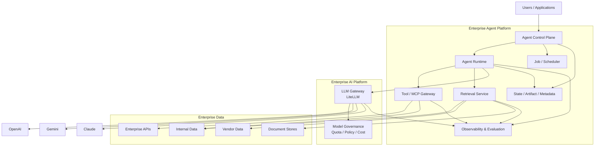
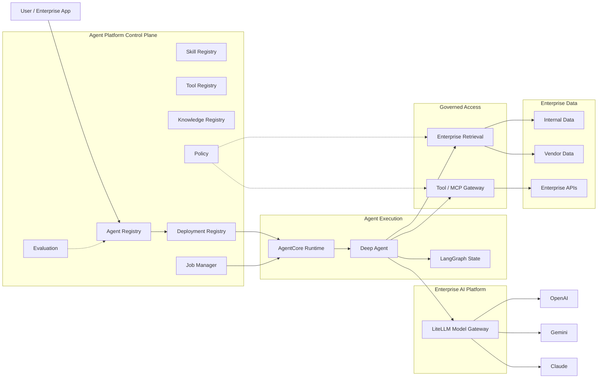

基于你描述的全貌，我会把你们现在的体系理解成：

> **Enterprise AI Platform = Model / AI Gateway**
>
> **Agent Platform = Agent Control Plane + Runtime + Tool/Data Access + RAG/Search + Job Execution**

其中底层 AI Platform 用 LiteLLM 统一接入 OpenAI / Gemini / Claude 等模型，上层 Agent Platform 用 FastAPI + LangChain Deep Agents + AWS Bedrock AgentCore，支持 ZIP/Skill 上传、交互运行与 Job 运行，同时自己提供 Hybrid Search，连接内部数据与 Vendor 数据。

这个方向总体是合理的，而且和现在业界成熟平台的演进方向基本一致。但从“Enterprise Architecture Review”角度看，我认为现在有 **7 个必须重点审查的问题**，其中最重要的是：**不要把 Agent Platform 做成一个“把几个优秀框架拼在一起的服务”**，而应该做成真正的 **Agent Control Plane + Governed Runtime Platform**。

---

# 一、先给结论

我的总体评价：

| 领域                                      | 当前判断                               | 风险     |
| --------------------------------------- | ---------------------------------- | ------ |
| LiteLLM 作为统一 Model Gateway              | 正确                                 | 低      |
| Deep Agents 作为 Agent Harness            | 正确                                 | 低      |
| AgentCore 作为 Runtime                    | 正确                                 | 低      |
| FastAPI 作为 Platform API / Control Plane | 正确                                 | 低      |
| ZIP 上传 Skill                            | 可以，但必须改变安全/版本模型                    | **高**  |
| Job 执行                                  | 方向正确，但不能只是 FastAPI BackgroundTask  | **高**  |
| Hybrid Search                           | 必要，但最好独立成 Retrieval Service        | **中高** |
| Enterprise IAM / Authorization          | 必须成为平台核心，而不是 API 层 RBAC            | **高**  |
| Tool / MCP Governance                   | 很可能是目前最大的缺口                        | **高**  |
| Agent Version / Artifact / Rollback     | 必须补齐                               | **高**  |
| Agent Observability                     | 必须平台统一，而不是单纯依赖 AgentCore/LangSmith | **高**  |
| Evaluation / Regression                 | 很容易被忽略，但企业级必须有                     | **高**  |
| Human Approval                          | 对金融/企业场景尤其重要                       | **高**  |
| Multi-tenancy / Data Entitlement        | Hybrid Search 场景尤其重要               | **高**  |

最值得注意的是：

> **你们现在已经不是“Agent Framework 项目”，而是在做 Agent Platform。**

一旦进入这个阶段，真正决定架构成熟度的已经不是 DeepAgents 好不好，而是：

**Agent 怎么发布、怎么运行、谁能运行、能调用什么、能访问什么数据、用了什么模型、失败后怎么办、如何审计、怎么回滚。**

---

# 二、我建议你们先把整个架构重新划成 5 个层次

这是我认为比较干净的企业级边界：



这里有一个非常关键的原则：

> **FastAPI 不应该是 Agent Runtime。**
>
> FastAPI 应该是 **Control Plane API**。

真正运行 Agent 的地方，应该是 AgentCore Runtime / isolated runtime。

这也是 AWS 自己的设计方向。AgentCore Runtime 是专门的 Agent 执行环境，支持 session isolation、identity、observability，并支持 LangGraph、CrewAI、Strands 等框架。([AWS Documentation][1])

---

# 三、最需要审核的问题：Agent Platform 到底自己负责什么？

这是第一项架构审核。

因为你现在用了：

* FastAPI
* LangChain
* Deep Agents
* LangGraph
* AgentCore
* LiteLLM
* Hybrid Search

这些组件本身已经各自覆盖了一部分 Platform 能力。

例如 Deep Agents 本身已经提供：

* planning
* filesystem
* subagents
* memory
* human-in-the-loop
* skills
* tools

而 Deep Agents 底层又是 LangGraph runtime。LangGraph 本身负责 state、checkpoint、streaming、interrupts 等。([Docs by LangChain][2])

AgentCore 又已经提供：

* runtime
* session isolation
* identity
* gateway
* observability
* memory
* browser
* code execution 等能力。([AWS Documentation][1])

所以你们必须明确：

| 能力                            | 谁负责                                 |
| ----------------------------- | ----------------------------------- |
| Agent reasoning loop          | Deep Agents                         |
| Graph / checkpoint            | LangGraph                           |
| Agent execution isolation     | AgentCore                           |
| Agent identity                | Enterprise IAM + AgentCore Identity |
| Model access                  | AI Platform / LiteLLM               |
| Model policy                  | AI Platform                         |
| Tool governance               | **Agent Platform**                  |
| Agent registry                | **Agent Platform**                  |
| Skill registry                | **Agent Platform**                  |
| Agent lifecycle               | **Agent Platform**                  |
| Job scheduling                | **Agent Platform**                  |
| Enterprise data authorization | **Agent Platform / Data Platform**  |
| Retrieval                     | **Retrieval Platform**              |
| Audit                         | Enterprise Platform                 |
| Evaluation                    | Enterprise Platform                 |
| Cost / quota                  | AI Platform + Agent Platform        |

如果这个 ownership matrix 不先定下来，很容易发生：

```text
AgentCore 做一点
LangGraph 做一点
FastAPI 做一点
LangSmith 做一点
LiteLLM 做一点
```

最后出现 3 套 state、2 套权限、2 套 tracing、2 套 job system。

这个是我认为目前最大的架构风险。

---

# 四、ZIP 上传 Skill：这是目前一个非常值得重点审查的地方

你说：

> 用户可以 ZIP 上传 agent skill

从开发体验上非常合理。

但 Enterprise Platform 不能把：

> ZIP = Skill

简单处理。

应该变成：

```text
ZIP
 ↓
Upload
 ↓
Malware / Policy Scan
 ↓
Manifest Validation
 ↓
Dependency Analysis
 ↓
Skill Build
 ↓
Immutable Artifact
 ↓
Version
 ↓
Approval
 ↓
Publish
 ↓
Agent references skill@version
```

也就是说：

```text
Skill
├── metadata
├── instructions
├── tools
├── dependencies
├── permissions
├── runtime requirements
└── version
```

而不是：

```text
upload.zip
    ↓
unzip
    ↓
run
```

---

# 五、Skill 最大的安全问题其实不是 Prompt Injection

很多企业会首先想到：

> Skill prompt injection

但平台架构层面更危险的是：

### 1. Supply chain

```text
skill.zip
  ↓
requirements.txt
  ↓
pip install
  ↓
malicious dependency
```

### 2. Arbitrary code execution

如果 Skill 可以：

```python
import os
subprocess.run(...)
requests.post(...)
```

那么它实际上就是：

> 用户上传代码 → 企业内部代码执行平台

安全等级完全不同。

### 3. Network egress

Skill 甚至可以：

```text
Agent
 ↓
HTTP request
 ↓
Internal API
 ↓
Third-party endpoint
```

因此必须定义：

```text
Skill Permission
├── model access
├── tool access
├── data source access
├── network egress
├── filesystem
├── shell
├── secret access
└── human approval
```

这也是为什么 AgentCore Runtime 的 microVM/session isolation 和 identity 很重要。AWS 当前的 Runtime 已经把每个 session 放进隔离 microVM，并支持 workload identity。([AWS Documentation][1])

---

# 六、必须把 Skill、Agent、Deployment 三个概念拆开

推荐：

```text
Skill
  ↓
Agent Definition
  ↓
Agent Version
  ↓
Deployment
  ↓
Run
  ↓
Job
```

例如：

```text
Skill:
financial-research@1.4.2

Agent:
InvestmentResearchAgent

Agent Version:
v12

Deployment:
prod

Run:
run-78291

Job:
job-10291
```

这样才能实现：

```text
prod → v12
         ↓
         rollback
         ↓
       v11
```

AgentCore 本身也已经采用 immutable runtime version 的思路，用版本保存完整配置并支持 rollback。([AWS Documentation][3])

所以你们自己的 Agent Platform 也应该保持类似模型。

---

# 七、Job 执行是第二个必须重点检查的地方

你说：

> agent 可以直接或者 job 运行

这个非常正确。

但：

```text
POST /agent/run
```

和：

```text
POST /job
```

实际上是两个不同的执行模型。

应该明确：

```text
Interactive Run

User
 ↓
Agent API
 ↓
Runtime
 ↓
stream result
```

以及：

```text
Background Job

User/API/Event
     ↓
Job Queue
     ↓
Scheduler
     ↓
Agent Runtime
     ↓
State / Artifact
     ↓
Result
```

不要做：

```python
@app.post("/job")
async def job():
    asyncio.create_task(run_agent())
```

这在企业生产环境很容易出问题。

应该有：

```text
Job
├── queued
├── starting
├── running
├── waiting_approval
├── retrying
├── succeeded
├── failed
├── cancelled
└── expired
```

并且支持：

* idempotency
* retry
* timeout
* cancellation
* resume
* dead-letter
* concurrency limit
* quota
* priority

LangSmith 当前的 Agent Server 已经把 Agent execution 明确建模为：

> assistants + threads + runs

并且支持后台 runs、cron jobs、持久 state。([Docs by LangChain][4])

这可以作为你们 Job 模型很好的参考。

---

# 八、Hybrid Search：方向正确，但我建议不要把它做成 Agent Platform 的内部模块

你们现在：

> Agent Platform + Hybrid Search

我认为 **第一阶段可以这样做，但长期应该拆成 Retrieval Service**。

原因是：

```text
Agent
 ↓
Search
```

不是唯一用户。

以后很可能会变成：

```text
Agent
Application
Copilot
RAG API
Batch Job
Knowledge Assistant
```

都需要：

```text
Enterprise Retrieval
```

所以更好的设计是：

```text
                    ┌──────── Agent
                    │
                    ├──────── Copilot
                    │
Applications ───────┼──────── RAG
                    │
                    └──────── Batch

                         ↓

                  Retrieval Service

                         ↓

        ┌────────────┬────────────┬─────────────┐
        Internal     Vendor       Document
        Data         Data         Store
```

---

# 九、而且 Hybrid Search 的真正难点并不是 BM25 + Vector

你现在有：

```text
keyword
+
embedding
```

这是正确的。

业界的 Hybrid Retrieval 本身也是 sparse + dense，然后 merge / rerank。Haystack 也直接把这作为标准 Retrieval pattern。([Haystack][5])

但金融企业环境，真正需要审核的是：

### Authorization-aware retrieval

例如：

```text
User
 ├── Department = Equity
 ├── Region = Japan
 └── Classification = Internal
```

那么：

```text
Search("company X")
```

不能首先：

```text
vector search top 50
    ↓
LLM filter
```

而应该：

```text
Authorization Filter
        ↓
Candidate Retrieval
        ↓
Hybrid Ranking
        ↓
Rerank
        ↓
Citation
```

也就是说：

> **权限过滤应该发生在 Retrieval pipeline 内，而不是生成以后。**

否则这是非常严重的数据泄露风险。

---

# 十、Document Search 还需要增加“数据血缘”

你们这种内部 + Vendor 数据场景，我非常建议每个 chunk 至少保留：

```json
{
  "document_id": "...",
  "chunk_id": "...",
  "source": "vendor-x",
  "source_uri": "...",
  "classification": "internal",
  "owner": "...",
  "effective_date": "...",
  "version": "...",
  "ingested_at": "...",
  "acl": [...],
  "checksum": "..."
}
```

然后 Agent 返回：

```text
Answer
 ↓
Evidence
 ↓
Document
 ↓
Source
 ↓
Version
```

而不是只有：

```text
Answer + random citations
```

对金融环境尤其重要。

---

# 十一、Tool / MCP Governance 是我认为你们现在非常可能缺的一个平台能力

Agent 平台未来最大的资源不是 Skill。

而是：

> **Tool**

例如：

```text
SearchInternalResearch
GetPortfolio
QueryMarketData
CreateTicket
SendEmail
RunSQL
CallInvestmentAPI
```

因此建议把 Tool 单独做 Registry：

```text
Tool Registry

Tool
 ├── metadata
 ├── owner
 ├── version
 ├── schema
 ├── risk level
 ├── allowed agents
 ├── allowed users
 ├── data scope
 ├── approval policy
 └── audit policy
```

然后：

```text
Agent
  ↓
Tool Registry
  ↓
Policy
  ↓
Tool Gateway
  ↓
Execution
```

而不是让每个 Agent 自己配置：

```python
tools=[
   xxx,
   yyy,
   zzz
]
```

AWS AgentCore Gateway 当前就把 API / MCP / Lambda 等工具作为受治理的入口，并支持 authentication / authorization / policy enforcement。([AWS Documentation][6])

Microsoft Foundry Agent Service 现在也已经把这一层明确抽象成 **Toolboxes**：工具集中管理，然后通过统一 MCP endpoint 提供给多个 Agent，同时做 authentication、governance、versioning。([Microsoft Learn][7])

所以这是非常值得你们借鉴的业界趋势。

---

# 十二、Agent Identity 必须独立于 User Identity

企业 Agent 经常会遇到：

```text
User A
   ↓
Agent
   ↓
Research API
```

究竟 Research API 看到的是：

```text
User A
```

还是：

```text
Agent X
```

这是两个完全不同的 security model。

成熟架构一般要同时支持：

### User delegated identity

```text
User
 ↓
Agent
 ↓
API
 ↓
on behalf of User
```

### Agent workload identity

```text
Agent
 ↓
API
```

AWS AgentCore Identity 已经明确把 Agent 当成 workload identity 来管理，并支持 OAuth / API keys / corporate identity provider。([AWS Documentation][8])

所以你们至少应该建模：

```text
User Identity
Agent Identity
Service Identity
Tool Identity
```

并且能够审计：

```text
who
 +
which agent
 +
which version
 +
which tool
 +
which data
```

---

# 十三、Observability 不应该简单等于 LangSmith

你们这里容易产生一个误区：

> AgentCore 有 tracing
> LangChain 有 tracing
> LangSmith 有 tracing
> 那就结束了。

不是。

企业需要的是：

```text
Enterprise Agent Trace
```

贯穿：

```text
User Request
 ↓
Agent
 ↓
LLM Gateway
 ↓
Model
 ↓
Tool
 ↓
Retrieval
 ↓
Document
 ↓
External API
```

最好有统一 correlation ID：

```text
trace_id
  ├── request
  ├── agent_run
  ├── llm_call
  ├── tool_call
  ├── retrieval
  ├── document
  └── external_call
```

AgentCore 本身已经提供 Agent-specific tracing，可记录 agent steps、tool invocation 和 model interaction。([AWS Documentation][1])

OpenAI Agents SDK 也已经把 trace 模型扩展到了 generation、tool call、handoff、guardrail 等事件。([OpenAI GitHub][9])

因此你们应该把这些作为：

> **平台事件**

而不是绑定某一个 framework。

---

# 十四、Evaluation 要和 Observability 分开

这是企业 Agent 平台和普通 Agent API 最大的区别之一。

应该有：

```text
Observability
= "发生了什么？"

Evaluation
= "做得好不好？"
```

例如：

```text
Run #123

Latency       19.2 sec
Cost          $0.18
Tool calls    7
Retrieval     13 docs

Quality:
Answer correctness      0.92
Citation correctness    0.88
Policy compliance       1.00
Tool success            0.96
```

然后每次 Agent Version 发布：

```text
v17
 ↓
Evaluation Dataset
 ↓
100 test cases
 ↓
Regression
 ↓
PASS / FAIL
 ↓
Deploy
```

Microsoft Foundry 当前已经把 tracing + evaluations + optimizer 放进 Agent Service 生命周期；LangSmith 也把 tracing/evaluation/deployment 放在同一体系。([Microsoft Learn][7])

这说明：

> **Eval 已经不是额外工具，而是 Agent Platform 的核心生命周期能力。**

---

# 十五、必须有 Human-in-the-loop，但不要把它理解成“弹一个 Approval Dialog”

企业尤其金融环境，HITL 应该是：

```text
Tool Risk

LOW
  → automatic

MEDIUM
  → policy based

HIGH
  → human approval

CRITICAL
  → dual approval
```

例如：

```text
Search research
     ↓
LOW

Generate recommendation
     ↓
MEDIUM

Send external email
     ↓
HIGH

Execute trade
     ↓
CRITICAL
```

Deep Agents 自己已经支持 human-in-the-loop。([GitHub][10])

但 Platform 层面还需要：

```text
Approval Policy
Approval Request
Approver
Timeout
Escalation
Audit
```

即：

> Framework HITL ≠ Enterprise Approval Workflow

---

# 十六、Enterprise Agent Platform 最终应该至少有这些 Registry

这是我比较建议你们现在就形成的概念模型：

```text
Agent Registry
Skill Registry
Tool Registry
Model Registry
Knowledge Source Registry
Dataset Registry
Evaluation Registry
Policy Registry
Deployment Registry
```

例如：

```text
Agent
InvestmentResearchAgent
   │
   ├── Skill
   │     └── research@1.2.3
   │
   ├── Model
   │     └── claude-sonnet-x
   │
   ├── Tools
   │     ├── internal-search
   │     ├── market-data
   │     └── portfolio-api
   │
   ├── Knowledge
   │     ├── internal-research
   │     └── vendor-x
   │
   ├── Policy
   │     └── investment-policy-v4
   │
   └── Deployment
         └── prod-v17
```

这样你们才真正拥有一个：

> **Agent Supply Chain**

---

# 十七、我对当前架构的优先级判断

如果让我做正式 Architecture Review，我会这样打：

### P0 — 必须解决

**1. Agent / Skill / Deployment immutable version**

**2. ZIP Skill sandbox + supply-chain security**

**3. Tool / MCP authorization**

**4. Agent / User / Service identity**

**5. Job execution model**

**6. Retrieval authorization / ACL trimming**

**7. Unified audit + trace**

---

### P1 — 很重要

**8. Evaluation / regression**

**9. Human approval policy**

**10. Cost / token / concurrency quota**

**11. Agent lifecycle**

```text
Draft
 ↓
Test
 ↓
Approved
 ↓
Published
 ↓
Deprecated
 ↓
Retired
```

**12. State model**

必须区分：

```text
Agent definition
Agent memory
Conversation state
Run state
Job state
Artifacts
```

---

### P2 — 后续增强

Multi-agent registry、A2A、复杂优化、自动 prompt optimization、agent marketplace 等。

这些现在都不是核心矛盾。

---

# 十八、业界产品对比

我把你们的目标和目前真正相关的产品放在一起比较。

| 平台                                  | Runtime                | Agent Control Plane | Tools/MCP | RAG/Search | Identity | Job/Long-running | Eval  | 自建/企业私有 |
| ----------------------------------- | ---------------------- | ------------------- | --------- | ---------- | -------- | ---------------- | ----- | ------- |
| **你们现在**                            | AgentCore + DeepAgents | 自建                  | 自建/部分     | **自建**     | 待完善      | **自建**           | 待完善   | **强**   |
| **AWS AgentCore**                   | **强**                  | AWS                 | **强**     | 部分         | **强**    | 强                | 有     | 强       |
| **Microsoft Foundry Agent Service** | **强**                  | **强**               | **强**     | 强          | **强**    | 强                | **强** | 强       |
| **Google Agent Engine**             | **强**                  | GCP                 | 强         | 强          | 强        | 强                | 强     | 强       |
| **LangSmith / LangGraph**           | **强**                  | **强**               | 强         | 可组合        | 可定制      | **强**            | **强** | **强**   |
| **Dify**                            | 中                      | **强**               | 强         | **强**      | 中        | 强                | 中     | **强**   |
| **Langflow**                        | 中                      | 中                   | 强         | **强**      | 中        | 中                | 中     | 强       |
| **Letta**                           | **强**                  | 中                   | 强         | 中          | 中        | 强                | 中     | 强       |

---

# 十九、AWS AgentCore：和你们最接近，但不是同一层

AgentCore 现在已经明显从“runtime”发展成一套 Agent infrastructure：

```text
Runtime
Identity
Gateway
Memory
Browser
Code Interpreter
Observability
```

并且 Runtime 可以直接支持 LangGraph / CrewAI / Strands / custom framework，同时模型并不要求绑定 Bedrock，可以接 OpenAI、Gemini、Claude 等。([AWS Documentation][1])

所以：

> **你们现在选 AgentCore 作为底座是合理的。**

我不建议你们自己重新造：

```text
microVM isolation
agent runtime
session infrastructure
```

让 AgentCore 负责这些。

你们应该重点造的是：

```text
Enterprise Control Plane
+
Enterprise Governance
+
Enterprise Data Access
```

---

# 二十、Microsoft Foundry Agent Service：目前最值得作为“企业平台”参考的竞品

它和你们目标非常接近。

目前已经明确有：

```text
Agent Runtime
Toolboxes
Models
Observability
Optimization
Identity & Security
Publishing
```

并且支持：

* versioning
* stable endpoints
* RBAC
* VNet
* MCP
* tracing
* evaluations
* monitoring。([Microsoft Learn][7])

也就是说：

> 你们现在缺的很多“Platform capability”，Microsoft 已经把它们产品化了。

尤其推荐你们重点参考它的：

**Toolbox abstraction**

而不是单纯复制 Agent API。

---

# 二十一、Google Agent Engine

Google 现在走的是：

```text
Agent Engine
 ├── Runtime
 ├── Sessions
 ├── Memory Bank
 ├── Code Execution
 ├── Example Store
 ├── Observability
 └── Governance
```

目前支持 Sessions、Memory Bank、Cloud Trace、Cloud Monitoring、Cloud Logging，并强调企业安全和数据驻留能力。([Google Cloud Documentation][11])

它值得你们学习的是：

> **State / Memory / Session 的平台化建模。**

---

# 二十二、LangGraph / LangSmith：技术架构上其实是你们最值得学习的开源/商业参考

这一套跟你们现在的技术栈最接近。

LangSmith Deployment 当前已经明确分成：

```text
Control Plane
     ↓
Agent Server
     ↓
Data Plane
```

Agent Server 负责：

```text
graphs
state
persistence
execution
```

同时提供：

```text
assistants
threads
runs
cron jobs
```

以及 MCP / A2A / auth / memory。([Docs by LangChain][12])

我认为它和你们的关系是：

> **DeepAgents + LangGraph ≈ Agent execution substrate**
>
> **你们 Agent Platform ≈ LangSmith Deployment 再叠加 enterprise governance + AWS runtime + enterprise data**

这个定位是非常清楚的。

---

# 二十三、Dify：架构参考价值很高，但定位和你们不同

Dify 已经把：

```text
Workflow
RAG
Agent
Model Management
Observability
API
```

统一起来，并支持 self-hosting。([GitHub][13])

但是 Dify 更偏：

> AI application development platform

你们更偏：

> **Enterprise Agent Infrastructure Platform**

所以不能照搬 UI / workflow。

但它很值得参考：

* Knowledge lifecycle
* RAG pipeline
* Application → Agent → Workflow
* Model abstraction
* Plugin/tool model

---

# 二十四、Letta：Skill / Memory 的理念很值得看

Letta 现在强调：

```text
stateful agents
memory
skills
subagents
```

并支持 local / self-hosted / cloud。([GitHub][14])

它一个非常值得你们学习的思想是：

> **Skill 是 Agent 的可组合能力，而不是简单的 ZIP 文件。**

它甚至明确区分：

```text
Memory
vs
Skill
```

Skill 应该是可复用的行为/流程，而长期事实才是 Memory。([GitHub][15])

这个概念其实非常适合你们后面的 Skill Registry。

---

# 二十五、一个很重要的趋势：Industry 正在从“Agent Framework”进入“Agent Runtime Platform”

这一点从这些产品非常明显：

```text
LangChain
      ↓
LangGraph
      ↓
Deep Agents
      ↓
LangSmith Deployment

AWS
      ↓
AgentCore Runtime
      ↓
Gateway / Identity / Memory / Observability

Google
      ↓
Agent Engine
      ↓
Sessions / Memory / Observability

Microsoft
      ↓
Foundry Agent Service
      ↓
Toolbox / Identity / Evaluation / Publishing
```

所以今天真正有竞争力的 Agent Platform 已经不是：

```text
Prompt
+
LLM
+
Tool
```

而是：

```text
Agent Lifecycle
+
Runtime
+
Identity
+
Tools
+
Data
+
State
+
Security
+
Evaluation
+
Observability
```

---

# 二十六、我建议你们最终收敛成这样的架构



---

# 二十七、最终的架构定位，我会这样定义

我不建议把这个平台定义为：

> **Agent Framework Platform**

甚至也不建议只是：

> **Agent Platform**

更准确的是：

> **Enterprise Agent Runtime & Governance Platform**

下面分成三个核心：

### 1. Agent Runtime

```text
DeepAgents
LangGraph
AgentCore
```

负责“怎么跑”。

### 2. Agent Governance

```text
Identity
Policy
Tool
Skill
Deployment
Approval
Audit
Evaluation
Cost
```

负责“能不能跑、怎么跑”。

### 3. Enterprise Knowledge & Data Access

```text
Hybrid Search
Internal Data
Vendor Data
MCP
Enterprise APIs
ACL
Citation
```

负责“能访问什么”。

---

## 我认为你们现在最值得做的一件架构调整

**不要继续横向增加 Agent Framework 能力。**

比如暂时不要急着自己做：

```text
custom agent loop
custom memory
custom checkpoint
custom runtime
custom sandbox
```

因为 DeepAgents + LangGraph + AgentCore 已经覆盖得很好。Deep Agents 本身已经定位成 production-oriented agent harness，并把 runtime 能力下沉到 LangGraph；AgentCore 又提供隔离 runtime 和身份/网关等基础能力。([Docs by LangChain][2])

应该把工程投资集中到：

```text
                    Enterprise Agent Platform

              ┌─────────────────────────────┐
              │ Agent / Skill Registry      │
              │ Tool / MCP Registry         │
              │ Deployment / Versioning     │
              │ IAM / Policy / Approval     │
              │ Job / Scheduler             │
              │ Evaluation / Audit          │
              └─────────────┬───────────────┘
                            │
                    AgentCore Runtime
                            │
                   DeepAgents / LangGraph
                            │
             ┌──────────────┴──────────────┐
             │                             │
      Enterprise Retrieval          Enterprise Tools
             │                             │
       Internal/Vendor               MCP / API / DB
             │                             │
             └──────────────┬──────────────┘
                            │
                       LiteLLM Gateway
                            │
                 OpenAI / Gemini / Claude
```

这样你们的产品定位会非常清晰：

**AI Platform 管模型；Agent Platform 管 Agent；Data/Tool Platform 管 Agent 能够接触的企业世界。**

这比把所有能力继续堆进一个 FastAPI + LangChain 服务要成熟得多。

[1]: https://docs.aws.amazon.com/bedrock-agentcore/latest/devguide/agents-tools-runtime.html?utm_source=chatgpt.com "Host agent or tools with Amazon Bedrock AgentCore Runtime - Amazon Bedrock AgentCore"
[2]: https://docs.langchain.com/oss/python/deepagents/overview?utm_source=chatgpt.com "Deep Agents overview - Docs by LangChain"
[3]: https://docs.aws.amazon.com/bedrock-agentcore/latest/devguide/runtime-how-it-works.html?utm_source=chatgpt.com "microVMs - Amazon Bedrock AgentCore"
[4]: https://docs.langchain.com/langsmith/deployment?utm_source=chatgpt.com "LangSmith Deployment - Docs by LangChain"
[5]: https://docs.haystack.deepset.ai/docs/retrievers?utm_source=chatgpt.com "Retrievers"
[6]: https://docs.aws.amazon.com/bedrock-agentcore/latest/devguide/gateway-create.html?utm_source=chatgpt.com "Create an Amazon Bedrock AgentCore gateway - Amazon Bedrock AgentCore"
[7]: https://learn.microsoft.com/en-us/azure/ai-foundry/agents/overview?utm_source=chatgpt.com "What is Microsoft Foundry Agent Service? - Microsoft Foundry | Microsoft Learn"
[8]: https://docs.aws.amazon.com/bedrock-agentcore/latest/devguide/identity.html?utm_source=chatgpt.com "Provide identity and credential management for agent applications with Amazon Bedrock AgentCore Identity - Amazon Bedrock AgentCore"
[9]: https://openai.github.io/openai-agents-python/tracing/?utm_source=chatgpt.com "Tracing - OpenAI Agents SDK"
[10]: https://github.com/langchain-ai/deepagents/blob/main/README.md?utm_source=chatgpt.com "deepagents/README.md at main · langchain-ai/deepagents · GitHub"
[11]: https://docs.cloud.google.com/vertex-ai/generative-ai/docs/agent-engine/overview?hl=ja&utm_source=chatgpt.com "Vertex AI Agent Engine の概要  |  Vertex AI Agent Builder  |  Google Cloud Documentation"
[12]: https://docs.langchain.com/langsmith/components?utm_source=chatgpt.com "LangSmith Deployment components - Docs by LangChain"
[13]: https://github.com/langgenius/dify/blob/main/README.md?plain=1&utm_source=chatgpt.com "dify/README.md at main · langgenius/dify · GitHub"
[14]: https://github.com/letta-ai/letta?utm_source=chatgpt.com "GitHub - letta-ai/letta: Platform for stateful agents: AI with advanced memory that can learn and self-improve over time. · GitHub"
[15]: https://github.com/letta-ai/letta-code/blob/main/src/agent/subagents/builtin/reflection.md?utm_source=chatgpt.com "letta-code/src/agent/subagents/builtin/reflection.md at main · letta-ai/letta-code · GitHub"
