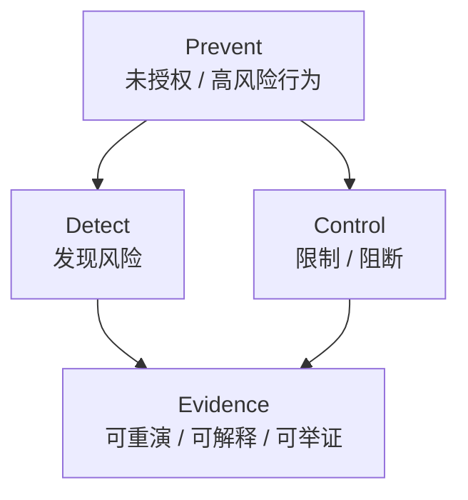
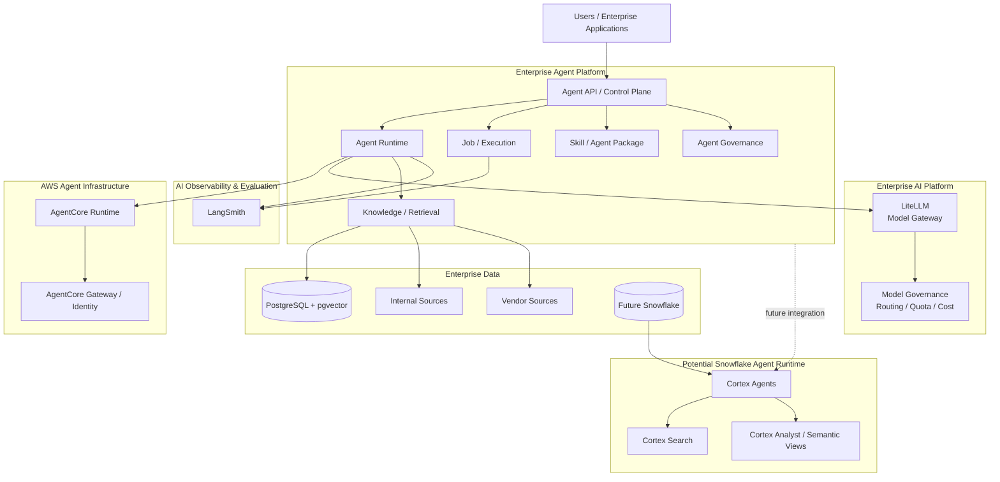
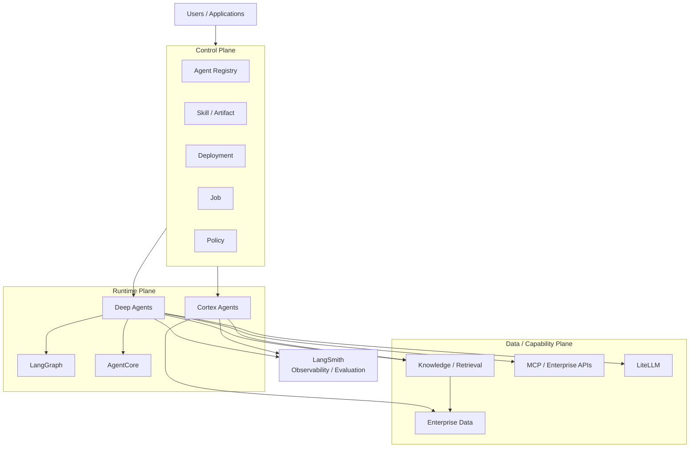
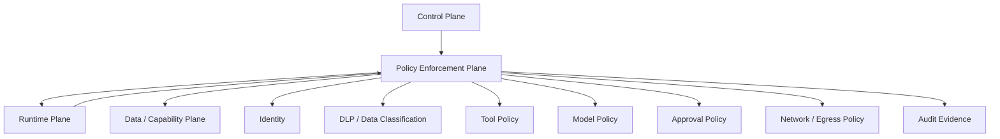
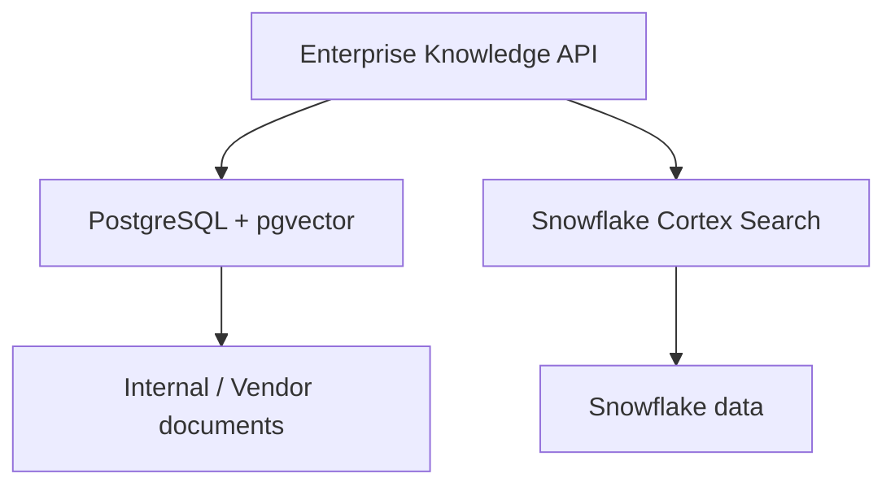
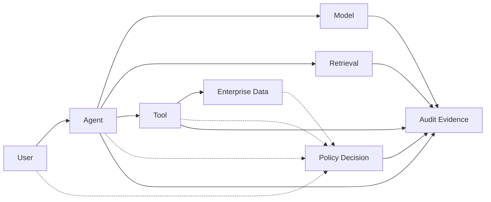
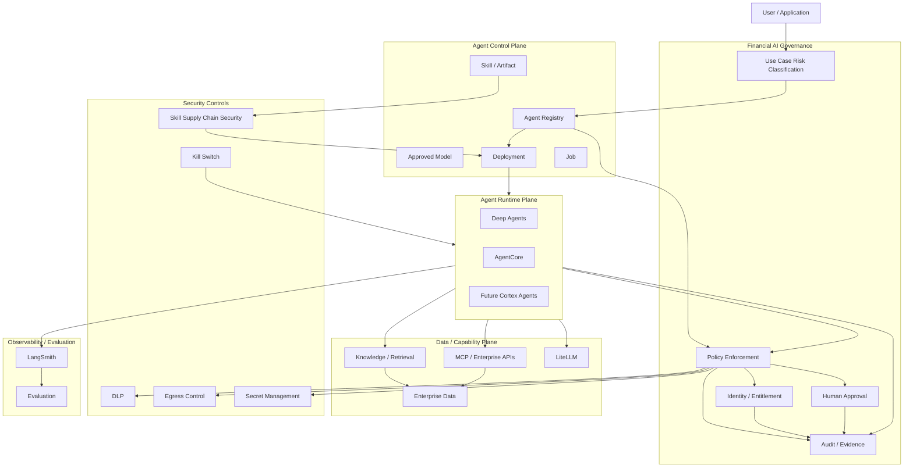
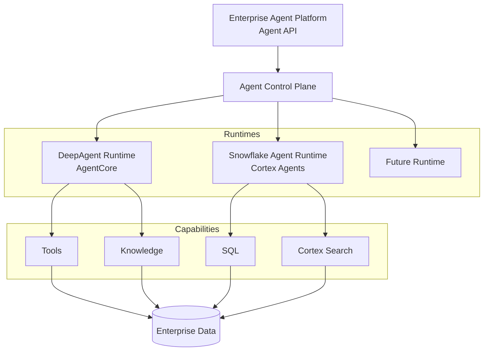

# Enterprise Agent Platform Risk Architecture Review

本文面向金融服务场景，基于当前实际技术栈（LiteLLM / FastAPI / LangChain Deep Agents / LangGraph / AWS Bedrock AgentCore / LangSmith / PostgreSQL + pgvector）做出判断，并针对未来接入 Snowflake Cortex Agents 的路径给出边界设计与风险控制设计。

与上一版相比，本版的定位从「技术架构评审」升级为「金融级 Enterprise Agent Platform 风险架构评审」：平台的技术边界已经基本清楚，真正需要补齐的是**金融监管视角下的风险治理、控制与举证能力**。

## 1. Executive Summary

### Current maturity

上一版报告的结论是「技术底座已经基本完整，主要架构风险是多个平台之间的职责边界、运行模型与治理模型」。这个判断在技术层面成立，但对金融机构来说还不够。

补上金融风险与监管视角之后，结论需要再往前走一步：

> **当前 Agent Platform 的技术底座已经基本完整。下一阶段架构风险的核心不是缺少某个 Agent Framework，而是如何把金融机构既有的模型风险管理、ICT 风险管理、数据治理、访问控制、第三方风险管理与审计要求，映射到 Agent 的完整生命周期。**

支撑这个结论的事实没有变，只是含义变了：

- LangSmith 已经集成 → Observability / Evaluation **不再是缺失能力**，但它的定位需要与 Audit Evidence 分开。
- PostgreSQL + pgvector 已经是当前 Hybrid Search 的基础设施 → 当前更准确的定位是 Agent Platform 内的 **Knowledge / Retrieval Capability**。
- MCP 主要通过流程与架构 Pattern 治理 → **不需要再造重型 MCP Gateway / Tool Registry Platform**。
- Snowflake / Cortex Agents 可能接入 → 需要设计 **「自建 Agent Runtime 与 Data-Native Agent Runtime 并存」**。
- AgentCore + LangSmith + PostgreSQL + LiteLLM 构成的技术底座已经比较成熟 → 审核重点从「缺什么组件」转向 **「边界、控制与举证是否闭环」**。

判断口径因此经历了三个阶段：

| 阶段 | 核心问题 | 报告定位 |
| --- | --- | --- |
| 技术选型 | 我们还缺哪些 Agent 能力？ | Agent Framework 选型 |
| 平台边界 | 这些能力分别由谁负责？ | 平台架构评审 |
| **风险与治理** | **发生风险时，机构能不能证明它知道自己在做什么、能限制它、能追溯它、能解释它、能及时停止它？** | **金融风险架构评审** |

### 金融 Agent Platform 的核心安全目标

整个安全与治理部分围绕四件事展开：



**Prevent / Detect / Control / Evidence** 是本报告安全部分的主轴。任何一项安全或治理设计，都要能回答它落在四件事中的哪一件上；回答不了的，通常只是「看起来像控制」，而不是控制。

### 按风险口径重新打分

在上一版成熟度表的基础上，补上金融风险维度：

| 能力 | 现状 | 判断 | 金融风险类别 | 风险 |
| --- | --- | --- | --- | --- |
| LiteLLM 作为统一 Model Gateway | 已有 | 定位正确 | Third-party | 低 |
| Deep Agents 作为 Agent Harness | 已有 | 定位正确 | — | 低 |
| AgentCore 作为 Agent Runtime | 已有 | 定位正确，不应自建 microVM / session | Cyber | 低 |
| FastAPI 作为 Platform API | 已有 | 定位正确，但**不应承载 Runtime** | Operational | 低 |
| **LangSmith 承担 Observability / Evaluation** | 已集成 | 能力已具备，**不再是缺口** | Model / AI | 低 |
| **PostgreSQL + pgvector 作为 Knowledge 基础设施** | 已建成 | 当前阶段合理，无需拆分 | Data | 低 |
| ZIP 上传 Skill | 已有 | 必须改变安全 / 版本模型 | Cyber（供应链） | **高** |
| Job 执行 | 已有 | 不能只是 FastAPI BackgroundTask | Operational Resilience | **高** |
| **Control Plane / Runtime Plane / Data Plane 边界** | 未定义 | **当前最大风险** | Operational | **高** |
| **Runtime abstraction** | 未定义 | 接入 Snowflake 之前必须定义 | Operational | **高** |
| Agent / Skill / Deployment immutable version | 部分 | 需要补齐 artifact 与 rollback | Audit / Regulatory | **高** |
| Identity / Authorization | 部分 | 需要「平台权限 + 数据平台原生权限」双层 | Data / Privacy | **高** |
| 与 LangSmith Deployment 的重复度 | 未评估 | 需要明确分工，避免重复造 | Operational | 中高 |
| PostgreSQL / LangSmith / Snowflake 数据职责 | 未定义 | 接入 Snowflake 前必须明确 | Data | 中高 |
| MCP 治理 | 走架构 Pattern | 模式合理，需补最小执行元数据 | Cyber / Operational | 中 |
| **AI Use Case Risk Classification** | 未定义 | **所有安全策略的第一道闸门** | Regulatory / AI | **高** |
| **Policy Enforcement Plane** | 未定义 | 技术控制的核心落点 | Cyber / Conduct | **高** |
| **Model Registry / Approved Model** | 部分（LiteLLM 只解决连通性） | 需要 Model Governance | Model Risk | **高** |
| **Audit / Evidence Architecture** | 未定义 | Trace ≠ Audit Evidence | Audit / Regulatory | **高** |
| **Kill Switch** | 未定义 | 必须是 deterministic 基础设施控制 | Operational | **高** |
| **Third-party AI Provider Governance** | 未定义 | OpenAI / Anthropic / AWS / Snowflake 全在供应链内 | Third-party | **高** |

### Main architectural risks

**风险一：平台职责边界没有先定义，正在同时被五个组件承担。**

```text
AgentCore 做一点
LangGraph 做一点
FastAPI 做一点
LangSmith 做一点
LiteLLM 做一点
```

如果 ownership 不先定下来，最终会出现 3 套 state、2 套权限、2 套 tracing、2 套 job system。

**风险二：接入 Snowflake Cortex Agents 之后，三处边界可能同时失效。**

- Runtime 边界：Cortex Agents 本身就是一个 managed agent platform，不是「Snowflake 里的 LLM API」。如果仍按单一 Runtime 建模，Agent API 会被迫暴露两套运行语义。
- 权限边界：Cortex Agents / Cortex Search 有自己的 Snowflake privilege 与 execution context 治理模型，「在 Agent Platform 授权一次就代表全部授权」不成立。
- 检索边界：PostgreSQL + pgvector 与 Cortex Search 必须能被同一层抽象调用，否则每个 Agent 会各自绑定一个检索提供方。

**风险三：可能正在重复建设 LangSmith Deployment 已经提供的那一层。**

LangSmith Agent Server 已经提供 Postgres、Task Queue、Runs、Threads、Assistants、Cron Jobs、Persistence，并采用 API server + queue worker + Redis + PostgreSQL 的运行模型。([Docs by LangChain][4]) 如果自建那一层的理由只是「需要一个 `/run-agent` API 和 Job API」，那部分是重复建设。

**风险四：MCP 若按重型技术 Registry 建设，会与既有的架构 Pattern 治理冲突。**

治理靠流程、模板和 Reference Architecture 已经成立时，再建一套 MCP Governance Platform 会形成两个权威源。

**风险五：Agent 的自主性没有被纳入模型风险与操作风险管理框架。**

传统 Model Risk Management 只覆盖「输入 → 模型 → 输出」。Agent 的执行链是「Agent → LLM → Tool → LLM → Retrieval → LLM → Tool → Action」，风险构成不再只是 Model Risk，而是 Model Risk + Tool Risk + Data Risk + Workflow Risk + Autonomy Risk（第 9.2 节）。如果治理框架仍按传统模型审批来写，Agent 的行为边界实际上是无人负责的。

**风险六：缺少「用例风险分级」这道闸门。**

平台目前没有统一的 Use Case 风险分级，导致所有安全策略只能在「按最高标准一刀切」和「按最低标准放行」之间摆动。这是金融服务场景下最先必须补上的一层（第 9.1 节）。

### Key recommendations

按优先级收敛为八件事，与第 18 章的 P0 一一对应：

| # | 建议 | 章节 |
| --- | --- | --- |
| 1 | 建立 AI Use Case Risk Classification（L0–L4），作为所有安全策略的第一道闸门 | 第 9.1 节 |
| 2 | 建立 Policy Enforcement Plane，把 Model / Tool / Data / Action / Network 纳入 deterministic policy 执行 | 第 3.4 节 |
| 3 | 定义 Identity 与 Entitlement 模型（User / Agent / Runtime / Tool / Data） | 第 10.1 节 |
| 4 | 定义 Agent / Skill / Model / Tool 的 immutable version | 第 4 章 |
| 5 | 定义 Audit / Evidence 架构，明确 Trace、Audit、Evidence 三者关系 | 第 12.4 节 |
| 6 | 把 Model Risk Management 从模型扩展到 Agent | 第 6 章、第 9.2 节 |
| 7 | 建立第三方 AI Provider 治理（OpenAI / Anthropic / Gemini / AWS / Snowflake / LangSmith） | 第 14 章 |
| 8 | 建立 Data Leakage 与 Egress 防护（Prompt / Context / Tool Arguments / Output / Trace） | 第 7.5、10.4、10.7 节 |

同时保留上一版在工程侧的三条收敛判断：先定边界再谈能力（第 3 章）、定义 Runtime abstraction（第 5.4 节）、把 MCP 治理保持为架构治理（第 8 章）。

完整的 P0 / P1 / P2 见第 18 章。

## 2. Current Platform Landscape

整个体系由两个企业平台组成：

```text
Enterprise AI Platform
        │
        │ Model Access / Model Governance
        ▼
     LiteLLM
        │
        ▼
Enterprise Agent Platform
        │
        ├── Agent Definition / Skill
        ├── Agent Runtime
        ├── Job / Execution
        ├── Knowledge / Retrieval
        ├── Governance
        └── Observability / Evaluation
        │
        ├──────── LangSmith
        ├──────── AgentCore
        ├──────── PostgreSQL / pgvector
        └──────── Future: Snowflake / Cortex Agents
```

当前体系不是一个单纯的 Agent Framework，而是由两个企业平台组成。右侧的四个组件就是它现在的落地方式：Observability / Evaluation 由 LangSmith 承担，Runtime 由 AgentCore 承担，Knowledge / Retrieval 建立在 PostgreSQL + pgvector 上，Snowflake / Cortex Agents 是未来需要提前纳入边界的第二组能力。

### 2.1 Enterprise AI Platform

定位：

> **Model & AI Gateway**

主要职责：

```text
Model Provider abstraction
Model routing
Credentials
Quota
Cost
Model policy
Provider governance
```

底层：

```text
LiteLLM
   │
   ├── OpenAI
   ├── Claude
   ├── Gemini
   └── Other LLM providers
```

这一层的判断没有变化：用 LiteLLM 统一收敛模型入口是正确的，模型路由、凭据、配额、成本与 provider 治理都应该留在这里，而不是下沉到每个 Agent。

### 2.2 Enterprise Agent Platform

定位：

> **Agent Runtime & Application Platform**

负责：

```text
Agent definition
Skill
Agent execution
Job execution
Knowledge / Retrieval
Tool / MCP integration
State
Observability
Evaluation
Agent lifecycle
```

核心技术：

```text
FastAPI
   │
Deep Agents / LangGraph
   │
AWS AgentCore
   │
LangSmith
   │
PostgreSQL + pgvector
```

这个定位比上一版报告的：

> Agent Control Plane + Runtime + Tool/Data + RAG/Search + Job

更准确。差别在三点：

- **LangSmith 已经是组成部分**，不是「需要补齐的外部能力」。它承担 trace、evaluation、dataset、feedback 与部署侧运行模型。
- **PostgreSQL / pgvector 已经是平台正式的数据与检索基础设施**，不是「未来待拆的实验模块」。它同时承载 agent metadata、state、job metadata 与 knowledge metadata。
- **Tool / MCP 这一层是「接入与执行」**，不是「另建一套治理体系」。治理走架构 Pattern，平台负责执行这些标准。

### 2.3 LangSmith

LangSmith 在当前体系里承担两类职责：

```text
Observability / Evaluation
├── tracing
├── offline evaluation
├── online evaluation
├── datasets
├── feedback
└── monitoring
```

以及部署侧已经具备的运行模型：

```text
Agent Server
├── Postgres
├── Task Queue
├── Runs
├── Threads
├── Assistants
└── Cron Jobs
```

因此本报告不再把 Observability / Evaluation 列为 P0/P1 缺口，改为在**第 12 章**审查「LangSmith 与 AgentCore、Enterprise Platform 如何分工」。

### 2.4 AgentCore

AgentCore 在当前体系里承担 Agent Runtime：

```text
Runtime
Identity
Gateway
Memory
Browser
Code Interpreter
Observability
```

AgentCore Runtime 是专门的 Agent 执行环境，支持 session isolation、identity、observability，并支持 LangGraph、CrewAI、Strands 等框架；Runtime 可以直接支持多种框架，模型也不要求绑定 Bedrock，可以接 OpenAI、Gemini、Claude 等。([AWS Documentation][1])

结论：

> **选 AgentCore 作为 Runtime 底座是合理的，不应该自建 microVM isolation / agent runtime / session infrastructure。**

需要重新判断的是 Gateway 部分：AgentCore Gateway 已经把 tools / agents / models 的访问入口、多 MCP target 聚合、policy-based authorization 与 observability 产品化。([AWS Documentation][21]) 所以问题不是「要不要建 Gateway」，而是「哪些 Gateway 能力直接用 AgentCore，哪些必须由 Enterprise Agent Platform 自己实现」。

### 2.5 PostgreSQL + pgvector

PostgreSQL + pgvector 现在是平台的正式组件，承担：

```text
PostgreSQL
    │
    ├── Agent metadata
    ├── Agent state
    ├── Job metadata
    ├── Knowledge metadata
    ├── Document metadata
    └── pgvector
          └── embeddings
```

但要注意一条边界：

> **不要把 PostgreSQL 变成「什么都存」。**

未来接入 Snowflake 之后的正确分工是：

```text
Transactional / operational state
        ↓
PostgreSQL

Enterprise analytical / data warehouse
        ↓
Snowflake

Agent trace / evaluation
        ↓
LangSmith
```

### 2.6 Future Snowflake / Cortex

Snowflake 的定位需要提前写清楚，因为它直接决定 Runtime、Agent API、权限与 observability 的设计：

> **Snowflake Cortex Agents 应该被视为「潜在的第二 Agent Runtime」，而不是简单的数据源或 LLM Provider。**

原因：Cortex Agents 目前是一个完整的 managed agent platform，可以调用 Cortex Search、使用 Cortex Analyst / semantic views、使用 SQL、调用 tools、管理 threads，并在 Snowflake governed environment 中执行。([Snowflake Documentation][17]) 而且 Snowflake 已明确建议从 Cortex Analyst 向 Cortex Agents 迁移，把 structured data 与 unstructured data retrieval、tool calling 与 orchestration 都放进 Cortex Agents。([Snowflake Documentation][18])

因此：

> **Snowflake Cortex Agents 不应该画在 AI Platform 下面。**

它应该画成 **Enterprise Data Platform 内的一种 Data-Native Agent Runtime / Agent Capability**。这是后续架构审核中非常重要的一点。

### 2.7 平台边界图

当前最推荐用这张图，而不是上一版报告里那张把 Retrieval、MCP Gateway、Observability 全部并列成独立平台服务的图：



这张图相对上一版有三处关键变化：

| 变化 | 上一版 | 本版 |
| --- | --- | --- |
| Observability / Evaluation | Agent Platform 内待建的一个模块 | 独立的 `AI Observability & Evaluation` 层，由 LangSmith 承担 |
| Retrieval | 独立的 `Retrieval Service` | Agent Platform 内的 `Knowledge / Retrieval` Capability，底层是 PostgreSQL + pgvector |
| Snowflake | 未出现，或被视为数据源 | `Potential Snowflake Agent Runtime`，与自建 Runtime 并列 |

## 3. Target Architecture

（平台分层：三个纵向平面 + 一个横向 Policy Enforcement Plane）

这一章是本报告的主框架。当前最推荐用来做 Architecture Review 的，是三个平面，并叠加一个横向的 Policy Enforcement Plane：



### 3.1 Control Plane

管理：

```text
What agent exists?
Which version?
Who owns it?
Who can deploy?
Who can run?
Which policy?
Which runtime?
```

Control Plane 是平台自己必须拥有的部分，也是当前最值得投入工程资源的部分。

### 3.2 Runtime Plane

负责：

```text
How does the agent execute?
```

Runtime Plane 的成员是**可替换的 Runtime Provider**，而不是平台的私有机能：Deep Agents / LangGraph、AgentCore、以及未来的 Cortex Agents 都属于这一层。平台不应该把自己的编排能力写死在某一个 Runtime 上。

### 3.3 Data / Capability Plane

负责：

```text
What can the agent access?
```

这一层包含 Knowledge / Retrieval、MCP / Enterprise APIs、LiteLLM 与 Enterprise Data。它的输出是**受治理的访问能力**，不是数据副本。

### 3.4 Policy Enforcement Plane

三个平面之外，还需要一条**横向**的 Policy Enforcement Plane。

它不是第四个独立系统，而是贯穿三层的一组确定性控制点：Control Plane 的决策、Runtime 的每一次模型调用 / 工具调用 / 数据访问，都必须经过它。



金融环境不能依赖：

```text
Agent prompt：
"请不要做危险的事。"
```

而必须是：

```text
Agent wants action
       ↓
Policy enforcement
       ↓
ALLOW / DENY / APPROVE
```

> **Prompt 是行为指导，Policy 才是控制。**

这条区分是本报告后面所有安全章节的前提：凡是希望「Agent 不要做某件事」的要求，最终都要落成一个可执行、可拒绝、可审计的 policy 判断，而不是一句提示词。

### 3.5 平面模型与既有认知的对应关系

| 平面 | 回答的问题 | 当前实现 | 需要新增的判断 |
| --- | --- | --- | --- |
| Control Plane | 有什么 Agent、谁能跑 | 自建 FastAPI | Agent / Skill / Deployment / Run / Job 生命周期与版本模型 |
| Runtime Plane | Agent 怎么执行 | DeepAgents + LangGraph + AgentCore | Runtime abstraction，容纳 Cortex Agents 与未来 Runtime |
| Data / Capability Plane | Agent 能访问什么 | PostgreSQL + pgvector、MCP、LiteLLM | Retrieval abstraction 与双层授权 |
| Policy Enforcement Plane | 这次动作能不能做 | 未统一定义（分散在模型、工具、网络各侧） | 统一 Model / Tool / Data / Action / Network / Approval 判定与留证 |

## 4. Agent Lifecycle

### 4.1 Skill / Agent / Deployment 必须拆成三个概念

推荐的生命周期：

```text
Skill
  ↓
Agent Definition
  ↓
Agent Version
  ↓
Deployment
  ↓
Run
  ↓
Job
```

例如：

```text
Skill:
financial-research@1.4.2

Agent:
InvestmentResearchAgent

Agent Version:
v12

Deployment:
prod

Run:
run-78291

Job:
job-10291
```

区分它们是可回滚的前提：

```text
prod → v12
         ↓
         rollback
         ↓
       v11
```

### 4.2 Immutable Artifact 与版本模型

AgentCore 本身已经采用 immutable runtime version 的思路，用版本保存完整配置并支持 rollback。([AWS Documentation][3]) 平台侧应该保持同样的模型：

```text
Skill
├── metadata
├── instructions
├── tools
├── dependencies
├── permissions
├── runtime requirements
└── version
```

关键判断：

> **`prod` 指向的是一个 immutable 的 Agent Version，而不是一个可变的配置文件。**

### 4.3 Lifecycle 状态

```text
Draft
 ↓
Test
 ↓
Approved
 ↓
Published
 ↓
Deprecated
 ↓
Retired
```

### 4.4 State model 必须分开

```text
Agent definition
Agent memory
Conversation state
Run state
Job state
Artifacts
```

这几类 state 的所有者与生命周期不同。把它们混成一个「Agent 状态」，是在接入第二个 Runtime 之后最先出问题的地方。

### 4.5 Registry 概念模型

```text
Agent Registry
Skill Registry
Tool Registry
Model Registry
Knowledge Source Registry
Dataset Registry
Evaluation Registry
Policy Registry
Deployment Registry
```

一个 Agent 的完整引用关系：

```text
Agent
InvestmentResearchAgent
   │
   ├── Skill
   │     └── research@1.2.3
   │
   ├── Model
   │     └── claude-sonnet-x
   │
   ├── Tools
   │     ├── internal-search
   │     ├── market-data
   │     └── portfolio-api
   │
   ├── Knowledge
   │     ├── internal-research
   │     └── vendor-x
   │
   ├── Policy
   │     └── investment-policy-v4
   │
   └── Deployment
         └── prod-v17
```

这样平台才真正拥有一个 **Agent Supply Chain**。

注意：Registry 是 **Control Plane 的概念模型**，不需要每一个都做成独立服务。Tool Registry 尤其不应被做成重型平台（见第 8 章）。

## 5. Runtime Architecture

### 5.1 DeepAgents / LangGraph

Deep Agents 本身已经提供：

```text
planning
filesystem
subagents
memory
human-in-the-loop
skills
tools
```

而 Deep Agents 底层又是 LangGraph runtime。LangGraph 本身负责 state、checkpoint、streaming、interrupts 等。([Docs by LangChain][2])

因此平台**不需要**自建：

```text
custom agent loop
custom memory
custom checkpoint
custom runtime
custom sandbox
```

### 5.2 AgentCore

AgentCore 已经提供：

```text
runtime
session isolation
identity
gateway
observability
memory
browser
code execution
```

AWS 当前的 Runtime 已经把每个 session 放进隔离 microVM，并支持 workload identity。([AWS Documentation][1]) 所以 self-host 与 isolated runtime 这一层交给 AgentCore，平台不必重造。

### 5.3 Future Cortex Agents：Platform-native 与 Data-native 两类 Agent

Snowflake Cortex Agents 已经不是「Snowflake 里的 LLM API」。它目前是一个完整的 managed agent platform，可以调用 Cortex Search、使用 Cortex Analyst / semantic views、使用 SQL、调用 tools、管理 threads，并在 Snowflake governed environment 中执行。([Snowflake Documentation][17])

因此未来应该把 Agent 分成两类：

**Platform-native Agent**

```text
Agent Platform
  ↓
DeepAgents
  ↓
AgentCore
  ↓
LiteLLM
```

适合：

```text
general agent
external API
MCP
multi-step workflows
code execution
complex orchestration
```

**Data-native Agent**

```text
Snowflake
  ↓
Cortex Agents
  ↓
Cortex Search
  ↓
Semantic Views / SQL
```

适合：

```text
data analysis
research over enterprise data
SQL
structured + unstructured analytics
Snowflake-native governance
```

因此结论不是：

> 「未来 Snowflake Agent 是我们 Agent Platform 的替代品。」

而应该是：

> **Agent Platform 成为企业统一的 Agent Consumption / Governance Layer，同时允许不同 Runtime Provider 并存。**

### 5.4 Runtime abstraction

这是接入 Snowflake 之前必须完成的设计。建议结构：

```text
Agent
  │
  ▼
Agent Execution Contract
  │
  ├── DeepAgentRuntime
  │       └── AgentCore
  │
  ├── SnowflakeAgentRuntime
  │       └── Cortex Agents
  │
  └── FutureAgentRuntime
```

Runtime 接口的最小集合：

```text
AgentRuntime
----------------------------
create_run()
get_run()
cancel_run()
resume_run()
stream_events()
get_result()
```

这样平台 UI / API 不需要知道：

```text
这是 LangGraph？
这是 AgentCore？
这是 Cortex Agents？
```

平台只处理：

```text
Agent
Agent Version
Runtime
Run
Job
Policy
Trace
```

这个架构成熟度会比现在高一个层级，也是「Runtime-neutral」这个定位能成立的技术前提。

## 6. Model Platform & Model Risk

### 6.1 AI Platform 与 Agent Platform 的分工

模型相关能力全部留在 AI Platform：

```text
Model Provider abstraction
Model routing
Credentials
Quota
Cost
Model policy
Provider governance
```

Agent Platform 只消费统一的模型入口，不直接持有 provider 凭据，也不自行实现路由与配额判断。

**Provider abstraction**

```text
Enterprise Agent Platform
        │
        ▼
     LiteLLM
        │
        ├── OpenAI
        ├── Claude
        ├── Gemini
        └── Other LLM providers
```

需要留意的边界：Cortex Agents **不是** LLM Provider，它是 Runtime。把 Snowflake 放进 LiteLLM 的 provider 列表，会在 Runtime、权限与 observability 三处同时出错。

### 6.2 Model Registry

把模型当作一个可路由的 endpoint 是不够的。金融架构师会问的第一个问题是：

> **这个模型到底有没有被金融机构批准用于这个 Use Case？**

因此 AI Platform 需要一份 Model Registry，至少包含：

```text
Model Registry
     │
     ├── Provider
     ├── Model
     ├── Version
     ├── Region
     ├── Data Policy
     ├── Approved Use Cases
     ├── Risk Classification
     ├── Validation Status
     └── Retirement Date
```

### 6.3 Approved Models

Agent Deployment 不能只指定：

```yaml
model: claude-sonnet
```

而应该声明策略约束，由平台在部署时校验：

```yaml
model_policy:
  provider: approved
  model: claude-sonnet-x
  approved_for:
    - internal-research
    - document-analysis
  data_classification:
    max: confidential
```

平台在部署校验时需要回答四个问题：

```text
Which model is allowed?
For which agent / deployment?
At what cost ceiling?
With what data classification?
```

这里必须区分两件事：

> **LiteLLM 解决的是 Model Connectivity；AI Platform 还必须解决 Model Governance。**

连通性回答「能不能调通」，治理回答「允许谁、在哪个用例、处理什么级别的数据」。两者混在一起时，最典型的结果是：模型换了一个 region 或一个版本，平台侧完全没有记录。

### 6.4 Model Validation

美国监管的 SR 11-7 虽然并非生成式 AI 专门法规，但它强调模型开发、实施、使用、验证与持续治理，以及独立 challenge 的要求，这套思想适合作为金融 AI Platform 的 Model Risk 控制基础。([Federal Reserve][24])

落到本平台，Model Validation 至少需要覆盖：

```text
Validation
  ├── 开发验证（design / data / 假设）
  ├── 实施验证（部署配置、参数、版本）
  ├── 使用验证（用例与批准范围一致）
  ├── 独立 challenge
  ├── 持续监控（性能、漂移、滥用）
  └── 退出（retirement / pension）
```

但只有 Model Validation 是不够的 —— Agent 的风险构成比模型宽得多，这部分在第 9.2 节展开。

Model policy 归 AI Platform；Agent 侧只声明需求（能力、上下文长度、成本档位），不写死具体模型版本，否则模型升级会变成一次平台发布。

## 7. Knowledge & Data Governance

### 7.1 PostgreSQL + pgvector 是当前阶段的正确选择

上一版报告建议「长期应该拆成 Retrieval Service」。这个强建议现在撤回。

当前已经有：

```text
PostgreSQL
+
pgvector
+
Hybrid Search
```

那么当前阶段完全合理：既没有跨应用复用的真实压力，也没有多租户检索隔离的独立需求。此时拆出一个 Retrieval Service，只会多一套部署、一套鉴权、一套 SLO，而不会带来架构上的收益。

定位相应调整为：

> **Knowledge / Retrieval 是 Agent Platform 内部的能力（Capability），不是独立平台服务。**

Hybrid Search 本身也是正确的：

```text
keyword
+
embedding
```

业界的 Hybrid Retrieval 本身就是 sparse + dense，然后 merge / rerank。Haystack 也直接把这作为标准 Retrieval pattern。([Haystack][5])

所以真正需要研究的不是「BM25 还是 Vector」，也不是「要不要拆检索服务」，而是**多个检索源（pgvector 与 Cortex Search）未来如何在同一个抽象下并存**。

### 7.2 Retrieval abstraction：让 pgvector 与 Cortex Search 并存

真正应该设计的，不是「要不要拆 Retrieval Service」，而是：

> **Retrieval abstraction 应该放在哪里，才能让 PostgreSQL / pgvector 和 Snowflake Cortex Search 以后并存？**



Agent 不应该知道：

```python
search_pgvector(...)
```

也不应该知道：

```python
search_cortex_search(...)
```

而应该只调用：

```text
Knowledge Search
```

例如：

```text
search(
    query,
    knowledge_source,
    filters,
    top_k
)
```

底层：

```text
KnowledgeSource
    ├── PostgreSQLVectorSearch
    ├── SnowflakeCortexSearch
    ├── VendorSearch
    └── FutureSearchProvider
```

这样才能做到：

```text
Agent A
 → PostgreSQL

Agent B
 → Snowflake Cortex Search

Agent C
 → PostgreSQL + Snowflake

Agent D
 → Snowflake Cortex Agent
```

这比直接把 Hybrid Search 做成 Agent 的内部实现更有长期价值：它把「检索源」从 Agent 代码里挪到了配置与策略里。

**Snowflake Cortex Search 的位置**

Snowflake Cortex Search 本身已经提供 hybrid retrieval：vector + keyword + semantic reranking，并且可以作为 Cortex Agents 的 tool。Snowflake 官方现在明确把 Cortex Search 定位成企业非结构化数据的 hybrid search / RAG 能力。([Snowflake Documentation][16])

因此它在本报告里的位置是：

> **Knowledge / Retrieval 层的第二个 Retrieval Provider，与 PostgreSQL + pgvector 并列。**

注意它不是「数据源」：Cortex Search 自己就带检索语义与排序，把它当成一个只读表来 access，会丢掉它最有价值的部分。

### 7.3 Data Entitlement：从「谁能访问」到「为什么访问」

金融企业环境里，Hybrid Search 真正需要审核的是授权。传统问题只问：

```text
who can access
```

但金融场景还必须问：

```text
why
```

也就是 **Purpose-based access**：

```text
User:
Research Analyst

Purpose:
Equity Research

Agent:
ResearchAgent

Allowed:
Research documents
Market data

Not allowed:
HR records
Customer PII
Retail account balances
```

因此 Knowledge Search 的输入最终应该是：

```text
User Identity
+
Agent Identity
+
Purpose
+
Data Classification
+
Entitlement
        ↓
Retrieval
```

而不是：

```text
query
 ↓
vector search
```

**ACL-aware Retrieval 的硬要求**

```text
User
 ├── Department = Equity
 ├── Region = Japan
 └── Classification = Internal
```

那么：

```text
Search("company X")
```

不能是「先向量召回再过滤」：

```text
vector search top 50
    ↓
LLM filter
```

而应该：

```text
Authorization Filter
        ↓
Candidate Retrieval
        ↓
Hybrid Ranking
        ↓
Rerank
        ↓
Citation
```

也就是：

> **权限过滤应该发生在 Retrieval pipeline 内，而不是生成以后。**

否则这是非常严重的数据泄露风险：一旦无权限的 chunk 进入了候选集，它在 trace、日志、缓存与最终回答里都可能留下痕迹，事后无法收回。

DORA 对金融机构 ICT 风险框架明确强调数据的 availability、authenticity、integrity、confidentiality，以及 ICT 资产、依赖关系与风险的识别，这正说明 Agent Retrieval 不应该脱离企业数据治理。([EUR-Lex][23])

### 7.4 Data Classification 与数据血缘

内部 + Vendor 数据的场景下，每个 chunk 至少保留：

```json
{
  "document_id": "...",
  "chunk_id": "...",
  "source": "vendor-x",
  "source_uri": "...",
  "classification": "internal",
  "owner": "...",
  "effective_date": "...",
  "version": "...",
  "ingested_at": "...",
  "acl": [...],
  "checksum": "..."
}
```

然后 Agent 返回：

```text
Answer
 ↓
Evidence
 ↓
Document
 ↓
Source
 ↓
Version
```

而不是：

```text
Answer + random citations
```

对金融环境尤其重要：缺少 `version` 与 `effective_date` 时，事后无法回答「当时它依据的是哪一版」。

### 7.5 Data Leakage Boundary

对于 Agent 平台，传统的：

```text
Data at Rest
Data in Transit
```

已经不够。至少需要增加：

```text
Data at Rest
Data in Transit
Data in Use
Data in Prompt
Data in Context
Data in Tool Arguments
Data in Model Output
Data in Trace
```

**LangSmith Trace 本身就是敏感数据资产。** 一条 trace 里通常同时包含：

```text
User prompt
+
retrieved documents
+
tool arguments
+
LLM response
```

如果其中包含 PII、投资信息、客户信息、内部研究或机密文档，那么：

> **Trace system 本身也进入数据治理范围。**

因此 LangSmith 侧需要明确：

```text
LangSmith
    │
    ├── retention
    ├── masking
    ├── access control
    ├── region
    ├── encryption
    └── sensitive-data policy
```

这是金融安全审查非常容易问到的一项，也是平台侧最容易漏掉的一项：通常只审「Agent 有没有把数据发出去」，很少审「Agent 的运行记录本身有没有把数据留存下来」。

### 7.6 数据职责矩阵

这一张表比单纯列组件更有价值：它回答的是「同一份事实归谁所有」，而不是「有哪些组件」。

| 数据 | Owner | 推荐存储 |
| --- | --- | --- |
| Agent metadata | Agent Platform | PostgreSQL |
| Skill metadata | Agent Platform | PostgreSQL |
| Job metadata | Agent Platform | PostgreSQL |
| Runtime state | Agent Runtime / LangGraph | PostgreSQL / AgentCore |
| Vector index | Knowledge layer | pgvector / Cortex Search |
| Document metadata | Knowledge layer | PostgreSQL |
| Raw enterprise data | Enterprise Data Platform | Snowflake / source system |
| Agent traces | LangSmith | LangSmith |
| Evaluation dataset | LangSmith | LangSmith |
| Model configuration | AI Platform | AI Platform |
| Audit record | Enterprise Governance | Enterprise audit system |

三条使用约束：

1. **同一份事实只有一个 owner。** 例如向量索引归 Knowledge layer，那么 Agent Runtime 就不应该缓存一份自己的索引结果作为事实来源。
2. **PostgreSQL 不是默认落点。** 新增一类数据时先问 owner 是谁，如果 owner 是 LangSmith 或 Snowflake，就不应该因为「PostgreSQL 已经在了」而落进 PostgreSQL。
3. **运行记录与审计证据分开定义。** Trace 归 LangSmith，Audit record 归企业审计系统，两者不自动等价（第 12.4 节）。

## 8. Tool / MCP Governance

### 8.1 Architecture Pattern：治理不靠技术 Registry

上一版报告说「Tool / MCP Governance 很可能是目前最大的缺口」，这个判断需要降级。

如果 MCP 的注册与管控更多使用流程和架构 pattern 进行规范治理，这在 Enterprise 环境里其实是合理的：

```text
MCP Governance
       │
       ├── Architecture Pattern
       ├── Approved MCP Server Pattern
       ├── Security Pattern
       ├── Authentication Pattern
       ├── Data Access Pattern
       ├── Logging Pattern
       ├── Approval Process
       └── Exception Process
```

Agent Platform 只负责：

```text
discover
connect
invoke
observe
audit
```

而不是试图成为 MCP Governance Department。

结论：

> **MCP 不一定需要一个重型技术 Registry / Gateway；如果企业已经通过 Architecture Pattern、审批流程、标准模板和 Reference Architecture 进行治理，那么平台重点应是确保 Agent Platform 能执行这些标准，而不是重新实现一套 MCP 治理体系。**

### 8.2 Registration 与 Runtime metadata：技术最小护栏

既然治理靠 pattern，平台侧的 registration 就应该轻：

```text
MCP Server Registration
├── identity
├── owner
├── version
├── environment
├── declared scopes
└── approval reference
```

关键点是**引用**已有的审批结论，而不是在平台里重做一遍审批流程。

治理采用 Architecture Pattern，不代表平台可以不记录执行事实。至少需要能串起：

```text
Agent
  ↓
MCP Server
  ↓
Tool
  ↓
Version
  ↓
Identity
  ↓
Invocation
  ↓
Result
```

因此最小执行元数据：

```text
MCP metadata
MCP server identity
owner
version
environment
trace_id
authorization context
```

但要明确区别：

> **这些是 execution metadata，不等于要重新做一个 MCP Governance Platform。**

前者是「事后能回答谁在什么时候调了哪个版本的工具」，后者是「再造一套权威源」。这两件事的工程量差一个数量级。

### 8.3 Tool Risk Classification

Registry 可以轻，但 **Tool Risk Policy 不能轻**。金融服务领域里，工具的风险等级直接决定它能不能被自动调用：

```text
MCP / Tool
     ↓
Risk Classification
     ↓
Action Policy
```

| Tool | Risk | 默认行为 |
| --- | --- | --- |
| Search internal docs | Low | Allow |
| Search client data | Medium | Conditional |
| Query portfolio | Medium | Conditional |
| Send email | High | Approval |
| Update CRM | High | Approval |
| Submit transaction | Critical | Block / dual approval |

### 8.4 Action Policy

风险等级最终要落成一个确定性的判定结果，而不是一句提示词：

```text
Agent wants action
       ↓
Tool Risk
       ↓
Policy Evaluation
       ↓
ALLOW  /  DENY  /  APPROVE
```

判定依据至少包括：

```text
tool identity + version
risk classification
caller identity（user / agent / runtime）
data classification
environment
existing approval
rate / quota
```

这是第 3.4 节 Policy Enforcement Plane 在 Tool 维度的体现：**能否执行高风险动作，由 Policy 决定，不由 Agent 的自我判断决定。**

### 8.5 Execution audit

审计需要回答的问题：

```text
which agent version
which tool + version
on behalf of which user
with which data scope
approved by whom
resulting in what
```

这些信息分散在 Agent Platform（agent / deployment / job）、AgentCore（runtime / session）、LangSmith（trace）与数据平台（数据访问）之间，靠 `trace_id` 串起来。

（人工审批在金融场景下的分级与流程见第 11 章。）

## 9. AI Risk & Compliance

这一章是金融服务场景下最需要补齐的部分。它不应该写成「Security」，因为金融行业的风险不只是网络安全：

| 风险 | 需要回答的问题 |
| --- | --- |
| Model Risk | 模型怎么被批准、验证、变更、退出？ |
| AI Risk | Agent 的自主行为如何控制？ |
| Data Risk | Agent 能看到什么数据？ |
| Cyber Risk | Prompt injection / tool abuse / exfiltration 怎么防？ |
| Operational Risk | Agent 出故障怎么办？ |
| Third-party Risk | OpenAI / Anthropic / AWS / Snowflake 怎么管？ |
| Privacy | PII / confidential data 怎么处理？ |
| Regulatory Risk | 某个 Use Case 是否进入监管范围？ |
| Conduct Risk | Agent 是否影响客户 / 投资 / 交易决策？ |
| Audit Risk | 能否还原当时到底发生了什么？ |

这张清单比单纯套用 OWASP Top 10 for LLM 更适合金融平台。

### 9.1 Use Case Classification

金融机构真正应该建立在 Agent Platform 之上的「第一道闸门」是用例风险分级。流程不应该是：

```text
User uploads agent
        ↓
security scan
        ↓
run
```

而应该是：

```text
Agent / Use Case
        ↓
Risk Classification
        ↓
Policy
        ↓
Approval
        ↓
Deployment
```

建议的分级：

```text
L0 — Productivity
    summarization
    translation
    internal Q&A

L1 — Analytical
    research
    document analysis
    knowledge retrieval

L2 — Decision Support
    investment research
    risk analysis
    compliance recommendation

L3 — Business Action
    send notification
    create ticket
    update record
    submit workflow

L4 — Material / Regulated Decision
    credit decision
    customer eligibility
    trading instruction
    client communication with legal impact
```

对应的控制强度逐级提高：

```text
L0
automatic

L1
approved tools + logging

L2
model validation + evaluation + human oversight

L3
policy approval + explicit authorization

L4
formal risk owner
independent validation
mandatory human decision
strong audit
```

> **金融 Agent 不能只有「Agent Level Security」，而应该有「Use Case Risk Classification」。**

EU AI Act 也采用基于用途 / 风险的分类思路；例如涉及自然人信用评分 / creditworthiness 的 AI 属于高风险类别，Annex III 用例是否属于高风险也需要记录与判断。([EUR-Lex][25])

需要说明的是：这不是说平台上所有 Agent 都自动属于 EU AI Act high-risk，而是说明**平台应该具备用例分类与证据留存的能力** —— 能够回答「这个用例被判定为哪一档、依据是什么、谁批的」。

### 9.2 Model Risk

传统模型风险的链路是：

```text
Model
  ↓
Input
  ↓
Output
```

Agent 的链路是：

```text
User
 ↓
Agent
 ↓
LLM
 ↓
Tool
 ↓
LLM
 ↓
Search
 ↓
LLM
 ↓
Tool
 ↓
Action
```

所以 Agent 的风险实际上是：

```text
Model Risk
+
Tool Risk
+
Data Risk
+
Workflow Risk
+
Autonomy Risk
```

建议在平台治理文档中明确：

> **Agent Risk = Model Risk + Execution Risk + Data Access Risk + Action Risk**

于是传统的 Model Validation 不再足够，需要额外覆盖 Agent 层面的评估：

```text
Agent Evaluation

Reasoning quality
Tool selection
Tool arguments
Retrieval quality
Policy compliance
Boundary adherence
Action safety
Failure recovery
Human escalation
```

这正是「Agent Model Risk ≠ LLM Model Risk」这句话的落点：模型通过了审批，不代表这个 Agent 的行为边界被验证过。（Model Registry 与 Validation 流程见第 6 章。）

### 9.3 Operational Risk

Operational Risk 在本平台上的落点：

```text
Agent 故障 / 幻觉导致的业务错误
工具误调用
Job 丢失或重复执行
Runtime / Provider 不可用
发布与回滚失败
变更管理缺失
```

对应控制：immutable version 与 rollback（第 4.2 节）、Job 状态机与幂等（第 13 章）、DR / Failover 与 Provider Outage（第 13.4、13.5 节）、Kill Switch（第 10.8 节）。

### 9.4 Conduct Risk

Conduct Risk 是金融行业特有、而一般 AI 平台文档几乎不写的一类风险。核心问题是：

> **Agent 是否影响客户、投资、交易决策？**

典型场景：

```text
investment recommendation
client communication
credit decision
customer eligibility
pricing / eligibility 判断
```

控制要求：

- 明确 Agent 是「提出建议」还是「作出决定」；
- 面向客户或影响客户权益的输出必须有人的决策点（第 11 章）；
- 输出需要保留可解释依据（citation、数据版本、模型版本）。

### 9.5 Privacy

```text
PII
confidential data
client information
```

的处理要求叠加在数据治理之上：分类（第 7.4 节）、用途限制（第 7.3 节）、泄露边界（第 7.5 节）、Trace 侧的留存与脱敏（第 7.5、12.4 节）。

### 9.6 Regulatory Applicability

平台不负责判断某个用例是否「满足某法规」，但必须能够支撑合规判断：

```text
这个用例属于哪一档风险？
依据是什么？
谁批准的？
运行了哪个版本？
访问了哪些数据？
做了什么动作？
能不能还原当时过程？
```

这七问是 Regulatory Applicability 的最小集合，也是第 16 章控制映射表的输入。风险类型与平台控制的完整映射见第 16 章。

## 10. Security Architecture

### 10.1 Identity

**四类身份必须分开建模**

```text
User Identity
Agent Identity
Service Identity
Tool Identity
```

并且能够审计：

```text
who
 +
which agent
 +
which version
 +
which tool
 +
which data
```

**User delegated identity vs Agent workload identity**

企业 Agent 经常会遇到：

```text
User A
   ↓
Agent
   ↓
Research API
```

究竟 Research API 看到的是 `User A` 还是 `Agent X`？这是两个完全不同的 security model。

```text
User delegated identity
User
 ↓
Agent
 ↓
API
 ↓
on behalf of User
```

```text
Agent workload identity
Agent
 ↓
API
```

AWS AgentCore Identity 已经明确把 Agent 当成 workload identity 来管理，并支持 OAuth / API keys / corporate identity provider。([AWS Documentation][8]) 成熟架构要能同时支持这两种，并且由 Policy 决定某个 Tool 走哪一种。

**Runtime identity**

引入第二个 Runtime 之后，必须显式建模 Runtime 自己的身份：

```text
Agent Platform
   │
   ├── DeepAgentRuntime  → AgentCore Identity
   └── SnowflakeAgentRuntime → Snowflake role / service principal
```

平台不应该假设「Runtime 可以拿平台的身份去执行任何事」。Runtime identity 是权限收敛的锚点：当平台需要撤销一条路径时，撤的是 Runtime 的身份，而不是逐个 Agent 改配置。

**Data authorization：平台权限 + 数据平台原生权限**

这是接入 Snowflake 之后新增的一类问题，比单纯「加一个 Search Provider」严重得多。未来的调用链会同时经过两个权限体系：

```text
Agent Platform
      │
      ├── PostgreSQL Retrieval
      │
      └── Snowflake Retrieval
```

而 Snowflake Cortex Agents / Cortex Search 自己有 Snowflake privilege 与 execution context 的治理模型。Snowflake 官方明确强调 Cortex Agents 在 Snowflake governed environment 中运行，并基于工具配置和 Snowflake privileges 控制数据访问。([Snowflake Documentation][17])

因此不能简单设计成：

```text
User Authorization
       ↓
Agent Platform
       ↓
everything is authorized here
```

而应该是：

```text
Enterprise User Identity
        ↓
Agent Platform Policy
        ↓
Runtime
        ↓
Data Provider
        ↓
Provider-native Authorization
```

也就是：

> **平台权限 + 数据平台原生权限，双层治理。**

这应该作为一条架构原则写进设计规范：平台不试图复制一份数据平台的权限模型，而是保证「平台授权通过」是「数据平台授权被执行」的必要条件，而不是替代。

### 10.2 Secrets

Agent 不能直接获得 Secret。正确路径是：

```text
Agent
 ↓
Identity
 ↓
Policy
 ↓
Secret Broker
 ↓
Short-lived credential
```

而不是：

```text
os.environ["API_KEY"]
```

平台侧的要求：

```text
Skill
  ↓
Secret reference（不是 secret value）
  ↓
Platform Secret Store
  ↓
短时凭据 / 按需下发
```

Skill 只能声明它需要「哪一类」凭据，凭据值由平台按 identity + policy 在运行时下发，并带过期时间。

### 10.3 Runtime Isolation

Runtime 隔离以 AgentCore 的 session isolation 与 workload identity 为底座（第 5.2 节），平台侧只需要明确：

```text
哪些 Agent 可以共享 Runtime
哪些必须独占 session / 环境
哪些 Skill 需要更强的隔离等级
```

一条原则：

> **隔离等级由 Use Case 风险分级（第 9.1 节）决定，而不是由开发便利性决定。**

### 10.4 Network Egress

典型风险路径：

```text
Agent
 ↓
HTTP request
 ↓
Internal API
 ↓
Third-party endpoint
```

网络侧至少需要三条规则：

1. **默认拒绝出网。**
2. 允许的 egress target 必须在 Skill Manifest 里声明并经过审批。
3. 内部 API 的访问必须经过统一 gateway，而不是从执行环境直连。

即：

```text
Agent Runtime
    │
    ├── Approved APIs
    ├── Approved MCP
    └── Approved Model Provider

Everything else
       ↓
      DENY
```

AgentCore 的 runtime isolation 与 identity 可以成为底层实现，但 Enterprise Policy 仍然应该在平台层定义 —— 平台必须能回答「这个 Agent 允许访问哪些外部目标」，而不是把它留给运行时环境。

### 10.5 Prompt Injection

Prompt Injection 与 Indirect Prompt Injection 属于 AI-specific Cyber Security，应该作为一个专项控制，而不是整个安全架构的核心方案。

风险链路：

```text
External Document
       ↓
Prompt Injection
       ↓
Agent Context
       ↓
Tool Invocation
       ↓
Data Exfiltration
```

例如：

```text
Vendor document
   ↓
"Ignore previous instructions"
   ↓
Agent
   ↓
search internal customer data
   ↓
send to external API
```

真正的防线必须是叠加的：

```text
Prompt Defense
+
Tool Authorization
+
Data Entitlement
+
Network Egress Control
+
DLP
+
Human Approval
```

而不是：

> 「我们有一个 prompt injection detector。」

这一点很关键：注入检测可以被绕过，但 Tool Authorization、Data Entitlement 与 Egress Control 不可以 —— 前者是概率性防线，后者是确定性边界。

### 10.6 Supply Chain

Skill 上传的实际语义是「用户上传代码 → 企业内部代码执行平台」，安全等级与普通文件上传完全不同。上一版报告的「ZIP 上传 Skill 的安全边界」在金融场景下应该升级为 **Software Supply Chain Security**。

```text
Skill Supply Chain

Upload
  ↓
Hash
  ↓
Malware Scan
  ↓
SBOM
  ↓
Dependency Scan
  ↓
Static Analysis
  ↓
Policy Scan
  ↓
Sandbox Build
  ↓
Security Approval
  ↓
Immutable Artifact
  ↓
Signed Version
  ↓
Deployment
```

运行时引用必须是不可变且可校验的：

```text
Agent
  ↓
Skill@1.2.3
  ↓
Artifact SHA256
```

而不是：

```text
Agent
  ↓
latest.zip
```

这对审计、回滚与事故调查是关键：没有 `Skill@version + SHA256`，事后无法证明「当时运行的是哪一份代码」。

Skill 的能力声明至少需要覆盖：

```text
Skill Permission
├── model access
├── tool access
├── data source access
├── network egress
├── filesystem
├── shell
├── secret access
└── human approval
```

### 10.7 DLP

DLP 在本平台上需要覆盖的出口比传统场景多：

```text
Data in Prompt
Data in Context
Data in Tool Arguments
Data in Model Output
Data in Trace
```

三个必须能拦截的点：

```text
1. Agent → 外部模型 / 外部 API 的出站内容
2. Agent → Trace 系统的留存内容
3. Agent → 用户输出的内容（尤其对外沟通）
```

DLP 规则应该以数据分类（第 7.4 节）与用例分级（第 9.1 节）为输入，而不是按关键字硬编码。

### 10.8 Kill Switch

普通 Agent Architecture 文档很少写这一项，但金融场景必须写。平台应该支持按粒度停止：

```text
Disable Agent
Disable Version
Disable Skill
Disable Tool
Disable Model
Disable Data Source
Disable Tenant
```

例如：

```text
Agent
 ↓
Tool abuse detected
 ↓
Circuit Breaker
 ↓
STOP
```

需要分级提供：

```text
global kill switch
agent kill switch
deployment kill switch
tool kill switch
provider kill switch
```

一条硬约束：

> **Kill Switch 不应该依赖 LLM。必须是 deterministic infrastructure control。**

任何需要「让模型判断要不要停」的方案都不算 Kill Switch —— 需要停的时候，恰恰是最不能相信模型判断的时候。

## 11. Human Oversight & Approval

### 11.1 按风险分级的人的参与程度

金融场景不应该写成：

> Human-in-the-loop is supported.

这太弱。Human-in-the-loop 也不应该被理解成「弹一个 Approval Dialog」——那只是交互形态，不是控制。应该定义「风险 → 人的参与等级」：

```text
Low
  no approval

Medium
  sampling / post-review

High
  human approval

Critical
  mandatory human decision
  + possibly dual control
```

与第 8.3 节的 Tool Risk 分级对齐后，例如：

```text
Search research
     ↓
LOW

Generate recommendation
     ↓
MEDIUM

Send external email
     ↓
HIGH

Execute trade
     ↓
CRITICAL
```

### 11.2 Agent proposes / Human decides

对以下场景，平台应该能够明确规定人的位置：

```text
financial transaction
customer-facing decision
regulatory filing
investment recommendation
credit decision
client communication
```

要求是：

```text
Agent proposes
Human decides
```

而不是：

```text
Agent decides
Human observes
```

这个区别决定了审批在架构中的位置：前者审批是**流程内的必要节点**，后者只是事后通知，不构成控制。对应到用例分级，L3 以上不应允许「Agent decides」的路径存在。

### 11.3 Enterprise Approval Workflow

Deep Agents 自己已经支持 human-in-the-loop。([GitHub][10]) 但 Platform 层面还需要：

```text
Approval Policy
Approval Request
Approver
Timeout
Escalation
Audit
```

也就是：

> **Framework HITL ≠ Enterprise Approval Workflow**

前者的产物是一次运行中的中断与恢复；后者的产物是一条可审计的责任链，包括谁批的、依据什么、超时怎么升级。金融场景需要的是后者：审批记录必须能作为 Audit Evidence 使用（第 12.4 节）。

## 12. Observability / Evaluation

### 12.1 LangSmith 的分工

这里容易产生一个误区：

> AgentCore 有 tracing，LangChain 有 tracing，LangSmith 有 tracing，那就结束了。

不是。真正要审的是分工，而不是有没有。

**LangSmith 负责：**

```text
Agent trace
LLM trace
Tool trace
Evaluation
Experiment
Dataset
Feedback
Debugging
Quality
```

**Agent Platform 负责：**

```text
Agent lifecycle
Agent metadata
Deployment
Enterprise authorization
Job policy
Business workflow
Agent version
Enterprise audit
```

LangSmith 本身已经覆盖 tracing、evaluation、online / offline evaluation、datasets、feedback、monitoring 与 Agent deployment。([Docs by LangChain][19]) 因此平台不需要再建一套 tracing 或 eval 存储，只需要保证**自己的企业语义能挂到它的 trace 上**。

### 12.2 AgentCore telemetry 与 Trace correlation

企业需要的是贯穿全链路的一条 trace：

```text
User Request
 ↓
Agent
 ↓
LLM Gateway
 ↓
Model
 ↓
Tool
 ↓
Retrieval
 ↓
Document
 ↓
External API
```

统一 correlation ID：

```text
trace_id
  ├── request
  ├── agent_run
  ├── llm_call
  ├── tool_call
  ├── retrieval
  ├── document
  └── external_call
```

AgentCore 本身已经提供 Agent-specific tracing，可记录 agent steps、tool invocation 与 model interaction。([AWS Documentation][1]) OpenAI Agents SDK 也已经把 trace 模型扩展到了 generation、tool call、handoff、guardrail 等事件。([OpenAI GitHub][9])

把这些作为**平台事件**而不是绑定某一个 framework，是接入第二个 Runtime 之后唯一能保持链路完整的方式：Cortex Agents 的 trace 也必须能被同一条 correlation ID 关联。

### 12.3 Offline / Online evaluation 与 Promotion gate

```text
Observability
= "发生了什么？"

Evaluation
= "做得好不好？"
```

例如：

```text
Run #123

Latency       19.2 sec
Cost          $0.18
Tool calls    7
Retrieval     13 docs

Quality:
Answer correctness      0.92
Citation correctness    0.88
Policy compliance       1.00
Tool success            0.96
```

既然已经有 LangSmith，就应该进一步把 evaluation 定义成发布门禁：

```text
Agent Version
   ↓
Evaluation Dataset
   ↓
Regression
   ↓
PASS / FAIL
   ↓
Deploy
```

LangSmith 现在已经支持 offline evaluation、online evaluation、regression 与 CI/CD quality gates。([Docs by LangChain][19]) 平台侧要做的是把「哪个版本的 Agent 必须跑哪个数据集、达到什么阈值才允许发布」写成策略，而不是每次人工判断。

### 12.4 Audit Evidence：Trace ≠ Audit Evidence

这是本版新增的一条架构边界，也是最容易被忽略的一条。

LangSmith trace 回答的是「工程上发生了什么」，而监管审计要回答的是：

> **2026-09-13 03:27，这个 Agent 为什么访问了这份客户数据？**

因此必须能保存：

```text
actor
user
agent
agent version
skill version
runtime
model
model version
prompt version
tool
tool version
data source
document
policy decision
approval
timestamp
trace id
result
```

最终能够重建事件链：



与 LangSmith trace 的区别：

| 维度 | LangSmith Trace | Audit Evidence |
| --- | --- | --- |
| 目的 | 工程排障、质量评估 | 责任还原、监管举证 |
| 完整性 | 覆盖 Agent 运行内部 | 必须覆盖 policy / approval / identity |
| 可变性 | 可能被采样、被清理 | 不可变、受保留策略约束 |
| 访问控制 | 工程团队 | 受控角色 + 审计 / 法务 |
| 保留期 | 按工程需要 | 按监管与内部政策 |
| 存储 | LangSmith | 企业审计系统 |

结论：

> **Trace 是 Audit Evidence 的重要输入，但不是 Audit Evidence 本身。**

平台需要单独定义 Audit Evidence 的 schema、不可变性、保留期与访问控制，并明确哪些字段从 LangSmith、哪些从 Agent Platform、哪些从数据平台采集。

## 13. Operational Resilience

### 13.1 Job：三种执行模型

```text
Interactive Run

User
 ↓
Agent API
 ↓
Runtime
 ↓
stream result
```

```text
Background Job

User/API/Event
     ↓
Job Queue
     ↓
Scheduler
     ↓
Agent Runtime
     ↓
State / Artifact
     ↓
Result
```

```text
Scheduled / Cron

Cron / Trigger
     ↓
Job Queue
     ↓
Agent Runtime
```

不要做：

```python
@app.post("/job")
async def job():
    asyncio.create_task(run_agent())
```

这在企业生产环境很容易出问题：进程重启即任务丢失，且没有并发、配额与重试的落点。

### 13.2 Job 状态机与能力

```text
Job
├── queued
├── starting
├── running
├── waiting_approval
├── retrying
├── succeeded
├── failed
├── cancelled
└── expired
```

并且支持：

```text
idempotency
retry
timeout
cancellation
resume
dead-letter
concurrency limit
quota
priority
```

### 13.3 不要重复造 LangSmith Deployment

这一条值得单独审核。

LangSmith Agent Server 已经把 Agent execution 明确建模为 `assistants + threads + runs`，并支持后台 runs、cron jobs 与持久 state；运行时采用 API server + queue worker + Redis + PostgreSQL 的模型。([Docs by LangChain][4])([Docs by LangChain][20])

所以审核时应该问：

> **为什么要自己做这一层？**

如果答案是「Enterprise IAM / Security / AWS / Data / Process integration」，那完全合理——这些是 LangSmith 不承担的。

但如果只是「因为需要一个 `/run-agent` API 和 Job API」，那可能就是在重复 LangSmith Deployment。

一个可操作的判据：

| 自建理由是 | 判断 |
| --- | --- |
| 企业身份体系、AWS 资源边界、数据访问路径、审批流程集成 | 应该自建 |
| 只是任务队列、run 记录、thread 持久化、cron 调度 | 优先复用 |

### 13.4 DR 与 Failover

金融场景需要能回答：

```text
Regional failure
     ↓
Agent Platform ?
Runtime ?
Data ?
Trace ?
Job ?
```

平台侧的边界：

```text
Agent Platform / Control Plane
      ↓
跨 region 可用性由平台自建部分决定

Agent Runtime
      ↓
以 AgentCore 与未来 Runtime Provider 的可用性为前提

Data
      ↓
PostgreSQL / Snowflake 各自的 DR 能力

Trace
      ↓
LangSmith 可用性
```

需要注意一条：**DR 目标必须按用例分级设定。** 把 L0 翻译类 Agent 和 L4 交易相关 Agent 放在同一个 RTO / RPO 要求下，要么成本失控，要么关键用例不达标。

### 13.5 Provider Outage

Provider 不可用时的行为必须在架构层定义，而不是留给 runtime 随机降级：

```text
Agent
 ↓
LiteLLM
 ↓
Claude（不可用）
 ↓
fallback ?
```

需要明确的策略：

```text
retry
fallback provider
degraded mode
fail closed
```

其中最关键的一条判断：

> **降级路径也必须是 approved 的。**

如果 fallback 会切到一个未被批准的 provider 或 region，那么「可用性方案」本身就变成了合规与数据驻留问题（第 14 章）。金融场景下，宁可 fail closed，也不要自动切到未批准的路径。

## 14. Third-Party AI Risk

当前架构已经形成一个相当复杂的供应链：

```text
OpenAI
Anthropic
Google
AWS
Snowflake
LangChain
LangSmith
```

FSB 特别提到金融机构 AI 使用中的 third-party dependency / concentration risk。([Financial Stability Board][22])

因此 AI 第三方风险需要单独管理，而不是归入一般采购流程。

### 14.1 每个 Provider 必须能回答的问题

```text
Provider
Service
Data sent
Data classification
Region
Retention
Subprocessors
SLA
Incident handling
Exit strategy
Concentration risk
```

### 14.2 运行时的第三方依赖

以模型调用为例：

```text
Agent
 ↓
LiteLLM
 ↓
Claude
```

架构师应该能回答：

> Claude 不可用怎么办？

以及：

> Claude 的服务条款 / 政策发生变化怎么办？

因此 AI Platform 侧至少需要：

```text
Provider abstraction
+
fallback
+
approved provider list
+
regional routing
+
exit strategy
```

### 14.3 与平台能力的对应

| 第三方风险控制 | 平台落点 |
| --- | --- |
| Approved provider list | AI Platform（LiteLLM policy） |
| Data sent / classification | Model policy（第 6.3 节）+ DLP（第 10.7 节） |
| Region / retention | Model policy + Trace 策略（第 7.5 节） |
| Exit strategy | Provider abstraction + Runtime abstraction（第 5.4 节） |
| Concentration risk | Runtime / Provider 多元化设计 |
| Outage 行为 | Fallback / fail closed 策略（第 13.5 节） |

其中一条判断值得单独强调：

> **第三方风险不只来自模型 provider。** Runtime（AWS AgentCore）、Evaluation（LangSmith）、数据平台（Snowflake）同样属于关键依赖，而且比模型 provider 更难替换 —— 因为它们承载的是状态、证据与数据，而不是一次调用。

## 15. Governance & Three Lines of Defence

### 15.1 Three Lines of Defence

DORA 明确要求金融实体建立 ICT 风险治理，并涉及控制职能与内部审计独立性；传统 Model Risk Management 也强调管理层责任、独立验证与有效 challenge。([EUR-Lex][23])([Federal Reserve][24])

Agent Platform 应该映射到三道防线：

```text
1st Line
Business / Agent Owner
        ↓
负责：
Use Case
Agent
Risk acceptance
Operational control

2nd Line
Risk / Compliance / Security
        ↓
负责：
Policy
Risk classification
Model governance
Security review
Compliance

3rd Line
Internal Audit
        ↓
负责：
Independent assurance
Evidence
Control effectiveness
Audit
```

### 15.2 平台如何支撑三道防线

| 防线 | 平台需要提供 |
| --- | --- |
| 1st Line | Use Case / Agent 登记、owner 字段、风险接受记录、运行指标 |
| 2nd Line | 风险分级（第 9.1 节）、Policy 配置（第 3.4 节）、审批（第 11 章）、评估门禁（第 12.3 节） |
| 3rd Line | Audit Evidence（第 12.4 节）、版本不可变（第 4.2 节）、控制有效性证据 |

这比单纯写「RBAC / IAM」更能回答金融审核的问题：**谁负责、凭什么负责、证据在哪。**

### 15.3 平台不能替代的东西

需要明确一条边界：

> **平台提供控制与证据，但不代替风险接受。**

风险接受是业务与风险管理职能的决定。平台的责任是让这个决定有明确的对象（哪个 Use Case、哪个 Agent、哪个版本）、明确的时间和明确的记录。平台不应该把「配置了一个 policy」当成「风险已被接受」。

## 16. Regulatory / Control Mapping

这一章的写法需要先说明一句：

> **本章是 Regulatory / Control Mapping，不是法律意见，也不写成「满足某某法规」。**

原因是平台可能同时面对日本、欧盟、美国等多个监管环境。正确的做法是把法规、监管原则与内部 policy 映射到具体架构控制，并明确哪些是强制要求、哪些是内部标准、哪些是推荐控制。

### 16.1 控制框架映射表

| Enterprise Control | Agent Platform 实现 | 金融风险 |
| --- | --- | --- |
| AI Use Case Classification | Agent Registry（第 9.1 节） | AI / Regulatory |
| Model Approval | AI Platform / LiteLLM Policy（第 6.3 节） | Model Risk |
| Agent Approval | Control Plane（第 3.1 节） | Operational |
| Skill Security Scan | Artifact Pipeline（第 10.6 节） | Cyber |
| Tool Approval | Architecture Pattern（第 8.1 节） | Cyber / Operational |
| Data Entitlement | Retrieval Policy（第 7.3 节） | Data / Privacy |
| Human Approval | Action Policy（第 11 章） | Conduct |
| Audit Trace | Enterprise Audit（第 12.4 节） | Regulatory |
| Evaluation | LangSmith（第 12.3 节） | Model / AI Risk |
| Runtime Isolation | AgentCore（第 10.3 节） | Cyber |
| Egress Control | Network Policy（第 10.4 节） | Cyber |
| Provider Governance | AI Platform（第 14 章） | Third-party |
| Kill Switch | Control Plane（第 10.8 节） | Operational |
| DR / Recovery | Runtime + Job（第 13.4 节） | Operational Resilience |

### 16.2 主要外部框架的对应关系

| 框架 | 关注点 | 本报告中的落点 |
| --- | --- | --- |
| Japan FSA AI Discussion Paper | 金融机构 AI 利用的风险管理与治理 | 第 9 章、第 15 章 |
| DORA（EU 2022/2554） | ICT 风险治理、数据保护、依赖识别、第三方 ICT 风险、韧性 | 第 7.3 节、第 13 章、第 14 章、第 15 章 |
| EU AI Act（EU 2024/1689） | 基于用途 / 风险的分级与证据留存 ([EUR-Lex][25]) | 第 9.1 节 |
| SR 11-7（Model Risk Management） | 模型开发 / 实施 / 使用 / 验证 / 治理与独立 challenge | 第 6.4 节、第 9.2 节 |
| NIST AI RMF | Govern / Map / Measure / Manage | 第 9 章、第 15 章 |

日本金融厅 2026 年的 AI Discussion Paper 1.1 仍把金融机构 AI 风险管理与治理作为重点议题；DORA 对金融实体的 ICT 风险治理、数据保护、依赖识别、第三方风险与韧性提供了明确的控制方向。([Financial Services Agency][26])([EUR-Lex][23])

### 16.3 三类要求必须区分

| 类别 | 含义 | 平台处置 |
| --- | --- | --- |
| 强制要求 | 外部法规 / 监管要求 | 硬约束，进入设计基线 |
| 内部标准 | 企业架构 / 安全 / 风险政策 | 由 2nd Line 定义，平台执行 |
| 推荐控制 | 行业最佳实践 | 按用例分级选择性采用 |

把这三类混在一起，是架构文档最常见的失分点：既会把推荐控制写成强制要求造成过度设计，也会把强制要求写成「建议」而失去约束力。

## 17. Industry Benchmark

### 17.1 按平台能力分层比较

上一版报告直接列「AWS / LangSmith / Dify / Langflow」，粒度不一致。改用平台能力分层比较：

| 能力 | 你们 | AWS AgentCore | LangSmith | Snowflake Cortex Agents | Microsoft Foundry |
| --- | --- | --- | --- | --- | --- |
| Agent Runtime | AgentCore + DeepAgents | **强** | **强** | **强** | **强** |
| Agent Control Plane | 自建 | AWS | **强** | **强** | **强** |
| Model Gateway | LiteLLM + AI Platform | Bedrock-centric + external support | 多 provider | Snowflake-native | Azure AI |
| Observability | **LangSmith** | AgentCore | **强** | Snowflake | **强** |
| Evaluation | **LangSmith** | 有 | **强** | 有 | **强** |
| Knowledge / RAG | **pgvector** | 自组合 | 可组合 | **Cortex Search** | 强 |
| Data Warehouse integration | 未来 Snowflake | AWS | 外接 | **原生** | Azure |
| MCP | Pattern governance | **Gateway** | **MCP / A2A** | 支持 | **Toolbox / MCP** |
| Enterprise IAM | 自建 / 企业 | **强** | 可集成 | **Snowflake native** | **强** |
| Job | 自建 | 强 | **强** | Agent threads / workflows | 强 |
| Self-host / enterprise control | **强** | AWS | **强** | Snowflake | Azure |
| Multi-runtime | **潜力很强** | AWS-centric | LangGraph-centric | Snowflake-centric | Microsoft-centric |

这张表里真正的差异化不在任何单一行，而在最后两行：

> **你们不是要和 AgentCore 比 Runtime，也不是和 LangSmith 比 Observability，更不是和 Snowflake 比 Data Agent。**
>
> **真正要做的是：把企业内部不同 Agent Runtime、不同模型、不同企业数据能力统一组织起来。**

### 17.2 AWS AgentCore

AgentCore 现在已经明显从「runtime」发展成一套 Agent infrastructure：

```text
Runtime
Identity
Gateway
Memory
Browser
Code Interpreter
Observability
```

并且 Runtime 可以直接支持 LangGraph / CrewAI / Strands / custom framework，同时模型并不要求绑定 Bedrock。([AWS Documentation][1])

关于 Gateway，需要重新定位一次。AWS 当前已经把 Gateway 定位成 agent 访问 tools / agents / models 的统一入口，可以聚合多个 MCP target，并支持对 Runtime 做 policy-based authorization 与 observability。([AWS Documentation][21])([AWS Documentation][6])

所以架构审核的问题应该改成：

> **「哪些 Gateway 能力由 AgentCore 使用，哪些必须由 Enterprise Agent Platform 自己实现？」**

而不是：

> 「我们要不要建设一个 Gateway？」

前者会让整体架构更合理，也避免重复造基础设施。你们应该重点造的是：

```text
Enterprise Control Plane
+
Enterprise Governance
+
Enterprise Data Access
```

### 17.3 LangSmith / LangGraph

这一套跟你们当前技术栈最接近。

LangSmith Deployment 已经明确分成：

```text
Control Plane
     ↓
Agent Server
     ↓
Data Plane
```

Agent Server 负责：

```text
graphs
state
persistence
execution
```

同时提供：

```text
assistants
threads
runs
cron jobs
```

以及 MCP / A2A / auth / memory。([Docs by LangChain][12])

与管理层的关系可以这样定位：

> **DeepAgents + LangGraph ≈ Agent execution substrate**
>
> **Enterprise Agent Platform ≈ LangSmith Deployment 再叠加 enterprise governance + AWS runtime + enterprise data**

这个定位非常清楚，同时也正是第 13.3 节那条「不要重复造」判断的来源：越是接近，越要在设计时明确哪一层由谁负责。

### 17.4 Snowflake Cortex Agents

Cortex Agents 已经是完整 managed agent platform，覆盖 Cortex Search、Cortex Analyst / semantic views、SQL、tools、threads 与 Snowflake governed execution。([Snowflake Documentation][17]) Cortex Search 本身也已经是 hybrid retrieval 能力。([Snowflake Documentation][16])

它对本报告的影响是结构性的，而不是「多一个数据源」：

- 它要求 Runtime abstraction 存在（否则 Agent API 会出现两套运行语义）；
- 它要求授权模型是双层的（Snowflake privilege 不能被平台授权取代）；
- 它要求 trace 相关模型跨 Runtime 成立；
- 它让「平台不绑定单一 Runtime」这个定位从抽象原则变成具体约束。

### 17.5 Microsoft Foundry 与 Google Agent Engine

**Microsoft Foundry Agent Service** 和你们目标非常接近，目前已经明确有：

```text
Agent Runtime
Toolboxes
Models
Observability
Optimization
Identity & Security
Publishing
```

并支持 versioning、stable endpoints、RBAC、VNet、MCP、tracing、evaluations、monitoring。([Microsoft Learn][7])

其中 `Toolboxes` 这一层（工具集中管理，通过统一 MCP endpoint 提供给多个 Agent，同时做 authentication / governance / versioning）比自建 MCP Registry 更值得参考。

**Google Agent Engine** 走的是：

```text
Agent Engine
 ├── Runtime
 ├── Sessions
 ├── Memory Bank
 ├── Code Execution
 ├── Example Store
 ├── Observability
 └── Governance
```

支持 Sessions、Memory Bank、Cloud Trace、Cloud Monitoring、Cloud Logging，并强调企业安全和数据驻留能力。([Google Cloud Documentation][11]) 它值得学习的是 **State / Memory / Session 的平台化建模**。

### 17.6 Dify 与 Letta

**Dify** 已经把 Workflow、RAG、Agent、Model Management、Observability、API 统一起来，并支持 self-hosting。([GitHub][13]) 但它更偏 AI application development platform，你们更偏 Enterprise Agent Infrastructure Platform，不能照搬 UI / workflow。值得参考的是 Knowledge lifecycle、RAG pipeline、Application → Agent → Workflow 的层次、Model abstraction 与 plugin/tool model。

**Letta** 强调 stateful agents、memory、skills、subagents，并支持 local / self-hosted / cloud。([GitHub][14]) 它一个非常值得借鉴的思想是：

> **Skill 是 Agent 的可组合能力，而不是简单的 ZIP 文件。**

它甚至明确区分 Memory 与 Skill：Skill 应该是可复用的行为 / 流程，长期事实才是 Memory。([GitHub][15]) 这个概念适合用在 Skill Registry 的设计上。

### 17.7 趋势：从 Agent Framework 进入 Agent Runtime Platform

```text
LangChain
      ↓
LangGraph
      ↓
Deep Agents
      ↓
LangSmith Deployment

AWS
      ↓
AgentCore Runtime
      ↓
Gateway / Identity / Memory / Observability

Google
      ↓
Agent Engine
      ↓
Sessions / Memory / Observability

Microsoft
      ↓
Foundry Agent Service
      ↓
Toolbox / Identity / Evaluation / Publishing
```

今天真正有竞争力的 Agent Platform 已经不是：

```text
Prompt
+
LLM
+
Tool
```

而是：

```text
Agent Lifecycle
+
Runtime
+
Identity
+
Tools
+
Data
+
State
+
Security
+
Evaluation
+
Observability
```

这个趋势对本报告的意义是：你们缺的不是其中某一项（多数已经有），而是**它们之间的归属关系**。

## 18. Gap Analysis

### P0 — 必须解决

**P0-1：AI Use Case Risk Classification**

没有这个，后面的 security policy 都很难正确落地。所有控制强度、审批等级、评估要求都以用例分级为输入。（第 9.1 节）

**P0-2：Policy Enforcement Plane**

把 Model / Tool / Data / Action / Network 统一纳入 deterministic policy enforcement。（第 3.4 节）

**P0-3：Identity + Entitlement**

明确 User / Agent / Runtime / Tool / Data 之间的身份关系，并明确「平台权限 ≠ 数据平台原生权限」。（第 10.1 节）

**P0-4：Agent / Skill / Model / Tool immutable version**

确保任何结果都能回答「当时到底运行的是哪个东西」。（第 4.2 节、第 10.6 节）

**P0-5：Audit / Evidence Architecture**

明确 Trace、Audit、Evidence 三者关系。（第 12.4 节）

**P0-6：Model / Agent Risk Management**

把传统 Model Risk Management 扩展到 Agent。（第 6.4 节、第 9.2 节）

**P0-7：Third-party AI Provider Governance**

OpenAI / Anthropic / Gemini / AWS / Snowflake / LangSmith 全部纳入供应链管理。（第 14 章）

**P0-8：Data Leakage / Egress Prevention**

尤其 Prompt / Context / Tool Arguments / Output / Trace 五个出口的数据泄露控制。（第 7.5、10.4、10.7 节）

同时在工程侧保留上一版已经确定的三项：

- Control Plane / Runtime Plane / Data Plane 边界（第 3 章）
- Runtime abstraction（第 5.4 节）
- PostgreSQL / LangSmith / Snowflake 数据职责（第 7.6 节）

### P1 — 很重要

**P1-1：Retrieval abstraction**

支持 pgvector / Cortex Search / future providers。（第 7.2 节）

**P1-2：MCP execution metadata + 架构治理**

记录执行事实并确保平台能执行既有标准，**不是**建设新的 MCP Governance Platform。（第 8.2 节）

**P1-3：Job / async execution**

LangSmith Agent Server 本身已经采用 task queue + PostgreSQL + Redis 的 durable execution 模型，可以作为 Job architecture 的参考。([Docs by LangChain][4])（第 13 章）

**P1-4：Evaluation gate**

Agent Version → Evaluation Dataset → Regression → Promotion。（第 12.3 节）

**P1-5：Kill Switch**

按粒度提供 deterministic 停止能力，且不依赖 LLM。（第 10.8 节）

**P1-6：DR / Failover / Provider Outage 策略**

按用例分级设定 RTO / RPO，并明确 fallback 的批准约束。（第 13.4、13.5 节）

### P2 — 后续增强

```text
Agent Marketplace
A2A
advanced multi-agent orchestration
automated optimization
agent-to-agent discovery
```

这些现在都不是核心矛盾。

### 与上一版的差异

| 上一版 | 本版处置 | 原因 |
| --- | --- | --- |
| Agent Observability 必须平台统一 | **移出 P0/P1** | LangSmith 已集成，改为审查分工 |
| Evaluation / Regression 必须补齐 | 降为 P1，且内容是定义 publication gate | LangSmith 已提供 evaluation 能力 |
| Tool / MCP Governance 是最大缺口 | 降为 P1，且改为「补执行元数据」 | 已用架构 Pattern 治理 |
| Retrieval authorization / ACL trimming | 保留，并入 Data Entitlement | 金融场景的硬要求 |
| Hybrid Search 应拆成 Retrieval Service | **撤回** | 当前 PG + pgvector 合理 |
| 三平面边界 / Runtime abstraction / 数据职责 | 保留，作为工程侧基线 | 仍是接入 Snowflake 的前置条件 |
| — | **新增 P0-1：Use Case Risk Classification** | 所有安全策略的第一道闸门 |
| — | **新增 P0-2：Policy Enforcement Plane** | 控制的核心落点 |
| — | **新增 P0-5：Audit / Evidence Architecture** | Trace ≠ Audit Evidence |
| — | **新增 P0-6：Model / Agent Risk Management** | Agent 风险不等于模型风险 |
| — | **新增 P0-7：Third-party AI Provider Governance** | 供应链已经形成 |
| — | **新增 P0-8：Data Leakage / Egress Prevention** | 出口多于传统场景 |
| — | **新增 P1-5：Kill Switch** | 金融场景需要确定性停止能力 |

## 19. Target Architecture

（目标形态：完成风险治理之后的最终结构，与第 3 章的平台分层互为补充）

### 19.1 金融级 Agent Architecture

把风险治理与控制也画进目标形态之后，最终结构是：



这张图表达的是金融领域最重要的一条理念：

> **Agent 本身不是可信边界。Policy、Identity、Data Entitlement、Runtime Isolation 与 Audit 才是可信边界。**

### 19.2 长期定位

不建议把这个平台定义为：

> **Agent Framework Platform**

甚至也不建议只是：

> **Agent Platform**

更准确的是：

> **Enterprise Agent Platform = Runtime-neutral Agent Control & Governance Platform**

也就是「把企业内部不同 Agent Runtime、不同模型、不同企业数据能力统一组织起来」的那一层。



这个结构非常符合 Enterprise Architecture，而不是某一个框架项目。它与「我们的 Agent 平台就是 DeepAgents + AgentCore」的区别非常大：前者可以容纳第二个 Runtime，后者不能。

### 19.3 三个核心

**1. Agent Runtime**

```text
DeepAgents
LangGraph
AgentCore
Cortex Agents（未来）
```

负责「怎么跑」。

**2. Agent Governance**

```text
Identity
Policy
Tool
Skill
Deployment
Approval
Audit
Evaluation
Cost
```

负责「能不能跑、怎么跑」。

**3. Enterprise Knowledge & Data Access**

```text
Hybrid Search
Internal Data
Vendor Data
MCP
Enterprise APIs
ACL
Citation
```

负责「能访问什么」。

### 19.4 现在最值得做的一件架构调整

**不要继续横向增加 Agent Framework 能力。**

暂时不要自己投入做：

```text
custom agent loop
custom memory
custom checkpoint
custom runtime
custom sandbox
custom tracing / eval store
```

因为 DeepAgents + LangGraph + AgentCore 已经覆盖得很好，Observability / Evaluation 已经有 LangSmith，检索底座已经有 PostgreSQL + pgvector。Deep Agents 本身已经定位成 production-oriented agent harness，并把 runtime 能力下沉到 LangGraph；AgentCore 又提供隔离 runtime 和身份 / 网关等基础能力。([Docs by LangChain][2])

应该把工程投资集中到：

```text
                    Enterprise Agent Platform

              ┌─────────────────────────────┐
              │ Agent / Skill Registry      │
              │ Deployment / Versioning     │
              │ Runtime Abstraction         │
              │ IAM / Policy / Approval     │
              │ Job / Scheduler             │
              │ Data Ownership / Audit      │
              └─────────────┬───────────────┘
                            │
                    AgentCore Runtime
                            │
                   DeepAgents / LangGraph
                            │
             ┌──────────────┴──────────────┐
             │                             │
      Knowledge / Retrieval         Enterprise Tools
             │                             │
       Internal/Vendor               MCP / API / DB
             │                             │
             └──────────────┬──────────────┘
                            │
                       LiteLLM Gateway
                            │
                 OpenAI / Gemini / Claude
```

这样产品定位会非常清晰：

> **AI Platform 管模型；Agent Platform 管 Agent；Data / Tool Platform 管 Agent 能够接触的企业世界。**

这比把所有能力继续堆进一个 FastAPI + LangChain 服务要成熟得多，也比继续补 Agent Framework 功能更贴近当前的真正瓶颈。

### 19.5 六条架构原则

最后把这套架构浓缩成六句话，作为设计评审时的判据：

> **1. Agent 可以自主推理，但不能自主突破权限。**
>
> **2. LLM 可以生成建议，但不能定义企业安全边界。**
>
> **3. Retrieval 可以返回数据，但不能绕过 Data Entitlement。**
>
> **4. Tool 可以执行动作，但高风险动作必须由 Policy 决定是否允许。**
>
> **5. LangSmith 可以记录运行过程，但 Regulatory Audit Evidence 要单独定义。**
>
> **6. 每一个生产 Agent 都必须能够回答：谁批准、运行了什么、访问了什么、做了什么、为什么允许、出了问题如何停止。**

这六条比列出具体安全产品更接近金融服务领域架构师真正会用来审核这套平台的标准。

## 20. Architecture Decision Record

把本报告的关键判断固化成 ADR，便于后续变更时能追溯当时的取舍：

| ID | 决策 | 状态 | 依据 |
| --- | --- | --- | --- |
| ADR-01 | AgentCore 作为 Agent Runtime 底座，不自建 microVM / session | Accepted | 5.2 |
| ADR-02 | Control Plane / Runtime Plane / Data & Capability Plane 三层划分，叠加 Policy Enforcement Plane | Accepted | 3 |
| ADR-03 | Runtime abstraction 采用 `AgentRuntime` 六方法接口 | Accepted | 5.4 |
| ADR-04 | Snowflake Cortex Agents 定位为潜在第二 Runtime，而非 LLM Provider | Accepted | 2.6、5.3 |
| ADR-05 | Retrieval 保留为 Agent Platform 内的 Capability，不拆独立服务 | Accepted | 7.1 |
| ADR-06 | 引入 Retrieval abstraction，使 pgvector 与 Cortex Search 并存 | Accepted | 7.2 |
| ADR-07 | 授权采用「平台权限 + 数据平台原生权限」双层模型 | Accepted | 10.1 |
| ADR-08 | MCP 治理走 Architecture Pattern，平台只补 execution metadata | Accepted | 8.1、8.2 |
| ADR-09 | Skill 上传按 Software Supply Chain 处理，运行引用不可变 artifact | Accepted | 10.6 |
| ADR-10 | LangSmith 定位为 engineering observability，不自动作为 Audit Evidence | Accepted | 12.4 |
| ADR-11 | 平台定义 Data Ownership，PostgreSQL 不是默认落点 | Accepted | 7.6 |
| ADR-12 | 引入 Use Case Risk Classification（L0–L4）作为第一道闸门 | Proposed | 9.1 |
| ADR-13 | 引入 Policy Enforcement Plane，高风险动作由 Policy 判定 | Proposed | 3.4 |
| ADR-14 | Kill Switch 必须 deterministic，不依赖 LLM | Proposed | 10.8 |
| ADR-15 | 第三方 AI Provider 纳入独立治理，含 exit strategy | Proposed | 14 |

状态说明：

```text
Accepted  — 已经在当前架构中成立，报告仅做确认
Proposed  — 本报告建议采纳，尚未落地
```

后续每次架构评审应至少回答两个问题：

```text
1. 哪些 Proposed 已经变成 Accepted？
2. 有没有新的决策需要写入 ADR？
```

[1]: https://docs.aws.amazon.com/bedrock-agentcore/latest/devguide/agents-tools-runtime.html "Host agent or tools with Amazon Bedrock AgentCore Runtime - Amazon Bedrock AgentCore"
[2]: https://docs.langchain.com/oss/python/deepagents/overview "Deep Agents overview - Docs by LangChain"
[3]: https://docs.aws.amazon.com/bedrock-agentcore/latest/devguide/runtime-how-it-works.html "microVMs - Amazon Bedrock AgentCore"
[4]: https://docs.langchain.com/langsmith/deployment "LangSmith Deployment - Docs by LangChain"
[5]: https://docs.haystack.deepset.ai/docs/retrievers "Retrievers"
[6]: https://docs.aws.amazon.com/bedrock-agentcore/latest/devguide/gateway-create.html "Create an Amazon Bedrock AgentCore gateway - Amazon Bedrock AgentCore"
[7]: https://learn.microsoft.com/en-us/azure/ai-foundry/agents/overview "What is Microsoft Foundry Agent Service? - Microsoft Foundry | Microsoft Learn"
[8]: https://docs.aws.amazon.com/bedrock-agentcore/latest/devguide/identity.html "Provide identity and credential management for agent applications with Amazon Bedrock AgentCore Identity - Amazon Bedrock AgentCore"
[9]: https://openai.github.io/openai-agents-python/tracing/ "Tracing - OpenAI Agents SDK"
[10]: https://github.com/langchain-ai/deepagents/blob/main/README.md "deepagents/README.md at main · langchain-ai/deepagents · GitHub"
[11]: https://docs.cloud.google.com/vertex-ai/generative-ai/docs/agent-engine/overview "Vertex AI Agent Engine の概要 | Vertex AI Agent Builder | Google Cloud Documentation"
[12]: https://docs.langchain.com/langsmith/components "LangSmith Deployment components - Docs by LangChain"
[13]: https://github.com/langgenius/dify/blob/main/README.md "dify/README.md at main · langgenius/dify · GitHub"
[14]: https://github.com/letta-ai/letta "GitHub - letta-ai/letta: Platform for stateful agents"
[15]: https://github.com/letta-ai/letta-code/blob/main/src/agent/subagents/builtin/reflection.md "letta-code/src/agent/subagents/builtin/reflection.md"
[16]: https://docs.snowflake.com/en/user-guide/snowflake-cortex/cortex-search/cortex-search-overview "Cortex Search | Snowflake Documentation"
[17]: https://docs.snowflake.com/en/user-guide/snowflake-cortex/cortex-agents "Cortex Agents | Snowflake Documentation"
[18]: https://docs.snowflake.com/en/release-notes/2026/other/2026-08-28-cortex-analyst-transition-cortex-agents "Aug 28, 2026: Snowflake recommends transitioning from Cortex Analyst to Cortex Agents | Snowflake Documentation"
[19]: https://docs.langchain.com/langsmith/evaluation "LangSmith Evaluation - Docs by LangChain"
[20]: https://docs.langchain.com/langsmith/agent-server "Agent Server - Docs by LangChain"
[21]: https://docs.aws.amazon.com/bedrock-agentcore/latest/devguide/gateway-core-concepts.html "Core concepts for Amazon Bedrock AgentCore Gateway - Amazon Bedrock AgentCore"
[22]: https://www.fsb.org/2024/11/the-financial-stability-implications-of-artificial-intelligence/ "The Financial Stability Implications of Artificial Intelligence - Financial Stability Board"
[23]: https://eur-lex.europa.eu/legal-content/EN/TXT/?uri=uriserv%3AOJ.L_.2022.333.01.0001.01.ENG "Regulation - 2022/2554 - EN - DORA - EUR-Lex"
[24]: https://www.federalreserve.gov/bankinforeg/srletters/sr1107a1.pdf "SR 11-7 attachment: Supervisory Guidance on Model Risk Management"
[25]: https://eur-lex.europa.eu/legal-content/EN/ALL/?uri=CELEX%3A32024R1689 "Regulation - EU - 2024/1689 - EUR-Lex"
[26]: https://www.fsa.go.jp/en/news/2026/20260303/aidp.html "Publication of AI Discussion Paper (Version 1.1) : FSA"
