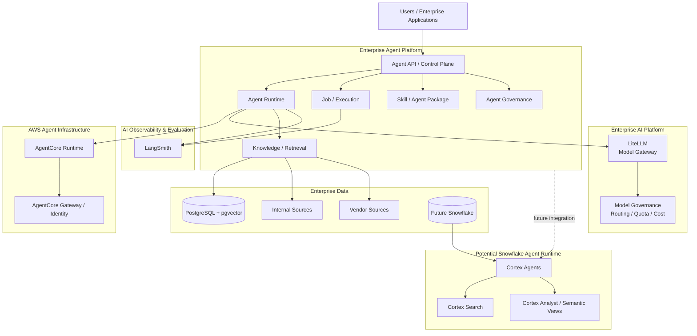
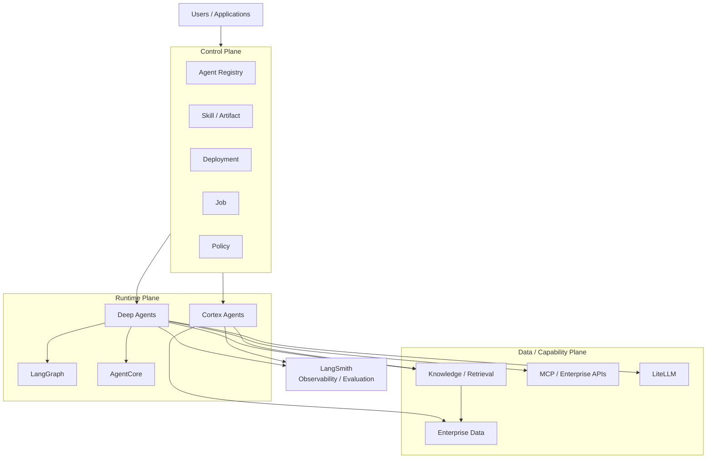
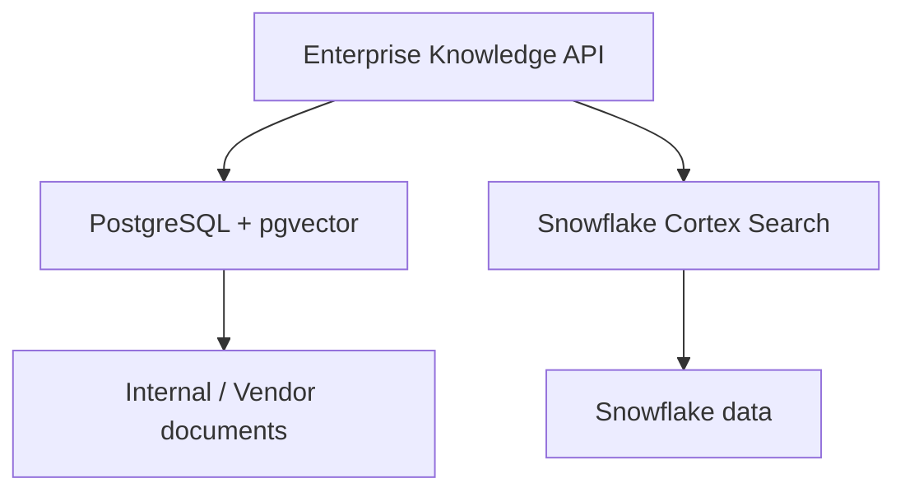
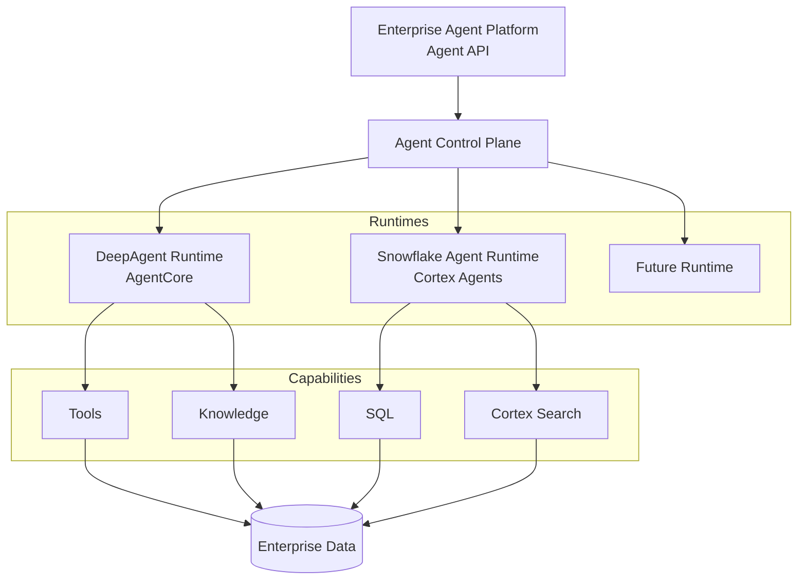

# Enterprise Agent Platform Architecture Review

本文基于当前实际技术栈（LiteLLM / FastAPI / LangChain Deep Agents / LangGraph / AWS Bedrock AgentCore / LangSmith / PostgreSQL + pgvector）做出判断，并针对未来接入 Snowflake Cortex Agents 的路径给出边界设计。

## 1. Executive Summary

### Current maturity

上一版报告的结论是「目前还缺少很多 Agent Platform 基础能力」。这个判断已经不成立。

补充以下事实之后，结论需要改成：

> **当前 Agent Platform 的技术底座已经基本完整，下一阶段的主要架构风险不是能力缺失，而是多个平台之间的职责边界、运行模型与治理模型。**

- LangSmith 已经集成 → Observability / Evaluation **不再是缺失能力**。
- PostgreSQL + pgvector 已经是当前 Hybrid Search 的基础设施 → 不需要急着把 Retrieval 拆成独立平台服务，当前更准确的定位是 Agent Platform 内的 **Knowledge / Retrieval Capability**。
- MCP 主要通过流程、架构 Pattern 治理 → **不要求再造一个重型 MCP Gateway / Tool Registry Platform**，重点应审查治理模式是否足够强，而不是技术组件数量。
- 未来可能接入 Snowflake / Cortex Agents → 需要设计 **「自建 Agent Runtime 与 Data-Native Agent Runtime 并存」**，而不是把 Snowflake 当成另一个 LLM Provider。
- AgentCore + LangSmith + PostgreSQL + LiteLLM 已经构成比较成熟的技术底座 → 审核重点从「缺什么组件」转向 **「边界是否清楚、职责是否重叠、企业治理是否闭环」**。

按这个口径重新打分：

| 能力 | 现状 | 判断 | 风险 |
| --- | --- | --- | --- |
| LiteLLM 作为统一 Model Gateway | 已有 | 定位正确 | 低 |
| Deep Agents 作为 Agent Harness | 已有 | 定位正确 | 低 |
| AgentCore 作为 Agent Runtime | 已有 | 定位正确，不应自建 microVM / session | 低 |
| FastAPI 作为 Platform API | 已有 | 定位正确，但**不应承载 Runtime** | 低 |
| **LangSmith 承担 Observability / Evaluation** | 已集成 | 能力已具备，**不再是缺口** | 低 |
| **PostgreSQL + pgvector 作为 Knowledge 基础设施** | 已建成 | 当前阶段合理，无需拆分 | 低 |
| ZIP 上传 Skill | 已有 | 必须改变安全 / 版本模型 | **高** |
| Job 执行 | 已有 | 不能只是 FastAPI BackgroundTask | **高** |
| **Control Plane / Runtime Plane / Data Plane 边界** | 未定义 | **当前最大风险** | **高** |
| **Runtime abstraction** | 未定义 | 接入 Snowflake 之前必须定义 | **高** |
| Agent / Skill / Deployment immutable version | 部分 | 需要补齐 artifact 与 rollback | **高** |
| Identity / Authorization | 部分 | 需要「平台权限 + 数据平台原生权限」双层 | **高** |
| 与 LangSmith Deployment 的重复度 | 未评估 | 需要明确分工，避免重复造 | **中高** |
| PostgreSQL / LangSmith / Snowflake 数据职责 | 未定义 | 接入 Snowflake 前必须明确 | **中高** |
| MCP 治理 | 走架构 Pattern | 模式合理，需补最小执行元数据 | **中** |

### Main architectural risks

**风险一：平台职责边界没有先定义，正在同时被五个组件承担。**

```text
AgentCore 做一点
LangGraph 做一点
FastAPI 做一点
LangSmith 做一点
LiteLLM 做一点
```

如果 ownership 不先定下来，最终会出现 3 套 state、2 套权限、2 套 tracing、2 套 job system。

**风险二：接入 Snowflake Cortex Agents 之后，三处边界可能同时失效。**

- Runtime 边界：Cortex Agents 本身就是一个 managed agent platform，不是「Snowflake 里的 LLM API」。如果仍按单一 Runtime 建模，Agent API 会被迫暴露两套运行语义。
- 权限边界：Cortex Agents / Cortex Search 有自己的 Snowflake privilege 与 execution context 治理模型，「在 Agent Platform 授权一次就代表全部授权」不成立。
- 检索边界：PostgreSQL + pgvector 与 Cortex Search 必须能被同一层抽象调用，否则每个 Agent 会各自绑定一个检索提供方。

**风险三：可能正在重复建设 LangSmith Deployment 已经提供的那一层。**

LangSmith Agent Server 已经提供 Postgres、Task Queue、Runs、Threads、Assistants、Cron Jobs、Persistence，并采用 API server + queue worker + Redis + PostgreSQL 的运行模型。([Docs by LangChain][4]) 如果自建那一层的理由只是「需要一个 `/run-agent` API 和 Job API」，那部分是重复建设。

**风险四：MCP 若按重型技术 Registry 建设，会与既有的架构 Pattern 治理冲突。**

治理靠流程、模板和 Reference Architecture 已经成立时，再建一套 MCP Governance Platform 会形成两个权威源。

### Key recommendations

按优先级收敛为四件事：

1. **先定边界，再谈能力。** 明确 Control Plane / Runtime Plane / Data & Capability Plane 各自拥有什么（第 3 章），并把职责矩阵落成文档。
2. **定义 Runtime abstraction。** 让 AgentCore 与未来 Cortex Agents 成为同一抽象下的两个 Runtime Provider（第 5 章）。
3. **定义数据与权限的双层模型。** PG / LangSmith / Snowflake 三处数据职责（第 12 章）；平台权限与数据平台原生权限分离（第 9 章）。
4. **把 MCP 治理从「技术治理」改为「架构治理」**，只补最小执行元数据（第 8 章）。

完整的 P0 / P1 / P2 见第 14 章。

## 2. Current Platform Landscape

整个体系由两个企业平台组成：

```text
Enterprise AI Platform
        │
        │ Model Access / Model Governance
        ▼
     LiteLLM
        │
        ▼
Enterprise Agent Platform
        │
        ├── Agent Definition / Skill
        ├── Agent Runtime
        ├── Job / Execution
        ├── Knowledge / Retrieval
        ├── Governance
        └── Observability / Evaluation
        │
        ├──────── LangSmith
        ├──────── AgentCore
        ├──────── PostgreSQL / pgvector
        └──────── Future: Snowflake / Cortex Agents
```

当前体系不是一个单纯的 Agent Framework，而是由两个企业平台组成。右侧的四个组件就是它现在的落地方式：Observability / Evaluation 由 LangSmith 承担，Runtime 由 AgentCore 承担，Knowledge / Retrieval 建立在 PostgreSQL + pgvector 上，Snowflake / Cortex Agents 是未来需要提前纳入边界的第二组能力。

### 2.1 Enterprise AI Platform

定位：

> **Model & AI Gateway**

主要职责：

```text
Model Provider abstraction
Model routing
Credentials
Quota
Cost
Model policy
Provider governance
```

底层：

```text
LiteLLM
   │
   ├── OpenAI
   ├── Claude
   ├── Gemini
   └── Other LLM providers
```

这一层的判断没有变化：用 LiteLLM 统一收敛模型入口是正确的，模型路由、凭据、配额、成本与 provider 治理都应该留在这里，而不是下沉到每个 Agent。

### 2.2 Enterprise Agent Platform

定位：

> **Agent Runtime & Application Platform**

负责：

```text
Agent definition
Skill
Agent execution
Job execution
Knowledge / Retrieval
Tool / MCP integration
State
Observability
Evaluation
Agent lifecycle
```

核心技术：

```text
FastAPI
   │
Deep Agents / LangGraph
   │
AWS AgentCore
   │
LangSmith
   │
PostgreSQL + pgvector
```

这个定位比上一版报告的：

> Agent Control Plane + Runtime + Tool/Data + RAG/Search + Job

更准确。差别在三点：

- **LangSmith 已经是组成部分**，不是「需要补齐的外部能力」。它承担 trace、evaluation、dataset、feedback 与部署侧运行模型。
- **PostgreSQL / pgvector 已经是平台正式的数据与检索基础设施**，不是「未来待拆的实验模块」。它同时承载 agent metadata、state、job metadata 与 knowledge metadata。
- **Tool / MCP 这一层是「接入与执行」**，不是「另建一套治理体系」。治理走架构 Pattern，平台负责执行这些标准。

### 2.3 LangSmith

LangSmith 在当前体系里承担两类职责：

```text
Observability / Evaluation
├── tracing
├── offline evaluation
├── online evaluation
├── datasets
├── feedback
└── monitoring
```

以及部署侧已经具备的运行模型：

```text
Agent Server
├── Postgres
├── Task Queue
├── Runs
├── Threads
├── Assistants
└── Cron Jobs
```

因此本报告不再把 Observability / Evaluation 列为 P0/P1 缺口，改为在**第 11 章**审查「LangSmith 与 AgentCore、Enterprise Platform 如何分工」。

### 2.4 AgentCore

AgentCore 在当前体系里承担 Agent Runtime：

```text
Runtime
Identity
Gateway
Memory
Browser
Code Interpreter
Observability
```

AgentCore Runtime 是专门的 Agent 执行环境，支持 session isolation、identity、observability，并支持 LangGraph、CrewAI、Strands 等框架；Runtime 可以直接支持多种框架，模型也不要求绑定 Bedrock，可以接 OpenAI、Gemini、Claude 等。([AWS Documentation][1])

结论：

> **选 AgentCore 作为 Runtime 底座是合理的，不应该自建 microVM isolation / agent runtime / session infrastructure。**

需要重新判断的是 Gateway 部分：AgentCore Gateway 已经把 tools / agents / models 的访问入口、多 MCP target 聚合、policy-based authorization 与 observability 产品化。([AWS Documentation][21]) 所以问题不是「要不要建 Gateway」，而是「哪些 Gateway 能力直接用 AgentCore，哪些必须由 Enterprise Agent Platform 自己实现」。

### 2.5 PostgreSQL + pgvector

PostgreSQL + pgvector 现在是平台的正式组件，承担：

```text
PostgreSQL
    │
    ├── Agent metadata
    ├── Agent state
    ├── Job metadata
    ├── Knowledge metadata
    ├── Document metadata
    └── pgvector
          └── embeddings
```

但要注意一条边界：

> **不要把 PostgreSQL 变成「什么都存」。**

未来接入 Snowflake 之后的正确分工是：

```text
Transactional / operational state
        ↓
PostgreSQL

Enterprise analytical / data warehouse
        ↓
Snowflake

Agent trace / evaluation
        ↓
LangSmith
```

### 2.6 Future Snowflake / Cortex

Snowflake 的定位需要提前写清楚，因为它直接决定 Runtime、Agent API、权限与 observability 的设计：

> **Snowflake Cortex Agents 应该被视为「潜在的第二 Agent Runtime」，而不是简单的数据源或 LLM Provider。**

原因：Cortex Agents 目前是一个完整的 managed agent platform，可以调用 Cortex Search、使用 Cortex Analyst / semantic views、使用 SQL、调用 tools、管理 threads，并在 Snowflake governed environment 中执行。([Snowflake Documentation][17]) 而且 Snowflake 已明确建议从 Cortex Analyst 向 Cortex Agents 迁移，把 structured data 与 unstructured data retrieval、tool calling 与 orchestration 都放进 Cortex Agents。([Snowflake Documentation][18])

因此：

> **Snowflake Cortex Agents 不应该画在 AI Platform 下面。**

它应该画成 **Enterprise Data Platform 内的一种 Data-Native Agent Runtime / Agent Capability**。这是后续架构审核中非常重要的一点。

### 2.7 平台边界图

当前最推荐用这张图，而不是上一版报告里那张把 Retrieval、MCP Gateway、Observability 全部并列成独立平台服务的图：



这张图相对上一版有三处关键变化：

| 变化 | 上一版 | 本版 |
| --- | --- | --- |
| Observability / Evaluation | Agent Platform 内待建的一个模块 | 独立的 `AI Observability & Evaluation` 层，由 LangSmith 承担 |
| Retrieval | 独立的 `Retrieval Service` | Agent Platform 内的 `Knowledge / Retrieval` Capability，底层是 PostgreSQL + pgvector |
| Snowflake | 未出现，或被视为数据源 | `Potential Snowflake Agent Runtime`，与自建 Runtime 并列 |

## 3. Architectural Boundary

这一章是本报告的主框架。当前最推荐用来做 Architecture Review 的，是三个平面：



### 3.1 Control Plane

管理：

```text
What agent exists?
Which version?
Who owns it?
Who can deploy?
Who can run?
Which policy?
Which runtime?
```

Control Plane 是平台自己必须拥有的部分，也是当前最值得投入工程资源的部分。

### 3.2 Runtime Plane

负责：

```text
How does the agent execute?
```

Runtime Plane 的成员是**可替换的 Runtime Provider**，而不是平台的私有机能：Deep Agents / LangGraph、AgentCore、以及未来的 Cortex Agents 都属于这一层。平台不应该把自己的编排能力写死在某一个 Runtime 上。

### 3.3 Data / Capability Plane

负责：

```text
What can the agent access?
```

这一层包含 Knowledge / Retrieval、MCP / Enterprise APIs、LiteLLM 与 Enterprise Data。它的输出是**受治理的访问能力**，不是数据副本。

### 3.4 三平面与既有认知的对应关系

| 平面 | 回答的问题 | 当前实现 | 需要新增的判断 |
| --- | --- | --- | --- |
| Control Plane | 有什么 Agent、谁能跑 | 自建 FastAPI | Agent / Skill / Deployment / Run / Job 生命周期与版本模型 |
| Runtime Plane | Agent 怎么执行 | DeepAgents + LangGraph + AgentCore | Runtime abstraction，容纳 Cortex Agents 与未来 Runtime |
| Data / Capability Plane | Agent 能访问什么 | PostgreSQL + pgvector、MCP、LiteLLM | Retrieval abstraction 与双层授权 |

## 4. Agent Lifecycle

### 4.1 Skill / Agent / Deployment 必须拆成三个概念

推荐的生命周期：

```text
Skill
  ↓
Agent Definition
  ↓
Agent Version
  ↓
Deployment
  ↓
Run
  ↓
Job
```

例如：

```text
Skill:
financial-research@1.4.2

Agent:
InvestmentResearchAgent

Agent Version:
v12

Deployment:
prod

Run:
run-78291

Job:
job-10291
```

区分它们是可回滚的前提：

```text
prod → v12
         ↓
         rollback
         ↓
       v11
```

### 4.2 Immutable Artifact 与版本模型

AgentCore 本身已经采用 immutable runtime version 的思路，用版本保存完整配置并支持 rollback。([AWS Documentation][3]) 平台侧应该保持同样的模型：

```text
Skill
├── metadata
├── instructions
├── tools
├── dependencies
├── permissions
├── runtime requirements
└── version
```

关键判断：

> **`prod` 指向的是一个 immutable 的 Agent Version，而不是一个可变的配置文件。**

### 4.3 Lifecycle 状态

```text
Draft
 ↓
Test
 ↓
Approved
 ↓
Published
 ↓
Deprecated
 ↓
Retired
```

### 4.4 State model 必须分开

```text
Agent definition
Agent memory
Conversation state
Run state
Job state
Artifacts
```

这几类 state 的所有者与生命周期不同。把它们混成一个「Agent 状态」，是在接入第二个 Runtime 之后最先出问题的地方。

### 4.5 Registry 概念模型

```text
Agent Registry
Skill Registry
Tool Registry
Model Registry
Knowledge Source Registry
Dataset Registry
Evaluation Registry
Policy Registry
Deployment Registry
```

一个 Agent 的完整引用关系：

```text
Agent
InvestmentResearchAgent
   │
   ├── Skill
   │     └── research@1.2.3
   │
   ├── Model
   │     └── claude-sonnet-x
   │
   ├── Tools
   │     ├── internal-search
   │     ├── market-data
   │     └── portfolio-api
   │
   ├── Knowledge
   │     ├── internal-research
   │     └── vendor-x
   │
   ├── Policy
   │     └── investment-policy-v4
   │
   └── Deployment
         └── prod-v17
```

这样平台才真正拥有一个 **Agent Supply Chain**。

注意：Registry 是 **Control Plane 的概念模型**，不需要每一个都做成独立服务。Tool Registry 尤其不应被做成重型平台（见第 8 章）。

## 5. Runtime Architecture

### 5.1 DeepAgents / LangGraph

Deep Agents 本身已经提供：

```text
planning
filesystem
subagents
memory
human-in-the-loop
skills
tools
```

而 Deep Agents 底层又是 LangGraph runtime。LangGraph 本身负责 state、checkpoint、streaming、interrupts 等。([Docs by LangChain][2])

因此平台**不需要**自建：

```text
custom agent loop
custom memory
custom checkpoint
custom runtime
custom sandbox
```

### 5.2 AgentCore

AgentCore 已经提供：

```text
runtime
session isolation
identity
gateway
observability
memory
browser
code execution
```

AWS 当前的 Runtime 已经把每个 session 放进隔离 microVM，并支持 workload identity。([AWS Documentation][1]) 所以 self-host 与 isolated runtime 这一层交给 AgentCore，平台不必重造。

### 5.3 Future Cortex Agents：Platform-native 与 Data-native 两类 Agent

Snowflake Cortex Agents 已经不是「Snowflake 里的 LLM API」。它目前是一个完整的 managed agent platform，可以调用 Cortex Search、使用 Cortex Analyst / semantic views、使用 SQL、调用 tools、管理 threads，并在 Snowflake governed environment 中执行。([Snowflake Documentation][17])

因此未来应该把 Agent 分成两类：

**Platform-native Agent**

```text
Agent Platform
  ↓
DeepAgents
  ↓
AgentCore
  ↓
LiteLLM
```

适合：

```text
general agent
external API
MCP
multi-step workflows
code execution
complex orchestration
```

**Data-native Agent**

```text
Snowflake
  ↓
Cortex Agents
  ↓
Cortex Search
  ↓
Semantic Views / SQL
```

适合：

```text
data analysis
research over enterprise data
SQL
structured + unstructured analytics
Snowflake-native governance
```

因此结论不是：

> 「未来 Snowflake Agent 是我们 Agent Platform 的替代品。」

而应该是：

> **Agent Platform 成为企业统一的 Agent Consumption / Governance Layer，同时允许不同 Runtime Provider 并存。**

### 5.4 Runtime abstraction

这是接入 Snowflake 之前必须完成的设计。建议结构：

```text
Agent
  │
  ▼
Agent Execution Contract
  │
  ├── DeepAgentRuntime
  │       └── AgentCore
  │
  ├── SnowflakeAgentRuntime
  │       └── Cortex Agents
  │
  └── FutureAgentRuntime
```

Runtime 接口的最小集合：

```text
AgentRuntime
----------------------------
create_run()
get_run()
cancel_run()
resume_run()
stream_events()
get_result()
```

这样平台 UI / API 不需要知道：

```text
这是 LangGraph？
这是 AgentCore？
这是 Cortex Agents？
```

平台只处理：

```text
Agent
Agent Version
Runtime
Run
Job
Policy
Trace
```

这个架构成熟度会比现在高一个层级，也是「Runtime-neutral」这个定位能成立的技术前提。

## 6. Model Architecture

### 6.1 AI Platform 与 Agent Platform 的分工

模型相关能力全部留在 AI Platform：

```text
Model Provider abstraction
Model routing
Credentials
Quota
Cost
Model policy
Provider governance
```

Agent Platform 只消费统一的模型入口，不直接持有 provider 凭据，也不自行实现路由与配额判断。

### 6.2 Provider abstraction

```text
Enterprise Agent Platform
        │
        ▼
     LiteLLM
        │
        ├── OpenAI
        ├── Claude
        ├── Gemini
        └── Other LLM providers
```

需要留意的边界：Cortex Agents **不是** LLM Provider，它是 Runtime。把 Snowflake 放进 LiteLLM 的 provider 列表，会在 Runtime、权限与 observability 三处同时出错。

### 6.3 Model governance

```text
Which model is allowed?
For which agent / deployment?
At what cost ceiling?
With what data classification?
```

Model policy 归 AI Platform；Agent 侧只声明需求（能力、上下文长度、成本档位），不写死具体模型版本，否则模型升级会变成一次平台发布。

## 7. Knowledge & Retrieval

### 7.1 PostgreSQL + pgvector 是当前阶段的正确选择

上一版报告建议「长期应该拆成 Retrieval Service」。这个强建议现在撤回。

当前已经有：

```text
PostgreSQL
+
pgvector
+
Hybrid Search
```

那么当前阶段完全合理：既没有跨应用复用的真实压力，也没有多租户检索隔离的独立需求。此时拆出一个 Retrieval Service，只会多一套部署、一套鉴权、一套 SLO，而不会带来架构上的收益。

定位相应调整为：

> **Knowledge / Retrieval 是 Agent Platform 内部的能力（Capability），不是独立平台服务。**

### 7.2 Hybrid Search

```text
keyword
+
embedding
```

这是正确的。业界的 Hybrid Retrieval 本身也是 sparse + dense，然后 merge / rerank。Haystack 也直接把这作为标准 Retrieval pattern。([Haystack][5])

所以真正需要研究的不是「BM25 还是 Vector」，而是**这两个检索源未来如何在同一个抽象下并存**。

### 7.3 ACL-aware Retrieval

金融企业环境里，Hybrid Search 真正需要审核的是授权：

```text
User
 ├── Department = Equity
 ├── Region = Japan
 └── Classification = Internal
```

那么：

```text
Search("company X")
```

不能是「先向量召回再过滤」：

```text
vector search top 50
    ↓
LLM filter
```

而应该：

```text
Authorization Filter
        ↓
Candidate Retrieval
        ↓
Hybrid Ranking
        ↓
Rerank
        ↓
Citation
```

也就是：

> **权限过滤应该发生在 Retrieval pipeline 内，而不是生成以后。**

否则这是非常严重的数据泄露风险：一旦无权限的 chunk 进入了候选集，它在 trace、日志、缓存与最终回答里都可能留下痕迹，事后无法收回。

### 7.4 Retrieval abstraction

真正应该设计的，不是「要不要拆 Retrieval Service」，而是：

> **Retrieval abstraction 应该放在哪里，才能让 PostgreSQL / pgvector 和 Snowflake Cortex Search 以后并存？**



Agent 不应该知道：

```python
search_pgvector(...)
```

也不应该知道：

```python
search_cortex_search(...)
```

而应该只调用：

```text
Knowledge Search
```

例如：

```text
search(
    query,
    knowledge_source,
    filters,
    top_k
)
```

底层：

```text
KnowledgeSource
    ├── PostgreSQLVectorSearch
    ├── SnowflakeCortexSearch
    ├── VendorSearch
    └── FutureSearchProvider
```

这样才能做到：

```text
Agent A
 → PostgreSQL

Agent B
 → Snowflake Cortex Search

Agent C
 → PostgreSQL + Snowflake

Agent D
 → Snowflake Cortex Agent
```

这比现在直接把 Hybrid Search 做成 Agent 的内部实现更有长期价值：它把「检索源」从 Agent 代码里挪到了配置与策略里。

### 7.5 Snowflake Cortex Search

Snowflake Cortex Search 本身已经提供 hybrid retrieval：vector + keyword + semantic reranking，并且可以作为 Cortex Agents 的 tool。Snowflake 官方现在明确把 Cortex Search 定位成企业非结构化数据的 hybrid search / RAG 能力。([Snowflake Documentation][16])

因此它在本报告里的位置是：

> **Knowledge / Retrieval 层的第二个 Retrieval Provider，与 PostgreSQL + pgvector 并列。**

注意它不是「数据源」：Cortex Search 自己就带检索语义与排序，把它当成一个只读表来 access，会丢掉它最有价值的部分。

### 7.6 Document metadata 与数据血缘

内部 + Vendor 数据的场景下，每个 chunk 至少保留：

```json
{
  "document_id": "...",
  "chunk_id": "...",
  "source": "vendor-x",
  "source_uri": "...",
  "classification": "internal",
  "owner": "...",
  "effective_date": "...",
  "version": "...",
  "ingested_at": "...",
  "acl": [...],
  "checksum": "..."
}
```

然后 Agent 返回：

```text
Answer
 ↓
Evidence
 ↓
Document
 ↓
Source
 ↓
Version
```

而不是：

```text
Answer + random citations
```

对金融环境尤其重要：缺少 `version` 与 `effective_date` 时，事后无法回答「当时它依据的是哪一版」。

## 8. Tool / MCP Governance

### 8.1 治理模式：架构 Pattern，而不是重型 Registry

上一版报告说「Tool / MCP Governance 很可能是目前最大的缺口」，这个判断需要降级。

如果 MCP 的注册与管控更多使用流程和架构 pattern 进行规范治理，这在 Enterprise 环境里其实是合理的：

```text
MCP Governance
       │
       ├── Architecture Pattern
       ├── Approved MCP Server Pattern
       ├── Security Pattern
       ├── Authentication Pattern
       ├── Data Access Pattern
       ├── Logging Pattern
       ├── Approval Process
       └── Exception Process
```

Agent Platform 只负责：

```text
discover
connect
invoke
observe
audit
```

而不是试图成为 MCP Governance Department。

结论：

> **MCP 不一定需要一个重型技术 Registry / Gateway；如果企业已经通过 Architecture Pattern、审批流程、标准模板和 Reference Architecture 进行治理，那么平台重点应是确保 Agent Platform 能执行这些标准，而不是重新实现一套 MCP 治理体系。**

### 8.2 Registration 与 Approval

既然治理靠 pattern，平台侧的 registration 就应该轻：

```text
MCP Server Registration
├── identity
├── owner
├── version
├── environment
├── declared scopes
└── approval reference
```

关键点是**引用**已有的审批结论，而不是在平台里重做一遍审批流程。

### 8.3 Runtime metadata：技术最小护栏

治理采用 Architecture Pattern，不代表平台可以不记录执行事实。至少需要能串起：

```text
Agent
  ↓
MCP Server
  ↓
Tool
  ↓
Version
  ↓
Identity
  ↓
Invocation
  ↓
Result
```

因此最小执行元数据：

```text
MCP metadata
MCP server identity
owner
version
environment
trace_id
authorization context
```

但要明确区别：

> **这些是 execution metadata，不等于要重新做一个 MCP Governance Platform。**

前者是「事后能回答谁在什么时候调了哪个版本的工具」，后者是「再造一套权威源」。这两件事的工程量差一个数量级。

### 8.4 Approval：按 Tool Risk 分级

企业尤其金融环境，Human-in-the-loop 不应该被理解成「弹一个 Approval Dialog」：

```text
Tool Risk

LOW
  → automatic

MEDIUM
  → policy based

HIGH
  → human approval

CRITICAL
  → dual approval
```

例如：

```text
Search research
     ↓
LOW

Generate recommendation
     ↓
MEDIUM

Send external email
     ↓
HIGH

Execute trade
     ↓
CRITICAL
```

Deep Agents 自己已经支持 human-in-the-loop。([GitHub][10]) 但 Platform 层面还需要：

```text
Approval Policy
Approval Request
Approver
Timeout
Escalation
Audit
```

即：

> **Framework HITL ≠ Enterprise Approval Workflow**

前者的产物是一次运行中的中断与恢复；后者的产物是一条可审计的责任链，包括谁批的、依据什么、超时怎么升级。

### 8.5 Execution audit

审计需要回答的问题：

```text
which agent version
which tool + version
on behalf of which user
with which data scope
approved by whom
resulting in what
```

这些信息分散在 Agent Platform（agent / deployment / job）、AgentCore（runtime / session）、LangSmith（trace）与数据平台（数据访问）之间，靠 `trace_id` 串起来。

## 9. Identity & Security

### 9.1 四类身份必须分开建模

```text
User Identity
Agent Identity
Service Identity
Tool Identity
```

并且能够审计：

```text
who
 +
which agent
 +
which version
 +
which tool
 +
which data
```

### 9.2 User delegated identity vs Agent workload identity

企业 Agent 经常会遇到：

```text
User A
   ↓
Agent
   ↓
Research API
```

究竟 Research API 看到的是 `User A` 还是 `Agent X`？这是两个完全不同的 security model。

**User delegated identity**

```text
User
 ↓
Agent
 ↓
API
 ↓
on behalf of User
```

**Agent workload identity**

```text
Agent
 ↓
API
```

AWS AgentCore Identity 已经明确把 Agent 当成 workload identity 来管理，并支持 OAuth / API keys / corporate identity provider。([AWS Documentation][8]) 成熟架构要能同时支持这两种，并且由 Policy 决定某个 Tool 走哪一种。

### 9.3 Runtime identity

引入第二个 Runtime 之后，必须显式建模 Runtime 自己的身份：

```text
Agent Platform
   │
   ├── DeepAgentRuntime  → AgentCore Identity
   └── SnowflakeAgentRuntime → Snowflake role / service principal
```

平台不应该假设「Runtime 可以拿平台的身份去执行任何事」。Runtime identity 是权限收敛的锚点：当平台需要撤销一条路径时，撤的是 Runtime 的身份，而不是逐个 Agent 改配置。

### 9.4 Data authorization：平台权限 + 数据平台原生权限

这是接入 Snowflake 之后新增的一类问题，比单纯「加一个 Search Provider」严重得多。

未来的调用链会同时经过两个权限体系：

```text
Agent Platform
      │
      ├── PostgreSQL Retrieval
      │
      └── Snowflake Retrieval
```

而 Snowflake Cortex Agents / Cortex Search 自己有 Snowflake privilege 与 execution context 的治理模型。Snowflake 官方明确强调 Cortex Agents 在 Snowflake governed environment 中运行，并基于工具配置和 Snowflake privileges 控制数据访问。([Snowflake Documentation][17])

因此不能简单设计成：

```text
User Authorization
       ↓
Agent Platform
       ↓
everything is authorized here
```

而应该是：

```text
Enterprise User Identity
        ↓
Agent Platform Policy
        ↓
Runtime
        ↓
Data Provider
        ↓
Provider-native Authorization
```

也就是：

> **平台权限 + 数据平台原生权限，双层治理。**

这应该作为一条架构原则写进设计规范：平台不试图复制一份数据平台的权限模型，而是保证「平台授权通过」是「数据平台授权被执行」的必要条件，而不是替代。

### 9.5 Skill 的安全边界

Skill 最大的安全问题其实不是 Prompt Injection，而是：

**Supply chain**

```text
skill.zip
  ↓
requirements.txt
  ↓
pip install
  ↓
malicious dependency
```

**Arbitrary code execution**

```text
import os
subprocess.run(...)
requests.post(...)
```

这意味着 Skill 实际上是「用户上传代码 → 企业内部代码执行平台」，安全等级完全不同。

**Network egress**

```text
Agent
 ↓
HTTP request
 ↓
Internal API
 ↓
Third-party endpoint
```

因此必须定义：

```text
Skill Permission
├── model access
├── tool access
├── data source access
├── network egress
├── filesystem
├── shell
├── secret access
└── human approval
```

### 9.6 Secret management 与 network isolation

Secret 应该由平台统一注入，而不是让 Skill 从环境变量里自取：

```text
Skill
  ↓
Secret reference（不是 secret value）
  ↓
Platform Secret Store
  ↓
短时凭据 / 按需下发
```

网络侧至少需要三条规则：默认拒绝出网；允许的 egress target 需要在 Skill Manifest 里声明并审批；内部 API 的访问必须经过统一的 gateway，而不是从执行环境直连。

## 10. Execution & Job Architecture

### 10.1 三种执行模型

```text
Interactive Run

User
 ↓
Agent API
 ↓
Runtime
 ↓
stream result
```

```text
Background Job

User/API/Event
     ↓
Job Queue
     ↓
Scheduler
     ↓
Agent Runtime
     ↓
State / Artifact
     ↓
Result
```

```text
Scheduled / Cron

Cron / Trigger
     ↓
Job Queue
     ↓
Agent Runtime
```

不要做：

```python
@app.post("/job")
async def job():
    asyncio.create_task(run_agent())
```

这在企业生产环境很容易出问题：进程重启即任务丢失，且没有并发、配额与重试的落点。

### 10.2 Job 状态机与能力

```text
Job
├── queued
├── starting
├── running
├── waiting_approval
├── retrying
├── succeeded
├── failed
├── cancelled
└── expired
```

并且支持：

```text
idempotency
retry
timeout
cancellation
resume
dead-letter
concurrency limit
quota
priority
```

### 10.3 不要重复造 LangSmith Deployment

这一条值得单独审核。

LangSmith Agent Server 已经把 Agent execution 明确建模为 `assistants + threads + runs`，并支持后台 runs、cron jobs 与持久 state；运行时采用 API server + queue worker + Redis + PostgreSQL 的模型。([Docs by LangChain][4])([Docs by LangChain][20])

所以审核时应该问：

> **为什么要自己做这一层？**

如果答案是「Enterprise IAM / Security / AWS / Data / Process integration」，那完全合理——这些是 LangSmith 不承担的。

但如果只是「因为需要一个 `/run-agent` API 和 Job API」，那可能就是在重复 LangSmith Deployment。

一个可操作的判据：

| 自建理由是 | 判断 |
| --- | --- |
| 企业身份体系、AWS 资源边界、数据访问路径、审批流程集成 | 应该自建 |
| 只是任务队列、run 记录、thread 持久化、cron 调度 | 优先复用 |

## 11. Observability & Evaluation

### 11.1 分工原则

这里容易产生一个误区：

> AgentCore 有 tracing，LangChain 有 tracing，LangSmith 有 tracing，那就结束了。

不是。真正要审的是分工，而不是有没有。

**LangSmith 负责：**

```text
Agent trace
LLM trace
Tool trace
Evaluation
Experiment
Dataset
Feedback
Debugging
Quality
```

**Agent Platform 负责：**

```text
Agent lifecycle
Agent metadata
Deployment
Enterprise authorization
Job policy
Business workflow
Agent version
Enterprise audit
```

LangSmith 本身已经覆盖 tracing、evaluation、online / offline evaluation、datasets、feedback、monitoring 与 Agent deployment。([Docs by LangChain][19]) 因此平台不需要再建一套 tracing 或 eval 存储，只需要保证**自己的企业语义能挂到它的 trace 上**。

### 11.2 Trace correlation

企业需要的是贯穿全链路的一条 trace：

```text
User Request
 ↓
Agent
 ↓
LLM Gateway
 ↓
Model
 ↓
Tool
 ↓
Retrieval
 ↓
Document
 ↓
External API
```

统一 correlation ID：

```text
trace_id
  ├── request
  ├── agent_run
  ├── llm_call
  ├── tool_call
  ├── retrieval
  ├── document
  └── external_call
```

AgentCore 本身已经提供 Agent-specific tracing，可记录 agent steps、tool invocation 与 model interaction。([AWS Documentation][1]) OpenAI Agents SDK 也已经把 trace 模型扩展到了 generation、tool call、handoff、guardrail 等事件。([OpenAI GitHub][9])

把这些作为**平台事件**而不是绑定某一个 framework，是接入第二个 Runtime 之后唯一能保持链路完整的方式：Cortex Agents 的 trace 也必须能被同一条 correlation ID 关联。

### 11.3 Offline / Online evaluation

```text
Observability
= "发生了什么？"

Evaluation
= "做得好不好？"
```

例如：

```text
Run #123

Latency       19.2 sec
Cost          $0.18
Tool calls    7
Retrieval     13 docs

Quality:
Answer correctness      0.92
Citation correctness    0.88
Policy compliance       1.00
Tool success            0.96
```

### 11.4 Promotion gate

既然已经有 LangSmith，就应该进一步把 evaluation 定义成发布门禁：

```text
Agent Version
   ↓
Evaluation Dataset
   ↓
Regression
   ↓
PASS / FAIL
   ↓
Deploy
```

LangSmith 现在已经支持 offline evaluation、online evaluation、regression 与 CI/CD quality gates。([Docs by LangChain][19]) 平台侧要做的是把「哪个版本的 Agent 必须跑哪个数据集、达到什么阈值才允许发布」写成策略，而不是每次人工判断。

## 12. Data Ownership

这一张表比上一版报告的 Tool Registry 更有价值：它回答的是「同一份事实归谁所有」，而不是「有哪些组件」。

| 数据 | Owner | 推荐存储 |
| --- | --- | --- |
| Agent metadata | Agent Platform | PostgreSQL |
| Skill metadata | Agent Platform | PostgreSQL |
| Job metadata | Agent Platform | PostgreSQL |
| Runtime state | Agent Runtime / LangGraph | PostgreSQL / AgentCore |
| Vector index | Knowledge layer | pgvector / Cortex Search |
| Document metadata | Knowledge layer | PostgreSQL |
| Raw enterprise data | Enterprise Data Platform | Snowflake / source system |
| Agent traces | LangSmith | LangSmith |
| Evaluation dataset | LangSmith | LangSmith |
| Model configuration | AI Platform | AI Platform |
| Audit record | Enterprise Governance | Enterprise audit system |

两条使用约束：

1. **同一份事实只有一个 owner。** 例如向量索引归 Knowledge layer，那么 Agent Runtime 就不应该缓存一份自己的索引结果作为事实来源。
2. **PostgreSQL 不是默认落点。** 新增一类数据时先问 owner 是谁，如果 owner 是 LangSmith 或 Snowflake，就不应该因为「PostgreSQL 已经在了」而落进 PostgreSQL。

## 13. Industry Benchmark

### 13.1 按平台能力分层比较

上一版报告直接列「AWS / LangSmith / Dify / Langflow」，粒度不一致。改用平台能力分层比较：

| 能力 | 你们 | AWS AgentCore | LangSmith | Snowflake Cortex Agents | Microsoft Foundry |
| --- | --- | --- | --- | --- | --- |
| Agent Runtime | AgentCore + DeepAgents | **强** | **强** | **强** | **强** |
| Agent Control Plane | 自建 | AWS | **强** | **强** | **强** |
| Model Gateway | LiteLLM + AI Platform | Bedrock-centric + external support | 多 provider | Snowflake-native | Azure AI |
| Observability | **LangSmith** | AgentCore | **强** | Snowflake | **强** |
| Evaluation | **LangSmith** | 有 | **强** | 有 | **强** |
| Knowledge / RAG | **pgvector** | 自组合 | 可组合 | **Cortex Search** | 强 |
| Data Warehouse integration | 未来 Snowflake | AWS | 外接 | **原生** | Azure |
| MCP | Pattern governance | **Gateway** | **MCP / A2A** | 支持 | **Toolbox / MCP** |
| Enterprise IAM | 自建 / 企业 | **强** | 可集成 | **Snowflake native** | **强** |
| Job | 自建 | 强 | **强** | Agent threads / workflows | 强 |
| Self-host / enterprise control | **强** | AWS | **强** | Snowflake | Azure |
| Multi-runtime | **潜力很强** | AWS-centric | LangGraph-centric | Snowflake-centric | Microsoft-centric |

这张表里真正的差异化不在任何单一行，而在最后两行：

> **你们不是要和 AgentCore 比 Runtime，也不是和 LangSmith 比 Observability，更不是和 Snowflake 比 Data Agent。**
>
> **真正要做的是：把企业内部不同 Agent Runtime、不同模型、不同企业数据能力统一组织起来。**

### 13.2 AWS AgentCore

AgentCore 现在已经明显从「runtime」发展成一套 Agent infrastructure：

```text
Runtime
Identity
Gateway
Memory
Browser
Code Interpreter
Observability
```

并且 Runtime 可以直接支持 LangGraph / CrewAI / Strands / custom framework，同时模型并不要求绑定 Bedrock。([AWS Documentation][1])

关于 Gateway，需要重新定位一次。AWS 当前已经把 Gateway 定位成 agent 访问 tools / agents / models 的统一入口，可以聚合多个 MCP target，并支持对 Runtime 做 policy-based authorization 与 observability。([AWS Documentation][21])([AWS Documentation][6])

所以架构审核的问题应该改成：

> **「哪些 Gateway 能力由 AgentCore 使用，哪些必须由 Enterprise Agent Platform 自己实现？」**

而不是：

> 「我们要不要建设一个 Gateway？」

前者会让整体架构更合理，也避免重复造基础设施。你们应该重点造的是：

```text
Enterprise Control Plane
+
Enterprise Governance
+
Enterprise Data Access
```

### 13.3 LangSmith / LangGraph

这一套跟你们当前技术栈最接近。

LangSmith Deployment 已经明确分成：

```text
Control Plane
     ↓
Agent Server
     ↓
Data Plane
```

Agent Server 负责：

```text
graphs
state
persistence
execution
```

同时提供：

```text
assistants
threads
runs
cron jobs
```

以及 MCP / A2A / auth / memory。([Docs by LangChain][12])

与管理层的关系可以这样定位：

> **DeepAgents + LangGraph ≈ Agent execution substrate**
>
> **Enterprise Agent Platform ≈ LangSmith Deployment 再叠加 enterprise governance + AWS runtime + enterprise data**

这个定位非常清楚，同时也正是第 10.3 节那条「不要重复造」判断的来源：越是接近，越要在设计时明确哪一层由谁负责。

### 13.4 Snowflake Cortex Agents

Cortex Agents 已经是完整 managed agent platform，覆盖 Cortex Search、Cortex Analyst / semantic views、SQL、tools、threads 与 Snowflake governed execution。([Snowflake Documentation][17]) Cortex Search 本身也已经是 hybrid retrieval 能力。([Snowflake Documentation][16])

它对本报告的影响是结构性的，而不是「多一个数据源」：

- 它要求 Runtime abstraction 存在（否则 Agent API 会出现两套运行语义）；
- 它要求授权模型是双层的（Snowflake privilege 不能被平台授权取代）；
- 它要求 trace 相关模型跨 Runtime 成立；
- 它让「平台不绑定单一 Runtime」这个定位从抽象原则变成具体约束。

### 13.5 Microsoft Foundry 与 Google Agent Engine

**Microsoft Foundry Agent Service** 和你们目标非常接近，目前已经明确有：

```text
Agent Runtime
Toolboxes
Models
Observability
Optimization
Identity & Security
Publishing
```

并支持 versioning、stable endpoints、RBAC、VNet、MCP、tracing、evaluations、monitoring。([Microsoft Learn][7])

其中 `Toolboxes` 这一层（工具集中管理，通过统一 MCP endpoint 提供给多个 Agent，同时做 authentication / governance / versioning）比自建 MCP Registry 更值得参考。

**Google Agent Engine** 走的是：

```text
Agent Engine
 ├── Runtime
 ├── Sessions
 ├── Memory Bank
 ├── Code Execution
 ├── Example Store
 ├── Observability
 └── Governance
```

支持 Sessions、Memory Bank、Cloud Trace、Cloud Monitoring、Cloud Logging，并强调企业安全和数据驻留能力。([Google Cloud Documentation][11]) 它值得学习的是 **State / Memory / Session 的平台化建模**。

### 13.6 Dify 与 Letta

**Dify** 已经把 Workflow、RAG、Agent、Model Management、Observability、API 统一起来，并支持 self-hosting。([GitHub][13]) 但它更偏 AI application development platform，你们更偏 Enterprise Agent Infrastructure Platform，不能照搬 UI / workflow。值得参考的是 Knowledge lifecycle、RAG pipeline、Application → Agent → Workflow 的层次、Model abstraction 与 plugin/tool model。

**Letta** 强调 stateful agents、memory、skills、subagents，并支持 local / self-hosted / cloud。([GitHub][14]) 它一个非常值得借鉴的思想是：

> **Skill 是 Agent 的可组合能力，而不是简单的 ZIP 文件。**

它甚至明确区分 Memory 与 Skill：Skill 应该是可复用的行为 / 流程，长期事实才是 Memory。([GitHub][15]) 这个概念适合用在 Skill Registry 的设计上。

### 13.7 趋势：从 Agent Framework 进入 Agent Runtime Platform

```text
LangChain
      ↓
LangGraph
      ↓
Deep Agents
      ↓
LangSmith Deployment

AWS
      ↓
AgentCore Runtime
      ↓
Gateway / Identity / Memory / Observability

Google
      ↓
Agent Engine
      ↓
Sessions / Memory / Observability

Microsoft
      ↓
Foundry Agent Service
      ↓
Toolbox / Identity / Evaluation / Publishing
```

今天真正有竞争力的 Agent Platform 已经不是：

```text
Prompt
+
LLM
+
Tool
```

而是：

```text
Agent Lifecycle
+
Runtime
+
Identity
+
Tools
+
Data
+
State
+
Security
+
Evaluation
+
Observability
```

这个趋势对本报告的意义是：你们缺的不是其中某一项（多数已经有），而是**它们之间的归属关系**。

## 14. Gap Analysis

### P0 — 必须解决

**1. 明确 Control Plane / Runtime Plane / Data Plane 边界**

这是最高优先级。没有这张边界，后面所有设计都会变成逐组件打补丁。

**2. 定义 Runtime abstraction**

至少能够容纳：

```text
AgentCore
Cortex Agents
Future runtimes
```

**3. 定义 Agent / Skill / Deployment / Run / Job 生命周期**

**4. 定义统一 Identity / Authorization 模型**

尤其：

```text
User
Agent
Runtime
Data Source
Tool
```

并且明确「平台权限 ≠ 数据平台原生权限」。

**5. 定义 PostgreSQL / LangSmith / Snowflake 数据职责**

### P1 — 很重要

**6. Retrieval abstraction**

支持：

```text
pgvector
Cortex Search
future providers
```

**7. MCP execution metadata + 架构治理**

注意：是记录执行事实并确保平台能执行既有标准，**不是**建设新的 MCP Governance Platform。

**8. Job / async execution**

这一项仍然重要。LangSmith Agent Server 本身已经采用 task queue + PostgreSQL + Redis 的 durable execution 模型，可以作为 Job architecture 的参考。([Docs by LangChain][4])

**9. Evaluation gate**

既然已经有 LangSmith，就应该进一步定义：

```text
Agent Version
   ↓
Evaluation Dataset
   ↓
Regression
   ↓
Promotion
```

LangSmith 官方现在已经支持 offline evaluation、online evaluation、regression 与 CI/CD quality gates。([Docs by LangChain][19])

### P2 — 后续增强

```text
Agent Marketplace
A2A
advanced multi-agent orchestration
automated optimization
agent-to-agent discovery
```

这些现在都不是核心矛盾。

### 与上一版 P0/P1 的差异

| 上一版 | 本版处置 | 原因 |
| --- | --- | --- |
| Agent Observability 必须平台统一 | **移出 P0/P1** | LangSmith 已集成，能力已具备；改为审查分工 |
| Evaluation / Regression 必须补齐 | 降为 P1，且内容是定义 publication gate | LangSmith 已提供 evaluation 能力 |
| Tool / MCP Governance 是最大缺口 | 降为 P1，且改为「补执行元数据」 | 已用架构 Pattern 治理，不需要重技术平台 |
| Retrieval authorization / ACL trimming | 保留在 P0 的授权模型内 | 仍是金融场景的硬要求 |
| Hybrid Search 应拆成 Retrieval Service | **撤回** | 当前 PG + pgvector 合理；改为设计 retrieval abstraction |
| — | **新增 P0：三平面边界** | 当前最大风险 |
| — | **新增 P0：Runtime abstraction** | 接入 Snowflake 的前置条件 |
| — | **新增 P0：数据职责** | 避免跨平台重复存储 |

## 15. Target Architecture

### 15.1 长期定位

不建议把这个平台定义为：

> **Agent Framework Platform**

甚至也不建议只是：

> **Agent Platform**

更准确的是：

> **Enterprise Agent Platform = Runtime-neutral Agent Control & Governance Platform**

也就是「把企业内部不同 Agent Runtime、不同模型、不同企业数据能力统一组织起来」的那一层。



这个结构非常符合 Enterprise Architecture，而不是某一个框架项目。它与「我们的 Agent 平台就是 DeepAgents + AgentCore」的区别非常大：前者可以容纳第二个 Runtime，后者不能。

### 15.2 三个核心

**1. Agent Runtime**

```text
DeepAgents
LangGraph
AgentCore
Cortex Agents（未来）
```

负责「怎么跑」。

**2. Agent Governance**

```text
Identity
Policy
Tool
Skill
Deployment
Approval
Audit
Evaluation
Cost
```

负责「能不能跑、怎么跑」。

**3. Enterprise Knowledge & Data Access**

```text
Hybrid Search
Internal Data
Vendor Data
MCP
Enterprise APIs
ACL
Citation
```

负责「能访问什么」。

### 15.3 现在最值得做的一件架构调整

**不要继续横向增加 Agent Framework 能力。**

暂时不要自己投入做：

```text
custom agent loop
custom memory
custom checkpoint
custom runtime
custom sandbox
custom tracing / eval store
```

因为 DeepAgents + LangGraph + AgentCore 已经覆盖得很好，Observability / Evaluation 已经有 LangSmith，检索底座已经有 PostgreSQL + pgvector。Deep Agents 本身已经定位成 production-oriented agent harness，并把 runtime 能力下沉到 LangGraph；AgentCore 又提供隔离 runtime 和身份 / 网关等基础能力。([Docs by LangChain][2])

应该把工程投资集中到：

```text
                    Enterprise Agent Platform

              ┌─────────────────────────────┐
              │ Agent / Skill Registry      │
              │ Deployment / Versioning     │
              │ Runtime Abstraction         │
              │ IAM / Policy / Approval     │
              │ Job / Scheduler             │
              │ Data Ownership / Audit      │
              └─────────────┬───────────────┘
                            │
                    AgentCore Runtime
                            │
                   DeepAgents / LangGraph
                            │
             ┌──────────────┴──────────────┐
             │                             │
      Knowledge / Retrieval         Enterprise Tools
             │                             │
       Internal/Vendor               MCP / API / DB
             │                             │
             └──────────────┬──────────────┘
                            │
                       LiteLLM Gateway
                            │
                 OpenAI / Gemini / Claude
```

这样产品定位会非常清晰：

> **AI Platform 管模型；Agent Platform 管 Agent；Data / Tool Platform 管 Agent 能够接触的企业世界。**

这比把所有能力继续堆进一个 FastAPI + LangChain 服务要成熟得多，也比继续补 Agent Framework 功能更贴近当前的真正瓶颈。

[1]: https://docs.aws.amazon.com/bedrock-agentcore/latest/devguide/agents-tools-runtime.html "Host agent or tools with Amazon Bedrock AgentCore Runtime - Amazon Bedrock AgentCore"
[2]: https://docs.langchain.com/oss/python/deepagents/overview "Deep Agents overview - Docs by LangChain"
[3]: https://docs.aws.amazon.com/bedrock-agentcore/latest/devguide/runtime-how-it-works.html "microVMs - Amazon Bedrock AgentCore"
[4]: https://docs.langchain.com/langsmith/deployment "LangSmith Deployment - Docs by LangChain"
[5]: https://docs.haystack.deepset.ai/docs/retrievers "Retrievers"
[6]: https://docs.aws.amazon.com/bedrock-agentcore/latest/devguide/gateway-create.html "Create an Amazon Bedrock AgentCore gateway - Amazon Bedrock AgentCore"
[7]: https://learn.microsoft.com/en-us/azure/ai-foundry/agents/overview "What is Microsoft Foundry Agent Service? - Microsoft Foundry | Microsoft Learn"
[8]: https://docs.aws.amazon.com/bedrock-agentcore/latest/devguide/identity.html "Provide identity and credential management for agent applications with Amazon Bedrock AgentCore Identity - Amazon Bedrock AgentCore"
[9]: https://openai.github.io/openai-agents-python/tracing/ "Tracing - OpenAI Agents SDK"
[10]: https://github.com/langchain-ai/deepagents/blob/main/README.md "deepagents/README.md at main · langchain-ai/deepagents · GitHub"
[11]: https://docs.cloud.google.com/vertex-ai/generative-ai/docs/agent-engine/overview "Vertex AI Agent Engine の概要 | Vertex AI Agent Builder | Google Cloud Documentation"
[12]: https://docs.langchain.com/langsmith/components "LangSmith Deployment components - Docs by LangChain"
[13]: https://github.com/langgenius/dify/blob/main/README.md "dify/README.md at main · langgenius/dify · GitHub"
[14]: https://github.com/letta-ai/letta "GitHub - letta-ai/letta: Platform for stateful agents"
[15]: https://github.com/letta-ai/letta-code/blob/main/src/agent/subagents/builtin/reflection.md "letta-code/src/agent/subagents/builtin/reflection.md"
[16]: https://docs.snowflake.com/en/user-guide/snowflake-cortex/cortex-search/cortex-search-overview "Cortex Search | Snowflake Documentation"
[17]: https://docs.snowflake.com/en/user-guide/snowflake-cortex/cortex-agents "Cortex Agents | Snowflake Documentation"
[18]: https://docs.snowflake.com/en/release-notes/2026/other/2026-08-28-cortex-analyst-transition-cortex-agents "Aug 28, 2026: Snowflake recommends transitioning from Cortex Analyst to Cortex Agents | Snowflake Documentation"
[19]: https://docs.langchain.com/langsmith/evaluation "LangSmith Evaluation - Docs by LangChain"
[20]: https://docs.langchain.com/langsmith/agent-server "Agent Server - Docs by LangChain"
[21]: https://docs.aws.amazon.com/bedrock-agentcore/latest/devguide/gateway-core-concepts.html "Core concepts for Amazon Bedrock AgentCore Gateway - Amazon Bedrock AgentCore"

