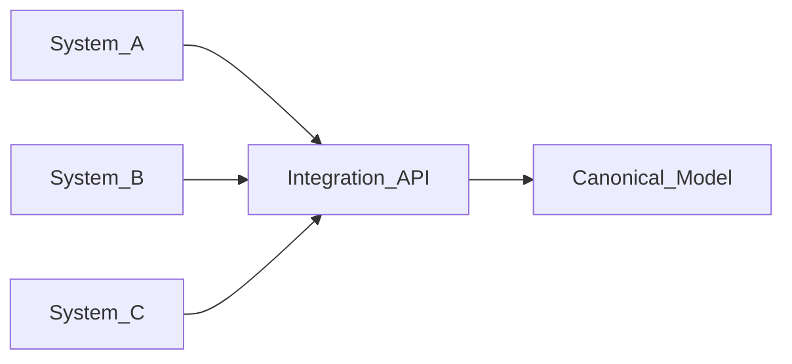
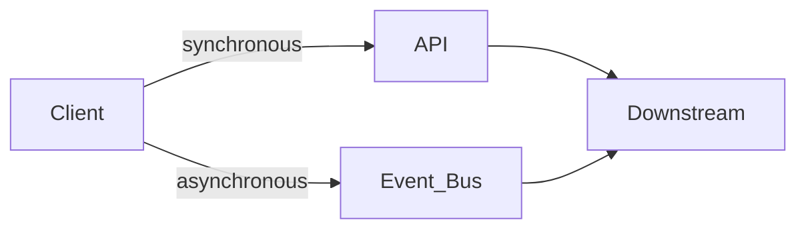

目标

本文档面向企业级 Integration API 的架构与设计要点，目标是将已有的 Spring Boot 服务演进为可复用、可治理的 API 产品。

设计维度概览（12 项）

1. API Contract

定义外部依赖契约：采用 OpenAPI 3.x，明确请求/响应模式、错误格式、分页、过滤与版本化策略（如 `/v1/...` 或基于 header 的版本管理），并保证向后兼容。约定时间戳与时区、空值语义、关联 ID（correlation ID）与幂等策略。

采用规范化（canonical）数据模型以避免点对点耦合，示例：



2. Integration Semantics

明确集成语义，包括投递语义（at-most-once / at-least-once）、处理模式（同步/异步）、重复消息处理、顺序保证、重试责任、超时边界、部分失败处理、分布式事务与一致性模型、重放与补偿策略。

示例：当下游 B 失败时，契约应明确这是事务失败、部分成功、自动重试还是需要补偿与异步恢复。

3. Reliability

设计应覆盖超时、重试（指数回退与抖动）、断路器、隔离（bulkhead）、限流、削峰、背压、连接池与下游健康检查、优雅降级等。避免多层重试导致请求放大（例如 Gateway × API × HTTP client 的链式重试）。

4. Idempotency

对会改变状态的端点（如 `POST /orders`、`POST /payments`）应支持 `Idempotency-Key`：计算请求指纹并查重，若已处理则返回缓存响应，否则继续处理。

5. Security

完整安全模型应包含认证、授权、权限与审计，技术选项包括 OAuth2/OIDC、mTLS、JWT、服务间认证、RBAC/ABAC、租户隔离、数据级权限、密钥/证书轮换、PII 掩码与加密与审计日志。必须区分 Authentication、Authorization 与 Entitlement。

6. API Gateway / Edge

边缘职责（认证、限流、WAF、配额、路由、版本管理、流控、网络策略）应下放到 API Gateway，由应用层专注业务编排、数据转换与下游调用，从而保持职责清晰。

7. Observability

标准化追踪与指标：Trace ID、Correlation ID、Request ID、Client ID、API/版本、下游节点、延迟、状态、错误与重试计数。推荐采用 OpenTelemetry、分布式追踪、结构化日志与指标，以便定位性能瓶颈与错误来源。

8. Error Model

统一错误契约，包含 HTTP 状态、业务错误码、是否可重试、correlationId 与详情字段。示例如下：

```json
{
	"code": "CUSTOMER_NOT_FOUND",
	"message": "Customer does not exist",
	"category": "BUSINESS",
	"retryable": false,
	"correlationId": "abc123",
	"details": []
}
```

该契约用于将传输层错误、业务语义、重试策略与链路追踪分离处理。

9. Downstream Capacity and Async Patterns

任一层成为瓶颈都会产生级联故障。不要默认所有调用都采用同步 HTTP，面对高吞吐或松耦合场景，应考虑引入异步消息总线（如 Kafka）或事件驱动架构：



10. Data Transformation

集成 API 的核心常在于数据转换：映射、丰富、归一化、验证、模式演进、代码/值映射、参照数据、时区/货币/单位/本地化等。转换逻辑应集中在独立的 transformation 或 pipeline 层，避免散落在 Controller 中。例如，不应在 Controller 中包含大量映射与验证代码：

```java
// 伪代码示例，避免在 Controller 中堆放大量转换逻辑
@PostMapping(...) 
public ResponseEntity<?> create(...) {
	// ...existing code...
}
```

11. Governance

若要成为企业级 API，应建立治理体系：API 设计标准、命名标准、版本策略、错误标准、安全标准、日志与可观测性标准、SLA 标准、弃用策略与数据分类。结合 API Gateway、API Catalog、Developer Portal、OpenAPI、Backstage 与 Service Registry，可形成完整的 API 产品化流程。

12. Operational Model

定义运营与支持模型：API owner、technical owner、business owner、support team、SLA/SLO、事件响应流程、值班与升级流程、灾备（DR）、RTO/RPO 与依赖归属。例如：

- Availability: 99.9%
- P95 latency: < 300ms
- P99 latency: < 1s
- RTO: 30 min
- RPO: 5 min
- Max payload: 5 MB
- Rate limit: 1000 RPS/client
- Deprecation window: 12 months

架构建议

将整体架构划分为 API/Experience 层、Integration/Domain 层与 Connectivity 层：

```mermaid
flowchart TB
	subgraph API_Layer[API / Experience]
		API[REST / Auth / Rate Limit]
	end
	subgraph Integration_Layer[Integration / Domain]
		Integration[Validation / Orchestration / Transformation]
	end
	subgraph Connectivity[Connectivity]
		Connectivity[Adapters: SAP / DB / Kafka / SaaS]
	end

	API --> Integration
	Integration --> Connectivity
```

在能成为企业级平台的情形下，应评估哪些能力保留在 Spring Boot 应用中，哪些下沉到 API Gateway、消息平台、Schema Registry、IAM 或可观测性平台。

核查清单（示例）

- API Contract 是否可长期兼容？
- 是否存在 canonical data model？
- Integration Semantics（sync/async、ordering、consistency）是否明确？
- Reliability（timeout/retry/circuit breaker）是否完备？
- Idempotency 是否能避免重复业务？
- Security（auth/authorization/entitlement）是否分层并落实？
- Transformation 是否独立于 API 层？
- Scalability：burst、P99、下游瓶颈如何应对？
- Observability：单次请求能否端到端追踪？
- Error 是否统一错误契约？
- Governance：API 是否可发现、管理与弃用？
- Operations：SLA/SLO、owner/DR 是否明确？

下一步

1. 将剩余的碎片句与 AI 风格表达合并为流畅段落。
2. 将剩余 ASCII 图转换为 Mermaid（节点命名遵循规范）。
3. 为缺失语言标注的代码块添加语言标识并重新运行验证。

完成这些项后，再次运行验证并审阅差异。
