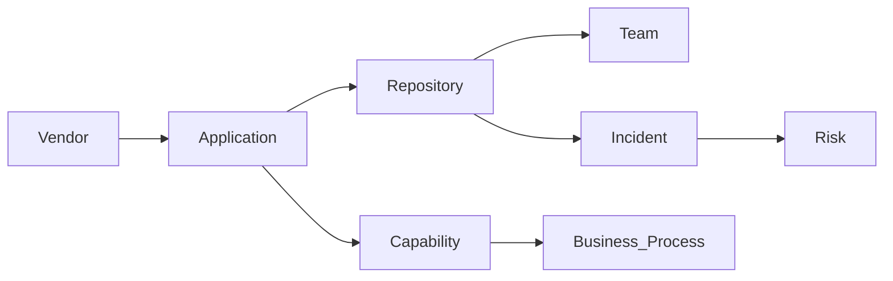

我会把整个 Proposal 写得更偏 **Architecture Vision Document（架构愿景文档）**，而不是介绍某个 Agent Skill。因为真正打动架构师、EA、CTO 的不是技术栈，而是**为什么企业需要这样一个新的能力（Capability）**。

---

# Enterprise Research Agent —— 面向企业知识工作的 AI 研究员

## 摘要（Executive Summary）

过去十多年，企业知识管理经历了几个阶段。

第一阶段是 **Enterprise Search（企业搜索）**，帮助员工找到文档。

第二阶段是 **Enterprise RAG（检索增强生成）**，帮助员工理解文档内容，并回答文档中的问题。

然而，对于企业中的大量知识工作而言，真正的需求既不是搜索，也不是问答，而是**研究（Research）**。

例如：

> 我们是否已经与 RiskConcile 合作过？

> MAS TRM 新规将影响哪些业务系统？

> ESG 在公司内部涉及哪些项目、应用和数据？

> Open Banking 相关能力目前由哪些团队负责？

这些问题通常需要企业架构师、业务分析师、风险分析师或技术负责人花费数小时甚至数天，在多个系统之间来回切换，收集信息、交叉验证、分析影响，最终形成结论。

**Enterprise Research Agent** 的目标不是回答一个问题，而是**完成一项研究任务（Research Task）**。

它能够跨越企业内部多个知识系统收集证据，自动建立实体关联，识别冲突和知识缺口，并结合外部公开资料完成验证，最终输出一份具有完整证据链的研究报告。

它更接近一位企业研究员，而不是一个搜索引擎。

---

# 企业真正的问题

企业并不缺少知识，而是缺少**能够连接知识的能力**。

企业知识通常分散在不同的平台中：

| 知识领域  | 典型系统                           |
| ----- | ------------------------------ |
| 文档知识  | Confluence、SharePoint、Wiki     |
| 工程知识  | GitHub、GitLab、Azure DevOps     |
| 运维知识  | Jira、ServiceNow                |
| 企业架构  | LeanIX、OpenMetadata、DataHub    |
| 数据资产  | Data Catalog、Metadata Platform |
| 安全与合规 | IAM、漏洞平台、审计系统                  |

与此同时，企业还需要持续关注外部信息，例如：

* Vendor 官方资料
* 云厂商最佳实践
* 行业标准
* 法规政策
* GitHub 开源社区
* 学术论文
* 新闻与研究报告

这些知识彼此独立，没有统一的数据模型，也没有统一的上下文。

因此，一个简单的问题，往往需要人工不断切换系统、比对信息、判断哪些内容可信、哪些信息已经过时，最后才能形成结论。

真正耗费时间的，从来不是搜索，而是调查（Investigation）。

---

# 从 Search 到 Research

Enterprise Research Agent 与传统 Enterprise Search 有着完全不同的目标。

| Enterprise Search | Enterprise Research Agent |
| ----------------- | ------------------------- |
| 查找文档              | 完成研究任务                    |
| 返回搜索结果            | 输出研究报告                    |
| 以文档为中心            | 以实体和证据为中心                 |
| 单一数据源             | 多系统协同调查                   |
| 用户自行分析            | Agent 自动综合分析              |
| 回答问题              | 形成结论并提出建议                 |

搜索回答的是：

> 文档在哪里？

Research 回答的是：

> 企业内部到底发生了什么？为什么会这样？还有哪些地方值得进一步调查？

因此，它更接近企业调查研究，而不是传统意义上的 RAG。

---

# Research Workflow

无论研究什么主题，本质上都会经历相同的调查流程。

```mermaid
flowchart LR

Question

--> Research Planning

--> Evidence Collection

--> Identity Resolution

--> Evidence Correlation

--> Gap Analysis

--> External Verification

--> Research Report
```

整个流程围绕**证据（Evidence）**不断积累认知，而不是不断搜索更多文档。

---

## 研究规划（Research Planning）

首先，Agent 会理解用户真正想解决的问题，并将研究目标拆解成多个可执行的调查任务。

例如：

> 研究 RiskConcile

并不是简单搜索关键词，而会自动形成研究计划，例如：

* Vendor 基本信息
* 公司是否已经采购
* 哪些应用正在使用
* 哪些 Repository 与其相关
* 是否发生过 Incident
* 是否存在合同
* 是否存在风险
* 外部行业评价如何

整个过程更像高级分析师制定研究方案，而不是执行搜索。

---

## 证据收集（Evidence Collection）

随后，Agent 根据研究计划，从企业各个系统收集证据。

这里强调的是**Evidence（证据）**，而不是 Document（文档）。

一条 Jira Ticket 可以成为证据。

一个 GitHub Repository 可以成为证据。

LeanIX 中的一个 Application 可以成为证据。

ServiceNow 中的一条 CMDB 记录也可以成为证据。

Agent 并不会区分这些来源，而是统一将它们视为支持研究结论的证据。

---

# Identity Resolution —— 建立统一身份

企业最大的困难，并不是数据不足，而是同一个对象在不同系统中的表示完全不同。

例如同一个 Vendor：

| 系统         | 名称                   |
| ---------- | -------------------- |
| Confluence | RiskConcile          |
| GitHub     | riskconcile-api      |
| LeanIX     | Vendor = RiskConcile |
| Jira       | RC Migration         |
| ServiceNow | Vendor ID = 28391    |

对于人来说，这些很容易理解是同一个对象。

但对于 AI 来说，如果没有统一身份，它们只是五个互不相关的数据。

因此，Research Agent 首先会建立**Canonical Identity（统一身份）**。

例如：

```
RiskConcile

├── Riskconcile
├── RC
├── Vendor 28391
├── riskconcile-api
└── RiskConcile Ltd.
```

之后，所有研究都会围绕统一身份展开，而不是围绕某个字符串搜索。

这一步的重要性，甚至高于传统 RAG 中的向量检索。

---

# Evidence Correlation —— 建立证据关联

真正体现 Research Agent 价值的，不是收集多少数据，而是能够自动发现不同证据之间的关系。

例如：



Agent 会不断建立这些关系。

例如：

一个 Vendor

关联多个 Application

Application 又关联 Repository

Repository 又关联 Team

Team 又负责某个 Capability

Capability 支撑某项 Business Process

最终形成完整的影响链路。

真正重要的是这些关联，而不是任何单独一份文档。

---

# Research Domain Model

为了能够跨越不同企业系统进行统一推理，所有 Connector 返回的数据都会映射到统一的领域模型。

典型实体包括：

* Person
* Team
* Application
* Repository
* Vendor
* Capability
* Business Process
* Project
* Technology
* Risk
* Regulation
* Policy
* Incident
* Document

不同系统的数据结构可以完全不同，但进入 Agent 后都会转换成统一的研究对象。

这样，Research Workflow 与具体系统实现完全解耦。

---

# Gap Analysis —— 发现知识缺口

Research 的价值不仅来自已有信息，更来自发现缺失的信息。

例如：

* 找到了 Vendor，却没有找到合同。
* 找到了 Application，却没有 Owner。
* 新法规影响了应用，但没有对应项目。
* 架构文档与实际代码不一致。
* Repository 存在，但 LeanIX 中没有登记。

这些都属于研究发现。

Research Agent 不会把缺失信息当作失败，而会把它作为研究结果的一部分。

---

# External Verification —— 外部验证

企业知识并非永远准确。

文档可能已经过时。

项目可能已经结束。

Vendor 可能已经升级产品。

因此，Research Agent 会结合外部公开信息进行验证，例如：

* Vendor 官网
* Microsoft
* AWS
* GitHub
* 行业标准
* 法规机构
* 学术论文
* 新闻与研究报告

通过内部与外部信息交叉验证，提高研究结果的可信度。

---

# Research Report

Research Agent 最终输出的是一份研究报告，而不是搜索结果。

每一个结论都必须对应明确的证据。

| 模块                  | 内容   |
| ------------------- | ---- |
| Executive Summary   | 总体结论 |
| Key Findings        | 主要发现 |
| Supporting Evidence | 支撑证据 |
| Confidence          | 可信度  |
| Conflicts           | 冲突信息 |
| Knowledge Gaps      | 知识缺口 |
| Recommendations     | 建议   |

企业用户不仅知道 Agent 得出了什么结论，更知道它为什么得出这个结论。

所有结论都可以追溯到对应证据。

---

# Connector 只是基础设施

Confluence、GitHub、Jira、LeanIX、ServiceNow 等 Connector，本质上只是数据采集能力。

真正的业务能力来自统一的 Research Workflow。

```mermaid
flowchart LR

Research Agent

--> Confluence

--> GitHub

--> Jira

--> LeanIX

--> ServiceNow

--> External Sources
```

未来增加新的 Connector，并不会改变整个研究流程，只会扩展 Agent 可获取的证据范围。

---

# 一个典型研究案例

例如：

> 研究 RiskConcile。

Research Agent 会自动完成如下调查：

* Vendor 背景
* 产品能力
* 企业内部使用情况
* 涉及的 Application
* 涉及的 Repository
* 所属团队
* Incident 历史
* Contract 信息
* 成本情况
* 风险评估
* 外部行业评价

最终输出一份完整的 Vendor Intelligence Report，而不是几十条搜索结果。

同样，对于：

> MAS TRM 对企业有哪些影响？

Agent 会自动分析：

* 涉及哪些业务能力
* 哪些系统受到影响
* 哪些 Repository 需要修改
* 是否已有实施项目
* 是否存在控制缺口
* 是否需要新增架构能力

最终输出一份完整的影响分析报告。

---

# 核心设计原则

整个 Enterprise Research Agent 遵循几个简单而明确的原则。

**Evidence First**

所有结论都必须建立在可追溯的证据基础之上。

**Identity Before Search**

先建立统一身份，再开展调查，而不是直接进行关键词搜索。

**Entity-Centric**

整个研究过程围绕企业实体展开，而不是围绕文档展开。

**Traceable by Design**

任何结论都能够追溯到对应证据来源。

**Connector Agnostic**

研究流程不依赖任何特定平台或企业系统。

**Incremental Knowledge**

每一次研究都会沉淀新的实体、关系和证据，使后续研究更加高效。

---

# 愿景

Enterprise Research Agent 并不是 Enterprise Search 的升级版，也不是传统 Enterprise RAG 的简单扩展。

它代表的是一种新的企业知识工作模式。

它像一位经验丰富的企业研究员，能够理解研究目标，制定调查计划，收集和关联跨系统证据，验证事实，发现知识缺口，并最终形成具有完整证据链的研究报告。

随着企业知识不断增长、系统不断增加，真正稀缺的能力将不再是搜索文档，而是将分散的信息转化为可信、可解释、可执行的洞察。

Enterprise Research Agent 的目标，正是成为企业内部承担这一工作的 AI Researcher。
