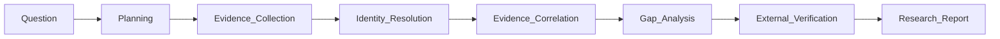
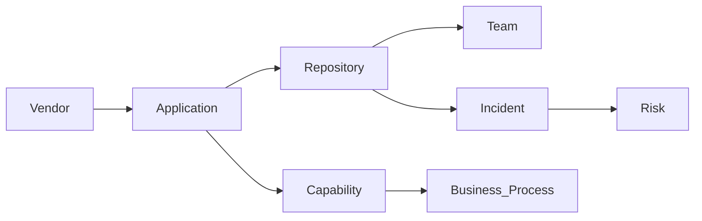
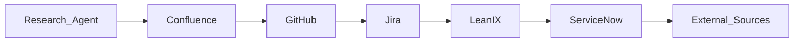

我如果从零开始设计，不会从 **Search、RAG、Connector、Graph、Multi-Agent** 这些技术概念出发，而会从**企业里的真实工作流（Enterprise Knowledge Work）**出发。

一句话定义整个项目：

> **Enterprise Research Agent 是一位能够自主完成企业调查研究任务的 AI Researcher。它围绕 Evidence（证据）而非 Documents（文档）工作，通过跨系统收集、关联、验证和分析证据，最终生成可追溯、可验证的研究报告。**

整个 Proposal 我会写成下面这样。

---

# Enterprise Research Agent

## Beyond Enterprise Search and RAG

## Executive Summary

Traditional Enterprise Search answers **where information is located**.

Traditional RAG answers **what a document says**.

Neither answers the questions enterprise architects, business analysts, risk managers, or solution architects solve every day:

> Have we already worked with this vendor?

> Which applications are affected by the new MAS TRM regulation?

> How does ESG impact our technology landscape?

> Which repositories implement Open Banking capabilities?

These are not search problems.

They are **research problems**.

Enterprise Research Agent is designed to perform investigations rather than document retrieval. It gathers evidence from enterprise systems, correlates information across organizational silos, validates findings against external knowledge, identifies missing information and inconsistencies, and produces a research report with traceable evidence.

Its objective is not to answer a question.

Its objective is to complete a research task.

---

# The Problem

Enterprise knowledge is fragmented.

Business knowledge exists in documentation.

Technical knowledge exists in source code.

Architecture knowledge exists in EA tools.

Operational knowledge exists in tickets and incidents.

Regulatory knowledge exists outside the organization.

Each system understands only its own data model.

None understands the enterprise.

As a result, answering even a simple business question often requires manually switching between multiple systems, comparing information, resolving naming inconsistencies, and building conclusions from scattered evidence.

This process is slow, expensive, and difficult to reproduce.

---

# Research Instead of Search

The proposed agent is fundamentally different from Enterprise Search.

| Enterprise Search  | Enterprise Research Agent  |
| ------------------ | -------------------------- |
| Retrieve documents | Complete a research task   |
| Keyword oriented   | Evidence oriented          |
| Document-centric   | Entity-centric             |
| Single repository  | Cross-system investigation |
| Return passages    | Produce findings           |
| User interprets    | Agent synthesizes          |
| Limited reasoning  | Hypothesis-driven analysis |

The output is not a ranked list of documents.

The output is a structured research report.

---

# Research Workflow

Every research task follows the same investigation lifecycle.



Each stage contributes additional understanding rather than simply retrieving more information.

### Research Planning

Transform the user's request into a set of investigation objectives.

Example:

> Research RiskConcile

becomes

* Identify the vendor
* Find existing enterprise usage
* Discover related applications
* Identify repositories
* Review operational history
* Check contracts
* Validate external information
* Assess potential risks

---

### Evidence Collection

Collect evidence from multiple enterprise systems.

Typical enterprise sources include:

| Domain                  | Examples                      |
| ----------------------- | ----------------------------- |
| Knowledge               | Confluence, SharePoint, Wiki  |
| Engineering             | GitHub, GitLab, Azure DevOps  |
| Operations              | Jira, ServiceNow              |
| Enterprise Architecture | LeanIX, OpenMetadata, DataHub |
| Data                    | Data Catalog, Data Lineage    |
| Security                | IAM, Vulnerability Systems    |

External evidence may include:

* Vendor websites
* Regulatory publications
* Cloud providers
* GitHub
* Academic papers
* Industry reports
* Public news

The objective is evidence collection rather than document retrieval.

---

# Identity Resolution

Different enterprise systems often describe the same business object differently.

For example:

| System     | Representation     |
| ---------- | ------------------ |
| Confluence | RiskConcile        |
| GitHub     | riskconcile-api    |
| LeanIX     | Vendor=RiskConcile |
| ServiceNow | Vendor ID 28391    |
| Jira       | RC Migration       |

Although represented differently, they refer to the same real-world entity.

Identity Resolution establishes a canonical identity that links all representations together.

```text
Canonical Identity

RiskConcile

├── Riskconcile
├── RC
├── riskconcile-api
├── Vendor 28391
└── RiskConcile Ltd.
```

Subsequent investigation operates on the canonical identity rather than individual records.

This dramatically improves evidence completeness and reduces duplicate analysis.

---

# Evidence Correlation

Collected evidence is valuable only after relationships are established.

The agent continuously builds a lightweight research graph representing how enterprise entities relate to each other.



Unlike a traditional knowledge graph, this graph is task-oriented.

Its purpose is to support investigation rather than universal knowledge representation.

It acts as the working memory for each research task.

---

# Research Domain Model

To enable consistent reasoning across heterogeneous systems, every connector maps its native objects into a common research model.

Core entity types include:

* Person
* Team
* Application
* Repository
* Vendor
* Project
* Capability
* Business Process
* Technology
* Risk
* Regulation
* Policy
* Incident
* Document

Every collected evidence item references one or more entities.

This abstraction allows reasoning to remain independent of individual enterprise systems.

---

# Gap Analysis

One of the distinguishing capabilities of the agent is identifying missing knowledge.

Examples include:

* Vendor exists but no contract found.
* Repository exists but no owning team identified.
* Regulation impacts an application with no implementation project.
* Architecture document conflicts with source code.

Missing evidence is treated as a research finding rather than a failure.

Knowledge gaps become actionable outputs.

---

# External Verification

Enterprise information is rarely sufficient by itself.

The agent validates internal findings using trusted external sources whenever appropriate.

Typical objectives include:

* Confirm vendor positioning
* Review regulatory interpretation
* Identify industry best practices
* Compare internal implementation against public guidance

External evidence increases confidence while reducing reliance on potentially outdated internal documentation.

---

# Research Report

The final deliverable is a research report rather than search results.

Each finding includes explicit supporting evidence.

| Section             | Description               |
| ------------------- | ------------------------- |
| Executive Summary   | Overall conclusion        |
| Key Findings        | Major discoveries         |
| Supporting Evidence | Linked enterprise sources |
| Confidence          | Confidence assessment     |
| Conflicts           | Contradictory evidence    |
| Knowledge Gaps      | Missing information       |
| Recommendations     | Suggested actions         |

Every conclusion is traceable to its supporting evidence.

This makes the report reviewable, auditable, and suitable for enterprise decision-making.

---

# Connectors Are Infrastructure

Connectors are implementation details rather than business capabilities.

The Research Agent orchestrates them according to investigation requirements.



New connectors extend evidence coverage without changing the research workflow.

---

# Example Research Tasks

## Vendor Research

Example:

> Research RiskConcile

The investigation may include:

* Company background
* Products
* Internal applications
* Source repositories
* Architecture dependencies
* Operational incidents
* Contracts
* Costs
* Regulatory relevance
* Open risks

The result is a Vendor Intelligence Report rather than a collection of search results.

---

## Regulation Impact Analysis

Example:

> Analyze the impact of MAS TRM.

The agent investigates:

* Applicable business capabilities
* Affected applications
* Existing implementation projects
* Regulatory documentation
* Required architecture changes
* Missing controls
* Open implementation gaps

The output becomes a Regulation Impact Assessment.

---

# Design Principles

The architecture follows several principles.

**Evidence First**

Research is built upon evidence rather than generated summaries.

**Identity Before Retrieval**

Resolve enterprise identities before correlating information.

**Entity-Centric**

Reason over enterprise entities rather than isolated documents.

**Traceable by Design**

Every conclusion is backed by explicit evidence.

**Incremental Knowledge**

Each investigation enriches the research graph for future investigations.

**Connector Agnostic**

Business logic remains independent of underlying enterprise platforms.

---

# Vision

Enterprise Research Agent is not another Enterprise Search solution.

It is an AI knowledge worker designed to perform the investigative work traditionally carried out by enterprise architects, business analysts, risk analysts, and technology strategists.

Instead of retrieving documents, it gathers evidence.

Instead of summarizing pages, it builds understanding.

Instead of answering isolated questions, it completes research tasks.

As organizations continue to accumulate knowledge across hundreds of disconnected systems, the ability to transform fragmented information into evidence-backed, actionable insight will become significantly more valuable than document retrieval alone. Enterprise Research Agent is designed to provide that capability.
