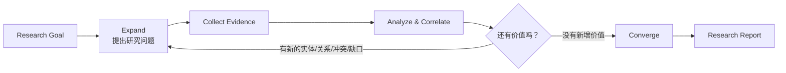

我觉得你这个 Proposal 还缺少**最关键的一块**，而且它正好回答了你这个问题。

你现在的流程其实是：

```text
Question
    ↓
Planning
    ↓
Collect
    ↓
Correlation
    ↓
Report
```

这里的问题是：

> **Planner 一次性把所有东西规划好了。**

但真正优秀的 Research（包括 OpenAI Deep Research、Google Gemini Deep Research、人类研究员）**都不是这样工作的**。

它们都是：

> **不断提出新的问题。**

所以，我建议**不要增加更多 Agent，不要增加更多 Graph**。

只增加一个概念：

> **Research Question Tree（研究问题树）**

它几乎不增加复杂度，但是 Research 的质量会提升一个档次。

---

# Research 本质上是不断提出问题

例如：

用户：

> Research RiskConcile

第一层问题：

```text
RiskConcile 是什么？
```

得到：

```text
Vendor
```

于是自动产生：

```text
有哪些产品？

有没有合作？

哪个公司负责？

有没有 Repository？
```

然后：

发现：

```text
Repository
```

自动产生：

```text
哪些 Team？

最近还有 Commit 吗？

有没有 Incident？
```

然后：

发现：

```text
Incident
```

继续：

```text
为什么发生？

解决了吗？

影响哪些系统？
```

Research 就这样不断生长。

而不是：

Planner 一开始生成几十个步骤。

---

# 但为什么不会无限发散？

因为：

Question Tree

不是无限展开。

每个问题都必须满足：

## 第一原则：

**必须能够帮助回答 Root Question。**

例如：

Root：

```text
Research RiskConcile
```

那么：

下面：

```text
RiskConcile CEO 是谁？
```

通常：

没意义。

Planner：

直接剪掉。

但是：

```text
用了哪些系统？
```

保留。

所以：

Question

必须：

贡献：

Root Goal。

---

# 第二原则：

Evidence Driven

只有：

Evidence

才能继续产生问题。

例如：

发现：

```text
Application
```

才会继续：

```text
Repository？
```

没有：

Application。

不会：

继续。

所以：

不是：

LLM 幻想。

而是：

Evidence

驱动。

---

# 第三原则：

Ontology Constraint

例如：

Ontology：

告诉你：

Vendor：

通常：

```text
Vendor

↓

Application

↓

Contract

↓

Risk
```

不会：

```text
Vendor

↓

Employee Birthday
```

所以：

Question

只能：

沿着：

Ontology

扩展。

---

# 第四原则：

Research Budget

非常重要。

增加：

Research Budget。

例如：

```yaml
depth: 3

maxQuestions: 40

maxEvidence: 300

time: 8 min
```

Agent：

任何时候：

超过：

Budget。

停止。

不会：

无限搜索。

---

# 第五原则：

Novelty

这是 Deep Research 的关键。

例如：

已经知道：

```text
Repository A
```

又找到：

```text
Repository A
```

没有：

新增价值。

Question：

停止。

只有：

产生：

新的：

Entity

新的：

Relationship

新的：

Conflict

新的：

Gap

Research

继续。

---

# 我建议把 Workflow 改成这样

现在：

```mermaid
flowchart LR

Question

--> Planning

--> Evidence Collection

--> Identity Resolution

--> Evidence Correlation

--> Gap Analysis

--> External Verification

--> Report
```

改成：

```mermaid
flowchart LR

Question

--> Research Planning

--> Evidence Collection

--> Identity Resolution

--> Evidence Correlation

--> Question Generation

--> Decision

Decision -->|Continue| Evidence Collection

Decision -->|Finish| Report
```

注意：

这里只增加了：

一个：

Question Generation。

一个：

Decision。

整个 Proposal：

没有复杂多少。

但是：

Research

一下：

活了。

---

# Decision 怎么判断？

不要：

LLM。

不要：

ML。

不要：

Tree Search。

很简单。

例如：

```
继续 Research：

✓ 新发现 Entity

✓ 新发现 Relationship

✓ 新发现 Conflict

✓ 新发现 Gap

✓ Confidence 仍然低
```

否则：

结束。

---

# 这其实就是 Research 的"发散-收敛"

整个过程可以理解成两个阶段，而不是无限探索。



这里有一个很重要的思想：

* **Expand（发散）**不是随机搜索，而是**沿着证据和领域模型扩展问题**。
* **Converge（收敛）**不是因为时间到了，而是因为**新增信息的价值开始递减**。

---

# 我建议再增加一个概念：Research Heuristics（研究启发式）

不要把它写成 AI 算法，而是写成 Agent 的工作原则。

例如：

| Heuristic         | 作用                      |
| ----------------- | ----------------------- |
| Goal-driven       | 所有子问题必须服务于研究目标          |
| Evidence-driven   | 新问题必须由已有证据触发            |
| Ontology-guided   | 只沿领域模型允许的关系扩展           |
| Novelty-seeking   | 优先探索可能带来新实体、关系、冲突或缺口的方向 |
| Budget-aware      | 受时间、深度、问题数和证据数约束        |
| Confidence-driven | 当关键结论置信度不足时优先补充证据       |

**我认为这是整个 Proposal 最值得增加的一部分。**

因为它没有引入任何新的基础设施，没有要求 Multi-Agent，没有要求复杂搜索算法，也没有要求 Monte Carlo Tree Search 或 Beam Search 之类的 AI 技术，却回答了一个 Reviewer 最可能提出的问题：

> **"为什么你的 Research 会足够深入，但又不会无限发散？"**

这几个启发式规则就把 Agent 的行为边界定义清楚了，而且实现成本也非常低。
