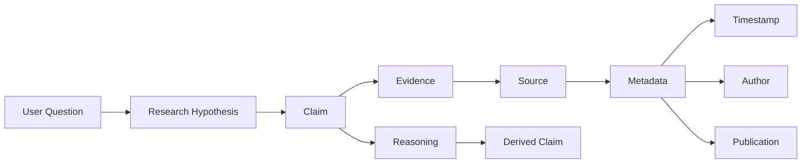
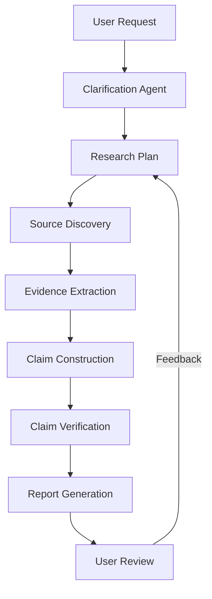
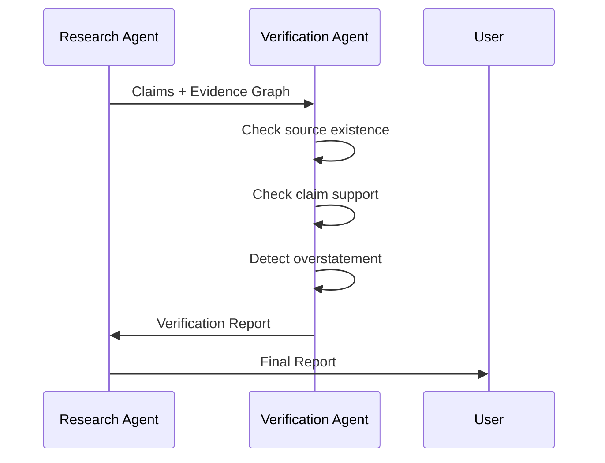

如果目标是让一个 **research task skill** 保证「用户 ↔ Agent 交互过程可控」以及「最终研究报告每条结论都有可论证、可追踪 source」，核心不是增加更多 RAG 组件，而是建立一个 **Evidence-First Research Workflow**。

不要把 research agent 设计成“生成报告的 agent”，而应该设计成：

> 一个管理 Claim（结论）、Evidence（证据）、Source（来源）、Reasoning（推理链）生命周期的研究系统。

类似 Palantir 的思路，不是保存文本，而是保存**实体、关系和证据链**。

---

## 1. 核心数据模型：Claim-Evidence-Source Graph

不要直接输出：

```
结论 → 引用链接
```

而应该内部维护：



核心实体：

| Entity     | 作用           |
| ---------- | ------------ |
| Question   | 用户原始问题       |
| Hypothesis | 当前研究假设       |
| Claim      | 一个可以被验证的判断   |
| Evidence   | 支撑 Claim 的事实 |
| Source     | 原始来源         |
| Reasoning  | Agent 推导过程   |
| Confidence | 可信度          |
| Conflict   | 相反证据         |

---

## 2. Research Skill 内部应该拆成几个阶段

不要让 Agent：

```
Search → Write Report
```

这会导致 hallucination。

应该：



---

# 3. 用户交互设计

## Phase 1: Research Contract

Agent 不应该立即搜索。

第一步生成：

```
Research Contract
```

例如：

```json
{
 "question":
 "How will AI change enterprise software architecture?",

 "scope":{
   "industry":"enterprise software",
   "time_range":"2024-2026",
   "exclude":[
      "marketing blogs"
   ]
 },

 "expected_output":{
   "type":"architecture analysis",
   "length":"20 pages"
 },

 "evidence_requirement":{
   "min_sources":10,
   "primary_source_ratio":0.6
 }
}
```

让用户确认。

目的：

避免：

> 用户想研究 AI Agent 架构，Agent 最后写成 AI 产品市场报告。

---

# 4. Source 管理

每个 Source 必须有 Source Card。

例如：

```json
{
"id":"SRC-001",

"type":"paper",

"title":
"Attention Is All You Need",

"authors":[
"Vaswani"
],

"url":
"https://arxiv.org/xxx",

"published":
"2017",

"retrieved":
"2026-07-20",

"authority":
0.95,

"used_for":[
"transformer architecture"
]
}
```

Source 类型：

| 类型                       |  权重 |
| ------------------------ | --: |
| peer reviewed paper      | 1.0 |
| official documentation   | 0.9 |
| standards                | 0.9 |
| company engineering blog | 0.7 |
| news                     | 0.5 |
| social media             | 0.2 |

---

# 5. Evidence Extraction

不要保存全文。

保存：

```
Evidence Fragment
```

例如：

```json
{
"id":"EV-102",

"source":"SRC-001",

"quote":
"The Transformer allows significantly more parallelization",

"context":
"Section 3",

"supports":[
"Transformer removes recurrence"
],

"confidence":0.96
}
```

关键：

**Evidence 必须包含定位信息。**

例如：

论文：

```
paper
 └── page
     └── section
          └── paragraph
```

网页：

```
URL
 └── heading
      └── paragraph
```

代码：

```
repository
 └── file
      └── line range
```

---

# 6. Claim Generation

Agent 不应该直接写：

> Transformer 提升了 AI 能力。

应该生成：

```json
{
"id":"CLM-001",

"text":
"Transformer architecture improved sequence modeling scalability by enabling parallel computation.",

"evidence":[
"EV-102",
"EV-103"
],

"confidence":
0.92,

"type":
"fact"
}
```

Claim 分类：

| 类型               | 是否必须引用         |
| ---------------- | -------------- |
| Fact             | 必须             |
| Statistic        | 必须             |
| Historical event | 必须             |
| Expert opinion   | 必须             |
| Analysis         | 引用 + reasoning |
| Recommendation   | reasoning      |

---

# 7. Report Generator

报告不是自由生成。

应该由 Claim Graph 渲染。

例如：

Markdown：

```markdown
## Transformer改变AI架构的原因

Transformer通过attention机制减少了序列计算依赖。

Evidence:

> "The Transformer allows significantly more parallelization..."

Source:

Vaswani et al., 2017
https://arxiv.org/xxx


Confidence:
92%
```

---

# 8. 最终报告增加 Traceability Layer

类似法律 memo。

每个章节：

```yaml
Section:
 "AI Agent Architecture Evolution"


Claims:

- CLM-001
- CLM-002
- CLM-003


Sources:

- SRC-001
- SRC-005


Evidence Coverage:

92%


Unverified:

CLM-008
```

---

# 9. 自动验证 Agent

增加一个 Reviewer Agent。

不要让同一个 Agent 自己检查自己。

流程：



检查：

### Source Check

* URL 是否存在
* DOI 是否有效
* 文献是否真实

### Claim Check

判断：

```
Evidence:
"Transformer enables parallelization"

Claim:
"Transformer makes AI cheaper"

```

这是过度推断。

---

# 10. 给 Skill 增加硬约束

Skill prompt 中加入：

```
Research Rules:

1. Never create unsupported factual claims.

2. Every factual statement must have:
   - claim_id
   - evidence_id
   - source_id

3. If evidence is insufficient:
   mark as hypothesis.

4. Never hide conflicting evidence.

5. Every source must be retrievable.

6. Separate:
   - observed facts
   - inference
   - recommendation
```

---

# 11. 最小实现（不要 over design）

实际上不需要 Graph Database。

第一版：

```
SQLite
+
JSON Schema
+
Markdown renderer
```

即可。

表：

```
sources

claims

evidence

claim_evidence

research_sessions
```

以后需要 Palantir 风格 ontology，再升级：

```
Neo4j
RDF
Property Graph
```

---

# 12. 最关键的设计原则

Research Agent 最大的问题不是搜索能力，而是：

> 从 Evidence 到 Claim 的跳跃不可见。

所以 Skill 的核心指标应该不是：

```
Answer Quality
```

而是：

```
Claim Coverage Ratio

=
Claims with Evidence
---------------------
Total Claims
```

例如：

| 报告                            | Coverage |
| ----------------------------- | -------: |
| 普通LLM报告                       |  30%-50% |
| RAG报告                         |  60%-80% |
| Evidence-first Research Agent |     90%+ |

---

因此一个成熟的 research skill 应该类似：

```
Question
   ↓
Research Contract
   ↓
Source Graph
   ↓
Evidence Graph
   ↓
Claim Graph
   ↓
Verified Report
```

而不是：

```
Question
   ↓
LLM
   ↓
Markdown
```

这也是企业级 research agent 和普通 ChatGPT 搜索模式最大的架构区别。
