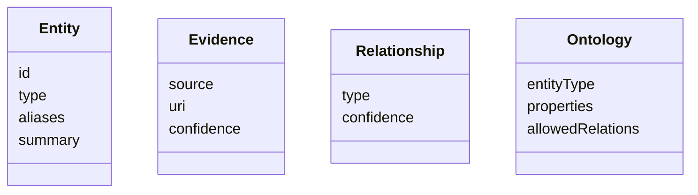

我会加，但**绝不会引入完整 Ontology 或 Knowledge Graph**。这是很多项目失败的原因：一开始就想做 Palantir Foundry 那样的本体层，最后半年都在建模型，Agent 一直用不起来。

我会借鉴 **Palantir Ontology 的思想**，而不是复制它的实现。

核心原则只有一句话：

> **Ontology 服务于 Research，而不是让 Research 服务于 Ontology。**

---

# 一个最小可行的 Ontology

Research Agent 已经有几个核心概念：

```text
Evidence
Entity
Relationship
Research Report
```

我会增加第五个：

```text
Ontology
```

但它不是企业所有业务对象的定义，而只是帮助 Agent 理解企业对象。

例如：



Ontology 不存数据。

Ontology 只描述：

> 一个对象应该是什么。

---

# Ontology 只做 Schema，不做实例

例如：

Application：

```yaml
type: Application

properties:
  owner
  criticality
  lifecycle

relations:
  implemented_by: Repository
  owned_by: Team
  supports: Capability
```

Vendor：

```yaml
type: Vendor

properties:
  website
  category

relations:
  provides: Product
  used_by: Application
```

Repository：

```yaml
type: Repository

relations:
  belongs_to: Team
  implements: Application
```

这就是 Ontology。

它非常小。

Agent 推理的时候：

看到：

```
Repository

implements

Application
```

它知道：

这是合法关系。

看到：

```
Repository

uses

Capability
```

Ontology 可以告诉它：

这个关系不太合理。

---

# Ontology 参与整个 Research Workflow

整个流程可以稍微修改。

```mermaid
flowchart LR

Question

--> Planning

--> Evidence Collection

--> Identity Resolution

--> Ontology Mapping

--> Evidence Correlation

--> Gap Analysis

--> External Verification

--> Report
```

新增：

Ontology Mapping

作用只有一个：

统一所有 Connector 返回的数据。

例如：

GitHub：

```
Repo
```

GitLab：

```
Project
```

Azure DevOps：

```
Repository
```

最终全部映射：

```
Repository
```

再例如：

```
Service

Application

System
```

全部映射：

```
Application
```

Research 后面完全不用知道数据来自哪里。

---

# Ontology 帮助 Entity Resolution

例如：

GitHub：

```
riskconcile-api
```

LeanIX：

```
Vendor
```

Jira：

```
RC Migration
```

Ontology 可以告诉 Agent：

```
Migration

通常关联：

Application

Project

Repository
```

于是：

Identity Resolution

准确率就会上升。

---

# Ontology 帮助 Correlation

例如：

Research Graph：

```
Vendor

↓

Application

↓

Repository
```

为什么能连？

因为 Ontology 定义：

Vendor

可以：

```
used_by

Application
```

Application

可以：

```
implemented_by

Repository
```

Agent 就知道：

哪些边可以建立。

而不是完全依赖 LLM 猜。

---

# Ontology 帮助 Gap Analysis

例如：

Ontology：

```
Application

必须：

Owner

Lifecycle

Repository
```

Research 完：

```
Application

Owner ✔

Lifecycle ✔

Repository ❌
```

于是：

Gap：

```
Repository Missing
```

再例如：

```
Vendor

必须：

Contract
```

没找到：

Contract

Gap。

这是 Ontology 最大价值。

---

# Ontology 帮助 Planning

例如：

研究：

```
Vendor
```

Ontology 可以告诉 Planner：

Vendor 通常应该调查：

* Company
* Product
* Application
* Contract
* Cost
* Risk
* Incident

于是 Planner 自动生成：

Research Plan。

如果研究：

```
Regulation
```

Ontology：

```
Regulation

↓

Control

↓

Application

↓

Repository
```

Planner 自动知道：

后面应该调查什么。

---

# 不建议做完整 KG

很多人会写：

```
Ontology

↓

Knowledge Graph

↓

Reasoning
```

我不会。

Research Agent：

Graph 就够了。

Graph：

```
Vendor

Application

Repository
```

Ontology：

告诉 Graph：

```
哪些关系合法。

哪些属性应该存在。

哪些对象应该调查。
```

结束。

不要做：

* OWL
* RDF
* SPARQL
* Description Logic
* Rule Engine

这些都不是这个项目的重点。

---

# 我建议新增一个极小的章节

放在 Research Domain Model 后面。

---

## Lightweight Research Ontology

为了保证不同企业系统之间能够进行统一推理，Research Agent 引入一个轻量级 Ontology 作为统一语义层。

该 Ontology 并不保存业务数据，也不试图构建完整的企业知识图谱，而是定义企业研究过程中涉及的核心实体类型、属性以及允许建立的关系。

其主要职责包括：

* 将不同系统的数据映射到统一实体模型；
* 为 Identity Resolution 提供领域约束；
* 指导 Evidence Correlation 建立合理关系；
* 为 Gap Analysis 提供完整性检查依据；
* 为 Research Planning 提供不同实体类型的调查模板。

Ontology 的作用是帮助 Agent 理解企业对象之间的语义，而不是替代企业现有的数据管理平台。因此，它保持尽可能简单，仅覆盖研究任务真正需要的概念，并随着研究任务逐步演进。

---

**如果参考 Palantir，我认为真正应该借鉴的是它的设计哲学，而不是技术实现。**

Palantir Ontology 的核心价值不是 RDF、OWL 或图数据库，而是把所有异构数据映射成统一的业务对象（Business Object），让应用和 AI 面向这些对象工作，而不是面向底层数据源。

对于你的项目，我建议将这一思想进一步收敛为：

> **Research Graph + Lightweight Ontology + Evidence**。

其中：

* **Research Graph** 保存研究过程中形成的实例（实体、关系、证据）。
* **Lightweight Ontology** 定义这些实例允许的类型、属性和关系，并为规划、关联和缺口分析提供约束。
* **Evidence** 为每一个实例和关系提供可追溯的来源与置信度。

这样既保留了 Palantir Ontology 最有价值的部分，又避免引入企业级本体工程带来的复杂度，整体仍然保持一个可以由小团队持续演进的架构。
