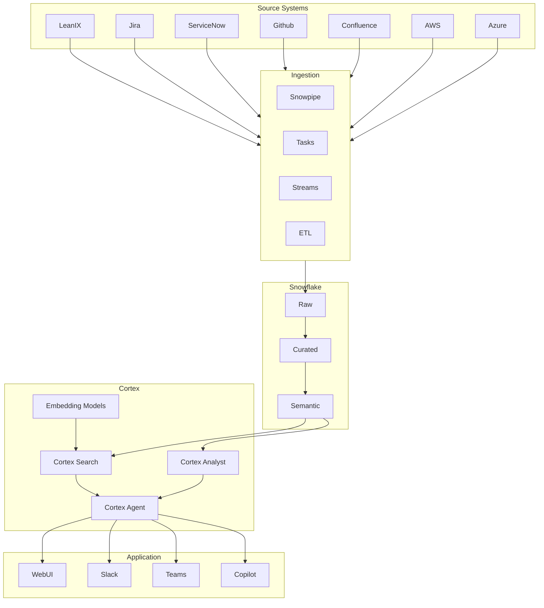
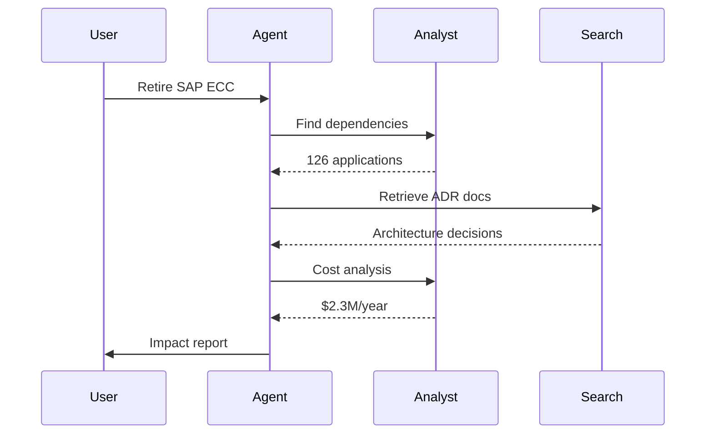
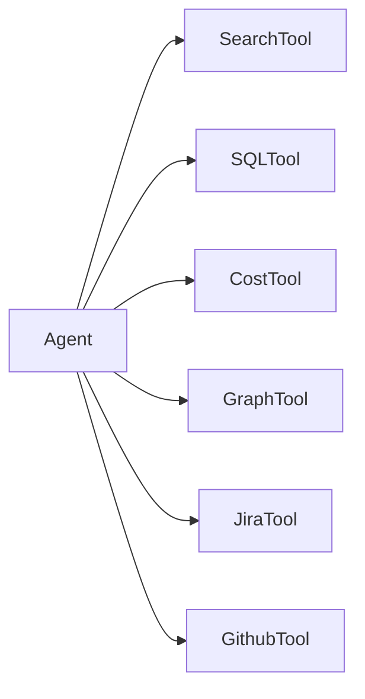
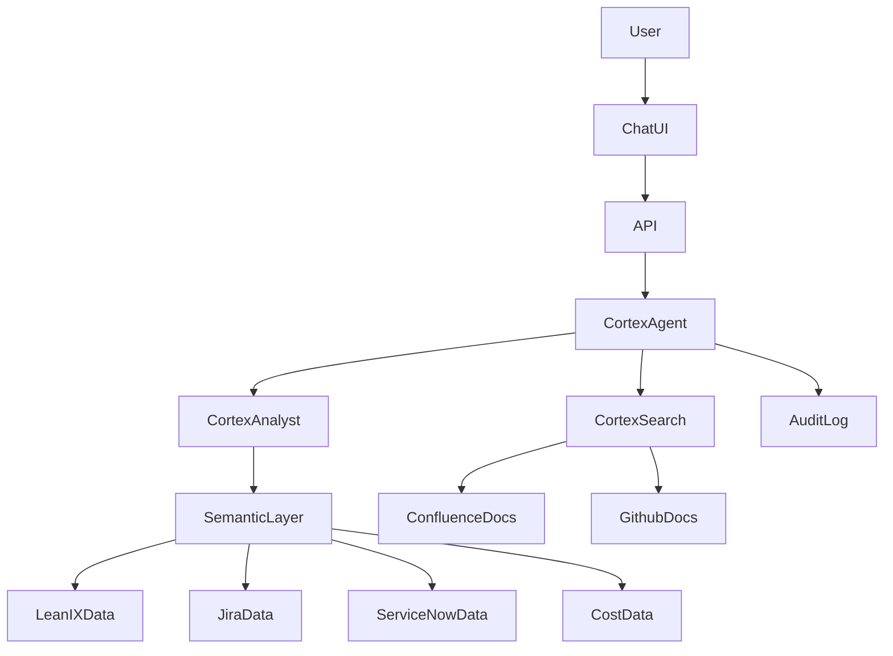
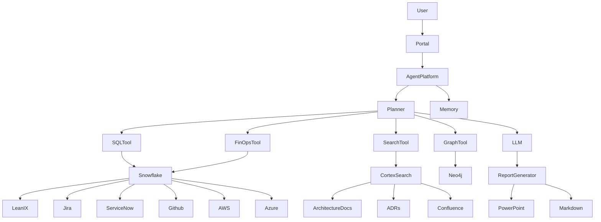
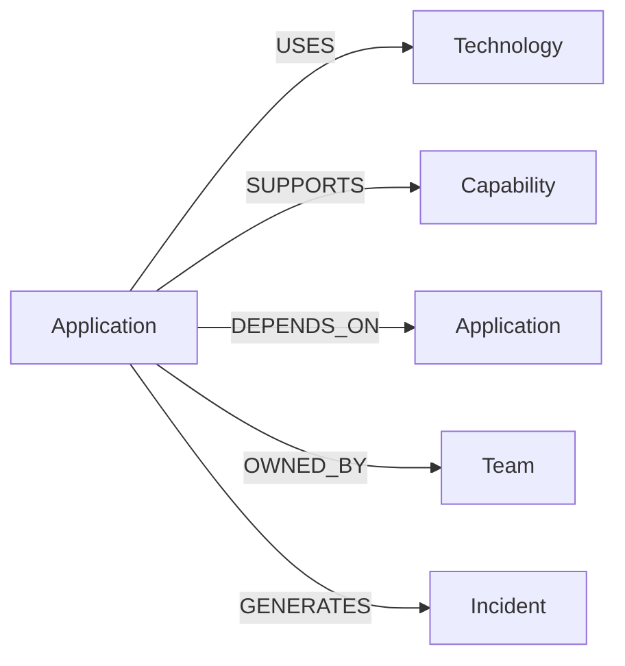
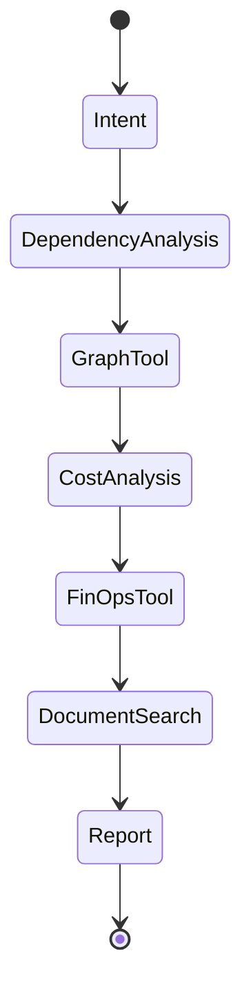

如果你的目标是：

> 基于 Snowflake + Cortex 构建一个 Enterprise Architecture Agent（类似 LeanIX AI，但能整合 LeanIX、Jira、ServiceNow、GitHub、Cloud Cost、CMDB 等数据）

那么我不建议直接使用最简单的：

```text
User
 ↓
 Cortex Search
 ↓
 LLM
```

这种 RAG。

因为企业架构场景本质上是：

* 结构化数据分析（SQL）
* 图关系分析（依赖关系）
* 文档检索（RAG）
* Agent 推理（多步规划）

混合问题。

更合理的是 **Cortex Search + Cortex Analyst + Cortex Agents + Semantic Layer** 组合。

---

# 总体架构



---

# 数据层设计

企业架构 Agent 的核心不是 LLM。

而是数据模型。

建议建立一个 EA Semantic Layer。

---

## Application

```sql
APPLICATION
```

| column      |
| ----------- |
| app_id      |
| name        |
| owner       |
| lifecycle   |
| criticality |
| cost        |
| vendor      |

---

## Capability

```sql
BUSINESS_CAPABILITY
```

| column        |
| ------------- |
| capability_id |
| name          |
| domain        |

---

## Interface

```sql
APPLICATION_INTERFACE
```

| column     |
| ---------- |
| source_app |
| target_app |
| protocol   |

---

## Technology

```sql
TECH_COMPONENT
```

| column    |
| --------- |
| component |
| version   |
| eos_date  |

---

## FinOps

```sql
CLOUD_COST
```

| column |
| ------ |
| app_id |
| month  |
| cost   |

---

## Incident

```sql
INCIDENT
```

来自 ServiceNow。

---

## Delivery

```sql
JIRA_EPIC
JIRA_STORY
```

来自 Jira。

---

# Semantic Layer

这里是 Cortex Analyst 的关键。

不要让 LLM 直接看数据库。

建立：

```yaml
Application
    has Interface
    supports Capability
    uses Technology
    incurs Cost
    generates Incident
```

语义层。

---

例如：

```text
Application
 ├─ Capability
 ├─ Technology
 ├─ Cost
 ├─ Incident
 └─ Team
```

---

# Cortex Search

存放：

### LeanIX

* Description
* Functional Fit
* Technical Fit

---

### Confluence

* Architecture Decision Record
* Solution Design

---

### GitHub

* README
* Architecture Docs

---

### Policies

* Security Standard
* Cloud Standard

---

索引：

```sql
CREATE CORTEX SEARCH SERVICE
```

---

# Cortex Analyst

负责：

自然语言转 SQL

例如：

用户问：

```text
哪些关键应用运行在即将EOL的技术上？
```

生成：

```sql
SELECT ...
```

执行。

返回结果。

---

# Cortex Agent

Agent 负责编排。

例如：

```text
如果淘汰 SAP ECC，
会影响什么？
```

Agent流程：



---

# 推荐 Tool 设计

Agent 不应该只有 Search。

建议暴露多个 Tool。



---

## Search Tool

使用：

```text
Cortex Search
```

查询文档。

---

## SQL Tool

调用：

```text
Cortex Analyst
```

查询结构化数据。

---

## Cost Tool

调用：

```sql
CLOUD_COST
```

分析 FinOps。

---

## Graph Tool

依赖分析。

例如：

```text
SAP ECC
 ↓
CRM
 ↓
Portal
 ↓
Reporting
```

找出爆炸半径（blast radius）。

---

# 企业架构 Agent 典型场景

## 技术债

```text
哪些应用使用Java8？
```

---

## 生命周期

```text
未来12个月将EOL的应用？
```

---

## Capability Gap

```text
哪些Capability只有一个系统支持？
```

---

## Rationalization

```text
哪些应用功能重叠？
```

---

## Cost Optimization

```text
Top 20 Cost Applications
```

---

# 推荐部署架构

如果是大型金融机构。

我会这样部署：



特点：

* 所有数据留在 Snowflake
* 不需要复制到外部 Vector DB
* Cortex Search 做检索
* Cortex Analyst 做 SQL
* Cortex Agent 做编排
* 满足金融行业审计要求

---

如果你的目标是替代 LeanIX AI，我会进一步建议采用 **Knowledge Graph + Cortex Agent** 架构，即把 LeanIX 的关系（Application → Interface → Capability → Technology）映射成图模型，然后让 Cortex Agent 同时使用：

1. Cortex Search（文档）
2. Cortex Analyst（SQL）
3. Graph Tool（依赖关系）

这是目前最接近企业架构 Copilot 的设计，能力会明显强于单纯的 RAG。


-------------


如果让我从零开始设计一个**面向企业架构（EA）的 AI Agent 平台**，目标超越 LeanIX AI，而不是简单做个 RAG ChatBot，我会采用如下原则：

> LLM 不存储知识
> Vector 不存储关系
> Graph 不存储事实
> Data Warehouse 不负责推理

每层只做自己最擅长的事情。

---

# 最终架构（推荐）



---

# 第一层：数据平台

这里我会坚持 Snowflake。

原因不是 AI。

而是：

LeanIX 数据本身很小。

真正有价值的是关联：

* LeanIX
* Jira
* GitHub
* ServiceNow
* Cloud Cost
* Security Findings

---

## Snowflake中的主题域

### EA Domain

```sql
APPLICATION
BUSINESS_CAPABILITY
INTERFACE
TECH_COMPONENT
```

来自 LeanIX。

---

### Delivery Domain

```sql
EPIC
STORY
RELEASE
```

来自 Jira。

---

### Operations Domain

```sql
INCIDENT
CHANGE
PROBLEM
```

来自 ServiceNow。

---

### Engineering Domain

```sql
REPOSITORY
PULL_REQUEST
PIPELINE
```

来自 GitHub。

---

### FinOps Domain

```sql
CLOUD_COST
RESOURCE
TAG
```

来自 AWS/Azure。

---

# 第二层：Knowledge Graph

这里是很多团队忽略的部分。

---

## 为什么必须有 Graph

LeanIX 本质已经是 Graph。

例如：

```text
Application
  ↓
Interface
  ↓
Application

Application
  ↓
Capability

Application
  ↓
Technology
```

这是关系网络。

不是文档。

不是 SQL。

---

# 技术选型

我推荐：

## Neo4j

原因：

* Cypher成熟
* GraphRAG生态成熟
* 企业支持最好

---

图模型：



---

# 第三层：Search

这里不要引入 Pinecone。

也不要引入 Weaviate。

既然已经有 Snowflake：

直接：

```text
Cortex Search
```

即可。

---

索引内容：

```text
ADR

Architecture Decision

Solution Design

Confluence

Runbook

Standards

Policies
```

---

# 第四层：Agent Framework

这里才是你问的核心。

---

## 候选

### LangGraph

优点：

* 状态机
* 多Agent
* Tool调用成熟

缺点：

* 偏开发框架

---

### OpenAI Agents SDK

优点：

* 简洁

缺点：

* 企业复杂流程不够

---

### CrewAI

优点：

* 多Agent简单

缺点：

* EA场景太简单

---

### Semantic Kernel

优点：

* 微软生态

缺点：

* Graph能力弱

---

# 我的选择

```text
LangGraph
```

但不是因为它最火。

而是因为 EA 场景本质是 Workflow。

---

例如：

用户：

> 如果淘汰 Oracle 11g 会影响什么？

Agent流程：



这本质是状态机。

---

# 第五层：LLM

很多人把 LLM 放最前面。

我会放最后。

---

推荐：

## 第一层

Snowflake Cortex

使用：

* Cortex Analyst
* Cortex Search

---

## 第二层

外部模型

例如：

* OpenAI GPT-5.x
* Anthropic Claude
* Google Gemini

负责最终推理和报告生成。

---

# Tool设计

Agent不应该直接访问数据库。

---

## Tool 1

EA Analyst

职责：

```text
Text
 ↓
SQL
 ↓
Snowflake
```

---

## Tool 2

EA Graph

职责：

```text
Dependency Analysis

Impact Analysis

Blast Radius
```

---

## Tool 3

EA Search

职责：

```text
Architecture Docs

ADR

Policies
```

---

## Tool 4

EA FinOps

职责：

```text
Cost Attribution

Optimization

Chargeback
```

---

## Tool 5

EA Security

职责：

```text
Vulnerability

Tech Debt

EOL Risk
```

---

# Memory设计

很多Agent项目失败在这里。

不要把聊天记录当Memory。

---

应该存：

```text
Architecture Context

Current Initiative

Review Scope

Application Focus
```

例如：

```text
当前讨论：
Trading Platform Modernization
```

后续无需重复说明。

---

# 最终效果

用户：

> 哪些高成本系统同时面临技术债风险？

Agent：

```text
1 查 Snowflake 成本

2 查 Neo4j 技术关系

3 查 ServiceNow Incident

4 查 ADR

5 综合分析

6 生成报告
```

---

# 如果是我来做

我会采用：

| 层                   | 技术                        |
| ------------------- | ------------------------- |
| Data Lakehouse      | Snowflake                 |
| Graph               | Neo4j                     |
| Search              | Snowflake Cortex Search   |
| SQL AI              | Snowflake Cortex Analyst  |
| Agent Orchestration | LangGraph                 |
| LLM                 | GPT-5 / Claude            |
| Frontend            | React + Next.js           |
| Auth                | SSO/SAML/OIDC             |
| Reporting           | PPTX + Markdown Generator |

这套架构是我认为未来 3～5 年企业架构 Copilot 最稳妥、扩展性最强的方案，而不是把所有能力都压到 Cortex Agent 或单一框架上。
