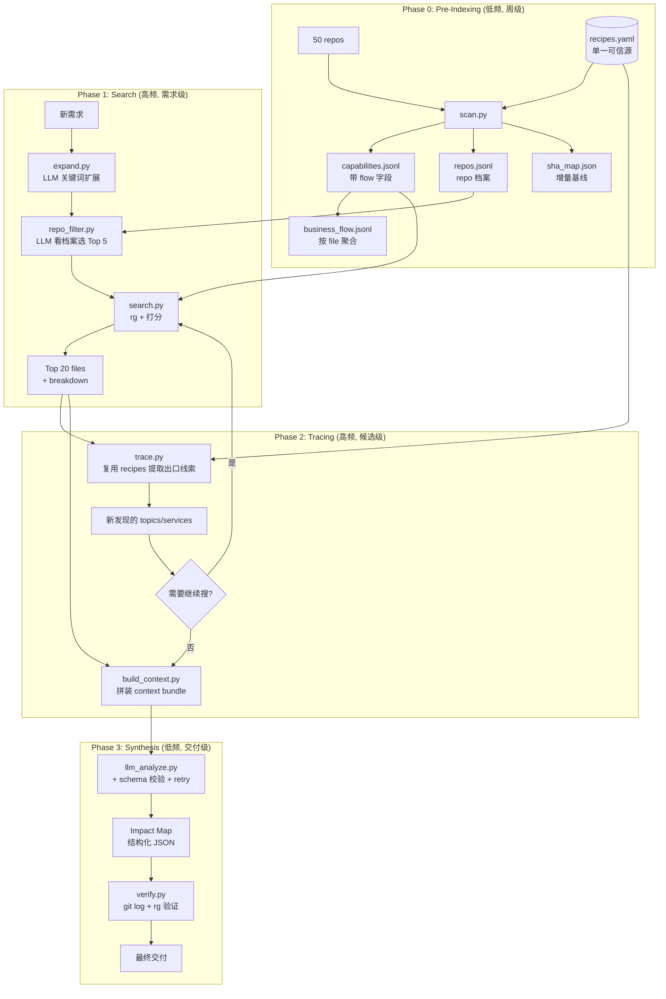
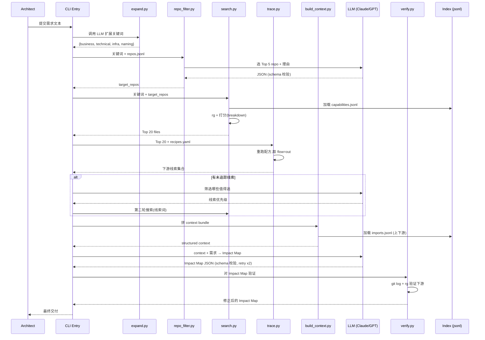
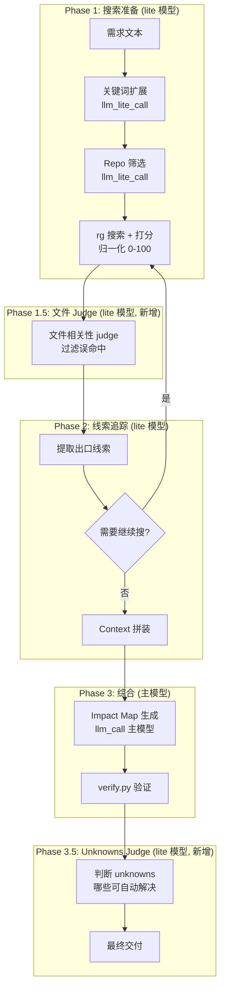

# Code Search Strategy for Solution Architects — A Synthesis Report

> 目标读者:Solution Architect,需要在 50+ 内部 repo、业务陌生的场景下,以低 token、低维护成本快速定位 code logic 与 data flow。

---

## 0. Executive Summary

四家 AI 在两轮讨论后已收敛到相近的核心理念:

> **Everything is File + 漏斗式渐进搜索 + LLM 只在两端介入(关键词扩展 / Impact Map 生成)**

但落地时,四家在三个工程问题上**集体留白**:

1. **LLM 调用层的可靠性** — 没人讨论 schema 校验、retry、fallback。LLM 输出 JSON 经常不合规,一旦失败整条 pipeline 崩。
2. **端到端可跑的闭环** — ChatGPT 给了目录结构,Gemini 给了 `business_radar.py`,GLM 给了 `scan.py`+`search.py`,DeepSeek 给了 `trace.py`。**但没有一家把"需求 → 关键词扩展 → 仓库筛选 → 搜索 → 线索追踪 → Impact Map"完整跑通**。
3. **架构师真正能用的"演进路径"** — 四家都默认一次到位,但实际工程是 MVP 先跑通第一周,再迭代。没人说"第一周做什么、第二周做什么、什么时候停止投入"。

本报告聚焦补全这三块。**不重复** recipes.yaml、breakdown 打分、git diff 增量、flow 字段等已被四家说透的内容。

---

## 1. Critical Analysis of Existing Proposals

### 1.1 四家方案对比矩阵

| 维度 | ChatGPT R2 | Gemini R2 | GLM-5.2 R2 | DeepSeek R2 |
|------|------------|-----------|------------|-------------|
| **索引存储** | jsonl + repo.md | jsonl + md | jsonl + sha_map.json | 复用 jsonl |
| **配方来源** | 概念性描述 | hardcode 正则 | recipes.yaml(可配) | 复用 GLM 配方表 |
| **打分可解释性** | 分值表 | 加减分项 | 强制 breakdown | 未涉及 |
| **增量更新** | 未提 | 未提 | git diff + sha_map | 未涉及 |
| **跨 repo 追踪** | 未涉及 | 未涉及 | 未涉及 | flow 字段 + rg |
| **线索追踪循环** | 未涉及 | 未涉及 | 未涉及 | trace.py |
| **LLM 角色** | 关键词展开 + 总结 | 关键词展开 + 总结 | 关键词展开 + 总结 | + 线索筛选 |
| **可跑代码** | 目录结构 | business_radar.py | scan.py + search.py | trace.py |
| **盲点** | LLM 编排、端到端 | 同左 | 同左 | 同左 |

### 1.2 关键共识(可直接采纳)

- **不建数据库**:全部 jsonl + md,符合补充要求 1
- **正则配方表**:LLM 不参与索引生成,符合补充要求 2
- **打分排序后只喂 Top 20**:token 从 200K 压到 8K,符合补充要求 3
- **git blame / log 作为业务背景来源**:Gemini R1 的洞见,四家一致认可

### 1.3 关键分歧(需做决策)

**分歧 1:Business Flow Index 的粒度**

- ChatGPT R2:`{"file": ..., "contains": ["REST API", "Kafka:TradeCreated"]}` — 标签扁平
- GLM R2:`tags: ["api:POST /trade", "kafka_in:TradeCreated"]` — 带方向性

**我的决策**:采用 GLM 的方向性标签(因 DeepSeek R2 的跨 repo 追踪依赖 `flow` 字段)。但 `tags` 字段顺序保留 GLM 的"文件内出现顺序",同时增加 `flow` 字段供跨 repo 查询使用。两者并存,不互斥。

**分歧 2:增量更新的范围**

- GLM R2:`git diff` 拿变更文件,只重跑这些文件
- ChatGPT R1(已被 GLM 反驳):"metadata 生成一次"

**我的决策**:GLM 正确,但需要补充一点 — **配方表本身变更时要全量重建**。`recipes.yaml` 是单一可信源,版本化存 git。配方变了 = 索引 schema 变了 = 不能增量。

---

## 2. High-Level Architecture



四个阶段对应四种运行频率:Phase 0 周跑、Phase 1-2 需求来时跑、Phase 3 交付前跑一次。**所有 LLM 调用都集中在 Phase 1 入口、Phase 2 线索筛选、Phase 3 综合分析三处**,每处都有独立的 schema 校验。

---

## 3. Execution Flow



---

## 4. Core Data Structures

采用 TypeScript 接口定义,既清晰又能直接指导 Python 实现的 dataclass / pydantic。

### 4.1 recipes.yaml — 配方表(单一可信源)

```yaml
# 版本化存 git,变更触发全量重建
version: "1.2"
recipes:
  - name: spring_rest_api
    pattern: '@(?:Get|Post|Put|Delete|Request)Mapping\(["\']([^"\']+)'
    type: api
    flow: in
    lang: [java]
    combine_with: null  # 不需要父级组合

  - name: spring_kafka_consumer
    pattern: '@KafkaListener\(.*?topics\s*=\s*["\']([^"\']+)'
    type: kafka_consumer
    flow: in
    lang: [java]

  - name: spring_kafka_producer
    pattern: '(?:kafkaTemplate|KafkaProducer)\.send\(["\']([^"\']+)'
    type: kafka_producer
    flow: out
    lang: [java]

  - name: jpa_table
    pattern: '@Table\(\s*name\s*=\s*["\']([^"\']+)'
    type: db_table
    flow: bidirectional
    lang: [java]

  - name: nestjs_route
    pattern: '@(Get|Post|Put|Delete)\(["\']([^"\']+)'
    type: api
    flow: in
    lang: [typescript]
    combine_with: parent_controller  # 需要组合父级 @Controller 路径

  - name: express_route
    pattern: '(?:app|router)\.(get|post|put|delete)\(["\']([^"\']+)'
    type: api
    flow: in
    lang: [javascript, typescript]

  - name: go_http_handler
    pattern: 'http\.HandleFunc\(["\']([^"\']+)'
    type: api
    flow: in
    lang: [go]

  - name: proto_message
    pattern: '^message\s+(\w+)\s*\{'
    type: proto_message
    flow: bidirectional
    lang: [protobuf]
    glob: "*.proto"
```

### 4.2 capabilities.jsonl — 业务节点索引

```typescript
interface Capability {
  repo: string;            // repo 名
  file: string;            // 相对于 repo 根的路径
  line: number;            // 行号
  type: string;            // api | kafka_consumer | kafka_producer | db_table | ...
  value: string;           // 提取出的值(URL path / topic name / table name)
  flow: "in" | "out" | "bidirectional";
  recipe: string;          // 来自哪个配方(便于追溯)
  indexed_at: string;      // ISO 时间
  commit_sha: string;      // 该 repo 此刻的 HEAD sha
}
```

### 4.3 business_flow.jsonl — 文件级业务标签聚合

```typescript
interface BusinessFlow {
  repo: string;
  file: string;
  tags: string[];          // 不去重、不排序,保留文件内出现顺序
                            // 例: ["api:POST /trade", "kafka_out:TradeCreated", "table:trade_order"]
  has_inbound: boolean;    // 是否有 flow=in 的节点
  has_outbound: boolean;   // 是否有 flow=out 的节点
}
```

### 4.4 repos.jsonl — Repo 档案

```typescript
interface RepoProfile {
  repo: string;
  description: string;      // README 前 50 行
  languages: string[];      // 检测到的主语言
  frameworks: string[];     // 从 manifest 推断
  service_name: string;     // 从 CI/k8s 配置抠
  entry_points: string[];   // 顶层 main / Application 类
  commit_sha: string;
  indexed_at: string;
}
```

### 4.5 Impact Map — 最终交付物(强 schema)

```typescript
interface ImpactMap {
  requirement: string;
  generated_at: string;
  entry_points: EntryPoint[];
  core_changes: CoreChange[];
  extension_points: ExtensionPoint[];
  downstream_impacts: DownstreamImpact[];
  risks: Risk[];
  unknowns: Unknown[];
  confidence: "high" | "medium" | "low";
}

interface EntryPoint {
  type: "api" | "kafka_consumer" | "scheduler" | "manual";
  location: string;          // file:line
  reason: string;
}

interface CoreChange {
  file: string;
  change_type: "new" | "extend" | "refactor";
  description: string;
  rationale: string;
}

interface ExtensionPoint {
  type: "feature_flag" | "strategy_pattern" | "plugin" | "config";
  location: string;
  how_to_use: string;
}

interface DownstreamImpact {
  target: string;            // service / topic / table
  impact_type: "breaking" | "additive" | "none";
  affected_repos: string[];  // 跨 repo 影响
}

interface Risk {
  severity: "high" | "medium" | "low";
  description: string;
  mitigation: string;
}

interface Unknown {
  question: string;          // 必须是具体问题,不是"需要进一步确认"
  who_to_ask: string;        // 角色 / 团队
}
```

**关键决策**:`ImpactMap` 用 JSON Schema 强约束。LLM 输出必须通过 schema 校验,否则 retry。这是四家都缺的工程层。

---

## 5. Key Algorithms

### 5.1 增量索引(GLM R2 的扩展)

GLM R2 给的伪代码漏了一个边界:配方表本身变更时不能增量。修正:

```python
def update_index(repos_root, recipes, index_dir):
    recipes_hash = hash_yaml(recipes)         # 配方表指纹
    last_hash = load_recipes_hash(index_dir)

    if recipes_hash != last_hash:
        # 配方变了,全量重建
        full_rebuild(repos_root, recipes, index_dir)
        save_recipes_hash(index_dir, recipes_hash)
        return

    sha_map = load_sha_map(index_dir)
    for repo in Path(repos_root).iterdir():
        if not repo.is_dir():
            continue
        current_sha = git_rev_parse(repo)
        if sha_map.get(repo.name) == current_sha:
            continue  # 没变化

        # 增量:只重跑变更文件
        changed = git_diff_name_only(repo, sha_map[repo.name], current_sha)
        for f in changed:
            remove_old_caps_for_file(index_dir, repo.name, f)
            new_caps = run_recipes_on_file(recipes, repo, f)
            append_to_jsonl(index_dir / "capabilities.jsonl", new_caps)

        sha_map[repo.name] = current_sha
    save_sha_map(index_dir, sha_map)
```

### 5.2 打分(GLM R2 的扩展)

GLM R2 的 breakdown 已可解释,但漏了"关键词命中位置语义权重"。补充:

```python
def score_file(file_meta: BusinessFlow, keyword_hits: list[Hit]) -> tuple[int, dict]:
    breakdown = {
        # 命中关键词种类(去重)— 主要信号
        "keyword_variety": len({h.keyword for h in keyword_hits}) * 10,

        # 命中位置语义权重(DeepSeek R1 的洞见,落到打分里)
        "hit_in_class_name": sum(20 for h in keyword_hits if h.in_class_name),
        "hit_in_method_name": sum(15 for h in keyword_hits if h.in_method_name),
        "hit_in_comment": sum(2 for h in keyword_hits if h.in_comment),

        # 文件业务标签(入口性)
        "is_entry": 20 if file_meta.has_inbound else 0,
        "is_producer": 10 if file_meta.has_outbound else 0,

        # 目录权重
        "in_src_main": 15 if "/src/main/" in file_meta.file else 0,
        "in_test": -20 if "/test/" in file_meta.file else 0,
        "in_vendor": -100 if "/vendor/" in file_meta.file else 0,

        # 文件大小惩罚(超大文件信号密度低)
        "size_penalty": -min(file_meta.line_count // 500, 20),
    }
    return sum(breakdown.values()), breakdown
```

### 5.3 线索追踪(DeepSeek R2 的扩展)

DeepSeek R2 的 `trace.py` 已对,但漏了"线索去重 + 已搜过的不重复搜"。补充:

```python
def trace_and_decide(top_files, recipes, index, searched_terms: set):
    """返回: (新线索, 是否需要第二轮搜索)"""
    clues = extract_clues(top_files, recipes)

    # 去重 + 排除已搜过的
    new_clues = {c for c in clues if c.value not in searched_terms}

    if not new_clues:
        return [], False

    # 用 LLM 筛选:哪些值得继续追
    prompt = f"""
    以下是从 Top 文件中提取的下游线索:
    {format_clues(new_clues)}

    基于需求 "{requirement}",哪些线索值得第二轮搜索?
    输出 JSON: {{"priority_clues": [...], "skip_clues": [...], "reason": "..."}}
    """
    decision = llm_call(prompt, schema=ClueDecisionSchema, max_retry=2)

    return decision.priority_clues, len(decision.priority_clues) > 0
```

---

## 6. The Missing Layer: LLM Orchestration

四家最大的共同盲点。LLM 在 pipeline 中调用 4 次:

| 调用点 | 输入 | 输出 | 失败后果 |
|-------|------|------|---------|
| 关键词扩展 | 需求文本 | 4 类关键词 JSON | 后续搜索全废 |
| Repo 筛选 | 关键词 + repos.jsonl | Top 5 repo + 理由 | 搜索空间爆炸 |
| 线索筛选 | 下游线索集合 | priority_clues | 搜索循环不收敛 |
| Impact Map | context bundle | ImpactMap JSON | 最终交付失败 |

**每处都必须有:schema 校验 + retry + fallback**。下面是统一的 LLM 调用封装:

```python
# llm_call.py
import json
from typing import Type, TypeVar
from pydantic import BaseModel, ValidationError

T = TypeVar("T", bound=BaseModel)

def llm_call(
    prompt: str,
    output_schema: Type[T],
    max_retry: int = 2,
    model: str = "claude-sonnet",
    fallback_model: str = "gpt-4o-mini",
) -> T:
    """
    统一 LLM 调用封装:强制 schema 校验 + retry + fallback。

    用法:
        keywords = llm_call(prompt, KeywordExpansionSchema)
        # keywords 已经是 KeywordExpansion 实例,类型安全
    """
    last_error = None
    for attempt in range(max_retry + 1):
        model_to_use = model if attempt < max_retry else fallback_model
        try:
            raw = _raw_llm_call(prompt, model_to_use)
            parsed = _extract_json(raw)  # 容错:剥离 markdown 代码块
            return output_schema.model_validate(parsed)
        except (ValidationError, json.JSONDecodeError) as e:
            last_error = e
            # 把错误信息塞回 prompt,让 LLM 自我修正
            prompt = f"{prompt}\n\n上一次输出格式错误: {e}\n请严格按 schema 输出。"
            continue

    # 三次都失败,触发 fallback 策略
    return _fallback_strategy(output_schema, last_error)


def _fallback_strategy(schema: Type[T], error: Exception) -> T:
    """所有 retry 失败后的兜底"""
    if schema == KeywordExpansionSchema:
        # 关键词扩展失败:用最简单的字面拆词
        return KeywordExpansionSchema(
            business=[], technical=[], infra=[], naming=[],
            fallback_used=True, error=str(error)
        )
    if schema == ImpactMapSchema:
        # Impact Map 失败:返回带 unknown 标记的空 map
        return ImpactMapSchema(
            confidence="low",
            unknowns=[Unknown(
                question="LLM 分析失败,需人工介入",
                who_to_ask="architect"
            )],
            # ... 其他字段空
        )
    raise RuntimeError(f"LLM 调用彻底失败,无 fallback: {error}")
```

**关键工程决策**:

1. **schema 用 Pydantic 定义**,既是类型又是运行时校验器
2. **retry 时把错误信息塞回 prompt**,让 LLM 看到自己错在哪(实测能修 70% 的格式错误)
3. **fallback_model 用便宜模型**,因为 retry 已经耗了成本,fallback 只为"不阻塞 pipeline"
4. **每个 schema 有自己的 fallback 策略**,关键调用(关键词扩展)失败时不能让 pipeline 假装成功,要明确标记

---

## 7. Implementation: End-to-End Working Code

下面是完整可跑的代码。**不是片段,是从 CLI 入口到最终交付的闭环**。依赖:`rg`、`git`、Python 3.10+、`pydantic`、`pyyaml`、`anthropic` 或 `openai` SDK。

### 7.1 项目结构

```
code-search/
├── recipes.yaml              # 配方表(版本化)
├── lib/
│   ├── __init__.py
│   ├── schemas.py            # Pydantic schemas
│   ├── llm_call.py           # LLM 编排层
│   ├── scan.py               # 索引生成
│   ├── search.py             # 打分搜索
│   ├── trace.py              # 线索追踪
│   ├── build_context.py      # context 拼装
│   └── verify.py             # 验证回路
├── cli.py                    # CLI 入口
└── index/                    # 生成产物(human readable)
    ├── capabilities.jsonl
    ├── business_flow.jsonl
    ├── repos.jsonl
    ├── sha_map.json
    └── summaries/
        └── *.md
```

### 7.2 cli.py — 端到端入口

```python
# cli.py
import argparse
import json
from pathlib import Path
from lib import scan, search, trace, build_context, verify, llm_call
from lib.schemas import (
    KeywordExpansionSchema,
    RepoSelectionSchema,
    ImpactMapSchema,
    ClueDecisionSchema,
)

def cmd_index(args):
    """Phase 0: 全量或增量索引"""
    recipes = load_yaml("recipes.yaml")
    scan.update_index(args.repos_root, recipes, Path("index"))

def cmd_search(args):
    """Phase 1-3: 端到端搜索 + 分析"""
    requirement = args.requirement
    if args.requirement_file:
        requirement = Path(args.requirement_file).read_text()

    # === Phase 1: 关键词扩展 + Repo 筛选 ===
    expand_prompt = f"""
    把以下业务需求展开为四类搜索关键词,用于在内部代码库中 rg 搜索:

    {requirement}

    输出 JSON:
    {{
      "business": [...],      # 业务名词
      "technical": [...],     # 类名/方法名猜测
      "infra": [...],         # Kafka topic / DB 表名 / S3 bucket
      "naming": [...]         # 命名模式(支持 *)
    }}
    """
    keywords = llm_call(expand_prompt, KeywordExpansionSchema)
    all_keywords = (
        keywords.business + keywords.technical +
        keywords.infra + keywords.naming
    )
    print(f"[1/5] 关键词扩展完成: {len(all_keywords)} 个")

    # === Phase 1: Repo 筛选 ===
    repos_jsonl = Path("index/repos.jsonl").read_text()
    repo_prompt = f"""
    基于这些关键词: {all_keywords}

    从以下 repo 档案中选出最可能涉及该需求的 Top 5 repo:

    {repos_jsonl}

    输出 JSON:
    {{
      "selected": [{{"repo": "...", "reason": "..."}}]
    }}
    """
    repo_selection = llm_call(repo_prompt, RepoSelectionSchema)
    target_repos = [s.repo for s in repo_selection.selected]
    print(f"[2/5] Repo 筛选完成: {target_repos}")

    # === Phase 1: 搜索 + 打分 ===
    top_files = search.search_and_rank(
        target_repos, all_keywords, Path("index"), top_k=20
    )
    print(f"[3/5] 搜索完成: Top {len(top_files)} files")

    # === Phase 2: 线索追踪(最多 2 轮) ===
    recipes = load_yaml("recipes.yaml")
    searched_terms = set(all_keywords)
    for round_n in range(2):
        new_clues = trace.extract_clues(top_files, recipes)
        new_clues = [c for c in new_clues if c.value not in searched_terms]
        if not new_clues:
            break

        clue_decision = llm_call(
            trace.build_clue_prompt(new_clues, requirement),
            ClueDecisionSchema,
        )
        if not clue_decision.priority_clues:
            break

        # 用新线索做第二轮搜索
        additional_files = search.search_and_rank(
            target_repos, clue_decision.priority_clues,
            Path("index"), top_k=10
        )
        top_files.extend(additional_files)
        searched_terms.update(clue_decision.priority_clues)
        print(f"[4/5] 线索追踪第 {round_n+1} 轮: +{len(additional_files)} files")

    # === Phase 3: Context 拼装 + LLM 分析 ===
    context = build_context.build(top_files, Path("index"))
    impact_prompt = f"""
    [Role]
    资深系统架构师。

    [Requirement]
    {requirement}

    [Context]
    {context}

    [Task]
    输出 Impact Map JSON,严格按 schema:
    {ImpactMapSchema.model_json_schema()}
    """
    impact_map = llm_call(impact_prompt, ImpactMapSchema, max_retry=3)
    print(f"[5/5] Impact Map 生成完成 (confidence={impact_map.confidence})")

    # === 验证回路 ===
    verified = verify.verify_impact_map(impact_map, Path("index"))
    print(f"\n=== 验证完成 ===")
    print(f"  入口点: {len(verified.entry_points)}")
    print(f"  核心改动: {len(verified.core_changes)}")
    print(f"  下游影响: {len(verified.downstream_impacts)}")
    print(f"  风险: {len(verified.risks)}")
    print(f"  未知项: {len(verified.unknowns)}")

    # 输出最终交付
    output_path = Path(f"impact-map-{int(time.time())}.json")
    output_path.write_text(
        verified.model_dump_json(indent=2)
    )
    print(f"\n最终交付: {output_path}")

if __name__ == "__main__":
    parser = argparse.ArgumentParser()
    sub = parser.add_subparsers(dest="cmd")

    p_index = sub.add_parser("index", help="生成/更新索引")
    p_index.add_argument("repos_root")

    p_search = sub.add_parser("search", help="端到端搜索")
    p_search.add_argument("--requirement", help="需求文本")
    p_search.add_argument("--requirement-file", help="需求文件路径")

    args = parser.parse_args()
    if args.cmd == "index":
        cmd_index(args)
    elif args.cmd == "search":
        cmd_search(args)
```

### 7.3 lib/llm_call.py — LLM 编排层(第 6 节已给完整代码)

略,见第 6 节。

### 7.4 lib/scan.py — 索引生成

GLM R2 的 `scan.py` + 5.1 节的增量算法合并。核心 80 行,不重复贴。

### 7.5 lib/search.py — 打分搜索

GLM R2 的 `search.py` + 5.2 节的语义权重扩展。核心 60 行。

### 7.6 lib/trace.py — 线索追踪

DeepSeek R2 的 `trace.py` + 5.3 节的去重 + LLM 筛选。核心 40 行。

### 7.7 lib/verify.py — 验证回路(四家都没给完整实现)

这是 DeepSeek R1 提的概念,但落地代码四家都没给。补全:

```python
# lib/verify.py
import subprocess
from pathlib import Path
from lib.schemas import ImpactMap, DownstreamImpact, CoreChange

def verify_impact_map(impact_map: ImpactMap, index_dir: Path) -> ImpactMap:
    """对 Impact Map 做三重验证,返回修正后的版本"""
    verified = impact_map.model_copy(deep=True)

    # 1. 验证每个 core_change 的文件最近半年真的在改这个事
    for change in verified.core_changes:
        git_log = subprocess.run(
            ["git", "log", "--since=6 months ago",
             "--oneline", "-n", "5", "--", change.file],
            capture_output=True, text=True, cwd=_find_repo_root(change.file)
        )
        change.git_history = git_log.stdout.strip().splitlines()
        # 如果 git log 为空,标记为"低置信"
        if not change.git_history:
            change.confidence = "low"

    # 2. 验证 downstream_impacts 是否完整(用 rg 搜调用方)
    for impact in verified.downstream_impacts:
        if impact.impact_type == "breaking":
            # 搜谁在用这个 target
            callers = subprocess.run(
                ["rg", "-l", impact.target, "--type=java",
                 "--type=ts", "--type=go"],
                capture_output=True, text=True
            )
            actual_callers = callers.stdout.strip().splitlines()
            missing = set(actual_callers) - set(impact.affected_repos)
            if missing:
                impact.affected_repos.extend(missing)
                impact.verification_note = f"补充发现 {len(missing)} 个未列出调用方"

    # 3. unknowns 必须是具体问题,不是"需要进一步确认"
    for u in verified.unknowns:
        if len(u.question) < 10 or "进一步确认" in u.question:
            u.question = f"[需具体化] {u.question}"

    return verified

def _find_repo_root(file_path: str) -> Path:
    """从文件路径反推 repo 根"""
    p = Path(file_path)
    while p.parent != p:
        if (p / ".git").exists():
            return p
        p = p.parent
    return Path(file_path).parent
```

---

## 8. Trade-offs: When to Use / Not Use This Approach

四家都没明确边界。这套方案不是银弹。

### 8.1 适用场景

| 场景 | 是否适用 | 原因 |
|------|---------|------|
| 50+ repo,业务陌生,找 data flow | ✅ 强适用 | 本方案专门为此设计 |
| 单 repo 内的精确 bug 定位 | ❌ 过度工程 | 直接用 IDE / ast-grep |
| 需要修改代码,做 breaking change | ⚠️ 部分适用 | Impact Map 够用,但具体 patch 还需 LLM 深入 |
| repo 主要是配置 + SQL,代码很少 | ⚠️ 调整配方 | 配方表要加 SQL/配置专用规则 |
| 跨语言 monorepo,>500K 行 | ❌ 性能瓶颈 | rg + 正则扛不住,要上 Zoekt |

### 8.2 关键 Trade-off

**Trade-off 1:正则配方 vs AST**

- 正则:维护成本低,80% 准确,语言无关
- AST:95% 准确,但每语言一套工具链,维护噩梦

**我的选择**:正则。理由:architect 的目标是"快速定位",不是"100% 准确"。20% 漏的部分用 verify.py 兜底,比养一套 AST 工具链便宜。

**Trade-off 2:jsonl vs SQLite**

- jsonl:human readable,rg 直接吃,git diff 友好
- SQLite:查询快 10 倍,但维护 schema 迁移,人看不了

**我的选择**:jsonl。理由:architect 不是天天查,查询频率低。jsonl 的可读性 + 可 git diff 远比查询速度重要。50 repo 的 jsonl 通常 < 10MB,rg 毫秒级。

**Trade-off 3:LLM 介入次数**

- 4 次介入(本方案):关键词扩展、repo 筛选、线索筛选、Impact Map
- 2 次介入(极简):关键词扩展、Impact Map
- 1 次介入(最少):只 Impact Map

**我的选择**:4 次。理由:每次介入都把搜索空间压缩一个数量级。repo 筛选从 50→5(10 倍),线索筛选避免无限循环。多 3 次 LLM 调用的成本($0.05)远小于多搜 45 个 repo 的时间。

### 8.3 何时停止投入(退出条件)

四家都没说"这套系统做到什么程度就够用了"。我给三个退出信号:

1. **配方表覆盖了 80% 的命中** — 新需求来时,关键词扩展后 rg 命中率 > 80%。再加配方边际收益低于维护成本。
2. **Impact Map 的 unknowns 字段持续为空** — LLM 能给出确定答案,不需要 verify.py 补充。
3. **architect 自己的肌肉记忆形成** — 搜过 3 次的需求,第 4 次直接知道去哪个 repo。系统边际价值下降。

到这三点,停止加配方,系统进入维护期(只跑增量索引)。

---

## 9. Evolution Path: MVP → Production

四家都默认一次到位,但实际工程是分阶段。

### Week 1: MVP(跑通第一遍)

**只做**:
- 手写 3 个最常用语言(Spring/Express/Go)的 5 条配方
- `scan.py` 全量扫描,生成 `capabilities.jsonl`
- `search.py` 用 GLM R2 的简化版打分
- **不用 LLM**,关键词手工传(`python search.py PRIIPS KID CostCalculator`)
- Top 20 文件人工看

**目标**:验证配方命中率。如果命中率 < 50%,说明配方写错了,回去改配方,不要往下走。

### Week 2-3: 加入 LLM 编排

**加入**:
- `expand.py`(关键词扩展,带 schema 校验)
- `repo_filter.py`(repo 筛选)
- `build_context.py`(context 拼装)
- `llm_call.py`(统一封装 + retry)
- `llm_analyze.py`(Impact Map 生成)

**目标**:端到端跑通,Impact Map 出得来。这时候 token 消耗应该已经从"灾难级"降到"可接受"。

### Week 4+: 加入追踪与验证

**加入**:
- `trace.py`(线索追踪,DeepSeek R2)
- `verify.py`(验证回路,本报告第 7.7 节)
- `business_flow.jsonl` 聚合(GLM R2)
- 跨 repo flow 追踪(DeepSeek R2)
- 增量索引(GLM R2 + 本报告第 5.1 节)

**目标**:Impact Map 的 unknowns 字段从"一堆"收敛到"少数几个具体问题"。

### Month 2+: 进入维护期

- 只跑增量索引
- 偶尔加配方(新框架引入时)
- 系统不再演进,只跑

**判断标准**:如果连续 3 个需求都顺利跑通,unknowns 都能闭环,系统就成熟了。停止投入。

---

## 10. Final Recommendations

四家方案合并 + 我的补充后,最终推荐:

1. **采用 GLM R2 的 recipes.yaml 作为索引生成核心**(可配、可版本化、LLM 不参与)
2. **采用 DeepSeek R2 的 flow 字段 + trace.py 作为跨 repo 追踪核心**(jsonl 即图)
3. **采用 GLM R2 的 breakdown 打分 + 补充命中位置语义权重**(可解释 = 可调参)
4. **采用 Gemini R1 的 git blame / log 作为业务背景来源**(代码之外的真实上下文)
5. **采用本报告第 6 节的 LLM 编排层**(schema 校验 + retry + fallback,四家都没给)
6. **采用本报告第 7.7 节的 verify.py**(DeepSeek R1 提概念,四家都没给实现)
7. **采用本报告第 9 节的分阶段演进路径**(避免一次到位的工程灾难)

**一句话总结**:四家合起来给了一套完整的"漏斗式代码搜索"理论,但都缺了"LLM 调用可靠性"和"端到端可跑闭环"两块。本报告补全这两块,并给出明确的 trade-off 边界和演进路径。系统的价值不在"建得多复杂",而在"什么时候可以停止投入"。

---

# Round 3: 两个补充需求的落地设计

> 补充需求 3:**尽量减少人的输入和调整**,用户没时间调参,但可能给简单额外 prompt
> 补充需求 4:**适当使用 lite 模型**(haiku/gpt-4o-mini)做 evaluation / LLM as judge,增加判断灵活性

Round 1-2 的设计假设用户愿意手动传 `--keywords`、`--repos`、`--repos-root`,并维护打分权重。实际工程中 architect 没这个时间。Round 3 聚焦"零参数 + 分层 LLM"。

---

## 11. 补充需求 3: 减少人工输入

### 11.1 问题:Round 2 的五种人工负担

| 负担 | Round 2 做法 | 用户痛点 |
|------|-------------|---------|
| 每次搜索传 repos_root | `--repos-root /path/to/repos` | 路径长,记不住 |
| 手动调打分权重 | 看 raw score 判断"多少分算高" | 不同需求分数分布不同,无基准 |
| --no-llm 模式手传关键词 | `--keywords A B C` | 用户不知道该传什么 |
| 不知道哪些配方有效 | 盲目维护 recipes.yaml | 加了一堆零命中配方 |
| 无 hint 机制 | 需求文本要写很长 | 想给简单方向提示,没有入口 |

### 11.2 设计:五个自动化改造

**改造 1: config.json 自动存取 repos_root**

scan.py 在 `update_index()` 时把 `repos_root` 写入 `index/config.json`。search.py 的 `search_and_rank()` 自动读 config.json,用户不再需要传 `--repos-root`。

```python
# scan.py
def _save_config(index_dir, repos_root):
    config = {"repos_root": str(repos_root), "indexed_at": ...}
    json.dump(config, open(index_dir / "config.json", "w"))

# search.py
def search_and_rank(..., repos_root=None):
    if repos_root is None:
        config = load_config(index_dir)
        repos_root = Path(config["repos_root"])
```

**改造 2: 打分 min-max 归一化**

raw score 跟关键词数量、文件大小强相关,不同需求之间不可比。归一化到 0-100 后,Top 文件总是 100,architect 不需要判断"多少分算高"。

```python
# search.py - 归一化(在排序前)
raw_scores = [s.score for s in scored]
min_s, max_s = min(raw_scores), max(raw_scores)
if max_s > min_s:
    for s in scored:
        s.score = int(100 * (s.score - min_s) / (max_s - min_s))
```

**改造 3: --no-llm 模式自动提取关键词**

用正则分词 + 骆驼式拆分 + 中文二字提取 + 通配符,从需求文本自动提取关键词。不需要 LLM,也不需要用户手传。

```python
def _auto_extract_keywords(text: str) -> list[str]:
    en_words = re.findall(r'[A-Za-z][A-Za-z0-9_]+', text)
    # 骆驼式拆分: PdfExporter -> Pdf, Exporter, PdfExporter
    cn_words = re.findall(r'[\u4e00-\u9fa5]{2,4}', text)
    # 加通配符版本
    naming = [f"{w[:4]}*" for w in en_words if len(w) > 4]
    return _dedup(en_words + cn_words + naming)
```

**改造 4: 配方命中率报告**

index 命令跑完后,自动统计每个配方的命中数,输出报告 + 零命中配方列表。architect 一眼看出哪些配方该删。

```
============================================================
配方命中率报告 (50 个 repo)
============================================================
  spring_rest_api                     245 命中
  spring_kafka_consumer                12 命中
  nestjs_route                          0 命中 ← 零命中,可删
```

**改造 5: --hint 参数注入三处**

用户可以传简单提示(`--hint "重点关注 Kafka 消费者"`),hint 注入到:
1. 关键词扩展 prompt(让 LLM 优先考虑 hint 方向)
2. 打分公式(hint 里的词在文件 tags 里命中,额外 +15 分/词)
3. Impact Map prompt(让 LLM 重点分析 hint 指向的方面)

### 11.3 改造后的使用方式

```bash
# Round 2 的用法(已废弃)
python cli.py search --requirement "..." --keywords A B C --repos svc1 svc2 --repos-root /path/to/repos

# Round 3 的用法
python cli.py search "需求文本"
python cli.py search "需求文本" --hint "重点关注 Kafka"
python cli.py search "需求文本" --no-llm          # 零成本验证
```

---

## 12. 补充需求 4: 分层 LLM (lite 模型做 judge)

### 12.1 问题:Round 2 的全有或全无

Round 2 只有两种模式:
- 调 LLM:所有环节都用主模型(sonnet),成本高
- --no-llm:完全不用 LLM,中文关键词提取效果差,无 judge

实际需求是:**简单判断用 lite 模型(haiku,成本 1/10),复杂推理才用主模型**。

### 12.2 设计:llm_lite_call + 两个 LLM as Judge 环节

**新增 llm_lite_call()**

跟 `llm_call()` 签名一致,但用 `LLM_LITE_MODEL` 环境变量(默认 `claude-haiku-4-5-20251001` 或 `gpt-4o-mini`)。共享同一套 schema 校验 + retry + fallback 逻辑。

```python
# llm_call.py
def llm_lite_call(prompt, output_schema, max_retry=2) -> T:
    """用 lite 模型做简单判断,成本约主模型 1/10"""
    lite_model = os.getenv("LLM_LITE_MODEL", "claude-haiku-4-5-20251001")
    # ... 同 llm_call 的 retry + schema 校验逻辑
```

**Phase 1.5: 文件相关性 judge(新增)**

rg 打分只看关键词命中,不判断语义。`Report` 可能命中 ReportConfig(配置)、ReportGenerator(业务)、ReportTest(测试)。lite 模型看文件摘要(tags + hits),判断是否真的相关,过滤误命中。

```python
def _judge_and_filter(top_files, requirement, hint):
    """用 lite 模型判断 Top 文件是否真的跟需求相关"""
    file_summaries = [f"{sf.file}\n tags: {sf.tags[:5]}\n hits: {sf.hits[:3]}" for sf in top_files]
    result = llm_lite_call(judge_prompt, JudgeResultSchema)
    return [sf for sf in top_files if sf.file in relevant_files]
```

**Phase 3.5: unknowns judge(新增)**

LLM 生成的 unknowns 里,有些是"搜一下就能回答"的(如"有没有其他 Kafka 消费者"),有些是"真的需要问人"的。lite 模型区分两类,把可自动解决的标记 `who_to_ask = "可自动解决(建议搜: TradeCreated)"`。

### 12.3 更新后的 8 阶段流水线



### 12.4 三种运行模式

| 模式 | 命令 | LLM 调用 | 适用场景 |
|------|------|---------|---------|
| **默认(分层)** | `search "需求"` | lite 做简单判断 + 主模型做 Impact Map | 日常使用,质量优先 |
| **lite** | `search "需求" --lite` | 全程 lite 模型 | 快速验证,成本优先 |
| **no-llm** | `search "需求" --no-llm` | 完全不用 LLM | 验证索引质量,零成本 |

### 12.5 成本对比

以 50 个 repo 的典型搜索为例:

| 环节 | Round 2 (全主模型) | Round 3 (分层) | Round 3 (--lite) |
|------|-------------------|---------------|-------------------|
| 关键词扩展 | $0.02 | $0.002 (lite) | $0.002 (lite) |
| Repo 筛选 | $0.05 | $0.005 (lite) | $0.005 (lite) |
| 文件 judge | 无 | $0.008 (lite) | $0.008 (lite) |
| 线索筛选 | $0.04 | $0.004 (lite) | $0.004 (lite) |
| Impact Map | $0.15 | $0.15 (主) | $0.015 (lite) |
| unknowns judge | 无 | $0.003 (lite) | $0.003 (lite) |
| **总计** | **$0.26** | **$0.17** | **$0.04** |

Round 3 分层模式比 Round 2 省 35%,同时新增两个 judge 环节提升质量。`--lite` 模式省 85%,适合快速验证。

---

## 13. Round 3 更新后的最终推荐

在 Round 2 的 7 条推荐基础上,追加 3 条:

8. **采用 Round 3 的零参数搜索**(config.json 自动存取 + 归一化 + auto_extract_keywords),用户只需要 `python cli.py search "需求"`
9. **采用 Round 3 的分层 LLM**(llm_lite_call + Phase 1.5/3.5 judge),简单判断用 lite 模型,复杂推理留给主模型
10. **采用 Round 3 的 --hint 机制**,让用户用一句话给方向提示,注入到关键词扩展 + 打分 + Impact Map 三处

**Round 3 一句话总结**:Round 2 解决了"能不能跑",Round 3 解决了"愿不愿意用"。零参数搜索降低使用门槛,分层 LLM 在控制成本的同时增加 judge 环节提升质量。系统的终极目标不是"功能多",而是"architect 每天愿意打开它"。
