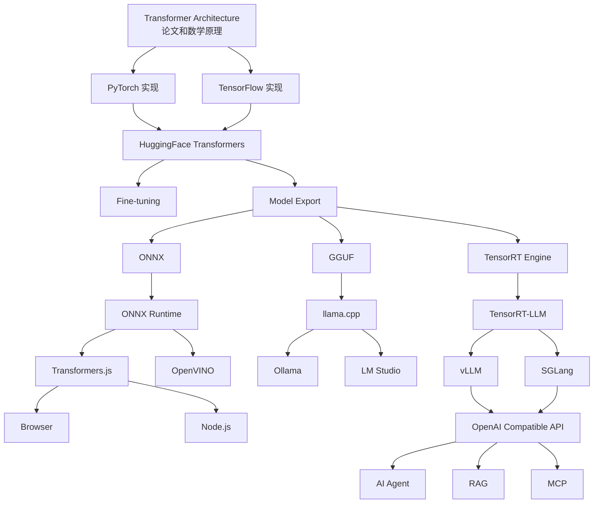
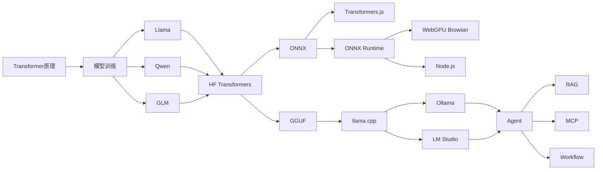

如果你的目标是从**架构师视角理解整个 LLM/Transformer 技术栈**，我建议不要一开始扎进论文，而是先建立全景地图。

## 全景关系图



---

## 再换一个架构视角



---

# 学习路线

以你的背景（20+年开发、架构师）来看，不需要从线性代数课开始。

## 第一阶段：理解 Transformer（2~3天）

目标：

理解：

```text
Token
↓
Embedding
↓
QKV
↓
Attention
↓
FFN
↓
Next Token
```

### 学什么

* Embedding
* Attention
* Multi-head Attention
* Positional Encoding
* Transformer Block

### 推荐资源

#### Illustrated Transformer

[The Illustrated Transformer](https://jalammar.github.io/illustrated-transformer/?utm_source=chatgpt.com)

经典中的经典。

---

#### 3Blue1Brown

[Attention in Transformers, Visualized](https://www.3blue1brown.com/lessons/attention?utm_source=chatgpt.com)

动画非常直观。

---

## 第二阶段：手写 Transformer（1周）

目标：

真正理解：

```python
Q = X @ Wq
K = X @ Wk
V = X @ Wv
```

到底干了什么。

### 推荐

[nanoGPT](https://github.com/karpathy/nanoGPT?utm_source=chatgpt.com)

这是目前最值得读的代码。

文件：

```text
model.py
```

大约几百行。

可以直接看到：

```python
class CausalSelfAttention
```

和

```python
class Block
```

的实现。

---

再进一步：

[Let's build GPT from scratch](https://www.youtube.com/watch?v=kCc8FmEb1nY&utm_source=chatgpt.com)

Karpathy 神课。

---

## 第三阶段：读 Hugging Face

目标：

理解工业界标准实现。

### 学什么

```python
AutoTokenizer
AutoModel
pipeline
generate
```

### 推荐

[Transformers Documentation](https://huggingface.co/docs/transformers/index?utm_source=chatgpt.com)

重点看：

```python
AutoModelForCausalLM
```

---

然后直接看源码：

```text
src/transformers/models/llama/
```

重点：

```text
modeling_llama.py
```

---

## 第四阶段：模型推理

这是很多工程师的盲区。

### 学什么

为什么：

```text
7B模型
```

能在 MacBook 上运行？

### 推荐

#### llama.cpp

[llama.cpp](https://github.com/ggml-org/llama.cpp?utm_source=chatgpt.com)

重点：

```text
ggml
```

张量计算引擎。

---

#### GGUF

[GGUF Specification](https://github.com/ggml-org/ggml/blob/master/docs/gguf.md?utm_source=chatgpt.com)

理解：

```text
fp16
int8
int4
q4_k_m
```

---

## 第五阶段：现代 Serving

这是你做架构最需要的部分。

### 学什么

为什么：

```text
100个用户
```

和

```text
10000个用户
```

部署方式完全不同。

---

重点：

### vLLM

[vLLM](https://github.com/vllm-project/vllm?utm_source=chatgpt.com)

理解：

```text
PagedAttention
KV Cache
Continuous Batching
```

---

### SGLang

[SGLang](https://github.com/sgl-project/sglang?utm_source=chatgpt.com)

理解：

```text
Speculative Decoding
Structured Output
```

---

## 第六阶段：RAG

这部分你已经接触很多了。

重点理解：

```text
BM25
Hybrid Search
Embedding
Reranker
```

推荐：

OpenSearch、
Qdrant、
Weaviate

以及：

[Haystack RAG Guide](https://haystack.deepset.ai/tutorials?utm_source=chatgpt.com)

---

## 第七阶段：Agent

最后再学 Agent。

很多人顺序反了。

实际上：

```text
Transformer
↓
LLM
↓
Serving
↓
RAG
↓
Agent
```

才是合理顺序。

推荐：

[LangGraph](https://langchain-ai.github.io/langgraph/?utm_source=chatgpt.com)

和

[OpenAI Agents SDK](https://openai.github.io/openai-agents-python/?utm_source=chatgpt.com)

---

如果按你的背景，我会给出一个更聚焦的书单：

1. Illustrated Transformer（1天）
2. Karpathy GPT from Scratch（2天）
3. nanoGPT源码（3天）
4. Hugging Face Llama源码（3天）
5. llama.cpp（1周）
6. vLLM（1周）
7. RAG（你已经在做）
8. Agent/MCP（最后学）

走完这条路线后，你基本可以从源码层面理解从 Transformer 到 Agent 的完整技术栈，而不仅仅是会调用 API。


对于你的背景（架构师、云原生、搜索、RAG、Agent、FinOps），我会把 **《AI Engineering》** 放在：

```text
Transformer原理      ★★★☆☆
LLM应用架构          ★★★★★
生产级AI系统设计      ★★★★★
算法深度             ★★☆☆☆
源码实现             ★☆☆☆☆
工程实践抽象         ★★★★★
```

### 一句话评价

这是一本：

> 「面向架构师和高级工程师的 LLM 系统设计书」

而不是：

> 「Transformer 原理书」
> 「PyTorch源码书」
> 「Agent开发教程」

Chip Huyen自己在书里就明确把重点放在“Building Applications with Foundation Models”上。内容覆盖模型选择、评估、Prompt、RAG、Agent、Finetuning、推理优化以及生产架构。([Google Books][1])

---

## 对你来说值不值得读？

我认为：

```text
如果时间有限：

AI Engineering      9/10

如果想学Transformer：

6/10

如果想学Agent：

7/10

如果想学AI系统架构：

10/10
```

---

## 这本书最大的价值

很多资料都在教：

```python
prompt = ...
response = llm(...)
```

但很少有人系统讲：

```text
什么时候用RAG？
什么时候微调？
什么时候换模型？
怎么评估？
怎么做A/B Test？
怎么控制成本？
怎么设计Feedback Loop？
```

而这恰恰是架构师最关心的。

书里大量内容围绕：

```text
Model Selection
Evaluation
RAG
Agents
Inference
Architecture
Feedback
```

这些比具体框架寿命长得多。([Hippocampus's Garden][2])

---

## 哪些章节最值得你看

按你的情况排序：

### 第一梯队（必读）

```text
Chapter 3 Evaluation Methodology
Chapter 4 Evaluating AI Systems
Chapter 6 RAG and Agents
Chapter 9 Inference Optimization
Chapter 10 Architecture and User Feedback
```

原因：

你已经在做：

* OpenSearch
* Hybrid Search
* Embedding
* Agent
* Cloud

这些章节直接对应生产问题。

---

### 第二梯队

```text
Chapter 5 Prompt Engineering
Chapter 7 Fine-tuning
Chapter 8 Dataset Engineering
```

了解即可。

很多团队其实根本用不到 Fine-tuning。

---

### 第三梯队

```text
Chapter 1
Chapter 2
```

快速浏览。

对于你来说偏基础。

---

## 这本书的不足

### 1. 不讲Transformer

如果你期待：

```python
Q = XWq
K = XWk
V = XWv
```

然后推导：

```text
Attention(Q,K,V)
```

几乎没有。

---

### 2. 不讲源码

不会教你：

* vLLM源码
* llama.cpp源码
* FlashAttention实现

---

### 3. Agent部分不够深入

因为出版时：

```text
2024
```

Agent还没像2026这样成熟。([O'Reilly Media][3])

现在：

* LangGraph
* OpenAI Agents
* MCP
* Agent Mesh

发展速度已经超过书的内容。

---

## 如果让我给你定制一个阅读顺序

比《AI Engineering》更符合你背景的顺序是：

### Step 1

《AI Engineering》

目标：

```text
理解AI系统架构
```

---

### Step 2

Karpathy

```text
Let's build GPT from scratch
```

目标：

```text
理解Transformer
```

---

### Step 3

读：

[nanoGPT](https://github.com/karpathy/nanoGPT?utm_source=chatgpt.com)

目标：

```text
理解模型代码
```

---

### Step 4

读：

[vLLM Docs](https://docs.vllm.ai/?utm_source=chatgpt.com)

目标：

```text
理解Serving
```

---

### Step 5

读：

[SGLang Docs](https://docs.sglang.ai/?utm_source=chatgpt.com)

目标：

```text
理解Agent时代推理框架
```

---

### Step 6

读：

[DSPy](https://dspy.ai/?utm_source=chatgpt.com)

和

[LangGraph](https://langchain-ai.github.io/langgraph/?utm_source=chatgpt.com)

目标：

```text
理解Agent Workflow
```

---

如果只让我推荐 **一本最适合架构师转 AI 的书**，目前我仍然会把：

AI Engineering

排在第一位。

如果只让我推荐 **一本最适合理解 Transformer 的书/资料**，那就不是它，而是：

[The Illustrated Transformer](https://jalammar.github.io/illustrated-transformer/?utm_source=chatgpt.com)

加上

[nanoGPT](https://github.com/karpathy/nanoGPT?utm_source=chatgpt.com)

这两样结合起来，收获会比单读《AI Engineering》大得多。

[1]: https://books.google.com/books/about/AI_Engineering.html?id=S7M1EQAAQBAJ&utm_source=chatgpt.com "AI Engineering - Chip Huyen - Google Books"
[2]: https://hippocampus-garden.com/book_review_huyen/?utm_source=chatgpt.com "Book Review: AI Engineering by Chip Huyen | Hippocampus's Garden"
[3]: https://www.oreilly.com/library/view/ai-engineering/9781098166298/?utm_source=chatgpt.com "AI Engineering [Book]"


